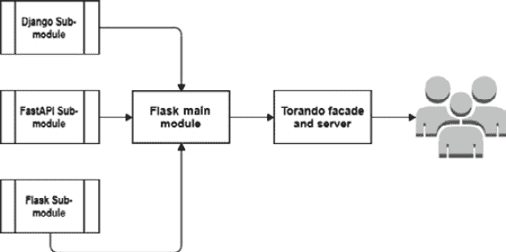
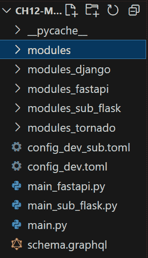
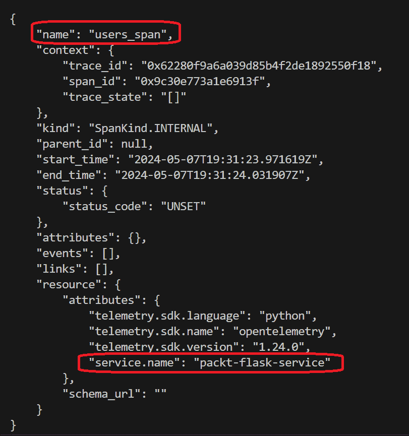
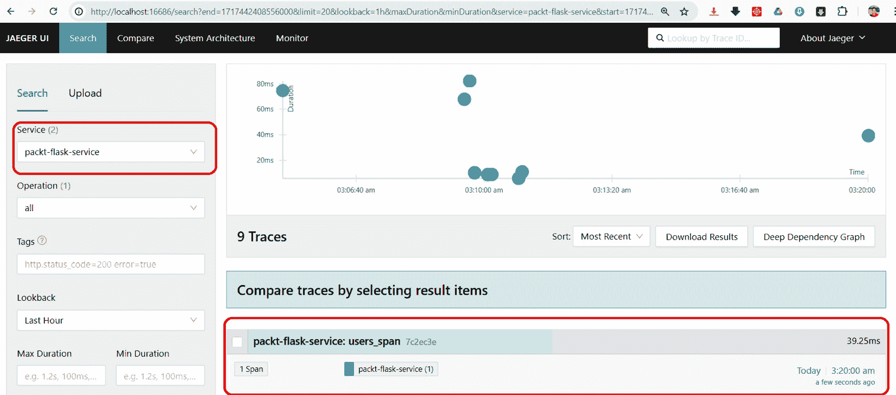
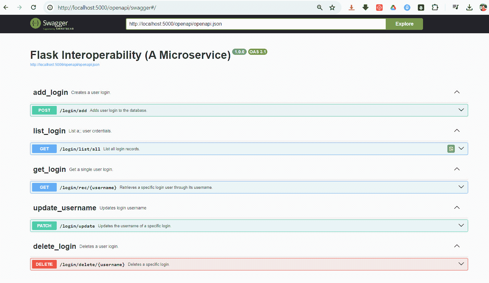
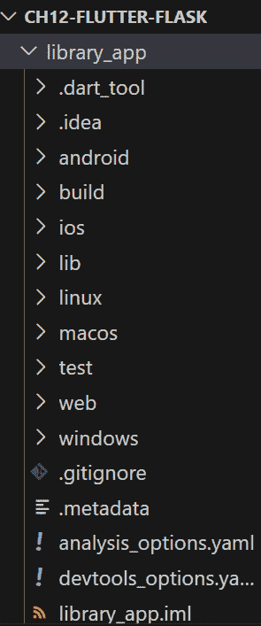
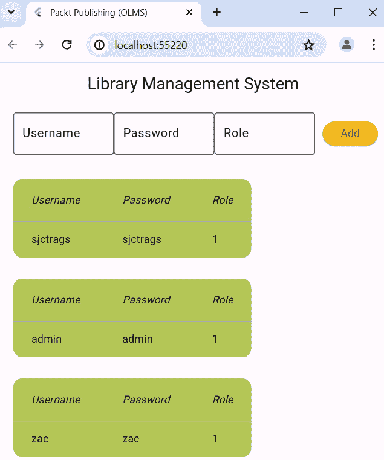
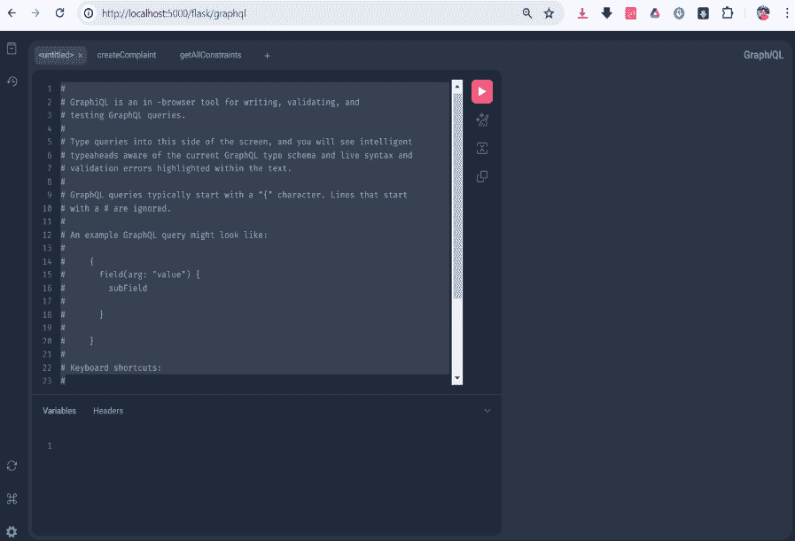
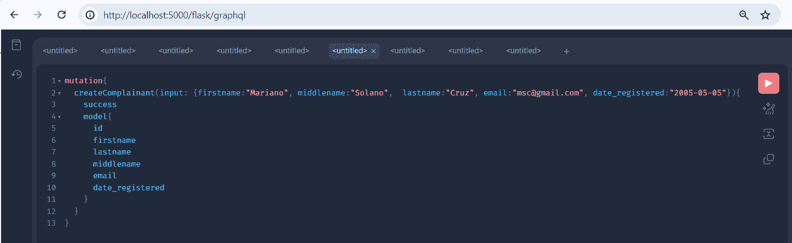
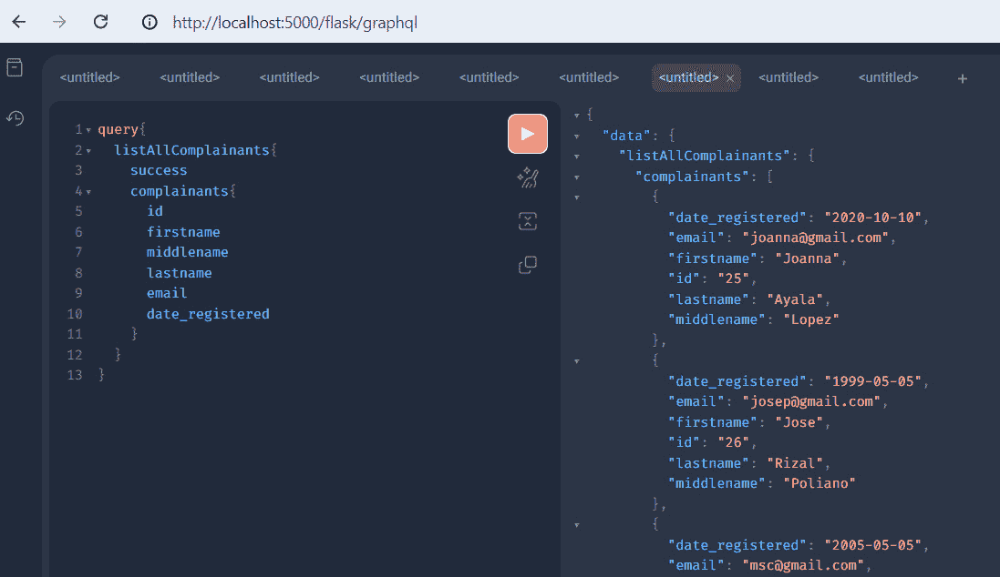

# <st c="0">12</st>

# <st c="3">将 Flask 与其他工具和框架集成</st>

<st c="53">Flask 的灵活性、无缝性和可插拔性为构建各种应用程序提供了便利，从简单的基于表单的咨询系统到基于 Docker 的应用程序。</st> *<st c="226">第 1</st> * <st c="236">章到</st> * <st c="240">第 10</st> * <st c="242">章展示了其简约但强大的框架，以及提供支持、快速解决方案和清洁编码的几个扩展模块和库，适用于 Web 和</st> <st c="407">API 应用程序。</st>

<st c="424">尽管 Flask 不像 Django 那样适合处理大型企业解决方案，但它可以作为许多企业级系统的中间件或组件，甚至可以成为构建微服务的良好解决方案。</st> <st c="644">Flask 的卓越灵活性使其成为许多软件基础设施和许多</st> <st c="760">业务流程的理想选择。</st>

<st c="779">为了清楚地说明 Flask 在流行 Python 框架列表中的位置，本章的目标是强调为移动和前端应用提供后端 Flask 实现的可行性，为微服务架构提供解决方案，以及通过 GraphQL 实现创建和运行查询以及 CRUD 事务的实施方案</st> <st c="1166">通过 GraphQL。</st>

<st c="1182">本章涵盖了以下主题：</st> <st c="1215">本章内容：</st>

+   <st c="1228">实现涉及 FastAPI、Django 和 Tornado 的微服务应用</st>

+   <st c="1306">实现</st> <st c="1320">Flask 仪表盘</st>

+   <st c="1341">使用 Swagger 应用 OpenAPI 3.x 规范</st> <st c="1377">与 Swagger</st>

+   <st c="1389">为 Flutter</st> <st c="1427">移动应用程序</st> 提供 REST 服务

+   <st c="1445">使用 React 应用程序消费 REST 端点</st> <st c="1478">React 应用程序</st>

+   <st c="1495">构建一个</st> <st c="1507">GraphQL 应用程序</st>

# <st c="1526">技术要求</st>

<st c="1549">本章使用一个</st> *<st c="1571">在线图书馆管理系统</st>* <st c="1603">来阐述构建一个微服务应用，该应用集成了</st> <st c="1672">FastAPI、Django 和 Flask 子应用程序，以 Tornado 作为前端应用程序和服务器。</st> <st c="1771">子应用程序使用不同的 URL 前缀进行挂载。</st> <st c="1834">以下是挂载的每个应用程序提供的服务：</st>

+   <st c="1900">Django 子模块 – 管理学生</st> <st c="1938">图书借阅者</st>

+   <st c="1952">Flask 子模块 – 管理教师</st> <st c="1989">图书浏览器</st>

+   <st c="2002">FastAPI 子模块 – 管理借阅者的反馈和投诉</st> <st c="2057">借阅者</st>

+   <st c="2071">Flask 主应用程序 – 核心事务</st> <st c="2101">核心事务</st>

+   <st c="2118">Tornado 应用程序 – 前端应用程序</st>

*<st c="2163">图 12</st>**<st c="2173">.1</st>* 展示了这些已安装应用程序的交易流程。



<st c="2346">图 12.1 – 结合 Django、Flask、FastAPI 和 Tornado 的应用程序</st>

<st c="2417">子模块</st> <st c="2433">使用**<st c="2438">SQLAlchemy</st>** <st c="2448">作为 ORM，而 Flask 主应用程序使用的是</st> <st c="2502">标准</st> **<st c="2512">Peewee</st>** <st c="2518">ORM。</st> <st c="2524">本章的所有项目都已上传至</st> [<st c="2573">https://github.com/PacktPublishing/Mastering-Flask-Web-Development/tree/main/ch12</st>](https://github.com/PacktPublishing/Mastering-Flask-Web-Development/tree/main/ch12)<st c="2654">。</st>

# <st c="2655">实现涉及 FastAPI、Django 和 Tornado 的微服务应用程序</st>

<st c="2733">Flask 3.x 提供了一个来自</st> *<st c="2787">Werkzeug</st>* <st c="2795">的</st> `<st c="2755">DispatcherMiddleware</st>` <st c="2775">类，它将隔离的和有效的基于 WSGI 的应用程序组合成一个完整且更大的系统。</st> <st c="2891">这些组合应用程序可以是所有 Flask 或不同的基于 WSGI 的应用程序，如 Django，每个都有独特的 URL 前缀。</st> *<st c="3020">图 12</st>**<st c="3029">.2</st>* <st c="3031">展示了我们</st> <st c="3069">组合项目</st> 的目录结构：



<st c="3313">图 12.2 – Django、FastAPI、Flask 和 Tornado 在一个项目结构中</st>

<st c="3387">主 Flask 应用程序的所有视图、存储库、服务、模型和配置文件都在</st> `<st c="3496">modules</st>` <st c="3503">文件夹中。</st> <st c="3512">另一方面，FastAPI 应用程序的所有应用程序文件都在</st> `<st c="3587">modules_fastapi</st>` <st c="3602">文件夹中，Django 应用程序的所有组件都在</st> `<st c="3655">modules_django</st>` <st c="3669">文件夹中，所有 Tornado API 处理程序都在</st> `<st c="3710">modules_tornado</st>`<st c="3725">，所有 GraphQL 组件都在</st> `<st c="3765">modules_sub_flask</st>` <st c="3782">目录中。</st>

<st c="3793">当涉及到它们各自的模块脚本时，FastAPI 的<st c="3856">app</st> <st c="3859">实例位于</st> `<st c="3875">main_fastapi.py</st>`<st c="3890">，Flask 子模块的<st c="3915">app</st> <st c="3918">实例位于</st> `<st c="3934">main_sub_flask.py</st>`<st c="3951">，而 Flask 主模块的<st c="3981">app</st> <st c="3984">实例以及 Tornado 服务器位于</st> `<st c="4033">main.py</st>`<st c="4040">。</st>

<st c="4041">现在，让我们讨论如何使用一个</st> <st c="4120">Tornado 服务器</st> <st c="4120">来运行所有这些子应用程序。</st>

## 添加 Flask 子应用程序

`<st c="4168">DispatcherMiddleware</st>` <st c="4189">需要</st> <st c="4198">一个 Flask</st> `<st c="4207">app</st>` <st c="4210">实例作为其第一个参数，以及一个包含子应用程序挂载点的字典，其中</st> *<st c="4313">键</st>* <st c="4316">是映射到相应 WSGI</st> `<st c="4371">app</st>` <st c="4374">实例的 URL 模式。</st> <st c="4385">将 Flask 子应用程序挂载到主 Flask 应用程序是直接的。</st> <st c="4465">以下代码片段展示了如何将</st> `<st c="4510">flask_sub_app</st>` <st c="4523">实例的 Flask 子应用程序挂载到核心 Flask</st> `<st c="4580">app</st>` <st c="4583">实例：</st>

```py
<st c="4593">(main_sub_flask.py)</st> from modules_sub_flask import create_app_sub
from flask_cors import CORS
… … … … … …
flask_sub_app = create_app_sub("../config_dev_sub.toml")
CORS(flask_sub_app) <st c="4776">(main.py)</st>
<st c="4785">from werkzeug.middleware.dispatcher import DispatcherMiddleware</st>
<st c="4849">from main_sub_flask import flask_sub_app</st> … … … … … …
from modules import create_app
app = create_app('../config_dev.toml')
… … … … … …
final_app = <st c="4996">DispatcherMiddleware</st>(<st c="5018">app</st>, {
    '/fastapi': ASGIMiddleware(fast_app),
    '/django': django_app, <st c="5086">'/flask': flask_sub_app</st> })
```

<st c="5112">Flask 子应用程序</st> <st c="5138">必须有一个为其</st> `<st c="5212">flask_sub_app</st>` <st c="5225">实例化</st> <st c="5212">专用的模块脚本（例如，</st> `<st c="5184">main_flask_sub.py</st>`<st c="5201">）。</st> `<st c="5241">main.py</st>` <st c="5248">必须从专用模块导入</st> `<st c="5265">flask_sub_app</st>` <st c="5278">实例，而不是在</st> `<st c="5339">main.py</st>` <st c="5346">中创建它，以便于追踪、易于调试和代码整洁。</st> <st c="5405">将 Flask 应用程序组合成更大的单元不需要额外的配置，这与向主上下文添加 FastAPI 应用程序不同。</st> <st c="5546">我们如何将 FastAPI 应用程序注册到</st> `<st c="5589">DispatcherMiddleware</st>`<st c="5609">中呢？</st>

## 添加 FastAPI 子应用程序

<st c="5644">并非所有基于 ASGI 的应用程序都与 Flask 的上下文兼容，并且可以成为</st> `<st c="5736">DispatcherMiddleware</st>` <st c="5756">挂载点的一部分。</st> <st c="5765">对于 FastAPI，解决方案是在运行时使用来自</st> `<st c="5873">a2wsgi</st>` <st c="5879">模块的</st> `<st c="5849">ASGIMiddleware</st>` <st c="5863">将</st> `<st c="5811">app</st>` <st c="5814">实例转换为 WSGI。</st> <st c="5888">要使用 ASGI 到 WSGI 转换器，首先使用以下</st> `<st c="5968">pip</st>` <st c="5971">命令安装</st> `<st c="5941">a2wsgi</st>` <st c="5947">：</st>

```py
 pip install a2wsgi
```

`<st c="5999">ASGIMiddleware</st>` <st c="6014">不依赖于许多外部模块，因此从其内置机制转换是直接的。</st> <st c="6124">它不会因为转换而消耗更多内存。</st> <st c="6176">但是，如果 FastAPI 应用程序有多个后台任务要执行，实用类有一个构造函数参数，</st> `<st c="6296">wait_time</st>`<st c="6305">，用于设置每个后台任务在请求完成之前允许运行的时间长度。</st> <st c="6413">此外，它的构造函数有一个</st> `<st c="6445">loop</st>` <st c="6449">参数，允许设置另一个事件循环，以防核心平台需要不同类型的事件循环。</st> <st c="6560">现在，以下</st> `<st c="6579">main.py</st>` <st c="6586">代码片段显示了如何将我们的 FastAPI</st> `<st c="6624">app</st>` <st c="6627">实例添加到</st> <st c="6644">挂载的应用程序：</st>

```py
 (main_fastapi.py)
from fastapi import FastAPI
from fastapi.middleware.cors import CORSMiddleware
from modules_fastapi.api import faculty
fast_app = FastAPI()
fast_app.include_router(faculty.router, prefix='/ch12')
fast_app.add_middleware(
    CORSMiddleware, allow_origins=['*'],
    allow_credentials=True, allow_methods=['*'], allow_headers=['*'])
(main.py)
from main_fastapi import fast_app
from a2wsgi import ASGIMiddleware
… … … … … …
final_app = DispatcherMiddleware(app, { <st c="7138">'/fastapi': ASGIMiddleware(fast_app),</st> '/django': django_app,
    '/flask': flask_sub_app
})
```

<st c="7225">`a2wsgi`</st> <st c="7236">模块</st> <st c="7244">与 FastAPI 应用程序配合得很好。</st> <st c="7287">并非所有基于 ASGI 的应用程序都可以像 FastAPI 应用程序一样与</st> `<st c="7357">a2wsgi</st>` <st c="7363">无缝转换。</st>

<st c="7382">现在让我们将我们的 Django 子模块添加到我们的</st> <st c="7427">挂载的应用程序。</st>

## <st c="7448">添加 Django 子应用程序</st>

<st c="7482">Django</st> <st c="7489">是一个纯 WSGI 框架，但可以通过额外的配置在 ASGI 服务器上运行。</st> <st c="7575">与 FastAPI 不同，将 Django 应用程序添加到挂载需要几个步骤，包括在</st> <st c="7706">main.py</st> <st c="7713">模块和 Django</st> <st c="7732">管理员的</st> `<st c="7740">settings.py</st>`<st c="7751">中的以下程序：</st>

1.  <st c="7753">由于</st> `<st c="7759">module_django</st>` <st c="7772">不是主项目文件夹，导入</st> `<st c="7816">os</st>` <st c="7818">模块并将</st> `<st c="7859">DJANGO_SETTINGS_MODULE</st>` <st c="7881">环境变量</st> <st c="7903">设置为</st> `<st c="7906">modules_django.modules_django.settings</st>`<st c="7944">：</st>

    ```py
     os.environ.setdefault('DJANGO_SETTINGS_MODULE', 'modules_django.modules_django.settings')
    ```

    <st c="8036">此设置定义了 Django 管理文件夹中</st> `<st c="8074">settings.py</st>` <st c="8085">的位置。</st> <st c="8114">未能调整此设置将导致以下</st> <st c="8172">运行时错误：</st>

    ```py
    <st c="8316">settings.py</st> with the Django directory name requires adjusting some package names in the Django project. Among the modifications is the change of <st c="8461">ROOT_URLCONF</st> in <st c="8477">settings.py</st> from <st c="8494">'modules_django.urls'</st> to <st c="8519">'modules_django.modules_django.urls'</st>.
    ```

1.  <st c="8556">将 Django 应用程序注册到</st> `<st c="8597">INSTALLED_APPS</st>` <st c="8611">设置中必须包含 Django</st> <st c="8645">项目名称：</st>

    ```py
     INSTALLED_APPS = [
        'django.contrib.admin',
        'django.contrib.auth',
        'django.contrib.contenttypes',
        'django.contrib.sessions',
        'django.contrib.messages',
        'django.contrib.staticfiles',
        'rest_framework',
        'corsheaders', <st c="8873">'modules_django.olms'</st> ]
    ```

1.  <st c="8896">此外，在定义 Django 应用程序对象时，包括 Django 项目文件夹</st> <st c="8978">在</st> `<st c="8981">settings.py</st>`<st c="8992">中：</st>

    ```py
     WSGI_APPLICATION = '<st c="9088">modules_django.olms</st>), import all the custom components with the project folder included. The following snippet shows the implementation of REST services that manage student borrowers using Django RESTful services and Django ORM:

    ```

    <st c="9317">(views.py)</st> from rest_framework.response import Response

    from rest_framework.decorators import api_view

    从 `<st c="9426">modules_django</st>.olms.serializer` 导入 BorrowedHistSerializer, StudentBorrowerSerializer

    从 `<st c="9519">modules_django</st>.olms.models` 导入 StudentBorrower, BorrowedHist

    @api_view(['GET'])

    def getData(request):

        app = StudentBorrower.objects.all()

        serializer = StudentBorrowerSerializer(app, many=True)

        return Response(serializer.data)

    @api_view(['POST'])

    def postData(request):

        serializer = StudentBorrowerSerializer(data=request.data)

        if serializer.is_valid():

            serializer.save()

            return Response(serializer.data)

        else:

            return Response({"message:error"})

    ```py

    ```

1.  由于我们正在将 Django 应用程序作为 WSGI 子应用程序进行挂载，请使用 `<st c="10088">os</st>` <st c="10090">模块将 `<st c="10043">DJANGO_ALLOW_ASYNC_UNSAFE</st>` <st c="10068">设置为`<st c="10072">false</st>` <st c="10077">：</st>

    ```py
     os.environ["DJANGO_ALLOW_ASYNC_UNSAFE"] = "true"
    ```

    设置此设置为 `<st c="10179">true</st>` <st c="10183">将导致此</st> <st c="10200">运行时异常：</st>

    ```py
    django.core.exceptions.SynchronousOnlyOperation: You cannot call this from an async context - use a thread or sync_to_async.
    ```

1.  最后，从 `<st c="10389">django.core.wsgi</st>` <st c="10405">模块导入 `<st c="10359">get_wsgi_application</st>` <st c="10379">并将其注册到 `<st c="10432">DispatcherMiddleware</st>`<st c="10452">。对于 Django 网络应用程序，从 `<st c="10518">django.contrib.staticfiles.handlers</st>` <st c="10553">模块导入 `<st c="10490">StaticFilesHandler</st>` <st c="10508">并将 `<st c="10574">get_wsgi_application()</st>`<st c="10596"> 返回的对象包装起来以访问静态网络文件（例如 CSS、<st c="10659">JS、图像）：</st>

    ```py
    <st c="10671">from django.core.wsgi import get_wsgi_application</st>
    <st c="10721">from django.contrib.staticfiles.handlers import StaticFilesHandler</st> … … … … … … <st c="10800">django_app = StaticFilesHandler(</st> <st c="10832">get_wsgi_application())</st> … … … … … …
    final_app = DispatcherMiddleware(app, {
        '/fastapi': ASGIMiddleware(fast_app), <st c="10946">'/django': django_app,</st> '/flask': flask_sub_app
    })
    ```

现在，在挂载 FastAPI、Django 和 Flask 子应用程序之后，是时候将主 Flask 应用程序挂载到 Tornado 服务器上了。

## 将所有内容与 Tornado 结合起来

尽管在生产服务器上使用 Gunicorn 运行 Flask 应用程序是理想的，但有时对于更注重事件驱动事务、WebSocket 和 **<st c="11403">服务器端事件</st>** <st c="11421">(**<st c="11423">SSE</st>**<st c="11426">) 的 Flask 项目，使用非阻塞的 Tornado 服务器是一个完美的选择。对于本章，我们的设计是将实现核心 *<st c="11525">在线图书馆管理系统</st>* <st c="11559">事务的主 Flask 应用程序挂载到 Tornado 应用程序上。顺便说一下，Tornado 是一个 Python 框架和异步网络库，其优势在于事件驱动、非阻塞和需要长时间连接到用户的长时间轮询事务。它包含一个内置的非阻塞 HTTP 服务器，与 FastAPI 不同。

<st c="11867">要在 Tornado 的 HTTP 服务器上运行一个</st> <st c="11876">兼容的 WSGI 应用程序，它</st> <st c="11934">有一个</st> `<st c="11940">WSGIContainer</st>` <st c="11953">实用类，该类封装了一个核心 Flask</st> `<st c="11992">app</st>` <st c="11995">实例并在非阻塞或异步</st> <st c="12066">服务器模式下运行应用程序。</st>

<st c="12078">重要提示</st>

<st c="12093">在撰写本书时，</st> `<st c="12130">Flask[async]</st>` <st c="12142">在 Tornado 服务器上挂载异步 HTTP 请求会抛出</st> `<st c="12207">SynchronousOnlyOperation</st>` <st c="12231">错误。</st> <st c="12239">因此，本章仅关注标准的 Flask 请求</st> <st c="12296">事务。</st>

<st c="12314">以下</st> <st c="12319">的</st> `<st c="12329">main.py</st>` <st c="12336">代码片段显示了我们的核心</st> `<st c="12378">Flask app</st>` <st c="12398">与 Tornado 服务器的集成：</st>

```py
<st c="12413">from tornado.wsgi import WSGIContainer</st>
<st c="12452">from tornado.web import FallbackHandler, Application</st> from tornado.platform.asyncio import AsyncIOMainLoop <st c="12559">from modules_tornado.handlers.home import MainHandler</st> import asyncio
… … … … … …
from modules import create_app
app = create_app('../config_dev.toml')
… … … … … …
final_app = DispatcherMiddleware(app, {
    '/fastapi': ASGIMiddleware(fast_app),
    '/django': django_app,
    '/flask': flask_sub_app
}) <st c="12850">main_flask = WSGIContainer(final_app)</st>
<st c="12887">application = Application([</st> (r"/ch12/tornado", MainHandler), <st c="12949">(r".*", FallbackHandler, dict(fallback=main_flask))</st>, <st c="13002">])</st> if __name__ == "__main__":
    loop = asyncio.get_event_loop() <st c="13064">application.listen(5000)</st> loop().run_forever()
```

<st c="13109">Tornado</st> <st c="13121">不是一个 WSGI 应用程序，也不是线程安全的。</st> <st c="13168">它使用一个</st> <st c="13180">线程来管理一次一个进程。</st> <st c="13220">它是一个为事件驱动应用程序设计的框架，内置的服务器用于运行非阻塞 I/O 套接字。</st> <st c="13346">但是，现在它可以直接使用</st> `<st c="13375">asyncio</st>` <st c="13382">来异步运行我们的挂载应用程序，以替代</st> `<st c="13448">IOLoop</st>` <st c="13455">用于事件。</st> <st c="13467">在给定的代码片段中，我们的 Tornado 和主 Flask 应用程序使用通过</st> `<st c="13540">asyncio</st>` <st c="13547">平台获取的主事件循环</st> `<st c="13596">get_event_loop()</st>`<st c="13612">运行。</st> <st c="13669">顺便说一下，我们的完整系统有一个 Tornado 处理程序，</st> `<st c="13669">MainHandler</st>`<st c="13680">，位于</st> `<st c="13685">modules_tornado</st>` <st c="13700">中，用于以</st> <st c="13735">JSON</st> 格式显示欢迎信息。</st>

<st c="13747">此时，由于挂载了不同的 WSGI 和 ASGI 应用程序，我们的应用程序已经变得复杂，因此它需要一个名为</st> **<st c="13907">仪表化</st>** <st c="13922">的微服务机制来</st> <st c="13926">监控每个挂载应用程序的低级行为并捕获低级指标，例如数据库相关的日志、内存使用情况以及特定库的日志和问题。</st>

# <st c="14097">实现 Flask 仪表化</st>

<st c="14132">仪表化是一种</st> <st c="14154">机制，用于生成、收集和导出有关应用程序、微服务或分布式设置的运行时诊断数据。</st> <st c="14292">通常，这些可观察数据包括跟踪、日志和指标，可以提供对系统的理解。</st> <st c="14406">在实现仪表化的许多方法中，</st> `<st c="14669">pip</st>` <st c="14672">命令：</st>

```py
 pip install opentelemetry-api opentelemetry-sdk opentelemetry-instrumentation-flask opentelemetry-instrumentation-requests
```

`<st c="14804">以下</st>` `<st c="14819">片段添加到` `<st c="14840">create_app()</st>` `<st c="14852">工厂函数中，位于` `<st c="14868">__init__.py</st>` `<st c="14879">的主 Flask 应用程序中，提供了基于控制台的监控：</st>`

```py
 from opentelemetry import trace
from opentelemetry.sdk.resources import Resource
from opentelemetry.sdk.trace import TracerProvider
from opentelemetry.sdk.trace.export import BatchSpanProcessor
from opentelemetry.sdk.trace.export import ConsoleSpanExporter
from opentelemetry.sdk.resources import SERVICE_NAME, Resource
from opentelemetry.instrumentation.flask import FlaskInstrumentor
def create_app(config_file):
    provider = TracerProvider(resource= Resource.create({SERVICE_NAME: "<st c="15437">packt-flask-service</st>"}))
    processor = BatchSpanProcessor(ConsoleSpanExporter())
    provider.add_span_processor(processor)
    trace.set_tracer_provider(provider)
    global tracer
    tracer = trace.get_tracer("<st c="15633">packt-flask-tracer</st>")
    app = OpenAPI(__name__, info=info)
    … … … … … … <st c="15703">FlaskInstrumentor(app).instrument(</st><st c="15737">enable_commenter=True, commenter_options={})</st> … … … … … …
```

`<st c="15793">OpenTelemetry</st>` `<st c="15807">要求 Flask 应用程序设置由` `<st c="15879">TracerProvider</st>` `<st c="15893">`、` `<st c="15895">Tracer</st>` `<st c="15901">`和` `<st c="15907">Span</st>` `<st c="15911">(s)</st>` `<st c="15917">组成的追踪 API。</st> `<st c="15938">TracerProvider</st>` `<st c="15952">是 API 的入口点和创建追踪器的注册表。</st> `<st c="16027">追踪器负责创建跨度。</st> `<st c="16071">另一方面，跨度是一个 API，可以监控应用程序的任何部分。</st>

在实例化`<st c="16152">TracerProvider</st>`之后，创建追踪器的一部分设置是应用`<st c="16238">Batch</st>` **<st c="16243">SpanProcessor</st>**，它将批处理跨度在导出到另一个系统、工具或后端之前进行预处理。</st> <st c="16357">它在其构造函数参数中需要一个特定的导出器类，例如`<st c="16433">ConsoleSpanExporter</st>`<st c="16452">，它将跨度发送到控制台。</st> <st c="16491">为了完成`<st c="16507">TracerProvider</st>`的设置，使用其`<st c="16586">add_span_processor()</st>` <st c="16606">方法将处理器添加到`<st c="16554">TracerProvider</st>` <st c="16568">对象中。</st>

`<st c="16614">最后，从` `<st c="16661">opentelemetry</st>` `<st c="16674">模块导入跟踪 API 对象，并调用其` `<st c="16697">set_tracer_provider()</st>` `<st c="16718">类方法来设置创建的` `<st c="16751">TracerProvider</st>` `<st c="16765">实例。</st> `<st c="16776">要提取` `<st c="16791">tracer</st>` `<st c="16797">对象，调用其` `<st c="16817">get_tracer()</st>` `<st c="16829">方法并指定其名称，例如` `<st c="16864">` `<st c="16867">packt-flask-tracer</st>` `<st c="16885">`。</st>

`<st c="16886">现在，在任何地方导入</st>` `<st c="16903">tracer</st>` `<st c="16909">对象。</st> `<st c="16950">以下模块脚本导入` `<st c="16990">tracer</st>` `<st c="16996">对象以监控` `<st c="17019">add_login()</st>` `<st c="17030">端点：</st>`

```py
<st c="17040">from modules import tracer</st> @current_app.post("/login/add)
def add_login(): <st c="17116">with tracer.start_as_current_span('users_span'):</st> login_json = request.get_json()
        repo = LoginRepository()
        result = repo.insert_login(login_json)
        if result == False:
            return jsonify(message="error"), 500
        else:
            return jsonify(record=login_json)
```

<st c="17357">调用</st> `<st c="17371">start_as_current_span()</st>` <st c="17394">方法创建一个</st> `<st c="17407">tracer</st>` <st c="17413">对象，创建一个跟踪内的单个操作，即跨度。</st> <st c="17472">对于更大的系统，跨度可以嵌套以形成一个跟踪树，以便进行详细的监控。</st> <st c="17558">嵌套跟踪包含一个根跨度，通常描述了</st> <st c="17625">上层操作，以及一个或多个子跨度来描述其下层操作。</st> *<st c="17708">图 12</st>**<st c="17717">.3</st>* <st c="17719">显示了运行</st> `<st c="17760">add_login()</st>` <st c="17771">端点后的控制台日志：</st>



<st c="18272">图 12.3 – 导出至控制台的 tracer 日志</st>

<st c="18322">此外，Jaeger，一个分布式跟踪</st> <st c="18367">平台，可以将跟踪中的所有日志以图形视图进行可视化。</st> <st c="18391">OpenTelemetry 有一个导出类，可以在预处理后将跨度导出到 Jaeger 平台。</st> <st c="18439">但是首先，通过其 Docker 镜像或二进制文件安装 Jaeger。</st> <st c="18545">在本章中，我们通过其二进制文件中的</st> `<st c="18672">jaeger-all-in-one.exe</st>` <st c="18693">命令启动 Jaeger 服务器。</st>

<st c="18720">然后，使用以下</st> `<st c="18799">pip</st>` <st c="18802">命令安装 Jaeger 支持的 OpenTelemetry 模块：</st>

```py
 pip install opentelemetry-exporter-jaeger
```

<st c="18853">安装完成后，将以下片段添加到</st> `<st c="18947">create_app()</st>` <st c="18959">工厂中的先前 OpenTelemetry 设置：</st>

```py
<st c="18968">from opentelemetry.exporter.jaeger.thrift import JaegerExporter</st> … … … … … …
    trace.set_tracer_provider(provider) <st c="19080">jaeger_exporter = JaegerExporter(agent_host_name= "localhost", agent_port=6831,)</st><st c="19160">trace.get_tracer_provider().add_span_processor( BatchSpanProcessor(jaeger_exporter))</st> global tracer
    tracer = trace.get_tracer("packt-flask-tracer")
    … … … … … …
```

`<st c="19319">JaegerExporter</st>` <st c="19334">将跟踪发送到通过 HTTP 协议运行的 Thrift 服务器。</st> <st c="19406">导出类的构造函数参数都是关于 Thrift 服务器服务器细节的。</st> <st c="19510">在我们的案例中，</st> `<st c="19523">agent_host_name</st>` <st c="19538">是</st> `<st c="19542">localhost</st>` <st c="19551">，而</st> `<st c="19556">agent_port</st>` <st c="19566">是</st> `<st c="19570">6831</st>`<st c="19574">。</st>

<st c="19575">重启 Tornado</st> <st c="19595">服务器，运行监控的 API，并使用浏览器打开</st> `<st c="19661">http://localhost:16686/</st>` <st c="19684">以检查跟踪。</st> *<st c="19724">图 12</st>**<st c="19733">.4</st>* <st c="19735">显示了搜索</st> **<st c="19746">搜索</st>** <st c="19752">四个跟踪后的 Jaeger 仪表板的</st> **<st c="19798">搜索</st>** <st c="19752">页面：</st>



<st c="20346">图 12.4 – Jaeger 对跨度跟踪的搜索结果</st>

Jaeger 的左侧部分是`packt-flask-service`，当时搜索时提供了四个搜索结果。</st> 在仪表板的右侧部分是搜索结果列表，列出了监控所执行事务的跨度产生的跟踪。</st> 点击每一行都会以图形格式显示跟踪详情。</st> 另一方面，页眉部分的图形总结了在指定时间段内的所有跟踪。</st>

`<st c="20895">现在让我们探索如何将 OpenAPI 3.x 文档添加到我们</st> <st c="20980">Flask 应用程序的 API 端点。</st>

# `<st c="20998">使用 Swagger 应用 OpenAPI 3.x 规范</st>

`<st c="21046">除了</st>` <st c="21052">仪器化之外，一些解决方案提供了格式良好的 API 文档，例如 FastAPI。</st> <st c="21079">这些解决方案之一是使用`<st c="21180">flask_openapi3</st>`<st c="21194">，它将 OpenAPI 3.x 规范应用于实现 Flask 组件，并使用 Swagger、ReDoc、</st> <st c="21318">和 RapiDoc 来记录 API 端点。</st>

`<st c="21330">flask_openapi3</st>` <st c="21345">不是 Flask 的库或依赖模块，而是一个基于当前 Flask 3.x 的独立框架，使用`<st c="21458">pydantic</st>` <st c="21466">模块来支持 OpenAPI 文档。</st> <st c="21508">它还支持`<st c="21525">Flask[async]</st>` <st c="21537">组件。</st>

`<st c="21549">在</st> <st c="21567">flask_openapi3</st>` <st c="21581">使用`<st c="21592">pip</st>` <st c="21595">命令安装后，将`<st c="21617">Flask</st>` <st c="21622">类替换为`<st c="21634">OpenAPI</st>` <st c="21641">和`<st c="21646">Blueprint</st>` <st c="21655">替换为`<st c="21661">APIBlueprint</st>`<st c="21673">。这些仍然是原始的 Flask 类，但增加了添加 API 文档的功能。</st> <st c="21768">以下是我们</st> `<st c="21789">create_app()</st>` <st c="21801">工厂方法</st> <st c="21809">，它使用`<st c="21857">OpenAPI</st>` <st c="21864">创建应用程序对象，并添加了</st> <st c="21913">文档组件：</st>

```py
<st c="21938">from flask_openapi3 import Info</st>
<st c="21970">from flask_openapi3 import OpenAPI</st> … … … … … … <st c="22017">info = Info(title="Flask Interoperability (A</st> <st c="22061">Microservice)", version="1.0.0")</st> … … … … … …
def create_app(config_file):
    … … … … … … <st c="22147">app = OpenAPI(__name__, info=info)</st> app.config.from_file(config_file, toml.load)
    cors = CORS(app)
    app.config['CORS_HEADERS'] = 'Content-Type'
    … … … … … …
```

`<st c="22299">The</st>` `<st c="22304">Info</st>` <st c="22308">实用程序类提供了 OpenAPI 文档的项目标题。</st> <st c="22380">它的实例是 OpenAPI 构造函数参数值的一部分。</st>

`<st c="22448">要记录 API，请添加端点的摘要、API 事务的完整描述、标签、请求字段描述和响应细节。</st> <st c="22603">以下代码片段显示了`<st c="22661">list_login()</st>` <st c="22673">端点的简单文档：</st>

```py
<st c="22683">from flask_openapi3 import Tag</st>
<st c="22714">list_login_tag = Tag(name="list_login", description="List all user credentials.")</st> … … … … … …
@current_app.get("/login/list/all", <st c="22844">summary="List all login records.", tags=[list_login_tag]</st>)
def list_login(): <st c="22921">"""</st><st c="22924">API for retrieving all the records from the olms database.</st><st c="22983">"""</st> with tracer.start_as_current_span('users_span'):
        repo = LoginRepository()
        result = repo.select_all_login()
        print(result)
        return jsonify(records=result)
```

<st c="23139">OpenAPI 的 HTTP 方法装饰器允许额外的</st> <st c="23149">参数，例如描述 API 端点的摘要和标签。</st> <st c="23195">`Tags` <st c="23261">类是一个</st> `<st c="23265">flask_openapi3</st>` <st c="23269">实用工具，它能够为端点创建标签。</st> <st c="23281">端点可以与一系列标签对象相关联。</st> <st c="23355">另一方面，放置在 API 函数第一行的文档注释成为 API 实现的完整和详细描述。</st> <st c="23557">API 实现。</st>

<st c="23576">现在，使用</st> `<st c="23607">flask_openapi3</st>` <st c="23621">框架的应用程序有一个额外的端点，</st> `<st c="23660">/openapi/swagger</st>`<st c="23676">，当在网页浏览器上运行时，将渲染 Swagger 文档，如图</st> *<st c="23767">图 12</st>**<st c="23776">.5</st>*<st c="23778">所示：</st>



<st c="24388">图 12.5 – Flask 中的 OpenAPI/Swagger 文档</st>

<st c="24443">只要</st> `<st c="24455">flask-openapi3</st>` <st c="24469">保持最新并与 Flask 版本同步，它就是一个有用且可行的解决方案，用于使用 OpenAPI/Swagger 实现文档的 Flask 应用程序。</st> <st c="24653">该框架可以提供可接受和标准的 API</st> <st c="24707">文档，而无需在</st> `<st c="24772">main.py</st>`<st c="24779">中进行额外的 YAML 或 JSON 配置。</st>

<st c="24780">在下一节中，让我们讨论我们的 Flask 应用程序如何以 Python 平台之外的方式提供服务，从</st> <st c="24914">移动开发</st> <st c="24914">开始。</st>

# <st c="24933">为 Flutter 移动应用程序提供 REST 服务</st>

<st c="24989">Flask 应用程序可以成为许多流行移动平台（如 Flutter）的潜在后端 API 服务提供商。</st> <st c="25109">Flutter</st> <st c="25116">是由 Google 创建的开源移动工具包，旨在为移动平台提供商业上可接受的本地编译应用程序。</st> <st c="25258">它可以作为我们</st> <st c="25303">微服务应用程序的前端框架。</st>

<st c="25329">要启动 Flutter，下载最新的 Flutter SDK 版本 – 在我的案例中，对于 Windows，从</st> <st c="25419">以下</st> [<st c="25424">https://docs.flutter.dev/release/archive?tab=windows</st>](https://docs.flutter.dev/release/archive?tab=windows) <st c="25476">下载站点。</st> <st c="25492">将文件解压到您的开发目录，并在 Windows</st> <st c="25584">全局类路径中注册</st> `<st c="25550">%FLUTTER_HOME%\bin</st>` <st c="25568">。</st>

<st c="25601">之后，从[<st c="25653">https://developer.android.com/studio</st>](https://developer.android.com/studio)<st c="25689">下载最新的 Android Studio。然后，打开新安装的 Android Studio 并转到</st> **<st c="25747">工具</st>** <st c="25752">|</st> **<st c="25755">SDK 管理器</st>** <st c="25766">以安装以下组件：</st>

+   <st c="25803">Android SDK 平台，最新的</st> <st c="25837">API 版本</st>

+   <st c="25848">Android SDK</st> <st c="25861">命令行工具</st>

+   <st c="25879">Android SDK</st> <st c="25892">构建工具</st>

+   <st c="25903">Android SDK</st> <st c="25916">平台工具</st>

+   <st c="25930">Android 模拟器</st>

<st c="25947">在成功更新 Android SDK 和安装 SDK 组件后，打开终端并执行以下步骤进行</st> <st c="26079">Flutter 诊断：</st>

1.  <st c="26099">在终端上运行</st> `<st c="26108">flutter doctor</st>` <st c="26122">命令。</st>

1.  <st c="26147">在开发之前，所有设置和工具都必须满足。</st> <st c="26213">在这个安装阶段不应该有任何问题。</st>

1.  <st c="26273">使用带有 Flutter 扩展的 VS Code 编辑器创建一个 Flutter 项目；它应该具有</st> *<st c="26403">图 12</st>**<st c="26412">.6</st>*<st c="26414">中展示的项目结构：</st>



<st c="26629">图 12.6 – 我们的 ch12-flutter-flask 项目</st>

<st c="26673">在</st> `<st c="26681">/lib/olms/provider</st>`<st c="26699">中，</st> `<st c="26701">providers.dart</st>` <st c="26715">实现了消耗</st> <st c="26756">HTTP</st> `<st c="26766">GET</st>` <st c="26769">和</st> `<st c="26774">POST</st>` <st c="26778">的我们的</st> `<st c="26785">APIs</st> <st c="26789">用户管理的事务。</st> <st c="26812">以下是我们的</st> `<st c="26825">dart</st>` <st c="26829">服务提供者的代码：</st>

```py
 import 'dart:convert';
import 'package:flutter/material.dart';
import 'package:http/http.dart' as http;
import 'package:library_app/olms/models/login.dart';
class LoginProvider with ChangeNotifier{
  List<Login> _items = [];
  List<Login> get items {
    return [..._items];
  }
  Future<void> addLogin(String username, String password, String role ) async { <st c="27210">String url = 'http://<actual IP address>:5000/login/add';</st> try{
      if(username.isEmpty || password.isEmpty || role.isEmpty){
         return;
      }
      Map<String, dynamic> request = {"username": username, "password": password, "role": int.parse(role)};
      final headers = {'Content-Type': 'application/json'}; <st c="27497">final response = await http.post(Uri.parse(url), headers: headers, body: json.encode(request));</st> Map<String, dynamic> responsePayload = json.decode(response.body);
      final login = Login(
          username: responsePayload["username"],
          password: responsePayload["password"],
          role: responsePayload["role"]
      );
      print(login);
      notifyListeners();
    }catch(e){
      print(e);
    }
  }
```

<st c="27849">给定的</st> `<st c="27860">addLogin()</st>` <st c="27870">消耗了</st> `<st c="27879">的</st> `<st c="27884">add_login()</st>` <st c="27895">API</st> <st c="27900">从我们的 Flask</st> `<st c="27915">微服务应用：</st>

```py
 Future<void> get getLogin async { <st c="27967">String url = 'http://<actual IP address>:5000/login/list/all';</st> var response;
    try{ <st c="28049">response = await http.get(Uri.parse(url));</st><st c="28091">Map body = json.decode(response.body);</st> List<Map> loginRecs = body["records"].cast<Map>();
      print(loginRecs);
      _items = loginRecs.map((e) => Login(
          id: e["id"],
          username: e["username"],
          password: e["password"],
          role: e["role"],
      )
      ).toList();
    }catch(e){
      print(e);
    }
    notifyListeners();
  }
}
```

<st c="28376">在</st> `<st c="28381">登录</st>` <st c="28386">模型类</st> <st c="28399">中提到的代码是一个</st> <st c="28426">Flutter 类，该类将</st> `<st c="28449">addLogin()</st>` <st c="28459">和</st> `<st c="28464">getLogin()</st>` <st c="28474">提供者事务映射到 Flask API 端点的 JSON 记录。</st> <st c="28556">以下是从</st> `<st c="28583">Login</st>` <st c="28588">模型类派生出的 Flutter 的</st> `<st c="28618">ch12-microservices-interop</st>`<st c="28644">的 SQLAlchemy</st> `<st c="28659">模型层：</st>

```py
<st c="28671">(/lib/olms/models/login.dart</st> class Login{
  int? id;
  String username;
  String password;
  int role;
  Login({ required this.username, required this.password, required this.role, this.id=0});
}
```

<st c="28857">现在，给定的</st> `<st c="28873">getLogin()</st>` <st c="28883">从我们的</st> `<st c="28898">登录</st>` <st c="28903">记录中检索 JSON 格式的记录，这些记录来自我们的</st> `<st c="28936">list_login()</st>` <st c="28948">端点函数。</st> <st c="28968">请注意，Flutter 需要主服务器的实际 IP 地址来访问 API</st> *<st c="29001">端点资源</st>* <st c="29018">。</st>

<st c="29092">以下</st> `<st c="29097">/lib/olms/tasks/task.dart</st>` <st c="29122">文件实现了表单小部件及其对应的事件，这些事件调用这两个服务方法。</st> <st c="29224">实现的部分展示了</st> `<st c="29275">登录</st>` <st c="29280">表单：</st>

```py
<st c="29286">(/lib/olms/tasks/task.dart)</st> … … … … … … <st c="29326">class _TasksWidgetState extends State<LoginViewWidget> {</st> … … … … … …
  @override
  Widget build(BuildContext context) {
    return Padding(
    … … … … … …
        children: [
          Row(
            children: [
              Expanded(
                child: TextFormField(
                  controller: userNameController,
                  decoration: const InputDecoration(
                    labelText: 'Username',
                    border: OutlineInputBorder(),
                  ),
              … … … … … …
              Expanded(
                child: TextFormField(
                  … … … … … …
                    labelText: 'Password',
                    border: OutlineInputBorder(),
                  ),
                ),
              ),
              Expanded(
                child: TextFormField(
                    … … … … … …
                    labelText: 'Role',
                    border: OutlineInputBorder(),
                  ),
              … … … … … …
              const SizedBox(width: 10,),
              ElevatedButton(
                  … … … … … …
                  child: const Text("Add"),
                  onPressed: () {
                    Provider.of<LoginProvider>(context, listen: false).addLogin(userNameController.text, passwordController.text, roleController.text);
                    … … … … … …
                  }
              )
            ],
          ),
```

<st c="30130">一般来说，</st> `<st c="30143">LoginViewWidget</st>` <st c="30158">组件</st> <st c="30168">返回一个由两个子小部件组成的`<st c="30179">Padding</st>` <st c="30186">小部件。</st> <st c="30223">前面的代码渲染了一个包含三个`<st c="30277">TextFormField</st>` <st c="30290">小部件的水平表单，这些小部件将接受用户的登录详情，以及一个`<st c="30351">ElevatedButton</st>` <st c="30365">小部件，该小部件将触发`<st c="30388">add_login()</st>` <st c="30399">提供者事务以调用我们的 Flask</st> `<st c="30441">/login/add</st>` <st c="30451">端点。</st> <st c="30462">以下代码显示了`<st c="30504">LoginViewWidget</st>` <st c="30519">的下一部分，该部分渲染了从我们的数据库中获取的`<st c="30545">登录</st>` <st c="30550">记录列表：</st>

```py
 … … … … … …
FutureBuilder(future: Provider.of<LoginProvider>(context, listen: false).getLogin,
       builder: (ctx, snapshot) =>
         snapshot.connectionState == ConnectionState.waiting
          ? const Center(child: CircularProgressIndicator())
          : Consumer<LoginProvider>(
              … … … … … …
              builder: (ctx, loginProvider, child) =>
                … … … … … …
                    Container(
                    … … … … … … …
                      child: SingleChildScrollView(
                        scrollDirection: Axis.horizontal,
                            child: DataTable(
                              columns: <DataColumn>[
                                 DataColumn(
                                  label: Text(
                                    'Username',
                                    style:
                                        … … … … … …
                                ),
                                DataColumn(
                                  label: Text(
                                    'Password',
                                    style:
                                 … … … … … …
                                ),
                                DataColumn(
                                  label: Text(
                                    'Role',
                                … … … … … …
                                ),],
                         rows: <DataRow>[
                           DataRow(cells: <DataCell>[
                             DataCell(Text( loginProvider. items[i].username)),
                             DataCell(Text(loginProvider. items[i].password)),
                             DataCell(Text(loginProvider. items[i].role.toString())),
                                  ],
                             … … … … … …
```

<st c="31408">前面的代码</st> <st c="31427">渲染了一个</st> `<st c="31438">FutureWidget</st>` <st c="31450">组件</st>，该组件由`<st c="31473">ListView</st>` <st c="31481">中的`<st c="31485">DataColumn</st>` <st c="31495">和`<st c="31500">DataRow</st>` <st c="31507">小部件组成，用于展示从我们的 Flask</st> `<st c="31561">/login/list/all</st>` <st c="31576">端点获取的</st> `<st c="31532">登录</st>` <st c="31537">记录。</st> <st c="31587">它有一个由其`<st c="31631">SingleChildScrollView</st>` <st c="31653">小部件渲染的垂直滚动条。</st> *<st c="31661">图 12</st>**<st c="31670">.7</st>* <st c="31672">显示了运行我们的</st> `<st c="31732">ch12-flask-flutter</st>` <st c="31750">应用程序后得到的</st> `<st c="31693">LoginViewWidget</st>` <st c="31708">表单，使用的是在`<st c="31804">/</st>``<st c="31805">library_app</st>` <st c="31816">目录内执行的`<st c="31773">flutter run</st>` <st c="31784">命令。</st>



<st c="31921">图 12.7 – 用于登录事务的 Flutter 表单</st>

<st c="31972">除了移动开发之外，Flask API</st> <st c="31987">还可以为流行的前端框架，如 React 提供数据服务。</st> <st c="32097">让我们在下一节中看看如何实现。</st>

# <st c="32132">使用 React 应用程序消费 REST 端点</st>

<st c="32182">React</st> <st c="32188">是一个流行的前端服务器端 JavaScript 库，用于构建网站的可扩展用户界面，主要用于</st> **<st c="32302">单页应用程序</st>** <st c="32326">(</st>**<st c="32328">SPAs</st>**<st c="32332">)。</st> <st c="32336">它是一个流行的库，用于渲染页面，该页面在</st> <st c="32383">不重新加载</st> <st c="32420">页面的情况下改变其状态。</st>

<st c="32429">使用</st> `<st c="32447">create-react-app</st>` <st c="32471">命令创建 React 项目后，我们的</st> `<st c="32501">ch12-react-flask</st>` <st c="32517">应用程序实现了以下功能组件来构建表单页面和列出所有在线图书馆管理系统教员借阅者的表格：</st>

```py
 export const FacultyBorrowers =(props)=>{
    const [id] = React.useState(0);
    const [firstname, setFirstname] = React.useState('');
    const [lastname, setLastname] = React.useState('');
    const [empid, setEmpid] = React.useState('');
    const [records, setRecords] = React.useState([]);
```

<st c="32969">给定的</st> `<st c="32980">useState()</st>` <st c="32990">钩子方法定义了表单组件在提交详细信息到</st> `<st c="33123">add_faculty_borrower()</st>` <st c="33145">API 端点之前将使用的状态变量：</st>

```py
 React.useEffect(() => {
        const url_get = 'http://localhost:5000/fastapi/ ch12/faculty/borrower/list/all';
        fetch(url_get)
        .then((response) =>  response.json() )
        .then((json) =>  { setRecords(json)})
        .catch((error) => console.log(error));
      }, []);
    const addRecord = () =>{
         const url_post = 'http://localhost:5000/fastapi/ ch12/faculty/borrower/add';
         const options = {
            method: 'POST',
            headers:{
                'Content-Type': 'application/json'
            },
            body: JSON.stringify(
                {
                'id': id,
                'firstname': firstname,
                'lastname': lastname,
                'empid': empid
                }
            )
        }
         fetch(url_post, options)
            .then((response) => { response.json() })
            .then((json) => { console.log(json)})
            .catch((error) => console.log(error));
            const url_get = 'http://localhost:5000/fastapi/ ch12/faculty/borrower/list/all';
            fetch(url_get)
            .then((response) =>  response.json() )
            .then((json) =>  { setRecords(json)})
            .catch((error) => console.log(error));
    }
```

<st c="34072">在将 JSON 数据提交到</st> `<st c="34175">add_faculty_borrower()</st>` <st c="34197">API 端点之前，</st> `<st c="34077">addRecord()</st>` <st c="34088">事件</st> <st c="34095">方法会从状态变量中形成 JSON 数据。</st> <st c="34212">同样，它通过同一</st> `<st c="34295">list_all_faculty_borrowers()</st>` <st c="34323">端点从微服务中检索所有教员借阅者。</st>

```py
 return <div>
      <form id='idForm1' <st c="34402">onSubmit={ addRecord }</st>>
        Employee ID: <input type='text' <st c="34459">onChange={ (e) => {setEmpid(e.target.value)}}</st> /><br/>
        First Name: <input type='text' <st c="34544">onChange={ (e) => {setFirstname(e.target.value) }}</st> /><br/>
        Last Name: <input type='text' <st c="34633">onChange={ (e) => {setLastname(e.target.value)}}</st>/><br/>
        <input type='submit' value='ADD Faculty Borrower'/>
            </form>
            <br/>
            <h2>List of Faculty Borrowers</h2>
            <table >
              <thead>
                  <tr><th>Id</th>
                      <th>Employee ID</th>
                      <th>First Name</th>
                      <th>Last Name</th>
              </tr></thead>
              <tbody> <st c="34906">{records.map((u) => (</st> <tr>
                    <td>{u.id}</td>
                    <td>{u.empid}</td>
                    <td>{u.firstname}</td>
                    <td>{u.lastname}</td>
                  </tr>
                ))}
            </tbody></table>
        </div>}
```

<st c="35047">在数据库中添加一个新的教员借阅记录后，</st> `<st c="35052">records.map()</st>` <st c="35065">函数构建了记录表。</st> `<st c="35163">addRecord()</st>`<st c="35174">，借助</st> `<st c="35197">useEffect()</st>` <st c="35208">钩子方法，从</st> `<st c="35256">list_all_faculty_borrowers()</st>` <st c="35284">API 中捕获所有记录，并将 JSON 格式的数据列表存储到状态</st> <st c="35344">变量</st> `<st c="35355">records</st>`<st c="35362">中。</st>

<st c="35363">除了为其他平台构建服务提供商之外，Flask 还可以构建用于轻松 CRUD 操作的 GraphQL 应用。</st> <st c="35491">让我们在下一讨论中了解它。</st>

# <st c="35535">构建 GraphQL 应用</st>

<st c="35566">GraphQL 是一种</st> <st c="35578">机制，它提供了一个平台无关的 CRUD 事务，无需指定实际的数据库连接细节和数据库方言。</st> <st c="35748">此机制以模型为中心或以数据为中心，并关注用户通过后端</st> <st c="35864">API 实现想要获取的数据。</st>

<st c="35884">我们设计的</st> <st c="35910">Flask 子应用程序</st> <st c="36027">是一个 GraphQL 应用程序，具有以下 HTTP GET 端点，用于创建 GraphQL</st> <st c="36027">UI 探索器：</st>

```py
<st c="36039">from ariadne.explorer import ExplorerGraphiQL</st> … … … … … … <st c="36097">flask_sub_app = create_app_sub("../config_dev_sub.toml")</st> CORS(flask_sub_app) <st c="36174">explorer_html = ExplorerGraphiQL().html(None)</st>
<st c="36219">@flask_sub_app.route("/graphql", methods=["GET"])</st> def graphql_explorer():
    return explorer_html, 200
```

<st c="36319">我们的解决方案</st> <st c="36333">使用了</st> `<st c="36342">Ariadne</st>` <st c="36349">模块，因为它更新且可以与 Flask 3.x 组件集成。</st> *<st c="36424">图 12</st>**<st c="36433">.8</st>* <st c="36435">显示了访问给定的</st> `<st c="36496">/</st>``<st c="36497">flask/graphql</st>` <st c="36510">端点后的实际 GraphQL 探索器。</st>



<st c="36641">图 12.8 – Ariadne GraphQL 探索器</st>

<st c="36683">接下来，构建关键的 GraphQL 模式配置，即</st> `<st c="36742">schema.graphql</st>` <st c="36756">文件，该文件创建所有从 ORM 模型派生的 GraphQL 模型类、请求数据和响应对象，这些对象是假设的 API 端点。</st> <st c="36902">以下是我们 Flask 子应用程序使用的</st> `<st c="36937">schema.graphql</st>` <st c="36951">文件的快照：</st>

```py
<st c="36991">schema {</st><st c="37000">query: Query</st><st c="37013">mutation: Mutation</st>
<st c="37032">}</st>
<st c="37034"># These are the GraphQL model classes</st>
<st c="37071">type Complainant {</st>
 <st c="37090">id: ID!</st>
 <st c="37098">firstname: String!</st>
 <st c="37117">lastname: String!</st>
 <st c="37135">middlename: String!</st>
 <st c="37155">email: String!</st>
 <st c="37170">date_registered: String!</st>
<st c="37195">}</st>
<st c="37197">type Complaint {</st>
 <st c="37213">id: ID!</st>
 <st c="37221">ticketId: String!</st>
 <st c="37239">catid: Int!</st>
 <st c="37251">complainantId: Int!</st>
 <st c="37271">ctype: Int!</st>
<st c="37320">schema.graphql</st> file is the <st c="37492">Mutation</st> and <st c="37505">Query</st>. Then, what follows are the definitions of GraphQL *<st c="37562">object types</st>*, the building blocks of GraphQL that represent the records that the REST services will fetch from or persist in the data repository. In the given definition file, the GraphQL transactions will focus on utilizing <st c="37787">Complainant</st>, <st c="37800">Complaint</st>, and their related model classes to manage the feedback sub-module of the *<st c="37884">Online Library</st>* *<st c="37899">Management System</st>*.
			<st c="37917">Each model class consists of</st> `<st c="37947">Int</st>`<st c="37950">,</st> `<st c="37952">Float</st>`<st c="37957">,</st> `<st c="37959">Boolean</st>`<st c="37966">,</st> `<st c="37968">ID</st>`<st c="37970">, or any custom scalar object type.</st> <st c="38006">GraphQL also allows model classes to have</st> `<st c="38048">enum</st>` <st c="38052">and list (</st>`<st c="38063">[]</st>`<st c="38066">) field types.</st> <st c="38082">The scalar or multi-valued fields can be nullable or non-nullable (</st>`<st c="38149">!</st>`<st c="38150">).</st> <st c="38153">So far, the given model classes all consist of non-nullable scalar fields.</st> <st c="38228">By the way, the octothorpe or hashtag (</st>`<st c="38267">#</st>`<st c="38269">) sign is the comment symbol of</st> <st c="38301">the SDL.</st>
			<st c="38309">After</st> <st c="38315">building the model classes, the next step is to define the</st> `<st c="38375">Query</st>` <st c="38380">and</st> `<st c="38385">Mutation</st>` <st c="38393">operations with their parameters and</st> <st c="38431">return types.</st>

```

# The GraphQL operations

type Query {

    listAllComplainants: <st c="38504">ComplainantListResult</st>!

    listAllComplaints: <st c="38546">ComplaintListResult</st>!

    listAllCategories: <st c="38586">CategoryListResult</st>!

    listAllComplaintTypes: <st c="38629">ComplaintTypeListResult</st>!

}

type Mutation {

    createCategory(<st c="38687">name: String</st>!): CategoryInsertResult! createComplaintType(<st c="38746">name: String</st>!): ComplaintTypeInsertResult! createComplainant(<st c="38808">input: ComplainantInput</st>!): ComplainantInsertResult! createComplaint(<st c="38877">input: ComplaintInput</st>!): ComplaintInsertResult! }

```py

			<st c="38927">Our Flask sub-application focuses on the persistence and retrieval of feedback about the Online Library’s processes.</st> <st c="39044">Its</st> `<st c="39048">Query</st>` <st c="39053">operations involve retrieving the complaints (</st>`<st c="39100">listAllComplaints</st>`<st c="39118">), complainants (</st>`<st c="39136">listAllComplainants</st>`<st c="39156">), and the category (</st>`<st c="39178">listAllCategories</st>`<st c="39196">) and complaint type (</st>`<st c="39219">listAllComplaintTypes</st>`<st c="39241">) lookups.</st> <st c="39253">On the other hand, the</st> `<st c="39276">Mutation</st>` <st c="39284">operations involve adding complaints (</st>`<st c="39323">createComplaint</st>`<st c="39339">), complainants (</st>`<st c="39357">createComplainant</st>`<st c="39375">), complaint categories (</st>`<st c="39401">createCategory</st>`<st c="39416">), and complaint types (</st>`<st c="39441">createComplaintType</st>`<st c="39461">) to the database.</st> `<st c="39481">createCategory</st>` <st c="39495">and</st> `<st c="39500">createComplaintType</st>` <st c="39519">have their respective</st> `<st c="39542">String</st>` <st c="39548">parameter name, but the other mutators use input types to organize and manage their lengthy parameter list.</st> <st c="39657">Here are the</st> <st c="39669">implementations of the</st> `<st c="39693">ComplaintInput</st>` <st c="39707">and</st> `<st c="39712">ComplainantInput</st>` <st c="39728">types:</st>

```

# These are the input types <st c="39764">input</st> ComplainantInput {

    firstname: String! lastname: String! middlename: String! email: String! date_registered: String! } <st c="39888">input</st> ComplaintInput {

ticketId: String! complainantId: Int! catid: Int! ctype: Int! }

```py

			<st c="39974">Aside from input types,</st> `<st c="39998">Query</st>` <st c="40003">and</st> `<st c="40008">Mutation</st>` <st c="40016">operators need result types to manage the response of GraphQL’s REST service executions.</st> <st c="40106">Here are some of the result types used by our</st> `<st c="40152">Query</st>` <st c="40157">and</st> `<st c="40162">Mutation</st>` <st c="40170">operations:</st>

```

# These are the result types

type ComplainantInsertResult {

    success: Boolean! errors: [String]

    model: Complainant! }

type ComplaintInsertResult {

    success: Boolean! errors: [String]

    model: Complaint! }

… … … … … …

type ComplainantListResult {

    success: Boolean! errors: [String]

    complainants: [Complainant]! }

type ComplaintListResult {

    success: Boolean! errors: [String]

    complaints: [Complaint]! }

```py

			<st c="40579">Now, all these</st> <st c="40593">object types, input types, and result types build GraphQL resolvers that implement these</st> `<st c="40683">Query</st>` <st c="40688">and</st> `<st c="40693">Mutation</st>` <st c="40701">operations.</st> <st c="40714">A</st> *<st c="40716">GraphQL resolver</st>* <st c="40732">connects the application’s repository and data layer to the GraphQL architecture.</st> <st c="40815">Although GraphQL can provide auto-generated resolver implementations, it is still practical to implement a custom resolver for each operation to capture the needed requirements, especially if the operations involve complex constraints and scenarios.</st> <st c="41065">The following snippet from</st> `<st c="41092">modules_sub_flask/resolvers/complainant_repo.py</st>` <st c="41139">implements the resolvers of our</st> <st c="41172">defined</st> `<st c="41180">Query</st>` <st c="41185">and</st> `<st c="41190">Mutation</st>` <st c="41198">operations:</st>

```

from ariadne import QueryType, MutationType

from typing import List, Any, Dict

从 modules_sub_flask.models.db 导入 Complainant

从 sqlalchemy.orm 导入 Session <st c="41377">query = QueryType()</st>

<st c="41396">mutation = MutationType()</st> class ComplainantResolver:

    def __init__(self, sess:Session):

        self.sess = sess <st c="41501">@mutation.field('complainant')</st>

<st c="41531">def insert_complainant(self, obj, info, input) -> bool:</st>

<st c="41587">try:</st>

<st c="41592">complainant = Complainant(**input)</st>

<st c="41627">self.sess.add(complainant)</st>

<st c="41654">self.sess.commit()</st>

<st c="41673">payload = {</st>

<st c="41685">"success": True,</st>

<st c="41702">"model": complainant</st>

<st c="41723">}</st>

<st c="41725">except Exception as e:</st>

<st c="41748">print(e)</st>

<st c="41757">payload = {</st>

<st c="41769">"success": False,</st>

<st c="41787">"errors": [f"Complainant … not found"]</st>

<st c="41826">}</st>

<st c="41828">return payload</st> … … … … … …

```py

			<st c="41854">The</st> `<st c="41859">insert_complainant()</st>` <st c="41879">transaction</st> <st c="41891">accepts the input from the GraphQL dashboard and saves the data to the database, while the following</st> `<st c="41993">select_all_complainant()</st>` <st c="42017">retrieves all the records from the database and renders them as a list of complainant records to the</st> <st c="42119">GraphQL dashboard:</st>

```

def select_all_complainant(self, obj, info) -> List[Any]:

        complainants = self.sess.query(Complainant).all()

        try:

            records = [todo.to_json() for todo in complainants]

            print(records) <st c="42318">payload = {</st><st c="42329">"success": True,</st><st c="42346">"complainants": records</st><st c="42370">}</st> except Exception as e:

            print(e) <st c="42405">payload = {</st><st c="42416">"success": False,</st><st c="42434">"errors": [str("Empty records")]</st><st c="42467">}</st> … … … … … …

```py

			<st c="42480">The</st> `<st c="42485">ariadne</st>` <st c="42492">module has</st> `<st c="42504">QueryType</st>` <st c="42513">and</st> `<st c="42518">MutationType</st>` <st c="42530">that map GraphQL components such as</st> *<st c="42567">input types</st>*<st c="42578">. The</st> `<st c="42584">MutationType</st>` <st c="42596">object, for instance, maps the</st> `<st c="42628">ComplainantInput</st>` <st c="42644">type to the</st> `<st c="42657">input</st>` <st c="42662">parameter of the</st> `<st c="42680">insert_complainant()</st>` <st c="42700">method.</st>
			<st c="42708">Our GraphQL provider looks</st> <st c="42735">like a repository class, but it can also be a service type as long as it meets the requirements of the</st> `<st c="42839">Query</st>` <st c="42844">and</st> `<st c="42849">Mutation</st>` <st c="42857">functions defined in the</st> `<st c="42883">schema.graphql</st>` <st c="42897">definition file.</st>
			<st c="42914">Now, the mapping of each resolver function to its respective HTTP request function in</st> `<st c="43001">schema.graphql</st>` <st c="43015">always happens in</st> `<st c="43034">main.py</st>`<st c="43041">. The following snippet in</st> `<st c="43068">main_sub_flask.py</st>` <st c="43085">performs mapping of these two</st> <st c="43116">GraphQL components:</st>

```

… … … … … …

从 ariadne 导入 load_schema_from_path, make_executable_schema, \

    graphql_sync, snake_case_fallback_resolvers, ObjectType

从 ariadne.explorer 导入 ExplorerGraphiQL <st c="43318">从 modules_sub_flask.resolvers.complainant_repo 导入 ComplainantResolver</st>

<st c="43394">从 modules_sub_flask.resolvers.complaint_repo 导入 ComplaintResolver</st> 从 modules_sub_flask.models.config 导入 db_session

… … … … … … <st c="43535">complainant_repo = ComplainantResolver(db_session)</st>

<st c="43585">category_repo = CategoryResolver(db_session)</st> … … … … … … <st c="43642">query = ObjectType("Query")</st> query.set_field("listAllComplainants", complainant_repo.select_all_complainant)

query.set_field("listAllComplaints", complaint_repo.select_all_complaint)

… … … … … … <st c="43836">mutation = ObjectType("Mutation")</st> mutation.set_field("createComplainant", complainant_repo.insert_complainant)

mutation.set_field("createComplaint", complaint_repo.insert_complaint)

… … … … … … <st c="44030">type_defs = load_schema_from_path("./schema.graphql")</st> schema = make_executable_schema(

    type_defs, <st c="44128">query</st>, <st c="44135">mutation</st>,

)

… … … … … …

```py

			`<st c="44158">main_sub_flask.py</st>` <st c="44176">loads all the</st> <st c="44191">components from</st> `<st c="44207">schema.graphql</st>` <st c="44221">and maps all its operations to the repository and model layers of the mounted application.</st> <st c="44313">It is recommended to place the schema definition file in the main project directory for easy access to the file.</st> *<st c="44426">Figure 12</st>**<st c="44435">.9</st>* <st c="44437">shows the sequence of operations needed to run the</st> `<st c="44489">createComplainant</st>` <st c="44506">mutator.</st>
			

			<st c="44782">Figure 12.9 – Syntax for running a GraphQL mutator</st>
			<st c="44832">And</st> *<st c="44837">Figure 12</st>**<st c="44846">.10</st>* <st c="44849">shows how</st> <st c="44860">to run the</st> `<st c="44871">listAllComplainants</st>` <st c="44890">query operation.</st>
			

			<st c="45310">Figure 12.10 – Syntax for running a GraphQL query operator</st>
			<st c="45368">There are other libraries Flask can integrate to implement the GraphQL architecture, but they need to be up to date to support</st> <st c="45496">Flask 3.x.</st>
			<st c="45506">Summary</st>
			<st c="45514">Flexibility, adaptability, extensibility, and maintainability are the best adjectives that fully describe Flask as a</st> <st c="45632">Python framework.</st>
			<st c="45649">Previous chapters have proven Flask to be a simple, minimalist, and Pythonic framework that can build API and web applications with fewer configurations and setups.</st> <st c="45815">Its vast support helps us build applications that manage workflows and perform scientific calculations and visualization using plots, graphs, and charts.</st> <st c="45969">Although a WSGI application at the core, it can implement asynchronous API and view functions with</st> `<st c="46068">async</st>` <st c="46073">services and</st> <st c="46087">repository transactions.</st>
			<st c="46111">Flask has</st> *<st c="46122">Flask-SQLAlchemy</st>*<st c="46138">,</st> *<st c="46140">Flask-WTF</st>*<st c="46149">,</st> *<st c="46151">Flask-Session</st>*<st c="46164">,</st> *<st c="46166">Flask-CORS</st>*<st c="46176">, and</st> *<st c="46182">Flask-Login</st>* <st c="46193">that can lessen the cost and time of development.</st> <st c="46244">Other than that, stable and up-to-date extensions are available to help a Flask application secure its internals, run on an HTTPS platform, and protect its form handling from</st> **<st c="46419">Cross-Site Request Forgery</st>** <st c="46445">(</st>**<st c="46447">CSRF</st>**<st c="46451">) problems.</st> <st c="46464">On the other hand, Flask can use SQLAlchemy, Pony, or Peewee to manage data persistency and protect applications from SQL injection.</st> <st c="46597">Also, the framework can  can manage NoSQL data using MongoDB, Neo4j, Redis, and</st> <st c="46676">CouchBase databases.</st>
			<st c="46696">Flask can also build WebSocket and SSE using standard and</st> `<st c="46755">asyncio</st>` <st c="46762">platforms.</st>
			<st c="46773">This last chapter has added, to Flask’s long list of capabilities and strengths, the ability to connect to various Python frameworks and to provide interfaces and services to applications outside the</st> <st c="46974">Python environment.</st>
			<st c="46993">Aside from managing project modules using Blueprints, Flask can use Werkzeug’s</st> **<st c="47072">DispatcherMiddleware</st>** <st c="47093">to dispatch requests to other mounted WSGI applications such as Django and Flask sub-applications and compatible ASGI applications, such as FastAPI.</st> <st c="47243">This mechanism shows Flask’s interoperability feature, which can lead to building microservices.</st> <st c="47340">On the other hand, Flask can help provide services to Flutter apps, React web UIs, and GraphQL Explorer to run platform-agnostic</st> <st c="47469">query transactions.</st>
			<st c="47488">Hopefully, this book showcased Flask’s strengths as a web and API framework cover to cover and also helped discover some of its downsides along the way.</st> <st c="47642">Flask 3.x is a lightweight Python framework that can offer many things in building enterprise-grade small-, middle-, and hopefully</st> <st c="47773">large-scale applications.</st>
			<st c="47798">This book has led us on a long journey of learning, understanding, and hands-on experience about Flask 3’s core and new asynchronous features.</st> <st c="47942">I hope this reference book has provided the ideas and solutions that may help create the necessary features, deliverables, or systems for your business requirements, software designs, or daily goals and targets.</st> <st c="48154">Thank you very much for choosing this book as your companion for knowledge.</st> <st c="48230">And do not forget to share your Flask experiences with others because mastering something starts with sharing what</st> <st c="48345">you learned.</st>

```
