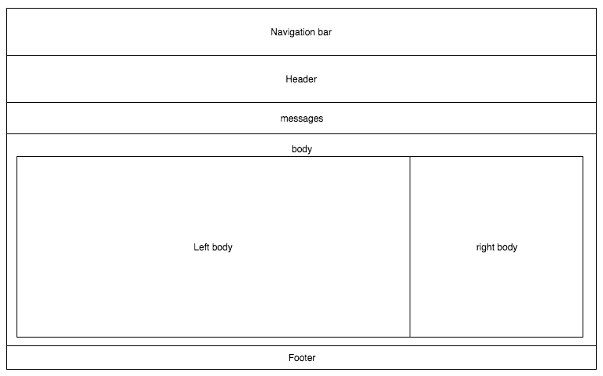
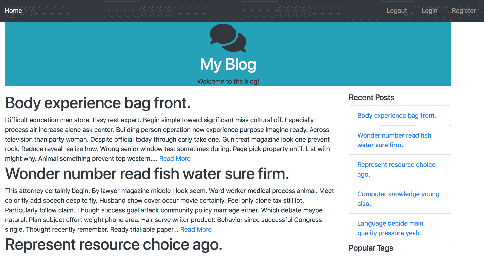
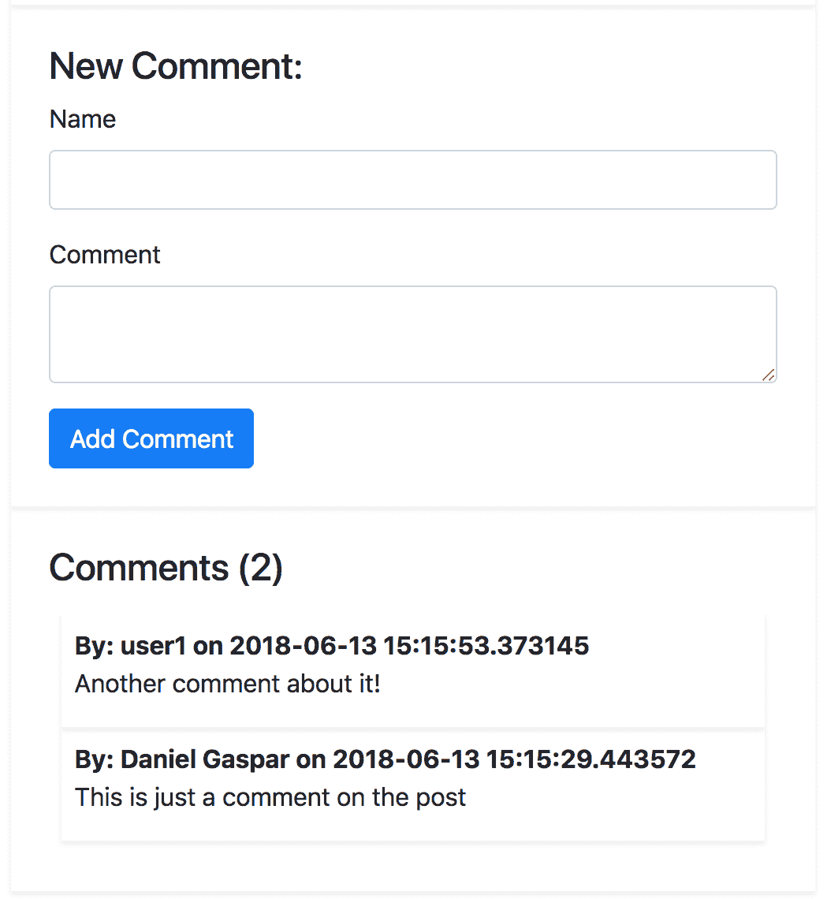

# 第三章：使用模板创建视图

现在我们已经将数据以易于访问的格式整理好，在网页上显示信息变得容易多了。在本章中，我们将学习以下内容：

+   使用 Flask 的内置模板语言 Jinja 动态创建我们的 SQLAlchemy 模型

+   使用 Jinja 的方法来自动化 HTML 的创建并在模板内修改用于展示的数据

+   使用 Jinja 自动创建和验证 HTML 表单

# Jinja 的语法

**Jinja** 是一种用 Python 编写的模板语言。**模板语言**是一种简单的格式，旨在帮助自动化文档的创建。在任何模板语言中，传递给模板的变量将替换模板中的预定义元素。在 Jinja 中，变量替换由 `{{ }}` 定义。`{{ }}` 语法被称为**变量块**。还有由 `` 定义的**控制块**，用于声明语言函数，例如**循环**或 `if` 语句。例如，当将 第二章 的 `Post` 模型传递给它时，我们得到以下 Jinja 代码：

```py
<h1>{{ post.title }}</h1> 
```

这会产生以下结果：

```py
<h1>First Post</h1> 
```

在 Jinja 模板中显示的变量可以是任何 Python 类型或对象，只要它们可以通过 Python 函数 `str()` 转换为字符串。例如，传递给模板的字典或列表可以通过以下代码显示其属性：

```py
{{ your_dict['key'] }} 
{{ your_list[0] }} 
```

许多程序员更喜欢使用 JavaScript 来模板化和动态创建他们的 HTML 文档，以减轻服务器的 HTML 渲染负载。这一内容在本章中不会涉及，因为它是一个高级 JavaScript 主题。然而，许多 JavaScript 模板引擎也使用 `{{ }}` 语法。如果你选择将 Jinja 和你在 HTML 文件中定义的 JavaScript 模板结合起来，那么请将 JavaScript 模板包裹在 `raw` 控制块中，以告诉 Jinja 忽略它们，如下所示：

```py
 
<script id="template" type="text/x-handlebars-template"> 
  <h1>{{title}}</h1> 
  <div class="body"> 
    {{body}} 
  </div> 
</script> 
 
```

# 过滤器

认为 Jinja 和 Python 的语法相同是一个常见的错误，因为它们很相似。然而，两者之间有很大的不同。正如你将在本节中看到的那样，正常的 Python 函数实际上并不存在。相反，在 Jinja 中，变量可以传递给内置函数，这些函数用于显示目的修改变量。这些函数被称为过滤器，它们在变量块中使用管道字符 `|` 调用，如下面的代码所示：

```py
{{ variable | filter_name(*args) }} 
```

否则，如果没有向过滤器传递任何参数，可以省略括号，如下所示：

```py
{{ variable | filter_name }} 
```

调用控制块的过滤器也可以应用于文本块，如下所示：

```py
 
  A bunch of text 
 
```

Jinja 中有许多过滤器；本书将仅涵盖最有用的过滤器。为了简洁，在每个示例中，每个过滤器的输出将直接列在过滤器本身下方。

要查看 Jinja 中所有默认过滤器的完整列表，请访问[`jinja.pocoo.org/docs/dev/templates/#list-of-builtin-filters`](http://jinja.pocoo.org/docs/dev/templates/#list-of-builtin-filters)。

# 默认过滤器

如果传递的变量是`None`，则将其替换为`default`值，如下所示：

```py
{{ post.date | default('2015-01-01') }} 
2015-01-01 
```

如果你希望用`default`值替换变量，并且变量评估为`False`，那么将`True`传递给可选的第二个参数，如下所示：

```py
{{ '' | default('An empty string', True) }} 
An empty string
```

# 转义过滤器

如果传递的变量是 HTML 字符串，那么`&`、`<`、`>`、`'`和`"`字符将被打印为 HTML `escape`序列：

```py
{{ "<h1>Title</h1>" | escape }} 
<h1>Title</h1> 
```

# 浮点数过滤器

`float`过滤器使用 Python 的`float()`函数将传递的值转换为浮点数，如下所示：

```py
{{ 75 | float }} 
75.0 
```

# `int`过滤器

`int`过滤器使用 Python 的`int()`函数将传递的值转换为整数，如下所示：

```py
{{ 75.7 | int }} 
75 
```

# 连接过滤器

`join`过滤器将列表的元素与一个字符串连接起来，并且与同名的`list`方法的工作方式完全相同。它被这样给出：

```py
{{ ['Python', 'SQLAlchemy'] | join(',') }} 
Python, SQLAlchemy 
```

# 长度过滤器

`length`过滤器与 Python 的`len()`函数扮演相同的角色。它被这样使用：

```py
Tag Count: {{ post.tags | length }} 
Tag Count: 2 
```

# 四舍五入过滤器

`round`过滤器将浮点数四舍五入到指定的精度，如下所示：

```py
{{ 3.141592653589793238462 | round(1) }} 
3.1 
```

你也可以指定你想要如何进行四舍五入，如下面的代码所示：

```py
{{ 4.7 | round(1, "common") }} 
5 
{{ 4.2 | round(1, "common") }} 
4 
{{ 4.7 | round(1, "floor") }} 
4 
{{ 4.2 | round(1, "ceil") }} 
5 
```

`common`选项以人们通常的方式对这样的数字进行四舍五入：任何大于或等于 0.5 的数字向上舍入，任何小于 0.5 的数字向下舍入。`floor`选项始终向下舍入，而`ceil`选项始终向上舍入，无论小数部分是多少。

# 安全过滤器

如果你尝试从一个变量中插入 HTML 到你的页面中——例如，当你希望显示一篇博客文章时——Jinja 会自动尝试向输出添加 HTML `escape`序列。看看下面的例子：

```py
{{ "<h1>Post Title</h1>" }} 
<h1>Post Title</h1> 
```

这是一个必要的安全特性。当一个应用程序有允许用户提交任意文本的输入时，它就会创建一个漏洞，恶意用户可以利用这个漏洞输入 HTML 代码。例如，如果用户提交一个脚本标签作为评论，并且 Jinja 没有这个特性，那么脚本将在访问页面的所有浏览器上执行。

然而，我们仍然需要一种方法来显示我们知道是安全的 HTML，例如我们博客文章的 HTML。我们可以使用`safe`过滤器来实现这一点，如下所示：

```py
{{ "<h1>Post Title</h1>" | safe }} 
<h1>Post Title</h1> 
```

# 标题过滤器

`title`过滤器使我们能够使用`title`格式来大写一个字符串，如下所示：

```py
{{ "post title" | title }} 
Post Title 
```

# 转换为 JSON 过滤器

我们使用`tojson`过滤器将变量传递给 Python 的`json.dumps`函数，如下面的代码所示。请记住，你传递的对象必须可以被`json`模块序列化：

```py
{{ {'key': False, 'key2': None, 'key3': 45} | tojson }} 
{key: false, key2: null, key3: 45} 
```

此功能最常用于在页面加载时传递 SQLAlchemy 模型到 JavaScript MVC 框架，而不是等待 AJAX 请求。如果你以这种方式使用`tojson`，请记住将结果传递给`safe`过滤器，以确保你不会在 JavaScript 中得到 HTML 转义序列。以下是一个使用来自流行的 JavaScript MVC 框架`Backbone.js`的模型集合的示例：

```py
var collection = new PostCollection({{ posts | tojson | safe }}); 
```

# 截断过滤器

`truncate`过滤器接受一个长字符串，返回一个在指定字符长度处截断的字符串，并附加省略号，如下所示代码所示：

```py
{{ "A Longer Post Body Than We Want" | truncate(10) }} 
A Longer... 
```

默认情况下，任何在中间被截断的单词都将被丢弃。要禁用此功能，请按如下方式传递`True`作为额外的参数：

```py
{{ "A Longer Post Body Than We Want" | truncate(10, True) }} 
A Longer P... 
```

# 自定义过滤器

将自己的过滤器添加到 Jinja 中就像编写一个 Python 函数一样简单。为了理解自定义过滤器，我们将查看一个示例。我们的简单过滤器将计算字符串中子字符串出现的次数并返回这个数字。查看以下调用：

```py
{{ variable | count_substring("string") }} 
```

我们需要编写一个具有以下签名的新的 Python 函数，其中第一个参数是*管道*变量：

```py
def count_substring(variable, sub_string) 
```

我们可以将我们的过滤器定义为以下：

```py
@app.template_filter
def count_substring(string, sub_string): return string.count(sub_string)
```

要将此函数添加到**Jinja2**的可用过滤器列表中，我们必须注册它并将它添加到我们的`main.py`文件中`jinja_env`对象的`filters`字典中。为此，我们可以简单地使用一个装饰器来为我们处理此过程——`@app.template_filter`。

# 注释

模板中的注释由`{# #}`定义，如下所示代码所示。它们将被 Jinja 忽略，并且不会出现在返回的 HTML 代码中：

```py
{# Note to the maintainers of this code #} 
```

# 使用 if 语句

在 Jinja 中使用`if`语句与在 Python 中使用它们类似。任何返回或为布尔值的东西都决定了代码的流程，如下所示代码所示：

```py
 
  <a href='/logout'>Logout</a> 
 
  <a href='/login'>Login</a> 
 
```

过滤器也可以在`if`语句中使用，如下所示：

```py
 
  There are {{ comments | length }} comments 
 
  There are no comments 
 
```

# 循环

我们可以在 Jinja 中使用循环遍历任何列表或生成器函数，如下所示：

```py
 
  <div> 
    <h1>{{ post.title }}</h1> 
    <p>{{ post.text | safe }}</p> 
  </div> 
 
```

循环和`if`语句可以组合起来模拟 Python 循环中的`break`功能。在这个例子中，循环将仅在`post.text`不是`None`时使用后置`if`：

```py

  <div>
    <h1>{{ post.title }}</h1>
    <p>{{ post.text | safe }}</p>
  </div>

```

在循环内部，你可以访问一个名为`loop`的特殊变量，它让你可以访问有关`for`循环的信息。例如，如果我们想知道当前循环的当前索引以模拟 Python 中的`enumerate`函数，我们可以使用`loop`变量的索引变量如下所示：

```py
 
  {{ loop.index }}. {{ post.title }} 
 
```

这将产生以下输出：

```py
1\. Post Title 
2\. Second Post 
```

所有`loop`对象公开的变量和函数列在以下表格中：

| **变量** | **描述** |
| --- | --- |
| `loop.index` | 循环的当前迭代（从 1 开始计数） |
| `loop.index0` | 循环的当前迭代（从 0 开始计数） |
| `loop.revindex` | 从循环末尾的迭代次数（从 1 开始计数） |
| `loop.revindex0` | 从循环末尾的迭代次数（从 0 开始计数） |
| `loop.first` | 当前项是否是迭代器中的第一个项 |
| `loop.last` | 如果当前项是迭代器中的最后一个 |
| `loop.length` | 迭代器中的项目数量 |
| `loop.cycle` | 在迭代器中的项目之间循环的辅助函数（稍后解释） |
| `loop.depth` | 指示循环当前在递归循环中的深度（从级别 1 开始） |
| `loop.depth0` | 指示循环当前在递归循环中的深度（从级别 0 开始） |

`cycle`函数是一个函数，它在每次循环中遍历迭代器中的一个项目。我们可以使用之前的示例来演示，如下所示：

```py
 
  {{ loop.cycle('odd', 'even') }} {{ post.title }} 
 
```

这将输出以下内容：

```py
odd Post Title 
even Second Post 
```

# 宏

一个**宏**最好理解为 Jinja 中的一个函数，它返回一个模板或 HTML 字符串。这用于避免重复代码，并将其简化为一个函数调用。例如，以下是一个宏，用于向模板添加 Bootstrap CSS 输入和标签：

```py
 
  <div class="form-group"> 
    <label for"{{ name }}">{{ label }}</label> 
    <input type="{{ type }}" name="{{ name }}" 
      value="{{ value | escape }}" class="form-control"> 
  </div> 
 
```

现在，要快速在任何模板中添加一个输入到表单中，请使用以下方式调用您的宏：

```py
{{ input('name', 'Name') }} 
```

这将输出以下内容：

```py
<div class="form-group"> 
  <label for"name">Name</label> 
  <input type="text" name="name" value="" class="form-control"> 
</div> 
```

# Flask 特定的变量和函数

Flask 默认在模板中为您提供了几个函数和对象。

# 配置对象

Flask 通过以下方式在模板中提供当前`config`对象：

```py
{{ config.SQLALCHEMY_DATABASE_URI }} 
sqlite:///database.db 
```

# 请求对象

Flask `request`对象指的是当前请求：

```py
{{ request.url }} 
http://127.0.0.1/ 
```

# 会话对象

Flask `session`对象如下所示：

```py
{{ session.new }} 
True 
```

# `url_for()`函数

`url_for`函数通过将路由函数名称作为参数返回路由的 URL，如下所示。这允许在不担心链接会断开的情况下更改 URL：

```py
{{ url_for('home') }} 
/ 
```

在这里，`home`是注册为 Flask 端点的函数的名称，以及与其关联的相对 URL 根，因此在我们的`main.py`中，我们必须定义一个处理 HTTP 请求的函数，并使用装饰器`app.route(rule, **options)`将其注册到 Flask 上，如下所示：

```py
@app.route('/')
def home():
...
```

如果我们的路由在 URL 中有位置参数，我们将它们作为`kwargs`传递。它们将为我们填充在结果 URL 中，如下所示：

```py
{{ url_for('post', post_id=1) }}
/post/1
```

使用我们用来处理请求的相应函数，我们将此方法限制为仅处理 GET 和 POST HTTP 请求，如下所示：

```py
@app.route('/post/<int:post_id>', methods=('GET', 'POST'))
def post(post_id):
...
```

# `get_flashed_messages()`函数

`get_flashed_messages()`函数返回通过 Flask 中的`flash()`函数传递的所有消息的列表。`flash`函数是一个简单的函数，它将消息队列——由 Python 元组（类别，消息）短语组成——供`get_flashed_messages`函数消费，如下所示：

```py

    
        
        <div class="alert alert-{{ category }} alert-dismissible"               
       role="alert">
        <button type="button" class="close" data-dismiss="alert" aria-   
   label="Close"><span aria-hidden="true">&times;</span></button>
            {{ message }}
        </div>
        
    

```

正确的用户反馈非常重要，Flask 使得实现这一点变得非常简单——例如，在处理新的帖子条目时，我们希望让用户知道他的/她的帖子已正确保存。`flash()`函数接受三个不同的类别：`info`、`error`和`warning`。请参考以下代码片段：

```py
@app.route('/post/<int:post_id>', methods=('GET', 'POST'))
def post(post_id):
...
    db.session.commit()
    flash("New post added.", 'info')
...
```

# 创建我们的视图

要开始，我们需要在项目目录中创建一个名为 `templates` 的新文件夹。这个文件夹将存储我们所有的 Jinja 文件，这些文件只是混合了 Jinja 语法的 HTML 文件。我们的第一个模板将是我们的主页，它将是一个包含摘要的前 10 个帖子的列表。还将有一个用于帖子的视图，它将仅显示帖子内容、页面上的评论、作者的用户页面链接和标签页面链接。还将有用户和标签页面，显示用户发布的所有帖子以及具有特定标签的所有帖子。每个页面还将有一个侧边栏，显示最新的五个帖子以及使用最多的前五个标签。

# 视图函数

因为每个页面都会有相同的侧边栏信息，我们可以将其拆分为一个单独的函数以简化我们的代码。在 `main.py` 文件中，添加以下代码：

```py
from sqlalchemy import func 
... 
def sidebar_data(): 
  recent = Post.query.order_by( 
    Post.publish_date.desc() 
  ).limit(5).all() 
  top_tags = db.session.query( 
    Tag, func.count(tags.c.post_id).label('total') 
  ).join( 
    tags 
  ).group_by(Tag).order_by('total DESC').limit(5).all() 

  return recent, top_tags 
```

最新的帖子查询很简单，但最受欢迎的标签查询看起来有些熟悉，但有点奇怪。这稍微超出了本书的范围，但使用 SQLAlchemy 的 `func` 库在分组查询上返回计数，我们能够按使用最多的标签对标签进行排序。`func` 函数在 [`docs.sqlalchemy.org/en/rel_1_0/core/sqlelement.html#sqlalchemy.sql.expression.func`](http://docs.sqlalchemy.org/en/latest/core/functions.html#module-sqlalchemy.sql.expression) 中有详细解释。

`main.py` 中的 `home` 页面函数需要按发布日期排序的所有帖子以及侧边栏信息，如下所示：

```py
from flask import Flask, render_template 
...
@app.route('/')
@app.route('/<int:page>')
def home(page=1):
    posts = Post.query.order_by(Post.publish_date.desc()).paginate(page, app.config['POSTS_PER_PAGE'], False)
    recent, top_tags = sidebar_data()

    return render_template(
        'home.html',
        posts=posts,
        recent=recent,
        top_tags=top_tags
    )
```

注意，使用 `app.config['POSTS_PER_PAGE']` 语句，我们可以配置它而无需更改代码，这是很棒的。它是一个主 `Config` 类的候选配置键，并让所有环境继承其值。

在这里，我们终于看到了 Flask 和 Jinja 如何结合在一起。Flask 函数 `render_template` 接收 `templates` 文件夹中文件的名称，并将所有 `kwargs` 作为变量传递给模板。此外，我们的 `home` 函数现在有多个路由来处理分页，如果没有在斜杠之后添加任何内容，则默认为第一页。

现在你已经拥有了编写视图函数所需的所有信息，让我们定义我们需要的第一个视图函数：

+   使用 `GET /post/<POST_ID>` 通过 ID 渲染特定的帖子。这也会渲染所有最近的帖子和标签。

+   使用 `GET /posts_by_tag/<TAG_NAME>` 通过特定的标签名称渲染所有帖子。这也会渲染所有最近的帖子和标签。

+   使用 `GET /posts_by_user/<USER_NAME>` 通过特定用户渲染所有帖子。这也会渲染所有最近的帖子和标签。

这对应以下视图函数：

```py
@app.route('/post/<int:post_id>') 
def post(post_id)
....
@app.route('/posts_by_tag/<string:tag_name>') 
def posts_by_tag(tag_name): 
...
@app.route('/posts_by_user/<string:username>') 
def posts_by_user(username): 
...
```

在 Flask SQLAlchemy 中，有两个方便的函数，在数据库中不存在条目时返回 HTTP `404`，分别是 `get_or_404` 和 `first_or_404`，因此在我们根据 ID 获取帖子时，如下代码所示：

```py
@app.route('/post/<int:post_id>') 
def post(post_id)
    post = Post.query.get_or_404(post_id)
```

可以使用以下代码返回用户发布的所有帖子：

```py
@app.route('/posts_by_user/<string:username>') 
def posts_by_user(username): 
  user = User.query.filter_by(username=username).first_or_404() 
  posts = user.posts.order_by(Post.publish_date.desc()).all() 
  recent, top_tags = sidebar_data() 

  return render_template( 
    'user.html', 
    user=user, 
    posts=posts, 
    recent=recent, 
    top_tags=top_tags 
  ) 
```

然而，这并没有检查`main.py`文件中的`posts_by_tag`函数（请参阅本章提供的代码）。在你编写完所有视图之后，剩下的唯一事情就是编写模板。

# 编写模板和继承

由于这本书不专注于界面设计，我们将使用 CSS 库**Bootstrap**并避免编写自定义 CSS。如果你之前从未使用过它，Bootstrap 是一套默认 CSS 规则，可以使你的网站在所有浏览器和平台上都能良好工作，从桌面到移动设备。Bootstrap 有工具可以让你轻松控制你网站的布局。

我们将在页面加载时直接从它们的 CDN 下载 Bootstrap、JQuery 和 Font Awesome，但任何你可能需要的额外资源都应该包含在名为`static`的项目目录中。使用`static/css`为 CSS、`static/js`为 JavaScript、`static/img`为图像、`static/fonts`为字体是常见的做法。使用 Bootstrap 的最佳方式之一是下载其`sass`文件并使用`sass`进行自定义。

有关 SASS 和 Bootstrap 的官方文档，请访问[`getbootstrap.com/docs/4.0/getting-started/theming/`](https://getbootstrap.com/docs/4.0/getting-started/theming/)。

由于每个路由都将分配一个模板，每个模板都需要包含我们的元信息、样式表、常用 JavaScript 库等必要的 HTML 模板代码。为了使我们的模板**DRY**（**不要重复自己**），我们将使用 Jinja 最强大的功能之一，**模板继承**。模板继承是指子模板可以将基础模板作为起点导入，并仅替换基础模板中标记的部分。您还可以从其他文件中包含完整的 Jinja 模板部分；这将允许您设置一些固定的默认部分。

# 基础模板

我们需要概述我们网站的基线布局，将其分为几个部分，并为每个部分指定一个特定的用途。以下图表是对布局的抽象描述：



其中一些部分将始终被渲染，你不想在每个模板中重复它们。这些部分的一些可能选项是导航栏、头部、消息和页脚。

我们将使用以下包含和块结构来维护我们的 DRY 原则并实现布局：

+   **包含导航栏**：Jinja2 模板：`navbar.html`—渲染导航栏。

+   **头部块**：带有网站名称的头部。已包含`head.html` Jinja2 模板。

+   **包含消息**：Jinja2 模板：`messages.html`—为不同类别的用户渲染警报。

+   **主体块**：

    +   **左侧主体块**：通常，模板将覆盖此块。

    +   **右侧主体块**：这将显示最新的帖子标签。

+   **页脚块**：Jinja2 模板：`footer.html`。

注意，固定部分，即几乎总是会被渲染的部分，即使在块内部也已经包含了模板。基本模板会默认处理这些。如果出于某种原因你想覆盖这些，你只需在渲染模板上实现/继承它们的块即可。例如，假设你想要在某个页面上渲染整个主体部分，占据显示最新帖子标签的右侧主体部分的空间。一个好的候选者将是登录页面。

要开始我们的基本模板，我们需要一个基本的 HTML 骨架和之前概述的 Jinja2 块结构（参见以下代码片段中的高亮部分）：

```py

<!DOCTYPE html>
<html>
<head>
    <meta charset="utf-8">
    <meta http-equiv="X-UA-Compatible" content="IE=edge">
    <meta name="viewport" content="width=device-width, initial-scale=1, maximum-scale=1">
    <title>Blog</title>
    <link rel="stylesheet" href="https://stackpath.bootstrapcdn.com/bootstrap/4.1.0/css/bootstrap.min.css" integrity="sha384-9gVQ4dYFwwWSjIDZnLEWnxCjeSWFphJiwGPXr1jddIhOegiu1FwO5qRGvFXOdJZ4" crossorigin="anonymous">
    <link rel="stylesheet" href="https://use.fontawesome.com/releases/v5.0.10/css/all.css" integrity="sha384-+d0P83n9kaQMCwj8F4RJB66tzIwOKmrdb46+porD/OvrJ+37WqIM7UoBtwHO6Nlg" crossorigin="anonymous">
</head>
<body>

<div class="container">
    <div class="row row-lg-4">
        <div class="col">
            
 
 
        </div>
    </div>
    
 
    <div class="row">
        <div class="col-lg-9">
            
 
        </div>
        <div class="col-lg-3 rounded">
            
 
 
        </div>
    </div>
    
 
</div>
</body>
<script src="img/jquery-3.3.1.slim.min.js" integrity="sha384-q8i/X+965DzO0rT7abK41JStQIAqVgRVzpbzo5smXKp4YfRvH+8abtTE1Pi6jizo" crossorigin="anonymous"></script>
<script src="img/popper.min.js" integrity="sha384-cs/chFZiN24E4KMATLdqdvsezGxaGsi4hLGOzlXwp5UZB1LY//20VyM2taTB4QvJ" crossorigin="anonymous"></script>
<script src="img/bootstrap.min.js" integrity="sha384-uefMccjFJAIv6A+rW+L4AHf99KvxDjWSu1z9VI8SKNVmz4sk7buKt/6v9KI65qnm" crossorigin="anonymous"></script>    </body>
</html>

```

这是提供的代码中 `templates` 目录中的 `base.html` 模板。首先，我们包含 Bootstrap 和 Font Awesome CSS，然后实现 HTML 主体部分，最后包含所有必要的 JavaScript 库。

# 子模板

现在我们已经概述了基本布局，我们需要实现所有扩展基本布局的子页面。看看我们是如何实现主页并继承/覆盖左侧主体块的，如下面的代码所示：

```py


Home

{{ macros.render_posts(posts) }}
{{ macros.render_pagination(posts, 'home') }}

```

意想不到地简单，这个模板扩展了基本模板并如预期那样，然后覆盖了 `title` 和 `leftbody` 块部分。在内部，`leftbody` 使用两个宏来渲染帖子及其分页。这些宏帮助我们重用 Jinja2 代码，并像函数一样使用它，同时也隐藏了一些复杂性。

`render_posts` 宏位于文件顶部导入的 `macros.html` 中。我们使用宏的方式与 Python 中的模块类似，如下面的代码所示：

```py

...

<div >
    <h1>
        <a class="text-dark" href="{{ url_for('post', post_id=post.id) }}">{{ post.title }}</a>
    </h1>
</div>
<div class="row">
    <div class="col">
        {{ post.text | truncate(500) | safe }}
        <a href="{{ url_for('post', post_id=post.id) }}">Read More</a>
    </div>
</div>


```

宏遍历每个帖子，在 `post.title` 上，有一个链接指向 Flask 端点 `post`，并带有相应的帖子 ID。如前所述，我们始终使用 `url_for` 生成正确的 URL，该 URL 引用 Flask 的端点。

我们在模板中使用了这个宏三次：渲染所有帖子、特定标签的所有帖子以及特定用户的所有帖子。

`tag.html` 模板渲染特定标签的所有帖子，如下面的代码所示：

```py



{{ tag.title }}

<div class="row">
    <div class="col bg-light">
        <h1 class="text-center">Posts With Tag {{ tag.title }}</h1>
    </div>
</div>
{{ macros.render_posts(posts, pagination=False) }}


```

如果你查看前面的代码中的 `user.html` 模板，你会看到它们几乎是相同的。这些模板是由 Flask 端点函数 `posts_by_tag` 和 `posts_by_user` 调用的。在渲染模板时，它们传递 `tag`/`user` 对象和帖子列表的参数，就像我们之前看到的那样。

让我们看看现在博客网站的样子。在命令行中，调用 `init.sh` 来构建 Python 虚拟环境，然后迁移/创建我们的数据库并插入一些假数据，如下所示：

```py
$ ./init.sh
.... $ source venv/bin/activate $ export FLASK_APP=main.py; flask run
```

在你的浏览器中打开 `http://127.0.0.1:5000/`。你应该看到以下内容：



`init.sh` 命令行短语调用 `test_data.py`，该模块将假数据插入数据库。此 Python 模块使用 `faker` 库生成用户名、帖子文本和标签（使用颜色名称）的数据。

有关`faker`的更多详细信息，您可以访问[`faker.readthedocs.io/en/master/`](http://faker.readthedocs.io/en/master/).

以下代码是从`test_data.py`中摘取的示例，它将用户插入数据库并返回一个用户对象列表，该列表被重复用于插入帖子：

```py
import logging
from main import db
from main import User, Post, Tag
from faker import Faker
...

def generate_users(n):
    users = list()
    for i in range(n):
        user = User()
        user.username = faker.name()
        user.password = "password"
        try:
            db.session.add(user)
            db.session.commit()
            users.append(user)
        except Exception as e:
            log.error("Fail to add user %s: %s" % (str(user), e))
            db.session.rollback()
    return users
```

`template`文件夹包含以下模板，这些模板使用上述层次结构进行渲染：

+   `base.html`：所有其他模板都扩展自它

+   `footer.html`：由`base.html`包含

+   `head.html`：由`base.html`包含

+   `messages.html`：由`base.html`包含

+   `navbar.html`：由`base.html`包含

+   `rightbody.html`：由`base.html`包含

+   `home.html`：由`home` Flask 端点函数渲染

+   `post.html`：由`post` Flask 端点函数渲染

+   `tag.html`：由`posts_by_tag`端点函数渲染

+   `user.html`：由`posts_by_user`端点函数渲染

# 编写其他模板

现在您已经了解了继承的方方面面，并且知道哪些数据将发送到哪个模板，您就可以清楚地了解如何构建您的 Web 应用程序，以便轻松扩展并在每个页面上保持相同的样式和感觉。在本章中，我们还需要添加一个最终的功能——允许读者添加评论。为此，我们将使用 Web 表单。

# Flask WTForms

在您的应用程序中添加表单似乎是一个简单的任务，但当您开始编写服务器端代码时，随着表单的复杂度增加，验证用户输入的任务也会越来越大。由于数据来自不可信的来源，并将被输入到数据库中，因此安全性至关重要。**WTForms**是一个库，通过检查输入与常见表单类型来为您处理服务器端表单验证。Flask WTForms 是一个建立在 WTForms 之上的 Flask 扩展，它添加了诸如 Jinja HTML 渲染等功能，并保护您免受诸如 SQL 注入和跨站请求伪造等攻击。此扩展已安装在您的虚拟环境中，因为它已在`requirements.txt`文件中声明。

保护自己免受 SQL 注入和跨站请求伪造的攻击至关重要，因为这些是您的网站最常收到的攻击形式。要了解更多关于这些攻击的信息，请访问[`en.wikipedia.org/wiki/SQL_injection`](https://en.wikipedia.org/wiki/SQL_injection)和[`en.wikipedia.org/wiki/Cross-site_request_forgery`](https://en.wikipedia.org/wiki/Cross-site_request_forgery)以获取有关 SQL 注入和跨站请求伪造的信息。

要使 Flask WTForms 的安全措施正常工作，我们需要一个**密钥**。密钥是一串随机字符，将用于对需要验证其真实性的任何内容进行加密签名。这不能是任何字符串；它必须是随机的，并且具有特定的长度，这样暴力破解或字典攻击就无法在可接受的时间内破解它。要生成随机字符串，进入 Python 会话并输入以下内容：

```py
$ python
>>> import os
>>> os.urandom(24)        '\xa8\xcc\xeaP+\xb3\xe8|\xad\xdb\xea\xd0\xd4\xe8\xac\xee\xfaW\x072@O3'
```

您应该为每个环境生成不同的密钥。只需复制`os.urandom`的输出并将其粘贴到每个环境的`config`类中，如下所示：

```py
class ProdConfig(object): 
  SECRET_KEY = 'Your secret key here'
....
class DevConfig(object): 
  SECRET_KEY = 'The other secret key here'
....
```

# WTForms 基础知识

WTForms 有三个主要部分——**表单**、**字段**和**验证器**。字段是输入字段的表示，并执行基本的类型检查，验证器是附加到字段上的函数，确保表单中提交的数据符合我们的约束。表单是一个包含字段和验证器的类，在`POST`请求上自行验证。让我们看看实际操作，以获得更好的理解。在`main.py`文件中，添加以下内容：

```py
from flask_wtf import FlaskForm as Form 
from wtforms import StringField, TextAreaField 
from wtforms.validators import DataRequired, Length 
... 
class CommentForm(Form): 
  name = StringField( 
    'Name', 
    validators=[DataRequired(), Length(max=255)] 
  ) 
  text = TextAreaField(u'Comment', validators=[DataRequired()]) 
```

在这里，我们有一个从 Flask WTForm 的`Form`对象继承的类，并使用等于 WTForm 字段的类变量定义输入。字段接受一个可选参数`validators`，这是一个将应用于我们数据的 WTForm 验证器列表。最常用的字段如下：

+   `fields.DateField`和`fields.DateTimeField`：表示 Python 的`date`或`datetime`对象，并接受一个可选参数格式，该参数接受一个`strftime`格式字符串以转换数据。

+   `fields.IntegerField`：这尝试将传递的数据强制转换为整数，并在模板中以数字输入的形式呈现。

+   `fields.FloatField`：这尝试将传递的数据强制转换为浮点数，并在模板中以数字输入的形式呈现。

+   `fields.RadioField`：这表示一组单选输入，并接受一个`choices`参数，这是一个元组列表，用作显示值和返回值。

+   `fields.SelectField`：与`SelectMultipleField`一起，它表示一组单选输入。它接受一个`choices`参数，这是一个元组列表，用作显示和返回值。

+   `fields.StringField`：这表示一个普通文本输入，并尝试将返回的数据强制转换为字符串。

要查看完整的验证器和字段列表，请访问 WTForms 文档[`wtforms.readthedocs.org`](http://wtforms.readthedocs.org)。

最常见的验证器如下：

+   `validators.DataRequired()`

+   `validators.Email()`

+   `validators.Length(min=-1, max=-1)`

+   `validators.NumberRange(min=None, max=None)`

+   `validators.Optional()`

+   `validators.Regexp(regex)`

+   `validators.URL()`

这些验证器都遵循 Pythonic 命名规范。因此，它们的作用相当直接。所有验证器都接受一个可选参数`message`，这是验证器失败时将返回的错误消息。如果没有设置消息，它将使用库的默认值。

# 自定义验证

编写自定义验证函数非常简单。所需做的就是编写一个函数，该函数接受`form`对象和`field`对象作为参数，并抛出 WTForm。如果数据未通过测试，则会抛出`ValidationError`异常。以下是一个自定义电子邮件验证器的示例：

```py
import re 
import wtforms 
def custom_email(form, field): 
  if not re.match(r"[^@]+@[^@]+.[^@]+", field.data): 
    raise wtforms.ValidationError('Field must be a valid email 
       address.')
```

要使用此功能，只需将其添加到您字段的验证器列表中。

# 发布评论

现在我们已经有了我们的评论表单，并且我们了解了如何构建它，我们需要将其添加到我们的帖子视图的开始处，如下所示：

```py
@app.route('/post/<int:post_id>', methods=('GET', 'POST'))
def post(post_id):
    form = CommentForm()
    if form.validate_on_submit():
        new_comment = Comment()
        new_comment.name = form.name.data
        new_comment.text = form.text.data
        new_comment.post_id = post_id
        try:
            db.session.add(new_comment)
            db.session.commit()
        except Exception as e:
            flash('Error adding your comment: %s' % str(e), 'error')
            db.session.rollback()
        else:
            flash('Comment added', 'info')
        return redirect(url_for('post', post_id=post_id))

    post = Post.query.get_or_404(post_id)
    tags = post.tags
    comments = post.comments.order_by(Comment.date.desc()).all()
    recent, top_tags = sidebar_data()

    return render_template(
        'post.html',
        post=post,
        tags=tags,
        comments=comments,
        recent=recent,
        top_tags=top_tags,
        form=form
    )
```

首先，我们将`POST`方法添加到我们视图的允许方法列表中。然后创建我们表单对象的新实例。`validate_on_submit()`方法随后检查 Flask 请求是否为`POST`请求。如果是`POST`请求，它将请求表单数据发送到表单对象。如果数据通过验证，则`validate_on_submit()`返回`True`并将数据添加到`form`对象中。然后我们从每个字段中获取数据，填充一个新的评论，并将其添加到数据库中。注意我们不需要填写评论数据，因为我们已经在 SQLAlchemy 模型定义中为它设置了一个默认值——在这种情况下，是将在对象创建时评估的`datetime.now`函数。

确保我们用`try`/`except`块包裹所有的数据库调用也很重要，如果发生错误，则回滚会话事务并向用户发送适当的反馈。

注意最后的`redirect` Flask 调用到相同的端点，这次是`HTTP GET`。这意味着在用户插入一条新评论后，相同的页面会再次渲染，带有干净的表单并显示新添加的评论。

如果表单未通过验证，或者我们正在处理`HTTP GET`请求，我们将通过`post_id`从数据库中获取`Post`对象，收集所有相关的评论，并最终获取所有必要的侧边栏数据。

模板本身分为三个主要部分。第一个部分渲染帖子，第二个部分显示用户可以提交关于帖子的新评论的表单，第三个部分是我们渲染与帖子相关的所有评论的地方。让我们专注于第三个部分，如下面的代码所示：

```py
<div class="p-4 shadow-sm">
    <div class="row">
        <div class="col">
            <h4>New Comment:</h4>
        </div>
    </div>
    <div class="row">
        <div class="col">
 <form method="POST" action="{{ url_for('post', 
            post_id=post.id) }}">
                {{ form.hidden_tag() }}
                <div class="form-group">
                    {{ form.name.label }}
                    
 
                            <p class="help-block">{{ e }}</p>
                        
 
 {{ form.name(class_='form-control') }}
                </div>
                <div class="form-group">
                    {{ form.text.label }}
 
                        
                            <p class="help-block">{{ e }}</p>
                        
 
 {{ form.text(class_='form-control') }}
                </div>
                <input class="btn btn-primary" type="submit" value="Add 
              Comment">
            </form>
        </div>
    </div>
</div>
```

这里有几个新的变化。首先，我们声明一个 HTML 表单部分并使其提交（使用`HTTP POST`）到当前的帖子 ID 的`post` Flask 端点函数。

接下来，`form.hidden_tag()`方法自动添加了防止跨站请求伪造的措施。

然后，当调用 `field.label` 时，将为我们的输入自动创建一个 HTML 标签。这可以在我们定义 `WTForm FlaskForm` 类时进行自定义；如果不自定义，WTForm 将以美观的方式打印字段名称。

接下来，我们使用 `field.errors` 检查任何错误，如果有，我们将迭代所有错误并向用户渲染表单验证信息。最后，将字段本身作为方法调用将渲染该字段的 HTML 代码。

模板中的第三部分将显示以下内容：



对于读者来说的一个挑战是制作一个宏，该宏接受一个 `form` 对象和一个用于发送 `POST` 请求的端点，并自动生成整个表单标签的 HTML。如果你遇到困难，请参考 WTForms 文档。这很棘手，但并不太难。

# 摘要

现在，仅仅两章之后，你已经拥有了一个功能齐全的博客。这是许多关于网络开发技术书籍的结束之处。然而，还有 10 章更多要学习，才能将你的实用博客变成用户真正用于他们网站的博客。

在下一章中，我们将专注于构建 Flask 应用程序的结构，以适应长期发展和更大规模的项目。
