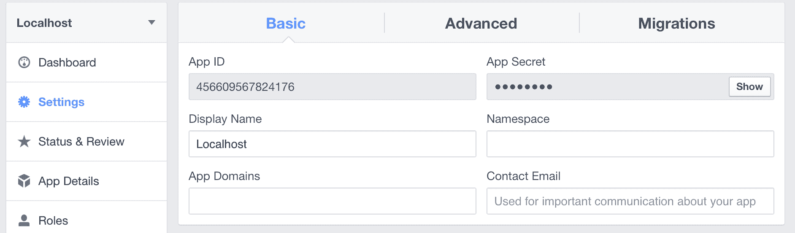
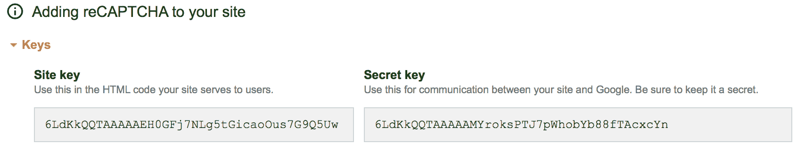
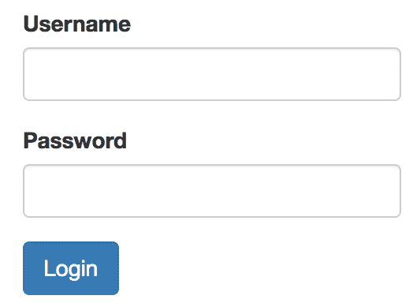
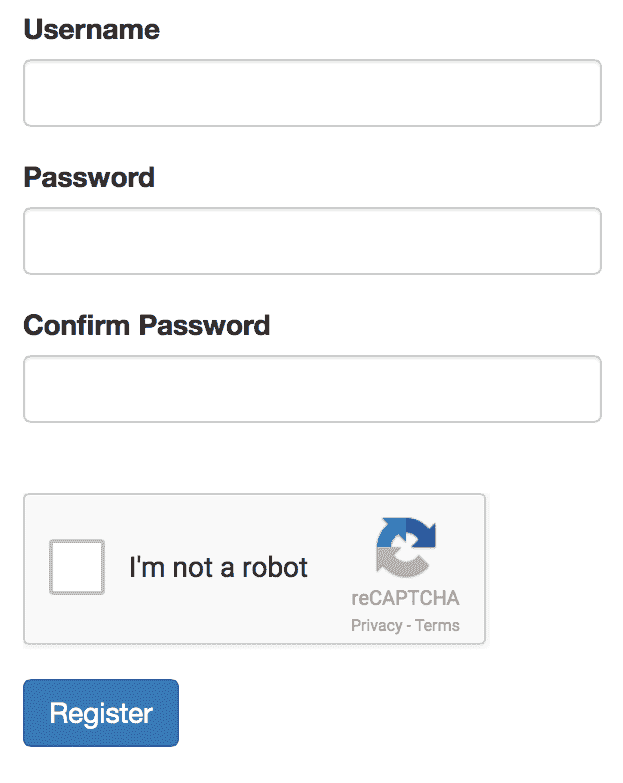

# 保护您的应用程序安全

我们有一个基本功能齐全的博客应用程序，但它缺少一些关键功能，例如用户登录、注册功能以及从浏览器添加和编辑帖子的能力。用户身份验证功能可以通过多种方式实现，因此本章的每个后续部分都将演示一种互斥的方法来创建登录功能。每种身份验证方法可能具有不同的安全级别，或者可能适用于不同类型的应用程序，从公开的 Web 到企业后台办公室。

在本章中，我们将探讨以下主题：

+   各种身份验证方法的简要概述：基本身份验证、远程用户、LDAP、数据库身份验证和 OpenID 和 Oauth

+   如何利用 Flask 登录（数据库/cookie 身份验证）

+   如何实现**基于角色的访问控制**（**RBAC**）以区分功能并实现对普通博客用户的细粒度访问

如果您还没有这样做，请下载提供的代码，并使用`init.sh`脚本来创建`virtualenv`、数据库模式和测试数据。测试数据将创建三个用户，所有用户的密码都设置为`password`。每个用户将分别拥有以下权限：

+   `user_default`具有最小权限

+   `user_poster`具有作者权限

+   `admin`具有管理员权限

让我们先探讨一些非常简单的身份验证方法。

# 身份验证方法

身份验证方法是一个确认身份的过程。在应用程序的情况下，用户被分配一个用户名和一个秘密安全令牌（密码），并使用它们在应用程序本身上验证其身份。有几种身份验证方法和类型，用于不同类型的应用程序（如 API、公开的 Web、内网和政府）。我们将介绍最常用的身份验证类型——单因素。

# 基本身份验证

如其名所示，基本身份验证是 HTTP 协议本身实现的一种非常简单的身份验证方法。它是 RFC7617 的一部分。要使用它，我们可以配置我们的 Web 服务器（IIS、Apache 和 NGINX）来实现它，或者我们可以自己实现它。

有关如何配置 NGINX 进行基本身份验证的详细信息，请访问 [`docs.nginx.com/nginx/admin-guide/security-controls/configuring-http-basic-authentication/`](https://docs.nginx.com/nginx/admin-guide/security-controls/configuring-http-basic-authentication/)。

基本身份验证协议经过以下一般步骤：

1.  用户从服务器请求受保护的资源。

1.  服务器响应`401`（未授权）和 HTTP 头`WWW-Authenticate: Basic realm="Login required"`*.*

1.  浏览器将为用户显示基本身份验证登录窗口，以便用户将用户名/密码发送回服务器。

1.  用户提供的用户名和密码将以 `Authorization: Basic <Username>:<Password>` 的形式在 HTTP 标头中发送到服务器。`username:password` 将被 base64 编码。

Flask 将使我们能够轻松实现此协议，因为它将自动从 HTTP 标头中解码 base64 授权，并将用户名和密码作为 `Request.authorization` 对象的属性放置，如下面的代码所示：

```py
def authenticate(username, password):
    return username == 'admin' and password == 'password'

@app.route('/basic-auth-page')
def basic_auth_page():
    auth = request.authorization
    if not auth or not authenticate(auth.username, auth.password)
        return Response('Login with username/password', 401, {'WWW-Authenticate': 'Basic realm="Login Required"'})
    return render_template('some_page.html')
```

这种认证类型非常简单，但不太安全。用户名和密码将在每次请求时发送到服务器，因此请确保您始终使用 HTTPS 正确加密它们的传输。此外，如您可能已经在前面示例的代码流程中注意到的，认证方法将在每次请求时被调用，因此它不太高效。然而，这对于非常简单的后台应用程序的内部使用或快速保护概念验证应用程序来说可能是一个不错的选择。

# 远程用户认证

在某些内部网络设置中，我们可以使用单点登录认证方法，其中 Web 服务器执行与安全相关的所有繁重工作。这可以使用 **IIS 集成 Windows 认证** 或 **Apache mod_auth_sspi**、**Apache Samba** 或其他方法完成。设置超出了本书的范围。

您可以在 [`wiki.samba.org/index.php/Authenticating_Apache_against_Active_Directory`](https://wiki.samba.org/index.php/Authenticating_Apache_against_Active_Directory) 上查看如何使用 Apache Samba 设置此类认证的一些示例。

使用这种认证方法，Web 服务器将已认证的用户名作为环境密钥传递给 **WSGI**（**Web 服务器网关接口**），因此我们只需使用以下方法获取它：

```py
 username = request.environ.get('REMOTE_USER')
```

对于我们的博客应用程序，我们只需检查用户是否在数据库中存在即可，因此不需要密码数据库字段。如果服务器上设置得当，这种认证方法可以被认为是安全的，并且在内部网络设置中可以非常方便，因为如果用户已经在域（例如，Active Directory）上进行了认证，将不再需要再次填写其登录名/密码（例如使用 Kerberos GSSAPI 或 Windows SSPI）。

# LDAP 认证

**LDAP**（**轻量级目录访问协议**）是一个由当前 RFC4511 描述的开放标准。其目的是在 IP 上实现分布式信息目录。此目录可以包含与用户、组和设备通常相关的不同类型的信息。它有一个固定模式描述每个对象的属性，但可以使用 LDIF 更改此模式。

Active Directory 是微软对 LDAP 的实现。您可以查看在 [`www.kouti.com/tables/userattributes.htm`](http://www.kouti.com/tables/userattributes.htm) 上提供的基实现用户属性。

目录中的条目（例如，用户）通过一个**唯一名称**（**DN**）来识别。例如，看看下面的代码：

```py
CN=user1,OU=Marketing,DC=example,DC=com
```

`DC`短语是域组件，它标识了用户所在的域（LDAP 目录可以有域和子域的树状结构）。在我们的例子中，域是`example.com`。短语`OU`指的是用户所在的组织单元，而`CN`是其通用名称。

LDAP 实现了各种操作，如添加用户、搜索、删除等。仅就认证目的而言，我们只对`Bind`和`Search`操作感兴趣。

要使用 LDAP，我们需要安装`python-ldap`，让我们首先使用以下代码进行安装：

```py
$ pip install python-ldap
```

目前最常用的两个 LDAP 服务是**OpenLDAP**（开放和免费）和**Microsoft Active Directory**（商业）。它们的实现略有不同，主要是在用户属性方面。以下代码是 Active Directory 的一个示例。首先，我们需要定义一些配置键来连接和认证服务：

```py
import ldap

LDAP_SERVER="ldap://example.com:389"
ROOT_DN="dc=example,dc=com"
SERVICE_USER="ServiceAccount"
SERVICE_PASSWORD="SOME_PASSWORD"
UID_FIELD_NAME="userPrincipalName" # specific for AD
USER_DOMAIN="example.com"
```

注意，我们在应用程序服务器和 LDAP 服务器之间使用的是非加密通信；我们可以通过使用数字证书并在`LDAP_SERVER`配置键上使用 LDAPS 来启用加密。

如果我们要将 LDAP 认证集成到我们的博客应用程序中，这些值将是我们在`config.py`配置中的良好候选者***。

接下来，我们将按照以下方式连接到并认证服务：

```py
con = ldap.initialize(LDAP_SERVER)
con.set_option(ldap.OPT_REFERRALS, 0)
con.bind_s(SERVICE_USER, SERVICE_PASSWORD)
```

`OPT_REFERRALS`是针对 MSFT AD 的特定解决方案。请参阅`python-ldap`的常见问题解答以获取更多详细信息，请访问[`www.python-ldap.org/en/latest/faq.html`](https://www.python-ldap.org/en/latest/faq.html)。

现在我们已经建立了认证连接，我们将搜索我们的用户以获取其用户名，如下面的代码所示。在 Active Directory 中，我们可以直接使用用户的用户名和密码进行绑定，但在 OpenLDAP 中这种方法会失败。这样，我们遵循的是在两个系统上都适用的标准方法：

```py
username = username + '@' + USER_DOMAIN
filter_str = "%s=%s" % (UID_FIELD_NAME, username)
user = con.search_s(ROOT_DN,
                        ldap.SCOPE_SUBTREE,
                        filter_str,
                        ["givenName","sn","mail"])
```

一个完整的 LDAP 认证函数可能如下所示：

```py
def ldap_auth(username, password):
    con = ldap.initialize(LDAP_SERVER)
    con.set_option(ldap.OPT_REFERRALS, 0)
    username = username + '@' + USER_DOMAIN
    con.bind_s(SERVICE_USER, SERVICE_PASSWORD)
    filter_str = "%s=%s" % (UID_FIELD_NAME, username)
    user = con.search_s(ROOT_DN,
                        ldap.SCOPE_SUBTREE,
                        filter_str,
                        ["givenName","sn","mail"])
    if user:
 print("LDAP got User {0}".format(user))
 # username = DN from search
 username = user[0][0]
 try:
 con.bind_s(username, password)
 return True
 except ldap.INVALID_CREDENTIALS:
 return False
    else:
        return False
```

最后，我们使用 LDAP 用户名进行最后的绑定以认证我们的用户（高亮显示的代码）。

# 数据库用户模型认证

数据库认证在面向互联网的应用程序中得到了广泛的应用。如果实施得当，它可以被认为是一种安全的方法。它具有易于添加新用户和没有对外部服务的依赖的优点。安全角色、组、细粒度访问权限和额外的用户属性也都保存在数据库中。这些可以很容易地更改，而无需任何外部依赖，并且可以在应用程序的范围内维护。

这种认证方法包括检查用户提交的用户名和密码与数据库中用户模型存储的属性是否匹配。但是，直到现在，我们的用户密码都存储在数据库中的纯文本形式。这是一个重大的安全漏洞。如果任何恶意用户能够访问数据库中的数据，他们可以登录到任何账户。这种安全漏洞的后果不仅限于我们的网站。互联网上有大量的人使用许多网站的通用密码。如果一个攻击者能够访问到一个电子邮件和密码组合，那么这个信息很可能被用来登录到 Facebook 账户，甚至银行账户。

为了保护我们的用户密码，我们将使用一种称为**哈希算法**的单向加密方法进行加密。单向加密意味着信息加密后，原始信息无法从结果中恢复。然而，给定相同的数据，哈希算法将始终产生相同的结果。提供给哈希算法的数据可以是任何东西，从文本文件到电影文件。在这种情况下，数据只是一串字符。有了这个功能，我们的密码可以存储为**哈希值**（经过哈希处理的数据）。然后，当用户在登录或注册页面上输入密码时，输入的密码文本将通过相同的哈希算法进行处理，并将存储的哈希值与输入的哈希值进行验证。

这是我们将要使用的一种认证方法；进一步的实现细节将在本章后面描述。

# OpenID 和 OAuth

随着时间的推移，将替代登录和注册选项集成到您的网站中变得越来越重要。每个月，都会有关于某个热门网站密码被盗的公告。实施以下登录选项意味着我们的网站数据库永远不会存储该用户的密码。验证由用户已经信任的大型品牌公司处理。通过使用社交登录，用户对所使用的网站的信任程度大大提高。用户的登录过程也变得更短，降低了进入应用程序的门槛。

社交认证用户的行为与普通用户相同，并且与基于密码的登录方法不同，它们都可以协同使用。

**OpenID**是一种开放标准的认证协议，允许一个网站上的用户通过任何实现该协议的第三方网站进行认证，这些网站被称为**身份提供者**。OpenID 登录通常表示为来自某个身份提供者的 URL，通常是网站的简介页面。希望使用这种认证方法的用户需要在至少一个 OpenID 提供者处已经注册。

要查看使用 OpenID 的网站完整列表，以及了解如何使用每个网站，请访问[`openid.net/get-an-openid/`](https://openid.net/get-an-openid/)。

在认证过程中，用户将被重定向到 OpenID 提供者，在那里用户可以进行认证——通常使用用户名/密码，但可以是任何其他方法——并询问他们是否信任该方（我们的应用程序）。如果用户信任我们的应用程序并成功认证，那么用户将被重定向回，并带有一个包含一些请求的用户信息的文档（如用户名或电子邮件）。然后发出一个最终请求来检查数据是否确实来自提供者。

**OAuth** 不是一个认证方法——它是一个访问委托方法。它主要是为了使第三方应用程序能够与 OAuth 提供者（Facebook、Twitter 等）交互而设计的。通过它，我们可以设计一个应用程序来与用户的 Facebook 账户交互，执行诸如代表用户发布、发送通知、检索他们的朋友列表等操作。

要开始使用 OAuth，我们首先需要在 OAuth 提供者上注册我们的应用程序，并使用其消费者密钥和秘密令牌。

对于 Facebook，我们需要在 [`developers.facebook.com`](http://developers.facebook.com) 上注册我们的应用程序。一旦创建了一个新的应用程序，请查找列出您的应用程序 ID 和秘密密钥的面板，如下面的截图所示：



要创建一个 Twitter 应用程序并接收您的密钥，请访问 [`apps.twitter.com/`](https://apps.twitter.com/)。请这样做，因为我们将要使用这些密钥、令牌和配置信息来设置我们的博客应用程序进行 OAuth 伪认证。

OAuth 流程如下：

1.  应用程序从 OAuth 提供者请求访问用户的资源。

1.  用户将被重定向并授权请求的访问。

1.  应用程序收到一个授权授予，并通过提供自己的凭据（密钥和令牌）以及收到的授权来请求访问令牌。

1.  应用程序收到访问令牌（这将成为我们的认证方法）并可以进一步用于代表我们的用户与提供者 API 交互。

要了解完整的 OAuth 流程，请访问 [`flask-dance.readthedocs.io/en/latest/how-oauth-works.html#oauth-2`](https://flask-dance.readthedocs.io/en/latest/how-oauth-works.html#oauth-2)。

由于我们将在我们的应用程序中使用这两种方法，您将在以下章节中找到实现细节。

# Flask-Login 概述

Flask-Login 是一个流行的 Flask 扩展，用于处理用户登录和注销的过程，正确处理 cookie 会话，甚至可以使用 HTTP 头的基本认证。它将为用户加载、头部认证、登录、注销、未经授权的事件等设置回调。

要开始使用 Flask-Login，我们首先需要在`requirements.txt`中将它声明为一个依赖项，如下面的代码所示：

```py
...
Flask-Login
...
```

然后，我们需要更新我们的 Python 虚拟环境如下：

```py
$ source venv/bin/activate
$ pip install -r requirements.txt
```

如果你已经执行了提供的`init.sh`脚本，那么就没有必要更新`virtualenv`。本章所需的所有依赖项已经安装。

要使用 Flask-Login 实现的会话和登录流程，我们需要做以下事情：

+   修改用户模型并实现以下函数：

    +   `is_authenticated`：这检查当前用户是否已认证

    +   `is_active`：这检查用户是否活跃

    +   `is_anonymous`：这支持对博客的匿名访问

    +   `get_id`：这获取用户 ID

+   初始化和配置登录管理器对象，声明以下内容：

    +   我们的登录视图所在的位置（URL）

    +   会话类型

    +   登录消息（闪现登录消息）

    +   匿名用户的特殊用户类

    +   注册并实现一个加载我们认证用户的函数

    +   一个通过其 ID 返回用户对象的函数

Flask-Login 对我们的认证方法无关紧要，因此认证系统本身需要实现。

# 设置

为了实现用户认证系统，我们将根据之前在第五章，*高级应用结构*中提出的规则，在我们的应用程序中开发一个新的模块。我们的应用程序结构将如下所示：

```py
./
  config.py
  manage.py
  main.py
  config.py 
  database.db 
  webapp/ 
    __init__.py
    blog/
      __init__.py 
      controllers.py
      forms.py
      models.py
    auth/
 __init__.py
 controllers.py
 models.py
 forms.py
    main/
      __init__.py
      controllers.py
    templates/ 
      blog/
      auth/
  migrations/ 
    versions/ 
```

为了保持关注点分离的原则，我们将对注册每个模块蓝图的方式做简单修改。这是一件好事，而且现在这种必要性更加明显，因为在本章中，我们将使用许多新的扩展来实现安全性，并需要初始化它们、注册事件方法以及配置它们。所有这些安全引导程序最好都放在认证模块本身中。为了实现这一点，我们将在每个模块的`__init__.py`文件中为每个模块创建一个新的方法。让我们看看在博客和认证模块中是如何做到这一点的：

首先，让我们看看`blog/__**init__**.py`文件中的代码：

```py
def create_module(app, **kwargs):
    from .controllers import blog_blueprint
    app.register_blueprint(blog_blueprint)
```

在认证模块中，我们将处理之前所述的 Flask-Login 配置和初始化。主要的 Flask-Login 对象是`LoginManager`对象。

让我们看看`auth/__**init__**.py`文件中的代码：

```py
from flask_login import LoginManager 

login_manager = LoginManager()
login_manager.login_view = "auth.login" login_manager.session_protection = "strong" login_manager.login_message = "Please login to access this page" login_manager.login_message_category = "info" 

@login_manager.user_loader 
def load_user(userid):
    from models import User
    return User.query.get(userid) 

def create_module(app, **kwargs):
    ...
    login_manager.init_app(app)
    from .controllers import auth_blueprint
    app.register_blueprint(auth_blueprint)
    ...
```

上述配置值定义了哪个视图应被视为登录页面，以及用户成功登录后应显示的消息。将`session_protection`选项设置为`strong`可以更好地保护免受恶意用户篡改其 cookie。当识别出篡改的 cookie 时，该用户的会话对象将被删除，并强制用户重新登录。

`load_user`函数接受一个 ID 并返回`User`对象。当 cookie 验证通过时，Flask-Login 将使用我们的函数将用户拉入当前会话。

最后，在`create_app`方法本身中，我们只需对每个模块调用`create_module`，如下所示：

```py
...

def create_app(object_name):
...
    app = Flask(__name__)
    app.config.from_object(object_name)

    db.init_app(app)
    migrate.init_app(app, db)

    from .auth import create_module as auth_create_module
    from .blog import create_module as blog_create_module
    from .main import create_module as main_create_module
    auth_create_module(app)
    blog_create_module(app)
    main_create_module(app)

    return app

```

为了实现一个认证系统，我们需要大量的设置代码。为了运行任何类型的认证，我们的应用程序需要以下元素：

+   用户模型需要适当的密码散列

+   需要实现一个系统来保持安全的用户会话上下文

+   需要一个登录表单和一个注册表单来验证用户输入

+   需要一个登录视图和一个注册视图（以及每个视图的模板）

# 更新模型

有许多散列算法，其中大多数不安全，因为它们容易被**暴力破解**。在暴力破解攻击中，黑客会不断地通过散列算法发送数据，直到找到匹配项。为了最好地保护用户密码，bcrypt 将成为我们选择的散列算法。bcrypt 故意设计为对计算机处理效率低下且速度慢（毫秒级而不是微秒级），从而使得暴力破解更困难。要将 bcrypt 添加到我们的项目中，需要安装 flask-bcrypt 包并将其添加到`requirements.txt`的依赖项中，如下所示：

```py
...
flask-bcrypt
...
```

需要初始化`flask-bcrypt`包。这需要在`auth`模块的`auth/__**init__**.py`文件中完成，如下所示：

```py
...
from flask.ext.bcrypt import Bcrypt 
bcrypt = Bcrypt()
...
def create_module(app, **kwargs):
    bcrypt.init_app(app)
    login_managet.init_app(app)

    from .controllers import auth_blueprint
    app.register_blueprint(auth_blueprint)
 ...
```

Bcrypt 现在可以使用了。为了使我们的`User`对象使用 bcrypt，我们将添加两个方法来设置密码和检查字符串是否与存储的散列匹配，如下所示：

```py
from . import bcrypt

class User(db.Model):
    ...
    def set_password(self, password):
 self.password = bcrypt.generate_password_hash(password)

 def check_password(self, password):
 return bcrypt.check_password_hash(self.password, password) ...
```

现在，我们的`User`模型可以安全地存储密码。我们还需要实现之前描述的 Flask-Login 方法来处理会话和认证流程。为此，我们首先需要定义我们的匿名用户对象。

在`auth/__**init__**.py`文件中，输入以下内容：

```py
from flask_login import AnonymousUserMixin

class BlogAnonymous(AnonymousUserMixin):
    def __init__(self):
        self.username = 'Guest'
```

然后在`auth/models.py`中的用户模型上添加我们的`is_authenticated`属性，如下所示。如果当前用户不是匿名用户，则表示已认证：

```py
class User(db.model):
...
    @property
 def is_authenticated(self):
        if isinstance(self, AnonymousUserMixin):
            return False
        else:
            return True
```

然后我们添加`is_active`属性；我们不会使用它，但它检查用户是否完成了一些激活过程，例如电子邮件确认。否则，它允许网站管理员在不删除用户数据的情况下禁止用户。为此，我们将在用户模型模式定义上创建一个新的布尔属性，如下所示：

```py
class User(db.model):
...
    @property
 def is_active(self):
        return True
```

最后，我们添加以下`is_active`属性和`get_id`方法，它们相当直观：

```py
class User(db.model):
...
    @property
 def is_anonymous(self):
        if isinstance(self, AnonymousUserMixin):
            return True
        else:
            return False

 def get_id(self):
        return unicode(self.id)
```

接下来，我们的登录过程需要使用这些方法来创建新用户、检查密码以及检查用户是否已认证。

# 创建表单

需要三个表单：一个登录表单、一个注册表单以及我们**帖子创建**页面的表单。登录表单将包含用户名和密码字段。

下面的代码是`auth/forms.py`文件的代码：

```py

from wtforms import ( 
  StringField, 
  TextAreaField, 
  PasswordField, 
  BooleanField 
) 
from wtforms.validators import DataRequired, Length, EqualTo, URL 
class LoginForm(Form): 
  username = StringField('Username', [ 
    DataRequired(), Length(max=255) 
  ]) 
  password = PasswordField('Password', [DataRequired()])

  def validate(self): 
    check_validate = super(LoginForm, self).validate() 
    # if our validators do not pass 
    if not check_validate: 
      return False 
    # Does our user exist
    user = User.query.filter_by( 
      username=self.username.data 
    ).first() 
    if not user: 
      self.username.errors.append( 
        'Invalid username or password' 
      ) 
      return False 
    # Do the passwords match 
    if not self.user.check_password(self.password.data): 
      self.username.errors.append( 
        'Invalid username or password' 
      ) 
      return False 
    return True 
```

除了正常的验证之外，我们的`LoginForm`方法还将检查传递的用户名是否存在，并使用`check_password()`方法检查散列。这是通过覆盖在表单`POST`请求上调用的`validate()`方法来完成的。在这里，我们首先检查用户是否在数据库中存在，如果存在，检查加密的密码是否匹配（这将导致成功登录）。

# 保护您的表单免受垃圾邮件

注册表单将包含一个用户名字段、一个带有确认字段的密码字段，以及一个名为`reCAPTCHA`的特殊字段。`CAPTCHA`是一种特殊的表单字段，用于检查填写表单的人是否真的是一个人，或者是一个正在垃圾邮件你的网站的自动化程序。`reCAPTCHA`字段是`CAPTCHA`字段的一种简单实现。`reCAPTCHA`方法已被集成到 WTForms 中，因为它是网络上最流行的实现。

要使用`reCAPTCHA`，您需要从[`www.google.com/recaptcha/intro/index.html`](https://www.google.com/recaptcha/intro/index.html)获取`reCAPTCHA`登录。因为`reCAPTCHA`是谷歌的产品，您可以使用您的谷歌账户登录。

一旦您登录，它将要求您添加一个站点。在这种情况下，任何名称都可以，但域名字段必须以`localhost`作为条目。一旦您部署了您的网站，您的域名也必须添加到这个列表中。

现在您已经添加了一个站点，将出现带有服务器和客户端集成说明的下拉菜单。在创建它们时，我们需要将给定的`script`标签添加到我们的登录和注册视图的模板中。WTForms 需要从这个页面获取的键，如下面的截图所示：



请记住永远不要向公众展示这些密钥。因为这些密钥仅注册到`localhost`，所以在这里展示没有任何问题。

将这些键添加到`config.py`文件中的`config`对象中，以便 WTForms 可以如下访问它们：

```py
class Config(object):
    SECRET_KEY = '736670cb10a600b695a55839ca3a5aa54a7d7356cdef815d2ad6e19a2031182b'
    RECAPTCHA_PUBLIC_KEY = "6LdKkQQTAAAAAEH0GFj7NLg5tGicaoOus7G9Q5Uw"
    RECAPTCHA_PRIVATE_KEY = '6LdKkQQTAAAAAMYroksPTJ7pWhobYb88fTAcxcYn'
```

以下代码是我们在`auth/forms.py`中的注册表单：

```py
class RegisterForm(Form): 
  username = StringField('Username', [ 
    DataRequired(), 
    Length(max=255) 
  ]) 
  password = PasswordField('Password', [ 
    DataRequired(), 
    Length(min=8) 
  ]) 
  confirm = PasswordField('Confirm Password', [ 
    DataRequired(), 
    EqualTo('password') 
  ]) 
  recaptcha = RecaptchaField() 
  def validate(self): 
    check_validate = super(RegisterForm, self).validate() 
    # if our validators do not pass 
    if not check_validate: 
      return False 
    user = User.query.filter_by( 
      username=self.username.data 
    ).first() 
    # Is the username already being used 
    if user: 
      self.username.errors.append( 
        "User with that name already exists" 
      ) 
      return False 
    return True 
```

注意我们是如何通过覆盖`validate`方法来防止用户两次注册自己的。这是我们之前解释的添加额外表单验证逻辑的正确方法。

创建后的表单将只包含标题的文本输入和帖子内容的文本区域输入。因此，`blog/forms.py`将包含以下内容：

```py
class PostForm(Form): 
  title = StringField('Title', [ 
    DataRequired(), 
    Length(max=255) 
  ]) 
  text = TextAreaField('Content', [DataRequired()]) 
```

# 创建视图

登录和注册视图将创建我们的表单对象并将它们传递到模板中。在`LoginForm`验证了用户的凭据后，我们将使用 Flask-Login 来实际登录用户。

在`auth/controllers.py`控制器中，我们将找到`login`视图，如下面的代码所示：

```py
...
from flask_login import login_user, logout_user
...
 @auth_blueprint.route('/login', methods=['GET', 'POST'])
@oid.loginhandler
def login():
    form = LoginForm()
    ...
    if form.validate_on_submit():
        user = User.query.filter_by(username=form.username.data).one()
        login_user(user, remember=form.remember.data)
        ...
        flash("You have been logged in.", category="success")
        return redirect(url_for('main.index'))

    ...
    return render_template('login.html', form=form, openid_form=openid_form)
```

`logout`视图非常简单，将用户重定向到主索引页面，如下所示：

```py
@auth_blueprint.route('/logout', methods=['GET', 'POST']) 
def logout():
  logout_user()
  flash("You have been logged out.", category="success") 
  return redirect(url_for('main.index'))
```

`register`视图仅用于注册数据库用户，并将用户重定向到登录页面，以便他们可以立即登录，如下所示：

```py
@auth_blueprint.route('/register', methods=['GET', 'POST']) 
def register(): 
  form = RegisterForm() 
  if form.validate_on_submit(): 
    new_user = User() 
    new_user.username = form.username.data 
    new_user.set_password(form.username.data) 
    db.session.add(new_user) 
    db.session.commit() 
    flash( 
      "Your user has been created, please login.", 
      category="success" 
    ) 
    return redirect(url_for('.login')) 
  return render_template('register.html', form=form) 
```

您的登录页面现在应该类似于以下截图：



您的注册页面应该看起来像以下截图：



现在，我们需要创建帖子创建和编辑页面，以便进行安全保护。这两个页面需要将文本区域字段转换为**WYSIWYG**（即**所见即所得**）编辑器，以处理将帖子文本包裹在 HTML 中。在`blog/controllers.py`控制器中，您将找到以下视图以添加新帖子：

```py
...
from flask_login import login_required, current_user
from .forms import CommentForm, PostForm
...
@blog_blueprint.route('/new', methods=['GET', 'POST'])
@login_required
def new_post(): 
  form = PostForm() 
  if form.validate_on_submit(): 
    new_post = Post()
    new_post.user_id = current_user.id
    new_post.title = form.title.data
    new_post.text = form.text.data 
    db.session.add(new_post) 
    db.session.commit()
    flash("Post added", info)
    return redirect(url_for('blog.post', post_id=new_post.id)
return render_template('new.html', form=form)
```

我们正在使用 Flask-Login 装饰器`@login_required`来保护我们的视图，以确保只有经过身份验证的用户可以提交新帖子。接下来，使用代理方法`current_user`，我们获取当前登录的用户 ID，以便将帖子与用户关联。

`new.html`模板需要 JavaScript 文件来支持 WYSIWYG 编辑器；**CKEditor**安装和使用都非常简单。现在，我们可以创建`new.html`文件，命名为`templates/blog/new.html`：

```py

Post Creation

<div class="p-4 shadow-sm">
    <div class="row">
        <div class="col">
            <h1>Create a New Post</h1>
        </div>
    </div>

<div class="row">
    <form method="POST" action="{{ url_for('.new_post') }}">
        {{ form.hidden_tag() }}
        <div class="form-group">
            {{ form.title.label }}
            
            
            <p class="help-block">{{ e }}</p>
            
            
            {{ form.title(class_='form-control') }}
        </div>
        <div class="form-group">
            {{ form.text.label }}
            
            
            <p class="help-block">{{ e }}</p>
            
            
            {{ form.text(id="editor", class_='form-control') }}
        </div>
        <input class="btn btn-primary" type="submit" value="Submit">
    </form>
</div>
</div>



<script src="img/ckeditor.js">
</script>
<script>
    CKEDITOR.replace('editor');
</script>

```

这就是将用户输入存储为 HTML 在数据库中的所有所需内容。因为我们已经在我们的帖子模板中传递了`safe`过滤器，所以 HTML 代码在我们的帖子页面上显示正确。`edit.html`模板与`new.html`模板类似。唯一的区别是`form`标签的打开方式，如下所示：

```py
<form method="POST" action="{{ url_for('.edit_post', id=post.id) 
   }}"> 
...  
</form> 
```

`post.html`模板需要为作者提供一个按钮，以便将他们链接到编辑页面，如下所示：

```py
<div class="row"> 
  <div class="col-lg-6"> 
    <p>Written By <a href="{{ url_for('.user', 
       username=post.user.username) }}">{{ post.user.username 
       }}</a> on {{ post.publish_date }}</p> 
  </div> 
  ... 
  
  <div class="row"> 
    <div class="col-lg-2"> 
    <a href="{{ url_for('.edit_post', id=post.id) }}" class="btn 
       btn-primary">Edit</a> 
  </div> 
  
</div> 
```

再次使用`current_user`代理来获取当前登录的用户，这次是在 Jinja2 模板中，这样我们只向之前创建博客帖子的用户显示编辑按钮。

最后，我们应该在主导航栏中添加一个创建新帖子的条目。我们还应该查看如何启用和禁用登录、注销和注册选项。在`templates/navbar.html`中输入以下内容：

```py

<li class="nav-item">
    <a class="nav-link" href="{{url_for('auth.logout')}}">
    <i class="fa fa-fw fa-sign-out"></i>Logout</a>
</li>

<li class="nav-item">
    <a class="nav-link" href="{{url_for('auth.login')}}">
    <i class="fa fa-fw fa-sign-in"></i>Login</a>
</li>
<li class="nav-item">
    <a class="nav-link" href="{{url_for('auth.register')}}">
    <i class="fa fa-fw fa-sign-in"></i>Register</a>
</li>

```

# OpenID

为了将 OpenID 身份验证集成到我们的应用程序中，我们将使用一个名为**Flask-OpenID**的新 Flask 扩展，该扩展由**Flask**的创建者本身实现。像往常一样，需要将扩展添加到`requirements.txt`文件中，如下所示：

```py
... Flask-OpenID ...
```

我们的应用程序还需要一些东西来实现 OpenID：

+   新的表单对象

+   登录和注册页面上的表单验证

+   表单提交后的回调以登录用户或创建新用户

在`auth/__init__.py`文件中，`OpenID`对象可以按照以下方式初始化：

```py
...
from flask_openid import OpenID
...  
oid = OpenID() 
```

在`create_module`函数中，`oid`对象注册到`app`对象，如下所示：

```py
def create_module(app, **kwargs):
    ...
    oid.init_app(app)
    ...
```

新的`form`对象只需要`OpenID`提供者的 URL。在`auth/forms.py`中输入以下内容：

```py
from wtforms.validators import DataRequired, Length, EqualTo, URL
class OpenIDForm(Form): 
  openid = StringField('OpenID URL', [DataRequired(), URL()]) 
```

在登录和注册视图中，将初始化`OpenIDForm()`，如果数据有效，将发送登录请求。在`auth/views.py`中输入以下内容：

```py
...

@auth_blueprint.route('/login', methods=['GET', 'POST']) 
@oid.loginhandler 
def login(): 
  form = LoginForm() 
  openid_form = OpenIDForm() 
  if openid_form.validate_on_submit(): 
    return oid.try_login( 
      openid_form.openid.data, 
      ask_for=['nickname', 'email'], 
      ask_for_optional=['fullname'] 
    ) 
  if form.validate_on_submit(): 
    flash("You have been logged in.", category="success") 
    return redirect(url_for('blog.home')) 
  openid_errors = oid.fetch_error() 
  if openid_errors: 
    flash(openid_errors, category="danger") 
  return render_template( 
    'login.html', 
    form=form, 
    openid_form=openid_form 
  ) 

@main_blueprint.route('/register', methods=['GET', 'POST']) 
@oid.loginhandler 
def register(): 
  form = RegisterForm() 
  openid_form = OpenIDForm() 
  if openid_form.validate_on_submit(): 
    return oid.try_login( 
      openid_form.openid.data, 
      ask_for=['nickname', 'email'], 
      ask_for_optional=['fullname'] 
    ) 
  if form.validate_on_submit(): 
    new_user = User(form.username.data) 
    new_user.set_password(form.password.data) 
    db.session.add(new_user) 
    db.session.commit() 
    flash( 
      "Your user has been created, please login.", 
      category="success" 
    ) 
    return redirect(url_for('.login')) 
  openid_errors = oid.fetch_error() 
  if openid_errors: 
    flash(openid_errors, category="danger") 
  return render_template( 
    'register.html', 
    form=form, 
    openid_form=openid_form 
  ) 
```

这两个视图都有新的装饰器`@oid.loginhandler`，它告诉 Flask-OpenID 监听来自提供者的认证信息。使用 OpenID，登录和注册是相同的。可以从登录表单创建用户，也可以从注册表单登录。同一字段出现在两个页面上，以避免使用户困惑。

为了处理用户创建和登录，需要在`auth/__init__.py`文件中添加一个新的函数，如下所示：

```py
@oid.after_login 
def create_or_login(resp): 
    from models import db, User 
    username = resp.fullname or resp.nickname or resp.email 
    if not username: 
      flash('Invalid login. Please try again.', 'danger') 
      return redirect(url_for('main.login')) 
    user = User.query.filter_by(username=username).first() 
    # if the user does not exist create it
    if user is None: 
      user = User(username) 
      db.session.add(user)
```

```py
      db.session.commit() 
    login_user(user)
    return redirect(url_for('main.index')) 
```

这个函数在从提供者成功响应后调用。如果登录成功且不存在用于该身份的用户对象，则此函数将创建一个新的`User`对象。如果已经存在，即将到来的认证方法将登录用户。OpenID 不需要返回所有可能的信息，因此可能只返回电子邮件地址而不是全名。这就是为什么用户名可以是昵称、全名或电子邮件地址。在函数内部导入`db`和`User`对象是为了避免从导入`bcrypt`对象的`models.py`文件中产生循环导入。

# OAuth

要使用 Facebook 和 Twitter 登录，将使用如前所述的**OAuth**协议。我们的应用程序不会直接使用 OAuth；相反，将使用另一个名为**Flask Dance**的 Flask 扩展。在`requirements.txt`中输入以下内容：

```py
...
flask-dance
...
```

如前所述，OAuth 协议需要在每个提供者的开发者页面上预先创建一个应用程序。在我们的应用程序创建后，我们将为每个提供者拥有一个密钥和秘密令牌。目前，我们将保持这些凭据在配置文件中不变。稍后，我们将使用环境变量来处理它们。因此，在`config.py`配置文件中，添加以下内容：

```py
...
class Config(object):
    ...
    TWITTER_API_KEY = "XXX"
    TWITTER_API_SECRET = "XXXX"
    FACEBOOK_CLIENT_ID = "YYYY"
    FACEBOOK_CLIENT_SECRET = "YYYY"
```

现在我们已经准备好初始化和配置我们的 OAuth 扩展。**Flask-Dance**将帮助我们为每个我们想要添加的提供者创建一个新的 Flask 蓝图。再次强调，`auth/__init__.py`是配置所有我们的认证扩展的地方，如下所示：

```py
...
from flask_dance.contrib.twitter import make_twitter_blueprint, twitter
from flask_dance.contrib.facebook import make_facebook_blueprint, facebook
...
def create_module(app, **kwargs):
...
    twitter_blueprint = make_twitter_blueprint(
        api_key=app.config.get("TWITTER_API_KEY"),
        api_secret=app.config.get("TWITTER_API_SECRET"),
    )
    app.register_blueprint(twitter_blueprint, url_prefix="/auth/login")

    facebook_blueprint = make_facebook_blueprint(
        client_id=app.config.get("FACEBOOK_CLIENT_ID"),
        client_secret=app.config.get("FACEBOOK_CLIENT_SECRET"),
)
    app.register_blueprint(facebook_blueprint, url_prefix="auth/login"
...
```

Flask-Dance 将为我们创建以下路由：

+   `/auth/login/twitter/authorized`: 在这里，用户在 Twitter 授权成功后将被重定向

+   `/auth/login/twitter`: 这是 Twitter OAuth 的初始登录视图

+   `/auth/login/facebook/authorized`

+   `/auth/login/facebook`

在成功完成登录/授权后，我们需要在 Flask-Login 中登录用户；如果数据库中不存在用户，则添加他们。为此，我们注册了授权信号事件。在`auth/__init__.py`中输入以下内容：

```py
...
from flask_dance.consumer import oauth_authorized
...
@oauth_authorized.connect
def logged_in(blueprint, token):
    from .models import db, User
    if blueprint.name == 'twitter':
 username = session.get('screen_name')
 elif blueprint.name == 'facebook':
 resp = facebook.get("/me")
 username = resp.json()['name']
    user = User.query.filter_by(username=username).first()
    if not user:
        user = User()
        user.username = username
        db.session.add(user)
        db.session.commit()

    login_user(user)
    flash("You have been logged in.", category="success")
```

`@oauth_authorized`是 Flask-Dance 提供的装饰器，我们用它来注册我们的函数以处理授权后的信号。这是一个针对所有我们的提供者的通用信号处理器，因此我们需要知道我们目前正在处理哪个提供者。我们需要知道这一点，因为我们需要获取我们的用户名，而每个提供者将以不同的方式公开不同的用户信息。在 Twitter 上，我们将使用提供者已经返回的`screen_name`键，并且 Flask-Dance 已经将其推送到我们的 Flask 会话对象。但在 Facebook 上，我们需要进一步请求 Facebook 的 API 来获取用户名。

在开发过程中，你可能不会使用 HTTPS。这将触发使用`OAuth2`时的错误。为了解决这个问题，你必须告诉`oauthlib`接受不安全的连接。在命令行中输入`$ export OAUTHLIB_INSECURE_TRANSPORT=1`。

最后，在注册和登录模板中，我们提供了以下链接以启动登录过程：

```py
<h2 class="text-center">Register/Login With Facebook</h2>
<a href="{{ url_for('facebook.login') }}">Login</a>

<h2 class="text-center">Register/Login With Twitter</h2>
<a href="{{ url_for('twitter.login') }}">Login</a>
```

# 基于角色的访问控制（RBAC）

为了实现一个简单的基于角色的访问控制系统，我们需要创建一个新的数据库实体`Role`模型，它将需要一个与我们的`User`模型的多对多关系，以便用户可以有多个角色。

使用我们第二章中的代码，*使用 SQLAlchemy 创建模型*，向`User`对象添加多对多关系非常简单，如下所示：

```py
roles = db.Table(
    'role_users',
    db.Column('user_id', db.Integer, db.ForeignKey('user.id')),
    db.Column('role_id', db.Integer, db.ForeignKey('role.id'))
)

class User(db.Model):
    ...
    roles = db.relationship(
 'Role',
        secondary=roles,
        backref=db.backref('users', lazy='dynamic')
 )

    def __init__(self, username=""):
        default = Role.query.filter_by(name="default").one()
 self.roles.append(default)
        self.username = username

    ...
    def has_role(self, name):
 for role in self.roles:
 if role.name == name:
 return True
        return False
...
class Role(db.Model):
    id = db.Column(db.Integer(), primary_key=True)
    name = db.Column(db.String(80), unique=True)
    description = db.Column(db.String(255))

    def __init__(self, name):
        self.name = name

    def __repr__(self):
        return '<Role {}>'.format(self.name)
```

此外，当创建用户时，总是将其插入一个默认角色。注意`has_role`方法将帮助我们轻松地检查用户是否具有某个角色；这对于模板将很有用。

我们的测试数据 Python 脚本已经用管理员、发布者和默认角色填充了`Role`模型。

接下来，我们需要一个装饰器函数来在我们的视图中启用 RBAC。Python 的装饰器函数非常有用，安全是一个它们可以受欢迎的上下文。没有它们，我们就必须一遍又一遍地编写相同的代码（违反 DRY 原则）。我们需要一个装饰器函数，它接受一个参数——在我们的情况下，是角色名称——然后检查用户是否有所需的角色。如果没有，它返回`HTTP 403`。这是通过以下代码启用的：

```py
import functools
...
def has_role(name):
    def real_decorator(f):
        def wraps(*args, **kwargs):
            if current_user.has_role(name):
                return f(*args, **kwargs)
            else:
                abort(403)
        return functools.update_wrapper(wraps, f)
    return real_decorator
```

需要`functools.update_wrapper`以确保装饰的函数返回函数定义而不是包装器定义；没有它，我们将失去 Flask 的路由定义。

现在，我们已经准备好保护我们的**新帖子**视图和**编辑**视图。由于只有具有**发布者**角色的用户可以访问它们，因此现在使用`has_access`装饰器非常简单。

查看以下`auth/__init__.py`文件：

```py
...
from ..auth import has_role 
...
@blog_blueprint.route('/new, methods=['GET', 'POST']) 
@login_required 
@has_role('poster') 
def new_post(id): 
    ... 
```

我们还可以在视图中添加用户检查，以确保只有创建了帖子的用户才能实际编辑它。我们已经禁用了编辑选项，但用户总是可以通过在浏览器中直接输入 URL 来访问视图。

前往名为`blog/controllers.py`的文件：

```py
@blog_blueprint.route('/edit/<int:id>', methods=['GET', 'POST'])
@login_required
@has_role('poster')
def edit_post(id):
    post = Post.query.get_or_404(id)
    # We want admins to be able to edit any post
    if current_user.id == post.user.id:
        form = PostForm()
        if form.validate_on_submit():
            post.title = form.title.data
            post.text = form.text.data
            post.publish_date = datetime.datetime.now()
            db.session.add(post)
            db.session.commit()
            return redirect(url_for('.post', post_id=post.id))
        form.title.data = post.title
        form.text.data = post.text
        return render_template('edit.html', form=form, post=post)
    abort(403)
```

此外，在导航栏中，我们只想向具有发布者角色的用户显示“新建文章”选项。

# 摘要

我们的用户现在拥有安全的登录，多种登录和注册选项，以及明确的访问权限。我们的应用拥有成为一个完整的博客应用所需的一切。在下一章中，我们将停止跟随这个示例应用，以便介绍一种名为**NoSQL**的技术。
