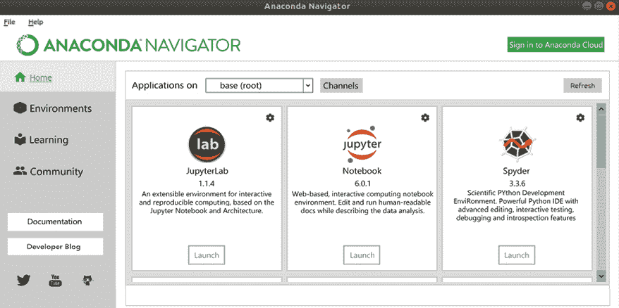
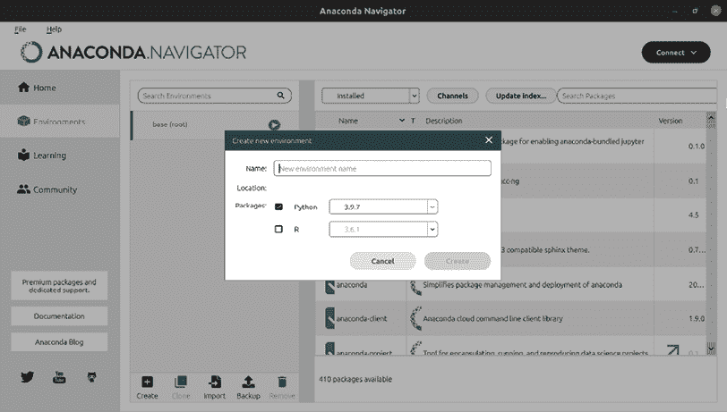

# 1

# 入门指南 – 每个项目一个环境

在本章中，你将了解为项目设置不同 Python 环境的方法，以及如何在单个系统上使用除包管理器提供的之外的多版本 Python。

环境设置完成后，我们将继续使用**Python 包索引**（**PyPI**）和`conda-forge`（与 Anaconda 耦合的包索引）来安装包。

最后，我们将探讨几种跟踪项目依赖的方法。

总结来说，以下主题将被涵盖：

+   使用`venv`、`pipenv`、`poetry`、`pyenv`和`anaconda`创建环境

+   通过`pip`、`poetry`、`pipenv`和`conda`安装包

+   使用`requirements.txt`、`poetry`和`pipenv`管理依赖项

# 虚拟环境

Python 生态系统提供了许多安装和管理包的方法。你可以简单地下载并解压代码到你的项目目录，使用操作系统的包管理器，或者使用像`pip`这样的工具来安装一个包。为了确保你的包不会冲突，建议你使用虚拟环境。虚拟环境是一个轻量级的 Python 安装，它有自己的包目录和从创建环境时使用的二进制文件复制（或链接）的 Python 二进制文件。

## 为什么虚拟环境是一个好主意

为每个 Python 项目创建虚拟环境可能看起来有些麻烦，但它提供了足够的优势来这样做。更重要的是，有多个原因说明使用`pip`全局安装包是一个非常糟糕的主意：

+   全局安装包通常需要提升权限（如`sudo`、`root`或`administrator`），这是一个巨大的安全风险。当执行`pip install <package>`时，该包的`setup.py`将以执行`pip install`命令的用户身份执行。这意味着如果包包含恶意软件，它现在拥有超级用户权限去做任何它想做的事情。别忘了任何人都可以上传包到 PyPI（[pypi.org](http://pypi.org)）而无需任何审查。正如你将在本书后面看到的，任何人创建和上传一个包只需要几分钟。

+   根据你如何安装 Python，它可能会与你的包管理器安装的现有包发生冲突。在 Ubuntu Linux 系统上，这意味着你可能会破坏`pip`甚至`apt`本身，因为`pip install -U <package>`会安装和更新包及其所有依赖项。

+   它可能会破坏你的其他项目。许多项目尽力保持向后兼容，但每次`pip install`都可能引入新的/更新的依赖项，这可能会破坏与其他包和项目的兼容性。例如，Django Web 框架在不同版本之间的变化足够大，以至于使用 Django 的许多项目在升级到最新版本后可能需要进行几个更改。所以，当你将系统上的 Django 升级到最新版本，并且有一个为旧版本编写的项目时，你的项目很可能会被破坏。

+   它会污染你的包列表，使得跟踪你的项目依赖变得困难。

除了缓解上述问题外，还有一个主要优势。在创建虚拟环境时，你可以指定 Python 版本（假设你已经安装了它）。这允许你轻松地在多个 Python 版本中测试和调试你的项目，同时保持除那之外的确切相同的包版本。

## 使用 venv 和 virtualenv

你可能已经熟悉了`virtualenv`，这是一个用于为你的 Python 安装创建虚拟环境的库。你可能不知道的是`venv`命令，它自 Python 3.3 版本以来就被包含在内，并且在大多数情况下可以作为`virtualenv`的替代品使用。为了简化问题，我建议创建一个目录来保存你所有的环境。有些人选择在项目内部使用`env`、`.venv`或`venv`目录，但我基于几个原因不建议这样做：

+   你的项目文件很重要，所以你可能希望尽可能频繁地备份它们。通过将包含所有已安装包的庞大环境保存在备份之外，你的备份会更快、更轻。

+   你的项目目录保持可移植性。你甚至可以将其保存在远程驱动器或闪存驱动器上，而不用担心虚拟环境只能在单个系统上工作。

+   它可以防止你意外地将虚拟环境文件添加到你的源代码控制系统中。

如果你确实决定将虚拟环境放在你的项目目录中，请确保将该目录添加到你的`.gitignore`文件（或类似文件）中，以便于你的版本控制系统。如果你想更快、更轻地备份，请将其排除在备份之外。有了正确的依赖跟踪，虚拟环境应该足够容易重建。

### 创建 venv

创建`venv`是一个相对简单的过程，但根据所使用的操作系统，它略有不同。

以下示例直接使用`virtualenv`模块，但为了方便，我建议使用稍后在本章中介绍的`poetry`，这个模块会在首次使用时自动为你创建虚拟环境。然而，在你升级到`poetry`之前，了解虚拟环境的工作原理是非常重要的。

自 Python 3.6 以来，`pyvenv`命令已被弃用，转而使用`python -m venv`。

在 Ubuntu 的案例中，必须通过 `apt` 安装 `python3-venv` 包，因为 Ubuntu 开发者通过不包含 `ensurepip` 来破坏了默认的 Python 安装。

对于 Linux/Unix/OS X，使用 `zsh` 或 `bash` 作为 shell，操作如下：

```py
$ python3 -m venv envs/your_env
$ source envs/your_env/bin/activate
(your_env) $ 
```

对于 Windows 的 `cmd.exe`（假设 `python.exe` 已添加到你的 `PATH`），操作如下：

```py
C:\Users\wolph>python.exe -m venv envs\your_env
C:\Users\wolph>envs\your_env\Scripts\activate.bat
(your_env) C:\Users\wolph> 
```

PowerShell 也支持类似的方式使用：

```py
PS C:\Users\wolph>python.exe -m venv envs\your_env
PS C:\Users\wolph> envs\your_env\Scripts\Activate.ps1
(your_env) PS C:\Users\wolph> 
```

第一个命令创建环境，第二个命令激活环境。激活环境后，`python` 和 `pip` 等命令将使用特定版本的环境，因此 `pip install` 只会在你的虚拟环境中安装。激活环境的一个有用副作用是在命令前加上环境名称的前缀，在这个例子中是 `(your_env)`。

注意，我们**不**使用 `sudo` 或其他提升权限的方法。提升权限既是不必要的，也可能是一个潜在的安全风险，如 *Why virtual environments are a good idea* 部分所述。

使用 `virtualenv` 而不是 `venv` 的方法很简单，只需替换以下命令：

```py
$ python3 -m venv envs/your_env 
```

使用这个：

```py
$ virtualenv envs/your_env 
```

使用 `virtualenv` 而不是 `venv` 的一个额外优点是，你可以指定 Python 解释器：

```py
$ virtualenv -p python3.8 envs/your_env 
```

而使用 `venv` 命令时，它会使用当前运行的 Python 安装，因此你需要通过以下调用来更改它：

```py
$ python3.8 -m venv envs/your_env 
```

### 激活 venv/virtualenv

每次你关闭 shell 后回到项目，都需要重新激活环境。虚拟环境的激活包括：

+   修改你的 `PATH` 环境变量，对于 Windows 使用 `envs\your_env\Script`，对于 Linux/Unix 则使用 `envs/your_env/bin`。

+   修改你的提示符，使其显示为 `(your_env) $` 而不是 `$`，这表明你正在虚拟环境中工作。

在 `poetry` 的案例中，你可以使用 `poetry shell` 命令来创建一个新的带有激活环境的 shell。

虽然你可以轻松手动修改这些设置，但一个更简单的方法是运行创建虚拟环境时生成的 `activate` 脚本。

对于使用 `zsh` 或 `bash` 作为 shell 的 Linux/Unix，操作如下：

```py
$ source envs/your_env/bin/activate
(your_env) $ 
```

对于使用 `cmd.exe` 的 Windows，操作如下：

```py
C:\Users\wolph>envs\your_env\Scripts\activate.bat
(your_env) C:\Users\wolph> 
```

对于使用 PowerShell 的 Windows，操作如下：

```py
PS C:\Users\wolph> envs\your_env\Scripts\Activate.ps1
(your_env) PS C:\Users\wolph> 
```

默认情况下，PowerShell 的权限可能过于严格，不允许这样做。你可以通过执行以下操作来更改当前 PowerShell 会话的策略：

```py
Set-ExecutionPolicy Unrestricted -Scope Process 
```

如果你希望为当前用户的所有 PowerShell 会话永久更改它，请执行以下操作：

```py
Set-ExecutionPolicy Unrestricted -Scope CurrentUser 
```

支持不同的 shell，如 `fish` 和 `csh`，分别使用 `activate.fish` 和 `activate.csh` 脚本。

当不使用交互式 shell（例如，使用 cron 作业时），你仍然可以使用 Python 解释器在 `bin` 或 `scripts` 目录中运行 Linux/Unix 或 Windows，分别代替运行 `python script.py` 或 `/usr/bin/python script.py`，你可以使用：

```py
/home/wolph/envs/your_env/bin/python script.py 
```

注意，通过 `pip` 安装的命令（以及 `pip` 本身）可以以类似的方式运行：

```py
/home/wolph/envs/your_env/bin/pip 
```

### 安装包

在你的虚拟环境中安装包可以使用 `pip` 正常进行：

```py
$ pip3 install <package> 
```

当查看已安装包的列表时，这是一个巨大的优势：

```py
$ pip3 freeze 
```

因为我们的环境与系统隔离，所以我们只能看到我们明确安装的包和依赖项。

在某些情况下，完全隔离虚拟环境与系统 Python 包可能是一个缺点。它占用更多的磁盘空间，并且包可能与系统上的 C/C++ 库不同步。例如，PostgreSQL 数据库服务器通常与 `psycopg2` 包一起使用。虽然大多数平台都有可用的二进制文件，并且从源代码构建包相对容易，但有时使用与系统捆绑的包可能更方便。这样，你可以确信该包与已安装的 Python 和 PostgreSQL 版本兼容。

要将你的虚拟环境与系统包混合，你可以在创建环境时使用 `--system-site-packages` 标志：

```py
$ python3 -m venv --system-site-packages envs/your_env 
```

当启用此标志时，环境将把系统 Python 环境的 `sys.path` 追加到你的虚拟环境的 `sys.path` 中，从而在虚拟环境中的 `import` 失败时，将系统包作为后备提供。

在你的虚拟环境中明确安装或更新一个包将有效地隐藏系统包在你的虚拟环境中。从你的虚拟环境中卸载该包将使其重新出现。

如你所料，这也影响了 `pip freeze` 的结果。幸运的是，`pip freeze` 可以被指示只列出虚拟环境本地的包，从而排除系统包：

```py
$ pip3 freeze --local 
```

在本章的后面部分，我们将讨论 `pipenv`，它为你透明地处理虚拟环境的创建。

## 使用 pyenv

`pyenv` 库使得快速安装和切换多个 Python 版本变得非常容易。许多 Linux 和 Unix 系统的一个常见问题是包管理器选择稳定性而不是最新性。在大多数情况下，这确实是一个优点，但如果你正在运行一个需要最新和最佳 Python 版本或非常旧版本的项目，那么你需要手动编译和安装它。`pyenv` 包使这个过程对你来说变得非常容易，但仍然需要安装编译器。

为了测试目的，`pyenv` 的一个很好的补充是 `tox` 库。这个库允许你同时运行你的测试在一系列 Python 版本上。`tox` 的使用在 *第十章*，*测试和日志记录 – 准备处理错误* 中有介绍。

要安装 `pyenv`，我建议访问 `pyenv` 项目页面，因为它高度依赖于你的操作系统和操作系统版本。对于 Linux/Unix，你可以使用常规的 `pyenv` 安装手册或 `pyenv-installer` ([`github.com/pyenv/pyenv-installer`](https://github.com/pyenv/pyenv-installer)) 一行命令，如果你认为足够安全的话：

```py
$ curl https://pyenv.run | bash 
```

确保遵循安装程序给出的说明。为了确保 `pyenv` 正确工作，你需要修改你的 `.zshrc` 或 `.bashrc` 文件。

Windows 不原生支持 `pyenv`（除了 Windows Subsystem for Linux），但有一个可用的 `pyenv` 分支：[`github.com/pyenv-win/pyenv-win#installation`](https://github.com/pyenv-win/pyenv-win#installation%20)

安装 `pyenv` 后，你可以使用以下命令查看支持的 Python 版本列表：

```py
$ pyenv install --list 
```

列表相当长，但在 Linux/Unix 上使用 `grep` 可以缩短：

```py
$ pyenv install --list | grep 3.10
  3.10.0
  3.10-dev
... 
```

一旦找到你喜欢的版本，你可以通过 `install` 命令来安装它：

```py
$ pyenv install 3.10-dev
Cloning https://github.com/python/cpython...
Installing Python-3.10-dev...
Installed Python-3.10-dev to /home/wolph/.pyenv/versions/3.10-dev 
```

`pyenv install` 命令接受一个可选的 `--debug` 参数，它构建一个调试版本的 Python，使得使用像 `gdb` 这样的调试器调试 C/C++ 扩展成为可能。

一旦构建了 Python 版本，你可以全局激活它，但你也可以使用 `pyenv-virtualenv` 插件 ([`github.com/pyenv/pyenv-virtualenv`](https://github.com/pyenv/pyenv-virtualenv)) 为你新创建的 Python 环境创建一个 `virtualenv`：

```py
$ pyenv virtualenv 3.10-dev your_pyenv 
```

在前面的例子中，与 `venv` 和 `virtualenv` 命令相比，`pyenv virtualenv` 自动在 `~/.pyenv/versions/<version>/envs/` 目录中创建环境，因此不允许你完全指定自己的路径。然而，你可以通过 `PYENV_ROOT` 环境变量更改基本路径（`~/.pyenv/`）。使用环境目录中的 `activate` 脚本激活环境仍然是可能的，但这比必要的要复杂，因为有一个简单的快捷方式：

```py
$ pyenv activate your_pyenv 
```

现在环境已经激活，你可以运行特定于环境的命令，例如 `pip`，并且它们只会修改你的环境。

## 使用 Anaconda

Anaconda 是一个支持 Python 和 R 编程语言的发行版。尽管它不仅仅是虚拟环境管理器；它是一个完全不同的 Python 发行版，拥有自己的虚拟环境系统和甚至一个完全不同的包系统。除了支持 PyPI，它还支持 `conda-forge`，该系统拥有大量专注于科学计算的包。

对于最终用户来说，最重要的区别是，包是通过`conda`命令而不是`pip`安装的。这为安装包时带来了更高级的依赖性检查。而`pip`会简单地安装一个包及其所有依赖项，而不考虑其他已安装的包，`conda`则会查看所有已安装的包，并确保不会安装一个不支持已安装包的版本。

`conda`包管理器在智能依赖性检查方面并不孤单。`pipenv`包管理器（本章稍后讨论）也做了类似的事情。

### 开始使用 Anaconda Navigator

在所有常见平台上安装 Anaconda 都非常简单。对于 Windows、OS X 和 Linux，您可以访问 Anaconda 网站并下载（图形）安装程序：[`www.anaconda.com/products/distribution#Downloads`](https://www.anaconda.com/products/distribution#Downloads)

安装完成后，继续的最简单方法是启动 Anaconda Navigator，它应该看起来像这样：



图 1.1：Anaconda Navigator – 主页

创建环境和安装包同样简单明了：

1.  点击左侧的**环境**按钮。

1.  点击下面的**创建**按钮。

1.  输入您的姓名和 Python 版本。

1.  点击**创建**以创建您的环境，并稍等片刻，直到 Anaconda 完成安装:

    图 1.2：Anaconda Navigator – 创建环境

一旦 Anaconda 完成了环境的创建，您应该会看到一个已安装包的列表。安装包可以通过将包列表的过滤器从**已安装**更改为**所有**，勾选您想要安装的包旁边的复选框，并应用更改来完成。

在创建环境时，Anaconda Navigator 会显示环境将被创建的位置。

### 开始使用 conda

虽然 Anaconda Navigator 是一个非常好的工具，可以用来获取概览，但能够从命令行运行代码也很方便。使用`conda`命令，这很幸运地非常简单。

首先，您需要打开`conda` shell。如果您愿意，可以从 Anaconda Navigator 中这样做，但您也可以直接运行它。在 Windows 上，您可以从开始菜单打开 Anaconda Prompt 或 Anaconda PowerShell Prompt。在 Linux 和 OS X 上，最方便的方法是初始化 shell 集成。对于 zsh，您可以使用：

```py
$ conda init zsh 
```

对于其他 shell，过程类似。请注意，此过程会修改您的 shell 配置，以便每次打开 shell 时自动激活`base`环境。这可以通过简单的配置选项来禁用：

```py
$ conda config --set auto_activate_base false 
```

如果自动激活未启用，您需要运行`activate`命令才能回到`conda base`环境：

```py
$ conda activate
(base) $ 
```

如果您想激活您之前创建的环境而不是`conda base`环境，您需要指定名称：

```py
$ conda activate conda_env
(conda_env) $ 
```

如果你还没有创建环境，你也可以使用命令行来创建：

```py
$ conda create --name conda_env
Collecting package metadata (current_repodata.json): done
Solving environment: done
...
Proceed ([y]/n)? y

Preparing transaction: done
Verifying transaction: done
Executing transaction: done
... 
```

要列出可用的环境，可以使用`conda info`命令：

```py
$ conda info --envs
# conda environments
#
base                  *  /usr/local/anaconda3
conda_env                /usr/local/anaconda3/envs/conda_env 
```

#### 安装 conda 包

现在是安装包的时候了。对于`conda`包，你可以简单地使用`conda install`命令。例如，要安装我维护的`progressbar2`包，可以使用以下命令：

```py
(conda_env) $ conda install progressbar2
Collecting package metadata (current_repodata.json): done
Solving environment: done

## Package Plan ##
  environment location: /usr/local/anaconda3/envs/conda_env

  added / updated specs:
    - progressbar2
The following packages will be downloaded:
...
The following NEW packages will be INSTALLED:
...
Proceed ([y]/n)? y

Downloading and Extracting Packages
... 
```

现在你可以运行 Python，看到包已经安装并且运行正常：

```py
(conda_env) $ python
Python 3.8.0 (default, Nov  6 2019, 15:49:01)
[Clang 4.0.1 (tags/RELEASE_401/final)] :: Anaconda, Inc. on darwin
Type "help", "copyright", "credits" or "license" for more information.
>>> import progressbar

>>> for _ in progressbar.progressbar(range(5)): pass
...
100% (5 of 5) |##############################| Elapsed Time: 0:00:00 Time:  0:00:00 
```

另一种验证包是否已安装的方法是运行`conda list`命令，它以类似于`pip list`的方式列出已安装的包：

```py
(conda_env) $ conda list
# packages in environment at /usr/local/anaconda3/envs/conda_env:
#
# Name                    Version                   Build  Channel
... 
```

#### 安装 PyPI 包

在 Anaconda 发行版中，对于 PyPI 包，我们有两种选项。最明显的是使用`pip`，但这有一个缺点，就是部分绕过了`conda`依赖检查器。虽然`conda install`会考虑通过 PyPI 安装的包，但`pip`命令可能会不希望地升级包。可以通过启用`conda`/`pip`互操作性设置来改善这种行为，但这会严重影响`conda`命令的性能：

```py
$ conda config --set pip_interop_enabled True 
```

根据固定版本或`conda`性能对你有多重要，你也可以选择将包转换为`conda`包：

```py
(conda_env) $ conda skeleton pypi progressbar2
Warning, the following versions were found for progressbar2
...
Use --version to specify a different version.
...
## Package Plan ##
...
The following NEW packages will be INSTALLED:
...
INFO:conda_build.config:--dirty flag and --keep-old-work not specified. Removing build/test folder after successful build/test. 
```

现在我们有了包，如果需要，我们可以修改文件，但使用自动生成的文件大多数时候都足够了。现在剩下的只是构建和安装包：

```py
(conda_env) $ conda build progressbar2
...
(conda_env) $ conda install --use-local progressbar2
Collecting package metadata (current_repodata.json): done
Solving environment: done
... 
```

现在我们已经完成了！包是通过`conda`而不是`pip`安装的。

#### 分享你的环境

当与他人协作时，拥有尽可能相似的环境是至关重要的，以避免调试本地问题。使用`pip`，我们可以简单地通过`pip freeze`创建一个需求文件，但这不会包括`conda`包。使用`conda`，实际上有一个更好的解决方案，它不仅存储了依赖和版本，还包括了安装渠道、环境名称和环境位置：

```py
(conda_env) $ conda env export –file environment.yml
(conda_env) $ cat environment.yml
name: conda_env
channels:
  - defaults
dependencies:
...
prefix: /usr/local/anaconda3/envs/conda_env 
```

在创建环境时，可以安装从该环境文件中获取的包：

```py
$ conda env create --name conda_env –file environment.yml 
```

或者，它们可以被添加到现有环境中：

```py
(conda_env) $ conda env update --file environment.yml
Collecting package metadata (repodata.json): done
... 
```

# 管理依赖

管理依赖的最简单方法是存储在`requirements.txt`文件中。在其最简单的形式中，这是一个包名称列表，没有其他内容。此文件可以扩展以包含版本要求，甚至可以支持特定环境的安装。

安装和管理依赖的一种更高级的方法是使用像`poetry`或`pipenv`这样的工具。内部，这些工具使用常规的`pip`安装方法，但它们构建了所有包的完整依赖图。这确保了所有包版本之间都是兼容的，并允许并行安装非依赖包。

## 使用 pip 和 requirements.txt 文件

`requirements.txt` 格式允许您以广泛或具体的方式列出您项目的所有依赖项。您可以轻松地自己创建此文件，也可以告诉 `pip` 为您生成它，甚至根据之前的 `requirements.txt` 文件生成新文件，以便您可以查看更改。我建议使用 `pip freeze` 生成初始文件，并选择您想要的依赖项（版本）。

例如，假设我们之前在我们的虚拟环境中运行了 `pip freeze`：

```py
(your_env) $ pip3 freeze
pkg-resources==0.0.0 
```

如果我们将该文件存储在 `requirements.txt` 文件中，安装一个包，并查看差异，我们得到以下结果：

```py
(your_env) $ pip3 freeze > requirements.txt
(your_env) $ pip3 install progressbar2
Collecting progressbar2
...
Installing collected packages: six, python-utils, progressbar2
Successfully installed progressbar2-3.47.0 python-utils-2.3.0 six-1.13.0
(your_env) $ pip3 freeze -r requirements.txt 
pkg-resources==0.0.0
## The following requirements were added by pip freeze:
progressbar2==3.47.0
python-utils==2.3.0
six==1.13.0 
```

如您所见，`pip freeze` 命令自动检测了 `six`、`progressbar2` 和 `python-utils` 包的添加，并立即将这些版本锁定到当前已安装的版本。

`requirements.txt` 文件中的行在命令行上也被 `pip` 理解，因此要安装特定版本，您可以运行：

```py
$ pip3 install 'progressbar2==3.47.0' 
```

## 版本指定符

然而，将版本严格锁定通常不是我们想要的，所以让我们将需求文件更改为只包含我们真正关心的内容：

```py
# We want a progressbar that is at least version 3.47.0 since we've tested that.
# But newer versions are ok as well.
progressbar2>=3.47.0 
```

如果有人想安装此文件中的所有需求，他们可以简单地告诉 `pip` 包含该需求：

```py
(your_env) $ pip3 install -r requirements.txt 
Requirement already satisfied: progressbar2>=3.47.0 in your_env/lib/python3.9/site-packages (from -r requirements.txt (line 1))
Requirement already satisfied: python-utils>=2.3.0 in your_env/lib/python3.9/site-packages (from progressbar2>=3.47.0->-r requirements.txt (line 1))
Requirement already satisfied: six in your_env/lib/python3.9/site-packages (from progressbar2>=3.47.0->-r requirements.txt (line 1)) 
```

在这种情况下，`pip` 会检查所有包是否已安装，并在需要时安装或更新它们。

`-r requirements.txt` 以递归方式工作，允许您包含多个需求文件。

现在假设我们遇到了最新版本中的错误，我们希望跳过它。我们可以假设只有这个特定的版本受到影响，因此我们只会将该版本列入黑名单：

```py
# Progressbar 2 version 3.47.0 has a silly bug but anything beyond 3.46.0 still works with our code
progressbar2>=3.46,!=3.47.0 
```

最后，我们应该谈谈通配符。最常见的情况之一是需要特定的主要版本号，但仍然想要最新的安全更新和错误修复。有几种方式可以指定这些：

```py
# Basic wildcard:
progressbar2 ==3.47.*
# Compatible release:
progressbar2 ~=3.47.1
# Compatible release above is identical to:
progressbar2 >=3.47.1, ==3.47.* 
```

使用兼容的发布模式 (~=)，您可以选择同一主要版本中最新的版本，但至少是指定的版本。

版本标识和依赖性指定标准在 PEP 440 中有详细描述：

[`peps.python.org/pep-0440/`](https://peps.python.org/pep-0440/)

## 通过源控制仓库安装

现在假设我们非常不幸，该包还没有可用的有效版本，但它已经被修复在 Git 仓库的 `develop` 分支中。我们可以通过 `pip` 或通过一个 `requirements.txt` 文件来安装它，如下所示：

```py
(your_env) $ pip3 install --editable 'git+https://github.com/wolph/python-progressbar@develop#egg=progressbar2'
Obtaining progressbar2 from git+https://github.com/wolph/python-progressbar@develop#egg=progressbar2
  Updating your_env/src/progressbar2 clone (to develop)
Requirement already satisfied: python-utils>=2.3.0 in your_env/lib/python3.9/site-packages (from progressbar2)
Requirement already satisfied: six in your_env/lib/python3.9/site-packages (from progressbar2)
Installing collected packages: progressbar2
  Found existing installation: progressbar2 3.47.0
    Uninstalling progressbar2-3.47.0:
      Successfully uninstalled progressbar2-3.47.0
  Running setup.py develop for progressbar2
Successfully installed progressbar2 
```

您可能会注意到 `pip` 不仅安装了包，而且还执行了 `git clone` 到 `your_env/src/progressbar2`。这是由 `--editable`（简写选项：`-e`）标志引起的可选步骤，它还有额外的优势，即每次您重新运行命令时，`git clone` 都会更新。这也使得进入该目录、修改代码并创建带有修复的 pull request 变得相当容易。

除了 Git 之外，还支持其他源代码控制系统，如 Bazaar、Mercurial 和 Subversion。

## 使用扩展添加额外依赖

许多软件包为特定用例提供可选依赖。在`progressbar2`库的情况下，我添加了`tests`和`docs`扩展来安装运行包测试或构建文档所需的依赖。扩展可以通过用逗号分隔的方括号指定：

```py
# Install the documentation and test extras in addition to the progressbar
progressbar2[docs,tests]
# A popular example is the installation of encryption libraries when using the requests library:
requests[security] 
```

## 使用环境标记的条件依赖

如果你的项目需要在多个系统上运行，你很可能会遇到不是所有系统都需要的依赖项。一个例子是某些操作系统需要但其他操作系统不需要的库。例如，我维护的`portalocker`包；在 Linux/Unix 系统上，所需的锁定机制是默认支持的。然而，在 Windows 上，它们需要`pywin32`包才能工作。包的`install_requires`部分（使用与`requirements.txt`相同的语法）包含以下行：

```py
pywin32!=226; platform_system == "Windows" 
```

这指定了在 Windows 上需要`pywin32`软件包，由于一个错误，版本`226`被列入黑名单。

除了`platform_system`之外，还有几个其他标记，例如`python_version`和`platform_machine`（例如包含`x86_64`架构）。

可以在 PEP 496 中找到完整的标记列表：[`peps.python.org/pep-0496/`](https://peps.python.org/pep-0496/)。

另一个有用的例子是`dataclasses`库。这个库从 Python 3.7 版本开始就包含在 Python 中，所以我们只需要为旧版本的 Python 安装回溯包：

```py
dataclasses; python_version < '3.7' 
```

## 使用`poetry`进行自动项目管理

`poetry`工具提供了一个非常易于使用的解决方案，用于创建、更新和共享你的 Python 项目。它也非常快速，这使得它成为项目的绝佳起点。

### 创建一个新的`poetry`项目

开始一个新项目非常简单。它会自动为你处理虚拟环境、依赖项和其他项目相关任务。要开始，我们将使用`poetry init`向导：

```py
$ poetry init
This command will guide you through creating your pyproject.toml config.

Package name [t_00_poetry]:
Version [0.1.0]:
Description []:
Author [Rick van Hattem <Wolph@wol.ph>, n to skip]:
License []:
Compatible Python versions [³.10]:

Would you like to define your main dependencies interactively? (yes/no) [yes] no
Would you like to define your development dependencies interact...? (yes/no) [yes] no
...
Do you confirm generation? (yes/no) [yes] 
```

按照这几个问题，它会自动为我们创建一个包含所有输入数据和一些自动生成数据的`pyproject.toml`文件。正如你可能已经注意到的，它会自动为我们预填入几个值：

+   项目名称。这是基于当前目录名称。

+   版本。这是固定为`0.1.0`。

+   作者字段。这会查看你的`git`用户信息。这可以通过以下方式设置：

    ```py
    $ git config --global user.name "Rick van Hattem"
    $ git config --global user.email "Wolph@wol.ph" 
    ```

+   Python 版本。这是基于你运行`poetry`时使用的 Python 版本，但可以通过`poetry init --python=...`进行自定义。

查看生成的`pyproject.toml`，我们可以看到以下内容：

```py
[tool.poetry]
name = "t_00_poetry"
version = "0.1.0"
description = ""
authors = ["Rick van Hattem <Wolph@wol.ph>"]

[tool.poetry.dependencies]
python = "³.10"

[tool.poetry.dev-dependencies]

[build-system]
requires = ["poetry-core>=1.0.0"]
build-backend = "poetry.core.masonry.api" 
```

### 添加依赖项

一旦项目启动并运行，我们现在可以添加依赖项：

```py
$ poetry add progressbar2
Using version ³.55.0 for progressbar2
...
Writing lock file
...
  • Installing progressbar2 (3.55.0) 
```

此命令会自动安装包，将其添加到`pyproject.toml`文件中，并将特定版本添加到`poetry.lock`文件中。在此命令之后，`pyproject.toml`文件在`tool.poetry.dependencies`部分添加了一行新内容：

```py
[tool.poetry.dependencies]
python = "³.10"
progressbar2 = "³.55.0" 
```

`poetry.lock`文件要具体一些。虽然`progressbar2`依赖项可以有通配符版本，但`poetry.lock`文件存储了确切的版本、文件哈希以及所有已安装的依赖项：

```py
[[package]]
name = "progressbar2"
version = "3.55.0"
... 
[package.dependencies]
python-utils = ">=2.3.0"
...
[package.extras]
docs = ["sphinx (>=1.7.4)"]
...
[metadata]
lock-version = "1.1"
python-versions = "³.10"
content-hash = "c4235fba0428ce7877f5a94075e19731e5d45caa73ff2e0345e5dd269332bff0"

[metadata.files]
progressbar2 = [
    {file = "progressbar2-3.55.0-py2.py3-none-any.whl", hash = "sha256:..."},
    {file = "progressbar2-3.55.0.tar.gz", hash = "sha256:..."},
]
... 
```

通过拥有所有这些数据，我们可以在另一个系统上构建或重建一个基于`poetry`的项目虚拟环境，使其与原始系统上创建的完全一致。为了按照`poetry.lock`文件中指定的方式安装、升级和/或降级包，我们需要一个单独的命令：

```py
$ poetry install
Installing dependencies from lock file
... 
```

如果你熟悉`npm`和`yarn`命令，这与你所熟悉的方式非常相似。

### 升级依赖项

在前面的示例中，我们只是添加了一个依赖项，而没有指定显式的版本。通常这是一个安全的方法，因为默认版本要求将允许该主要版本内的任何版本。

如果项目使用常规 Python 版本或语义版本（更多关于这一点在*第十八章*，*打包 - 创建您自己的库或应用程序*），那应该很完美。至少，我的所有项目（如 progressbar2）通常都是向后兼容和大部分向前兼容的，所以仅仅修复主要版本就足够了。在这种情况下，`poetry`默认设置为版本`³.55.0`，这意味着任何大于或等于 3.55.0 的版本，直到（但不包括）4.0.0 都是有效的。

由于`poetry.lock`文件，`poetry install`将导致安装那些确切版本，而不是新版本。那么我们如何升级依赖项？为此，我们将首先安装`progressbar2`库的较旧版本：

```py
$ poetry add 'progressbar2=3.1.0' 
```

现在，我们将`pyproject.toml`文件中的版本放宽到`³.1.0`：

```py
[tool.poetry.dependencies]
progressbar2 = "³.1.0" 
```

一旦我们这样做，`poetry install`仍然会保留`3.1.0`版本，但我们可以让`poetry`为我们更新依赖项：

```py
$ poetry update
...
  • Updating progressbar2 (3.1.0 -> 3.55.0) 
```

现在，`poetry`已经很好地更新了我们的项目依赖项，同时仍然遵守我们在`pyproject.toml`文件中设定的要求。如果你将所有包的版本要求设置为`*`，它将始终更新到彼此兼容的最新版本。

### 运行命令

要使用`poetry`环境运行单个命令，你可以使用`poetry run`：

```py
$ poetry run pip 
```

然而，对于整个开发会话，我建议使用`shell`命令：

```py
$ poetry shell 
```

在此之后，你可以像往常一样运行所有 Python 命令，但现在这些命令将是从激活的虚拟环境中运行的。

对于 cron 作业来说，情况类似，但你需要确保首先更改目录：

```py
0 3 * * *       cd /home/wolph/workspace/poetry_project/ && poetry run python script.py 
```

此命令每天凌晨 3 点（24 小时制，所以是上午）运行。

注意，由于环境不同，cron 可能找不到 `poetry` 命令。在这种情况下，我建议使用 `poetry` 命令的绝对路径，这可以通过 `which` 命令找到：

```py
$ which poetry
/usr/local/bin/poetry 
```

## 使用 pipenv 进行自动依赖项跟踪

对于大型项目，您的依赖项可能会经常变化，这使得手动操作 `requirements.txt` 文件相当繁琐。此外，在安装包之前必须创建虚拟环境，如果您在多个项目上工作，这也是一项相当重复的任务。`pipenv` 工具旨在为您透明地解决这些问题，同时确保所有依赖项都是兼容和更新的。作为最后的额外好处，它结合了严格和宽松的依赖项版本，这样您就可以确保您的生产环境使用与您测试时完全相同的版本。

初始使用很简单；进入您的项目目录并安装一个包。让我们试一试：

```py
$ pipenv install progressbar2
Creating a virtualenv for this project...
...
Using /usr/local/bin/python3 (3.10.4) to create virtualenv...
...
 Successfully created virtual environment!
...
Creating a Pipfile for this project...
Installing progressbar2...
Adding progressbar2 to Pipfile's [packages]...
 Installation Succeeded
Pipfile.lock not found, creating...
...
 Success!
Updated Pipfile.lock (996b11)!
Installing dependencies from Pipfile.lock (996b11)...
   0/0 — 00:00:0 
```

即使是简化的输出也相当多。但让我们看看发生了什么：

+   创建了一个虚拟环境。

+   创建了一个 `Pipfile`，其中包含您指定的依赖项。如果您指定了特定版本，它将被添加到 `Pipfile` 中；否则，它将是一个通配符要求，这意味着只要没有与其他包冲突，任何版本都将被接受。

+   创建了一个包含已安装包和版本的 `Pipfile.lock`，这允许在不同的机器上使用完全相同的版本进行相同的安装。

生成的 `Pipfile` 包含以下内容：

```py
[[source]]
name = "pypi"
url = "https://pypi.org/simple"
verify_ssl = true

[dev-packages]

[packages]
progressbar2 = "*"

[requires]
python_version = "3.10" 
```

而 `Pipfile.lock` 稍大一些，但立即显示了这种方法的优势：

```py
{
    ...
    "default": {
        "progressbar2": {
            "hashes": [
                "sha256:14d3165a1781d053...",
                "sha256:2562ba3e554433f0..."
            ],
            "index": "pypi",
            "version": "==4.0.0"
        },
        "python-utils": {
            "hashes": [
                "sha256:4dace6420c5f50d6...",
                "sha256:93d9cdc8b8580669..."
            ],
            "markers": "python_version >= '3.7'",
            "version": "==3.1.0"
        },
        ...
    },
    "develop": {}
} 
```

如您所见，除了确切的包版本外，`Pipfile.lock` 还包含了包的哈希值。在这种情况下，该包提供了 `.tar.gz`（源文件）和 `.whl`（wheel 文件），这就是为什么有两个哈希值。此外，`Pipfile.lock` 包含了 `pipenv` 安装的所有包，包括所有依赖项。

使用这些哈希值，您可以确信在部署过程中，您将收到完全相同的文件，而不会是损坏的甚至恶意文件。

由于版本完全固定，您也可以确信任何使用 `Pipfile.lock` 部署您项目的用户都将获得完全相同的包版本。当与其他开发者合作工作时，这非常有用。

要安装 `Pipfile` 中指定的所有必要包（即使是初始安装），您只需运行：

```py
$ pipenv install
Installing dependencies from Pipfile.lock (5c99e1)…
   3/3 — 00:00:00
To activate this project's virtualenv, run pipenv shell.
Alternatively, run a command inside the virtualenv with pipenv run. 
```

每次运行`pipenv install package`时，`Pipfile`将自动根据你的更改进行修改，并检查是否存在不兼容的包。但最大的缺点是`pipenv`对于大型项目可能会变得非常慢。我遇到过多个项目，其中无操作的`pip install`命令需要几分钟的时间，因为需要检索和检查整个依赖图。然而，在大多数情况下，这样做仍然是值得的；增加的功能可以为你节省很多麻烦。

不要忘记使用`pipenv run`前缀或从`pipenv shell`运行你的常规 Python 命令。

### 更新你的包

由于依赖图，你可以轻松更新你的包，而无需担心依赖冲突。一条命令就可以完成：

```py
$ pipenv update 
```

如果你仍然因为某些包没有相互检查而遇到版本问题，你可以通过指定你想要或不需要的包的版本来修复这个问题：

```py
$ pipenv install 'progressbar2!=3.47.0'
Installing progressbar2!=3.47.0…
Adding progressbar2 to Pipfile's [packages]…
 Installation Succeeded 
Pipfile.lock (c9327e) out of date, updating to (5c99e1)…
 Success! 
Updated Pipfile.lock (c9327e)!
Installing dependencies from Pipfile.lock (c9327e)…
   3/3 — 00:00:00 
```

通过运行该命令，`Pipfile`中的`packages`部分将更改为：

```py
[packages]
progressbar2 = "!=3.47.0" 
```

### 部署到生产环境

在所有生产服务器上获取完全相同的版本对于防止难以追踪的错误至关重要。为此，你可以告诉`pipenv`安装`Pipenv.lock`文件中指定的所有内容，同时检查`Pipfile.lock`是否过时。一条命令就可以拥有一个完全功能的生产虚拟环境，其中包含所有已安装的包。

让我们创建一个新的目录，看看一切是否顺利：

```py
$ mkdir ../pipenv_production
$ cp Pipfile Pipfile.lock ../pipenv_production/
$ cd ../pipenv_production/
$ pipenv install --deploy
Creating a virtualenv for this project...
Pipfile: /home/wolph/workspace/pipenv_production/Pipfile
Using /usr/bin/python3 (3.10.4) to create virtualenv...
...
 Successfully created virtual environment!
...
Installing dependencies from Pipfile.lock (996b11)...
   2/2 — 00:00:01
$ pipenv shell
Launching subshell in virtual environment...
(pipenv_production) $ pip3 freeze
progressbar2==4.0.0
python-utils==3.1.0 
```

所有版本都完全符合预期，并已准备好使用。

### 运行 cron 命令

要在`pipenv shell`之外运行你的 Python 命令，你可以使用`pipenv run`前缀。而不是`python`，你会运行`pipenv run python`。在正常使用中，这比激活`pipenv shell`要少用得多，但对于非交互式会话，如 cron 作业，这是一个基本功能。例如，每天凌晨 3:00（24 小时制，所以是上午）运行的 cron 作业可能看起来像这样：

```py
0 3 * * *       cd /home/wolph/workspace/pipenv_project/ && pipenv run python script.py 
```

# 练习

本章讨论的许多主题已经提供了完整的示例，几乎没有留下练习的空间。然而，还有其他资源可以探索。

## 阅读 Python 增强提案（PEPs）

了解本章（以及所有后续章节）讨论的主题的一个好方法是阅读 PEP 页面。这些提案是在更改被接受到 Python 核心之前编写的。请注意，Python 网站上并非所有 PEP 都被接受，但它们将保留在 Python 网站上：

+   PEP 440 – 版本标识和依赖规范：[`peps.python.org/pep-0440/`](https://peps.python.org/pep-0440/)

+   PEP 496 – 环境标记：[`peps.python.org/pep-0496/`](https://peps.python.org/pep-0496/)

## 结合 pyenv 和 poetry 或 pipenv

即使本章没有涉及，也没有什么阻止你告诉 `poetry` 或 `pipenv` 使用基于 `pyenv` 的 Python 解释器。试试看吧！

## 将现有项目转换为 poetry 项目

本练习的一部分应该是创建一个新的 `pyproject.toml` 文件，或者将现有的 `requirements.txt` 文件转换为 `pyproject.toml`。

# 摘要

在本章中，你学习了为什么虚拟环境是有用的，你发现了它们的几个实现及其优点。我们探讨了如何创建虚拟环境以及如何安装多个不同的 Python 版本。最后，我们介绍了如何管理 Python 项目的依赖项。

由于 Python 是一种解释型语言，因此直接从解释器运行代码而不是通过 Python 文件运行是很容易的。

默认的 Python 解释器已经具有命令历史记录，并且根据你的安装，还提供基本的自动补全功能。

但是，使用替代解释器，我们可以在解释器中获得更多功能，例如语法高亮、智能自动补全（包括文档）等。

下一章将向我们展示几个替代解释器和它们的优点。

# 加入我们的 Discord 社区

加入我们社区的 Discord 空间，与作者和其他读者进行讨论：[`discord.gg/QMzJenHuJf`](https://discord.gg/QMzJenHuJf)


