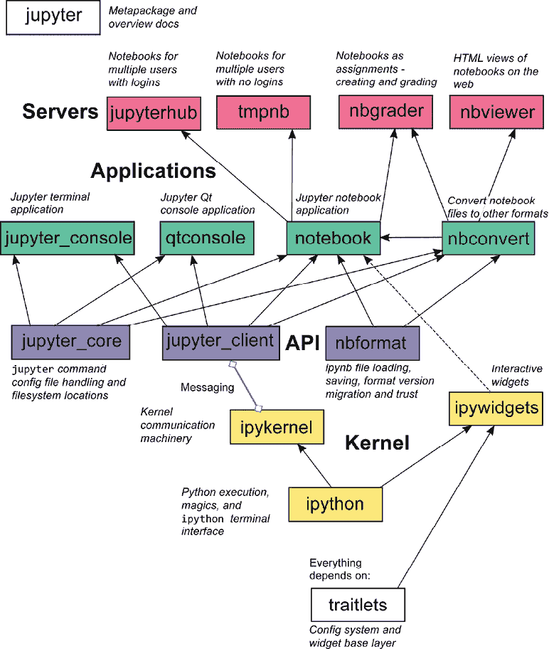
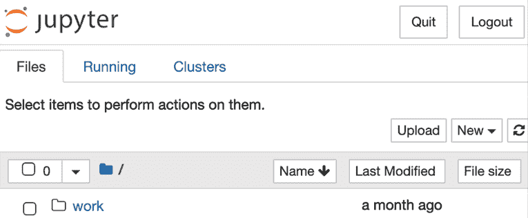
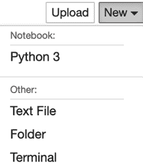
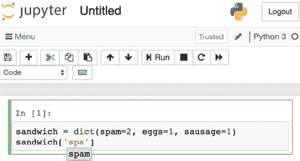
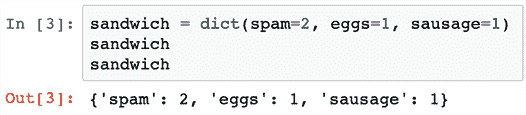
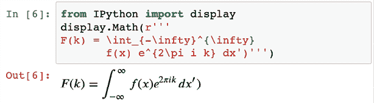
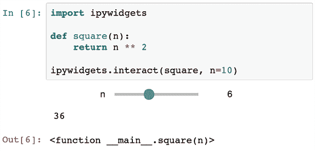

# 2

# 交互式 Python 解释器

现在我们已经安装了一个有效的 Python，我们需要运行一些代码。最明显的方法是创建一个 Python 文件并执行它。然而，从交互式 Python 解释器中交互式地开发代码通常更快。虽然标准 Python 解释器已经很强大，但还有许多增强和替代方案可用。

替代解释器/外壳提供如下功能：

+   智能自动完成

+   语法高亮

+   保存和加载会话

+   自动缩进

+   图形/图表输出

在本章中，您将了解：

+   替代解释器：

    +   `bpython`

    +   `ptpython`

    +   `ipython`

    +   `jupyter`

+   如何增强解释器

# Python 解释器

标准 Python 解释器已经很强大，但通过自定义还有更多选项可用。首先，让我们从`'Hello world!'`开始。因为解释器使用 REPL，所有输出都将自动打印，我们只需创建一个字符串即可。

有时交互式解释器被称为**REPL**。这代表**读取-评估-打印-循环**。这实际上意味着您的所有语句都将立即执行并打印到您的屏幕上。

首先，我们需要启动解释器；然后，我们可以输入我们的命令：

```py
$ python3
Python 3.9.0
[GCC 7.4.0] on linux
Type "help", "copyright", "credits" or "license" for more information.
>>> 'Hello world!'
'Hello world!' 
```

这很简单。并且请注意，我们不必使用`print('Hello world!')`来显示输出。

许多解释器对 Windows 的支持仅限于有限。虽然它们在某种程度上都能工作，但使用 Linux 或 OS X 系统您的体验会更好。我建议至少尝试一次从（虚拟）Linux/Unix 机器上使用它们，以体验其全部功能。

## 修改解释器

作为我们的第一个增强功能，我们将向解释器的范围内添加一些方便的快捷键。我们不必每次启动解释器时都输入`import pprint; pprint.pprint(...)`来美化输出，使用`pp(...)`而不必每次都运行一个`import`语句会更有用。为此，我们将创建一个 Python 文件，每次我们运行 Python 时都会执行它。在 Linux 和 OS X 系统上，我建议使用~`/.config/python/init.py`；在 Windows 上，可能像`C:\Users\rick\AppData\Local\Python\init.py`这样的路径更合适。在这个文件中，我们可以添加将被执行的常规 Python 代码。

Python 不会自动找到该文件；您需要通过使用`PYTHONSTARTUP`环境变量来告诉 Python 在哪里查找该文件。在 Linux 和 OS X 上，您可以更改`~/.zshrc`、`~/.bashrc`文件或您的 shell 拥有的任何文件，并添加：

```py
$ export PYTHONSTARTUP=~/.config/python/init.py 
```

此文件每次您打开一个新的 shell 会话时都会自动执行。所以，一旦您打开一个新的 shell 会话，您就完成了。

如果您想激活当前 shell 的此功能，您也可以在当前 shell 中运行上面的 export 行。

在 Windows 上，您需要在高级系统设置中找到并更改该屏幕上的环境变量。

现在我们可以将这些行添加到文件中，以便默认启用并增强自动补全（`pprint`/`pp`）和美观格式化（`pformat`/`pf`）：

```py
from pprint import pprint as pp
from pprint import pformat as pf 
```

当我们运行 Python 解释器时，现在我们将在我们的作用域中拥有`pp`和`pf`：

```py
>>> pp(dict(spam=0xA, eggs=0xB))
{'eggs': 11, 'spam': 10}
>>> pf(dict(spam=0xA, eggs=0xB))
"{'eggs': 11, 'spam': 10}" 
```

通过这些小的改动，你可以使你的生活变得更加轻松。例如，你可以修改你的`sys.path`以包括一个包含自定义库的目录。你也可以使用`sys.ps1`和`sys.ps2`变量来更改你的提示符。为了说明，我们将查看更改之前的解释器：

```py
# Modifying prompt
>>> if True:
...     print('Hello!')
Hello! 
```

现在我们将修改`sys.ps1`和`sys.ps2`，并再次运行相同的代码：

```py
>>> import sys

>>> sys.ps1 = '> '
>>> sys.ps2 = '. '

# With modified prompt
> if True:
.     print('Hello!')
Hello! 
```

上述配置表明，如果你愿意，你可以轻松地将解释器更改为略有不同的输出。然而，出于一致性的目的，可能最好保持它不变。

### 启用并增强自动补全

解释器中最有用的添加之一是`rlcompleter`模块。此模块使你的解释器中启用 Tab 激活的自动补全，如果`readline`模块可用，则自动激活。

`rlcompleter`模块依赖于`readline`模块的可用性，该模块不是 Windows 系统上 Python 的捆绑模块。幸运的是，可以轻松安装一个替代品：

```py
$ pip3 install pyreadline 
```

为自动补全添加一些额外选项将非常有用。首先，看看默认输出：

```py
>>> sandwich = dict(spam=2, eggs=1, sausage=1)
>>> sandwich.<TAB>
sandwich.clear(       sandwich.fromkeys(    sandwich.items(       sandwich.pop(
sandwich.setdefault(  sandwich.values(      sandwich.copy(        sandwich.get(
sandwich.keys(        sandwich.popitem(     sandwich.update(
>>> sandwich[<TAB> 
```

如你所见，"`.`"的 Tab 补全工作得很好，但"`[`"的 Tab 补全没有任何作用。了解可用项将很有用，所以现在我们将努力添加这个功能。需要注意的是，这个例子使用了一些在后面的章节中解释的技术，但这对现在来说并不重要：

```py
import __main__
import re
import atexit
import readline
import rlcompleter

class Completer(rlcompleter.Completer):
    ITEM_RE = re.compile(r'(?P<expression>.+?)\[(?P<key>[^\[]*)')

    def complete(self, text, state):
        # Init namespace. From 'rlcompleter.Completer.complete'
        if self.use_main_ns:
            self.namespace = __main__.__dict__

        # If we find a [, try and return the keys
        if '[' in text:
            # At state 0 we need to prefetch the matches, after
            # that we use the cached results
            if state == 0:
                self.matches = list(self.item_matches(text))

            # Try and return the match if it exists
            try:
                return self.matches[state]
            except IndexError:
                pass
        else:
            # Fallback to the normal completion
            return super().complete(text, state)

    def item_matches(self, text):
        # Look for the pattern expression[key
        match = self.ITEM_RE.match(text)
        if match:
            search_key = match.group('key').lstrip()
            expression = match.group('expression')

            # Strip quotes from the key
            if search_key and search_key[0] in {"'", '"'}:
                search_key = search_key.strip(search_key[0])

            # Fetch the object from the namespace
            object_ = eval(expression, self.namespace)

            # Duck typing, check if we have a 'keys()' attribute
            if hasattr(object_, 'keys'):
                # Fetch the keys by executing the 'keys()' method
                # Can you guess where the bug is?
                keys = object_.keys()
                for i, key in enumerate(keys):
                    # Limit to 25 items for safety, could be infinite
                    if i >= 25:
                        break

                    # Only return matching results
                    if key.startswith(search_key):
                        yield f'{expression}[{key!r}]'

# By default readline doesn't call the autocompleter for [ because
# it's considered a delimiter. With a little bit of work we can
# fix this however :)
delims = readline.get_completer_delims()
# Remove [, ' and " from the delimiters
delims = delims.replace('[', '').replace('"', '').replace("'", '')
# Set the delimiters
readline.set_completer_delims(delims)

# Create and set the completer
completer = Completer()
readline.set_completer(completer.complete)
# Add a cleanup call on Python exit
atexit.register(lambda: readline.set_completer(None))
print('Done initializing the tab completer') 
```

这段代码相当多，如果你仔细看，你会在这个有限的例子中注意到多个潜在的 bug。我只是试图在这里展示一个工作示例，而不引入太多的复杂性，所以没有考虑几个边缘情况。为了使脚本工作，我们需要像之前讨论的那样将其存储在`PYTHONSTARTUP`文件中。打开解释器后，你应该看到`print()`的结果，这样你可以验证脚本是否已加载。有了这个添加，我们现在可以完成字典键：

```py
Done initializing the tab completer
>>> sandwich = dict(spam=2, eggs=1, sausage=1)
>>> sandwich['<TAB>
sandwich['eggs']     sandwich['sausage']  sandwich['spam'] 
```

自然地，你可以扩展它以包括颜色、其他补全和许多其他有用的功能。

由于这个补全调用`object.keys()`，这里存在潜在的风险。如果出于某种原因，`object.keys()`方法代码不安全执行，这段代码可能会很危险。也许你正在运行外部库，或者你的代码已覆盖`keys()`方法以执行一个重量级数据库函数。如果`object.keys()`是一个在执行一次后耗尽的生成器，那么在运行实际代码后你将没有任何结果。

此外，`eval()`函数在执行未知代码时可能很危险。在这种情况下，`eval()`只执行我们自己输入的行，所以这里的问题不大。

# 替代解释器

现在你已经看到了常规 Python 解释器的一些功能，让我们来看看一些增强的替代方案。有许多选项可用，但我们将限制在这里介绍最流行的几个：

+   `bpython`

+   `ptpython`

+   `ipython`

+   `jupyter`（基于网页的 `ipython`）

让我们开始吧。

## bpython

`bpython` 解释器是 Python 解释器的 `curses` 接口，提供了许多有用的功能，同时仍然非常类似于常规的 Python 解释器。

`curses` 库允许你创建一个完全功能的**基于文本的用户界面**（**TUI**）。TUI 可以让你完全控制你想要写入屏幕的位置。常规的 Python 解释器是一个**命令行界面**（**CLI**），通常只允许你向屏幕追加内容。使用 TUI，你可以将内容写入屏幕上的任何位置，使其功能与**图形用户界面**（**GUI**）有某种程度的相似性。

`bpython` 的一些关键特性：

+   输入时自动补全（与 `rlcompleter` 的制表符补全相反）

+   输入时内联语法高亮

+   自动函数参数文档

+   一个可以撤销/倒退的功能，用于删除最后一行

+   容易重新加载导入的模块，这样你就可以在不重新启动解释器的情况下测试外部代码的变化

+   在外部编辑器中快速更改代码（对于多行函数/代码块来说很方便）

+   能够将会话保存到文件/粘贴板

大多数这些功能都会为你完全自动且透明地工作。在我们开始使用 `bpython` 之前，我们需要安装它。一个简单的 `pip install` 就足够了：

```py
$ pip3 install bpython 
```

为了说明自动启用的功能，以下是用于常规 Python 解释器补全的代码输出：

```py
$ bpython
bpython version 0.21 on top of Python 3.9.6
>>> sandwich = dict(spam=2, eggs=1, sausage=1)
┌────────────────────────────────────────────────────────────────┐
│ dict: (self, *args, **kwargs)                                  │
│ Initialize self.  See help(type(self)) for accurate signature. │
└────────────────────────────────────────────────────────────────┘
>>> sandwich.
┌────────────────────────────────────────────────────────────────┐
│ clear               copy                fromkeys               │
│ get                 items               keys                   │
│ pop                 popitem             setdefault             │
│ update              values                                     │
└────────────────────────────────────────────────────────────────┘
>>> sandwich[
┌────────────────────────────────────────────────────────────────┐
│ 'eggs'     'sausage'  'spam'                                   │
└────────────────────────────────────────────────────────────────┘ 
```

如果你在自己的系统上运行此代码，你也会看到高亮显示以及自动补全的中间状态。我鼓励你试一试；前面的摘录不足以展示。

### 撤销你的会话

对于更高级的功能，让我们也尝试一下。首先，让我们从倒退功能开始。虽然它看起来只是简单地删除最后一行，但在后台，它实际上会重新播放你的整个历史记录，除了最后一行。这意味着如果你的代码不安全多次运行，可能会引起错误。以下代码说明了倒退功能的用法和限制：

```py
>>> with open('bpython.txt', 'a') as fh:
...     fh.write('x')
...
1

>>> with open('bpython.txt') as fh:
...     print(fh.read())
...
x

>>> sandwich = dict(spam=2, eggs=1, sausage=1) 
```

现在如果我们按下 *Ctrl* + *R* 来“倒退”最后一行，我们会得到以下输出：

```py
>>> with open('bpython.txt', 'a') as fh:
...     fh.write('x')
...
1

>>> with open('bpython.txt') as fh:
...     print(fh.read())
...
xx

>>> 
```

如你所见，最后一行现在消失了，但这还不是全部；`fh.read()` 行的输出现在是 `xx` 而不是 `x,`，这意味着写入 `x` 的行被执行了两次。此外，部分行也会被执行，所以当你撤销缩进的代码块时，你会看到一个错误，直到你再次执行有效的代码。

### 重新加载模块

在开发过程中，我经常在我的常规编辑器中编写代码，并在 Python 壳中测试执行。

当这样开发时，Python 的一个非常有用的特性是使用`importlib.reload()`重新加载导入的模块。当您有多个（嵌套）模块时，这可能会很快变得繁琐。这就是`bpython`中的重新加载快捷键能大量帮助的地方。通过使用键盘上的*F6*按钮，`bpython`不仅会在`sys.modules`中的所有模块上运行`importlib.reload()`，而且还会以类似您之前看到的回放功能的方式重新运行会话中的代码。

为了演示这一点，我们将首先创建一个名为`bpython_reload.py`的文件，并包含以下代码：

```py
with open('reload.txt', 'a+') as fh:
    fh.write('x')
    fh.seek(0)
    print(fh.read()) 
```

这将以追加模式打开`reload.txt`文件进行读写。这意味着`fh.write('x')`将追加到文件末尾。`fh.seek(0)`将跳转到文件开头（位置 0），以便`print(fh.read())`可以将整个文件内容打印到屏幕上。

现在我们打开`bpython` shell 并导入模块：

```py
>>> import bpython_reload
x 
```

如果我们在同一个 shell 中按*F6*按钮，我们会看到已经写入了一个额外的字符，并且代码已经被重新执行：

```py
>>> import bpython_reload
xx
Reloaded at ... by user. 
```

这是一个非常有用的特性，与回放功能有相同的警告，即并非所有代码都是安全的，可以无副作用地重新执行。

## ptpython

`ptpython`解释器比`bpython`（自 2009 年可用）年轻（自 2014 年可用），因此可能稍微不够成熟，功能也不够丰富。然而，它正在非常积极地开发，并且绝对值得提及。虽然目前没有与`bpython`中类似的代码重新加载功能，但还有一些其他有用的功能是`bpython`目前所缺少的：

+   多行代码编辑

+   鼠标支持

+   Vi 和 Emacs 键绑定

+   输入时的语法检查

+   历史浏览器

+   输出突出显示

这些特性都是您需要亲自体验的；在这种情况下，一本书并不是演示的正确媒介。无论如何，这个解释器绝对值得一看。

安装可以通过简单的`pip install`完成：

```py
$ pip3 install ptpython 
```

安装后，您可以使用`ptpython`命令运行它：

```py
$ ptpython
>>> 
```

一旦解释器开始运行，您可以使用内置菜单配置`ptpython`（按*F2*）。在该菜单中，您可以配置和启用/禁用诸如字典完成、输入时完成、输入验证、颜色深度和突出显示颜色等功能。

## IPython 和 Jupyter

IPython 解释器与之前提到的解释器完全不同。它不仅是功能最丰富的解释器，还是包括并行计算、与可视化工具包集成、交互式小部件和基于 Web 的解释器（Jupyter）在内的整个生态系统的一部分。

IPython 解释器的某些关键特性：

+   简单的对象内省

+   输出格式化（而不是`repr()`，IPython 调用`pprint.pformat()`）

+   命令历史可以通过新会话和旧会话中的变量和魔法方法访问

+   保存和加载会话

+   一系列魔法命令和快捷方式

+   访问如 `cd` 和 `ls` 这样的常规 shell 命令

+   可扩展的自动补全，不仅支持 Python 方法和函数，还支持文件名

IPython 项目的其他一些特性在关于调试、多进程、科学编程和机器学习的章节中有所介绍。

IPython 的基本安装可以使用 `pip install` 完成：

```py
$ pip3 install ipython 
```

通过 Anaconda 安装也是一个不错的选择，尤其是如果你计划使用大量的数据科学包，这些包通常通过 `conda` 安装和管理要容易得多：

```py
$ conda install ipython 
```

### 基本解释器使用

IPython 解释器可以像其他解释器一样使用，但与其他解释器的输出略有不同。以下是一个涵盖一些关键特性的示例：

```py
$ ipython
Python 3.9.6 (default, Jun 29 2021, 05:25:02)
Type 'copyright', 'credits' or 'license' for more information
IPython 7.25.0 -- An enhanced Interactive Python. Type '?' for help.
In [1]: sandwich = dict(spam=2, eggs=1, sausage=1)

In [2]: sandwich
Out[2]: {'spam': 2, 'eggs': 1, 'sausage': 1}

In [3]: sandwich = dict(spam=2, eggs=1, sausage=1, bacon=1, chees
   ...: e=2, lettuce=1, tomatoes=3, pickles=1)

In [4]: sandwich
Out[4]:
{'spam': 2,
 'eggs': 1,
 'sausage': 1,
 'bacon': 1,
 'cheese': 2,
 'lettuce': 1,
 'tomatoes': 3,
 'pickles': 1}

In [5]: _i1
Out[5]: 'sandwich = dict(spam=2, eggs=1, sausage=1)'

In [6]: !echo "$_i2"
sandwich 
```

第一行是一个简单的变量声明；那里没有什么特别之处。第二行显示了第一行声明的变量的打印输出。

现在我们声明一个具有更多项的类似字典。你可以看到，如果行太长而无法在屏幕上显示，输出将自动格式化并拆分到多行以提高可读性。这实际上相当于 `print()` 与 `pprint.pprint()` 的区别。

在 `In [5]: _i1,` 我们可以看到一个有用的内部变量，即输入行。`_i<N>` 和 `_ih[<N>]` 变量提供了你所写的行。同样，最后输入的三行分别通过 `_i`、`_ii` 和 `_iii` 可用。

如果命令生成了输出，它将通过 `_<N>` 提供。最后三个输出结果分别通过 `_`、`__` 和 `___` 提供。

最后，我们通过在行前加上 `!` 并传递 Python 变量 `_i2` 来调用外部 shell 函数 `echo`。在执行外部 shell 函数时，我们可以通过在它们前面加上 `$` 来传递 Python 变量。

### 保存和加载会话

能够保存和加载会话，以便你总能回到它，这是一个极其有用的功能。在 IPython 中，通常有多种方法可以实现这一目标。首先，每个会话已经自动为你保存，无需任何努力。要加载上一个会话，你可以运行：

```py
In [1]: %load ~1/

In [2]: # %load ~1/
   ...: sandwich = dict(spam=2, eggs=1, sausage=1)

In [3]: sandwich
Out[3]: {'spam': 2, 'eggs': 1, 'sausage': 1} 
```

此命令使用与 `%history` 命令相同的语法。以下是 `%history` 语法快速概述：

+   `5`: 第 5 行

+   `-t 5`: 第 5 行作为纯 Python（不带 IPython 魔法）

+   `10-20`: 第 10 到 20 行

+   `10/20`: 第 10 个会话的第 20 行

+   `~0/`: 当前会话

+   `~1/10-20`: 前一个会话的第 10 到 20 行

+   `~5/-~2`: 从 5 个会话前到 2 个会话前的所有内容

如果你知道一个会话将非常重要，并且想要确保它被保存，可以使用 `%logstart`：

```py
In [1]: %logstart
Activating auto-logging. Current session state plus future input saved.
Filename       : ipython_log.py
Mode           : rotate
Output logging : False
Raw input log  : False
Timestamping   : False
State          : active 
```

如输出所示，此功能是可配置的。默认情况下，它将写入（如果存在，则旋转）`ipython_log.py`。一旦再次运行此命令，之前的日志文件将被重命名为`ipython_log.001~`，依此类推，对于较旧的文件。

使用`%load`命令进行加载，并将立即重新激活自动记录，因为它也在回放该行：

```py
In [1]: %load ipython_log.py

In [2]: # %load ipython_log.py
   ...: # IPython log file
   ...:
   ...: get_ipython().run_line_magic('logstart', '')
   ...:
Activating auto-logging. Current session state plus future input saved.
Filename       : ipython_log.py
Mode           : rotate
Output logging : False
Raw input log  : False
Timestamping   : False
State          : active 
```

自然地，使用`%save`也可以手动保存。我建议添加`-r`参数，以便将会话以原始文件格式保存，而不是常规的 Python 文件。让我们来展示一下区别：

```py
In [1]: %save session_filename ~0/
The following commands were written to file 'session_filename.py':
get_ipython().run_line_magic('save', 'session_filename ~0/')

In [2]: %save -r raw_session ~0/
The following commands were written to file 'raw_session.ipy':
%save session_filename ~0/
%save -r raw_session ~0/ 
```

如果你不需要从常规 Python 解释器运行会话，使用原始文件会更容易阅读。

### 常规 Python 提示符/doctest 模式

默认的`ipython`提示符非常有用，但有时可能会觉得有点冗长，而且你无法轻松地将结果复制到文件中进行 doctests（我们将在*第十章*中详细介绍 doctests，*测试和日志记录 – 准备错误*）。正因为如此，激活`%doctest_mode`魔法函数可能很方便，这样你的提示符看起来就像熟悉的 Python 解释器：

```py
In [1]: sandwich = dict(spam=2, eggs=1, sausage=1, bacon=1, chees
   ...: e=2, lettuce=1, tomatoes=3, pickles=1)

In [2]: sandwich
Out[2]:
{'spam': 2,
 'eggs': 1,
 'sausage': 1,
 'bacon': 1,
 'cheese': 2,
 'lettuce': 1,
 'tomatoes': 3,
 'pickles': 1}

In [3]: %doctest_mode
Exception reporting mode: Plain
Doctest mode is: ON
>>> sandwich
{'spam': 2, 'eggs': 1, 'sausage': 1, 'bacon': 1, 'cheese': 2, 'lettuce': 1, 'tomatoes': 3, 'pickles': 1} 
```

正如你所见，这也影响了输出的格式，所以它与常规的 Python shell 非常相似。虽然仍然可以使用魔法函数，但输出几乎与常规 Python shell 相同。

### 反思与帮助

IPython 最有用的快捷键之一是`?`。这是访问 IPython 帮助、对象帮助和对象反思的快捷键。如果你正在寻找 IPython 解释器功能的最新概述，请先输入`?`并开始阅读。如果你打算使用 IPython，我强烈推荐这样做。

`?`和`??`既可以作为后缀也可以作为前缀使用。因此，`?history`和`history?`都会在`%history`命令的文档中返回。

因为`?`快捷键显示了文档，所以它对常规 Python 对象和 IPython 中的魔法函数都很有用。魔法函数实际上并不那么神奇；除了以`%`为前缀的名称外，它们只是常规的 Python 函数。除了`?`之外，还有`??,`，它试图显示对象的源代码：

```py
In [1]: import pathlib

In [2]: pathlib.Path.name?
Type:        property
String form: <property object at 0x10c540ef0>
Docstring:   The final path component, if any.

In [3]: pathlib.Path.name??
Type:        property
String form: <property object at 0x10c540ef0>
Source:
# pathlib.Path.name.fget
@property
def name(self):
    """The final path component, if any."""
    parts = self._parts
    if len(parts) == (1 if (self._drv or self._root) else 0):
        return ''
    return parts[-1] 
```

### 自动补全

自动补全是`ipython`真正有趣的地方。除了常规的代码补全外，`ipython`还会补全文件名以及用于特殊字符的 LaTeX/Unicode。

真正有用的部分开始于创建你自己的对象时。虽然常规的自动补全可以无缝工作，但你还可以自定义补全，使其只返回特定项，或者如果需要，从数据库中进行动态查找。使用起来当然足够简单：

```py
In [1]: class CompletionExample:
   ...:     def __dir__(self):
   ...:         return ['attribute', 'autocompletion']
   ...:
   ...:     def _ipython_key_completions_(self):
   ...:         return ['key', 'autocompletion']
   ...:

In [2]: completion = CompletionExample()

In [3]: completion.a<TAB>
                     attribute
                     autocompletion

In [4]: completion['aut<TAB>
                        %autoawait     %autoindent
                        %autocall      %automagic
                        autocompletion 
```

现在是 LaTeX/Unicode 字符补全的时候了。虽然这可能不是你经常需要使用的东西，但我发现当你需要它时，它非常有用：

```py
In [1]: '\pi<TAB>'

In [1]: 'π 
```

### Jupyter

Jupyter 项目提供了一个令人惊叹的基于网络的解释器（Jupyter Notebook），这使得 Python 对于需要编写一些脚本但不是职业程序员的用户来说更加易于访问。它允许无缝混合 Python 代码、LaTeX 和其他标记语言。

基于网络的解释器并不是 Jupyter 项目的唯一或最重要的功能。Jupyter 项目的最大优势是它允许您从本地机器连接到远程系统（称为“内核”）。

最初，该项目是 IPython 项目的一部分，当时 `ipython` 仍然是一个包含所有组件的庞大单体应用程序。从那时起，IPython 项目已经分裂成多个 IPython 项目和几个以 Jupyter 命名的项目。内部，它们仍然使用大量的相同代码库，Jupyter 严重依赖于 IPython。

在我们继续之前，我们应该看看 Jupyter 和 IPython 项目的当前结构，并描述最重要的项目：

+   `jupyter`：包含所有 Jupyter 项目的元包。

+   `notebook`：作为 Jupyter 项目一部分的基于网络的解释器。

+   `lab`：下一代基于网络的解释器，可以并排提供多个笔记本，甚至支持嵌入其他语言如 Markdown、R 和 LaTeX 的代码。

+   `ipython`：具有魔法功能的 Python 终端界面。

+   `jupyter_console`：Jupyter 版本的 `ipython`。

+   `ipywidgets`：可以在 `notebook` 中用作用户输入的交互式小部件。

+   `ipyparallel`：用于在多个服务器上轻松并行执行 Python 代码的库。关于这一点，将在 *第十四章*，*多进程 - 当单个 CPU 核心不够用时* 中详细介绍。

+   `traitlets`：IPython 和 Jupyter 所使用的配置系统，它允许您创建具有验证的可配置对象。关于这一点，将在 *第八章*，*元类 - 使类（而非实例）更智能* 中详细介绍。

*图 2.1* 展示了 Jupyter 和 IPython 项目的复杂性和大小，以及它们是如何协同工作的：



图 2.1：Jupyter 和 IPython 项目结构

从这个概述中，您可能会想知道为什么同时存在 `ipython` 和 `jupyter console`。区别在于 `ipython` 在单个进程中完全本地运行，而 `jupyter console` 在远程内核上运行一切。当本地运行时，这意味着 Jupyter 将自动启动一个后台处理内核，任何 Jupyter 应用程序都可以连接到它。

Jupyter 项目本身就可以填满几本书，所以我们将在本章中仅介绍最常用的功能。此外，*第十四章* 更详细地介绍了多进程方面。而 *第十五章*，*科学 Python 和绘图* 也依赖于 Jupyter Notebook。

### 安装 Jupyter

首先，让我们从安装开始。使用简单的 `pip install` 或 `conda install` 进行安装就足够简单了：

```py
$ pip3 install --upgrade jupyterlab 
```

现在，剩下的就是启动它了。一旦运行以下命令，您的网络浏览器应该会自动打开：

```py
$ jupyter lab 
```

如果安装过程中遇到麻烦，或者您想要为大量依赖性强的包进行简单安装，Docker 镜像也是可用的。在本书后面的数据科学章节中，使用了 `jupyter/tensorflow-notebook` Docker 镜像：

```py
$ docker run -p 8888:8888 jupyter/tensorflow-notebook 
```

这将运行 Docker 镜像并将端口 `8888` 转发到正在运行的 `jupyter lab`，以便您可以访问它。请注意，由于默认安全设置，您需要通过控制台提供的链接打开 `jupyter lab`，其中包含随机生成的安全令牌。它看起来可能像这样：

```py
http://127.0.0.1:8888/?token=.......... 
```

一旦启动并运行，您在浏览器中应该会看到类似以下内容：



图 2.2：Jupyter 仪表板

现在，您可以创建一个新的笔记本：



图 2.3：Jupyter 中的新文件

并开始使用 tab 补全和所有类似 `ipython` 的功能进行输入：



图 2.4：Jupyter 标签补全

在笔记本中，您可以拥有多个单元格。每个单元格可以有多个代码行，并且与 IPython 解释器类似，只有一个关键区别：*只有最后一行*决定返回什么作为输出，而不是每行单独打印。但这并不妨碍您使用 `print()` 函数。



图 2.5：Jupyter 输出

如果需要，每个单元格都可以单独（重新）执行，或者一次性执行所有单元格，以确保笔记本仍然正常工作。除了代码单元格外，Jupyter 还支持多种标记语言，如 Markdown，以添加格式化的文档。

由于它是一种基于网络的格式，您可以附加各种对象，例如视频、音频文件、PDF 文件、图像和渲染。例如，LaTeX 公式在普通解释器中通常无法渲染，但使用 Jupyter，渲染 LaTeX 公式则变得非常容易：



图 2.6：Jupyter 中的 LaTeX 公式

最后，我们还有交互式小部件，这是使用笔记本而不是常规的 shell 会话的最佳特性之一：



图 2.7：Jupyter 小部件

通过移动滑块，函数将被再次调用，结果将立即更新。这在调试函数时非常有用。在关于用户界面的章节中，您将学习如何创建自己的界面。

### IPython 摘要

IPython 和 Jupyter 项目中的所有功能列表单独成书也毫不夸张，所以我们只简要概述了解释器支持的一小部分功能。

后续章节将介绍项目的其他部分，但 IPython 文档是您的良师益友。文档非常详细，并且大部分内容都是最新的。

下面概述了一些您可能想要查看的快捷键/魔法函数：

+   `%quickref`：大多数解释器功能和魔法函数的快速参考列表。

+   `%cd`：更改`ipython`会话的当前工作目录。

+   `%paste`：从剪贴板粘贴预格式化的代码块，以确保您的缩进正确粘贴，而不是由于自动缩进而损坏/覆盖。

+   `%edit`：打开外部编辑器以轻松编辑代码块。这在快速测试多行代码块时非常有用。例如，`%edit -p`命令将重新编辑上一个（`-p`）代码块。

+   `%timeit`：使用`timeit`模块快速基准测试一行 Python 代码的快捷方式。

+   `?`：查看任何对象的文档。

+   `??`：查看任何 Python 对象的源代码。原生方法，如`sum()`，是编译的 C 代码，因此源代码无法轻松获取。

# 练习

1.  我们创建的`rlcompleter`增强功能目前仅处理字典。尝试扩展代码，使其也支持列表、字符串和元组。

1.  为补全器添加颜色（提示：使用`colorama`进行着色）。

1.  而不是手动使用我们自己的对象内省来完成，尝试使用`jedi`库来自动完成，该库执行静态代码分析。

    静态代码分析在不执行代码的情况下检查代码。这意味着它在运行时完全安全，与之前我们编写的自动完成不同，后者在`object.keys()`中运行代码。

1.  尝试创建一个`Hello <ipywidget>`，这样可以通过笔记本编辑人的名字，而无需更改代码。

1.  尝试创建一个脚本，该脚本将遍历您所有的先前`ipython`会话以查找给定的模式。

这些练习的示例答案可以在 GitHub 上找到：`github.com/mastering-python/exercises`。鼓励您提交自己的解决方案，并从他人的替代方案中学习。

# 摘要

本章向您展示了可用的 Python 解释器的一些以及它们的优缺点。此外，您还简要了解了 IPython 和 Jupyter 能为我们提供的内容。*第十五章*，*科学 Python 和绘图*几乎完全使用 Jupyter 笔记本，并演示了一些更强大的功能，例如绘图集成。

对于大多数通用的 Python 程序员，我建议使用`bpython`或`ptpython`，因为它们确实是快速且轻量级的解释器，可以（重新）启动，同时仍然提供许多有用的功能。

如果您的重点是科学编程和/或处理大型数据集，那么 IPython 或 JupyterLab 可能更有用。这些工具功能更强大，但代价是启动时间和系统要求略高。我根据使用情况个人使用两者。当测试几行简单的 Python 代码和/或验证小代码块的行为时，我主要使用`bpython`/`ptpython`。当处理较大的代码块和数据时，我倾向于使用 IPython（或`ptipython`）或甚至 JupyterLab。

下一章涵盖了 Python 风格指南，其中哪些规则很重要，以及为什么它们很重要。可读性是 Python 哲学最重要的方面之一，你将学习编写更干净、更易读的 Python 代码的方法和风格。简而言之，你将了解什么是 Pythonic 代码以及如何编写它。

# 加入我们的 Discord 社区

加入我们的社区 Discord 空间，与作者和其他读者进行讨论：[`discord.gg/QMzJenHuJf`](https://discord.gg/QMzJenHuJf)


