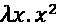

# 5

# 函数式编程 – 可读性与简洁性的权衡

本章将向您展示 Python 中函数式编程的一些酷技巧，并解释 Python 实现的一些局限性。为了学习和娱乐，我们还将简要讨论使用 lambda 演算的数学等价物，以**Y 组合子**为例。

最后几段将列出并解释`functools`和`itertools`库的用法。如果您熟悉这些库，请随意跳过，但请注意，其中一些将在后续章节（*第六章*装饰器）、生成器（*第七章*）和性能（*第十二章*）中大量使用。

本章将涵盖以下主题：

+   函数式编程背后的理论

+   `list`、`dict`和`set`推导式

+   `lambda`函数

+   `functools`（`partial`和`reduce`）

+   `itertools`（`accumulate`、`chain`、`dropwhile`、`starmap`等）

首先，我们将从 Python 中函数式编程的历史以及函数式编程的实际含义开始。

# 函数式编程

函数式编程是一种起源于 lambda 演算（λ-calculus）的范式，这是一种可以用来模拟任何图灵机的数学形式系统。不深入探讨λ-calculus，这意味着计算仅使用函数参数作为输入，输出由一个新变量组成，而不修改输入变量。在严格函数式编程语言中，这种行为将被强制执行，但鉴于 Python 不是严格函数式语言，这并不一定成立。

由于混合范式可能会导致未预见的错误，正如在*第三章*，*Pythonic 语法和常见错误*中讨论的那样，坚持这种范式仍然是一个好主意。

## 纯函数式

纯函数式编程期望函数没有副作用。这意味着传递给函数的参数不应被修改，任何其他外部状态也不应被修改。让我们用一个简单的例子来说明这一点：

```py
>>> def add_value_functional(items, value):
...     return items + [value]

>>> items = [1, 2, 3]
>>> add_value_functional(items, 5)
[1, 2, 3, 5]
>>> items
[1, 2, 3]

>>> def add_value_regular(items, value):
...     items.append(value)
...     return items

>>> add_value_regular(items, 5)
[1, 2, 3, 5]
>>> items
[1, 2, 3, 5] 
```

这基本上显示了常规函数和纯函数之间的区别。第一个函数仅基于输入返回一个*新*值，没有任何其他副作用。这与第二个函数形成对比，该函数修改了给定的输入或其作用域之外的变量。

即使在函数式编程之外，仅将更改限制在局部变量上也是一个好主意。保持函数的纯函数性（仅依赖于给定的输入）可以使代码更清晰、更容易理解，并且更容易测试，因为依赖项更少。在`math`模块中可以找到一些著名的例子。这些函数（`sin`、`cos`、`pow`、`sqrt`等）的输入和输出严格依赖于输入。

## 函数式编程和 Python

Python 是少数几种，或者至少是最早的非函数式编程语言之一，它添加了函数式编程特性。最初的几个函数式编程函数大约在 1993 年引入，它们是`lambda`、`reduce`、`filter`和`map`。从那时起，Guido van Rossum 对它们的存在一直不太满意，因为它们常常使可读性受损。此外，`map`和`filter`这样的函数很容易用`list`推导式来复制。因此，Guido 希望在 Python 3 版本中删除这些函数，但经过很多反对意见后，他选择了至少将`reduce`函数移动到`functools.reduce`。

从那时起，Python 已经添加了几个其他函数式编程特性：

+   `list`/`dict`/`set`推导式

+   生成器表达式

+   生成器函数

+   协程

`functools`和`itertools`模块中也有许多有用的函数。

## 函数式编程的优点

当然，最大的问题是，你为什么要选择函数式编程而不是常规/过程式编程呢？以函数式风格编写代码有多个优点：

+   写纯函数式代码的一个主要优点是它变得非常容易并行运行。因为没有外部变量需要，也没有外部变量被改变，你可以轻松地将代码并行化，以便在多个处理器或甚至多台机器上运行。当然，假设你可以轻松地传输输入变量和输出结果。

+   因为函数是自包含的，并且没有副作用，所以它们减轻了几种类型的错误。例如，就地修改函数参数是一个很好的错误来源。此外，一个看似无用的函数调用，它修改父作用域中的变量，在纯函数式代码库中是不可能存在的。

+   它使得测试变得容易得多。如果一个函数只有给定的输入和输出，并且不触及那些之外的任何东西，你就可以测试而无需为该函数设置整个环境。它也省略了在测试函数时进行沙箱化的需要。

自然，函数式编程也有一些缺点，其中一些是由相同的优点引起的。

在某些情况下，始终传递所有有用的参数可能会很麻烦。例如，在修改数据库时，你需要以某种方式获取数据库连接。如果你决定将数据库连接作为参数传递，并且没有为此做好准备，那么你不仅需要修改那个函数，还需要修改所有调用该函数的函数来传递那个参数。在这些情况下，一个包含数据库连接的全局可访问变量可以节省你很多工作。

函数式编程经常被提到的另一个缺点是递归。虽然递归是一个非常有用的工具，但它可以使追踪代码执行路径变得非常困难，这在解决错误时可能是一个问题。

函数式编程有其位置和时机。它并不适合每一种情况，但正确应用时，它是非常有用的工具之一。现在让我们继续看看一些函数式编程的例子。

# 列表、集合和字典推导式

Python 的 `list`、`set` 和 `dict` 推导式是应用函数或过滤器到项目列表的一个非常简单的方法。

当正确使用时，`list`/`set`/`dict` 推导式可以非常方便地对列表、集合和字典进行快速过滤或转换。同样可以使用“函数式”函数 `map` 和 `filter` 来实现相同的结果，但 `list`/`set`/`dict` 推导式通常更容易使用和阅读。

## 基本列表推导式

让我们直接进入几个例子。`list` 推导式的基本前提看起来是这样的：

```py
>>> squares = [x ** 2 for x in range(10)]
>>> squares
[0, 1, 4, 9, 16, 25, 36, 49, 64, 81] 
```

我们可以很容易地通过一个过滤器来扩展这个功能：

```py
>>> odd_squares = [x ** 2 for x in range(10) if x % 2]
>>> odd_squares
[1, 9, 25, 49, 81] 
```

这带我们来到了大多数函数式语言中常见的使用 `map` 和 `filter` 的版本：

```py
>>> def square(x):
...     return x ** 2

>>> def odd(x):
...     return x % 2

>>> squares = list(map(square, range(10)))
>>> squares
[0, 1, 4, 9, 16, 25, 36, 49, 64, 81]

>>> odd_squares = list(filter(odd, map(square, range(10))))
>>> odd_squares
[1, 9, 25, 49, 81] 
```

看到这个之后，就稍微明显一些为什么吉多·范罗苏姆想要从语言中移除这些功能。特别是，使用 `filter` 和 `map` 的版本，考虑到括号的数量，并不是那么易于阅读，除非你习惯于 Lisp 编程语言。

`map` 的最重要应用实际上不是使用 `map` 本身，而是使用类似 `multiprocessing.pool.Pool.map` 的 `map`-like 函数以及 `map_async`、`imap`、`starmap`、`starmap_async` 和 `imap_unordered` 等变体，这些函数可以在多个处理器上自动并行执行函数。

虽然我个人并不反对 `map` 或 `filter`，但我认为它们的用法应该保留在那些你有现成函数可用以在 `map` 或 `filter` 调用中使用的场合。一个更有用的例子可能是：

```py
>>> import os

>>> directories = filter(os.path.isdir, os.listdir('.'))
# Versus:
>>> directories = [x for x in os.listdir('.') if os.path.isdir(x)] 
```

在这种情况下，`filter` 版本可能比 `list` 推导式稍微容易阅读一些。

对于 `list` 推导式来说，语法与常规 Python 循环非常相似，但 `if` 语句和自动存储结果使其能够稍微压缩代码。常规 Python 的等效代码并不长：

```py
>>> odd_squares = []
>>> for x in range(10):
...     if x % 2:
...         odd_squares.append(x ** 2)

>>> odd_squares
[1, 9, 25, 49, 81] 
```

## 集合推导式

除了 `list` 推导式之外，我们还可以使用 `set` 推导式，它具有相同的语法，但返回一个唯一的无序集合（所有集合都是无序的）：

```py
# List comprehension
>>> [x // 2 for x in range(3)]
[0, 0, 1]

# Set comprehension
>>> numbers = {x // 2 for x in range(3)}
>>> sorted(numbers)
[0, 1] 
```

## 字典推导式

最后，我们有 `dict` 推导式，它返回一个 `dict` 而不是 `list` 或 `set`。

除了返回类型之外，唯一的真正区别是你需要返回一个键和一个值。以下是一个基本示例：

```py
>>> {x: x ** 2 for x in range(6)}
{0: 0, 1: 1, 2: 4, 3: 9, 4: 16, 5: 25}

>>> {x: x ** 2 for x in range(6) if x % 2}
{1: 1, 3: 9, 5: 25} 
```

由于输出是一个字典，键需要是可哈希的，`dict` 推导式才能工作。我们在 *第四章* 中介绍了哈希，但简而言之，`hash(key)` 需要为你对象返回一个一致的价值。这意味着无法对可变对象（如列表）进行哈希。

有趣的是，当然你可以混合这两种，以获得更多难以阅读的魔法：

```py
>>> {x ** 2: [y for y in range(x)] for x in range(5)}
{0: [], 1: [0], 4: [0, 1], 16: [0, 1, 2, 3], 9: [0, 1, 2]} 
```

显然，你需要小心使用这些。如果使用得当，它们非常有用，但输出很快就会变得难以阅读，即使有适当的空白。

## 列表推导陷阱

当使用列表推导时，必须小心。某些类型的操作可能不像你想象的那么明显。这次，我们正在寻找大于`0.5`的随机数：

```py
>>> import random

>>> [random.random() for _ in range(10) if random.random() >= 0.5]
[0.5211948104577864, 0.650010512129705, 0.021427316545174158] 
```

看看那个最后的数字？它实际上小于`0.5`。这是因为第一个和最后一个随机调用实际上是单独的调用，并返回不同的结果。

一种对抗这种情况的方法是单独创建列表和过滤器：

```py
>>> import random

>>> numbers = [random.random() for _ in range(10)]
>>> [x for x in numbers if x >= 0.5]
[0.715510247827078, 0.8426277505519564, 0.5071133900377911] 
```

这显然是有效的，但并不那么美观。那么还有其他什么选择呢？好吧，有几个，但可读性有点可疑，所以这些不是我会推荐的方法。然而，至少看到它们一次是好的。

这里有一个嵌套在列表推导中的列表推导：

```py
>>> import random

>>> [x for x in [random.random() for _ in range(10)] if x >= 0.5] 
```

这里有一个很快就会变得难以理解的列表推导：

```py
>>> import random

>>> [x for _ in range(10) for x in [random.random()] if x >= 0.5] 
```

使用这些选项时需要小心，因为双重列表推导实际上像嵌套的`for`循环一样工作，所以它会快速生成大量结果。为了详细说明这一点，请考虑：

```py
>>> [(x, y) for x in range(3) for y in range(3, 5)]
[(0, 3), (0, 4), (1, 3), (1, 4), (2, 3), (2, 4)] 
```

这实际上执行以下操作：

```py
>>> results = []
>>> for x in range(3):
...     for y in range(3, 5):
...         results.append((x, y))
...
>>> results
[(0, 3), (0, 4), (1, 3), (1, 4), (2, 3), (2, 4)] 
```

这些在某些情况下可能很有用，但我强烈建议不要嵌套列表推导，因为这很快会导致代码难以阅读。然而，理解正在发生的事情仍然是有用的，所以让我们再看一个例子。下面的列表推导将列数和行数互换，因此一个 3 x 4 的矩阵变成了 4 x 3：

```py
>>> matrix = [
...     [1, 2, 3, 4],
...     [5, 6, 7, 8],
...     [9, 10, 11, 12],
... ]

>>> reshaped_matrix = [
...     [
...         [y for x in matrix for y in x][i * len(matrix) + j]
...         for j in range(len(matrix))
...     ]
...     for i in range(len(matrix[0]))
... ]

>>> import pprint

>>> pprint.pprint(reshaped_matrix, width=40)
[[1, 2, 3],
 [4, 5, 6],
 [7, 8, 9],
 [10, 11, 12]] 
```

即使有额外的缩进，列表推导仍然不是那么易于阅读。当然，有四个嵌套循环时，这是预料之中的。在极少数情况下，嵌套列表推导可能是合理的，例如非常基本的矩阵操作。然而，在一般情况下，我不会推荐使用嵌套列表推导。

接下来，我们将探讨`lambda`函数，它可以与`map`和`filter`结合使用，以创建简短方便的函数。

# `lambda`函数

Python 中的`lambda`语句只是一个匿名函数。由于语法限制，它比常规函数稍微有限一些，但可以通过它做很多事情。然而，如往常一样，可读性很重要，所以通常最好尽可能保持简单。其中一个更常见的用例是作为`sorted`函数的`sort`键：

```py
>>> import operator

>>> values = dict(one=1, two=2, three=3)

>>> sorted(values.items())
[('one', 1), ('three', 3), ('two', 2)]

>>> sorted(values.items(), key=lambda item: item[1])
[('one', 1), ('two', 2), ('three', 3)]

>>> get_value = operator.itemgetter(1)
>>> sorted(values.items(), key=get_value)
[('one', 1), ('two', 2), ('three', 3)] 
```

第一个版本按键排序，第二个版本按值排序。最后一个示例展示了使用`operator.itemgetter`生成一个获取特定项的函数的替代选项。

正规（非`lambda`）函数不会更加冗长，但在这些情况下，`lambda`函数是一个非常有用的简写。为了完整性，让我们看看两个相同的函数：

```py
>>> key = lambda item: item[1]

>>> def key(item):
...     return item[1] 
```

请注意，`PEP8` 规定将 `lambda` 赋值给变量是一个坏主意（[`peps.python.org/pep-0008/#programming-recommendations`](https://peps.python.org/pep-0008/#programming-recommendations)）。从逻辑上讲，这是正确的。匿名函数的想法就是它是匿名的，没有名字。如果你给它一个身份，你应该将其定义为普通函数。

在我看来，`lambda` 函数的唯一有效用途是作为 `sorted()` 等函数的匿名一行参数。

## Y 演算子

这一节可以很容易地跳过。它主要是一个 λ 表达式数学价值的例子。

Y 演算子可能是 λ 演算最著名的例子：


所有这些都看起来非常复杂，但这主要是因为它使用了λ演算的符号，如果你超越了这些特殊字符，其实并不那么困难。

为了说明，你应该将这个语法，，读作一个匿名（lambda）函数，它接受 *x* 作为输入并返回 。在 Python 中，这几乎可以完全按照原始的 λ 演算来表示，除了将  替换为 `lambda` 和 `.` 替换为 `:`，因此结果是 `lambda x: x**2`。

通过一些代数（[`en.wikipedia.org/wiki/Fixed-point_combinator#Fixed-point_combinators_in_lambda_calculus`](https://en.wikipedia.org/wiki/Fixed-point_combinator#Fixed-point_combinators_in_lambda_calculus)），Y 演算子可以简化为 ，或者是一个接受  函数并将其应用于自身的函数。该函数的 λ 演算表示法如下：


这里是 `lambda` 函数的 Python 表示法：

```py
Y = lambda f: lambda *args: f(Y(f))(*args) 
```

或者是常规函数版本：

```py
def Y(f):
    def y(*args):
        y_function = f(Y(f))
        return y_function(*args)
    return y 
```

这一切归结为一个接受函数 `f` 作为参数的函数，该函数使用 `Y` 演算子以该函数作为参数进行调用。

这可能仍然有点不清楚，所以让我们看看一个实际使用它的例子：

```py
>>> Y = lambda f: lambda *args: f(Y(f))(*args)

>>> def factorial(combinator):
...     def _factorial(n):
...         if n:
...             return n * combinator(n - 1)
...         else:
...             return 1
...     return _factorial

>>> Y(factorial)(5)
120 
```

以下是其简短版本，其中 Y 演算子的力量更为明显，使用递归匿名函数：

```py
>>> Y = lambda f: lambda *args: f(Y(f))(*args)

>>> Y(lambda c: lambda n: n and n * c(n - 1) or 1)(5)
120 
```

注意，`n and n * c(n – 1) or 1` 这部分是函数较长版本中使用的 `if` 语句的简写。或者，这也可以使用 Python 的三元运算符来写：

```py
>>> Y = lambda f: lambda *args: f(Y(f))(*args)

>>> Y(lambda c: lambda n: n * c(n - 1) if n else 1)(5)
120 
```

你可能想知道这个练习的目的是什么。你完全可以写一个更短、更简单、更符合 Python 习惯的阶乘函数。那么 Y 演算子的意义在哪里？Y 演算子允许我们以递归的方式执行非递归函数。

然而，更重要的是，我认为这是一个有趣的 Python 力量的展示——如何在几行 Python 中实现像 λ 演算这样基本的东西。我认为它的实现具有一定的美感。

我们将通过几行代码中`quicksort`的定义给出`Y`组合子的一个最终示例：

```py
>>> quicksort = Y(lambda f:
...     lambda x: (
...         f([item for item in x if item < x[0]])
...         + [y for y in x if x[0] == y]
...         + f([item for item in x if item > x[0]])
...     ) if x else [])

>>> quicksort([1, 3, 5, 4, 1, 3, 2])
[1, 1, 2, 3, 3, 4, 5] 
```

虽然 Y 组合子在 Python 中可能没有太多实际用途，但它确实展示了`lambda`语句的力量以及 Python 与它背后的基本数学的接近程度。本质上，区别只在于符号，而不是功能。

现在我们知道了如何编写自己的`lambda`和函数式函数，我们将看看 Python 中捆绑的函数式函数。

# functools

除了`list/dict/set`推导式之外，Python 还有一些（更高级的）函数，在函数式编程时非常方便。`functools`库是一组返回可调用对象的函数。其中一些函数用作装饰器（我们将在第六章*装饰器 – 通过装饰实现代码重用*中详细介绍），但我们将要讨论的是用作直接函数来简化你的生活。

## partial – 预填充函数参数

`partial`函数对于向常用但无法（或不想）重新定义的函数添加一些默认参数来说非常方便。在面向对象的代码中，通常可以绕过类似的情况，但在过程式代码中，你通常会不得不重复你的参数。让我们以第四章中*Pythonic 设计模式*的`heapq`函数为例：

```py
>>> import heapq

>>> heap = []
>>> heapq.heappush(heap, 1)
>>> heapq.heappush(heap, 3)
>>> heapq.heappush(heap, 5)
>>> heapq.heappush(heap, 2)
>>> heapq.heappush(heap, 4)
>>> heapq.nsmallest(3, heap)
[1, 2, 3] 
```

几乎所有的`heapq`函数都需要一个`heap`参数，因此我们将创建一个快捷方式来自动填充`heap`变量。当然，这可以通过一个常规函数轻松完成：

```py
>>> def push(*args, **kwargs):
...     return heapq.heappush(heap, *args, **kwargs) 
```

然而，有一个更简单的方法。Python 附带了一个名为`functools.partial`的函数，它可以生成一个带有预填充参数的函数：

```py
>>> import functools
>>> import heapq

>>> heap = []
>>> push = functools.partial(heapq.heappush, heap)
>>> smallest = functools.partial(heapq.nsmallest, iterable=heap)

>>> push(1)
>>> push(3)
>>> push(5)
>>> push(2)
>>> push(4)
>>> smallest(3)
[1, 2, 3] 
```

使用`functools.partial`，我们可以自动为我们填充位置参数和/或关键字参数。因此，对`push(...)`的调用会自动展开为`heapq.heappush(heap, ...)`。

我们为什么要使用`partial`而不是编写一个`lambda`参数呢？嗯，这主要是因为方便，但它也有助于解决在第三章中讨论的晚期绑定问题，即*Pythonic 语法和常见陷阱*。此外，偏函数仍然与原始函数有某种相似的行为，这意味着它们仍然有可用的文档，并且可以被序列化，而`lambda`表达式则不能。

Python 中的`pickle`模块允许序列化许多复杂的 Python 对象，但默认情况下并非所有对象。`lambda`函数默认没有定义`pickle`方法，但可以通过在`copy_reg.dispatch_table`中定义自己的 lambda-pickle 方法来解决这个问题。实现这一点的一个简单方法是使用`dill`库，它包含了一系列`pickle`辅助函数。

为了说明`lambda`和`functools.partial`之间的区别，请看以下示例：

```py
>>> lambda_push = lambda x: heapq.heappush(heap, x)

>>> heapq.heappush
<built-in function heappush>
>>> push
functools.partial(<built-in function heappush>, [1, 2, 5, 3, 4])
>>> lambda_push
<function <lambda> at ...>

>>> heapq.heappush.__doc__
'Push item onto heap, maintaining the heap invariant.'
>>> push.__doc__
'partial(func, *args, **keywords) - new function ...'
>>> lambda_push.__doc__ 
```

注意到`lambda_push.__doc__`不返回任何内容，而`lambda`只有一个非常不实用的`<function <lambda> ...>`表示字符串。这是`functools.partial`在实际使用中远比它方便的一个原因。它显示了参考函数的文档；表示字符串显示了它确切在做什么，并且它可以不经过修改地进行序列化。

在*第六章*，*装饰器 – 通过装饰实现代码重用*（特别是关于`functools.wraps`的部分），我们将看到我们如何使函数以类似`functools.partial`复制文档的方式从其他函数复制属性。

## `reduce` – 将成对元素合并成一个结果

`reduce`函数实现了一种称为折叠的数学技术。它将给定列表中前一个结果和下一个元素配对，并应用于传递给函数。

`reduce`函数被许多语言支持，但在大多数情况下使用不同的名称，如`curry`、`fold`、`accumulate`或`aggregate`。Python 实际上已经支持`reduce`很长时间了，但自从 Python 3 以来，它已经被从全局作用域移动到`functools`库中。一些代码可以使用`reduce`语句进行非常漂亮的简化；然而，它是否可读是值得商榷的。

### 实现阶乘函数

`reduce`最常用的例子之一是计算阶乘，这确实很简单：

```py
>>> import operator
>>> import functools

>>> functools.reduce(operator.mul, range(1, 5))
24 
```

前面的代码使用`operator.mul`而不是`lambda a, b: a * b`。虽然它们产生相同的结果，但前者可能要快得多。

内部，`reduce`函数将执行以下操作：

```py
>>> from operator import mul

>>> mul(mul(mul(1, 2), 3), 4)
24 
```

或者，创建一个自动循环的`reduce`函数看起来像这样：

```py
>>> import operator

>>> def reduce(function, iterable):
...     print(f'iterable={iterable}')
...     # Fetch the first item to prime 'result'
...     result, *iterable = iterable
...
...     for item in iterable:
...         old_result = result
...         result = function(result, item)
...         print(f'{old_result} * {item} = {result}')
...
...     return result

>>> iterable = list(range(1, 5))
>>> iterable
[1, 2, 3, 4]

>>> reduce(operator.mul, iterable)
iterable=[1, 2, 3, 4]
1 * 2 = 2
2 * 3 = 6
6 * 4 = 24
24 
```

使用形式`a, *b = c`，我们可以将可迭代对象在第一个项和其余项之间分割。这意味着`a, *b = [1, 2, 3]`将得到`a=1, b=[2, 3]`。

在这个例子中，这意味着我们首先初始化`result`变量，使其包含初始值，然后继续使用当前结果和下一个项调用函数，直到`iterable`耗尽。

实际上，这归结为：

1.  `iterable = [1, 2, 3, 4]`

1.  `result, *iterable = iterable`

    这给我们`result=1`和`iterable = [2, 3, 4]`。

1.  接下来是第一次调用`operator.mul`，参数是`result`和`item`，这个值存储在`result`中。这是`reduce`和`map`之间的一个重大区别。而`map`只将函数应用于给定的项，`reduce`则将前一个结果和当前项都应用于函数。因此，它实际上执行的是`result = operator.mul(result, item)`。填充变量后，我们得到`result` `=` `1` `*` `2` `=` `2`。

1.  下一个调用实际上重复了同样的过程，但由于前一个调用，我们的初始`result`值现在是`2`，下一个`item`是`3`：`result = 2 * 3 = 6`。

1.  我们再次重复这个过程，因为我们的`iterable`现在已经耗尽了。最后的调用将执行`result = 6 * 4 = 24`。

### 处理树

树是`reduce`函数真正大放异彩的例子。还记得*第四章*，*Pythonic 设计模式*中用`defaultdict`定义的一行树吗？如何访问该对象内部的键呢？给定一个树项的路径，我们可以使用`reduce`轻松访问内部项。首先，让我们构建一个树：

```py
>>> import json
>>> import functools
>>> import collections

>>> def tree():
...     return collections.defaultdict(tree)

# Build the tree:
>>> taxonomy = tree()
>>> reptilia = taxonomy['Chordata']['Vertebrata']['Reptilia']
>>> reptilia['Squamata']['Serpentes']['Pythonidae'] = [
...     'Liasis', 'Morelia', 'Python']

# The actual contents of the tree
>>> print(json.dumps(taxonomy, indent=4))
{
    "Chordata": {
        "Vertebrata": {
            "Reptilia": {
                "Squamata": {
                    "Serpentes": {
                        "Pythonidae": [
                            "Liasis",
                            "Morelia",
                            "Python"
                        ]
                    }
                }
            }
        }
    }
} 
```

首先，我们通过使用`collections.defaultdict`的递归定义创建了一个`tree`结构。这允许我们不需要显式定义就可以将`tree`嵌套多层。

为了提供可读性较好的输出，我们使用`json`模块导出`tree`（实际上是一个嵌套字典的列表）。

现在是查找的时候了：

```py
# Let's build the lookup function
>>> import operator

>>> def lookup(tree, path):
...     # Split the path for easier access
...     path = path.split('.')
...
...     # Use 'operator.getitem(a, b)' to get 'a[b]'
...     # And use reduce to recursively fetch the items
...     return functools.reduce(operator.getitem, path, tree)

>>> path = 'Chordata.Vertebrata.Reptilia.Squamata.Serpentes'
>>> dict(lookup(taxonomy, path))
{'Pythonidae': ['Liasis', 'Morelia', 'Python']}

# The path we wish to get
>>> path = 'Chordata.Vertebrata.Reptilia.Squamata'
>>> lookup(taxonomy, path).keys()
dict_keys(['Serpentes']) 
```

现在我们有一个非常简单的方法，只需几行代码就可以递归地遍历`树`结构。

### 反向减少

熟悉函数式编程的人可能会想知道为什么 Python 只有`fold_left`的等价物而没有`fold_right`。实际上，你并不真的需要两者，因为你可以轻松地反转操作。公平地说，同样的话也可以说关于`reduce`，因为我们已经在上一段中看到，它很容易实现。

正常的`reduce`——`fold left`操作：

```py
fold_left = functools.reduce(
    lambda x, y: function(x, y),
    iterable,
    initializer,
) 
```

反之——`fold right`操作：

```py
fold_right = functools.reduce(
    lambda x, y: function(y, x),
    reversed(iterable),
    initializer,
) 
```

对于`reduce`可能没有太多有用的用例，但确实有一些。特别是，使用`reduce`遍历递归数据结构要容易得多，因为否则将涉及更复杂的循环或递归函数。

既然我们已经看到了 Python 中的一些函数式函数，现在是时候看看一些专注于可迭代对象的函数了。

# itertools

`itertools`库包含受函数式语言中可用函数启发的可迭代函数。所有这些都是可迭代的，并且被构建成只需要最小的内存即可处理甚至最大的数据集。虽然你可以轻松地自己编写这些函数中的大多数，但我仍然建议使用`itertools`库中提供的函数。这些函数都是快速的、内存高效的，也许更重要的是——经过测试。我们现在要探索几个：`accumulate`、`chain`、`compress`、`dropwhile/takewhile`、`count`和`groupby`。

## accumulate – 带中间结果的 reduce

`accumulate`函数与`reduce`函数非常相似，这就是为什么一些语言实际上有`accumulate`而不是`reduce`作为折叠操作符。

这两个函数的主要区别在于`accumulate`函数返回即时结果。例如，在汇总一家公司的销售额时，这可能很有用：

```py
>>> import operator
>>> import itertools

# Sales per month
>>> months = [10, 8, 5, 7, 12, 10, 5, 8, 15, 3, 4, 2]
>>> list(itertools.accumulate(months, operator.add))
[10, 18, 23, 30, 42, 52, 57, 65, 80, 83, 87, 89] 
```

应该注意的是，在这个情况下，`operator.add`函数实际上是可选的，因为`accumulate`的默认行为是求和结果。在某些其他语言和库中，这个函数有时被称为`cumsum`（累积和）。

## chain – 结合多个结果

`chain` 函数是一个简单但很有用的函数，它将多个迭代器的结果组合起来。如果你有多个列表、迭代器等，这个函数非常简单且非常有用——只需用简单的链将它们组合起来：

```py
>>> import itertools

>>> a = range(3)
>>> b = range(5)
>>> list(itertools.chain(a, b))
[0, 1, 2, 0, 1, 2, 3, 4] 
```

应该注意的是，存在一个名为 `chain` 的函数的微小变体，它接受一个包含可迭代的可迭代对象，即 `chain.from_iterable`。这个函数几乎与原函数完全相同，唯一的区别在于你需要传递一个可迭代对象项，而不是传递一个参数列表。

你的初始反应可能是，这可以通过解包 (`*args`) 元组来实现，正如我们将在 *第七章* 中看到的，即生成器和协程——无限，一次一步。然而，情况并不总是如此。现在，只需记住，如果你有一个包含可迭代的可迭代对象，最简单的方法是使用 `itertools.chain.from_iterable`。用法正如你所预期的那样：

```py
>>> import itertools

>>> iterables = [range(3), range(5)]
>>> list(itertools.chain.from_iterable(iterables))
[0, 1, 2, 0, 1, 2, 3, 4] 
```

## compress – 使用布尔列表选择项目

`compress` 函数是你不太经常需要使用的函数之一，但在你需要的时候它可能非常有用。它对你的可迭代对象应用布尔过滤器，使其只返回你实际需要的元素。在这里需要注意的最重要的事情是 `compress` 执行的是惰性操作，并且 `compress` 会在数据耗尽或不再获取任何元素时停止。因此，即使对于无限范围，它也能顺利工作：

```py
>>> import itertools

>>> list(itertools.compress(range(1000), [0, 1, 1, 1, 0, 1]))
[1, 2, 3, 5] 
```

如果你想在不修改原始可迭代对象的情况下创建一个较大可迭代对象的过滤视图，`compress` 函数可能很有用。如果计算过滤器是一个耗时的操作，并且可迭代对象中的实际值可能会改变，这可能会非常有用。基于上面的示例：

```py
>>> primes = [0, 0, 1, 1, 0, 1, 0, 1]
>>> odd = [0, 1, 0, 1, 0, 1, 0, 1]
>>> numbers = ['zero', 'one', 'two', 'three', 'four', 'five']

# Primes:
>>> list(itertools.compress(numbers, primes))
['two', 'three', 'five']

# Odd numbers
>>> list(itertools.compress(numbers, odd))
['one', 'three', 'five']

# Odd primes
>>> list(itertools.compress(numbers, map(all, zip(odd, primes))))
['three', 'five'] 
```

在这种情况下，过滤器和可迭代对象都是预定义的，并且非常小。但是，如果你有一个需要花费大量时间计算（或从外部资源获取）的大集合，这个方法可以用来快速过滤，而无需重新计算一切，特别是由于过滤器可以很容易地使用 `map`、`all` 和 `zip` 的组合来结合。如果你想看到两个的结果，可以使用 `any` 代替 `all`。

## dropwhile/takewhile – 使用函数选择项目

`dropwhile` 函数将跳过所有结果，直到给定的谓词评估为真。如果你正在等待一个设备最终返回预期的结果，这可能会很有用。这在书中可能有点难以演示，所以我们只提供了一个基本用法示例——等待一个大于 `3` 的数字：

```py
>>> import itertools

>>> list(itertools.dropwhile(lambda x: x <= 3, [1, 3, 5, 4, 2]))
[5, 4, 2] 
```

如你所料，`takewhile` 函数是这个的逆过程。它将简单地返回所有行，直到谓词变为假：

```py
>>> import itertools

>>> list(itertools.takewhile(lambda x: x <= 3, [1, 3, 5, 4, 2]))
[1, 3] 
```

将 `dropwhile` 和 `takewhile` 的结果相加将再次给出所有元素，因为它们是对方的对立面。

## count – 带小数步长的无限范围

`count` 函数与 `range` 函数非常相似，但有两个显著的区别：

+   第一点是，这个范围是无限的，所以甚至不要尝试执行`list(itertools.count())`。您肯定会立即耗尽内存，甚至可能冻结您的系统。

+   第二个区别是，与`range`函数不同，您实际上可以在这里使用浮点数，因此不需要整数。

由于列出整个范围会杀死我们的 Python 解释器，我们将使用`itertools.islice`函数限制结果，该函数与常规切片类似（例如`some_list[10:20]`），但也可以处理无限大的输入。

如`count`这样的无限大函数不可切片，因为它们是无限生成器，这是我们将在*第七章*，*生成器和协程 – 一步一步的无限*中讨论的主题。

`count`函数有两个可选参数：一个`start`参数，默认为`0`，以及一个`step`参数，默认为`1`：

```py
>>> import itertools

>>> list(itertools.islice(itertools.count(), 10))
[0, 1, 2, 3, 4, 5, 6, 7, 8, 9]

>>> list(itertools.islice(itertools.count(), 5, 10, 2))
[5, 7, 9]

>>> list(itertools.islice(itertools.count(10, 2.5), 5))
[10, 12.5, 15.0, 17.5, 20.0] 
```

## groupby – 对排序的可迭代对象进行分组

`groupby`函数是一个非常方便的函数，用于分组结果。它允许您根据特定的分组函数将对象列表转换为分组列表。

`groupby`使用的基本示例：

```py
>>> import operator
>>> import itertools

>>> words = ['aa', 'ab', 'ba', 'bb', 'ca', 'cb', 'cc']

# Gets the first element from the iterable
>>> getter = operator.itemgetter(0)

>>> for group, items in itertools.groupby(words, key=getter):
...     print(f'group: {group}, items: {list(items)}')
group: a, items: ['aa', 'ab']
group: b, items: ['ba', 'bb']
group: c, items: ['ca', 'cb', 'cc'] 
```

我们可以在这里看到，通过非常少的努力，单词可以根据第一个字符进行分组。例如，这可以是一个非常方便的实用工具，用于在用户界面中按部门分组员工。

然而，在使用此函数时，有一些重要的事情需要记住：

+   输入需要按`group`参数进行排序。否则，每个重复的组都将作为一个单独的组添加。

+   结果只能使用一次。因此，处理完一组数据后，它将不再可用。如果您希望迭代结果两次，请将结果包裹在`list()`或`tuple()`中。

下面是一个包含未排序副作用`groupby`的例子：

```py
>>> import itertools

>>> raw_items = ['spam', 'eggs', 'sausage', 'spam']

>>> def keyfunc(group):
...     return group[0]

>>> for group, items in itertools.groupby(raw_items, key=keyfunc):
...     print(f'group: {group}, items: {list(items)}')
group: s, items: ['spam']
group: e, items: ['eggs']
group: s, items: ['sausage', 'spam']

>>> raw_items.sort()
>>> for group, items in itertools.groupby(raw_items, key=keyfunc):
...     print(f'group: {group}, items: {list(items)}')
group: e, items: ['eggs']
group: s, items: ['sausage', 'spam', 'spam'] 
```

`groupby`函数绝对是一个非常有用的函数，您可以在各种场景中使用它。例如，对用户输出进行分组可以使结果更容易阅读。

# 练习

现在您已经了解了如何在 Python 中使用一些函数式编程特性，也许您可以尝试将快速排序算法作为（一系列）常规函数来编写，而不是难以阅读的 Y-combinator 版本。

您还可以尝试自己编写一个`groupby`函数，该函数不受排序影响，并返回可以多次使用的而不是仅使用一次的结果列表。

这些练习的示例答案可以在 GitHub 上找到：`github.com/mastering-python/exercises`。您被鼓励提交自己的解决方案，并从他人的替代方案中学习。

# 摘要

函数式编程最初可能会让很多人感到害怕，但实际上它不应该这样。函数式编程与过程式编程（在 Python 中）之间最重要的区别是思维方式。所有操作都是通过只依赖于输入变量的简单函数来执行的，并且不会在局部作用域之外产生任何副作用。

主要优势包括：

+   由于副作用较少，代码之间相互影响较少，因此你会遇到更少的错误。

+   由于函数始终具有可预测的输入和输出，它们可以轻松地在多个处理器或甚至多台机器之间并行化。

本章涵盖了 Python 中函数式编程的基础以及其背后的少量数学知识。此外，还介绍了一些可以通过函数式编程非常方便地使用的许多有用库。

最重要的是以下要点：

+   Lambda 表达式本身并不坏，但最好只让它们使用局部作用域中的变量，并且它们不应该超过一行。

+   函数式编程可能非常强大，但容易变得难以阅读。必须小心使用。

+   `list/dict/set` 推导式非常有用，但容易迅速变得难以阅读。特别是，嵌套推导式在几乎所有情况下都难以阅读，应该尽量避免。

最终，这是一个个人偏好的问题。为了可读性，我建议在没有明显好处的情况下限制函数式范式的使用。话虽如此，如果正确执行，它可以是一件美丽的事情。

接下来是装饰器——一种将函数和类包装在其他函数和/或类中的方法，以修改其行为并扩展其功能。

# 加入我们的 Discord 社区

加入我们社区的 Discord 空间，与作者和其他读者进行讨论：[`discord.gg/QMzJenHuJf`](https://discord.gg/QMzJenHuJf)


