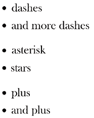

# 第九章：文档 – 如何使用 Sphinx 和 reStructuredText

记录代码可以既有趣又有用！我必须承认，许多程序员对记录代码有强烈的厌恶，这是可以理解的。编写文档可能是一项枯燥的工作，而且传统上，只有其他人能从这种努力中获得好处。然而，Python 可用的工具几乎可以毫不费力地生成有用且最新的文档。实际上，生成文档已经变得如此简单，以至于我经常在开始使用 Python 包之前就创建和生成文档。假设它还没有可用的话。

除了简单的文本文档来解释函数的功能之外，还可以添加元数据，例如类型提示。这些类型提示可以用来使函数或类的参数和返回类型在文档中可点击。但更重要的是，许多现代 IDE 和编辑器，如 VIM，都有可用的插件，这些插件解析类型提示并用于智能自动完成。所以如果你输入 `'some_string.'`，你的编辑器将自动完成字符串对象的特定属性和方法，这在传统上只有像 Java、C 和 C++ 这样的静态类型语言中才是可行的。

本章将解释 Python 中可用的文档类型以及如何轻松创建完整的一套文档。有了 Python 提供的惊人工具，你可以在几分钟内拥有功能齐全的文档。

本章涵盖的主题如下：

+   类型提示

+   reStructuredText 语法

+   Markdown 语法

+   使用 Sphinx 设置文档

+   Sphinx、Google 和 NumPy 风格的 docstrings

# 类型提示

自 Python 3.5 以来，我们有一个名为类型提示的功能，这可以说是 Python 3 中最有用的添加之一。它允许你指定变量和返回值的类型，这意味着你的编辑器将能够提供智能自动完成。这使得它对所有 Python 程序员都很有用，无论水平如何，并且与一个好的编辑器搭配使用时可以使你的生活变得更加容易。

## 基本示例

大多数编辑器已经足够智能，可以识别这些常规变量中的基本类型：

```py
>>> a = 123
>>> b = 'test'
>>> c = True 
```

当我们不是有 `a = 123` 这样的代码，而是有 `a = some_function()` 这样的代码时，编辑器的工作会变得更加困难。在某些情况下，函数的返回类型是明显的（即 `return True`），但如果返回类型依赖于输入变量或是不一致的，编辑器理解正在发生的事情就会变得非常困难。

正如 Python 的禅所说，明确优于隐晦。在函数返回类型的情况下，这通常是正确的，并且可以非常容易地实现：

```py
>>> def pow(base: int, exponent: int) -> int:
...     return base ** exponent

>>> help(pow)
Help on function pow in module __main__:
<BLANKLINE>
pow(base: int, exponent: int) -> int
<BLANKLINE>

>>> pow.__annotations__
{'base': <class 'int'>,
 'exponent': <class 'int'>,
 'return': <class 'int'>}

>>> pow(2, 10)
1024
>>> pow(pow(9, 2) + pow(19, 2) / 22, 0.25)
3.1415926525826463 
```

这正如预期的那样工作。使用简单的 `-> type`，你可以指定函数的返回类型，这会自动反映在 `__annotations__` 中，这在 `help()` 中也是可见的。并且可以使用 `name: type` 来指定参数（和变量）的类型。

在这种情况下，你可能注意到，尽管我们指定了函数返回一个 `int`，但实际上它也可以返回一个 `float`，因为 Python 只有类型提示，没有类型约束/强制。

虽然基本类型如 `int`、`float`、`str`、`dict`、`list` 和 `set` 可以仅使用 `variable: int` 来指定，但对于更高级的类型，我们需要使用 `typing` 模块。

由于 Python 3.9，你可以使用 `variable: list[int]`。对于 Python 的旧版本，你需要使用 `variable: typing.List[int]` 来指定所有需要使用 `getitem (`[])` 操作符的集合类型，如 `dict`/`list`/`set`。

`typing` 模块包含如 `typing.Any` 允许一切，`typing.Optional` 允许 `None`，以及 `typing.Union` 指定多个允许的类型，我们现在将演示这些：

```py
>>> import typing

>>> int_or_float = typing.Union[int, float]

>>> def pow(base: int, exponent: int) -> int_or_float:
...     return base ** exponent

>>> help(pow)
Help on function pow in module __main__:
<BLANKLINE>
pow(base: int, exponent: int) -> Union[int, float]
<BLANKLINE> 
```

使用 `typing.Union`，我们可以指定一个类型列表，同样，可以使用 `typing.Optional[int]` 来指定一个可选类型，表示类型可以是 `int` 或 `None`，这实际上等同于 `typing.Union[int, None]`。此外，从 Python 3.10 开始，我们可以将其写成 `int` `|` `None`。

## 自定义类型

由于常规 Python 对象是其自己的类型，你通常甚至不需要考虑它们的类型。只需指定对象，它就会工作：

```py
>>> class Sandwich:
...     pass

>>> def get_sandwich() -> Sandwich:
...     return Sandwich() 
```

但如果遇到循环定义或其他你还没有类型可用的情况呢？在这种情况下，你可以通过指定类型为字符串来解决这个问题：

```py
>>> class A:
...     @staticmethod
...     def get_b() -> 'B':
...         return B()

>>> class B:
...     @staticmethod
...     def get_a() -> A:
...         return A() 
```

在可能的情况下，我建议不要使用这种方法，因为它不能保证类型实际上可以被解决：

```py
# Works without an issue
>>> some_variable: 'some_non_existing_type'

# Error as expected
>>> some_variable: some_non_existing_type
Traceback (most recent call last):
    ...
NameError: name 'some_non_existing_type' is not defined 
```

自然地，这只会检查类型实际上是否存在。为了进行正确的类型检查，我们可以使用像 `mypy` 这样的工具，这将在下一节中介绍。为了确保你的类型检查器可以解析类型，你可以将你的导入放在一个 `if typing.TYPE_CHECKING` 块中，如下所示：

```py
>>> if typing.TYPE_CHECKING:
...     # Add your import for some_non_existing_type here
...     ... 
```

`typing.TYPE_CHECKING` 常量通常不会被设置，但可以被像 `mypy` 这样的类型检查器设置，以确保所有类型都正常工作。

在上面的例子中，我们已经看到了自定义类作为自定义类型，但如果我们想从一个现有的内置类型创建一个自定义类型呢？这也是可能的，使用 `typing.NewType` 创建一个新类型，它表现得像基类型，但可以被静态类型检查器检查：

```py
>>> import typing

>>> Username = typing.NewType('Username', str)

>>> rick = Username('Rick')

>>> type(rick)
<class 'str'> 
```

在这里，我们创建了一个名为 `Username` 的类型，在这种情况下它被视为 `str` 的子类。

## 泛型

在某些情况下，你不想静态指定函数的类型，而是让它依赖于输入。因此，Python 类型系统支持泛型。如果你熟悉 Java、C++ 或 C#，你可能已经熟悉它们。

泛型允许你创建一个泛型类型，其唯一约束是它在所有情况下都相同。这意味着如果你将泛型类型指定为函数的输入和输出，它将被假定是相同的；如果你将`int`输入到函数中，你将收到一个`int`。

首先，我们需要指定一个泛型类型，然后我们才能将其指定为函数的参数：

```py
>>> import typing

>>> T = typing.TypeVar('T', int, str)

>>> def add(a: T, b: T) -> T:
...     return a + b

>>> add(1, 2)
3
>>> add('a', 'b')
'ab' 
```

在这种情况下，我们创建了一个泛型类型，其约束是它必须是`int`或`str`。当类型检查器运行时，它将检查`a`、`b`和`return`值是否有相同的类型。这意味着即使`int`对于类型`T`是有效的，如果你将`a`设为`str`，`b`和输出也必须是`str`。

## 类型检查

现在我们知道了如何指定和创建类型提示，是时候运行类型检查器了。类型检查的参考实现是`mypy`工具。它可以彻底检查你的代码，并警告潜在的问题。

首先，我们需要安装`mypy`——幸运的是，使用`pip`来做这件事很容易：

```py
$ pip3 install -U mypy 
```

现在我们将使用`mypy`来检查一些之前带有错误的一些示例：

```py
import typing

def pow(base: int, exponent: int) -> int:
    return base ** exponent

pow(2.5, 10) 
```

由于我们提示`base`为`int`，`2.5`不是一个有效的值，因为它是一个`float`：

```py
$ mypy T_01_type_hinting.py
T_01_type_hinting.py:8: error: Argument 1 to "pow" has incompatible type "float"; expected "int" 
```

现在有一个自定义类型的示例：

```py
Username = typing.NewType('Username', str)

rick = Username('Rick')

def print_username(username: Username):
    print(f'Username: {username}')

print_username(rick)
print_username(str(rick)) 
```

在这里，我们指定了`print_username()`应该接收一个`Username`类型。即使`Username`继承了`str`，它也不被认为是有效的：

```py
$ mypy T_01_type_hinting.py
T_01_type_hinting.py:22: error: Argument 1 to "print_username" has incompatible type "str"; expected "Username" 
```

最后，我们将创建一个泛型类型：

```py
T = typing.TypeVar('T')

def to_string(value: T) -> T:
    return str(value)

to_string(1) 
```

由于`to_string()`接收了一个`int`，它应该返回一个`int`，但这并不是情况。让我们运行`mypy`来看看哪里出了问题：

```py
error: Incompatible return value type (got "str", expected "T") 
```

在编写代码时，`mypy`可以通过警告你关于不正确的类型使用来为你节省大量的调试时间。

## Python 类型接口文件

Python 类型提示文件（`.pyi`），也称为存根文件，是允许你为文件指定所有类型提示而不修改原始文件的文件。这对于你无法写入的库或你不想在文件中添加类型提示的情况非常有用。

这些文件使用的是常规的 Python 语法，但函数并不打算包含任何除了仅提示类型的存根之外的内容。上面提到的`print_username()`函数的一个示例存根可能是：

```py
import typing

Username = typing.NewType('Username', str)

def print_username(username: Username): ... 
```

这些文件没有什么特别之处，但它们在与缺少类型提示的库交互时特别有用。如果你的常规文件名为`test.py`，那么`pyi`文件将命名为`test.pyi`。

## 类型提示结论

在本节中，你已经看到了一些非常基本的示例，说明了如何应用类型提示以及如何检查类型。Python 的`typing`模块仍在不断改进，`mypy`有非常详尽的文档，如果你在自己的代码中应用这些，可能会很有用。如果你有任何具体问题，请确保查看文档；它质量很高，非常实用。

当涉及到在自己的项目中使用类型提示时，我的建议是只要它增强了你的工作流程就使用它，但不要过度使用。在许多情况下，你的编辑器足够智能，可以自动识别参数，或者这并不真的那么重要。但是，当传递更高级的类时，你可能会忘记该类的方法，这时它就成为一个非常有用的特性。拥有智能自动补全功能可以真正为你节省大量时间。

现在我们已经涵盖了类型提示，是时候继续记录我们的代码以及用于此任务的标记语言了。

# reStructuredText 和 Markdown

**reStructuredText**格式（也称为**RST**、**ReST**或**reST**）于 2002 年开发，作为一种实现足够标记以可用的语言，但足够简单以供纯文本阅读。这两个特性使得它足够易于在代码中使用，同时仍然足够灵活以生成美观且有用的文档。

Markdown 格式与 reStructuredText 非常相似，在很大程度上可以比较。虽然 reStructuredText 比 Markdown（2014 年）稍早（2012 年），但 Markdown 格式因其更简单且不那么以 Python 为中心而获得了更多的流行。这两个标准都非常适合编写易于阅读的文本，并且可以轻松转换为其他格式，如 HTML 或 PDF 文件。

reST 的主要优点是：

+   一个非常广泛的功能集

+   一个严格定义的标准

+   易于扩展

Markdown 的主要优点是：

+   它不那么以 Python 为中心，这导致它获得了更广泛的应用

+   一个更宽容且不那么严格的解析器，这使得编写更加容易

reStructuredText 和 Markdown 最棒的地方在于它们非常直观易写，并且被大多数（社交）编码平台（如 GitHub、GitLab、BitBucket 和 PyPI）原生支持。

即使不了解任何关于标准的信息，你也能轻松地用这种风格编写文档。然而，更高级的技术，如图片和链接，确实需要一些解释。

对于 Python 文档本身，reStructuredText 是最方便的标准，因为它得到了 Sphinx 和 docutils 等工具的良好支持。对于 GitHub 和 Python 包索引等网站上的 readme 文件，Markdown 标准通常得到更好的支持。

要轻松地在 reStructuredText 和 Markdown 等格式之间进行转换，请使用 Pandoc 工具，该工具可在[`pandoc.org/`](https://pandoc.org/)找到。

基本语法看起来就像文本，接下来的几段将展示一些更高级的功能。然而，让我们从一个简单的例子开始，展示 reStructuredText 或 Markdown 文件可以有多简单：

```py
Documentation, how to use Sphinx and reStructuredText
##################################################################

Documenting code can be both fun and useful! ...

Additionally, adding ...

... So that typing 'some_string.' will automatically ...

Topics covered in this chapter are as follows:

 - The reStructuredText syntax
 - Setting up documentation using Sphinx
 - Sphinx style docstrings
 - Google style docstrings
 - NumPy style docstrings

The reStructuredText syntax
******************************************************************

The reStructuredText format (also known as ... 
```

这就是将本章到目前为止的文本转换为 reStructuredText 或 Markdown 有多简单。上面的例子在两者中都适用。但是为了让 Markdown 文件看起来相似，我们需要稍微修改一下标题：

```py
# Documentation, how to use Sphinx and reStructuredText

...

## The reStructuredText syntax

... 
```

下面的段落将涵盖以下功能：

1.  内联标记（斜体、粗体、代码和链接）

1.  列表

1.  标题

1.  高级链接

1.  图片

1.  替换

1.  包含代码、数学和其他内容的块

## 开始使用 reStructuredText

要快速将 reStructuredText 文件转换为 HTML，我们可以使用`docutils`库。本章后面讨论的`sphinx`库实际上内部使用`docutils`库，但它有一些我们最初不需要的额外功能。要开始，我们只需要安装`docutils`：

```py
$ pip3 install docutils 
```

之后，我们可以轻松地将 reStructuredText 转换为 PDF、LaTeX、HTML 和其他格式。对于本段中的示例，我们将使用 HTML 格式，它可以通过以下命令轻松生成：

```py
$ rst2html.py file.rst file.html 
```

reStructuredText 语言有两个基本组件：

+   允许对输出进行**内联**修改的角色，例如`:code:`, `:math:`, `:emphasis:`, 和 `:literal:`.

+   生成标记**块**的指令，例如多行代码示例。它们看起来像这样：

    ```py
    .. code:: python

      print('Hello world') 
    ```

在纯 reStructuredText 中，指令是最重要的，但我们将在本章后面的*Sphinx 角色*部分看到角色的许多用途。

## 开始使用 Markdown

要快速将 Markdown 文件转换为 HTML，我们有多种选择可用。但是，因为我们使用 Python，我们将使用`markdown`包：

```py
$ pip3 install markdown 
```

现在我们可以使用以下命令将我们的文件转换为 HTML：

```py
$ markdown_py file.md -f file.html 
```

应该注意的是，此转换器仅支持纯 Markdown，不支持 GitHub 风格的 Markdown，后者还支持代码语法高亮。

`grip`（GitHub Readme Instant Preview）Python 包通过使用 GitHub 服务器支持 GitHub 风格的 Markdown 的实时渲染，这在编写 Markdown 时可能很有用。

## 内联标记

**内联标记**是在常规文本行中使用的标记。这些示例包括着重、内联代码示例、链接、图片和项目符号列表。

在 reStructuredText 中，这些通过角色实现，但通常有有用的简写。您可以使用`*text*`而不是`:emphasis:'text'`。

例如，可以通过将单词封装在一到两个星号之间来添加着重。例如，这个句子可以通过在两侧添加单个星号来添加一点`*着重*`，或者通过在两侧添加两个星号来添加很多`**着重**`。有许许多多的内联标记指令，所以我们只列出最常见的。完整的列表始终可以在 reStructuredText 主页[`docutils.sourceforge.io/docs/`](https://docutils.sourceforge.io/docs/)和 Markdown 主页[`daringfireball.net/projects/markdown/syntax`](https://daringfireball.net/projects/markdown/syntax)中找到。

以下是一些既适用于 reST 也适用于 Markdown 的示例：

+   着重（斜体）文本：`*这个短语的着重*`.

+   额外的着重（粗体）文本：`**这个短语的额外着重**`.

+   对于不带数字的列表，只需在后面加一个空格的简单破折号：

    +   `- 项目 1`

    +   `- 项目 2`

注意

破折号后面的空格对于 reStructuredText 识别列表是必需的。

+   对于带数字的列表，数字后面跟着一个句点和空格：

    +   `1. 项目 1`

    +   `2. 项目 2`

+   对于编号列表，数字后面的句点和空格是必需的。

+   解释性文本：这些是特定领域的。在 Python 文档中，默认的角色是代码，这意味着用反引号包围的文本将被转换为使用代码标签，例如，`'if spam and eggs:'`。

+   内联字面量：这是使用等宽字体格式化的，这使得它非常适合内联代码。只需在 `''添加一些代码''` 中添加两个反引号即可。对于 Markdown，单引号和双引号在输出中没有明显的区别，但它可以用来转义单引号：`''some code ' with backticks''`。

+   在 reST 中可以使用 \ 进行转义，类似于 Python 中的转义：`''some code \' with backticks''`。

对于 reStructuredText，有一些额外的选项可以使用角色，类似于我们之前看到的解释性文本角色。这些角色可以通过角色前缀或后缀根据你的偏好设置；例如，`':math:'E=mc²'` 用于显示数学方程式。

可以通过尾随下划线添加引用。它们可以指向标题、链接、标签等。下一节将介绍更多关于这些的内容，但基本语法是简单的 `reference_`，或者当引用包含空格时用反引号包围 – `'some reference link'_`。

有很多更多可供选择，但当你编写 reStructuredText 时，你将最常使用这些。

## 标题

标题用于指示文档、章节、部分或段落的开始。因此，它是文档中你需要的第一种结构。虽然不是严格必需的，但它的使用被高度推荐，因为它有多个用途：

1.  标题会根据其级别进行一致的格式化。

1.  可以从标题生成目录树。

1.  所有标题自动作为标签使用，这意味着你可以创建指向它们的链接。

标题所需的格式在 reST 和 Markdown 之间略有重叠，但为了清晰起见，我们将分别介绍。

### 使用 reStructuredText 的标题

在创建标题时，一致性是少数约束之一；使用的字符数相当任意，级别数也是如此。

个人来说，我默认使用一个具有固定大小的标题系统，但我建议至少遵循 Python 文档的默认部分、章节、部分、子部分、次子部分和段落的默认设置，大致如下：

```py
Part
################################################################

Chapter
****************************************************************

Section
================================================================

Subsection
----------------------------------------------------------------

Subsubsection
^^^^^^^^^^^^^^^^^^^^^^^^^^^^^^^^^^^^^^^^^^^^^^^^^^^^^^^^^^^^^^^^

Paragraph
""""""""""""""""""""""""""""""""""""""""""""""""""""""""""""""""

Content 
```

这将创建以下输出：


图 9.1：使用 reStructuredText 的标题

这只是标题的常见用法，但 reStructuredText 的主要思想是你可以使用任何你觉得自然的东西，这意味着你可以使用以下任何字符：`= - ' : " ~ ^ _ * + # <>`。它还支持下划线和上划线，所以如果你更喜欢这样，它们也是选项之一：

```py
################################################################
Part
################################################################

****************************************************************
Chapter
****************************************************************

================================================================
Section
================================================================

----------------------------------------------------------------
Subsection
----------------------------------------------------------------

^^^^^^^^^^^^^^^^^^^^^^^^^^^^^^^^^^^^^^^^^^^^^^^^^^^^^^^^^^^^^^^^
Subsubsection
^^^^^^^^^^^^^^^^^^^^^^^^^^^^^^^^^^^^^^^^^^^^^^^^^^^^^^^^^^^^^^^^

""""""""""""""""""""""""""""""""""""""""""""""""""""""""""""""""
Paragraph
""""""""""""""""""""""""""""""""""""""""""""""""""""""""""""""""

Content 
```

尽管我尽量保持字符数量固定为 78 个字符，如 `PEP8`（*第三章*，*Pythonic 语法和常见错误*）所建议的 Python，但使用的字符数量大多是任意的，但至少要和标题文本一样长。这允许它接受以下结果：

```py
Section
======= 
```

但不是这个：

```py
Section
==== 
```

### 使用 Markdown 的标题

使用 Markdown，你可以根据个人喜好选择多种标题选项。类似于 reST，你可以使用 `=` 和 `–` 字符进行下划线标记，但仅限这些，并且它们后面的长度和空白行并不重要：

```py
Part
=
Chapter
- 
```

如果你需要更多级别，你可以通过使用 `#` 前缀和可选后缀最多使用 6 个级别：

```py
# Part
## Chapter
### Section
#### Subsection
##### Subsubsection
###### Paragraph
Content
###### Paragraph with suffix ######
Content 
```

这将产生：


图 9.2：Markdown 中的标题

如你所见，Markdown 在标题方面比 reStructuredText 略显不灵活，但在大多数情况下，它提供的功能足够多，完全可以使用。

## 列表

reStructuredText 格式有几种列表样式：

1.  列表项

1.  项目符号

1.  选项

1.  定义

在介绍部分已经展示了列表的最简单形式，但实际上可以使用许多不同的字符进行编号，如字母、罗马数字等。在演示了基本列表类型之后，我们将继续介绍列表和结构的嵌套，这使得它们更加强大。需要注意空白量的多少，因为过多的空格可能会导致结构被识别为普通文本而不是结构。

### 列表项

列表项对于各种列举都非常方便。列表项的基本前提是数字或字母字符后跟一个点、一个右括号或两侧的括号。此外，`#` 字符还充当自动编号。例如：

```py
1\. With
2\. Numbers

a. With
#. letters

i. Roman
#. numerals

(1) With
(2) Parenthesis 
```

输出可能比你预期的要简单一些。原因是它取决于输出格式。以下图显示了渲染的 HTML 输出，它不支持括号。例如，如果你输出 LaTeX，差异可以变得明显。


图 9.3：使用 HTML 输出格式生成的列表项

Markdown 也支持列表项，但在选项上略显有限。它只支持常规编号列表。不过，它在支持这些列表项方面更为方便；无需显式编号，重复 `1.` 也不会有问题：

```py
1\. With
1\. Numbers 
```

### 项目符号列表

如果列表的顺序不重要，你只需要一个不带编号的项目列表，那么你应该使用项目符号列表。要使用项目符号创建一个简单的列表，项目符号需要以 `*`、`+`、`-`、`•`、‣ 或 ⁃ 开始。这个列表主要是任意的，可以通过扩展 Sphinx 或 Docutils 来修改。例如：  

```py
- dashes
- and more dashes

* asterisk
* stars

+ plus
+ and plus 
```

如下图所示，在 HTML 输出中，所有项目符号再次看起来相同。

当生成 LaTeX（以及随后 PDF 或 Postscript）格式的文档时，这些可能会有所不同。

由于基于 Web 的文档是目前 Sphinx 最常见的输出格式，我们默认使用该格式。渲染的 HTML 输出如下：



图 9.4：带有 HTML 输出的项目符号列表

如您所见，在这种情况下，所有项目符号列表都被渲染为相同。然而，这取决于渲染器，所以检查输出是否与您的偏好相符是个好主意。

### 选项列表

`选项` 列表是专门用于记录程序命令行参数的。关于语法的特殊之处在于，逗号空格被识别为选项的分隔符：

```py
-s, --spam  This is the spam option
--eggs      This is the eggs option 
```

下面的输出结果如下：


图 9.5：选项列表

在 Markdown 中，没有对选项列表的支持，但你可以通过创建表格来实现类似的效果：

```py
| Argument     | Help                    |
|--------------|-------------------------|
| '-s, --spam' | This is the spam option |
| '--eggs'     | This is the eggs option | 
```

注意，在大多数 Markdown 实现中，表格的标题是必需的。但此处所进行的标题对齐是可选的，以下方式也能达到相同的效果：

```py
| Argument | Help |
|-|-|
| '-s, --spam' | This is the spam option |
| '--eggs' | This is the eggs option | 
```

### 定义列表（仅限 reST）

定义列表比其他类型的列表稍微难以理解，因为其实际结构仅由空白字符组成。因此，它的使用相当直接，但在文件中不一定容易识别，并且仅由 reST 支持：

```py
spam
    Spam is a canned pork meat product
eggs
    Is, similar to spam, also food 
```

下面的输出结果如下：


图 9.6：定义列表

定义列表在解释文档中某些关键词的含义时特别有用。

### 嵌套列表

项目嵌套实际上不仅限于列表，还可以使用多种类型的块来实现，但基本思想是相同的。例如，你可以在项目符号列表中嵌套代码块。只需确保缩进级别正确。如果不这样做，它可能不会被识别为单独的级别，或者你会得到一个错误：

```py
1\. With
2\. Numbers

   (food) food

    spam
        Spam is a canned pork meat product
    eggs
        Is, similar to spam, also food

    (other) non-food stuff 
```

下图显示了输出结果：


图 9.7：嵌套列表

对于 Markdown，只要使用正确的列表类型，就可以实现类似的嵌套。

## 链接、引用和标签

Markdown 和 reStructuredText 之间的链接语法相当不同，但它们提供了类似的功能。两者都支持内联链接和使用参考列表的链接。

最简单的带有协议（如 [`python.org`](http://python.org)）的链接将被大多数 Markdown 和 reStructuredText 解析器自动识别。对于自定义标签，语法略有不同：

+   reStructuredText: `'Python <http://python.org>'_`

+   Markdown: `[Python](http://python.org)`

这两种方法对于不会经常重复的简单链接来说都很不错，但通常，将标签附加到链接上会更方便，这样它们就可以被重复使用，而且不会使文本过于拥挤。

例如，参考以下 reStructuredText 示例：

```py
The switch to reStructuredText and Sphinx was made with the
'Python 2.6 <https://docs.python.org/whatsnew/2.6.html>'_
release. 
```

现在比较以下内容：

```py
The switch to reStructuredText and Sphinx was made with the
'python 2.6'_ release.
.. _'Python 2.6': https://docs.python.org/whatsnew/2.6.html 
```

输出如下：


图 9.8：带有自定义标签的链接

以及 Markdown 的等效形式：

```py
The switch to reStructuredText and Sphinx was made with the [Python 2.6](https://docs.python.org/whatsnew/2.6.html) release.

The switch to reStructuredText and Sphinx was made with the [Python 2.6] release.

[Python 2.6]: https://docs.python.org/whatsnew/2.6.html 
```

使用标签，你可以在指定位置轻松地有一个引用列表，而不会使实际文本难以阅读。

对于 reStructuredText，这些标签不仅可以用于外部链接。类似于在旧编程语言中找到的 `GOTO` 语句，你可以创建标签并在文档的其他部分引用它们：

```py
.. _label: 
```

在 HTML 或 PDF 输出中，这可以用来在文本的任何位置创建一个可点击的链接，使用下划线链接。创建一个指向标签的可点击链接就像在文本中包含 `label_` 那样简单。

注意，reStructuredText 忽略大小写差异，因此大小写链接都可以正常工作。即使我们不太可能犯这个错误，但在单个文档中只有大小写差异的相同标签会导致错误，以确保不会发生重复。

将引用与标题结合使用的方式非常自然；你可以像平常一样引用它们，并添加一个下划线来使其成为链接：

```py
The introduction section
================================================================

This section contains:

- 'chapter 1'_
- :ref:'chapter2'

  1\. my_label_

  2\. 'And a label link with a custom title <my_label>'_
Chapter 1

----------------------------------------------------------------

Jumping back to the beginning of 'chapter 1'_ is also possible.
Or jumping to :ref:'Chapter 2 <chapter2>'

.. _chapter2:

Chapter 2 With a longer title
----------------------------------------------------------------

The next chapter.

.. _my_label:

The label points here.

Back to 'the introduction section'_ 
```

输出如下：


图 9.9：链接、标签和引用

对于 Markdown，根据所使用的渲染器，你可以部分地获得类似的结果。在 GitHub 解析器的情况下，所有标题都会自动转换为 HTML 锚点，因此一个像 `# Some header` 这样的标题可以通过 `链接名称` 来链接。

虽然这种方法对于简单情况来说很方便，但它带来了一些缺点：

+   当标题改变时，指向它的所有链接都会断开

+   当多个标题具有相同的名称时，只有第一个可以被链接到

+   只有标题可以被链接到

## 图片

图片是 reStructuredText 和 Markdown 之间实现差异很大的一个功能。

### reStructuredText 中的图片

在 reStructuredText 中，图片指令看起来与标签语法非常相似。它们实际上略有不同，但模式相当相似。图片指令只是 reStructuredText 支持的许多指令之一。我们将在介绍 Sphinx 和 reStructuredText 扩展时了解更多关于这一点。目前，只需知道指令以两个点和一个空格开始，后跟指令名称和两个冒号：

```py
 .. name_of_directive:: 
```

在图片的情况下，指令被称为`image`当然：

```py
.. image:: python.png 
```

这里是缩放后的输出，因为实际图片要大得多：


图 9.10：使用 reStructuredText 的图片输出

注意指令后的双冒号。

但如何指定大小和其他属性？图片指令有许多其他选项（大多数其他指令也是如此）可以用来：[`docutils.sourceforge.io/docs/ref/rst/directives.html#images`](https://docutils.sourceforge.io/docs/ref/rst/directives.html#images)；它们大多数相当明显。要指定图片的宽度和高度或缩放（以百分比表示）：

```py
.. image:: python.png
   :width: 150
   :height: 100

.. image:: python.png
   :scale: 10 
```

以下是其输出：


图 9.11：使用 reStructuredText 缩放的图片

`scale`选项如果可用，将使用`width`和`height`选项，并回退到 PIL（Python Imaging Library）或 Pillow 库来检测图片。如果既没有`width`/`height`也没有 PIL/Pillow 可用，`scale`选项将被静默忽略。

除了`image`指令外，还有一个`figure`指令。区别在于`figure`为图片添加了标题。除此之外，用法与`image`相同：

```py
.. figure:: python.png
   :scale: 10

   The Python logo 
```

输出如下：


图 9.12：使用 reStructuredText 添加图注

现在，让我们比较一下我们刚刚看到的与使用 Markdown 处理图片的方法。

### Markdown 中的图片

Markdown 对图片的支持与对链接的支持类似，但需要在前面添加一个`!`：

```py
 
```

就像链接一样，你也可以使用引用：

```py
![python]

[python]: python.png 
```

然而，更改其他属性，如大小，大多数 Markdown 实现都不支持。

## 替换

在编写文档时，你经常会反复使用相同的图片和链接。虽然你可以直接添加它们，但这通常非常冗长、繁琐且难以维护。

在 reStructuredText 页面内，我们已经有了一个内部标签系统，可以为我们处理很多情况。对于外部链接和图片，我们则需要使用 reStructuredText 的其他功能。通过替换定义，你可以缩短指令以便于重复使用。在常见的 Markdown 实现中，没有与此等效的功能。

假设我们有一个在文本中经常使用的标志。与其输入整个 `.. image:: <url>`，不如有一个简写来简化操作会非常方便。这正是替换非常有用的地方：

```py
.. |python| image:: python.png
   :scale: 1

The Python programming language uses the logo: |python| 
```

如您所见，您可以使用管道字符在文本的任何位置创建和使用替换。在大多数语言中，如果您需要在替换之外使用管道字符，可以使用反斜杠（`\`）来转义该字符。

输出结果如下：


图 9.13：使用图像指令替换渲染的 reStructuredText

这些替换可以与许多指令一起使用，尽管它们在文档的许多地方输出变量时特别有用。例如：

```py
.. |author| replace:: Rick van Hattem

This book was written by |author| 
```

以下为输出结果：


图 9.14：使用作者名称的文本替换渲染的 reStructuredText

这些类型的替换在编写文档时非常有用，因为它们使您的 reStructuredText 文件更易于阅读，但它们还允许您通过更新单个变量来更改整个文档。与通常容易出错的搜索/替换操作相比。

在编写本章时，如果有一个替换 `|rest|` 返回 `reStructuredText` 的方法将会非常有用。

## 块、代码、数学、注释和引用

在编写文档时，一个常见的场景是需要包含不同类型内容的块，例如带有数学公式的解释、代码示例等。

这些指令的使用方式与图像指令类似。以下是一个代码块的示例：

```py
.. code:: python

   def spam(*args):
       print('spam got args', args) 
```

输出结果如下：


图 9.15：代码块输出

这是在 Markdown 中使用起来相对简单的一个案例。使用纯 Markdown，代码块只需要缩进：

```py
Code below:

    def spam(*args):
        print('spam got args', args) 
```

或者使用带有语法高亮的 GitHub 风格 Markdown：

```py
'''python
def spam(*args):
    print('spam got args', args)
''' 
```

使用 reStructuredText，您有更多选项。您还可以使用 LaTeX 语法显示数学公式。例如，这是微积分的基本定理：

```py
.. math::

    \int_a^b f(x)\,dx = F(b) - F(a) 
```

以下为输出结果：


图 9.16：数学公式输出

通过使用“空”指令后跟缩进，可以轻松地注释大量文本/命令。实际上，这意味着任何指令中的两个点，但省略了 `directive::` 部分：

```py
Before comments

.. Everything here will be commented

   And this as well
   .. code:: python
      def even_this_code_sample():
          pass  # Will be commented

After comments 
```

输出结果如下：


图 9.17：输出（带隐藏注释）

使用 Markdown，您没有真正的方法来添加注释，但在一些有限的案例中，您可以使用链接作为绕过这一限制的技巧：

```py
[_]: <> (this will not be shown) 
```

虽然这种方法是可行的，但当然还不够美观。通常，你最好将内容移动到单独的临时文件中，或者删除内容而不是注释它，并在需要时使用像 Git 这样的版本控制系统来检索数据。

引用文本在 reStructuredText 和 Markdown 中都受到支持，但语法冲突。在 reStructuredText 中，你可以通过缩进来创建一个块引用，这在 Markdown 中会导致代码格式化：

```py
Normal text

    Quoted text 
```

输出结果如下：


图 9.18：引用文本

在 Markdown 中，格式与基于文本的电子邮件客户端通常引用回复的方式相似：

```py
Normal text
> Quoted text 
```

## 结论

reStructuredText 和 Markdown 都是创建文档非常有用的语言。大部分语法在编写纯文本笔记时自然出现。然而，关于 reST 所有复杂性的完整指南可能需要另一本书来解释。前面的演示应该已经提供了足够的介绍，足以完成你项目文档工作时至少 90% 的工作。除此之外，Sphinx 将在接下来的章节中提供大量帮助。

通常，我建议使用 reStructuredText 来编写实际的文档，因为它比 Markdown 具有更多的功能。然而，Markdown 通常更方便用于 PyPI 和 GitHub 上的基本 README 文件，主要是因为你可以为这两种情况使用相同的 README 文件，而且 GitHub 对 Markdown 的支持略好于 reStructuredText。

# Sphinx 文档生成器

Sphinx 文档生成器是在 2008 年为 Python 2.6 版本创建的，用于替换 Python 的旧 LaTeX 文档。它是一个生成器，使得为编程项目生成文档变得几乎易如反掌，但即使在编程世界之外，它也可以轻松使用。在编程项目中，对以下领域（编程语言）有特定的支持：

+   Python

+   C

+   C++

+   JavaScript

+   reStructuredText

在这些语言之外，还有许多其他语言的扩展可用，例如 CoffeeScript、MATLAB、PHP、Ruby Lisp、Go 和 Scala。如果你只是寻找代码片段高亮显示，内部使用的 Pygments 高亮器支持超过 120 种语言，并且如果需要，可以轻松扩展以支持新的语言。

Sphinx 最重要的优势是几乎可以从你的源代码中自动生成几乎所有内容。结果是，你的文档总是最新的。

## 开始使用 Sphinx

首先，我们必须确保已经安装了 Sphinx。尽管 Python 的核心文档是用 Sphinx 编写的，但它仍然是一个独立维护的项目，必须单独安装。幸运的是，使用 pip 来安装非常简单：

```py
$ pip3 install sphinx 
```

安装 Sphinx 后，有两种方式开始一个项目：`sphinx-quickstart` 脚本和 `sphinx-apidoc` 脚本。

如果你想要创建和自定义整个 Sphinx 项目，那么我建议使用 `sphinx-quickstart` 命令，因为它可以帮助你配置一个功能齐全的 Sphinx 项目。

如果你想要快速开始并为现有的 Python 项目生成一些 API 文档，那么 `sphinx-apidoc` 可能更适合，因为它只需一个命令和没有进一步的输入就可以创建项目。运行后，你将拥有基于你的 Python 源代码的完整功能文档。

最后，这两种方法都是创建 Sphinx 项目的有效选项，并且我个人通常使用 `sphinx-quickstart` 生成初始配置，每次添加 Python 模块时都调用 `sphinx-apidoc` 命令来添加新模块。

`sphinx-apidoc` 命令默认不会覆盖任何文件，这使得它可以安全地重复运行。

### 使用 sphinx-quickstart

`sphinx-quickstart` 脚本会交互式地询问你在 Sphinx 项目中最重要的决策。无需担心拼写错误；配置存储在 `conf.py` 文件中，可以像常规 Python 文件一样进行修改。

使用方法很简单。默认情况下，我建议在单独的 `docs` 目录中创建文档，这是许多项目的惯例。输出使用以下约定：

+   内联注释以 `#` 开头

+   用户输入行以 `>` 开头

+   裁剪后的输出用 `...` 表示，并且所有跳过的中间问题都使用默认设置。

注意命令后面的 `docs`：

```py
$ sphinx-quickstart docs
Welcome to the Sphinx 3.2.1 quickstart utility.

Please enter values for the following settings (just press Enter to
accept a default value, if one is given in brackets).

Selected root path: docs

You have two options for placing the build directory for Sphinx output.
Either, you use a directory "_build" within the root path, or you separate
"source" and "build" directories within the root path.
> Separate source and build directories (y/n) [n]:

The project name will occur in several places in the built documentation.
> Project name: Mastering Python
> Author name(s): Rick van Hattem
> Project release []:

... 
```

现在，你应该填充你的主文件 `docs/index.rst`，并创建其他文档源文件。使用 Makefile 来构建文档，如下所示：

```py
$ make <builder> 
```

其中 “`<builder>`" 是支持的构建器之一，例如，`html`、`latex` 或 `linkcheck`。运行此命令后，我们应该有一个包含 Sphinx 项目的 `docs` 目录。让我们看看命令实际上为我们创建了什么：

```py
$ find docs
docs
docs/index.rst
docs/_templates
docs/Makefile
docs/conf.py
docs/_static
docs/make.bat
docs/_build 
```

`_build`、`_static` 和 `_templates` 目录最初是空的，现在可以忽略。`_build` 目录用于输出生成的文档，而 `_static` 目录可以用来轻松包含自定义 CSS 文件等。`_templates` 目录使得可以按你的喜好样式化 HTML 输出。这些示例可以在 Sphinx Git 仓库中找到，网址为 [`www.sphinx-doc.org/en/master/usage/theming.html#builtin-themes`](https://www.sphinx-doc.org/en/master/usage/theming.html#builtin-themes)。

`Makefile` 和 `make.bat` 可以用来生成文档输出。`Makefile` 可以用于支持 make 工具的任何操作系统，而 `make.bat` 则是为了直接支持 Windows 系统。现在让我们看看 `index.rst` 源文件：

```py
Welcome to Mastering Python's documentation!
============================================

.. toctree::
   :maxdepth: 2
   :caption: Contents:

Indices and tables
==================

* :ref:'genindex'
* :ref:'modindex'
* :ref:'search' 
```

我们可以看到预期的文档标题，然后是`toctree`（目录树；本章后面将详细介绍），以及索引和搜索的链接。`toctree`会自动从所有可用的文档页面的标题生成一个树状结构。

索引和表格是自动生成的 Sphinx 页面，非常有用，但在设置方面我们无需担心。

现在是时候生成`HTML`输出了：

```py
$ cd docs
$ make html 
```

`make html`命令为您生成文档，结果放置在`_build/html/`中。只需在浏览器中打开`index.html`即可查看结果。现在您应该看到以下类似的内容：


图 9.19：查看 index.html

只需执行这个单一命令并回答几个问题，我们现在就有一个包含索引、搜索和目录的文档项目了。

除了 HTML 输出外，还有许多默认支持的格式，尽管其中一些需要外部库才能实际工作：

```py
$ make help
Sphinx v3.2.1
Please use 'make target' where target is one of
  html        to make standalone HTML files
  dirhtml     to make HTML files named index.html in directories
  singlehtml  to make a single large HTML file
  pickle      to make pickle files
  json        to make JSON files
  htmlhelp    to make HTML files and an HTML help project
  qthelp      to make HTML files and a qthelp project
  devhelp     to make HTML files and a Devhelp project
  epub        to make an epub
  latex       to make LaTeX files, you can set PAPER=a4 or ...
  latexpdf    to make LaTeX and PDF files (default pdflatex)
  latexpdfja  to make LaTeX files and run them through platex/...
  text        to make text files
  man         to make manual pages
  texinfo     to make Texinfo files
  info        to make Texinfo files and run them through makeinfo
  gettext     to make PO message catalogs
  changes     to make an overview of all changed/added/... items
  xml         to make Docutils-native XML files
  pseudoxml   to make pseudoxml-XML files for display purposes
  linkcheck   to check all external links for integrity
  doctest     to run all doctests embedded in the documentation
  coverage    to run coverage check of the documentation 
```

### 使用 sphinx-apidoc

通常，`sphinx-apidoc`命令与`sphinx-quickstart`一起使用。可以使用`--full`参数生成整个项目，但通常更好的做法是使用`sphinx-quickstart`生成整个项目，然后简单地通过`sphinx-apidoc`添加 API 文档。

为了正确演示`sphinx-apidoc`命令，我们需要一些 Python 文件，因此我们将在一个名为`apidoc_example`的项目中创建两个文件。

第一个是`apidoc_example/a.py`，包含一个名为`A`的类和一些方法：

```py
class A(object):
    def __init__(self, arg, *args, **kwargs):
        pass

    def regular_method(self, arg):
        pass

    @classmethod
    def decorated_method(self, arg):
        pass

    def _hidden_method(self):
        pass 
```

接下来，我们有一个包含继承自`A`类的`B`类的`apidoc_example/b.py`文件：

```py
from . import a

class B(a.A):
    def regular_method(self):
        '''This regular method overrides
        :meth:'a.A.regular_method'
        '''
        pass 
```

现在我们有了源文件，是时候生成实际的 API 文档了：

```py
$ sphinx-apidoc apidoc_example -o docs
Creating file docs/apidoc_example.rst.
Creating file docs/modules.rst. 
```

仅此还不够，我们需要将 API 添加到`toctree`中。幸运的是，这就像在`index.rst`文件中将模块添加到`toctree`中一样简单，看起来如下所示：

```py
.. toctree::
   :maxdepth: 2

   modules 
```

在本章的后面部分将更详细地讨论`toctree`指令。

我们还必须确保模块可以被导入，否则 Sphinx 将无法读取 Python 文件。为了做到这一点，我们只需将父目录（从`docs`目录的视角看）添加到`sys.path`；这可以在`conf.py`文件的任何地方进行：

```py
import os
import sys

sys.path.insert(0, os.path.abspath('..')) 
```

此外，需要在`conf.py`中启用`autodoc`模块：

```py
extensions = [
    'sphinx.ext.autodoc',
] 
```

现在是时候再次使用`html`构建器生成文档了：

```py
$ make html
Running Sphinx v3.2.1
making output directory... done
building [mo]: targets for 0 po files that are out of date
building [html]: targets for 3 source files that are out of date
updating environment: [new config] 3 added, 0 changed, 0 removed
reading sources... [100%] modules
looking for now-outdated files... none found
pickling environment... done
checking consistency... done
preparing documents... done
writing output... [100%] modules
generating indices...  genindex py-modindexdone
writing additional pages...  searchdone
copying static files... ... done
copying extra files... done
dumping search index in English (code: en)... done
dumping object inventory... done
build succeeded.

The HTML pages are in _build/html. 
```

再次打开`docs/_build/index.html`文件。为了简洁起见，文档的重复部分将从截图中被省略。裁剪后的输出如下：


图 9.20：查看内容

但实际上它生成了更多内容。当运行 `sphinx-apidoc` 命令时，它会递归地查看指定目录中的所有 Python 模块，并为每个模块生成一个 `rst` 文件。在生成所有这些文件之后，它会将它们全部添加到一个名为 `modules.rst` 的文件中，这使得将它们添加到你的文档中变得很容易。

`modules.rst` 文件非常直接明了；仅仅是一个以包名为标题的模块列表：

```py
apidoc_example
==============

.. toctree::
   :maxdepth: 4

   apidoc_example 
```

`apidoc_example` 页面的输出如下：


图 9.21：apidoc_example 页面

`apidoc_example.rst` 文件简单地列出了所有在 `automodule` 指令中记录的模块，以及一些设置：

```py
apidoc\_example package
=======================

Submodules
----------

apidoc\_example.a module
------------------------

.. automodule:: apidoc_example.a
   :members:
   :undoc-members:
   :show-inheritance:

apidoc\_example.b module
------------------------

.. automodule:: apidoc_example.b
   :members:
   :undoc-members:
   :show-inheritance:

Module contents
---------------

.. automodule:: apidoc_example
   :members:
   :undoc-members:
   :show-inheritance: 
```

但正如你在之前的截图中所见，它不包括隐藏或魔法方法。通过向 `automodule` 指令添加一些额外的参数，我们可以改变这一点：

```py
apidoc\_example package
=======================

Submodules
----------

apidoc\_example.a module
------------------------

.. automodule:: apidoc_example.a
   :members:
   :undoc-members:
   :show-inheritance:
 `:private-members:`
 `:special-members:`
 `:inherited-members:`

apidoc\_example.b module
------------------------

.. automodule:: apidoc_example.b
   :members:
   :undoc-members:
   :show-inheritance:
 `:private-members:`
 `:special-members:`
 `:inherited-members:`

Module contents
---------------

.. automodule:: apidoc_example
   :members:
   :undoc-members:
   :show-inheritance:
 `:private-members:`
 `:special-members:`
 `:inherited-members:` 
```

通过这些额外的设置（`private-members`、`special-members` 和 `inherited-members`），我们得到了很多额外且可能有用的文档：


图 9.22：更新后的 apidoc_example 页面

这些设置中有哪些对你有用取决于你的用例，当然。但它展示了我们如何轻松地为类生成完整的文档，几乎不需要任何努力。而且所有如基类和重写方法这样的引用都可以点击访问。

新文件不会自动添加到你的文档中。重新运行 `sphinx-apidoc` 命令可以添加新文件，但它不会更新现有的文件。尽管可以使用 `--force` 选项强制覆盖文件，但我建议在现有文件中手动编辑它们。正如我们将在下一节中看到的，在生成文件之后手动修改它们有相当多的原因。

## Sphinx 指令

Sphinx 在 reStructuredText 的默认指令之上添加了一些指令，并提供了一个简单的 API 来添加新的指令。其中大部分通常并不需要修改，但正如预期的那样，Sphinx 有相当好的文档，如果你需要了解更多关于它们的信息。

我们已经看到了标签、图像、数学、替换、代码和注释 reST 指令。但也有一些是 Sphinx 特有的指令。其中大部分并不是特别重要，但也许值得一看：[`www.sphinx-doc.org/en/master/usage/restructuredtext/directives.html`](https://www.sphinx-doc.org/en/master/usage/restructuredtext/directives.html)。

我们已经涵盖了最重要的一个，即 `autodoc` 模块，它是 `automodule` 指令所使用的。然而，还有一个需要稍微覆盖一下：`toctree` 指令。我们之前已经看到过它的使用，但它有几个非常有趣的配置选项，对于大型项目来说非常有用。

`toctree` 指令是 Sphinx 中最重要的指令之一；它生成目录树。`toctree` 指令有几个选项，但最重要的可能是 `maxdepth`，它指定树需要深入到多深。`toctree` 的顶层需要手动指定要读取的文件，但超出这个范围，文档中的每个级别（章节、段落等）都可以是 `toctree` 的另一个级别，当然这取决于深度。尽管 `maxdepth` 选项是可选的，但没有它，所有可用的级别都会显示出来，这通常比所需的要多。在大多数情况下，`maxdepth` 的 2 是一个很好的默认值，这使得基本示例看起来像这样：

```py
.. toctree::
   :maxdepth: 2 
```

`toctree` 中的项目是同一目录下的 `.rst` 文件，不包括扩展名。这可以包括子目录，在这种情况下，目录之间用 `.`（点）分隔：

```py
.. toctree::
   :maxdepth: 2

 `module.a`
 `module.b`
 `module.c` 
```

另一个非常有用的选项是 `glob` 选项。它告诉 `toctree` 使用 Python 中的 `glob` 模块自动添加所有匹配模式的文档。只需添加一个带有 `glob` 模式的目录，你就可以添加该目录中的所有文件。这使得之前的 `toctree` 变得非常简单：

```py
.. toctree::
   :maxdepth: 2
   :glob:

   module.* 
```

如果由于某种原因，文档标题不是你期望的样子，你可以轻松地将标题更改为自定义的标题：

```py
.. toctree::
   :maxdepth: 2

   The A module <module.a> 
```

## Sphinx 作用域

我们已经看到了 Sphinx 指令，它们是独立的块。现在我们将讨论 Sphinx 作用域，它们可以内联使用。一个作用域允许你告诉 Sphinx 如何解析某些输入。这些作用域的例子包括链接、数学、代码和标记。但最重要的是，Sphinx 作用域中的角色可以用于引用其他类，甚至外部项目。在 Sphinx 中，默认的作用域是 Python，所以像 `:py:meth:` 这样的角色也可以用作 `:meth:`。这些作用域对于链接到不同的包、模块、类、方法和其他对象非常有用。基本用法很简单。要链接到一个类，使用以下格式：

```py
Spam: :class:'spam.Spam' 
```

输出如下：


图 9.23：链接到类

对于几乎任何其他对象，函数、异常、属性等也是如此。Sphinx 文档提供了一个支持的对象列表：[`www.sphinx-doc.org/domains.html#cross-referencing-python-objects`](https://www.sphinx-doc.org/domains.html#cross-referencing-python-objects)。

Sphinx 的一个很好的特性是这些引用可以超出你的项目范围。类似于我们如何在上文中添加到类的链接，使用 `:obj:'int'` 可以轻松地添加到标准 Python 文档中的 `int` 对象的引用。在其他的文档集和网站上添加你自己的项目的引用也是以类似的方式进行的。

对于跨项目链接，你需要在 `conf.py` 中启用 `intersphinx` 模块：

```py
extensions = [
    'sphinx.ext.autodoc',
    'sphinx.ext.intersphinx',
] 
```

之后，我们需要通过在`conf.py`中添加`intersphinx_mapping`来告诉`intersphinx`它可以在哪里找到其他项目的文档：

```py
intersphinx_mapping = {
    'python': ('https://docs.python.org/', None),
    'sphinx': ('https://www.sphinx-doc.org/', None),
} 
```

现在我们可以轻松地链接到斯芬克斯主页上的文档：

```py
Link to the intersphinx module: :mod:'sphinx.ext.intersphinx' 
```

以下是其输出：


图 9.24：链接到另一个项目

这链接到[`www.sphinx-doc.org/en/master/ext/intersphinx.html`](https://www.sphinx-doc.org/en/master/ext/intersphinx.html)。

现在我们已经知道了如何使用 Sphinx 从我们的代码中生成文档，让我们增强这些文档，使其更加有用。

# 记录代码

目前 Sphinx 支持三种不同的文档风格：原始的斯芬克斯风格、较新的 NumPy 和谷歌风格。它们之间的主要区别在于风格，但实际上还略有不同。

斯芬克斯风格是通过使用一系列的 reStructuredText 角色开发的，这是一种非常有效的方法，但过度使用时可能会损害可读性。你可能能猜到以下代码的作用，但这并不是最优雅的语法：

```py
:param number: The number of eggs to return
:type number: int 
```

根据其名称，谷歌风格是由谷歌开发的。目标是拥有一个简单/可读的格式，它既适用于代码文档，也适用于 Sphinx 的可解析性。在我看来，它更接近 reStructuredText 的原始理念，这是一种非常接近你本能地如何进行文档化的格式。以下示例与前面展示的斯芬克斯风格示例具有相同的意义：

```py
Args:
    number (int): The number of eggs to return 
```

NumPy 风格是专门为 NumPy 项目创建的。NumPy 项目有许多函数，拥有大量的文档，并且通常每个参数都有很多文档。它比谷歌格式稍微冗长一些，但也很容易阅读：

```py
Parameters
----------
number : int
    The number of eggs to return 
```

随着 Python 3.5 中引入的类型提示注解，至少这些语法的参数类型部分已经变得不那么有用。从 Sphinx 3.0 开始，你可以通过在 Sphinx `conf.py`中添加以下行来告诉 Sphinx 使用类型提示而不是手动添加类型：

```py
autodoc_typehints = 'description' 
```

## 使用斯芬克斯风格记录类

首先，让我们看看传统的风格，即斯芬克斯风格。虽然理解所有参数的含义很容易，但它有点冗长，这多少降低了可读性。尽管如此，其含义立即清晰，并且绝对不是一种不好的使用风格：

```py
class Eggs:
    pass

class Spam(object):
    '''
    The Spam object contains lots of spam
    :param arg: The arg is used for ...
    :type arg: str
    :param '*args': The variable arguments are used for ...
    :param '**kwargs': The keyword arguments are used for ...
    :ivar arg: This is where we store arg
    :vartype arg: str
    '''

    def __init__(self, arg: str, *args, **kwargs):
        self.arg: str = arg

    def eggs(self, number: int, cooked: bool) -> Eggs:
        '''We can't have spam without eggs, so here are the eggs

        :param number: The number of eggs to return
        :type number: int
        :param bool cooked: Should the eggs be cooked?
        :raises: :class:'RuntimeError': Out of eggs

        :returns: A bunch of eggs
        :rtype: Eggs
        '''
        pass 
```

输出看起来像这样：


图 9.25：斯芬克斯风格文档

这确实是一个非常有用的输出，其中记录了函数、类和参数。更重要的是，类型也得到了记录，从而生成了一个可点击的链接到实际类型。指定类型的额外优势是，许多编辑器理解这些文档，并将根据给定的类型提供自动完成功能。

你可能也注意到，我们既在文档中又通过类型提示指定了变量类型。虽然技术上不是必需的，但它们应用于文档的不同部分。函数本身显示的类型是通过类型提示完成的：`eggs(number: int, cooked: bool) -> 13_sphinx_style.Eggs`。`Parameters`和`Return type`是通过文档中的`:type`指定的。

为了解释这里实际发生的事情，Sphinx 在 docstrings 中有几个角色，它们提供了关于我们正在记录的内容的提示。

与名称配对的`param`角色设置了具有该名称的参数的文档。与名称配对的`type`角色告诉 Sphinx 参数的数据类型。这两个角色都是可选的，如果省略它们，参数将没有任何附加的文档，但`param`角色对于任何文档的显示总是必需的。仅添加`type`角色而不添加`param`角色将不会产生任何输出，所以请注意始终将它们配对。

`returns`角色在文档方面与`param`角色类似。虽然`param`角色记录了一个参数，但`returns`角色记录了返回的对象。然而，它们略有不同。与`param`角色不同，`returns`角色不依赖于`rtype`角色，反之亦然。它们两者都是独立工作的，这使得可以使用其中一个或两个角色。

如你所期望的，`rtype`告诉 Sphinx（以及几个编辑器）函数返回的对象类型。然而，随着类型提示的引入，`rtype`角色几乎变得毫无用处，因为你有一个更容易指定返回类型的方法。

## 使用 Google 风格记录一个类

Google 风格只是 Sphinx 风格文档的一个更易读的版本。它实际上并不支持更多或更少，但它使用起来非常直观。以下是`Spam`类的 Google 风格版本：

```py
class Eggs:
    pass

class Spam(object):
    r'''
    The Spam object contains lots of spam
    Args:
        arg: The arg is used for ...
        \*args: The variable arguments are used for ...
        \*\*kwargs: The keyword arguments are used for ...
    Attributes:
        arg: This is where we store arg,
    '''

    def __init__(self, arg: str, *args, **kwargs):
        self.arg: str = arg

    def eggs(self, number: int, cooked: bool) -> Eggs:
        '''We can't have spam without eggs, so here are the eggs

        Args:
            number (int): The number of eggs to return
            cooked (bool): Should the eggs be cooked?

        Raises:
            RuntimeError: Out of eggs

        Returns:
            Eggs: A bunch of eggs
        '''
        pass 
```

与 Sphinx 风格相比，这种风格对眼睛更友好，并且具有相同数量的可能性。对于较长的参数文档，这不太方便。想象一下`number`的多行描述会是什么样子。这就是为什么开发了 NumPy 风格，为它的参数提供了大量的文档。

## 使用 NumPy 风格记录一个类

NumPy 风格旨在拥有大量的文档。说实话，大多数人太懒惰了，所以对于大多数项目来说，它可能不是一个好的选择。如果你计划对你的函数及其所有参数进行广泛的文档记录，NumPy 风格可能是一个不错的选择。它比 Google 风格更冗长，但可读性非常好，尤其是在更详细的文档中。以下是`Spam`类的 NumPy 版本：

```py
class Eggs:
    pass

class Spam(object):
    r'''
    The Spam object contains lots of spam
    Parameters
    ----------
    arg : str
        The arg is used for ...
    \*args
        The variable arguments are used for ...
    \*\*kwargs
        The keyword arguments are used for ...
    Attributes
    ----------
    arg : str
        This is where we store arg,
    '''

    def __init__(self, arg, *args, **kwargs):
        self.arg = arg

    def eggs(self, number, cooked):
        '''We can't have spam without eggs, so here are the eggs

        Parameters
        ----------
        number : int
            The number of eggs to return
        cooked : bool
            Should the eggs be cooked?

        Raises
        ------
        RuntimeError
            Out of eggs

        Returns
        -------
        Eggs
            A bunch of eggs
        '''
        pass 
```

虽然 NumPy 风格绝对不是不好的，但它确实非常冗长。仅这个例子就比替代方案长 1.5 倍。因此，对于更长和更详细的文档来说，这是一个非常好的选择，但如果你的计划是无论如何都要有简短的文档，那么就使用 Google 风格吧。

## 选择哪种风格

对于大多数项目来说，Google 风格是最好的选择，因为它既易读又不过于冗长。如果您计划为每个参数使用大量的文档，那么 NumPy 风格也可能是一个不错的选择。

选择 Sphinx 风格的唯一原因就是历史遗留问题。尽管 Google 风格可能更易读，但一致性更为重要。

# 练习

为了稍微练习一下 Python 类型提示，将一些此类文档添加到自己的项目中会很好。

一些不太平凡的类型提示示例包括：

+   字典

+   嵌套或甚至是递归的类型

+   为没有类型提示的外部项目生成存根以进行文档化

这些练习的示例答案可以在 GitHub 上找到：`github.com/mastering-python/exercises`。鼓励您提交自己的解决方案，并从他人的替代方案中学习。

# 摘要

在本章中，您学习了如何使用内置类型和您自己的自定义类型在代码中添加、使用和测试类型提示。您学习了如何编写 Markdown 和 reStructuredText 来文档化您的项目和代码本身。最后，您学习了如何使用 Sphinx 文档生成器为您的项目生成完整的文档。

文档可以极大地帮助项目的普及，而糟糕的文档会扼杀生产力。我认为在库中，没有哪个方面比文档对第三方使用的影响更大。因此，在许多情况下，文档在决定项目使用方面比实际代码质量更为重要。这就是为什么始终尝试保持良好的文档非常重要。在这种情况下，Sphinx 是一个巨大的帮助，因为它使得保持文档与代码同步并更新变得容易得多。没有文档比不正确和/或过时的文档更糟糕。

使用 Sphinx，生成文档非常容易。只需几分钟的时间，您就可以拥有一个带有文档的完整功能网站，或者是一个 PDF、ePub，或者许多其他输出格式之一。现在没有文档真的没有借口了。即使您自己不太使用文档，向您的编辑器提供类型提示也可以大大提高生产力。使您的编辑器更智能始终有助于提高生产力。例如，我添加了类型提示到几个外部项目，仅仅是为了提高我的生产力。

下一章将解释如何在 Python 中测试代码，文档的某些部分将返回那里。使用 `doctest`，可以将示例代码、文档和测试合并在一起。

# 加入我们的 Discord 社区

加入我们社区的 Discord 空间，与作者和其他读者进行讨论：[`discord.gg/QMzJenHuJf`](https://discord.gg/QMzJenHuJf)


