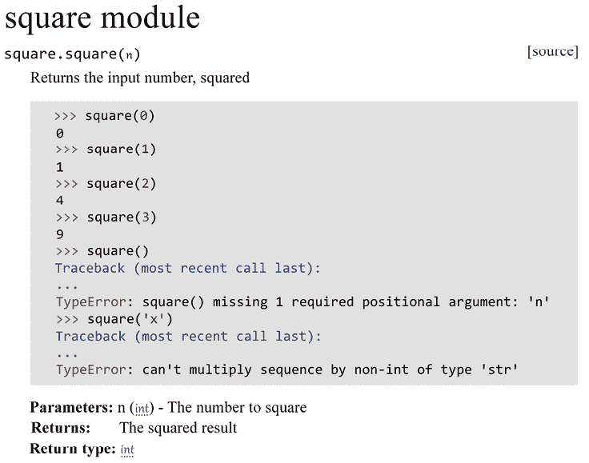
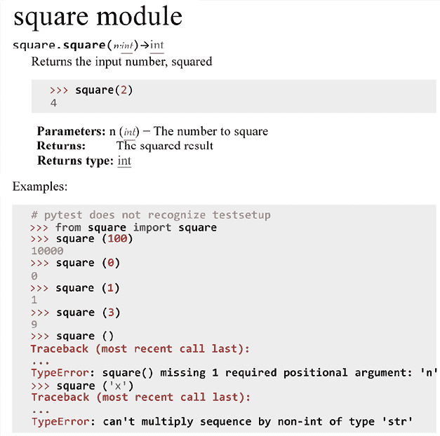
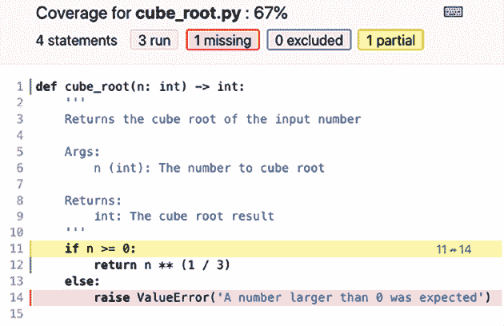
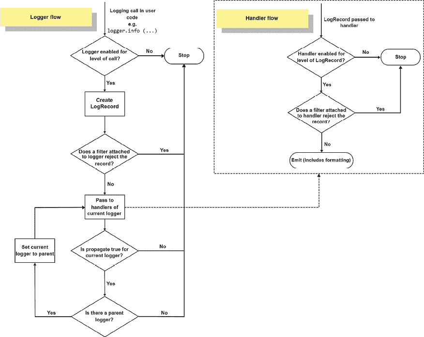

# 10

# 测试和日志记录 – 为 bug 做准备

当编程时，大多数开发者会稍微规划一下，然后立即开始编写代码。毕竟，我们都期望编写无 bug 的代码！不幸的是，我们并不总是能做到。在某个时候，一个错误的假设、误解，或者仅仅是愚蠢的错误是不可避免的。调试（在第十一章“调试 - 解决 bug”中介绍）在某个时候总是需要的，但你可以使用几种方法来防止 bug，或者至少在它们发生时使解决它们变得容易得多。

为了防止 bug 从一开始就出现，测试驱动开发或至少功能/回归/单元测试非常有用。仅标准 Python 安装就提供了几个选项，如 `doctest`、`unittest` 和 `test` 模块。`doctest` 模块允许你将测试与示例文档结合起来。`unittest` 模块允许你轻松编写回归测试。`test` 模块仅用于内部使用，所以除非你打算修改 Python 核心，否则你可能不需要这个模块。

本章我们将讨论的测试模块包括：

+   `doctest`

+   `py.test`（以及为什么它比 `unittest` 更方便）

+   `unittest.mock`

`py.test` 模块与 `unittest` 模块大致具有相同的目的，但使用起来更方便，并且有更多的选项和插件可用。

在学习了如何避免 bug 之后，我们将来看看日志记录，这样我们就可以检查程序中发生了什么以及为什么。Python 中的 `logging` 模块非常可配置，几乎可以调整到任何使用场景。如果你曾经编写过 Java 代码，你应该对 `logging` 模块感到非常熟悉，因为其设计在很大程度上基于 `log4j` 模块，在实现和命名上都非常相似。后者使它成为 Python 中一个有点奇怪的模块，因为它是不遵循 `pep8` 命名标准的少数模块之一。

本章将解释以下主题：

+   使用 `doctest` 将文档与测试结合起来

+   使用 `py.test` 和 `unittest` 进行回归和单元测试

+   使用 `unittest.mock` 进行模拟对象测试

+   使用 `tox` 测试多个环境

+   有效使用 `logging` 模块

+   结合 `logging` 和 `py.test`

# 使用 doctest 将文档作为测试

`doctest` 模块是 Python 中最有用的模块之一。它允许你将代码文档与测试结合起来，以确保代码按预期工作。

到现在为止，格式应该对你来说非常熟悉；本书中的大多数代码示例都使用 `doctest` 格式，它提供了输入和输出交织显示的优势。特别是在演示中，这比代码块后面跟着输出要方便得多。

## 一个简单的 doctest 示例

让我们从一个小例子开始：一个平方输入的函数。以下示例是一个完全功能的命令行应用程序，不仅包含代码，还包含功能测试。前几个测试覆盖了函数在正常执行时的预期行为，然后是一些测试来演示预期的错误：

```py
def square(n: int) -> int:
    '''
    Returns the input number, squared
    >>> square(0)
    0
    >>> square(1)
    1
    >>> square(2)
    4
    >>> square(3)
    9
    >>> square()
    Traceback (most recent call last):
    ...
    TypeError: square() missing 1 required positional argument: 'n'
    >>> square('x')
    Traceback (most recent call last):
    ...
    TypeError: can't multiply sequence by non-int of type 'str'
    Args:
        n (int): The number to square

    Returns:
        int: The squared result
    '''
    return n * n

if __name__ == '__main__':
    import doctest
    doctest.testmod() 
```

它可以像任何 Python 脚本一样执行，但常规命令不会输出任何内容，因为所有测试都成功了。幸运的是，`doctest.testmod`函数有可变参数：

```py
$ python3 T_00_simple_doctest.py -v
Trying:
    square(0)
Expecting:
    0
ok
Trying:
    square(1)
Expecting:
    1
ok
Trying:
    square(2)
Expecting:
    4
ok
Trying:
    square(3)
Expecting:
    9
ok
Trying:
    square()
Expecting:
    Traceback (most recent call last):
    ...
    TypeError: square() missing 1 required positional argument: 'n'
ok
Trying:
    square('x')
Expecting:
    Traceback (most recent call last):
    ...
    TypeError: can't multiply sequence by non-int of type 'str'
ok
1 items had no tests:
    __main__
1 items passed all tests:
   6 tests in __main__.square
6 tests in 2 items.
6 passed and 0 failed.
Test passed. 
```

此外，由于它使用的是 Google 语法（如第九章所述，*文档 – 如何使用 Sphinx 和 reStructuredText*，文档章节），我们可以使用 Sphinx 生成漂亮的文档：



图 10.1：使用 Sphinx 生成的文档

然而，代码并不总是正确的，当然。如果我们修改代码使得测试不再通过，会发生什么呢？

这次，我们使用的是`n ** 2`而不是`n * n`。两者都平方一个数，所以结果必须相同。对吧？这些就是那些导致错误的假设类型，也是使用一些基本测试很容易捕捉到的假设类型。由于大多数结果都是相同的，我们将在示例中跳过它们，但有一个测试现在有不同的结果：

```py
def square(n: int) -> int:
    '''
    >>> square('x')
    Traceback (most recent call last):
    ...
    TypeError: unsupported operand type(s) for ** or pow(): ...
    '''
    return n ** 2

if __name__ == '__main__':
    import doctest
    doctest.testmod(optionflags=doctest.ELLIPSIS) 
```

我们对代码做的唯一修改是将`n * n`替换为`n ** 2`，这相当于幂函数。由于乘法不等于取一个数的幂，结果略有不同，但在实践中足够相似，以至于大多数程序员不会注意到差异。

然而，由于这种差异，错误从`can't multiply sequence ...`变成了`不支持的操作类型(s) for ** 或 pow(): ...`。这是一个无辜的错误，但一个程序员的快速优化可能会无意中将其改变，并可能得到错误的结果。例如，如果`__pow__`方法被重载为不同的行为，这可能会导致更大的问题。

这个例子向我们展示了这些测试有多么有用。在重写或优化代码时，很容易做出错误的假设，而这就是测试非常有用的地方——当你破坏代码时立即知道，而不是几个月后才发现。

## 编写 doctests

也许你已经注意到，从前面的例子中，语法非常类似于常规 Python 控制台，这是因为它是。`doctest`输入不过是常规 Python 外壳会话的输出。这就是使用这个模块进行测试如此直观的原因；只需在 Python 控制台中编写代码，然后将输出复制到文档字符串中即可获得测试。以下是一个示例：

```py
$ python3
>>> from square import square

>>> square(5)
25
>>> square()
Traceback (most recent call last):
  File "<stdin>", line 1, in <module>
TypeError: square() missing 1 required positional argument: 'n' 
```

这就是为什么这可能是测试代码的最简单方式。几乎不需要任何努力，您就可以检查代码是否按预期工作，添加测试，并添加文档。只需将解释器的输出复制到您的函数或类文档中，您就有了一个功能性的 doctests。

## 使用文档进行测试

函数、类和模块中的文档字符串通常是向代码添加 doctests 的最明显方式，但它们并不是唯一的方式。正如我们在上一章中讨论的，Sphinx 文档也支持 `doctest` 模块。

要在 Sphinx 中启用 `doctest` 支持，您需要在 Sphinx 中添加 `sphinx.ext.doctest` 扩展，这将告诉 Sphinx 也要运行这些测试。由于代码中的并非所有示例都有用，让我们看看我们是否可以将它们分成真正有用的和仅与文档相关的部分。此外，为了查看结果，我们将在文档中添加一个错误。

`square.py`

```py
def square(n: int) -> int:
    '''
    Returns the input number, squared
    >>> square(2)
    4
    Args:
        n (int): The number to square
    Returns:
        int: The squared result
    '''
    return n * n

if __name__ == '__main__':
    import doctest
    doctest.testmod() 
```

`square.rst`

```py
square module
=============

.. automodule:: square
    :members:
    :undoc-members:
    :show-inheritance:

Examples:

.. testsetup::

    from square import square

.. doctest::
    # pytest does not recognize testsetup
    >>> from square import square

    >>> square(100)
    10000
    >>> square(0)
    0
    >>> square(1)
    1
    >>> square(3)
    9
    >>> square()
    Traceback (most recent call last):
    ...
    TypeError: square() missing 1 required positional argument: 'n'

    >>> square('x')
    Traceback (most recent call last):
    ...
    TypeError: can't multiply sequence by non-int of type 'str' 
```

现在，是时候执行测试了。在 Sphinx 的情况下，有一个特定的命令用于此操作：

```py
$ make doctest
Running Sphinx v3.2.1
loading pickled environment... done
building [mo]: targets for 0 po files that are out of date
building [doctest]: targets for 2 source files that are out of date
updating environment: 0 added, 0 changed, 0 removed
looking for now-outdated files... none found
running tests...

Document: square
----------------
1 items passed all tests:
   8 tests in default
8 tests in 1 items.
8 passed and 0 failed.
Test passed.

Doctest summary
===============
    8 tests
    0 failures in tests
    0 failures in setup code
    0 failures in cleanup code
build succeeded.

Testing of doctests in the sources finished, look at the results in _build/doctest/output.txt. 
```

如预期，我们得到了一个不完整的 `doctest` 错误，但除此之外，所有测试都执行正确。为了确保测试知道 `square` 是什么，我们不得不添加 `testsetup` 指令，这仍然生成一个相当好的输出：



图 10.2：渲染的 Sphinx 输出

Sphinx 优雅地渲染了代码的文档和突出显示的代码示例。

## doctest 标志

`doctest` 模块具有几个选项标志，这些标志会影响 `doctest` 处理测试的方式。这些选项标志可以通过测试套件全局传递，在运行测试时通过命令行参数传递，也可以通过内联命令传递。对于本书，我已经通过一个 `pytest.ini` 文件全局启用了以下选项标志（我们将在本章后面更详细地介绍 `py.test`）：

```py
doctest_optionflags = ELLIPSIS NORMALIZE_WHITESPACE 
```

没有这些选项标志，本书中的一些示例可能无法正常工作。这是因为它们必须重新格式化以适应。接下来的几段将介绍以下选项标志：

+   `DONT_ACCEPT_TRUE_FOR_1`

+   `NORMALIZE_WHITESPACE`

+   `ELLIPSIS`

还有其他一些选项标志可用，但它们的效果各有不同，但最好还是查阅 Python 文档：[`docs.python.org/3/library/doctest.html#option-flags`](https://docs.python.org/3/library/doctest.html#option-flags)

### True 和 False 与 1 和 0

在大多数情况下，将 `True` 评估为 `1` 和将 `False` 评估为 `0` 是有用的，但如果实际上你期望的是一个 `bool` 而不是一个 `int`，则可能会得到意外的结果。为了展示这种差异，我们有以下这些行：

```py
'''
>>> False
0
>>> True
1
'''
if __name__ == '__main__':
    import doctest
    doctest.testmod()
    doctest.testmod(optionflags=doctest.DONT_ACCEPT_TRUE_FOR_1) 
```

当我们运行这个命令时，它将运行带有和不带有 `DONT_ACCEPT_TRUE_FOR_1` 标志的测试：

```py
$ python3 T_03_doctest_true_for_1_flag.py -v
Trying:
    False
Expecting:
    0
ok
Trying:
    True
Expecting:
    1
ok
1 items passed all tests:
   2 tests in __main__
2 tests in 1 items.
2 passed and 0 failed.
Test passed.
Trying:
    False
Expecting:
    0
**********************************************************************
File "T_03_doctest_true_for_1_flag.py", line 2, in __main__
Failed example:
    False
Expected:
    0
Got:
    False
Trying:
    True
Expecting:
    1
**********************************************************************
File "T_03_doctest_true_for_1_flag.py", line 4, in __main__
Failed example:
    True
Expected:
    1
Got:
    True
**********************************************************************
1 items had failures:
   2 of   2 in __main__
2 tests in 1 items.
0 passed and 2 failed.
***Test Failed*** 2 failures. 
```

如您所见，`DONT_ACCEPT_TRUE_FOR_1` 标志使 `doctest` 拒绝将 `1` 作为 `True` 的有效响应，以及将 `0` 作为 `False` 的有效响应。

### 正规化空白

由于 doctests 既用于文档又用于测试目的，因此保持它们可读性几乎是一个基本要求。然而，如果没有空白字符规范化，这可能会很棘手。考虑以下示例：

```py
>>> [list(range(5)) for i in range(3)]
[[0, 1, 2, 3, 4], [0, 1, 2, 3, 4], [0, 1, 2, 3, 4]] 
```

虽然不是特别糟糕，但这种输出对于可读性来说并不是最好的。通过空白字符规范化，我们可以这样做：

```py
>>> # doctest: +NORMALIZE_WHITESPACE
... [list(range(5)) for i in range(3)]
[[0, 1, 2, 3, 4],
 [0, 1, 2, 3, 4],
 [0, 1, 2, 3, 4]] 
```

以这种方式格式化输出既更易于阅读，又便于保持行较短。

### 省略号

`ELLIPSIS`标志非常有用，但也有些危险，因为它很容易导致不正确的匹配。它使`...`匹配任何子字符串，这在异常处理中非常有用，但在其他情况下则很危险：

```py
>>> {10: 'a', 20: 'b'}  # doctest: +ELLIPSIS
{...}
>>> [True, 1, 'a']  # doctest: +ELLIPSIS
[...]
>>> True,  # doctest: +ELLIPSIS
(...)
>>> [1, 2, 3, 4]  # doctest: +ELLIPSIS
[1, ..., 4]
>>> [1, 0, 0, 0, 0, 0, 4]  # doctest: +ELLIPSIS
[1, ..., 4] 
```

这些情况在现实场景中并不太有用，但它们展示了`ELLIPSIS`选项标志的功能。它们也指出了危险。`[1, 2, 3, 4]`和`[1, 0, ... , 4]`都与`[1, ..., 4]`测试匹配，这可能是无意为之，所以使用`ELLIPSIS`时要非常小心。

一个更有用的例子是在记录类实例时：

```py
>>> class Spam(object):
...     pass

>>> Spam()  # doctest: +ELLIPSIS
<__main__.Spam object at 0x...> 
```

没有使用`ELLIPSIS`标志时，内存地址（即`0x...`部分）永远不会是你期望的那样。让我们在一个正常的 CPython 实例中演示一个实际的运行情况：

```py
Failed example:
    Spam()
Expected:
    <__main__.Spam object at 0x...>
Got:
    <__main__.Spam object at 0x10d9ad160> 
```

## Doctest 怪异之处

之前讨论的三个选项标志处理了 doctests 中发现的许多怪异之处，但还有一些更多的情况需要小心处理。在这些情况下，你只需要稍微小心一些，并绕过`doctest`模块的限制。`doctest`模块实际上使用表示字符串，而这些字符串并不总是一致的。

表示字符串可以使用`repr(object)`生成，并在内部使用`__repr__`魔法方法。对于没有特定`__repr__`方法的常规类，这看起来像`<module.className instance at 0x....>`，其中`0x...`是对象的内存地址，它会随着每次运行和每个对象而变化。

最重要的情况是浮点数的不精确性和随机值，例如计时器。以下示例中，浮点数示例将返回系统上的一致结果，但在不同的系统上可能会失败。`time`示例几乎肯定会总是失败：

```py
>>> 1./7.
0.14285714285714285

>>> import time

>>> time.time() - time.time()
-9.5367431640625e-07 
```

所有这些问题都有几种可能的解决方案，这些解决方案主要在风格和你的个人偏好上有所不同。

### 测试字典

由于 Python 最近版本中字典的实现已经改变，这个确切的问题你可能不会再遇到。然而，仍然有一些情况下类似的解决方案是有用的。

以前字典的问题在于它们有一个实际上随机的表示顺序。由于`doctest`系统需要一个与`docstring`在意义上相同（当然，除了某些`doctest`标志之外）的表示字符串，这并不适用。自然地，有几种可行的解决方案，每种都有其优缺点。

第一个是使用`pprint`（美化打印）库以美观和一致的方式格式化字典：

```py
>>> import pprint

>>> data = dict.fromkeys('spam')
>>> pprint.pprint(data)
{'a': None, 'm': None, 'p': None, 's': None} 
```

由于`pprint`库在输出之前总是对项目进行排序，这解决了随机表示顺序的问题。然而，它确实需要额外的导入和函数调用，有些人可能希望避免。

另一个选项是手动对项目进行排序：

```py
>>> data = dict.fromkeys('spam')
>>> sorted(data.items())
[('a', None), ('m', None), ('p', None), ('s', None)] 
```

这里的问题是，输出中并没有显示`data`是一个字典，这使得输出不太易读。

最后，比较两个包含相同元素的`dict`也是可行的：

```py
>>> data = dict.fromkeys('spam')
>>> data == {'a': None, 'm': None, 'p': None, 's': None}
True 
```

当然，这是一个完全可行的解决方案！但`True`并不是最清晰的输出，尤其是如果比较没有成功的话：

```py
Failed example:
    data == {'a': None, 'm': None, 'p': None}
Expected:
    True
Got:
    False 
```

另一方面，之前提出的其他选项正确地显示了预期的值和返回的值：

```py
Failed example:
    sorted(data.items())
Expected:
    [('a', None), ('m', None), ('p', None)]
Got:
    [('a', None), ('m', None), ('p', None), ('s', None)]

Failed example:
    pprint.pprint(data)
Expected:
    {'a': None, 'm': None, 'p': None}
Got:
    {'a': None, 'm': None, 'p': None, 's': None} 
```

个人而言，在所提出的解决方案中，我会推荐使用`pprint`，因为我发现它是可读性最高的解决方案，但所有解决方案都有其优点。

### 浮点数测试

同样地，由于浮点数比较可能存在问题（即`1/3 == 0.333`），表示字符串的比较也可能有问题。最简单的解决方案是四舍五入或截断值，但`ELLIPSIS`标志在这里也是一个选项。以下是一些解决方案的列表：

```py
>>> 1/3  # doctest: +ELLIPSIS
0.333...
>>> '%.3f' % (1/3)
'0.333'
>>> '{:.3f}'.format(1/3)
'0.333'
>>> round(1/3, 3)
0.333
>>> 0.333 < 1/3 < 0.334
True 
```

你选择哪种解决方案应该取决于你自己的偏好或与你在工作的项目的一致性。一般来说，我的选择将是全局启用`ELLIPSIS`选项标志，并选择这个解决方案，因为它在我看来看起来最干净。

### 时间和持续时间

对于计时，你将遇到的问题与浮点数问题相当相似。在测量代码片段的执行时间时，总会存在一些变化。这就是为什么限制精度是时间相关测试的最简单解决方案。为了实现这一点，我们可以检查两个时间之间的差值是否小于某个特定数值：

```py
>>> import time

>>> a = time.time()
>>> b = time.time()
>>> (b - a) < 0.01
True 
```

然而，对于`timedelta`对象来说，情况稍微复杂一些。但在这里，`ELLIPSIS`标志确实非常有用：

```py
>>> import datetime

>>> a = datetime.datetime.now()
>>> b = datetime.datetime.now()
>>> str(b - a)  # doctest: +ELLIPSIS
'0:00:00.000... 
```

`ELLIPSIS`选项标志的替代方案是分别比较`timedelta`中的天数、小时、分钟和微秒。或者，你可以使用`timedelta.total_seconds()`将`timedelta`转换为秒，然后进行常规的浮点数比较。

在后面的段落中，我们将看到使用模拟对象解决这些问题的完全稳定的解决方案。然而，对于 doctests 来说，这通常过于冗余。

现在我们已经完成了`doctest`，是时候继续使用更明确的测试，即`py.test`。

# 使用 py.test 进行测试

`py.test`工具使得编写和运行测试变得非常容易。还有一些其他选项，如`nose2`和捆绑的`unittest`模块，但`py.test`库提供了非常好的可用性和活跃开发相结合。在过去，我是一名狂热的`nose`用户，但后来转而使用`py.test`，因为在我的经验中，它更容易使用，并且有更好的社区支持。无论如何，`nose2`仍然是一个不错的选择，如果你已经在使用`nose`或`nose2`，那么几乎没有理由切换并重写你所有的测试。然而，在编写新项目的测试时，`py.test`可以更加方便。

现在，我们将使用`py.test`运行之前讨论过的`square.py`文件中的 doctests。

当然，首先安装`py.test`：

```py
$ pip3 install pytest pytest-flake8 
```

我们还安装了`pytest-flake8`，因为此项目的默认`pytest.ini`依赖于它。我们将在本章后面讨论它所做的工作以及如何配置它。

现在你可以进行测试运行，让我们尝试一下`square.py`中的 doctests：

```py
$ py.test --doctest-modules -v square.py
===================== test session starts ======================
collected 2 items

square.py::square.square PASSED [100%]

====================== 1 passed in 0.03s ======================= 
```

我们可以看到`py.test`能够为给定的文件找到两个测试：`square.square`中的测试本身，以及来自`pytest-flake8`插件的`flake8`测试，我们将在本章后面看到。

## unittest 和 py.test 输出之间的差异

我们在`square.py`中有 doctests。让我们创建一个新的类`cube`，并在代码外部创建一组适当的测试。

首先，我们有`cube.py`的代码，与`square.py`类似，但减去了 doctests，因为它们大多数情况下都不会工作：

```py
def cube(n: int) -> int:
    '''
    Returns the input number, cubed
    Args:
        n (int): The number to cube
    Returns:
        int: The cubed result
    '''
    return n ** 3 
```

现在让我们从`unittest`示例开始，`T_09_test_cube.py`：

```py
import cube
import unittest

class TestCube(unittest.TestCase):
    def test_0(self):
        self.assertEqual(cube.cube(0), 0)

    def test_1(self):
        self.assertEqual(cube.cube(1), 1)

    def test_2(self):
        self.assertEqual(cube.cube(2), 8)

    def test_3(self):
        self.assertEqual(cube.cube(3), 27)

    def test_no_arguments(self):
        with self.assertRaises(TypeError):
            cube.cube()

    def test_exception_str(self):
        with self.assertRaises(TypeError):
            cube.cube('x')

if __name__ == '__main__':
    unittest.main() 
```

这可以通过执行文件本身来完成：

```py
$ python3 T_09_test_cube.py -v
test_0 (__main__.TestCube) ... ok
test_1 (__main__.TestCube) ... ok
test_2 (__main__.TestCube) ... ok
test_3 (__main__.TestCube) ... ok
test_exception_str (__main__.TestCube) ... ok
test_no_arguments (__main__.TestCube) ... ok

----------------------------------------------------------------
Ran 6 tests in 0.000s

OK 
```

或者，也可以通过`unittest`模块来完成：

```py
$ python3 -m unittest -v T_09_test_cube.py
... 
```

但它也可以与其他工具如`py.test`一起工作：

```py
$ py.test -v T_09_test_cube.py
===================== test session starts ======================

collected 7 items

T_09_test_cube.py::FLAKE8 SKIPPED                        [ 14%]
T_09_test_cube.py::TestCube::test_0 PASSED               [ 28%]
T_09_test_cube.py::TestCube::test_1 PASSED               [ 42%]
T_09_test_cube.py::TestCube::test_2 PASSED               [ 57%]
T_09_test_cube.py::TestCube::test_3 PASSED               [ 71%]
T_09_test_cube.py::TestCube::test_exception_str PASSED   [ 85%]
T_09_test_cube.py::TestCube::test_no_arguments PASSED    [100%]

================= 6 passed, 1 skipped in 0.08s ================= 
```

并且其他工具如`nose`也是可能的。首先，我们需要使用 pip 安装它：

```py
$ pip3 install nose 
```

之后，我们可以使用`nosetests`命令来运行：

```py
$ nosetests -v T_09_test_cube.py
test_0 (T_09_test_cube.TestCube) ... ok
test_1 (T_09_test_cube.TestCube) ... ok
test_2 (T_09_test_cube.TestCube) ... ok
test_3 (T_09_test_cube.TestCube) ... ok
test_exception_str (T_09_test_cube.TestCube) ... ok
test_no_arguments (T_09_test_cube.TestCube) ... ok

-------------------------------------------------------------
Ran 6 tests in 0.001s

OK 
```

只要所有结果都成功，`unittest`和`py.test`的输出之间的差异很小。然而，这一次，我们将故意破坏代码，以展示实际重要时的差异。我们将添加`square`代码，从`square`返回`n ** 2`，而不是`n ** 3`。

为了减少输出量，我们不会在这里运行命令的详细版本。

首先，我们有常规的`unittest`输出：

```py
$ python3 T_09_test_cube.py
..FF..
================================================================
FAIL: test_2 (__main__.TestCube)
----------------------------------------------------------------
Traceback (most recent call last):
  File " T_09_test_cube.py", line 14, in test_2
    self.assertEqual(cube.cube(2), 8)
AssertionError: 4 != 8

================================================================
FAIL: test_3 (__main__.TestCube)
----------------------------------------------------------------
Traceback (most recent call last):
  File " T_09_test_cube.py", line 17, in test_3
    self.assertEqual(cube.cube(3), 27)
AssertionError: 9 != 27

----------------------------------------------------------------
Ran 6 tests in 0.001s

FAILED (failures=2) 
```

并不是那么糟糕，因为每次测试都会返回一个包含值和一切的漂亮堆栈跟踪。然而，当我们与`py.test`运行进行比较时，这里可以观察到一些细微的差异：

```py
$ py.test T_09_test_cube.py
===================== test session starts ======================
collected 7 items

T_09_test_cube.py s..FF..                                [100%]

=========================== FAILURES ===========================
_______________________ TestCube.test_2 ________________________

self = <T_09_test_cube.TestCube testMethod=test_2>

    def test_2(self):
>       self.assertEqual(cube.cube(2), 8)
E       AssertionError: 4 != 8

T_09_test_cube.py:14: AssertionError
_______________________ TestCube.test_3 ________________________

self = <T_09_test_cube.TestCube testMeth
od=test_3>

    def test_3(self):
>       self.assertEqual(cube.cube(3), 27)
E       AssertionError: 9 != 27

T_09_test_cube.py:17: AssertionError
=================== short test summary info ====================
FAILED T_09_test_cube.py::TestCube::test_2 - AssertionError: 4..
FAILED T_09_test_cube.py::TestCube::test_3 - AssertionError: 9..
============ 2 failed, 4 passed, 1 skipped in 0.17s ============ 
```

在这些小案例中，差异并不那么明显，但当测试具有大型堆栈跟踪的复杂代码时，它变得更加有用。然而，对我个人来说，看到周围的测试代码是一个很大的优势。

在刚才讨论的例子中，`self.assertEqual(...)` 行显示了整个测试，但在许多其他情况下，你需要更多信息。常规的 `unittest` 模块和 `py.test` 模块之间的区别在于，使用 `py.test` 你可以看到整个函数以及所有的代码和输出。在本章的后面部分，我们将看到这在进行更高级的测试时是多么强大。

要真正欣赏 `py.test` 的输出，我们需要颜色。不幸的是，在这个书的限制下这是不可能的，但我强烈建议如果你还没有使用 `py.test`，那么尝试一下。

也许你现在在想，“这就是全部吗？`py.test` 和 `unittest` 之间的唯一区别就是一点颜色和稍微不同的输出？” 嗯，远不止如此；还有很多其他的区别，但仅此一点就足以让我们尝试一下。

## unittest 和 py.test 测试之间的区别

改进的输出确实有所帮助，但改进的输出和编写测试的更简单方式结合起来，使得 `py.test` 非常有用。有相当多的方法可以使测试更简单、更易读，在许多情况下，你可以选择你喜欢的。像往常一样，可读性很重要，所以明智地选择，并尽量避免过度设计解决方案。

### 简化断言

在 `unittest` 库需要使用 `self.assertEqual` 来比较变量时，`py.test` 允许使用常规的 `assert` 语句，同时仍然理解变量之间的比较。

以下测试文件包含三种测试风格，因此可以轻松比较：

```py
import unittest
import cube

n = 2
expected = 8

# Regular unit test
class TestCube(unittest.TestCase):
    def test_2(self):
        self.assertEqual(cube.cube(n), expected)

    def test_no_arguments(self):
        with self.assertRaises(TypeError):
            cube.cube()

# py.test class
class TestPyCube:
    def test_2(self):
        assert cube.cube(n) == expected

# py.test functions
def test_2():
    assert cube.cube(n) == expected 
```

要转换为 `py.test`，我们只需将 `self.assertEqual` 替换为 `assert ... == ...`。这确实是一个小的改进，但真正的益处体现在失败输出上。前两个使用的是 `unittest` 风格，后两个使用的是 `py.test` 风格，无论是在类内部还是作为单独的函数：

```py
$ py.test T_10_simplifying_assertions.py
...
=========================== FAILURES ===========================
_______________________ TestCube.test_2 ________________________

self = <TestCube testMethod=test_2>

    def test_2(self):
>       self.assertEqual(cube.cube(n), expected)
E       AssertionError: 4 != 8

T_10_simplifying_assertions.py:12: AssertionError
______________________ TestPyCube.test_2 _______________________

self = <TestPyCube object at 0x...>

    def test_2(self):
>       assert cube.cube(n) == expected
E       assert 4 == 8
E        +  where 4 = <function cube at 0x...>(2)
E        +    where <function cube at 0x...> = cube.cube

T_10_simplifying_assertions.py:23: AssertionError
____________________________ test_2 ____________________________

    def test_2():
>       assert cube.cube(n) == expected
E       assert 4 == 8
E        +  where 4 = <function cube at 0x...>(2)
E        +    where <function cube at 0x...> = cube.cube

T_10_simplifying_assertions.py:28: AssertionError
=================== short test summary info ====================
FAILED T_10_simplifying_assertions.py::TestCube::test_2 - Ass...
FAILED T_10_simplifying_assertions.py::TestPyCube::test_2 - a...
FAILED T_10_simplifying_assertions.py::test_2 - assert 4 == 8
============ 3 failed, 1 passed, 1 skipped in 0.15s ============ 
```

除了可以看到比较的值之外，我们实际上还可以看到被调用的函数以及它接收到的输入参数。使用常规的 `unittest`，我们无法知道 `2` 是否被输入为 `cube()` 函数的参数。

标准的 `py.test` 行为适用于大多数测试用例，但对于某些自定义类型可能不够。例如，假设我们有一个具有 `name` 属性的 `User` 对象，该属性应该与另一个对象的 `name` 属性进行比较。这部分可以通过在 `User` 上实现 `__eq__` 方法轻松实现，但这并不提高清晰度。由于 `name` 是我们比较的属性，如果在错误显示时测试显示了 `name`，那将是有用的。

首先是包含两个测试的类，一个正常工作，一个损坏，以演示常规输出：

`T_11_representing_assertions.py`

```py
class User:
    def __init__(self, name):
        self.name = name

    def __eq__(self, other):
        return self.name == other.name

def test_user_equal():
    a = User('Rick')
    b = User('Guido')

    assert a == b 
```

下面是常规的 `py.test` 输出：

```py
_______________________ test_user_equal ________________________

    def test_user_equal():
        a = User('Rick')
        b = User('Guido')

>       assert a == b
E       assert <T_11_representing_assertions.User object at 0x...> == <T_11_representing_assertions.User object at 0x...>

T_11_representing_assertions.py:13: AssertionError
=================== short test summary info ====================
FAILED T_11_representing_assertions.py::test_user_equal - asse...
================= 1 failed, 1 skipped in 0.17s ================= 
```

默认测试输出仍然可用，因为函数相当直接，并且由于它在构造函数中可用，`name`的值是可见的。然而，如果我们能够明确地看到`name`的值，那将更有用。通过向`conftest.py`文件添加`pytest_assertrepr_compare`函数，我们可以修改`assert`语句的行为。

`conftest.py`文件是`py.test`的一个特殊文件，可以用来覆盖或扩展`py.test`。请注意，此文件将自动由该目录中的每个测试运行加载，因此我们需要测试操作符左右两边的类型。在这种情况下，是`a`和`b`。

`conftest.py`

```py
from T_12_assert_representation import User

def is_user(value):
    return isinstance(value, User)

def pytest_assertrepr_compare(config, op, left, right):
    if is_user(left) and is_user(right) and op == '==':
        return [
            'Comparing User instances:',
            f'    name: {left.name} != {right.name}',
        ] 
```

上述函数将被用作我们测试的输出。因此，当它失败时，这次我们得到了我们自己的、稍微更有用的输出：

```py
 def test_user_equal():
        a = User('Rick')
        b = User('Guido')

>       assert a == b
E       assert Comparing User instances:
E             name: Rick != Guido

T_12_assert_representation.py:13: AssertionError 
```

在这种情况下，我们也可以轻松地更改`User`的`__repr__`函数，但有许多情况下修改`py.test`的输出可能很有用——例如，如果你需要更多的调试输出。与此类似，对许多类型有特定的支持，例如集合、字典和文本。

### 参数化测试

到目前为止，我们已经分别指定了每个测试，但我们可以通过参数化来大大简化测试。平方和立方测试非常相似；一定的输入产生一定的输出。

你可以通过在测试中创建循环来解决此问题，但测试中的循环将被作为一个单独的测试执行。这意味着如果循环的某个测试迭代失败，整个测试将失败，这意味着如果你比较较旧和较新的测试输出，你无法轻易地看到到底出了什么问题。在这个用数字的例子中，结果是明显的，但如果你将文件名列表应用于复杂的处理测试，发生的事情将不那么明显。

在这些情况下，参数化测试可以大有帮助。在创建参数列表和预期输出数据后，你可以为每个参数组合单独运行测试函数：

```py
import cube
import pytest

cubes = (
    (0, 0),
    (1, 1),
    (2, 8),
    (3, 27),
)

@pytest.mark.parametrize('n,expected', cubes)
def test_cube(n, expected):
    assert cube.cube(n) == expected 
```

如您可能已经预料到的那样，它输出了以下内容：

```py
=========================== FAILURES ===========================
________________________ test_cube[2-8] ________________________

n = 2, expected = 8
    @pytest.mark.parametrize('n,expected', cubes)
    def test_cube(n, expected):
>       assert cube.cube(n) == expected
E       assert 4 == 8
E        +  where 4 = <function cube at 0x...>(2)
E        +    where <function cube at 0x...> = cube.cube

T_13_parameterizing_tests.py:15: AssertionError
_______________________ test_cube[3-27] ________________________

n = 3, expected = 27

    @pytest.mark.parametrize('n,expected', cubes)
    def test_cube(n, expected):
>       assert cube.cube(n) == expected
E       assert 9 == 27
E        +  where 9 = <function cube at 0x...>(3)
E        +    where <function cube at 0x...> = cube.cube

T_13_parameterizing_tests.py:15: AssertionError
=================== short test summary info ====================
FAILED T_13_parameterizing_tests.py::test_cube[2-8] - assert ...
FAILED T_13_parameterizing_tests.py::test_cube[3-27] - assert...
============ 2 failed, 2 passed, 1 skipped in 0.16s ============ 
```

使用参数化测试，我们可以清楚地看到参数，这意味着我们可以不费任何额外努力地看到所有输入和输出。

在运行时动态生成测试列表也是可能的，使用全局函数。类似于我们之前添加到`conftest.py`中的`pytest_assertrepr_compare`函数，我们可以添加一个`pytest_generate_tests`函数，该函数生成测试。

创建`pytest_generate_tests`函数可能只对测试配置选项的子集有用。然而，如果可能的话，我建议尝试使用固定装置来配置选择性测试，因为它们相对更明确。我们将在下一节中介绍这一点。`pytest_generate_tests`等函数的问题在于它们是全局的，并且不会区分特定的测试，如果你没有预料到这种情况，可能会导致奇怪的行为。

### 使用固定装置的自动参数

`py.test`固定装置系统是`py.test`最神奇的功能之一。它神奇地执行与你的参数具有相同**名称**的固定装置函数。让我们创建一个基本的固定装置来演示这一点：

```py
import pytest

@pytest.fixture
def name():
    return 'Rick'

def test_something(name):
    assert name == 'Rick' 
```

当执行`test_something()`测试时，`name`参数将自动填充`name()`函数的输出。

由于参数是由固定装置自动填充的，因此参数的命名变得非常重要，因为固定装置很容易与其他固定装置冲突。为了防止冲突，默认情况下将作用域设置为`function`。然而，`class`、`module`和`session`也是有效的作用域选项。默认情况下有几个固定装置可用，其中一些你可能会经常使用，而其他的一些可能永远不会使用。可以通过以下命令生成完整的列表：

```py
$ py.test --quiet --fixtures
...
capsys
    enables capturing of writes to sys.stdout/sys.stderr and
    makes captured output available via ''capsys.readouterr()''
    method calls which return a ''(out, err)'' tuple.
...
monkeypatch
    The returned ''monkeypatch'' funcarg provides these helper 
    methods to modify objects, dictionaries or os.environ::

    monkeypatch.setattr(obj, name, value, raising=True)
    monkeypatch.delattr(obj, name, raising=True)
    monkeypatch.setitem(mapping, name, value)
    monkeypatch.delitem(obj, name, raising=True)
    monkeypatch.setenv(name, value, prepend=False)
    monkeypatch.delenv(name, value, raising=True)
    monkeypatch.syspath_prepend(path)
    monkeypatch.chdir(path)
    All modifications will be undone after the requesting
    test function has finished. The ''raising''
    parameter determines if a KeyError or AttributeError
    will be raised if the set/deletion operation has no target.
...
tmpdir
    return a temporary directory path object which is unique to
    each test function invocation, created as a sub directory of
    the base temporary directory. The returned object is a
    'py.path.local'_ path object. 
```

接下来的几段将演示一些固定装置的使用，而`monkeypatch`固定装置将在本章后面介绍。

#### 缓存

`cache`固定装置既简单又有用；有一个`get`函数和一个`set`函数，并且`cache`状态在单独的`py.test`运行之间保持不变。为了说明如何从`cache`获取和设置值，请看以下示例：

```py
 def test_cache(cache):
    counter = cache.get('counter', 0) + 1
    assert counter
    cache.set('counter', counter) 
```

在此情况下，`cache.get`函数需要默认值（`0`）。

可以通过`--cache-clear`命令行参数清除缓存，并且可以通过`--cache-show`显示所有缓存。内部，`cache`固定装置使用`json`模块来编码/解码值，因此任何可 JSON 编码的内容都可以工作。

#### 自定义固定装置

包含的固定装置非常有用，但在大多数项目中，你将想要创建自己的固定装置以使事情更简单。固定装置使得重复需要更频繁的代码变得非常简单。你很可能会想知道这与常规函数、上下文包装器或其他东西有什么不同，但固定装置的特殊之处在于它们自身也可以接受固定装置。所以，如果你的函数需要`pytestconfig`变量，它可以请求这些变量，而无需修改调用函数。

你可以从任何有用的可重用内容创建固定装置。基本前提很简单：一个带有`pytest.fixture`装饰器的函数，它返回一个将作为参数传递的值。此外，该函数可以像任何测试一样接受参数和固定装置。

唯一值得注意的变化是 `pytest.yield_fixture`。这种固定装置变化有一个小小的不同：实际的测试将在 `yield` 时执行（多个 `yield` 会导致错误），而函数前后的代码作为设置/清理代码，这对于数据库连接和文件句柄等操作非常有用。一个 `fixture` 和 `yield_fixture` 的基本例子如下：

```py
import pytest

@pytest.yield_fixture
def some_yield_fixture():
    with open(__file__ + '.txt', 'w') as fh:
        # Before the function
        yield fh
        # After the function

@pytest.fixture
def some_regular_fixture():
    # Do something here
    return 'some_value_to_pass_as_parameter'

def some_test(some_yield_fixture, some_regular_fixture):
    some_yield_fixture.write(some_regular_fixture) 
```

这些固定装置不接受任何参数，只是简单地将一个参数传递给 `py.test` 函数。一个更有用的例子是设置数据库连接并在事务中执行查询：

```py
import pytest
import sqlite3

@pytest.fixture(params=[':memory:'])
def connection(request):
    return sqlite3.connect(request.param)

@pytest.yield_fixture
def transaction(connection):
    with connection:
        yield connection

def test_insert(transaction):
    transaction.execute('create table test (id integer)')
    transaction.execute('insert into test values (1), (2), (3)') 
```

首先是 `connection()` 固定装置，它使用特殊的参数 `params`。我们不仅可以在 `sqlite3` 中使用 `:memory:` 数据库，还可以使用不同的数据库名称或多个名称。这就是为什么 `params` 是一个列表；测试将为 `params` 中的每个值执行。

`transaction()` 固定装置使用 `connection()` 打开数据库连接，将其 `yield` 给该固定装置的用户，并在之后进行清理。这可以很容易地省略，并在 `transation()` 中立即完成，但它节省了一个缩进级别，并在需要时允许你在单个位置进一步自定义连接。

最后，`test_insert()` 函数使用 `transaction()` 固定装置在数据库上执行查询。需要注意的是，如果我们向 `params` 传递了更多的值，这个测试将为每个值执行。

### 打印语句和日志记录

尽管打印语句通常不是调试代码的最佳方式，我承认这仍然是我的默认调试方法。这意味着当运行和尝试测试时，我会包含许多打印语句。然而，让我们看看当我们用 `py.test` 尝试时会发生什么。以下是测试代码：

```py
import os
import sys
import logging

def test_print():
    print('Printing to stdout')
    print('Printing to stderr', file=sys.stderr)
    logging.debug('Printing to debug')
    logging.info('Printing to info')
    logging.warning('Printing to warning')
    logging.error('Printing to error')
    # We don't want to display os.environ so hack around it
    fail = 'FAIL' in os.environ
    assert not fail 
```

以下是实际输出：

```py
$ py.test -v T_15_print_statements_and_logging.py 
T_15_print_statements_and_logging.py::test_print PASSED  [100%]

================= 1 passed, 1 skipped in 0.06s ================= 
```

那么，我们所有的打印语句和日志记录都被丢弃了吗？实际上并不是这样。在这种情况下，`py.test` 假设这对您来说并不相关，因此它忽略了输出。但是，如果运行时出现错误呢？

```py
$ FAIL=true py.test -v T_15_print_statements_and_logging.py 
=========================== FAILURES ===========================
__________________________ test_print __________________________

    def test_print():
        print('Printing to stdout')
        print('Printing to stderr', file=sys.stderr)
        logging.debug('Printing to debug')
        logging.info('Printing to info')
        logging.warning('Printing to warning')
        logging.error('Printing to error')
        # We don't want to display os.environ so hack around it
        fail = 'FAIL' in os.environ
>       assert not fail
E       assert not True

T_15_print_statements_and_logging.py:15: AssertionError
--------------------- Captured stdout call ---------------------
Printing to stdout
--------------------- Captured stderr call ---------------------
Printing to stderr
---------------------- Captured log call -----------------------
WARNING  root:T_15_print_statements_and_logging.py:11 Printing t
o warning
ERROR    root:T_15_print_statements_and_logging.py:12 Printing t
o error
=================== short test summary info ====================
FAILED T_15_print_statements_and_logging.py::test_print - ass...
================= 1 failed, 1 skipped in 0.16s ================= 
```

正如我们所见，当它真正有用时，我们确实会得到 `stdout` 和 `stderr` 输出。此外，现在可以看到 `WARNING` 级别或更高的日志记录。`DEBUG` 和 `INFO` 仍然不可见，但关于这一点，我们将在本章后面的 *日志记录* 部分了解更多。

然而，使用打印语句进行调试有一个很大的缺点：由于它们写入 `stdout`，它们可能会迅速破坏你的 doctests。因为 `doctest` 会查看所有生成的输出，所以你的打印语句将被包括为预期的输出。

### 插件

`py.test`最强大的功能之一是插件系统。在`py.test`中，几乎所有内容都可以使用可用的钩子进行修改；结果是编写插件几乎很简单。实际上，如果你一直在输入，你已经在之前的段落中编写了一些插件而没有意识到。通过将`conftest.py`打包在不同的包或目录中，它变成了一个`py.test`插件。我们将在*第十八章*，*打包 – 创建你自己的库或应用程序*中解释更多关于打包的内容。

通常，你不需要编写自己的插件，因为很可能你寻求的插件已经可用。可以在`py.test`网站上找到一小部分插件列表，网址为[`pytest.org/latest/plugins.html`](https://pytest.org/latest/plugins.html)，这里有自动生成的插件列表：[`docs.pytest.org/en/latest/reference/plugin_list.html`](https://docs.pytest.org/en/latest/reference/plugin_list.html)，以及一个更长且未经编辑的列表（目前超过 8,000 个），可以通过 Python 包索引在[`pypi.org/search/?q=pytest-`](https://pypi.org/search/?q=pytest-)找到。

默认情况下，`py.test`已经覆盖了许多期望的功能，所以你可以很容易地不使用插件，但在我自己编写的包中，我通常默认使用以下列表：

+   `pytest-cov`

+   `pytest-flake8`

+   `pytest-mypy`

通过使用这些插件，维护你项目的代码质量变得容易得多。为了理解为什么，我们将在接下来的段落中更详细地查看这些包。

#### pytest-cov

使用`pytest-cov`包，你可以查看你的代码是否被测试覆盖得恰当。内部，它使用`coverage`包来检测代码被测试的部分。

确保你已经安装了`pytest-cov`：

```py
$ pip3 install pytest-cov 
```

为了演示原理，我们将检查`cube_root`函数的覆盖率。

首先，让我们创建一个包含一些有用默认值的`.coveragerc`文件：

```py
[report]
# The test coverage you require. Keeping to 100% is not easily
# possible for all projects but it's a good default for new projects.
fail_under = 100

# These functions are generally only needed for debugging and/or
# extra safety so we want to ignore them in the coverage
# requirements
exclude_lines =
    # Make it possible to ignore blocks of code
    pragma: no cover

    # Generally only debug code uses this
    def __repr__

    # If a debug setting is set, skip testing
    if self\.debug:
    if settings.DEBUG

    # Don't worry about safety checks and expected errors
    raise AssertionError
    raise NotImplementedError

    # Do not complain about code that will never run
    if 0:
    if __name__ == .__main__.:
    @abc.abstractmethod

[run]
# Make sure we require that all branches of the code are covered. 
# So both the if and the else
branch = True

# No need to require coverage of testing code
omit =
    test_*.py 
```

由于 Linux 和 Mac 系统隐藏以`.`开头的文件（例如`.coveragerc`），GitHub 仓库中的文件名为`_coveragerc`。要使用该文件，你可以选择复制/重命名它，或者设置`COVERAGE_RCFILE`环境变量以覆盖文件名。

对于你的项目来说，哪些默认值是好的当然是一个个人决定，但我发现上面的默认值非常有用。但是，请务必仔细阅读这些内容，而不是盲目地复制；也许你想要确保所有的`AssertionErrors`都被测试，而不是在覆盖率输出中默默地忽略它们。

这里是`cube_root.py`代码：

```py
 def cube_root(n: int) -> int:
    '''
    Returns the cube root of the input number

    Args:
        n (int): The number to cube root

    Returns:
        int: The cube root result
    '''
    if n >= 0:
        return n ** (1 / 3)
    else:
        raise ValueError('A number larger than 0 was expected') 
```

以及`T_16_test_cube_root.py`代码：

```py
import pytest
import cube_root

cubes = (
    (0, 0),
    (1, 1),
    (8, 2),
    (27, 3),
)

@pytest.mark.parametrize('n,expected', cubes)
def test_cube_root(n, expected):
    assert cube_root.cube_root(n) == expected 
```

现在，让我们看看当我们启用覆盖率时会发生什么：

```py
$ py.test --cov-report=html --cov-report=term-missing \
  --cov=cube_root --cov-branch T_16_test_cube_root.py
Name           Stmts   Miss Branch BrPart  Cover   Missing
----------------------------------------------------------
cube_root.py       4      1      2      1    67%   14
Coverage HTML written to dir htmlcov
================= 4 passed, 1 skipped in 0.12s ================= 
```

这里发生了什么？看起来我们忘记测试代码的某些部分：第 14 行和从第 11 行到第 14 行的分支。这个输出并不那么易于阅读，这就是为什么我们添加了`--cov-report=html`，以便在`htmlcov`目录中获得易于阅读的 HTML 输出：



图 10.3：由--cov-report=html 生成的覆盖率报告

完美！所以现在我们知道——我们忘记测试小于`0`的值了。

黄色线条（第 11 行）表明只有分支的一部分被执行了（`(n >= 0) == True`），而没有执行另一部分（`(n >= 0) == False`）。这种情况出现在`if`语句、循环和其他至少有一个分支未被覆盖的地方。例如，如果遍历空数组的循环是一个不可能的场景，那么可以通过注释来部分跳过测试：

```py
for i in range(10):  # pragma: no branch 
```

但既然我们知道问题所在，即缺少对`ValueError`的测试，让我们添加测试用例：

```py
# Previous test cases omitted
...
def test_cube_root_below_zero():
    with pytest.raises(ValueError):
        cube_root.cube_root(-1) 
```

然后我们再次运行测试：

```py
$ py.test --cov-report=html --cov-report=term-missing \
  --cov=cube_root --cov-branch T_17_test_cube_root_subzero.py
Name           Stmts   Miss Branch BrPart  Cover   Missing
----------------------------------------------------------
cube_root.py       4      0      2      0   100%
Coverage HTML written to dir htmlcov
================= 5 passed, 1 skipped in 0.12s ================= 
```

完美！现在我们的函数已经达到了 100%的测试覆盖率。至少，在理论上是这样。我可以想到几个其他类型的值，这些值没有被覆盖。所以请记住，100%的测试覆盖率并不能保证代码没有 bug。

但如果我们有一个实际上不需要测试的分支，因为它是有意不实现的呢？如果我们对小于`0`的值抛出`NotImplementedError`而不是`ValueError`，我们也可以在不添加该测试的情况下获得 100%的测试覆盖率。

这是因为我们在`.coveragerc`文件中将`raise NotImplementedError`添加到了忽略列表中。即使我们在测试文件中测试`NotImplementedError`，覆盖率报告仍然会忽略这一行。

#### pytest-flake8

代码质量测试工具对于使你的代码可读、一致和符合`pep8`规范非常有用。`pytest-flake8`插件在运行实际测试之前自动执行这些检查。要安装它，只需执行以下命令：

```py
$ pip3 install pytest-flake8 
```

我们在本章的早期部分已经安装了`pytest-flake8`，因为本书中代码的默认配置依赖于它。

现在我们将创建一些糟糕的代码：

```py
import os
def test(a,b):
    return c 
```

之后，我们可以通过将其添加到`pytest.ini`或通过以下方式运行`py.test`来使用`pytest-flake8`插件进行检查：

```py
$ py.test --flake8 T_18_bad_code.py
=========================== FAILURES ===========================
____________ FLAKE8-check(ignoring W391 E402 F811) _____________
T_18_bad_code.py:1:1: F401 'os' imported but unused
T_18_bad_code.py:2:1: E302 expected 2 blank lines, found 0
T_18_bad_code.py:2:11: E231 missing whitespace after ','
T_18_bad_code.py:3:12: F821 undefined name 'c'

---------------------- Captured log call -----------------------
WARNING  flake8.options.manager:manager.py:207 option --max-complexity: please update from optparse string 'type=' to argparse callable 'type=' -- this will be an error in the future
WARNING  flake8.checker:checker.py:119 The multiprocessing module is not available. Ignoring --jobs arguments. 
```

`pytest-flake8`的输出，正如预期的那样，与内部调用的`flake8`命令的输出非常相似，该命令结合了`pyflakes`和`pep8`命令来测试代码质量。

根据你的情况，你可能会选择在提交到仓库之前进行代码质量测试，或者如果你认为代码质量不是那么重要，你可以按需运行它。毕竟，虽然代码质量考虑因素很重要，但这并不意味着没有它们代码就不能工作，而且一个好的编辑器在输入时就会通知你代码质量问题。 

#### pytest-mypy

`pytest-mypy`插件运行`mypy`静态类型检查器，它使用类型提示来检查输入和输出是否符合预期。首先，我们需要使用`pip`安装它：

```py
$ pip3 install pytest-mypy 
```

当我们将此应用于我们的`cube_root.py`文件时，我们就可以看到一个可能出现的错误：

```py
$ py.test --mypy cube_root.py
=========================== FAILURES ===========================
_________________________ cube_root.py _________________________
12: error: Incompatible return value type (got "float", expected
 "int") 
```

与返回`int`的`cube.py`文件相反，当传递一个整数时，一个数的立方根不必是整数。虽然`8`的立方根是`2`，但`4`的立方根返回一个大约为`1.587`的浮点数。

这是一个在没有像`mypy`这样的工具的情况下容易被忽视的错误。

#### 配置插件

为了确保所有插件都得到执行并对其进行配置，只需将设置添加到`pytest.ini`文件中。以下示例可以是开发的一个合理默认值，但对于生产版本，您可能需要处理`UnusedImport`警告。

`pytest.ini`

```py
[pytest]
python_files =
    your_project_source/*.py
    tests/*.py

addopts =
    --doctest-modules
    --cov your_project_source
    --cov-report term-missing
    --cov-report html
    --flake8
    --mypy

# W391 is the error about blank lines at the end of a file
flake8-ignore =
    *.py W391 
```

使用`pytest.ini`中的`addopts`设置，您可以将选项添加到`py.test`命令中，就像您在运行时将它们添加到命令中一样。

当调试以找出测试失败的原因时，查看第一个失败的测试可能很有用。`py.test`模块提供了`-x`/`--exitfirst`标志，在第一次失败后停止，以及`--maxfail=n`在*n*次失败后停止。

此外，`--ff`/`--failed-first`选项在首先运行之前失败的测试时很有用。

或者，您可以使用`--lf`/`--last-failed`选项来仅运行之前失败的测试。

现在我们已经对`py.test`的可能性有了很好的理解，是时候继续编写测试了。接下来是使用`mock`来模拟对象的主题。

# 模拟对象

在编写测试时，您会发现您不仅正在测试自己的代码，而且还在测试与外部资源的交互，例如硬件、数据库、网络主机、服务器等。其中一些可以安全运行，但某些测试太慢、太危险，甚至无法运行。在这些情况下，模拟对象是您的朋友；它们可以用来模拟任何东西，这样您可以确信您的代码仍然返回预期的结果，而不会受到外部因素的影响。

## 使用`unittest.mock`

`unittest.mock`库提供了两个基本对象，`Mock`和`MagicMock`，以便轻松模拟任何外部资源。`Mock`对象只是一个通用的模拟对象，而`MagicMock`基本上相同，但它定义了所有 Python 魔法方法，如`__contains__`和`__len__`。除此之外，它还可以使您的生活更加轻松。这是因为除了手动创建模拟对象之外，还可以直接使用`patch`装饰器/上下文管理器来修补对象。

以下函数使用 `random` 返回 `True` 或 `False`，其概率受某种概率分布控制。由于这种函数的随机性，它很难测试，但使用 `unittest.mock` 就容易多了。使用 `unittest.mock`，很容易得到可重复的结果：

```py
from unittest import mock
import random

@mock.patch('random.random')
def test_random(mock_random):
    # Specify our mock return value
    mock_random.return_value = 0.1
    # Test for the mock return value
    assert random.random() == 0.1
    assert mock_random.call_count == 1

def test_random_with():
    with mock.patch('random.random') as mock_random:
        mock_random.return_value = 0.1
        assert random.random() == 0.1 
```

真是太棒了，不是吗？在不修改原始代码的情况下，我们可以确保 `random.random()` 现在返回 `0.1` 而不是某个随机数。如果你的代码中有一个 `if` 语句，它只运行 10% 的时间（`if random.random() < 0.1`），你现在可以明确测试两种情况会发生什么。

模拟对象的可能性能近无限。它们从在访问时引发异常到模拟整个 API 并在多次调用时返回不同的结果。例如，让我们模拟删除一个文件：

```py
import os
from unittest import mock

def delete_file(filename):
    while os.path.exists(filename):
        os.unlink(filename)

@mock.patch('os.path.exists', side_effect=(True, False, False))
@mock.patch('os.unlink')
def test_delete_file(mock_exists, mock_unlink):
    # First try:
    delete_file('some non-existing file')

    # Second try:
    delete_file('some non-existing file') 
```

在这个例子中有相当多的魔法！`side_effect` 参数告诉 `mock` 按照那个顺序返回那些值，确保第一次调用 `os.path.exists` 返回 `True`，其他两次返回 `False`。没有特定参数的 `mock.patch` 调用简单地返回一个可调用的对象，它什么都不做，接受任何东西。

## 使用 py.test monkeypatch

`py.test` 中的 `monkeypatch` 对象是一个可以用于模拟的固定装置。虽然在看到 `unittest.mock` 的可能性之后，它可能看起来没有用，但总的来说，它是有用的。一些功能确实有重叠，但 `unittest.mock` 专注于控制和记录对象的行为，而 `monkeypatch` 固定装置则专注于简单和临时的环境变化。以下是一些示例：

+   使用 `monkeypatch.setattr` 和 `monkeypatch.delattr` 设置和删除属性

+   使用 `monkeypatch.setitem` 和 `monkeypatch.delitem` 设置和删除字典项

+   使用 `monkeypatch.setenv` 和 `monkeypatch.delenv` 设置和删除环境变量

+   使用 `monkeypatch.syspath_prepend` 在所有其他路径之前插入额外的路径

+   使用 `monkeypatch.chdir` 更改目录

要撤销所有修改，只需使用 `monkeypatch.undo`。当然，在测试函数的末尾，`monkeypatch.undo()` 将会自动调用。

例如，假设对于某个测试，我们需要从一个不同的目录中工作。使用 `mock`，你的选择是模拟几乎所有的文件函数，包括 `os.path` 函数，即使在那种情况下，你也可能忘记一些。所以，在这种情况下，它肯定不是很有用。另一个选择是将整个测试放入一个 `try...finally` 块中，并在测试代码前后执行 `os.chdir`。这是一个相当好且安全的方法，但需要额外的工作，所以让我们比较这两种方法：

```py
import os

def test_chdir_monkeypatch(monkeypatch):
    monkeypatch.chdir('/')
    assert os.getcwd() == '/'

def test_chdir():
    original_directory = os.getcwd()
    try:
        os.chdir('/')
        assert os.getcwd() == '/'
    finally:
        os.chdir(original_directory) 
```

它们实际上做的是同一件事，但一个需要一行代码来临时更改目录，而另一个需要四行，如果将`os`导入也计算在内的话，则需要五行。当然，所有这些都可以通过几行额外的代码轻松解决，但代码越简单，你犯的错误就越少，代码的可读性也越高。

现在我们知道了如何伪造对象，让我们看看我们如何可以使用`tox`在多个平台上同时运行我们的测试。

# 使用 tox 测试多个环境

现在我们已经编写了测试，并且能够为我们自己的环境运行它们，现在是时候确保其他人也能轻松运行测试了。`tox`可以为所有指定的 Python 版本创建沙盒环境（假设它们已安装），并在需要时自动并行运行它们。这对于测试你的依赖规范是否是最新的特别有用。虽然你可能在本地环境中安装了大量的包，但其他人可能没有那些包。

## 开始使用 tox

在我们能够做任何事情之前，我们需要安装`tox`命令。简单的 pip 安装就足够了：

```py
$ pip3 install --upgrade tox 
```

安装完成后，我们可以通过创建一个`tox.ini`文件来指定我们想要运行的内容。最简单的方法是使用`tox-quickstart`，但如果你已经从一个不同的项目中有一个功能正常的`tox.ini`文件，你可以轻松地复制并修改它：

```py
$ tox-quickstart
Welcome to the tox 3.20.1 quickstart utility.
This utility will ask you a few questions and then generate a simple configuration file to help get you started using tox.
Please enter values for the following settings (just press Enter to accept a default value, if one is given in brackets).

What Python versions do you want to test against?
            [1] py37
            [2] py27, py37
            [3] (All versions) py27, py35, py36, py37, pypy, jython
            [4] Choose each one-by-one
> Enter the number of your choice [3]: 1
What command should be used to test your project? Examples:            
            - pytest
            - python -m unittest discover
            - python setup.py test
            - trial package.module
> Type the command to run your tests [pytest]:
What extra dependencies do your tests have?
default dependencies are: ['pytest']
> Comma-separated list of dependencies: pytest-flake8,pytest-mypy,pytest-cov
Finished: ./tox.ini has been created. For information on this file, see https://tox.readthedocs.io/en/latest/config.html
Execute 'tox' to test your project. 
```

现在我们已经完成了第一个`tox`配置。`tox-quickstart`命令已经创建了一个包含一些合理默认值的`tox.ini`文件。

当查看`tox-quickstart`的输出时，你可能会想知道为什么没有列出较新的 Python 版本。原因是，在写作时，Python 版本被硬编码在`tox-quickstart`命令中。这个问题预计将在不久的将来得到解决，但在任何情况下都不应该是一个大问题，因为版本可以在`tox.ini`文件中相当容易地更改。

## tox.ini 配置文件

默认情况下，`tox.ini`文件非常基础：

```py
[tox]
envlist = py37

[testenv]
deps =
    pytest-flake8
    pytest-mypy
    pytest-cov
    pytest
commands =
    pytest 
```

`tox.ini`文件通常由两种主要类型的部分组成，即`tox`和`testenv`部分。

`tox`部分配置了`tox`命令本身并指定了如下的选项：

+   `envlist`：指定要运行的默认环境列表，可以通过运行`tox -e <env>`来覆盖。

+   `requires`：指定与`tox`一起所需的包（和特定版本）。这可以用来指定特定的`setuptools`版本，以便你的包可以正确安装。

+   `skip_missing_interpreters`：一个非常实用的功能，允许你测试系统上所有可用的环境，但跳过那些未安装的环境。

`testenv`部分配置了你的实际环境。其中一些最有用的选项包括：

+   `basepython`：要运行的 Python 可执行文件，如果你的 Python 二进制文件有一个非标准名称，这很有用；更常见的是，当使用自定义环境名称时更有用。

+   `commands`：测试时运行的命令，在我们的例子中是`pytest`。

+   `install_command`：运行以安装包的命令，默认为`python -m pip install {opts} {packages}(ARGV)`。

+   `allowlist_externals`：允许哪些外部命令，如`make`、`rm`、`ls`和`cd`，以便它们可以从包或脚本中运行。

+   `changedir`：在运行测试之前切换到特定目录；例如，切换到包含测试的目录。

+   `deps`：要安装的 Python 包，使用`pip`命令语法。可以通过`-rrequirements.txt`指定`requirements.txt`文件。

+   `platform`：将环境限制为`sys.platform`的特定值。

+   `setenv`：设置环境变量，非常有用，可以让测试知道它们是从`tox`中运行的，例如。

+   `skipsdist`：启用此标志后，你可以测试普通目录，而不仅仅是可安装的 Python 包。

配置中最有趣的部分是`testenv`部分前缀。虽然上面的`testenv`选项可以全局配置所有环境，但你也可以使用如`[testenv:my_custom_env]`这样的部分，仅适用于你的自定义环境。在这些情况下，你需要指定`basepython`选项，这样`tox`就知道要执行什么。

除了单个环境之外，你还可以使用如`[testenv:py{27,38}]`这样的模式同时配置多个环境，以指定`py27`和`py38`环境。

对于所有其他选项，也可以使用如`py{27,38}`这样的扩展，因此要指定整个 Python 环境列表，你可以这样做：

```py
envlist = py27, py3{7,8,9}, docs, coverage, flake8 
```

此外，`tox.ini`中的所有选项都允许基于一系列可用变量进行变量插值，例如`{envname}`，也可以基于其他环境中的选项。下一个示例显示了如何从`py39`环境复制`basepython`变量：

```py
[testenv:custom_env]
basepython = {[py39]basepython} 
```

自然地，也可以从环境变量中进行插值：

```py
{env:NAME_OF_ENV_VARIABLE} 
```

可选默认值：

```py
{env:NAME_OF_ENV_VARIABLE:some default value} 
```

## 运行 tox

现在我们已经了解了`tox`的一些基本配置选项，让我们运行一个简单的测试来展示它有多方便。

首先，我们需要创建一个`tox.ini`文件来配置`tox`：

```py
[tox]
envlist = py3{8,9}
skipsdist = True

[testenv]
deps =
    pytest
commands =
    pytest test.py 
```

接下来，我们将创建一个包含 Python 3.9 `dict`合并操作符的`test.py`文件：

```py
def test_dict_merge():
    a = dict(a=123)
    b = dict(b=456)
    assert a | b 
```

现在当运行`tox`时，它将显示这个语法在 Python 3.8 上失败，在 Python 3.9 上按预期工作：

```py
$ tox
py38 installed: ...
py38 run-test: commands[0] | pytest test.py
===================== test session starts ======================
=========================== FAILURES ===========================
_______________________ test_dict_merge ________________________
    def test_dict_merge():
        a = dict(a=123)
        b = dict(b=456)
>       assert a | b
E       TypeError: unsupported operand type(s) for |: 'dict' and 'dict'
...
ERROR:   py38: commands failed
  py39: commands succeeded 
```

所有这些都看起来很好——Python 3.8 的一个错误和一个完全工作的 Python 3.9 运行。这就是`tox`真正有用的地方；你可以轻松地同时测试多个 Python 版本和多个环境，如果你使用`tox -p<processes>`参数，甚至可以并行测试。而且最好的是，因为它创建了一个完全空的 Python 环境，你还可以测试你的需求规范。

现在我们已经知道了如何在多个 Python 环境中同时运行我们的测试，现在是时候继续本章的最后一个部分——`logging`了。虽然简单的打印语句在调试时非常有用，但在处理更大的或分布式系统时，它可能不再是最佳选择。这就是`logging`模块可以帮助你极大地调试问题的地方。

# 日志记录

Python 的`logging`模块是那些极其有用但往往很难正确使用的模块之一。结果是人们通常会完全禁用日志记录，并使用`print`语句代替。虽然这可以理解，但这浪费了 Python 中非常广泛的日志系统。

Python 的`logging`模块在很大程度上基于 Java 的`log4j`库，如果你之前写过 Java，可能会很熟悉。这也是我认为`logging`模块最大的问题之一；Python 不是 Java，由于这个原因，`logging`模块感觉非常不符合 Python 风格。这并不意味着它是一个糟糕的库，但适应其设计需要一点努力。

`logging`模块最重要的对象如下：

+   **记录器**：实际的日志接口

+   **处理器**：处理日志语句并将它们输出

+   **格式化器**：将输入数据格式化为字符串

+   **过滤器**：允许过滤某些消息

在这些对象中，你可以将日志级别设置为以下默认级别之一：

+   `CRITICAL: 50`

+   `ERROR: 40`

+   `WARNING: 30`

+   `INFO: 20`

+   `DEBUG: 10`

+   `NOTSET: 0`

这些日志级别的数字值。虽然你可以一般忽略它们，但在设置最小级别时，顺序显然很重要。另外，当定义自定义级别时，如果它们具有相同的数字值，你必须覆盖现有级别。

## 配置

配置日志系统有几种方法，从纯代码到 JSON 文件，甚至远程配置。示例将使用本章后面讨论的`logging`模块的部分，但这里重要的是配置系统的使用。如果你对`logging`模块的内部工作不感兴趣，你应该能够仅通过本节中的这一段来理解。

### 基本日志配置

最基本的日志配置当然是不配置，但这不会给你带来多少有用的输出：

```py
import logging

logging.debug('debug')
logging.info('info')
logging.warning('warning')
logging.error('error')
logging.critical('critical') 
```

使用默认的日志级别，你将只会看到`WARNING`及以上：

```py
$ python3 T_23_logging_basic.py
WARNING:root:warning
ERROR:root:error
CRITICAL:root:critical 
```

配置的一个快速简单的方法是 `logging.basicConfig()`。如果你只是需要为编写的脚本进行一些快速日志记录，而不需要用于完整的应用程序，我建议使用这个方法。虽然你可以配置几乎任何你希望的东西，但一旦你有一个更复杂的设置，通常有更多方便的选项。我们将在后面的段落中更多地讨论这一点，但首先，我们有 `logging.basicConfig()`，它创建一个 `logging.StreamHandler`，并将其添加到根记录器中，配置为将所有输出写入 `sys.stderr`（标准错误）。请注意，如果根记录器已经有处理程序，则 `logging.basicConfig()` 函数不会做任何事情（除非 `force=True`）。

如果根记录器没有配置日志处理程序，则日志函数（`debug()`、`info()`、`warning()`、`error()` 和 `critical()`）将自动调用 `logging.basicConfig()` 为你设置记录器。这意味着，如果你的日志语句在 `logging.basicConfig()` 调用之前，它将被忽略。

为了说明如何使用带有一些自定义设置的 `basicConfig()`：

```py
import logging

log_format = '%(levelname)-8s %(name)-12s %(message)s'

logging.basicConfig(
    filename='debug.log',
    format=log_format,
    level=logging.DEBUG,
)

formatter = logging.Formatter(log_format)
handler = logging.StreamHandler()
handler.setLevel(logging.WARNING)
handler.setFormatter(formatter)
logging.getLogger().addHandler(handler) 
```

现在我们可以测试代码：

```py
logging.debug('debug')
logging.info('info')
some_logger = logging.getLogger('some')
some_logger.warning('warning')
some_logger.error('error')
other_logger = some_logger.getChild('other')
other_logger.critical('critical') 
```

这将在我们的屏幕上给出以下输出：

```py
$ python3 T_24_logging_basic_formatted.py
WARNING  some         warning
ERROR    some         error
CRITICAL some.other   critical 
```

下面是 `debug.log` 文件中的输出：

```py
DEBUG    root         debug
INFO     root         info
WARNING  some         warning
ERROR    some         error
CRITICAL some.other   critical 
```

此配置显示了如何使用单独的配置、日志级别以及（如果你选择的话）格式来配置日志输出。然而，它往往变得难以阅读，这就是为什么通常更好的想法是只为不涉及多个处理程序的基本配置使用 `basicConfig`。

### 字典配置

`dictConfig` 使得命名所有部分成为可能，以便它们可以轻松重用，例如，为多个记录器和处理程序使用单个格式化程序。让我们使用 `dictConfig` 重写我们之前的配置：

```py
from logging import config

config.dictConfig({
    'version': 1,
    'formatters': {
        'standard': {
            'format': '%(levelname)-8s %(name)-12s %(message)s',
        },
    },
    'handlers': {
        'file': {
            'filename': 'debug.log',
            'level': 'DEBUG',
            'class': 'logging.FileHandler',
            'formatter': 'standard',
        },
        'stream': {
            'level': 'WARNING',
            'class': 'logging.StreamHandler',
            'formatter': 'standard',
        },
    },
    'loggers': {
        '': {
            'handlers': ['file', 'stream'],
            'level': 'DEBUG',
        },
    },
}) 
```

你可能已经注意到了与我们之前使用的 `logging.basicConfig()` 调用的相似之处。它只是 `logging` 配置的不同语法。

字典配置的好处在于它非常容易扩展和/或覆盖日志配置。例如，如果你想更改所有日志的格式化程序，你可以简单地更改 `standard` 格式化程序，甚至遍历 `handlers`。

### JSON 配置

由于 `dictConfig` 可以接受任何类型的字典，因此实现使用 JSON 或 YAML 文件的不同类型的读取器实际上非常简单。这对于它们对非 Python 程序员来说更加友好。与 Python 文件相比，它们可以从 Python 之外轻松地读取和写入。

假设我们有一个 `T_26_logging_json_config.json` 文件，如下所示：

```py
{
    "version": 1,
    "formatters": {
        "standard": {
            "format": "%(levelname)-8s %(name)-12s %(message)s"
        }
    },
    "handlers": {
        "file": {
            "filename": "debug.log",
            "level": "DEBUG",
            "class": "logging.FileHandler",
            "formatter": "standard"
        },
        "stream": {
            "level": "WARNING",
            "class": "logging.StreamHandler",
            "formatter": "standard"
        }
    },
    "loggers": {
        "": {
            "handlers": ["file", "stream"],
            "level": "DEBUG"
        }
    }
} 
```

我们可以简单地使用以下代码来读取配置：

```py
import json
from logging import config

with open('T_26_logging_json_config.json') as fh:
    config.dictConfig(json.load(fh)) 
```

自然，你可以使用任何可以生成 `dict` 的来源，但请注意来源。由于 `logging` 模块将导入指定的类，因此可能存在潜在的安全风险。

### ini 文件配置

文件配置可能是非程序员最易读的格式。它使用 `ini-style` 配置格式，并在内部使用 `configparser` 模块。缺点是它可能有点冗长，但足够清晰，并且使得在不担心覆盖其他配置的情况下合并多个配置文件变得容易。话虽如此，如果 `dictConfig` 是一个选项，那么它可能是一个更好的选择。这是因为 `fileConfig` 在某些时候略显有限且有些笨拙。以处理器为例：

```py
[formatters]
keys=standard

[handlers]
keys=file,stream

[loggers]
keys=root

[formatter_standard]
format=%(levelname)-8s %(name)-12s %(message)s

[handler_file]
level=DEBUG
class=FileHandler
formatter=standard
args=('debug.log',)

[handler_stream]
level=WARNING
class=StreamHandler
formatter=standard
args=(sys.stderr,)

[logger_root]
handlers=file,stream
level=DEBUG 
```

读取文件却非常简单：

```py
from logging import config

config.fileConfig('T_27_logging_ini_config.ini') 
```

然而，有一点需要注意，如果您仔细观察，您会看到这个配置与其他配置略有不同。使用 `fileConfig`，您不能仅使用关键字参数。对于 `FileHandler` 和 `StreamHandler`，都需要 `args` 参数。

### 网络配置

网络配置是一种很少使用但非常方便的方式，可以在多个进程中配置您的日志记录器。这种配置相当晦涩，如果您不需要这种设置，请随意跳转到 *日志记录器* 部分。

网络配置的主要缺点是它可能很危险，因为它允许在您的应用程序/脚本仍在运行时动态配置您的日志记录器。危险的部分在于配置是通过使用 `eval` 函数（部分）读取的，这允许人们远程在您的应用程序中执行代码。尽管 `logging.config.listen` 只监听本地连接，但如果您在共享/不安全的主机上执行代码，其他人也可以运行代码，这仍然可能很危险。

如果您的系统不安全，您可以将 `verify` 作为可调用参数传递给 `listen()`，这可以实现在配置评估之前对配置进行签名验证或加密。默认情况下，`verify` 函数类似于 `lambda config: config`。作为最简单的验证方法，您可以使用类似以下的内容：

```py
def verify(config):
    if config.pop('secret', None) != 'some secret':
        raise RuntimeError('Access denied')
    return config 
```

为了展示网络配置的工作原理，我们需要两个脚本。一个脚本将不断向日志记录器打印几条消息，另一个将更改日志配置。我们将从之前相同的测试代码开始，但将其保持在一个带有 `sleep` 的无限循环中运行：

```py
import sys

def receive():
    import time
    import logging
    from logging import config

    listener = config.listen()
    listener.start()

    try:
        while True:
            logging.debug('debug')
            logging.info('info')
            some_logger = logging.getLogger('some')
            some_logger.warning('warning')
            some_logger.error('error')
            other_logger = some_logger.getChild('other')
            other_logger.critical('critical')

            time.sleep(5)

    except KeyboardInterrupt:
        # Stop listening and finish the listening thread
        config.stopListening()
        listener.join()

def send():
    import os
    import struct
    import socket
    from logging import config

    ini_filename = os.path.splitext(__file__)[0] + '.ini'
    with open(ini_filename, 'rb') as fh:
        data = fh.read()

    # Open the socket
    sock = socket.socket(socket.AF_INET, socket.SOCK_STREAM)
    # Connect to the server
    sock.connect(('127.0.0.1',
                  config.DEFAULT_LOGGING_CONFIG_PORT))
    # Send the magic logging packet
    sock.send(struct.pack('>L', len(data)))
    # Send the config
    sock.send(data)
    # And close the connection again
    sock.close()

if __name__ == '__main__':
    if sys.argv[-1] == 'send':
        send()
    elif sys.argv[-1] == 'receive':
        receive()
    else:
        print(f'Usage: {sys.argv[0]} [send/receive]') 
```

现在，我们需要同时运行这两个脚本。首先，我们启动 `receive` 脚本，它将开始输出数据：

```py
$ python3 T_28_logging_network_config.py receive
WARNING:some:warning
ERROR:some:error
CRITICAL:some.other:critical
# The send command was run here
WARNING  some         warning
ERROR    some         error
CRITICAL some.other   critical 
```

同时，我们运行 `send` 命令：

```py
$ python3 T_28_logging_network_config.py send 
```

正如您所看到的，在代码仍在运行时，日志配置已被更新。这对于需要调试但不想重新启动的长运行脚本非常有用。

除了屏幕上的输出外，额外的输出被发送到 `debug.log` 文件，现在看起来像这样：

```py
DEBUG    root         debug
INFO     root         info
WARNING  some         warning
ERROR    some         error
CRITICAL some.other   critical 
```

这允许您将大部分无用的调试输出重定向到单独的日志文件，同时仍然在屏幕上保留最重要的消息。

## 记录器

您将始终与 `logging` 模块一起使用的主体对象是 `Logger` 对象。此对象包含您将需要用于实际日志记录的所有 API。大多数都很简单，但有些需要注意。

首先，记录器默认继承父设置。正如我们之前看到的，通过 `propagate` 设置，默认情况下，所有设置都会从父级传播。当在文件中包含记录器时，这非常有用。

假设您的模块使用合理的名称和导入路径，我建议以下命名记录器的风格：

```py
import logging

logger = logging.getLogger(__name__)

class MyClass(object):
    def __init__(self, count):
        self.logger = logger.getChild(self.__class__.__name__) 
```

使用这种风格，您的记录器将获得如 `main_module.sub_module.ClassName` 这样的名称。这不仅使您的日志更容易阅读，而且可以轻松地通过日志设置的传播来按模块启用或禁用日志。要创建一个记录 `main_module.sub_module` 中所有内容的新的日志文件，我们可以简单地这样做：

```py
import logging

logger = logging.getLogger('main_module.sub_module')
logger.addHandler(logging.FileHandler('sub_module.log')) 
```

或者，当然，您也可以使用您选择的配置选项来配置它。相关的一点是，使用子记录器，您可以对您的记录器有非常细粒度的控制。

这包括增加日志级别：

```py
import logging

logger = logging.getLogger('main_module.sub_module')
logger.setLevel(logging.DEBUG) 
```

### 用法

`Logger` 对象的使用基本上与裸 `logging` 模块相同，但 `Logger` 实际上支持更多。这是因为裸 `logging` 模块只是调用根记录器的函数。`Logger` 对象有几个非常有用的属性，尽管这些属性中的大多数在库中未记录：

+   `propagate`：是否将事件传递给此记录器或父记录器的处理程序。如果没有这个设置，对 `main_module.sub_module` 的日志消息将不会被 `main_module` 记录。

    +   `handle` 方法会持续寻找父处理程序，只要这些记录器将 `propagate` 设置为 `true`，这是默认值。

+   `filters`：这些是附加到记录器的过滤器。它们可以通过 `addFilter` 和 `removeFilter` 设置。要查看消息是否会过滤，可以使用 `filter` 方法。

+   `disabled`：通过设置此属性，可以禁用特定的记录器。常规 API 只允许禁用低于一定级别的所有记录器。这提供了一些细粒度的控制。

+   `handlers`：这些是附加到记录器的处理程序。它们可以通过 `addHandler` 和 `removeHandler` 添加。任何（继承的）处理程序的存在可以通过 `hasHandlers` 函数检查。

+   `level`：这实际上是一个内部属性，因为它只有一个数值而没有名称。但除此之外，它不考虑继承，因此最好避免使用该属性，而使用 `getEffectiveLevel` 函数代替。例如，要检查是否为 `DEBUG` 设置启用设置，您可以直接这样做 `logger.isEnabledFor(logging.DEBUG)`。当然，可以通过 `setLevel` 函数设置属性。

+   `name`：正如这个属性的名称所暗示的，它当然对您的参考非常有用。

现在你已经了解了属性，是时候讨论日志函数本身了。你将最常使用的函数是 `log`、`debug`、`info`、`warning`、`error` 和 `critical` 日志函数。它们可以非常简单地使用，但它们也支持字符串格式化，这非常有用：

```py
import logging

logger = logging.getLogger()
exception = 'Oops...'
logger.error('Some horrible error: %r', exception) 
```

### 格式化

当看到前面的示例时，你可能想知道为什么我们使用 `logger.error('error: %r', error)` 而不是使用 f-strings、`%` 或 `string.format` 的常规字符串格式化。原因是当使用参数而不是预格式化的字符串时，处理器将它们作为参数接收。结果是你可以通过原始字符串对日志消息进行分组，这正是像 Sentry ([`github.com/getsentry/sentry`](https://github.com/getsentry/sentry)) 这样的工具所使用的。

然而，这还远不止这些。在参数方面，`*args` 仅用于字符串格式化，但使用 `extra` 关键字参数可以向日志对象添加额外的参数：

```py
import logging

logger = logging.getLogger()
logger.error('simple error', extra=dict(some_variable='my value')) 
```

这些 `extra` 参数可以在日志格式化器中使用，以显示额外信息，就像标准格式化选项一样：

```py
import logging

logging.basicConfig(format='%(some_variable)s: %(message)s')
logger = logging.getLogger()
logger.error('the message', extra=dict(some_variable='my value')) 
```

这会导致以下结果：

```py
$ python3 T_30_formatting.py
simple error
my value: the message 
```

然而，最有用的功能之一是异常的支持：

```py
import logging

logging.basicConfig()
logger = logging.getLogger()

try:
    raise RuntimeError('some runtime error')
except Exception as exception:
    logger.exception('Got an exception: %s', exception)

logger.error('And an error') 
```

这会导致异常的堆栈跟踪，但不会终止代码：

```py
$ python3 T_31_exception.py
ERROR:root:Got an exception: some runtime error
Traceback (most recent call last):
  File "T_31_exception.py", line 7, in <module>
    raise RuntimeError('some runtime error')
RuntimeError: some runtime error
ERROR:root:And an error 
```

### 使用 f-strings 和 str.format 的现代格式化

Python 的 `logging` 模块仍然主要基于“旧”的格式化语法，并且对 `str.format` 的支持不多。对于 `Formatter` 本身，你可以轻松地使用新式格式化，但最终这大多是无用的，因为你很少修改 `Formatter`，而主要需要在记录消息时进行格式化。

不论如何，语法足够简单，可以启用：

```py
import logging

formatter = logging.Formatter('{levelname} {message}', style='{')
handler = logging.StreamHandler()
handler.setFormatter(formatter)

logging.error('formatted message?') 
```

这会导致：

```py
$ python3 T_32_str_format.py
ERROR:root:formatted message? 
```

对于需要格式化的实际消息，我们则需要自己实现，然而。一个日志适配器是最简单的解决方案：

```py
import logging

class FormattingMessage:
    def __init__(self, message, kwargs):
        self.message = message
        self.kwargs = kwargs

    def __str__(self):
        return self.message.format(**self.kwargs)

class FormattingAdapter(logging.LoggerAdapter):
    def process(self, msg, kwargs):
        msg, kwargs = super().process(msg, kwargs)
        return FormattingMessage(msg, kwargs), dict()

logger = FormattingAdapter(logging.root, dict())
logger.error('Hi {name}', name='Rick') 
```

当执行代码时，这会产生以下输出：

```py
$ python3 T_33_logging_format.py
Hi Rick 
```

在我看来，这个解决方案仍然不太美观，但它有效。因为 `logging` 模块中无法轻松覆盖日志消息的格式化，我们创建了一个单独的 `FormattingMessage`，它在调用 `str(message)` 时会自动进行格式化。这样我们就可以通过简单的 `logging.LoggerAdapter` 来覆盖格式化，而无需替换 `logging` 库的大部分内容。

请注意，如果你想要将 `kwargs` 的值发送到像 Sentry 这样的日志记录器，你需要确保操作顺序正确，因为此方法无法传递 `kwargs`，否则标准日志格式化器会报错。

此外，你可能想知道为什么我们在 `process()` 方法中使用 `FormattingMessage` 而不是运行 `msg.format(**kwargs)`。原因是我们希望尽可能避免字符串格式化。

如果日志记录器没有活动处理程序或处理程序忽略此级别的消息，这意味着我们做了无用功。根据实现方式，字符串格式化可能是一个非常耗时的操作，而 `logging` 系统旨在尽可能轻量，直到启用。

## 日志陷阱

日志传播是 `logging` 模块最有用的功能之一，也是最大的问题。我们已经看到了日志设置是如何从父日志记录器继承的，但如果你覆盖了它们怎么办？好吧，让我们来看看：

```py
import logging

a = logging.getLogger('a')
ab = logging.getLogger('a.b')

ab.error('before setting level')
a.setLevel(logging.CRITICAL)
ab.error('after setting level') 
```

当我们运行此代码时，我们得到以下输出：

```py
$ python3 T_34_logging_pitfalls.py
before setting level 
```

在这种情况下很明显，`a.setLevel(...)` 导致了问题，但如果这种情况发生在你不知道的某些外部代码中，你可能会长时间寻找。

反过来也可以发生；日志记录器上的显式级别会忽略你的父级级别：

```py
import logging

a = logging.getLogger('a')
ab = logging.getLogger('a.b')

ab.setLevel(logging.ERROR)
ab.error('before setting level')
a.setLevel(logging.CRITICAL)
ab.error('after setting level') 
```

当我们执行此操作时，我们注意到设置级别被完全忽略：

```py
$ python3 T_35_logging_propagate_pitfalls.py
before setting level
after setting level 
```

再次强调，在这种情况下没有问题，但如果这种情况发生在你不知道的某些外部库中，它肯定会引起头痛。

## 调试日志记录器

关于日志记录器最重要的规则是，除非你覆盖它们，否则它们会继承父日志记录器的设置。如果你的日志记录没有按预期工作，大多数情况下是由于一些继承问题造成的，这可能很难调试。

根据 Python 手册，日志流程看起来像这样：



图 10.4：日志流程。版权所有 © 2001-2021 Python 软件基金会；保留所有权利

现在我们知道了日志流程应该如何进行，我们可以开始创建一个方法来显示当前的日志记录器结构和设置：

```py
import logging

def get_handlers(logger):
    handlers = []
    # Walk through the loggers and their parents recursively to
    # fetch the handlers
    while logger:
        handlers += logger.handlers

        if logger.propagate:
            logger = logger.parent
        else:
            break

    # Python has a lastResort handler in case no handlers are
    # defined
    if not handlers and logging.lastResort:
        handlers.append(logging.lastResort)

    return handlers

def debug_loggers():
    logger: logging.Logger
    for name, logger in logging.root.manager.loggerDict.items():
        # Placeholders are loggers without settings
        if isinstance(logger, logging.PlaceHolder):
            print('skipping', name)
            continue

        level = logging.getLevelName(logger.getEffectiveLevel())
        handlers = get_handlers(logger)
        print(f'{name}@{level}: {handlers}')

if __name__ == '__main__':
    a = logging.getLogger('a')
    a.setLevel(logging.INFO)

    handler = logging.StreamHandler()
    handler.setLevel(logging.INFO)
    ab = logging.getLogger('a.b')
    ab.setLevel(logging.DEBUG)
    ab.addHandler(handler)

    debug_loggers() 
```

`get_handlers()` 函数递归地遍历日志记录器和其所有父级以收集所有传播的处理程序。`debug_loggers()` 函数遍历 `logging` 模块的内部配置以列出所有配置的日志记录器并通过 `get_handlers()` 获取匹配的处理程序。

这当然只是一个基本的调试函数，但它真的可以帮助你在想知道为什么你的日志没有按预期工作时。输出看起来像这样：

```py
$ python3 T_36_logger_debugging.py
a@INFO: [<_StderrHandler <stderr> (WARNING)>]
a.b@DEBUG: [<StreamHandler <stderr> (INFO)>] 
```

现在我们可以看到，`a` 日志记录器具有 `INFO` 级别，但只有一个 `WARNING` 级别的处理程序。所以，我们的所有 `INFO` 消息都不会显示。同样，`a.b` 日志记录器具有 `DEBUG` 级别，但处理程序在 `INFO` 级别，所以它只会显示 `INFO` 和更高级别的消息。

# 练习

现在你已经看到了几个测试和日志选项，是时候自己尝试一下了。

一些挑战：

+   创建一个函数来测试给定函数/类的 doctests。

+   为了更大的挑战，创建一个函数，该函数递归地测试给定模块中每个函数和类的所有 doctests。

+   创建一个 `py.test` 插件来检查所有测试文件是否具有文件级别的文档。提示：使用 `pytest_collect_file`。

+   创建一个自定义的 `tox` 环境，以在项目中运行 `flake8` 或 `mypy`。

+   创建一个 `LoggerAdapter`，它可以将多个消息基于某个任务 ID 合并成一条消息。这在调试长时间运行的任务时非常有用。

这些练习的示例答案可以在 GitHub 上找到：`github.com/mastering-python/exercises`。鼓励你提交自己的解决方案，并从他人的解决方案中学习。

# 摘要

本章展示了如何编写 doctests，利用 `py.test` 提供的快捷方式，以及使用 `logging` 模块。在测试中，没有一种适合所有情况的解决方案。虽然 `doctest` 系统在许多情况下对于同时提供文档和测试非常有用，但在许多函数中，有些边缘情况对于文档来说并不重要，但仍需要测试。这就是常规单元测试介入的地方，而 `py.test` 在这里非常有帮助。

我们也看到了如何使用 `tox` 在多个沙盒环境中运行测试。如果你有一个项目也需要在不同的计算机上或在不同的 Python 版本上运行，我强烈建议你使用它。

当配置正确时，`logging` 模块非常有用，如果你的项目变得相对较大，那么快速配置它就变得非常有用。现在，日志系统的使用应该足够清晰，足以应对大多数常见用例，只要你能控制好 `propagate` 参数，在实现日志系统时你应该不会有问题。

接下来是调试，测试有助于防止错误。我们将看到如何有效地解决这些问题。此外，本章中添加的日志记录将在该领域发挥很大作用。

# 加入我们的 Discord 社区

加入我们的 Discord 空间，与作者和其他读者进行讨论：[`discord.gg/QMzJenHuJf`](https://discord.gg/QMzJenHuJf)


