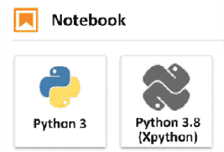
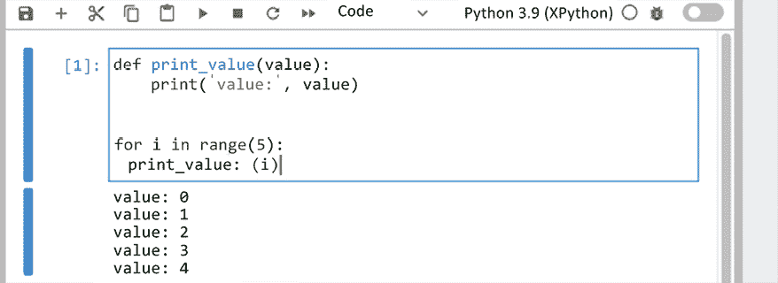
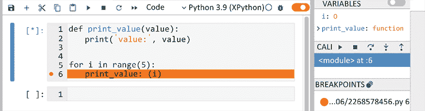

# 第十一章：调试 – 解决错误

上一章向您展示了如何将日志和测试添加到您的代码中，但无论您有多少测试，您总会遇到错误。最大的问题将是外部变量，如用户输入和不同的环境。迟早，我们需要调试我们的代码，或者更糟糕的是，别人的代码。

有许多调试技术，并且肯定您已经使用了一些。在本章中，我们将重点关注打印/跟踪调试和交互式调试。

使用打印语句、堆栈跟踪和日志记录进行调试是工作中最灵活的方法之一，这很可能是你第一次使用的调试类型。甚至一个`print('Hello world')`也可以被认为是这种类型，因为输出会显示你的代码正在正确执行。显然，解释如何以及在哪里放置打印语句来调试代码是没有意义的，但使用装饰器和其他 Python 模块有很多不错的技巧，可以使这种类型的调试变得更有用，例如`faulthandler`。

交互式调试是一种更复杂的调试方法。它允许你在程序仍在运行时进行调试。使用这种方法，甚至可以在应用程序运行时更改变量，并在任何想要的点上暂停应用程序。缺点是它需要一些关于调试器命令的知识才能真正有用。

总结一下，我们将涵盖以下主题：

+   使用`print`、`trace`、`logging`和`faulthandler`的非交互式调试

+   使用`pdb`、`ipython`、`jupyter`和其他调试器和调试服务进行交互式调试

# 非交互式调试

调试的最基本形式是在你的代码中添加一个简单的打印语句，以查看哪些还在工作，哪些没有。这在各种情况下都很有用，并且很可能会帮助你解决大多数问题。

在本章的后面部分，我们将展示一些交互式调试方法，但它们并不总是合适的。交互式调试在以下情况下往往变得困难或甚至不可能：

+   多线程环境

+   多个服务器

+   难以（或需要很长时间）复现的错误

+   关闭的远程服务器，如 Google App Engine 或 Heroku

交互式和非交互式调试方法都有其优点，但我在 90%的情况下会选择非交互式调试，因为简单的打印/日志语句通常足以分析问题的原因。我发现交互式调试在编写使用大型和复杂外部库的代码时非常有帮助，在这些情况下，很难分析对象有哪些属性、属性和方法可用。

一个基本的示例（我做过类似的事情）可以使用生成器如下：

```py
>>> def hiding_generator():
...     print('a')
...     yield 'first value'
...     print('b')
...     yield 'second value'
...     print('c')

>>> generator = hiding_generator()

>>> next(generator)
a
'first value'

>>> next(generator)
b
'second value'

>>> next(generator)
Traceback (most recent call last):
...
StopIteration 
```

这显示了代码的确切执行位置，以及没有执行的位置。如果没有这个例子，你可能预期第一个 `print` 会立即跟在 `hiding_generator()` 调用之后。然而，由于它是一个生成器，所以直到我们 `yield` 一个项目之前，什么都不会执行。假设你有一些在第一个 `yield` 之前的设置代码，它不会运行，直到 `next` 实际被调用。此外，`print('c')` 永远不会被执行，可以被认为是不可达的代码。

虽然这是使用 `print` 调用来调试函数的一种简单方法，但并不总是最方便的方法。我们可以先创建一个自动打印函数，它会打印它将要执行的代码行：

```py
>>> import os
>>> import inspect
>>> import linecache

>>> def print_code():
...     while True:
...         info = inspect.stack()[1]
...         lineno = info.lineno + 1
...         function = info.function
...         # Fetch the next line of code
...         code = linecache.getline(info.filename, lineno)
...         print(f'{lineno:03d} {function}: {code.strip()}')
...         yield

# Always prime the generator
>>> print_code = print_code()

>>> def some_test_function(a, b):
...     next(print_code)
...     c = a + b
...     next(print_code)
...     return c

>>> some_test_function('a', 'b')
003 some_test_function: c = a + b
005 some_test_function: return c
'ab' 
```

如你所见，它会自动打印行号、函数名称以及它将要执行的下一行代码。这样，如果你有一段运行缓慢的代码，你可以看到是哪一行导致的延迟，因为它会在执行前被打印出来。

在这个特定实例中，生成器并没有真正的用途，但你可以轻松地加入一些计时，以便你可以看到两个 `next(print_code)` 语句之间的延迟。或者也许是一个计数器，用来查看这段特定的代码运行了多少次。

## 使用跟踪来检查你的脚本

简单的打印语句在许多情况下都很有用，因为你可以轻松地将打印语句集成到几乎每一个应用中。它无关乎是远程还是本地，线程还是使用多进程。它几乎在所有地方都能工作，使其成为最通用的解决方案——除了日志记录之外。然而，通用的解决方案通常并不是每个情况下最好的解决方案。我们之前函数的一个很好的替代方案是 `trace` 模块。它为你提供了一种方法来跟踪每一条执行的代码，包括运行时间。但是，跟踪这么多数据的缺点是它可能会很快变得过于冗长，正如我们将在下一个例子中看到的那样。

为了演示，我们将使用我们之前的代码，但不包含打印语句：

```py
def some_test_function(a, b):
    c = a + b
    return c

print(some_test_function('a', 'b')) 
```

现在我们使用 `trace` 模块来执行代码：

```py
$ python3 -m trace --trace --timing T_01_trace.py
 --- modulename: T_01_trace, funcname: <module>
0.00 T_01_trace.py(1): def some_test_function(a, b):
0.00 T_01_trace.py(6): print(some_test_function('a', 'b'))
 --- modulename: T_01_trace, funcname: some_test_function
0.00 T_01_trace.py(2):     c = a + b
0.00 T_01_trace.py(3):     return c
ab 
```

`trace` 模块会显示确切执行了哪一行，包括函数名称，更重要的是，哪一行是由哪个（或哪些）语句引起的。此外，它还会显示相对于程序开始时间的执行时间。这是由于 `--timing` 标志。

从输出的角度来看，这似乎是相当合理的，对吧？在这个例子中，它之所以合理，是因为这可能是最基础的代码了。一旦你添加了一个 `import`，例如，你的屏幕就会被输出信息淹没。尽管你可以通过使用命令行参数来选择性地忽略特定的模块和目录，但在许多情况下，它仍然过于冗长。

我们也可以通过一点努力有选择性地启用 `trace` 模块：

```py
import sys
import trace as trace_module
import contextlib

@contextlib.contextmanager
def trace(count=False, trace=True, timing=True):
    tracer = trace_module.Trace(
        count=count, trace=trace, timing=timing)
    sys.settrace(tracer.globaltrace)
    yield tracer
    sys.settrace(None)

    result = tracer.results()
    result.write_results(show_missing=False, summary=True)

def some_test_function(a, b):
    c = a + b
    return c

with trace():
    print(some_test_function('a', 'b')) 
```

此代码展示了如何通过临时启用和禁用`trace`模块来选择性地跟踪代码的上下文管理器。在这个例子中，我们使用了`sys.settrace`并将`tracer.globaltrace`作为参数，但您也可以连接到自己的跟踪函数来自定义输出。

当执行此操作时，我们得到以下输出：

```py
$ python3 T_02_selective_trace.py
 --- modulename: T_02_selective_trace, funcname: some_test_function
0.00 T_02_selective_trace.py(19):     c = a + b
0.00 T_02_selective_trace.py(20):     return c
ab
 --- modulename: contextlib, funcname: __exit__
0.00 contextlib.py(122):         if type is None:
0.00 contextlib.py(123):             try:
0.00 contextlib.py(124):                 next(self.gen)
 --- modulename: T_02_selective_trace, funcname: trace
0.00 T_02_selective_trace.py(12):     sys.settrace(None) 
```

现在，为了说明，如果我们启用跟踪模块运行相同的代码，我们会得到大量的输出：

```py
$ python3 -m trace --trace --timing T_02_selective_trace.py | wc
    256    2940   39984 
```

`wc`（单词计数）命令显示此命令给出了`252`行，`2881`个单词，或`38716`个字符的输出，因此我通常会建议使用上下文装饰器。对任何合理大小的脚本执行跟踪将生成大量的输出。

`trace`模块有一些额外的选项，例如显示哪些代码被执行（或未执行），这有助于检测代码覆盖率。

除了我们已传递给`trace`的参数外，我们还可以通过包装或替换`sys.settrace()`参数中的`tracer.globaltrace`来轻松更改输出或添加额外的过滤器。作为参数，该函数需要接受`frame`，`event`和`arg`。

`frame`是 Python 堆栈帧，其中包含对代码和文件名的引用，可以用来检查堆栈中的作用域。这是您在使用`traceback`模块时可以提取的相同帧。

`event`参数是一个字符串，可以有以下值（来自标准 Python 文档）：

| **参数** | **描述** |
| --- | --- |
| `call` | 调用一个函数（或进入其他代码块）。调用全局跟踪函数；`arg`为`None`。返回值指定局部跟踪函数。 |
| `line` | 解释器即将执行新的代码行或重新执行循环的条件。调用局部跟踪函数；`arg`为`None`；返回值指定新的局部跟踪函数。有关此功能的详细解释，请参阅`Objects/lnotab_notes.txt`（位于 Python 源代码库中）。可以通过在`frame`上设置`f_trace_lines`为`False`来禁用每行事件。 |
| `return` | 函数（或另一个代码块）即将返回。调用局部跟踪函数；`arg`是即将返回的值，如果事件是由抛出异常引起的，则为`None`。跟踪函数的返回值被忽略。 |
| `exception` | 这表示发生了异常。调用局部跟踪函数；`arg`是一个元组（`exception`，`value`，`traceback`）。返回值指定新的局部跟踪函数。 |
| `opcode` | 解释器即将执行一个新的操作码（有关操作码的详细信息，请参阅`dis`模块）。调用局部跟踪函数；`arg`为`None`；返回值指定新的局部跟踪函数。默认情况下不会发出每操作码事件：必须在帧上显式请求将`f_trace_opcodes`设置为`True`。 |

最后，`arg`参数依赖于`event`参数，如上述文档所示。一般来说，如果`arg`是`None`，则此函数的返回值将用作局部跟踪函数，允许你为特定作用域覆盖它。对于`exception`事件，它将是一个包含`exception`、`value`和`traceback`的元组。

现在让我们创建一个可以按文件名筛选来选择性跟踪我们代码的小片段：

```py
import sys
import trace as trace_module
import contextlib

@contextlib.contextmanager
def trace(filename):
    tracer = trace_module.Trace()

    def custom_trace(frame, event, arg):
        # Only trace for the given filename
        if filename != frame.f_code.co_filename:
            return custom_trace

        # Let globaltrace handle the rest
        return tracer.globaltrace(frame, event, arg)

    sys.settrace(custom_trace)
    yield tracer
    sys.settrace(None)

    result = tracer.results()
    result.write_results(show_missing=False, summary=True)

def some_test_function(a, b):
    c = a + b
    return c

# Pass our current filename as '__file__'
with trace(filename=__file__):
    print(some_test_function('a', 'b')) 
```

通过使用`frame`参数，我们可以检索当前正在执行的代码，并从中获取代码当前所在的文件名。自然地，你也可以根据不同的函数或仅过滤到特定的深度进行筛选。由于我们将跟踪和输出委托给`tracer.globaltrace()`，我们只检查堆栈中的`filename`。你也可以返回`trace()`并自行处理`print()`。

当执行此代码时，你应该得到：

```py
$ python3 T_03_filename_trace.py
 --- modulename: T_03_filename_trace, funcname: some_test_function
T_03_filename_trace.py(27):     c = a + b
T_03_filename_trace.py(28):     return c
ab
 --- modulename: T_03_filename_trace, funcname: trace
T_03_filename_trace.py(20):     sys.settrace(None)
lines   cov%   module   (path)
    3   100%   T_03_filename_trace   (T_03_filename_trace.py) 
```

如你所见，这排除了`contextlib`中的代码，我们在前面的例子中已经看到了。

## 使用日志进行调试

在*第十章*，*测试和日志 – 准备错误*中，我们看到了如何创建自定义记录器，为它们设置级别，并将处理程序添加到特定级别。我们现在将使用`logging.DEBUG`级别进行日志记录，这本身并没有什么特别之处，但通过几个装饰器，我们可以添加一些非常有用的仅调试代码。

当我在调试时，总是觉得知道函数的输入和输出非常有用。使用装饰器的基本版本足够简单，只需打印`args`、`kwargs`和`return`值即可完成。以下示例更进一步。通过使用`inspect`模块，我们可以检索默认参数，使得在所有情况下都能显示所有参数的名称和值，即使参数未指定：

```py
import pprint
import inspect
import logging
import functools

def debug(function):
    @functools.wraps(function)
    def _debug(*args, **kwargs):
        # Make sure 'result' is always defined
        result = None
        try:
            result = function(*args, **kwargs)
            return result
        finally:
            # Extract the signature from the function
            signature = inspect.signature(function)
            # Fill the arguments
            arguments = signature.bind(*args, **kwargs)
            # NOTE: This only works for Python 3.5 and up!
            arguments.apply_defaults()
            logging.debug('%s(%s): %s' % (
                function.__qualname__,
                ', '.join('%s=%r' % (k, v) for k, v in
                          arguments.arguments.items()),
                pprint.pformat(result),
            ))

    return _debug

@debug
def add(a, b=123):
    return a + b

if __name__ == '__main__':
    logging.basicConfig(level=logging.DEBUG)

    add(1)
    add(1, 456)
    add(b=1, a=456) 
```

让我们分析一下这段代码是如何执行的：

1.  装饰器会以正常方式执行`function()`，同时将未修改的`*args`和`**kwargs`传递给函数，并将结果存储起来以供稍后显示和`return`。

1.  `try`/`finally`的`finally`部分从`function()`生成一个`inspect.Signature()`对象。

1.  现在我们通过使用之前生成的`signature`将`*args`和`**kwargs`绑定，生成一个`inspect.BoundArguments()`对象。

1.  现在我们可以告诉`inspect.BoundArguments()`对象应用默认参数，这样我们就可以看到未在`*args`和`**kwargs`中传递的参数的值。

1.  最后，我们输出完整的函数名、格式化的参数和`result`。

当我们执行代码时，我们应该看到以下内容：

```py
$ python3 T_04_logging.py
DEBUG:root:add(a=1, b=123): 124
DEBUG:root:add(a=1, b=456): 457
DEBUG:root:add(a=456, b=1): 457 
```

当然，这很好，因为我们能清楚地看到函数何时被调用，使用了哪些参数，以及返回了什么。然而，这通常是你在积极调试代码时才会执行的操作。

你还可以通过添加一个特定于调试的记录器来使你的代码中的常规`logging.debug`语句更有用，该记录器显示更多信息。只需将前一个示例的日志配置替换为以下内容：

```py
import logging

log_format = (
    '[%(relativeCreated)d %(levelname)s] '
    '%(filename)s:%(lineno)d:%(funcName)s: %(message)s'
)
logging.basicConfig(level=logging.DEBUG, format=log_format) 
```

然后你的结果将类似于以下内容：

```py
$ python3 T_05_logging_config.py
[DEBUG] T_05_logging_config.py:20:_debug: add(a=1, b=123): 124
[DEBUG] T_05_logging_config.py:20:_debug: add(a=1, b=456): 457
[DEBUG] T_05_logging_config.py:20:_debug: add(a=456, b=1): 457 
```

它显示相对于应用程序开始的时间（以毫秒为单位）和日志级别。接着是一个标识块，显示产生日志的文件名、行号和函数名。当然，在最后还有一个`message`，其中包含我们日志调用的结果。

## 无异常显示调用堆栈

当查看代码是如何以及为什么被运行时，查看整个堆栈跟踪通常很有用。当然，抛出一个异常也是一个选择。然而，这将终止当前的代码执行，这通常不是我们想要的。这就是`traceback`模块派上用场的地方。只需简单调用`traceback.print_stack()`，我们就能得到完整的堆栈列表：

```py
import sys
import traceback

class ShowMyStack:
    def run(self, limit=None):
        print('Before stack print')
        traceback.print_stack(limit=limit)
        print('After stack print')

class InheritShowMyStack(ShowMyStack):
    pass

if __name__ == '__main__':
    show_stack = InheritShowMyStack()

    print('Stack without limit')
    show_stack.run()
    print()

    print('Stack with limit 1')
    show_stack.run(1) 
```

`ShowMyStack.run()`函数显示了一个常规的`traceback.print_stack()`调用，它显示了堆栈中的整个堆栈跟踪。你可以在代码的任何地方放置`traceback.print_stack()`以查看它是如何被调用的。

由于完整的堆栈跟踪可能相当大，因此通常很有用使用`limit`参数只显示几个级别，这就是我们在第二次运行中所做的。

这会导致以下结果：

```py
$ python3 T_06_stack.py
Stack without limit
Before stack print
  File "T_06_stack.py", line 20, in <module>
    show_stack.run()
  File "T_06_stack.py", line 8, in run
    traceback.print_stack(limit=limit)
After stack print

Stack with limit 1
Before stack print
  File "T_06_stack.py", line 8, in run
    traceback.print_stack(limit=limit)
After stack print 
```

如您所见，堆栈跟踪简单地打印出来，没有任何异常。实际上，`traceback`模块还有许多其他方法可以基于异常等打印堆栈跟踪，但你可能不会经常需要它们。最有用的可能就是我们已经展示的`limit`参数。正数限制数字只显示特定数量的帧。在大多数情况下，你不需要完整的堆栈跟踪，所以这可以非常有用，以限制输出。

或者，我们也可以指定一个负数限制，这将从另一侧裁剪堆栈。这在从装饰器打印堆栈时很有用，你希望隐藏装饰器从跟踪中。如果你想限制两边，你必须手动使用`format_list(stack)`和`extract_stack(f, limit)`的堆栈，其用法与`print_stack()`函数类似。

Python 3.5 中添加了对负数限制的支持。在此之前，只支持正数限制。

## 使用 faulthandler 处理崩溃

`faulthandler`模块在调试真正低级别的崩溃时很有帮助，即当使用低级别访问内存（如 C 扩展）时才可能发生的崩溃。

例如，以下是一段会导致你的 Python 解释器崩溃的代码：

```py
import ctypes

# Get memory address 0, your kernel shouldn't allow this:
ctypes.string_at(0) 
```

结果类似于以下内容：

```py
$ python3 T_07_faulthandler.py
zsh: segmentation fault  python3 T_07_faulthandler.py 
```

当然，这是一个相当丑陋的响应，并且没有给你处理错误的可能性。如果你想知道，拥有 `try/except` 结构在这些情况下也不会帮助你。以下代码将以完全相同的方式崩溃：

```py
import ctypes

try:
    # Get memory address 0, your kernel shouldn't allow this:
    ctypes.string_at(0)
except Exception as e:
    print('Got exception:', e) 
```

在这种情况下，`faulthandler` 模块有所帮助。它仍然会导致你的解释器崩溃，但至少你会看到一个适当的错误消息被抛出，所以如果你（或任何子库）与原始内存有任何交互，这是一个好的默认设置：

```py
import ctypes
import faulthandler

faulthandler.enable()

# Get memory address 0, your kernel shouldn't allow this:
ctypes.string_at(0) 
```

结果大致如下：

```py
$ python3 T_09_faulthandler_enabled.py
Fatal Python error: Segmentation fault

Current thread 0x0000000110382e00 (most recent call first):
  File python3.9/ctypes/__init__.py", line 517 in string_at
  File T_09_faulthandler.py", line 7 in <module>
zsh: segmentation fault  python3 T_09_faulthandler_enabled.py 
```

显然，以这种方式让 Python 应用程序退出是不可取的，因为代码不会以正常清理的方式退出。资源将无法被干净地关闭，并且你的退出处理程序不会被调用。如果你需要以某种方式捕获这种行为，最好的办法是将 Python 可执行文件包裹在一个单独的脚本中，使用类似 `subprocess.run([sys.argv[0], '` `T_09_faulthandler_enabled.py'])` 的方法。

# 交互式调试

现在我们已经讨论了始终有效的基本调试方法，我们将探讨一些更高级的调试技术中的交互式调试。之前的调试方法通过修改代码和/或预见性来使变量和堆栈可见。这一次，我们将看看一个稍微聪明一点的方法，即交互式地做同样的事情，但一旦需要。

## 需求控制台

在测试一些 Python 代码时，你可能已经使用过交互式控制台几次，因为它是一个简单而有效的测试 Python 代码的工具。你可能不知道的是，实际上从你的代码中启动自己的 shell 非常简单。所以，无论何时你想从代码的特定点进入一个常规 shell，这都是很容易实现的：

```py
import code

def start_console():
    some_variable = 123
    print(f'Launching console, some_variable: {some_variable}')
    code.interact(banner='console:', local=locals())
    print(f'Exited console, some_variable: {some_variable}')

if __name__ == '__main__':
    start_console() 
```

当执行时，我们将进入一个交互式控制台的中途：

```py
$ python3 T_10_console.py
Launching console, some_variable: 123
console:
>>> some_variable = 456
>>>
now exiting InteractiveConsole...
Exited console, some_variable: 123 
```

要退出这个控制台，我们可以在 Linux/Mac 系统上使用 *^d* (*Ctrl* + *D*)，在 Windows 系统上使用 *^z* (*Ctrl* + *Z*)。

这里需要注意的一个重要事情是，局部作用域在这两个之间不是共享的。尽管我们传递了 `locals()` 以便方便地共享局部变量，但这种关系不是双向的。

结果是，尽管我们在交互会话中将 `some_variable` 设置为 `456`，但它并没有传递到外部函数。如果你愿意，你可以通过直接操作（例如，设置属性）在外部作用域中修改变量，但所有局部声明的变量将保持局部。

自然地，修改可变变量将影响两个作用域。

## 使用 Python 调试器 (pdb) 进行调试

当真正调试代码时，常规的交互式控制台并不适合。经过一些努力，你可以让它工作，但这对调试来说并不那么方便，因为你只能看到当前的作用域，而且不能轻易地在堆栈中跳转。使用 `pdb` (Python 调试器)，这很容易实现。所以，让我们看看使用 `pdb` 的一个简单例子：

```py
import pdb

def go_to_debugger():
    some_variable = 123
    print('Starting pdb trace')
    pdb.set_trace()
    print(f'Finished pdb, some_variable: {some_variable}')

if __name__ == '__main__':
    go_to_debugger() 
```

这个例子几乎与前一段落中的例子相同，只是这次我们最终进入的是 `pdb` 控制台而不是常规的交互式控制台。所以，让我们尝试一下交互式调试器：

```py
$ python3 T_11_pdb.py
Starting pdb trace
> T_11_pdb.py(8)go_to_debugger()
-> print(f'Finished pdb, some_variable: {some_variable}')
(Pdb) some_variable
123
(Pdb) some_variable = 456
(Pdb) continue
Finished pdb, some_variable: 456 
```

如你所见，我们实际上已经修改了 `some_variable` 的值。在这种情况下，我们使用了完整的 `continue` 命令，但所有的 `pdb` 命令都有简写版本。所以，使用 `c` 而不是 `continue` 会得到相同的结果。只需键入 `some_variable`（或任何其他变量）即可显示其内容，设置变量将简单地将其设置，就像我们期望从交互式会话中那样。 |

要开始使用 `pdb`，首先，这里显示了最有用的（完整）堆栈移动和操作命令及其缩写列表：

| **命令** | **说明** |
| --- | --- |
| `h(elp)` | 这显示了命令列表（此列表）。 |
| `h(elp) command` | 这显示了给定命令的帮助。 |
| `w(here)` | 当前堆栈跟踪，并在当前帧处有一个箭头。 |
| `d(own)` | 向下/移动到堆栈中的较新帧。 |
| `u(p)` | 向上/移动到堆栈中的较旧帧。 |
| `s(tep)` | 执行当前行，并尽可能快地停止。 |
| `n(ext)` | 执行当前行，并在当前函数内的下一行停止。 |
| `r(eturn)` | 继续执行直到函数返回。 |
| `c(ont(inue))` | 继续执行直到下一个断点。 |
| `l(ist) [first[, last]]` | 列出当前行周围的源代码行（默认为 11 行）。 |
| `ll &#124; longlist` | 列出当前函数或帧的所有源代码。 |
| `source expression` | 列出给定对象的源代码。这与 `longlist` 类似。 |
| `a(rgs)` | 打印当前函数的参数。 |
| `pp expression` | 美化打印给定表达式。 |
| `! statement` | 在堆栈的当前点执行语句。通常不需要 `!` 符号，但如果与调试器命令有冲突，这可能很有用。例如，尝试 `b = 123`。 |
| `interact` | 打开一个类似于前一段落的交互式 Python shell 会话。 |

许多其他命令可用，其中一些将在以下段落中介绍。不过，所有命令都包含在内置的帮助中，所以如果需要，请务必使用 `h/help [command]` 命令。

### 断点

断点是调试器将停止代码执行并允许你从该点进行调试的点。我们可以使用代码或命令来创建断点。首先，让我们使用 `pdb.set_trace()` 进入调试器。这实际上是一个硬编码的断点：

```py
import pdb

def print_value(value):
    print('value:', value)

if __name__ == '__main__':
    pdb.set_trace()
    for i in range(5):
        print_value(i) 
```

到目前为止，还没有发生任何新的事情，但现在让我们打开交互式调试会话并尝试一些断点命令。在我们开始之前，这里有一份最常用断点命令的列表：

| **命令** | **说明** |
| --- | --- |
| `b(reak)` | 显示断点列表。 |
| `b(reak) [filename:]lineno` | 在给定的行号和可选的文件中放置断点。 |
| `b(reak) function[, condition]` | 在指定的函数处设置断点。条件是一个表达式，必须评估为 `True` 才能使断点生效。 |
| `cl(ear) [filename:]lineno` | 清除此行上的断点（或断点）。 |
| `cl(ear) breakpoint [breakpoint ...]` | 使用这些数字清除断点（或断点）。 |

现在，让我们执行这段代码并进入交互式调试器来尝试这些命令：

```py
$ python3 T_12_pdb_loop.py
> T_12_pdb_loop.py (10)<module>()
-> for i in range(5):
(Pdb) source print_value  # View the source of print_value
  4     def print_value(value):
  5         print('value:', value)
(Pdb) b 5  # Add a breakpoint to line 5
Breakpoint 1 at T_12_pdb_loop.py:5
(Pdb) w  # Where shows the current line
> T_12_pdb_loop.py (10)<module>()
-> for i in range(5):
(Pdb) c  # Continue (until the next breakpoint or exception)
> T_12_pdb_loop.py(5)print_value()
-> print('value:', value)
(Pdb) w  # Where shows the current line and the calling functions
  T_12_pdb_loop.py(11)<module>()
-> print_value(i)
> T_12_pdb_loop.py(5)print_value()
-> print('value:', value)
(Pdb) ll  # List the lines of the current function
  4     def print_value(value):
  5 B->     print('value:', value)
(Pdb) b  # Show the breakpoints
Num Type         Disp Enb   Where
1   breakpoint   keep yes   at T_12_pdb_loop.py:5
        breakpoint already hit 1 time
(Pdb) cl 1  # Clear breakpoint 1
Deleted breakpoint 1 at T_12_pdb_loop.py:5
(Pdb) c  # Continue the application until the end
value: 0
value: 1
value: 2
value: 3
value: 4 
```

虽然输出很多，但实际上并不像看起来那么复杂：

1.  首先，我们使用 `source print_value` 命令查看 `print_value` 函数的源代码。

1.  之后，我们知道第一个 `print` 语句的行号，我们使用它来在行 5 处设置断点 (`b 5`)。

1.  为了检查我们是否仍然在正确的位置，我们使用了 `w` 命令。

1.  由于已经设置了断点，我们使用 `c` 继续执行到下一个断点。

1.  在第 5 行断点处停止后，我们再次使用 `w` 来确认并显示当前的堆栈。

1.  我们使用 `ll` 列出了当前函数的代码。

1.  我们使用 `b` 列出了断点。

1.  我们使用 `cl 1` 和之前命令中的断点编号再次使用 `cl` 命令移除了断点。

1.  我们继续 (`c`) 直到程序退出或达到下一个断点（如果有的话）。

开始时似乎有点复杂，但一旦你尝试了几次，你会发现这实际上是一种非常方便的调试方式。

为了让它更好，这次我们只在 `value = 3` 时执行断点：

```py
$ python3 T_12_pdb_loop.py
> T_12_pdb_loop.py(10)<module>()
-> for i in range(5):
# print the source to find the variable name and line number:
(Pdb) source print_value
  4     def print_value(value):
  5         print('value:', value)
(Pdb) b 5, value == 3  # add a breakpoint at line 5 when value=3
Breakpoint 1 at T_12_pdb_loop.py:5
(Pdb) c  # continue until breakpoint
value: 0
value: 1
value: 2
> T_12_pdb_loop.py(5)print_value()
-> print('value:', value)
(Pdb) a  # show the arguments for the function
value = 3
(Pdb) value = 123  # change the value before the print
(Pdb) c  # continue, we see the new value now
value: 123
value: 4 
```

要列出我们所做的一切：

1.  首先，使用 `source print_value`，我们查找行号和变量名。

1.  之后，我们使用 `value == 3` 条件设置了断点。

1.  然后，我们使用 `c` 继续执行。正如你所看到的，值 `0`、`1` 和 `2` 被正常打印出来。

1.  在值 `3` 处达到了断点。为了验证，我们使用 `a` 来查看函数参数。

1.  在 `print()` 执行之前，我们更改了变量。

1.  我们继续执行代码的其余部分。

### 捕获异常

所有这些都是在手动调用 `pdb.set_trace()` 函数，但通常你只是在运行你的应用程序，并不真正期望出现问题。这就是异常捕获非常有用的地方。除了自己导入 `pdb`，你还可以通过 `pdb` 作为模块运行脚本。让我们检查一下这段代码，它在达到零除时立即崩溃：

```py
print('This still works')
1 / 0
print('We will never reach this') 
```

如果我们通过 `pdb` 模块运行它，我们可以在它崩溃时进入 Python 调试器：

```py
$ python3 -m pdb T_13_pdb_catching_exceptions
> T_13_pdb_catching_exceptions(1)<module>()
-> print('This still works')
(Pdb) w  # Where
  bdb.py(431)run()
-> exec(cmd, globals, locals)
  <string>(1)<module>()
> T_13_pdb_catching_exceptions(1)<module>()
-> print('This still works')
(Pdb) s  # Step into the next statement
This still works
> T_13_pdb_catching_exceptions(2)<module>()
-> 1/0
(Pdb) c  # Continue
Traceback (most recent call last):
  File "pdb.py", line 1661, in main
    pdb._runscript(mainpyfile)
  File "pdb.py", line 1542, in _runscript
    self.run(statement)
  File "bdb.py", line 431, in run
    exec(cmd, globals, locals)
  File "<string>", line 1, in <module>
  File "T_13_pdb_catching_exceptions", line 2, in <module>
    1/0
ZeroDivisionError: division by zero
Uncaught exception. Entering post mortem debugging
Running 'cont' or 'step' will restart the program
> T_13_pdb_catching_exceptions(2)<module>()
-> 1/0 
```

`pdb` 中一个有用的技巧是使用 *Enter* 按钮，默认情况下，它将再次执行之前执行的命令。这在逐步执行程序时非常有用。

### 别名

别名可以是一个非常实用的功能，可以让你的生活更轻松。如果你像我一样“生活在”Linux/Unix shell 中，你可能已经熟悉它们了，但本质上别名只是一个简写，可以让你不必输入（甚至记住）一个长而复杂的命令。

哪些别名对你有用取决于你的个人喜好，但就我个人而言，我喜欢为 `pprint`（美化打印）模块设置别名。在我的项目中，我经常使用 `pf=pprint.pformat` 和 `pp=pprint.pprint` 作为别名，但在 `pdb` 中，我发现 `pd` 是一个用于美化打印给定对象 `__dict__` 的有用缩写。

`pdb` 命令的别名相对简单且非常易于使用：

| `alias` | 列出所有别名。 |
| --- | --- |
| `alias name command` | 创建一个别名。命令可以是任何有效的 Python 表达式，因此您可以执行以下操作以打印对象的全部属性：`alias pd pp %1.__dict__` |
| `unalias name` | 删除一个别名。 |

确保充分利用这些功能。在 Linux/Unix 系统中，您可能已经注意到许多命令（`ls`、`rm`、`cd`）非常简短，以节省您输入；您可以使用这些别名做同样的事情。

### 命令

`commands` 命令有些复杂但非常有用。它允许您在遇到特定断点时执行命令。为了说明这一点，让我们再次从一个简单的例子开始：

```py
def do_nothing(i):
    pass

for i in range(10):
    do_nothing(i) 
```

代码很简单，所以现在我们将添加断点和命令，如下所示：

```py
$ python3 -m pdb T_14_pdb_commands.py
> T_14_pdb_commands.py(1)<module>()
-> def do_nothing(i):
(Pdb) b do_nothing  # Add a breakpoint to function do_nothing
Breakpoint 1 at T_14_pdb_commands.py:1
(Pdb) commands 1  # add command to breakpoint 1
(com) print(f'The passed value: {i}')
(com) end  # end command
(Pdb) c  # continue
The passed value: 0
> 16_pdb_commands.py(2)do_nothing()
-> pass
(Pdb) q  # quit 
```

如您所见，我们可以轻松地向断点添加命令。在移除断点后，这些命令将不再执行，因为它们与断点相关联。

这些功能可以非常方便地添加一些自动调试 `print` 语句到您的断点；例如，查看局部作用域中所有变量的值。当然，您始终可以手动执行 `print(locals())`，但这些可以在调试过程中节省您大量时间。

## 使用 IPython 进行调试

虽然通用的 Python 控制台很有用，但它可能有些粗糙。IPython 控制台提供了一整套额外功能，使其成为一个更舒适的终端来工作。其中之一是一个更方便的调试器。

首先，请确保您已安装 `ipython`：

```py
$ pip3 install ipython 
```

接下来，让我们尝试使用一个非常基本的脚本来使用调试器：

```py
def print_value(value):
    print('value:', value)

if __name__ == '__main__':
    for i in range(5):
        print_value(i) 
```

接下来，我们运行 IPython 并告诉它以调试模式运行脚本：

```py
$ ipython
Python 3.10.0
Type 'copyright', 'credits' or 'license' for more information
IPython 7.19.0 -- An enhanced Interactive Python. Type '?' for help.

In [1]: %run -d T_15_ipython.py
Breakpoint 1 at T_15_ipython.py:1
NOTE: Enter 'c' at the ipdb>  prompt to continue execution.
> T_15_ipython.py(1)<module>()
1---> 1 def print_value(value):
      2     print('value:', value)
      3
      4
      5 if __name__ == '__main__':

ipdb> b print_value, value == 3  # Add a breakpoint when value=3
Breakpoint 2 at T_15_ipython.py:1
ipdb> c
value: 0
value: 1
value: 2
> T_15_ipython.py(2)print_value()
2     1 def print_value(value):
----> 2     print('value:', value)
      3
      4
      5 if __name__ == '__main__':
ipdb> value
3
ipdb> value = 123  # Change the value
ipdb> c  # Continue
value: 123
value: 4 
```

如您所见，与 `pdb` 并无太大差异。但它会自动以可读的格式显示周围的代码，这非常有用。此外，显示的代码具有语法高亮，这有助于提高可读性。

如果您安装了 `ipdb` 模块，您将获得与 `pdb` 模块类似的功能，这允许您从代码中触发断点。

## 使用 Jupyter 进行调试

Jupyter 对于临时开发非常出色，使得查看小脚本中的代码变得非常容易。对于较大的脚本，这可能会迅速变得困难，因为您通常只能获得非交互式的堆栈跟踪，并且必须求助于不同的方法来更改外部代码。

然而，自 2020 年以来，Jupyter 添加了一个（目前处于实验性阶段）的视觉调试器，以便以非常方便的方式调试你的代码。要开始，请确保你有最新的 Jupyter 版本，并安装 `@jupyterlab/debugger` 扩展和 Jupyter 的 `xeus-python`（XPython）内核。为了确保一切都能轻松工作，我强烈建议使用 `conda` 进行此操作：

```py
$ conda create -n jupyter-debugger -c conda-forge xeus-python=0.8.6 notebook=6 jupyterlab=2 ptvsd nodejs
...
## Package Plan ##

  added / updated specs:
    - jupyterlab=2
    - nodejs
    - notebook=6
    - ptvsd
    - xeus-python=0.8.6
...
$ conda activate jupyter-debugger

(jupyter-debugger) $ jupyter labextension install @jupyterlab/debugger

Building jupyterlab assets (build:prod:minimize) 
```

Conda 的当前安装说明可以在 JupyterLab 调试器 GitHub 页面上找到：`jupyterlab.readthedocs.io/en/latest/user/debugger.html`

对于常规的 Python 虚拟环境，你可以尝试二进制轮（`.whl`）包，这样你就不需要编译任何东西。由于这个功能目前处于实验性阶段，因此它尚未在所有环境中得到支持。在撰写本文时，二进制轮适用于 Python 3.6、3.7 和 3.8，适用于 OS X、Linux 和 Windows。可用的版本列表可以在以下位置找到：`pypi.org/project/xeus-python/#files`

现在我们可以像平常一样启动 `jupyter lab`：

```py
(jupyter-debugger) $ jupyter lab
[I LabApp] JupyterLab extension loaded from jupyterlab
[I LabApp] Jupyter Notebook 6.1.4 is running at:
[I LabApp] http://localhost:8888/?token=...
[I LabApp] Use Control-C to stop this server and shut down all kernels (twice to skip confirmation). 
```

如果一切按预期工作，你现在应该能看到 JupyterLab 启动器，其中提供了 Python 3 和 XPython 内核：



图 11.1：JupyterLab Python 和 XPython 内核

由于只有 `xeus-python`（XPython）目前支持调试，我们不得不打开它。现在我们将添加之前的脚本，以便我们可以演示调试器。如果一切正常工作，你应该能在屏幕右上角看到调试按钮：



图 11.2：常规 Jupyter 控制台输出

现在我们可以按照以下步骤开始调试：

1.  启用右上角的调试切换。

1.  点击一行以添加断点。

1.  运行代码。

如果一切设置正确，它应该看起来像这样：



图 11.3：使用 Jupyter 进行调试

从现在开始，你可以使用右侧调试面板中的按钮来跳过/进入/退出下一语句，以遍历代码。

## 其他调试器

`pdb` 调试器只是 Python 的默认调试器，但远非调试 Python 代码的唯一选项。一些目前值得注意的调试器如下：

+   `ipdb`：将 `pdb` 调试器包装在 IPython 壳中的调试器

+   `pudb`：一个全屏的命令行调试器

+   `pdbpp`（pdb++）：`pdb` 模块的一个扩展，它为 `pdb` 添加了自动补全、语法高亮和一些其他有用的功能

+   `Werkzeug`：一个基于 Web 的调试器，允许在应用程序运行时进行调试

当然，还有很多其他的选择，而且没有一个绝对是最棒的。就像所有工具一样，它们都有各自的优点和缺点，最适合你当前目的的工具只能由你自己决定。很可能你的当前 Python IDE 已经集成了调试器。例如，PyCharm IDE 甚至提供了内置的远程调试功能，这样你就可以从本地的图形界面调试在云服务提供商上运行的应用程序。

### 调试服务

除了在遇到问题时进行调试之外，有时你只需要跟踪错误以供以后调试。如果你的应用程序运行在远程服务器或不受你控制的计算机上，这可能会特别困难。对于这种错误跟踪，有一些非常实用的开源软件包可用。

#### Elastic APM

Elastic APM 是 Elastic Stack 的一部分，可以为你跟踪错误、性能、日志和其他数据。这个系统不仅可以跟踪 Python 应用程序，还支持一系列其他语言和应用程序。Elastic Stack（它围绕 Elasticsearch 构建）是一个极其灵活且维护得非常好的软件堆栈，我强烈推荐。

Elastic Stack 的唯一缺点是它是一套非常庞大的应用程序，很快就需要大量的专用服务器来维持合理的性能。然而，它扩展得非常好；如果你需要更多的处理能力，你只需向你的集群添加一台新机器，一切都会自动为你重新平衡。

#### Sentry

Sentry 是一个开源的错误管理系统，允许你从广泛的编程语言和框架中收集错误。一些显著的功能包括：

+   将错误分组，这样你只会收到一种（或可配置数量的）错误通知

+   能够将错误标记为“已修复”，这样当它再次发生时，它会重新提醒你，同时仍然显示之前的出现

+   显示完整的堆栈跟踪，包括周围的代码

+   跟踪代码版本/发布，以便你知道哪个版本（重新）引入了错误

+   将错误分配给特定的**开发者**修复

虽然 Sentry 应用程序主要关注 Web 应用程序，但它也可以很容易地用于常规应用程序和脚本。

从历史上看，Sentry 最初是一个小的错误分组应用程序，它可以作为一个现有 Django 应用程序中的应用程序使用，或者根据你的需求作为单独的安装。从那时起，那种轻量级结构的大部分已经不复存在；它已经发展成为一个完整的错误跟踪系统，它对许多编程语言和框架提供了原生支持。

随着时间的推移，Sentry 越来越多地转向商业托管平台，因此自行托管应用程序变得更加困难。简单使用`pip install sentry`就能运行的时代已经一去不复返了。如今，Sentry 是一个重量级的应用程序，依赖于以下运行的服务：

+   PostgreSQL

+   Redis

+   Memcached

+   符号化器

+   Kafka

+   Snuba

所以如果你想尝试 Sentry，我建议先尝试托管 Sentry 的免费套餐，看看你是否喜欢它。手动安装不再是可行的选项，所以如果你想自行托管，你唯一现实的选择是使用提供的`docker-compose`文件。

当自行托管时，你应该记住它是一个重量级的应用程序，需要大量的资源来运行，并且很容易填满一个相当大的专用服务器。然而，它仍然比 Elastic APM 轻。

根据我的经验，你需要至少大约 2-3 GiB 的 RAM 和大约 2 个 CPU 核心来运行当前版本的 Sentry。根据你的负载，你可能需要更重的配置，但这是最低要求。

# 练习

对于本地开发，一些小的实用函数可以使你的生活更加轻松。我们已经看到了`print_code`生成器和`trace`上下文包装器的例子。看看你是否可以扩展其中一个到：

+   以超时方式执行代码，以便你可以看到应用程序在哪里停滞

+   测量执行时长

+   显示特定代码块被执行了多少次

+   这些练习的示例答案可以在 GitHub 上找到：`github.com/mastering-python/exercises`。我们鼓励你提交自己的解决方案，并从他人的解决方案中学习其他方法。

# 摘要

本章解释了几种不同的调试技术和注意事项。当然，关于调试还有很多可以说的，但我希望你现在已经对调试 Python 代码有了很好的理解。交互式调试技术在单线程应用程序和有交互会话的地方非常有用。

但由于情况并不总是如此，我们也讨论了一些非交互式选项。

回顾一下，在本章中，我们讨论了使用`print`语句、`logging`、`trace`、`traceback`、`asyncio`和`faulthandler`的非交互式调试。我们还探讨了使用 Python 调试器、IPython 和 Jupyter 的交互式调试，以及了解其他调试器。

在下一章中，我们将看到如何监控和改进 CPU 和内存性能，以及查找和修复内存泄漏。

# 加入我们的 Discord 社区

加入我们社区的 Discord 空间，与作者和其他读者进行讨论：`discord.gg/QMzJenHuJf`


