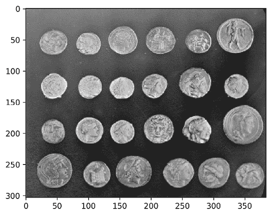
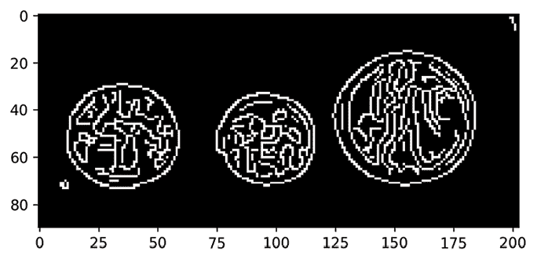
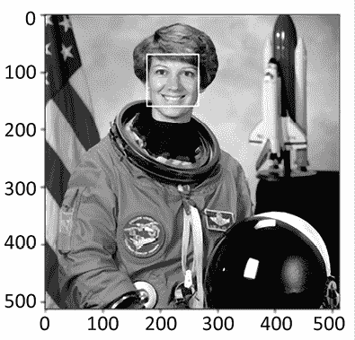
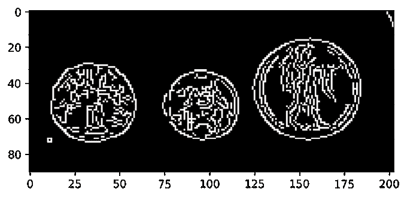
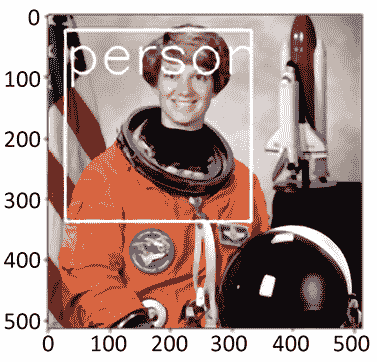
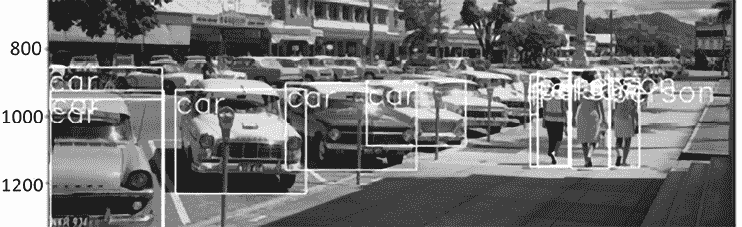
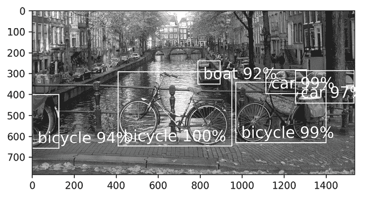
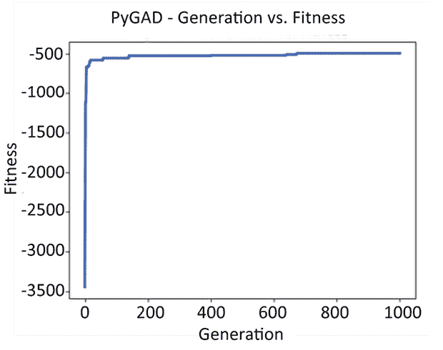
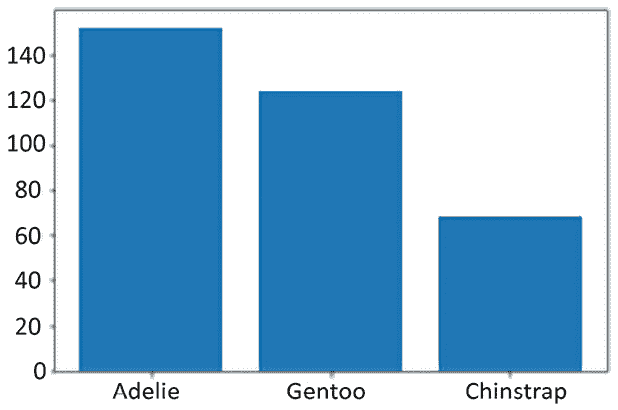

# 16

# 人工智能

在上一章中，我们看到了一组科学 Python 库，它们允许快速轻松地处理大型数据文件。在这一章中，我们将使用其中的一些库和几个其他库来进行机器学习。

机器学习是一个复杂的主题，它内部许多完全不同的主题本身就是研究分支。然而，这不应该让你却步；本章中提到的许多库都非常强大，并且允许你以非常合理的努力开始。

应该注意的是，应用预训练模型和生成自己的模型之间有很大的区别。应用模型通常只需要几行代码，几乎不需要任何处理能力；而构建自己的模型通常需要许多行代码，并且需要数小时或更长时间来处理。这使得在除最简单情况之外的所有情况下，模型的训练都不在本书的范围内。在这些情况下，你将获得库可以做什么的概述，以及一些解释说明在哪里会有用，而不需要具体的示例。

人工智能是计算机科学的一个分支，涉及所有类型机器学习的理论研究，包括神经网络和深度学习、贝叶斯网络、进化算法、计算机视觉、**自然语言处理（NLP**）和**支持向量机（SVM**）等。

在这一章中，我们将涵盖以下主题：

+   人工智能简介

+   图像处理库

+   自然语言处理库

+   神经网络和深度学习库

+   通用 AI 库和工具

# 人工智能简介

在我们继续本章内容之前，我们需要确立一些定义。因为**人工智能（AI**）是一个如此宽泛的主题，所以界限往往有些模糊，因此我们需要确保我们都在谈论同一件事。

首先，我们将 AI 定义为**任何具有类似人类解决问题能力的算法**。虽然我承认这个定义非常宽泛，但任何更窄的定义都会排除有效的 AI 策略。AI 是什么，什么不是 AI，这更多是一个哲学问题，而不是技术问题。虽然（几乎）每个人都认为神经网络是 AI，但一旦涉及到像（贝叶斯）决策树这样的算法，就不再人人同意了。

在心中牢记这个宽泛的定义，以下是我们将要介绍的技术和术语列表，以及它们是什么以及它们能做什么的简要说明。

## 人工智能类型

在 AI 的广泛范围内，我们有两个主要分支，**机器学习（ML**）和其他。机器学习包括任何可以自我学习的算法。你可能想知道，如果不涉及学习，这还是 AI 吗？这是一个有点哲学性质的问题，但我个人认为，有一些非学习算法仍然可以被认为是 AI，因为它们可以产生类似人类的决策。

在自学习系统中，我们还有进一步的区分，它们有各自的目标和应用：

+   监督学习

+   强化学习

+   无监督学习

使用其中一种方法并不排除使用其他方法，因此许多实际应用都使用多种方法的组合。

非机器学习系统要多样化得多，因为它们几乎可以意味着任何东西，所以这里有一些非学习算法的例子，它们在某些方面可以与人类相媲美：

+   **自然语言处理（NLP）**：需要注意的是，NLP 本身并不使用机器学习。许多 NLP 算法仍然是手工编写的，因为人类向机器解释某些语法和语义如何以及为什么工作，比让计算机弄清楚人类语言的奇特性和复杂性要容易得多。然而，该领域正在迅速变化，这可能不会持续太久。

+   **专家系统**：这是在实践上真正成功的第一种 AI。最早的专家系统是在 1970 年创建的，并且自那时以来一直在使用。这些系统通过向您提出一系列问题，并根据这些问题缩小潜在解决方案/答案的列表来工作。您肯定在某个时候遇到过这些问题，比如在网站上的常见问题解答（FAQ）或拨打帮助台时。这些系统允许捕获专家信息并将其压缩成一个简单的系统，该系统可以做出决策。许多这样的系统（并且至今仍在使用）被用于诊断医疗问题。

在我们继续实际的 AI 实现之前，查看一些作为许多 AI 示例基础的图像处理库是个好主意。

# 安装包

正如在第十五章中安装科学 Python 库时的情况一样，在本章中直接使用`pip`安装包在某些情况下可能会有麻烦。使用 Jupyter Docker Stacks 或`conda`可能更方便。此外，这些项目中的大多数都有针对许多场景的非常详细的安装说明。

对于本章的神经网络部分，最好获取一个包含大多数库的笔记本堆栈。我建议您尝试使用`jupyter/tensorflow-notebook`堆栈：[`jupyter-docker-stacks.readthedocs.io/en/latest/using/selecting.html#jupyter-tensorflow-notebook`](https://jupyter-docker-stacks.readthedocs.io/en/latest/using/selecting.html#jupyter-tensorflow-notebook)。

# 图像处理

图像处理是许多类型机器学习（如**计算机视觉（CV）**）的基本组成部分，因此我们在这里向您展示一些选项及其可能性是至关重要的。这些选项从仅图像的库到具有完整机器学习功能同时支持图像输入的库。

## scikit-image

The scikit-image (`skimage`) library is part of the scikit project with the main project being scikit-learn (`sklearn`), covered later in this chapter. It offers a range of functions for reading, processing, transforming, and generating images. The library builds on `scipy.ndimage`, which provides several image processing options as well.

我们首先需要讨论在这些 Python 库中什么是图像。在`scipy`（以及随之而来的`skimage`）的情况下，**图像**是一个具有 2 个或更多维度的`numpy.ndarray`对象。约定如下：

+   2D 灰度：行，列

+   2D 颜色（例如，RGB）：行，列，颜色通道

+   3D 灰度：平面，行，列

+   3D 颜色：平面，行，列，颜色通道

然而，所有这些都是约定；你还可以以其他方式塑造你的数组。多通道图像也可以意味着**CMYK**（青色，品红色，黄色和关键/黑色）颜色而不是**RGB**（红色，绿色和蓝色），或者完全不同的东西。

自然地，你也可以有更多的维度，例如时间维度（换句话说，视频）。由于数组是常规的`numpy`数组，你可以通过通常的切片方式来操作它们。

通常你不会直接使用 scikit-image 库进行机器学习，而是在你将图像数据输入机器学习算法之前进行**预处理**。在许多类型的检测中，例如，颜色并不那么相关，这意味着你可以通过从 RGB 转换为灰度使你的机器学习系统速度提高三倍。此外，通常有快速算法可用于预处理数据，这样你的机器学习系统只需查看图像的相关部分。

### 安装 scikit-image

The package is easily installable through `pip` for many platforms; I would suggest installing not just the base package but the `optional` extras as well, which add extra capabilities to scikit-image, such as parallel processing:

```py
$ pip3 install -U 'scikit-image[optional]' 
```

### 边缘检测

让我们看看我们如何显示内置图像之一，并在其上进行一些基本处理：

```py
%matplotlib inline
from skimage import io, data

coins = data.coins()
io.imshow(coins) 
```

在这种情况下，我们使用`skimage`附带的数据集`coins`。它包含一些硬币，我们可以用它来展示`skimage`的一些优秀功能。首先，让我们看看结果：



图 16.1：scikit-image 硬币

作为我们可以进行何种处理的例子，让我们使用 Canny 边缘检测算法来进行一些边缘检测。这是一个非机器学习算法的典型例子，在将数据输入到机器学习系统之前，它对于预处理你的数据非常有用。为了更好地显示结果，我们首先将图像切割，只显示右上角的三个硬币。在*图 16.1*中，数字表示*x*和*y*轴的实际像素索引，这些可以用来估计切割的位置。之后，我们将应用`canny()`函数来检测边缘：

```py
%matplotlib inline
from matplotlib import pyplot as plt
from skimage import feature

# Get pixels 180 to the end in the X direction
x0, x1 = 180, -1
# Get pixels 0 to 90 in the Y direction 
y0, y1 = 0, 90
# Slice the image so only the top-right three coins are visible
three_coins = coins[y0:y1, x0:x1]
# Apply the canny algorithm
plt.imshow(feature.canny(three_coins), cmap='gray') 
```

结果显示在下面的图像中，你可以看到我们选择的硬币的自动检测到的边缘：



图 16.2：边缘检测后的硬币

scikit-image 可以做更多的事情，但这是一个很好的基本示例，展示了你如何用一行代码进行边缘检测，这可以使你的数据对机器学习系统更有用。

### 人脸检测

现在，我们将使用来自出色的 scikit-image 文档中的一个示例：[`scikit-image.org/docs/dev/auto_examples/applications/plot_face_detection.html`](https://scikit-image.org/docs/dev/auto_examples/applications/plot_face_detection.html)。

这是一个使用预训练模型自动检测人脸的机器学习示例。该特定模型使用多块**局部二值模式**（**LBP**）。LBP 查看中心点周围的点，并指示这些点是否大于（较亮）或小于（较暗）中心点。多块部分是此方法的可选扩展，并在多个块大小为 9 个相同大小的矩形的块上执行 LBP 算法。第一次迭代可能查看 3x3 像素的正方形；第二次迭代可能查看 6x6；第三次 9x9；依此类推。

该模型使用 OpenCV 级联分类器训练，它可以训练你的模型，生成样本，并运行检测。级联分类器将多个分类器的结果连接起来，形成一个预期比单独的分类器表现更好的组合模型。

为了测试人脸检测，我们将将其应用于 NASA 宇航员 Eileen Collins 的照片。首先，我们将导入库，加载图像，并告诉`matplotlib`绘制它：

```py
%matplotlib inline
from skimage import data
from skimage.feature import Cascade

# We are using matplotlib directly so we can
# draw on the rendered output
import matplotlib.pyplot as plt
from matplotlib import patches

dpi = 300
color = 'white'
thickness = 1
step_ratio = 1
scale_factor = 1.2
min_object_size = 60, 60
max_object_size = 123, 123

# A photo of Astronaut Eileen Collins
img = data.astronaut()

# Plot the image as high resolution in grayscale
plt.figure(dpi=dpi)
plt.imshow(img.mean(axis=2), cmap='gray') 
```

观察上面的代码，你可能会注意到一些魔法数字，如`scale_factor`、`step_ratio`、`min_object_size`和`max_object_size`。这些参数是你必须根据输入图像进行调整的。这些特定的数字直接来自 OpenCV 文档，但根据你的输入，你可能需要对这些值进行实验，直到它们适合你的场景。

由于这些参数有些任意且依赖于您的输入，因此应用一些自动化来寻找它们是一个好主意。进化算法可以帮助您找到有效的参数。

现在我们已经准备好开始检测并展示我们的发现：

```py
# Load the trained file and initialize the detector cascade
detector = Cascade(data.lbp_frontal_face_cascade_filename())

# Apply the detector to find faces of varying sizes
out = detector.detect_multi_scale(
    img=img, step_ratio=step_ratio, scale_factor=scale_factor,
    min_size=min_object_size, max_size=max_object_size)

img_desc = plt.gca()
for box in out:
    # Draw a rectangle for every detected face
    img_desc.add_patch(patches.Rectangle(
        # Col and row as X and Y respectively
        (box['c'], box['r']), box['width'], box['height'],
        fill=False, color=color, linewidth=thickness)) 
```

在加载级联后，我们使用`detect_multi_scale`方法运行模型。该方法在`min_size`到`max_size`之间搜索匹配的对象（人脸），这是必需的，因为我们不知道主题（人脸）的大小。一旦我们找到匹配项，我们就在它们周围画一个矩形来指示它们的位置：



图 16.3：由 scikit-image 检测到的人脸

单独来看，scikit-image 没有很多机器学习功能可用，但与其他库的结合使得这个库在机器学习中非常有用。除了我们上面加载的前脸数据集外，您还可以使用来自 OpenCV 的预训练级联。

OpenCV Git 仓库中提供了几个预训练模型：[`github.com/opencv/opencv/tree/master/data/lbpcascades`](https://github.com/opencv/opencv/tree/master/data/lbpcascades)。

### scikit-image 概述

scikit-image 库的功能远不止我们所涵盖的。以下是几个可用子模块的简要概述：

+   `曝光`：用于分析和修复照片曝光水平的函数，这在将数据输入到您的 AI 系统之前清理数据时可能至关重要。

+   `特征`：如我们之前使用的`canny()`边缘检测函数之类的特征检测。这允许检测对象、内容块等，以便在 AI 系统之前对输入进行预过滤，从而减少 AI 系统所需的处理时间。

+   `滤波器`：图像滤波函数，例如阈值滤波以自动过滤噪声，以及其他许多功能。与`曝光`函数类似，这些功能在清理过程中非常有用。

+   `形态学`：许多功能用于锐化边缘、填充区域、寻找最小/最大值等。

+   `注册`：用于计算图像中光流的函数。使用这些函数，您可以估计图像的哪个部分在移动，以及物体移动的速度有多快。给定两个图像，这有助于计算中间图像。

+   `分割`：用于分割图像的函数。在上述硬币的例子中，可以提取和/或标记单独的硬币。

如您所见，scikit-image 库提供了丰富的图像操作和处理函数。此外，它还很好地集成到科学 Python 生态系统中。

## OpenCV

scikit-image 的“主要竞争对手”是**OpenCV**（**开源计算机视觉库**）。OpenCV 库是用 C/C++编写的，但为 Python 和 Java 等几种语言提供了绑定。我把“竞争对手”放在引号中是因为这些库不必竞争；如果您愿意，可以轻松地结合两者的优势，我自己在几个项目中就是这样做的。

我们将首先查看如何安装 Python OpenCV 包。

### 安装 Python OpenCV

`opencv-python` 包根据您的需求有多种变体。除了主要的 OpenCV 包之外，OpenCV 还有许多“贡献”和“额外”包，这些包非常有用。贡献包主要用于跟随教程和尝试示例，而额外模块包含许多有用的附加算法。

额外模块的列表可以在文档中找到：[`docs.opencv.org/5.x/`](https://docs.opencv.org/5.x/)。

我强烈建议安装额外模块，因为许多非常有用的模块都是额外包的一部分。

如果您在将包安装在将使用 GUI 的桌面机器上，您有以下选项：

+   `opencv-python`：主要模块，最基本的形式

+   `opencv-contrib-python`：包括 `opencv-python` 包中的主要模块，但也包括贡献和额外模块

对于不运行 GUI 的服务器，您有以下选项：

+   `opencv-python-headless`：除了不包含任何 GUI 输出函数，如 `cv2.imshow()`，这与 `opencv-python` 相同

+   `opencv-contrib-python-headless`：如上所述，这是 `opencv-contrib-python` 的无头版本

现在我们已经安装了 OpenCV，让我们看看是否可以使用 OpenCV 复制 scikit-image 中的 Canny 边缘检测。

### 边缘检测

让我们看看如何使用 OpenCV 执行 Canny 算法，类似于我们在之前的 scikit-image 示例中所做的。Canny 算法不是 OpenCV 核心的一部分，因此您需要安装 `opencv-contrib-python` 包：

```py
$ pip3 install opencv-contrib-python 
```

我们将使用之前相同的硬币图像：

```py
%matplotlib inline
import cv2
from matplotlib import pyplot as plt
from skimage import data

# Use the coins image from scikit-image
coins = data.coins()

# Get pixels 180 to the end in the X direction
x0, x1 = 180, -1
# Get pixels 0 to 90 in the Y direction 
y0, y1 = 0, 90
# Slice the image so only the top-right three coins are visible
three_coins = coins[y0:y1, x0:x1]
# scikit-image automatically guesses the thresholds, OpenCV does not
threshold_1, threshold_2 = 100, 200
# Apply the canny algorithm
output = cv2.Canny(three_coins, threshold_1, threshold_2)

# OpenCV's imshow() function does not work well with Jupyter so
# we use matplotlib to render to grayscale
plt.imshow(output, cmap='gray') 
```

初看代码看起来相当相似，但有一些差异。

首先，`cv2.Canny()` 函数需要两个额外的参数：`threshold_1` 和 `threshold_2`，即下限和上限。这些参数决定了什么应该被视为噪声，哪些部分与边缘相关。通过增加或减少这些值，您可以在结果边缘中获得更细的细节，但这样做意味着算法也可能开始错误地将背景渐变检测为边缘，这在输出图像的右上角（*图 16.4*）已经发生。

虽然您可以选择将这些传递给 scikit-image，但默认情况下，scikit-image 会自动猜测一些合适的参数。使用 OpenCV，您可以轻松地做到这一点，但这不是默认包含的。scikit-image 用于此估计的算法可以在源代码中看到：[`github.com/scikit-image/scikit-image/blob/main/skimage/feature/_canny.py`](https://github.com/scikit-image/scikit-image/blob/main/skimage/feature/_canny.py)。其次，OpenCV 对 Jupyter 没有原生支持，所以我们使用 `matplotlib` 来渲染输出。或者，我们也可以使用 `IPython.display` 模块来显示图像。

生成的输出类似，然而：



图 16.4：OpenCV Canny

为了获得更相似的结果，你甚至可以使用 scikit-image 来渲染 OpenCV 的输出。由于它们都操作在`numpy`数组上，如果需要，你可以轻松地混合和匹配函数。

### 目标检测

在 scikit-image 人脸检测示例中，我们实际上使用了一个由 OpenCV 生成的模型，因此我们可以直接使用该模型与`opencv-python`，只需做一些小的修改：

+   代替`skimage.feature.Cascade(filename)`，你需要使用`cv2.CascadeClassifier(filename)`

+   代替`cascade.detect_multi_scale()`函数，应调用`cascade.detectMultiScale()`

这立即展示了 scikit-image 和`python-opencv`之间的一个区别。其中 scikit-image 使用 Python 在函数名单词之间使用下划线的约定，而`opencv-python`直接使用从 OpenCV 源中来的 camelCase 函数名。

使用 OpenCV，我们可以轻松地超越我们用于人脸检测的简单级联；这次我们将使用一个**DNN**（**深度神经网络**）。

我们将要使用的网络被称为**YOLOv3**（**你只看一次，版本 3**）并且能够检测许多类型的对象，如汽车、动物、水果等。自然地，这个模型也更大。人脸检测模型只有大约 50 KiB，而 YOLOv3 网络几乎大 5000 倍，达到 237 MiB。

在我们开始之前，我们需要下载一些文件以使 YOLO 网络完全可用：

+   模型（237 MiB）：[`pjreddie.com/media/files/yolov3.weights`](https://pjreddie.com/media/files/yolov3.weights)

+   YOLO 配置文件：[`raw.githubusercontent.com/pjreddie/darknet/master/cfg/yolov3.cfg`](https://raw.githubusercontent.com/pjreddie/darknet/master/cfg/yolov3.cfg)

+   物体的名称：[`raw.githubusercontent.com/pjreddie/darknet/master/data/coco.names`](https://raw.githubusercontent.com/pjreddie/darknet/master/data/coco.names)

一旦你有了这些文件，我们可以展示 YOLO 网络。首先，我们设置了一些导入和变量，然后加载图像：

```py
%matplotlib inline
import cv2 as cv
import numpy as np
from matplotlib import pyplot as plt
from skimage import data

color = 0xFF, 0xFF, 0xFF  # White
dpi = 300
font = cv.FONT_HERSHEY_SIMPLEX
font_size = 3
image_dims = 320, 320
label_offset = 10, 70
min_score = 0.9
thickness = 2

# Load the astronaut image from scikit-image as before
img = data.astronaut()
# Convert the image into a 4-dimensional blob
# by subtracting the mean and rescaling
blob = cv.dnn.blobFromImage(img, 1 / 255, size=image_dims) 
```

现在我们已经准备好了导入，并将图像转换成了适合模型的 blob 格式，我们可以加载模型并展示结果：

```py
# Load names of classes so we know what was detected
classes = open('coco.names').read().splitlines()
# Load the deep neural network model and configuration
net = cv.dnn.readNetFromDarknet('yolov3.cfg', 'yolov3.weights')
# Determine the output layer
ln = net.getLayerNames()
ln = [ln[i - 1] for i in net.getUnconnectedOutLayers()]

# Pass the blob to the net and calculate the output blobs
net.setInput(blob)
out = net.forward(ln)
# Loop through all outputs after stacking because
# the net attempts to match multiple sizes
for result in np.vstack(out):
    # x, y, w and h are numbers between 0 and 1 and need to be
    # scaled by the width and height
    result[:4] *= img.shape[1::-1] * 2
    x, y, w, h, *scores = result
    # Search the net for the best match
    match_index = np.argmax(scores)
    # Skip questionable matches
    if scores[match_index] < min_score:
        continue

    # Calculate the top left and bottom right points
    tl = np.array([x - w / 2, y - h / 2], dtype=int)
    br = np.array([x + w / 2, y + h / 2], dtype=int)
    cv.rectangle(img, tl, br, color, thickness)
    # Calculate the point to place the text
    cv.putText(img, classes[match_index], tl + label_offset,
               font, font_size, color, thickness)
    # Stop after the first match to prevent overlapping results
    break

plt.figure(dpi=dpi)
plt.imshow(img.mean(axis=2), cmap='gray') 
```

为了简洁，这个例子非常精简，但它展示了你如何在几行代码中完成像目标检测这样高级的操作。如果我们看输出，深度神经网络正确地将宇航员识别为一个人：



图 16.5：宇航员上的目标检测

我强烈建议你尝试使用不同的图像自己尝试 YOLOv3 网络。对于一张老街道的图片，我得到了以下结果：



图 16.6：在带有汽车的街道图像上应用 YOLOv3

难道不令人惊叹，如今进行目标检测是多么容易，而且效果多么好？如果您仔细观察图像，可能会注意到它甚至能够检测到部分遮挡的汽车和人。当然，训练一个新的深度神经网络及其研究是另一个完全不同的问题，但至少应用这些网络已经变得像玩一样简单，它们在不到一秒内就能执行完毕，包括网络的加载。

机会当然不止于此，如果您愿意，甚至可以使用这些技术来对视频流进行实时分析。OpenCV 库确实是一款令人印象深刻的软件。

## OpenCV 与 scikit-image

scikit-image 和 OpenCV 各自都有相对于对方的优点。然而，这并不是您必须做出选择的情况；您可以轻松同时使用两者。

在我看来，OpenCV 相对于 scikit-image 有三个主要优势：

+   OpenCV 原生支持使用 GPU 进行处理。

+   由于它是用 C++实现的，因此您可以在线程中执行并行处理，而无需担心全局解释器锁（GIL）。

+   OpenCV 的功能甚至比 scikit-image 更多。

当然，scikit-image 也有一些优势：

+   scikit-image 是用 Python 编写的，因此可以直接从您的编辑器中查看（或修改）算法，非常方便。

+   scikit-image 专注于 Python，因此命名约定感觉更自然。

+   由于 scikit-image 仅适用于 Python，因此所有文档都立即相关。对于 OpenCV，您在网上（以及文档中）找到的许多示例都是关于 C++接口的，这略有不同。

如果您需要为视频流的实时处理提供高性能，那么 OpenCV 将是我的首选推荐，因为它有几个内置方法可以使这项任务变得更容易。如果您只需要读取和修改一些图像，并且可以使用 scikit-image，那么这将是我的首选推荐。

在任何情况下，这两个库都非常出色，我可以自信地推荐两者。如果您的需求跨越两者，请使用两者。

现在终于到了讨论人工智能库本身的时刻。

# 自然语言处理

**NLP**是解析文本并理解其意义的过程。这可以用来从文本片段中提取知识，理解文本之间的差异，等等。

有几个专为这个目的而开发的库，它们工作得相当不错。此外，还有托管预训练网络可供使用，例如**GPT-3**网络，可以通过 OpenAI API 访问。

这个网络可以生成如此高质量的文本，以至于它通常与人类生成的文本难以区分。

## NLTK – 自然语言工具包

NLTK 并非像这里的大多数其他库那样是一个独立的机器学习库，但它却是许多自然语言处理库的基础。NLTK 项目始于 2001 年，旨在理解自然语言，并且绝对值得在这个列表中占有一席之地。

该项目附带了一个大量语料库和多种不同语言的预训练模型的集合。

语料库是大量结构化文本的集合，可用于训练和测试模型。

使用这些语料库和模型，它可以进行情感分析，对文本进行分词以找到相关关键词，等等。

首先，我们需要安装`nltk`：

```py
$ pip3 install nltk 
```

作为基本示例，让我们使用预训练的情感分析能力来看看一个句子的积极或消极程度：

```py
>>> import nltk
>>> from nltk import sentiment

>>> nltk.download('vader_lexicon')
True

>>> sentences = [
...     'Python is a wonderful programming language',
...     'Weak-typed languages are prone to errors',
...     'I love programming in Python and I hate YAML',
... ]

>>> si = sentiment.SentimentIntensityAnalyzer()
>>> for sentence in sentences:
...     scores = si.polarity_scores(sentence)
...     print(sentence)
...     print('negative: {neg}, positive: {pos}'.format(**scores))
Python is a wonderful programming language
negative: 0.0, positive: 0.481
Weak-typed languages are prone to errors
negative: 0.324, positive: 0.0
I love programming in Python and I hate YAML
negative: 0.287, positive: 0.326 
```

我们首先下载用于情感分析的预训练模型。之后，我们可以使用`SentimentIntensityAnalyzer`来检测一个句子是负面的、中性的、积极的，还是它们的组合。

该库可以做更多的事情，但这已经为你提供了一个很好的起点。如果你需要任何基本的人类输入解析，请确保尝试一下，因为它提供了非常令人印象深刻的成果。

## spaCy – 使用 Cython 进行自然语言处理

spaCy 库是一个非常令人印象深刻且速度极快的自然语言处理库。它包含 60 多种语言的预训练神经网络模型，并在文本分类和命名实体识别方面做得非常好。

文档非常出色，并且虽然它是完全开源的，但它是由公司 Explosion 开发的，该公司在跟上自然语言处理领域的最新发展方面做得非常好。如果你想对文本有一个高级的理解，这个库是你的最佳选择之一。如果你只需要基本的文本分词，那么我仍然会推荐`NLTK`，因为它更快更有效。

在我们继续示例之前，我们需要安装 spaCy 并下载模型：

```py
$ pip3 install spacy
$ python3 -m spacy download en_core_web_sm 
```

`en_core_web_sm` 数据集是一个小型且快速的英语数据集。如果你需要一个更全面的数据集，你可以下载`en_core_web_trf`。

要安装不同的语言，我建议你访问 spaCy 网站：[`spacy.io/usage#quickstart`](https://spacy.io/usage#quickstart)。例如，荷兰数据集被称为`nl_core_news_sm`，而不是你可能预期的`nl_core_web_sm`。

现在我们已经处理好了这些，让我们尝试从一个句子中提取一些信息：

```py
>>> import spacy
>>> import en_core_web_sm

>>> nlp = en_core_web_sm.load()
>>> _ = nlp.add_pipe("merge_entities")

>>> sentence = ('Python was introduced in 1989 by Guido van '
... 'Rossum at Stichting Mathematisch Centrum in Amsterdam.')

>>> for token in nlp(sentence):
...     if token.ent_type_:
...         print(f'{token.ent_type_}: {token.text}')
DATE: 1989
PERSON: Guido van Rossum
ORG: Stichting Mathematisch Centrum
GPE: Amsterdam 
```

在加载`spacy`和`en_core_web_sm`模型后，我们添加了`merge_entities`管道。这个管道会自动将标记合并在一起，因此我们得到的是`"Guido van Rossum"`而不是`"Guido"`、`"van"`和`"Rossum"`作为单独的标记。

这难道不是一个令人惊叹的结果吗？它自动理解`"Guido van Rossum"`是一个人，`"Stichting Mathematisch Centrum"`是一个组织，而`"Amsterdam"`是一个地缘政治实体。

## Gensim – 为人类进行主题建模

Gensim 库([`radimrehurek.com/gensim/`](https://radimrehurek.com/gensim/))为你处理 NLP。它与 NLTK 类似，但更专注于现代机器学习库。它有很好的文档，易于使用，可以用来计算文本之间的相似性，分析文本的主题，等等。虽然 NLTK 和 Gensim 之间有很大的重叠，但我认为 Gensim 是一个稍微高级一些的库，更容易入门。另一方面，NLTK 已经存在了 20 多年，由于这个原因，野外有大量的文档可用。

# 机器学习

机器学习是人工智能的一个分支，它可以自我学习。这可以是完全自主的学习，基于预标记数据的学习，或者这两种学习的组合。

在我们深入探讨这个主题的库和示例之前，我们需要一点背景信息。如果你已经熟悉机器学习的类型，可以自由地跳过这一节，直接查看库。

## 机器学习的类型

正如我们在简介中简要提到的，机器学习大致分为三种不同的方法，但通常使用几种方法的组合。为了回顾，我们有以下三个主要分支：

+   监督学习

+   强化学习

+   无监督学习

自然地，这些有很多组合，所以我们将讨论一些基于上述分支的重要的、独特的学习类型。这些名称本身应该已经给你一些关于它们如何工作的提示，但我们将更深入地探讨。

### 监督学习

在监督学习的情况下，我们向系统提供大量的标记数据，以便机器可以学习输入数据和标签之间的关系。一旦它在这些数据上训练完毕，我们就可以使用新数据来测试它是否有效。如果结果不符合预期，就会调整参数或中间训练步骤，直到结果改善。

这些例子包括：

+   分类模型，这些模型在大量照片上训练以识别照片中的对象。或者回答像：“我们是在看一只鸟吗？”这样的问题。

+   文本情感分析。发信息的人是快乐的、悲伤的、敌对的，等等吗？

+   天气预报。由于我们有大量的历史天气数据可用，这是一个监督学习的完美案例。

如果你已经有了数据，这可能是你的最佳选择。然而，在许多情况下，你可能没有数据，或者你有数据但没有高质量标签。这就是其他学习方法发挥作用的地方。

### 强化学习

强化学习与监督学习类似，但它不是使用标记的输入/输出对，而是使用**评分**或**奖励函数**来提供反馈。在强化学习中需要调整的参数是是否重新使用现有知识或探索新的解决方案。过度依赖重新使用现有知识会导致“局部最优”，因为你将永远无法获得最佳（甚至良好的）结果，因为你会卡在你之前找到的解决方案上。然而，过度依赖对新解决方案的探索/研究，则会导致永远无法达到最优解。

这些例子包括：

+   为游戏创建求解器/玩家。对于像围棋或象棋这样的游戏，你可以使用胜负作为评分函数。对于像乒乓球或俄罗斯方块这样的游戏，你可以使用得分作为奖励。

+   机器人导航系统。作为一个评分系统，你可以使用“从起点移动的距离”加上“没有撞到墙”。

+   群体智能。这些是许多（一群）独立、自我组织的系统，需要达到一个共同的目标。例如，一些在线超市使用机器人群体以这种方法自动抓取和包装杂货。群体智能负责避免碰撞和自动更换损坏的机器人。

强化学习是监督学习之后的最佳选择，因为它不需要大量高质量的数据。尽管如此，你可以很好地结合这些方法。创建一个好的评分函数可能很困难，你可以通过在已知良好数据上测试它来轻松验证你的函数。

### 无监督学习

仅从名称上看，你可能会对无监督学习感到困惑。

最后，如果一个无监督系统不知道何时达到有用的解决方案，它将如何工作呢？关键是，在无监督学习中，你不知道最终解决方案会是什么样子，但你可以说出解决方案*可能*会是什么样子。

由于无监督学习的解释有些模糊，我希望一些例子能有所帮助：

+   聚类算法。在聚类中，你向算法提供包含许多变量（例如，在人的情况下，体重、身高、性别等）的数据，并告诉算法找到聚类。

+   异常检测。这也是无监督学习可以真正大放异彩的领域。在异常检测中，你永远不知道你真正在寻找什么，但任何异常的图案都可能很重要。

无监督学习与其他两种我们之前介绍过的机器学习方法有很大不同，因为它通常没有已知的靶点。然而，这并不意味着它毫无用处。在看似随机的数据中寻找模式，在许多方面都可以非常有用，比如在正常运行/稳定性监控或电子商务网站的访客分析中。

现在是时候看看之前方法的组合了。

### 学习方法的组合

人工智能的发展正如火如荼，我预计这个领域在可预见的未来将继续增长。这就是为什么越来越多的算法变体正在被使用，这导致这些明确的定义变得更加灵活。

在某些情况下，例如，通过结合监督学习和强化学习，可以得到比单独使用这些方法更好的结果。这就是为什么所有这些方法之间的界限可能非常模糊，如果一种方法适用于你的目标，那么将它们结合起来并不是错误的。

### 深度学习

机器学习中最有效的例子之一是深度学习。这种机器学习类型在过去的几年中变得极其流行，因为它已被证明是实际应用中最有效的神经网络类型之一，在某些情况下甚至超过了人类专家。

这种网络被称为**深度**网络，因为神经网络具有多个（通常是许多）隐藏的内部层，而传统的神经网络通常只有一层或几层隐藏层。

此外，它只是一个普通的神经网络，可以是监督学习、无监督学习、强化学习或介于两者之间的任何一种。

## 人工神经网络和深度学习

当人们思考人工智能时，大多数人会立即想到**人工神经网络**（**ANNs**）。这些网络试图通过拥有类似突触的人工神经元和它们之间的连接来模仿动物大脑的工作方式。

然而，有几个关键的区别。在动物大脑中，一个神经元可以同时作为输入和输出，而在人工神经网络（ANN）中，通常有一个输入层的输入神经元集合，一个输出层的神经元集合，以及处理中间层的中间层（s）。

目前（2021 年；它于 2020 年 6 月推出）最令人印象深刻的 ANN 是 GPT-3 网络，它被用于 NLP 训练。它拥有惊人的 1750 亿个机器学习参数，在某些情况下，它生成的文本与人类撰写的文本难以区分。

然而，这篇文本很快就会过时。GPT-3 网络已经比 2019 年发布的 GPT-2 大 100 倍，而 GPT-4 已经被宣布，预计比 GPT-3 大 500 倍。

应该注意的是，尽管 ANN（尤其是深度学习）网络非常强大并且可以自我学习，但其中许多都是静态的。一旦它们被训练过，它们就不会再改进或更新。

本节中的库是为了构建神经网络和实现深度学习而设计的。由于这是一个在人工智能中完全独立的领域，它确实值得拥有自己的部分。请注意，当然，如果需要，你仍然可以混合和匹配人工智能策略。

在 Python 中，有多个用于创建神经网络的库，但最大的两个库无疑是**PyTorch**和**TensorFlow/Keras**。直到几年前，还有一个具有类似功能的大型库，名为 Theano。该库已被停止使用，并以新名称 Aesara 进行分支。这两个库现在都不太常用，但 Theano 被认为是原始的 Python 神经网络库。TensorFlow 库实际上是创建来替代 Google 中的 Theano 的。

### 张量

ANN 的基础是张量。张量是数据的数学表示，其中包含了可以应用于这些数据的有效变换的描述。当然，实际情况要复杂得多，但在这里讨论的目的上，你可以将张量视为与我们在上一章中看到的`numpy.ndarray`对象非常相似的多维数组。

当人们谈论零维或 0D 张量时，他们实际上是在谈论一个单独的数字。从那开始，一维张量是一个数组或向量，二维张量是一个矩阵。

目前最大的收获是，常规数字/数组/矩阵与张量之间的区别在于，张量指定了对其有效的变换。这基本上是`list()`与包含`list()`数据的自定义`class`之间的区别，该`class`还具有额外的属性。

### PyTorch – 快速（深度）神经网络

PyTorch 是由 Facebook 开发的库，专注于使用张量构建神经网络，如深度学习网络。

PyTorch 中的张量使用自定义数据结构（而不是`numpy.ndarray`）以提高性能。PyTorch 库在性能优化方面做了大量工作，并内置了对 GPU 加速的支持，以进一步加快速度。

在许多情况下，你可以使用`torch.Tensor`作为`numpy.ndarray`的替代品来启用 GPU 加速。`torch.Tensor` API 与`numpy.ndarray` API 在很大程度上是相同的。

PyTorch（除了性能之外）的真正优势是包含了许多用于不同类型输入的实用库。你可以轻松使用这些 API 处理图像、视频、音频和文本，并且大多数过程都可以以分布式方式并行运行。

下面是一个关于最有用模块的简要概述：

+   `torch.distributed`：用于在单个系统或多个系统中的多个 GPU 上并行训练。

+   `torchaudio`：用于处理音频，无论是来自预先录制的文件还是直接来自（多个）麦克风。

+   `torchtext`：用于处理文本；你还可以将其与 NLP 库如 NLTK 结合使用。

+   `torchvision`：用于处理图像和图像序列（视频）。

+   `torchserve`：用于设置一个服务器，托管你的模型，这样你可以构建一个运行计算的服务。这很有用，因为启动进程和加载模型可能是一个缓慢且繁重的任务。

+   `torch.utils`：包含许多有用的实用函数，但最重要的是 TensorBoard。使用 TensorBoard，您可以通过网络界面交互式地检查您的模型并对模型参数进行更改。

是时候做一个小的例子了，但在我们开始之前，我们需要安装 `pytorch` 和 `torchvision`：

```py
$ pip3 install torch torchvision 
```

我们将使用预训练的 **Mask R-CNN** 模型进行对象识别。这是一个基于 **区域** 的卷积神经网络（R-CNN），它使用图像和标记的图像掩码（对象轮廓）的组合进行训练。

卷积神经网络（CNN）非常适合视觉应用，如图像分类和图像分割。它们还可以应用于其他类型的问题，如自然语言处理（NLP）。

R-CNN 是 CNN 的一个专门版本，专门用于计算机视觉任务，如目标检测。R-CNN 任务通过在一系列图像中指定 **感兴趣区域**（ROI）进行训练。Mask R-CNN 是一个专门化版本，它将 ROI 不是指定为矩形，而是指定为仅突出显示特定对象的掩码。

现在，我们将使用 PyTorch 进行一些对象识别。首先，我们加载照片并导入，将照片转换为张量：

```py
%matplotlib inline
from PIL import Image
from matplotlib import pyplot as plt, patches
from torchvision import transforms
from torchvision.models import detection

dpi = 300
font_size = 14
color = 'white'
min_score = 0.8
min_size = 100
label_offset = 25, -25

# Load the img and convert it to a PyTorch Tensor
img = Image.open('amsterdam-street.jpg')
img_t = transforms.ToTensor()(img) 
```

将转换为张量的操作可以使用 `ToTensor` 转换操作完成。`torchvision.transforms` 模块提供了更多操作，例如调整大小、裁剪和颜色归一化，以便在我们将图像发送到模型之前预先过滤图像。

接下来是加载模型和标签：

```py
# Read the labels from coco_labels. The entire COCO
# (Common Objects in COntext) dataset is available at:
# https://cocodataset.org/#download
labels = open('coco_labels.txt').read().splitlines()

# Load the R-CNN model and set it to eval mode for execution
model = detection.fasterrcnn_resnet50_fpn(pretrained=True)
model.eval()
# Apply the model to the img as a list and unpack after applying
out, = model([img_t]) 
```

标签文件可在本书的 GitHub 页面上找到。

如您所见，模型本身是捆绑在 PyTorch 中的。在加载模型并将其设置为 `eval` 模式（与训练模式相反）后，我们可以快速将模型应用于我们的图像。不幸的是，标签并没有捆绑在一起，因此我们需要自己获取这些标签。现在我们需要显示结果：

```py
results = zip(out['boxes'].detach(), out['labels'], out['scores'])

# Increase the DPI to get a larger output image
plt.figure(dpi=dpi)
img_desc = plt.subplot()
# Walk through the list of detections and print the results
for (t, l, b, r), label_idx, score in results:
    # Skip objects that are questionable matches
    if score < min_score:
        continue

    # Skip tiny matches
    h, w = b - t, r - l,
    if w < min_size or h < min_size:
        continue

    # Draw the bounding box and label
    img_desc.add_patch(patches.Rectangle(
        (t, l), h, w, fill=False, color=color))
    label = f'{labels[label_idx]} {score * 100:.0f}%'
    img_desc.text(
        t + label_offset[0], r + label_offset[1], label,
        fontsize=font_size, color=color)

# Output the img as grayscale for print purposes
plt.imshow(img.convert('L'), cmap='gray')
plt.show() 
```

我们可以显示匹配项及其边界框，得到以下结果：



图 16.7：阿姆斯特丹的街道，由 PyTorch 标注的对象

只需几行代码，我们就成功地创建了一个对象识别器，它可以正确地识别几辆汽车、自行车和一艘船。

在实践中，模型实际上在图像中识别了更多的对象，但我们过滤掉了小的匹配项，以便图像不会太杂乱。实际上，它还识别了七辆汽车、四个人和两艘船。

### PyTorch Lightning 和 PyTorch Ignite – 高级 PyTorch API

PyTorch Lightning 和 PyTorch Ignite 库是方便的快捷方式，可以以更少的步骤和内置的几个有用功能来启动和运行您的网络。您可以直接使用 PyTorch 做同样的事情，但使用实用函数，您可以一次运行多个 PyTorch 步骤，这意味着在工作的过程中重复较少。

这些库是独立创建的，但大致上服务于相同的目标，并且在功能上可以比较。这取决于您的个人喜好，至于哪个最适合您。我最初建议您直接从 PyTorch 开始。虽然这些库非常出色，但在开始使用您可能不完全理解的快捷方式之前，理解底层原理是很重要的。PyTorch 文档很容易遵循，在操作上与 PyTorch Ignite 和 PyTorch Lightning 大致相同，除了稍微冗长一些。

### Skorch – 混合 PyTorch 和 scikit-learn

如前所述，scikit-learn 本地支持神经网络，但其性能对于大规模网络来说还不够好。Skorch 库负责解决这个问题；如果您熟悉 scikit-learn API，您仍然可以使用它，但它内部运行在 PyTorch 上以实现出色的性能。

### TensorFlow/Keras – 快速（深度）神经网络

TensorFlow 库由 Google 开发，专注于构建与 PyTorch 非常相似的深度神经网络。该库文档齐全，提供了大量可用的预训练模型；您可能永远不需要训练自己的模型，这可以是一个很大的优势。

与 PyTorch 类似，TensorFlow 也基于张量进行实际计算，并且它在许多平台上高度优化以实现性能，包括用于部署的手机、专门的 **张量处理单元**（**TPU**）或用于训练模型的 GPU 硬件。

例如，我们将再次运行之前与 PyTorch 一起使用的 Mask R-CNN。由于此模型未与 `tensorflow` 一起打包，我们需要在安装 `tensorflow` 的同时安装 `tensorflow-hub`：

```py
$ pip3 install tensorflow tensorflow-hub 
```

如果您的平台支持，这将自动安装带有 GPU 支持的 `tensorflow`。目前，这意味着 Windows 或 Ubuntu Linux。现在我们可以测试一些 TensorFlow/Keras 代码。首先，我们导入所需的库，设置一些变量，并加载图像：

```py
%matplotlib inline
import numpy as np
import tensorflow_hub as hub
from keras.preprocessing import image
from matplotlib import pyplot as plt, patches

dpi = 300
font_size = 14
color = 'white'
min_score = 0.8
min_size = 100
label_offset = 25, -25

# Load the img and convert it to a numpy array
img = image.load_img('amsterdam-street.jpg')
img_t = image.img_to_array(img)
img_w, img_h = img.size 
```

现在图像已加载，让我们使用 `tensorflow_hub` 加载模型并在我们的图像上应用它：

```py
labels = open('coco_labels.txt').read().splitlines()
model = hub.load(    'https://tfhub.dev/tensorflow/mask_rcnn/inception_resnet_v2_1024x1024/1')
out = model(np.array([img_t]))

# The box coordinates are normalized to [0, 1]
img_dim = np.array([img.size[1], img.size[0]] * 2)
result = zip(
    out['detection_boxes'][0] * img_dim,
    out['detection_classes'][0],
    out['detection_scores'][0],
) 
```

再次强调，我们没有可用的标签，因此我们从 `coco_labels.txt` 文件中读取它。然而，一旦我们加载了模型，我们就可以轻松地将它应用于我们的图像。

现在我们需要准备结果以便于处理，并将它们显示出来：

```py
# Increase the DPI to get a larger output image
plt.figure(dpi=dpi)
img_desc = plt.subplot()

# Walk through the list of detections and print the results
for (l, t, r, b), label_idx, score in result:
    label_idx = int(label_idx)
    # Skip objects that are questionable matches
    if score < min_score:
        continue

    # Skip tiny matches
    h, w = b - t, r - l,
    if w < min_size or h < min_size:
        continue

    # Draw the bounding box and label
    img_desc.add_patch(patches.Rectangle(
        (t, l), h, w, fill=False, color=color))
    label = f'{labels[label_idx]} {score * 100:.0f}%'
    img_desc.text(
        t + label_offset[0], r + label_offset[1], label,
        fontsize=font_size, color=color)

# Output the img as a large grayscale for print purposes
plt.imshow(img.convert('L'), cmap='gray') 
```

由于它使用了相同的预训练模型，代码在很大程度上与 PyTorch 代码相似。值得注意的是差异：

+   我们使用 `tensorflow_hub` 加载了模型。这会自动从 [`tfhub.dev/`](https://tfhub.dev/) 下载并执行预训练模型。

+   矩形框的坐标是从 0 到 1，而不是相对于图像大小。因此，在 `20x20` 图像中的 `10x5` 坐标将导致 `0.5x0.25`。

+   输出变量名不同。应该注意的是，这些取决于模型，可以在 TensorFlow Hub 上找到此模型的这些变量名：[`tfhub.dev/tensorflow/mask_rcnn/inception_resnet_v2_1024x1024/1`](https://tfhub.dev/tensorflow/mask_rcnn/inception_resnet_v2_1024x1024/1)。

+   箱子点使用左、上、右、下的顺序，而不是 PyTorch 中的上、左、下、右。

除了这些小的变化之外，代码实际上是相同的。

#### NumPy 兼容性

TensorFlow 中的实际张量对象与 PyTorch 张量略有不同。虽然 `pytorch.Tensor` API 可以用作 `numpy.ndarray` 的替代品，但 `tensorflow.Tensor` 的 API 略有不同。

有一个 `tensorflow.Tensor.numpy()` 方法，它返回数据的 `numpy.ndarray`。需要注意的是，这**不是**一个引用；修改 `numpy` 数组**不会**更新原始张量，因此你需要在修改后将其转换回来。

作为替代方案，TensorFlow 提供了一个实验性的 `numpy` API，如果你更喜欢这个 API，可以像这样启用：

```py
>>> import tensorflow.experimental.numpy as tnp

>>> tnp.experimental_enable_numpy_behavior() 
```

使用相当简单，但绝不是完全与 `numpy.ndarray` 兼容：

```py
>>> x = tnp.random.random([5])
>>> x[:5] += 10
Traceback (most recent call last):
  File "<stdin>", line 1, in <module>
TypeError: 'tensorflow.python.framework.ops.EagerTensor' object does not support item assignment 
```

#### Keras

TensorFlow 的 Keras 子模块类似于 PyTorch 的 PyTorch Lightning 和 PyTorch Ignite。它为 TensorFlow 提供了一个高级接口，使其更容易使用和入门。与上述 PyTorch 库相反，Keras 作为起点也非常合适。了解底层 TensorFlow 函数可能很有用，但不是使用 Keras 有效的必要条件。

如果你刚开始使用 TensorFlow，并想在项目中应用一些机器学习而不深入到兔子洞中，Keras 可能适合你。

### TensorFlow 与 PyTorch 的比较

与 PyTorch 相比，TensorFlow 有一些优缺点，所以在继续之前，让我们列出这些优缺点。

这里有一些原因，你可能选择 TensorFlow 而不是 PyTorch：

+   TensorFlow 支持在网页浏览器中执行预训练模型。虽然 PyTorch 也有一些库可以做到这一点，但它们要么过时，要么在功能和稳定性方面远远落后于 TensorFlow。

+   TensorFlow 大部分是语言无关的。这意味着它为多种语言提供了绑定，而 PyTorch 主要只支持 Python。

+   TensorFlow，或者更具体地说，Keras，是一个非常高级的 API，它允许你快速入门。当比较 Keras 与 PyTorch Lightning/PyTorch Ignite 时，我个人觉得你可以用 TensorFlow 更快地得到一个可工作的结果。Keras 包含了许多实用函数和类，可以在创建模型时节省你一些工作。另一个大帮助是 TensorFlow Hub，它提供了许多预训练模型和示例代码，方便你使用。

+   TensorFlow 有一个稍微大一点的社区和更多的教程可用。

相反：

+   PyTorch 是围绕 Python 编写的，并且有一个更加 Pythonic 的 API。

+   PyTorch 提供了更细粒度的控制，并且可以轻松地给你许多可调整的参数。

+   虽然这是一个个人观点，但我发现调试 PyTorch（至少从 Python 来看）比 TensorFlow 或 Keras 要好得多，因为代码库层次较少，看起来不那么复杂。使用常规 Python 调试器逐步执行你的模型执行效果很好，并且很容易在 PyTorch 中跟踪。在我的经验中，常规 Python 调试器根本无法与 TensorFlow 一起工作。

+   PyTorch 比 TensorFlow 快一点。这在开发和调试时可以提供巨大的帮助。

你应该使用哪个库取决于个人偏好以及你和你团队的其他成员的现有经验等因素。我当然可以推荐这两个库。

## 进化算法

进化算法是一种基于自然界进化的技术，通过使用适应度函数来确定质量，并通过进化解决方案来改进。

最常见的实现是**遗传算法**，它通常将解决方案或染色体编码成一个字符串或数组，可以通过适应度函数进行测试。这个染色体可以是一系列要应用的函数，一个函数的参数列表，或者完全是其他东西。你希望如何编码染色体完全取决于你，只要适应度函数可以使用它来计算适应度分数。

遗传算法将采用以下操作之一来尝试提高适应度分数：

+   **变异（Mutation）**：这可能是一个从 0 到 1 的位翻转，或者是一个更复杂的变异，即替换多个位。例如，如果我们有位串`0101`，那么一个变异可能导致`0111`。

+   **选择（Selection）**：给定使用适应度函数测试的一组不同的染色体，只保留最好的几个。

+   **交叉（Crossover）**：给定几个不同的染色体，将它们的部分组合起来尝试新的解决方案。例如，如果我们有两个字符串，AABB 和 DEFG，交叉可以分割它们并组合它们；例如，你可以得到 AAFG，它结合了第一个字符串的前两个字符和第二个字符串的最后两个字符。

遗传算法需要一些参数来控制在给定运行中采用哪种策略。**变异率**设置变异发生的概率；**精英主义参数**决定在选择过程中保留多少结果；**交叉率**设置交叉发生的概率。困难的部分是调整这些参数以返回一个好的和稳定的解决方案（换句话说，一个在运行之间变化不大的解决方案），但不要陷入局部最优，在那里你的解决方案看起来是最好的，但通过尝试更多的遗传多样性可能会更好。

在许多应用场景中，遗传算法（或更普遍的遗传编程）是获取你问题良好解决方案的最可行选项之一。遗传算法表现卓越的一个主要例子是**旅行商问题**（**TSP**）。在 TSP 中，你有一串想要访问的城市，你需要找到覆盖所有城市的最短路线。标准的暴力解决方案的时间复杂度为`O(n!)`，这意味着对于 10 个城市，你需要大约 3,628,800 步来计算。这确实很多，但仍然容易管理。然而，对于 20 个城市，数字增长到 2,432,902,008,176,640,000，或者说 2 千万亿（2 亿亿），而且这种增长非常迅速。使用遗传编程，适应性问题的解决方案将几乎立即消除那些完全不可行的解决方案空间的部分，并相对快速地给出一个良好（但可能不是最佳）的解决方案。

尽管进化算法提供了很多功能，但实现它们相对容易，并且通常非常具体于你的特定用例。这使得在这种情况下，应用程序和库通常会选择编写自己的实现，而不是使用库来实现这个目标。

尽管如此，至少有一个值得注意的 Python 遗传算法库。PyGAD 库可以让你轻松地在项目中使用遗传算法。它还内置了对 Keras 和 PyTorch 的支持，以节省你一些工作。

让我们从安装 PyGAD 开始：

```py
$ pip3 install pygad 
```

现在，我们将尝试解决你可能在现实世界中遇到的问题。假设你需要一个新的地板，并且你想要木地板。由于批量折扣，购买一大堆板子可能比购买几块单独的板子更便宜，所以让我们假设我们有几种不同的批量数量，并让我们的算法优化成本。首先，我们需要定义我们的批量大小列表及其价格。我们还将定义我们正在寻找的板子数量。最后，我们将定义适应度函数，告诉 PyGAD 解决方案有多好（或有多坏）：

```py
import numpy as np
import pygad
# Combination of number of boards with the prices per board
stack_prices = np.array(
    [
        [1, 10],  # $10 per board
        [5, 5 * 9],  # $9 per board
        [10, 10 * 8],  # $8 per board
        [25, 25 * 7],  # $7 per board
    ]
)

# The minimum number of boards to buy
desired_boards = 67

def fitness_function(solution: numpy.ndarray, solution_index):
    # We can't have a negative number of boards
    if (solution < 0).any():
        return float('-inf')

    # Make sure we have the minimum number of boards required
    total_area = stack_prices[:, 0] * solution
    if total_area.sum() < desired_boards:
        return float('-inf')

    # Calculate the price of the solution
    price = stack_prices[:, 1] * solution
    # The fitness function maximizes so invert the price
    return - price.sum() 
```

PyGAD 的适应度函数优化的是最高值；由于我们寻找的是最低价格，我们可以简单地反转价格。此外，当我们想要排除“不良”解决方案时，我们可以返回负无穷大。

为了获取一些中间结果，我们可以选择添加一个函数，它将在每一代显示状态：

```py
def print_status(instance):
    # Only print the status every 100 iterations
    if instance.generations_completed % 100:
        return

    total = 0
    solution = instance.best_solution()[0]
    # Print the generation, bulk size, and the total price
    print(f'Generation {instance.generations_completed}', end=' ')
    for mp, (boards, price) in zip(solution, stack_prices):
        print(f'{mp:2d}x{boards},', end='')
        total += mp * price
    print(f' price: ${total}') 
```

现在是运行算法并显示输出的时间：

```py
ga_instance = pygad.GA(
    num_generations=1000,
    num_parents_mating=10,
    # Every generation will have 100 solutions
    sol_per_pop=100,
    # We use 1 gene per stack size
    num_genes=stack_prices.shape[0],
    fitness_func=fitness_function,
    on_generation=print_status,
    # We can't buy half a board, so use integers
    gene_type=int,
    # Limit the solution space to our maximum number of boards
    gene_space=numpy.arange(desired_boards),
    # Limit how large the change in a mutation can be
    random_mutation_min_val=-2,
    random_mutation_max_val=2,
    # Disable crossover since it does not make sense in this case
    crossover_probability=0,
    # Set the number of genes that are allowed to mutate at once
    mutation_num_genes=stack_prices.shape[0] // 2,
)

ga_instance.run()
ga_instance.plot_fitness() 
```

这将为我们运行 1000 代，每代 100 个解决方案。单个解决方案包含每个堆叠大小需要购买的木材堆的数量。当我们运行这段代码时，我们应该得到类似以下的结果：

```py
$ python3 T_02_pygad.py
Generation 100  3x1, 1x5, 6x10, 0x25, price: $555
Generation 200  3x1, 0x5, 4x10, 1x25, price: $525
...
Generation 900  2x1, 1x5, 1x10, 2x25, price: $495
Generation 1000  2x1, 1x5, 1x10, 2x25, price: $495 
```

我们的结果图：



图 16.8：遗传算法适应度结果图

在这种情况下，495 实际上是最佳结果；然而，在大多数情况下，你不知道你是否已经达到了最佳结果。这本质上意味着你可以让你的代码永远运行，这就是为什么你应该配置一个固定的代数数量，或者告诉 PyGAD 在达到一定代数的稳定状态后停止。

然而，更重要的是，在大约 50 代之后，我们已经为我们的问题找到了一个非常出色且非常实用的解决方案，而最佳解决方案在这个运行中大约需要 700 代。在许多其他运行中，它甚至从未找到最佳解决方案。这表明遗传算法可以多么快速地给你一个有用的结果。

## 支持向量机

**支持向量机**（**SVMs**）或支持向量网络是监督学习的常见模型。由于它是一种监督学习方法，它期望有一个已经标记的数据集（例如，带有正确标签的图片列表）来训练。一旦模型被训练，就可以用于分类和回归分析。

在统计学中，**回归分析**是展示变量之间关系的一种方法。这些可以用来拟合线、创建预测器、检测异常值等。我们也在*第十五章*，*科学 Python 和绘图*中看到了几个回归分析的例子。

**分类**指的是统计分类，是一种分割数据的方法。例如，关于一封邮件是否为垃圾邮件的问题就是一种二元分类。

## 贝叶斯网络

贝叶斯网络基于这样的想法：我们有事件发生的概率。这通常表示为`P(event)`，其中`P(event)=1`表示事件发生的 100%概率，而`P(event)=0`则表示完全没有概率。

这些可以用于各种应用，尤其是在专家系统中特别有用，因为它们可以根据你提供的数据做出推荐。例如，既然外面有雷暴，我们就知道下雨的概率比外面晴朗时要大。用贝叶斯术语来说，我们会这样描述：

```py
P(rain) = The probability of rain
P(thunderstorm) = The probability of a thunderstorm
P(rain | thunderstorm) = The probability of rain given that there is a thunderstorm 
```

贝叶斯网络常用于查找特定关键词并计算邮件是否为垃圾邮件的垃圾邮件过滤器。贝叶斯网络的另一个可能用例是在打字时的文本预测。如果你用许多句子训练你的网络，你可以根据前面的单词或单词计算下一个最可能出现的单词。

正如你所见，有各种各样的机器学习模型，以及更多具有各自优缺点的子模型。这个例子列表是一个非常浓缩和简化的可用模型列表，但它应该至少给你一些关于这些不同算法可以在哪些场景下施展魔力的想法。

# 多功能 AI 库和工具

当涉及到开发 AI 系统时，Python 无疑是最受欢迎的语言。这种受欢迎的结果是，对于您能想到的 AI 的每一个分支，都有大量的库可供选择。几乎每种 AI 技术都至少有一个好的库，而且通常有几十个。

在本章的这一节中，您将找到一个经过精选（但不完整）的有用 AI 库列表，分为几个部分。由于过于具体、太新，或者仅仅是因为图书馆数量众多，许多库没有被提及。

## scikit-learn – Python 中的机器学习

scikit-learn 库是一个极其通用的机器学习库，涵盖了众多 AI 主题；对于其中许多主题，这应该是您的起点。我们之前已经看到了 scikit-image 库，它是 scikit-learn 项目的一部分，但还有许多其他选项。

可能性的完整列表非常庞大，所以我将基于我个人认为有用的 scikit-learn 模块，尝试给您提供一个非常小的列表。还有很多其他方法可供选择，所以如果您对任何特定内容感兴趣，请务必阅读 scikit-learn 文档。

由于您的数据集是决定您用例算法的最重要因素，因此本节在监督学习和无监督选项之间划分。

### 监督学习

从监督学习开始，scikit-learn 在许多不同类别中提供了大量不同的选项。

#### 线性模型

首先，scikit-learn 提供了数十种不同的线性模型，用于执行许多类型的回归。它具有针对许多特定用例的功能，例如：

+   **普通最小二乘法**回归，正如我们在上一章中多次看到的。

+   **岭回归和分类器**，一个类似于普通最小二乘法但更能抵抗共线性的函数。

+   **LASSO**（**最小绝对收缩和选择算子**）模型，可以看作是针对特定用例的 Ridge 模型的继任者。LASSO 模型的一个优点是，在机器学习的情况下，它可以帮助用很少的数据过滤掉（通常是不相关的）特征。

+   **多项式回归**：例如，普通最小二乘法通过创建一条直线来进行回归。然而，在某些情况下，直线可能永远无法正确地拟合您的数据。在这些情况下，多项式回归可以非常有帮助，因为它可以生成曲线。

此模块中还有许多其他方法，所以请确保查看文档：[`scikit-learn.org/stable/modules/linear_model.html`](https://scikit-learn.org/stable/modules/linear_model.html)。

#### 支持向量机

接下来是支持向量机。我们之前已经简要讨论了 SVMs，但简而言之，这些可以用于分类、回归和异常检测。与上述的线性（2D）模型相比，这些方法也适用于高维数据。

目前，scikit-learn 支持这些类型的 SVMs：

+   `SVC`/`SVR`: 基于 C `libsvm` 库的支持向量分类和回归。对于较小的数据集（几千个样本），这是 scikit-learn 中最有用和最灵活的 SVM 实现。这种方法还可以处理支持向量，这可以提高分类器的精度。

+   `NuSVC`/`NuSVR`: SVC/SVR 的一个修改版本，引入了一个参数 *v*（希腊字母 Nu），用于近似训练错误和支持向量的比例。

+   `LinearSVC`/`LinearSVR`: 一个快速（比 `SVC`/`SVR` 快）的线性支持向量分类和回归系统。对于大型数据集（超过 10,000 个样本），这是 `SVC`/`SVR` 的更好替代品，但它不处理单独的支持向量。

SVMs 是针对高维数据非常稳健的预测方法，同时仍然保持相当快的执行速度。

#### 决策树

**决策树**（**DTs**）也值得特别注意。虽然大多数机器学习模型在训练后仍然相对昂贵，但使用决策树时，你可以根据训练数据构建一个树，用于你的分类或回归。如果你熟悉树结构，你知道许多查找只需要 `O(log(n))` 的时间。除了计算速度快之外，它还可以使你的数据可视化变得更加容易，因为 `scikit-learn` 可以将评估结果导出到 Graphviz，这是一个渲染图结构的工具。

要增强决策树，你还可以将它们组合成一个森林，使用 `RandomForestClassifier` 或 `RandomForestRegressor`，这会导致方差减少。更进一步，你还可以使用 **极端随机树** 方法 `ExtraTreesClassifier` 或 `ExtraTreesRegressor`，这些方法还会随机化树之间的特定阈值，从而在正常森林方法之上进一步减少方差。

#### 特征选择

使用特征选择，你可以输入大量输入参数，而不必指定它们的作用，让模型找出最重要的特征。

例如，假设你收集了大量天气和地理数据，例如温度、湿度、气压、海拔和坐标，你想要知道这些数据中哪些在回答是否会下雪的问题中起作用。在这种情况下，坐标和气压可能不如温度重要。

scikit-learn 库为特征选择提供了几种不同的选项：

+   `sklearn.feature_selection.VarianceThreshold`: 通过满足方程 Var[X]=p(1-p) 来排除方差较小的项

+   `sklearn.feature_selection.SelectKBest`：选择评分最高的 k 个特征

+   `sklearn.feature_selection.SelectPercentile`：选择评分最高的第 n 百分位数的特征

+   `sklearn.feature_selection.SelectFromModel`：一个特殊且非常有用的特征选择器，可以使用先前生成的模型（如 SVM）来过滤特征

还有其他几种特征选择和特征过滤方法可供选择，所以请确保查看文档，看看是否有更适合你特定用例的方法。

#### 其他模型

除了这些方法之外，scikit-learn 还支持许多其他方法，例如：

+   **贝叶斯网络**：高斯、多项式、补集、伯努利、分类和离核。

+   **线性与二次判别分析**：这些与线性模型类似，但也提供了二次解决方案。

+   **核岭回归**：岭回归和分类的结合。这可以是一个比 SVR 更快的替代方案。

+   **随机梯度下降**：对于特定用例，是 SVM 的一个非常快速的回归/分类替代方案。

+   **最近邻**：这些方法适用于多种不同的目的，并且是这个库中许多其他函数的核心。至少，请查看这一部分，因为像 KD 树这样的结构在机器学习之外也有许多应用。

尽管还有其他几种选择，但这些可能对你最有用。请注意，尽管 scikit-learn 支持多层感知器等神经网络，但我不会推荐你用它来达到这个目的。虽然实现效果不错，但它不支持 GPU（显卡）加速，这会带来巨大的性能差异。对于神经网络，我推荐使用前面章节中提到的 TensorFlow。

### 无监督学习

由于无监督学习的特性，它比监督学习要少用得多，但在某些场景下，无监督学习绝对是有意义的简单解决方案。虽然 scikit-learn 的无监督学习部分比监督学习部分小，但仍然有几个非常有用的函数可用。

聚类是无监督学习大放异彩的主要例子。这归结为给算法提供大量数据，并告诉它在找到模式的地方将其（分割）成有用的部分。为了便于实现这一点，scikit-learn 提供了一系列不同的算法。文档对此解释得非常清楚：[`scikit-learn.org/stable/modules/clustering.html#overview-of-clustering-methods`](https://scikit-learn.org/stable/modules/clustering.html#overview-of-clustering-methods)。

本文档的一个子部分如下：

| **方法名称** | **可扩展性** | **用例** |
| --- | --- | --- |
| K-Means | 非常大的 `n_samples`，中等 `n_clusters` 使用 MiniBatch 代码 | 通用，聚类大小均匀，平坦几何，聚类数量不多，归纳 |
| 相似传播 | 无法与 `n_samples` 规模化 | 许多聚类，聚类大小不均匀，非平坦几何，归纳 |
| 均值漂移 | 无法与 `n_samples` 规模化 | 许多聚类，聚类大小不均匀，非平坦几何，归纳 |
| 谱聚类 | 中等 `n_samples`，小型 `n_clusters` | 少数聚类，甚至聚类大小，非平坦几何，归纳 |
|  Ward 层次聚类 | 大型 `n_samples` 和 `n_clusters` | 许多聚类，可能存在连接约束，归纳 |
| 聚类 | 大型 `n_samples` 和 `n_clusters` | 许多聚类，可能存在连接约束，非欧几里得距离，归纳 |
| DBSCAN | 非常大的 `n_samples`，中等的 `n_clusters` | 非平坦几何，聚类大小不均匀，归纳 |
| OPTICS | 非常大的 `n_samples`，大的 `n_clusters` | 非平坦几何，聚类大小不均匀，聚类密度可变，归纳 |
| 高斯混合模型 | 无法规模化 | 平坦几何，适合密度估计，归纳 |
| BIRCH | 大型 `n_clusters` 和 `n_samples` | 大型数据集，异常值移除，数据降维，归纳 |

所有这些方法都有它们自己的应用场景，scikit-learn 文档对此的解释比我所能说的要好得多。然而，总的来说，我们在上一章中也使用过的 K-Means 算法是一个非常好的起点。

注意，聚类也可以用于学习特征及其之间的关系。一旦您学习了特征，您就可以在监督学习中使用特征选择来过滤它们以进行子选择。

总结来说，对于一般的机器学习案例，scikit-learn 可能是您的最佳选择。对于特殊案例，通常有更好的库可用；其中许多是在 scikit-learn 的基础上构建的，因此如果您计划使用机器学习，建议您熟悉这个库。

## auto-sklearn – 自动 scikit-learn

scikit-learn 库能做很多事情，使用起来常常令人感到不知所措。在撰写本文时，有 34 个不同的回归函数和 25 种不同的分类器，这可能会使您选择正确的工具变得相当具有挑战性。

这就是 `auto-sklearn` 可以帮助的地方。它可以自动为您选择一个分类函数，并填写它所需工作的参数。如果您只是寻找一个能直接使用的东西，这可能是您的最佳选择。

## mlxtend – 机器学习扩展

`mlxtend` 是一个包含一系列相对简单且文档齐全的机器学习示例的库。

它内部使用`scikit-learn`、`pandas`和`matplotlib`来提供比 scikit-learn 更用户友好的机器学习界面。如果你是机器学习（或 scikit-learn）的初学者，这可以是一个很好的入门，因为它比直接使用 scikit-learn 要简单一些。

## scikit-lego – scikit-learn 工具

尽管 scikit-learn 已经内置了一个庞大的函数和特性目录，但仍有许多事情它没有提供简单的接口。这就是 scikit-lego 库可以发挥作用的地方，它为 scikit-learn 和 pandas 提供了许多方便的函数，这样你就不需要经常重复自己。

在上一章中，我们多次使用了企鹅数据集。加载该数据集并绘制分布只需几行代码：

```py
import collections

from matplotlib import pyplot as plt
from sklego import datasets

X, y = datasets.load_penguins(return_X_y=True)
counter = collections.Counter(y)
plt.bar(counter.keys(), counter.values())
plt.show() 
```

这会导致：



图 16.9：企鹅分布

scikit-lego 可以自动为我们执行一些转换（这里的`return_X_y`参数），这样我们就可以轻松地绘制结果。还有许多其他这样的函数可用，这使得在 Scikit-learn 中玩耍变得非常容易。

## XGBoost – 极端梯度提升

XGBoost 是一个用于梯度提升的快速高效库，梯度提升是一种产生决策树森林的回归/分类技术。与许多其他回归/分类算法相比，这种技术的优势在于**可扩展性**。使用 XGBoost，你可以轻松地将你的工作负载分散到多台计算机的集群中，并且它能够扩展到数十亿的数据点。

如果你拥有非常大的数据集，XGBoost 可能是你的最佳选择之一。

## Featuretools – 特征检测和预测

Featuretools 库使得根据基于时间的数据集或关系型数据集将你的数据集转换为聚合特征矩阵变得非常容易。一旦特征矩阵构建完成，该库就可以用于对这些特征的预测。

例如，你可以根据多个行程的集合预测行程时长，或者预测客户何时会再次从你这里购买。

## Snorkel – 自动改进你的机器学习数据

Snorkel 是一个试图使你的机器学习模型训练变得更容易的库。获取足够的训练数据以正确训练你的模型可能非常困难，而这个库有几种巧妙的方法来简化这个过程。

该库有三个核心操作来帮助你构建你的数据集：

+   首先，为了帮助标注，Snorkel 库提供了几种启发式方法。虽然这些标签可能不是完美的，但手动标注所有数据可能是一项繁重的任务。

+   第二个核心操作是对数据集进行转换和增强。再次强调，这些操作使用启发式方法（希望）来提高你的数据质量。

+   最后的核心操作是数据的切片，这样你只得到与你用例相关的数据。这个操作也是基于启发式的。

如果你已经有高质量的数据可用，你不需要这个，但如果你的数据需要一些改进，那么查看它肯定是有价值的。正如机器学习通常的情况一样，必须小心避免过拟合或欠拟合数据。应用 Snorkel 方法可能会迅速加剧你的数据集中的问题，因为它使用数据集作为来源。

## TPOT – 使用遗传编程优化机器学习模型

TPOT（茶壶）是一个通过遗传编程优化你的学习管道的库。我们之前已经讨论过进化算法，但为了提醒你，它们是通过进化改变自身或其参数来改进的算法。

尽管遗传算法本身相对容易实现，但复杂性来自于解决方案的编码，使其与遗传算法兼容。这正是 TPOT 库非常棒的地方；它使得编码你的特征、缓存管道的部分以及使用 Dask 并行运行尝试变得非常容易。

为了说明，以下是告诉 TPOT 自动优化 scikit-learn 分类器及其参数所需的代码：

```py
import tpot
from sklearn.model_selection import train_test_split

X_train, X_test, y_train, y_test = train_test_split(
    some_data, some_target, train_size=0.75, test_size=0.25)

tpot = tpot.TPOTClassifier(verbosity=2, max_time_mins=10)
tpot.fit(X_train, y_train)
tpot.export('optimized_classifier.py') 
```

一旦尝试了多个分类器，它将把优化的函数调用写入`optimized_classifier.py`。重要的是要注意，返回的分类器也取决于优化器的结果；它可能是`sklearn.neighbors.KNeighborsClassifier`，但你也可能得到`sklearn.ensemble.RandomForestClassifier`或其他。

不要假设`TPOT`是寻找参数的快速解决方案；使用遗传算法得到一个好的解决方案可能需要很长时间，在你应用这个算法之前减少你的测试集可能是有益的。

那是最后一个库，现在是时候在*练习*部分尝试自己动手操作了。

# 练习

由于本章的性质，所有主题仅涵盖所提及库的绝对基础知识，它们确实值得更多。在这种情况下，作为一个练习，我建议你尝试使用一些（或全部）所提及的库，看看你是否可以用它们做一些有用的事情。

一些建议：

+   浏览 TensorFlow Hub，并将一些模型应用于你自己的数据。也许你可以将目标检测应用于你的假日照片。

+   在将模型应用于你的照片后，尝试通过添加一些新对象和微调来改进模型。

+   尝试通过应用本章摘要中的一个 NLP 算法来从本章中提取一些数据或信息。

人工智能是一个复杂的话题，即使是简单的示例指南也往往相当复杂。幸运的是，如今我们通常可以通过 Google Colab 或运行 Jupyter Notebook 立即在线尝试示例。大胆尝试，不要气馁；来自领域专家的优质信息量非常庞大。

这些练习的示例答案可以在 GitHub 上找到：`github.com/mastering-python/exercises`。鼓励您提交自己的解决方案，并从他人的替代方案中学习。

# 摘要

本章为您展示了某些最大和最受欢迎的 Python 人工智能库的示例，但还有许多（大型）库可用于您特定的用例。例如，还有许多库可用于特定主题，如天文学、地理信息系统（GISes）、蛋白质折叠和神经影像学。

在本章之后，您应该对在哪里开始搜索特定类型的 AI 库有所了解。此外，您应该对何时应用特定类型的 AI 有所了解。对于许多用例，您可能需要结合这些方法以高效的方式解决问题。例如，如果您拥有大量高质量、标记好的数据，监督式机器学习系统是一个绝佳的选择。通常情况下并非如此，这时其他算法就派上用场了。

令人惊讶的是，许多当前的“人工智能”初创公司实际上并没有使用人工智能来构建他们的推荐系统，而是使用人类，希望在未来某个时候，当他们收集到足够的训练数据时，能够升级到一个有效的 AI。实际上，他们正在试图用蛮力解决监督式机器学习系统的数据需求。同样，算法只是语音识别系统（如 Alexa、Google Assistant 或 Siri）成为可能的部分原因。另一个重要部分是过去几年训练数据的可获得性。自然地，这些系统不是基于一个特定的算法构建的，而是使用多个算法的组合；系统不仅试图将您的语音转换为文字，而且还试图通过不断交叉验证这些结果与逻辑句子结构，来理解您可能要说的话。

随着每年技术的进步和变化，人工智能领域也在快速发展。现在我们拥有的处理能力比过去有了更多选择。目前使用的深度学习人工智能模型在 20 年前是完全不可行的，而在 10 年后，模型将远远超出现在的可能性。如果您今天面临的问题没有解决方案，一年后的情况可能会有完全不同的变化。

完全跳过 Python 的这部分内容也是完全可以理解的。虽然 AI 正在成为 Python 所做事情中越来越大的部分，但其中很大一部分是在学术环境中进行的，可能对你的工作领域不感兴趣。AI 可以提供巨大的帮助，但它通常是一个比实际需要的更复杂的解决方案。

在下一章中，我们将学习如何在 C/C++ 中创建扩展来提高性能并允许对内存和其他硬件资源的低级访问。虽然这可以大大提高性能，但正如我们将看到的，性能很少是免费的。

# 加入我们的 Discord 社区

加入我们的 Discord 空间，与作者和其他读者进行讨论：[`discord.gg/QMzJenHuJf`](https://discord.gg/QMzJenHuJf)


