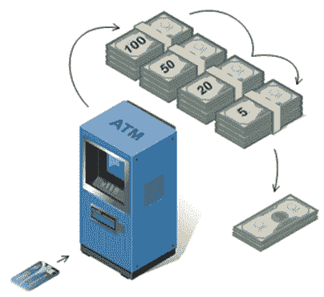
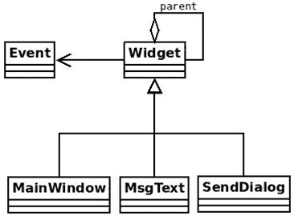
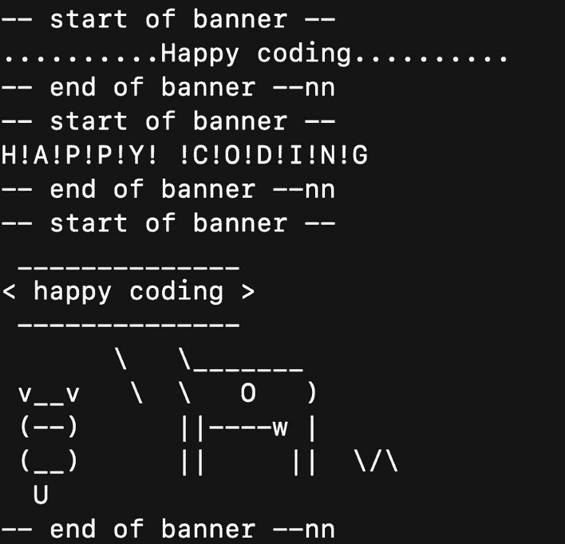

# 5

# 行为设计模式

在上一章中，我们介绍了结构化模式以及帮助我们创建干净、可维护和可扩展代码的**面向对象编程**（**OOP**）模式。下一个设计模式类别是**行为设计模式**。行为模式处理对象之间的连接和算法。

在本章中，我们将涵盖以下主要主题：

+   责任链模式

+   命令模式

+   观察者模式

+   状态模式

+   解释器模式

+   策略模式

+   备忘录模式

+   迭代器模式

+   模板模式

+   其他行为设计模式

在本章结束时，你将了解如何使用行为模式来改进你的软件项目设计。

# 技术要求

请参阅在*第一章*中提出的各项要求。本章讨论的代码的附加技术要求如下：

+   对于状态模式部分，请使用以下命令安装`state_machine`模块：`python -m pip install state_machine`。

+   对于解释器模式部分，请使用以下命令安装`pyparsing`模块：`python –m pip install pyparsing`。

+   对于模板模式部分，请使用以下命令安装`cowpy`模块：`python -m pip install cowpy`。

# 责任链模式

责任链模式提供了一种优雅的方式来处理请求，通过将它们传递给一系列处理者。链中的每个处理者都有自主权来决定它是否可以处理请求，或者是否应该将其委托给链中的其他处理者。当处理涉及多个处理者但不必所有处理者都参与的操作时，此模式特别有用。

在实践中，此模式鼓励我们关注对象以及请求在应用程序中的流动。值得注意的是，客户端代码对整个处理者链一无所知。相反，它只与链中的第一个处理元素交互。同样，每个处理元素只知道其直接的后继者，形成一个类似于单链表的单向关系。这种结构是故意设计的，旨在在发送者（客户端）和接收者（处理元素）之间实现解耦。

## 现实世界示例

自动柜员机（ATM）以及任何接受/退还纸币或硬币的机器（例如，零食自动售货机）都使用责任链模式。所有纸币都有一个单独的槽位，如下面的图所示，由[www.sourcemaking.com](http://www.sourcemaking.com)提供：



图 5.1 – 责任链模式示例：ATM

当纸币被投入时，它会被路由到相应的容器。当它被退回时，它会被从相应的容器中取出。我们可以将单个槽位视为共享通信介质，而不同的容器则视为处理元素。结果包含来自一个或多个容器的现金。例如，在前面的图中，我们看到当我们从 ATM 请求 175 美元时会发生什么。

在某些 Web 框架中，过滤器或中间件是在 HTTP 请求到达目标之前执行的代码片段。存在一个过滤器链。每个过滤器执行不同的操作（用户认证、日志记录、数据压缩等），要么将请求转发到下一个过滤器，直到链被耗尽，要么在出现错误时（例如，认证失败三次）中断流程。

## 责任链模式的用例

通过使用责任链模式，我们为多个不同的对象提供了一个满足特定请求的机会。当我们事先不知道哪个对象应该满足给定的请求时，这非常有用。一个例子是**采购系统**。在采购系统中，有许多审批权限。一个审批权限可能能够批准价值达到一定数额的订单，比如说 100 美元。如果订单价值超过 100 美元，订单就会被发送到链中的下一个审批权限，它可以批准价值达到 200 美元的订单，以此类推。

责任链模式在另一种情况下也很有用，即我们知道可能需要多个对象来处理单个请求。这就是基于事件编程中发生的情况。一个事件，比如左键点击，可以被多个监听器捕获。

需要注意的是，如果所有请求都可以由单个处理元素处理，除非我们真的不知道是哪个元素，否则责任链模式并不是非常有用。这种模式的价值在于它提供的解耦，正如我们在*第一章*的*松耦合*部分中看到的，*基础设计原则*。与客户端和所有处理元素之间以及处理元素和所有其他处理元素之间的一对多关系相比，客户端只需要知道如何与链的起始（头部）进行通信。

## 实现责任链模式

在 Python 中实现责任链模式有许多方法，但我最喜欢的实现是 Vespe Savikko 的版本（[`legacy.python.org/workshops/1997-10/proceedings/savikko.html`](https://legacy.python.org/workshops/1997-10/proceedings/savikko.html)）。Vespe 的实现使用 Python 风格的动态分派来处理请求。

让我们以 Vespe 的实现为指导，实现一个简单的基于事件的系统。以下是该系统的 UML 类图：



图 5.2 – 基于事件的窗口系统的 UML 类图

`Event`类描述了一个事件。我们将保持简单，因此，在我们的例子中，一个事件只有一个`name`：

```py
class Event:
    def __init__(self, name):
        self.name = name
    def __str__(self):
        return self.name
```

`Widget`类是应用程序的核心类。按照惯例，我们假设`parent`对象是一个`Widget`实例。然而，请注意，根据继承规则，`Widget`的任何子类（例如，`MsgText`的实例）也是一个`Widget`实例。该类有一个`handle()`方法，它通过`hasattr()`和`getattr()`进行动态分发来决定特定请求（事件）的处理者。如果请求处理事件的窗口不支持该事件，有两种回退机制。如果窗口有父窗口，则执行父窗口的`handle()`方法。如果没有父窗口但有`handle_default()`方法，则执行`handle_default()`。代码如下：

```py
class Widget:
    def __init__(self, parent=None):
        self.parent = parent
    def handle(self, event):
        handler = f"handle_{event}"
        if hasattr(self, handler):
            method = getattr(self, handler)
            method(event)
        elif self.parent is not None:
            self.parent.handle(event)
        elif hasattr(self, "handle_default"):
            self.handle_default(event)
```

到目前为止，你可能已经意识到为什么在 UML 类图中`Widget`和`Event`类只是关联（没有聚合或组合关系）。这种关联用于表示`Widget`类知道`Event`类，但没有对其有严格的引用，因为事件只需要作为参数传递给`handle()`。

`MainWIndow`、`MsgText`和`SendDialog`都是具有不同行为的窗口。并不期望这三个窗口都能处理相同的事件，即使它们可以处理相同的事件，它们的行为也可能不同。`MainWindow`只能处理关闭和默认事件：

```py
class MainWindow(Widget):
    def handle_close(self, event):
        print(f"MainWindow: {event}")
    def handle_default(self, event):
        print(f"MainWindow Default: {event}")
```

`SendDialog`只能处理`paint`事件：

```py
class SendDialog(Widget):
    def handle_paint(self, event):
        print(f"SendDialog: {event}")
```

最后，`MsgText`只能处理`down`事件：

```py
class MsgText(Widget):
    def handle_down(self, event):
        print(f"MsgText: {event}")
```

`main()`函数展示了如何创建一些窗口和事件，以及窗口如何对这些事件做出反应。所有事件都发送到所有窗口。注意每个窗口的父关系——`sd`对象（`SendDialog`的实例）的父对象是`mw`对象（`MainWindow`的实例）。然而，并非所有对象都需要有一个是`MainWindow`实例的父对象。例如，`msg`对象（`MsgText`的实例）的父对象是`sd`对象：

```py
def main():
    mw = MainWindow()
    sd = SendDialog(mw)
    msg = MsgText(sd)
    for e in ("down", "paint", "unhandled", "close"):
        evt = Event(e)
        print(f"Sending event -{evt}- to MainWindow")
        mw.handle(evt)
        print(f"Sending event -{evt}- to SendDialog")
        sd.handle(evt)
        print(f"Sending event -{evt}- to MsgText")
        msg.handle(evt)
```

让我们回顾一下实现的全代码（见文件`ch05/chain.py`）：

1.  我们定义了`Event`类，然后是`Widget`类。

1.  我们定义了专门的窗口类，`MainWindow`、`SendDialog`和`MsgText`。

1.  最后，我们添加了`main()`函数的代码；我们确保它可以通过常规技巧在末尾被调用。

执行`python ch05/chain.py`命令会得到以下输出：

```py
Sending event -down- to MainWindow
MainWindow Default: down
Sending event -down- to SendDialog
MainWindow Default: down
Sending event -down- to MsgText
MsgText: down
Sending event -paint- to MainWindow
MainWindow Default: paint
Sending event -paint- to SendDialog
SendDialog: paint
Sending event -paint- to MsgText
SendDialog: paint
Sending event -unhandled- to MainWindow
MainWindow Default: unhandled
Sending event -unhandled- to SendDialog
MainWindow Default: unhandled
Sending event -unhandled- to MsgText
MainWindow Default: unhandled
Sending event -close- to MainWindow
MainWindow: close
Sending event -close- to SendDialog
MainWindow: close
Sending event -close- to MsgText
MainWindow: close
```

# 命令模式

现在大多数应用程序都有撤销操作。这很难想象，但在许多年之前，没有任何软件有撤销功能。撤销功能是在 1974 年引入的，但 Fortran 和 Lisp 这两种至今仍被广泛使用的编程语言分别在 1957 年和 1958 年创建！我不愿意在那几年成为应用程序用户。犯错意味着用户没有简单的方法来修复它。

足够的历史了。我们想知道如何在我们的应用程序中实现撤销功能。既然你已经阅读了本章的标题，你就已经知道推荐使用哪种设计模式来实现撤销：命令模式。

命令设计模式帮助我们封装一个操作（撤销、重做、复制、粘贴等等）作为一个对象。这意味着我们创建一个包含所有逻辑和实现操作所需的方法的类。这样做的好处如下：

+   我们不必直接执行命令。它可以在任何时候执行。

+   调用命令的对象与知道如何执行它的对象解耦。调用者不需要了解命令的任何实现细节。

+   如果有道理，可以将多个命令分组，以便调用者可以按顺序执行它们。这在实现多级撤销命令时很有用。

## 现实世界的例子

当我们去餐馆吃晚餐时，我们会向服务员下单。他们用来写下订单的账单（通常是纸张）是一个命令的例子。写下订单后，服务员将其放入由厨师执行的账单队列中。每一张账单都是独立的，可以用来执行许多不同的命令，例如，为每一项将要烹饪的菜品执行一个命令。

如您所预期的那样，我们也在软件中找到了几个例子。以下是我能想到的两个：

+   PyQt 是 QT 工具包的 Python 绑定。PyQt 包含一个`QAction`类，它将操作建模为命令。每个动作都支持额外的可选信息，例如描述、工具提示和快捷键。

+   Git Cola，一个用 Python 编写的 Git GUI，使用命令模式来修改模型、修正提交、应用不同的选举、检出等等。

## 命令模式的用例

许多开发者将撤销示例作为命令模式的唯一用例。事实是，撤销是命令模式的杀手级功能。然而，命令模式实际上可以做更多：

+   **GUI 按钮和菜单项**：之前提到的 PyQt 示例使用命令模式来实现按钮和菜单项上的操作。

+   **其他操作**：除了撤销之外，命令还可以用来实现任何操作。一些例子包括*剪切*、*复制*、*粘贴*、*重做*和*首字母大写文本*。

+   **事务行为和日志记录**：事务行为和日志记录对于保持更改的持久日志非常重要。操作系统使用它们从系统崩溃中恢复，关系数据库使用它们实现事务，文件系统使用它们实现快照，安装程序（向导）使用它们撤销已取消的安装。

+   **宏**：在这里，我们指的是可以记录并在任何时间点按需执行的动作序列。流行的编辑器，如 Emacs 和 Vim，支持宏。

## 实现命令模式

让我们使用命令模式来实现以下基本文件实用工具：

+   创建文件，可选地添加文本到其中

+   读取文件的内容

+   重命名文件

我们不会从头开始实现这些实用工具，因为 Python 已经在`os`模块中提供了良好的实现。我们想要做的是在这些实用工具之上添加一个额外的抽象层，使它们可以被当作命令处理。通过这样做，我们获得了命令提供的所有优势。

每个命令都有两个部分：

+   `__init__()`方法包含命令执行有用操作所需的所有信息（文件的路径、将要写入文件的内容等等）。

+   `execute()`方法。当我们想要运行一个命令时，我们会调用该方法。这并不一定是在初始化之后立即进行的。

让我们从重命名实用工具开始，我们使用`RenameFile`类来实现它。该类使用源文件路径和目标文件路径进行初始化。我们添加了`execute()`方法，它使用`os.rename()`执行实际的重命名操作。为了提供撤销操作的支持，我们添加了`undo()`方法，在其中我们再次使用`os.rename()`将文件的名称恢复到原始值。请注意，我们还使用了日志记录来改进输出。

代码的开始部分，我们需要导入的内容，以及`RenameFile`类如下所示：

```py
import logging
import os
logging.basicConfig(level=logging.DEBUG)
class RenameFile:
    def __init__(self, src, dest):
        self.src = src
        self.dest = dest
    def execute(self):
        logging.info(
            f"[renaming '{self.src}' to '{self.dest}']"
        )
        os.rename(self.src, self.dest)
    def undo(self):
        logging.info(
            f"[renaming '{self.dest}' back to '{self.src}']"
        )
        os.rename(self.dest, self.src)
```

接下来，我们为用于创建文件的命令添加一个`CreateFile`类。该类的初始化方法接受熟悉的`path`参数和一个`txt`参数，用于将要写入文件的内容。如果没有传递内容，则默认写入“hello world”文本。通常，合理的默认行为是创建一个空文件，但为了本例的需求，我决定在其中写入一个默认字符串。然后，我们添加一个`execute()`方法，在其中我们使用 Python 的`open()`函数以`write()`模式打开文件，并将`txt`字符串写入其中。

创建文件操作的撤销是删除该文件。因此，我们在类中添加了`undo()`方法，其中我们使用`os.remove()`函数来完成这项工作。

`CreateFile`类的定义如下所示：

```py
class CreateFile:
    def __init__(self, path, txt="hello world\n"):
        self.path = path
        self.txt = txt
    def execute(self):
        logging.info(f"[creating file '{self.path}']")
        with open(
            self.path, "w", encoding="utf-8"
        ) as out_file:
            out_file.write(self.txt)
    def undo(self):
        logging.info(f"deleting file {self.path}")
        os.remove(self.path)
```

最后一个实用工具使我们能够读取文件的内容。`ReadFile`类的`execute()`方法再次使用`open()`，这次是在读取模式下，并仅打印文件的内容。

`ReadFile` 类定义如下：

```py
class ReadFile:
    def __init__(self, path):
        self.path = path
    def execute(self):
        logging.info(f"[reading file '{self.path}']")
        with open(
            self.path, "r", encoding="utf-8"
        ) as in_file:
            print(in_file.read(), end="")
```

`main()` 函数使用了我们定义的实用工具。`orig_name` 和 `new_name` 参数是创建并重命名文件的原始名称和新名称。使用命令列表来添加（并配置）我们希望在以后执行的命令。代码如下：

```py
def main():
    orig_name, new_name = "file1", "file2"
    commands = (
        CreateFile(orig_name),
        ReadFile(orig_name),
        RenameFile(orig_name, new_name),
    )
for c in commands:
    c.execute()
```

然后，我们询问用户是否想要撤销已执行的命令。用户选择是否撤销命令。如果他们选择撤销，则对命令列表中的所有命令执行 `undo()`。然而，由于并非所有命令都支持撤销，因此使用异常处理来捕获（并记录）当 `undo()` 方法缺失时生成的 `AttributeError` 异常。这部分代码如下：

```py
    answer = input("reverse the executed commands? [y/n] ")
    if answer not in "yY":
        print(f"the result is {new_name}")
        exit()
    for c in reversed(commands):
        try:
            c.undo()
        except AttributeError as e:
            logging.error(str(e))
```

让我们回顾一下完整的实现代码（在 `ch05/command.py` 文件中）：

1.  我们导入 `logging` 和 `os` 模块。

1.  我们进行常规的日志配置。

1.  我们定义了 `RenameFile` 类。

1.  我们定义了 `CreateFile` 类。

1.  我们定义了 `ReadFile` 类。

1.  我们添加了一个 `main()` 函数，并像往常一样调用它来测试我们的设计。

执行 `python ch05/command.py` 命令会给出以下输出，如果我们接受撤销命令：

```py
INFO:root:[creating file 'file1']
INFO:root:[reading file 'file1']
hello world
INFO:root:[renaming 'file1' to 'file2']
reverse the executed commands? [y/n] y
INFO:root:[renaming 'file2' back to 'file1']
ERROR:root:'ReadFile' object has no attribute 'undo'
INFO:root:deleting file file1
```

然而，如果我们不接受撤销命令，输出如下：

```py
INFO:root:[creating file 'file1']
INFO:root:[reading file 'file1']
hello world
INFO:root:[renaming 'file1' to 'file2']
reverse the executed commands? [y/n] n
ERROR, in the first case, is normal for this context.
			The Observer pattern
			The Observer pattern describes a publish-subscribe relationship between a single object, the publisher, which is also known as the subject or **observable**, and one or more objects, the subscribers, also known as **observers**. So, the subject notifies the subscribers of any state changes, typically by calling one of their methods.
			The ideas behind the Observer pattern are the same as those behind the separation of concerns principle, that is, to increase decoupling between the publisher and subscribers, and to make it easy to add/remove subscribers at runtime.
			Real-world examples
			Dynamics in an auction are similar to the behavior of the Observer pattern. Every auction bidder has a number paddle that is raised whenever they want to place a bid. Whenever the paddle is raised by a bidder, the auctioneer acts as the subject by updating the price of the bid and broadcasting the new price to all bidders (subscribers).
			In software, we can cite at least two examples:

				*   **Kivy**, the Python framework for developing **user interfaces** (**UIs**), has a module called **Properties**, which implements the Observer pattern. Using this technique, you can specify what should happen when a property’s value changes.
				*   The **RabbitMQ library** provides an implementation of an **Advanced Message Queuing Protocol** (**AMQP**) messaging broker. It is possible to construct a Python application that interacts with RabbitMQ in such a way that it subscribes to messages and publishes them to queues, which is essentially the Observer design pattern.

			Use cases for the Observer pattern
			We generally use the Observer pattern when we want to inform/update one or more objects (observers/subscribers) about a change that happened on a given object (subject/publisher/observable). The number of observers, as well as who those observers are, may vary and can be changed dynamically.
			We can think of many cases where Observer can be useful. One such use case is news feeds. With RSS, Atom, or other related formats, you follow a feed, and every time it is updated, you receive a notification about the update.
			The same concept exists in social networking applications. If you are connected to another person using a social networking service, and your connection updates something, you are notified about it.
			Event-driven systems are another example where Observer is usually used. In such systems, you have listeners that listen for specific events. The listeners are triggered when an event they are listening to is created. This can be typing a specific key (on the keyboard), moving the mouse, and more. The event plays the role of the *publisher*, and the listeners play the role of the *observers*. The key point in this case is that multiple listeners (observers) can be attached to a single event (publisher).
			Implementing the Observer pattern
			As an example, let’s implement a weather monitoring system. In such a system, you have a weather station that collects weather-related data (temperature, humidity, and atmospheric pressure). Our system needs to allow different devices and applications to receive real-time updates whenever there is a change in the weather data.
			We can apply the Observer pattern using the following elements:

				*   `WeatherStation` class that acts as the subject. This class will maintain a list of observers (devices or applications) interested in receiving weather updates.
				*   **Observers (devices and applications)**: Implement various observer classes, representing devices such as smartphones, tablets, weather apps, and even a display screen in a local store. Each observer will subscribe to receive updates from the weather station.
				*   `subscribe`) and unregister (`unsubscribe`) themselves. When there is a change in weather data (e.g., a new temperature reading), the weather station notifies all registered observers.
				*   `update()` method that the weather station calls when notifying about changes. For instance, a smartphone observer may update its weather app with the latest data, while a local store display may update its digital sign.

			Let’s get started.
			First, we define the `Observer` interface, which holds an `update` method that observers must implement. Observers are expected to update themselves when the subject’s state changes:

```

class Observer:

def update(self, temperature, humidity, pressure):

pass

```py

			Next, we define the `WeatherStation` subject class. It maintains a list of observers and provides methods to add and remove observers. The `set_weather_data` method is used to simulate changes in weather data. When the weather data changes, it notifies all registered observers by calling their `update` methods. The code is as follows:

```

class WeatherStation:

def __init__(self):

self.observers = []

def add_observer(self, observer):

self.observers.append(observer)

def remove_observer(self, observer):

self.observers.remove(observer)

def set_weather_data(self, temperature, humidity, pressure):

for observer in self.observers:

observer.update(temperature, humidity, pressure)

```py

			Let’s now define the `DisplayDevice` observer class. Its `update` method prints weather information when called:

```

class DisplayDevice(Observer):

def __init__(self, name):

self.name = name

def update(self, temperature, humidity, pressure):

print(f"{self.name} 显示屏")

print(

f" - 温度：{temperature}°C, 湿度：{humidity}%, 气压：{pressure}hPa"

)

```py

			Similarly, we define another observer class, `WeatherApp`, which prints weather information in a different format when its `update` method is called:

```

class WeatherApp(Observer):

def __init__(self, name):

self.name = name

def update(self, temperature, humidity, pressure):

print(f"{self.name} 应用 - 天气更新")

print(

f" - 温度：{temperature}°C, 湿度：{humidity}%, 气压：{pressure}hPa"

)

```py

			Now, in the `main()` function, we do several things:

				*   We create an instance of the `WeatherStation` class, which acts as the subject.
				*   We create instances of `DisplayDevice` and `WeatherApp`, representing different types of observers.
				*   We register these observers with `weather_station` using the `add_observer` method.
				*   We simulate changes in weather data by calling the `set_weather_data` method of `weather_station`. This triggers updates to all registered observers.

			The code of the `main()` function is as follows:

```

def main():

# 创建天气站

weather_station = WeatherStation()

# 创建并注册观察者

display1 = DisplayDevice("Living Room")

display2 = DisplayDevice("Bedroom")

app1 = WeatherApp("Mobile App")

weather_station.add_observer(display1)

weather_station.add_observer(display2)

weather_station.add_observer(app1)

# 模拟天气数据变化

weather_station.set_weather_data(25.5, 60, 1013.2)

weather_station.set_weather_data(26.0, 58, 1012.8)

```py

			Let’s recapitulate the complete code (in the `ch05/observer.py` file) of the implementation:

				1.  We define the Observer interface.
				2.  We define the `WeatherStation` subject class.
				3.  We define two observer classes, `DisplayDevice` and `WeatherApp`.
				4.  We add a `main()` function where we test our design.

			Executing the `python ch05/observer.py` command gives us the following output:

```

客厅显示屏

- 温度：25.5°C，湿度：60%，气压：1013.2hPa

卧室显示屏

- 温度：25.5°C，湿度：60%，气压：1013.2hPa

移动应用应用 - 天气更新

- 温度：25.5°C，湿度：60%，气压：1013.2hPa

客厅显示屏

- 温度：26.0°C, 湿度：58%，气压：1012.8hPa

卧室显示屏

- 温度：26.0°C, 湿度：58%，气压：1012.8hPa

移动应用应用 - 天气更新

- 温度：26.0°C, 湿度：58%，气压：1012.8hPa

```py

			As you can see, this example demonstrates the Observer pattern, where the subject notifies its observers about changes in its state. Observers are loosely coupled with the subject and can be added or removed dynamically, providing flexibility and decoupling in the system.
			As an exercise, you can see that when unregistering an observer, using the `remove_observer()` method, and then simulating additional weather data changes, only the remaining registered observers receive updates. As a helper, to test this, here are 2 lines of code to add at the end of the `main()` function:

```

weather_station.remove_observer(display2)

weather_station.set_weather_data(27.2, 55, 1012.5)

```py

			Next, we will discuss the State pattern.
			The State pattern
			In the previous chapter, we covered the Observer pattern, which is useful in a program to notify other objects when the state of a given object changes. Let’s continue discovering those patterns proposed by the Gang of Four.
			OOP focuses on maintaining the states of objects that interact with each other. A very handy tool to model state transitions when solving many problems is known as a **finite-state machine** (commonly called a **state machine**).
			What’s a state machine? A state machine is an abstract machine that has two key components, that is, states and transitions. A state is the current (active) status of a system. For example, if we have a radio receiver, two possible states for it are to be tuned to FM or AM. Another possible state is for it to be switching from one FM/AM radio station to another. A transition is a switch from one state to another. A transition is initiated by a triggering event or condition. Usually, an action or set of actions is executed before or after a transition occurs. Assuming that our radio receiver is tuned to the 107 FM station, an example of a transition is for the button to be pressed by the listener to switch it to 107.5 FM.
			A nice feature of state machines is that they can be represented as graphs (called **state diagrams**), where each state is a node, and each transition is an edge between two nodes.
			State machines can be used to solve many kinds of problems, both non-computational and computational. Non-computational examples include vending machines, elevators, traffic lights, combination locks, parking meters, and automated gas pumps. Computational examples include game programming and other categories of computer programming, hardware design, protocol design, and programming language parsing.
			Now, we have an idea of what state machines are! But how are state machines related to the State design pattern? It turns out that the State pattern is nothing more than a state machine applied to a particular software engineering problem (*Gang of Four-95*, page 342), (*Python 3 Patterns, Recipes and Idioms by Bruce Eckel & Friends*, page 151).
			Real-world examples
			A snack vending machine is an example of the State pattern in everyday life. Vending machines have different states and react differently depending on the amount of money that we insert. Depending on our selection and the money we insert, the machine can do the following:

				*   Reject our selection because the product we requested is out of stock.
				*   Reject our selection because the amount of money we inserted was not sufficient.
				*   Deliver the product and give no change because we inserted the exact amount.
				*   Deliver the product and return the change.

			There are, for sure, more possible states, but you get the point.
			Other examples of the state pattern in real life are as follows:

				*   Traffic lights
				*   Game states in a video game

			In software, the state pattern is commonly used. Python and its ecosystem offer several packages/modules one can use to implement state machines. We will see how to use one of them in the implementation section.
			Use cases for the State pattern
			The State pattern is applicable to many problems. All the problems that can be solved using state machines are good use cases for using the State pattern. An example we have already seen is the process model for an operating/embedded system.
			Programming language compiler implementation is another good example. Lexical and syntactic analysis can use states to build abstract syntax trees.
			Event-driven systems are yet another example. In an event-driven system, the transition from one state to another triggers an event/message. Many computer games use this technique. For example, a monster might move from the guard state to the attack state when the main hero approaches it.
			To quote Thomas Jaeger, in his article, *The State Design Pattern vs. State* *Machine* ([`thomasjaeger.wordpress.com/2012/12/13/the-state-design-pattern-vs-state-machine-2/`](https://thomasjaeger.wordpress.com/2012/12/13/the-state-design-pattern-vs-state-machine-2/)):
			*The state design pattern allows for full encapsulation of an unlimited number of states on a context for easy maintenance* *and flexibility.*
			Implementing the State pattern
			Let’s write code that demonstrates how to create a state machine based on the state diagram shown earlier in this chapter. Our state machine should cover the different states of a process and the transitions between them.
			The State design pattern is usually implemented using a parent `State` class that contains the common functionality of all the states, and several concrete classes derived from `State`, where each derived class contains only the state-specific required functionality. The State pattern focuses on implementing a state machine. The core parts of a state machine are the states and transitions between the states. It doesn’t matter how those parts are implemented.
			To avoid reinventing the wheel, we can make use of existing Python modules that not only help us create state machines but also do it in a Pythonic way. A module that I find very useful is `state_machine`.
			The `state_machine` module is simple enough that no special introduction is required. We will cover most aspects of it while going through the code of the example.
			Let’s start with the `Process` class. Each created process has its own state machine. The first step to creating a state machine using the `state_machine` module is to use the `@acts_as_state_machine` decorator. Then, we define the states of our state machine. This is a one-to-one mapping of what we see in the state diagram. The only difference is that we should give a hint about the initial state of the state machine. We do that by setting the initial attribute value to `True`:

```

@acts_as_state_machine

class Process:

created = 状态(initial=True)

waiting = 状态()

运行中 = 状态()

终止 = 状态()

blocked = 状态()

swapped_out_waiting = 状态()

swapped_out_blocked = 状态()

```py

			Next, we are going to define the transitions. In the `state_machine` module, a transition is an instance of the `Event` class. We define the possible transitions using the `from_states` and `to_state` arguments:

```

wait = Event(

from_states=(

created,

运行中,

blocked,

swapped_out_waiting,

),

to_state=等待,

)

run = Event(

from_states=等待, to_state=运行中

)

terminate = Event(

from_states=运行中, to_state=终止

)

block = Event(

from_states=(

运行中,

swapped_out_blocked,

),

to_state=阻塞,

)

swap_wait = Event(

from_states=等待,

to_state=swapped_out_blocked,

)

swap_block = Event(

from_states=阻塞,

to_state=swapped_out_blocked,

)

```py

			Also, as you may have noticed that `from_states` can be either a single state or a group of states (tuple).
			Each process has a name. Officially, a process needs to have much more information to be useful (for example, ID, priority, status, and so forth) but let’s keep it simple to focus on the pattern:

```

def __init__(self, name):

self.name = name

```py

			Transitions are not very useful if nothing happens when they occur. The `state_machine` module provides us with the `@before` and `@after` decorators that can be used to execute actions before or after a transition occurs, respectively. You can imagine updating some objects within the system or sending an email or a notification to someone. For this example, the actions are limited to printing information about the state change of the process, as follows:

```

@after("wait")

def wait_info(self):

print(f"{self.name} 进入等待模式")

@after("run")

def run_info(self):

print(f"{self.name} 正在运行")

@before("terminate")

def terminate_info(self):

print(f"{self.name} 终止")

@after("block")

def block_info(self):

print(f"{self.name} 正在阻塞")

@after("swap_wait")

def swap_wait_info(self):

print(

f"{self.name} 被交换出并等待"

)

@after("swap_block")

def swap_block_info(self):

print(

f"{self.name} 被交换出并阻塞"

)

```py

			Next, we need the `transition()` function, which accepts three arguments:

				*   `process`, which is an instance of `Process`
				*   `event`, which is an instance of `Event` (wait, run, terminate, and so forth)
				*   `event_name`, which is the name of the event

			The name of the event is printed if something goes wrong when trying to execute `event`. Here is the code for the function:

```

def transition(proc, event, event_name):

try:

event()

except InvalidStateTransition:

msg = (

f"过程 {proc.name} 从 {proc.current_state} "

f"转换到 {event_name} 失败"

)

print(msg)

```py

			The `state_info()` function shows some basic information about the current (active) state of the process:

```

def state_info(proc):

print(

f"状态 {proc.name}: {proc.current_state}"

)

```py

			At the beginning of the `main()` function, we define some string constants, which are passed as `event_name`:

```

def main():

RUNNING = "运行中"

WAITING = "等待"

BLOCKED = "阻塞"

TERMINATED = "终止"

```py

			Next, we create two `Process` instances and display information about their initial state:

```

p1, p2 = Process("process1"), Process(

"process2"

)

[state_info(p) for p in (p1, p2)]

```py

			The rest of the function experiments with different transitions. Recall the state diagram we covered in this chapter. The allowed transitions should be with respect to the state diagram. For example, it should be possible to switch from a running state to a blocked state, but it shouldn’t be possible to switch from a blocked state to a running state:

```

print()

transition(p1, p1.wait, WAITING)

transition(p2, p2.terminate, 终止)

[state_info(p) for p in (p1, p2)]

print()

transition(p1, p1.run, 运行中)

transition(p2, p2.wait, WAITING)

[state_info(p) for p in (p1, p2)]

print()

transition(p2, p2.run, 运行中)

[state_info(p) for p in (p1, p2)]

print()

[

transition(p, p.block, 阻塞)

for p in (p1, p2)

]

[state_info(p) for p in (p1, p2)]

print()

[

transition(p, p.terminate, 终止)

for p in (p1, p2)

]

[state_info(p) for p in (p1, p2)]

```py

			Here is the recapitulation of the full implementation example (the `ch05/state.py` file):

				1.  We begin by importing what we need from `state_machine`.
				2.  We define the `Process` class with its simple attributes.
				3.  We add the `Process` class’s initialization method.
				4.  We also need to define, in the `Process` class, the methods to provide its states.
				5.  We define the `transition()` function.
				6.  Next, we define the `state_info()` function.
				7.  Finally, we add the main function of the program.

			Here’s what we get when executing the Python `ch05/state.py` command:

```

状态 1：已创建

状态 2：已创建

process1 进入等待模式

过程 2 从已创建到终止的转换失败

状态 1：等待

状态 2：已创建

process1 正在运行

process2 进入等待模式

状态 1：运行中

状态 2：等待

process2 正在运行

状态 1：运行中

状态 2：运行中

process1 正在阻塞

process2 正在阻塞

状态 1：阻塞

状态 2：阻塞

过程 1 从阻塞到终止的转换失败

process2 从阻塞到终止的转换失败

process1 的状态：阻塞

process2 的状态：阻塞

```py

			Indeed, the output shows that illegal transitions such as created → terminated and blocked → terminated fail gracefully. We don’t want the application to crash when an illegal transition is requested, and this is handled properly by the except block.
			Notice how using a good module such as `state_machine` eliminates conditional logic. There’s no need to use long and error-prone `if…else` statements that check for each and every state transition and react to them.
			To get a better feeling for the state pattern and state machines, I strongly recommend you implement your own example. This can be anything: a simple video game (you can use state machines to handle the states of the main hero and the enemies), an elevator, a parser, or any other system that can be modeled using state machines.
			The Interpreter pattern
			Often, we need to create a **domain-specific language** (**DSL**). A DSL is a computer language of limited expressiveness targeting a particular domain. DSLs are used for different things, such as combat simulation, billing, visualization, configuration, and communication protocols. DSLs are divided into internal DSLs and external DSLs.
			Internal DSLs are built on top of a host programming language. An example of an internal DSL is a language that solves linear equations using Python. The advantages of using an internal DSL are that we don’t have to worry about creating, compiling, and parsing grammar because these are already taken care of by the host language. The disadvantage is that we are constrained by the features of the host language. It is very challenging to create an expressive, concise, and fluent internal DSL if the host language does not have these features.
			External DSLs do not depend on host languages. The creator of the DSL can decide all aspects of the language (grammar, syntax, and so forth). They are also responsible for creating a parser and compiler for it.
			The Interpreter pattern is related only to internal DSLs. Therefore, the goal is to create a simple but useful language using the features provided by the host programming language, which in this case is Python. Note that Interpreter does not address parsing at all. It assumes that we already have the parsed data in some convenient form. This can be an **abstract syntax tree** (**AST**) or any other handy data structure [*Gang of Four-95*, page 276].
			Real-world examples
			A musician is an example of the Interpreter pattern. Musical notation represents the pitch and duration of a sound graphically. The musician can reproduce a sound precisely based on its notation. In a sense, musical notation is the language of music, and the musician is the interpreter of that language.
			We can also cite software examples:

				*   In the C++ world, `boost::spirit` is considered an internal DSL for implementing parsers.
				*   An example in Python is PyT, an internal DSL used to generate XHTML/HTML. PyT focuses on performance and claims to have comparable speed with Jinja2\. Of course, we should not assume that the Interpreter pattern is necessarily used in PyT. However, since it is an internal DSL, the Interpreter is a very good candidate for it.

			Use cases for the Interpreter pattern
			The Interpreter pattern is used when we want to offer a simple language to domain experts and advanced users to solve their problems. The first thing we should stress is that the Interpreter pattern should only be used to implement simple languages. If the language has the requirements of an external DSL, there are better tools to create languages from scratch (Yacc and Lex, Bison, ANTLR, and so on).
			Our goal is to offer the right programming abstractions to the specialist, who is often not a programmer, to make them productive. Ideally, they shouldn’t know advanced Python to use our DSL, but knowing even a little bit of Python is a plus since that’s what we eventually get at the end. Advanced Python concepts should not be a requirement. Moreover, the performance of the DSL is usually not an important concern. The focus is on offering a language that hides the peculiarities of the host language and offers a more human-readable syntax. Admittedly, Python is already a very readable language with far less peculiar syntax than many other programming languages.
			Implementing the Interpreter pattern
			Let’s create an internal DSL to control a smart house. This example fits well into the **internet of things** (**IoT**) era, which is getting more and more attention nowadays. The user can control their home using a very simple event notation. An event has the form of command -> receiver -> arguments. The arguments part is optional.
			Not all events require arguments. An example of an event that does not require any arguments is shown here:

```

open -> gate

```py

			An example of an event that requires arguments is shown here:

```

increase -> boiler temperature -> 3 degrees

```py

			The `->` symbol is used to mark the end of one part of an event and state the beginning of the next one. There are many ways to implement an internal DSL. We can use plain old regular expressions, string processing, a combination of operator overloading, and metaprogramming, or a library/tool that can do the hard work for us. Although, officially, the Interpreter pattern does not address parsing, I feel that a practical example needs to cover parsing as well. For this reason, I decided to use a tool to take care of the parsing part. The tool is called pyparsing and, to find out more about it, check out the mini-book *Getting Started with Pyparsing* by Paul McGuire ([`www.oreilly.com/library/view/getting-started-with/9780596514235/`](https://www.oreilly.com/library/view/getting-started-with/9780596514235/)).
			Before getting into coding, it is a good practice to define a simple grammar for our language. We can define the grammar using the **Backus-Naur Form** (**BNF**) notation:

```

event ::= command token receiver token arguments

command ::= word+

word ::= 一组一个或多个字母数字字符

token ::= ->

receiver ::= word+

arguments ::= word+

```py

			What the grammar basically tells us is that an event has the form of command -> receiver -> arguments, and that commands, receivers, and arguments have the same form: a group of one or more alphanumeric characters. If you are wondering about the necessity of the numeric part, it is included to allow us to pass arguments, such as three degrees at the increase -> boiler temperature -> 3 degrees command.
			Now that we have defined the grammar, we can move on to converting it to actual code. Here’s what the code looks like:

```

word = Word(alphanums)

command = Group(OneOrMore(word))

token = Suppre"s("->")

device = Group(OneOrMore(word))

argument = Group(OneOrMore(word))

event = command + token + device + Optional(token + argument)

```py

			The basic difference between the code and grammar definition is that the code needs to be written in the bottom-up approach. For instance, we cannot use a word without first assigning it a value. `Suppress` is used to state that we want the `->` symbol to be skipped from the parsed results.
			The full code of the final implementation example (see the `ch05/interpreter/interpreter.py` file) uses many placeholder classes, but to keep you focused, I will first show a minimal version featuring only one class. Let’s look at the `Boiler` class. A boiler has a default temperature of 83° Celsius. There are also two methods to increase and decrease the current temperature:

```

class Boiler:

def __init__(self):

self.temperature = 83  # in celsius

def __str__(self):

return f"锅炉温度：{self.temperature}"

def increase_temperature(self, amount):

print(f"提高锅炉的温度{amount}度")

self.temperature += amount

def decrease_temperature(self, amount):

print(f"降低锅炉的温度{amount}度")

self.temperature -= amount

```py

			The next step is to add the grammar, which we already covered. We will also create a `boiler` instance and print its default state:

```

word = Word(alphanums)

command = Group(OneOrMore(word))

token = Suppress("->")

device = Group(OneOrMore(word))

argument = Group(OneOrMore(word))

event = command + token + device + Optional(token + argument)

boiler = Boiler()

```py

			The simplest way to retrieve the parsed output of pyparsing is by using the `parseString()` method. The result is a `ParseResults` instance, which is a parse tree that can be treated as a nested list. For example, executing `print(event.parseStri'g('increase -> boiler temperature -> 3 degr'es'))` would give‘`[['incre'se']' ['boi'er', 'temperat're']' ''3', 'degr'es']]` as a result.
			So, in this case, we know that the first sublist is the *command* (increase), the second sublist is the *receiver* (boiler temperature), and the third sublist is the *argument* (3°). We can unpack the `ParseResults` instance, which gives us direct access to these three parts of the event. Having direct access means that we can match patterns to find out which method should be executed:

```

test = "increase -> boiler temperature -> 3 degrees"

cmd, dev, arg = event.parseString(test)

cmd_str = " ".join(cmd)

dev_str = " ".join(dev)

if "increase" in cmd_str and "boiler" in dev_str:

boiler.increase_temperature(int(arg[0]))

print(boiler)

```py

			Executing the preceding code snippet (using `python ch05/interpreter/boiler.py`) gives the following output:

```

将锅炉的温度提高 3 度

ch05/interpreter/interpreter.py 文件)与我所描述的并没有太大区别。它只是扩展以支持更多的事件和设备。以下是对步骤的总结：

                1.  首先，我们从`pyparsing`导入所有需要的。

                1.  我们定义以下类：`Gate`、`Aircondition`、`Heating`、`Boiler`（已介绍）和`Fridge`。

                1.  接下来，我们有我们的主函数：

    1.  我们使用以下变量`tests`、`open_actions`和`close_actions`为将要执行的测试准备参数。

    1.  我们执行测试动作。

            执行`python ch05/interpreter/interpreter.py`命令会得到以下输出：

```py
opening the gate
closing the garage
turning on the air condition
turning off the heating
increasing the boiler's temperature by 5 degrees
tests tuple. However, the user wants to be able to activate events using an interactive prompt. Do not forget to check how sensitive pyparsing is regarding spaces, tabs, or unexpected input. For example, what happens if the user types turn off -> heating 37?
			The Strategy pattern
			Several solutions often exist for the same problem. Consider the task of sorting, which involves arranging the elements of a list in a particular sequence. For example, a variety of sorting algorithms are available for the task of sorting. Generally, no single algorithm outperforms all others in every situation.
			Selecting a sorting algorithm depends on various factors, tailored to the specifics of each case. Some key considerations include the following:

				*   **The number of elements to be sorted, known as the input size**: While most sorting algorithms perform adequately with a small input size, only a select few maintain efficiency with larger datasets.
				*   **The best/average/worst time complexity of the algorithm**: Time complexity is (roughly) the amount of time the algorithm takes to complete, excluding coefficients and lower-order terms. This is often the most usual criterion to pick an algorithm, although it is not always sufficient.
				*   **The space complexity of the algorithm**: Space complexity is (again roughly) the amount of physical memory needed to fully execute an algorithm. This is very important when we are working with big data or embedded systems, which usually have limited memory.
				*   **Stability of the algorithm**: An algorithm is considered stable when it maintains the relative order of elements with equal values after it is executed.
				*   **Code complexity of the algorithm**: If two algorithms have the same time/space complexity and are both stable, it is important to know which algorithm is easier to code and maintain.

			Other factors might also influence the choice of a sorting algorithm. The key consideration is whether a single algorithm must be applied universally. The answer is, unsurprisingly, no. It is more practical to have access to various sorting algorithms and choose the most suitable one for a given situation, based on the criteria. That’s what the Strategy pattern is about.
			The Strategy pattern promotes using multiple algorithms to solve a problem. Its killer feature is that it makes it possible to switch algorithms at runtime transparently (the client code is unaware of the change). So, if you have two algorithms and you know that one works better with small input sizes, while the other works better with large input sizes, you can use Strategy to decide which algorithm to use based on the input data at runtime.
			Real-world examples
			Reaching an airport to catch a flight is a good real-life Strategy example:

				*   If we want to save money and we leave early, we can go by bus/train
				*   If we don’t mind paying for a parking place and have our own car, we can go by car
				*   If we don’t have a car but we are in a hurry, we can take a taxi

			There are trade-offs between cost, time, convenience, and so forth.
			In software, Python’s `sorted()` and `list.sort()` functions are examples of the Strategy pattern. Both functions accept a named parameter key, which is basically the name of the function that implements a sorting strategy (*Python 3 Patterns, Recipes, and Idioms, by Bruce Eckel & Friends*, page 202).
			Use cases for the Strategy pattern
			Strategy is a very generic design pattern with many use cases. In general, whenever we want to be able to apply different algorithms dynamically and transparently, Strategy is the way to go. By different algorithms, I mean different implementations of the same algorithm. This means that the result should be the same, but each implementation has a different performance and code complexity (as an example, think of sequential search versus binary search).
			Apart from its usage for sorting algorithms as we mentioned, the Strategy pattern is used to create different formatting representations, either to achieve portability (for example, line-breaking differences between platforms) or dynamically change the representation of data.
			Implementing the Strategy pattern
			There is not much to be said about implementing the Strategy pattern. In languages where functions are not first-class citizens, each Strategy should be implemented in a different class. In Python, functions are objects (we can use variables to reference and manipulate them) and this simplifies the implementation of Strategy.
			Assume that we are asked to implement an algorithm to check whether all characters in a string are unique. For example, the algorithm should return true if we enter the dream string because none of the characters are repeated. If we enter the pizza string, it should return false because the letter “z” exists two times. Note that the repeated characters do not need to be consecutive, and the string does not need to be a valid word. The algorithm should also return false for the 1r2a3ae string because the letter “a” appears twice.
			After thinking about the problem carefully, we come up with an implementation that sorts the string and compares all characters pair by pair. First, we implement the `pairs()` function, which returns all neighbors pairs of a sequence, `seq`:

```

def pairs(seq):

n = len(seq)

for i in range(n):

yield seq[i], seq[(i + 1) % n]

```py

			Next, we implement the `allUniqueSort()` function, which accepts a string, `s`, and returns `True` if all characters in the string are unique; otherwise, it returns `False`. To demonstrate the Strategy pattern, we will simplify by assuming that this algorithm fails to scale. We assume that it works fine for strings that are up to five characters. For longer strings, we simulate a slowdown by inserting a sleep statement:

```

SLOW = 3  # in seconds

LIMIT = 5  # in characters

WARNING"= "太糟糕了，你选择了慢算法":("

def allUniqueSort(s):

if len(s) > LIMIT:

print(WARNING)

time.sleep(SLOW)

srtStr = sorted(s)

for c1, c2 in pairs(srtStr):

if c1 == c2:

return False

return True

```py

			We are not happy with the performance of `allUniqueSort()`, and we are trying to think of ways to improve it. After some time, we come up with a new algorithm, `allUniqueSet()`, that eliminates the need to sort. In this case, we use a set. If the character in check has already been inserted in the set, it means that not all characters in the string are unique:

```

def allUniqueSet(s):

if len(s) < LIMIT:

print(WARNING)

time.sleep(SLOW)

return True if len(set(s)) == len(s) else False

```py

			Unfortunately, while `allUniqueSet()` has no scaling problems, for some strange reason, it performs worse than `allUniqueSort()` when checking short strings. What can we do in this case? Well, we can keep both algorithms and use the one that fits best, depending on the length of the string that we want to check.
			The `allUnique()` function accepts an input string, `s`, and a strategy function, `strategy`, which, in this case, is one of `allUniqueSort()` and `allUniqueSet()`. The `allUnique()` function executes the input strategy and returns its result to the caller.
			Then, the `main()` function lets the user perform the following actions:

				*   Enter the word to be checked for character uniqueness
				*   Choose the pattern that will be used

			It also does some basic error handling and gives the ability to the user to quit gracefully:

```

def main():

WORD_IN_DESC = "插入单词（输入 quit 退出）> "

STRAT_IN_DESC = "选择策略：[1] 使用集合，[2] 排序并配对> "

while True:

word = None

while not word:

word = input(WORD_IN_DESC)

if word == "quit":

print("bye")

return

strategy_picked = None

strategies = {"1": allUniqueSet, "2": allUniqueSort}

while strategy_picked not in strategies.keys():

strategy_picked = input(STRAT_IN_DESC)

try:

strategy = strategies[strategy_picked]

result = allUnique(word, strategy)

print(f"allUnique({word}): {result}")

except KeyError:

print(f"错误的选项：{strategy_picked}")

```py

			Here’s a summary of the complete code for our implementation example (the `ch05/strategy.py` file):

				1.  We import the `time` module.
				2.  We define the `pairs()` function.
				3.  We define the values for the `SLOW`, `LIMIT`, and `WARNING` constants.
				4.  We define the function for the first algorithm, `allUniqueSort()`.
				5.  We define the function for the second algorithm, `allUniqueSet()`.
				6.  Next, we define the `allUnique()` function that helps call a chosen algorithm by passing the corresponding strategy function.
				7.  Finally, we add the `main()` function.

			Let’s see the output of a sample execution using the `python` `ch05/strategy.py` command:

```

插入单词（输入 quit 退出）> 气球

选择策略：[1] 使用集合，[2] 排序并配对> 1

allUnique(balloon): False

插入单词（输入 quit 退出）> 气球

选择策略：[1] 使用集合，[2] 排序并配对> 2

太糟糕了，你选择了慢速算法 :(

allUnique(balloon): False

插入单词（输入 quit 退出）> bye

选择策略：[1] 使用集合，[2] 排序并配对> 1

太糟糕了，你选择了慢速算法 :(

allUnique(bye): True

插入单词（输入 quit 退出）> bye

选择策略：[1] 使用集合，[2] 排序并配对> 2

allUnique(bye): True

balloon，有超过五个字符且不是所有字符都是唯一的。在这种情况下，两个算法都返回正确的结果，False，但 allUniqueSort()较慢，用户再次被警告。

            第二个单词，`bye`，少于五个字符且所有字符都是唯一的。再次，两个算法都返回预期的结果，`True`，但这次`allUniqueSet()`较慢，用户再次被警告。

            通常，我们想要使用的策略不应该由用户选择。策略模式的目的在于它使得使用不同的算法变得透明。修改代码，使得更快的算法总是被选中。

            我们代码的通常用户有两个。一个是终端用户，他们应该对代码中发生的事情一无所知，为了达到这个目的，我们可以遵循上一段中给出的建议。另一个可能的用户类别是其他开发者。假设我们想要创建一个将被其他开发者使用的 API。我们如何让他们对策略模式一无所知？一个建议是将两个函数封装在一个公共类中，例如，`AllUnique`。在这种情况下，其他开发者只需要创建该类的实例并执行一个方法，例如，`test()`。这个方法中需要做什么？

            备忘录模式

            在许多情况下，我们需要一种方法来轻松地捕捉一个对象的内部状态，以便在需要时能够恢复该对象。备忘录（Memento）是一种设计模式，可以帮助我们为这类情况实现解决方案。

            备忘录设计模式有三个关键组件：

                +   **备忘录**：一个包含基本状态存储和检索能力的简单对象

                +   **发起者**：一个可以获取和设置备忘录实例值的对象

                +   **保管者**：一个可以存储和检索所有先前创建的备忘录实例的对象

            备忘录模式与命令模式有很多相似之处。

            现实世界的例子

            备忘录模式在现实生活中的许多情况下都可以看到。

            例如，我们可以在一个语言（如英语或法语）的字典中找到这样的例子。该字典通过学术专家的工作定期更新，新词被添加，其他词变得过时。口语和书面语言都在不断发展，官方字典必须反映这一点。有时，我们会回顾以前的版本，以了解语言在某个过去时刻的使用情况。这也可以是因为信息在长时间后可能丢失，为了找到它，你可能需要查看旧版本。这有助于理解某个特定领域的知识。进行研究的某人可以使用旧字典或去档案馆查找有关某些单词和表达式的信息。

            此示例可以扩展到其他书面材料，如书籍和报纸。

            **Zope** ([`www.zope.org`](http://www.zope.org))，其集成的对象数据库称为**Zope 对象数据库**（**ZODB**），提供了一个很好的软件示例，展示了备忘录模式。它以其**通过 Web**的对象管理界面而闻名，为网站管理员提供了撤销支持。ZODB 是 Python 的对象数据库，在 Pyramid 和 Plone 等框架中被广泛使用。

            备忘录模式的用例

            备忘录通常用于为用户提供某种撤销和重做功能。

            另一种用法是实现带有 OK/Cancel 按钮的 UI 对话框，在加载对象时存储对象的状态，如果用户选择取消，我们将恢复对象的初始状态。

            实现备忘录模式

            我们将以简化的方式实现备忘录，并按照 Python 语言的自然方式来进行。这意味着我们不一定需要多个类。

            我们将使用 Python 的`pickle`模块。`pickle`模块有什么用？根据模块的文档（[`docs.python.org/3/library/pickle.html`](https://docs.python.org/3/library/pickle.html)），`pickle`模块可以将复杂对象转换为字节流，也可以将字节流转换回具有相同内部结构的对象。

            警告

            在这里，我们使用`pickle`模块是为了演示，但你应该知道它对于通用用途来说并不安全。

            让我们以一个`Quote`类为例，它具有`text`和`author`属性。为了创建备忘录，我们将使用该类的一个方法，`save_state()`，正如其名称所暗示的，它将使用`pickle.dumps()`函数转储对象的状态。这创建了备忘录：

```py
class Quote:
    def __init__(self, text, author):
        self.text = text
        self.author = author
    def save_state(self):
        current_state = pickle.dumps(self.__dict__)
        return current_state
```

            该状态可以稍后恢复。为此，我们添加了`restore_state()`方法，利用`pickle.loads()`函数：

```py
    def restore_state(self, memento):
        previous_state = pickle.loads(memento)
        self.__dict__.clear()
        self.__dict__.update(previous_state)
```

            让我们再添加一个`__str__`方法：

```py
    def __str__(self):
        return f"{self.text}\n- By {self.author}."
```

            然后，在主函数中，我们可以像往常一样处理事情并测试我们的实现：

```py
def main():
    print("** Quote 1 **")
    q1 = Quote(
        "A room without books is like a body without a soul.",
        "Unknown author",
    )
    print(f"\nOriginal version:\n{q1}")
    q1_mem = q1.save_state()
    # Now, we found the author's name
    q1.author = "Marcus Tullius Cicero"
    print(f"\nWe found the author, and did an updated:\n{q1}")
    # Restoring previous state (Undo)
    q1.restore_state(q1_mem)
    print(f"\nWe had to restore the previous version:\n{q1}")
    print()
    print("** Quote 2 **")
    text = (
        "To be you in a world that is constantly \n"
        "trying to make you be something else is \n"
        "the greatest accomplishment."
    )
    q2 = Quote(
        text,
        "Ralph Waldo Emerson",
    )
    print(f"\nOriginal version:\n{q2}")
    _ = q2.save_state()
    # changes to the text
    q2.text = (
        "To be yourself in a world that is constantly \n"
        "trying to make you something else is the greatest \n"
        "accomplishment."
    )
    print(f"\nWe fixed the text:\n{q2}")
    q2_mem2 = q2.save_state()
    q2.text = (
        "To be yourself when the world is constantly \n"
        "trying to make you something else is the greatest \n"
        "accomplishment."
    )
    print(f"\nWe fixed the text again:\n{q2}")
    # Restoring previous state (Undo)
    q2.restore_state(q2_mem2)
    print(f"\nWe restored the 2nd version, the correct one:\n{q2}")
```

            下面是示例中步骤的总结（`ch05/memento.py`文件）：

                1.  我们导入`pickle`模块。

                1.  我们定义了`Quote`类。

                1.  最后，我们添加主函数来测试实现。

            让我们通过使用`python` `ch05/memento.py`命令查看一个示例执行：

```py
** Quote 1 **
Original version:
A room without books is like a body without a soul.
- By Unknown author.
We found the author, and did an updated:
A room without books is like a body without a soul.
- By Marcus Tullius Cicero.
We had to restore the previous version:
A room without books is like a body without a soul.
- By Unknown author.
** Quote 2 **
Original version:
To be you in a world that is constantly
trying to make you be something else is
the greatest accomplishment.
- By Ralph Waldo Emerson.
We fixed the text:
To be yourself in a world that is constantly
trying to make you something else is the greatest
accomplishment.
- By Ralph Waldo Emerson.
We fixed the text again:
To be yourself when the world is constantly
trying to make you something else is the greatest
accomplishment.
- By Ralph Waldo Emerson.
We restored the 2nd version, the correct one:
To be yourself in a world that is constantly
trying to make you something else is the greatest
accomplishment.
- By Ralph Waldo Emerson.
The output shows the program does what we expected: we can restore a previous state for each of our Quote objects.
```

            迭代器模式

            在编程中，我们经常使用序列或对象集合，尤其是在算法和编写操作数据的程序时。我们可以将自动化脚本、API、数据驱动应用程序和其他领域考虑在内。在本章中，我们将看到一个在必须处理对象集合时非常有用的模式：迭代器模式。

            注意，根据维基百科给出的定义

            *迭代器模式是一种设计模式，其中使用迭代器遍历容器并访问容器的元素。迭代器模式将算法与容器解耦；在某些情况下，算法必然是容器特定的，因此不能* *解耦* *。*

            迭代器模式在 Python 环境中被广泛使用。正如我们将看到的，这导致迭代器成为语言特性。它如此有用，以至于语言开发者决定将其作为一个特性。

            迭代器模式的用例

            当你想要以下行为之一或多个时，使用迭代器模式是个好主意：

                +   使导航集合变得容易

                +   在任何时刻获取集合中的下一个对象

                +   完成遍历集合后停止

            实现迭代器模式

            迭代器在 Python 中为我们实现，在 for 循环、列表推导式等中。Python 中的迭代器简单地说是一个可以迭代的对象；一个一次返回一个数据元素的对象。

            我们可以使用迭代器协议为自己的特殊情况进行实现，这意味着我们的迭代器对象必须实现两个特殊方法：`__iter__()`和`__next__()`。

            如果我们可以从一个对象中获得迭代器，则该对象被称为可迭代的。Python 中的大多数内置容器（列表、元组、集合、字符串等）都是可迭代的。`iter()`函数（它反过来调用`__iter__()`方法）从它们返回迭代器。

            让我们考虑一个我们想要使用`FootballTeam`类实现的足球队。如果我们想要将其转换为迭代器，我们必须实现迭代器协议，因为它不是一个内置容器类型，如列表类型。基本上，内置的`iter()`和`next()`函数不会对其起作用，除非它们被添加到实现中。

            首先，我们定义了迭代器的类，`FootballTeamIterator`，它将被用来遍历足球队伍对象。`members` 属性允许我们使用容器对象（它将是一个 `FootballTeam` 实例）初始化迭代器对象。我们向它添加了一个 `__iter__()` 方法，该方法将返回对象本身，以及一个 `__next__()` 方法，在每个调用中返回队伍中的下一个人，直到我们到达最后一个人。这将允许通过迭代器遍历足球队伍的成员。`FootballTeamIterator` 类的整个代码如下：

```py
class FootballTeamIterator:
    def __init__(self, members):
        self.members = members
        self.index = 0
    def __iter__(self):
        return self
    def __next__(self):
        if self.index < len(self.members):
            val = self.members[self.index]
            self.index += 1
            return val
        else:
            raise StopIteration()
```

            因此，现在对于 `FootballTeam` 类本身，接下来要做的事情是向它添加一个 `__iter__()` 方法，这将初始化它需要的迭代器对象（因此使用 `FootballTeamIterator(self.members)`）并返回它：

```py
class FootballTeam:
    def __init__(self, members):
        self.members = members
    def __iter__(self):
        return FootballTeamIterator(self.members)
```

            我们添加了一个小的主函数来测试我们的实现。一旦我们有了 `FootballTeam` 实例，我们就在它上面调用 `iter()` 函数来创建迭代器，然后使用 `while` 循环遍历它：

```py
def main():
    members = [f"player{str(x)}" for x in range(1, 23)]
    members = members + ["coach1", "coach2", "coach3"]
    team = FootballTeam(members)
    team_it = iter(team)
    try:
        while True:
            print(next(team_it))
    except StopIteration:
        print("(End)")
```

            这里是我们示例中的步骤总结（`ch05/iterator.py` 文件）：

                1.  我们定义了迭代器的类。

                1.  我们定义了容器类。

                1.  我们定义了主函数，然后是调用它的代码片段。

            这里是执行 `python ch05/iterator.py` 命令时得到的输出：

```py
player1
player2
player3
player4
player5
...
player22
coach1
coach2
coach3
(End) string instead.
			The Template pattern
			A key ingredient in writing good code is avoiding redundancy. In OOP, methods and functions are important tools that we can use to avoid writing redundant code.
			Remember the `sorted()` example we saw when discussing the Strategy pattern. That function is generic enough that it can be used to sort more than one data structure (lists, tuples, and named tuples) using arbitrary keys. That’s the definition of a good function.
			Functions such as `sorted()` demonstrate the ideal case. However, we cannot always write 100% generic code.
			In the process of writing code that handles algorithms in the real world, we often end up writing redundant code. That’s the problem solved by the Template design pattern. This pattern focuses on eliminating code redundancy. The idea is that we should be able to redefine certain parts of an algorithm without changing its structure.
			Real-world examples
			The daily routine of a worker, especially for workers of the same company, is very close to the Template design pattern. All workers follow the same routine, but specific parts of the routine are very different.
			In software, Python uses the Template pattern in the `cmd` module, which is used to build line-oriented command interpreters. Specifically, `cmd.Cmd.cmdloop()` implements an algorithm that reads input commands continuously and dispatches them to action methods. What is done before the loop, after the loop, and at the command parsing part is always the same. This is also called the **invariant** part of an algorithm. The elements that change are the actual action methods (the variant part).
			Use cases for the Template pattern
			The Template design pattern focuses on eliminating code repetition. If we notice that there is repeatable code in algorithms that have structural similarities, we can keep the invariant (common) parts of the algorithms in a Template method/function and move the variant (different) parts in action/hook methods/functions.
			Pagination is a good use case to use Template. A pagination algorithm can be split into an abstract (invariant) part and a concrete (variant) part. The invariant part takes care of things such as the maximum number of lines/pages. The variant part contains functionality to show the header and footer of a specific page that is paginated.
			All application frameworks make use of some form of the Template pattern. When we use a framework to create a graphical application, we usually inherit from a class and implement our custom behavior. However, before this, a Template method is usually called, which implements the part of the application that is always the same, which is drawing the screen, handling the event loop, resizing and centralizing the window, and so on (*Python 3 Patterns, Recipes and Idioms, by Bruce Eckel & Friends*, page 133).
			Implementing the Template pattern
			In this example, we will implement a banner generator. The idea is rather simple. We want to send some text to a function, and the function should generate a banner containing the text. Banners have some sort of style, for example, dots or dashes surrounding the text. The banner generator has a default style, but we should be able to provide our own style.
			The `generate_banner()` function is our Template function. It accepts, as an input, the text (`msg`) that we want our banner to contain, and the style (`style`) that we want to use. The `generate_banner()` function wraps the styled text with a simple header and footer. The header and footer can be much more complex, but nothing forbids us from calling functions that can do the header and footer generations instead of just printing simple strings:

```

def generate_banner(msg, style):

print("-- 标签开始 --")

print(style(msg))

print("-- 标签结束 --\n")

```py

			The `dots_style()` function simply capitalizes `msg` and prints 10 dots before and after it:

```

def dots_style(msg):

msg = msg.capitalize()

ten_dots = "." * 10

msg = f"{ten_dots}{msg}{ten_dots}"

return msg

```py

			Another style that is supported by the generator is `admire_style()`. This style shows the text in uppercase and puts an exclamation mark between each character of the text:

```

def admire_style(msg):

msg = msg.upper()

return "!".join(msg)

```py

			The next style is by far my favorite. The `cow_style()` style executes the `milk_random_cow()` method of `cowpy`, which is used to generate a random ASCII art character every time `cow_style()` is executed. Here is the `cow_style()` function:

```

def cow_style(msg):

msg = cow.milk_random_cow(msg)

return msg

```py

			The `main()` function sends the `"happy coding"` text to the banner and prints it to the standard output using all the available styles:

```

def main():

styles = (dots_style, admire_style, cow_style)

msg = "happy coding"

[generate_banner(msg, style) for style in styles]

```py

			Here is the recap of the full code of the example (the `ch05/template.py` file):

				1.  We import the `cow` function from `cowpy`.
				2.  We define the `generate_banner()` function.
				3.  We define the `dots_style()` function.
				4.  Next, we define the `admire_style()` and `cow_style()` functions.
				5.  We finish with the main function and the snippet to call it.

			Let’s look at a sample output by executing `python ch05/template.py` (note that your `cow_style()` output might be different due to the randomness of `cowpy`):
			

			Figure 5.3 – Sample art output of the ch05/template.py program
			Do you like the art generated by `cowpy`? I certainly do. As an exercise, you can create your own style and add it to the banner generator.
			Another good exercise is to try implementing your own *Template* example. Find some existing redundant code that you wrote and see whether this pattern is applicable.
			Other behavioral design patterns
			What about the other behavioral design patterns from the Gang of Four’s catalog? We also have the **Mediator pattern** and the **Visitor pattern**:

				*   The Mediator pattern promotes loose coupling between objects by encapsulating how they interact and communicate with each other. In this pattern, objects don’t communicate directly with each other; instead, they communicate through a mediator object. This mediator object acts as a central hub that coordinates communication between the objects. The Mediator pattern stands out as a solution for promoting loose coupling and managing complex interactions between objects.
				*   For complex use cases, the Visitor pattern provides a solution for separating algorithms from the objects on which they operate. By allowing new operations to be defined without modifying the classes of the elements on which they operate, the Visitor pattern promotes flexibility and extensibility in object-oriented systems.

			We are not going to discuss these two patterns, since they are not commonly used by Python developers. Python offers built-in features and libraries that can help achieve loose coupling and/or extensibility goals without the need to implement these patterns. For example, one can use event-driven programming with a library such as `asyncio` instead of communication between objects through a mediator object. Additionally, using functions as first-class citizens, decorators, or context managers can provide ways to encapsulate algorithms and operations without the need for explicit visitor objects.
			Summary
			In this chapter, we discussed the behavioral design patterns.
			First, we covered the Chain of Responsibility pattern, which simplifies the management of complex processing flows, making it a valuable tool for enhancing flexibility and maintainability in software design.
			Second, we went over the Command pattern, which encapsulates a request as an object, thereby allowing us to parameterize clients with queues, requests, and operations. It also allows us to support undoable operations. Although the most advertised feature of command by far is undo, it has more uses. In general, any operation that can be executed at the user’s will at runtime is a good candidate for using the Command pattern.
			We looked at the Observer pattern, which helps with the separation of concerns, increasing decoupling between the publisher and subscribers. We have seen that observers are loosely coupled with the subject and can be added or removed dynamically.
			Then, we went over the State pattern, which is an implementation of one or more state machines used to solve a particular software engineering problem. A state machine can have only one active state at any point in time. A transition is a switch from the current state to a new state. It is normal to execute one or more actions before or after a transition occurs. State machines can be represented visually using state diagrams. State machines are used to solve many computational and non-computational problems. We saw how to implement a state machine for a computer system process using the `state_machine` module. The `state_machine` module simplifies the creation of a state machine and the definition of actions before/after transitions.
			Afterward, we looked at the Interpreter pattern, which is used to offer a programming-like framework to advanced users and domain experts, without exposing the complexities of a programming language. This is achieved by implementing a DSL, a computer language that has limited expressiveness and targets a specific domain. The interpreter is related to what are called internal DSLs. Although parsing is generally not addressed by the Interpreter pattern, as an implementation example, we used pyparsing to create a DSL that controls a smart house and saw that using a good parsing tool makes interpreting the results using pattern matching simple.
			Then, we looked at the Strategy design pattern, which is generally used when we want to be able to use multiple solutions for the same problem, transparently. There is no perfect algorithm for all input data and all cases, and by using Strategy, we can dynamically decide which algorithm to use in each case. We saw how Python, with its first-class functions, simplifies the implementation of Strategy by implementing two different algorithms that check whether all of the characters in a word are unique.
			Next, we looked at the Memento pattern, which is used to store the state of an object when needed. Memento provides an efficient solution when implementing some sort of undo capability for your users. Another usage is the implementation of a UI dialog with OK/Cancel buttons, where, if the user chooses to cancel, we will restore the initial state of the object. We used an example to get a feel for how Memento, in a simplified form and using the `pickle` module from the standard library, can be used in an implementation where we want to be able to restore previous states of data objects.
			We then looked at the Iterator pattern, which gives a nice and efficient way to iterate through sequences and collections of objects. In real life, whenever you have a collection of things and you are getting to those things one by one, you are using a form of the Iterator pattern. In Python, Iterator is a language feature. We can use it immediately on built-in containers such as lists and dictionaries, and we can define new iterable and iterator classes, to solve our problem, by using the Python iterator protocol. We saw that with an example of implementing a football team.
			Then, we saw how we can use the Template pattern to eliminate redundant code when implementing algorithms with structural similarities. We saw how the daily routine of a worker resembles the Template pattern. We also mentioned two examples of how Python uses Template in its libraries. General use cases of when to use Template were also mentioned. We concluded by implementing a banner generator, which uses a Template function to implement custom text styles.
			There are other structural design patterns: Mediator and Visitor. They are not commonly used by Python developers; therefore, we have not discussed them.
			In the next chapter, we will explore architectural design patterns, which are patterns that help in solving common architectural problems.

```

```py

```

```py

```

# 第三部分：超越四人帮

这一部分超出了经典设计模式，帮助你解决特殊软件设计需求，如微服务、基于云的应用程序和性能优化。它还讨论了测试模式和特定的 Python 反模式

+   *第六章*, *架构设计模式*

+   *第七章*, *并发和异步模式*

+   *第八章*, *性能模式*

+   *第九章*, *分布式系统模式*

+   *第十章*, *测试模式*

+   *第十一章*, *Python 反模式*
