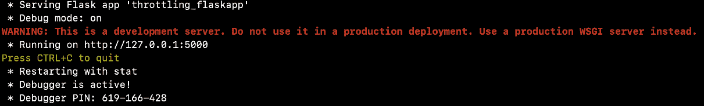
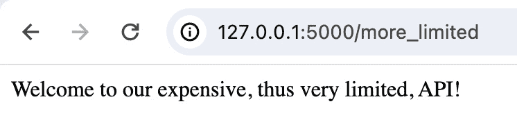
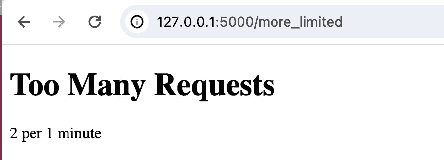
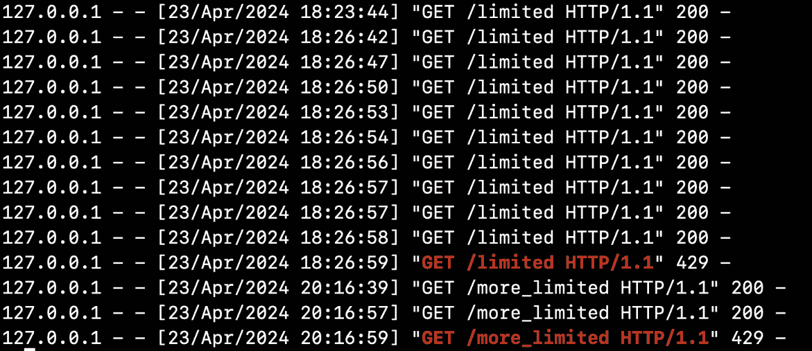
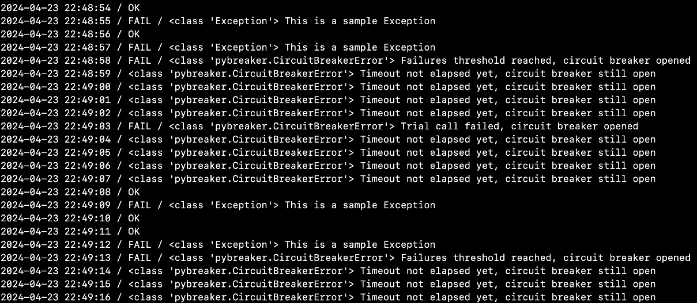

# 9

# 分布式系统模式

随着技术的进步和对可扩展和弹性系统的需求增加，了解支配分布式系统的基本模式变得至关重要。

从管理节点间的通信到确保**容错性**（**FT**）和一致性，本章探讨了使开发者能够构建强大分布式系统的基本设计模式。无论你是构建微服务还是实施云原生应用程序，掌握这些模式都将为你提供有效应对分布式计算复杂性的工具。

在本章中，我们将涵盖以下主要主题：

+   节流模式

+   重试模式

+   电路断路器模式

+   其他分布式系统模式

# 技术要求

请参阅第一章中提出的需求。本章讨论的代码的附加技术要求如下：

+   使用`python -m pip install flask flask-limiter`安装 Flask 和 Flask-Limiter

+   使用`python -m pip install pybreaker`安装 PyBreaker

# 节流模式

节流是我们今天的应用程序和 API 中可能需要使用的重要模式。在这种情况下，节流意味着控制用户（或客户端服务）在给定时间内可以向特定服务或 API 发送请求的速率，以保护服务资源不被过度使用。例如，我们可能将 API 的用户请求限制为每天 1000 次。一旦达到这个限制，下一个请求将通过向用户发送包含 429 HTTP 状态代码的错误消息来处理，并告知用户请求过多。

关于节流有许多需要理解的内容，包括可能使用的限制策略和算法以及如何衡量服务的使用情况。你可以在微软的云设计模式目录中找到有关节流模式的详细技术信息（[`learn.microsoft.com/en-us/azure/architecture/patterns/throttling`](https://learn.microsoft.com/en-us/azure/architecture/patterns/throttling)）。

## 现实世界示例

现实生活中有很多节流的例子，如下所示：

+   **高速公路交通管理**：交通信号灯或限速规定调节高速公路上的车辆流量

+   **水龙头**：调节水龙头的水流

+   **音乐会票销售**：当热门音乐会的票开始销售时，网站可能会限制每个用户一次可以购买的票数，以防止服务器因需求激增而崩溃

+   **电力使用**：一些公用事业公司提供基于高峰时段和非高峰时段电力使用情况的不同收费计划的方案

+   **自助餐队列**：在自助餐中，为了确保每个人都有公平的机会进食并防止食物浪费，顾客可能一次只能取一份食物

我们还有帮助实现速率限制的软件片段的示例。

+   `django-throttle-requests` ([`github.com/sobotklp/django-throttle-requests`](https://github.com/sobotklp/django-throttle-requests)) 是一个用于实现 Django 项目特定速率限制中间件的框架

+   Flask-Limiter ([`flask-limiter.readthedocs.io/en/stable/`](https://flask-limiter.readthedocs.io/en/stable/)) 为 Flask 路由提供速率限制功能

## 速率限制模式的用例

当你需要确保你的系统持续提供预期的服务，当你需要优化服务的使用成本，或者当你需要处理活动高峰时，这种模式是推荐的。

在实践中，你可以实施以下规则：

+   将 API 的总请求数限制为每天 N 次（例如，N=1000）

+   从给定的 IP 地址、国家或地区限制 API 的请求次数为每天 N 次

+   限制认证用户的读写次数

除了速率限制的情况外，它还可以用于*资源分配*，确保在多个客户端之间公平分配资源。

## 实现速率限制模式

在深入实现示例之前，你需要知道存在几种类型的速率限制，其中包括速率限制、基于白名单 IP 地址列表的 IP 级别限制（例如）和并发连接限制，仅举这三个为例。前两种相对容易实验。我们将在这里重点关注第一种。

让我们看看使用 Flask 及其 Flask-Limiter 扩展开发的简单 Web 应用程序的速率限制类型速率限制的示例。

我们从示例所需的导入开始：

```py
from flask import Flask
from flask_limiter import Limiter
from flask_limiter.util import get_remote_address
```

与 Flask 一样，我们使用以下两行设置 Flask 应用程序：

```py
app = Flask(__name__)
```

然后，我们定义 Limiter 实例；我们通过传递一个键函数`get_remote_address`（我们已导入）、应用程序对象、默认限制值和其他参数来创建它，如下所示：

```py
limiter = Limiter(
    get_remote_address,
    app=app,
    default_limits=["100 per day", "10 per hour"],
    storage_uri="memory://",
    strategy="fixed-window",
)
```

基于此，我们可以为`/limited`路径定义一个路由，它将使用默认限制进行速率限制，如下所示：

```py
@app.route("/limited")
def limited_api():
    return "Welcome to our API!"
```

我们还添加了`/more_limited`路径的路由定义。在这种情况下，我们使用`@limiter.limit("2/minute")`装饰器确保每分钟两个请求的速率限制。代码如下：

```py
@app.route("/more_limited")
@limiter.limit("2/minute")
def more_limited_api():
    return "Welcome to our expensive, thus very limited, API!"
```

最后，我们添加了 Flask 应用程序中常用的片段：

```py
if __name__ == "__main__":
    app.run(debug=True)
```

要测试此示例，请使用`python ch09/throttling_flaskapp.py`命令运行文件。你会得到一个启动的 Flask 应用程序的常规输出：



图 9.1 – throttling_flaskapp：Flask 应用程序示例启动

然后，如果你将浏览器指向`http://127.0.0.1:5000/limited`，你将看到页面上的欢迎内容，如下所示：


图 9.2 – 浏览器中/limited 端点的响应

如果您继续点击**刷新**按钮，情况会变得有趣。第 10 次点击时，页面内容将改变并显示一个**请求过多**的错误消息，如下面的截图所示：


图 9.3 – 在/limited 端点上的请求过多

我们不要就此止步。记住——代码中还有第二条路由，即`/more_limited`，每分钟限制两个请求。为了测试第二条路由，将您的浏览器指向`http://127.0.0.1:5000/more_limited`。您将在页面上看到新的欢迎内容，如下所示：



图 9.4 – 浏览器中/more_limited 端点的响应

如果我们点击**刷新**按钮，在 1 分钟内点击超过两次，我们将收到另一个**请求过多**的消息，如下面的截图所示：



图 9.5 – 在/more_limited 端点上的请求过多

此外，查看 Flask 服务器运行的控制台，您会注意到对每个接收到的 HTTP 请求和应用程序发送的响应状态码的提及。它应该看起来像下面的截图：



图 9.6 – Flask 服务器控制台：对 HTTP 请求的响应

在使用 Flask-Limiter 扩展的 Flask 应用程序中，有许多速率限制类型节流的可能性，正如您可以在模块的文档页面中看到的那样。读者可以在文档页面上找到更多关于如何使用不同策略和存储后端（如 Redis）进行特定实现的信息。

# 重试模式

在分布式系统的背景下，重试是一种越来越需要的策略。想想微服务或基于云的基础设施，其中组件相互协作，但不是由同一团队和各方开发和部署/运营。

在其日常运营中，云原生应用程序的部分可能会遇到所谓的短暂故障或失败，这意味着一些看似错误但并非由于您的应用程序本身的问题；相反，它们是由于您无法控制的某些约束，如网络或外部服务器/服务的性能。因此，您的应用程序可能会出现故障（至少，这可能就是用户的感知）或在某些地方挂起。应对这种失败风险的答案是实施一些重试逻辑，这样我们就可以通过再次调用服务来通过问题，可能是立即或在等待一段时间（如几秒钟）之后。

## 现实世界示例

在我们的日常生活中，有许多重试模式（或类比）的例子，如下所示：

+   **打电话**：想象你正在尝试通过电话联系一个朋友，但由于他们的线路繁忙或存在网络问题，电话无法接通。你不会立即放弃，而是在短暂的延迟后重试拨打他们的号码。

+   **从 ATM 取款**：想象你前往 ATM 取现金，但由于网络拥塞或连接问题等暂时性问题，交易失败，机器显示错误信息。你不会放弃取款，而是稍作等待，再次尝试交易。这次，交易可能会成功，让你取出所需的现金。

在软件领域，也有许多工具或技术可以被视为示例，因为它们有助于实现重试模式，例如以下内容：

+   在 Python 中，Retrying 库（[`github.com/rholder/retrying`](https://github.com/rholder/retrying)）可用于简化将重试行为添加到我们的函数中的任务

+   Go 开发者的 Pester 库（[`github.com/sethgrid/pester`](https://github.com/sethgrid/pester)）

## 重试模式的用例

由于网络故障或服务器过载，与外部组件或服务通信时，此模式建议用于减轻已识别的暂时性故障的影响。

注意，重试方法不建议用于处理由应用程序逻辑本身错误引起的内部异常。此外，我们必须分析外部服务的响应。如果应用程序经常出现繁忙故障，这通常是一个迹象，表明被访问的服务存在需要解决的扩展问题。

我们可以将重试与微服务架构联系起来，其中服务通常通过网络进行通信。重试模式确保暂时性故障不会导致整个系统失败。

另一种用例是*数据同步*。当在两个系统之间同步数据时，重试可以处理一个系统的暂时不可用。

## 实现重试模式

在此示例中，我们将实现数据库连接的重试模式。我们将使用装饰器来处理重试机制。

我们从以下示例的`import`语句开始：

```py
import logging
import random
import time
```

然后，我们添加配置以记录日志，这有助于在使用代码时的可观察性：

```py
logging.basicConfig(level=logging.DEBUG)
```

我们添加我们的函数，该函数将支持装饰器自动重试被装饰函数的执行，直到达到指定的尝试次数，如下所示：

```py
def retry(attempts):
    def decorator(func):
        def wrapper(*args, **kwargs):
            for _ in range(attempts):
                try:
                    logging.info("Retry happening")
                    return func(*args, **kwargs)
                except Exception as e:
                    time.sleep(1)
                    logging.debug(e)
            return "Failure after all attempts"
        return wrapper
    return decorator
```

然后，我们添加`connect_to_database()`函数，该函数模拟数据库连接。它被`@retry`装饰器装饰。我们希望装饰器在连接失败时自动重试连接，最多重试三次：

```py
@retry(attempts=3)
def connect_to_database():
    if random.randint(0, 1):
        raise Exception("Temporary Database Error")
    return "Connected to Database"
```

最后，为了方便测试我们的实现，我们添加以下测试代码：

```py
if __name__ == "__main__":
    for i in range(1, 6):
        logging.info(f"Connection attempt #{i}")
        print(f"--> {connect_to_database()}")
```

要测试示例，请运行以下命令：

```py
python ch09/retry/retry_database_connection.py
```

你应该得到以下类似的输出：

```py
INFO:root:Connection attempt #1
INFO:root:Retry happening
--> Connected to Database
INFO:root:Connection attempt #2
INFO:root:Retry happening
DEBUG:root:Temporary Database Error
INFO:root:Retry happening
DEBUG:root:Temporary Database Error
INFO:root:Retry happening
DEBUG:root:Temporary Database Error
--> Failure after all attempts
INFO:root:Connection attempt #3
INFO:root:Retry happening
--> Connected to Database
INFO:root:Connection attempt #4
INFO:root:Retry happening
--> Connected to Database
INFO:root:Connection attempt #5
INFO:root:Retry happening
DEBUG:root:Temporary Database Error
INFO:root:Retry happening
DEBUG:root:Temporary Database Error
INFO:root:Retry happening
DEBUG:root:Temporary Database Error
--> Failure after all attempts
```

因此，当临时数据库错误发生时，会进行重试。可能会发生几次重试，直到三次。一旦发生三次不成功的重试尝试，操作的结果就是失败。

总体而言，重试模式是处理涉及分布式系统的此类用例的有效方式，几个错误（例如我们示例中的四个数据库错误）可能意味着存在一个更永久或问题性的错误，应该修复。

# 断路器模式

实现 FT（故障转移）的一种方法涉及重试，正如我们刚才看到的。但是，当由于与外部组件通信导致的失败可能持续很长时间时，使用重试机制可能会影响应用程序的响应性。我们可能会浪费时间和资源尝试重复一个可能失败的请求。这就是另一个模式可以派上用场的地方：断路器模式。

使用断路器模式，你将一个脆弱的函数调用或与外部服务的集成点包装在一个特殊的（断路器）对象中，该对象会监控失败。一旦失败达到某个阈值，断路器就会跳闸，所有后续的断路器调用都会返回错误，而受保护的调用根本不会执行。

## 现实世界示例

在生活中，我们可以想到一个水或电力分配电路，其中断路器扮演着重要的角色。

在软件中，断路器在以下示例中使用：

+   **电子商务结账**：如果支付网关关闭，断路器可以停止进一步的支付尝试，防止系统过载

+   **速率限制的 API**：当一个 API 达到其速率限制时，断路器可以停止额外的请求以避免处罚

## 断路器模式的用例

如前所述，当你的系统需要与外部组件、服务或资源通信时，断路器模式在需要组件对长期失败具有容错能力时是推荐的。接下来，我们将了解它是如何解决这些用例的。

## 实现断路器模式

假设你想要在一个不可靠的函数上使用断路器，一个由于它依赖的网络环境而脆弱的函数，例如。我们将使用`pybreaker`库（[`pypi.org/project/pybreaker/`](https://pypi.org/project/pybreaker/））来展示实现断路器模式的示例。

我们的实现是对这个仓库中找到的一个很好的脚本的改编：[https://github.com/veltra/pybreaker-playground](https://github.com/veltra/pybreaker-playground)。让我们来看一下代码。

我们从导入开始，如下所示：

```py
import pybreaker
from datetime import datetime
import random
from time import sleep
```

让我们定义我们的断路器，在函数中连续五次失败后自动打开电路。我们需要创建一个`pybreaker.CircuitBreaker`类的实例，如下所示：

```py
breaker = pybreaker.CircuitBreaker(fail_max=2, reset_timeout=5)
```

然后，我们创建我们版本的函数来模拟脆弱的调用。我们使用装饰器语法来保护这些操作，因此新的函数如下所示：

```py
@breaker
def fragile_function():
    if not random.choice([True, False]):
        print(" / OK", end="")
    else:
        print(" / FAIL", end="")
        raise Exception("This is a sample Exception")
```

最后，这是代码的主要部分，包括`main()`函数：

```py
def main():
    while True:
        print(datetime.now().strftime("%Y-%m-%d %H:%M:%S"), end="")
        try:
            fragile_function()
        except Exception as e:
            print(" / {} {}".format(type(e), e), end="")
        finally:
            print("")
            sleep(1)
```

通过运行`python ch09/circuit_breaker.py`命令来调用此脚本会产生以下输出：



图 9.7 – 使用断路器的程序输出

通过仔细查看输出，我们可以看到断路器按预期工作：当它打开时，所有对`fragile_function()`的调用都会立即失败（因为它们会引发`CircuitBreakerError`异常），而不会尝试执行预期的操作。并且，在 5 秒的超时后，断路器将允许下一个调用通过。如果该调用成功，电路将关闭；如果失败，电路将再次打开，直到另一个超时结束。

# 其他分布式系统模式

除了我们这里提到的模式之外，还有许多其他分布式系统模式。开发者和架构师可以使用的其他模式包括以下内容：

+   **命令和查询责任分离（CQRS）**：此模式将读取和写入数据的责任分开，通过针对特定用例定制数据模型和操作，优化数据访问和可扩展性。

+   **两阶段提交**：此分布式事务协议通过协调两阶段提交过程，确保多个参与资源之间的原子性和一致性，包括一个*准备*阶段和一个随后的*提交*阶段。

+   **叙事**：叙事是一系列本地事务的序列，这些事务共同构成一个分布式事务，提供补偿机制以在部分失败或事务中止的情况下保持一致性。

+   **边车**：边车模式涉及在主要服务旁边部署额外的辅助服务以增强功能，例如添加监控、日志记录或安全功能，而无需直接修改主应用程序。

+   **服务注册表**：此模式集中管理分布式系统内的服务发现，允许服务动态注册和发现彼此，从而促进通信和可扩展性。

+   **舱壁**：受船舶设计启发，舱壁模式将系统内的资源或组件分区，以隔离故障并防止级联故障影响系统的其他部分，从而增强容错性和弹性。

这些模式中的每一个都针对分布式系统固有的特定挑战，为架构师和开发者提供策略和最佳实践，以设计能够在动态和不可预测的环境中运行的健壮和可扩展的解决方案。

# 摘要

在本章中，我们深入探讨了分布式系统模式的复杂性，重点关注节流、重试和断路器模式。这些模式对于构建健壮、容错和高效的分布式系统至关重要。

你在本章中获得的能力将显著提高你设计和实现能够处理短暂故障、服务中断和高负载的分布式系统的能力。

关于节流模式的章节为你提供了有效管理服务负载和资源分配的工具。

通过理解如何实现重试模式，你已经掌握了使你的操作更可靠的技能。

最后，断路器模式教会了你如何构建能够优雅处理故障的容错系统。

当我们结束本章时，记住这些模式不是孤立的解决方案，而是更大拼图的一部分。它们通常在结合并针对你系统的特定需求和限制进行调整时效果最佳。关键是要理解其背后的原则，这样你就可以根据需要调整它们，以创建一个有弹性和高效的分布式系统。

最后，我们简要介绍了其他一些分布式系统模式，这些模式我们无法在本书中涵盖。

在下一章中，我们将专注于测试模式。
