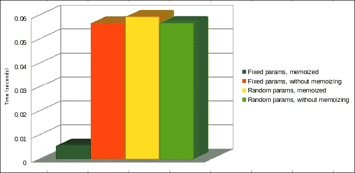
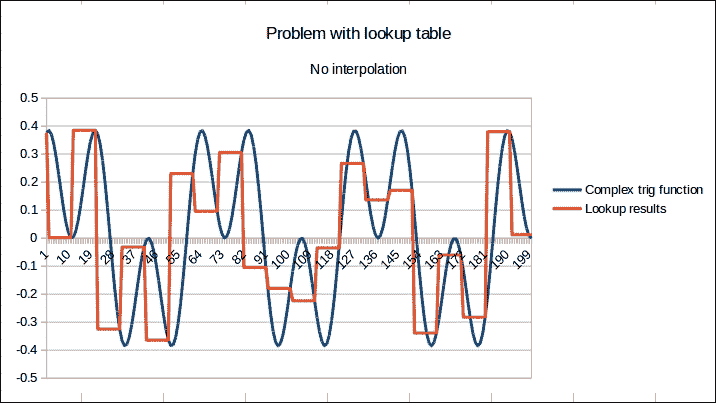
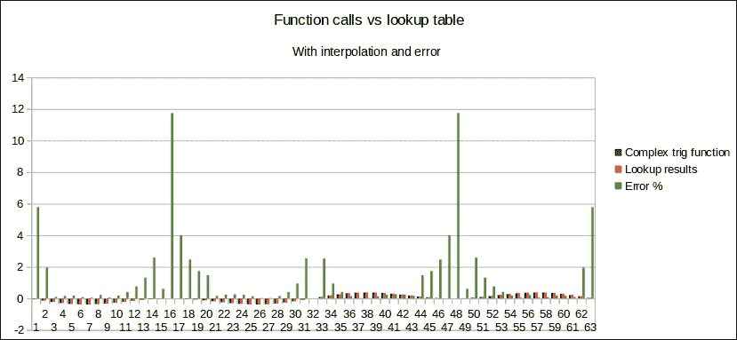
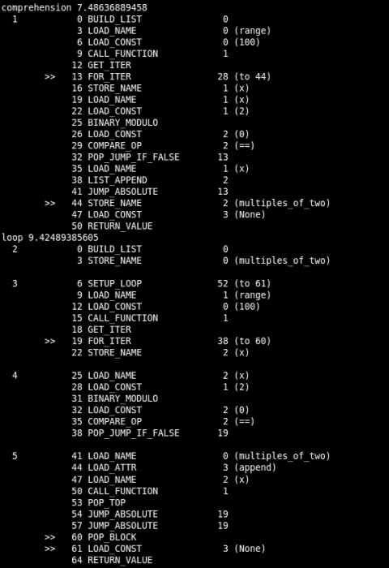
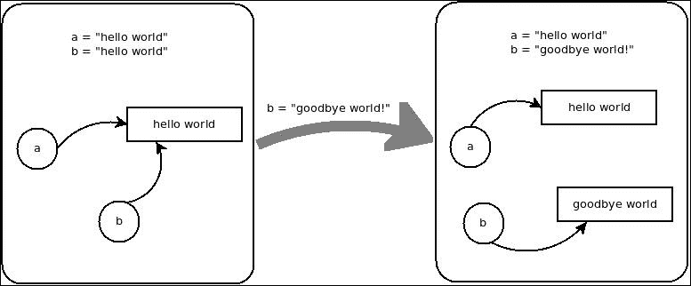
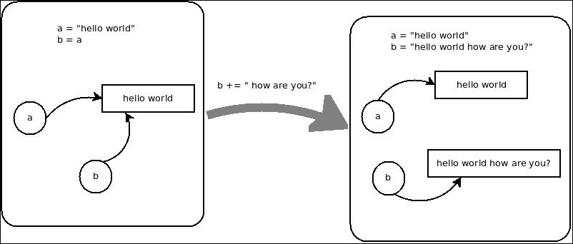
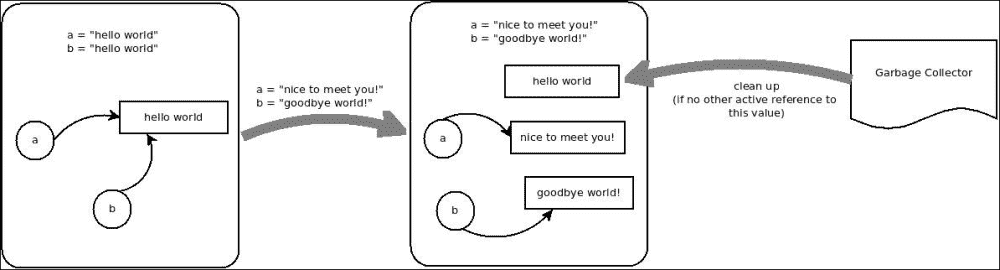

# 第四章。优化一切

掌握 Python 性能提升之路才刚刚开始。性能分析只能带我们走一半的路。测量我们的程序如何使用其可用的资源只能告诉我们问题所在，但不能告诉我们如何修复它。在前几章中，我们看到了一些在介绍分析器时的实际例子。我们进行了一些优化，但从未真正详细解释过。

在本章中，我们将介绍优化的过程，为此，我们需要从基础知识开始。现在我们将将其保持在语言内部：没有外部工具，只有 Python 和正确使用它的方法。

本章我们将介绍以下主题：

+   缓存/查找表

+   默认参数的使用

+   列推导

+   生成器

+   ctypes

+   字符串连接

+   Python 的其他技巧和窍门

# 缓存/查找表

这是提高代码（即函数）性能最常用的技术之一。我们可以保存与特定输入值集相关的高成本函数调用的结果，并在函数使用记住的输入值时返回保存的结果（而不是重新进行整个计算）。这可能会与缓存混淆，因为这是缓存的一种类型，尽管这个术语也指代其他类型的优化（如 HTTP 缓存、缓冲等）。

这种方法非常强大，因为在实践中，它将本应是一个非常昂贵的调用转换为一个*O(1)*函数调用（有关更多信息，请参阅第一章，*性能分析 101*），如果实现正确的话。通常，参数用于创建一个唯一的键，然后在该字典上使用该键来保存结果或获取它如果已经保存。

当然，这种技术也有权衡。如果我们打算记住缓存函数的返回值，那么我们将用内存空间来换取速度。这是一个非常可接受的权衡，除非保存的数据超过了系统可以处理的数据。

这种优化的经典用例是经常重复输入参数的函数调用。这将确保大多数时间，都会返回已缓存的值。如果有许多函数调用，但参数不同，我们只会存储结果，消耗内存而没有实际的好处，如下面的图像所示：



你可以清楚地看到，蓝色条（**固定参数，已缓存**）显然是最快的使用案例，而其他由于它们的性质都是相似的。

这里是生成前面图表值的代码。为了生成某种耗时函数，代码将在不同条件下多次调用`twoParams`函数或`twoParamsMemoized`函数数百次，并记录执行时间：

```py
import math

import time

import random

class Memoized:

  def __init__(self, fn):

    self.fn = fn

    self.results = {}

  def __call__(self, *args):

    key = ''.join(map(str, args[0]))

    try:

      return self.results[key]

    except KeyError:

      self.results[key] = self.fn(*args)

    return self.results[key]

@Memoized

def twoParamsMemoized(values, period):

  totalSum = 0

  for x in range(0, 100):

    for v in values:

      totalSum = math.pow((math.sqrt(v) * period), 4) + totalSum

  return totalSum

def twoParams(values, period):

  totalSum = 0

  for x in range(0, 100):

    for v in values:

      totalSum = math.pow((math.sqrt(v) * period), 4) + totalSum

  return totalSum

def performTest():

    valuesList = []

    for i in range(0, 10):

        valuesList.append(random.sample(xrange(1, 101), 10))

    start_time = time.clock()

    for x in range(0, 10):

      for values in valuesList:

          twoParamsMemoized(values, random.random())

    end_time = time.clock() - start_time

    print "Fixed params, memoized: %s" % (end_time)

    start_time = time.clock()

    for x in range(0, 10):

      for values in valuesList:

          twoParams(values, random.random())

    end_time = time.clock() - start_time

    print "Fixed params, without memoizing: %s" % (end_time)

    start_time = time.clock()

    for x in range(0, 10):

      for values in valuesList:

          twoParamsMemoized(random.sample(xrange(1,2000), 10), random.random())

    end_time = time.clock() - start_time

    print "Random params, memoized: %s" % (end_time)

    start_time = time.clock()

    for x in range(0, 10):

      for values in valuesList:

          twoParams(random.sample(xrange(1,2000), 10), random.random())

    end_time = time.clock() - start_time

    print "Random params, without memoizing: %s" % (end_time)

performTest()
```

### 注意

从前面的图表中可以得出的主要见解是，就像编程的每个方面一样，没有一种银弹算法适用于所有情况。显然，记忆化是一种非常基本的代码优化方法，但在适当的条件下，它显然不会优化任何内容。

至于代码，并没有太多。这是一个非常简单、非现实世界的例子，用以说明我试图传达的观点。`performTest` 函数将负责为每个用例运行一系列 10 个测试，并测量每个用例所花费的总时间。请注意，我们目前并没有真正使用性能分析器。我们只是在非常基础和临时的方式下测量时间，这对我们来说已经足够了。

两个函数的输入只是一个数字集合，它们将在这些数字上运行一些数学函数，只是为了做点事情。

关于参数的另一个有趣之处在于，由于第一个参数是一个数字列表，我们无法在 `Memoized` 类的方法中使用 `args` 参数作为键。这就是为什么我们有以下这一行：

```py
key = ''.join(map(str, args[0]))
```

这一行将第一个参数的所有数字连接成一个单一值，这个值将作为键。第二个参数在这里没有使用，因为它总是随机的，这意味着键永远不会相同。

上述方法的另一种变体是在初始化期间预先计算函数的所有值（当然，假设我们有一个有限的输入数量），然后在执行期间引用查找表。这种方法有几个前提条件：

+   输入值数量必须是有限的；否则，无法预先计算所有内容

+   包含所有值的查找表必须能够适应内存

+   就像之前一样，输入必须至少重复一次，这样优化才有意义，并且值得额外的努力。

在构建查找表时，有不同方法，所有这些方法都提供了不同类型的优化。这完全取决于你试图优化的应用程序和解决方案的类型。这里有一组示例。

## 在列表或链表上执行查找

这种解决方案通过遍历一个未排序的列表，并将键与每个元素进行比较，以关联的值作为我们寻找的结果。

这显然是一种非常慢的实现方法，对于平均和最坏情况都有 *O(n)* 的大 O 表示法。尽管如此，在适当的条件下，它可能比每次都调用实际函数要快。

### 备注

在这种情况下，使用链表可以提高算法的性能，而不是使用简单的列表。然而，它仍然会严重依赖于链表的类型（双向链表、简单链表，可以直接访问第一个和最后一个元素，等等）。

## 在字典上进行简单查找

这种方法使用一维字典查找，通过由输入参数（足够多以创建一个唯一键）组成的键进行索引。在特定情况下（如我们之前所讨论的），这可能是最快的查找之一，在某些情况下甚至比二分查找更快，具有恒定的执行时间（Big O 表示法为 *O(1)*）。

### 注意

注意，只要密钥生成算法每次都能生成唯一的密钥，这种方法就是高效的。否则，由于字典中存在许多冲突，性能可能会随着时间的推移而下降。

## 二分查找

这种特定方法仅在列表已排序的情况下才可行。这可能会根据要排序的值成为一个潜在的选择。然而，排序它们会需要额外的努力，这可能会损害整个工作的性能。然而，即使在长列表中，它也能提供非常好的结果（平均 Big O 表示法为 *O(log n)*）。它是通过确定值在列表的哪一半，并重复进行，直到找到值或算法能够确定值不在列表中。

为了更全面地了解这一点，看看前面提到的 `Memoized` 类，它在一个字典上实现了一个简单的查找。然而，这将是实现其他算法的地方。

## 查找表的应用场景

这种类型的优化有一些经典的用例，但最常见的一个可能是三角函数的优化。根据计算时间，这些函数实际上非常慢。当重复使用时，它们可能会对程序的性能造成严重损害。

这就是为什么通常建议预先计算这些函数的值。对于处理可能输入值无限域宇宙的函数，这项任务变得不可能。因此，开发者被迫牺牲精度以换取性能，通过预先计算可能输入值的离散子域（即从浮点数降到整数）。

在某些情况下，这种方法可能并不理想，因为一些系统既需要性能也需要精度。因此，解决方案是折中一下，使用某种形式的插值来计算所需值，基于已经预先计算的那些值。这将提供更好的精度。尽管它可能不会像直接使用查找表那样高效，但它应该比每次都进行三角计算要快。

让我们看看一些这个方法的例子；例如，对于以下三角函数：

```py
def complexTrigFunction(x):
  return math.sin(x) * math.cos(x)**2
```

我们将探讨简单的预先计算为什么不够准确，以及某种形式的插值如何导致更高的精度水平。

以下代码将预先计算从 `-1000` 到 `1000` 范围内（仅整数值）的函数值。然后它将尝试对浮点数进行相同的计算（仅针对更小的范围）：

```py
import math
import time
from collections import defaultdict
import itertools

trig_lookup_table = defaultdict(lambda: 0) 

def drange(start, stop, step):
    assert(step != 0)
    sample_count = math.fabs((stop - start) / step)
    return itertools.islice(itertools.count(start, step), sample_count)

def complexTrigFunction(x):
  return math.sin(x) * math.cos(x)**2

def lookUpTrig(x):
  return trig_lookup_table[int(x)]

for x in range(-1000, 1000):
  trig_lookup_table[x] = complexTrigFunction(x)

trig_results = []
lookup_results = []

init_time = time.clock()
for x in drange(-100, 100, 0.1):
  trig_results.append(complexTrigFunction(x))
print "Trig results: %s" % (time.clock() - init_time)

init_time = time.clock()
for x in drange(-100, 100, 0.1):
  lookup_results.append(lookUpTrig(x))
print "Lookup results: %s" % (time.clock() - init_time)

for idx in range(0, 200):
  print "%s\t%s" % (trig_results [idx], lookup_results[idx])
```

之前代码的结果将有助于展示简单的查找表方法并不足够准确（请参见以下图表）。然而，它通过速度来补偿这一点，因为原始函数运行需要 0.001526 秒，而查找表只需 0.000717 秒。



之前的图表显示了缺乏插值如何影响准确性。你可以看到，尽管两个图表非常相似，但查找表执行的结果并不像直接使用的`trig`函数那样准确。所以，现在，让我们再次审视相同的问题。然而，这次，我们将添加一些基本的插值（我们将值域限制在`-PI`到`PI`之间）：

```py
import math
import time
from collections import defaultdict
import itertools

trig_lookup_table = defaultdict(lambda: 0) 

def drange(start, stop, step):
    assert(step != 0)
    sample_count = math.fabs((stop - start) / step)
    return itertools.islice(itertools.count(start, step), sample_count)

def complexTrigFunction(x):
  return math.sin(x) * math.cos(x)**2

reverse_indexes = {}
for x in range(-1000, 1000):
  trig_lookup_table[x] = complexTrigFunction(math.pi * x / 1000)

complex_results = []
lookup_results = []

init_time = time.clock()
for x in drange(-10, 10, 0.1):
  complex_results .append(complexTrigFunction(x))
print "Complex trig function: %s" % (time.clock() - init_time)

init_time = time.clock()
factor = 1000 / math.pi
for x in drange(-10 * factor, 10 * factor, 0.1 * factor):
  lookup_results.append(trig_lookup_table[int(x)])
print "Lookup results: %s" % (time.clock() - init_time)

for idx in range(0, len(lookup_results )):
  print "%s\t%s" % (complex_results [idx], lookup_results [idx])
```

正如你可能在之前的图表中注意到的，生成的图表是周期性的（特别是因为我们已经将范围限制在`-PI`到`PI`之间）。因此，我们将关注一个特定的值域，这将生成图表的单个部分。

之前脚本的输出还显示，插值解决方案仍然比原始的三角函数快，尽管不如之前快：

| 插值解决方案 | 原始函数 |
| --- | --- |
| 0.000118 秒 | 0.000343 秒 |

下面的图表与之前的图表略有不同，特别是因为它显示了（以绿色表示）插值值与原始值之间的误差百分比：



我们最大的误差大约是 12%（这代表了图表上看到的峰值）。然而，这是对于最小的值，例如-0.000852248551417 与-0.000798905501416 之间的差异。这是一个需要根据上下文来理解误差百分比是否真正重要的案例。在我们的情况下，由于与该误差相关的值非常小，我们实际上可以忽略这个误差。

### 注意

查找表还有其他用例，例如在图像处理中。然而，为了这本书的目的，之前的例子应该足以展示它们的优点以及使用它们的权衡。

# 默认参数的使用

另一种优化技术，与记忆化相反，并不特别通用。相反，它直接与 Python 解释器的工作方式相关联。

默认参数可以在函数创建时确定值，而不是在运行时。

### 提示

这只能用于在程序执行期间不会改变的函数或对象。

让我们看看如何应用这种优化的一个例子。以下代码显示了同一函数的两个版本，该函数执行一些随机的三角计算：

```py
import math 

#original function
def degree_sin(deg):
    return math.sin(deg * math.pi / 180.0)

#optimized function, the factor variable is calculated during function creation time, 
#and so is the lookup of the math.sin method.
def degree_sin(deg, factor=math.pi/180.0, sin=math.sin):
    return sin(deg * factor)
```

### 注意

如果没有正确记录，这种优化可能会出现问题。因为它使用属性来预计算在程序执行期间不应改变的项，这可能导致创建一个令人困惑的 API。

通过快速简单的测试，我们可以再次检查这种优化的性能提升：

```py
import time
import math

def degree_sin(deg):
  return math.sin(deg * math.pi / 180.0) * math.cos(deg * math.pi / 180.0)

def degree_sin_opt(deg, factor=math.pi/180.0, sin=math.sin, cos = math.cos):
  return sin(deg * factor) * cos(deg * factor)

normal_times = []
optimized_times = []

for y in range(100):
  init = time.clock()
   for x in range(1000):
    degree_sin(x)
  normal_times.append(time.clock() - init)

  init = time.clock()
  for x in range(1000):
    degree_sin_opt(x)
  optimized_times.append(time.clock() - init)

print "Normal function: %s" % (reduce(lambda x, y: x + y, normal_times, 0) / 100)
print "Optimized function: %s" % (reduce(lambda x, y: x + y, optimized_times, 0 ) / 100)
```

之前的代码测量了脚本完成每个函数版本运行范围`1000`所需的时间。它保存了这些测量结果，并最终为每种情况创建一个平均值。结果如下表所示：


这显然不是一种惊人的优化。然而，它确实从我们的执行时间中节省了一些微秒，所以我们会记住它。只是记住，如果你是作为操作系统开发团队的一员工作，这种优化可能会引起问题。

# 列表推导和生成器

列表推导是 Python 提供的一种特殊结构，通过以数学家的方式编写来生成列表，通过描述其内容而不是描述内容应如何生成（使用经典的`for`循环）。

让我们通过一个例子来更好地理解它是如何工作的：

```py
#using list comprehension to generate a list of the first 50 multiples of 2
multiples_of_two = [x for x in range(100) if x % 2 == 0]

#now let's see the same list, generated using a for-loop
multiples_of_two = []
for x in range(100):
  if x % 2 == 0:
    multiples_of_two.append(x)
```

现在，列表推导并不是要完全取代`for`循环。当处理像之前那样的创建列表的循环时，它们非常有帮助。然而，对于由于副作用而编写的`for`循环，它们并不特别推荐。这意味着你并没有创建一个列表。你很可能是调用它内部的一个函数或进行一些其他不转化为列表的计算。在这些情况下，列表推导表达式实际上会损害可读性。

要理解为什么这些表达式比常规`for`循环更高效，我们需要进行一些反汇编和阅读字节码。我们可以这样做，因为尽管 Python 是一种解释型语言，但它仍然被编译器翻译成字节码。这个字节码是解释器所解释的。因此，使用`dis`模块，我们可以将字节码转换成人类可读的形式，并分析其执行。

让我们看看代码：

```py
import dis
import timeit

programs = dict(
    loop="""
multiples_of_two = []
for x in range(100):
  if x % 2 == 0:
    multiples_of_two.append(x)
""",
    comprehension='multiples_of_two = [x for x in range(100) if x % 2 == 0]',
)

for name, text in programs.iteritems():
    print name, timeit.Timer(stmt=text).timeit()
    code = compile(text, '<string>', 'exec')
    dis.disassemble(code)
```

那段代码将输出两件事：

+   每段代码运行所需的时间

+   由解释器生成的指令集，得益于`dis`模块

下面是输出结果的截图（在你的系统中，时间可能会变化，但其余部分应该相当相似）：



首先，输出证明代码的列表推导版本确实更快。现在，让我们将两个指令列表并排仔细查看，以更好地理解它们：

| `for`循环指令 | 注释 | 列表推导指令 | 注释 |
| --- | --- | --- | --- |
| `BUILD_LIST` |   | `BUILD_LIST` |   |
| `STORE_NAME` | 我们“倍数”列表的定义 |   |   |
| `SETUP_LOOP` |   |   |   |
| `LOAD_NAME` | 范围函数 | `LOAD_NAME` | 范围函数 |
| `LOAD_CONST` | 100（范围属性） | `LOAD_CONST` | 100（范围属性） |
| `CALL_FUNCTION` | 调用 range | `CALL_FUNCTION` | 调用 range |
| `GET_ITER` |   | `GET_ITER` |   |
| `FOR_ITER` |   | `FOR_ITER` |   |
| `STORE_NAME` | 我们临时变量 x | `STORE_NAME` | 我们临时变量 `x` |
| `LOAD_NAME` |   | `LOAD_NAME` |   |
| `LOAD_CONST` | *X % 2 == 0* | `LOAD_CONST` | *X % 2 == 0* |
| `BINARY_MODULO` | `BINARY_MODULO` |
| `LOAD_CONST` | `LOAD_CONST` |
| `COMPARE_OP` | `COMPARE_OP` |
| `POP_JUMP_IF_FALSE` |   | `POP_JUMP_IF_FALSE` |   |
| `LOAD_NAME` |   | `LOAD_NAME` |   |
| `LOAD_ATTR` | 查找追加方法 | `LIST_APPEND` | 将值追加到列表 |
| `LOAD_NAME` | 加载 *X* 的值 |   |   |
| `CALL_FUNCTION` | 将实际值追加到列表 |   |   |
| `POP_TOP` |   |   |   |
| `JUMP_ABSOLUTE` |   | `JUMP_ABSOLUTE` |   |
| `JUMP_ABSOLUTE` |   | `STORE_NAME` |   |
| `POP_BLOCK` |   | `LOAD_CONST` |   |
| `LOAD_CONST` |   | `RETURN_VALUE` |   |
| `RETURN_VALUE` |   |   |   |

从前面的表中，你可以看到`for`循环如何生成更长的指令列表。推导式代码生成的指令几乎像是`for`循环生成的指令的一个子集，主要区别在于值的添加方式。对于`for`循环，它们是逐个添加的，使用三个指令（`LOAD_ATTR`、`LOAD_NAME`和`CALL_FUNCTION`）。另一方面，对于列表推导式列，这是通过一个单一的、优化的指令（`LIST_APPEND`）完成的。

### 提示

这就是为什么在生成列表时，`for`循环不应该成为你的首选武器。这是因为你正在编写的列表推导式更高效，有时甚至能写出更易读的代码。

话虽如此，请记住不要过度使用这些表达式，以替换每个`for`循环，即使是执行其他操作（副作用）的循环。在这些情况下，列表推导式没有优化，并且会比常规的`for`循环花费更长的时间。

最后，还有一个相关的考虑因素需要考虑：当生成大列表时，推导式可能不是最佳解决方案。这是因为它们仍然需要生成每个单独的值。所以，如果你正在生成包含 10 万个项目的列表，有一个更好的方法。你可以使用生成器表达式。它们不会返回列表，而是返回一个生成器对象，其 API 与列表类似。然而，每次你请求一个新的项目时，该项目将会动态生成。

生成器对象和列表对象之间的主要区别是，第一个对象不支持随机访问。所以，你实际上不能使用方括号表示法来执行任何操作。然而，你可以使用生成器对象来遍历你的列表：

```py
my_list = (x**2 for x in range(100))
#you can't do this
print my_list[1]

#but you can do this
for number in my_list:
  print number
```

列表和生成器对象之间的另一个关键区别是，你只能对后者迭代一次，而你可以对列表进行多次相同的操作。这是一个关键的区别，因为它将限制你高效生成的列表的使用。因此，在决定使用列表推导式表达式还是生成器表达式时，请考虑这一点。

这种方法在访问值时可能会增加一点开销，但在创建列表时将会更快。以下是创建不同长度列表时列表推导式和生成器表达式的比较：


图表清楚地显示，对于较长的列表，生成器表达式的性能优于列表推导式表达式。对于较短的列表，列表推导式表达式更好。

# ctypes

ctypes 库允许开发者深入 Python 的底层，并利用 C 语言的强大功能。这仅适用于官方解释器（CPython），因为它是用 C 编写的。其他版本，如 PyPy 或 Jython，不提供对这个库的访问。

这个 C 接口可以用来做很多事情，因为你实际上有加载预编译代码并从 C 中使用它的能力。这意味着你可以访问 Windows 系统上的 `kernel32.dll` 和 `msvcrt.dll` 库，以及 Linux 系统上的 `libc.so.6` 库。

对于我们的特定情况，我们将关注优化代码的方法，展示如何加载自定义 C 库以及如何加载系统库以利用其优化的代码。有关如何使用此库的完整详细信息，请参阅官方文档[`docs.python.org/2/library/ctypes.html`](https://docs.python.org/2/library/ctypes.html)。

## 加载自己的自定义 C 库

有时候，无论我们在代码上使用多少优化技术，它们可能都不足以帮助我们达到最佳可能的时间。在这些情况下，我们总是可以将敏感的代码编写在我们的程序之外，用 C 语言编写，编译成库，然后将其导入到我们的 Python 代码中。

让我们看看如何实现这一点以及我们期望的性能提升。

要解决的问题非常简单，非常基础。我们将编写代码来生成一个包含一百万个整数的素数列表。

针对那个问题的 Python 代码可能如下所示：

```py
import math
import time

def check_prime(x):
  values = xrange(2, int(math.sqrt(x)))
  for i in values:
    if x % i == 0:
      return False 

  return True

init = time.clock()
numbers_py = [x for x in xrange(1000000) if check_prime(x)]
print "%s" % (time.clock() - init)
```

上述代码已经足够简单。是的，我们可以通过将列表推导式表达式更改为生成器来轻松改进它。然而，为了展示从 C 代码中获得的改进，我们就不这样做。现在，C 代码的平均运行时间为 4.5 秒。

现在我们用 C 语言编写 `check_prime` 函数，并将其导出为一个共享库（`.so` 文件）：

```py
#include <stdio.h>
#include <math.h>

int check_prime(int a)
{
  int c;
  for ( c = 2 ; c <= sqrt(a) ; c++ ) { 
    if ( a%c == 0 )
     return 0;
  }

  return 1;

}
```

要生成库文件，请使用以下命令：

```py
$gcc -shared -o check_primes.so -fPIC check_primes.c 

```

然后，我们可以编辑我们的 Python 脚本来运行函数的两个版本并比较时间，如下所示：

```py
import time
import ctypes
import math

check_primes_types = ctypes.CDLL('./check_prime.so').check_prime

def check_prime(x):
  values = xrange(2, int(math.sqrt(x)))
  for i in values:
    if x % i == 0:
      return False 

  return True

init = time.clock()
numbers_py = [x for x in xrange(1000000) if check_prime(x)]
print "Full python version: %s seconds" % (time.clock() - init)

init = time.clock()
numbers_c = [x for x in xrange(1000000) if check_primes_types(x)]
print "C version: %s seconds" % (time.clock() - init)
print len(numbers_py)
```

前面的代码给出了以下输出：

| 完整 Python 版本 | C 版本 |
| --- | --- |
| 4.49 秒 | 1.04 秒 |

性能提升相当显著。它已经从 4.5 秒降低到仅仅 1 秒！

## 加载系统库

有时，你不需要编写 C 函数。系统的库可能已经为你准备好了。你只需要导入那个库并使用该函数。

让我们再看看另一个简单的例子来演示这个概念。

下面的行生成了一百万个随机数字的列表，耗时 0.9 秒：

```py
randoms = [random.randrange(1, 100) for x in xrange(1000000)]While this one, takes only 0.3 seconds:
randoms = [(libc.rand() % 100) for x in xrange(1000000)]
```

这里是运行这两行代码并打印出时间的完整代码：

```py
import time
import random
from ctypes import cdll

libc = cdll.LoadLibrary('libc.so.6') #linux systems
#libc = cdll.msvcrt #windows systems

init = time.clock()
randoms = [random.randrange(1, 100) for x in xrange(1000000)]
print "Pure python: %s seconds" % (time.clock() - init)

init = time.clock()
randoms = [(libc.rand() % 100) for x in xrange(1000000)]
print "C version : %s seconds" % (time.clock() - init)
```

# 字符串连接

Python 字符串值得在这一章中单独讨论，因为它们与其他语言的字符串不同。在 Python 中，字符串是不可变的，这意味着一旦创建，就无法真正改变其值。

这是一个相对令人困惑的断言，因为我们习惯于对字符串变量进行诸如连接或替换之类的操作。然而，普通的 Python 开发者并没有意识到，幕后的操作远比他们想象的要多。

由于字符串对象是不可变的，每次我们对其进行任何更改内容的行为时，实际上是在创建一个全新的字符串，并让我们的变量指向那个新字符串。因此，我们在处理字符串时必须小心，确保我们确实想要这样做。

有一个非常简单的方法来检查前面的情况。下面的代码将创建一组具有相同字符串的变量（我们将每次都写这个字符串）。然后，使用`id`函数（在 CPython 中，它返回变量指向的值的内存地址），我们将它们相互比较。如果字符串是可变的，那么所有对象都将是不同的，因此返回的值应该是不同的。让我们看看代码：

```py
a = "This is a string"
b = "This is a string"

print id(a) == id(b)  #prints  True

print id(a) == id("This is a string") #prints True

print id(b) == id("This is another String") #prints False
```

如代码注释所述，输出将是`True`，`True`和`False`，从而显示系统实际上每次我们写入`This is a string`字符串时都会重用该字符串。

下面的图像试图以更图形化的方式表示相同的概念：



尽管我们写了两次字符串，但内部，这两个变量都引用了相同的内存块（包含实际的字符串）。如果我们给其中一个赋值，我们不会改变字符串的内容。我们只是让我们的变量指向另一个内存地址。



在前面的例子中，我们有一个变量`b`直接指向变量`a`。尽管如此，如果我们尝试修改`b`，我们只是再次创建一个新的字符串。



最后，如果我们改变示例中两个变量的值会发生什么？内存中存储的 `hello world` 字符串会发生什么？嗯，如果没有其他引用，垃圾收集器最终会处理它，释放那块内存。

话虽如此，不可变对象并不全是坏事。如果使用得当，它们对性能实际上是有好处的，因为它们可以用作字典键，例如，甚至可以在不同的变量绑定之间共享（因为每次引用相同的字符串时都使用相同的内存块）。这意味着，无论你将这个字符串存储在什么变量中（就像我们之前看到的），字符串 `hey there` 都将是完全相同的对象。

有了这个想法，考虑一下一些常见情况会发生什么，例如以下这种情况：

```py
full_doc = ""
for word in word_list:
  full_doc += word
```

上述代码将为 `word_list` 列表中的每个项目为 `full_doc` 生成一个新的字符串。这并不是真正的有效内存使用，对吧？当我们试图从不同部分重新创建一个字符串时，这是一个非常常见的情况。有一种更好、更节省内存的方法来做这件事：

```py
full_doc = "".join(world_list)
```

这种替代方案更容易阅读，更快地编写，并且在内存和时间方面都更高效。以下代码显示了每个选项所需的时间。使用正确的命令，我们还可以看到 `for` 循环替代方案使用了更多的内存：

```py
import time
import sys

option = sys.argv[1]

words =  [str(x) for x in xrange(1000000)]

if option == '1':
  full_doc = ""
  init = time.clock()
  for w in words:
    full_doc += w
  print "Time using for-loop: %s seconds" % (time.clock() - init)
else:
  init = time.clock()
  full_doc = "".join(words)
  print "Time using join: %s seconds" % (time.clock() - init)
```

使用以下命令我们可以执行脚本并测量内存使用，使用 Linux 工具 `time`：

+   # 对于 for-loop 版本：

    ```py
    $ /usr/bin/time -f "Memory: %M bytes" python script.py 1 

    ```

+   # 对于连接版本：

    ```py
    $ /usr/bin/time -f "Memory: %M bytes" python script.py 0 

    ```

for-loop 版本的命令输出如下：

```py
Time using for-loop: 0.155635 seconds
Memory: 66212 bytes

```

连接版本的命令输出如下：

```py
Time using join: 0.015284 seconds
Memory: 66092 bytes

```

连接版本明显花费的时间更少，并且峰值内存消耗（由 `time` 命令测量）也更少。

当我们在 Python 中处理字符串时，我们还想考虑的其他用例是不同类型的连接；它在你只处理几个变量时使用，例如以下这种情况：

```py
document = title + introduction + main_piece + conclusion
```

每当系统计算新的连接时，你都会创建一组子字符串。所以，一个更好、更高效的方法是使用变量插值：

```py
document = "%s%s%s%s" % (title, introduction, main_piece, conclusion)
```

或者，使用 `locals` 函数创建子字符串甚至更好：

```py
document = "%(title)s%(introduction)s%(main_piece)s%(conclusion)s" % locals()
```

# 其他技巧和窍门

之前提到的技巧是一些最常用的优化程序的技术。其中一些是 Python 特有的（例如字符串连接或使用 ctypes），而其他则是更通用的（例如记忆化和查找表）。

仍然有一些针对 Python 的特定的小技巧和窍门，我们将在下面介绍。它们可能不会带来显著的速度提升，但会更多地揭示语言的内部工作原理：

+   **成员测试**：当试图确定一个值是否在列表中（我们在这里泛指“列表”，并不是特指类型 `list`）时，例如 "a in b"，使用集合和字典（查找时间为 *O(1)*）会比列表或元组得到更好的结果。

+   **不要重新发明轮子**：Python 内置了用优化过的 C 编写的核心块。没有必要使用手工构建的替代品，因为后者很可能会更慢。建议使用如 `lists`、`tuples`、`sets` 和 `dictionaries` 这样的数据类型，以及如 `array`、`itertools` 和 `collections.deque` 这样的模块。内置函数也适用于此处。它们总是比 `map(operator.add, list1, list2)` 这样的操作更快，而 `map(lambda x, y: x+y, list1, list2)` 则不是。

+   **别忘了 deque**：当需要固定长度的数组或可变长度的栈时，列表表现良好。然而，当处理 `pop(0)` 或 `insert(0, your_list)` 操作时，尽量使用 `collections.deque`，因为它在列表两端提供快速的（*O(1)*）追加和弹出。

+   **有时最好是不要定义**：调用函数会添加很多开销（如我们之前看到的）。因此，有时，尤其是在时间敏感的循环中，内联函数的代码，而不是调用该函数，将更高效。这个技巧有很大的权衡，因为它也可能大大损害可读性和可维护性。所以，只有在确实需要性能提升的情况下才应该这样做。以下简单的示例展示了简单的查找操作最终会增加相当多的时间：

    ```py
    import time
    def fn(nmbr):
       return (nmbr ** nmbr) / (nmbr + 1)
    nmbr = 0
    init = time.clock()
    for i in range(1000):
       fn(i)
    print "Total time: %s" % (time.clock() - init)

    init = time.clock()
    nmbr = 0
    for i in range(1000):
      nmbr = (nmbr ** nmbr) / (nmbr + 1)
    print "Total time (inline): %s" % (time.clock() - init)
    ```

+   **当可能时，按键排序**：在对列表进行自定义排序时，尽量不使用比较函数进行排序。相反，当可能时，按键排序。这是因为键函数每个项目只会被调用一次，而比较函数在排序过程中每个项目会被调用多次。让我们通过一个快速示例来比较这两种方法：

    ```py
    import random
    import time

    #Generate 2 random lists of random elements
    list1 = [ [random.randrange(0, 100), chr(random.randrange(32, 122))] for x in range(100000)]
    list2 = [ [random.randrange(0, 100), chr(random.randrange(32, 122))] for x in range(100000)]

    #sort by string, using a comparison function
    init = time.clock()
    list1.sort(cmp=lambda a,b: cmp(a[1], b[1]))
    print "Sort by comp: %s" % (time.clock() - init) #prints  0.213434

    #sort by key, using the string element as key
    init = time.clock()
    list2.sort(key=lambda a: a[1])
    print "Sort by key: %s" % (time.clock() - init) #prints 0.047623

    ```

+   **1 比 True 好**：Python 2.3 的 `while 1` 被优化为单次跳转，而 `while True` 则不是，因此需要多次跳转才能完成。这意味着编写 `while 1` 比编写 `while True` 更高效，尽管就像内联代码一样，这个技巧也有很大的权衡。

+   **多重赋值慢但...**：多重赋值（`a,b = "hello there", 123`）通常比单次赋值慢。然而，再次强调，当进行变量交换时，它比常规方式更快（因为我们跳过了临时变量的使用和赋值）：

    ```py
    a = "hello world"
    b = 123
    #this is faster
    a,b = b, a
    #than doing
    tmp  = a
    a = b
    b = tmp

    ```

+   **链式比较是好的**：当比较三个变量时，与其做 *x < y* 和 *y < z*，你可以使用 *x < y < z*。这应该更容易阅读（更自然）并且运行更快。

+   **使用命名元组代替常规对象**：当创建简单的对象来存储数据时，使用常规类表示法，实例包含一个用于属性存储的字典。对于属性较少的对象，这种存储可能会变得低效。如果你需要创建大量这样的对象，那么这种内存浪费就会累积。在这种情况下，你可以使用`namedtuples`。这是一个新的`tuple`子类，可以轻松构建，并且针对此任务进行了优化。有关`namedtuples`的详细信息，请查看官方文档[`docs.python.org/2/library/collections.html#collections.namedtuple`](https://docs.python.org/2/library/collections.html#collections.namedtuple)。以下代码创建了 100 万个对象，既使用常规类也使用`namedtuples`，并显示了每个动作的时间：

    ```py
    import time
    import collections

    class Obj(object):
      def __init__(self, i):
        self.i = i
        self.l = []
    all = {}

    init = time.clock()
    for i in range(1000000):
      all[i] = Obj(i)
    print "Regular Objects: %s" % (time.clock() - init) #prints Regular Objects: 2.384832

    Obj = collections.namedtuple('Obj', 'i l')

    all = {}
    init = time.clock()
    for i in range(1000000):
      all[i] = Obj(i, [])
    print "NamedTuples Objects: %s" % (time.clock() - init) #prints  NamedTuples Objects: 1.272023

    ```

# 摘要

在本章中，我们介绍了几种优化技术。其中一些旨在提供速度的大幅提升，以及/或节省内存。其中一些只是旨在提供轻微的速度提升。本章的大部分内容涵盖了 Python 特定的技术，但其中一些也可以翻译成其他语言。

在下一章中，我们将介绍优化技术。特别是，我们将涵盖多线程和多进程，你将学习何时应用每一种。
