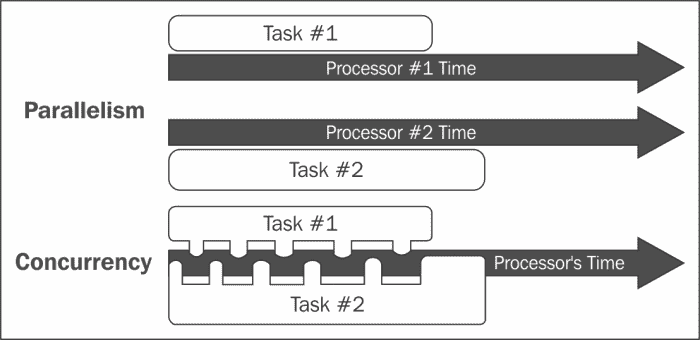
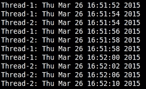
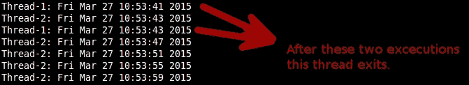
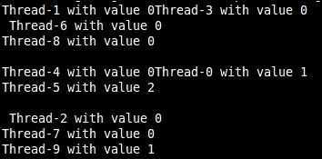
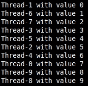
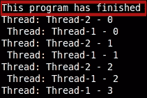
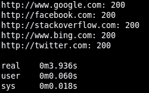
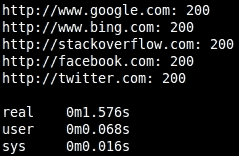
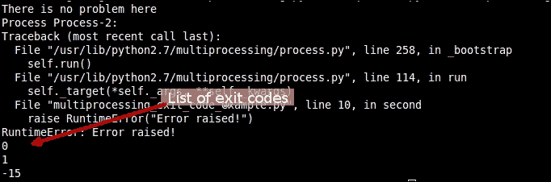

# 第五章：多线程与多进程

当谈到优化代码时，并发和并行性是两个很少被忽视的话题。然而，在 Python 的情况下，这些通常是用来批评该语言的议题。批评者通常指责使用这些机制与它们实际带来的好处（在某些情况下，这种好处可能根本不存在）之间的难度。

在这一章中，我们将看到批评者在某些情况下是正确的，在其他情况下是错误的。就像大多数工具一样，这些机制需要满足某些条件才能为开发者服务，而不是与他们作对。在我们对如何在 Python 中实现并行性以及何时这样做真正值得的内部结构进行巡游时，我们将讨论两个具体的话题：

1.  **多线程**：这是尝试实现真正并行性的最经典方法。其他语言如 C++和 Java 也提供了这一功能。

1.  **多进程**：尽管不太常见，并且可能存在一些难以解决的问题，但我们将讨论这一特性作为多线程的有效替代方案。

在阅读完这一章后，你将完全理解多线程和多进程之间的区别。此外，你还将了解什么是**全局解释器锁**（**GIL**），以及它将如何影响你在尝试选择正确的并行技术时的决策。

# 并行性与并发性

这两个术语经常一起使用，甚至可以互换，但它们在技术上实际上是两回事。一方面，我们有并行性，这是指两个或更多进程可以同时运行的情况。例如，在多核系统中，每个进程都在不同的处理器上运行。

另一方面，并发性发生在两个或更多进程试图在同一个处理器上同时运行的情况下。这通常通过时间切片等技术来解决。然而，这些技术并不是真正并行地执行。只是因为处理器在任务之间切换的速度快，所以看起来像是并行的。

以下图表试图说明这一点：



并发性，例如，是所有现代操作系统使用的一种技术。这是因为无论计算机有多少处理器，系统本身可能需要同时运行更多的进程，更不用说用户可能想要做的事情了。因此，为了解决这个问题，操作系统将负责为每个需要它的进程调度处理器时间。然后，它将在它们之间切换上下文，给每个进程分配一段时间。

现在，考虑到这一点，我们如何在 Python 程序中实现并行性或并发性呢？这就是多线程和多进程发挥作用的地方。

## 多线程

多线程是程序在相同程序上下文中运行多个线程的能力。这些线程共享进程的资源，允许在并发模式（对于单处理器系统）和并行模式（对于多核系统）中同时运行多个操作。

将你的程序结构化以利用这些线程不是一项容易的任务。然而，它带来了一些非常有趣的好处：

+   **响应性**：在单线程程序中，执行长时间运行的任务可能会使程序看起来冻结。多线程和将此类代码移动到工作线程，程序可以在同时执行长时间运行的任务的同时保持响应。

+   **执行速度更快**：在多核处理器或多处理器系统中，多线程可以通过实现真正的并行性来提高程序的性能。

+   **资源消耗降低**：使用线程，程序可以使用原始进程的资源来服务许多请求。

+   **简化共享和通信**：由于线程已经共享相同的资源和内存空间，它们之间的通信比进程间通信要简单得多。

+   **并行化**：多核或多处理器系统可以用来利用多线程并独立运行每个线程。Nvidia 的**计算统一设备架构**（**CUDA**）([`www.nvidia.com/object/cuda_home_new.html`](http://www.nvidia.com/object/cuda_home_new.html))或 Khronos Group 的 OpenCL([`www.khronos.org/opencl/`](https://www.khronos.org/opencl/))是利用从几十到几百个处理器来并行运行任务的 GPU 计算环境。

多线程也有一些缺点：

+   **线程同步**：由于线程可能处理相同的数据，你需要实现某种机制来防止竞态条件（导致数据读取损坏）。

+   **由问题线程引起的崩溃**：尽管它可能看起来是独立的，但一个单独的问题线程出现问题并执行无效操作可能会使整个进程崩溃。

+   **死锁**：这是与线程工作相关的一个常见问题。通常，当一个线程需要资源时，它会锁定该资源直到完成。当一条线程进入等待状态，等待第二条线程释放其资源，但第二条线程反过来又正在等待第一条线程释放其已锁定的资源时，就会发生死锁。

通常，这种技术应该足以在多处理器系统上实现并行性。然而，Python 的官方版本（CPython）有一个称为 GIL 的限制。这个 GIL 阻止多个原生线程同时运行 Python 的字节码，这实际上破坏了并行性。如果你有一个四处理器系统，你的代码不会以 400%的速度运行。相反，它只会以 100%或稍微慢一点的速度运行，因为线程带来的额外开销。

### 注意

注意，GIL 不仅仅是 Python（或 CPython）的发明。其他编程语言也有 GIL，例如 Ruby 的官方实现 Ruby MRI 或 OCaml（[`ocaml.org/`](https://ocaml.org/))）。

GIL 是必要的，因为 CPython 中的内存管理不是线程安全的。因此，通过强制所有内容按顺序运行，它确保没有任何东西会破坏内存。对于单线程程序来说，它也更快，简化了 C 扩展的创建，因为它们不需要考虑多线程。

然而，有一些方法可以绕过 GIL。例如，由于它只阻止线程同时运行 Python 的字节码，因此你可以在 C 中编码你的任务，让 Python 只是该代码的包装器。在这种情况下，GIL 不会阻止 C 代码同时运行所有线程。

另一个 GIL 不会影响性能的例子是一个网络服务器，它的大部分时间都花在从网络上读取数据包。在这种情况下，增加的并发性将允许服务更多的数据包，即使没有真正的并行性。这实际上提高了我们程序的性能（每秒可以服务更多的客户端），但它不会影响其速度，因为每个任务花费相同的时间

### 线程

现在，让我们简要谈谈 Python 中的线程，以便了解如何使用它们。它们由开始、执行序列和结束组成。还有一个指令指针，它跟踪线程在其上下文中当前运行的位置。

那个指针可以被抢占或中断，以便停止线程。或者，它也可以暂时挂起。这基本上意味着让线程休眠。

为了在 Python 中使用线程，我们有以下两种选择：

+   **线程模块**：这提供了一些有限的能力来处理线程。它使用简单，对于小型任务，它增加的额外开销很小。

+   **线程模块**：这是较新的模块，自 Python 2.4 版本以来就包含在 Python 中。它提供了更强大和更高层次的线程支持。

#### 使用线程模块创建线程

虽然我们将重点关注线程模块，但我们会快速展示如何使用此模块进行更简单的时代，当脚本不需要大量工作时。

线程模块（[`docs.python.org/2/library/thread.html`](https://docs.python.org/2/library/thread.html)）提供了`start_new_thread`方法。我们可以传递以下参数：

+   我们可以将其传递给一个包含实际要运行的代码的函数。一旦这个函数返回，线程将被停止。

+   我们可以将其传递为一个参数元组。这个列表将被传递给函数。

+   最后，我们可以将其传递为一个可选的命名参数字典。

让我们看看前面所有参数的一个例子：

```py
#!/usr/bin/python

import thread
import time

# Prints the time 5 times, once every "delay" seconds
def print_time( threadName, delay):
   count = 0
   while count < 5:
      time.sleep(delay)
      count += 1
      print "%s: %s" % ( threadName, time.ctime(time.time()) )

# Create two threads as follows
try:
   thread.start_new_thread( print_time, ("Thread-1", 2, ) )
   thread.start_new_thread( print_time, ("Thread-2", 4, ) )
except:
   print "Error: unable to start thread"

# We need to keep the program working, otherwise the threads won't live

while True:
   pass
```

上述代码打印以下输出：



上述代码足够简单，输出清楚地显示了两个线程实际上是并发运行的。关于这一点有趣的是，在代码中，`print_time`函数本身有一个内部循环。如果我们两次串行运行此函数，那么每次调用它都会持续`5` * 延迟秒。

然而，使用线程并且不需要做任何改变，我们正在同时运行循环两次。

此模块还提供了其他有用的线程原语。以下是一个示例：

```py
interrupt_main
```

此方法向主线程发送键盘中断异常。这实际上就像在程序运行时按下*CTRL*+*C*一样。如果没有捕获，发送信号的线程将终止程序。

```py
exit

```

此方法静默地退出线程。这是一种在不影响其他任何事物的情况下终止线程的好方法。假设我们将我们的`print_time`函数改为以下代码行：

```py
def print_time( threadName, delay):
   count = 0
   while count < 5:
      time.sleep(delay)
      count += 1
      print "%s: %s" % ( threadName, time.ctime(time.time()) )
      if delay == 2 and count == 2:
      thread.exit()
```

在这种情况下，输出结果如下：



`allocate_lock`方法返回一个线程可以使用的锁。锁将帮助开发者保护敏感代码，并确保在执行期间没有竞态条件。

返回的锁对象具有这三个简单的方法：

+   `acquire`：这基本上是为当前线程获取锁。它接受一个可选的整数参数。如果它是零，只有在可以立即获取锁而无需等待的情况下，锁才会被获取。如果它不是零，锁将无条件地被获取（就像当你省略参数时）。这意味着如果线程需要等待以获取锁，它就会等待。

+   `release`：这将释放锁，以便下一个线程获取它。

+   `locked`：如果某个线程获取了锁，则返回`TRUE`。否则，返回`FALSE`。

这是一个如何使用锁帮助多线程代码的非常基本的例子。以下代码使用 10 个线程递增全局变量。每个线程都会添加一个线程。所以，到最后，我们应该在该全局变量中有 10 个线程：

```py
#!/usr/bin/python

import thread
import time

global_value = 0

def run( threadName ):
   global global_value
   print "%s with value %s" % (threadName, global_value)
   global_value = global_value + 1

for i in range(10):
   thread.start_new_thread( run, ("Thread-" + str(i), ) )

# We need to keep the program working, otherwise the threads won't live
while 1:
   pass
```

以下是前面代码的输出：



不仅我们正确地增加了全局变量的值（我们只增加到`2`），我们还遇到了打印字符串的问题。在某些情况下，同一行中有两个字符串，而它们应该各自占据一行。这是因为当同一行中存在两个字符串时，两个线程都试图同时打印。那时，要打印的当前行在两种情况下都是相同的。

对于全局值，同样的情况也会发生。当线程 `1`、`3`、`6`、`8`、`4`、`2` 和 `7` 按顺序读取全局变量的值以添加 `1` 时，其值为 `0`（这是它们各自复制到 `local_value` 变量的值）。我们需要确保复制值、增加它并打印它的代码被保护（在锁内），以便没有两个线程可以同时运行它。为了实现这一点，我们将使用锁对象的两种方法：获取和释放。

使用以下代码行：

```py
#!/usr/bin/python

import thread
import time

global_value = 0

def run( threadName, lock ):
   global global_value
   lock.acquire()
   local_copy = global_value
   print "%s with value %s" % (threadName, local_copy)
   global_value = local_copy + 1
   lock.release()

lock = thread.allocate_lock()

for i in range(10):
   thread.start_new_thread( run, ("Thread-" + str(i), lock) )

# We need to keep the program working, otherwise the threads won't live
while 1:
   pass
```

现在，输出结果更有意义了：



现在的输出更有意义了，格式已修复，我们成功增加了变量的值。这两个修复都归因于锁定机制。关于代码，要增加 `global_value` 的值，锁阻止其他线程（那些尚未获取锁的线程）执行该代码部分（将其值读入局部变量并增加它）。因此，当锁处于活动状态时，只有获取锁的线程才能运行这些行。锁释放后，下一个排队等待的线程将执行相同的操作。前面的代码行返回当前线程的标识：

```py
get_ident
```

这是一个非零整数，除了在活动线程列表中标识当前线程外，没有其他直接意义。线程死亡或退出后，此数字可以被回收，因此在程序的生命周期内不是唯一的。以下代码设置或返回创建新线程时使用的线程堆栈大小：

```py
stack_size
```

这支持一个可选参数（“this”是要设置的堆栈大小）。此大小必须是 0 或至少 32.768（32 Kb）。根据系统，可能会有其他限制，甚至是对设置堆栈大小的限制。因此，在尝试使用此方法之前，请查阅您操作系统的手册。

### 注意

虽然这不是本书的目标版本，但在 Python 3 中，此模块已被重命名为 `_thread`。

#### 使用线程模块

这是当前和推荐在 Python 中处理线程的方式。此模块为此提供了一个更好、更高级的接口。它也增加了我们代码的复杂性，因为现在将不再可用 `_thread` 模块的简单性。

对于这种情况，我们可以引用本叔叔的话：

> *权力越大，责任越大*。

开个玩笑，`threading` 模块将线程的概念封装在一个类中，我们必须实例化它才能使用。

我们可以创建模块提供的 `Thread` 类的子类（[`docs.python.org/2/library/thread.html`](https://docs.python.org/2/library/thread.html)），这通常是首选方式。或者，如果我们想做一些非常简单的事情，我们甚至可以直接实例化该类。让我们看看前面的例子如何使用 `threading` 模块进行转换：

```py
#!/usr/bin/python

import threading

global_value = 0

def run( threadName, lock ):
   global global_value
   lock.acquire()
   local_copy = global_value
   print "%s with value %s" % (threadName, local_copy)
   global_value = local_copy + 1
   lock.release()

lock = threading.Lock()

for i in range(10):
   t = threading.Thread( target=run, args=("Thread-" + str(i), lock) )
   t.start()
```

对于更复杂的事情，我们可能想要创建自己的线程类，以便更好地封装其行为。

当使用子类方法时，在编写自己的类时，你需要注意以下几点：

+   它们需要扩展`threading.Thread`类

+   它们需要重写`run`方法，并且可选地重写`__init__`方法

+   如果你重写了构造函数，请确保首先调用父类的构造函数（`Thread.__init__`）。

+   当`run`方法停止或抛出未处理的异常时，线程将停止，因此请考虑这一点来规划你的方法。

+   你可以在构造方法的`name`参数中为线程命名

虽然你将不得不重写`run`方法，其中将包含线程的主要逻辑，但你将无法控制该方法何时被调用。相反，你将调用`start`方法，该方法会创建一个新的线程，并使用该线程作为上下文调用`run`方法。

现在让我们看看一个关于线程工作中非常常见的陷阱的简单例子：

```py
import threading
import time

class MyThread(threading.Thread):

  def __init__(self, count):
    threading.Thread.__init__(self)
    self.total = count

  def run(self):

    for i in range(self.total):
      time.sleep(1)
      print "Thread: %s - %s" % (self.name, i)

t = MyThread(4)
t2 = MyThread(3)

t.start()
t2.start()

print "This program has finished"
```

以下代码的输出如下：



如前一个截图所示，程序在发送退出消息之前发送了其他消息。在这种情况下，这不是一个大问题。然而，如果我们有类似的情况：

```py
#....
f = open("output-file.txt", "w+")
t = MyThread(4, f)
t2 = MyThread(3, f)

t.start()
t2.start()
f.close() #close the file handler
print "This program has finished"
```

### 注意

注意，前面的代码将失败，因为它将在任何线程试图以任何方式使用文件句柄之前关闭它。如果我们想避免这类问题，我们需要使用`join`方法，这将使调用线程暂停，直到目标线程完成执行。

在我们的情况下，如果我们从主线程中使用`join`方法，它将确保程序在两个线程完成执行之前不会继续执行主命令链。我们需要确保在两个线程启动后使用`join`方法。否则，我们可能会以串行方式运行它们：

```py
#...
t.start()
t2.start()
#both threads are working, let's stop the main thread
t.join() 
t2.join()
f.close() #now that both threads have finished, lets close the file handler
print "This program has finished"
```

此方法还接受一个可选参数：一个超时时间（一个`float`或`None`），单位为秒。然而，`join`方法始终返回`None`。因此，为了确定操作是否确实超时，我们需要在`join`方法返回后检查线程是否仍然存活（使用`isAlive`方法）。如果线程仍然存活，则操作超时。

现在让我们看看另一个简单脚本的例子，用于检查一系列网站的返回状态码。此脚本只需要几行代码就可以遍历列表并收集返回的状态码：

```py
import urllib2

sites = [
  "http://www.google.com",
  "http://www.bing.com",
  "http://stackoverflow.com",
  "http://facebook.com",
  "http://twitter.com"
]

def check_http_status(url):
  return urllib2.urlopen(url).getcode()

http_status = {}
for url in sites:
  http_status[url] = check_http_status(url)

for  url in http_status#:
  print "%s: %s" % (url, http_status[url])
```

如果你使用 Linux 上的时间命令行工具运行前面的代码，你还可以得到执行所需的时间：

```py
$time python non_threading_httpstatus.py

```

输出如下：



现在，看看代码以及我们迄今为止所看到的，一个明显的优化是将 I/O 密集型函数（`check_http_status`）转换为线程。这样，我们可以并发地检查所有站点的状态，而不是等待每个请求完成后再处理下一个：

```py
import urllib2
import threading

sites = [
  "http://www.google.com",
  "http://www.bing.com",
  "http://stackoverflow.com",
  "http://facebook.com",
  "http://twitter.com"
]

class HTTPStatusChecker(threading.Thread):

  def __init__(self, url):
    threading.Thread.__init__(self)
    self.url = url
    self.status = None

  def getURL(self):
    return self.url

  def getStatus(self):
    return self.status

  def run(self):
    self.status = urllib2.urlopen(self.url).getcode()

threads = []
for url in sites:
  t = HTTPStatusChecker(url)
  t.start() #start the thread
  threads.append(t) 

#let the main thread join the others, so we can print their result after all of them have finished.
for t in threads:
  t.join()

for  t in threads:
  print "%s: %s" % (t.url, t.status)
```

使用时间运行新脚本会产生以下结果：

```py
$time python threading_httpstatus.py

```

我们将得到以下输出：



显然，线程化的替代方案更快。在我们的例子中，它几乎快了三倍，这是一个惊人的改进。

#### 使用事件进行线程间通信

尽管线程通常被认为是单个或并行工作者，但有时允许它们相互通信是有用的。

要实现这一点，线程模块提供了事件构造（[`docs.python.org/2/library/threading.html#event-objects`](https://docs.python.org/2/library/threading.html#event-objects)）。它包含一个内部标志，调用线程可以使用`set()`或`clear()`来操作。

`Event`类有一个非常简单的接口。以下是该类内部提供的方法：

+   `is_set`：如果事件的内部标志被设置，则返回`True`。

+   `set`：这将内部标志设置为`True`。唤醒所有等待此标志被设置的线程。调用`wait()`的线程将不再被阻塞。

+   `clear`：这将重置内部标志。任何调用`wait()`方法的线程将变为阻塞状态，直到再次调用`set()`。

+   `wait`：这将阻塞调用线程，直到事件的内部标志被设置。此方法接受一个可选的超时参数。如果指定了超时并且与`none`不同，则线程将只被该超时阻塞。

让我们看看使用事件在两个线程之间进行通信的简单示例，以便它们可以轮流向标准输出打印。两个线程将共享同一个事件对象。一个线程会在`while`循环的每次迭代中设置它，而另一个线程如果设置了它，就会清除它。在每次操作（`set`或`clear`）时，它们会打印出正确的字母：

```py
import threading
import time

class ThreadA(threading.Thread):

  def __init__(self, event):
    threading.Thread.__init__(self)
    self.event = event

  def run(self):
    count = 0
    while count < 5:
      time.sleep(1)
      if self.event.is_set():
        print "A"
        self.event.clear()
      count += 1

class ThreadB(threading.Thread):

  def __init__(self, evnt):
    threading.Thread.__init__(self)
    self.event = evnt

  def run(self):
    count = 0
    while count < 5:
      time.sleep(1)
      if not self.event.is_set():
        print "B"
        self.event.set()
      count += 1

event = threading.Event()

ta = ThreadA(event)
tb = ThreadB(event)

ta.start()
tb.start()
```

总之，以下表格显示了何时使用多线程以及何时不使用：

| 使用线程 | 不使用线程 |
| --- | --- |
| 对于重 I/O 密集型脚本 | 用于优化重 CPU 密集型脚本 |
| 当并行化可以被并发替代时 | 对于必须利用多核系统的程序 |
| 用于 GUI 开发 |   |

## 多进程

如我们之前所见，由于 GIL 的存在，Python 中的多线程无法实现真正的并行化。因此，某些类型的应用程序将不会从使用此模块中获得真正的益处。

相反，Python 提供了一个名为多进程的替代多线程的方法。在多进程中，线程被转换为单独的子进程。每个子进程都将运行自己的 GIL（这意味着可以同时运行多个并行 Python 进程，没有限制）。

为了澄清，线程都是同一进程的一部分，它们共享相同的内存、空间和资源。另一方面，进程不与它们的父进程共享内存空间，因此它们之间进行通信可能更复杂。

与多线程相比，这种方法既有优点也有缺点：

| 优点 | 缺点 |
| --- | --- |
| 利用多核系统 | 内存占用更大 |
| 分离的内存空间消除了竞争条件 | 在进程间共享可变数据更困难 |
| 子进程容易中断（可杀） | **进程间通信**（**IPC**）比线程更困难 |
| 避免了全局解释器锁（GIL）的限制（尽管仅在 CPython 的情况下） |   |

### Python 的多进程

`multiprocessing`模块（[`docs.python.org/2/library/multiprocessing.html`](https://docs.python.org/2/library/multiprocessing.html)）提供了`Process`类，该类反过来又具有与`threading.Thread`类相似的 API。因此，将代码从多线程迁移到多进程并不像人们想象的那么困难，因为你的代码的基本结构将保持不变。

让我们快速看一下我们可能如何构建一个多进程脚本的结构：

```py
#!/usr/bin/python

import multiprocessing

def run( pname ):
  print pname

for i in range(10):
  p = multiprocessing.Process(target=run, args=("Process-" + str(i), ))
  p.start()
  p.join()
```

前面的代码是一个基本示例，但它展示了代码与多线程是多么相似。

### 注意

注意，在 Windows 系统上，您需要添加一个额外的检查以确保当子进程包含主代码时，它不会再次执行。为了澄清，主代码应如下所示（如果您计划在 Windows 上运行它）：

```py
#!/usr/bin/python

import multiprocessing

def run( pname ):
  print pname

if __name__ == '__main__':
  for i in range(10):
    p = multiprocessing.Process(target=run, args=("Process-" + str(i), ))
    p.start()
    p.join()
```

#### 退出状态

当每个进程完成（或终止）时，它都有一个退出代码，这是一个表示执行结果的数字。这个数字可能表示进程正确完成、错误完成，或者被另一个进程终止。

为了更精确：

+   代码值等于`0`表示没有任何问题

+   代码值大于`0`表示进程失败并以该代码退出

+   代码值小于`0`表示进程被`-1` `exit_code`信号杀死

以下代码展示了如何读取退出代码以及它是如何根据任务的结果设置的：

```py
import multiprocessing
import time

def first():
  print "There is no problem here"

def second():
  raise RuntimeError("Error raised!")

def third():
  time.sleep(3)
  print "This process will be terminated"

workers = [ multiprocessing.Process(target=first), multiprocessing.Process(target=second), multiprocessing.Process(target=third)]

for w in workers:
  w.start()

workers[-1].terminate()

for w in workers:
  w.join()

for w in workers:
  print w.exitcode
```

该脚本的输出如下截图所示：



注意到第三个工作进程的`print`属性从未被执行。这是因为该进程在`sleep`方法完成之前就被终止了。同样重要的是要注意，我们在三个工作进程上执行了两个不同的`for`循环：一个用于启动它们，另一个用于使用`join()`方法将它们连接起来。如果我们，例如，在启动每个子进程时执行`join()`方法，那么第三个子进程就不会失败。实际上，它会返回退出代码为零（没有问题），因为与多线程一样，`join()`方法将阻塞调用进程，直到目标进程完成。

#### 进程池

此模块还提供了`Pool`类([`docs.python.org/2/library/multiprocessing.html#module-multiprocessing.pool`](https://docs.python.org/2/library/multiprocessing.html#module-multiprocessing.pool))，它代表一组工作进程池，可以方便地在子进程中以不同的方式执行一系列任务。

此类提供的主要方法包括：

+   `apply`：在单独的子进程中执行一个函数。它也会阻塞调用进程，直到被调用函数返回。

+   `apply_async`：在单独的子进程中异步执行一个函数，这意味着它将立即返回。它返回一个`ApplyResult`对象。要获取实际的返回值，需要使用`get()`方法。此操作将阻塞，直到异步执行函数完成。

+   `map`：对一系列值执行一个函数。这是一个阻塞操作，因此返回的值是函数应用于列表中每个值的返回结果。

每一个都提供了不同的方式来遍历你的数据，无论是异步、同步，甚至是逐个。这完全取决于你的需求。

#### 进程间通信

现在，让进程相互通信并不像我们之前提到的那么简单。然而，Python 为我们提供了几个工具来实现这一点。

`Queue`类提供了一个线程安全和进程安全的**先进先出**（**FIFO**）([`docs.python.org/2/library/multiprocessing.html#exchanging-objects-between-processes`](https://docs.python.org/2/library/multiprocessing.html#exchanging-objects-between-processes))机制来交换数据。多进程模块提供的`Queue`类几乎与`Queue.Queue`相同，因此可以使用相同的 API。以下代码展示了两个进程通过`Queue`进行交互的示例：

```py
from multiprocessing import Queue, Process
import random

def generate(q):
  while True:
    value = random.randrange(10)
    q.put(value)
    print "Value added to queue: %s" % (value)

def reader(q):
  while True:
    value = q.get()
    print "Value from queue: %s" % (value)

queue = Queue()
p1 = Process(target=generate, args=(queue,))
p2 = Process(target=reader, args=(queue,))

p1.start()
p2.start()
```

##### 管道

管道提供了([`docs.python.org/2/library/multiprocessing.html#exchanging-objects-between-processes`](https://docs.python.org/2/library/multiprocessing.html#exchanging-objects-between-processes))两个进程之间双向通信的通道。`Pipe()`函数返回一对连接对象，每个对象代表管道的一侧。每个连接对象都有`send()`和`recv()`方法。

以下代码展示了管道构造的简单用法，类似于前面的队列示例。此脚本将创建两个进程：一个进程将生成随机数并通过管道发送，另一个进程将读取相同的数并将数字写入文件：

```py
from multiprocessing import Pipe, Process
import random

def generate(pipe):
   while True:
    value = random.randrange(10)
    pipe.send(value)
    print "Value sent: %s" % (value)

def reader(pipe):
   f = open("output.txt", "w")
   while True:
     value = pipe.recv()
     f.write(str(value))
     print "."

input_p, output_p = Pipe()
p1 = Process(target=generate, args=(input_p,))
p2 = Process(target=reader, args=(output_p,))

p1.start()
p2.start()
```

##### 事件

它们也存在于多进程模块中，并且几乎以相同的方式工作。开发者只需要记住，事件对象不能传递给工作函数。如果你尝试这样做，将会引发运行时错误，指出信号量对象只能通过继承在进程间共享。这意味着你不能像以下代码所示进行操作：

```py
from multiprocessing import Process, Event, Pool
import time

event = Event()
event.set()

def worker(i, e):
    if e.is_set():
      time.sleep(0.1)
      print "A - %s" % (time.time())
      e.clear()
    else:
      time.sleep(0.1)
      print "B - %s" % (time.time())
      e.set()

pool = Pool(3)
pool.map(worker, [ (x, event) for x in range(9)])
Instead, you'd have to do something like this:
from multiprocessing import Process, Event, Pool
import time

event = Event()
event.set()

def worker(i):
   if event.is_set():
     time.sleep(0.1)
     print "A - %s" % (time.time())
     event.clear()
   else:
     time.sleep(0.1)
     print "B - %s" % (time.time())
     event.set()

pool = Pool(3)
pool.map(worker, range(9))
```

# 概述

现在我们已经涵盖了这两种替代方案、它们的主要特性以及它们的优缺点，最终选择哪一个完全取决于开发者。显然，没有哪一个更好，因为它们适用于不同的场景，尽管它们可能看起来完成了相同的事情。

本章的主要收获应该是前面提到的要点，即每种方法的主要特性以及何时应该使用每种方法。

在下一章中，我们将继续探讨优化工具。这次，我们将探讨 Cython（一种允许您将 Python 代码编译为 C 的替代方案）和 PyPy（一种用 Python 编写的替代解释器，它不像 CPython 那样受 GIL 的限制）。
