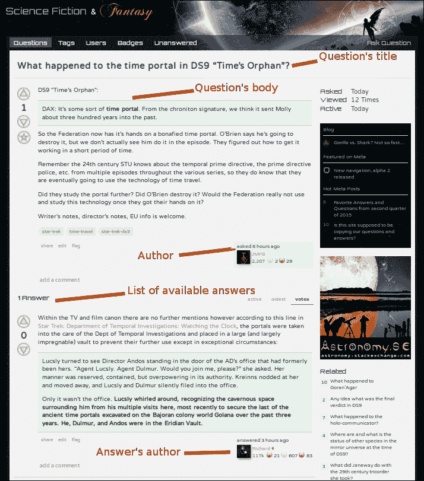
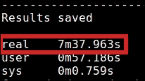
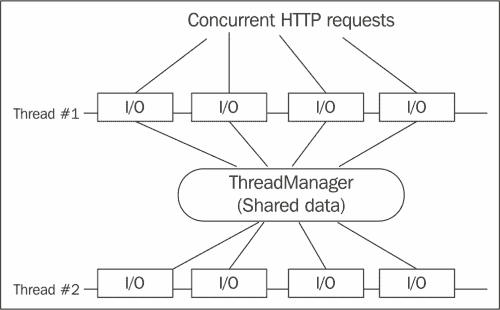
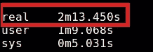
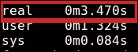
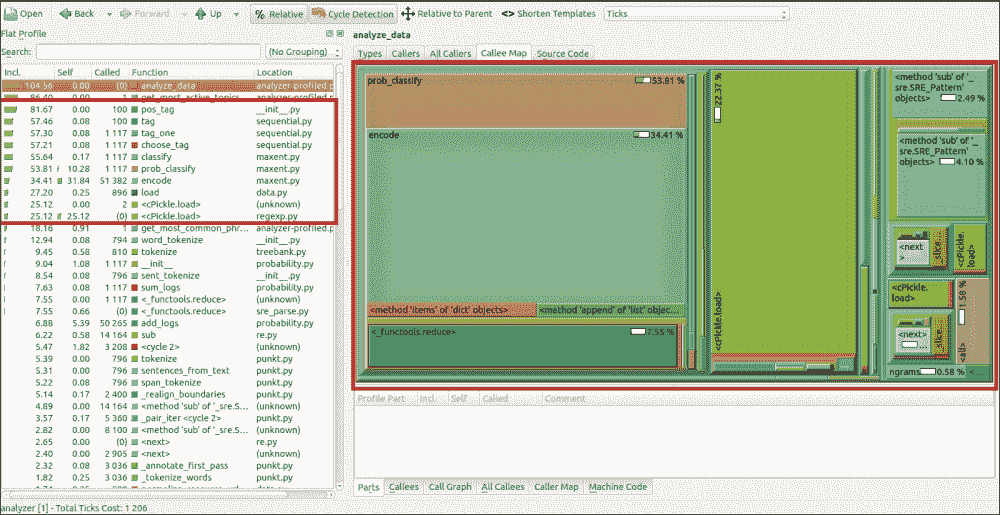
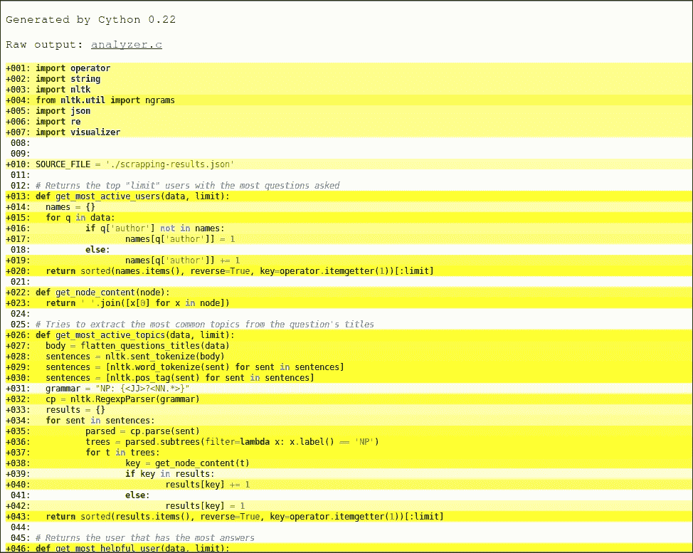
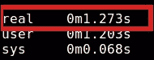

# 第八章. 知识应用

欢迎来到本书的最后一章。如果你已经走到这一步，你已经了解了几个优化技术，这些技术既适用于 Python 编程语言，也适用于其他类似技术。

你还阅读了关于配置文件和可视化这些结果的工具。我们还深入探讨了 Python 的一个特定用例，即用于科学目的的数值计算。你了解了允许你优化代码性能的工具。

在本章的最后，我们将讨论一个实际用例，该用例涵盖了我们在前面章节中介绍的所有技术（记住，我们看到的某些工具是替代品，所以同时使用所有这些工具并不是一个好的计划）。我们将编写代码的初始版本，测量其性能，然后进行优化过程，最终重写代码并再次测量性能。

# 要解决的问题

在我们甚至开始考虑编写代码的初始版本之前，我们需要理解我们试图解决的问题。

考虑到本书的范围，一个完整的应用程序可能是一项过于庞大的任务，因此我们将专注于一个小任务。这将使我们更好地控制我们想要做的事情，并且我们不会面临同时优化太多事物的风险。

为了保持趣味性，我们将问题分为以下两个部分：

+   **第一部分**：这将负责找到我们想要处理的数据。这不仅仅是从某个给定的 URL 下载的数据集。相反，我们将从网络中抓取它。

+   **第二部分**：这将专注于处理解决问题的第一部分后获得的数据。在这一步中，我们可能需要进行最耗 CPU 的计算，并从收集到的数据中计算一些统计数据。

在这两种情况下，我们将创建一个不考虑性能的代码初始版本来解决问题。之后，我们将单独分析每个解决方案，并尽可能改进它们。

## 从网络获取数据

我们将要抓取的网站是**科幻与奇幻**([`scifi.stackexchange.com/`](http://scifi.stackexchange.com/))。该网站致力于回答关于科幻和奇幻主题的问题。它类似于 StackOverflow，但专为科幻和奇幻爱好者设计。

更具体地说，我们希望抓取最新问题的列表。对于每个问题，我们将获取包含问题文本和所有可用答案的页面。在所有抓取和解析完成后，我们将以 JSON 格式保存相关信息，以便于后续处理。

记住，我们将处理 HTML 页面。然而，我们不想这样做。我们希望移除所有 HTML 代码，只保存以下项目：

+   问题的标题

+   问题的作者

+   问题的正文（问题的实际文本）

+   答案的正文（如果有）

+   答案的作者

使用这些信息，我们将能够进行一些有趣的后处理并获取一些相关的统计数据（稍后详细介绍）。

下面是一个此脚本输出应该看起来怎样的快速示例：

```py
{
  "questions": [
    {
      "title": "Ending of John Carpenter's The Thing",
      "body": "In the ending of John Carpenter's classic 1982 sci-fi horror film The Thing, is ...",
      "author": "JMFB",
      "answers": [
        {
          "body": "This is the million dollar question, ... Unfortunately, he is notoriously ... ",
           "author": "Richard",
        },
        {
          "body": "Not to point out what may seem obvious, but Childs isn't breathing. Note the total absence of ",
          "author": "user42"
          }
      ]
    },
    {
      "title": "Was it ever revealed what pedaling the bicycles in the second episode was doing?",
      "body": "I'm going to assume they were probably some sort of turbine...electricity...something, but I'd prefer to know for sure.",
       "author": "bartz",
      "answers": [
        {
          "body": "The Wikipedia synopsis states: most citizens make a living pedaling exercise bikes all day in order to generate power for their environment",
          "author": "Jack Nimble"
        }
      ]
    }
  ]
}
```

此脚本将负责将所有信息保存到一个单独的 JSON 文件中，该文件将在其代码中预先定义。

我们将尝试保持两个脚本的初始版本简单。这意味着使用最少的模块。在这种情况下，主要的模块列表如下：

+   **Beautiful Soup** ([`www.crummy.com/software/BeautifulSoup/`](http://www.crummy.com/software/BeautifulSoup/))：这个库用于解析 HTML 文件，主要是因为它提供了一个完整的解析 API，自动编码检测（如果你在这个行业工作的时间足够长，你可能已经讨厌这种自动编码检测了）以及使用选择器遍历解析树的能力。

+   **Requests** ([`docs.python-requests.org/en/latest/`](http://docs.python-requests.org/en/latest/))：这个库用于发起 HTTP 请求。尽管 Python 已经提供了完成此任务所需的模块，但此模块简化了 API，并提供了一种更 Pythonic 的方式来处理这个任务。

您可以使用`pip`命令行工具安装这两个模块：

```py
$ pip  install requests  beautifulsoup4

```

下面的截图显示了我们将抓取和解析以获取数据的页面示例：



## 数据后处理

第二个脚本将负责读取 JSON 编码的文件并从中获取一些统计数据。由于我们希望使其变得有趣，我们不会仅仅限制于统计每个用户的问题数量（尽管我们也会获取这个统计数据）。我们还将计算以下元素：

+   提问最多的前十位用户

+   回答最多的前十位用户

+   最常见的问题主题

+   最短的回答

+   最常见的十个短语

+   回答最多的前十道问题

由于本书的主要主题是性能而不是**自然语言处理**（**NLP**），我们不会深入探讨此脚本将涉及到的少量 NLP 细节。相反，我们将仅限于根据我们迄今为止对 Python 的了解来提高性能。

在此脚本的第一版本中，我们将使用的唯一非内置模块是**NLTK** ([`www.nltk.org`](http://www.nltk.org))，用于处理所有的 NLP 功能。

# 初始代码库

现在我们来列出所有将在未来优化的代码，基于之前的描述。

下面的第一个点相当简单：一个单文件脚本，负责抓取和以我们之前讨论的 JSON 格式保存。流程简单，顺序如下：

1.  它将逐页查询问题列表。

1.  对于每一页，它将收集问题的链接。

1.  然后，对于每个链接，它将收集之前列出的信息。

1.  它将转到下一页并重新开始。

1.  它最终将所有数据保存到一个 JSON 文件中。

以下代码如下：

```py
from bs4 import BeautifulSoup
import requests
import json

SO_URL = "http://scifi.stackexchange.com"
QUESTION_LIST_URL = SO_URL + "/questions"
MAX_PAGE_COUNT = 20

global_results = []
initial_page = 1 #first page is page 1

def get_author_name(body):
  link_name = body.select(".user-details a")
  if len(link_name) == 0:
    text_name = body.select(".user-details")
    return text_name[0].text if len(text_name) > 0 else 'N/A'
  else:
    return link_name[0].text

def get_question_answers(body):
  answers = body.select(".answer")
  a_data = []
  if len(answers) == 0:
    return a_data

  for a in answers:
    data = {
      'body': a.select(".post-text")[0].get_text(),
      'author': get_author_name(a)
    }
    a_data.append(data)
  return a_data

def get_question_data ( url ):
  print "Getting data from question page: %s " % (url)
  resp = requests.get(url)
  if resp.status_code != 200:
    print "Error while trying to scrape url: %s" % (url)
    return
  body_soup = BeautifulSoup(resp.text)
  #define the output dict that will be turned into a JSON structue
  q_data = {
    'title': body_soup.select('#question-header .question-hyperlink')[0].text,
    'body': body_soup.select('#question .post-text')[0].get_text(),
    'author': get_author_name(body_soup.select(".post-signature.owner")[0]),
    'answers': get_question_answers(body_soup)
  }
  return q_data

def get_questions_page ( page_num, partial_results ):
  print "====================================================="
  print " Getting list of questions for page %s" % (page_num)
  print "====================================================="

  url = QUESTION_LIST_URL + "?sort=newest&page=" + str(page_num)
  resp = requests.get(url)
  if resp.status_code != 200:
    print "Error while trying to scrape url: %s" % (url)
    return
  body = resp.text
  main_soup = BeautifulSoup(body)

  #get the urls for each question
  questions = main_soup.select('.question-summary .question-hyperlink')
  urls = [ SO_URL + x['href'] for x in questions]
  for url in urls:
    q_data = get_question_data(url)
    partial_results.append(q_data)
  if page_num < MAX_PAGE_COUNT:
    get_questions_page(page_num + 1, partial_results)

get_questions_page(initial_page, global_results)
with open('scrapping-results.json', 'w') as outfile:
  json.dump(global_results, outfile, indent=4)

print '----------------------------------------------------'
print 'Results saved'
```

通过查看前面的代码，你会注意到我们遵守了承诺。目前，我们只使用了建议的外部模块，以及内置在 Python 中的 JSON 模块。

另一方面，第二个脚本被分成两部分，主要是为了组织目的：

+   `analyzer.py`：此文件包含主要代码。它负责将 JSON 文件加载到 `dict` 结构中，并执行一系列计算。

+   `visualizer.py`：此文件仅包含用于可视化分析器不同结果的函数集。

现在，让我们看看这两个文件中的代码。第一组函数将是用于清理数据、将其加载到内存中等的功能：

```py
#analyzer.py
import operator
import string
import nltk
from nltk.util import ngrams
import json
import re
import visualizer

SOURCE_FILE = './scrapping-results.json'

# Load the json file and return the resulting dict
def load_json_data(file):
  with open(file) as input_file:
    return json.load(input_file)

def analyze_data(d):
  return {
    'shortest_answer': get_shortest_answer(d),
    'most_active_users': get_most_active_users(d, 10),
    'most_active_topics': get_most_active_topics(d, 10),
    'most_helpful_user': get_most_helpful_user(d, 10),
    'most_answered_questions': get_most_answered_questions(d, 10),
    'most_common_phrases':  get_most_common_phrases(d, 10, 4),
  }

# Creates a single, lower cased string from the bodies of all questions
def flatten_questions_body(data):
  body = []
  for q in data:
    body.append(q['body'])
  return '. '.join(body)

# Creates a single, lower cased string from the titles of all questions
def flatten_questions_titles(data):
  body = []
  pattern = re.compile('(\[|\])')
  for q in data:
    lowered = string.lower(q['title'])
    filtered = re.sub(pattern, ' ', lowered)
    body.append(filtered)
  return '. '.join(body)
```

以下一系列函数是实际执行 *计数* 数据并通过对 JSON 进行不同方式的分析来获取我们想要的统计信息的函数：

```py
# Returns the top "limit" users with the most questions asked
def get_most_active_users(data, limit):
  names = {}
  for q in data:
    if q['author'] not in names:
      names[q['author']] = 1
    else:
      names[q['author']] += 1
  return sorted(names.items(), reverse=True, key=operator.itemgetter(1))[:limit]

def get_node_content(node):
  return ' '.join([x[0] for x in node])

# Tries to extract the most common topics from the question's titles
def get_most_active_topics(data, limit):
  body = flatten_questions_titles(data)
  sentences = nltk.sent_tokenize(body)
  sentences = [nltk.word_tokenize(sent) for sent in sentences]
  sentences = [nltk.pos_tag(sent) for sent in sentences]
  grammar = "NP: {<JJ>?<NN.*>}"
  cp = nltk.RegexpParser(grammar)
  results = {}
  for sent in sentences:
    parsed = cp.parse(sent)
    trees = parsed.subtrees(filter=lambda x: x.label() == 'NP')
    for t in trees:
      key = get_node_content(t)
      if key in results:
        results[key] += 1
      else:
        results[key] = 1
  return sorted(results.items(), reverse=True, key=operator.itemgetter(1))[:limit]

# Returns the user that has the most answers
def get_most_helpful_user(data, limit):
  helpful_users = {}
  for q in data:
    for a in q['answers']:
      if a['author'] not in helpful_users:
        helpful_users[a['author']] = 1
      else:
        helpful_users[a['author']] += 1

  return sorted(helpful_users.items(), reverse=True, key=operator.itemgetter(1))[:limit]

# returns the top "limit" questions with the most amount of answers
def get_most_answered_questions(d, limit):
  questions = {}

  for q in d:
    questions[q['title']] = len(q['answers'])
  return sorted(questions.items(), reverse=True, key=operator.itemgetter(1))[:limit]

# Finds a list of the most common phrases of 'length' length
def get_most_common_phrases(d, limit, length):
  body = flatten_questions_body(d)
  phrases = {}
  for sentence in nltk.sent_tokenize(body):
    words = nltk.word_tokenize(sentence)
    for phrase in ngrams(words, length):
      if all(word not in string.punctuation for word in phrase):
        key = ' '.join(phrase)
        if key in phrases:
          phrases[key] += 1
        else:
         phrases[key] = 1

  return sorted(phrases.items(), reverse=True, key=operator.itemgetter(1))[:limit]

# Finds the answer with the least amount of characters
def get_shortest_answer(d):

  shortest_answer = {
    'body': '',
    'length': -1
  }
  for q in d:
    for a in q['answers']:
      if len(a['body']) < shortest_answer['length'] or shortest_answer['length'] == -1:
        shortest_answer = {
          'question': q['body'],
          'body': a['body'],
          'length': len(a['body'])
        }
  return shortest_answer
```

以下代码显示了如何使用之前声明的函数并显示其结果。这一切都归结为三个步骤：

1.  它将 JSON 数据加载到内存中。

1.  它处理数据并将结果保存到字典中。

1.  它遍历该字典以显示结果。

以下代码执行了前面的步骤：

```py
data_dict = load_json_data(SOURCE_FILE)

results = analyze_data(data_dict)

print "=== ( Shortest Answer ) === "
visualizer.displayShortestAnswer(results['shortest_answer'])

print "=== ( Most Active Users ) === "
visualizer.displayMostActiveUsers(results['most_active_users'])

print "=== ( Most Active Topics ) === "
visualizer.displayMostActiveTopics(results['most_active_topics'])

print "=== ( Most Helpful Users ) === "
visualizer.displayMostHelpfulUser(results['most_helpful_user'])

print "=== ( Most Answered Questions ) === "
visualizer.displayMostAnsweredQuestions(results['most_answered_questions'])

print "=== ( Most Common Phrases ) === "
visualizer.displayMostCommonPhrases(results['most_common_phrases'])
```

以下文件中的代码仅用于以人类友好的方式格式化输出：

```py
#visualizer.py
def displayShortestAnswer(data):
  print "A: %s" % (data['body'])
  print "Q: %s" % (data['question'])
  print "Length: %s characters" % (data['length'])

def displayMostActiveUsers(data):
  index = 1
  for u in data:
    print "%s - %s (%s)" % (index, u[0], u[1])
    index += 1

def displayMostActiveTopics(data):
  index = 1
  for u in data:
    print "%s - %s (%s)" % (index, u[0], u[1])
    index += 1

def displayMostHelpfulUser(data):
  index = 1
  for u in data:
    print "%s - %s (%s)" % (index, u[0], u[1])
    index += 1

def displayMostAnsweredQuestions(data):
  index = 1
  for u in data:
    print "%s - %s (%s)" % (index, u[0], u[1])
    index += 1

def displayMostCommonPhrases(data):
  index = 1
  for u in data:
    print "%s - %s (%s)" % (index, u[0], u[1])
    index += 1
```

## 分析代码

分析代码将分为两个步骤，就像我们之前所做的那样。对于每个项目，我们将分析代码，获取数字，考虑我们的优化选择，然后再次重构和测量代码的性能。

### 注意

如前所述的过程可能导致多次配置文件分析——重构——再次分析，我们将步骤限制在最终结果上。然而，请记住，这个过程是漫长的，需要花费时间。

### 抓取器

为了开始优化过程，我们首先需要获取一些测量数据，这样我们就可以将我们的更改与它们进行比较。

一个容易得到的数字是程序执行期间所花费的总时间（在我们的例子中，为了简单起见，我们将查询的总页数限制为 20）。

只需简单地使用 `time` 命令行工具，我们就可以得到这个数字：

```py
$ time python scraper.py

```

以下截图显示，我们有 7 分钟 30 秒的时间抓取和解析 20 页的问题，这相当于一个 3 MB 的 JSON 文件：



抓取脚本基本上是一个 I/O 密集型循环，以最小的处理从互联网上拉取数据。因此，我们可以在这里看到的第一个也是最有逻辑的优化是我们请求的缺乏并行化。由于我们的代码并不是真正 CPU 密集型的，我们可以安全地使用多线程模块（参考第五章 Multithreading versus Multiprocessing），并以最小的努力获得有趣的加速效果。

为了澄清我们将要做什么，以下图表显示了抓取脚本当前的状态：


我们的大部分运行时间都花在了 I/O 操作上，更具体地说，是我们为了获取问题列表和每个问题的页面而进行的 HTTP 请求。

正如我们之前看到的，可以使用多线程模块轻松并行化 I/O 操作。因此，我们将转换我们的脚本，使其类似于以下图示：



现在，让我们看看实际的优化代码。我们首先看看`ThreadManager`类，它将负责集中管理线程的配置以及整个并行过程的状态：

```py
from bs4 import BeautifulSoup
import requests
import json
import threading

SO_URL = "http://scifi.stackexchange.com"
QUESTION_LIST_URL = SO_URL + "/questions"
MAX_PAGE_COUNT = 20

class ThreadManager:
  instance = None
  final_results = []
  threads_done = 0
  totalConnections = 4 #Number of parallel threads working, will affect the total amount of pages per thread

  @staticmethod
  def notify_connection_end( partial_results ):
    print "==== Thread is done! ====="
    ThreadManager.threads_done += 1
    ThreadManager.final_results += partial_results
    if ThreadManager.threads_done == ThreadManager.totalConnections:
      print "==== Saving data to file! ===="
      with open('scrapping-results-optimized.json', 'w') as outfile:
        json.dump(ThreadManager.final_results, outfile, indent=4)
```

以下函数负责使用`BeautifulSoup`从页面抓取信息，无论是获取页面列表还是获取每个问题的实际信息：

```py
def get_author_name(body):
  link_name = body.select(".user-details a")
  if len(link_name) == 0:
    text_name = body.select(".user-details")
    return text_name[0].text if len(text_name) > 0 else 'N/A'
  else:
    return link_name[0].text

def get_question_answers(body):
  answers = body.select(".answer")
  a_data = []
  if len(answers) == 0:
    return a_data

  for a in answers:
    data = {
      'body': a.select(".post-text")[0].get_text(),
      'author': get_author_name(a)
    }
    a_data.append(data)
  return a_data

def get_question_data ( url ):
  print "Getting data from question page: %s " % (url)
  resp = requests.get(url)
  if resp.status_code != 200:
    print "Error while trying to scrape url: %s" % (url)
    return
  body_soup = BeautifulSoup(resp.text)
  #define the output dict that will be turned into a JSON structue
  q_data = {
    'title': body_soup.select('#question-header .question-hyperlink')[0].text,
    'body': body_soup.select('#question .post-text')[0].get_text(),
    'author': get_author_name(body_soup.select(".post-signature.owner")[0]),
    'answers': get_question_answers(body_soup)
  }
  return q_data

def get_questions_page ( page_num, end_page, partial_results  ):
  print "====================================================="
  print " Getting list of questions for page %s" % (page_num)
  print "====================================================="

  url = QUESTION_LIST_URL + "?sort=newest&page=" + str(page_num)
  resp = requests.get(url)
  if resp.status_code != 200:
    print "Error while trying to scrape url: %s" % (url)
  else:
    body = resp.text
    main_soup = BeautifulSoup(body)

    #get the urls for each question
    questions = main_soup.select('.question-summary .question-hyperlink')
    urls = [ SO_URL + x['href'] for x in questions]
    for url in urls:
      q_data = get_question_data(url)
     partial_results.append(q_data)
  if page_num + 1 < end_page:
    get_questions_page(page_num + 1,  end_page, partial_results)
  else:
    ThreadManager.notify_connection_end(partial_results)
pages_per_connection = MAX_PAGE_COUNT / ThreadManager.totalConnections
for i in range(ThreadManager.totalConnections):
 init_page = i * pages_per_connection
 end_page = init_page + pages_per_connection
 t = threading.Thread(target=get_questions_page,
 args=(init_page, end_page, [],  ),
 name='connection-%s' % (i))
  t.start()
```

上一段代码中突出显示的部分显示了最初脚本所做的主要更改。我们不是从第 1 页开始逐页前进，而是启动一个预配置的线程数量（直接使用`threading.Thread`类），这些线程将并行调用我们的`get_question_page`函数。我们唯一需要做的就是将那个函数作为每个新线程的目标。

之后，我们还需要一种方法来集中管理配置参数和每个线程的临时结果。为此，我们创建了`ThreadManager`类。

通过这个改变，我们的时间从 7 分钟标记下降到 2 分 13 秒，如下面的截图所示：



调整线程数量，例如，可能会带来更好的数字，但主要的改进已经实现。

## 分析器

与抓取器相比，分析器的代码有所不同。我们不是有一个重 I/O 绑定的脚本，而是相反：一个 CPU 绑定的脚本。它进行的 I/O 操作非常少，主要是读取输入文件和输出结果。因此，我们将更详细地关注测量。

让我们首先进行一些基本测量，以便我们知道我们的位置：



前面的截图显示了`time`命令行工具的输出。因此，现在我们有一个基数可以工作，我们知道我们需要将执行时间降低到 3.5 秒以下。

第一种方法将是使用`cProfile`并从代码内部开始获取一些数字。这应该有助于我们获得程序的一般概述，从而开始了解我们的痛点在哪里。输出看起来像以下截图：



前面的截图中有两个感兴趣的区域：

+   在左侧，我们可以看到函数及其消耗的时间。请注意，列表的大部分由外部函数组成，主要是来自`nltk`模块的函数（前两个只是下面其他函数的消费者，所以它们并不真正重要）。

+   在右侧，**调用者映射**看起来非常复杂，难以解释（更不用说，其中列出的大多数函数都不是来自我们的代码，而是来自我们使用的库）。

话虽如此，直接改进我们的代码似乎不会是一件简单的事情。相反，我们可能想要走另一条路：既然我们在做很多计数，我们可能从使用类型化代码中受益。所以，让我们尝试使用 Cython。

使用 Cython 命令行工具进行初步分析显示，我们的大部分代码不能直接翻译成 C 语言，如下面的截图所示：



上一张截图显示了我们对代码分析的一部分。我们可以清楚地看到，大部分屏幕被较深的线条填充，这表明我们的大部分代码不能直接翻译成 C 语言。遗憾的是，这是因为我们在大多数函数中处理的是复杂对象，所以我们对此无能为力。

尽管如此，仅仅通过使用 Cython 编译我们的代码，我们就得到了更好的结果。所以，让我们看看我们需要如何修改源代码，以便我们可以使用 Cython 编译它。第一个文件基本上与原始分析器相同，代码中的更改被突出显示，并且没有实际的功能调用，因为我们现在正在将其转换为外部库：

```py
#analyzer_cython.pyx
import operator
import string
import nltk
from nltk.util import ngrams
import json
import re

SOURCE_FILE = './scrapping-results.json'

# Returns the top "limit" users with the most questions asked
def get_most_active_users(data, int limit ):
  names = {}
  for q in data:
    if q['author'] not in names:
      names[q['author']] = 1
    else:
      names[q['author']] += 1
  return sorted(names.items(), reverse=True, key=operator.itemgetter(1))[:limit]

def get_node_content(node):
  return ' '.join([x[0] for x in node])

# Tries to extract the most common topics from the question's titles
def get_most_active_topics(data, int limit ):
  body = flatten_questions_titles(data)
  sentences = nltk.sent_tokenize(body)
  sentences = [nltk.word_tokenize(sent) for sent in sentences]
  sentences = [nltk.pos_tag(sent) for sent in sentences]
  grammar = "NP: {<JJ>?<NN.*>}"
  cp = nltk.RegexpParser(grammar)
  results = {}
  for sent in sentences:
    parsed = cp.parse(sent)
    trees = parsed.subtrees(filter=lambda x: x.label() == 'NP')
    for t in trees:
      key = get_node_content(t)
      if key in results:
        results[key] += 1
      else:
        results[key] = 1
  return sorted(results.items(), reverse=True, key=operator.itemgetter(1))[:limit]

# Returns the user that has the most answers
def get_most_helpful_user(data, int limit ):
  helpful_users = {}
  for q in data:
    for a in q['answers']:
      if a['author'] not in helpful_users:
        helpful_users[a['author']] = 1
      else:
        helpful_users[a['author']] += 1

  return sorted(helpful_users.items(), reverse=True, key=operator.itemgetter(1))[:limit]

# returns the top "limit" questions with the most amount of answers
def get_most_answered_questions(d, int limit ):
  questions = {}

  for q in d:
    questions[q['title']] = len(q['answers'])
  return sorted(questions.items(), reverse=True, key=operator.itemgetter(1))[:limit]

# Creates a single, lower cased string from the bodies of all questions
def flatten_questions_body(data):
  body = []
  for q in data:
    body.append(q['body'])
  return '. '.join(body)

# Creates a single, lower cased string from the titles of all questions
def flatten_questions_titles(data):
  body = []
  pattern = re.compile('(\[|\])')
  for q in data:
    lowered = string.lower(q['title'])
    filtered = re.sub(pattern, ' ', lowered)
    body.append(filtered)
  return '. '.join(body)

# Finds a list of the most common phrases of 'length' length
def get_most_common_phrases(d, int limit , int length ):
  body = flatten_questions_body(d)
  phrases = {}
  for sentence in nltk.sent_tokenize(body):
    words = nltk.word_tokenize(sentence)
    for phrase in ngrams(words, length):
      if all(word not in string.punctuation for word in phrase):
        key = ' '.join(phrase)
        if key in phrases:
          phrases[key] += 1
        else:
          phrases[key] = 1

  return sorted(phrases.items(), reverse=True, key=operator.itemgetter(1))[:limit]

# Finds the answer with the least amount of characters
def get_shortest_answer(d):
  cdef int shortest_length = 0;

  shortest_answer = {
    'body': '',
    'length': -1
  }
  for q in d:
    for a in q['answers']:
 if len(a['body']) < shortest_length or shortest_length == 0:
 shortest_length = len(a['body'])
        shortest_answer = {
          'question': q['body'],
          'body': a['body'],
          'length': shortest_length
        }
  return shortest_answer

# Load the json file and return the resulting dict
def load_json_data(file):
  with open(file) as input_file:
    return json.load(input_file)

def analyze_data(d):
  return {
    'shortest_answer': get_shortest_answer(d),
    'most_active_users': get_most_active_users(d, 10),
    'most_active_topics': get_most_active_topics(d, 10),
    'most_helpful_user': get_most_helpful_user(d, 10),
    'most_answered_questions': get_most_answered_questions(d, 10),
    'most_common_phrases':  get_most_common_phrases(d, 10, 4),
  }
```

以下文件是负责为 Cython 编译我们的代码设置一切所需的文件，我们之前已经见过这段代码（参考第六章，*通用优化选项*）：

```py
#analyzer-setup.py
from distutils.core import setup
from Cython.Build import cythonize

setup(
  name = 'Analyzer app',
  ext_modules = cythonize("analyzer_cython.pyx"),
)
```

最后一个文件是使用我们新导入的编译模块的外部库的文件。该文件调用`load_json_data`和`analyze_data`方法，并最终使用可视化模块来格式化输出：

```py
#analyzer-use-cython.py
import analyzer_cython as analyzer
import visualizer

data_dict = analyzer.load_json_data(analyzer.SOURCE_FILE)

results = analyzer.analyze_data(data_dict)

print "=== ( Shortest Answer ) === "
visualizer.displayShortestAnswer(results['shortest_answer'])

print "=== ( Most Active Users ) === "
visualizer.displayMostActiveUsers(results['most_active_users'])

print "=== ( Most Active Topics ) === "
visualizer.displayMostActiveTopics(results['most_active_topics'])

print "=== ( Most Helpful Users ) === "
visualizer.displayMostHelpfulUser(results['most_helpful_user'])

print "=== ( Most Answered Questions ) === "
visualizer.displayMostAnsweredQuestions(results['most_answered_questions'])

print "=== ( Most Common Phrases ) === "
visualizer.displayMostCommonPhrases(results['most_common_phrases'])
```

以下代码可以使用以下行进行编译：

```py
$ python analyzer-setup.py build_ext –inplace

```

然后，通过运行`analyzer-use-cython.py`脚本，我们将得到以下执行时间：



时间从 3.5 秒下降到 1.3 秒。这比仅仅重新组织我们的代码并使用 Cython 编译（如我们在第六章中看到的）有了相当大的改进。这种简单的编译可以产生很好的结果。

代码可以被进一步分解和重写，以消除对复杂结构的绝大部分需求，从而允许我们为所有变量声明原始类型。我们甚至可以尝试移除`nltk`并使用一些用 C 语言编写的 NLP 库，例如 OpenNLP ([`opennlp.sourceforge.net/projects.html`](http://opennlp.sourceforge.net/projects.html))。

# 摘要

你已经到达了本章的结尾，也是这本书的结尾。本章提供的例子旨在展示如何使用前几章中介绍的技术来分析和改进随机的一段代码。

由于并非所有技术都相互兼容，因此并非所有技术都适用于此处。然而，我们能够看到其中一些技术是如何工作的，更具体地说，是多线程、使用`cProfile`和`kcachegrind`进行性能分析，以及最终使用 Cython 进行编译。

感谢您阅读，并希望您能享受这本书！
