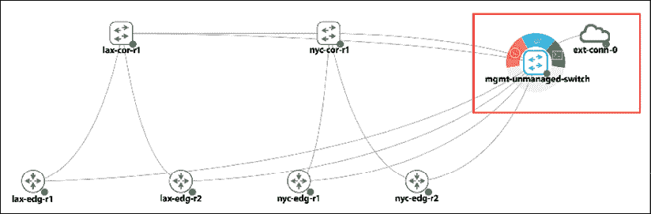
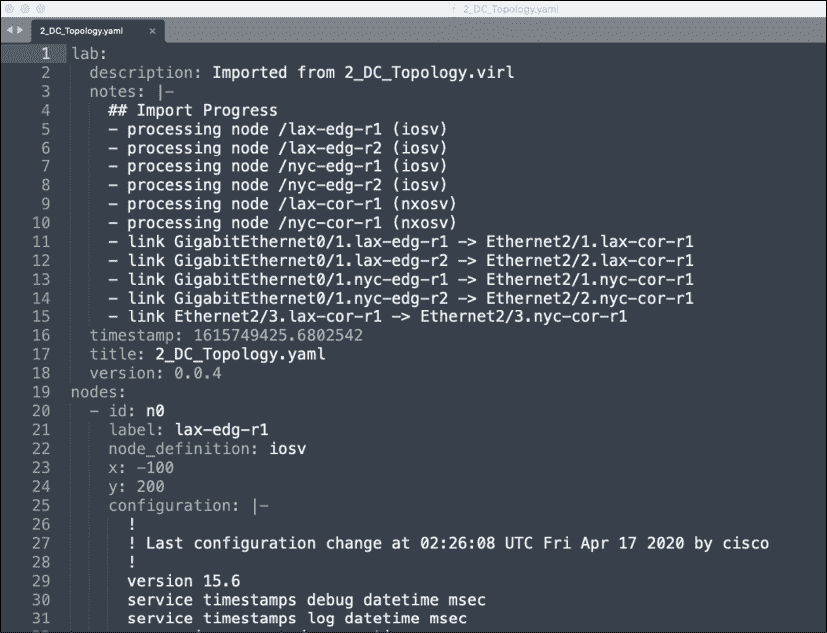
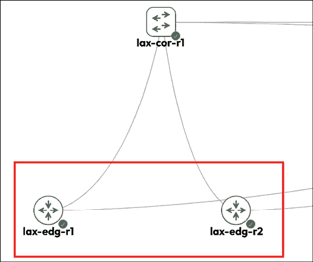

# 2

# 低级网络设备交互

在第一章中，我们回顾了 TCP/IP 协议套件和 Python，我们探讨了网络通信协议背后的理论和规范。我们还快速浏览了 Python 语言。在本章中，我们将开始深入探讨使用 Python 管理网络设备。特别是，我们将检查我们可以使用 Python 以编程方式与传统的网络路由器和交换机通信的不同方式。

我所说的传统网络路由器和交换机是什么意思？虽然现在很难想象一个没有用于程序化通信的**应用程序编程接口**（**API**）的网络设备，但众所周知，许多在几年前部署的网络设备并没有包含 API 接口。这些设备的预期管理方式是通过使用终端程序（这些程序最初是为人类工程师开发的）的**命令行界面**（**CLIs**）。管理依赖于工程师对设备返回数据的解释来采取适当的行动。正如可以想象的那样，随着网络设备和网络复杂性的增加，手动逐个管理它们变得越来越困难。

Python 有几个非常棒的库和框架可以帮助完成这些任务，例如 Pexpect、Paramiko、Netmiko、NAPALM 和 Nornir 等。值得注意的是，这些库在代码、依赖项和项目维护者方面存在一些重叠。例如，Netmiko 库是由 Kirk Byers 在 2014 年基于 Paramiko SSH 库创建的。Carl Montanari 创建了 Scrapli 库，以利用最新的 Python 3 asyncio 并发功能。近年来，Kirk、Carl、NAPALM 项目的 David Barroso 以及其他一些人合作创建了令人惊叹的 Nornir 框架，以提供一个纯 Python 网络自动化框架。

大多数情况下，这些库足够灵活，可以一起使用或单独使用。例如，Ansible（在第四章中介绍，*Python 自动化框架 – Ansible*）使用 Paramiko 和 Ansible-NAPALM 作为其网络模块的底层库。

由于现在存在如此多的库，不可能在合理的页数内涵盖所有这些库。在本章中，我们将首先介绍 Pexpect，然后通过 Paramiko 的示例继续。一旦我们了解了 Paramiko 的基本和操作，就很容易扩展到其他库，如 Netmiko 和 NAPALM。在本章中，我们将探讨以下主题：

+   命令行界面的挑战

+   构建虚拟实验室

+   Python Pexpect 库

+   Python Paramiko 库

+   其他库的示例

+   Pexpect 和 Paramiko 的缺点

我们简要讨论了通过命令行界面管理网络设备的不足。这在管理中等规模的网络中已被证明是无效的。本章将介绍可以与这种限制一起工作的 Python 库。首先，让我们更详细地讨论一些 CLI 的挑战。

# 命令行的挑战

我在 2000 年代初在 ISP 帮助台开始了我的 IT 职业生涯。我记得看着网络工程师在文本终端中输入看似神秘的命令。就像魔法一样，网络设备就会按照他们的意愿弯曲，并以他们期望的方式表现。随着时间的推移，我学会了接受并拥抱这些我可以输入到终端中的魔法命令。作为网络工程师，这些基于 CLI 的命令就像我们在我们称之为网络工程的世界中相互分享的秘密代码。手动输入命令只是我们为了完成任务而必须做的事情，无伤大雅。

然而，正是在 2014 年左右，我们开始看到业界就明确需要从手动、以人为驱动的 CLIs 转向自动、以计算机为中心的自动化 API 达成共识。不要误解，我们在进行网络设计、提出初步的概念验证和首次部署拓扑结构时，仍然需要直接与设备进行通信。然而，一旦网络部署完成，网络管理的需求现在是一致地、可靠地在所有网络设备上做出相同的更改。

这些更改需要无错误，工程师需要重复步骤而不会被分心或感到疲倦。这种需求听起来像是计算机和我们所喜爱的编程语言 Python 的理想工作。

当然，如果网络设备只能通过命令行进行管理，那么主要挑战就变成了我们如何能够通过计算机程序自动复制路由器和管理员之间的先前手动交互。在命令行中，路由器会输出一系列信息，并期望管理员根据工程师对输出的解释输入一系列手动命令。例如，在 Cisco **Internetwork Operating System** (**IOS**) 设备中，你必须输入 *enable* 进入特权模式，在接收到带有 `#` 符号的返回提示后，然后输入 `configure terminal` 以进入配置模式。同样的过程可以进一步扩展到接口配置模式和路由协议配置模式。这与计算机驱动的、程序化的思维方式形成鲜明对比。当计算机想要完成单个任务时，比如，在接口上放置 IP 地址，它希望一次性结构化地给出所有信息给路由器，并期望从路由器那里得到一个单一的 *yes* 或 *no* 答案来指示任务的成败。

解决方案，如 Pexpect 和 Paramiko 所实施的，是将交互过程视为子进程，并监控子进程与目标设备之间的交互。根据返回值，父进程将决定后续操作，如果有必要的话。

我相信我们所有人都迫不及待地想要开始使用 Python 库，但首先，我们需要构建我们的网络实验室，以便有一个网络来测试我们的代码。我们将从探讨我们可以构建网络实验室的不同方式开始。

# 构建虚拟实验室

在我们深入研究 Python 库和框架之前，让我们先探讨一下构建实验室以供学习之用的选项。正如古老的谚语所说，“熟能生巧”——我们需要一个隔离的沙盒来安全地犯错，尝试新的做事方式，并重复一些步骤以强化第一次尝试中不清楚的概念。

要构建一个网络实验室，我们基本上有两种选择：物理设备或虚拟设备。让我们看看各自选项的优缺点。

## 物理设备

此选项包括使用您可以看到和触摸的物理网络设备来构建实验室。如果您足够幸运，甚至可能构建一个与您的生产环境完全相同的实验室。物理实验室的优缺点如下：

+   **优点**：从实验室到生产的过渡很容易。拓扑结构对于经理和需要查看和操作设备的工程师来说更容易理解。由于熟悉，对物理设备的舒适度极高。

+   **缺点**：为仅用于实验室的设备付费相对较贵。此外，物理设备需要工程时间进行安装和堆叠，一旦构建完成，其灵活性就不高了。

## 虚拟设备

虚拟设备是实际网络设备的仿真或模拟。它们可能由供应商或开源社区提供。虚拟设备的优缺点如下：

+   **优点**：虚拟设备更容易设置，相对便宜，并且可以快速更改拓扑结构。

+   **缺点**：它们通常是物理设备的缩小版。有时虚拟设备和物理设备之间存在功能差距。

当然，决定使用虚拟实验室还是物理实验室是一个个人决定，这是在成本、实施难度和实验室与生产环境之间差距的风险之间权衡的结果。在我工作的一些地方，虚拟实验室用于进行初步的概念验证，而物理实验室则用于我们接近最终设计时使用。

在我看来，随着越来越多的厂商决定生产虚拟设备，虚拟实验室是在学习环境中前进的正确方式。虚拟设备的功能差距相对较小，并且有具体的文档记录，尤其是当虚拟实例由厂商提供时。与购买物理设备相比，虚拟设备的花费相对较小。使用虚拟设备构建所需的时间要短得多，因为它们只是软件程序。

对于这本书，我将使用物理设备和虚拟设备的组合来展示概念，更倾向于使用虚拟设备。对于我们将看到的示例，差异应该是透明的。如果虚拟设备和物理设备之间存在任何与我们的目标相关的已知差异，我将确保列出它们。

对于书中的代码示例，我将尝试使网络拓扑尽可能简单，同时仍然能够展示手头的概念。每个虚拟网络通常由不超过几个节点组成，如果可能的话，我们将重复使用相同的虚拟网络进行多个实验室。

对于本书中的示例，我将使用思科建模实验室，[`www.cisco.com/c/en/us/products/cloud-systems-management/modeling-labs/index.html`](https://www.cisco.com/c/en/us/products/cloud-systems-management/modeling-labs/index.html)，以及其他虚拟平台，例如 Arista vEOS。正如我们将在下一节中看到的，思科根据可用性提供付费版本的 CML 和免费托管版本的 CML 在 Cisco DevNet ([`developer.cisco.com/site/devnet/`](https://developer.cisco.com/site/devnet/))。使用 CML 是可选的。您可以使用您拥有的任何实验室设备，但这可能有助于您更好地跟随书中的示例。还值得注意的是，思科对设备镜像有严格的软件许可要求，因此通过购买或使用免费托管的 CML，您不太可能违反他们的软件许可要求。

## 思科建模实验室

我记得当我第一次开始为我的**思科认证网络专家**（**CCIE**）实验室考试做准备时，我从 eBay 上购买了一些二手的思科设备来学习。即使有二手设备的折扣，每个路由器和交换机仍然要花费数百美元。为了省钱，我购买了一些 20 世纪 80 年代的过时思科路由器（在您最喜欢的搜索引擎中搜索 Cisco AGS 路由器，会有很多好笑的内容），它们在实验室标准下功能严重不足。尽管当我打开它们时与家人聊天很有趣（它们真的很响），但组装物理设备并不好玩。它们又重又笨拙，连接所有电缆都很痛苦，为了引入链路故障，我实际上必须拔掉一根电缆。

快进几年。Dynamips 被创建出来，我爱上了创建不同网络场景的简便性。这在尝试学习新概念时尤为重要。我所需要的只是思科的 IOS 镜像和一些精心构建的拓扑文件，我就能轻松构建一个虚拟网络来测试我的知识。我有一个包含网络拓扑、预先保存的配置和不同场景所需的不同版本镜像的整个文件夹。添加 GNS3 前端为整个设置提供了一个漂亮的 GUI 界面升级。使用 GNS3，你可以直接点击并拖动你的链接和设备；你甚至可以直接从 GNS3 设计面板打印出网络拓扑图给你的经理或客户。GNS3 的唯一缺点是工具没有得到思科的官方认可，因此它被认为缺乏可信度。

2015 年，思科社区决定通过发布思科的**虚拟互联网路由实验室**（**VIRL**），[`learningnetwork.cisco.com/s/virl`](https://learningnetwork.cisco.com/s/virl)来满足这一需求。这很快成为我在开发、学习和实践网络自动化代码时的首选工具。

在 VIRL 推出几年后，思科发布了**Cisco Modeling Labs**（**CML**），[`developer.cisco.com/modeling-labs/`](https://developer.cisco.com/modeling-labs/)。这是一个功能强大的网络仿真平台，拥有易于使用的 HTML 用户界面和全面的 API。

在撰写本文时，CML 的单用户许可证价格为 199 美元（请注意，在思科 DevNet 上有一个免费的托管版本）。在我看来，CML 平台与其他替代方案相比提供了一些优势，而且价格非常划算：

+   **易用性**：如前所述，所有 IOSv、IOS-XRv、NX-OSv、ASAv 和其他镜像的图像都包含在一个单独的下载中。

+   **官方**：CML 是思科内部和网络工程社区广泛使用的工具。事实上，CML 被广泛用于新的思科 DevNet 专家实验室考试。由于其受欢迎程度，错误得到快速修复，新功能得到仔细记录，有用知识在用户之间广泛共享。

+   **第三方 KVM 镜像集成**：CML 允许用户上传默认未捆绑的第三方虚拟机镜像，例如 Windows 虚拟机。

+   **其他功能**：CML 工具还提供了许多其他功能，例如仪表板列表视图、多用户分组、Ansible 集成和 pyATS 集成。

我们在这本书中不会使用所有 CML 功能，但知道这个工具功能丰富且不断更新是很令人高兴的。再次强调，对于本书中的示例，拥有一个实验室来跟随是很重要的，但它不需要是思科 CML。本书中提供的代码示例应该适用于任何实验室设备，只要它运行相同的软件类型和版本。

### CML 技巧

CML 网站（[`developer.cisco.com/modeling-labs/`](https://developer.cisco.com/modeling-labs/））和文档（[https://developer.cisco.com/docs/modeling-labs/](https://developer.cisco.com/docs/modeling-labs/））提供了从安装到使用的许多指导和信息。实验室拓扑将包含在书籍 GitHub 仓库的相关章节中（[https://github.com/PacktPublishing/Mastering-Python-Networking-Fourth-Edition](https://github.com/PacktPublishing/Mastering-Python-Networking-Fourth-Edition)）。实验室镜像可以直接通过**导入**按钮导入到实验室中：


图 2.1：CML 控制台镜像实验室镜像

对于实验室，每个设备的管理接口都将连接到一个无管理交换机，该交换机再连接到外部连接以供访问：



图 2.2：用于管理接口访问的无管理交换机

你需要更改管理接口的 IP 地址以适应你自己的实验室架构。例如，在*第二章*的`2_DC_Topology.yaml`文件中，`lax-edg-r1 GigabitEthernet0/0 0`的 IP 地址是`192.168.2.51`。你需要根据你自己的实验室更改这个 IP 地址。

如果你使用的是除 CML 之外的虚拟实验室软件，你可以用任何文本编辑器（例如下面的 Sublime Text）打开拓扑文件，并查看每个设备的配置。然后你可以将配置复制并粘贴到自己的实验室设备中：



图 2.3：使用文本编辑器查看的拓扑文件

我们在本节前面简要介绍了思科 DevNet。让我们在下一节中更深入地探讨 DevNet。

## 思科 DevNet

思科 DevNet（[`developer.cisco.com/site/devnet/`](https://developer.cisco.com/site/devnet/））是思科网络自动化资源的首选一站式网站。注册免费，并提供免费远程实验室、免费视频课程、指导学习路径、文档等。

如果你还没有自己的实验室或者想要尝试新技术，思科 DevNet 沙盒（[https://developer.cisco.com/site/sandbox/](https://developer.cisco.com/site/sandbox/））是一个很好的替代方案。一些实验室总是可用，而其他则需要预订。实验室的可用性将取决于使用情况。

图 2.4：思科 DevNet 沙盒

自从成立以来，思科 DevNet 已经成为思科网络可编程性和自动化相关事宜的事实上目的地。如果你对追求思科自动化认证感兴趣，DevNet 提供了从助理到专家级别的不同验证路径；更多信息可以在[`developer.cisco.com/certification/`](https://developer.cisco.com/certification/)找到。

## GNS3 和其他

我还使用过一些其他的虚拟实验室，并且会推荐它们。GNS3 就是其中之一：


图 2.5：GNS3 网站

如前所述，GNS3 是我们许多人用来准备认证考试和练习实验室的工具。这个工具已经从最初作为 Dynamips 的简单前端发展到成为一个可行的商业产品。GNS3 是供应商中立的，如果我们想建立一个多厂商实验室，这会很有帮助。这通常是通过克隆镜像（例如 Arista vEOS）或通过其他虚拟机管理程序（例如 KVM）直接启动网络设备镜像来完成。

另一个获得许多好评的多厂商网络仿真环境是**仿真虚拟环境下一代**（**Eve-NG**）：[`www.eve-ng.net/`](http://www.eve-ng.net/)。我个人对这个工具的经验不足，但我的许多同行和行业内的朋友都使用它来建立他们的网络实验室。如果你熟悉容器，containerlab ([`containerlab.dev/`](https://containerlab.dev/))也可以作为你的一个替代选择。

还有其他一些独立的虚拟化平台，例如 Arista vEOS ([`www.arista.com/en/cg-veos-router/veos-router-overview`](https://www.arista.com/en/cg-veos-router/veos-router-overview))、Juniper vMX ([`www.juniper.net/us/en/products/routers/mx-series/vmx-virtual-router-software.html`](https://www.juniper.net/us/en/products/routers/mx-series/vmx-virtual-router-software.html))和 Nokia SR-Linux ([`www.nokia.com/networks/data-center/service-router-linux-NOS/`](https://www.nokia.com/networks/data-center/service-router-linux-NOS/))，你可以在测试期间将它们用作独立的虚拟设备。

它们是测试特定平台功能的优秀补充工具。其中许多在公共云提供商市场上作为付费产品提供，以便更容易访问。

现在我们已经建立了我们的网络实验室，我们可以开始尝试使用可以帮助管理和自动化的 Python 库。我们将从启用 Python 虚拟环境开始。然后我们将安装并使用 Pexpect 库进行一些示例。

# Python 虚拟环境

让我们首先使用 Python 虚拟环境。Python 虚拟环境允许我们通过创建一个“虚拟”隔离的 Python 安装并在其中安装包来管理不同项目的独立包安装。通过使用虚拟环境，我们不需要担心破坏全局或来自其他虚拟环境的已安装包。我们将首先安装`python3.10-venv`包，然后创建虚拟环境本身：

```py
$ sudo apt update
$ sudo apt install python3.10-venv
$ python3 -m venv venv 
$ source venv/bin/activate
(venv) $
(venv) $ deactivate 
```

从输出中，我们看到我们使用了安装中的 `venv` 模块，创建了一个名为`venv`的虚拟环境，然后激活了它。当虚拟环境激活时，你将在主机名前看到（`venv`）标签，这表明你处于该虚拟环境中。完成工作后，你可以使用 `deactivate` 命令退出虚拟环境。如果你感兴趣，可以在这里了解更多关于 Python 虚拟环境的信息：[`packaging.python.org/guides/installing-using-pip-and-virtual-environments/#installing-virtualenv`](https://packaging.python.org/guides/installing-using-pip-and-virtual-environments/#installing-virtualenv)。

在你开始编写代码之前，始终要激活虚拟环境以隔离环境。

一旦我们激活了虚拟环境，我们就可以继续安装 Pexpect 库。

# Python pexpect 库

Pexpect 是一个用于派生子应用程序、控制它们并对它们输出中的预期模式做出响应的纯 Python 模块。Pexpect 的工作方式类似于 Don Libes 的 `Expect`。Pexpect 允许我们的脚本派生一个子应用程序，并像人类输入命令一样控制它；更多详细信息可以在 Pexpect 的文档页面上找到：[`pexpect.readthedocs.io/en/stable/index.html`](https://pexpect.readthedocs.io/en/stable/index.html)。

现在，我们通常使用像 Nornir 这样的库来抽象逐行、低级别的交互。然而，至少在高级别上理解这种交互仍然是有用的。如果你是那种不耐烦的人，只需快速浏览以下 Pexpect 和 Paramiko 部分。

与 Don Libes 的原始 **工具命令语言**（**TCL**）`Expect` 模块类似，Pexpect 启动或派生另一个进程，并监视它以控制交互。Expect 工具最初是为了自动化交互式过程，如 FTP、Telnet 和 rlogin 而开发的，后来扩展到包括网络自动化。与原始 Expect 不同，Pexpect 完全用 Python 编写，不需要编译 TCL 或 C 扩展。这使我们能够在代码中使用熟悉的 Python 语法及其丰富的标准库。 

## Pexpect 安装

Pexpect 的安装过程很简单：

```py
(venv) $ pip install pexpect 
```

让我们快速测试一下以确保包可用；确保我们从虚拟环境启动 Python 交互式外壳：

```py
(venv) $ python
Python 3.10.4 (main, Jun 29 2022, 12:14:53) [GCC 11.2.0] on linux
Type "help", "copyright", "credits" or "license" for more information.
>>> import pexpect
>>> dir(pexpect)
['EOF', 'ExceptionPexpect', 'Expecter', 'PY3', 'TIMEOUT', '__all__', '__builtins__', '__cached__', '__doc__', '__file__', '__loader__', '__name__', '__package__', '__path__', '__revision__', '__spec__', '__version__', 'exceptions', 'expect', 'is_executable_file', 'pty_spawn', 'run', 'runu', 'searcher_re', 'searcher_string', 'spawn', 'spawnbase',
 'spawnu', 'split_command_line', 'sys', 'utils', 'which']
    >>> exit() 
```

## Pexpect 概述

对于本章，我们将使用 `2_DC_Topology` 并在两个 IOSv 设备 **lax-edg-r1** 和 **lax-edg-r2** 上进行工作：



图 2.6：lax-edg-r1 和 lax-edg-r2

每个设备都将有一个位于 `192.16.2.x/24` 范围内的管理地址。在示例中，`lax-edg-r1` 将有 `192.168.2.51`，而 `lax-edg-r2` 将有 `192.168.2.52` 作为管理 IP。如果这是设备第一次开机，它将需要生成一个 RSA 密钥用于 SSH：

```py
lax-edg-r2(config)#crypto key generate rsa 
```

对于较旧的 IOSv 软件镜像，我们可能还需要根据您的平台在`ssh`配置（`~/.ssh/config`）中添加以下行：

```py
Host 192.168.2.51
  HostKeyAlgorithms +ssh-rsa
  KexAlgorithms +diffie-hellman-group-exchange-sha1
Host 192.168.2.52
  HostKeyAlgorithms +ssh-rsa
  KexAlgorithms +diffie-hellman-group-exchange-sha1 
```

设备准备就绪后，让我们看看如果你通过 telnet 连接到设备，你会如何与之交互：

```py
(venv) $ $ telnet 192.168.2.51
Trying 192.168.2.51...
Connected to 192.168.2.51.
Escape character is '^]'.
<skip>
User Access Verification
Username: cisco
Password: 
```

设备配置使用用户名`cisco`，密码也是`cisco`。请注意，由于配置中分配的权限，用户已经处于特权模式：

```py
lax-edg-r1#sh run | i cisco
enable password cisco
username cisco privilege 15 secret 5 $1$SXY7$Hk6z8OmtloIzFpyw6as2G.
 password cisco
 password cisco 
```

自动配置还生成了 telnet 和 SSH 的`vty`访问权限：

```py
line con 0
 password cisco
line aux 0
line vty 0 4
 exec-timeout 720 0
 password cisco
 login local
 transport input telnet ssh 
```

让我们看看一个使用 Python 交互式外壳的 Pexpect 示例：

```py
>>> import pexpect
>>> child = pexpect.spawn('telnet 192.168.2.51')
>>> child.expect('Username')
0
>>> child.sendline('cisco')
6
>>> child.expect('Password')
0
>>> child.sendline('cisco')
6
>>> child.expect('lax-edg-r1#')
0
>>> child.sendline('show version | i V')
19
>>> child.before
b": \r\n************************************************************************\r\n* IOSv is strictly limited to use for evaluation, demonstration and IOS  *\r\n* education. IOSv is provided as-is and is not supported by Cisco's      *\r\n* Technical Advisory Center. Any use or disclosure, in whole or in part, *\r\n* of the IOSv Software or Documentation to any third party for any       *\r\n* purposes is expressly prohibited except as otherwise authorized by     *\r\n* Cisco in writing.                                                      *\r\n***********************************************************************\r\n"
>>> child.sendline('exit')
5
>>> exit() 
```

从 Pexpect 版本 4.0 开始，你可以在 Windows 平台上运行 Pexpect。但是，正如 Pexpect 文档中提到的，目前将 Pexpect 运行在 Windows 上应被视为实验性的。

在之前的交互示例中，Pexpect 启动了一个子进程，并以交互方式监视它。示例中展示了两个重要的方法，`expect()`和`sendline()`。`expect()`行表示 Pexpect 进程在返回字符串被认为是完成时寻找的字符串。这是预期模式。在我们的例子中，我们知道当返回主机名提示符（`lax-edg-r1#`）时，路由器已经向我们发送了所有信息。`sendline()`方法表示应该将哪些单词作为命令发送到远程设备。还有一个名为`send()`的方法，但`sendline()`包括一个换行符，这类似于在之前的 telnet 会话中发送的单词末尾按下*Enter*键。从路由器的角度来看，这就像有人从终端输入文本一样。换句话说，我们正在欺骗路由器，让它们认为它们在与人类交互，而实际上它们正在与计算机通信。

`before`和`after`属性将被设置为子应用程序打印的文本。`before`属性将被设置为子应用程序打印的文本，直到预期的模式。`after`字符串将包含由预期模式匹配的文本。在我们的例子中，`before`文本将被设置为两个预期匹配（`lax-edg-r1#`）之间的输出，包括`显示版本`命令。`after`文本是路由器的主机名提示符：

```py
>>> child.sendline('show version | i V')
19
>>> child.expect('lax-edg-r1#')
0
>>> child.before
b'show version | i V\r\nCisco IOS Software, IOSv Software (VIOS-ADVENTERPRISEK9-M), Version 15.6(3)M2, RELEASE SOFTWARE (fc2)\r\nProcessor board ID 9Y0KJ2ZL98EQQVUED5T2Q\r\n'
>>> child.after
b'iosv-1#' 
```

如果你对返回值前面的`b'`感到好奇，它是一个 Python 字节字符串([`docs.python.org/3.10/library/stdtypes.html`](https://docs.python.org/3.10/library/stdtypes.html))。

如果你期望错误的术语会发生什么？例如，如果我们输入了`username`而不是`Username`（在启动子应用程序后），Pexpect 进程会在子进程中寻找`username`字符串。在这种情况下，Pexpect 进程会直接挂起，因为路由器永远不会返回`username`这个词。会话最终会超时，或者我们可以通过*Ctrl* + *C*手动退出。

`expect()`方法等待子应用返回一个给定的字符串，所以在前面的例子中，如果你想要适应小写和大写的`u`，你可以使用以下术语：

```py
>>> child.expect('[Uu]sername') 
```

方括号充当`or`操作符，告诉子应用期望一个小写或大写的“u”后跟`sername`作为字符串。我们告诉进程的是，我们将接受`Username`或`username`作为期望的字符串。有关使用正则表达式进行这些不同类型匹配的更多信息，请参阅：[`docs.python.org/3.10/library/re.html`](https://docs.python.org/3.10/library/re.html)。

`expect()`方法也可以包含一个选项列表，而不仅仅是单个字符串；这些选项本身也可以是正则表达式。回到之前的例子，我们可以使用以下选项列表来适应两种可能的字符串：

```py
>>> child.expect(['Username', 'username']) 
```

通常来说，当我们能够将不同的字母组合成一个正则表达式时，使用单个`expect`字符串的正则表达式；而当我们需要捕获来自设备的完全不同的响应，例如密码拒绝时，则使用可能的选择。例如，如果我们为登录使用几个不同的密码，我们希望捕获`% Login invalid`以及设备的提示信息。

Pexpect 正则表达式与 Python 正则表达式之间的重要区别在于，Pexpect 匹配是非贪婪的，这意味着在使用特殊字符时，它们会尽可能少地匹配。因为 Pexpect 在流上执行正则表达式，它不能向前查看，因为生成流的子进程可能尚未完成。这意味着通常匹配行尾的特殊美元符号`$`是无用的，因为`.+`总是会返回没有字符，而`.*`模式会尽可能少地匹配。一般来说，只需记住这一点，并在`expect`匹配字符串上尽可能具体即可。

让我们考虑以下场景：

```py
>>> child.sendline('show run | i hostname')
22
>>> child.expect('lax-edg-r1')
0
>>> child.before
b'show version | i V\r\nCisco IOS Software, IOSv Software (VIOS-ADVENTERPRISEK9-M), Version 15.6(3)M2, RELEASE SOFTWARE (fc2)\r\nProcessor board ID 9Y0KJ2ZL98EQQVUED5T2Q\r\n'
>>> 
```

嗯...这里似乎有点不对劲。与之前的终端输出比较；你期望的输出应该是`hostname lax-edg-r1`：

```py
iosv-1#sh run | i hostname
hostname lax-edg-r1 
```

仔细查看期望的字符串将揭示错误。在这种情况下，我们在`lax-edg-r1`主机名后面遗漏了井号`#`。因此，子应用将返回字符串的第二部分作为期望的字符串：

```py
>>> child.sendline('show run | i hostname')
22
>>> child.expect('lax-edg-r1#')
0
>>> child.before
b'#show run | i hostname\r\nhostname lax-edg-r1\r\n' 
```

在几个示例之后，你可以从 Pexpect 的使用中看到一个模式的出现。用户绘制了 Pexpect 进程和子应用之间交互的序列。通过一些 Python 变量和循环，我们可以开始构建一个有用的程序，这将帮助我们收集信息并对网络设备进行更改。

## 我们的第一个 Pexpect 程序

我们的第一个程序`chapter2_1.py`，在上一节的基础上添加了一些额外的代码：

```py
#!/usr/bin/env python
import pexpect
devices = {'iosv-1': {'prompt': 'lax-edg-r1#', 'ip': '192.168.2.51'},
           'iosv-2': {'prompt': 'lax-edg-r2#', 'ip': '192.168.2.52'}}
username = 'cisco'
password = 'cisco'
for device in devices.keys():
    device_prompt = devices[device]['prompt']
    child = pexpect.spawn('telnet ' + devices[device]['ip'])
    child.expect('Username:')
    child.sendline(username)
    child.expect('Password:')
    child.sendline(password)
    child.expect(device_prompt)
    child.sendline('show version | i V')
    child.expect(device_prompt)
    print(child.before)
    child.sendline('exit') 
```

我们在第 5 行使用了一个嵌套字典：

```py
devices = {'iosv-1': {'prompt': 'lax-edg-r1#', 'ip': '192.168.2.51'},
           'iosv-2': {'prompt': 'lax-edg-r2#', 'ip': '192.168.2.52'}} 
```

嵌套字典允许我们使用适当的 IP 地址和提示符号来引用相同的设备（例如`lax-edg-r1`）。然后我们可以在循环的后续部分使用这些值进行`expect()`方法。

输出会在屏幕上打印出每个设备的`show version | i V`输出：

```py
$ python chapter2_1.py 
b'show version | i V\r\nCisco IOS Software, IOSv Software (VIOS-ADVENTERPRISEK9-M), Version 15.8(3)M2, RELEASE SOFTWARE (fc2)\r\nProcessor board ID 98U40DKV403INHIULHYHB\r\n'
b'show version | i V\r\nCisco IOS Software, IOSv Software (VIOS-ADVENTERPRISEK9-M), Version 15.8(3)M2, RELEASE SOFTWARE (fc2)\r\n' 
```

现在我们已经看到了 Pexpect 的基本示例，让我们更深入地了解库的更多功能。

## 更多 Pexpect 功能

在本节中，我们将探讨更多 Pexpect 功能，这些功能在某些情况下可能会很有用。

如果你与远程设备之间的连接速度较慢或较快，默认的`expect()`方法超时时间为 30 秒，可以通过`timeout`参数增加或减少：

```py
>>> child.expect('Username', timeout=5) 
```

你可以选择使用`interact()`方法将命令返回给用户。这在只想自动化初始任务的一部分时很有用：

```py
>>> child.sendline('show version | i V')
19
>>> child.expect('lax-edg-r1#')
0
>>> child.before
b'show version | i V\r\nCisco IOS Software, IOSv Software (VIOS-
-M), Version 15.8(3)M2, RELEASE SOFTWARE (fc2)\r\nProcessor board ID 98U40DKV403INHIULHYHB\r\n'
>>> child.interact()
show version | i V
Cisco IOS Software, IOSv Software (VIOS-ADVENTERPRISEK9-M), Version 15.8(3)M2, RELEASE SOFTWARE (fc2)
Processor board ID 98U40DKV403INHIULHYHB
lax-edg-r1#exit
Connection closed by foreign host.
>>> 
```

你可以通过以字符串格式打印`child.spawn`对象来获取有关它的很多信息：

```py
>>> str(child)
"<pexpect.pty_spawn.spawn object at 0x7f068a9bf370>\ncommand: /usr/bin/telnet\nargs: ['/usr/bin/telnet', '192.168.2.51']\nbuffer (last 100 chars): b''\nbefore (last 100 chars): b'TERPRISEK9-M), Version 15.8(3)M2, RELEASE SOFTWARE (fc2)\\r\\nProcessor board ID 98U40DKV403INHIULHYHB\\r\\n'\nafter: b'lax-edg-r1#'\nmatch: <re.Match object; span=(165, 176), match=b'lax-edg-r1#'>\nmatch_index: 0\nexitstatus: 1\nflag_eof: False\npid: 25510\nchild_fd: 5\nclosed: False\ntimeout: 30\ndelimiter: <class 'pexpect.exceptions.EOF'>\nlogfile: None\nlogfile_read: None\nlogfile_send: None\nmaxread: 2000\nignorecase: False\nsearchwindowsize: None\ndelaybeforesend: 0.05\ndelayafterclose: 0.1\ndelayafterterminate: 0.1"
>>> 
```

对于 Pexpect 来说，最有用的调试工具是将输出记录到文件中：

```py
>>> child = pexpect.spawn('telnet 192.168.2.51')
>>> child.logfile = open('debug', 'wb') 
```

想了解更多关于 Pexpect 功能的信息，请查看：[`pexpect.readthedocs.io/en/stable/api/index.html`](https://pexpect.readthedocs.io/en/stable/api/index.html)

到目前为止，在我们的示例中我们一直在使用 Telnet，这使得在会话期间我们的通信是明文的。在现代网络中，我们通常使用**安全外壳**（**SSH**）进行管理。在下一节中，我们将探讨带有 SSH 的 Pexpect。

## Pexpect 和 SSH

Pexpect 有一个名为`pxssh`的子类，它专门用于设置 SSH 连接。该类为登录、登出以及处理`ssh`登录过程中的不同情况添加了各种方法。程序流程基本上是相同的，除了`login()`和`logout()`：

```py
>>> from pexpect import pxssh
>>> child = pxssh.pxssh()
>>> child.login('192.168.2.51', 'cisco', 'cisco', auto_prompt_reset=False) 
True
>>> child.sendline('show version | i V')
19
>>> child.expect('lax-edg-r1#')
0
>>> child.before
b'show version | i V\r\nCisco IOS Software, IOSv Software (VIOS-ADVENTERPRISEK9-M), Version 15.8(3)M2, RELEASE SOFTWARE (fc2)\r\nProcessor board ID 98U40DKV403INHIULHYHB\r\n'
>>> child.logout()
>>> 
```

注意`login()`方法中的`auto_prompt_reset=False`参数。默认情况下，`pxssh`使用 shell 提示来同步输出。但由于它主要用于 bash-shell 或 c-shell 的 PS1 选项，它们在 Cisco 或其他网络设备上将会出错。

## Pexpect 完整示例

作为最后一步，让我们将到目前为止所学的所有关于 Pexpect 的知识放入一个脚本中。将代码放入脚本中使得在生产环境中使用它更加容易，同时也更容易与同事分享。我们将编写第二个脚本，`chapter2_2.py`：

```py
#!/usr/bin/env python
import getpass
from pexpect import pxssh
devices = {'lax-edg-r1': {'prompt': 'lax-edg-r1#', 'ip': '192.168.2.51'},
           'lax-edg-r2': {'prompt': 'lax-edg-r2#', 'ip': '192.168.2.52'}}
commands = ['term length 0', 'show version', 'show run']
username = input('Username: ')
password = getpass.getpass('Password: ')
# Starts the loop for devices
for device in devices.keys():
    outputFileName = device + '_output.txt'
    device_prompt = devices[device]['prompt']
    child = pxssh.pxssh()
    child.login(devices[device]['ip'], username.strip(), password.strip(), auto_prompt_reset=False)
    # Starts the loop for commands and write to output
    with open(outputFileName, 'wb') as f:
        for command in commands:
            child.sendline(command)
            child.expect(device_prompt)
            f.write(child.before)
    child.logout() 
```

脚本进一步扩展了我们的第一个 Pexpect 程序，并添加了以下附加功能：

+   它使用 SSH 而不是 Telnet。

+   它通过将命令变成列表（第 8 行）并循环遍历命令（从第 20 行开始）来支持多个命令而不是一个。

+   它提示用户输入用户名和密码，而不是在脚本中硬编码它们，以提高安全性。

+   它将输出写入两个文件，`lax-edg-r1_output.txt`和`lax-edg-r2_output.txt`。

代码执行后，我们应该在同一目录下看到两个输出文件。除了 Pexpect，Paramiko 还是一个流行的 Python 库，用于处理交互式会话。

# Python Paramiko 库

Paramiko 是 SSHv2 协议的 Python 实现。就像 Pexpect 的 `pxssh` 子类一样，Paramiko 简化了主机和远程设备之间的 SSHv2 交互。与 `pxssh` 不同，Paramiko 仅关注 SSHv2，没有 Telnet 支持。它还提供客户端和服务器操作。

Paramiko 是 Ansible 高级自动化框架网络模块背后的低级 SSH 客户端。我们将在 *第四章*，*Python 自动化框架 – Ansible* 中介绍 Ansible。让我们看看 Paramiko 库。

## Paramiko 安装

安装 Paramiko 非常简单，使用 Python `pip`。然而，它对加密库有硬依赖。该库为 SSH 协议提供基于 C 的低级加密算法。

Windows、macOS 和其他 Linux 版本的安装说明可以在：[`cryptography.io/en/latest/installation/`](https://cryptography.io/en/latest/installation/) 找到。

我们将展示为我们的 Ubuntu 22.04 虚拟机安装 Paramiko 的步骤：

```py
sudo apt-get install build-essential libssl-dev libffi-dev python3-dev 
pip install cryptography
pip install paramiko 
```

让我们通过使用 Python 解释器导入它来测试库的使用：

```py
$ python
Python 3.10.4 (main, Jun 29 2022, 12:14:53) [GCC 11.2.0] on linux
Type "help", "copyright", "credits" or "license" for more information.
>>> import paramiko
>>> exit() 
```

现在，我们准备在下一节中查看 Paramiko。

## Paramiko 概述

让我们看看一个使用 Python 3 交互式 shell 的快速 Paramiko 示例：

```py
>>> import paramiko, time
>>> connection = paramiko.SSHClient()
>>> connection.set_missing_host_key_policy(paramiko.AutoAddPolicy())
>>> connection.connect('192.168.2.51', username='cisco', password='cisco', look_for_keys=False, allow_agent=False)
>>> new_connection = connection.invoke_shell()
>>> output = new_connection.recv(5000)
>>> print(output) b"\r\n*************************************************************************\
r\n* IOSv is strictly limited to use for evaluation, demonstration and IOS  *\r\n* education. IOSv is provided as-is and is not supported by Cisco's      *\r\n* Technical Advisory Center. Any use or disclosure, in whole or in part, *\r\n* of the IOSv Software or Documentation to any third party for any       *\r\n* purposes is expressly prohibited except as otherwise authorized by     *\r\n* Cisco in writing.                                                      *\r\n***********************************************************************\r\nlax-edg-r1#"
>>> new_connection.send("show version | i V\n")
19
>>> time.sleep(3)
>>> output = new_connection.recv(5000)
>>> print(output)
b'show version | i V\r\nCisco IOS Software, IOSv Software (VIOS-ADVENTERPRISEK9-M), Version 15.8(3)M2, RELEASE SOFTWARE (fc2)\r\nProcessor board ID 98U40DKV403INHIULHYHB\r\nlax-edg-r1#'
>>> new_connection.close()
>>> 
```

`time.sleep()` 函数插入时间延迟以确保所有输出都被捕获。这在较慢的网络连接或繁忙的设备上特别有用。这个命令不是必需的，但根据你的情况推荐使用。

即使我们是第一次看到 Paramiko 的操作，Python 的美感和其清晰的语法意味着我们可以对程序试图做什么有一个相当好的推测：

```py
>>> import paramiko
>>> connection = paramiko.SSHClient()
>>> connection.set_missing_host_key_policy(paramiko.AutoAddPolicy())
>>> connection.connect('192.168.2.51', username='cisco', password='cisco',
look_for_keys=False, allow_agent=False) 
```

前四行创建了一个 `SSHClient` 类的实例。下一行设置了客户端应使用的策略，关于密钥；在这种情况下，`lax-edg-r1` 可能既不在系统主机密钥中，也不在应用程序的密钥中。在我们的场景中，我们将自动将密钥添加到应用程序的 `HostKeys` 对象中。此时，如果你登录到路由器，你会看到所有来自 Paramiko 的登录会话。

接下来的几行从连接中调用一个新的交互式 shell，并重复发送命令和检索输出的模式。最后，我们关闭连接。

一些之前使用过 Paramiko 的读者可能熟悉 `exec_command()` 方法而不是调用 shell。为什么我们需要调用交互式 shell 而不是直接使用 `exec_command()`？不幸的是，Cisco IOS 上的 `exec_command()` 只允许执行单个命令。考虑以下使用 `exec_command()` 的连接示例：

```py
>>> connection.connect('192.168.2.51', username='cisco', password='cisco', look_for_keys=False, allow_agent=False)
>>> stdin, stdout, stderr = connection.exec_command('show version | i V\n')
>>> stdout.read()
b'Cisco IOS Software, IOSv Software (VIOS-ADVENTERPRISEK9-M), Version 15.8(3)M2, RELEASE SOFTWARE (fc2)rnProcessor board ID 98U40DKV403INHIULHYHBrn'
>>> 
```

一切工作得很好；然而，如果你查看 Cisco 设备上的会话数量，你会注意到连接在没有你关闭连接的情况下被 Cisco 设备断开。因为 SSH 会话不再活跃，如果你想要向远程设备发送更多命令，`exec_command()`将返回错误：

```py
>>> stdin, stdout, stderr = connection.exec_command('show version | i V\n') 
Traceback (most recent call last):
<skip>
raise SSHException('SSH session not active') paramiko.ssh_exception.SSHException: SSH session not active
>>> 
```

在前面的例子中，`new_connection.recv()`命令显示了缓冲区中的内容，并隐式地为我们清除了它。如果你没有清除接收到的缓冲区会发生什么？输出将不断填充缓冲区并覆盖它：

```py
>>> new_connection.send("show version | i V\n")
 19
>>> new_connection.send("show version | i V\n") 
19
>>> new_connection.send("show version | i V\n") 
19
>>> new_connection.recv(5000)
b'show version | i VrnCisco IOS Software, IOSv Software (VIOS- ADVENTERPRISEK9-M), Version 15.8(3)M2, RELEASE SOFTWARE (fc2)rnProcessor
board ID 98U40DKV403INHIULHYHBrnlax-edg-r1#show version | i VrnCisco IOS Software, IOSv Software (VIOS-ADVENTERPRISEK9-M), Version 15.8(3)M2, RELEASE SOFTWARE (fc2)rnProcessor board ID 98U40DKV403INHIULHYHBrnlax-edg-r1#show version | i VrnCisco IOS Software, IOSv Software (VIOS-ADVENTERPRISEK9-M), Version 15.8(3)M2, RELEASE SOFTWARE (fc2)rnProcessor board ID 98U40DKV403INHIULHYHBrnlax-edg-r1#'
>>> 
```

为了确保确定性输出的连贯性，我们将在每次执行命令时从缓冲区中检索输出。

## 第一个 Paramiko 程序

我们的第一程序将使用与我们在 Pexpect 程序中使用的相同的一般结构。我们将遍历设备列表和命令，同时使用 Paramiko 而不是 Pexpect。这将让我们很好地比较和对比 Paramiko 和 Pexpect 之间的差异。

如果你还没有这样做，你可以从书的 GitHub 仓库[`github.com/PacktPublishing/Mastering-Python-Networking-Fourth-Edition`](https://github.com/PacktPublishing/Mastering-Python-Networking-Fourth-Edition)下载代码，`chapter2_3.py`。我将在下面列出显著的不同点：

```py
devices = {'lax-edg-r1': {'ip': '192.168.2.51'},
           'lax-edg-r2': {'ip': '192.168.2.52'}} 
```

我们不再需要使用 Paramiko 匹配设备提示符；因此，设备字典可以简化：

```py
commands = ['show version', 'show run'] 
```

Paramiko 中没有 sendline 的等效命令；相反，我们手动在每个命令中包含换行符：

```py
def clear_buffer(connection):
    if connection.recv_ready():
        return connection.recv(max_buffer) 
```

我们增加了一种新的方法来清除发送命令的缓冲区，例如`terminal length 0`或`enable`，因为我们不需要那些命令的输出。我们只想清除缓冲区并到达执行提示符。这个功能将在后续的循环中使用，例如在脚本的第 25 行：

```py
output = clear_buffer(new_connection) 
```

程序的其余部分应该相当直观，类似于我们在本章中看到的。我想指出的是，由于这是一个交互式程序，我们在检索输出之前会在远程设备上放置一个缓冲区并等待命令完成：

```py
time.sleep(5) 
```

在我们清除缓冲区后，我们将在命令执行之间等待五秒钟。这将给设备足够的时间来响应，如果它正忙的话。

## 更多 Paramiko 功能

我们将在稍后的*第四章*，*Python 自动化框架 – Ansible*中简要介绍 Paramiko，当我们讨论 Ansible 时，因为 Paramiko 是许多网络模块的底层传输。在本节中，我们将探讨 Paramiko 的一些其他功能。

### Paramiko 用于服务器

Paramiko 也可以用来通过 SSHv2 管理服务器。让我们看看如何使用 Paramiko 管理服务器的例子。我们将使用基于密钥的认证来建立 SSHv2 会话。

在这个例子中，我使用了与目标服务器相同的虚拟机管理程序上的另一个 Ubuntu 虚拟机。您也可以使用 CML 模拟器上的服务器或公共云提供商（如 Amazon AWS EC2）中的一个实例。

我们将为我们的 Paramiko 主机生成一个公私钥对：

```py
ssh-keygen -t rsa 
```

默认情况下，此命令将生成一个名为 `id_rsa.pub` 的公钥，作为用户家目录下 `~/.ssh` 中的公钥，以及一个名为 `id_rsa` 的私钥。对待私钥的重视程度应与您对待不希望与他人共享的私人密码相同。

您可以将公钥视为一张名片，用于识别您的身份。使用私钥和公钥，消息将在本地由您的私钥加密，并由远程主机使用公钥解密。我们应该将公钥复制到远程主机上。在生产环境中，我们可以通过非带外方式使用 USB 驱动器来完成；在我们的实验室中，我们可以简单地将其复制到远程主机的 `~/.ssh/authorized_keys` 文件中。为远程服务器打开一个终端窗口，以便您可以粘贴公钥。

使用 Paramiko 将您的管理主机上的 `~/.ssh/id_rsa.pub` 内容复制：

```py
$ cat ~/.ssh/id_rsa.pub 
ssh-rsa <your public key> 
```

然后，将其粘贴到远程主机下的 `user` 目录中；在这种情况下，我正在使用 `echou` 作为双方：

```py
<Remote Host>$ vim ~/.ssh/authorized_keys
ssh-rsa <your public key> 
```

您现在可以使用 Paramiko 来管理远程主机。注意在这个例子中，我们将使用私钥进行认证，以及使用 `exec_command()` 方法发送命令：

```py
>>> import paramiko
>>> key = paramiko.RSAKey.from_private_key_file('/home/echou/.ssh/id_rsa')
>>> client = paramiko.SSHClient()
>>> client.set_missing_host_key_policy(paramiko.AutoAddPolicy())
>>> client.connect('192.168.199.182', username='echou', pkey=key)
>>> stdin, stdout, stderr = client.exec_command('ls -l')
>>> stdout.read()
b'total 44ndrwxr-xr-x 2 echou echou 4096 Jan 7 10:14 Desktopndrwxr-xr-x 2
echou echou 4096 Jan 7 10:14 Documentsndrwxr-xr-x 2 echou echou 4096 Jan 7
10:14 Downloadsn-rw-r--r-- 1 echou echou 8980 Jan 7 10:03
examples.desktopndrwxr-xr-x 2 echou echou 4096 Jan 7 10:14 Musicndrwxr-xr-x
echou echou 4096 Jan 7 10:14 Picturesndrwxr-xr-x 2 echou echou 4096 Jan 7 10:14 Publicndrwxr-xr-x 2 echou echou 4096 Jan 7 10:14 Templatesndrwxr-xr-x
2 echou echou 4096 Jan 7 10:14 Videosn'
>>> stdin, stdout, stderr = client.exec_command('pwd')
>>> stdout.read()
b'/home/echou'
>>> client.close()
>>> 
```

注意，在服务器示例中，我们不需要创建交互式会话来执行多个命令。您现在可以关闭远程主机的 SSHv2 配置中的基于密码的认证，以启用更安全的基于密钥的认证并启用自动化。

我们为什么要了解使用私钥作为认证方法？越来越多的网络设备，如 Cumulus 和 Vyatta 交换机，正转向使用 Linux shell 和公私钥认证作为安全机制。对于某些操作，我们将使用 SSH 会话和基于密钥的认证的组合进行认证。

## 更多 Paramiko 示例

在本节中，让我们使 Paramiko 程序更具可重用性。我们现有脚本的一个缺点是：每次我们想要添加或删除主机，或者需要更改在远程主机上要执行的命令时，都需要打开脚本。

这是因为主机和命令信息都是静态地输入到脚本内部的。在更改时，硬编码主机和命令更容易出错。通过将主机和命令文件作为脚本的参数读取，我们可以使脚本更加灵活。用户（以及未来的我们）只需在需要更改主机或命令时修改这些文本文件。

我们已经在名为 `chapter2_4.py` 的脚本中实现了这一更改。

我们没有硬编码命令，而是将命令拆分到一个单独的`commands.txt`文件中。到目前为止，我们一直在使用`show`命令；在这个例子中，我们将进行配置更改。特别是，我们将日志缓冲区大小更改为`30000`字节：

```py
$ cat commands.txt 
config t
logging buffered 30000 
end
copy run start 
```

设备信息被写入到`devices.json`文件中。我们选择 JSON 格式来存储设备信息，因为 JSON 数据类型可以轻松转换为 Python 字典数据类型：

```py
$ cat devices.json 
{
    "lax-edg-r1": {
        "ip": "192.168.2.51"
    },
    "lax-edg-r2": {
        "ip": "192.168.2.52"
    }
} 
```

在脚本中，我们做了以下更改：

```py
with open('devices.json', 'r') as f:
    devices = json.load(f)
with open('commands.txt', 'r') as f:
    commands = f.readlines() 
```

下面是脚本执行的一个简略输出：

```py
$ python chapter2_4.py 
Username: cisco
Password: 
b'terminal length 0\r\nlax-edg-r1#config t\r\nEnter configuration commands, one per line.  End with CNTL/Z.\r\nlax-edg-r1(config)#'
b'logging buffered 30000\r\nlax-edg-r1(config)#'
b'end\r\nlax-edg-r1#'
b'copy run start'
<skip> 
```

快速检查以确保更改已应用于`running-config`和`startup-config`：

```py
lax-edg-r1#sh run | i logging
logging buffered 30000 
```

Paramiko 库是一个通用库，旨在与交互式命令行程序一起使用。对于网络管理，还有一个名为 Netmiko 的库，它是从 Paramiko 分叉出来的，专门用于网络设备管理。我们将在下一节中查看它。

# Netmiko 库

Paramiko 是一个用于与 Cisco IOS 和其他厂商设备进行低级交互的出色库。但正如您从前面的示例中注意到的，我们在`lax-edg-r1`和`lax-edg-r2`设备登录和执行之间重复了许多相同的步骤。一旦我们开始开发更多的自动化命令，我们也开始在捕获终端输出并将它们格式化为可用格式时重复自己。如果有人能编写一个简化这些低级步骤并与其他网络工程师共享的 Python 库，那岂不是很好？

自 2014 年以来，Kirk Byers ([`github.com/ktbyers`](https://github.com/ktbyers)) 一直在从事开源项目，以简化网络设备的管理工作。在本节中，我们将查看他创建的 Netmiko ([`github.com/ktbyers/netmiko`](https://github.com/ktbyers/netmiko)) 库的一个示例。

首先，我们将使用`pip`安装`netmiko`库：

```py
(venv) $ pip install netmiko 
```

我们可以使用 Kirk 网站上发布的示例，[`pynet.twb-tech.com/blog/automation/netmiko.html`](https://pynet.twb-tech.com/blog/automation/netmiko.html)，并将其应用于我们的实验室。我们将首先导入库及其`ConnectHandler`类。然后我们将定义我们的`device`参数为一个 Python 字典，并将其传递给`ConnectHandler`。请注意，我们在`device`参数中定义了一个`device_type`为`cisco_ios`：

```py
>>> from netmiko import ConnectHandler
>>> net_connect = ConnectHandler(
...     device_type="cisco_ios",
...     host="192.168.2.51",
...     username="cisco",
...     password="cisco",
... ) 
```

这就是简化的开始。请注意，库会自动确定设备提示，并格式化`show`命令返回的输出：

```py
>>> net_connect.find_prompt()
'lax-edg-r1#'
>>> output = net_connect.send_command('show ip int brief')
>>> print(output)
Interface                  IP-Address      OK? Method Status                Protocol
GigabitEthernet0/0         192.168.2.51    YES NVRAM  up                    up      
GigabitEthernet0/1         10.0.0.1        YES NVRAM  up                    up      
Loopback0                  192.168.0.10    YES NVRAM  up                    up 
```

让我们看看实验室中第二个 Cisco IOS 设备的另一个示例，并发送一个`configuration`命令而不是`show`命令。请注意，`command`属性是一个列表，可以包含多个命令：

```py
>>> net_connect_2 = ConnectHandler(
...     device_type="cisco_ios",
...     host="192.168.2.52",
...     username="cisco",
...     password="cisco",
... )
>>> output = net_connect_2.send_config_set(['logging buffered 19999'])
>>> print(output)
configure terminal
Enter configuration commands, one per line.  End with CNTL/Z.
lax-edg-r2(config)#logging buffered 19999
lax-edg-r2(config)#end
lax-edg-r2#
>>> exit() 
```

这有多酷？Netmiko 自动为我们处理了琐碎的事情，让我们可以专注于命令本身。`netmiko`库是一个节省时间的库，被许多网络工程师使用。在下一节中，我们将探讨 Nornir（[`github.com/nornir-automation/nornir`](https://github.com/nornir-automation/nornir)）框架，该框架也旨在简化低级交互。

# Nornir 框架

Nornir（[`nornir.readthedocs.io/en/latest/`](https://nornir.readthedocs.io/en/latest/)）是一个纯 Python 自动化框架，旨在直接从 Python 使用。我们将从在我们的环境中安装`nornir`开始：

```py
(venv)$ pip install nornir nornir_utils nornir_netmiko 
```

Nornir 期望我们定义一个名为`hosts.yaml`的清单文件，其中包含设备的 YAML 格式信息。该文件中指定的信息与我们之前在 Netmiko 示例中使用的 Python 字典定义的信息没有区别：

```py
---
lax-edg-r1:
    hostname: '192.168.2.51'
    port: 22
    username: 'cisco'
    password: 'cisco'
    platform: 'cisco_ios'
lax-edg-r2:
    hostname: '192.168.2.52'
    port: 22
    username: 'cisco'
    password: 'cisco'
    platform: 'cisco_ios' 
```

我们可以使用来自`nornir`库的`netmiko`插件来与我们的设备交互，如`chapter2_5.py`文件所示：

```py
#!/usr/bin/env python
from nornir import InitNornir
from nornir_utils.plugins.functions import print_result
from nornir_netmiko import netmiko_send_command
nr = InitNornir()
result = nr.run(
    task=netmiko_send_command,
    command_string="show arp"
)
print_result(result) 
```

执行输出如下所示：

```py
(venv) $ python chapter2_5.py 
netmiko_send_command************************************************************
* lax-edg-r1 ** changed : False ************************************************
vvvv netmiko_send_command ** changed : False vvvvvvvvvvvvvvvvvvvvvvvvvvvvvvvvvvv INFO
Protocol  Address          Age (min)  Hardware Addr   Type   Interface
Internet  10.0.0.1                -   5254.001e.e911  ARPA   GigabitEthernet0/1
Internet  10.0.0.2               17   fa16.3e00.0001  ARPA   GigabitEthernet0/1
^^^^ END netmiko_send_command ^^^^^^^^^^^^^^^^^^^^^^^^^^^^^^^^^^^^^^^^^^^^^^^^^^
* lax-edg-r2 ** changed : False ************************************************
vvvv netmiko_send_command ** changed : False vvvvvvvvvvvvvvvvvvvvvvvvvvvvvvvvvvv INFO
Protocol  Address          Age (min)  Hardware Addr   Type   Interface
Internet  10.0.128.1             17   fa16.3e00.0002  ARPA   GigabitEthernet0/1
Internet  10.0.128.2              -   5254.0014.e052  ARPA   GigabitEthernet0/1
^^^^ END netmiko_send_command ^^^^^^^^^^^^^^^^^^^^^^^^^^^^^^^^^^^^^^^^^^^^^^^^^^ 
```

Nornir 除了 Netmiko 之外，还有其他插件，例如流行的 NAPALM 库（[`github.com/napalm-automation/napalm`](https://github.com/napalm-automation/napalm)）。请随时查看 Nornir 的项目页面以获取最新的插件：[`nornir.readthedocs.io/en/latest/plugins/index.html`](https://nornir.readthedocs.io/en/latest/plugins/index.html)。

在本章中，我们使用 Python 自动化网络方面取得了很大的进步。然而，我们使用的一些方法感觉像是自动化的一种权宜之计。我们试图欺骗远程设备，让它们认为它们正在与另一端的人类交互。即使我们使用 Netmiko 或 Nornir 框架等库，其底层方法仍然相同。尽管有人已经做了工作来帮助我们抽象低级交互的繁琐工作，但我们仍然容易受到仅处理 CLI 设备所带来的缺点的影响。

展望未来，让我们讨论一下与 Pexpect 和 Paramiko 相比，其他工具的一些缺点，为下一章讨论基于 API 的方法做准备。

## 与其他工具相比，Pexpect 和 Paramiko 的缺点

我们目前用于自动化仅 CLI 设备的当前方法的最大缺点是远程设备不返回结构化数据。它们返回的数据非常适合在终端上显示，以便由人类解释，而不是由计算机程序解释。人眼可以轻松地解释空格，而计算机只能看到回车符。

我们将在下一章中探讨一种更好的方法。作为对*第三章*，*APIs 和 Intent-Driven Networking*的序言，让我们讨论一下幂等性的概念。

### 幂等网络设备交互

术语“幂等性”在不同的上下文中有不同的含义。但在本书的上下文中，这个术语意味着当客户端对远程设备进行相同的调用时，结果应该始终相同。我相信我们都可以同意这是必要的。想象一下，每次你执行相同的脚本时，你都会得到不同的结果。我发现这种情况非常可怕。如果那样的话，你怎么能信任你的脚本呢？这将使我们的自动化工作变得毫无意义，因为我们需要准备好处理不同的返回结果。

由于 Pexpect 和 Paramiko 正在交互式地发出一系列命令，出现非幂等交互的可能性更高。回到需要从屏幕抓取有用元素的事实，差异的风险要高得多。在编写脚本和脚本执行第 100 次之间，远程端可能发生了变化。例如，如果供应商在发布之间更改了屏幕输出，而我们没有更新脚本，脚本可能会破坏我们的网络。

如果我们需要在生产中依赖脚本，我们需要尽可能使脚本具有幂等性。

### 糟糕的自动化会加速糟糕的事情

糟糕的自动化会让你更快地戳到自己的眼睛，就是这样简单。计算机在执行任务方面比人类工程师要快得多。如果我们让一套操作程序由人类和脚本执行，脚本会比人类更快地完成，有时甚至没有在步骤之间建立稳固的反馈循环的好处。互联网上充满了当有人按下*Enter*键后立即后悔的故事。

我们需要最小化糟糕的自动化脚本搞砸事情的可能性。我们都会犯错误；在生产工作之前仔细测试你的脚本，并保持一个小的破坏半径是确保你能在错误回来并咬你之前捕捉到错误的关键。没有工具或人类可以完全消除错误，但我们可以努力最小化错误。正如我们所看到的，尽管我们在这章中使用的一些库很棒，但基于 CLI 的方法本质上是有缺陷和容易出错的。我们将在下一章介绍 API 驱动的方法，该方法解决了 CLI 驱动管理的一些不足。

# 摘要

在本章中，我们介绍了直接与网络设备通信的低级方法。如果没有一种方法可以程序化地与网络设备通信并对其进行更改，就没有自动化。我们查看了一些 Python 库，这些库允许我们管理那些旨在通过 CLI 进行管理的设备。尽管很有用，但很容易看出这个过程可能会有些脆弱。这主要是因为相关的网络设备原本是打算由人类而不是计算机管理的。

在*第三章*，*APIs 和意图驱动的网络*中，我们将探讨支持 API 和意图驱动的网络的网络设备。

# 加入我们的书籍社区

要加入这本书的社区——在那里您可以分享反馈、向作者提问，并了解新书发布——请扫描下面的二维码：

[`packt.link/networkautomationcommunity`](https://packt.link/networkautomationcommunity)


