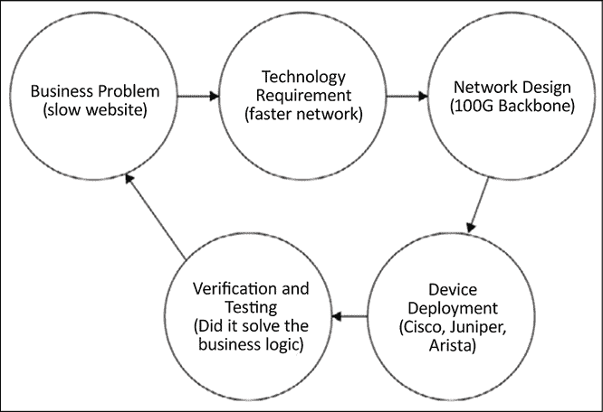
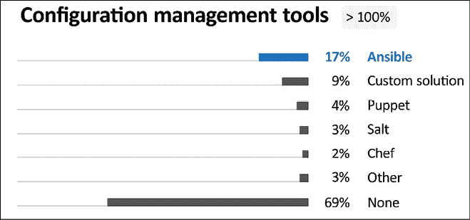
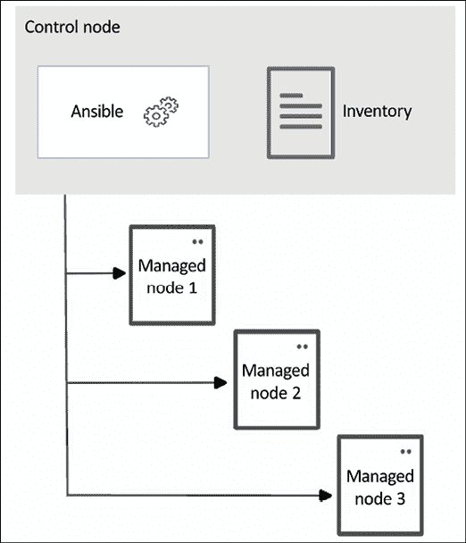
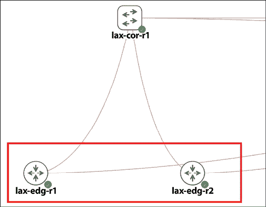
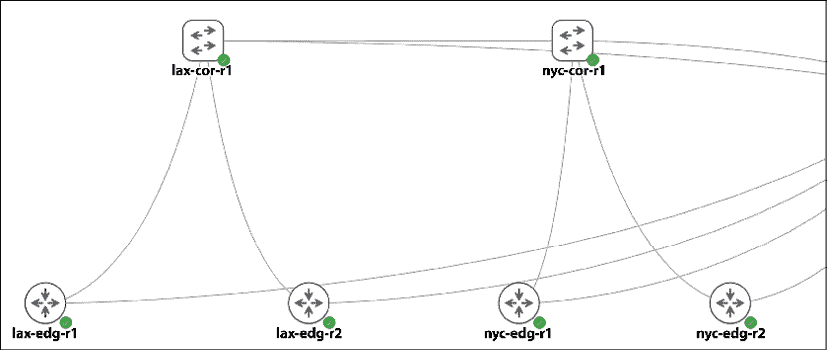

# 4

# Python 自动化框架 – Ansible

前两章逐步介绍了与网络设备交互的不同方式。在 *第二章*，*低级网络设备交互* 中，我们讨论了 Pexpect 和 Paramiko 库，它们管理交互会话以控制交互。在 *第三章*，*APIs 和意图驱动型网络* 中，我们开始从 API 和意图的角度思考我们的网络。我们研究了包含良好定义的命令结构并提供从设备获取反馈的结构的各种 API。当我们从 *第二章*，*低级网络设备交互* 转到 *第三章*，*APIs 和意图驱动型网络* 时，我们开始思考我们的网络意图。我们逐渐开始将我们的网络表达为代码。

在本章中，让我们进一步探讨将我们的意图转化为网络需求的想法。如果你从事过网络设计工作，那么最具有挑战性的部分可能不是不同的网络设备，而是对业务需求的评估和将它们转化为实际网络设计。你的网络设计需要解决业务问题。例如，你可能在需要适应在高峰时段出现网站响应时间缓慢的繁荣在线电子商务网站的大型基础设施团队中工作。你如何确定网络是否是问题所在？如果网站上的缓慢响应确实是由于网络拥塞造成的，你应该升级网络的哪个部分？系统的其他部分能否利用更高的速度和吞吐量？

以下图示展示了将我们的业务需求转化为网络设计时可能经历的一个简单流程步骤：



图 4.1：业务逻辑到网络部署

在我看来，网络自动化不仅仅是关于更快的配置更改。它还应该在准确和可靠地将我们的意图转化为设备行为的同时解决业务问题。这些是我们进行网络自动化之旅时应该牢记的目标。在本章中，我们将探讨一个基于 Python 的框架，称为 **Ansible**，它允许我们声明我们的网络意图，并从 API 和 CLI 中进一步抽象化。

在本章中，我们将探讨以下主题：

+   Ansible 简介

+   Ansible 的优势

+   Ansible 架构

+   Ansible 高级主题

让我们从 Ansible 框架的概述开始。

# Ansible – 一个更声明式的框架

想象一下一个假设的情况：你在一个寒冷的早晨从关于潜在网络安全漏洞的恶梦中惊醒。你意识到你的网络中包含应该受到保护的宝贵数字资产。你一直担任网络管理员的工作，所以网络相当安全，但你只是想确保在你的网络设备周围增加更多的安全措施。

首先，您将目标分解为两个可执行项：

+   将设备升级到软件的最新版本。步骤包括以下内容：

    1.  将图片上传到设备

    1.  指示设备从新镜像启动

    1.  继续重启设备

    1.  核实设备正在运行新的软件镜像

+   在网络设备上配置适当的访问控制列表，包括以下内容：

    1.  在设备上构建访问列表

    1.  在接口配置部分配置访问列表

作为一位专注于自动化的网络工程师，你想编写脚本来可靠地配置设备并从操作中获取反馈。你开始研究每个步骤所需的必要命令和 API，然后在实验室中验证它们，最后在生产环境中部署它们。在操作系统升级和 ACL 部署方面做了大量工作后，你希望这些脚本可以转移到下一代设备上。

如果有一个工具可以缩短这个设计-开发-部署周期，那岂不是很好？在本章中，我们将使用一个名为 Ansible 的开源自动化框架。这是一个可以将从业务逻辑到完成工作简化过程的框架，而无需陷入特定的网络命令。它可以配置系统、部署软件和编排一系列任务。

Ansible 是用 Python 编写的，已成为 Python 开发者领先的自动化工具之一。它也是网络供应商支持最多的自动化框架之一。在 JetBrains 的*‘Python Developers Survey 2020’*调查中，Ansible 在配置管理工具中排名#1：



图 4.2：Python Developers Survey 2020 结果（来源：https://www.jetbrains.com/lp/python-developers-survey-2020/）

自从 2.10 版本以来，Ansible 已经将**ansible-core**和社区包的发布计划分开。这有点令人困惑，所以让我们看看它们之间的区别。

## Ansible 版本

在版本 2.9 之前，Ansible 有一个相当直接的版本控制系统，从 2.5、2.6、2.7 等版本开始（[`docs.ansible.com/ansible/latest/roadmap/old_roadmap_index.html`](https://docs.ansible.com/ansible/latest/roadmap/old_roadmap_index.html)）。从版本 2.10 开始，我们看到 Ansible 项目从 2.10、3.0、4.0 等版本跳跃（[`docs.ansible.com/ansible/latest/roadmap/ansible_roadmap_index.html#ansible-roadmap`](https://docs.ansible.com/ansible/latest/roadmap/ansible_roadmap_index.html#ansible-roadmap)）。这是怎么回事？Ansible 团队希望将核心引擎、模块和插件与更广泛的社区维护的模块和插件分开。这允许核心团队在核心功能上更快地移动，同时为社区留出时间来跟上其代码的维护。

当我们谈论“Ansible”时，我们指的是该级别的社区包集合，比如说，版本 3.0。在这个版本中，它将指定所需的`ansible-core`（最初称为`ansible-base`）版本。例如，Ansible 3.0 需要 ansible-core 2.10 及以上版本，而 Ansible 4.0 需要 ansible-core 2.11+版本。在这个结构中，我们可以将 ansible-core 升级到最新版本，同时如果需要，可以保持社区包在较旧版本中。

如果想了解更多关于版本分割的信息，Ansible 在其首次采用 Ansible 3.0 时提供了一个有用的问答页面，[`www.ansible.com/blog/ansible-3.0.0-qa`](https://www.ansible.com/blog/ansible-3.0.0-qa)。

让我们继续前进，看看一个 Ansible 示例。

# 我们的第一篇 Ansible 网络示例

Ansible 是一个 IT 自动化工具。其主要属性是简单易用，组件最少。它以无代理的方式管理机器（关于这一点稍后会有更多介绍），并依赖于现有的操作系统凭证和远程 Python 软件来运行其代码。Ansible 安装在称为控制节点的中央机器上，并在它希望控制的机器上执行，称为受管理节点。



图 4.3：Ansible 架构（来源：https://docs.ansible.com/ansible/latest/getting_started/index.html）

与大多数 IT 基础设施自动化一样，Ansible 最初是通过管理服务器开始的。大多数服务器都安装了 Python 或者能够运行 Python 代码；Ansible 会利用这一特性，通过将代码推送到受管理的节点，并在受管理的节点上本地运行。然而，正如我们所知，大多数网络设备无法运行原生 Python 代码；因此，当涉及到网络自动化时，Ansible 配置首先在本地运行，然后再对远程设备进行更改。

想了解更多关于网络自动化差异的信息，请查看 Ansible 的这篇文档，[`docs.ansible.com/ansible/latest/network/getting_started/network_differences.html`](https://docs.ansible.com/ansible/latest/network/getting_started/network_differences.html)。

让我们在控制节点上安装 Ansible。

## 控制节点安装

我们将在实验室的 Ubuntu 宿主机上安装 Ansible。控制节点仅有的要求是 Python 3.8 或更高版本以及 Python 的`pip`包管理系统。

```py
(venv) $ pip install ansible 
```

我们可以通过使用‘—version’开关来检查已安装的 Ansible 版本以及其他包级别信息：

```py
(venv) $ ansible --version
ansible [core 2.13.3]
  config file = None
  configured module search path = ['/home/echou/.ansible/plugins/modules', '/usr/share/ansible/plugins/modules']
  ansible python module location = /home/echou/Mastering_Python_Networking_Fourth_Edition/venv/lib/python3.10/site-packages/ansible
  ansible collection location = /home/echou/.ansible/collections:/usr/share/ansible/collections
  executable location = /home/echou/Mastering_Python_Networking_Fourth_Edition/venv/bin/ansible
  python version = 3.10.4 (main, Jun 29 2022, 12:14:53) [GCC 11.2.0]
  jinja version = 3.1.2
  libyaml = True 
```

如果你对在特定的操作系统上使用各自的包管理系统安装 Ansible 感兴趣，请参阅 Ansible 文档，[`docs.ansible.com/ansible/latest/installation_guide/installation_distros.html`](https://docs.ansible.com/ansible/latest/installation_guide/installation_distros.html)。

输出中显示了一些重要信息。最重要的是 Ansible 核心版本（2.13.3）和配置文件（目前没有）。这就是我们开始使用 Ansible 所需的所有信息，我们可以开始构建我们的第一个自动化任务。

## 实验室拓扑

已知 Ansible 有多种不同的方式来完成同一任务。例如，我们可以在不同的位置定义 Ansible 配置文件。我们还可以在 inventory、playbooks、roles 和命令行等多种地方指定特定宿主机的变量。这对刚开始使用 Ansible 的人来说可能有些令人困惑。在本章中，我将使用我认为最有意义的一种方式来做事情。一旦我们学会了基础知识，我们总是可以查阅文档来了解其他完成任务的方法。

对于第一个示例，我们将使用我们一直在使用的相同实验室拓扑，并对两个 IOSv 设备`lax-edg-r1`和`lax-edg-r2`运行任务。



图 4.4：实验室拓扑

我们首先需要考虑的是如何定义我们想要管理的宿主机。在 Ansible 中，我们使用一个名为 inventory 的文件来定义我们打算管理的宿主机。让我们创建一个名为`hosts`的文件，并将以下文本放入该文件中：

```py
[ios_devices]
iosv-1
iosv-2 
```

这种类型的文件是 INI 格式（[`en.wikipedia.org/wiki/INI_file`](https://en.wikipedia.org/wiki/INI_file)），它声明我有一个名为`ios_devices`的设备组，其成员包括`iosv-1`和`iosv-2`。

我们现在应该指定与每个宿主机相关的特定变量。

### 变量文件

我们可以在许多地方放置与宿主机相关的变量。让我们创建一个名为`host_vars`的文件夹，并创建两个文件，其名称与 inventory 文件中指定的宿主机名称相同。目录和文件名很重要，因为 Ansible 就是通过这种方式将变量与宿主机匹配的。以下是目录和该目录内文件的输出：

```py
$ tree host_vars/
host_vars/
├── iosv-1
└── iosv-2 
```

文件是我们将放置属于宿主机必要信息的地点。例如，我们可以指定 IP 地址、用户名、密码和其他信息。以下是我们的实验室中`iosv-1`文件的输出：

```py
$ cat host_vars/iosv-1 
---
ansible_host: 192.168.2.51
ansible_user: cisco
ansible_ssh_pass: cisco
ansible_connection: network_cli
ansible_network_os: ios
ansbile_become: yes
ansible_become_method: enable
ansible_become_pass: cisco 
```

此文件采用 YAML 格式（[`docs.ansible.com/ansible/latest/reference_appendices/YAMLSyntax.html`](https://docs.ansible.com/ansible/latest/reference_appendices/YAMLSyntax.html)）。符号‘---’表示文档的开始。在开始符号下方，有许多键值对。所有键都以`ansible`开头，键与值之间用冒号分隔。`ansible_host`、`ansible_user`和`ansible_ssh_pass`应更改为与您自己的实验室匹配的值。我如何知道这些名称？Ansible 文档在这里是我们的好朋友。Ansible 在其文档中列出了命名这些参数的标准方式，[`docs.ansible.com/ansible/latest/user_guide/intro_inventory.html`](https://docs.ansible.com/ansible/latest/user_guide/intro_inventory.html)。

在 Ansible 2.8 版本之前，网络模块没有标准的方式来命名参数，这非常令人困惑。从 2.8 版本开始，网络模块在标准化参数方面变得更好，与 Ansible 的其他模块保持一致。

一旦我们定义了主机变量的相应文件，我们就可以开始构建 Ansible 剧本了。

### 我们的第一份剧本

剧本（Playbook）是 Ansible 描述对受管理节点进行操作蓝图的方式，使用模块来实现。这是我们作为操作员使用 Ansible 时将花费大部分时间的地方。什么是模块？从简化的角度来看，模块是我们用来完成特定任务的预构建代码。类似于 Python 模块，代码可以随默认的 Ansible 安装提供，也可以单独安装。

如果我们用 Ansible 构建树屋的类比，剧本将是说明书，模块将是使用的工具，而清单（inventory）则是我们工作的组件。

剧本设计为以 YAML 格式（[`docs.ansible.com/ansible/latest/reference_appendices/YAMLSyntax.html`](https://docs.ansible.com/ansible/latest/reference_appendices/YAMLSyntax.html)）可读。我们将编写第一个剧本，命名为`ios_config_backup.yml`，如下所示：

```py
- name: Back Up IOS Device Configurations
  hosts: all
  gather_facts: false
  tasks:
    - name: backup
      ios_config:
        backup: yes 
```

注意`name`前的`-`，它指定了 YAML 中的一个列表项。同一列表项中的所有内容都应该有相同的缩进。我们将`gather_facts`设置为`false`，因为大多数网络任务在更改设备之前都是在本地执行的。`gather_facts`主要用于在执行任何任务之前收集受管理节点（通常是服务器）的信息。

列表项中有两个键值对，`hosts` 和 `tasks`。具有 `all` 值的 `hosts` 变量指定我们将处理清单文件中的所有主机。`tasks` 键的值中还有一个列表项，它使用 `ios_config` 模块 ([`docs.ansible.com/ansible/latest/collections/cisco/ios/ios_config_module.html#ansible-collections-cisco-ios-ios_config-module`](https://docs.ansible.com/ansible/latest/collections/cisco/ios/ios_config_module.html#ansible-collections-cisco-ios-ios_config-module))。`ios_config` 模块是随 Ansible 一起安装的模块集合之一。它也有许多参数。我们使用 `backup` 参数并将其设置为 `yes`，以表示我们将备份设备的 `running-config`。

我们接下来要做的任务是使用新的 LibSSH 连接插件来配置 Ansible。默认情况下，Ansible 网络 SSH 连接使用 Paramiko 库。然而，Paramiko 库并不能保证符合 FIPS 标准，并且在需要连接多个设备时速度较慢。我们将按照以下步骤安装 LibSSH：

```py
(venv) $ pip install ansible-pylibssh 
```

我们将在新的 `ansible.cfg` 文件中指定用法。我们将在这个与我们的剧本相同的目录中创建文件，内容如下。在同一个配置文件中，我们还将 `host_key_checking` 设置为 `false`；这是为了防止在 `ssh` 设置中主机最初不在 `known_hosts` 列表中时出现错误：

```py
[defaults]
host_key_checking = False 
[persistent_connection]
ssh_type = libssh 
```

最后，我们可以通过带有 `-i` 选项的 `ansible-playbook` 命令来执行剧本，以指示清单文件：

```py
$ ansible-playbook -i hosts ios_config_backup.yml 
PLAY [Back Up IOS Device Configurations] **************************************************************************************
TASK [backup] *****************************************************************************************************************
changed: [iosv-2]
changed: [iosv-1]
PLAY RECAP ********************************************************************************************************************
iosv-1                     : ok=2    changed=1    unreachable=0    failed=0    skipped=0    rescued=0    ignored=0   
iosv-2                     : ok=2    changed=1    unreachable=0    failed=0    skipped=0    rescued=0    ignored=0 
```

就像魔法一样，如果我们查看执行剧本的工作目录，我们会看到一个名为 `backup` 的文件夹，其中包含两个设备的运行配置文件，并带有时间戳！现在，这个命令可以通过 `cron` 计划任务每晚运行，以备份我们所有设备的配置。

恭喜你执行了你的第一个 Ansible 剧本！即使像我们这样的剧本很简单，这也是一个非常有用的自动化任务，我们能够在短时间内完成。我们将在稍后扩展这个剧本，但首先，让我们看看为什么 Ansible 适合网络管理。记住，Ansible 模块是用 Python 编写的；这对于 Python 网络工程师来说是一个优势，对吧？

# Ansible 的优势

除了 Ansible 之外，还有许多基础设施自动化框架，如 Chef、Puppet 和 SaltStack。每个框架都提供其独特的功能；没有一个框架适合所有组织。在本节中，让我们看看 Ansible 的一些优势以及为什么我相信它是网络自动化的好工具。

优点将与其他框架进行有限的比较，以避免引发争论战。其他框架可能会采用一些相同的理念或 Ansible 的某些方面，但很少会包含我将要提到的所有功能。正是所有以下功能和理念的组合使得 Ansible 非常适合网络自动化。

## 无代理

与其一些同行不同，Ansible 不需要严格的 master-client 模型。不需要在向服务器通信的客户端上安装任何软件或代理。除了许多平台默认拥有的 Python 解释器之外，不需要额外的软件。

对于网络自动化模块，Ansible 不是依赖于远程主机代理，而是使用 SSH 或 API 调用将所需更改推送到远程主机。这进一步减少了 Python 解释器的需求。这对于网络设备管理来说是个巨大的优势，因为网络供应商通常不愿意在他们的平台上安装第三方软件。另一方面，SSH 已经存在于网络设备上。正如我们在*第三章*，*APIs 和 Intent-Driven Networking*中看到的那样，较新的网络设备也提供了 API 层，这也可以被 Ansible 利用。

由于远程主机上没有代理，Ansible 使用`push`模型将更改推送到设备，而不是`pull`模型，其中代理从主服务器拉取信息。`push`模型更确定，因为所有内容都源自控制机器。在`pull`模型中，`pull`的时间可能会因客户端而异，因此导致时间差异。

再次强调，当与现有的网络设备一起工作时，无代理的重要性不容忽视。这通常是网络运营商和供应商接受 Ansible 的主要原因之一。

## 幂等性

根据维基百科，幂等性是数学和计算机科学中某些操作的性质，可以在不改变初始应用结果的情况下多次应用([`zh.wikipedia.org/wiki/幂等性`](https://zh.wikipedia.org/wiki/幂等性))。用更通俗的话来说，这意味着重复执行相同的程序不会在第一次之后改变系统。Ansible 旨在实现幂等性，这对于需要特定操作顺序的网络操作来说是个优点。在我们的第一个 playbook 示例中，当 playbook 运行时会有一个‘changed’值；如果远程设备上没有进行任何更改，这个值将是‘false’。

幂等性的优势最好与我们所编写的 Pexpect 和 Paramiko 脚本进行比较。请记住，这些脚本是为了像工程师坐在终端一样推送命令而编写的。如果你执行脚本 10 次，脚本会进行 10 次相同的变化。如果我们通过 Ansible 剧本编写相同的任务，首先会检查现有设备配置，并且只有在没有变化的情况下剧本才会执行。如果我们执行剧本 10 次，变化只会在第一次运行时应用，接下来的 9 次运行将抑制配置更改。

由于幂等性，我们可以反复执行剧本而不用担心会有不必要的更改。这对于我们需要自动检查状态一致性而不增加额外开销来说非常重要。

## 简单和可扩展

Ansible 是用 Python 编写的，并使用 YAML 作为剧本语言，这两者都相对容易学习。还记得 Cisco IOS 语法吗？这是一种仅在管理 Cisco IOS 设备或其他类似结构的设备时适用的领域特定语言；它不是一种超出其有限范围的通用语言。幸运的是，与一些其他自动化工具不同，Ansible 没有额外的**领域特定语言**（**DSL**）需要学习，因为 YAML 和 Python 都是广泛使用的通用语言。

Ansible 是可扩展的。正如前面的例子所示，Ansible 最初是为了自动化服务器（主要是 Linux）工作负载而设计的。然后它扩展到使用 PowerShell 管理 Windows 机器。随着越来越多的网络行业人士开始采用 Ansible，网络自动化现在已成为 Ansible 工作组的主要支柱。

简单性和可扩展性为未来的可靠性提供了良好的保障。技术世界正在快速发展，我们一直在努力适应。如果能够学习一种技术并持续使用，而不受最新趋势的影响，那岂不是很好？Ansible 的记录很好地证明了未来技术的适应性。

现在我们已经介绍了一些 Ansible 的优势，让我们在此基础上，利用更多功能继续学习。

# Ansible 内容集合

让我们先列出默认 Ansible 安装中我们手头的所有模块。它们被组织到内容集合中（[`www.ansible.com/products/content-collections`](https://www.ansible.com/products/content-collections)），有时简称为集合。我们可以通过`ansible-galaxy collection list`命令列出集合。以下列出了一些值得注意的网络集合：

```py
(venv) $ ansible-galaxy collection list
# /home/echou/Mastering_Python_Networking_Fourth_Edition/venv/lib/python3.10/site-packages/ansible_collections
Collection                    Version
----------------------------- -------
…
ansible.netcommon             3.1.0  
arista.eos                    5.0.1  
cisco.aci                     2.2.0  
cisco.asa                     3.1.0  
cisco.dnac                    6.5.3  
cisco.intersight              1.0.19 
cisco.ios                     3.3.0  
cisco.iosxr                   3.3.0  
cisco.ise                     2.5.0  
cisco.meraki                  2.10.1 
cisco.mso                     2.0.0  
cisco.nso                     1.0.3  
cisco.nxos                    3.1.0  
cisco.ucs                     1.8.0  
community.ciscosmb            1.0.5  
community.fortios             1.0.0  
community.network             4.0.1  
dellemc.enterprise_sonic      1.1.1  
f5networks.f5_modules         1.19.0 
fortinet.fortimanager         2.1.5  
fortinet.fortios              2.1.7  
mellanox.onyx                 1.0.0   
openstack.cloud               1.8.0  
openvswitch.openvswitch       2.1.0  
vyos.vyos                     3.0.1 
```

如列表所示，即使使用默认安装，我们也有大量的网络相关模块可以使用。它们从企业软件到开源项目都有。查看列表并阅读您生产环境中感兴趣的内容是一个好的开始。Ansible 文档还提供了所有可用集合的完整列表，[`docs.ansible.com/ansible/latest/collections/index.html`](https://docs.ansible.com/ansible/latest/collections/index.html)。集合也可以通过`agalaxy` `install`命令进行扩展，[`docs.ansible.com/ansible/latest/user_guide/collections_using.html`](https://docs.ansible.com/ansible/latest/user_guide/collections_using.html)。

# 更多 Ansible 网络示例

我们第一个 Ansible 网络示例让我们从新手变成了运行第一个有用的网络自动化任务。让我们从基础开始，学习更多功能。

我们将首先看看我们如何构建一个包含我们所有网络设备的清单文件。如果您还记得，我们有两个数据中心，每个数据中心都有核心和边缘设备：



图 4.5：完整实验室拓扑

在这个示例中，我们将包含我们清单文件中的所有设备。

## 清单嵌套

我们可以构建一个包含嵌套的清单文件。例如，我们可以创建一个名为`hosts_full`的主机文件，它包含来自一个组到另一个组的子组：

```py
[lax_cor_devices]
lax-cor-r1
[lax_edg_devices]
lax-edg-r1
lax-edg-r2
[nyc_cor_devices]
nyc-cor-r1
[nyc_edg_devices]
nyc-edg-r1
nyc-edg-r2
[lax_dc:children]
lax_cor_devices
lax_edg_devices
[nyc_dc:children]
nyc_cor_devices
nyc_edg_devices
[ios_devices:children]
lax_edg_devices
nyc_edg_devices
[nxos_devices:children]
nyc_cor_devices
lax_cor_devices 
```

在文件中，我们使用`[<name>:children]`格式通过角色和功能对设备进行分组。为了使用这个新的清单文件，我们需要更新`host_vars`目录以包含相应设备的名称：

```py
(venv) $ tree host_vars/
host_vars/
…
├── lax-cor-r1
├── lax-edg-r1
├── lax-edg-r2
├── nyc-cor-r1
├── nyc-edg-r1
└── nyc-edg-r2 
```

我们还需要相应地更改`ansible_host`和`ansible_network_os`，以`lax-cor-r1`为例：

```py
(venv) $ cat host_vars/lax-cor-r1 
---
ansible_host: 192.168.2.50
…
ansible_network_os: nxos
… 
```

现在我们可以使用父组的名称来包含其子组。例如，在`nxos_config_backup.yml`剧本中，我们只指定了`nxos_devices`的父组而不是`all`：

```py
- name: Back Up NX-OS Device Configurations
  hosts: nxos_devices
  gather_facts: false
  tasks:
    - name: backup
      nxos_config:
        backup: yes 
```

当我们执行这个剧本时，它将自动包含其子组，`lax_cor_devices`和`nyc_cor_devices`。此外，请注意，我们使用单独的`nxos_config`模块([`docs.ansible.com/ansible/latest/collections/cisco/nxos/nxos_config_module.html#ansible-collections-cisco-nxos-nxos-config-module`](https://docs.ansible.com/ansible/latest/collections/cisco/nxos/nxos_config_module.html#ansible-collections-cisco-nxos-nxos-config-module))来适应新的设备类型。

## Ansible 条件语句

Ansible 条件语句类似于编程语言中的条件语句。Ansible 使用条件关键字仅在给定条件满足时运行任务。在许多情况下，剧本或任务的执行可能取决于事实、变量或先前任务的结果。例如，如果您有一个升级路由器映像的剧本，您希望在继续到下一个重启路由器的剧本之前，确保新的路由器映像已经在设备上。

在这个例子中，我们将查看`when`子句，它适用于所有模块。`when`子句在您需要检查变量或剧本执行结果的输出并根据结果采取行动时非常有用。以下是一些条件：

+   等于（`eq`）

+   不等于（`neq`）

+   大于（`gt`）

+   大于或等于（`ge`）

+   小于（`lt`）

+   小于或等于（`le`）

+   包含

让我们看看以下名为`ios_conditional.yml`的剧本：

```py
---
- name: IOS command output for when clause
  hosts: ios_devices
  gather_facts: false
  tasks:
    - name: show hostname
      ios_command:
        commands:
            - show run | i hostname
      register: output
    - name: show output with when conditions
      when: output.stdout == ["hostname nyc-edg-r2"]
      debug: 
        msg: '{{ output }}' 
```

在剧本中，有两个任务。在第一个任务中，我们使用`register`模块将`show run | i hostname`命令的输出保存到名为`output`的变量中。`output`变量包含一个包含输出的`stdout`列表。我们使用`when`子句仅在主机名为`nyc-edg-r2`时显示输出。让我们执行剧本：

```py
(venv) $ ansible-playbook -i hosts_full ios_conditional.yml 
PLAY [IOS command output for when clause] *************************************************************************************
TASK [show hostname] **********************************************************************************************************
ok: [lax-edg-r1]
ok: [nyc-edg-r2]
ok: [lax-edg-r2]
ok: [nyc-edg-r1]
TASK [show output with when conditions] ***************************************************************************************
skipping: [lax-edg-r1]
skipping: [lax-edg-r2]
skipping: [nyc-edg-r1]
ok: [nyc-edg-r2] => {
    "msg": {
        "changed": false,
        "failed": false,
        "stdout": [
            "hostname nyc-edg-r2"
        ],
        "stdout_lines": [
            [
                "hostname nyc-edg-r2"
            ]
        ]
    }
}
PLAY RECAP ********************************************************************************************************************
lax-edg-r1                 : ok=1    changed=0    unreachable=0    failed=0    skipped=1    rescued=0    ignored=0   
lax-edg-r2                 : ok=1    changed=0    unreachable=0    failed=0    skipped=1    rescued=0    ignored=0   
nyc-edg-r1                 : ok=1    changed=0    unreachable=0    failed=0    skipped=1    rescued=0    ignored=0   
nyc-edg-r2                 : ok=2    changed=0    unreachable=0    failed=0    skipped=0    rescued=0    ignored=0 
```

我们可以看到`lax-edg-r1`、`lax-edg-r2`和`nyc-edg-r1`的输出被跳过了，因为它们没有满足条件。此外，我们还可以看到所有设备的`changed=0`输出。这与 Ansible 的幂等性功能一致。

## 配置更改

我们可以将条件与配置更改结合起来——例如，在以下剧本中，`ios_conditional_config.yml`：

```py
---
- name: IOS command output for when clause
  hosts: ios_devices
  gather_facts: false
  tasks:
    - name: show hostname
      ios_command:
        commands:
            - show run | i hostname
      register: output
    - name: show output with when conditions
      when: output.stdout == ["hostname nyc-edg-r2"]
      ios_config: 
        lines: 
            - logging buffered 30000 
```

我们只有在条件满足时才会更改日志缓冲区。以下是第一次执行剧本时的输出：

```py
(venv) $ ansible-playbook -i hosts_full ios_conditional_config.yml 
<skip>
TASK [show output with when conditions] ***************************************************************************************
skipping: [lax-edg-r1]
skipping: [lax-edg-r2]
skipping: [nyc-edg-r1]
[WARNING]: To ensure idempotency and correct diff the input configuration lines should be similar to how they appear if
present in the running configuration on device
changed: [nyc-edg-r2]
PLAY RECAP ********************************************************************************************************************
lax-edg-r1                 : ok=1    changed=0    unreachable=0    failed=0    skipped=1    rescued=0    ignored=0   
lax-edg-r2                 : ok=1    changed=0    unreachable=0    failed=0    skipped=1    rescued=0    ignored=0   
nyc-edg-r1                 : ok=1    changed=0    unreachable=0    failed=0    skipped=1    rescued=0    ignored=0   
nyc-edg-r2                 : ok=2    changed=1    unreachable=0    failed=0    skipped=0    rescued=0    ignored=0 
```

`nyc-edg-r2`设备控制台将显示配置已更改：

```py
*Sep 10 01:53:43.132: %SYS-5-LOG_CONFIG_CHANGE: Buffer logging: level debugging, xml disabled, filtering disabled, size (30000) 
```

然而，当我们第二次运行剧本时，相同的更改不再应用，因为它已经更改：

```py
<skip>
TASK [show output with when conditions] ***************************************************************************************
skipping: [lax-edg-r1]
skipping: [lax-edg-r2]
skipping: [nyc-edg-r1]
ok: [nyc-edg-r2] 
```

这有多酷？只需一个简单的剧本，我们就可以安全地将配置更改应用到我们想要更改的设备上，同时检查幂等性。

## Ansible 网络事实

在 2.5 版本之前，Ansible 网络附带了一些厂商特定的事实模块。因此，不同厂商的事实命名和用法不同。从 2.5 版本开始，Ansible 开始标准化其网络事实模块。Ansible 网络事实模块从系统收集信息，并将结果存储在以`ansible_net_`为前缀的事实中。这些模块收集的数据在模块文档的*返回值*中进行了记录。这很有用，因为我们可以收集网络事实，并根据它们执行任务。

作为`ios_facts`模块的示例，以下为`ios_facts_playbook`的内容：

```py
---
- name: IOS network facts
  connection: network_cli
  gather_facts: false
  hosts: ios_devices
  tasks:
    - name: Gathering facts via ios_facts module
      ios_facts:
      when: ansible_network_os == 'ios'

    - name: Display certain facts
      debug: 
        msg: "The hostname is {{ ansible_net_hostname }} running {{ ansible_net_version }}"

    - name: Display all facts for hosts
      debug:
        var: hostvars 
```

在这个剧本中，我们引入了一个变量的概念。双大括号`{{ }}`表示它是一个变量，变量的值应该用于输出。

执行剧本后，这里是部分输出：

```py
(venv) $ ansible-playbook -i hosts_full ios_facts_playbook.yml
…
TASK [Display certain facts] ***************************************************
ok: [lax-edg-r1] => {
    "msg": "The hostname is lax-edg-r1 running 15.8(3)M2"
}
ok: [lax-edg-r2] => {
    "msg": "The hostname is lax-edg-r2 running 15.8(3)M2"
}
ok: [nyc-edg-r1] => {
    "msg": "The hostname is nyc-edg-r1 running 15.8(3)M2"
}
ok: [nyc-edg-r2] => {
    "msg": "The hostname is nyc-edg-r2 running 15.8(3)M2"
}
…
TASK [Display all facts for hosts] *********************************************
ok: [lax-edg-r1] => {
    "hostvars": {
        "lax-cor-r1": {
…
            "ansible_facts": {
                "net_api": "cliconf",
                "net_gather_network_resources": [],
                "net_gather_subset": [
                    "default"
                ],
                "net_hostname": "lax-edg-r1",
                "net_image": "flash0:/vios-adventerprisek9-m",
                "net_iostype": "IOS",
                "net_model": "IOSv",
                "net_python_version": "3.10.4",
                "net_serialnum": "98U40DKV403INHIULHYHB",
                "net_system": "ios",
                "net_version": "15.8(3)M2",
                "network_resources": {}
            },
… 
```

我们现在可以利用这些事实与我们的条件语句结合，以自定义我们的操作。

## Ansible 循环

Ansible 在 playbook 中提供了一系列循环函数：标准循环、遍历文件、子元素、`do-until` 以及更多。在本节中，我们将探讨两种最常用的循环形式：标准循环和遍历哈希值。

### 标准循环

在 playbook 中，标准循环通常用于轻松地多次执行类似任务。标准循环的语法非常简单：`{{ item }}` 变量是循环遍历 `loop` 列表的占位符。在我们的下一个示例 `standard_loop.yml` 中，我们将使用 `echo` 命令遍历 `loop` 列表中的项目，并显示来自我们的 `localhost` 的输出。

```py
- name: Echo Loop Items
  hosts: "localhost"
  gather_facts: false
  tasks:
    - name: echo loop items
      command: echo "{{ item }}"
      loop:
        - 'r1'
        - 'r2'
        - 'r3'
        - 'r4'
        - 'r5' 
```

让我们继续执行 playbook：

```py
(venv) $ ansible-playbook -i hosts_full standard_loop.yml 
PLAY [Echo Loop Items] ********************************************************************************************************
TASK [echo loop items] ********************************************************************************************************
changed: [localhost] => (item=r1)
changed: [localhost] => (item=r2)
changed: [localhost] => (item=r3)
changed: [localhost] => (item=r4)
changed: [localhost] => (item=r5)
PLAY RECAP ********************************************************************************************************************
localhost                  : ok=1    changed=1    unreachable=0    failed=0    skipped=0    rescued=0    ignored=0 
```

使用相同的概念，我们可以系统地使用 playbook 向我们的设备添加 VLAN。以下是一个使用名为 `standard_loop_vlan_example.yml` 的 playbook 向主机添加三个 VLAN 的示例：

```py
- name: Add Multiple Vlans
  hosts: "nyc-cor-r1"
  gather_facts: false
  connection: network_cli
  vars:
    vlan_numbers: [100, 200, 300]
  tasks:
    - name: add vlans
      nxos_config:
        lines:
            - vlan {{ item }}
      loop: "{{ vlan_numbers }}"
      register: output 
```

playbook 输出如下：

```py
(venv) $ ansible-playbook -i hosts_full standard_loop
_vlan_example.yml 
PLAY [Add Multiple Vlans] *****************************************************************************************************
TASK [add vlans] **************************************************************************************************************
changed: [nyc-cor-r1] => (item=100)
changed: [nyc-cor-r1] => (item=200)
changed: [nyc-cor-r1] => (item=300)
[WARNING]: To ensure idempotency and correct diff the input configuration lines should be similar to how they appear if
present in the running configuration on device
PLAY RECAP ********************************************************************************************************************
nyc-cor-r1                 : ok=1    changed=1    unreachable=0    failed=0    skipped=0    rescued=0    ignored=0 
```

从 playbook 中我们可以看到，循环列表可以读取自一个变量，这为你的 playbook 结构提供了更大的灵活性：

```py
… 
 vars:
    vlan_numbers: [100, 200, 300]
  tasks:
    …
     loop: "{{ vlan_numbers }}" 
```

标准循环在 playbook 中执行重复性任务时是一个节省时间的好方法。让我们看看我们如何在下一节中遍历字典。

### 遍历字典

当我们需要生成配置时，我们通常会有一个与多个属性相关联的实体。如果你考虑上一节中的 VLAN 示例，每个 VLAN 都会有几个独特的属性，例如描述、网关 IP 地址，可能还有其他属性。通常，我们可以使用字典来表示实体，以将其多个属性合并到其中。

让我们扩展之前的示例，在 `standard_loop_vlan_example_2.yml` 中包含一个字典变量。我们为三个 `vlan` 定义了字典值，每个 `vlan` 都有一个嵌套字典用于描述和 IP 地址：

```py
---
- name: Add Multiple Vlans
  hosts: "nyc-cor-r1"
  gather_facts: false
  connection: network_cli
  vars:
    vlans: {
        "100": {"description": "floor_1", "ip": "192.168.10.1"},
        "200": {"description": "floor_2", "ip": "192.168.20.1"},
        "300": {"description": "floor_3", "ip": "192.168.30.1"}
      }
  tasks:
    - name: add vlans
      nxos_config:
        lines:
            - vlan {{ item.key }}
      with_dict: "{{ vlans }}"
    - name: configure vlans
      nxos_config:
        lines: 
          - description {{ item.value.description }}
          - ip address {{ item.value.ip }}/24
        parents: interface vlan {{ item.key }}
      with_dict: "{{ vlans }}" 
```

在 playbook 中，我们通过使用项目的键来配置第一个任务以添加 VLAN。在第二个任务中，我们使用每个项目中的值来配置 VLAN 接口。请注意，我们使用 `parents` 参数来唯一标识应该检查命令的章节。这是因为描述和 IP 地址都是在配置中的 `interface vlan <number>` 子章节下配置的。

在我们执行命令之前，我们需要确保在 `nyc-cor-r1` 设备上启用了三层接口功能：

```py
nyc-cor-r1(config)# feature interface-vlan 
```

我们可以像之前一样运行 playbook。我们可以看到正在循环的字典：

```py
(venv) $ ansible-playbook -i hosts_full standard_loop_vlan_example_2.yml 
PLAY [Add Multiple Vlans] ************************************************************************************************
TASK [add vlans] *********************************************************************************************************
changed: [nyc-cor-r1] => (item={'key': '100', 'value': {'description': 'floor_1', 'ip': '192.168.10.1'}})
changed: [nyc-cor-r1] => (item={'key': '200', 'value': {'description': 'floor_2', 'ip': '192.168.20.1'}})
changed: [nyc-cor-r1] => (item={'key': '300', 'value': {'description': 'floor_3', 'ip': '192.168.30.1'}})
[WARNING]: To ensure idempotency and correct diff the input configuration lines should be similar to how they appear if
present in the running configuration on device
TASK [configure vlans] ***************************************************************************************************
changed: [nyc-cor-r1] => (item={'key': '100', 'value': {'description': 'floor_1', 'ip': '192.168.10.1'}})
changed: [nyc-cor-r1] => (item={'key': '200', 'value': {'description': 'floor_2', 'ip': '192.168.20.1'}})
changed: [nyc-cor-r1] => (item={'key': '300', 'value': {'description': 'floor_3', 'ip': '192.168.30.1'}})
PLAY RECAP ***************************************************************************************************************
nyc-cor-r1                 : ok=2    changed=2    unreachable=0    failed=0    skipped=0    rescued=0    ignored=0 
```

我们可以在设备上验证最终结果：

```py
nyc-cor-r1# sh run
interface Vlan100
  description floor_1
  ip address 192.168.10.1/24
interface Vlan200
  description floor_2
  ip address 192.168.20.1/24
interface Vlan300
  description floor_3
  ip address 192.168.30.1/24 
```

对于 Ansible 的更多循环类型，请随时查看相应的文档([`docs.ansible.com/ansible/latest/user_guide/playbooks_loops.html`](https://docs.ansible.com/ansible/latest/playbook_guide/playbooks_loops.html))。

第一次使用字典进行循环时需要一些练习。但就像标准循环一样，使用字典循环将成为我们工具箱中的无价之宝。Ansible 循环是一个可以节省我们时间并使 playbook 更易读的工具。在下一节中，我们将探讨 Ansible 模板，这些模板允许我们对网络设备配置中常用的文本文件进行系统性的更改。

## 模板

自从我开始担任网络工程师以来，我始终使用某种网络模板系统。根据我的经验，许多网络设备的网络配置部分是相同的，尤其是如果这些设备在网络中扮演相同的角色。

大多数时候，当我们需要部署新设备时，我们使用模板形式的相同配置，替换必要的字段，然后将文件复制到新设备上。使用 Ansible，您可以通过使用模板功能([`docs.ansible.com/ansible/latest/user_guide/playbooks_templating.html`](https://docs.ansible.com/ansible/latest/user_guide/playbooks_templating.html))来自动化所有工作。

Ansible 使用 Jinja ([`jinja.palletsprojects.com/en/3.1.x/`](https://jinja.palletsprojects.com/en/3.1.x/)) 模板来启用动态表达式和访问变量和事实。Jinja 有其自己的语法和循环、条件的方法；幸运的是，为了我们的目的，我们只需要了解它的基础知识。Ansible 模板模块是我们日常任务中将要使用的重要工具，我们将在本节中更多地探讨它。我们将通过逐步构建我们的 playbook，从一些简单的任务到更复杂的任务，来学习语法。

模板使用的语法非常简单；我们只需指定源文件和我们要复制到的目标位置。

让我们创建一个名为`Templates`的新目录，并开始创建我们的 playbook。我们现在将创建一个空文件：

```py
(venv) $ mkdir Templates
(venv) $ cd Templates/
(venv) $ touch file1 
```

然后，我们将使用以下 playbook，`template_1.yml`，将`file1`复制到`file2`。请注意，playbook 仅在控制机上执行：

```py
---
- name: Template Basic
  hosts: localhost
  tasks:
    - name: copy one file to another
      template:
        src=/home/echou/Mastering_Python_Networking_Fourth_Edition/Chapter04/Templates/file1
        dest=/home/echou/Mastering_Python_Networking_Fourth_Edition/Chapter04/Templates/file2 
```

执行 playbook 将创建一个新文件：

```py
(venv) $ ansible-playbook -i hosts template_1.yml 
PLAY [Template Basic] ****************************************************************************************************
TASK [Gathering Facts] ***************************************************************************************************
ok: [localhost]
TASK [copy one file to another] ******************************************************************************************
changed: [localhost]
PLAY RECAP ***************************************************************************************************************
localhost                  : ok=2    changed=1    unreachable=0    failed=0    skipped=0    rescued=0    ignored=0   
(venv) $ ls file*
file1  file2 
```

在我们的模板中，源文件可以有任意扩展名，但由于它们将通过 Jinja2 模板引擎进行处理，让我们创建一个名为`nxos.j2`的文本文件作为模板源。模板将遵循 Jinja 约定，使用双大括号来指定变量，以及使用大括号加百分号来指定命令：

```py
hostname {{ item.value.hostname }}
feature telnet
feature ospf
feature bgp
feature interface-vlan

feature netflow

username {{ item.value.username }} password {{ item.value.password }}  role network-operator

vlan {{ vlan_num }}



interface {{ vlan_interface.int_num }}
  ip address {{ vlan_interface.ip }}/24

 
```

现在，我们可以组合一个 playbook，根据`nxos.j2`文件创建网络配置模板。

### Jinja 模板变量

`template_2.yml` playbook 在先前的模板示例的基础上增加了以下内容：

+   源文件是`nxos.j2`。

+   目标文件名现在是从 playbook 中定义的`nexus_devices`变量中获取的变量。

+   `nexus_devices`中的每个设备都包含在模板中将被替换或循环遍历的变量。

这个 playbook 可能看起来比上一个复杂，但如果去掉变量定义部分，它与之前简单的模板 playbook 非常相似：

```py
---
- name: Template Looping
  hosts: localhost
  vars:
    nexus_devices: {
        "nx-osv-1": {
            "hostname": "nx-osv-1",
            "username": "cisco",
            "password": "cisco",
            "vlans": [100, 200, 300],
            "l3_vlan_interfaces": True,
            "vlan_interfaces": [
                {"int_num": "100", "ip": "192.168.10.1"},
                {"int_num": "200", "ip": "192.168.20.1"},
                {"int_num": "300", "ip": "192.168.30.1"}
            ],
            "netflow_enable": True
        },
        "nx-osv-2": {
            "hostname": "nx-osv-2",
            "username": "cisco",
            "password": "cisco",
            "vlans": [100, 200, 300],
            "l3_vlan_interfaces": False,
            "netflow_enable": False
        }
    }
  tasks:
    - name: create router configuration files
      template:
        src=/home/echou/Mastering_Python_Networking_Fourth_Edition/Chapter04/Templates/nxos.j2
        dest=/home/echou/Mastering_Python_Networking_Fourth_Edition/Chapter04/Templates/{{ item.key }}.conf
      with_dict: "{{ nexus_devices }}" 
```

让我们不要立即执行 playbook；我们还需要查看`Jinja2`模板中的``符号内的`if`条件语句和`for`循环。

### Jinja 模板循环

在我们的`nxos.j2`模板中，有两个`for`循环；一个循环遍历 VLAN，另一个循环遍历 VLAN 接口：

```py

vlan {{ vlan_num }}



interface {{ vlan_interface.int_num }}
  ip address {{ vlan_interface.ip }}/24

 
```

如果你记得，我们也可以在 Jinja 中循环遍历列表以及字典。在我们的例子中，`vlans`变量是一个列表，而`vlan_interfaces`变量是一个字典列表。

`vlan_interfaces`循环嵌套在一个条件语句中。在我们执行 playbook 之前，这是我们将要整合到 playbook 中的最后一件事。

### Jinja 模板条件语句

Jinja 支持`if`条件检查。我们在`nxos.j2`模板中的两个位置添加了这个条件语句；一个是`netflow`变量，另一个是`l3_vlan_interfaces`变量。只有当条件为`True`时，我们才会执行块内的语句：

```py
<skip>

feature netflow

<skip>

<skip>
 
```

在 playbook 中，我们已将`netflow_enable`声明为`nx-os-v1`的`True`和`nx-osv-2`的`False`：

```py
 vars: 
    nexus_devices: {
        "nx-osv-1": {
            <skip>
            "netflow_enable": True
        },
        "nx-osv-2": {
            <skip>
            "netflow_enable": False
        }
    } 
```

最后，我们准备运行我们的 playbook：

```py
(venv) $ ansible-playbook -i hosts template_2.yml 
PLAY [Template Looping] **************************************************************************************************
TASK [Gathering Facts] ***************************************************************************************************
ok: [localhost]
TASK [create router configuration files] *********************************************************************************
changed: [localhost] => (item={'key': 'nx-osv-1', 'value': {'hostname': 'nx-osv-1', 'username': 'cisco', 'password': 'cisco', 'vlans': [100, 200, 300], 'l3_vlan_interfaces': True, 'vlan_interfaces': [{'int_num': '100', 'ip': '192.168.10.1'}, {'int_num': '200', 'ip': '192.168.20.1'}, {'int_num': '300', 'ip': '192.168.30.1'}], 'netflow_enable': True}})
changed: [localhost] => (item={'key': 'nx-osv-2', 'value': {'hostname': 'nx-osv-2', 'username': 'cisco', 'password': 'cisco', 'vlans': [100, 200, 300], 'l3_vlan_interfaces': False, 'netflow_enable': False}})
PLAY RECAP ***************************************************************************************************************
localhost                  : ok=2    changed=1    unreachable=0    failed=0    skipped=0    rescued=0    ignored=0 
```

你还记得目标文件是以`{{ item.key }}.conf`命名的吗？已经创建了两个以设备名称命名的文件：

```py
$ ls nx-os*
nx-osv-1.conf
nx-osv-2.conf 
```

让我们检查这两个配置文件的相似之处和不同之处，以确保所有预期的更改都已到位。两个文件都应该包含静态项，例如`feature ospf`，主机名和其他变量应相应替换，并且只有`nx-osv-1.conf`应该启用`netflow`以及三层`vlan`接口配置：

```py
$ cat nx-osv-1.conf 
hostname nx-osv-1
feature telnet
feature ospf
feature bgp
feature interface-vlan
feature netflow
username cisco password cisco  role network-operator
vlan 100
vlan 200
vlan 300
interface 100
  ip address 192.168.10.1/24
interface 200
  ip address 192.168.20.1/24
interface 300
  ip address 192.168.30.1/24 
```

让我们看一下`nx-osv-2.conf`文件：

```py
$ cat nx-osv-2.conf 
hostname nx-osv-2
feature telnet
feature ospf
feature bgp
feature interface-vlan
username cisco password cisco  role network-operator
vlan 100
vlan 200
vlan 300 
```

真的吗？这确实可以为我们节省大量时间，因为之前需要重复复制粘贴。就我个人而言，模板模块对我来说是一个巨大的变革。仅此模块就足以激励我在几年前学习并使用 Ansible。

# 摘要

在本章中，我们全面了解了开源自动化框架 Ansible。与基于 Pexpect 和 API 驱动的网络自动化脚本不同，Ansible 提供了一个更高层次的抽象，称为 playbook，用于自动化我们的网络设备。

Ansible 是一个功能齐全的自动化框架，能够管理大型基础设施。我们的重点是管理网络设备，但 Ansible 还能够管理服务器、数据库、云基础设施等等。我们只是触及了其功能的一角。如果你觉得 Ansible 是一个你想要了解更多信息的工具，Ansible 文档是一个极好的参考资料来源。如果你想要参与，Ansible 社区友好且欢迎。

在*第五章*，*网络工程师的 Docker 容器*，我们将开始学习 Docker 和容器世界。

# 加入我们的书籍社区

要加入我们这本书的社区——在那里你可以分享反馈、向作者提问，并了解新版本——请扫描下面的二维码：

[`packt.link/networkautomationcommunity`](https://packt.link/networkautomationcommunity)


