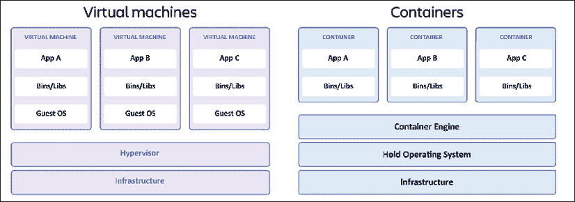
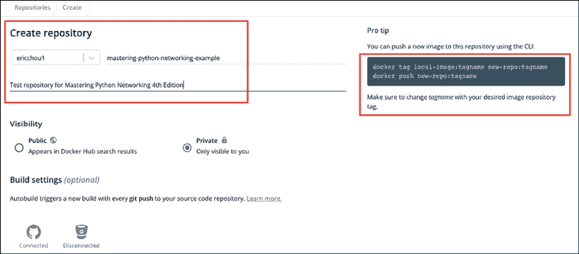
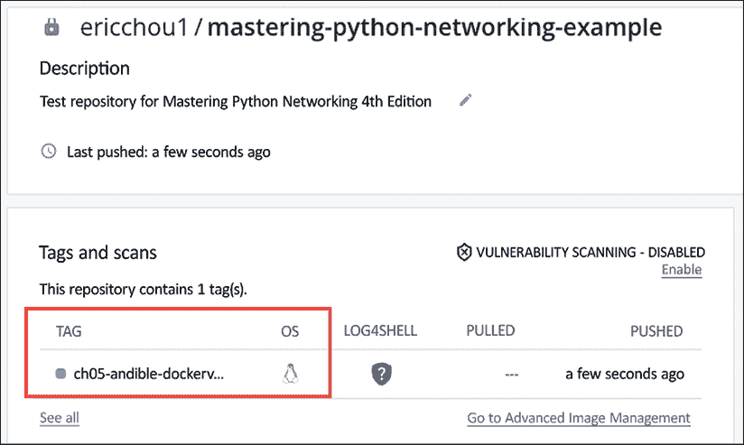
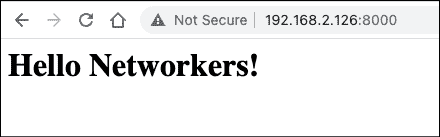

# 5

# 网络工程师的 Docker 容器

计算机硬件虚拟化已经彻底改变了我们处理基础设施的方式。那些必须为单个主机和操作系统分配硬件的日子已经过去了。我们现在可以选择将宝贵的硬件资源，如 CPU、内存和磁盘空间，与多个虚拟机共享，每个虚拟机都有自己的操作系统和应用程序。由于在这些虚拟机上运行的软件与底层硬件资源分离，我们可以根据虚拟机的特定需求分配不同的硬件资源组合。如今，很难想象一个没有虚拟机的世界。

尽管虚拟机在构建应用程序方面非常出色，但它们需要花费一些时间来构建、启动，最终还需要拆除。原因是与虚拟机相关的虚拟化技术完全模拟了实际硬件，使得硬件与客户虚拟机无法区分。

现在可能有人会问：有没有一种方法可以通过更多的虚拟化来加速应用程序的生命周期？答案是肯定的，借助容器。

容器和虚拟机在允许不同隔离的应用程序之间共享计算资源方面相似。区别在于虚拟机在虚拟机管理程序级别进行抽象，而容器是由容器引擎在操作系统内部进行抽象。容器通常被称为操作系统级别的虚拟化。



图 5.1：虚拟机和容器比较（来源：https://www.atlassian.com/microservices/cloud-computing/containers-vs-vms）

在全虚拟机中，我们可以安装不同的操作系统，如 Windows 和 Linux。因为容器虚拟化是由操作系统处理的，所以每个容器都将拥有相同的操作系统。然而，应用程序及其相关资源将被隔离，并独立于彼此运行。容器引擎将配置、软件包和库从每个容器中分离出来。

容器虚拟化并不新鲜；**Linux 容器**（**LXC**）、Solaris 容器、Docker 和 Podman 都是此类实现的例子。在本章中，我们将探讨当今最流行的容器技术 Docker。我们将讨论与 Docker 容器相关的以下主题：

+   Docker 概述

+   使用 Docker 构建 Python 应用程序

+   容器网络

+   网络工程领域的容器

+   Docker 和 Kubernetes

我们将在本书中学习的一些技术中用到容器；这是一个开始熟悉容器的良好起点。

让我们从 Docker 的高级概述开始。

# Docker 概述

Docker 是一套支持容器交付的产品和工具。它始于 2008 年的公司 dotCloud（2013 年更名为 Docker, Inc.）。这套工具包括 Docker 的容器技术、名为 Docker Engine 的容器引擎、名为 Docker Hub 的基于云的容器仓库以及名为 Docker Desktop 的桌面图形用户界面软件。

Docker 有两个版本，**Docker 社区版**（**Docker-CE**）和**Docker 企业版**（**Docker-EE**）。Docker-CE 是一个基于 Apache 2.0 许可证的免费开源平台，而 Docker-EE 是一个面向企业的付费版本。当本书中提到“Docker”一词时，我们指的是社区版。

Docker 容器环境中有三个主要组件：

1.  构建和开发：这包括用于构建容器的工具，包括 CLI 命令、镜像以及我们获取各种基础镜像的仓库。在 Docker 中，我们使用 Dockerfile 来指定容器构建的大多数步骤。

1.  Docker 引擎：这是在后台运行的守护进程。我们可以使用 Docker 命令来管理守护进程。

1.  容器编排：在开发过程中，我们通常会使用 Docker 的`Docker-compose`来管理多容器环境。在生产环境中，一个常见的工具是由谷歌发起的工具，称为 Kubernetes ([`kubernetes.io/`](https://kubernetes.io/))。

在下一节中，我们将讨论 Docker 的优势。

## Docker 的优势

Docker 有许多优势。我们将在此总结其中一些：

1.  Docker 容器部署和销毁都非常快速。

1.  容器优雅地重置。容器是短暂的，当重启时不会留下任何残留的文件。这确保了每次生成新容器时都有一个干净的状态。

1.  它是自包含且确定的。容器通常附带配置文件，其中包含有关如何重建容器的说明。我们可以确信每个容器镜像都是按照相同的方式进行构建的。

1.  它允许应用程序开发和 DevOps 之间的无缝集成。由于上述优点，许多公司已将 Docker 镜像直接部署到生产环境中。容器可以精确地按照开发者的意图进行复制并测试到生产环境中。

现在我们已经对 Docker 有了基本的了解，是时候在我们的 Docker 容器中构建第一个 Python 应用程序了。

# 在 Docker 中构建 Python 应用程序

Docker 容器是构建 Python 应用程序的一种非常流行的方式。

## 安装 Docker

当然，我们需要安装 Docker 才能开始使用它。我们将遵循 DigitalOcean 为 Ubuntu 22.04 提供的优秀安装指南[`www.digitalocean.com/community/tutorials/how-to-install-and-use-docker-on-ubuntu-22-04`](https://www.digitalocean.com/community/tutorials/how-to-install-and-use-docker-on-ubuntu-22-04)。如果您使用的是其他版本的 Linux 发行版，您可以直接从文档中的下拉菜单选择不同的版本。对于 Mac 或 Windows 的安装，我的建议是安装 Docker Desktop[`docs.docker.com/desktop/`](https://docs.docker.com/desktop/)。它将包括 Docker Engine、CLI 客户端和 GUI 应用程序。

```py
$ sudo apt-get update
$ sudo apt-get -y upgrade
$ sudo apt install apt-transport-https ca-certificates curl software-properties-common
$ curl -fsSL https://download.docker.com/linux/ubuntu/gpg | sudo gpg --dearmor -o /usr/share/keyrings/docker-archive-keyring.gpg
$ echo "deb [arch=$(dpkg --print-architecture) signed-by=/usr/share/keyrings/docker-archive-keyring.gpg] https://download.docker.com/linux/ubuntu $(lsb_release -cs) stable" | sudo tee /etc/apt/sources.list.d/docker.list > /dev/null
$ sudo apt update
$ apt-cache policy docker-ce
$ sudo apt install docker-ce 
```

对于 Linux，有一些可选但有用的安装后步骤，请参阅[`docs.docker.com/engine/install/linux-postinstall/`](https://docs.docker.com/engine/install/linux-postinstall/)。

我们可以检查我们的 Docker 安装状态：

```py
$ sudo systemctl status docker
● docker.service - Docker Application Container Engine
     Loaded: loaded (/lib/systemd/system/docker.service; enabled; vendor preset: enabled)
     Active: active (running) since Sun 2022-09-11 15:02:27 PDT; 5s ago
TriggeredBy: ● docker.socket
       Docs: https://docs.docker.com 
```

在下一节中，我们将了解如何使用 Docker 容器构建 Python 应用程序。

## 有用的 Docker 命令

我们将需要使用一些命令来构建、运行和测试我们的容器。

对于更多的 Docker CLI 参考，请查看文档：[`docs.docker.com/engine/reference/run/`](https://docs.docker.com/engine/reference/run/)。

在本章中，我们将使用以下一些命令：

+   `docker run`：`docker run`用于指定从哪个镜像（默认为 Docker Hub）派生容器，网络设置、名称和其他设置。

+   `docker container ls`：列出容器；默认情况下，它只列出当前正在运行的容器。

+   `docker exec`：在运行的容器上运行命令。

+   `docker network`：在需要管理 Docker 网络时使用，例如创建、列出和删除 Docker 网络。

+   `docker image`：管理 Docker 镜像。

还有许多其他的 CLI 命令，但这些已经足够我们开始使用了。对于完整的参考，请查看信息框中提供的链接。

## 构建“hello world”

第一步是确保我们能够访问 Docker Hub 以检索镜像。为此，Docker 提供了一个非常简单的`hello-world`应用程序：

```py
$ docker run hello-world
Hello from Docker!
This message shows that your installation appears to be working correctly.
To generate this message, Docker took the following steps:
 1\. The Docker client contacted the Docker daemon.
 2\. The Docker daemon pulled the "hello-world" image from the Docker Hub.
    (amd64)
 3\. The Docker daemon created a new container from that image which runs the
    executable that produces the output you are currently reading.
 4\. The Docker daemon streamed that output to the Docker client, which sent it
    to your terminal.
<skip> 
```

我们可以看到 Docker 客户端需要执行的各种步骤以显示消息。我们可以显示运行的 Docker 进程：

```py
$ docker ps -a
CONTAINER ID   IMAGE                  COMMAND            CREATED              STATUS                          PORTS     NAMES
3cb4f91b6388   hello-world            "/hello"           About a minute ago   Exited (0) About a minute ago             fervent_torvalds 
```

我们可以看到`hello-world`镜像信息：

```py
$ docker images hello-world
REPOSITORY    TAG       IMAGE ID       CREATED         SIZE
hello-world   latest    feb5d9fea6a5   11 months ago   13.3kB 
```

现在，我们可以构建我们的第一个 Python 应用程序。

## 构建我们的应用程序

让我们先思考一下我们将要构建的内容。由于我们在上一章中构建了一些 Ansible playbooks，我们为什么不将`ios_config_backup.yml` playbooks 容器化，这样我们就可以与其他团队成员共享呢？

我们将创建一个新的文件夹来保存所有文件。如果您还记得，为了构建 Docker 镜像，我们需要一个特殊的文件，称为 Dockerfile。我们也将在这个目录中创建这样一个文件：

```py
$ mkdir ansible_container && cd ansible_container
$ touch Dockerfile 
```

我们还将把`host_vars`文件夹、`ansible.cfg`、`hosts`和`ios_config_backup.yml`文件复制到这个文件夹中。我们还需要确保在从它构建 Docker 容器之前，playbook 能够按预期运行。

Docker 以分层的方式构建自身，从基础镜像开始。在 Dockerfile 中，我们将指定以下行：

```py
# Getting base image
FROM ubuntu:22.04
# No need for interactive prompt
ENV DEBIAN_FRONTEND=noninteractive 
```

以“#”开头的行是注释，就像在 Python 中一样。`FROM`关键字指定了我们将从默认 Docker Hub 检索的基础镜像。所有官方 Ubuntu 镜像都可以在网站上找到，[`hub.docker.com/_/ubuntu`](https://hub.docker.com/_/ubuntu)。在`ENV`语句中，我们指定不需要交互式提示。

Dockerfile 参考可以在[`docs.docker.com/engine/reference/builder/`](https://docs.docker.com/engine/reference/builder/)查看。

让我们构建这个镜像：

```py
$ docker build --tag ansible-docker:v0.1 . 
```

`build`命令从本地目录中的 Dockerfile 构建，并将最终标记为`ansible-docker`的镜像版本为 0.1。一旦完成，我们可以查看镜像：

```py
$ docker images
REPOSITORY              TAG             IMAGE ID       CREATED         SIZE
ansible-docker          v0.1            e99f103e2d36   3 seconds ago   864MB 
```

如果在重建之前需要删除镜像，我们可以使用“`docker rmi <image id>`”删除镜像。

我们可以根据镜像启动容器：

```py
$ docker run -it --name ansible-host1 ansible-docker:v0.1
root@96108c94e1d2:/# lsb_release -a
No LSB modules are available.
Distributor ID: Ubuntu
Description:    Ubuntu 22.04.1 LTS
Release:        22.04
Codename:       jammy
root@96108c94e1d2:/# 
```

它将带我们进入 bash shell 提示符，容器一旦我们退出就会自己停止。为了使其以分离模式运行，我们需要用`"-d"`标志启动它。让我们先删除容器，然后带标志重新创建它：

```py
$ docker ps -a
CONTAINER ID   IMAGE                 COMMAND   CREATED         STATUS                      PORTS     NAMES
<container id>   ansible-docker:v0.1   "bash"    2 minutes ago   Exited (0) 52 seconds ago             ansible-host1
$ docker rm <container id>
$ docker run -it -d --name ansible-host1 ansible-docker:v0.1 
```

记得替换你的容器 ID。一次性删除所有容器的快捷方式是`docker rm -f $(docker ps -a -q)`。

容器现在以分离模式运行，我们可以在容器上执行交互式提示符：

```py
$ docker ps
CONTAINER ID   IMAGE                 COMMAND   CREATED              STATUS          PORTS     NAMES
d3b6a6ec90e5   ansible-docker:v0.1   "bash"    About a minute ago   Up 58 seconds             ansible-host1
$ docker exec -it ansible-host1 bash
root@d3b6a6ec90e5:/# ls 
```

我们可以停止容器，然后删除它：

```py
$ docker stop ansible-host1
$ docker rm ansible-host1 
```

我们将介绍一些更多的 Dockerfile 命令：

```py
# Getting base image
FROM ubuntu:22.04
# No need for interactive prompt
ENV DEBIAN_FRONTEND=noninteractive
# Run any command, i.e. install packages
RUN apt update && apt install -y python3.10 python3-pip ansible vim
RUN pip install ansible-pylibssh
# specify a working directory
WORKDIR /app
COPY . /app 
```

`RUN`命令执行 shell 命令，就像我们在 shell 中输入它们一样。我们可以在容器上指定工作目录为`/app`，然后将当前工作目录中的所有内容（`host_vars`、hosts、playbook 等）复制到远程容器的`/app`目录。

```py
$ docker images
<find the image id>
$ docker rmi <image id>
$ docker build --tag ansible-docker:v0.1 . 
```

我们将保留相同的标签，但如果我们想将其作为新版本发布，我们总是可以将其标记为`v0.2`。

我们将再次启动容器并执行`ansible-playbook`：

```py
$ docker run -it -d --name ansible-host1 ansible-docker:v0.1
docker exec -it ansible-host1 bash
root@5ef5e9c85065:/app# pwd
/app
root@5ef5e9c85065:/app# ls
ansible.cfg  dockerfile  host_vars  hosts  ios_config_backup.yml
root@5ef5e9c85065:/app# ansible-playbook -i hosts ios_config_backup.yml 
PLAY [Back Up IOS Device Configurations] ********************************************************************
TASK [backup] ***********************************************************************************************
changed: [iosv-2]
changed: [iosv-1]
PLAY RECAP **************************************************************************************************
iosv-1                     : ok=1    changed=1    unreachable=0    failed=0    skipped=0    rescued=0    ignored=0   
iosv-2                     : ok=1    changed=1    unreachable=0    failed=0    skipped=0    rescued=0    ignored=0   
root@5ef5e9c85065:/app# ls backup/
iosv-1_config.2022-09-12@23:01:07  iosv-2_config.2022-09-12@23:01:07 
```

一旦容器启动，我们可以通过主机名来启动和停止：

```py
$ docker stop ansible-host1
$ docker start ansible-host1 
```

恭喜你完成了完整的容器工作流程！现在这看起来可能不多，但这是一个很大的进步。现在这些步骤可能看起来有点陌生，但不用担心，随着我们积累更多的实践经验，它们会变得更加熟悉。

## 分享 Docker 镜像

最后一步将是分享容器镜像。一种方法是将目录 tar zip 并分享文件。另一种方法是推送镜像到任何需要访问的人都可以访问的仓库。Docker Hub 是最受欢迎的仓库之一，但还有许多其他仓库。它们通常提供几个不同的订阅价格层。


图 5.2：Docker Hub 定价（来源：[`www.docker.com/pricing/`](https://www.docker.com/pricing/))

除了共享容器镜像外，在 DevOps **CI/CD**（**持续集成/持续交付**）过程中，拥有可访问的仓库至关重要。例如，我们可能会通过自动构建和测试过程提交代码。一旦所有验证测试通过，我们就可以自动将镜像推送到仓库并部署到生产环境。我们将在 Docker Hub 上创建一个私有仓库：



图 5.3：Docker Hub 仓库

然后我们将通过 Docker CLI 进行登录：

```py
$ docker login 
```

然后，我们可以根据远程仓库标记现有镜像，然后将其推送到它。注意以下输出中目标标签名称与 Docker Hub 上的仓库名称匹配。这允许在本地命名时具有灵活性，同时遵守远程团队命名约定。

```py
$ docker tag ansible-docker:v0.1 ericchou1/mastering-python-networking-example:ch05-ansible-dockerv-v0.1
$ docker push ericchou1/mastering-python-networking-example:ch05-ansible-dockerv-v0.1 
```

一旦镜像上传完成，我们就可以访问该镜像，可以直接使用它，或者将其用作另一个 Dockerfile 中的基础镜像。



图 5.4：新上传的镜像

在下一节中，我们将看到如何在开发过程中本地协调多容器设置。

## 使用 Docker-compose 进行容器编排

现代应用程序通常相互依赖。例如，对于 Web 应用程序，我们通常有一个“堆栈”的应用程序。流行的 LAMP 堆栈是一个缩写，代表 Linux、Apache、MySQL 和 PHP/Python，用于指定交付 Web 应用程序所需的组件。在 Docker 的世界里，我们可以使用 docker-compose ([`docs.docker.com/compose/`](https://docs.docker.com/compose/))来指定如何同时构建和运行多个容器。

如果你已经安装了适用于 Mac 或 Windows 的 Docker Desktop，docker-compose 已经包含在内。在 Linux 环境中，需要单独安装 docker-compose。我们将遵循 DigitalOcean 的指南来安装 docker-compose ([`www.digitalocean.com/community/tutorials/how-to-install-and-use-docker-compose-on-ubuntu-22-04`](https://www.digitalocean.com/community/tutorials/how-to-install-and-use-docker-compose-on-ubuntu-22-04))：

```py
$ mkdir -p ~/.docker/cli-plugins/
$ curl -SL https://github.com/docker/compose/releases/download/v2.3.3/docker-compose-linux-x86_64 -o ~/.docker/cli-plugins/docker-compose
$ chmod +x ~/.docker/cli-plugins/docker-compose
$ docker compose version
Docker Compose version v2.3.3 
```

Docker-compose 使用名为`docker-compose.yml`的 YAML 文件来构建环境。有许多旋钮可以指定不同的服务依赖关系、持久卷和打开公共端口。让我们来构建一个简单的示例：

```py
version: '3.9'
services:
  ansible: 
    build: 
      dockerfile: dockerfile
  db:
    image: postgres:14.1-alpine
    environment:
      - POSTGRES_USER=postgres
      - POSTGRES_PASSWORD=postgres
    ports:
      - '5432:5432'
    volumes: 
      - db:/var/lib/postgresql/data
volumes:
  db:
    driver: local 
```

文件中指定了以下内容：

1.  文件指定了两个服务，`ansible`和`db`。每个服务都与`docker run`命令类似。

1.  `ansible`服务使用当前工作目录中名为`dockerfile`的当前 Dockerfile 进行构建。

1.  我们将主机端口 5434 映射到容器端口 5434。

1.  我们为 Postgres 数据库指定了两个环境变量。

1.  我们使用名为`db`的卷，以便将写入数据库的信息持久化在卷中。

想了解更多关于 Docker-compose 的信息，请访问[`docs.docker.com/compose/`](https://docs.docker.com/compose/)。

我们可以使用`docker-compose`命令运行组合服务：

```py
$ docker compose up
…
 Container ansible_container-db-1       Created                                                       0.0s
  Container ansible_container-ansible-1  Created                                                       0.0s
ansible_container-db-1       | 
ansible_container-db-1       | PostgreSQL Database directory appears to contain a database; Skipping initialization
ansible_container-db-1       | 
ansible_container-db-1       | 2022-09-13 00:18:45.195 UTC [1] LOG:  starting PostgreSQL 14.1 on x86_64-pc-linux-musl, compiled by gcc (Alpine 10.3.1_git20211027) 10.3.1 20211027, 64-bit
ansible_container-db-1       | 2022-09-13 00:18:45.196 UTC [1] LOG:  listening on IPv4 address "0.0.0.0", port 5432
ansible_container-db-1       | 2022-09-13 00:18:45.196 UTC [1] LOG:  listening on IPv6 address "::", port 5432
ansible_container-db-1       | 2022-09-13 00:18:45.198 UTC [1] LOG:  listening on Unix socket "/var/run/postgresql/.s.PGSQL.5432"
ansible_container-db-1       | 2022-09-13 00:18:45.201 UTC [21] LOG:  database system was shut down at 2022-09-13 00:18:36 UTC
ansible_container-db-1       | 2022-09-13 00:18:45.204 UTC [1] LOG:  database system is ready to accept connections
… 
```

服务是并发启动的。然后我们可以同时关闭这两个服务：

```py
$ docker compose down
[+] Running 3/3
  Container ansible_container-db-1       Removed                                                       0.2s
  Container ansible_container-ansible-1  Removed                                                       0.0s
  Network ansible_container_default      Removed                                                       0.1s 
```

到目前为止，本书中我们只构建了简单的应用程序。当我们学习本书后面的构建 Web API 时，这可能会更有意义。现在，考虑一下我们如何通过 docker-compose 启动多个容器是很好的。

作为网络工程师，了解 Docker 环境中的网络实现方式会很有趣。这就是下一节的主题。

# 容器网络

容器网络不是一个容易涵盖的主题，因为它涉及的范围和触及的技术数量。这个空间从 Linux 网络，特定类型的 Linux（Ubuntu、Red Hat 等）如何实现网络，到 Docker 对网络的实现。增加复杂性的是，Docker 是一个快速发展的项目，许多第三方插件都可用。

在本节中，我们将坚持介绍 Docker 默认提供的网络选项的基本知识。然后我们将简要解释 overlay、Macvlan 和网络插件选项。

当我们启动一个容器时，它默认可以访问互联网。让我们通过启动一个 Ubuntu 容器并附加到它来进行快速测试：

```py
$ docker run -it ubuntu:22.04
<container launches and attached>
root@dcaa61a548be:/# apt update && apt install -y net-tools iputils-ping
root@dcaa61a548be:/# ifconfig
eth0: flags=4163<UP,BROADCAST,RUNNING,MULTICAST>  mtu 1500
        inet 172.17.0.2  netmask 255.255.0.0  broadcast 172.17.255.255
<skip>
root@dcaa61a548be:/# ping -c 1 www.cisco.com
PING e2867.dsca.akamaiedge.net (104.71.231.76) 56(84) bytes of data.
64 bytes from a104-71-231-76.deploy.static.akamaitechnologies.com (104.71.231.76): icmp_seq=1 ttl=53 time=11.1 ms
--- e2867.dsca.akamaiedge.net ping statistics ---
1 packets transmitted, 1 received, 0% packet loss, time 0ms
rtt min/avg/max/mdev = 11.147/11.147/11.147/0.000 ms 
```

我们可以看到主机有一个与我们的主机 IP 不同的私有 IP。它还可以访问 Ubuntu 仓库来安装软件以及 ping 外部网络。它是如何做到这一点的呢？默认情况下，Docker 创建了三种类型的网络：`bridge`、`host`和`none`。让我们在保持第一个终端窗口中主机运行的同时，打开第二个终端窗口：

```py
$ docker network ls
NETWORK ID     NAME      DRIVER    SCOPE
78e7ab7ea276   bridge    bridge    local
93c142329fc9   host      host      local
da9fe0ed2308   none      null      local 
```

`none`网络选项很简单。它禁用了所有网络，使容器独自坐在一个网络孤岛上。这让我们只剩下`bridge`和`host`选项。默认情况下，Docker 将主机放入桥接网络`docker0`，并使用**虚拟以太网**（**veth**）接口（[`man7.org/linux/man-pages/man4/veth.4.html`](https://man7.org/linux/man-pages/man4/veth.4.html)）来允许它与互联网通信：

```py
$ ip link show
3: docker0: <BROADCAST,MULTICAST,UP,LOWER_UP> mtu 1500 qdisc noqueue state UP mode DEFAULT group default 
    link/ether 02:42:86:7f:f2:40 brd ff:ff:ff:ff:ff:ff
21: veth3fda84e@if20: <BROADCAST,MULTICAST,UP,LOWER_UP> mtu 1500 qdisc noqueue master docker0 state UP mode DEFAULT group default 
    link/ether 9a:f8:83:ae:cb:ea brd ff:ff:ff:ff:ff:ff link-netnsid 0 
```

如果我们启动另一个容器，我们会看到创建了一个额外的 veth 接口，并将其放入相同的桥接组。默认情况下，它们可以相互通信。

## 容器主机网络

我们也可以将主机网络与容器共享。让我们在主机网络中启动一个 Ubuntu 容器。我们还将安装 Python 3.10 和其他软件包：

```py
$ docker run -it --network host ubuntu:22.04
root@network-dev-4:/# apt update && apt install -y net-tools iputils-ping python3.10 vim
root@network-dev-4:/# ifconfig ens160
ens160: flags=4163<UP,BROADCAST,RUNNING,MULTICAST>  mtu 1500
        inet 192.168.2.126  netmask 255.255.255.0  broadcast 192.168.2.255 
```

如果我们现在检查，我们可以看到容器现在与主机网络共享相同的 IP。我们可以创建一个简单的 HTML 页面，并在容器上启动 Python3 内置的 Web 服务器：

```py
root@network-dev-4:/# cat index.html 
<html>
<head></head>
<body><h1>Hello Networkers!</h1></body>
</html> 
root@network-dev-4:/# python3.10 -m http.server
Serving HTTP on 0.0.0.0 port 8000 (http://0.0.0.0:8000/) ... 
```

如果我们在浏览器中打开端口 8000 的 IP 地址，我们可以看到我们创建的页面！



图 5.5：容器主机索引页

如果你主机上（如 iptables 或 ufw）有开启的防火墙，请确保打开端口 8000，以便你可以看到页面。

当我们需要公开服务暴露容器时，主机网络选项很有用。

## 自定义桥接网络

我们还可以创建自定义桥接网络并将容器分组在一起。我们首先创建网络：

```py
$ docker network create network1 
```

我们现在可以将容器分配到自定义桥接网络：

```py
$ docker run -it --network network1 ubuntu:22.04
root@41a977cd9c5b:/# apt update && apt install -y net-tools iputils-ping
root@41a977cd9c5b:/# ifconfig
eth0: flags=4163<UP,BROADCAST,RUNNING,MULTICAST>  mtu 1500
        inet 172.18.0.2  netmask 255.255.0.0  broadcast 172.18.255.255
<skip>
root@41a977cd9c5b:/# ping -c 1 www.cisco.com
PING e2867.dsca.akamaiedge.net (23.206.3.148) 56(84) bytes of data.
64 bytes from a23-206-3-148.deploy.static.akamaitechnologies.com (23.206.3.148): icmp_seq=1 ttl=53 time=13.2 ms 
```

主机现在在其自定义桥接网络中。它有权访问公共互联网和同一桥接网络中的其他容器。如果我们想将特定端口公开到自定义桥接网络中的容器，我们可以使用`–publish`选项将端口映射到`本地主机`：

```py
$ docker run -it --network network1 --publish 8000:8000 ubuntu:22.04 
```

我们可以通过`docker network rm`来删除网络：

```py
$ docker network ls
NETWORK ID     NAME       DRIVER    SCOPE
30aa5d7887bc   network1   bridge    local
$ docker network rm network1 
```

自定义网络选项非常适合开发需要彼此隔离的多容器项目。到目前为止，我们一直在查看单个主机中的网络选项。在下一节中，我们将看到容器之间主机间通信的选项。

## 其他容器网络选项

如果我们仔细查看`docker` `network` `ls`输出，我们可以看到`driver`和`scope`列。Docker 的网络子系统是可插拔的，使用驱动程序。核心网络功能由默认的`bridge`、`host`和`none`驱动程序提供。

其他值得注意的驱动程序如下所示：

+   叠加网络：叠加网络在多个 Docker 守护进程主机之间创建一个分布式网络。

+   Macvlan：macvlan 网络选项旨在为需要直接连接到物理网络的应用程序使用。

+   第三方网络插件：我们可以安装第三方网络插件（[`hub.docker.com/search?q=&type=plugin`](https://hub.docker.com/search?q=&type=plugin)）以获得更多功能。例如，vSphere-storage 插件（[`hub.docker.com/r/vmware/vsphere-storage-for-docker`](https://hub.docker.com/r/vmware/vsphere-storage-for-docker)）使客户能够满足 vSphere 环境中容器的持久存储需求。

叠加网络驱动程序可能是我们将在开发阶段之后需要使用的选项。它的目的是处理数据包在 Docker 守护进程主机之间以及到正确目标容器的路由。例如，一个叠加入口网络将处理传入流量并将负载均衡到正确的容器。由于其复杂性，这通常由选择的编排工具处理，例如 Swarm 或 Kubernetes。如果我们使用公共云提供商，如 Google Kubernetes Engine，他们甚至可能为我们处理这个叠加网络。

# 网络工程领域的容器

容器技术正在改变现代基础设施的建设方式。我们现在有一个额外的抽象层，可以用来克服物理空间、电力、冷却和其他因素的限制。这对于需要向更环保的数据中心过渡的需求尤其如此。

与基于新容器的世界相关联有许多新的挑战和机遇：

+   容器世界的网络。正如我们在上一节中看到的，在容器中进行网络有许多选项。

+   DevOps。在尝试在网络工程中实施 DevOps 实践时，一个挑战是缺乏灵活的、虚拟化的网络设备选项。如果我们能够将网络与主机一起虚拟化，容器有潜力解决这个问题。

+   实验室和测试。如果我们可以通过容器镜像虚拟化网络，这将使实验室和测试变得更加容易。

我们将在第十二章中讨论 DevOps，**与 GitLab 的持续集成**；在下一节中，我们将探讨测试和运行容器化网络操作系统的新方法。

## Containerlab

Containerlab ([`containerlab.dev/`](https://containerlab.dev/)) 是运行容器化网络操作系统的一种方式。这是一个由诺基亚团队发起的项目，由 Roman Dodin 领导（[`twitter.com/ntdvps`](https://twitter.com/ntdvps)）。该团队还负责开发**SR Linux**（**服务路由器 Linux**），一个开源的**网络操作系统**（**NOS**）。尽管起源于诺基亚，Containerlab 支持多个厂商，包括 Arista cEOS、Azure SONiC、Juniper cRPD 等。让我们通过一个快速示例来说明 Containerlab 的工作流程。对于基于 Debian 的系统，我们可以遵循安装步骤（[`containerlab.dev/install/`](https://containerlab.dev/install/)）进行安装。为了隔离安装，我们可以创建一个新的目录：

```py
$ mkdir container_lab && cd container_lab
$ echo "deb [trusted=yes] https://apt.fury.io/netdevops/ /" | sudo tee -a /etc/apt/sources.list.d/netdevops.list
$ sudo apt update && sudo apt install containerlab 
```

我们将定义一个`clab`文件来定义拓扑、镜像和起始配置。在`/etc/containerlab/lab-examples/`目录下有多个示例实验室。我们将使用包含两个 SR Linux 设备通过以太网接口连接的两个节点实验室示例（[`github.com/srl-labs/containerlab/blob/main/lab-examples/srl02/srl2.cfg`](https://github.com/srl-labs/containerlab/blob/main/lab-examples/srl02/srl2.cfg)）。由于 SR Linux 容器镜像可以通过公共仓库下载，这将节省我们单独下载容器镜像的步骤。我们将把这个实验室拓扑命名为`srl02.clab.yml`：

```py
# topology documentation: http://containerlab.dev/lab-examples/two-srls/
# https://github.com/srl-labs/containerlab/blob/main/lab-examples/srl02/srl02.clab.yml
name: srl02
topology:
  nodes:
    srl1:
      kind: srl
      image: ghcr.io/nokia/srlinux
      startup-config: srl1.cfg
    srl2:
      kind: srl
      image: ghcr.io/nokia/srlinux
      startup-config: srl2.cfg
  links:
    - endpoints: ["srl1:e1-1", "srl2:e1-1"] 
```

如文件所示，拓扑由节点和链路组成。节点是 NOS 系统，而链路定义了它们的连接方式。这两个设备配置文件是厂商特定的，在这种情况下，是 SR Linux 配置：

```py
$ cat srl1.cfg 
set / interface ethernet-1/1
set / interface ethernet-1/1 subinterface 0
set / interface ethernet-1/1 subinterface 0 ipv4
set / interface ethernet-1/1 subinterface 0 ipv4 address 192.168.0.0/31
set / interface ethernet-1/1 subinterface 0 ipv6
set / interface ethernet-1/1 subinterface 0 ipv6 address 2002::192.168.0.0/127
set / network-instance default
set / network-instance default interface ethernet-1/1.0
$ cat srl2.cfg 
set / interface ethernet-1/1
set / interface ethernet-1/1 subinterface 0
set / interface ethernet-1/1 subinterface 0 ipv4
set / interface ethernet-1/1 subinterface 0 ipv4 address 192.168.0.1/31
set / interface ethernet-1/1 subinterface 0 ipv6
set / interface ethernet-1/1 subinterface 0 ipv6 address 2002::192.168.0.1/127 
```

我们现在可以使用`containerlab`的`deploy`命令启动实验室：

```py
$ sudo containerlab deploy --topo srl02.clab.yml 
[sudo] password for echou: 
INFO[0000] Containerlab v0.31.1 started                 
INFO[0000] Parsing & checking topology file: srl02.clab.yml
… 
```

从技术上讲，我们不需要使用 `—topo` 选项来指定拓扑。Containerlab 默认会查找 `*.clab.yml` 拓扑文件。然而，我发现指定一个拓扑文件是一个好的实践，以防我们在同一个目录中有多个拓扑文件。

如果成功，我们将看到设备信息。设备名称的格式为 `clab-{ 实验室名称 }-{ 设备名称 }`：

```py
+---+-----------------+--------------+-----------------------+------+---------+----------------+----------------------+
| # |      Name       | Container ID |         Image         | Kind |  State  |  IPv4 Address  |     IPv6 Address     |
+---+-----------------+--------------+-----------------------+------+---------+----------------+----------------------+
| 1 | clab-srl02-srl1 | 7cae81c710d8 | ghcr.io/nokia/srlinux | srl  | running | 172.20.20.2/24 | 2001:172:20:20::2/64 |
| 2 | clab-srl02-srl2 | c75f274284ef | ghcr.io/nokia/srlinux | srl  | running | 172.20.20.3/24 | 2001:172:20:20::3/64 |
+---+-----------------+--------------+-----------------------+------+---------+----------------+----------------------+ 
```

我们可以通过 `ssh` 访问设备；默认用户名和密码都是 `admin`：

```py
$ ssh admin@172.20.20.3
admin@172.20.20.3's password: 
Using configuration file(s): []
Welcome to the srlinux CLI.
Type 'help' (and press <ENTER>) if you need any help using this.
--{ running }--[  ]--
A:srl1# show version 
-------------------------------------------------------------------------------------------------------------------------------
Hostname             : srl1
Chassis Type         : 7220 IXR-D2
Part Number          : Sim Part No.
Serial Number        : Sim Serial No.
System HW MAC Address: 1A:85:00:FF:00:00
Software Version     : v22.6.3
Build Number         : 302-g51cb1254dd
Architecture         : x86_64
Last Booted          : 2022-09-12T03:12:15.195Z
Total Memory         : 1975738 kB
Free Memory          : 219406 kB
-------------------------------------------------------------------------------------------------------------------------------
--{ running }--[  ]--
A:srl1#
A:srl1# quit 
```

将创建一个目录，其中包含与实验室相关的文件：

```py
$ ls clab-srl02/*
clab-srl02/ansible-inventory.yml  clab-srl02/topology-data.json
clab-srl02/ca:
root  srl1  srl2
clab-srl02/srl1:
config  topology.yml
clab-srl02/srl2:
config  topology.yml 
```

我们还可以看到，使用连接到桥接网络的两个 veth 接口创建了一个额外的桥接网络：

```py
(venv) $ ip link show
11: br-4807fa9091c5: <BROADCAST,MULTICAST,UP,LOWER_UP> mtu 1500 qdisc noqueue state UP mode DEFAULT group default 
    link/ether 02:42:72:7a:9d:af brd ff:ff:ff:ff:ff:ff
13: veth3392afa@if12: <BROADCAST,MULTICAST,UP,LOWER_UP> mtu 1500 qdisc noqueue master br-4807fa9091c5 state UP mode DEFAULT group default 
    link/ether be:f0:1a:f2:12:23 brd ff:ff:ff:ff:ff:ff link-netnsid 1
15: veth7417e97@if14: <BROADCAST,MULTICAST,UP,LOWER_UP> mtu 1500 qdisc noqueue master br-4807fa9091c5 state UP mode DEFAULT group default 
    link/ether 92:53:d3:ac:20:93 brd ff:ff:ff:ff:ff:ff link-netnsid 0 
```

我们可以使用 `containerlab destroy` 命令来拆除实验室：

```py
$ sudo containerlab destroy --topo srl02.clab.yml 
[sudo] password for echou: 
INFO[0000] Parsing & checking topology file: srl02.clab.yml 
INFO[0000] Destroying lab: srl02                        
INFO[0001] Removed container: clab-srl02-srl2           
INFO[0001] Removed container: clab-srl02-srl1           
INFO[0001] Removing containerlab host entries from /etc/hosts file 
```

我不知道你们的情况如何，但 Containerlab 是我见过的最容易启动网络实验室的方法。随着更多厂商的支持，它可能有一天会成为我们进行网络测试所需的唯一实验室和测试软件。

在下一节中，我们将简要讨论 Docker 和 Kubernetes 之间的关系，并对 Kubernetes 进行简要概述。

# Docker 和 Kubernetes

正如我们所见，可以使用 Docker 社区提供的工具进行 Docker 镜像和编排。然而，不提及 Kubernetes 就几乎无法想象 Docker 容器。这是因为当涉及到容器编排时，Kubernetes 正在成为这一领域的实际标准。在这一章中，没有足够的空间来涵盖 Kubernetes，但由于它与容器编排的紧密联系，我们至少应该了解 Kubernetes 的基础知识。

Kubernetes ([`kubernetes.io/`](https://kubernetes.io/)) 最初由 Google 开发，但现在由云原生计算基金会管理。它是一个开源的容器编排系统，可以自动部署、扩展和管理容器。该项目从一开始就得到了社区的广泛欢迎，因为它在 Google 内部使用中证明了其可扩展性。

Kubernetes 使用主节点作为控制单元来管理工作节点以部署容器。每个工作节点可以有一个或多个 pod，pod 是 Kubernetes 中的最小单元。pod 是容器部署的地方。当容器部署时，它们通常被分组到分布在 pod 中的不同类型的集合中。

大多数公共云提供商（AWS、Azure、Google 和 DigitalOcean）都提供用户可以尝试的托管 Kubernetes 集群。Kubernetes 文档 ([`kubernetes.io/docs/home/`](https://kubernetes.io/docs/home/)) 也提供了许多教程，用于逐步学习更多关于这项技术的内容。

# 摘要

在本章中，我们学习了容器虚拟化。容器在隔离计算资源方面与虚拟机类似，但在轻量级和快速部署方面有所不同。

我们看到了如何使用 Docker 容器来构建 Python 应用程序，以及如何使用 docker-compose 在单个主机上构建多容器应用程序。

在本章的后面部分，我们学习了如何通过使用默认桥接、自定义桥接和主机选项来使用 Docker 容器构建网络。容器还可以通过 Containerlab 项目帮助进行网络操作系统测试。

在下一章中，我们将探讨如何使用 Python 进行网络安全。

# 加入我们的书籍社区

要加入本书的社区——在这里您可以分享反馈、向作者提问，并了解新书发布——请扫描下面的二维码：

[`packt.link/networkautomationcommunity`](https://packt.link/networkautomationcommunity)


