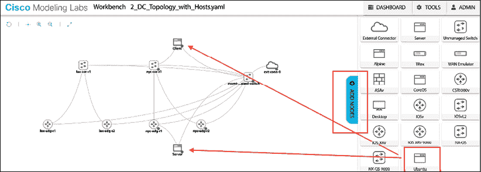
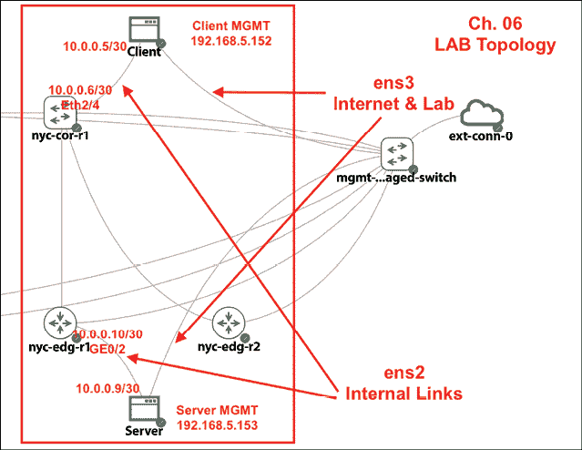
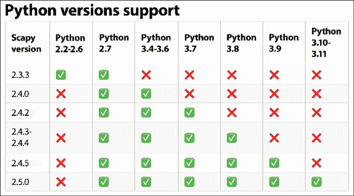
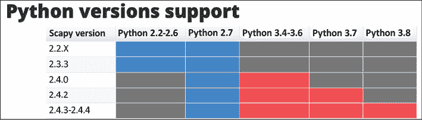

# 6

# 使用 Python 进行网络安全

在我看来，网络安全是一个难以写作的话题。原因不是技术性的，而是与设定正确的范围有关。网络安全的边界非常广泛，触及 OSI 模型的七个层次。从第 1 层的窃听到第 4 层的传输协议漏洞，再到第 7 层的中间人欺骗，网络安全无处不在。新发现的所有漏洞都加剧了这个问题，有时似乎每天都有发生。这还不包括网络安全中的人为社会工程方面。

因此，在本章中，我想设定我们将讨论的范围。正如我们到目前为止所做的那样，我们将主要关注使用 Python 在 OSI 第 3 层和第 4 层进行网络设备安全。我们将查看我们可以用于管理单个网络设备以进行安全目的的 Python 工具，以及使用 Python 作为连接不同组件的粘合剂。希望我们能够使用 Python 在不同 OSI 层上全面处理网络安全。

在本章中，我们将探讨以下主题：

+   实验室设置

+   Python Scapy 用于安全测试

+   访问列表

+   使用 Python 的 Syslog 和**简单防火墙**（**UFW**）进行取证分析

+   其他工具，如 MAC 地址过滤器列表、私有 VLAN 和 Python IP 表绑定

让我们从本章的实验室设置开始看起。

# 实验室设置

本章中使用的设备与前面章节略有不同。在前面章节中，我们隔离了一组特定的设备。对于本章，我们将在实验室中使用更多的 Linux 主机来展示我们将使用的工具的功能。连接性和操作系统信息很重要，因为它们与本章后面我们将展示的安全工具有关。例如，如果我们想应用访问列表来保护服务器，我们需要知道拓扑结构是什么样的，以及客户端连接的方向。Ubuntu 主机的连接方式与我们所见的不同，所以如果需要，请参考此实验室部分，稍后查看示例。

我们将使用与 NYC 节点相同的 Cisco CML 工具，并添加两个额外的 Ubuntu 主机。实验室拓扑结构包含在课程文件中。

在 CML 中添加 Linux 主机的步骤与添加网络节点相同，只需点击**添加节点**并选择 Ubuntu 即可。我们将连接到`nyc-cor-r1`的外部主机命名为客户端，连接到`nyc-cor-edg-r1`的主机命名为服务器：



图 6.1：添加 Ubuntu 主机

这是一个回顾和学习 Ubuntu Linux 网络的好时机。我们将花一些时间列出设置中的 Ubuntu Linux 网络选项。以下是实验室拓扑的概述：



图 6.2：实验室拓扑

列出的 IP 地址可能因您的实验室而异。这里列出它们是为了在章节剩余部分的代码示例中方便引用。

我们将在主机上添加两个双栈链接，一个用于默认网关，连接到未管理的交换机以进行管理和互联网访问。另一个链接用于路由互联网流量。如图所示，我们将使用 `hostname <name>` 命令将顶部的宿主命名为客户端，将底部的宿主命名为服务器。这类似于一个互联网客户端试图访问我们网络内的企业服务器。CML 软件中使用的 Ubuntu Linux 版本是 18.04 LTS：

```py
ubuntu@client:~$ lsb_release -a
No LSB modules are available.
Distributor ID:	Ubuntu
Description:	Ubuntu 18.04.3 LTS
Release:	18.04
Codename:	bionic 
```

要列出和启用链接，我们可以使用 `ip link` 和 `ifconfig` 命令：

```py
ubuntu@client:~$ ip link
1: lo: <LOOPBACK,UP,LOWER_UP> mtu 65536 qdisc noqueue state UNKNOWN mode DEFAULT group default qlen 1000
    link/loopback 00:00:00:00:00:00 brd 00:00:00:00:00:00
2: ens2: <BROADCAST,MULTICAST,UP,LOWER_UP> mtu 1500 qdisc fq_codel state UP mode DEFAULT group default qlen 1000
    link/ether 52:54:00:1e:bc:51 brd ff:ff:ff:ff:ff:ff
3: ens3: <BROADCAST,MULTICAST,UP,LOWER_UP> mtu 1500 qdisc fq_codel state UP mode DEFAULT group default qlen 1000
    link/ether 52:54:00:19:54:b5 brd ff:ff:ff:ff:ff:ff
ubuntu@ubuntu:~$ sudo ifconfig ens3 up 
```

对于主机，当我们首次启动它时，它将在 `/etc/netplan/50-cloud-init.yaml` 下有一个初始网络配置。我们将备份它并创建自己的配置：

```py
ubuntu@ubuntu:/etc/netplan$ cd /etc/netplan/
ubuntu@ubuntu:/etc/netplan$ cp 50-cloud-init.yaml 50-cloud-init.yaml.bak 
ubuntu@ubuntu:/etc/netplan$ sudo rm 50-cloud-init.yaml
ubuntu@ubuntu:/etc/netplan$ sudo touch 50-cloud-init.yaml 
```

对于两个网络链接，我们将使用以下配置来配置 `ens3` 的默认网关（管理和互联网）以及内部链接：

```py
ubuntu@client:~$ cat /etc/netplan/50-cloud-init.yaml 
```

```py
network:
  version: 2
  renderer: networkd
  ethernets:
    ens3:
      dhcp4: no
      dhcp6: no
      addresses: [192.168.2.152/24]
      gateway4: 192.168.2.1
      nameservers:
        addresses: [192.168.2.1,8.8.8.8]
    ens2:
      dhcp4: no
      dhcp6: no
      addresses: [10.0.0.5/30] 
```

要使网络更改生效，我们可以使用 `netplan apply` 命令：

```py
ubuntu@ubuntu:/etc/netplan$ sudo netplan apply 
```

这里是服务器端的一个快速输出：

```py
ubuntu@server:~$ ip link
1: lo: <LOOPBACK,UP,LOWER_UP> mtu 65536 qdisc noqueue state UNKNOWN mode DEFAULT group default qlen 1000
    link/loopback 00:00:00:00:00:00 brd 00:00:00:00:00:00
2: ens2: <BROADCAST,MULTICAST,UP,LOWER_UP> mtu 1500 qdisc fq_codel state UP mode DEFAULT group default qlen 1000
    link/ether 52:54:00:12:9c:5f brd ff:ff:ff:ff:ff:ff
3: ens3: <BROADCAST,MULTICAST,UP,LOWER_UP> mtu 1500 qdisc fq_codel state UP mode DEFAULT group default qlen 1000
    link/ether 52:54:00:0e:f7:ab brd ff:ff:ff:ff:ff:ff
ubuntu@server:~$ cat /etc/netplan/50-cloud-init.yaml 
```

```py
network:
  version: 2
  renderer: networkd
  ethernets:
    ens3:
      dhcp4: no
      dhcp6: no
      addresses: [192.168.2.153/24]
      gateway4: 192.168.2.1
      nameservers:
        addresses: [192.168.2.1,8.8.8.8]
    ens2:
      dhcp4: no
      dhcp6: no
      addresses: [10.0.0.9/30] 
```

我们将把连接的网络放入现有的 OSPF 网络中。以下是 `nyc-cor-r1` 的配置：

```py
nyc-cor-r1# config t
Enter configuration commands, one per line.  End with CNTL/Z.
nyc-cor-r1(config)# int ethernet 2/4
nyc-cor-r1(config-if)# ip add 10.0.0.6/24
nyc-cor-r1(config-if)# ip router ospf 200 area 0.0.0.200
nyc-cor-r1(config-if)# no shut
nyc-cor-r1(config-if)# end
nyc-cor-r1# ping 10.0.0.5
PING 10.0.0.5 (10.0.0.5): 56 data bytes
36 bytes from 10.0.0.6: Destination Host Unreachable
Request 0 timed out
64 bytes from 10.0.0.5: icmp_seq=1 ttl=63 time=4.888 ms
64 bytes from 10.0.0.5: icmp_seq=2 ttl=63 time=2.11 ms
64 bytes from 10.0.0.5: icmp_seq=3 ttl=63 time=2.078 ms
64 bytes from 10.0.0.5: icmp_seq=4 ttl=63 time=0.965 ms
^C
--- 10.0.0.5 ping statistics ---
5 packets transmitted, 4 packets received, 20.00% packet loss
round-trip min/avg/max = 0.965/2.51/4.888 ms
nyc-cor-r1# 
```

`nyc-cor-edg-r1` 的配置如下：

```py
nyc-edg-r1#confi t
Enter configuration commands, one per line.  End with CNTL/Z.
nyc-edg-r1(config)#int gig 0/2
nyc-edg-r1(config-if)#ip add 10.0.0.10 255.255.255.252
nyc-edg-r1(config-if)#no shut
nyc-edg-r1(config-if)#end
nyc-edg-r1#ping 10.0.0.9
Type escape sequence to abort.
Sending 5, 100-byte ICMP Echos to 10.0.0.9, timeout is 2 seconds:
.!!!!
Success rate is 80 percent (4/5), round-trip min/avg/max = 1/3/7 ms
nyc-edg-r1#
nyc-edg-r1#confi t
Enter configuration commands, one per line.  End with CNTL/Z.
nyc-edg-r1(config)#router ospf 200
nyc-edg-r1(config-router)#net
nyc-edg-r1(config-router)#network 10.0.0.8 0.0.0.3 area 200
nyc-edg-r1(config-router)#end
nyc-edg-r1# 
```

下面是可能对那些对基于主机的网络不太熟悉的工程师来说有点棘手的部分。默认情况下，主机也有一个路由优先级。我们为 `ens3` 添加的默认网关将允许我们使用实验室网关作为“最后的手段”的目标。我们可以通过 `route` 命令在主机上查看路由表：

```py
ubuntu@client:~$ route -n
Kernel IP routing table
Destination     Gateway         Genmask         Flags Metric Ref    Use Iface
0.0.0.0         192.168.2.1     0.0.0.0         UG    0      0        0 ens3
10.0.0.4        0.0.0.0         255.255.255.252 U     0      0        0 ens2
192.168.2.0     0.0.0.0         255.255.255.0   U     0      0        0 ens3 
```

我们将使用以下命令通过 `route` 命令将客户端到服务器的流量路由：

```py
ubuntu@client:~$ sudo route add -net 10.0.0.8/30 gw 10.0.0.6
ubuntu@client:~$ route -n
Kernel IP routing table
Destination     Gateway         Genmask         Flags Metric Ref    Use Iface
0.0.0.0         192.168.2.1     0.0.0.0         UG    0      0        0 ens3
10.0.0.4        0.0.0.0         255.255.255.252 U     0      0        0 ens2
10.0.0.8        10.0.0.6        255.255.255.252 UG    0      0        0 ens2
192.168.2.0     0.0.0.0         255.255.255.0   U     0      0        0 ens3 
```

我们将在服务器端做同样的事情：

```py
ubuntu@server:~$ sudo route add -net 10.0.0.4/30 gw 10.0.0.10
ubuntu@server:~$ route -n
Kernel IP routing table
Destination     Gateway         Genmask         Flags Metric Ref    Use Iface
0.0.0.0         192.168.2.1     0.0.0.0         UG    0      0        0 ens3
10.0.0.4        10.0.0.10       255.255.255.252 UG    0      0        0 ens2
10.0.0.8        0.0.0.0         255.255.255.252 U     0      0        0 ens2
192.168.2.0     0.0.0.0         255.255.255.0   U     0      0        0 ens3 
```

为了验证客户端到服务器的路径，让我们使用 ping 和路由跟踪来确保主机之间的流量是通过网络设备而不是默认路由来传输的：

```py
# Install on both client and server
ubuntu@ubuntu:~$ sudo apt install traceroute
# From Server to Client
ubuntu@server:~$ ping -c 1 10.0.0.5
PING 10.0.0.5 (10.0.0.5) 56(84) bytes of data.
64 bytes from 10.0.0.5: icmp_seq=1 ttl=62 time=3.38 ms
--- 10.0.0.5 ping statistics ---
1 packets transmitted, 1 received, 0% packet loss, time 0ms
rtt min/avg/max/mdev = 3.388/3.388/3.388/0.000 ms
ubuntu@server:~$ traceroute 10.0.0.5
traceroute to 10.0.0.5 (10.0.0.5), 30 hops max, 60 byte packets
 1  10.0.0.10 (10.0.0.10)  2.829 ms  5.832 ms  7.396 ms
 2  * * *
 3  10.0.0.5 (10.0.0.5)  11.458 ms  11.459 ms  11.744 ms
# From Client to Server
ubuntu@client:~$ ping -c 1 10.0.0.9
PING 10.0.0.9 (10.0.0.9) 56(84) bytes of data.
64 bytes from 10.0.0.9: icmp_seq=1 ttl=62 time=3.32 ms
--- 10.0.0.9 ping statistics ---
1 packets transmitted, 1 received, 0% packet loss, time 0ms
rtt min/avg/max/mdev = 3.329/3.329/3.329/0.000 ms
ubuntu@client:~$ traceroute 10.0.0.9
traceroute to 10.0.0.9 (10.0.0.9), 30 hops max, 60 byte packets
 1  10.0.0.6 (10.0.0.6)  3.187 ms  3.318 ms  3.804 ms
 2  * * *
 3  10.0.0.9 (10.0.0.9)  11.845 ms  12.030 ms  12.035 ms 
```

最后的任务是为本章剩余部分准备主机，更新仓库：

```py
$ sudo apt update && sudo apt upgrade -y 
$ sudo apt install software-properties-common -y
$ sudo add-apt-repository ppa:deadsnakes/ppa
$ sudo apt install -y python3.10 python3.10-venv
$ python3.10 -m venv venv
$ source venv/bin/activate 
```

太好了！我们的实验室已经准备好了；我们现在可以查看一些使用 Python 的安全工具和措施。

# Python Scapy

Scapy ([`scapy.net`](https://scapy.net)) 是一个基于 Python 的强大交互式数据包构建程序。据我所知，除了少数昂贵的商业程序之外，几乎没有其他工具能像 Scapy 那样做到。它是我的 Python 最喜欢的工具之一。

Scapy 的主要优势在于它允许我们从非常基础的级别构建数据包。用 Scapy 创始人的话来说：

> “Scapy 是一个强大的交互式数据包操纵程序。它能够伪造或解码大量协议的数据包，将它们发送到线路上，捕获它们，匹配请求和回复，等等……与其他大多数工具相比，你不会构建作者没有想象到的东西。这些工具是为特定目标构建的，不能偏离太多。”

现在，让我们看看这个工具。

## 安装 Scapy

在 Python 3 支持方面，Scapy 经历了一段有趣的历程。在 2015 年，从版本 2.2.0 开始，Scapy 有一个独立的分支，名为`Scapy3k`，旨在支持 Python 3。在这本书中，我们使用原始 Scapy 项目的代码库。如果您已经阅读了本书的前一版并使用了仅兼容 Python 2 的 Scapy 版本，请查看 Scapy 每个版本的 Python 3 支持：



图 6.3：Python 版本支持（来源：https://scapy.net/download/）

我们将从源安装官方版本：

```py
(venv) ubuntu@[server|client]:~$ git clone https://github.com/secdev/scapy.git
(venv) ubuntu@[server|client]:~$ cd scapy/
(venv) ubuntu@[server|client]:~/scapy$ sudo python3 setup.py install
(venv) ubuntu@[server|client]:~/scapy$ pip install scapy 
```

安装后，我们可以通过在命令提示符中输入**scapy**来启动 Scapy 交互式 shell：

```py
(venv) ubuntu@client:~$ sudo scapy
…
                     aSPY//YASa
             apyyyyCY//////////YCa       |
            sY//////YSpcs  scpCY//Pp     | Welcome to Scapy
 ayp ayyyyyyySCP//Pp           syY//C    | Version 2.5.0rc1.dev16
 AYAsAYYYYYYYY///Ps              cY//S   |
         pCCCCY//p          cSSps y//Y   | https://github.com/secdev/scapy
         SPPPP///a          pP///AC//Y   |
              A//A            cyP////C   | Have fun!
              p///Ac            sC///a   |
              P////YCpc           A//A   | What is dead may never die!
       scccccp///pSP///p          p//Y   |                     -- Python 2
      sY/////////y  caa           S//P   |
       cayCyayP//Ya              pY/Ya
        sY/PsY////YCc          aC//Yp
         sc  sccaCY//PCypaapyCP//YSs
                  spCPY//////YPSps
                       ccaacs 
```

这里是一个快速测试，以确保我们可以从 Python 3 访问`Scapy`库：

```py
(venv) ubuntu@client:~$ python3.10
Python 3.10.7 (main, Sep  7 2022, 15:23:21) [GCC 7.5.0] on linux
Type "help", "copyright", "credits" or "license" for more information.
>>> from scapy.all import *
>>> exit() 
```

太棒了！Scapy 现在已安装，可以从我们的 Python 解释器中执行。让我们在下一节通过交互式 shell 查看其用法。

## 交互式示例

在我们的第一个例子中，我们将在客户端构建一个**互联网控制消息协议**（**ICMP**）包并发送到服务器。在服务器端，我们将使用带有主机过滤器的`tcpdump`来查看进入的包：

```py
## Client Side
ubuntu@client:~/scapy$ sudo scapy
>>> send(IP(dst="10.0.0.9")/ICMP())
.
Sent 1 packets.
# Server side
ubuntu@server:~/scapy$ sudo tcpdump -i ens2
tcpdump: verbose output suppressed, use -v or -vv for full protocol decode
listening on ens2, link-type EN10MB (Ethernet), capture size 262144 bytes
02:02:24.402707 Loopback, skipCount 0, Reply, receipt number 0, data (40 octets)
02:02:24.658511 IP 10.0.0.5 > server: ICMP echo request, id 0, seq 0, length 8
02:02:24.658532 IP server > 10.0.0.5: ICMP echo reply, id 0, seq 0, length 8 
```

如您所见，使用 Scapy 构建包非常简单。Scapy 允许您通过斜杠（`/`）作为分隔符逐层构建包。`send`函数在第三层操作，负责路由，并为您处理第二层。还有一个`sendp()`替代方案，它在第二层操作，这意味着您需要指定接口和链路层协议。

让我们看看如何使用`send-request`（`sr`）函数来捕获返回的包。我们使用`sr`的一个特殊变体，称为`sr1`，它只返回一个响应于发送的包的包：

```py
>>> p = sr1(IP(dst="10.0.0.9")/ICMP())
Begin emission:
.Finished sending 1 packets.
*
Received 2 packets, got 1 answers, remaining 0 packets
>>> p
<IP  version=4 ihl=5 tos=0x0 len=28 id=5717 flags= frag=0 ttl=62 proto=icmp chksum=0x527f src=10.0.0.9 dst=10.0.0.5 |<ICMP  type=echo-reply code=0 chksum=0xffff id=0x0 seq=0x0 |<Padding  load='\x00\x00\x00\x00\x00\x00\x00\x00\x00\x00\x00\x00\x00\x00\x00\x00\x00\x00' |>>>
>>> 
```

有一个需要注意的事项是，`sr()`函数返回一个包含已响应和未响应列表的元组：

```py
>>> p = sr(IP(dst="10.0.0.9")/ICMP())
.Begin emission:
.....Finished sending 1 packets.
*
Received 7 packets, got 1 answers, remaining 0 packets
>>> type(p)
<class 'tuple'> 
```

现在，让我们看看元组中包含的内容：

```py
>>> ans, unans = sr(IP(dst="10.0.0.9")/ICMP())
.Begin emission:
...Finished sending 1 packets.
..*
Received 7 packets, got 1 answers, remaining 0 packets
>>> type(ans)
<class 'scapy.plist.SndRcvList'>
>>> type(unans)
<class 'scapy.plist.PacketList'> 
```

如果我们只查看响应包列表，我们可以看到它是一个包含我们发送的包以及返回的包的`NamedTuple`：

```py
>>> for i in ans:
...     print(type(i))
...
<class 'scapy.compat.NamedTuple.<locals>._NT'>
>>>
>>>
>>> for i in ans:
...     print(i)
...
QueryAnswer(query=<IP  frag=0 proto=icmp dst=10.0.0.9 |<ICMP  |>>, answer=<IP  version=4 ihl=5 tos=0x0 len=28 id=10871 flags= frag=0 ttl=62 proto=icmp chksum=0x3e5d src=10.0.0.9 dst=10.0.0.5 |<ICMP  type=echo-reply code=0 chksum=0xffff id=0x0 seq=0x0 |<Padding  load='\x00\x00\x00\x00\x00\x00\x00\x00\x00\x00\x00\x00\x00\x00\x00\x00\x00\x00' |>>>) 
```

Scapy 还提供第七层构造，例如 DNS 查询。在以下示例中，我们正在查询一个公开的 DNS 服务器以解析[www.google.com](http://www.google.com)：

```py
>>> p = sr1(IP(dst="8.8.8.8")/UDP()/DNS(rd=1,qd=DNSQR(qname="www.google.com")))
Begin emission:
Finished sending 1 packets.
......*
Received 7 packets, got 1 answers, remaining 0 packets
>>> p
<IP  version=4 ihl=5 tos=0x20 len=76 id=20467 flags= frag=0 ttl=58 proto=udp chksum=0x5d3e src=8.8.8.8 dst=192.168.2.152 |<UDP  sport=domain dport=domain len=56 chksum=0xf934 |<DNS  id=0 qr=1 opcode=QUERY aa=0 tc=0 rd=1 ra=1 z=0 ad=0 cd=0 rcode=ok qdcount=1 ancount=1 nscount=0 arcount=0 qd=<DNSQR  qname='www.google.com.' qtype=A qclass=IN |> an=<DNSRR  rrname='www.google.com.' type=A rclass=IN ttl=115 rdlen=4 rdata=142.251.211.228 |> ns=None ar=None |>>>
>>> 
```

让我们看看 Scapy 的一些其他功能。我们将从使用 Scapy 进行包捕获开始。

## 使用 Scapy 进行包捕获

作为网络工程师，我们在故障排除过程中必须不断在电缆上捕获包。我们通常使用 Wireshark 或类似工具，但 Scapy 也可以用来轻松捕获电缆上的包：

```py
>>> a = sniff(filter="icmp", count=5)
>>> a.show()
0000 Ether / IP / ICMP 192.168.2.152 > 8.8.8.8 echo-request 0 / Raw
0001 Ether / IP / ICMP 8.8.8.8 > 192.168.2.152 echo-reply 0 / Raw
0002 Ether / IP / ICMP 192.168.2.152 > 8.8.8.8 echo-request 0 / Raw
0003 Ether / IP / ICMP 8.8.8.8 > 192.168.2.152 echo-reply 0 / Raw
0004 Ether / IP / ICMP 192.168.2.152 > 8.8.8.8 echo-request 0 / Raw 
```

我们可以更详细地查看包，包括原始格式：

```py
>>> for packet in a:
...     print(packet.show())
...
###[ Ethernet ]###
  dst       = 08:b4:b1:18:01:39
  src       = 52:54:00:19:54:b5
  type      = IPv4
###[ IP ]###
     version   = 4
     ihl       = 5
     tos       = 0x0
     len       = 84
     id        = 38166
     flags     = DF
     frag      = 0
     ttl       = 64
     proto     = icmp
     chksum    = 0xd242
     src       = 192.168.2.152
     dst       = 8.8.8.8
     \options   \
###[ ICMP ]###
        type      = echo-request
        code      = 0
        chksum    = 0x6596
        id        = 0x502f
        seq       = 0x1
        unused    = ''
###[ Raw ]###
           load      = '\\xaa7%c\x00\x00\x00\x00\\xb2\\xcb\x01\x00\x00\x00\x00\x00\x10\x11\x12\x13\x14\x15\x16\x17\x18\x19\x1a\x1b\x1c\x1d\x1e\x1f !"#$%&\'()*+,-./01234567'
<skip> 
```

我们已经看到了 Scapy 的基本工作原理。现在，让我们继续看看我们如何使用 Scapy 进行某些方面的常见安全测试。

## TCP 端口扫描

对于任何潜在的黑客来说，第一步几乎总是尝试了解网络上哪些服务是开放的，以便将他们的攻击重点放在这些服务上。当然，我们需要打开某些端口来服务我们的客户；这是我们必须接受的风险的一部分。然而，我们应该关闭任何其他不必要的开放端口，以减少攻击面。我们可以使用 Scapy 对我们的主机进行简单的 TCP 开放端口扫描。

我们可以发送一个 `SYN` 数据包，看看服务器是否会为各种端口返回 `SYN-ACK`。让我们从 Telnet 开始，TCP 端口 `23`：

```py
>>> p = sr1(IP(dst="10.0.0.9")/TCP(sport=666,dport=23,flags="S"))
Begin emission:
Finished sending 1 packets.
.*
Received 2 packets, got 1 answers, remaining 0 packets
>>> p.show()
###[ IP ]###
  version= 4
  ihl= 5
  tos= 0x0
  len= 40
  id= 14089
  flags= DF
  frag= 0
  ttl= 62
  proto= tcp
  chksum= 0xf1b9
  src= 10.0.0.9
  dst= 10.0.0.5
  \options\
###[ TCP ]###
     sport= telnet
     dport= 666
     seq= 0
     ack= 1
     dataofs= 5
     reserved= 0
     flags= RA
     window= 0
     chksum= 0x9911
     urgptr= 0
     options= [] 
```

注意，在这里的输出中，服务器对于 TCP 端口 `23` 返回了 `RESET+ACK`。然而，TCP 端口 `22`（SSH）是开放的；因此，返回了 `SYN-ACK`：

```py
>>> p = sr1(IP(dst="10.0.0.9")/TCP(sport=666,dport=22,flags="S")).show()
###[ IP ]###
  version= 4
<skip>
  proto= tcp
  chksum= 0x28bf
  src= 10.0.0.9
  dst= 10.0.0.5
  \options\
###[ TCP ]###
     sport= ssh
     dport= 666
     seq= 1671401418
     ack= 1
     dataofs= 6
     reserved= 0
     flags= SA
<skip> 
```

我们还可以扫描从 `20` 到 `22` 的目标端口范围；注意，我们在这里使用 `sr()` 发送-接收而不是 `sr1()` 发送-接收一个数据包的变体：

```py
>>> ans,unans = sr(IP(dst="10.0.0.9")/TCP(sport=666,dport=(20,22),flags="S"))
>>> for i in ans:
...     print(i)
...
QueryAnswer(query=<IP  frag=0 proto=tcp dst=10.0.0.9 |<TCP  sport=666 dport=ftp_data flags=S |>>, answer=<IP  version=4 ihl=5 tos=0x0 len=40 id=0 flags=DF frag=0 ttl=62 proto=tcp chksum=0x28c3 src=10.0.0.9 dst=10.0.0.5 |<TCP  sport=ftp_data dport=666 seq=0 ack=1 dataofs=5 reserved=0 flags=RA window=0 chksum=0x9914 urgptr=0 |<Padding  load='\x00\x00\x00\x00\x00\x00' |>>>)
QueryAnswer(query=<IP  frag=0 proto=tcp dst=10.0.0.9 |<TCP  sport=666 dport=ftp flags=S |>>, answer=<IP  version=4 ihl=5 tos=0x0 len=40 id=0 flags=DF frag=0 ttl=62 proto=tcp chksum=0x28c3 src=10.0.0.9 dst=10.0.0.5 |<TCP  sport=ftp dport=666 seq=0 ack=1 dataofs=5 reserved=0 flags=RA window=0 chksum=0x9913 urgptr=0 |<Padding  load='\x00\x00\x00\x00\x00\x00' |>>>)
QueryAnswer(query=<IP  frag=0 proto=tcp dst=10.0.0.9 |<TCP  sport=666 dport=ssh flags=S |>>, answer=<IP  version=4 ihl=5 tos=0x0 len=44 id=0 flags=DF frag=0 ttl=62 proto=tcp chksum=0x28bf src=10.0.0.9 dst=10.0.0.5 |<TCP  sport=ssh dport=666 seq=4214084277 ack=1 dataofs=6 reserved=0 flags=SA window=29200 chksum=0x4164 urgptr=0 options=[('MSS', 1460)] |<Padding  load='\x00\x00' |>>>) 
```

我们也可以指定一个目标网络而不是单个主机。正如您从 `10.0.0.8/29` 块中可以看到，主机 `10.0.0.9`、`10.0.0.10` 和 `10.0.0.14` 返回了 `SA`，这对应于两个网络设备和主机：

```py
>>> ans,unans = sr(IP(dst="10.0.0.8/29")/TCP(sport=666,dport=(22),flags="S"))
>>> for i in ans:
...     print(i)
...
(<IP  frag=0 proto=tcp dst=10.0.0.14 |<TCP  sport=666 dport=ssh flags=S |>>, <IP  version=4 ihl=5 tos=0x0 len=44 id=7289 flags= frag=0 ttl=64 proto=tcp chksum=0x4a41 src=10.0.0.14 dst=10.0.0.5 |<TCP  sport=ssh dport=666 seq=1652640556 ack=1 dataofs=6 reserved=0 flags=SA window=17292 chksum=0x9029 urgptr=0 options=[('MSS', 1444)] |>>)
(<IP  frag=0 proto=tcp dst=10.0.0.9 |<TCP  sport=666 dport=ssh flags=S |>>, <IP  version=4 ihl=5 tos=0x0 len=44 id=0 flags=DF frag=0 ttl=62 proto=tcp chksum=0x28bf src=10.0.0.9 dst=10.0.0.5 |<TCP  sport=ssh dport=666 seq=898054835 ack=1 dataofs=6 reserved=0 flags=SA window=29200 chksum=0x9f0d urgptr=0 options=[('MSS', 1460)] |>>)
(<IP  frag=0 proto=tcp dst=10.0.0.10 |<TCP  sport=666 dport=ssh flags=S |>>, <IP  version=4 ihl=5 tos=0x0 len=44 id=38021 flags= frag=0 ttl=254 proto=tcp chksum=0x1438 src=10.0.0.10 dst=10.0.0.5 |<TCP  sport=ssh dport=666 seq=371720489 ack=1 dataofs=6 reserved=0 flags=SA window=4128 chksum=0x5d82 urgptr=0 options=[('MSS', 536)] |>>)
>>> 
```

根据我们迄今为止所学的内容，我们可以编写一个简单的脚本以实现可重用性，`scapy_tcp_scan_1.py`：

```py
#!/usr/bin/env python3
from scapy.all import *
import sys
def tcp_scan(destination, dport):
    ans, unans = sr(IP(dst=destination)/TCP(sport=666,dport=dport,flags="S"))
    for sending, returned in ans:
        if 'SA' in str(returned[TCP].flags):
            return destination + " port " + str(sending[TCP].dport) + " is open."
        else:
            return destination + " port " + str(sending[TCP].dport) + " is not open."
def main():
    destination = sys.argv[1]
    port = int(sys.argv[2])
    scan_result = tcp_scan(destination, port)
    print(scan_result)
if __name__ == "__main__":
    main() 
```

在脚本中，我们首先按照建议导入 `scapy` 和 `sys` 模块以接收参数。`tcp_scan()` 函数与我们迄今为止所看到的功能类似，唯一的区别是我们将其功能化，以便可以从参数获取输入，然后在 `main()` 函数中调用 `tcp_scan()` 函数。

记住，访问低级网络需要 root 权限；因此，我们的脚本需要以 `sudo` 方式执行。让我们在端口 `22`（SSH）和端口 `80`（HTTP）上尝试脚本：

```py
ubunbu@client:~$ sudo python3 scapy_tcp_scan_1.py "10.0.0.14" 22
Begin emission:
......Finished sending 1 packets.
*
Received 7 packets, got 1 answers, remaining 0 packets
10.0.0.14 port 22 is open.
ubuntu@client:~$ sudo python3 scapy_tcp_scan_1.py "10.0.0.14" 80
Begin emission:
...Finished sending 1 packets.
*
Received 4 packets, got 1 answers, remaining 0 packets
10.0.0.14 port 80 is not open. 
```

这是一个相对较长的 TCP 扫描脚本示例，展示了使用 Scapy 构造数据包的强大功能。我们在交互式外壳中测试了这些步骤，并通过一个简单的脚本最终确定了用法。现在，让我们看看 Scapy 在安全测试中的一些更多用法示例。

## Ping 收集

假设我们的网络包含 Windows、Unix 和 Linux 机器的混合，网络用户根据 **自带设备**（**BYOD**）政策添加他们的机器；他们可能支持或不支持 ICMP ping。现在，我们可以构建一个包含我们网络三种常见 ping 的文件——ICMP、TCP 和 UDP ping——在 `scapy_ping_collection.py` 中：

```py
#!/usr/bin/env python3
from scapy.all import *
def icmp_ping(destination):
    # regular ICMP ping
    ans, unans = sr(IP(dst=destination)/ICMP())
    return ans
def tcp_ping(destination, dport):
    ans, unans = sr(IP(dst=destination)/TCP(dport=dport,flags="S"))
    return ans
def udp_ping(destination):
    ans, unans = sr(IP(dst=destination)/UDP(dport=0))
    return ans
def answer_summary(ans):
    for send, recv in ans:
        print(recv.sprintf("%IP.src% is alive")) 
```

我们可以在一个脚本中执行网络上的所有三种类型的 ping：

```py
def main():
    print("** ICMP Ping **")
    ans = icmp_ping("10.0.0.13-14")
    answer_summary(ans)
    print("** TCP Ping ***")
    ans = tcp_ping("10.0.0.13", 22)
    answer_summary(ans)
    print("** UDP Ping ***")
    ans = udp_ping("10.0.0.13-14")
    answer_summary(ans)
if __name__ == "__main__":
    main() 
```

到目前为止，希望你会同意我的观点，通过拥有构建自定义数据包的能力，你可以掌控你想要运行的操作和测试类型。沿着使用 Scapy 构建自定义数据包的思路，我们也可以构建数据包来对我们网络进行安全测试。

## 常见攻击

在这个例子中，让我们看看我们如何构建我们的数据包来进行一些经典攻击，比如 *死亡之 ping* ([`en.wikipedia.org/wiki/Ping_of_death`](https://en.wikipedia.org/wiki/Ping_of_death)) 和 *Land 攻击* ([`en.wikipedia.org/wiki/Denial-of-service_attack`](https://en.wikipedia.org/wiki/Denial-of-service_attack))。这些是以前你必须用类似商业软件付费的网络渗透测试。使用 Scapy，你可以在保持完全控制的同时进行测试，并在将来添加更多测试。

第一种攻击发送一个带有虚假 IP 头的数据包到目标主机，例如 IP 头长度为两个和 IP 版本为三个：

```py
def malformed_packet_attack(host): 
       send(IP(dst=host, ihl=2, version=3)/ICMP()) 
```

`ping_of_death_attack` 由一个负载大于 65,535 字节的常规 ICMP 数据包组成：

```py
def ping_of_death_attack(host):
    # https://en.wikipedia.org/wiki/Ping_of_death
    send(fragment(IP(dst=host)/ICMP()/("X"*60000))) 
```

`land_attack` 试图将客户端的响应重定向回客户端，并耗尽主机的资源：

```py
def land_attack(host):
    # https://en.wikipedia.org/wiki/Denial-of-service_attack 
    send(IP(src=host, dst=host)/TCP(sport=135,dport=135)) 
```

这些是相当古老的漏洞或经典攻击，现代操作系统已经不再容易受到它们的影响。对于我们的 Ubuntu 20.04 主机，上述任何攻击都不会使其崩溃。然而，随着更多安全问题的发现，Scapy 是一个很好的工具，可以在等待受影响的供应商提供验证工具之前，对我们的网络和主机进行测试。这在互联网上越来越常见的零日（未提前通知发布）攻击中尤其如此。Scapy 是一个可以做很多我们在这个章节中无法涵盖的事情的工具，但幸运的是，Scapy 有许多开源资源可供参考。

## Scapy 资源

我们在这一章中花费了很多努力与 Scapy 合作。这部分的理由是我对工具的高度评价。我希望你同意 Scapy 是我们网络工程师工具集中的一个伟大工具。Scapy 最好的部分是它始终由一个活跃的用户社区进行开发。

我强烈建议至少浏览一下 Scapy 教程 [`scapy.readthedocs.io/en/latest/usage.html#interactive-tutorial`](http://scapy.readthedocs.io/en/latest/usage.html#interactive-tutorial)，以及任何对你感兴趣的文档。

当然，网络安全不仅仅是构建数据包和测试漏洞。在下一节中，我们将探讨自动化通常用于保护敏感内部资源的访问列表。

# 访问列表

网络访问列表通常是抵御外部入侵和攻击的第一道防线。一般来说，路由器和交换机通过利用高速内存硬件（如 **三值内容可寻址存储器**（TCAM））来处理数据包的速度比服务器快得多。它们不需要看到应用层信息。相反，它们只需检查第 3 层和第 4 层的头部信息，并决定是否可以转发数据包。因此，我们通常将网络设备访问列表作为保护网络资源的第一步。

根据经验法则，我们希望将访问列表尽可能靠近源（客户端）放置。本质上，我们也信任内部主机，不相信网络边界之外的客户端。因此，访问列表通常放置在外部网络接口的入站方向。在我们的实验室场景中，这意味着我们将在 `nyc-cor-r1` 的 Ethernet2/2 上放置一个入站访问列表，该接口直接连接到客户端主机。

如果你对访问列表的方向和位置不确定，以下几点可能对你有所帮助：

+   从网络设备的角度思考访问列表。

+   仅从源和目的 IP 地址的角度简化数据包，并使用一个主机作为示例。

+   在我们的实验室中，从我们的服务器到客户端的流量将具有源 IP 地址 `10.0.0.9`，目的 IP 地址为 `10.0.0.5`。

+   从客户端到服务器的流量将具有源 IP 地址 `10.0.0.5`，目的 IP 地址为 `10.0.0.9`。

显然，每个网络都是不同的，访问列表应该如何构建取决于你的服务器提供的服务。但是，作为一个入站边界访问列表，你应该做以下事情：

+   拒绝 RFC 3030 特殊用途地址源，例如 `127.0.0.0/8`。

+   拒绝 RFC 1918 空间，例如 `10.0.0.0/8`。

+   以源 IP 地址的形式拒绝我们的空间；在这种情况下，`10.0.0.4/30`。

+   允许来自主机 `10.0.0.9` 的入站 TCP 端口 `22`（SSH）和 `80`（HTTP）。

+   拒绝其他所有内容。

这里有一个很好的 bogon 网络列表，可以阻止：[`ipinfo.io/bogon`](https://ipinfo.io/bogon)。

知道要添加什么只是步骤的一半。在下一节中，让我们看看如何使用 Ansible 实现预期的访问列表。

## 使用 Ansible 实现访问列表

实现此访问列表的最简单方法就是使用 Ansible。我们已经在之前的章节中讨论过 Ansible，但在此场景下使用 Ansible 的优势值得重复提及：

+   **易于管理**：对于长的访问列表，我们可以使用 `include` 语句将访问列表分解成更易于管理的部分。然后，较小的部分可以由其他团队或服务所有者管理。

+   **幂等性**：我们可以定期安排剧本执行，并且只有必要的更改会被做出。

+   **每个任务都是明确的**：我们可以分离条目的结构，并将访问列表应用到适当的接口上。

+   **可重用性**：在未来，如果我们添加额外的面向外部的接口，我们只需将设备添加到访问列表的设备列表中。

+   **可扩展性**：您会注意到我们可以使用相同的剧本来构建访问列表并将其应用到正确的接口上。我们可以从小处着手，并在需要时将其扩展为单独的剧本。

主机文件相当标准。我们还将遵循我们的标准，将变量放在`host_vars`文件夹中：

```py
[nxosv-devices]
nyc-cor-r1 
[iosv-devices]
nyc-edg-r1 
```

```py
$ cat host_vars/nyc-cor-r1 
---
ansible_host: 192.168.2.60
ansible_user: cisco
ansible_ssh_pass: cisco
ansible_connection: network_cli
ansible_network_os: nxos
ansbile_become: yes
ansible_become_method: enable
ansible_become_pass: cisco 
```

我们将在剧本中声明变量：

```py
---
- name: Configure Access List
  hosts: "nxosv-devices"
  gather_facts: false
  connection: local
  vars:
    cli:
      host: "{{ ansible_host }}"
      username: "{{ ansible_username }}"
      password: "{{ ansible_password }}" 
```

为了节省空间，我们只展示拒绝 RFC 1918 空间。实施 RFC 3030 和我们的空间的拒绝将与 RFC 1918 空间的步骤相同。请注意，在我们的剧本中我们没有拒绝`10.0.0.0/8`，因为我们的配置目前使用`10.0.0.0`网络进行寻址。当然，我们可以在第一个单主机允许之后，在稍后的条目中拒绝`10.0.0.0/8`，但在这个例子中，我们只是选择省略它：

```py
 tasks:
    - nxos_acl:
        name: border_inbound
        seq: 20
        action: deny
        proto: tcp
        src: 172.16.0.0/12
        dest: any
        log: enable
        state: present
    - nxos_acl:
        name: border_inbound
        seq: 30
        action: deny
        proto: tcp
        src: 192.168.0.0/16
        dest: any
        state: present
        log: enable
<skip> 
```

注意，我们允许从服务器内部发起的已建立连接返回。我们使用最终的显式`deny` `ip` `any`语句作为高序列号（`1000`），这样我们就可以在以后插入任何新的条目。

然后，我们可以将访问列表应用到正确的接口上：

```py
 - name: apply ingress acl to Ethernet 2/4
      nxos_acl_interface: 
        name: border_inbound
        interface: Ethernet2/4
        direction: ingress
        state: present 
```

这可能看起来为单个访问列表做的工作很多。对于经验丰富的工程师来说，使用 Ansible 来完成这项任务可能比仅仅登录到设备并配置访问列表要花更长的时间。然而，请记住，这个剧本可以在未来多次重用，所以从长远来看，这将为您节省时间。

根据我的经验，对于长访问列表，一些条目可能用于一个服务，一些条目用于另一个服务，依此类推。访问列表往往会随着时间的推移自然增长，并且很难追踪每个条目的来源和目的。我们可以将它们分开的事实使得管理长访问列表变得更加简单。

现在，让我们在`nx-osv-1`上执行剧本并`verify`：

```py
$ ansible-playbook -i hosts access_list_nxosv.yml 
PLAY [Configure Access List] ******************************************************************************
TASK [nxos_acl] *******************************************************************************************
ok: [nyc-cor-r1]
<skip>
TASK [nxos_acl] *******************************************************************************************
ok: [nyc-cor-r1]
TASK [apply ingress acl to Ethernet 2/4] ******************************************************************
changed: [nyc-cor-r1]
PLAY RECAP ************************************************************************************************
nyc-cor-r1                 : ok=7    changed=1    unreachable=0    failed=0    skipped=0    rescued=0    ignored=0   
<skip> 
```

我们应该登录到`nyc-cor-r1`来验证更改：

```py
nyc-cor-r1# sh ip access-lists border_inbound
IP access list border_inbound
        20 deny tcp 172.16.0.0/12 any log
        30 deny tcp 192.168.0.0/16 any log
        40 permit tcp any 10.0.0.9/32 eq 22 log
        50 permit tcp any 10.0.0.9/32 eq www log
        60 permit tcp any any established log
        1000 deny ip any any log
nx-osv-1# sh run int eth 2/4
!
interface Ethernet2/1
  description to Client
  no switchport
  mac-address fa16.3e00.0001
  ip access-group border_inbound in
  ip address 10.0.0.6/30
  ip router ospf 1 area 0.0.0.0
  no shutdown 
```

我们已经看到了实现 IP 访问列表的示例，该访问列表在网络中检查第 3 层信息。在下一节中，让我们看看如何在第 2 层环境中限制设备访问。

## MAC 访问列表

在您有第 2 层环境，或者在使用以太网接口上的非 IP 协议的情况下，您仍然可以使用基于 MAC 地址的访问列表来允许或拒绝基于 MAC 地址的主机。步骤与 IP 访问列表类似，但匹配将基于 MAC 地址。回想一下，对于 MAC 地址或物理地址，前六个十六进制符号属于一个**组织唯一标识符**（**OUI**）。因此，我们可以使用相同的访问列表匹配模式来拒绝一组特定的主机。

我们正在使用`ios_config`模块在 IOSv 上进行测试。对于较旧的 Ansible 版本，每次执行剧本时都会推送更改。对于较新的 Ansible 版本，控制节点会首先检查更改，只有在需要时才会进行更改。

`host`文件和剧本的上半部分与 IP 访问列表相似；`tasks`部分是使用不同模块和参数的地方：

```py
<skip>
 tasks:
    - name: Deny Hosts with vendor id fa16.3e00.0000  
      ios_config: 
        lines:
          - access-list 700 deny fa16.3e00.0000 0000.00FF.FFFF
          - access-list 700 permit 0000.0000.0000 FFFF.FFFF.FFFF
    - name: Apply filter on bridge group 1
      ios_config:
        lines: 
          - bridge-group 1
          - bridge-group 1 input-address-list 700
        parents
          - interface GigabitEthernet0/1 
```

我们可以在`iosv-1`上执行剧本并验证其应用：

```py
$ ansible-playbook -i hosts access_list_mac_iosv.yml
TASK [Deny Hosts with vendor id fa16.3e00.0000] ****************************************************************************
changed: [nyc-edg-r1]
TASK [Apply filter on bridge group 1] ***************************************************************************************
changed: [nyc-edg-r1] 
```

如我们之前所做的那样，让我们登录到设备以验证我们的更改：

```py
nyc-edg-r1#sh run int gig 0/1
!
interface GigabitEthernet0/1
 description to nyc-cor-r1
 <skip>
 bridge-group 1
 bridge-group 1 input-address-list 700
end 
```

随着更多虚拟网络的普及，第三层信息有时对底层虚拟链路来说是透明的。在这些情况下，如果需要限制对这些链路的访问，MAC 访问列表是一个不错的选择。在本节中，我们已使用 Ansible 自动化实现第二层和第三层访问列表的实施。现在，让我们稍微改变一下方向，但仍然保持在安全背景下，看看如何使用 Python 从`syslogs`中提取必要的安全信息。

# Syslog 搜索

在一段较长的时间内，发生了许多记录在案的网络安全漏洞。在这些缓慢的漏洞中，我们经常在日志中看到迹象和痕迹，表明存在可疑活动。这些迹象可以在服务器和网络设备日志中找到。活动没有被检测到，并不是因为没有足够的信息，而是因为信息**太多**。我们正在寻找的关键信息通常深埋在难以整理的信息堆中。

除了 Syslog 之外，UFW 也是服务器日志信息的一个很好的来源。它是 IP 表的前端，而 IP 表是一个服务器防火墙。UFW 使得管理防火墙规则变得非常简单，并记录了大量信息。有关 UFW 的更多信息，请参阅*其他工具*部分。

在本节中，我们将尝试使用 Python 搜索 Syslog 文本，以检测我们正在寻找的活动。当然，我们将搜索的确切术语将取决于我们使用的设备。例如，Cisco 提供了一份在 Syslog 中查找任何访问列表违规日志的消息列表。它可在[`www.cisco.com/c/en/us/about/security-center/identify-incidents-via-syslog.html`](http://www.cisco.com/c/en/us/about/security-center/identify-incidents-via-syslog.html)找到。

想要了解更多关于访问控制列表日志的信息，请访问[`www.cisco.com/c/en/us/about/security-center/access-control-list-logging.html`](http://www.cisco.com/c/en/us/about/security-center/access-control-list-logging.html)。

在我们的练习中，我们将使用一个包含大约 65,000 行日志消息的 Nexus 交换机匿名 Syslog 文件。此文件已包含在本书的 GitHub 存储库中：

```py
$ wc -l sample_log_anonymized.log
65102 sample_log_anonymized.log 
```

我们已经从思科文档中插入了一些 Syslog 消息（[`www.cisco.com/c/en/us/support/docs/switches/nexus-7000-series-switches/118907-configure-nx7k-00.html`](https://www.cisco.com/c/en/us/support/docs/switches/nexus-7000-series-switches/118907-configure-nx7k-00.html)）作为我们应该寻找的日志消息：

```py
2014 Jun 29 19:20:57 Nexus-7000 %VSHD-5-VSHD_SYSLOG_CONFIG_I: Configured
from vty by admin on console0
2014 Jun 29 19:21:18 Nexus-7000 %ACLLOG-5-ACLLOG_FLOW_INTERVAL: Src IP:
10.1 0.10.1,
Dst IP: 172.16.10.10, Src Port: 0, Dst Port: 0, Src Intf: Ethernet4/1, Pro tocol: "ICMP"(1), Hit-count = 2589
2014 Jun 29 19:26:18 Nexus-7000 %ACLLOG-5-ACLLOG_FLOW_INTERVAL: Src IP:
10.1 0.10.1, Dst IP: 172.16.10.10, Src Port: 0, Dst Port: 0, Src Intf: Ethernet4/1, Pro tocol: "ICMP"(1), Hit-count = 4561 
```

我们将使用简单的例子和正则表达式。如果你已经熟悉 Python 中的正则表达式模块，可以自由跳过本节的其余部分。

## 使用正则表达式模块进行搜索

对于我们的第一次搜索，我们将简单地使用正则表达式模块来搜索我们正在寻找的术语。我们将使用一个简单的循环来完成以下操作：

```py
#!/usr/bin/env python3
import re, datetime
startTime = datetime.datetime.now()
with open('sample_log_anonymized.log', 'r') as f:
    for line in f.readlines():
        if re.search('ACLLOG-5-ACLLOG_FLOW_INTERVAL', line):
            print(line)
endTime = datetime.datetime.now()
elapsedTime = endTime - startTime
print("Time Elapsed: " + str(elapsedTime)) 
```

搜索日志文件大约需要四百分之一秒：

```py
$ python3 python_re_search_1.py
2014 Jun 29 19:21:18 Nexus-7000 %ACLLOG-5-ACLLOG_FLOW_INTERVAL: Src IP: 10.1 0.10.1,
2014 Jun 29 19:26:18 Nexus-7000 %ACLLOG-5-ACLLOG_FLOW_INTERVAL: Src IP: 10.1 0.10.1,
Time Elapsed: 0:00:00.047249 
```

建议编译搜索词以实现更高效的搜索。由于脚本已经相当快，这不会对我们影响很大。Python 的解释性可能使其变慢。然而，当我们搜索更大的文本体时，这会有所不同，所以让我们做出改变：

```py
searchTerm = re.compile('ACLLOG-5-ACLLOG_FLOW_INTERVAL') 
with open('sample_log_anonymized.log', 'r') as f:
for line in f.readlines():
if re.search(searchTerm, line): 
    print(line) 
```

实际的计时结果实际上更慢：

```py
Time Elapsed: 0:00:00.081541 
```

让我们稍微扩展一下这个例子。假设我们有几个文件和多个术语要搜索，我们将复制原始文件到一个新文件中：

```py
$ cp sample_log_anonymized.log sample_log_anonymized_1.log 
```

我们还将包括搜索`PAM: Authentication failure`这个术语。我们将添加另一个循环来搜索两个文件：

```py
term1 = re.compile('ACLLOG-5-ACLLOG_FLOW_INTERVAL')
term2 = re.compile('PAM: Authentication failure')
fileList = ['sample_log_anonymized.log', 'sample_log_anonymized_1.log']
for log in fileList:
    with open(log, 'r') as f:
        for line in f.readlines():
            if re.search(term1, line) or re.search(term2, line):
                print(line) 
```

通过扩展我们的搜索词和消息数量，我们现在可以看到性能的差异：

```py
$ python3 python_re_search_2.py
2016 Jun 5 16:49:33 NEXUS-A %DAEMON-3-SYSTEM_MSG: error: PAM:
Authentication failure for illegal user AAA from 172.16.20.170 - sshd[4425]
2016 Sep 14 22:52:26.210 NEXUS-A %DAEMON-3-SYSTEM_MSG: error: PAM:
Authentication failure for illegal user AAA from 172.16.20.170 - sshd[2811]
<skip>
2014 Jun 29 19:21:18 Nexus-7000 %ACLLOG-5-ACLLOG_FLOW_INTERVAL: Src IP:
10.1 0.10.1,
2014 Jun 29 19:26:18 Nexus-7000 %ACLLOG-5-ACLLOG_FLOW_INTERVAL: Src IP:
10.1 0.10.1,
<skip>
Time Elapsed: 0:00:00.330697 
```

当然，当谈到性能调整时，这是一个永无止境、不可能达到零点的竞赛，性能有时取决于你使用的硬件。但重要的是要定期使用 Python 对你的日志文件进行审计，这样你就可以捕捉到任何潜在违规的早期信号。

我们已经探讨了在 Python 中增强我们的网络安全的一些关键方法，但还有一些其他强大的工具可以使这个过程更容易、更有效。在本章的最后部分，我们将探讨一些这些工具。

# 其他工具

我们可以使用 Python 自动化并使用其他网络安全工具。让我们看看两个最常用的工具。

## 私有 VLAN

**虚拟局域网（VLANs**）已经存在很长时间了。它们本质上是一组广播域，其中所有主机都可以连接到单个交换机，但被分割到不同的域中，因此我们可以根据哪些主机可以通过广播看到其他主机来分离主机。让我们考虑一个基于 IP 子网的映射。例如，在一个企业建筑中，我可能会在每个物理楼层看到一个 IP 子网：一楼为`192.168.1.0/24`，二楼为`192.168.2.0/24`，依此类推。在这个模式中，我们为每个楼层使用一个`/24`块。这为我的物理网络以及我的逻辑网络提供了一个清晰的界定。想要在其子网之外通信的主机需要通过其层 3 网关进行穿越，在那里我可以使用访问列表来强制执行安全性。

当不同的部门位于同一楼层时会发生什么？也许财务和销售团队在二楼，我不希望销售团队的主持人与财务团队处于同一个广播域。我可以进一步细分子网，但这可能会变得繁琐，并破坏之前设置的子网标准方案。这就是私有 VLAN 能发挥作用的地方。

私有 VLAN 本质上将现有的 VLAN 分割成子 VLAN。私有 VLAN 中有三个类别：

+   **混杂（P）端口**：此端口允许从 VLAN 上的任何其他端口发送和接收层 2 帧；这通常属于连接到层 3 路由器的端口。

+   **隔离（I）端口**：此端口仅允许与 P 端口通信，通常在您不希望它与同一 VLAN 中的其他主机通信时连接到主机。

+   **社区（C）端口**：此端口允许与同一社区中的其他 C 端口以及 P 端口通信。

我们可以再次使用 Ansible 或之前介绍过的任何其他 Python 脚本来完成此任务。到目前为止，我们应该已经积累了足够的实践和信心，可以通过自动化来实现此功能，因此这里不再重复步骤。当您需要进一步隔离层 2 VLAN 中的端口时，了解私有 VLAN 功能将非常有用。

## UFW 与 Python

我们简要提到了 UFW 作为 Ubuntu 主机上 IP 表的前端。以下是一个快速概述：

```py
$ sudo apt-get install ufw
$ sudo ufw status
$ sudo ufw default outgoing
$ sudo ufw allow 22/tcp
$ sudo ufw allow www
$ sudo ufw default deny incoming
We can see the status of UFW:
$ sudo ufw status verbose Status: active
Logging: on (low)
Default: deny (incoming), allow (outgoing), disabled (routed) New profiles: skip
To Action From
-- ------ ----
22/tcp ALLOW IN Anywhere
80/tcp ALLOW IN Anywhere
22/tcp (v6) ALLOW IN Anywhere (v6)
80/tcp (v6) ALLOW IN Anywhere (v6) 
```

如您所见，UFW 的优势在于它提供了一个简单的界面来构建其他情况下复杂的 IP 表规则。我们可以使用与 UFW 一起使用的几个 Python 相关工具来使事情更加简单：

+   我们可以使用 Ansible UFW 模块来简化我们的操作。更多信息请参阅[`docs.ansible.com/ansible/latest/collections/community/general/ufw_module.html`](https://docs.ansible.com/ansible/latest/collections/community/general/ufw_module.html)。

+   在 UFW 旁边有 Python 包装模块作为 API（访问 [`gitlab.com/dhj/easyufw`](https://gitlab.com/dhj/easyufw)）。如果你需要根据某些事件动态修改 UFW 规则，这将使集成更容易。

+   UFW 本身是用 Python 编写的。因此，如果我们需要扩展当前的命令集，你可以使用现有的 Python 知识。更多信息请参阅 [`launchpad.net/ufw`](https://launchpad.net/ufw)。

UFW 证明是一个很好的工具，可以保护你的网络服务器。

# 进一步阅读

Python 是一个非常常用的语言，在许多与安全相关的领域中使用。以下是我推荐的一些书籍：

+   **《暴力 Python》**：黑客、法医分析师、渗透测试人员和安全工程师的食谱，作者 T.J. O’Connor（ISBN-10: 1597499579）

+   **《黑帽 Python》**：黑客和渗透测试人员的 Python 编程，作者 Justin Seitz（ISBN-10: 1593275900）

我在 A10 Networks 的 **分布式拒绝服务**（**DDoS**）研究工作中广泛使用了 Python。如果你有兴趣了解更多，指南可以免费下载，请访问 [`www.a10networks.com/resources/ebooks/distributed-denial-service-ddos/`](https://www.a10networks.com/resources/ebooks/distributed-denial-service-ddos/)。

# 摘要

在本章中，我们探讨了使用 Python 进行网络安全。我们使用 Cisco CML 工具设置实验室，包括主机和网络设备，包括 NX-OSv 和 IOSv 类型。我们参观了 Scapy，它允许我们从底层构建数据包。

Scapy 可以用于交互模式进行快速测试。一旦在交互模式下完成测试，我们可以将这些步骤放入文件中进行更可扩展的测试。它可以用于执行针对已知漏洞的各种网络渗透测试。

我们还探讨了如何使用 IP 访问列表和 MAC 访问列表来保护我们的网络。它们通常是我们的网络保护中的第一道防线。使用 Ansible，我们可以快速且一致地将访问列表部署到多个设备。

Syslog 和其他日志文件包含有用的信息，我们应该定期检查以检测任何早期入侵迹象。使用 Python 正则表达式，我们可以系统地搜索指向需要我们注意的安全事件的已知日志条目。除了我们讨论的工具之外，私有 VLAN 和 UFW 是其他一些我们可以用于更多安全保护的实用工具。

在 *第七章*，*使用 Python 进行网络监控（第一部分*），我们将探讨如何使用 Python 进行网络监控。监控使我们能够了解网络中正在发生的事情，以及网络的状态。

# 加入我们的书籍社区

要加入这本书的社区——在那里你可以分享反馈、向作者提问，并了解新版本——请扫描下面的二维码：

[`packt.link/networkautomationcommunity`](https://packt.link/networkautomationcommunity)


