# 第七章：使用 Python 进行网络监控——第一部分

想象一下，你在凌晨 2 点接到公司网络操作中心的电话。电话那头的人说：“嗨，我们遇到了一个影响生产服务的问题，我们怀疑可能是网络相关的问题。你能帮我们检查一下吗？”对于这种紧急的开放式问题，你首先会做什么？大多数情况下，你可能会想到：网络在正常工作和出现问题之间发生了什么变化？我们会检查我们的监控工具，看看在过去几小时内是否有任何关键指标发生变化。更好的是，我们可能已经收到了任何偏离正常基线数值的监控警报。

在整本书中，我们一直在讨论系统地对我们网络进行可预测的更改的各种方法，目的是让网络尽可能平稳运行。然而，网络并非静态——远非如此。它们可能是整个基础设施中最流动的部分。根据定义，网络连接基础设施的不同部分，不断进行双向流量传输。

有许多因素可能导致我们的网络无法按预期工作：硬件故障、有缺陷的软件、尽管有最好的意图但人为错误，等等。这不是一个会不会出错的问题，而是出错的时机和出错的内容。我们需要监控网络，确保它按预期工作，并在它不工作时通知我们。

在接下来的两章中，我们将探讨执行网络监控任务的各种方法。到目前为止，我们查看的许多工具都可以通过 Python 连接起来或直接管理。就像我们查看过的许多工具一样，网络监控也有两个部分。

首先，我们需要知道设备可以传输哪些监控相关信息。其次，我们需要确定我们可以从数据中解释哪些有用、可操作的信息。

在本章中，我们将首先探讨一些能够有效监控网络的工具：

+   实验室设置

+   **简单网络管理协议**（**SNMP**）和相关 Python 库用于处理 SNMP

+   Python 可视化库：

    +   Matplotlib 和示例

    +   Pygal 和示例

+   Python 与 MRTG 和 Cacti 集成进行网络可视化

这个列表并不全面，网络监控领域的商业供应商当然也不少。然而，我们将探讨的网络监控的基本原理，无论是开源工具还是商业工具都适用。

# 实验室设置

本章的实验室由 IOSv 设备组成，以简化设备配置。我们将使用这个实验室以及下一章的实验室。拓扑结构如下：

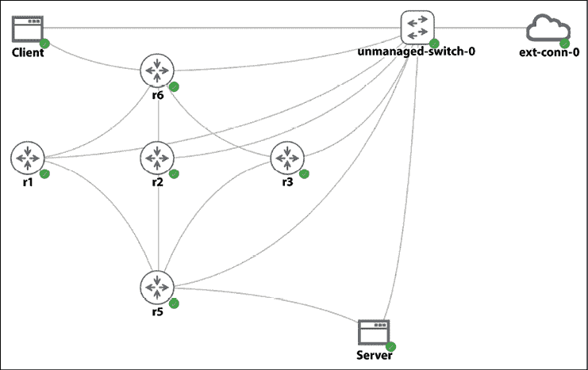

图 7.1：实验室拓扑结构

设备配置如下：

| **设备** | **管理 IP** | **环回 IP** |
| --- | --- | --- |
| r1 | `192.168.2.218` | `192.168.0.1` |
| r2 | `192.168.2.219` | `192.168.0.2` |
| r3 | `192.168.2.220` | `192.168.0.3` |
| r5 | `192.168.2.221` | `192.168.0.4` |
| r6 | `192.168.2.222` | `192.168.0.5` |

Ubuntu 主机的信息如下：

| **设备名称** | **外部链接 Eth0** | **内部 IP Eth1** |
| --- | --- | --- |
| 客户端 | `192.168.2.211` | `10.0.0.9` |
| 服务器 | `192.168.2.212` | `10.0.0.5` |

Linux 主机是 `tinycore-linux` ([`tinycorelinux.net/`](http://tinycorelinux.net/))，从之前的 VIRL 版本迁移而来。默认用户名和密码都是 `cisco`。如果我们需要更改接口 IP 和默认网关，可以通过以下命令完成：

```py
cisco@Client:~$ sudo ifconfig eth0 192.168.2.211 netmask 255.255.255.0
cisco@Client:~$ sudo route add default gw 192.168.2.1
cisco@Server:~$ sudo ifconfig eth0 192.168.2.212 netmask 255.255.255.0
cisco@Server:~$ sudo route add default gw 192.168.2.1 
```

将使用两个 Ubuntu 主机在网络中生成流量，以便我们可以查看一些非零计数器。实验室文件包含在本书的 GitHub 仓库中。

# SNMP

SNMP 是一种用于收集和管理设备的标准化协议。尽管标准允许您使用 SNMP 进行设备管理，但根据我的经验，大多数网络管理员更喜欢将 SNMP 仅作为信息收集机制。由于 SNMP 在无连接的 UDP 上运行，并且考虑到版本 1 和 2 中相对较弱的安全机制，通过 SNMP 进行设备更改往往会让网络运营商感到不安。SNMP 版本 3 在协议中增加了加密安全性和新的概念和术语，但 SNMP 版本 3 的适应方式在不同网络设备供应商之间有所不同。

SNMP 在网络监控中被广泛使用，自 1988 年作为 RFC 1065 的一部分以来一直存在。操作简单，网络管理员向设备发送 `GET` 和 `SET` 请求，具有 SNMP 代理的设备根据请求返回信息。最广泛采用的标准是 SNMPv2c，定义在 RFC 1901 – RFC 1908 中。它使用基于社区的简单安全方案进行安全保护。它还引入了新的功能，例如获取大量信息的能力。以下图表显示了 SNMP 的高级操作：

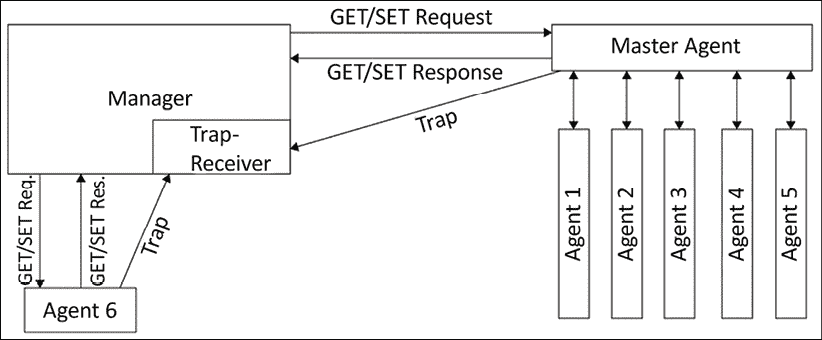

图 7.2：SNMP 操作

设备中驻留的信息以 **管理信息库**（**MIB**）的结构化形式存在。MIB 使用包含 **对象标识符**（**OID**）的分层命名空间，它代表可以读取并反馈给请求者的信息。当我们谈论使用 SNMP 查询设备信息时，我们是在谈论使用管理站查询代表我们所需信息的特定 OID。一个常见的 OID 结构，如系统和接口 OID，在供应商之间是共享的。除了常见的 OID，每个供应商还可以提供针对他们自己的企业级 OID。

作为操作员，我们必须在我们的环境中投入一些努力，将信息整合到 OID 结构中，以便检索有用的信息。这有时可能是一个繁琐的过程，一次只找到一个 OID。例如，你可能会请求一个设备 OID 并收到一个值为 10,000。这个值是什么？是接口流量吗？是字节还是比特？或者它可能代表数据包的数量？我们怎么知道？我们需要查阅标准或供应商文档来找出答案。有一些工具可以帮助这个过程，例如可以提供更多元数据的 MIB 浏览器。但至少在我的经验中，为你的网络构建基于 SNMP 的监控工具有时感觉像是一场猫捉老鼠的游戏，试图找到那个缺失的值。

从操作中可以吸取的一些主要观点如下：

+   实现高度依赖于设备代理可以提供的信息量。这反过来又取决于供应商如何对待 SNMP：作为一个核心功能还是一个附加功能。

+   SNMP 代理通常需要从控制平面获取 CPU 周期来返回一个值。这不仅对具有大型 BGP 表等设备的设备来说效率低下，而且使用 SNMP 在小间隔内查询数据也是不可行的。

+   用户需要知道 OID 来查询数据。

由于 SNMP 已经存在了一段时间，我假设你已经对它有一些经验了。让我们直接进入包安装和我们的第一个 SNMP 示例。

## 设置

首先，让我们确保我们的 SNMP 管理设备和代理在我们的设置中正常工作。SNMP 包可以安装在我们实验室中的主机（客户端或服务器）或管理网络中的管理设备上。只要 SNMP 管理器对设备有 IP 可达性，并且被管理设备允许入站连接，SNMP 就应该工作。在生产环境中，你应该只在管理主机上安装软件，并且只在控制平面允许 SNMP 流量。

在这个实验室中，我们在管理网络上的 Ubuntu 主机和实验室中的客户端主机上都安装了 SNMP：

```py
$ sudo apt update && sudo apt upgrade
$ sudo apt-get install snmp 
```

下一步是在网络设备上启用和配置 SNMP 选项。你可以在网络设备上配置许多可选参数，例如联系人、位置、机架 ID 和 SNMP 数据包大小。SNMP 配置选项是设备特定的，你应该检查特定设备的文档。对于 IOSv 设备，我们将配置一个访问列表来限制只允许查询设备的所需主机，并将访问列表与 SNMP 社区字符串绑定。在我们的示例中，我们将使用单词`secret`作为只读社区字符串，并将`permit_snmp`作为访问列表名称：

```py
!
ip access-list standard permit_snmp
 permit <management station> log
 deny   any log
!
snmp-server community secret RO permit_snmp
! 
```

SNMP 社区字符串充当管理器和代理之间的共享密码；因此，每次你想查询设备时都需要包含它。

如本章前面所述，在处理 SNMP 时，找到正确的 OID 往往是战斗的一半。我们可以使用像 Cisco SNMP Object Navigator ([`snmp.cloudapps.cisco.com/Support/SNMP/do/BrowseOID.do?local=en`](https://cloudsso.cisco.com/as/authorization.oauth2?response_type=code&code_challenge=ngEnA4XYgjNQYcrfs1YqSc5DMFgNzZ7gqLljZkt7gnY&code_challenge_method=S256&client_id=wam_prod_ac&redirect_uri=https%3A%2F%2Fsnmp.cloudapps.cisco.com%2Fpa%2Foidc%2Fcb&state=eyJ6aXAiOiJERUYiLCJhbGciOiJkaXIiLCJlbmMiOiJBMTI4Q0JDLUhTMjU2Iiwia2lkIjoiRUU2UUxudnVkSm1OMmVaYUpxcHhXNy02SWI4Iiwic3VmZml4IjoiVU5ZRU9NLjE2NzM2MDI1NjgifQ..TUfcVL2mjdqQ8HCH_OkAcw.3VfzJObgb7ak5DdJQGzP4H6DPuQCfDTez1jSiP9r9h3iJLDUbipZ7wsoGmEHWW8pfRngsJ9tCWdpPOsu3YtmUe-JBeUxD91Z0H4lb17SU0kIlM-cVuwRylmF3nYZiIM0UVVvX4b4mJPUqTOjYbM-ZQFOPhfuZDSh6gVGkXOYQf0REPvaD38pxhntp12igJod.vH_7zysxoaMerV1XEUYU3w&nonce=J2Cc7sHznKF_at2Ghrf8z63yUIh0FIjvrIY5h7kIoys&acr_values=stdnomfa&scope=openid%20profile%20address%20email%20phone&vnd_pi_requested_resource=https%3A%2F%2Fsnmp.cloudapps.cisco.com%2FSupport%2FSNMP%2Fdo%2FBrowseOID.do%3Flocal%3Den&vnd_pi_application_name=CAEAXprod-snmp.cloudapps)) 这样的工具来查找特定的 OID 以进行查询。

或者，我们也可以从 Cisco 企业树的顶部 `.1.3.6.1.4.1.9` 开始遍历 SNMP 树。我们将执行遍历以确保 SNMP 代理和访问列表正常工作：

```py
$ snmpwalk -v2c -c secret 192.168.2.218 .1.3.6.1.4.1.9
iso.3.6.1.4.1.9.2.1.1.0 = STRING: "
Bootstrap program is IOSv
"
iso.3.6.1.4.1.9.2.1.2.0 = STRING: "reload"
iso.3.6.1.4.1.9.2.1.3.0 = STRING: "iosv-1"
iso.3.6.1.4.1.9.2.1.4.0 = STRING: "virl.info"
<skip> 
```

我们可以对需要查询的 OID 进行更具体的说明：

```py
$ snmpwalk -v2c -c secret 192.168.2.218 .1.3.6.1.4.1.9.2.1.61.0
iso.3.6.1.4.1.9.2.1.61.0 = STRING: "cisco Systems, Inc.
170 West Tasman Dr.
San Jose, CA  95134-1706
U.S.A.
Ph +1-408-526-4000
Customer service 1-800-553-6387 or +1-408-526-7208
24HR Emergency 1-800-553-2447 or +1-408-526-7209
Email Address tac@cisco.com
World Wide Web http://www.cisco.com" 
```

作为演示，如果我们输入错误值，错误值比最后 OID 的 `0` 到 `1` 多 `1` 位，我们会看到什么：

```py
$ snmpwalk -v2c -c secret 192.168.2.218 .1.3.6.1.4.1.9.2.1.61.1
iso.3.6.1.4.1.9.2.1.61.1 = No Such Instance currently exists at this OID 
```

与 API 调用不同，没有有用的错误代码或消息；它只是简单地声明该 OID 不存在。有时这可能会非常令人沮丧。

最后要检查的是，我们配置的访问列表是否会拒绝不想要的 SNMP 查询。因为我们已经在访问列表的 `permit` 和 `deny` 条目中使用了日志关键字，所以只有 `172.16.1.123` 被允许查询设备：

```py
*Sep 17 23:32:10.155: %SEC-6-IPACCESSLOGNP: list permit_snmp permitted 0 192.168.2.126 -> 0.0.0.0, 1 packet 
```

如您所见，设置 SNMP 最大的挑战在于找到正确的 OID。一些 OID 定义在标准化的 MIB-2 中；其他则位于树的企业部分。尽管如此，供应商的文档仍然是最佳选择。一些工具可以帮助，例如 MIB 浏览器；您可以将 MIB（同样由供应商提供）添加到浏览器中，并查看基于企业的 OID 描述。当您需要找到所需对象的正确 OID 时，像 Cisco 的 SNMP Object Navigator ([`snmp.cloudapps.cisco.com/Support/SNMP/do/BrowseOID.do?local=en`](http://snmp.cloudapps.cisco.com/Support/SNMP/do/BrowseOID.do?local=en)) 这样的工具证明非常有价值。

## PySNMP

PySNMP 是由 Ilya Etingof ([`github.com/etingof`](https://github.com/etingof)) 开发的跨平台、纯 Python SNMP 引擎实现。它为您抽象了许多 SNMP 细节，就像优秀的库一样，并支持 Python 2 和 Python 3。

PySNMP 需要 PyASN1 包。以下内容摘自维基百科：

> “ASN.1 是一种标准和表示法，它描述了在电信和计算机网络中表示、编码、传输和解析数据时的规则和结构。”

PyASN1 方便地为 ASN.1 提供了 Python 包装器。让我们首先安装这个包。注意，由于我们使用的是虚拟环境，我们将使用虚拟环境的 Python 解释器：

```py
(venv) $ cd /tmp
(venv) $ git clone https ://github.com/etingof/pyasn1.git
(venv) $ cd pyasn1
(venv) $ git checkout 0.2.3
(venv) $ python3 setup.py install # notice the venv path 
```

接下来，安装 PySNMP 包：

```py
(venv) $ cd /tmp
(venv) $ git clone https://github.com/etingof/pysnmp
(venv) $ cd pysnmp/
(venv) $ git checkout v4.3.10
(venv) $ python3 setup.py install # notice the venv path 
```

我们使用 PySNMP 的较旧版本，因为从 5.0.0 版本开始移除了`pysnmp.entity.rfc3413.oneliner`（[`github.com/etingof/pysnmp/blob/a93241007b970c458a0233c16ae2ef82dc107290/CHANGES.txt`](https://github.com/etingof/pysnmp/blob/a93241007b970c458a0233c16ae2ef82dc107290/CHANGES.txt)）。如果你使用`pip`安装包，示例可能会出错。

让我们看看如何使用 PySNMP 查询之前示例中使用的相同思科联系信息。我们首先导入必要的模块并创建一个`CommandGenerator`对象：

```py
>>> from pysnmp.entity.rfc3413.oneliner import cmdgen
>>> cmdGen = cmdgen.CommandGenerator()
>>> cisco_contact_info_oid = "1.3.6.1.4.1.9.2.1.61.0" 
```

我们可以使用`getCmd`方法执行 SNMP。结果被解包到各种变量中；在这些变量中，我们最关心的是`varBinds`，它包含查询结果：

```py
>>> errorIndication, errorStatus, errorIndex, varBinds = cmdGen.getCmd(
        cmdgen.CommunityData('secret'),
        cmdgen.UdpTransportTarget(('192.168.2.218', 161)),
        cisco_contact_info_oid)
>>> for name, val in varBinds:
        print('%s=%s' % (name.prettyPrint(), str(val)))

SNMPv2-SMI::enterprises.9.2.1.61.0=cisco Systems, Inc.
170 West Tasman Dr.
San Jose, CA  95134-1706
U.S.A.
Ph +1-408-526-4000
Customer service 1-800-553-6387 or +1-408-526-7208
24HR Emergency 1-800-553-2447 or +1-408-526-7209
Email Address tac@cisco.com
World Wide Web http://www.cisco.com
>>> 
```

注意，响应值是 PyASN1 对象。`prettyPrint()`方法将转换一些这些值到可读的格式，但我们的返回变量中的结果没有被转换。我们手动将其转换为字符串。

我们可以基于前面的交互示例编写一个脚本。我们将命名为`pysnmp_1.py`并包含错误检查。我们还可以在`getCmd()`方法中包含多个 OID：

```py
#!/usr/bin/env/python3
from pysnmp.entity.rfc3413.oneliner import cmdgen
cmdGen = cmdgen.CommandGenerator()
system_up_time_oid = "1.3.6.1.2.1.1.3.0"
cisco_contact_info_oid = "1.3.6.1.4.1.9.2.1.61.0"
errorIndication, errorStatus, errorIndex, varBinds = cmdGen.getCmd(
    cmdgen.CommunityData('secret'),
    cmdgen.UdpTransportTarget(('192.168.2.218', 161)),
    system_up_time_oid,
    cisco_contact_info_oid
)
# Check for errors and print out results
if errorIndication:
    print(errorIndication)
else:
    if errorStatus:
        print('%s at %s' % (
            errorStatus.prettyPrint(),
            errorIndex and varBinds[int(errorIndex)-1] or '?'
            )
        )
    else:
        for name, val in varBinds:
            print('%s = %s' % (name.prettyPrint(), str(val))) 
```

结果将被解包并列出两个 OID 的值：

```py
$ python pysnmp_1.py
SNMPv2-MIB::sysUpTime.0 = 599083
SNMPv2-SMI::enterprises.9.2.1.61.0 = cisco Systems, Inc.
170 West Tasman Dr.
San Jose, CA  95134-1706
U.S.A.
Ph +1-408-526-4000
Customer service 1-800-553-6387 or +1-408-526-7208
24HR Emergency 1-800-553-2447 or +1-408-526-7209
Email Address tac@cisco.com
World Wide Web http://www.cisco.com 
```

在以下示例中，我们将持久化我们从查询中接收到的值，以便使用数据进行其他操作，例如可视化。在我们的示例中，我们将使用 MIB-2 树中的`ifEntry`来获取与接口相关的值进行绘图。

你可以找到许多映射`ifEntry`树的资源；以下是我们在之前访问的思科 SNMP 对象导航器网站的截图：

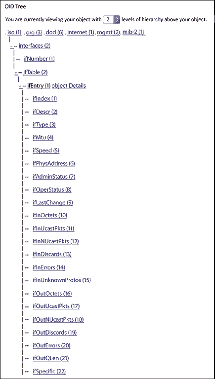

图 7.3：SNMP ifEntry OID 树

快速测试将展示设备上接口的 OID 映射：

```py
$ snmpwalk -v2c -c secret 172.16.1.189 .1.3.6.1.2.1.2.2.1.2
iso.3.6.1.2.1.2.2.1.2.1 = STRING: "GigabitEthernet0/0"
iso.3.6.1.2.1.2.2.1.2.2 = STRING: "GigabitEthernet0/1"
iso.3.6.1.2.1.2.2.1.2.3 = STRING: "GigabitEthernet0/2"
iso.3.6.1.2.1.2.2.1.2.4 = STRING: "Null0"
iso.3.6.1.2.1.2.2.1.2.5 = STRING: "Loopback0" 
```

从文档中，我们可以将`ifInOctets(10)`、`ifInUcastPkts(11)`、`ifOutOctets(16)`和`ifOutUcastPkts(17)`的值映射到它们各自的 OID 值。从 CLI 和 MIB 文档的快速检查中，我们可以看到`GigabitEthernet0/0`数据包输出的值映射到 OID `1.3.6.1.2.1.2.2.1.17.1`。我们将遵循相同的流程来映射接口统计信息的其余 OID。在 CLI 和 SNMP 之间检查时，请注意，值应该接近但不相同，因为 CLI 输出时间和 SNMP 查询时间之间可能会有一些流量：

```py
r1#sh int gig 0/0 | i packets
  5 minute input rate 0 bits/sec, 0 packets/sec
  5 minute output rate 0 bits/sec, 0 packets/sec
     6872 packets input, 638813 bytes, 0 no buffer
     4279 packets output, 393631 bytes, 0 underruns
$ snmpwalk -v2c -c secret 192.168.2.218 .1.3.6.1.2.1.2.2.1.17.1
iso.3.6.1.2.1.2.2.1.17.1 = Counter32: 4292 
```

如果我们处于生产环境，我们可能会将结果写入数据库。但既然这是一个例子，我们将把查询值写入一个平面文件。我们将编写`pysnmp_3.py`脚本来进行信息查询并将结果写入文件。在脚本中，我们定义了需要查询的各种 OID：

```py
# Hostname OID
system_name = '1.3.6.1.2.1.1.5.0'
# Interface OID
gig0_0_in_oct = '1.3.6.1.2.1.2.2.1.10.1'
gig0_0_in_uPackets = '1.3.6.1.2.1.2.2.1.11.1'
gig0_0_out_oct = '1.3.6.1.2.1.2.2.1.16.1'
gig0_0_out_uPackets = '1.3.6.1.2.1.2.2.1.17.1' 
```

值在`snmp_query()`函数中被消耗，以`host`、`community`和`oid`作为输入：

```py
def snmp_query(host, community, oid):
    errorIndication, errorStatus, errorIndex, varBinds = cmdGen.getCmd(
        cmdgen.CommunityData(community),
        cmdgen.UdpTransportTarget((host, 161)),
        oid
    ) 
```

所有值都放入一个带有各种键的字典中，并写入一个名为`results.txt`的文件：

```py
result = {}
result['Time'] = datetime.datetime.utcnow().isoformat()
result['hostname'] = snmp_query(host, community, system_name)
result['Gig0-0_In_Octet'] = snmp_query(host, community, gig0_0_in_oct)
result['Gig0-0_In_uPackets'] = snmp_query(host, community, gig0_0_in_uPackets)
result['Gig0-0_Out_Octet'] = snmp_query(host, community, gig0_0_out_oct)
result['Gig0-0_Out_uPackets'] = snmp_query(host, community, gig0_0_out_uPackets)
with open('/home/echou/Master_Python_Networking/Chapter7/results.txt', 'a') as f:
    f.write(str(result))
    f.write('\n') 
```

结果将是一个文件，显示了查询时表示的接口数据包：

```py
$ cat results.txt
{'Gig0-0_In_Octet': '3990616', 'Gig0-0_Out_uPackets': '60077', 'Gig0-0_In_uPackets': '42229', 'Gig0-0_Out_Octet': '5228254', 'Time': '2017-03-06T02:34:02.146245', 'hostname': 'iosv-1.virl.info'}
{'Gig0-0_Out_uPackets': '60095', 'hostname': 'iosv-1.virl.info', 'Gig0-0_Out_Octet': '5229721', 'Time': '2017-03-06T02:35:02.072340', 'Gig0-0_In_Octet': '3991754', 'Gig0-0_In_uPackets': '42242'}
<skip> 
```

我们可以使这个脚本可执行，并安排一个每 5 分钟执行一次的`cron`作业：

```py
$ chmod +x pysnmp_3.py
# crontab configuration
*/5 * * * * /home/echou/Mastering_Python_Networking_Fourth_Edition/Chapter07/pysnmp_3.py 
```

如前所述，在生产环境中，我们会将信息放入数据库。对于 SQL 数据库，你可以使用唯一 ID 作为主键。在 NoSQL 数据库中，我们可能会使用时间作为主索引（或键），因为它是始终唯一的，后面跟着各种键值对。

我们将等待脚本执行几次，以便填充值。如果你是那种没有耐心的人，你可以将`cron`作业间隔缩短到 1 分钟。在你看到`results.txt`文件中有足够的数据来制作有趣的图表后，我们可以继续到下一部分，看看我们如何使用 Python 来可视化数据。

# Python 数据可视化

我们收集网络数据以深入了解我们的网络。了解数据含义的最好方法之一是使用图表进行可视化。这几乎适用于所有数据，但在网络监控的上下文中，对于时间序列数据来说尤其如此。上周网络传输了多少数据？在所有流量中 TCP 协议的百分比是多少？这些都是我们可以通过使用如 SNMP 之类的数据收集机制获得的值，我们可以使用一些流行的 Python 库生成可视化图表。

在本节中，我们将使用上一节通过 SNMP 收集的数据，并使用两个流行的 Python 库，Matplotlib 和 Pygal，来绘制它们。

## Matplotlib

**Matplotlib** ([`matplotlib.org/`](http://matplotlib.org/))是 Python 语言的 2D 绘图库及其 NumPy 数学扩展。它可以用几行代码生成出版物质量的图表，如图表、直方图和条形图。

NumPy 是 Python 编程语言的扩展。它是开源的，在各种数据科学项目中广泛使用。你可以在[`en.wikipedia.org/wiki/NumPy`](https://en.wikipedia.org/wiki/NumPy)了解更多关于它的信息。

让我们从安装开始。

### 安装

安装可以通过 Linux 发行版的包管理系统或 Python `pip`来完成。在 Matplotlib 的最新版本中，我们还将安装`python3-tk`以进行显示：

```py
(venv) $ pip install matplotlib
(venv) $ sudo apt install python3-tk 
```

现在，让我们进入我们的第一个例子。

### Matplotlib – 第一个例子

对于以下示例，默认情况下输出图形以标准输出形式显示。通常，标准输出是你的显示器屏幕。在开发过程中，通常更容易先尝试代码并首先在标准输出上生成图形，然后再用脚本最终确定代码。如果你通过虚拟机跟随这本书，建议你使用 VM 窗口而不是 SSH，这样你就可以看到图形。如果你无法访问标准输出，你可以保存图形并在下载后查看（如你将看到的）。请注意，你将需要在某些我们在这个部分生成的图形中设置`$DISPLAY`变量。

本章可视化示例中使用的 Ubuntu 桌面屏幕截图。一旦在终端窗口中发出`plt.show()`命令，**图 1**将出现在屏幕上。当你关闭图形时，你将返回到 Python shell：

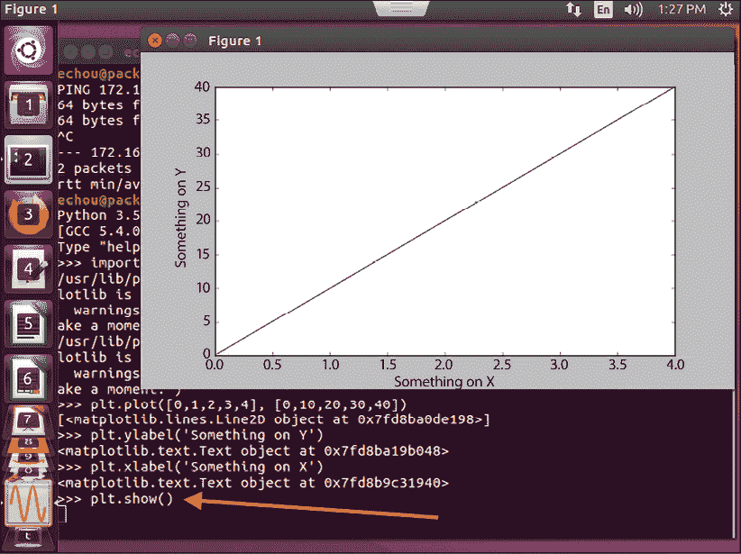

图 7.4：使用 Ubuntu 桌面的 Matplotlib 可视化

让我们先看看折线图。折线图简单地给出两组数字，分别对应于*x*轴和*y*轴的值：

```py
>>> import matplotlib.pyplot as plt
>>> plt.plot([0,1,2,3,4], [0,10,20,30,40])
[<matplotlib.lines.Line2D object at 0x7f932510df98>]
>>> plt.ylabel('Something on Y')
<matplotlib.text.Text object at 0x7f93251546a0>
>>> plt.xlabel('Something on X')
<matplotlib.text.Text object at 0x7f9325fdb9e8>
>>> plt.show() 
```

图形将是一个折线图：


图 7.5：Matplotlib 折线图

或者，如果你无法访问标准输出或已先保存图形，你可以使用`savefig()`方法：

```py
>>> plt.savefig('figure1.png') or
>>> plt.savefig('figure1.pdf') 
```

在掌握了基本的绘图知识后，我们现在可以绘制从 SNMP 查询中获得的结果。

### Matplotlib 用于 SNMP 结果

在我们的第一个 Matplotlib 示例`matplotlib_1.py`中，我们将导入`pyplot`模块的同时导入`dates`模块。我们将使用`matplotlib.dates`模块而不是 Python 标准库中的`dates`模块。

与 Python 的`dates`模块不同，`matplotlib.dates`库将内部将日期值转换为浮点类型，这是 Matplotlib 所要求的：

```py
import matplotlib.pyplot as plt
import matplotlib.dates as dates 
```

Matplotlib 提供了复杂的日期绘图功能；你可以在[`matplotlib.org/stable/api/dates_api.html`](https://matplotlib.org/stable/api/dates_api.html)找到更多相关信息。

在脚本中，我们将创建两个空列表，每个列表代表*x*轴和*y*轴的值。请注意，在第 12 行，我们使用了内置的`eval()`Python 函数将输入读取为字典而不是默认字符串：

```py
x_time = []
y_value = []
with open('results.txt', 'r') as f:
    for line in f.readlines():
        # eval(line) reads in each line as dictionary instead of string
        line = eval(line)
        # convert to internal float
        x_time.append(dates.datestr2num(line['Time']))
        y_value.append(line['Gig0-0_Out_uPackets']) 
```

为了以人类可读的日期格式读取*x*轴值，我们需要使用`plot_date()`函数而不是`plot()`函数。我们还将稍微调整图形的大小，以及旋转*x*轴上的值，以便我们可以完整地读取值：

```py
plt.subplots_adjust(bottom=0.3)
plt.xticks(rotation=80)
plt.plot_date(x_time, y_value)
plt.title('Router1 G0/0')
plt.xlabel('Time in UTC')
plt.ylabel('Output Unicast Packets')
plt.savefig('matplotlib_1_result.png')
plt.show() 
```

最终结果将显示**Router1 G0/0**和**输出单播数据包**，如下所示：

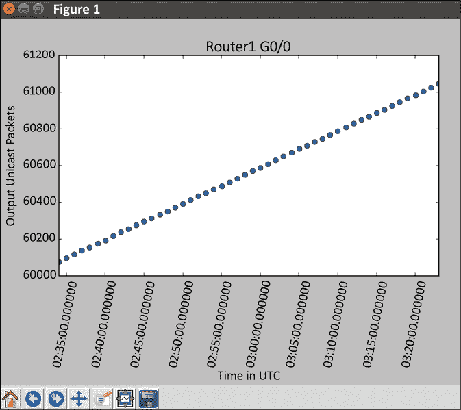

图 7.6：Router1 Matplotlib 图表

注意，如果你更喜欢直线而不是点，你可以在`plot_date()`函数的第三个可选参数中使用：

```py
plt.plot_date(x_time, y_value, "-") 
```

我们可以重复这些步骤来输出输出八位字节、输入单播数据包和输入作为单独的图表的其余值。然而，在我们的下一个例子，即`matplotlib_2.py`中，我们将向您展示如何将多个值与相同的时间范围进行绘图，以及额外的 Matplotlib 选项。

在这个例子中，我们将创建额外的列表并相应地填充值：

```py
x_time = []
out_octets = []
out_packets = []
in_octets = []
in_packets = []
with open('results.txt', 'r') as f:
    for line in f.readlines():
        # eval(line) reads in each line as dictionary instead of string
        line = eval(line)
        # convert to internal float
        x_time.append(dates.datestr2num(line['Time']))
        out_packets.append(line['Gig0-0_Out_uPackets'])
        out_octets.append(line['Gig0-0_Out_Octet'])
        in_packets.append(line['Gig0-0_In_uPackets'])
        in_octets.append(line['Gig0-0_In_Octet']) 
```

由于我们的*x*轴值相同，我们只需将不同的*y*轴值添加到同一个图表中：

```py
# Use plot_date to display x-axis back in date format
plt.plot_date(x_time, out_packets, '-', label='Out Packets')
plt.plot_date(x_time, out_octets, '-', label='Out Octets')
plt.plot_date(x_time, in_packets, '-', label='In Packets')
plt.plot_date(x_time, in_octets, '-', label='In Octets') 
```

还可以将`grid`和`legend`添加到图表中：

```py
plt.title('Router1 G0/0')
plt.legend(loc='upper left')
plt.grid(True)
plt.xlabel('Time in UTC')
plt.ylabel('Values')
plt.savefig('matplotlib_2_result.png')
plt.show() 
```

最终结果将结合单个图表中的所有值。请注意，左上角的一些值被图例遮挡。你可以调整图表大小和/或使用平移/缩放选项来移动图表以查看这些值：

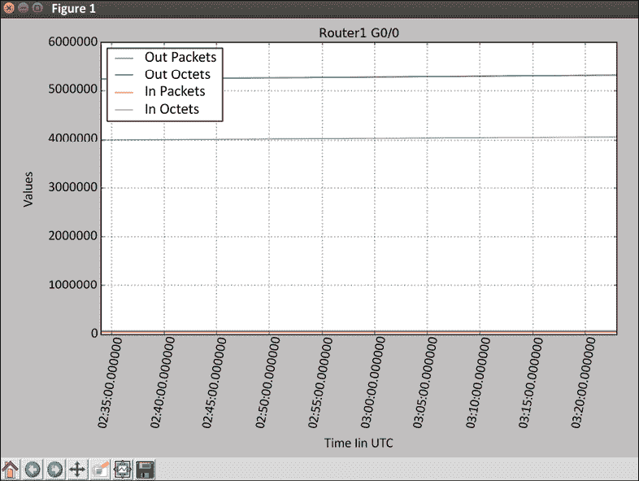

图 7.7：Router1 – Matplotlib 多行图

Matplotlib 提供了许多更多的绘图选项；我们当然不仅限于绘制图表。例如，在`matplotlib_3.py`中，我们可以使用以下模拟数据来绘制我们可以在线缆上看到的不同流量类型的百分比：

```py
#!/usr/bin/env python3
# Example from http://matplotlib.org/2.0.0/examples/pie_and_polar_charts/pie_demo_features.html
import matplotlib.pyplot as plt
# Pie chart, where the slices will be ordered and plotted counter-clockwise:
labels = 'TCP', 'UDP', 'ICMP', 'Others'
sizes = [15, 30, 45, 10]
explode = (0, 0.1, 0, 0)  # Make UDP stand out
fig1, ax1 = plt.subplots()
ax1.pie(sizes, explode=explode, labels=labels, autopct='%1.1f%%',
        shadow=True, startangle=90)
ax1.axis('equal')  # Equal aspect ratio ensures that pie is drawn as a circle.
plt.savefig('matplotlib_3_result.png')
plt.show() 
```

上述代码导致`plt.show()`生成了以下饼图：

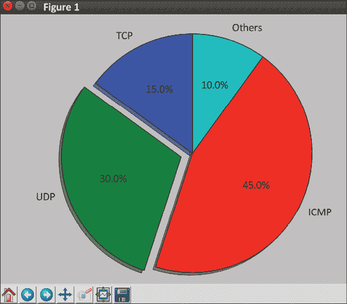

图 7.8：Matplotlib 饼图

在本节中，我们使用了 Matplotlib 将我们的网络数据绘制成更具有视觉吸引力的图表，以帮助我们理解网络的状态。这是通过条形图、折线图和饼图来完成的，这些图表非常适合手头的数据。Matplotlib 是一个强大的工具，不仅限于 Python。作为一个开源工具，我们可以利用许多额外的 Matplotlib 资源来了解这个工具。

### 额外的 Matplotlib 资源

Matplotlib 是最佳的 Python 绘图库之一，能够生成出版物质量的图表。像 Python 一样，它旨在使复杂任务变得简单。在 GitHub 上有超过 10,000 颗星（并且还在增加），它也是最受欢迎的开源项目之一。

它的流行度直接转化为更快的错误修复、友好的用户社区、广泛的文档和通用易用性。使用这个包需要一点学习曲线，但这是值得努力的。

在本节中，我们对 Matplotlib 的探索还只是触及了皮毛。你可以在[`matplotlib.org/stable/index.html`](https://matplotlib.org/stable/index.html)（Matplotlib 项目页面）和[`github.com/matplotlib/matplotlib`](https://github.com/matplotlib/matplotlib)（Matplotlib GitHub 仓库）找到更多资源。

在接下来的章节中，我们将探讨另一个流行的 Python 绘图库：**Pygal**。

## Pygal

Pygal ([`www.pygal.org/en/stable/`](https://www.pygal.org/en/stable/)) 是一个用 Python 编写的动态 **可缩放矢量图形** (**SVG**) 图表库。在我看来，Pygal 的最大优点是它能够轻松地以原生方式生成 SVG 图表。SVG 相比其他图表格式有许多优点。其中两个主要优点是它对网页浏览器友好，并且在不牺牲图像质量的情况下提供可伸缩性。换句话说，您可以在任何现代网页浏览器中显示生成的图像，并放大和缩小图像而不会丢失图表的细节。我提到过我们可以在几行 Python 代码中做到这一点吗？这有多酷？

让我们安装 Pygal，然后继续第一个示例。

### 安装

安装是通过 `pip` 完成的：

```py
(venv)$ pip install pygal 
```

### Pygal – 第一个示例

让我们看看 Pygal 文档中展示的线形图示例，该文档可在 [`pygal.org/en/stable/documentation/types/line.html`](http://pygal.org/en/stable/documentation/types/line.html) 找到：

```py
>>> import pygal
>>> line_chart = pygal.Line()
>>> line_chart.title = 'Browser usage evolution (in %)'
>>> line_chart.x_labels = map(str, range(2002, 2013))
>>> line_chart.add('Firefox', [None, None,    0, 16.6,   25,   31, 36.4, 45.5, 46.3, 42.8, 37.1])
<pygal.graph.line.Line object at 0x7f4883c52b38>
>>> line_chart.add('Chrome',  [None, None, None, None, None, None,    0,  3.9, 10.8, 23.8, 35.3])
<pygal.graph.line.Line object at 0x7f4883c52b38>
>>> line_chart.add('IE',      [85.8, 84.6, 84.7, 74.5,   66, 58.6, 54.7, 44.8, 36.2, 26.6, 20.1])
<pygal.graph.line.Line object at 0x7f4883c52b38>
>>> line_chart.add('Others',  [14.2, 15.4, 15.3,  8.9,    9, 10.4,  8.9,  5.8,  6.7,  6.8,  7.5])
<pygal.graph.line.Line object at 0x7f4883c52b38>
>>> line_chart.render_to_file('pygal_example_1.svg') 
```

在这个例子中，我们创建了一个线对象，`x_labels` 自动渲染为 11 个单位的字符串。每个对象都可以以列表格式添加标签和值，例如 Firefox、Chrome 和 IE。

我们需要关注的有意思的一点是，每个线形图项都有与 x 单位数量完全匹配的匹配数字。例如，如果没有值，例如 Chrome 的 2002-2007 年，则输入 **None**。

这是 Firefox 浏览器中查看的结果图，如下所示：

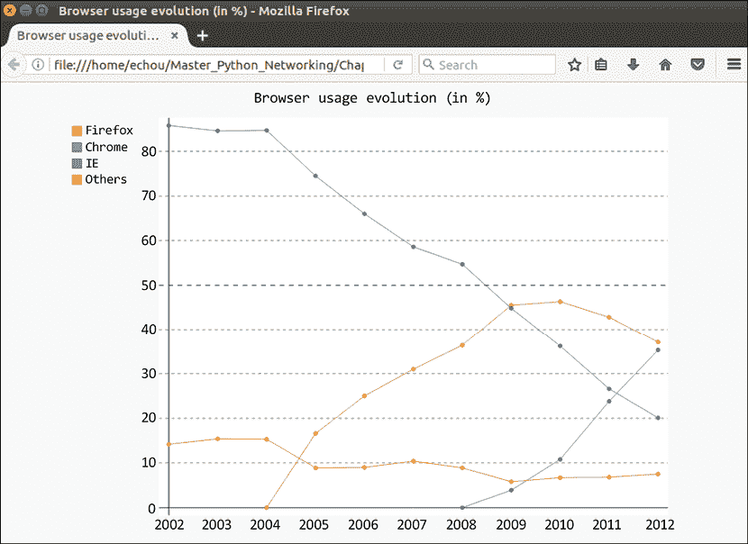

图 7.9：Pygal 示例图表

现在我们已经看到了 Pygal 的一般用法，我们可以使用相同的方法来绘制我们手头的 SNMP 结果。我们将在下一节中这样做。

### Pygal SNMP 结果

对于 Pygal 线形图，我们可以很大程度上遵循我们 Matplotlib 示例中的相同模式，即通过读取文件创建值列表。我们不再需要将 *x*-轴值转换为内部浮点数，就像我们为 Matplotlib 做的那样；然而，我们需要将每个值中的数字转换为浮点数：

```py
#!/usr/bin/env python3
import pygal
x_time = []
out_octets = []
out_packets = []
in_octets = []
in_packets = []
with open('results.txt', 'r') as f:
    for line in f.readlines():
        # eval(line) reads in each line as dictionary instead of string
        line = eval(line)
        x_time.append(line['Time'])
        out_packets.append(float(line['Gig0-0_Out_uPackets']))
        out_octets.append(float(line['Gig0-0_Out_Octet']))
        in_packets.append(float(line['Gig0-0_In_uPackets']))
        in_octets.append(float(line['Gig0-0_In_Octet'])) 
```

我们可以使用我们之前看到用来构建线图的相同机制：

```py
line_chart = pygal.Line()
line_chart.title = "Router 1 Gig0/0"
line_chart.x_labels = x_time
line_chart.add('out_octets', out_octets)
line_chart.add('out_packets', out_packets)
line_chart.add('in_octets', in_octets)
line_chart.add('in_packets', in_packets)
line_chart.render_to_file('pygal_example_2.svg') 
```

结果与我们已经看到的结果相似，但现在图表是以 SVG 格式呈现的，可以在网页上轻松显示。它可以在现代网页浏览器中查看：

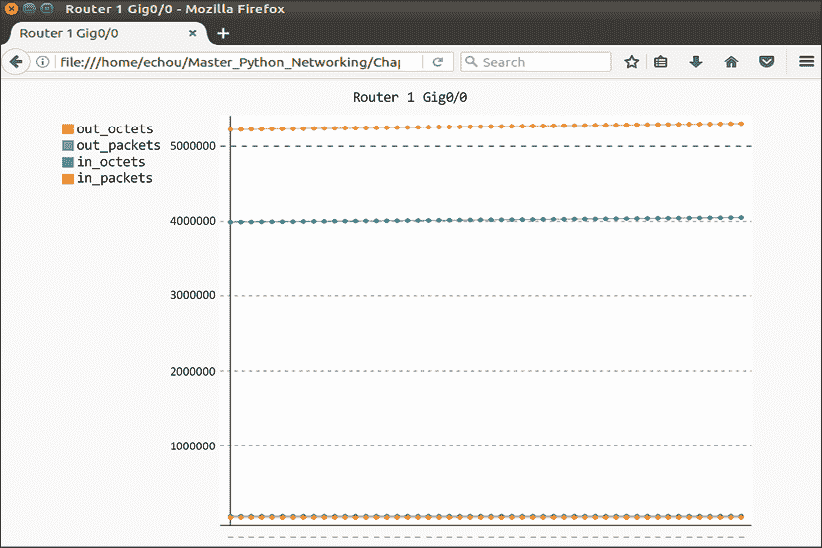

图 7.10：路由器 1— Pygal 多行图

就像 Matplotlib 一样，Pygal 为图表提供了更多选项。例如，为了在 Matplotlib 中绘制我们之前看到的饼图，我们可以使用 `pygal.Pie()` 对象。这可以在 `pygal_2.py` 中看到：

```py
#!/usr/bin/env python3
import pygal
line_chart = pygal.Pie()
line_chart.title = "Protocol Breakdown"
line_chart.add('TCP', 15)
line_chart.add('UDP', 30)
line_chart.add('ICMP', 45)
line_chart.add('Others', 10)
line_chart.render_to_file('pygal_example_3.svg') 
```

生成的 SVG 文件如下所示：

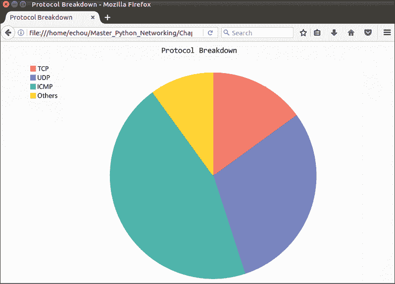

图 7.11：Pygal 饼图

当需要生成生产就绪的 SVG 图形时，Pygal 是一个伟大的工具。如果需要这种类型的图形，无需寻找其他库，只需查看 Pygal 库。在本节中，我们检查了使用 Pygal 生成网络数据图形的示例。类似于 Matplotlib，如果你对 Pygal 感兴趣，有许多额外的资源可以帮助你学习。

### 额外的 Pygal 资源

Pygal 为从基本的网络监控工具（如 SNMP）收集的数据提供了许多更多可定制的功能和绘图能力。在本节中，我们演示了简单的折线图和饼图。你可以在以下链接中找到更多关于这个项目的信息：

+   **Pygal 文档**：[`www.pygal.org/en/stable/index.html`](http://www.pygal.org/en/stable/index.html)

+   **Pygal GitHub 项目页面**：[`github.com/Kozea/pygal`](https://github.com/Kozea/pygal)

在接下来的章节中，我们将继续探讨网络监控的 SNMP 主题，但将使用一个功能齐全的网络监控系统，称为**Cacti**。

# Cacti 的 Python

在我作为地区 ISP 的初级网络工程师的早期日子里，我们使用开源的跨平台**多路由流量图器**（**MRTG**）（[`en.wikipedia.org/wiki/Multi_Router_Traffic_Grapher`](https://en.wikipedia.org/wiki/Multi_Router_Traffic_Grapher)）工具来检查网络链路上的流量负载。我们几乎完全依赖这个工具进行流量监控。我对一个开源项目能如此出色和有用感到惊讶。它是第一个为网络工程师抽象 SNMP、数据库和 HTML 细节的开源高级网络监控系统之一。随后出现了**循环冗余检测数据库工具**（**RRDtool**）（[`en.wikipedia.org/wiki/RRDtool`](https://en.wikipedia.org/wiki/RRDtool)）。在 1999 年的首次发布中，它被称为“MRTG Done Right”。它极大地提高了后端数据库和轮询器的性能。

2001 年发布的 Cacti ([`en.wikipedia.org/wiki/Cacti_(software)`](https://en.wikipedia.org/wiki/Cacti_(software))) 是一个开源的基于 Web 的网络监控和绘图工具，设计为 RRDtool 的改进前端。由于 MRTG 和 RRDtool 的传承，你会注意到熟悉的图形布局、模板和 SNMP 轮询器。作为一个打包的工具，安装和使用需要保持在工具的边界内。然而，Cacti 提供了一个自定义数据查询功能，我们可以使用 Python 来处理。在本节中，我们将看到如何使用 Python 作为 Cacti 的输入方法。

首先，我们将介绍安装过程。

## 安装

由于 Cacti 是一个包含前端、收集脚本和数据库后端的综合性工具，除非你已经有了 Cacti 的使用经验，否则我建议在我们的实验室中安装一个独立的虚拟机或容器。以下指令将针对虚拟机进行展示，但容器 Dockerfile 将类似。

在使用 Ubuntu 管理虚拟机上的 APT 时，在 Ubuntu 上安装是直接的：

```py
$ sudo apt-get install cacti 
```

它将触发一系列安装和设置步骤，包括 MySQL 数据库、Web 服务器（Apache 或`lighttpd`）以及各种配置任务。安装完成后，导航到`http://<ip>/cacti`开始。最后一步是使用默认用户名和密码（`admin/admin`）登录；您将被提示更改密码。

在安装过程中，如果有疑问，请选择默认选项并保持简单。

登录后，我们可以按照文档添加设备并将其与模板关联。Cacti 有很好的文档[`docs.cacti.net/`](http://docs.cacti.net/)，用于添加设备和创建您的第一个图表，所以我们将快速查看您可能会看到的截图：


图 7.12：Cacti 设备编辑页面

当您可以看到设备运行时间时，这是一个表示 SNMP 通信正在工作的标志：


图 7.13：设备编辑结果页面

您可以为设备添加图表以显示接口流量和其他统计数据：

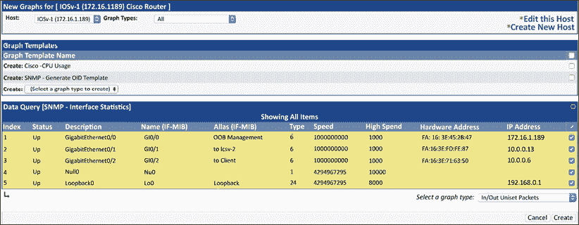

图 7.14：设备的新的图表

经过一段时间，您将开始看到流量，如图所示：

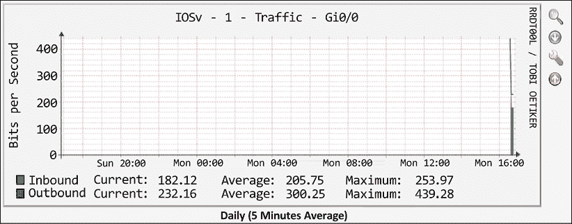

图 7.15：5 分钟平均图

现在我们准备看看如何使用 Python 脚本来扩展 Cacti 的数据收集功能。

## Python 脚本作为输入源

在我们尝试将 Python 脚本作为输入源使用之前，我们应该阅读两个文档：

+   **数据输入方法**：[`www.cacti.net/downloads/docs/html/data_input_methods.html`](http://www.cacti.net/downloads/docs/html/data_input_methods.html)

+   **使脚本与 Cacti 协同工作**：[`www.cacti.net/downloads/docs/html/making_scripts_work_with_cacti.html`](http://www.cacti.net/downloads/docs/html/making_scripts_work_with_cacti.html)

你可能会想知道使用 Python 脚本作为数据输入扩展的使用场景。其中一个使用场景是为没有相应 OID 的资源提供监控，例如，如果我们想知道如何绘制访问列表`permit_snmp`允许主机`172.16.1.173`进行 SNMP 查询的次数。

该示例假设 SNMP 站点的 IP 地址为`172.16.1.173`；请将 IP 地址替换为当前实验室管理站点的 IP 地址。

我们知道我们可以通过 CLI 看到匹配的数量：

```py
iosv-1#sh ip access-lists permit_snmp | I 172.16.1.173 10 permit 172.16.1.173 log (6362 matches) 
```

然而，很可能是没有 OID 与这个值相关联（或者我们假装没有）。这就是我们可以使用外部脚本来生成可以被 Cacti 主机消费的输出的地方。

我们可以重用第二章中讨论的 Pexpect 脚本，`chapter1_1.py`。我们将将其重命名为`cacti_1.py`。除了我们将执行 CLI 命令并保存输出之外，一切都应该与原始脚本相同：

```py
<skip>
for device in devices.keys():
…
    child.sendline''sh ip access-lists permit_snmp | i 172.16.1.17'')
    child.expect(device_prompt)
    output = child.before 
```

其原始输出将如下所示：

```py
''sh ip access-lists permit_snmp | i 172.16.1.173rn 10 permit 172.16.1.173 log (6428 matches)r'' 
```

我们将在脚本中使用`split()`函数对字符串进行处理，只留下匹配的数量，并在脚本中将它们打印到标准输出：

```py
print(str(output).split'''')[1].split()[0]) 
```

为了测试这一点，我们可以通过多次执行脚本来查看增加的数量：

```py
$ ./cacti_1.py
6428
$ ./cacti_1.py
6560
$ ./cacti_1.py
6758 
```

我们可以使脚本可执行，并将其放入默认的 Cacti 脚本位置：

```py
$ chmod a+x cacti_1.py
$ sudo cp cacti_1.py /usr/share/cacti/site/scripts/ 
```

Cacti 文档，可在[`www.cacti.net/downloads/docs/html/how_to.html`](http://www.cacti.net/downloads/docs/html/how_to.html)找到，提供了如何将脚本结果添加到输出图的详细步骤。

这些步骤包括将脚本作为数据输入方法添加，将输入方法添加到数据源，然后创建一个可查看的图表：

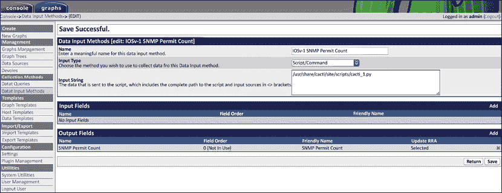

图 7.16：数据输入方法结果页面

SNMP 是向设备提供网络监控服务的一种常见方式。使用 Cacti 作为前端，RRDtool 为所有网络设备提供了一个良好的 SNMP 平台。我们还可以使用 Python 脚本来扩展超出 SNMP 的信息收集。

# 摘要

在本章中，我们探讨了通过 SNMP 执行网络监控的方法。我们在网络设备上配置了与 SNMP 相关的命令，并使用我们的带有 SNMP 轮询器的网络管理 VM 来查询设备。我们使用了 PySNMP 模块来简化并自动化我们的 SNMP 查询。我们还学习了如何将查询结果保存到平面文件或数据库中，以供未来示例使用。

在本章的后面部分，我们使用了两个不同的 Python 可视化包，Matplotlib 和 Pygal，来绘制 SNMP 结果。每个包都有其独特的优势。Matplotlib 是一个成熟、功能丰富的库，在数据科学项目中广泛使用。Pygal 可以原生生成 SVG 格式的图表，这些图表灵活且适合网页。我们看到了如何生成与网络监控相关的折线图和饼图。

在本章的末尾，我们查看了一个名为 Cacti 的全能网络监控工具。它主要使用 SNMP 进行网络监控，但我们看到了如何使用 Python 脚本作为输入源来扩展平台监控能力，当远程主机上没有 SNMP OID 时。

在第八章，“使用 Python 进行网络监控（第二部分）”中，我们将继续讨论我们可以用来监控我们的网络并了解网络是否按预期运行的工具。我们将查看基于流量的监控，使用 NetFlow、sFlow 和 IPFIX。我们还将使用 Graphviz 等工具来可视化我们的网络拓扑并检测任何拓扑变化。

# 加入我们的书籍社区

要加入这本书的社区——在这里您可以分享反馈、向作者提问，并了解新版本信息——请扫描下面的二维码：

[`packt.link/networkautomationcommunity`](https://packt.link/networkautomationcommunity)


