# 8

# 使用 Python 进行网络监控 – 第二部分

在*第七章*，*使用 Python 进行网络监控 – 第一部分*中，我们使用 SNMP 从网络设备查询信息。我们这样做是通过使用 SNMP 管理器查询网络设备上驻留的 SNMP 代理来完成的。SNMP 信息以层次格式结构化，使用特定的对象 ID 作为表示对象值的方式。大多数时候，我们关心的值是一个数字，比如 CPU 负载、内存使用或接口流量。我们可以将此数据与时间对比，以了解值随时间的变化情况。

我们通常将 SNMP 方法分类为一种`拉`方法，因为我们不断地要求设备提供特定的答案。这种方法给设备增加了负担，因为它需要在控制平面花费 CPU 周期来从子系统找到答案，将答案打包成 SNMP 数据包，并将答案传输回轮询器。如果你曾经参加过那种有一个家庭成员总是反复问你同样问题的家庭聚会，那么这就像是 SNMP 管理器轮询受管节点。

随着时间的推移，如果我们有多个 SNMP 轮询器每隔 30 秒查询同一设备（你会惊讶这有多么频繁），管理开销将变得很大。在我们给出的同一个家庭聚会的例子中，不是只有一个家庭成员，想象一下每隔 30 秒就有很多人打断你问问题。我不知道你怎么样，但我知道即使是一个简单的问题（或者更糟糕的是，如果他们都问同样的问题），我也会非常烦恼。

我们可以提供更高效的网络监控的另一种方法是，将管理站与设备之间的关系从*拉*模式改为*推*模式。换句话说，信息可以按照约定的格式从设备推送到管理站。这个概念就是基于流量的监控所依据的。在基于流量的模型中，网络设备将流量信息，称为流，流式传输到管理站。格式可以是思科的专有 NetFlow（版本 5 或 9），行业标准 IPFIX，或者开源的 sFlow 格式。在本章中，我们将花一些时间探讨使用 Python 来研究 NetFlow、IPFIX 和 sFlow。

并非所有的监控都是以时间序列数据的形式出现。如果你愿意，你可以将诸如网络拓扑和 Syslog 等信息表示为时间序列格式，但这并不理想。我们可以使用 Python 来检查网络拓扑信息，并查看拓扑是否随时间发生变化。我们可以使用工具，如 Graphviz，以及 Python 包装器来展示拓扑。如已在*第六章*，*使用 Python 进行网络安全*中看到，Syslog 包含安全信息。在本书的后续部分，我们将探讨使用 Elastic Stack（Elasticsearch、Logstash、Kibana 和 Beat）作为收集和索引网络安全和日志信息的有效方式。

具体来说，在本章中，我们将涵盖以下主题：

+   Graphviz，这是一款开源的图形可视化软件，可以帮助我们快速高效地绘制我们的网络图

+   基于流的监控，例如 NetFlow、IPFIX 和 sFlow

+   使用 ntop 可视化信息流

让我们先看看如何使用 Graphviz 监控网络拓扑变化。

# Graphviz

Graphviz 是一款开源的图形可视化软件。想象一下，如果我们需要向同事描述我们的网络拓扑，而没有图片的帮助。我们可能会说，我们的网络由三层组成：核心层、分发层和接入层。

核心层由两个路由器组成，用于冗余，这两个路由器都向四个分发路由器全连接；分发路由器也向接入路由器全连接。内部路由协议是 OSPF，外部我们使用 BGP 与我们的服务提供商对等。虽然这个描述缺少一些细节，但可能足以让您的同事为您描绘一个相当不错的高级网络图。

Graphviz 的工作原理与描述文本格式的图，Graphviz 可以在文本文件中理解的过程相似。然后我们可以将文件输入到 Graphviz 程序中，构建图。在这里，图是以称为 DOT 的文本格式描述的（[`en.wikipedia.org/wiki/DOT_(graph_description_language)`](https://en.wikipedia.org/wiki/DOT_(graph_description_language)))，Graphviz 根据描述渲染图。当然，因为计算机缺乏人类的想象力，语言必须非常精确和详细。

对于 Graphviz 特定的 DOT 语法定义，请参阅 [`www.graphviz.org/doc/info/lang.html`](http://www.graphviz.org/doc/info/lang.html)。

在本节中，我们将使用 **链路层发现协议**（**LLDP**）来查询设备邻居，并通过 Graphviz 创建网络拓扑图。完成这个广泛的示例后，我们将看到如何将一些新事物，如 Graphviz，与我们已经学过的（网络 LLDP）结合起来，以解决有趣的问题（自动绘制当前网络拓扑）。

让我们先看看我们将要使用的实验室。

## 实验室设置

我们将使用与上一章相同的实验室拓扑。为了回顾，我们有一个三层拓扑，其中 r6 是面向外部的边缘设备，r5 是连接服务器的机架顶部路由器。

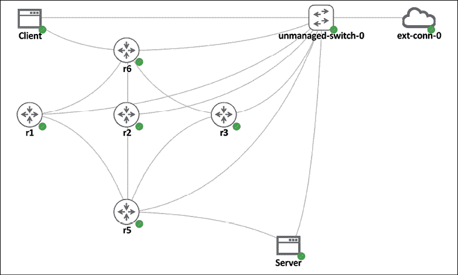

图 8.1：实验室拓扑

设备是 vIOS 设备，以节省实验室资源并简化配置：

+   由 NX-OS 和 IOS-XR 虚拟化的节点比 IOS 节点内存密集得多。

+   如果你希望使用 NX-OS，考虑使用 NX-API 或其他返回结构化数据的 API 调用。

设备有以下信息：

| **设备** | **管理 IP** | **环回 IP** |
| --- | --- | --- |
| r1 | `192.168.2.218` | `192.168.0.1` |
| r2 | `192.168.2.219` | `192.168.0.2` |
| r3 | `192.168.2.220` | `192.168.0.3` |
| r5 | `192.168.2.221` | `192.168.0.4` |
| r6 | `192.168.2.222` | `192.168.0.5` |

Ubuntu 主机的信息如下：

| **设备名称** | **外部链路 Eth0** | **内部 IP Eth1** |
| --- | --- | --- |
| 客户端 | `192.168.2.211` | `10.0.0.9` |
| 服务器 | `192.168.2.212` | `10.0.0.5` |

对于我们的示例，我们将使用 LLDP（[`en.wikipedia.org/wiki/Link_Layer_Discovery_Protocol`](https://en.wikipedia.org/wiki/Link_Layer_Discovery_Protocol)）。它是一个厂商中立的链路层邻居发现协议。让我们继续安装必要的软件包。

## 安装

可以通过`apt`获取 Graphviz：

```py
$ sudo apt-get install graphviz 
```

安装完成后，请注意，验证是通过使用`dot`命令来完成的：

```py
$ dot -V
dot - graphviz version 2.43.0 (0)$ dot -V 
```

我们将使用 Graphviz 的 Python 包装器，所以现在就让我们安装它：

```py
(venv)$ pip install graphviz
>>> import graphviz
>>> graphviz.__version__
'0.20.1'
>>> exit() 
```

让我们看看我们如何使用这个软件。

## Graphviz 示例

就像大多数流行的开源项目一样，Graphviz（[`www.graphviz.org/documentation/`](https://www.graphviz.org/documentation/)）的文档非常全面。对于软件的新手来说，挑战通常是从零到一的起点。对于我们的目的，我们将专注于 dot 图，它以层次结构的形式绘制有向图（不要与 DOT 语言混淆，DOT 是一种图形描述语言）。

让我们从一些基本概念开始：

+   节点代表我们的网络实体，例如路由器、交换机和服务器

+   边代表网络实体之间的链接

+   图、节点和边都有属性（[`www.graphviz.org/doc/info/attrs.html`](https://www.graphviz.org/doc/info/attrs.html)），可以进行调整

+   在描述网络后，我们可以将网络图输出为 PNG、JPEG 或 PDF 格式（[`www.graphviz.org/doc/info/output.html`](https://www.graphviz.org/doc/info/output.html)）

我们的第一个例子，`chapter8_gv_1.gv`，是一个由四个节点（`core`、`distribution`、`access1`和`access2`）组成的无向点图。边由破折号（`-`）表示，将核心节点与分布节点连接起来，以及将分布节点与两个访问节点连接起来：

```py
graph my_network {
    core -- distribution;
    distribution -- access1;
    distribution -- access2;
} 
```

图可以通过`dot -T<格式> source -o <输出文件>`命令行输出：

```py
$ mkdir output 
$ dot -Tpng chapter8_gv_1.gv -o output/chapter8_gv_1.png 
```

结果图可以在以下输出文件夹中查看：

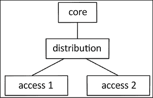

图 8.2：Graphviz 无向点图示例

就像*第七章*，*使用 Python 进行网络监控 – 第一部分*，在处理这些图时在 Linux 桌面窗口中工作可能更容易一些，这样你就可以立即看到图。

注意，我们可以通过指定图为一个 digraph 并使用箭头（`->`）符号来表示边来使用有向图。在节点和边的情况下，我们可以修改几个属性，例如节点形状、边标签等。相同的图可以在`chapter8_gv_2.gv`中按以下方式修改：

```py
digraph my_network {
    node [shape=box];
    size = "50 30";
    core -> distribution [label="2x10G"];
    distribution -> access1 [label="1G"];
    distribution -> access2 [label="1G"];
} 
```

我们这次将输出 PDF 文件：

```py
$ dot -Tpdf chapter8_gv_2.gv -o output/chapter8_gv_2.pdf 
```

查看新图中的方向箭头：

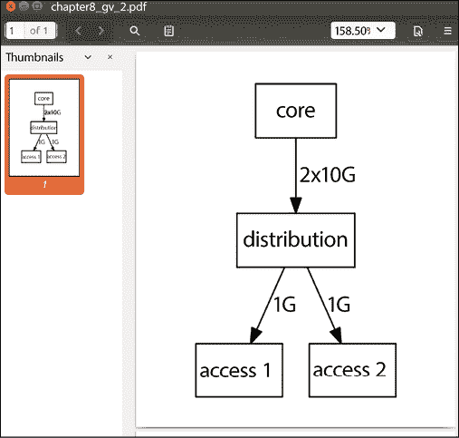

图 8.3：带有方向箭头和行描述的网络图

现在，让我们看看围绕 Graphviz 的 Python 封装。

## Python 与 Graphviz 示例

我们可以使用 Python Graphviz 包重现之前相同的拓扑图并构建相同的三层网络拓扑：

```py
>>> from graphviz import Digraph
>>> my_graph = Digraph(comment="My Network")
>>> my_graph.node("core")
>>> my_graph.node("distribution")
>>> my_graph.node("access1")
>>> my_graph.node("access2")
>>> my_graph.edge("core", "distribution")
>>> my_graph.edge("distribution", "access1")
>>> my_graph.edge("distribution", "access2") 
```

代码产生的结果与您通常在 DOT 语言中编写的相同，但方式更 Pythonic。您可以在生成图之前查看图的源代码：

```py
>>> print(my_graph.source)
// My Network
digraph {
    core
    distribution
    access1
    access2
    core -> distribution
    distribution -> access1
    distribution -> access2
} 
```

图可以通过 `render()` 方法进行渲染。默认输出格式是 PDF：

```py
>>> my_graph.render("output/chapter8_gv_3.gv")
'output/chapter8_gv_3.gv.pdf' 
```

Python 包封装紧密地模仿了 Graphviz 的所有 API 选项。您可以在 Graphviz Read The Docs 网站上找到有关选项的文档（[`graphviz.readthedocs.io/en/latest/index.html`](http://graphviz.readthedocs.io/en/latest/index.html)）。您还可以参考 GitHub 上的源代码以获取更多信息（[`github.com/xflr6/graphviz`](https://github.com/xflr6/graphviz)）。我们现在可以使用该工具绘制我们的网络。

## LLDP 邻居绘图

在本节中，我们将使用绘制 LLDP 邻居的例子来说明一种多年来帮助我的问题解决模式：

1.  如果可能，将每个任务模块化成更小的部分。在我们的例子中，我们可以合并几个步骤，但如果我们将它们分解成更小的部分，我们将能够更容易地重用和改进它们。

1.  使用自动化工具与网络设备交互，但在管理站保留更复杂的逻辑。例如，路由器提供了一个有点杂乱的 LLDP 邻居输出。在这种情况下，我们将坚持使用有效的命令和输出，并在管理站使用 Python 脚本来解析我们需要的输出。

1.  当对同一任务有选择时，选择可重用的一个。在我们的例子中，我们可以使用低级 Pexpect、Paramiko 或 Ansible playbooks 来查询路由器。在我看来，Ansible 是一个更可重用的选项，所以我选择了它。

要开始，由于默认情况下路由器上未启用 LLDP，我们首先需要在设备上配置它们。到目前为止，我们知道我们有多个选项可供选择；在这种情况下，我选择了带有 `ios_config` 模块的 Ansible playbook 来完成任务。`hosts` 文件包含五个路由器：

```py
$ cat hosts 
[devices]
r1
r2
r3
r5-tor
r6-edge
[edge-devices]
r5-tor
r6-edge 
```

每个主机都包含 `host_vars` 文件夹中的对应名称。我们以 `r1` 为例：

```py
---
ansible_host: 192.168.2.218
ansible_user: cisco
ansible_ssh_pass: cisco
ansible_connection: network_cli
ansible_network_os: ios
ansbile_become: yes
ansible_become_method: enable
ansible_become_pass: cisco 
```

`cisco_config_lldp.yml` playbook 包含一个带有 `ios_lldp` 模块的 play：

```py
---
- name: Enable LLDP
  hosts: "devices"
  gather_facts: false
  connection: network_cli
  tasks:
    - name: enable LLDP service
      ios_lldp:
        state: present
      register: output
    - name: show output
      debug:
        var: output 
```

`ios_lldp` Ansible 模块是从版本 2.5 及以后版本中引入的。如果您使用的是较旧版本的 Ansible，请使用 `ios_config` 模块。

运行 playbook 以开启 `lldp`:

```py
$ ansible-playbook -i hosts cisco_config_lldp.yml
<skip>
PLAY RECAP ****************************************************************************
r1                         : ok=2    changed=0    unreachable=0    failed=0    skipped=0    rescued=0    ignored=0   
r2                         : ok=2    changed=0    unreachable=0    failed=0    skipped=0    rescued=0    ignored=0   
r3                         : ok=2    changed=0    unreachable=0    failed=0    skipped=0    rescued=0    ignored=0   
r5-tor                     : ok=2    changed=0    unreachable=0    failed=0    skipped=0    rescued=0    ignored=0   
r6-edge                    : ok=2    changed=0    unreachable=0    failed=0    skipped=0    rescued=0    ignored=0 
```

由于默认的 `lldp` 广告定时器为 30 秒，我们应该等待一段时间，以便设备之间交换 `lldp` 广告。我们可以验证 LLDP 是否确实在路由器和它发现的邻居上激活：

```py
r1#sh lldp
Global LLDP Information:
    Status: ACTIVE
    LLDP advertisements are sent every 30 seconds
    LLDP hold time advertised is 120 seconds
    LLDP interface reinitialisation delay is 2 seconds
r1#sh lldp neighbors
Capability codes:
    (R) Router, (B) Bridge, (T) Telephone, (C) DOCSIS Cable Device
    (W) WLAN Access Point, (P) Repeater, (S) Station, (O) Other
Device ID           Local Intf     Hold-time  Capability      Port ID
r6.virl.info        Gi0/1          120        R               Gi0/1
r5.virl.info        Gi0/2          120        R               Gi0/1
Total entries displayed: 2 
```

在 CML 的旧版本中，例如 VIRL 或其他实验室软件中，你可能会在`G0/0`管理接口上看到 LLDP 邻居。我们真正关心的是直接连接到其他对等体的`G0/1`和`G0/2`接口。当准备解析输出和构建我们的拓扑图时，这些信息将非常有用。

### 信息检索

我们现在可以使用另一个 Ansible 剧本，即`cisco_discover_lldp.yml`，在设备上执行 LLDP 命令，并将每个设备的输出复制到`tmp`目录。

让我们创建`tmp`目录：

```py
$ mkdir tmp 
```

该剧本将包含三个任务。第一个任务将在每个设备上执行`show lldp`邻居命令，第二个任务将显示输出，第三个任务将输出目录中的输出复制到文本文件：

```py
 tasks:
    - name: Query for LLDP Neighbors
      ios_command:
        commands: show lldp neighbors
      register: output
    - name: show output
      debug:
        var: output
    - name: copy output to file
      copy: content="{{ output.stdout_lines }}" dest="./tmp/{{ inventory_hostname }}_lldp_output.txt" 
```

执行后，`./tmp`目录现在包含所有路由器的输出（显示 LLDP 邻居）在其自己的文件中：

```py
$ ls -l tmp
total 20
-rw-rw-r-- 1 echou echou 413 Sep 18 10:44 r1_lldp_output.txt
-rw-rw-r-- 1 echou echou 413 Sep 18 10:44 r2_lldp_output.txt
-rw-rw-r-- 1 echou echou 413 Sep 18 10:44 r3_lldp_output.txt
-rw-rw-r-- 1 echou echou 484 Sep 18 10:44 r5-tor_lldp_output.txt
-rw-rw-r-- 1 echou echou 484 Sep 18 10:44 r6-edge_lldp_output.txt 
```

`r1_lldp_output.txt`，与其他输出文件一样，包含来自 Ansible 剧本的每个设备的`output.stdout_lines`变量：

```py
$ cat tmp/r1_lldp_output.txt 
[["Capability codes:", "    (R) Router, (B) Bridge, (T) Telephone, (C) DOCSIS Cable Device", "    (W) WLAN Access Point, (P) Repeater, (S) Station, (O) Other", "", "Device ID           Local Intf     Hold-time  Capability      Port ID", "r6.virl.info        Gi0/1          120        R               Gi0/1", "r5.virl.info        Gi0/2          120        R               Gi0/1", "", "Total entries displayed: 2"]] 
```

到目前为止，我们已经从网络设备中检索信息。现在我们准备使用 Python 脚本来整合所有内容。

### Python 解析脚本

我们现在可以使用 Python 脚本来解析每个设备的 LLDP 邻居输出，并从结果中构建网络拓扑图。目的是自动检查设备，看是否有任何 LLDP 邻居因链路故障或其他问题而消失。让我们看看`cisco_graph_lldp.py`文件，看看它是如何完成的。

我们从必要的包导入开始：一个空列表，我们将用表示节点关系的元组填充它。我们还知道设备上的`Gi0/0`连接到管理网络；因此，我们在`show LLDP neighbors`输出中只搜索`Gi0/[1234]`作为我们的正则表达式模式：

```py
import glob, re
from graphviz import Digraph, Source
pattern = re.compile('Gi0/[1234]')
device_lldp_neighbors = [] 
```

我们将使用`glob.glob()`方法遍历`./tmp`目录下的所有文件，解析出设备名称，并找到设备连接到的邻居。脚本中包含一些嵌入的打印语句，我们可以在最终版本中将其注释掉；如果取消注释这些语句，我们可以看到解析结果：

```py
$ python cisco_graph_lldp.py
device: r6-edge
  neighbors: r2
  neighbors: r1
  neighbors: r3
device: r2
  neighbors: r5
  neighbors: r6
device: r3
  neighbors: r5
  neighbors: r6
device: r5-tor
  neighbors: r3
  neighbors: r1
  neighbors: r2
device: r1
  neighbors: r5
  neighbors: r6 
```

完整的边缘列表包含由设备和其邻居组成的元组：

```py
Edges: [('r6-edge', 'r2'), ('r6-edge', 'r1'), ('r6-edge', 'r3'), ('r2', 'r5'), ('r2', 'r6'), ('r3', 'r5'), ('r3', 'r6'), ('r5-tor', 'r3'), ('r5-tor', 'r1'), ('r5-tor', 'r2'), ('r1', 'r5'), ('r1', 'r6')] 
```

我们现在可以使用 Graphviz 包构建网络拓扑图。最重要的是解包表示边关系的元组：

```py
my_graph = Digraph("My_Network")
my_graph.edge("Client", "r6-edge")
my_graph.edge("r5-tor", "Server")
# construct the edge relationships
for neighbors in device_lldp_neighbors:
    node1, node2 = neighbors
    my_graph.edge(node1, node2) 
```

如果我们打印出结果源 dot 文件，它将是我们网络的准确表示：

```py
digraph My_Network {
        Client -> "r6-edge"
        "r5-tor" -> Server
        "r6-edge" -> r2
        "r6-edge" -> r1
        "r6-edge" -> r3
        r2 -> r5
        r2 -> r6
        r3 -> r5
        r3 -> r6
        "r5-tor" -> r3
        "r5-tor" -> r1
        "r5-tor" -> r2
        r1 -> r5
        r1 -> r6
} 
```

有时，看到相同的链路两次可能会令人困惑；例如，在之前的图中，`r2`到`r5-tor`链路在每个链路方向上出现了两次。作为网络工程师，我们知道有时物理链路的故障会导致单向链路，这是我们不想看到的。

如果我们按照原样绘制图表，节点的放置可能会有些奇怪。节点的放置是自动渲染的。以下图表展示了默认布局以及`neato`布局（即有向图`My_Network`，`engine='neato'`）的渲染：

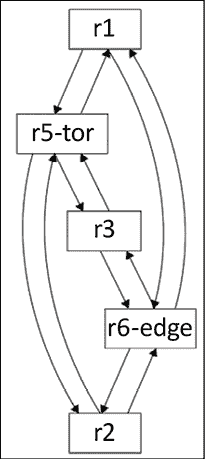

图 8.4：拓扑图 1

`neato`布局代表了一种尝试用更少的层次结构绘制无向图的方法：

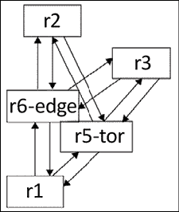

图 8.5：拓扑图 2

有时候，工具提供的默认布局就足够好了，特别是如果你的目标是检测故障而不是使其视觉效果吸引人。然而，在这种情况下，让我们看看我们如何可以将原始 DOT 语言控件插入到源文件中。从研究中我们知道，我们可以使用`rank`命令来指定某些节点可以保持在同一级别的层级。然而，Graphviz Python API 中没有提供这样的选项。幸运的是，DOT 源文件只是一个字符串，我们可以使用`replace()`方法将其作为原始 DOT 注释插入，如下所示：

```py
source = my_graph.source
original_text = "digraph My_Network {"
new_text = 'digraph My_Network {\n{rank=same Client "r6-edge"}\n{rank=same r1 r2 r3}\n'
new_source = source.replace(original_text, new_text)
print(new_source)
new_graph = Source(new_source)
new_graph.render("output/chapter8_lldp_graph.gv") 
```

最终结果是我们可以从中渲染最终拓扑图的新的源：

```py
digraph My_Network {
{rank=same Client "r6-edge"}
{rank=same r1 r2 r3}
        Client -> "r6-edge"
        "r5-tor" -> Server
        "r6-edge" -> r2
        "r6-edge" -> r1
        "r6-edge" -> r3
        r2 -> r5
        r2 -> r6
        r3 -> r5
        r3 -> r6
        "r5-tor" -> r3
        "r5-tor" -> r1
        "r5-tor" -> r2
        r1 -> r5
        r1 -> r6
} 
```

现在图形已经准备好，具有正确的层次结构：

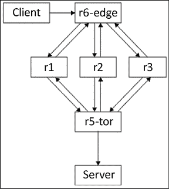

图 8.6：拓扑图 3

我们已经使用 Python 脚本来自动从设备中检索网络信息，并自动绘制拓扑图。这是一项相当多的工作，但回报是确保图形始终代表实际网络的最新状态。让我们通过一些验证来确保我们的脚本可以通过必要的图形检测到网络的最新状态变化。

### 测试剧本

现在我们已经准备好添加一个测试来检查剧本是否能够准确描述当链路发生变化时拓扑结构的变化。

我们可以通过关闭`r6-edge`上的`Gi0/1`和`Go0/2`接口来测试这一点：

```py
r6#confi t
Enter configuration commands, one per line.  End with CNTL/Z.
r6(config)#int gig 0/1
r6(config-if)#shut
r6(config-if)#int gig 0/2
r6(config-if)#shut
r6(config-if)#end
r6# 
```

当 LLDP 邻居通过保持计时器后，它们将从`r6-edge`上的 LLDP 表中消失：

```py
r6#sh lldp neighbors
Capability codes:
    (R) Router, (B) Bridge, (T) Telephone, (C) DOCSIS Cable Device
    (W) WLAN Access Point, (P) Repeater, (S) Station, (O) Other
Device ID           Local Intf     Hold-time  Capability      Port ID
r1.virl.info        Gi0/0          120        R               Gi0/0
r2.virl.info        Gi0/0          120        R               Gi0/0
r3.virl.info        Gi0/0          120        R               Gi0/0
r5.virl.info        Gi0/0          120        R               Gi0/0
r3.virl.info        Gi0/3          120        R               Gi0/1

Device ID           Local Intf     Hold-time  Capability      Port ID
Total entries displayed: 5 
```

如果我们执行剧本和 Python 脚本，图形将自动显示`r6-edge`仅连接到`r3`，我们可以开始排查为什么会出现这种情况：

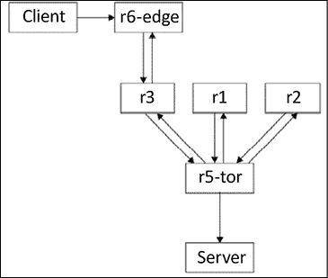

图 8.7：拓扑图 4

这是一个相对较长的示例，展示了多个工具协同工作以解决问题。我们使用了我们所学到的工具——Ansible 和 Python——来模块化并将任务分解成可重用的部分。

然后，我们使用了一个新的工具，即 Graphviz，来帮助监控网络，例如网络拓扑关系等非时间序列数据。

在下一节中，我们将稍微改变方向，探讨使用我们网络设备收集的网络流来监控我们的网络。

# 基于流的监控

如章节介绍中提到的，除了轮询技术，如 SNMP，我们还可以使用推送策略，允许设备将网络信息推送到管理站。NetFlow 及其紧密相关的 IPFIX 和 sFlow 就是从网络设备向管理站推送信息的例子。我们可以认为推送方法更可持续，因为网络设备本质上负责分配推送信息所需的资源。例如，如果设备 CPU 忙碌，它可以跳过流导出过程，转而执行更关键的任务，如路由数据包。

流，正如 IETF 定义的（[`www.ietf.org/proceedings/39/slides/int/ip1394-background/tsld004.htm`](https://www.ietf.org/proceedings/39/slides/int/ip1394-background/tsld004.htm)），是指从发送应用向接收应用移动的数据包序列。如果我们回顾 OSI 模型，流就是构成两个应用之间单一通信单元的东西。每个流包含一些数据包；有些流包含更多的数据包（例如视频流），而有些则只有少数几个（例如 HTTP 请求）。如果你花一分钟思考流，你会注意到路由器和交换机可能更关心数据包和帧，但应用和用户通常更关心网络流。

基于流的监控通常指的是 NetFlow、IPFIX 和 sFlow：

+   **NetFlow**：NetFlow v5 是一种技术，网络设备缓存流条目并通过匹配一系列元组（源接口、源 IP/端口、目的 IP/端口等）来聚合数据包。一旦流完成，网络设备将流特征导出到管理站，包括总字节数和包计数。

+   **IPFIX**：IPFIX 是结构化流式传输的提议标准，类似于 NetFlow v9，也称为灵活 NetFlow。本质上，它是一个可定义的流导出，允许用户导出网络设备所知的几乎所有内容。与 NetFlow v5 相比，灵活性通常以简单性为代价。IPFIX 的配置比传统的 NetFlow v5 更复杂。额外的复杂性使其不太适合入门学习。然而，一旦你熟悉了 NetFlow v5，你就可以解析 IPFIX，只要匹配模板定义即可。

+   **sFlow**：sFlow 本身没有关于流或数据包聚合的概念。它执行两种类型的数据包采样。它随机从“n”个数据包/应用中采样一个，并有一个基于时间的采样计数器。它将信息发送到管理站，该站通过参考接收到的数据包样本类型和计数器来推导网络流信息。由于它不对网络设备执行任何聚合操作，你可以认为 sFlow 比 NetFlow 和 IPFIX 更可扩展。

了解每一个的最佳方式可能是直接通过示例进行学习。让我们在下一节中查看一些基于流的示例。

## 使用 Python 进行 NetFlow 解析

我们可以使用 Python 解析在网络上传输的 NetFlow 数据报。这允许我们详细查看 NetFlow 数据包，并排除任何不符合预期的 NetFlow 问题。

首先，让我们在实验室网络中生成客户端和服务器之间的流量。我们可以使用 Python 内置的 HTTP 服务器模块在充当服务器的 VIRL 主机上快速启动一个简单的 HTTP 服务器。打开一个新的终端窗口到服务器主机并启动 HTTP 服务器；让我们保持窗口开启：

```py
cisco@Server:~$ python3 -m http.server
Serving HTTP on 0.0.0.0 port 8000 ... 
```

对于 Python 2，该模块名为 `SimpleHTTPServer`，例如，`python2 -m SimpleHTTPServer`。

在一个单独的终端窗口中，使用 `ssh` 连接到客户端。我们可以在 Python 脚本中创建一个短的 `while` 循环来持续向 Web 服务器发送 `HTTP GET`：

```py
cisco@Client:~$ cat http_get.py
import requests
import time
while True:
    r = requests.get("http://10.0.0.5:8000")
    print(r.text)
    time.sleep(5) 
```

客户端应该每 5 秒收到一个非常简单的 HTML 页面：

```py
cisco@Client:~$ python3 http_get.py
<!DOCTYPE HTML PUBLIC "-//W3C//DTD HTML 4.01//EN" "http://www.w3.org/TR/html4/strict.dtd">
<html>
<head>
<skip>
</body>
</html> 
```

如果我们回顾服务器的终端窗口，我们还应该看到客户端每 5 秒连续发送的请求：

```py
cisco@Server:~$ python3 -m http.server
Serving HTTP on 0.0.0.0 port 8000 ...
10.0.0.9 - - [02/Oct/2019 00:55:57] "GET / HTTP/1.1" 200 -
10.0.0.9 - - [02/Oct/2019 00:56:02] "GET / HTTP/1.1" 200 -
10.0.0.9 - - [02/Oct/2019 00:56:07] "GET / HTTP/1.1" 200 – 
```

客户端到服务器的流量穿过网络设备，我们可以从中间的任何设备导出 NetFlow。由于 `r6-edge` 是客户端主机的第一个跳点，我们将让这个路由器将 NetFlow 导出到管理主机的 `9995` 端口。

在这个例子中，我们只使用一个设备进行演示；因此，我们手动使用必要的命令进行配置。在下一节中，当我们启用所有设备的 NetFlow 时，我们将使用 Ansible playbook 一次性配置所有路由器。

在 Cisco IOS 设备上导出 NetFlow 需要以下配置：

```py
!
ip flow-export version 5
ip flow-export destination 192.168.2.126 9995 vrf Mgmt-intf
!
interface GigabitEthernet0/4
 description to Client
 ip address 10.0.0.10 255.255.255.252
 ip flow ingress
 ip flow egress
<skip> 
```

接下来，让我们看看 Python 解析脚本，它帮助我们分离从网络设备接收到的不同网络流字段。

### Python Socket 和 Struct

脚本 `netFlow_v5_parser.py` 是从 Brian Rak 的博客文章 [`blog.devicenull.org/2013/09/04/python-netflow-v5-parser.html`](http://blog.devicenull.org/2013/09/04/python-netflow-v5-parser.html) 中修改而来的。修改主要是为了 Python 3 兼容性和解析额外的 NetFlow 版本 5 字段。我们选择 NetFlow v5 而不是 NetFlow v9 的原因是 v9 更复杂，并使用模板来映射字段，这使得在入门课程中学习更加困难。然而，由于 NetFlow 版本 9 是原始 NetFlow 版本 5 的扩展格式，本节中介绍的所有概念都适用于它。

由于 NetFlow 数据包在网络上以字节形式表示，我们将使用标准库中包含的 Python struct 模块将字节转换为原生 Python 数据类型。

你可以在[`docs.python.org/3.10/library/socket.html`](https://docs.python.org/3.10/library/socket.html)和[`docs.python.org/3.10/library/struct.html`](https://docs.python.org/3.10/library/struct.html)找到更多关于这两个模块的信息。

在脚本中，我们将首先使用`socket`模块来绑定并监听 UDP 数据报。使用`socket.AF_INET`，我们打算监听 IPv4 地址套接字；使用`socket.SOCK_DGRAM`，我们指定我们将看到 UDP 数据报：

```py
sock = socket.socket(socket.AF_INET, socket.SOCK_DGRAM)
sock.bind(('0.0.0.0', 9995)) 
```

我们将启动一个循环，每次从线路上检索 1,500 字节的信息：

```py
while True:
    buf, addr = sock.recvfrom(1500) 
```

以下行是我们开始分解或解包数据包的地方。`!HH`的第一个参数指定了网络的大端字节序（感叹号表示大端）以及 C 类型的格式（`H = 2`字节无符号短整数）：

```py
(version, count) = struct.unpack('!HH',buf[0:4]) 
```

前四个字节包括版本和在此数据包中导出的流数量。如果你不记得 NetFlow 版本 5 的头部（顺便说一句，那是一个笑话；我只在想要快速入睡时才阅读头部），这里是一个快速浏览：

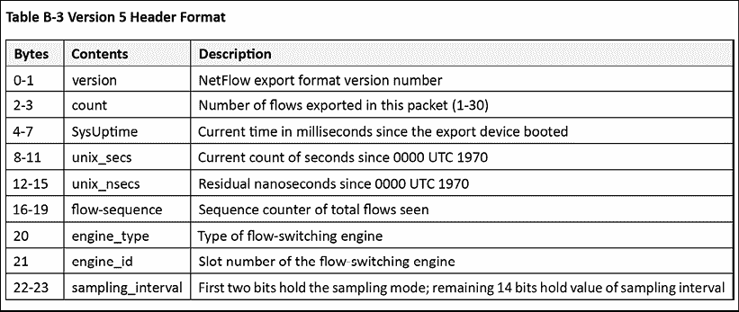

图 8.8：NetFlow v5 头部（来源：http://www.cisco.com/c/en/us/td/docs/net_mgmt/netflow_collection_engine/3-6/user/guide/format.html#wp1006108）

根据字节位置和数据类型，可以相应地解析其余的头部。Python 允许我们在一行中解包多个头部项：

```py
 (sys_uptime, unix_secs, unix_nsecs, flow_sequence) = struct.unpack('!IIII', buf[4:20])
    (engine_type, engine_id, sampling_interval) = struct.unpack('!BBH', buf[20:24]) 
```

下面的`while`循环将填充`nfdata`字典，其中包含解包源地址和端口、目标地址和端口、数据包计数和字节计数的流记录，并将信息打印到屏幕上：

```py
 nfdata = {}
    for i in range(0, count):
        try:
            base = SIZE_OF_HEADER+(i*SIZE_OF_RECORD)
            data = struct.unpack('!IIIIHH',buf[base+16:base+36])
            input_int, output_int = struct.unpack('!HH', buf[base+12:base+16])
            nfdata[i] = {}
            nfdata[i]['saddr'] = inet_ntoa(buf[base+0:base+4])
            nfdata[i]['daddr'] = inet_ntoa(buf[base+4:base+8])
            nfdata[i]['pcount'] = data[0]
            nfdata[i]['bcount'] = data[1]
            nfdata[i]['stime'] = data[2]
            nfdata[i]['etime'] = data[3]
            nfdata[i]['sport'] = data[4]
            nfdata[i]['dport'] = data[5]
            print(i, " {0}:{1} -> {2}:{3} {4} packts {5} bytes".format(
                nfdata[i]['saddr'], 
                nfdata[i]['sport'], 
                nfdata[i]['daddr'], 
                nfdata[i]['dport'], 
                nfdata[i]['pcount'],
                nfdata[i]['bcount']),
                ) 
```

脚本的输出允许您一目了然地可视化头部以及流内容。在以下输出中，我们可以看到`r6-edge`上的 BGP 控制包（TCP 端口`179`）以及 HTTP 流量（TCP 端口`8000`）：

```py
$ python3 netFlow_v5_parser.py
Headers:  
NetFlow Version: 5
Flow Count: 6
System Uptime: 116262790
Epoch Time in seconds: 1569974960
Epoch Time in nanoseconds: 306899412
Sequence counter of total flow: 24930
0  192.168.0.3:44779 -> 192.168.0.2:179 1 packts 59 bytes
1  192.168.0.3:44779 -> 192.168.0.2:179 1 packts 59 bytes
2  192.168.0.4:179 -> 192.168.0.5:30624 2 packts 99 bytes
3  172.16.1.123:0 -> 172.16.1.222:771 1 packts 176 bytes
4  192.168.0.2:179 -> 192.168.0.5:59660 2 packts 99 bytes
5  192.168.0.1:179 -> 192.168.0.5:29975 2 packts 99 bytes
**********
Headers:  
NetFlow Version: 5 
Flow Count: 15 
System Uptime: 116284791 
Epoch Time in seconds: 1569974982 
Epoch Time in nanoseconds: 307891182 
Sequence counter of total flow: 24936
0  10.0.0.9:35676 -> 10.0.0.5:8000 6 packts 463 bytes
1  10.0.0.9:35676 -> 10.0.0.5:8000 6 packts 463 bytes
<skip>
11  10.0.0.9:35680 -> 10.0.0.5:8000 6 packts 463 bytes
12  10.0.0.9:35680 -> 10.0.0.5:8000 6 packts 463 bytes
13  10.0.0.5:8000 -> 10.0.0.9:35680 5 packts 973 bytes
14  10.0.0.5:8000 -> 10.0.0.9:35680 5 packts 973 bytes 
```

注意，在 NetFlow 版本 5 中，记录大小固定为 48 字节；因此，循环和脚本相对简单。

然而，在 NetFlow 版本 9 或 IPFIX 的情况下，在头部之后，有一个模板 FlowSet（[`www.cisco.com/en/US/technologies/tk648/tk362/technologies_white_paper09186a00800a3db9.html`](http://www.cisco.com/en/US/technologies/tk648/tk362/technologies_white_paper09186a00800a3db9.html)），它指定了字段计数、字段类型和字段长度。这使得收集器可以在不知道数据格式的情况下解析数据。我们需要在 Python 脚本中为 NetFlow 版本 9 构建额外的逻辑。

通过在脚本中解析 NetFlow 数据，我们深入理解了字段，但这非常繁琐且难以扩展。正如你可能猜到的，其他工具解决了逐个解析 NetFlow 记录的问题。让我们在下一节中看看这样一个工具，称为**ntop**。

# ntop 流量监控

与*第七章*中的 PySNMP 脚本和本章中的 NetFlow 解析器脚本一样，我们可以使用 Python 脚本来处理线上的低级任务。然而，有一些工具，如 Cacti，这是一个包含数据收集（轮询器）、数据存储（RRDs）和用于可视化的 Web 前端的一站式开源包。这些工具可以通过在一个包中打包常用的功能和软件来节省你大量的工作。

在 NetFlow 的情况下，我们有几个开源和商业 NetFlow 收集器可供选择。如果我们快速搜索前 N 个开源 NetFlow 分析器，我们将看到针对不同工具的几个比较研究。

每个都有自己的优点和缺点；使用哪个取决于个人喜好、平台和对定制的需求。我建议选择一个支持 v5 和 v9，以及可能 sFlow 的工具。次要考虑因素是工具是否是用我们能够理解的语言编写的；我想象拥有 Python 的可扩展性将是一件好事。

我喜欢并之前使用过的两个开源 NetFlow 工具是 NfSen（后端收集器为 NFDUMP）和`ntop`（或`ntopng`）。在这两者之间，`ntop`是更知名的流量分析器；它运行在 Windows 和 Linux 平台上，并且与 Python 集成良好。因此，让我们在本节中使用`ntop`作为示例。

与 Cacti 类似，ntop 是一个一站式工具。我建议在生产环境中在管理站之外安装 ntop，或者在管理站上安装容器。

我们 Ubuntu 主机的安装过程很简单：

```py
$ sudo apt-get install ntop 
```

安装过程将提示必要的监听接口和设置管理员密码。默认情况下，`ntop`的 Web 界面监听端口`3000`，而探针监听 UDP 端口`5556`。在网络设备上，我们需要指定 NetFlow 导出器的位置：

```py
!
ip flow-export version 5
ip flow-export destination 192.168.2.126 5556 vrf Mgmt-intf
! 
```

默认情况下，IOSv 创建一个名为`Mgmt-intf`的 VRF，并将`Gi0/0`置于 VRF 下。

我们还需要在接口配置下指定流量导出的方向，例如`ingress`或`egress`：

```py
!
interface GigabitEthernet0/0
...
ip flow ingress 
ip flow egress
... 
```

为了供你参考，我包括了 Ansible playbook，`cisco_config_netflow.yml`，用于配置实验室设备的 NetFlow 导出。

`r5-tor`和`r6-edge`比`r1`、`r2`和`r3`多两个接口；因此，有一个额外的 playbook 来为它们启用额外的接口。

执行 playbook 并确保设备上正确应用了更改：

```py
$ ansible-playbook -i hosts cisco_config_netflow.yml
TASK [configure netflow export station] ****************************************************************************
changed: [r2]
changed: [r1]
changed: [r3]
changed: [r5-tor]
changed: [r6-edge]
TASK [configure flow export on Gi0/0] ****************************************************************************
ok: [r1]
ok: [r3]
ok: [r2]
ok: [r5-tor]
ok: [r6-edge]
<skip> 
```

在 playbook 运行后验证设备配置总是一个好主意，所以让我们对`r2`进行抽查：

```py
r2#sh run
!
interface GigabitEthernet0/0
 description OOB Management
 vrf forwarding Mgmt-intf
 ip address 192.168.2.126 255.255.255.0
 ip flow ingress
 ip flow egress
<skip>
!
ip flow-export version 5
ip flow-export destination 192.168.2.126 5556 vrf Mgmt-intf
! 
```

一切设置完成后，你可以检查**ntop**的 Web 界面以查看本地 IP 流量：

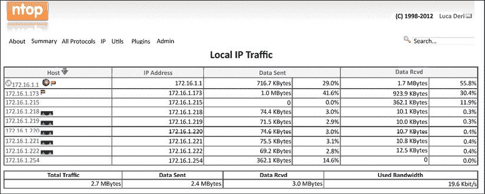

图 8.9：ntop 本地 IP 流量

ntop 最常使用的功能之一是使用它查看 Top Talkers 图：

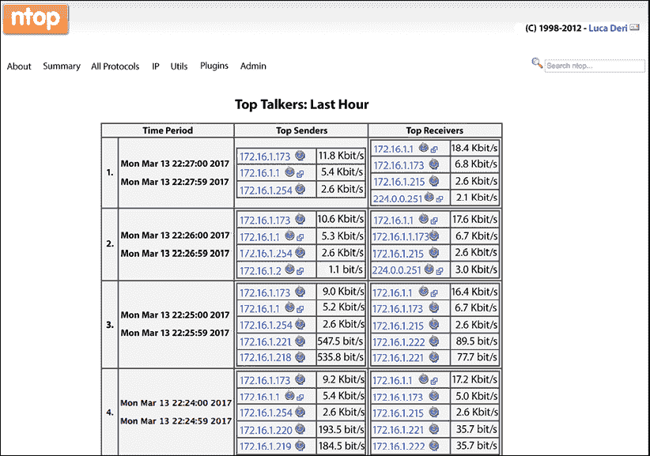

图 8.10：ntop 主要通信者

ntop 报告引擎是用 C 编写的；它快速高效，但需要对 C 有足够的了解才能进行像更改 Web 前端这样简单的操作，这与现代敏捷开发思维不符。

在 2000 年代中期尝试使用 Perl 失败几次后，ntop 的好人们最终决定嵌入 Python 作为可扩展的脚本引擎。让我们看看。

## ntop 的 Python 扩展

我们可以使用 Python 通过 ntop Web 服务器扩展 ntop。ntop Web 服务器可以执行 Python 脚本。从高层次来看，脚本将涉及以下内容：

+   访问 ntop 状态的几种方法

+   Python CGI 模块用于处理表单和 URL 参数

+   制作生成动态 HTML 页面的模板

+   每个 Python 脚本都可以从`stdin`读取并输出`stdout/stderr`。`stdout`脚本即为返回的 HTTP 页面。

Python 集成提供了几个有用的资源。在 Web 界面下，您可以点击**关于 | 显示配置**来查看 Python 解释器版本以及您的 Python 脚本目录：

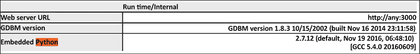

图 8.11：Python 版本

您还可以检查 Python 脚本应驻留的各个目录：

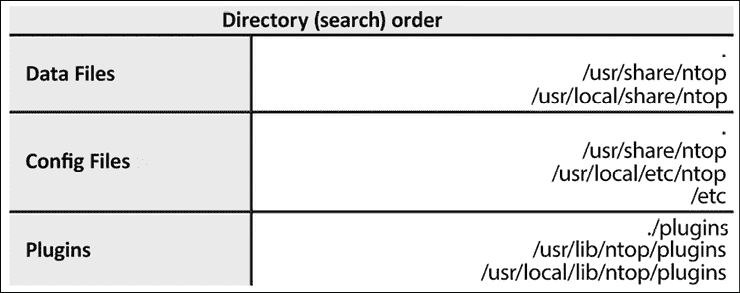

图 8.12：插件目录

在**关于 | 在线文档 | Python ntop 引擎**下，有 Python API 和教程的链接：

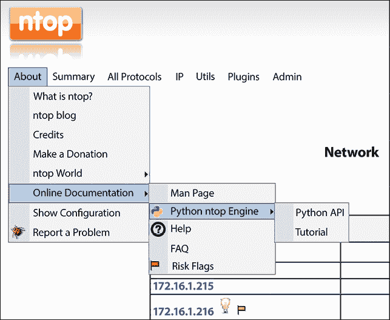

图 8.13：Python ntop 文档

如前所述，`ntop` Web 服务器直接执行放置在指定目录下的 Python 脚本：

```py
$ pwd
/usr/share/ntop/python 
```

我们将把我们的第一个脚本，即`chapter8_ntop_1.py`，放置在目录中。Python `CGI`模块处理表单并解析 URL 参数：

```py
# Import modules for CGI handling 
import cgi, cgitb
import ntop
# Parse URL cgitb.enable(); 
```

`ntop`实现了三个 Python 模块；每个模块都有特定的用途：

+   **ntop**: 本模块与`ntop`引擎交互。

+   **主持人**: 本模块深入解析特定主机的信息。

+   **接口**: 本模块表示本地主机接口的信息。

在我们的脚本中，我们将使用`ntop`模块检索`ntop`引擎信息，并使用`sendString()`方法发送 HTML 正文：

```py
form = cgi.FieldStorage();
name = form.getvalue('Name', default="Eric")
version = ntop.version() 
os = ntop.os()
uptime = ntop.uptime()
ntop.printHTMLHeader('Mastering Python Networking', 1, 0) ntop.sendString("Hello, "+ name +"<br>")
ntop.sendString("Ntop Information: %s %s %s" % (version, os, uptime))
ntop.printHTMLFooter() 
```

我们将使用`http://<ip>:3000/python/<script name>`执行 Python 脚本。以下是我们的`chapter8_ntop_1.py`脚本的执行结果：

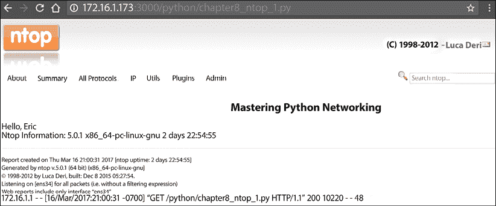

图 8.14：ntop 脚本结果

我们可以查看另一个与接口模块交互的示例，即`chapter8_ntop_2.py`。我们将使用 API 遍历接口：

```py
import ntop, interface, json
ifnames = []
try:
for i in range(interface.numInterfaces()):
    ifnames.append(interface.name(i))
except Exception as inst:
    print(type(inst)) # the exception instance 
    print(inst.args) # arguments stored in .args
    print(inst) #   str _ allows args to printed directly
<skip> 
```

生成的页面将显示`ntop`接口：

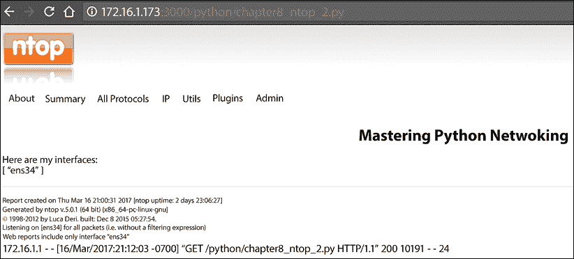

图 8.15：ntop 界面信息

除了社区版之外，ntop 还提供了一些商业产品，您可以选择。凭借活跃的开源社区、商业支持以及 Python 可扩展性，ntop 是满足您的 NetFlow 监控需求的好选择。

接下来，让我们看看 NetFlow 的表亲：sFlow。

## sFlow

sFlow，代表采样流，最初由 InMon([`www.inmon.com`](http://www.inmon.com))开发，后来通过 RFC 标准化。当前版本是 v5。行业中有许多人认为 sFlow 的主要优势是其可扩展性。

sFlow 使用随机的[在`n`中的`一个`]数据包流样本以及计数器样本的轮询间隔来估计流量；这比 NetFlow 对网络设备的 CPU 密集度更低。sFlow 的统计采样与硬件集成，并提供实时原始导出。

由于可扩展性和竞争原因，对于像 Arista Networks、Vyatta 和 A10 Networks 这样的新供应商，通常更倾向于使用 sFlow 而不是 NetFlow。虽然思科在其 Nexus 产品线支持 sFlow，但 sFlow 通常“不支持”在思科平台上。

### SFlowtool 和 sFlow-RT 与 Python

不幸的是，到目前为止，sFlow 是我们 CML 实验室设备不支持的东西（甚至不包括 NX-OSv 虚拟交换机）。您可以使用支持 sFlow 的思科 Nexus 3000 交换机或其他供应商的交换机，例如 Arista。对于实验室来说，另一个好选择是使用 Arista vEOS 虚拟实例。我有一个运行 7.0（3）的思科 Nexus 3048 交换机的访问权限，我将在此部分中使用它作为 sFlow 导出器。

配置思科 Nexus 3000 的 sFlow 很简单：

```py
Nexus-2# sh run | i sflow feature sflow
sflow max-sampled-size 256
sflow counter-poll-interval 10
sflow collector-ip 192.168.199.185 vrf management sflow agent-ip 192.168.199.148
sflow data-source interface Ethernet1/48 
```

使用`sflowtool`是摄取 sFlow 的最简单方法。有关安装说明，请参阅[`blog.sflow.com/2011/12/sflowtool.html`](http://blog.sflow.com/2011/12/sflowtool.html)上的文档：

```py
$ wget http://www.inmon.com/bin/sflowtool-3.22.tar.gz
$ tar -xvzf sflowtool-3.22.tar.gz
$ cd sflowtool-3.22/
$ ./configure
$ make
$ sudo make install 
```

我在实验室中使用的是较旧的`sFlowtool`版本。新版本的工作方式相同。

安装完成后，您可以启动`sflowtool`并查看 Nexus 3048 在标准输出上发送的数据报：

```py
$ sflowtool
startDatagram =================================
datagramSourceIP 192.168.199.148
datagramSize 88
unixSecondsUTC 1489727283
datagramVersion 5
agentSubId 100
agent 192.168.199.148
packetSequenceNo 5250248
sysUpTime 4017060520
samplesInPacket 1
startSample ----------------------
sampleType_tag 0:4 sampleType COUNTERSSAMPLE sampleSequenceNo 2503508
sourceId 2:1
counterBlock_tag 0:1001
5s_cpu 0.00
1m_cpu 21.00
5m_cpu 20.80
total_memory_bytes 3997478912
free_memory_bytes 1083838464 endSample ----------------------
endDatagram ================================= 
```

sflowtool GitHub 仓库([`github.com/sflow/sflowtool`](https://github.com/sflow/sflowtool))中有许多良好的使用示例；其中之一是使用脚本接收`sflowtool`输入并解析输出。我们可以为此目的使用 Python 脚本。在`chapter8_sflowtool_1.py`示例中，我们将使用`sys.stdin.readline`接收输入，并使用正则表达式搜索来打印出包含单词 agent 的行，当我们看到 sFlow 数据包时：

```py
#!/usr/bin/env python3
import sys, re
for line in iter(sys.stdin.readline, ''):
    if re.search('agent ', line):
         print(line.strip()) 
```

可以将脚本管道化到`sflowtool`：

```py
$ sflowtool | python3 chapter8_sflowtool_1.py 
agent 192.168.199.148
agent 192.168.199.148 
```

有许多其他有用的输出示例，例如以 NetFlow 版本 5 记录输出的`tcpdump`，以及紧凑的逐行输出。这使得`sflowtool`适用于不同的监控环境。

ntop 支持 sFlow，这意味着您可以直接将 sFlow 导出到 ntop 收集器。如果您的收集器仅支持 NetFlow，您可以使用`-c`选项在 NetFlow 版本 5 格式中为`sflowtool`输出：

```py
$ sflowtool --help
...
tcpdump output:
-t - (output in binary tcpdump(1) format)
-r file - (read binary tcpdump(1) format)
-x - (remove all IPV4 content)
-z pad - (extend tcpdump pkthdr with this many zeros
e.g. try -z 8 for tcpdump on Red Hat Linux 6.2)
NetFlow output:
-c hostname_or_IP - (netflow collector host)
-d port - (netflow collector UDP port)
-e - (netflow collector peer_as (default = origin_as))
-s - (disable scaling of netflow output by sampling rate)
-S - spoof source of netflow packets to input agent IP 
```

或者，您也可以使用 InMon 的 sFlow-RT（[`www.sflow-rt.com/index.php`](http://www.sflow-rt.com/index.php)）作为您的 sFlow 分析引擎。从操作员的角度来看，sFlow-RT 与众不同的地方是其庞大的 RESTful API，可以根据您的用例进行定制。您也可以轻松地从 API 中检索指标。您可以在[`www.sflow-rt.com/reference.php`](http://www.sflow-rt.com/reference.php)查看其广泛的 API 参考。

注意，sFlow-RT 需要 Java 来运行以下操作：

```py
$ sudo apt-get install default-jre
$ java -version
openjdk version "1.8.0_121"
OpenJDK Runtime Environment (build 1.8.0_121-8u121-b13-0ubuntu1.16.04.2- b13)
OpenJDK 64-Bit Server VM (build 25.121-b13, mixed mode) 
```

安装后，下载和运行 sFlow-RT 非常简单（[`sflow-rt.com/download.php`](https://sflow-rt.com/download.php)）：

```py
$ wget http://www.inmon.com/products/sFlow-RT/sflow-rt.tar.gz
$ tar -xvzf sflow-rt.tar.gz
$ cd sflow-rt/
$ ./start.sh
2017-03-17T09:35:01-0700 INFO: Listening, sFlow port 6343
2017-03-17T09:35:02-0700 INFO: Listening, HTTP port 8008 
```

我们可以将网络浏览器指向 HTTP 端口`8008`并验证安装：


图 8.16：sFlow-RT 版本

一旦 sFlow-RT 收到任何 sFlow 数据包，代理和其他指标将出现：

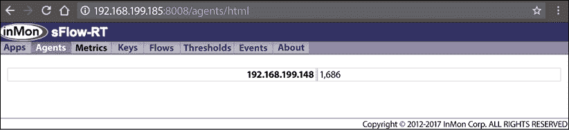

图 8.17：sFlow-RT 代理 IP

这里有两个使用 Python requests 从 sFlow-RT 的 REST API 检索信息的示例：

```py
>>> import requests
>>> r = requests.get("http://192.168.199.185:8008/version")
>>> r.text '2.0-r1180'
>>> r = requests.get("http://192.168.199.185:8008/agents/json")
>>> r.text
'{"192.168.199.148": {n "sFlowDatagramsLost": 0,n "sFlowDatagramSource": ["192.168.199.148"],n "firstSeen": 2195541,n "sFlowFlowDuplicateSamples": 0,n "sFlowDatagramsReceived": 441,n "sFlowCounterDatasources": 2,n "sFlowFlowOutOfOrderSamples": 0,n "sFlowFlowSamples": 0,n "sFlowDatagramsOutOfOrder": 0,n "uptime": 4060470520,n "sFlowCounterDuplicateSamples": 0,n "lastSeen": 3631,n "sFlowDatagramsDuplicates": 0,n "sFlowFlowDrops": 0,n "sFlowFlowLostSamples": 0,n "sFlowCounterSamples": 438,n "sFlowCounterLostSamples": 0,n "sFlowFlowDatasources": 0,n "sFlowCounterOutOfOrderSamples": 0n}}' 
```

请查阅参考文档，了解适用于您需求的额外 REST 端点。

在本节中，我们探讨了基于 sFlow 的监控示例，既作为独立工具，也作为与`ntop`集成的部分。sFlow 是旨在解决传统`netflow`格式所面临的可扩展性问题的新流格式之一，值得我们花些时间看看它是否是手头网络监控任务的正确工具。我们接近本章的结尾，让我们看看我们涵盖了哪些内容。

# 摘要

在本章中，我们探讨了我们可以利用 Python 的额外方式来增强我们的网络监控工作。我们开始使用 Python 的 Graphviz 包，利用网络设备报告的实时 LLDP 信息创建网络拓扑图。这使得我们能够轻松地显示当前网络拓扑，以及轻松地注意到任何链路故障。

接下来，我们使用 Python 解析 NetFlow 版本 5 数据包，以增强我们对 NetFlow 的理解和故障排除。我们还探讨了如何使用 ntop 和 Python 扩展 ntop 以进行 NetFlow 监控。sFlow 是一种替代的包采样技术。我们使用`sflowtool`和 sFlow-RT 来解释 sFlow 结果。

在*第九章*，*使用 Python 构建网络 Web 服务*中，我们将探讨如何使用 Python Web 框架 Flask 来构建网络 Web 服务。

# 加入我们的书籍社区

要加入本书的社区——在那里您可以分享反馈、向作者提问，并了解新版本——请扫描下面的二维码：

[`packt.link/networkautomationcommunity`](https://packt.link/networkautomationcommunity)


