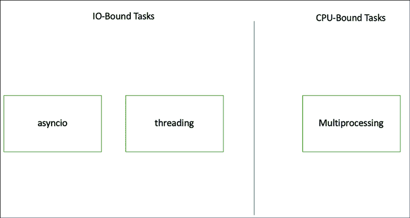
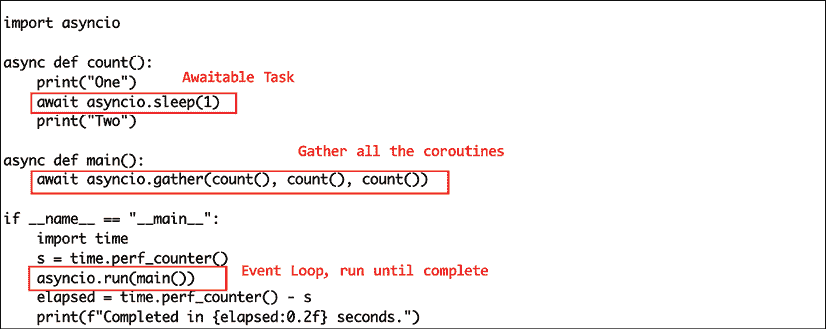
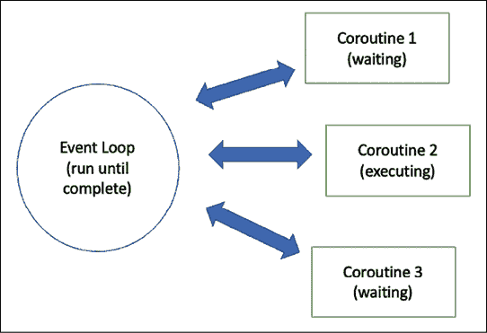
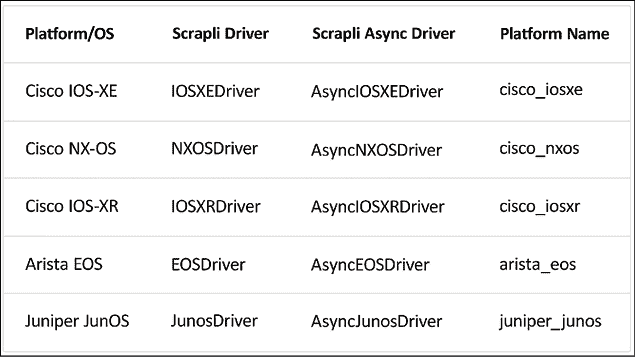

# 10

# 异步 IO 简介

在前面的章节中，我们通过 API 或其他 Python 库直接与网络设备交互，这些库抽象了我们对远程设备的低级交互。当我们需要与多个设备交互时，我们使用循环来允许我们实用地执行命令。我们可能会开始看到的一个问题是，当我们需要与许多设备交互时，端到端过程开始变慢。瓶颈通常是我们在发送命令直到从远程设备收到适当响应之间等待的时间。如果我们每个操作需要 5 秒钟的等待时间，当我们需要操作 30 个设备时，我们可能需要等待几分钟。

这部分是正确的，因为我们的操作是顺序的。我们一次只操作一个设备，按顺序进行。如果我们能够同时处理多个设备呢？这样会加快速度，对吧？是的，你是对的。但是，告诉我们的 Python 脚本“同时”去处理多个设备并不像听起来那么简单。我们必须考虑计算机调度任务的方式、语言限制以及手头的可用工具。

在本章中，我们将讨论 Async IO，这是一个 Python 包，允许我们同时执行多个任务。我们还将讨论相关主题，如多进程、并行性、线程等。Python 中的异步操作是一个我认为中等到高级水平的话题。async IO 模块本身是在 Python 3.4 中引入的。它也在 Python 3.4 到 Python 3.7 之间经历了快速的变化。不管怎样，它对于网络自动化来说是一个非常相关的主题。我相信，对于任何希望熟悉网络自动化的网络工程师来说，这都是一个值得研究的话题。

在本章中，我们将讨论以下与 Async IO 相关的话题：

+   异步操作概述

+   多进程和线程

+   Python asyncio 模块

+   `Scrapli`项目

关于 Python 相关异步操作的信息，Real Python（[`realpython.com/search?q=asyncio`](https://realpython.com/search?q=asyncio)）和 Python 文档（[`docs.python.org/3/library/asyncio.html`](https://docs.python.org/3/library/asyncio.html)）都提供了良好的学习资源。

让我们从异步操作概述开始看起。

# 异步操作概述

在《Python 之禅》中；我们知道 Python 的一个指导原则是最好有“做某事的一种最佳方式。”当涉及到异步操作时，这有点复杂。我们知道如果我们能够同时执行多个任务会很有帮助，但确定正确的解决方案可能并不直接。

首先，我们需要确定是什么减慢了我们的程序。通常，瓶颈可以是 CPU 密集型或 I/O 密集型。在 CPU 密集型情况下，程序将 CPU 推到极限。例如，解决数学问题或图像处理等操作是 CPU 密集型程序的例子。例如，当我们为 VPN 选择加密算法时，我们知道算法越复杂，CPU 消耗就越多。对于 CPU 密集型任务，减轻瓶颈的方法是增加 CPU 功率或允许任务同时使用多个 CPU。

在 I/O 密集型操作中，程序的大部分时间都花在等待从已完成的输入中获取一些输出上。当我们向设备发起 API 调用时，我们必须等到收到所需的答案才能进行下一步。如果时间很重要，那么这将是本可以用于做其他事情的时间。减轻 I/O 密集型任务的方法是同时处理多个任务。

如果当前的工作受 CPU 功率或输入输出延迟的限制，我们可以尝试同时运行多个操作。这被称为并行化。当然，并不是所有任务都可以并行化。正如伟大的沃伦·巴菲特所说：“你不能通过让九个女人怀孕一个月来生一个孩子。”然而，如果你的任务可以并行化，我们有一些并行处理选项：multiprocessing、threading 或新的 asyncio 模块。

## Python multiprocessing

Python 的 multiprocessing 允许将 CPU 密集型任务分解成子任务，并创建子进程来处理它们。这对于 CPU 密集型任务非常合适，因为它允许多个 CPU 同时工作。如果我们回顾一下计算历史，我们会注意到大约在 2005 年，单个 CPU 的运行速度就不再提高了。由于干扰和散热问题，我们无法在单个 CPU 上放置更多的晶体管。我们获得更多计算能力的方法是使用多核 CPU。这使我们能够将任务分散到多核 CPU 上。

在 Python 的 multiprocessing 模块中，通过创建一个`Process`对象并调用其`start()`方法来创建进程。让我们看一个简单的例子，`multiprocess_1.py`：

```py
#!/usr/bin/env python3
# Modified from 
# https://docs.python.org/3/library/multiprocessing.html
from multiprocessing import Process
import os
def process_info():
    print('process id:', os.getpid())
def worker(number):
    print(f'Worker number {number}')
    process_info()
if __name__ == '__main__':
    for i in range(5):
        p = Process(target=worker, args=(i,))
        p.start() 
```

在这个例子中，我们有一个工作函数，它调用另一个`process_info()`函数来获取进程 ID。然后我们启动 Process 对象五次，每次都针对工作函数。执行输出如下：

```py
(venv) $ python multiprocess_1.py 
Worker number 0
process id: 109737
Worker number 2
process id: 109739
Worker number 3
process id: 109740
Worker number 1
process id: 109738
Worker number 4
process id: 109741 
```

如我们所见，每个进程都有自己的进程和进程 ID。Multiprocessing 非常适合 CPU 密集型任务。如果工作是 I/O 密集型，在 asyncio 模块出现之前，我们最好的选择是使用 threading 模块。

## Python multithreading

如我们所知，Python 有一个**全局解释器锁**，或称为**GIL**。Python 解释器（确切地说是 CPython）使用它来确保一次只有一个线程执行 Python 字节码。这主要是为了防止内存泄漏中的竞态条件而采取的安全措施。但它可能会成为 IO 密集型任务的性能瓶颈。

想要了解更多信息，请查看[`realpython.com/python-gil/`](https://realpython.com/python-gil/)上的文章。

允许多个线程运行的一种方法是通过使用`threading`模块。它允许程序并发运行多个操作。我们可以在`threading_1.py`中看到一个简单的例子：

```py
#!/usr/bin/env python3
# Modified from https://pymotw.com/3/threading/index.html
import threading
# Get thread ID
def thread_id():
    print('thread id:', threading.get_ident())
# Worker function
def worker(number):
    print(f'Worker number {number}')
    thread_id()
threads = []
for i in range(5):
    t = threading.Thread(target=worker, args=(i,))
    threads.append(t)
    t.start() 
```

该脚本与我们的多进程示例类似，只是显示的是线程 ID 而不是进程 ID。脚本执行的输出如下：

```py
(venv) $ python threading_1.py 
Worker number 0
thread id: 140170712495680
Worker number 1
thread id: 140170704102976
Worker number 2
thread id: 140170695710272
Worker number 3
thread id: 140170704102976
Worker number 4
thread id: 140170695710272 
```

线程模块是缓解 Python GIL 的多个线程的好选择。然而，当 Python 将任务传递给线程时，主进程在线程过程中可见性有限。线程处理起来更困难，尤其是在协调不同线程和处理可能出现的错误时。对于 IO 密集型任务，Python 3 中的 asyncio 是另一个不错的选择。



图 10.1：CPU 密集型与 IO 密集型 Python 模块

让我们更深入地了解 asyncio 模块。

# Python asyncio 模块

我们可以将 asyncio 模块视为 Python 允许我们编写并发运行任务的代码的方式。它使用了新引入的`async`和`await`关键字。它可以帮助我们提高许多可能受 IO 限制的操作的性能，例如 Web 服务器、数据库，当然还有通过网络与设备通信。asyncio 模块是 FastAPI 等流行新框架的基础([`fastapi.tiangolo.com/`](https://fastapi.tiangolo.com/))。

然而，重要的是要指出，asyncio 既不是多进程也不是多线程。它被设计为单线程单进程。Python asyncio 使用**协作多进程**来提供并发的感觉。

与线程不同，Python 从始至终控制着整个过程，而不是将线程过程传递给操作系统。这使得 Python 知道任务何时开始和完成，从而在进程之间进行协调。当我们“暂停”部分代码等待结果时，Python 会在返回“暂停”代码之前先继续执行其他代码部分。

在编写我们的 asyncio 代码之前，这是一个需要掌握的重要概念。我们需要决定代码的哪一部分可以被暂停，以便 Python 可以暂时从它那里移开。我们必须告诉 Python，“嘿，我只是在等待某事。去做其他事情，然后回来检查我。”

让我们从`asyncio_1.py`中 asyncio 模块语法的简单示例开始：

```py
#!/usr/bin/env python3
import asyncio
async def main():
    print('Hello ...')
    await asyncio.sleep(1)
    print('... World!')
    await asyncio.sleep(2)
    print('... and again.')
asyncio.run(main()) 
```

当我们执行它时，这里是这个输出：

```py
$ python asyncio_1.py 
Hello ...
... World!
... and again. 
```

在这个例子中，我们可以注意以下几点：

1.  asyncio 模块是 Python 3.10 的标准库。

1.  函数前使用了 `async` 关键字。在 asyncio 中，这被称为协程。

1.  `await` 关键字正在等待某些操作的返回。

1.  我们不是简单地调用函数/协程，而是使用 `asyncio.run()` 来实现。

asyncio 模块的核心是协程，使用 `async` 关键字定义。协程是 Python 生成器函数的特化版本，可以在等待时暂时将控制权交还给 Python 解释器。

生成器函数是一种可以像列表一样迭代的函数类型，但在加载内容到内存之前这样做。这在例如数据集非常大，可能会压倒计算机内存的情况下很有用。更多信息，请参阅此文档：[`wiki.python.org/moin/Generators`](https://wiki.python.org/moin/Generators)。


图 10.2：带有 async 和 await 的协程

让我们进一步探讨这个例子，看看我们如何在此基础上构建。以下示例来自 *RealPython.com* 的优秀教程([`realpython.com/async-io-python/#the-asyncio-package-and-asyncawait`](https://realpython.com/async-io-python/#the-asyncio-package-and-asyncawait))。我们将从一个同步的计数函数 `sync_count.py` 开始：

```py
#!/usr/bin/env python3
# Modified from https://realpython.com/async-io-python/#the-asyncio-package-and-asyncawait countsync.py example
import time
def count():
    print("One")
    time.sleep(1)
    print("Two")
def main():
    count()
    count()
    count()
if __name__ == "__main__":
    s = time.perf_counter()
    main()
    elapsed = time.perf_counter() - s
    print(f"Completed in {elapsed:0.2f} seconds.") 
```

执行后，我们可以看到脚本通过忠实地三次顺序执行函数，在 3 秒内执行完成：

```py
(venv) $ python sync_count.py
One
Two
One
Two
One
Two
Completed in 3.00 seconds. 
```

现在，让我们看看我们是否可以构建一个异步版本，`async_count.py`：

```py
#!/usr/bin/env python3
# example from https://realpython.com/async-io-python/#the-asyncio-package-and-asyncawait countasync.py
import asyncio
async def count():
    print("One")
    await asyncio.sleep(1)
    print("Two")
async def main():
    await asyncio.gather(count(), count(), count())
if __name__ == "__main__":
    import time
    s = time.perf_counter()
    asyncio.run(main())
    elapsed = time.perf_counter() - s
    print(f"Completed in {elapsed:0.2f} seconds.") 
```

当我们执行这个文件时，我们会看到类似的任务在 1/3 的时间内就完成了：

```py
(venv) $ python async_count.py
One
One
One
Two
Two
Two
Completed in 1.00 seconds. 
```

为什么会这样？这是因为现在当我们计数并遇到 sleep 暂停时，我们会将控制权交还给解释器，允许它处理其他任务。



图 10.3：事件循环

在这个例子中有几个重要的点需要注意：

1.  `sleep()` 函数被改成了 `asyncio.sleep()` 函数。它是一个可等待的函数。

1.  `count()` 和 `main()` 函数现在都是协程。

1.  我们使用了 `asyncio.gather()` 来收集所有的协程。

1.  `asyncio.run()` 是一个循环，它会一直运行直到所有任务都完成。

从示例中，我们可以看到我们需要对常规函数进行一些修改，以允许 asyncio 提供的性能提升。记得我们讨论过协作式多进程吗？Asyncio 需要 Python 程序中的所有组件共同工作以实现这一目标。



图 10.4：事件循环

在下一节中，我们将探讨 Scrapli 项目，该项目通过利用 Python 3 asyncio 功能来加速网络设备交互过程。

# Scrapli 项目

Scrapli 是一个开源网络库 ([`github.com/carlmontanari/scrapli`](https://github.com/carlmontanari/scrapli))，它使用 Python 3 的 asyncio 功能来帮助更快地连接到网络设备。它是由 Carl Montanari ([`github.com/carlmontanari`](https://github.com/carlmontanari)) 在他的网络自动化项目中创建的。安装过程很简单：

```py
(venv) $ pip install scrapli
(venv) $ mkdir scrapli && cd scrapli 
```

让我们开始使用 Scrapli 进行我们的网络设备通信。

## Scrapli 示例

我们可以使用以下示例，`scrapli_example_1.py`，在我们的实验室 NX-OS 设备 `lax-cor-r1` 上执行 `show` 命令：

```py
# Modified from https://github.com/carlmontanari/scrapli
from scrapli import Scrapli
device = {
   "host": "192.168.2.50",
   "auth_username": "cisco",
   "auth_password": "cisco",
   "auth_strict_key": False,
   "ssh_config_file": True,
   "platform": "cisco_nxos",
}
conn = Scrapli(**device)
conn.open()
response = conn.send_command("show version")
print(response.result) 
```

执行脚本将给出 `show` `version` 输出。注意这是字符串格式：

```py
(venv) $ python scrapli_example_1.py 
Cisco Nexus Operating System (NX-OS) Software
TAC support: http://www.cisco.com/tac
…
Software
  loader:    version N/A
  kickstart: version 7.3(0)D1(1)
  system:    version 7.3(0)D1(1)
Hardware
  cisco NX-Osv Chassis ("NX-Osv Supervisor Module")
  IntelI CITM) i5-7260U C with 3064740 kB of memory.
  Processor Board ID TM000940CCB
  Device name: lax-cor-r1
  bootflash:    3184776 kB
… 
```

从表面上看，它可能看起来与其他一些我们见过的库没有太大区别。但在底层，核心驱动程序和相关平台正在使用可以转换为 `awaitable` 协程的 asyncio 模块：



图 10.5：Scrapli 核心驱动程序（来源：https://carlmontanari.github.io/scrapli/user_guide/basic_usage/）

我们可以通过访问项目的 GitHub 页面来验证代码，[`github.com/carlmontanari/scrapli`](https://github.com/carlmontanari/scrapli)。NXOS 异步驱动程序，[`github.com/carlmontanari/scrapli/blob/main/scrapli/driver/core/cisco_nxos/async_driver.py`](https://github.com/carlmontanari/scrapli/blob/main/scrapli/driver/core/cisco_nxos/async_driver.py)，可以追溯到基础异步驱动程序，[`github.com/carlmontanari/scrapli/blob/main/scrapli/driver/base/async_driver.py`](https://github.com/carlmontanari/scrapli/blob/main/scrapli/driver/base/async_driver.py)，以及基础驱动程序，[`github.com/carlmontanari/scrapli/blob/main/scrapli/driver/base/base_driver.py`](https://github.com/carlmontanari/scrapli/blob/main/scrapli/driver/base/base_driver.py)。这是开源项目的美丽之处之一，我们有自由去探索和构建在彼此知识的基础上。感谢，Carl！

核心驱动程序包括 Cisco IOS-XE、Cisco NX-OS、Cisco IOS-XR、Arista EOS 和 Juniper JunOS。通过简单地指定平台，Scrapli 能够将其与特定的驱动程序相关联。还有一个 `scrapli_community` 项目 ([`github.com/scrapli/scrapli_community`](https://github.com/scrapli/scrapli_community))，它扩展了核心驱动程序的功能。

在我们的实验室中，我们指定了额外的 `ssh` 配置。因此，我们需要将 `ssh_config_file` 设置为 `true`：

```py
$ cat ~/.ssh/config
…
Host 192.168.2.50
  HostKeyAlgorithms +ssh-rsa
  KexAlgorithms +diffie-hellman-group-exchange-sha1 
```

Scrapli 的文档，[`carlmontanari.github.io/scrapli/`](https://carlmontanari.github.io/scrapli/)，是一个很好的起点。Packet Coders，[`www.packetcoders.io/`](https://www.packetcoders.io/)，也提供了良好的网络自动化课程，包括 Scrapli。

现在，我们可以将这个 `awaitable` 任务放入 asyncio 运行循环中。

## Scrapli 异步示例

在这个例子中，我们将更精确地讨论驱动器和传输。我们将从 Scrapli 安装`asyncssh`插件（[`carlmontanari.github.io/scrapli/api_docs/transport/plugins/asyncssh/`](https://carlmontanari.github.io/scrapli/api_docs/transport/plugins/asyncssh/))以供使用：

```py
(venv) $ pip install scrapli[asyncssh] 
```

下面列出了脚本`scraplie_example_2.py`：

```py
#!/usr/bin/env python3
# Modified from 
# https://github.com/carlmontanari/scrapli/blob/main/examples/async_usage/async_multiple_connections.py
import asyncio
from scrapli.driver.core import AsyncNXOSDriver
async def gather_cor_device_version(ip, username, password):
    device = {
        "host": ip,
        "auth_username": username,
        "auth_password": password,
        "auth_strict_key": False,
        "ssh_config_file": True,
        "transport": "asyncssh",
        "driver": AsyncNXOSDriver
    }
    driver = device.pop("driver")
    conn = driver(**device)
    await conn.open()
    response = await conn.send_command("show version")
    await conn.close()
    return response
async def main():
    results = await asyncio.gather(
                        gather_cor_device_version('192.168.2.50', 'cisco', 'cisco'),
                        gather_cor_device_version('192.168.2.60', 'cisco', 'cisco')
                    )
    for result in results: 
        print(result.result)
if __name__ == "__main__": 
    import time
    s = time.perf_counter()
    asyncio.run(main())
    elapsed = time.perf_counter() - s
    print(f"Completed in {elapsed:0.2f} seconds.") 
```

该脚本创建了两个新的协程，一个用于收集设备信息，另一个用于在`main()`函数中收集协程任务。我们还创建了一个`asyncio.run()`循环，当脚本独立执行时运行`main()`函数。让我们执行这个脚本：

```py
(venv) $ python scrapli_example_2_async.py 
Cisco Nexus Operating System (NX-OS) Software
…
  loader:    version N/A
  kickstart: version 7.3(0)D1(1)
  system:    version 7.3(0)D1(1)
…
  Device name: lax-cor-r1
  bootflash:    3184776 kB
…
  Device name: nyc-cor-r1
  bootflash:    3184776 kB
…
Completed in 1.37 seconds. 
```

除了两个设备输出的`show version`信息外，我们还看到执行完成仅用了 1 秒多一点的时间。

让我们比较同步和异步操作的性能差异。Scrapli 为同步操作提供了一个`GenericDriver`。在示例脚本`scrapli_example_3_sync.py`中，我们将使用`GenericDriver`来反复收集信息。仅为了说明目的，该脚本连接到每个设备三次：

```py
#!/usr/bin/env python3
# Modified from 
# https://github.com/carlmontanari/scrapli/blob/main/examples/async_usage/async_multiple_connections.py
import asyncio
# from scrapli.driver.core import Paramiko
from scrapli.driver import GenericDriver
def gather_cor_device_version(ip, username, password):
    device = {
        "host": ip,
        "auth_username": username,
        "auth_password": password,
        "auth_strict_key": False,
        "ssh_config_file": True,
        "driver": GenericDriver
    }
    driver = device.pop("driver")
    conn = driver(**device)
    conn.open()
    response = conn.send_command("show version")
    conn.close()
    return response
def main():
    results = []
    for device in [
                    '192.168.2.50', 
                    '192.168.2.60',
                    '192.168.2.50', 
                    '192.168.2.60',
                    '192.168.2.50', 
                    '192.168.2.60',
                    '192.168.2.50', 
                    '192.168.2.60',
                  ]:
        results.append(gather_cor_device_version(device, 'cisco', 'cisco'))
    return results
if __name__ == "__main__": 
    import time
    s = time.perf_counter()
    main()
    elapsed = time.perf_counter() - s
    print(f"Completed in {elapsed:0.2f} seconds.") 
```

此外，还有一个可比较的异步版本，`scrapli_example_3_async.py`。当我们运行这两个脚本时，这里显示了性能差异：

```py
(venv) $ python scrapli_example_3_sync.py 
Completed in 5.97 seconds.
(venv) $ python scrapli_example_3_async.py 
Completed in 4.67 seconds. 
```

这可能看起来改进不大，但随着我们扩大运营规模，性能提升将变得更加显著。

# 摘要

在本章中，我们学习了异步处理的概念。我们简要介绍了 CPU 密集型和 I/O 密集型任务背后的概念。我们之前通过多进程和多线程解决了由它们引起的瓶颈。

从 Python 3.4 开始，引入了新的 asyncio 模块来解决 I/O 密集型任务。它与多线程类似，但使用了一种特殊的协作多任务设计。它们使用特殊的关键字——`async`关键字用于创建特殊类型的 Python 生成器函数，`await`关键字用于指定可以暂时“暂停”的任务。asyncio 模块可以收集这些任务并在循环中运行，直到完成。

在本章的后半部分，我们学习了使用 Scrapli，这是一个由 Carl Montanari 为网络工程社区创建的项目。它旨在利用 Python 3 中的 asyncio 特性进行网络设备管理。

Asyncio 并不容易。异步、await、loop 和生成器等新术语可能会让人感到压倒性。从 Python 3.4 到 3.7 版本，asyncio 模块也经历了快速的发展，使得一些在线文档已经过时。希望本章提供的信息能帮助我们理解这个有用的特性。

在下一章中，我们将转向云计算及其周围的网络特性。

# 加入我们的书籍社区

要加入我们这本书的社区——在那里你可以分享反馈，向作者提问，并了解新版本——请扫描下面的二维码：

[`packt.link/networkautomationcommunity`](https://packt.link/networkautomationcommunity)


