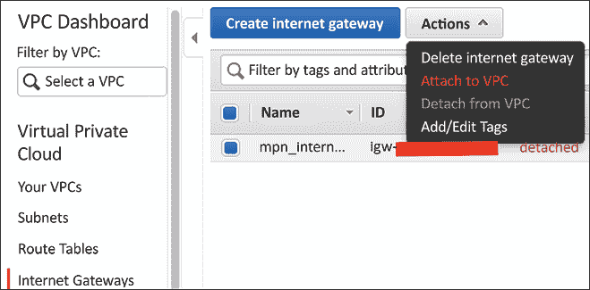

# 11

# AWS 云网络

云计算是当今计算领域的主要趋势，并且已经持续了多年。公共云提供商已经改变了创业行业以及从头开始推出服务的含义。我们不再需要构建自己的基础设施；我们可以支付公共云提供商的费用，租用他们资源的一部分来满足我们的基础设施需求。如今，在任何一个技术会议或聚会中，我们很难找到没有了解过、使用过或基于云构建过服务的人。云计算已经到来，我们最好习惯与它一起工作。

云计算有几种服务模型，大致可以分为 **软件即服务**（**SaaS** — [`en.wikipedia.org/wiki/Software_as_a_service`](https://en.wikipedia.org/wiki/Software_as_a_service))、**平台即服务**（**PaaS** — [`en.wikipedia.org/wiki/Cloud_computing#Platform_as_a_service_(PaaS)`](https://en.wikipedia.org/wiki/Cloud_computing#Platform_as_a_service_(PaaS))) 和 **基础设施即服务**（**IaaS** — [`en.wikipedia.org/wiki/Infrastructure_as_a_service`](https://en.wikipedia.org/wiki/Infrastructure_as_a_service))。每种服务模型从用户的角度提供了不同层次抽象。对我们来说，网络是 IaaS 提供的一部分，也是本章的重点。

**亚马逊网络服务**（**AWS** — [`aws.amazon.com/`](https://aws.amazon.com/)) 是首家提供 IaaS 公共云服务的公司，并在 2022 年凭借市场份额成为该领域的明显领导者 ([`www.statista.com/chart/18819/worldwide-market-share-of-leading-cloud-infrastructure-service-providers/`](https://www.statista.com/chart/18819/worldwide-market-share-of-leading-cloud-infrastructure-service-providers/))。如果我们把 **软件定义网络**（**SDN**）定义为一系列软件服务协同工作以创建网络结构——IP 地址、访问列表、负载均衡器和 **网络地址转换**（**NAT**）——那么我们可以论证 AWS 是世界上最大的 SDN 实施者。他们利用其全球网络的巨大规模、数据中心和服务器，提供了一系列令人惊叹的网络服务。

如果你对了解亚马逊的规模和网络感兴趣，我强烈推荐你看看 James Hamilton 在 2014 年 AWS re:Invent 的演讲：[`www.youtube.com/watch?v=JIQETrFC_SQ`](https://www.youtube.com/watch?v=JIQETrFC_SQ)。这是对 AWS 规模和创新的一次罕见的内部视角。

在本章中，我们将讨论 AWS 云服务提供的网络服务以及我们如何使用 Python 与它们一起工作：

+   AWS 设置和网络概述

+   虚拟私有云

+   直接连接和 VPN

+   网络扩展服务

+   其他 AWS 网络服务

让我们从如何设置 AWS 开始。

# AWS 设置

如果你还没有 AWS 账户并且想跟随这些示例，请登录到[`aws.amazon.com/`](https://aws.amazon.com/)并注册。这个过程相当直接；你需要一张信用卡和一些方式来验证你的身份，例如可以接收短信的手机。

当你刚开始使用 AWS 时，一个好处是他们提供许多免费层级的服务（[`aws.amazon.com/free/`](https://aws.amazon.com/free/))，在那里你可以免费使用服务，直到达到一定水平。例如，在本章中我们将使用**弹性计算云**（**EC2**）服务；EC2 的免费层是每月前 750 小时，对于前 12 个月的 t2.micro 或 t3.micro 实例。

我建议始终从免费层开始，并在需要时逐步提高你的层级。请检查 AWS 网站以获取最新的服务：


图 11.1：AWS 免费层

一旦你有账户，你就可以通过 AWS 控制台（[`console.aws.amazon.com/`](https://console.aws.amazon.com/))登录并查看 AWS 提供的服务。

AWS 控制台的布局不断变化。当你阅读这一章时，你的屏幕可能看起来与显示的不同。然而，AWS 网络概念不会改变。我们应该始终关注概念，并且即使有任何布局变化，我们也应该没问题。

控制台是我们配置所有服务和查看每月账单的地方：


图 11.2：AWS 控制台

现在我们已经设置了账户，让我们看看如何使用 AWS CLI 工具以及 Python SDK 来管理我们的 AWS 资源。

## AWS CLI 和 Python SDK

除了控制台，我们还可以通过**命令行界面**（**CLI**）和各种 SDK 来管理 AWS 服务。**AWS CLI 是一个 Python 包**，可以通过 PIP 安装（[`docs.aws.amazon.com/cli/latest/userguide/installing.html`](https://docs.aws.amazon.com/cli/latest/userguide/installing.html)）。让我们在我们的 Ubuntu 主机上安装它：

```py
$ curl "https://awscli.amazonaws.com/awscli-exe-linux-x86_64.zip" -o "awscliv2.zip"
$ unzip awscliv2.zip
$ sudo ./aws/install
$ which aws
/usr/local/bin/aws
$ aws --version
aws-cli/2.7.34 Python/3.9.11 Linux/5.15.0-47-generic exe/x86_64.ubuntu.22 prompt/off 
```

一旦安装了 AWS CLI，为了更方便和安全地访问，我们将创建一个用户并使用用户凭证配置 AWS CLI。让我们回到 AWS 控制台并选择**身份和访问管理（IAM**）进行用户和访问管理：


图 11.3：AWS IAM

我们可以在左侧面板上选择**用户**来创建用户：


图 11.4：AWS IAM 用户

选择**程序访问**并将用户分配到默认管理员组：


图 11.5：AWS IAM 添加用户

下一步将把用户添加到组中；现在我们可以把用户添加到管理员组。我们不需要为这个用户添加任何标签。最后一步将显示**访问密钥 ID**和**秘密访问密钥**。将它们复制到文本文件中，并保存在安全的地方：


图 11.6：AWS IAM 用户安全凭证

我们将通过终端中的`aws configure`完成 AWS CLI 身份验证凭证设置。我们将在下一节中介绍 AWS 区域。我们现在使用`us-east-1`，因为这是服务最多的区域。我们总是可以稍后返回设置来更改区域：

```py
$ aws configure
AWS Access Key ID [None]: <key>
AWS Secret Access Key [None]: <secret> 
Default region name [None]: us-east-1 
Default output format [None]: json 
```

我们还将安装 AWS Python SDK，Boto3（[`boto3.readthedocs.io/en/latest/`](https://boto3.readthedocs.io/en/latest/））：

```py
(venv) $ pip install boto3
(venv) $ python
Python 3.10.4 (main, Jun 29 2022, 12:14:53) [GCC 11.2.0] on linux
Type "help", "copyright", "credits" or "license" for more information.
>>> import boto3
>>> boto3.__version__
'1.24.78'
>>> exit() 
```

现在我们已经准备好进入后续部分，从 AWS 云网络服务介绍开始。

# AWS 网络概述

当我们讨论 AWS 服务时，我们需要从顶部开始，即区域和**可用性** **区**（**AZs**）。它们对我们所有服务都有重大影响。在撰写本书时，AWS 在全球范围内列出了 27 个地理区域和 87 个**AZs**。用 AWS 全球云基础设施的话说（[`aws.amazon.com/about-aws/global-infrastructure/`](https://aws.amazon.com/about-aws/global-infrastructure/））：

> “AWS 云基础设施是围绕区域和可用区（AZs）构建的。AWS 区域提供多个、物理上分离且独立的可用区，这些可用区通过低延迟、高吞吐量和高度冗余的网络连接。”

要查看可以按 AZ、区域等过滤的 AWS 区域的好可视化，请查看[https://aws.amazon.com/about-aws/global-infrastructure/regions_az/](https://aws.amazon.com/about-aws/global-infrastructure/regions_az/)。

AWS 提供的一些服务是全球性的（例如我们创建的 IAM 用户），但大多数服务是基于区域的。区域是地理足迹，例如美国东部、美国西部、欧洲伦敦、亚太东京等。对我们来说，这意味着我们应该在我们目标用户最接近的区域构建我们的基础设施。这将减少我们客户服务的延迟。如果我们的用户位于美国**东海岸**，如果服务是基于区域的，我们应该选择**美国东部（北弗吉尼亚）**或**美国东部（俄亥俄）**作为我们的区域：


图 11.7：AWS 区域

除了用户延迟外，AWS 区域还有服务和成本影响。对于刚开始使用 AWS 的新用户来说，可能会感到惊讶，并不是所有服务都在所有区域提供。我们将在本章中查看的服务在大多数区域提供，但一些较新的服务可能只在选定区域提供。

在下面的示例中，我们可以看到**Alexa for Business**和**Amazon Chime**仅在美国弗吉尼亚北部区域提供：


图 11.8：按区域划分的 AWS 服务

除了服务可用性外，不同区域之间的服务成本可能略有不同。例如，在本章中我们将要查看的 EC2 服务，**a1.medium**实例在**US East (N. Virginia)**的价格为每小时**USD 0.0255**；相同的实例在**EU (Frankfurt)**的价格为每小时**USD 0.0291**，高出 14%：


图 11.9：AWS EC2 美国东部价格


图 11.10：AWS EC2 欧洲价格

如果有疑问，请选择美国东部（弗吉尼亚北部）；它是最古老的区域，可能是最便宜的，提供的服务种类最多。

并非所有区域对所有用户都可用。例如，**GovCloud**和**中国**区域默认情况下不对美国用户开放。您可以通过`aws ec2 describe-regions`列出您可用的区域：

```py
$ aws ec2 describe-regions
{
    "Regions": 
        {
            "Endpoint": "ec2.eu-north-1.amazonaws.com",
            "RegionName": "eu-north-1",
            "OptInStatus": "opt-in-not-required"
        },
        {
            "Endpoint": "ec2.ap-south-1.amazonaws.com",
            "RegionName": "ap-south-1",
            "OptInStatus": "opt-in-not-required"
        },
<skip> 
```

如亚马逊所述，所有区域之间完全独立。因此，大多数资源不会在区域之间复制。这意味着如果我们有多个区域提供相同的服务，例如**US-East**和**US-West**，并且需要相互备份服务，我们将需要自行复制必要的资源。

我们可以在 AWS 控制台中，右上角通过下拉菜单选择我们想要的区域：

![图形用户界面，应用程序描述自动生成图 11.11：AWS 区域我们只能在门户上查看区域内的可用服务。例如，如果我们在美国东部区域有 EC2 实例，并选择美国西部区域，我们的所有 EC2 实例都不会显示。我犯过这个错误好几次，不知道我的所有实例都去哪里了！每个区域内部有许多可用区（AZ）。可用区使用区域和字母的组合进行标记，例如`us-east-1a`、`us-east-1b`等。每个区域都有多个可用区——通常是三个或更多。每个可用区都有其独立的基础设施，包括冗余电源、数据中心内部网络和设施。同一区域内的所有可用区都通过低延迟光纤线路连接，通常在同一区域内彼此距离在 100 公里以内：

图 11.12：AWS 区域和可用区

与区域不同，我们在 AWS 中构建的许多资源可以自动跨可用区复制。例如，我们可以配置我们的托管关系数据库（Amazon RDS）跨可用区进行复制。可用区的概念在服务冗余方面非常重要，其限制对我们将要构建的网络服务也很重要。

AWS 独立地将 AZ 映射到每个账户的标识符。例如，我的 AZ，`us-east-1a`，可能不同于另一个账户的 `us-east-1a`，尽管它们都被标记为 `us-east-1a`。

我们可以在 AWS CLI 中检查区域中的 AZ：

```py
$ aws ec2 describe-availability-zones --region us-east-1
{
    "AvailabilityZones": [
        {
            "State": "available",
            "Messages": [],
            "RegionName": "us-east-1",
            "ZoneName": "us-east-1a",
            "ZoneId": "use1-az2"
        },
        {
            "State": "available",
            "Messages": [],
            "RegionName": "us-east-1",
            "ZoneName": "us-east-1b",
            "ZoneId": "use1-az4"
        },
<skip> 
```

我们为什么如此关注区域和 AZ？正如我们将在接下来的几节中看到的那样，AWS 网络服务通常受区域和 AZ 的限制。例如，**虚拟专用云**（**VPC**）必须完全位于一个区域中，每个子网也必须完全位于一个 AZ 中。另一方面，NAT 网关是 AZ 绑定的，因此如果我们需要冗余，我们需要为每个 AZ 创建一个。

我们将更详细地介绍这两个服务，但它们的使用案例在此作为区域和 AZ 是 AWS 网络服务提供基础的示例：


图 11.13：每个区域的 VPC 和 AZ

**AWS 边缘位置**是截至 2022 年 5 月在 48 个国家的 90 多个城市中 AWS CloudFront 内容分发网络的一部分 ([`aws.amazon.com/cloudfront/features/`](https://aws.amazon.com/cloudfront/features/))。这些边缘位置用于向客户以低延迟分发内容。边缘节点比亚马逊为区域和 AZ 构建的全数据中心占地面积小。有时，人们会将边缘位置的实体点误认为是完整的 AWS 区域。如果占地面积被列为边缘位置，则 AWS 服务（如 EC2 或 S3）将不会提供。我们将在 **AWS CloudFront CDN 服务**部分重新讨论边缘位置。

**AWS 转接中心**是 AWS 网络中最少被记录的部分之一。它们在 James Hamilton 2014 年的 AWS re:Invent 大会演讲中被提及，作为区域中不同 AZ 的聚合点（[www.youtube.com/watch?v=JIQETrFC_SQ](http://www.youtube.com/watch?v=JIQETrFC_SQ)）。为了公平起见，我们不知道在这么多年后，转接中心是否仍然存在并以相同的方式运行。然而，我们可以对转接中心的位置及其与 AWS Direct Connect 服务的相关性做出合理的猜测，我们将在本章后面讨论这一点。

James Hamilton，AWS 的副总裁和杰出工程师，是 AWS 最有影响力的技术专家之一。如果说到 AWS 网络方面，我会认为他是最有权威性的。你可以在他的博客 Perspectives（[`perspectives.mvdirona.com/`](https://perspectives.mvdirona.com/））上了解更多关于他的想法。

在一个章节中涵盖所有与 AWS 相关的服务是不可能的。有一些与网络不直接相关的相关服务我们没有空间涵盖，但我们应该熟悉：

+   IAM 服务，[https://aws.amazon.com/iam/](https://aws.amazon.com/iam/)，是一种使我们能够安全地管理对 AWS 服务和资源的访问的服务。

+   **亚马逊资源名称**（**ARNs**），[`docs.aws.amazon.com/general/latest/gr/aws-arns-and-namespaces.html`](https://docs.aws.amazon.com/general/latest/gr/aws-arns-and-namespaces.html)，在 AWS 的所有资源中唯一标识 AWS 资源。当我们需要识别一个需要访问我们的 VPC 资源的服务，如 DynamoDB 和 API Gateway 时，这些资源名称非常重要。

+   亚马逊 **弹性计算云**（**EC2**），[`aws.amazon.com/ec2/`](https://aws.amazon.com/ec2/)，是一种服务，使我们能够通过 AWS 接口获取和配置计算能力，例如 Linux 和 Windows 实例。在本章的示例中，我们将使用 EC2 实例。

为了学习的目的，我们将排除 AWS GovCloud (US) 和中国区域，这两个区域都不使用 AWS 全球基础设施，并且每个区域都有其独特的功能和限制。

这是对 AWS 网络服务的一个相对较长的介绍，但非常重要。这些概念和术语将在后续章节中提到。在接下来的部分，我们将探讨 AWS 网络中最重要的概念（在我看来）：VPC。

# 虚拟专用网络

**亚马逊 VPC**（[`docs.aws.amazon.com/vpc/latest/userguide/what-is-amazon-vpc.html`](https://docs.aws.amazon.com/vpc/latest/userguide/what-is-amazon-vpc.html)）使客户能够在为客户的账户专设的虚拟网络中启动 AWS 资源。这是一个真正可定制的网络，允许您定义您的 IP 地址范围，添加和删除子网，创建路由，添加 VPN 网关，关联安全策略，将 EC2 实例连接到您自己的数据中心，等等。

在 VPC 不可用的时候，早期所有位于一个可用区（AZ）的 EC2 实例都在一个单一、扁平的网络中，该网络由所有客户共享。客户将信息放在云中的舒适度会如何？我想不会很高。在 2007 年 EC2 发布和 2009 年 VPC 发布之间，VPC 功能是 AWS 最受请求的功能之一。

在 VPC 中离开您的 EC2 主机的数据包会被虚拟机管理程序拦截。虚拟机管理程序将检查数据包与理解您的 VPC 结构的映射服务。然后，数据包将被封装成真实 AWS 服务器源地址和目标地址。封装和映射服务使得 VPC 具有灵活性，但也带来了一些限制（多播、嗅探）。毕竟，这是一个虚拟网络。

自 2013 年 12 月以来，所有 EC2 实例都是 VPC 独有的；您不能再创建一个非 VPC（EC2-Classic）的 EC2 实例，而且您也不希望这样做。如果我们使用启动向导来创建我们的 EC2 实例，它将自动放入一个默认 VPC，并带有用于公共访问的虚拟互联网网关。在我看来，只有最基本的用例应该使用默认 VPC。在大多数情况下，我们应该定义自己的非默认、定制的 VPC。

让我们在 **us-east-1** 的 AWS 控制台中创建以下 VPC：


图 11.14：我们在 US-East-1 的第一个 VPC

如果你还记得，VPC 是 AWS 区域绑定的，子网是基于可用区（AZ）的。我们的第一个 VPC 将位于 `us-east-1`；三个子网将被分配到 `us-east-1a` 和 `us-east-1b` 的两个不同的 AZ 中。

使用 AWS 控制台创建 VPC 和子网非常简单，AWS 在线提供了几个很好的教程。我已经在 VPC 仪表板上列出了步骤及其相关位置：


图 11.15：创建 VPC、子网和其他功能的步骤

前两个步骤是点击操作，大多数网络工程师都可以完成，即使没有先前的经验。默认情况下，VPC 只包含本地路由，`10.0.0.0/16`。现在，我们将创建一个互联网网关并将其与 VPC 关联：



图 11.16：AWS 互联网网关到 VPC 分配

然后，我们可以创建一个自定义路由表，默认路由指向互联网网关，允许互联网访问。我们将此路由表与我们的 `us-east-1a` 子网 `10.0.0.0/24` 关联，从而使 VPC 能够访问互联网：


图 11.17：路由表

让我们使用 Boto3 Python SDK 来查看我们创建了什么；我使用了 `mastering_python_networking_demo` 作为 VPC 的标签，我们可以用它作为过滤器：

```py
#!/usr/bin/env python3
import json, boto3
region = 'us-east-1'
vpc_name = 'mastering_python_networking_demo'
ec2 = boto3.resource('ec2', region_name=region)
client = boto3.client('ec2')
filters = [{'Name':'tag:Name', 'Values':[vpc_name]}]
vpcs = list(ec2.vpcs.filter(Filters=filters))
for vpc in vpcs:
    response = client.describe_vpcs(
                 VpcIds=[vpc.id,]
                )
    print(json.dumps(response, sort_keys=True, indent=4)) 
```

此脚本将允许我们查询我们创建的 VPC 所在的区域：

```py
(venv) $ python Chapter11_1_query_vpc.py
{
    " ResponseMetadata " : {
        <skip>
        " HTTPStatusCode " : 200,
        " RequestId " : " 9416b03f-<skip> " ,
        " RetryAttempts " : 0
    },
    " Vpcs " : [
        {
            " CidrBlock " : " 10.0.0.0/16 ",
            " CidrBlockAssociationSet " : [
                {
                    " AssociationId " : " vpc-cidr-assoc-<skip> ",
                    "CidrBlock": "10.0.0.0/16",
                    "CidrBlockState": {
                        "State": "associated"
                    }
                }
            ],
            "DhcpOptionsId": "dopt-<skip>",
            "InstanceTenancy": "default",
            "IsDefault": false,
            "OwnerId": "<skip>",
            "State": "available",
            "Tags": [
                {
                    "Key": "Name",
                    "Value": "mastering_python_networking_demo"
                }
            ],
            "VpcId": "vpc-<skip>"
        }
    ]
} 
```

Boto3 VPC API 文档可以在 [`boto3.readthedocs.io/en/latest/reference/services/ec2.html#vpc`](https://boto3.readthedocs.io/en/latest/reference/services/ec2.html#vpc) 找到。

如果我们创建了 EC2 实例并将它们放在不同的子网中，主机将能够跨子网相互访问。你可能想知道，由于我们只在子网 1a 中创建了一个互联网网关，子网之间是如何在 VPC 内相互连接的。在物理网络中，网络需要连接到路由器才能超出其本地网络。

在 VPC 中，这并没有太大的不同，除了它是一个**隐式路由器**，默认路由表是本地网络，在我们的例子中是 `10.0.0.0/16`。这个隐式路由器是在我们创建 VPC 时创建的。任何未与自定义路由表关联的子网都关联到主表。

## 路由表和路由目标

路由是网络工程中最重要的话题之一。值得更仔细地看看 AWS VPC 中是如何实现的。我们已经看到，当我们创建 VPC 时，我们有一个隐式路由器和主要的路由表。在上一个例子中，我们创建了一个互联网网关，一个自定义路由表，默认路由指向互联网网关，并使用路由目标关联了自定义路由表到一个子网。

到目前为止，只有路由目标的概念在 VPC 中与传统网络略有不同。我们可以将路由目标大致等同于传统路由中的下一跳。

总结：

+   每个 VPC 都有一个隐式路由器

+   每个 VPC 都有一个包含本地路由的主要路由表

+   您可以创建自定义路由表

+   每个子网可以遵循自定义路由表或默认的主要路由表

+   路由表路由目标可以是互联网网关、NAT 网关、VPC 对等连接等

我们可以使用 Boto3 在 `Chapter11_2_query_route_tables.py` 中查看自定义路由表和子网的关联：

```py
#!/usr/bin/env python3
import json, boto3
region = 'us-east-1'
vpc_name = 'mastering_python_networking_demo'
ec2 = boto3.resource('ec2', region_name=region)
client = boto3.client('ec2')
response = client.describe_route_tables()
print(json.dumps(response['RouteTables'][0], sort_keys=True, indent=4)) 
```

主要路由表是隐式的，并且 API 不会返回它。由于我们只有一个自定义路由表，这就是我们将看到的内容：

```py
(venv) $ python Chapter11_2_query_route_tables.py
{
    " Associations " : [
        <skip>
    ],
    " OwnerId " : " <skip> ",
    " PropagatingVgws " : [],
    " RouteTableId " : " rtb-<skip> ",
    " Routes " : [
        {
            "DestinationCidrBlock": "10.0.0.0/16",
            "GatewayId": "local",
            "Origin": "CreateRouteTable",
            "State": "active"
        },
        {
            "DestinationCidrBlock": "0.0.0.0/0",
            "GatewayId": "igw-041f287c",
            "Origin": "CreateRoute",
            "State": "active"
        }
    ],
    "Tags": [
        {
            "Key": "Name",
            "Value": "public_internet_gateway"
        }
    ],
    "VpcId": "vpc-<skip>"
} 
```

我们已经创建了第一个公共子网。我们将按照相同的步骤创建另外两个私有子网，`us-east-1b` 和 `us-east-1c`。结果将会有三个子网：一个位于 `us-east-1a` 的 `10.0.0.0/24` 公共子网，以及分别位于 `us-east-1b` 和 `us-east-1c` 的 `10.0.1.0/24` 和 `10.0.2.0/24` 私有子网。

现在，我们有一个包含三个子网的工作 VPC：一个公共子网和两个私有子网。到目前为止，我们已经使用 AWS CLI 和 Boto3 库与 AWS VPC 进行交互。让我们看看 AWS 的另一个自动化工具，**CloudFormation**。

## 使用 CloudFormation 自动化

AWS CloudFormation ([`aws.amazon.com/cloudformation/`](https://aws.amazon.com/cloudformation/)) 是我们可以使用文本文件来描述和启动所需资源的一种方式。我们可以使用 CloudFormation 在 **us-west-1** 区域中部署另一个 VPC：


图 11.18：`us-west-1` 的 VPC

CloudFormation 模板可以是 YAML 或 JSON；我们将使用 YAML 作为我们第一个用于部署的模板 `Chapter10_3_cloud_formation.yml`：

```py
AWSTemplateFormatVersion: '2010-09-09'
Description: Create VPC in us-west-1
Resources:
  myVPC:
    Type: AWS::EC2::VPC
    Properties:
      CidrBlock: '10.1.0.0/16'
      EnableDnsSupport: 'false'
      EnableDnsHostnames: 'false'
      Tags:
        - Key: Name
        - Value: 'mastering_python_networking_demo_2' 
```

我们可以通过 AWS CLI 执行模板。请注意，我们在执行时指定了 `us-west-1` 区域：

```py
(venv) $ aws --region us-west-1 cloudformation create-stack --stack-name 'mpn-ch10-demo' --template-body file://Chapter11_3_cloud_formation.yml
{
"StackId": "arn:aws:cloudformation:us-west-1:<skip>:stack/mpn-ch10- demo/<skip>"
} 
```

我们可以通过 AWS CLI 验证状态：

```py
(venv) $ aws --region us-west-1 cloudformation describe-stacks --stack-name mpn-ch10-demo
{
    "Stacks": [
        {
            "StackId": "arn:aws:cloudformation:us-west-1:<skip>:stack/mpn-ch10-demo/bbf5abf0-8aba-11e8-911f-500cadc9fefe",
            "StackName": "mpn-ch10-demo",
            "Description": "Create VPC in us-west-1",
            "CreationTime": "2018-07-18T18:45:25.690Z",
            "LastUpdatedTime": "2018-07-18T19:09:59.779Z",
            "RollbackConfiguration": {},
            "StackStatus": "UPDATE_ROLLBACK_COMPLETE",
            "DisableRollback": false,
            "NotificationARNs": [],
            "Tags": [],
            "EnableTerminationProtection": false,
            "DriftInformation": {
                "StackDriftStatus": "NOT_CHECKED"
            }
        }
    ]
} 
```

最后创建的 CloudFormation 模板创建了一个没有子网的网络。让我们删除该 VPC，并使用以下模板 `Chapter11_4_cloud_formation_full.yml` 来创建 VPC 和子网。请注意，在创建 VPC 之前，我们不会有 VPC-ID，因此我们将使用一个特殊变量在子网创建中引用 VPC-ID。同样的技术也可以用于其他资源，例如路由表和互联网网关：

```py
AWSTemplateFormatVersion: '2010-09-09'
Description: Create subnet in us-west-1
Resources:
  myVPC:
    Type: AWS::EC2::VPC
    Properties:
      CidrBlock: '10.1.0.0/16'
      EnableDnsSupport: 'false'
      EnableDnsHostnames: 'false'
      Tags:
        - Key: Name
          Value: 'mastering_python_networking_demo_2'
  mySubnet:
    Type: AWS::EC2::Subnet
    Properties:
      VpcId: !Ref myVPC
      CidrBlock: '10.1.0.0/24'
      AvailabilityZone: 'us-west-1a'
      Tags:
        - Key: Name
          Value: 'mpn_demo_subnet_1' 
```

我们可以按照以下方式执行和验证资源的创建：

```py
(venv) $ aws --region us-west-1 cloudformation create-stack --stack-name mpn-ch10-demo-2 --template-body file://Chapter11_4_cloud_formation_full.yml
{
"StackId": "arn:aws:cloudformation:us-west-1:<skip>:stack/mpn-ch10- demo-2/<skip>"
}
$ aws --region us-west-1 cloudformation describe-stacks --stack-name mpn- ch10-demo-2
{
"Stacks": [
{
"StackStatus": "CREATE_COMPLETE",
...
"StackName": "mpn-ch10-demo-2", "DisableRollback": false
}
]
} 
```

我们可以从 AWS 控制台中验证 VPC 和子网信息。请记住从右上角的下拉菜单中选择正确的区域：


图 11.19：us-west-1 中的 VPC

我们还可以查看子网：


图 11.20：us-west-1 中的子网

我们现在在美国的两个海岸都有两个 VPC。它们目前就像两个孤岛，各自独立。这可能或可能不是您期望的操作状态。如果我们想将两个 VPC 连接起来，我们可以使用 VPC 对等连接（[`docs.aws.amazon.com/AmazonVPC/latest/PeeringGuide/vpc-peering-basics.html`](https://docs.aws.amazon.com/AmazonVPC/latest/PeeringGuide/vpc-peering-basics.html)）来允许直接通信。

有一些 VPC 对等连接的限制，例如不允许重叠的 IPv4 或 IPv6 CIDR 块。还有跨区域 VPC 对等连接的额外限制。请确保您查阅了文档。

VPC 对等连接不仅限于同一账户。您可以将不同账户的 VPC 连接起来，只要请求被接受，并且其他方面（安全、路由和 DNS 名称）得到妥善处理。

在接下来的部分中，我们将查看 VPC 安全组和网络 **访问控制列表**（**ACL**）。

## 安全组和网络 ACL

AWS **安全组** 和 **网络 ACL** 可在您的 VPC 的 **安全** 部分找到：


图 11.21：VPC 安全

安全组是一种有状态的虚拟防火墙，它控制对资源的入站和出站访问。大多数时候，我们使用安全组来限制对我们的 EC2 实例的公共访问。当前每个 VPC 的限制是 500 个安全组。每个安全组可以包含最多 50 条入站规则和 50 条出站规则。

您可以使用以下示例脚本 `Chapter11_5_security_group.py` 来创建安全组和两个简单的入站规则：

```py
#!/usr/bin/env python3
import boto3
ec2 = boto3.client('ec2')
response = ec2.describe_vpcs()
vpc_id = response.get('Vpcs', [{}])[0].get('VpcId', '')
# Query for security group id
response = ec2.create_security_group(GroupName='mpn_security_group',
                                     Description='mpn_demo_sg',
                                     VpcId=vpc_id)
security_group_id = response['GroupId']
data = ec2.authorize_security_group_ingress(
    GroupId=security_group_id,
    IpPermissions=[
        {'IpProtocol': 'tcp',
         'FromPort': 80,
         'ToPort': 80,
         'IpRanges': [{'CidrIp': '0.0.0.0/0'}]},
        {'IpProtocol': 'tcp',
         'FromPort': 22,
         'ToPort': 22,
         'IpRanges': [{'CidrIp': '0.0.0.0/0'}]}
    ])
print('Ingress Successfully Set %s' % data)
# Describe security group
#response = ec2.describe_security_groups(GroupIds=[security_group_id])
print(security_group_id) 
```

我们可以执行脚本并收到创建安全组的确认，该安全组可以与其他 AWS 资源相关联：

```py
(venv) $ python Chapter11_5_security_group.py
Ingress Successfully Set {'ResponseMetadata': {'RequestId': '<skip>', 'HTTPStatusCode': 200, 'HTTPHeaders': {'server': 'AmazonEC2', 'content- type': 'text/xml;charset=UTF-8', 'date': 'Wed, 18 Jul 2018 20:51:55 GMT',
'content-length': '259'}, 'RetryAttempts': 0}} sg-<skip> 
```

网络 ACL 是一个无状态的额外安全层。VPC 中的每个子网都与一个网络 ACL 相关联。由于 ACL 是无状态的，您需要指定入站和出站规则。

安全组和 ACL 之间的重要区别如下：

+   安全组在网络接口级别运行，而 ACL 在子网级别运行。

+   对于安全组，我们只能指定 `允许` 规则，而不能指定 `拒绝` 规则，而 ACL 支持同时使用 `允许` 和 `拒绝` 规则。

+   安全组是有状态的，因此返回流量会自动允许；ACL 中的返回流量必须被明确允许。

让我们来看看 AWS 网络中最酷的功能之一：弹性 IP。当我最初了解到弹性 IP 时，我对它们动态分配和重新分配 IP 地址的能力感到震惊。

## 弹性 IP

**弹性 IP**（**EIP**）是一种使用可从互联网访问的公共 IPv4 地址的方式。

截至 2022 年底，EIP 不支持 IPv6。

EIP 可以动态分配给 EC2 实例、网络接口或其他资源。EIP 的一些特性如下：

+   弹性 IP 地址（EIP）与账户相关联，并且具有区域特定性。例如，`us-east-1` 区域的 EIP 只能关联到 `us-east-1` 区域的资源。

+   您可以将 EIP 从资源中解关联，并将其重新关联到不同的资源。这种灵活性有时可以用来确保高可用性。例如，您可以通过将相同的 IP 地址从较小的 EC2 实例重新分配到较大的 EC2 实例来迁移。

+   EIP 与之相关联的是一小笔每小时费用。

您可以从门户请求 EIP。分配后，您可以将其关联到所需的资源：


图 11.22：弹性 IP 地址

不幸的是，EIP 在每个区域中限制为五个，以防止浪费（[`docs.aws.amazon.com/vpc/latest/userguide/amazon-vpc-limits.html`](https://docs.aws.amazon.com/vpc/latest/userguide/amazon-vpc-limits.html)）。然而，如果需要，可以通过 AWS 支持的工单来增加这个数量。

在下一节中，我们将探讨如何使用 NAT 网关允许私有子网与互联网进行通信。

## NAT 网关

为了允许我们的 EC2 公共子网中的主机从互联网访问，我们可以分配一个 EIP 并将其关联到 EC2 主机的网络接口。然而，在撰写本文时，每个 EC2-VPC 限制为五个弹性 IP（[`docs.aws.amazon.com/AmazonVPC/latest/UserGuide/VPC_Appendix_Limits.html#vpc-limits-eips`](https://docs.aws.amazon.com/AmazonVPC/latest/UserGuide/VPC_Appendix_Limits.html#vpc-limits-eips)）。有时，当需要时，允许私有子网中的主机进行出站访问，而不创建 EIP 和 EC2 主机之间永久的一对一映射，会很好。

**NAT 网关**可以通过执行 NAT 允许私有子网中的主机临时进行出站访问，从而提供帮助。此操作类似于我们通常在企业防火墙中执行的**端口地址转换**（**PAT**）。要使用 NAT 网关，我们可以执行以下步骤：

1.  在可以通过互联网网关访问的子网中创建 NAT 网关，使用 AWS CLI、Boto3 库或 AWS 控制台。NAT 网关需要分配一个 EIP。

1.  将私有子网中的默认路由指向 NAT 网关。

1.  NAT 网关将遵循默认路由到互联网网关以进行外部访问。

这个操作可以用以下图表来表示：


图 11.23：NAT 网关操作

关于 NAT 网关最常见的几个问题通常涉及 NAT 网关应该位于哪个子网。一般来说，要记住 NAT 网关需要公共访问。因此，它应该创建在具有公共互联网访问的子网中，并分配给它一个可用的 EIP：


图 11.24：NAT 网关创建

请记住删除您未使用的任何 AWS 服务，以避免产生费用。

在下一节中，我们将探讨如何将我们光鲜的 AWS 虚拟网络连接到我们的物理网络。

# 直接连接和 VPN

到目前为止，我们的 VPC 一直是一个位于 AWS 网络中的独立网络。它既灵活又实用，但为了访问 VPC 内的资源，我们需要通过其面向互联网的服务（如 SSH 和 HTTPS）来访问它们。

在本节中，我们将探讨 AWS 允许我们从我们的私有网络连接到 VPC 的方式：IPSec VPN 网关和直接连接。

## VPN 网关

将我们的本地网络连接到 VPC 的第一种方式是使用传统的 IPSec VPN 连接。我们需要一个公开可访问的设备来建立与 AWS VPN 设备的 VPN 连接。

客户端网关需要支持基于路由的 IPSec VPN，其中 VPN 连接被视为路由协议和正常用户流量可以穿越的连接。目前，AWS 建议使用**边界网关协议**（**BGP**）来交换路由。

在 VPC 方面，我们可以遵循类似的路由表，将特定的子网路由到**虚拟私有网关**（**VPG**）目标：


图 11.25：VPC VPN 连接

除了 IPSec VPN 之外，我们还可以使用专用电路进行连接，这被称为**直接连接**。

## 直接连接

我们之前提到的 IPSec VPN 连接是提供本地设备到 AWS 云资源连接的一种简单方式。然而，它也面临着互联网上 IPSec 始终存在的相同问题：它不可靠，我们对它的可靠性几乎没有控制。在连接达到我们可以控制的互联网部分之前，几乎没有性能监控，也没有**服务级别协议**（**SLA**）。

由于所有这些原因，任何生产级、关键任务流量更有可能通过 Amazon 提供的第二个选项进行传输，即 AWS Direct Connect。AWS Direct Connect 允许客户通过专用虚拟电路将他们的数据中心和托管环境连接到他们的 AWS VPC。

这个操作中相对困难的部分通常是把我们自己的网络带到可以与 AWS 物理连接的地方，通常是在一个运营商酒店。

您可以在此处找到 AWS Direct Connect 的位置列表：[`aws.amazon.com/directconnect/details/`](https://aws.amazon.com/directconnect/details/)。Direct Connect 链路只是一个可以订购的光纤连接，您可以从特定的运营商酒店订购，将网络连接到网络端口，并配置 dot1q 干线的连接性。

通过第三方运营商使用 **多协议标签交换**（**MPLS**）电路和聚合链路，Direct Connect 的连接选项也越来越多。我发现并使用的一个最经济实惠的选项是 Equinix Cloud Exchange Fabric ([`www.equinix.com/services/interconnection-connectivity/cloud-exchange/`](https://www.equinix.com/services/interconnection-connectivity/cloud-exchange/))。通过使用 Equinix Cloud Exchange Fabric，我们可以利用相同的电路，以专用电路成本的一小部分连接到不同的云服务提供商：


图 11.26：Equinix Cloud Exchange Fabric

在接下来的部分，我们将探讨 AWS 提供的一些网络扩展服务。

# 网络扩展服务

AWS 提供的许多网络服务没有直接的网络影响，例如 DNS 和内容分发网络。由于它们与网络和应用程序性能的紧密关系，它们在我们的讨论中是相关的。

## 弹性负载均衡

**弹性负载均衡**（**ELB**）允许来自互联网的入站流量自动分配到多个 EC2 实例。就像物理世界中的负载均衡器一样，这使我们能够拥有更好的冗余和容错能力，同时减少每台服务器的负载。ELB 有两种类型：应用负载均衡和网络负载均衡。

网络负载均衡器通过 **HTTP** 和 **HTTPS** 处理网络流量；应用负载均衡器在 TCP 层面上运行。如果你的应用程序运行在 **HTTP** 或 **HTTPS** 上，通常选择应用负载均衡器是个好主意。否则，使用网络负载均衡器是个不错的选择。

可以在 [`aws.amazon.com/elasticloadbalancing/details/`](https://aws.amazon.com/elasticloadbalancing/details/) 找到应用和网络负载均衡的详细对比：


图 11.27：ELB 对比

ELB 提供了一种在流量进入我们区域内的资源后进行负载均衡的方法。AWS Route 53 DNS 服务允许区域之间的地理负载均衡，有时也称为全局服务器负载均衡。

## Route 53 DNS 服务

我们都知道域名服务是什么——Route 53 是 AWS 的 DNS 服务。Route 53 是一家全面服务的域名注册商，您可以直接从 AWS 购买和管理域名。关于网络服务，DNS 允许使用服务域名在区域之间进行轮询负载均衡，以实现地理区域的负载均衡。

在我们可以使用 DNS 进行负载均衡之前，我们需要以下项目：

+   在每个预期的负载均衡区域都有一个负载均衡器

+   一个已注册的域名。我们不需要 Route 53 作为域名注册商

+   Route 53 是域的 DNS 服务

然后，我们可以在两个弹性负载均衡器之间的活动-活动环境中使用基于 Route 53 延迟的路由策略和健康检查。在下一节中，我们将重点关注 AWS 构建的内容分发网络，称为 CloudFront。

## CloudFront CDN 服务

CloudFront 是亚马逊的内容分发网络（**CDN**），通过在物理上更靠近客户的地方提供服务来减少内容交付的延迟。内容可以是静态网页内容、视频、应用程序、API，或者最近，Lambda 函数。CloudFront 边缘位置包括现有的 AWS 区域以及全球许多其他位置。CloudFront 的高级操作如下：

1.  用户访问您的网站是为了一个或多个目标。

1.  DNS 将请求路由到用户请求最近的亚马逊 CloudFront 边缘位置。

1.  CloudFront 边缘位置将直接通过缓存提供服务或从源请求对象。

AWS CloudFront 和 CDN 服务通常由应用开发者或 DevOps 工程师处理。然而，了解它们的操作总是好的。

# 其他 AWS 网络服务

这里还有许多其他 AWS 网络服务，我们没有足够的空间来介绍。本节中列出了其中一些更流行的服务：

+   **AWS Transit VPC** ([`aws.amazon.com/blogs/aws/aws-solution-transit-vpc/`](https://aws.amazon.com/blogs/aws/aws-solution-transit-vpc/)): 这是一种将多个 VPC 连接到充当中转中心的公共 VPC 的方法。这是一个相对较新的服务，但它可以最小化您需要设置和管理的连接数量。这也可以作为在单独的 AWS 账户之间共享资源时的工具。

+   **Amazon GuardDuty** ([`aws.amazon.com/guardduty/`](https://aws.amazon.com/guardduty/)): 这是一个托管威胁检测服务，持续监控恶意或未经授权的行为，以帮助保护我们的 AWS 工作负载。它监控 API 调用或可能未经授权的部署。

+   **AWS WAF** ([`aws.amazon.com/waf/`](https://aws.amazon.com/waf/)): 这是一个帮助保护 Web 应用免受常见攻击的 Web 应用防火墙。我们可以定义自定义的 Web 安全规则来允许或阻止 Web 流量。

+   **AWS Shield** ([`aws.amazon.com/shield/`](https://aws.amazon.com/shield/)): 这是一个托管**分布式拒绝服务**（**DDoS**）保护服务，保护在 AWS 上运行的应用程序。基本级别的保护服务对所有客户都是免费的；AWS Shield 的高级版本是收费服务。

持续不断地有新的令人兴奋的 AWS 网络服务被宣布，例如我们在本节中探讨的那些。并非所有这些服务都是基础服务，例如 VPC 或 NAT 网关；然而，它们在各自的领域中都发挥着有用的作用。

# 摘要

在本章中，我们探讨了 AWS 云网络服务。我们回顾了 AWS 网络定义中的区域、可用区、边缘位置和转接中心。了解 AWS 整体网络有助于我们了解其他 AWS 网络服务的一些限制和约束。在本章中，我们使用了 AWS CLI、Python Boto3 库和 CloudFormation 来自动化一些任务。

我们深入探讨了 AWS VPC，包括路由表和路由目标的配置。关于安全组和网络 ACL 的示例确保了我们的 VPC 的安全性。我们还探讨了 EIP 和 NAT 网关以允许外部访问。

将 AWS VPC 连接到本地网络有两种方式：Direct Connect 和 IPSec VPN。我们简要地讨论了每种方式及其优势。在本章的末尾，我们探讨了 AWS 提供的网络扩展服务，包括 ELB、Route 53 DNS 和 CloudFront。

在下一章中，我们将探讨另一家公共云提供商 Microsoft Azure 提供的网络服务。

# 加入我们的书籍社区

要加入我们的书籍社区——在那里您可以分享反馈、向作者提问并了解新版本——请扫描下面的二维码：

[`packt.link/networkautomationcommunity`](https://packt.link/networkautomationcommunity)


