# 14

# 使用 Git

我们使用 Python、Ansible 和其他许多工具在网络的自动化方面进行了工作。在您跟随本书前 13 章的示例中，我们已经使用了包含超过 5,300 行代码的 150 多个文件。这对于在阅读本书之前主要使用命令行界面的网络工程师来说已经相当不错了！有了我们新的脚本和工具，我们准备出去征服我们的网络任务，对吧？但是，慢着，我的网络忍者们。

在我们深入任务的核心之前，有几件事情我们需要考虑。我们将逐一讨论这些考虑因素，并探讨版本控制（或源代码控制）系统 Git 如何帮助我们处理这些问题。

我们将涵盖以下主题：

+   内容管理考虑因素与 Git

+   Git 简介

+   设置 Git

+   Git 使用示例

+   Git 与 Python

+   自动化配置备份

+   与 Git 协作

首先，让我们谈谈这些考虑因素的具体内容以及 Git 在帮助我们管理这些因素中能扮演的角色。

# 内容管理考虑因素与 Git

在创建代码文件时，我们必须考虑的第一件事是如何将它们保存在一个我们可以检索和使用的地方，其他人也可以。理想情况下，这个位置应该是文件唯一中央存放的地方，同时如果需要的话，也应该有备份副本。在代码的初始发布之后，我们可能会添加新功能和修复错误，因此我们希望有一种方法来跟踪这些变更，并保持最新的版本可供下载。如果新的变更不起作用，我们希望有方法可以回滚变更，并在文件的历史记录中反映差异。这将给我们一个关于代码文件演变的良好概念。

第二个问题是关于团队成员之间的协作过程。如果我们与其他网络工程师一起工作，我们很可能会需要集体处理文件。这些可以是 Python 脚本、Ansible Playbooks、Jinja2 模板、INI 风格的配置文件等等。重点是任何基于文本的文件都应该被跟踪，以便团队成员都能看到多个输入。

第三个问题是责任归属。一旦我们有一个允许多个输入和变更的系统，我们需要用适当的记录来标记这些变更，以反映变更的所有者。这个记录还应包括变更的简要原因，以便审查历史记录的人能够理解变更的原因。

这些是版本控制系统（如 Git）试图解决的一些主要挑战。公平地说，版本控制的过程可以存在于除专用软件系统之外的形式。例如，如果我打开我的 Microsoft Word 程序，文件会不断自动保存，我可以回到过去查看变更或回滚到之前的版本。这是一种版本控制的形式；然而，Word 文档很难在我的笔记本电脑之外进行扩展。在本章中，我们关注的版本控制系统是一个独立的软件工具，其主要目的是跟踪软件变更。

软件工程中不缺乏不同的源代码管理工具，既有专有的也有开源的。一些流行的开源版本控制系统包括 CVS、SVN、Mercurial 和 Git。在本章中，我们将重点关注源代码管理系统 Git。我们在这本书中使用的许多软件都使用相同的版本控制系统来跟踪变更、协作开发功能和与用户沟通。我们将更深入地探讨这个工具。Git 是许多大型开源项目的默认版本控制系统，包括 Python 和 Linux 内核。

截至 2017 年 2 月，CPython 的开发过程已转移到 GitHub。自 2015 年 1 月以来，它一直在进行中。更多信息请查看 PEP 512：[`www.python.org/dev/peps/pep-0512`](https://www.python.org/dev/peps/pep-0512)。

在我们深入 Git 的工作示例之前，让我们看看 Git 系统的历史和优势。

# Git 简介

Git 是由 Linux 内核的创造者林纳斯·托瓦兹（Linus Torvalds）在 2005 年 4 月创建的。他以幽默的口吻，亲昵地称这个工具为“来自地狱的信息管理器”。在 Linux 基金会的采访中，林纳斯提到，他觉得源代码管理在计算机世界中几乎是最无趣的事情（[`www.linuxfoundation.org/blog/2015/04/10-years-of-git-an-interview-with-git-creator-linus-torvalds/`](https://web.archive.org/web/20210419173925/https://www.linuxfoundation.org/blog/2015/04/10-years-of-git-an-interview-with-git-creator-linus-torvalds/））。尽管如此，他在 Linux 内核开发者社区与当时使用的专有系统 BitKeeper 发生争执后创建了这款工具。

Git 这个名字代表什么？在英国英语俚语中，git 是一个侮辱性的词汇，表示一个令人不愉快、讨厌、幼稚的人。林纳斯以其幽默感表示，他是一个自负的家伙，并且他把所有的项目都命名为自己的名字。首先是 Linux，现在是 Git。然而，有人建议这个名字是 **Global Information Tracker**（GIT）的缩写。你可以判断你更喜欢哪种解释。

项目很快聚集在一起。在其创建后的大约 10 天（是的，你没看错），林纳斯觉得 Git 的基本想法是正确的，并开始使用 Git 提交第一个 Linux 内核代码。其余的，正如人们所说，就是历史。在创建超过十年后，它仍然满足 Linux 内核项目的所有预期。尽管许多开发者对切换源代码控制系统有固有的惰性，但它接管了许多其他开源项目的版本控制系统。对于 Python 代码库，在 Mercurial ([https://hg.python.org/](https://hg.python.org/)) 上托管代码多年后，该项目于 2017 年 2 月在 GitHub 上切换到 Git。

既然我们已经了解了 Git 的历史，让我们来看看它的一些好处。

## Git 的好处

诸如 Linux 内核和 Python 这样的大型和分布式开源项目的托管成功，证明了 Git 的优势。我的意思是，如果这个工具足够好，可以用于世界上（在我看来）最受欢迎的操作系统和编程语言（再次，仅代表我个人观点）的软件开发，那么它可能也足够好，可以用于我的个人项目。

考虑到 Git 是一种相对较新的源代码管理工具，并且人们通常不会切换到新工具，除非它提供了相对于旧工具的显著优势，Git 的流行尤其显著。让我们来看看 Git 的一些好处：

+   **分布式开发**：Git 支持在离线私有存储库中进行并行、独立和同时开发。许多其他版本控制系统需要与中央存储库进行持续同步。Git 的分布式和离线特性为开发者提供了显著更大的灵活性。

+   **扩展以处理数千名开发者**：在许多开源项目的不同部分工作的开发者数量达到数千人。Git 支持可靠地整合他们的工作。

+   **性能**：林纳斯决心确保 Git 快速且高效。为了节省空间和传输时间，仅针对 Linux 内核代码的大量更新，就使用了压缩和差异检查来使 Git 快速且高效。

+   **责任和不可变性**：Git 对每个更改文件的提交强制执行更改日志，因此可以追踪所有更改及其背后的原因。Git 中的数据对象在创建并放入数据库后不能被修改，这使得它们不可变。这进一步强化了责任。

+   **原子事务**：由于不同的但相关的更改要么全部执行，要么完全不执行，因此确保了存储库的完整性。这将确保存储库不会被留下处于部分更改或损坏的状态。

+   **完整存储库**：每个存储库都包含每个文件的每个历史版本的完整副本。

+   **自由，如同自由一样**：Git 工具的起源源于 Linux 和 BitKeeper VCS 在软件是否应该是自由的以及是否应该基于原则拒绝商业软件之间的分歧，因此这个工具具有非常自由的用法许可。

在我们深入了解 Git 之前，让我们看看一些 Git 中使用的术语。

## Git 术语

这里有一些我们应该熟悉的 Git 术语：

+   **引用**：以 `refs` 开头的名称，指向一个对象。

+   **仓库**：这是一个包含项目所有信息、文件、元数据和历史的数据库。它包含所有对象集合的 refs 集合。

+   **分支**：这是一条活跃的开发线。最近的提交是该分支的 `tip` 或 `HEAD`。一个仓库可以有多个分支，但你的 `working tree` 或 `working directory` 只能关联到一个分支。这有时也被称为当前或 `checked out` 分支。

+   **检出**：这是将工作树的所有或部分更新到特定点的行为。

+   **提交**：这是 Git 历史中的一个时间点，或者它也可以意味着在仓库中存储一个新的快照。

+   **合并**：这是将另一个分支的内容合并到当前分支中的行为。例如，我正在将 `development` 分支与 `master` 分支合并。

+   **获取**：这是从远程仓库获取内容的行为。

+   **拉取**：从仓库获取内容并合并。

+   **标签**：这是在仓库中某个时间点的标记，具有重大意义。

这不是一个完整的列表；请参考 Git 术语表，[`git-scm.com/docs/gitglossary`](https://git-scm.com/docs/gitglossary)，以获取更多术语及其定义。

最后，在进入 Git 的实际设置和使用之前，让我们谈谈 Git 和 GitHub 之间的重要区别；这是工程师在不熟悉这两个系统时容易忽视的。

## Git 和 GitHub

Git 和 GitHub 并不相同。有时，对于初学者来说，这可能会造成混淆。Git 是一个版本控制系统，而 GitHub，[`github.com/`](https://github.com/)，是一个集中式托管服务，用于 Git 仓库。GitHub 公司成立于 2008 年，于 2018 年被微软收购，但继续独立运营。

由于 Git 是一个去中心化系统，GitHub 存储了我们项目仓库的副本，就像任何其他分布式离线副本一样。我们通常将 GitHub 仓库指定为项目的中央仓库，所有其他开发者都将他们的更改推送到该仓库或从该仓库拉取。

2018 年，GitHub 被微软收购后[`blogs.microsoft.com/blog/2018/10/26/microsoft-completes-github-acquisition/`](https://blogs.microsoft.com/blog/2018/10/26/microsoft-completes-github-acquisition/)，开发者社区中的许多人担心 GitHub 的独立性。正如新闻稿中所描述的，“GitHub 将保持以开发者为先的宗旨，独立运营，并继续作为一个开源平台。”GitHub 通过使用`fork`和`pull`请求机制，进一步将作为分布式系统中的集中式仓库这一理念付诸实践。对于托管在 GitHub 上的项目，项目维护者通常会鼓励其他开发者`fork`仓库，或者复制仓库，并在复制的仓库上工作。

修改完成后，他们可以向主项目发送一个`pull`请求，项目维护者可以审查这些更改，并在认为合适的情况下提交更改。GitHub 还增加了命令行之外的 Web 界面；这使得 Git 更加用户友好。

既然我们已经区分了 Git 和 GitHub，我们就可以开始正确地使用它们了！首先，让我们谈谈 Git 的设置。

# 设置 Git

到目前为止，我们一直在使用 Git 从 GitHub 下载文件。在本节中，我们将通过在本地设置 Git 来进一步操作，这样我们就可以开始提交我们的文件。在示例中，我将使用相同的 Ubuntu 22.04 LTS 管理主机。如果你使用的是不同的 Linux 版本或其他操作系统，快速搜索安装过程应该会带你找到正确的指令集。

如果你还没有这样做，请通过`apt`包管理工具安装 Git：

```py
$ sudo apt update
$ sudo apt install -y git
$ git --version
git version 2.34.1 
```

一旦安装了`git`，我们需要配置一些设置，以便我们的提交信息可以包含正确的信息：

```py
$ git config --global user.name "Your Name"
$ git config --global user.email "email@domain.com"
$ git config --list 
user.name=Your Name
user.email=email@domain.com 
```

或者，你可以修改`~/.gitconfig`文件中的信息：

```py
$ cat ~/.gitconfig 
[user] 
name = Your Name 
email = email@domain.com 
```

Git 中有许多我们可以更改的选项，但名字和电子邮件是那些允许我们提交更改而不会收到警告的选项。我个人喜欢使用 Vim 文本编辑器，而不是默认的 Emac，来编写提交信息：

```py
(optional) 
$ git config --global core.editor "vim" 
$ git config --list 
user.name=Your Name 
user.email=email@domain.com 
core.editor=vim 
```

在我们继续使用 Git 之前，让我们回顾一下`gitignore`文件的概念。

## Gitignore

有一些文件你不想让 Git 提交到 GitHub 或其他仓库，例如包含密码、API 密钥或其他敏感信息的文件。防止文件意外提交到仓库的最简单方法是，在仓库的顶级文件夹中创建一个`.gitignore`文件。Git 将使用`gitignore`文件来确定在提交之前应该忽略哪些文件和目录。应尽早将`gitignore`文件提交到仓库，并与其他用户共享。

想象一下，如果您不小心将您的组 API 密钥检查到公共 Git 存储库中，您会感到多么恐慌。通常，在创建新存储库时创建`gitignore`文件是有帮助的。实际上，当您在 GitHub 平台上创建存储库时，它提供了一个选项来做这件事。此文件可以包含特定语言的文件。例如，让我们排除 Python 的`字节编译`文件：

```py
# Byte-compiled / optimized / DLL files
  pycache /
*.py[cod]
*$py.class 
```

我们还可以包含特定于您操作系统的文件：

```py
# OSX
# =========================
.DS_Store
.AppleDouble
.LSOverride 
```

您可以在 GitHub 的帮助页面了解更多关于`.gitignore`的信息：[`help.github.com/articles/ignoring-files/`](https://help.github.com/articles/ignoring-files/). 这里还有一些其他参考：

+   Gitignore 手册：[`git-scm.com/docs/gitignore`](https://git-scm.com/docs/gitignore)

+   GitHub 的`.gitignore`模板集合：[`github.com/github/gitignore`](https://github.com/github/gitignore)

+   Python 语言`.gitignore`示例：[`github.com/github/gitignore/blob/master/Python.gitignore`](https://github.com/github/gitignore/blob/master/Python.gitignore)

+   本书存储库的`.gitignore`文件：[`github.com/PacktPublishing/Mastering-Python-Networking-Fourth-Edition/blob/main/.gitignore`](https://github.com/PacktPublishing/Mastering-Python-Networking-Fourth-Edition/blob/main/.gitignore).

我认为`.gitignore`文件应该与任何新的存储库同时创建。这就是为什么这个概念要尽早引入。我们将在下一节中查看一些 Git 使用示例。

# Git 使用示例

根据我的经验，当我们使用 Git 时，我们可能会使用命令行和各种选项。当我们需要回溯更改、查看日志和比较提交差异时，图形工具很有用，但我们很少在常规分支和提交中使用它们。我们可以通过使用`help`选项来查看 Git 的命令行选项：

```py
$ git --help
usage: git [--version] [--help] [-C <path>] [-c <name>=<value>]
           [--exec-path[=<path>]] [--html-path] [--man-path] [--info-path]
           [-p | --paginate | --no-pager] [--no-replace-objects] [--bare]
           [--git-dir=<path>] [--work-tree=<path>] [--namespace=<name>]
           <command> [<args>] 
```

我们将创建一个`repository`并在存储库内部创建一个文件：

```py
$ mkdir TestRepo-1
$ cd TestRepo-1/
$ git init
Initialized empty Git repository in /home/echou/Mastering_Python_Networking_third_edition/Chapter13/TestRepo-1/.git/
$ echo "this is my test file" > myFile.txt 
```

当存储库使用 Git 初始化时，目录中添加了一个新的隐藏文件夹`.git`。它包含所有与 Git 相关的文件：

```py
$ ls -a
.  ..  .git  myFile.txt
$ ls .git/
branches  config  description  HEAD  hooks  info  objects  refs 
```

Git 在分层格式中从几个位置接收其配置。默认情况下，文件从`system`、`global`和`repository`读取。存储库的位置越具体，覆盖优先级越高。例如，存储库配置将覆盖全局配置。您可以使用`git config -l`命令来查看聚合的配置：

```py
$ ls .git/config
.git/config
$ ls ~/.gitconfig
/home/echou/.gitconfig
$ git config -l 
user.name=Eric Chou 
user.email=<email> 
core.editor=vim
core.repositoryformatversion=0 
core.filemode=true 
core.bare=false 
core.logallrefupdates=true 
```

当我们在存储库中创建文件时，它不会被跟踪。为了让`git`知道这个文件，我们需要添加这个文件：

```py
$ git status
On branch master
Initial commit
Untracked files: 
     (use "git add <file>..." to include in what will be committed)
myFile.txt 
nothing added to commit but untracked files present (use "git add" to track) 
$ git add myFile.txt
$ git status
On branch master 
Initial commit
Changes to be committed:
   (use "git rm --cached <file>..." to unstage) 
new file: myFile.txt 
```

当您添加文件时，它处于暂存状态。为了使更改正式化，我们需要提交这个更改：

```py
$ git commit -m "adding myFile.txt"
[master (root-commit) 5f579ab] adding myFile.txt
 1 file changed, 1 insertion(+)
 create mode 100644 myFile.txt 
$ git status
On branch master
nothing to commit, working directory clean 
```

在最后一个例子中，我们在发出`commit`语句时提供了带有`-m`选项的`commit`消息。如果我们没有使用该选项，我们就会被带到页面去提供提交消息。在我们的场景中，我们配置了文本编辑器为 Vim，因此我们可以用它来编辑消息。

让我们对文件进行一些更改并再次`commit`。注意，在文件被更改后，Git 知道文件已被修改：

```py
$ vim myFile.txt
$ cat myFile.txt
this is the second iteration of my test file
$ git status
On branch master
Changes not staged for commit:
(use "git add <file>..." to update what will be committed)
(use "git checkout -- <file>..." to discard changes in working directory)
modified: myFile.txt
$ git add myFile.txt
$ git commit -m "made modifications to myFile.txt" 
[master a3dd3ea] made modifications to myFile.txt
1 file changed, 1 insertion(+), 1 deletion(-) 
```

`git commit`编号是一个`SHA-1 hash`，这是一个重要特性。如果我们遵循相同的步骤在另一台计算机上操作，我们的`SHA-1 hash`值将是相同的。这就是 Git 知道两个仓库即使并行工作也是相同的。

如果你曾经好奇`SHA-1 hash`值被意外或故意修改以重叠，GitHub 博客上有一篇关于检测这种`SHA-1 hash`碰撞的有趣文章：[`github.blog/2017-03-20-sha-1-collision-detection-on-github-com/`](https://github.blog/2017-03-20-sha-1-collision-detection-on-github-com/)。

我们可以使用`git log`显示提交的历史记录。条目按逆时间顺序显示；每个提交显示作者的姓名和电子邮件地址、日期、日志消息以及提交的内部标识号：

```py
$ git log
commit ff7dc1a40e5603fed552a3403be97addefddc4e9 (HEAD -> master)
Author: Eric Chou <echou@yahoo.com>
Date:   Fri Nov 8 08:49:02 2019 -0800
    made modifications to myFile.txt
commit 5d7c1c8543c8342b689c66f1ac1fa888090ffa34
Author: Eric Chou <echou@yahoo.com>
Date:   Fri Nov 8 08:46:32 2019 -0800
    adding myFile.txt 
```

我们还可以使用提交 ID 显示关于更改的更多详细信息：

```py
(venv) $ git show ff7dc1a40e5603fed552a3403be97addefddc4e9
commit ff7dc1a40e5603fed552a3403be97addefddc4e9 (HEAD -> master)
Author: Eric Chou <echou@yahoo.com>
Date:   Fri Nov 8 08:49:02 2019 -0800
    made modifications to myFile.txt
diff --git a/myFile.txt b/myFile.txt
index 6ccb42e..69e7d47 100644
--- a/myFile.txt
+++ b/myFile.txt
@@ -1 +1 @@
-this is my test file
+this is the second iteration of my test file 
```

如果你需要回滚所做的更改，你可以在`revert`和`reset`之间选择。前者将特定`commit`的所有文件更改回提交之前的状态：

```py
$ git revert ff7dc1a40e5603fed552a3403be97addefddc4e9
[master 75921be] Revert "made modifications to myFile.txt"
 1 file changed, 1 insertion(+), 1 deletion(-)
$ cat myFile.txt
this is my test file 
```

`revert`命令将保留你回滚的`commit`并创建一个新的`commit`。你将能够看到到那个点为止的所有更改，包括回滚：

```py
$ git log
commit 75921bedc83039ebaf70c90a3e8d97d65a2ee21d (HEAD -> master)
Author: Eric Chou <echou@yahoo.com>
Date:   Fri Nov 8 09:00:23 2019 -0800
    Revert "made modifications to myFile.txt"
    This reverts commit ff7dc1a40e5603fed552a3403be97addefddc4e9.
     On branch master
     Changes to be committed:
            modified:   myFile.txt 
```

`reset`选项会将你的仓库状态重置到较旧版本，并丢弃之间的所有更改：

```py
$ git reset --hard ff7dc1a40e5603fed552a3403be97addefddc4e9
HEAD is now at ff7dc1a made modifications to myFile.txt
$ git log
commit ff7dc1a40e5603fed552a3403be97addefddc4e9 (HEAD -> master)
Author: Eric Chou <echou@yahoo.com>
Date:   Fri Nov 8 08:49:02 2019 -0800
    made modifications to myFile.txt
commit 5d7c1c8543c8342b689c66f1ac1fa888090ffa34
Author: Eric Chou <echou@yahoo.com>
Date:   Fri Nov 8 08:46:32 2019 -0800
    adding myFile.txt 
```

我喜欢保留所有历史记录，包括我做的任何回滚操作。因此，当我需要回滚一个更改时，我通常选择`revert`而不是`reset`。在本节中，我们看到了如何处理单个文件。在下一节中，让我们看看如何处理被组织成特定`bundle`的文件集合，这个`bundle`被称为`branch`。

# Git 分支

Git 中的`branch`是指一个仓库内的开发分支。Git 允许有多个分支，因此在一个仓库内可以有不同的开发线。默认情况下，我们有一个主分支。

几年前，GitHub 的默认分支被重命名为“main”：[`github.com/github/renaming`](https://github.com/github/renaming)。我们将在实际应用中看到这两个名称。

分支的原因有很多；关于何时分支或直接在 master/main 分支上工作没有硬性规定。大多数时候，当有错误修复、客户软件发布或开发阶段时，我们会创建一个分支。在我们的例子中，让我们创建一个代表开发的分支，命名为`dev`分支：

```py
$ git branch dev
$ git branch
  dev
* master 
```

注意，我们需要在创建后特别移动到 `dev 分支`。我们使用 `checkout` 来做这件事：

```py
$ git checkout dev
Switched to branch 'dev'
$ git branch
* dev
  master 
```

让我们在 `dev` 分支中添加第二个文件：

```py
$ echo "my second file" > mySecondFile.txt
$ git add mySecondFile.txt
$ git commit -m "added mySecondFile.txt to dev branch"
[dev a537bdc] added mySecondFile.txt to dev branch
 1 file changed, 1 insertion(+)
 create mode 100644 mySecondFile.txt 
```

我们可以回到 `master` 分支并验证两条开发线是分开的。注意，当我们切换到 master 分支时，目录中只有一个文件：

```py
$ git branch
* dev
  master
$ git checkout master
Switched to branch 'master'
$ ls
myFile.txt
$ git checkout dev
Switched to branch 'dev'
$ ls
myFile.txt  mySecondFile.txt 
```

要将 `dev` 分支的内容写入 `master` 分支，我们需要 `merge` 它们：

```py
$ git branch
* dev
  master
$ git checkout master
Switched to branch 'master'
$ git merge dev master
Updating ff7dc1a..a537bdc
Fast-forward
 mySecondFile.txt | 1 +
 1 file changed, 1 insertion(+)
 create mode 100644 mySecondFile.txt
$ git branch
  dev
* master
$ ls
myFile.txt  mySecondFile.txt 
```

我们可以使用 `git rm` 来删除一个文件。为了了解它是如何工作的，让我们创建第三个文件并删除它：

```py
$ touch myThirdFile.txt
$ git add myThirdFile.txt
$ git commit -m "adding myThirdFile.txt"
[master 169a203] adding myThirdFile.txt
 1 file changed, 0 insertions(+), 0 deletions(-)
 create mode 100644 myThirdFile.txt
$ ls
myFile.txt  mySecondFile.txt  myThirdFile.txt
$ git rm myThirdFile.txt
rm 'myThirdFile.txt'
$ git status
On branch master
Changes to be committed:
  (use "git reset HEAD <file>..." to unstage)
    deleted:    myThirdFile.txt
$ git commit -m "deleted myThirdFile.txt"
[master 1b24b4e] deleted myThirdFile.txt
 1 file changed, 0 insertions(+), 0 deletions(-)
 delete mode 100644 myThirdFile.txt 
```

我们将能够在日志中看到最后两个更改：

```py
$ git log
commit 1b24b4e95eb0c01cc9a7124dc6ac1ea37d44d51a (HEAD -> master)
Author: Eric Chou <echou@yahoo.com>
Date:   Fri Nov 8 10:02:45 2019 -0800
    deleted myThirdFile.txt
commit 169a2034fb9844889f5130f0e42bf9c9b7c08b05
Author: Eric Chou <echou@yahoo.com>
Date:   Fri Nov 8 10:00:56 2019 -0800
    adding myThirdFile.txt 
```

我们已经了解了大多数我们将使用的 Git 基本操作。让我们看看如何使用 GitHub 来共享我们的仓库。

## GitHub 示例

在这个例子中，我们将使用 GitHub 作为集中位置来同步我们的本地仓库并与其他用户共享。

我们将在 GitHub 上创建一个仓库。GitHub 一直免费提供创建公共开源仓库。从 2019 年 1 月开始，它还提供无限免费的私有仓库。在这种情况下，我们将创建一个私有仓库并添加许可证和 `.gitignore` 文件：

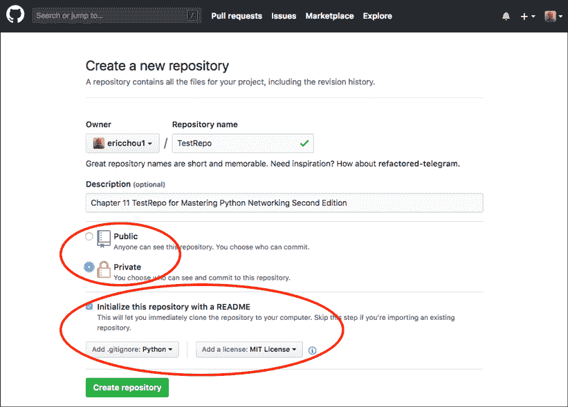

图 14.1：在 GitHub 中创建私有仓库

一旦创建了仓库，我们就可以找到它的 URL：

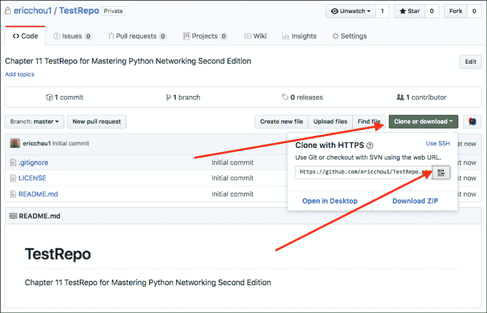

图 14.2：GitHub 仓库 URL

我们将使用这个 URL 来创建一个远程目标，我们将将其用作项目的“真相之源”。我们将远程目标命名为 `gitHubRepo`：

```py
$ git remote add gitHubRepo https://github.com/ericchou1/TestRepo.git
$ git remote -v
gitHubRepo	https://github.com/ericchou1/TestRepo.git (fetch)
gitHubRepo	https://github.com/ericchou1/TestRepo.git (push) 
```

由于我们在创建时选择了创建 `README.md` 和 `LICENSE` 文件，远程仓库和本地仓库并不相同。

几年前，GitHub 将 **个人访问令牌**（**PAT**）作为密码的术语进行了更改：[`docs.github.com/en/authentication/keeping-your-account-and-data-secure/creating-a-personal-access-token`](https://docs.github.com/en/authentication/keeping-your-account-and-data-secure/creating-a-personal-access-token)。要生成令牌，请点击个人标志 **-> 设置 -> 开发者设置 -> 个人访问令牌**。我们需要在命令行提示时使用此令牌作为密码。

如果我们要将本地更改推送到新的 GitHub 仓库，我们会收到以下错误（记得如果默认分支是 main，请将分支名称更改为 main）：

```py
$ git push gitHubRepo master
Username for 'https://github.com': <skip>
Password for 'https://echou@yahoo.com@github.com': <remember to use your personal access token>
To https://github.com/ericchou1/TestRepo.git
 ! [rejected]        master -> master (fetch first)
error: failed to push some refs to 'https://github.com/ericchou1/TestRepo.git' 
```

我们将使用 `git pull` 来从 GitHub 获取新文件：

```py
$ git pull gitHubRepo master
Username for 'https://github.com': <skip> 
Password for 'https://<username>@github.com': <personal access token>
From https://github.com/ericchou1/TestRepo
* branch master -> FETCH_HEAD
Merge made by the 'recursive' strategy.
.gitignore | 104
+++++++++++++++++++++++++++++++++++++++++++++++++++++++++++++++ LICENSE | 21 +++++++++++++
README.md | 2 ++
3 files changed, 127 insertions(+)
create mode 100644 .gitignore
create mode 100644 LICENSE
create mode 100644 README.md 
```

现在，我们将能够将内容 `push` 到 GitHub：

```py
$ git push gitHubRepo master
Username for 'https://github.com': <username> 
Password for 'https://<username>@github.com': <personal access token> 
Counting objects: 15, done.
Compressing objects: 100% (9/9), done.
Writing objects: 100% (15/15), 1.51 KiB | 0 bytes/s, done. Total 15 (delta 1), reused 0 (delta 0)
remote: Resolving deltas: 100% (1/1), done.
To https://github.com/ericchou1/TestRepo.git a001b81..0aa362a master -> master 
```

我们可以在网页上验证 GitHub 仓库的内容：

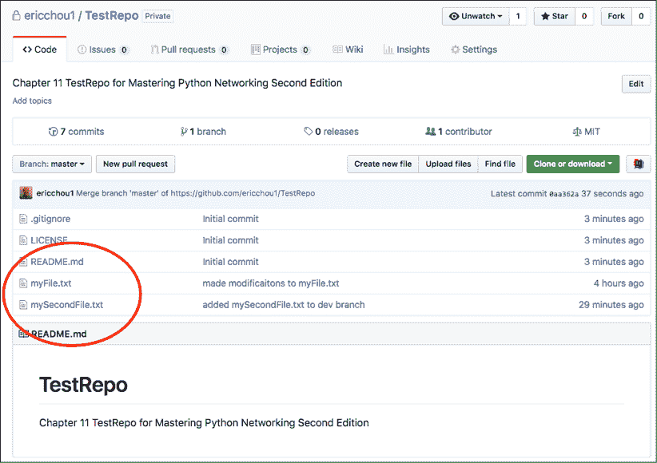

图 14.3：GitHub 仓库

现在另一个用户可以简单地复制，或者 `clone` 仓库：

```py
[This is operated from another host]
$ cd /tmp
$ git clone https://github.com/ericchou1/TestRepo.git 
Cloning into 'TestRepo'...
remote: Counting objects: 20, done.
remote: Compressing objects: 100% (13/13), done.
remote: Total 20 (delta 2), reused 15 (delta 1), pack-reused 0 
Unpacking objects: 100% (20/20), done.
$ cd TestRepo/
$ ls
LICENSE myFile.txt
README.md mySecondFile.txt 
```

此复制的仓库将是我原始仓库的精确副本，包括所有提交历史：

```py
$ git log
commit 0aa362a47782e7714ca946ba852f395083116ce5 (HEAD -> master, origin/master, origin/HEAD)
Merge: bc078a9 a001b81
Author: Eric Chou <skip>
Date: Fri Jul 20 14:18:58 2018 -0700
    Merge branch 'master' of https://github.com/ericchou1/TestRepo
commit a001b816bb75c63237cbc93067dffcc573c05aa2
Author: Eric Chou <skip>
Date: Fri Jul 20 14:16:30 2018 -0700
    Initial commit
... 
```

我还可以在仓库设置下邀请另一个人作为项目的协作者：


图 14.4：仓库邀请

在下一个示例中，我们将看到如何对一个我们不维护的仓库进行分支并执行拉取请求。

### 通过拉取请求进行协作

如前所述，Git 支持开发者之间在单个项目上的协作。我们将探讨当代码托管在 GitHub 上时是如何操作的。

在这种情况下，我们将使用 Packt 的 GitHub 公共仓库中的该书的第二版 GitHub 仓库。我将使用不同的 GitHub 用户名，以便我看起来像非管理员用户。我将点击 **Fork** 按钮以在我的账户中复制仓库：

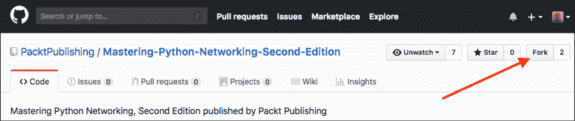

图 14.5：Git 分支按钮

复制需要几秒钟：

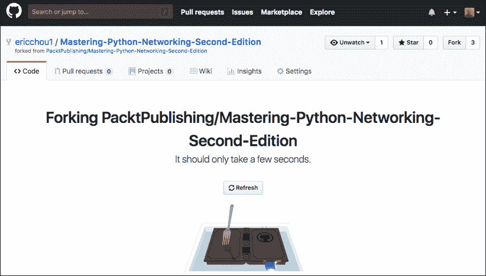

图 14.6：Git 分支进行中

分支后，我们将在我们的账户中拥有仓库的副本：

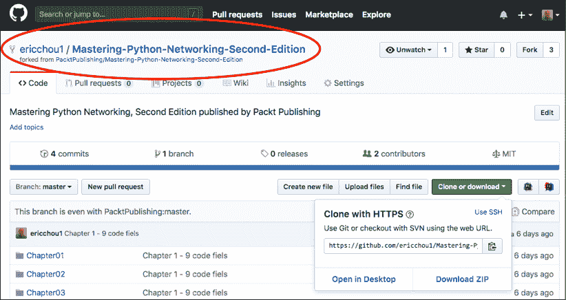

图 14.7：Git 分支

我们可以遵循我们用来修改文件的相同步骤。在这种情况下，我将修改 `README.md` 文件。更改完成后，我可以点击 **新建拉取请求** 按钮来创建一个拉取请求：

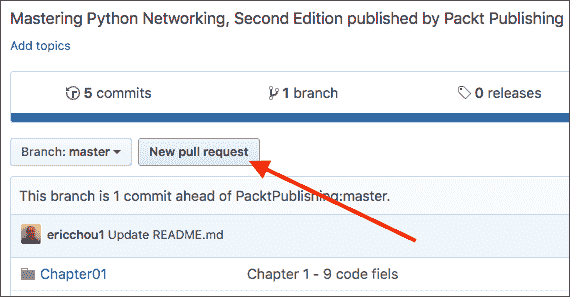

图 14.8：拉取请求

在创建拉取请求时，我们应该尽可能填写信息，以提供更改的理由：

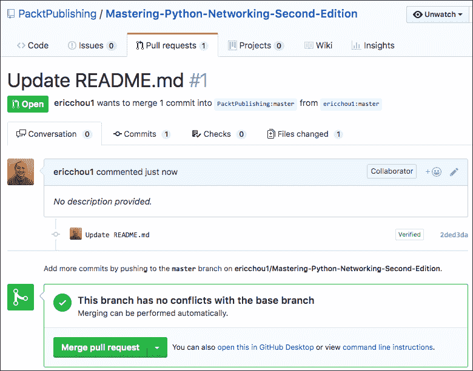

图 14.9：拉取请求详情

仓库维护者将收到拉取请求的通知；如果被接受，更改将进入原始仓库：

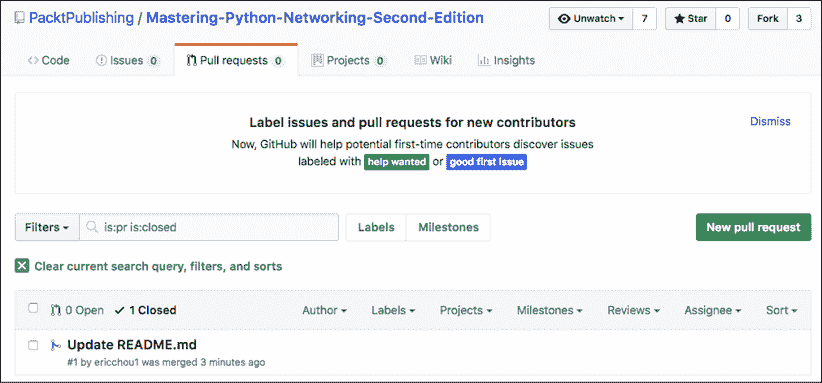

图 14.10：拉取请求记录

GitHub 为与其他开发者协作提供了一个出色的平台；这正在迅速成为许多大型开源项目的默认开发选择。由于 Git 和 GitHub 在许多项目中得到广泛使用，下一步自然就是自动化本节中我们看到的过程。在下一节中，我们将看看如何使用 Python 与 Git 一起使用。

# Git 与 Python

有一些 Python 包我们可以与 Git 和 GitHub 一起使用。在本节中，我们将探讨 GitPython 和 PyGitHub 库。

## GitPython

我们可以使用 GitPython 包，[`gitpython.readthedocs.io/en/stable/index.html`](https://gitpython.readthedocs.io/en/stable/index.html)，来与我们的 Git 仓库进行交互。我们将安装此包并使用 Python 命令行来构建一个 `Repo` 对象。从那里，我们可以列出仓库中的所有提交：

```py
$ pip install gitpython
$ python
>>> from git import Repo
>>> repo = Repo('/home/echou/Mastering_Python_Networking_third_edition/Chapter13/TestRepo-1')
>>> for commits in list(repo.iter_commits('master')):
... print(commits)
...
1b24b4e95eb0c01cc9a7124dc6ac1ea37d44d51a
169a2034fb9844889f5130f0e42bf9c9b7c08b05
a537bdcc1648458ce88120ae607b4ddea7fa9637
ff7dc1a40e5603fed552a3403be97addefddc4e9
5d7c1c8543c8342b689c66f1ac1fa888090ffa34 
```

我们还可以查看 `repo` 对象中的索引条目：

```py
>>> for (path, stage), entry in repo.index.entries.items():
... print(path, stage, entry)
...
myFile.txt 0 100644 69e7d4728965c885180315c0d4c206637b3f6bad 0 myFile.txt
mySecondFile.txt 0 100644 75d6370ae31008f683cf18ed086098d05bf0e4dc 0 mySecondFile.txt 
```

GitPython 与所有 Git 功能具有良好的集成。然而，对于初学者来说，它可能不是最容易使用的库。我们需要了解 Git 的术语和结构，才能充分利用 GitPython，如果我们在其他项目中需要它，这一点总是值得记住。

## PyGitHub

让我们看看如何使用 PyGithub 库，[`pygithub.readthedocs.io/en/latest/`](http://pygithub.readthedocs.io/en/latest/)，与 GitHub API v3 交互，[`developer.github.com/v3/`](https://developer.github.com/v3/)：

```py
$ pip install PyGithub 
```

让我们使用 Python 命令行来打印出用户的当前仓库：

```py
$ python
>>> from github import Github
>>> g = Github("<username>", "<password>")
>>> for repo in g.get_user().get_repos():
... print(repo.name)
...
Mastering-Python-Networking-Second-Edition
Mastering-Python-Networking-Third-Edition 
```

为了进行更程序化的访问，我们还可以使用访问令牌创建更细粒度的控制。GitHub 允许令牌与所选权限相关联：

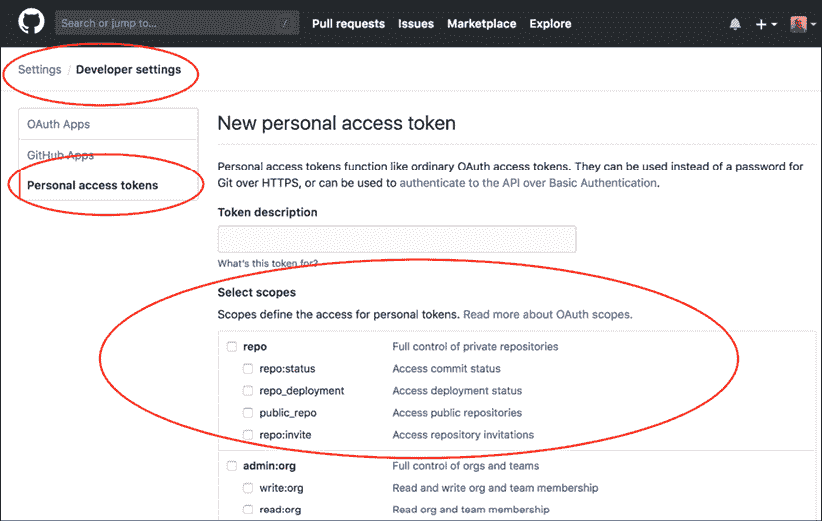

图 14.11：GitHub 令牌生成

如果您使用访问令牌作为认证机制，输出会有所不同：

```py
>>> from github import Github
>>> g = Github("<token>")
>>> for repo in g.get_user().get_repos():
... print(repo)
...
Repository(full_name="oreillymedia/distributed_denial_of_service_ddos") 
Repository(full_name="PacktPublishing/-Hands-on-Network-    Programming-with- Python")
Repository(full_name="PacktPublishing/Mastering-Python-Networking") 
Repository(full_name="PacktPublishing/Mastering-Python-Networking-Second- Edition")
... 
```

现在我们已经熟悉了 Git、GitHub 以及一些 Python 包，我们可以使用它们来处理技术。我们将在下一节中查看一些实际示例。

# 自动化配置备份

在此示例中，我们将使用 PyGithub 备份包含我们的路由器配置的目录。我们看到了如何使用 Python 或 Ansible 从我们的设备中检索信息；现在我们可以将它们检查到 GitHub 上。

我们有一个名为 `config` 的子目录，其中包含我们的路由器配置文本格式：

```py
$ ls configs/ 
iosv-1 iosv-2
$ cat configs/iosv-1 
Building configuration...
Current configuration : 4573 bytes
!
! Last configuration change at 02:50:05 UTC Sat Jun 2 2018 by cisco
!
version 15.6
service timestamps debug datetime msec
... 
```

我们可以使用以下脚本，`Chapter14_1.py`，从我们的 GitHub 仓库检索最新索引，构建需要提交的内容，并自动提交配置：

```py
#!/usr/bin/env python3
# reference: https://stackoverflow.com/questions/38594717/how-do-i-push-new-files-to-github
from github import Github, InputGitTreeElement
import os
github_token = '<token>'
configs_dir = 'configs'
github_repo = 'TestRepo'
# Retrieve the list of files in configs directory
file_list = []
for dirpath, dirname, filenames in os.walk(configs_dir):
    for f in filenames:
        file_list.append(configs_dir + "/" + f)
g = Github(github_token)
repo = g.get_user().get_repo(github_repo)
commit_message = 'add configs'
master_ref = repo.get_git_ref('heads/master')
master_sha = master_ref.object.sha
base_tree = repo.get_git_tree(master_sha)
element_list = list()
for entry in file_list: 
    with open(entry, 'r') as input_file:
        data = input_file.read()
    element = InputGitTreeElement(entry, '100644', 'blob', data)
    element_list.append(element)
# Create tree and commit
tree = repo.create_git_tree(element_list, base_tree)
parent = repo.get_git_commit(master_sha)
commit = repo.create_git_commit(commit_message, tree, [parent])
master_ref.edit(commit.sha) 
```

我们可以在 GitHub 仓库中看到 `configs` 目录：

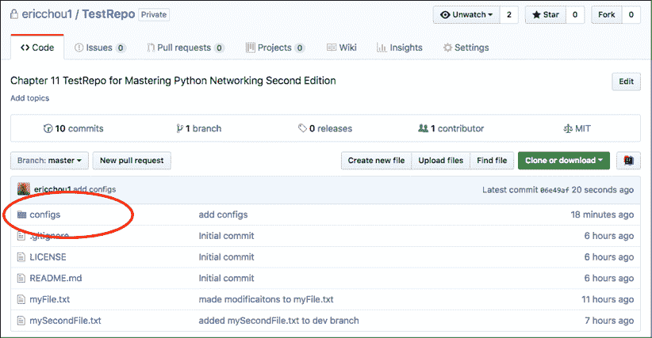

图 14.12：配置目录

提交历史显示了来自我们脚本的提交：

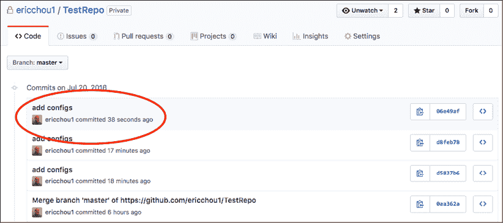

图 14.13：提交历史

在 GitHub 示例部分，我们看到了如何通过分叉仓库和发起拉取请求与其他开发者协作。让我们看看我们如何进一步与 Git 协作。

# 与 Git 协作

Git 是一种出色的协作技术，GitHub 是共同开发项目的极其有效的方式。GitHub 为世界上任何有互联网接入的人提供了一个免费分享他们的想法和代码的地方。我们知道如何使用 Git 以及一些基本的 GitHub 协作步骤，但我们如何加入并贡献到一个项目中呢？

当然，我们愿意回馈给我们带来很多帮助的开源项目，但我们应该如何开始呢？

在本节中，我们将探讨一些关于使用 Git 和 GitHub 进行软件开发协作的知识点：

+   **从小处着手**：理解我们可以在团队中扮演的角色是最重要的事情之一。我们可能在网络工程方面很出色，但在 Python 开发方面可能一般。有许多事情我们可以做，而不需要成为高技能的开发者。不要害怕从小处开始；文档和测试是作为贡献者入门的两个好方法。

+   **学习生态系统**：无论项目大小，都有一套约定和已经建立的文化。我们都因为 Python 易于阅读的语法和友好的文化而喜欢它；它还有一个围绕这一理念的指导文档([`devguide.python.org/`](https://devguide.python.org/))。另一方面，Ansible 项目也有一个广泛的社区指南([`docs.ansible.com/ansible/latest/community/index.html`](https://docs.ansible.com/ansible/latest/community/index.html))。它包括行为准则、拉取请求流程、如何报告错误以及发布流程。阅读这些指南，了解感兴趣项目的生态系统。

+   **创建分支**：我犯了一个错误，即分叉了一个项目并为主分支提交了拉取请求。主分支应该留给核心贡献者进行更改。我们应该为我们的贡献创建一个单独的分支，并允许该分支稍后合并。

+   **保持分叉仓库同步**：一旦你分叉了一个项目，没有规则强制克隆的仓库与主仓库同步。我们应该定期做`git pull`（获取代码并本地合并）或`git fetch`（获取代码以及任何本地更改）以确保我们有主仓库的最新副本。

+   **保持友好**：就像在现实世界中一样，虚拟世界没有敌意的地方。在讨论问题时，即使有分歧，也要保持文明和友好。

Git 和 GitHub 为任何有动力的人提供了一个通过轻松协作在项目中做出贡献的方式。我们都有权为任何我们感兴趣的开源或私有项目做出贡献。

# 摘要

在本章中，我们探讨了名为 Git 的版本控制系统及其紧密的兄弟 GitHub。Git 由林纳斯·托瓦兹（Linus Torvalds）于 2005 年开发，用于帮助开发 Linux 内核，后来被其他开源项目作为它们的源代码控制系统所采用。Git 是一个快速、分布式和可扩展的系统。GitHub 提供了一个集中位置，在互联网上托管 Git 仓库，允许任何有互联网连接的人进行协作。

我们探讨了如何在命令行中使用 Git 及其各种操作，以及它们如何在 GitHub 中应用。我们还研究了两个流行的 Python 库，用于与 Git 一起工作：GitPython 和 PyGithub。我们以一个配置备份示例和关于项目协作的笔记结束本章。

在*第十五章*，“使用 GitLab 的持续集成”，我们将探讨另一个用于持续集成和部署的流行开源工具：GitLab。

# 加入我们的图书社区

要加入这本书的社区——在那里您可以分享反馈，向作者提问，并了解新版本——请扫描下面的二维码：

[`packt.link/networkautomationcommunity`](https://packt.link/networkautomationcommunity)


