# 15

# 使用 GitLab 进行持续集成

网络触及技术栈的每个部分；在我工作过的所有环境中，网络始终是零级服务。它是一个基础服务，其他服务依赖于它来使它们的服务正常工作。在其他工程师、业务经理、操作员和支持人员的心中，网络应该只是正常工作。它应该始终可访问并正确运行——一个好的网络是没有人会注意到的网络。

当然，作为网络工程师，我们知道网络与其他技术栈一样复杂。由于其复杂性，构成运行网络的构造可能很脆弱。有时，我看到一个网络，想知道它怎么能正常工作，更不用说它如何在没有业务影响的情况下运行数月甚至数年。

我们对网络自动化感兴趣的部分原因是为了找到可靠且一致地重复我们的网络变更流程的方法。通过使用 Python 脚本或 Ansible 框架，我们可以确保我们做出的变更将保持一致并可靠地应用。正如我们在上一章中看到的，我们可以使用 Git 和 GitHub 来可靠地存储流程的组件，如模板、脚本、需求和文件。构成基础设施的代码是版本控制的、协作的，并对变更负责。但我们是如何将这些部分联系在一起的呢？在本章中，我们将探讨一个流行的存储库，它可以优化网络管理流程，称为 GitLab。

GitLab 的开源核心在 MIT 开源许可证下发布。其余的是源代码可用的，[`about.gitlab.com/solutions/open-source/。（https://about.gitlab.com/solutions/open-source/。）`](https://about.gitlab.com/solutions/open-source/。)

在本章中，我们将涵盖以下主题：

+   传统变更管理流程的挑战

+   持续集成和 GitLab 简介

+   GitLab 安装和示例

+   GitLab 与 Python

+   网络工程中的持续集成

我们将从传统的变更管理流程开始。正如任何经过实战考验的网络工程师可以告诉你的，传统的变更管理流程通常涉及大量的手工劳动和人工判断。正如我们将看到的，它并不一致，难以简化。

# 传统的变更管理流程

在大型网络环境中工作过的工程师知道，网络变更出错的影响可能很大。我们可以做出数百次变更而没有任何问题，但只需要一次错误的变更就可能导致整个网络对整个业务造成损害。

关于网络故障导致商业痛苦的战争故事并不少见。2011 年最明显和大规模的 AWS EC2 故障之一是由 AWS US-East 区域正常扩展活动的一部分网络变更引起的。该变更发生在 00:47 PDT，导致各种服务停电超过 12 小时，给亚马逊造成了数百万美元的损失。更重要的是，这个相对年轻的服务声誉受到了严重打击。IT 决策者将故障视为不迁移到年轻的 AWS 云的理由。重建声誉花费了多年时间。您可以在[`aws.amazon.com/message/65648/`](https://aws.amazon.com/message/65648/)了解更多关于事件报告的信息。

由于潜在的影响和复杂性，在许多环境中，网络变更咨询委员会（CAB）流程被实施。典型的 CAB 流程如下：

1.  网络工程师将设计变更并详细列出实施变更所需的步骤。这可以包括变更的原因、涉及的设备、将要应用或删除的命令、如何验证输出以及每一步的预期结果。

1.  网络工程师通常需要首先向同事请求技术审查。根据变更的性质，可能存在不同级别的同行审查。简单的变更可能只需要单次同行技术审查；更复杂的变更可能需要高级指定工程师的批准。

1.  CAB 会议通常安排在固定时间，同时提供紧急的临时会议。

1.  工程师将向董事会展示变更。董事会将提出必要的问题，评估影响，并批准或拒绝变更请求。

1.  变更将在计划变更窗口期间由原始工程师或另一位工程师执行。

这个过程听起来合理且包容，但在实践中却证明存在一些挑战：

+   **编写文档耗时**：设计工程师编写文档通常需要很长时间，有时写作过程比应用变更的时间还要长。这通常是由于所有网络变更都具有潜在的破坏性，我们需要为技术和非技术 CAB 成员记录过程。

+   **工程师的专业知识**：高级工程师专业知识是一种有限资源。存在不同级别的工程专业知识；有些经验更丰富，通常是需求最迫切的资源。我们应该保留他们的时间来解决最复杂的网络问题，而不是审查基本的网络变更。

+   **会议耗时**：组织会议并确保每位成员出席需要大量努力。如果必要的批准人员休假或生病怎么办？如果需要在计划好的 CAB 时间之前进行网络变更怎么办？

这些只是基于人类 CAB 过程的一些更大挑战。我个人非常讨厌 CAB 过程。我并不否认同行评审和优先级排序的需要；然而，我认为我们需要最小化涉及到的潜在开销。在本章的剩余部分，让我们看看一个可能适合 CAB 和一般变更管理的替代管道，该管道已被软件工程界采用。

# 连续集成简介

**持续集成**（**CI**）在软件开发中是一种快速发布代码库小更改的方法，内置代码测试和验证。关键是分类要 CI 兼容的更改，即不过于复杂，足够小以便可以轻松应用，以便可以轻松回滚。测试和验证过程以自动化的方式构建，以获得一个基线信心，即更改将应用而不会破坏整个系统。

在 CI 之前，软件的更改通常是大批量进行的，并且往往需要漫长的验证过程（这听起来熟悉吗？）。开发者可能需要数月才能在生产环境中看到他们的更改，收到反馈循环，并修复错误。简而言之，CI 过程旨在缩短从想法到更改的过程。

通常，通用工作流程包括以下步骤：

1.  第一位工程师获取当前代码库的副本并开始进行更改。

1.  第一位工程师将更改提交到仓库。

1.  仓库可以通知一组工程师有关仓库更改的通知，他们可以审查更改。他们可以批准或拒绝更改。

1.  CI 系统可以持续拉取仓库以获取更改，或者当发生更改时，仓库可以向 CI 系统发送通知。无论哪种方式，CI 系统都会拉取最新的代码版本。

1.  CI 系统将运行自动化测试以尝试捕获任何破坏。

1.  如果没有发现任何故障，CI 系统可以选择将更改合并到主代码中，并可选择将其部署到生产系统。

这是一个通用的步骤列表。对于每个组织，过程可能不同。例如，可以在代码审查之后而不是在代码审查后立即运行自动测试。有时，组织可能会选择在步骤之间让人类工程师参与进行合理性检查。

在下一节中，我们将说明如何在 Ubuntu 22.04 LTS 系统上安装 GitLab 的说明。

# 安装 GitLab

GitLab 是一个功能强大、一应俱全的工具，用于处理端到端 DevOps 协作工具。正如我们将在下一分钟看到的那样，它托管代码仓库并处理代码测试、部署和验证。它是目前该领域最受欢迎的 DevOps 工具之一。

该技术背后的公司 GitLab Inc. 在 2021 年晚些时候在纳斯达克（股票代码 GTLB）成功进行了首次公开募股，[`techcrunch.com/2021/09/17/inside-gitlabs-ipo-filing/`](https://techcrunch.com/2021/09/17/inside-gitlabs-ipo-filing/)。该公司的成功展示了该技术的强大和可持续性。

我们只需要使用其一小部分功能来启动测试实验室。目标是熟悉这些步骤的整体流程。我鼓励您查看 GitLab 文档 [`docs.gitlab.com/`](https://docs.gitlab.com/)，以了解其功能。


图 15.1：GitLab 文档

对于我们的网络实验室，我们将使用我们在过去几章中一直在使用的相同实验室拓扑。

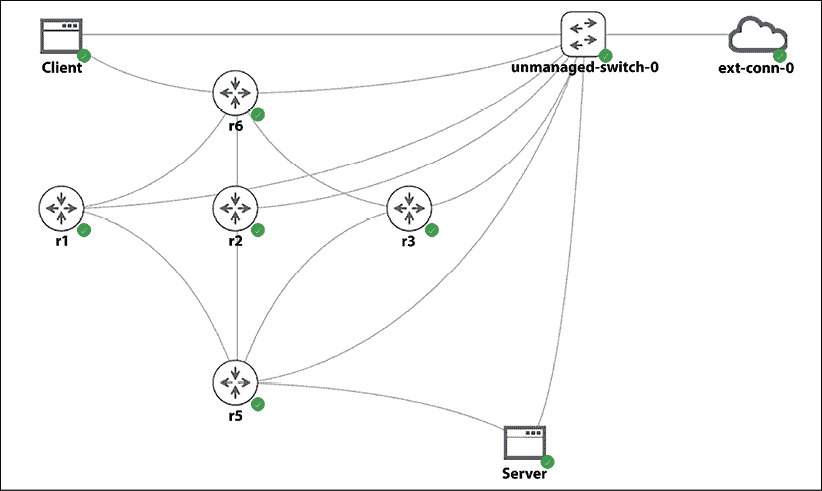

图 15.2：实验室拓扑

虽然运行 GitLab 作为 Docker 镜像很有吸引力，但 GitLab 运行器（执行步骤的组件）本身也是 Docker 镜像，运行 Docker-in-Docker 在我们的实验室中引入了更多的复杂性。因此，在本章中，我们将在一个虚拟机上安装 GitLab，运行器在容器中运行。安装系统要求可以在以下位置找到，[`docs.gitlab.com/ee/install/requirements.html`](https://docs.gitlab.com/ee/install/requirements.html)。

我们将安装 Docker 引擎、docker-compose，然后是 GitLab 软件包。首先让我们准备好 Docker：

```py
# Installing Docker Engine
$ sudo apt-get install ca-certificates curl gnupg lsb-release
$ curl -fsSL https://download.docker.com/linux/ubuntu/gpg | sudo gpg --dearmor -o /usr/share/keyrings/docker-archive-keyring.gpg
$ echo "deb [arch=$(dpkg --print-architecture) signed-by=/usr/share/keyrings/docker-archive-keyring.gpg] https://download.docker.com/linux/ubuntu $(lsb_release -cs) stable" | sudo tee /etc/apt/sources.list.d/docker.list > /dev/null
$ sudo apt-get update
$ sudo apt-get install docker-ce docker-ce-cli containerd.io
# Run Docker as user
$ sudo groupadd docker
$ sudo usermod -aG docker $USER
$ newgrp docker 
# Install Docker-Compose
$ sudo curl -L "https://github.com/docker/compose/releases/download/1.29.2/docker-compose-$(uname -s)-$(uname -m)" -o /usr/local/bin/docker-compose
$ sudo chmod +x /usr/local/bin/docker-compose
$ docker-compose --version
docker-compose version 1.29.2, build 5becea4c 
```

对于 GitLab，我们将按照官方步骤安装自托管的 GitLab：[`docs.gitlab.com/omnibus/index.html#installation-and-configuration-using-omnibus-package`](https://docs.gitlab.com/omnibus/index.html#installation-and-configuration-using-omnibus-package)。请注意，这些步骤需要将端口转发到外部可访问的 URL 上的主机：

```py
$ sudo apt update
$ sudo apt-get install -y curl openssh-server ca-certificates tzdata perl 
$ sudo apt-get install -y postfix
$ curl https://packages.gitlab.com/install/repositories/gitlab/gitlab-ee/script.deb.sh | sudo bash
$ sudo EXTERNAL_URL="http://gitlab.networkautomationnerds.com:9090" apt-get install gitlab-ee 
```

安装完成后，我们应该能看到成功消息：

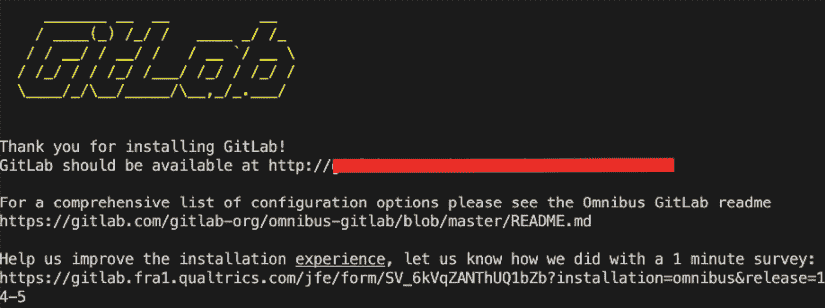

图 15.3：GitLab 安装

我们将使用初始密码登录，然后重置它（[`docs.gitlab.com/ee/security/reset_user_password.html#reset-your-root-password`](https://docs.gitlab.com/ee/security/reset_user_password.html#reset-your-root-password)）：

```py
$ sudo cat /etc/gitlab/initial_root_password
…
Password: <random password>
$ sudo gitlab-rake "gitlab:password:reset" 
```

一切配置完成后，我们应该能在“**菜单 -> 管理员**”下看到仪表板：

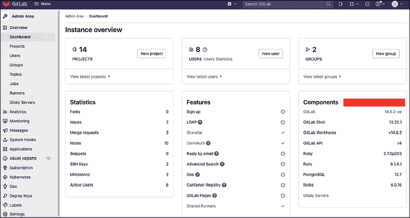

图 15.4：GitLab 仪表板

作为可选步骤，我们可以在 `/etc/gitlab/gitlab.rb` 下启用 SMTP 设置。这将允许我们接收 GitLab 上重要消息的电子邮件（[`docs.gitlab.com/omnibus/settings/smtp.html`](https://docs.gitlab.com/omnibus/settings/smtp.html)）：

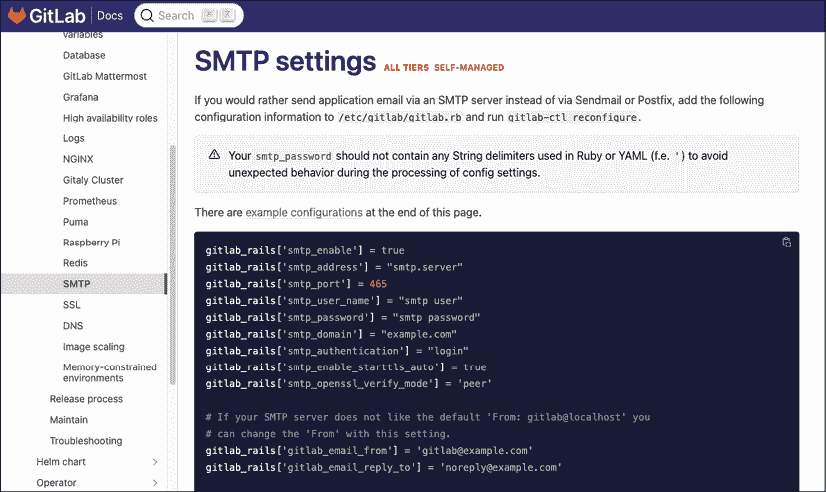

图 15.5：GitLab SMTP 设置

让我们谈谈 GitLab 运行器。

# GitLab 运行器

GitLab 使用运行者的概念。运行者是一个进程，它从 GitLab 中提取并执行**持续集成/持续部署**（**CI/CD**）作业。运行者可以在主机上的 Docker 容器中运行，[`docs.gitlab.com/runner/install/docker.html`](https://docs.gitlab.com/runner/install/docker.html)：

```py
$ docker run --rm -t -i gitlab/gitlab-runner —help
Unable to find image 'gitlab/gitlab-runner:latest' locally
latest: Pulling from gitlab/gitlab-runner
7b1a6ab2e44d: Pull complete 
5580ef77ebbe: Pull complete 
d7b21acbe607: Pull complete 
Digest: sha256:d2db6b687e9cf5baf96009e43cc3eaebf180f634306cdc74e2400315d35f0dab
Status: Downloaded newer image for gitlab/gitlab-runner:latest
…
$    docker run -d --name gitlab-runner --restart always \
>      -v /srv/gitlab-runner/config:/etc/gitlab-runner \
>      -v /var/run/docker.sock:/var/run/docker.sock \
>      gitlab/gitlab-runner:latest
617b94e5e4c5c72d33610b2eef5eb7027f579f4e069558cbf61f884375812306 
```

我们可以继续在**管理区域 -> 运行者 -> 注册**下注册主机运行者，[`docs.gitlab.com/runner/register/index.html#docker`](https://docs.gitlab.com/runner/register/index.html#docker)。我们将注意令牌：

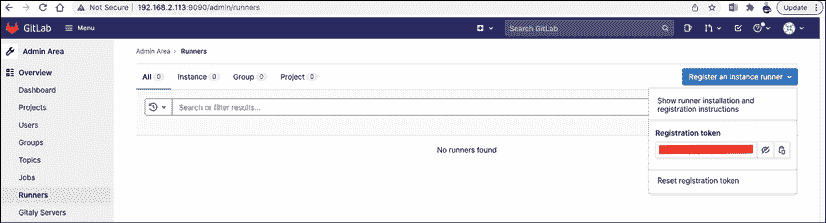

图 15.6：GitLab 运行者注册

然后，我们可以使用令牌来拉取并注册一个基于镜像的运行者：

```py
(venv) echou@gitlab:~$ docker run --rm -it -v /srv/gitlab-runner/config:/etc/gitlab-runner gitlab/gitlab-runner register
Runtime platform                                    arch=amd64 os=linux pid=8 revision=5316d4ac version=14.6.0
Running in system-mode.                            

Enter the GitLab instance URL (for example, https://gitlab.com/):
http://<ip>:<port> 
Enter the registration token:
<token>
Enter a description for the runner:
[fef6fb5a91dd]: local-runner
Enter tags for the runner (comma-separated): << Leave empty unless we want matching tag to run the runners jobs
Registering runner... succeeded                     runner=64eCJ5yp
Enter an executor: virtualbox, docker-ssh+machine, kubernetes, custom, docker-ssh, parallels, docker+machine, docker, shell, ssh:
docker
Enter the default Docker image (for example, ruby:2.6):
docker pull ubuntu:latest
Runner registered successfully. Feel free to start it, but if it's running already the config should be automatically reloaded! 
```

现在我们已经准备好处理我们的第一个作业了！

# 第一个 GitLab 示例

我们可以从在**菜单 -> 管理区域 -> 用户**（在概览下）下创建一个单独的用户开始，并通过该用户登录：

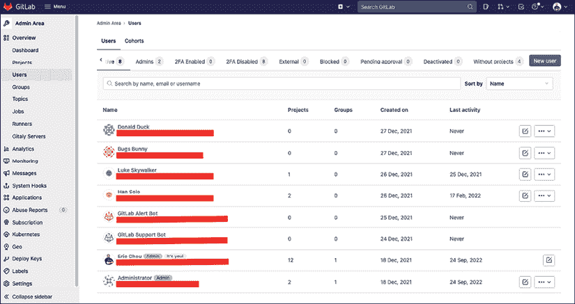

图 15.7：GitLab 用户

要从仓库推送或拉取，我们还将添加我们的 SSH 密钥。这可以通过用户配置文件中的设置部分完成：

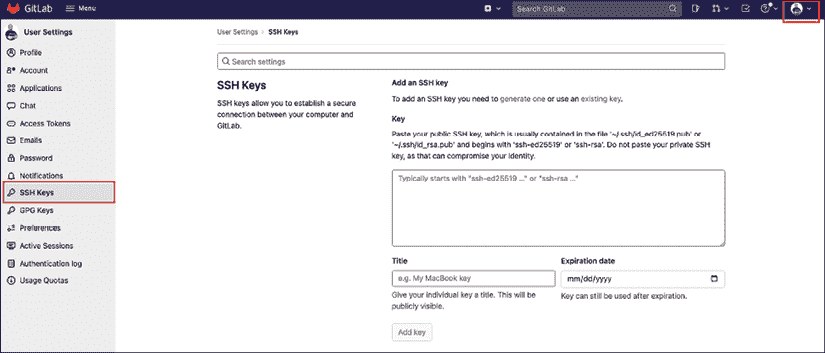

图 15.8：用户 SSH 密钥

我们现在可以在**菜单 -> 项目 -> 创建新项目**下创建一个新项目：

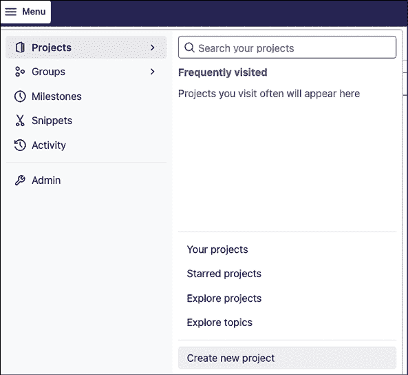

图 15.9：创建新项目

我们将把这个项目命名为`chapter15_example1`：

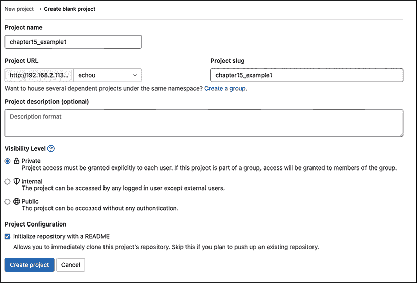

图 15.10：新项目设置

我们可以保留其他设置不变。作为预防措施，我通常将项目可见性设置为私有，但我们可以稍后更改它。

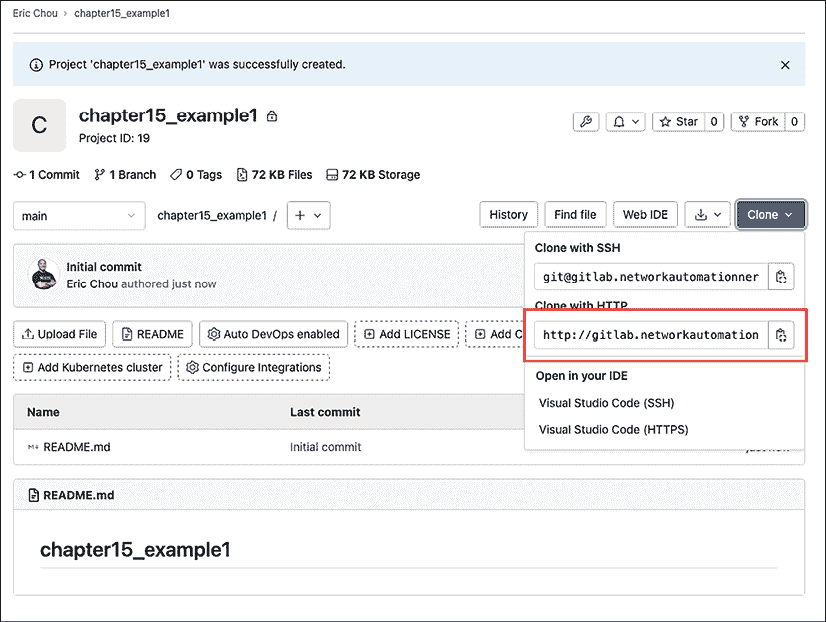

图 15.11：项目克隆 URL

我们可以获取项目的 URL 并在我们的管理站上克隆该项目：

```py
$ git clone http://gitlab.<url>/echou/chapter15_example1.git
Cloning into 'chapter15_example1'...
Username for 'http://gitlab.<url>': <user>
Password for 'http://<user>@<url>': 
remote: Enumerating objects: 3, done.
remote: Counting objects: 100% (3/3), done.
remote: Total 3 (delta 0), reused 0 (delta 0), pack-reused 0
Receiving objects: 100% (3/3), done.
$ cd chapter15_example1/
$ ls
README.md 
```

我们将创建一个特殊的文件`.gitlab-ci.yml`，该文件被 GitLab 识别为 CI/CD 指令：

```py
# define stages
stages: 
    - build
    - test
    - deploy
# define the job
deploy our network: 
    image: "ubuntu:20.04"
    stage: build
    script: 
        - mkdir new_network
        - cd new_network
        - touch bom.txt
        - echo "this is our build" >> bom.txt
    artifacts: 
        paths: 
          - new_network/
test our network: 
    stage: test
    image: "ubuntu:20.04"
    script: 
        - pwd
        - ls 
        - test -f new_network/bom.txt
deploy to prod:
    stage: deploy
    image: "ubuntu:20.04"
    script: 
        - echo "deploy to production"
    when: manual 
```

我们将签入、提交并将文件推送到我们的 GitLab 仓库：

```py
$ git add .gitlab-ci.yml
$ git commit -m "initial commit"
$ git push origin main
Username for 'http://<url>': <username>
Password for 'http://<url>': <password>
Enumerating objects: 4, done.
Counting objects: 100% (4/4), done.
Delta compression using up to 2 threads
Compressing objects: 100% (3/3), done.
Writing objects: 100% (3/3), 512 bytes | 512.00 KiB/s, done.
Total 3 (delta 0), reused 0 (delta 0), pack-reused 0
To http://<url> /echou/chapter15_example1.git
   c0b232d..5552a10  main -> main 
```

`.gitlab-ci.yml` 文件包含用于 GitLab CI/CD 管道的 YAML 格式指令。它包含两个主要部分，阶段和作业定义：

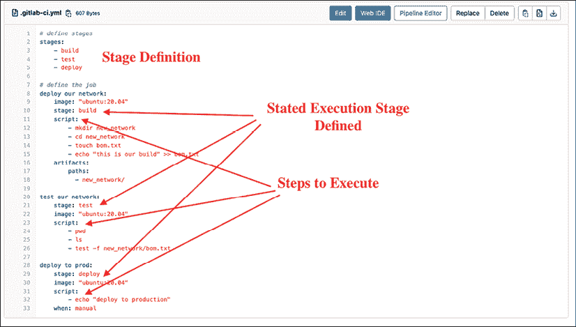

图 15.12：GitLab CI 文件

在我们的文件中，我们使用关键字`stages`定义了三个阶段。在执行部分，我们定义了要拉取的 Docker 基础镜像、要执行的作业名称、对应的阶段以及`script`下要执行的步骤。在`build`下可以有可选的指令如`artifacts`，在`deploy`下可以有可选的指令如`when`。

如果我们回到项目，我们可以点击**CI/CD -> 管道**来显示作业的状态：

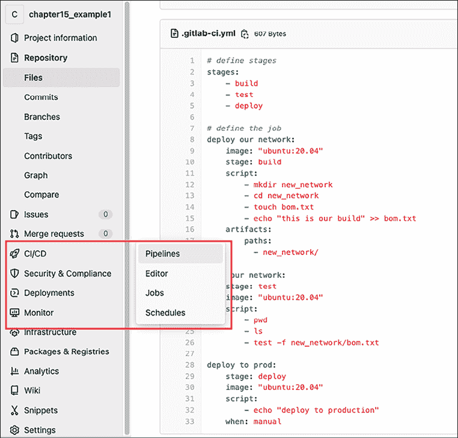

图 15.13：CI/CD 管道

有三个圆圈，每个代表一个阶段。

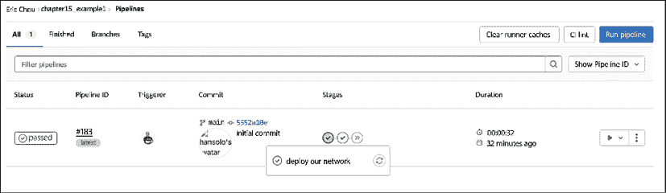

图 15.14：管道输出

我们可以点击圆圈并查看容器输出：

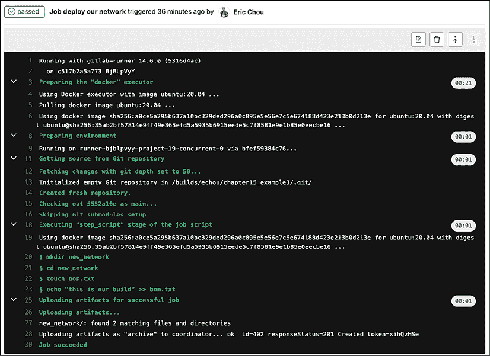

图 15.15：执行输出

记得我们在`build`和`deploy`下有可选步骤吗？工件给我们提供了可以下载的内容：

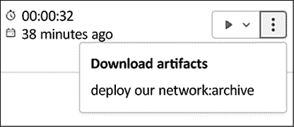

图 15.16：工件

`when`关键字允许我们手动推送步骤，而不是让 GitLab 自动为我们执行：

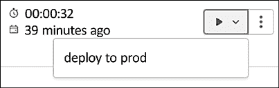

图 15.17：手动推送

这是不是很棒？我们现在有一些工人自动为我们执行作业。我们还可以利用 Git 的许多协作功能，例如邀请同事进行代码审查。让我们看看另一个例子。

# GitLab 网络示例

我们将继续在 GitLab 服务器上创建另一个名为`chapter15_example2`的项目。在本地机器上，我们将克隆远程仓库：

```py
$ git clone http://<url>/echou/chapter15_example2.git
$ cd chapter15_example2/ 
```

在这个例子中，我们将集成 Nornir 库，看看我们如何在两个 IOSv 设备上执行`show version`。我们将首先定义`hosts.yaml`文件：

```py
---
r1:
    hostname: '192.168.2.218'
    port: 22
    username: 'cisco'
    password: 'cisco'
    platform: 'cisco_ios'
r2:
    hostname: '192.168.2.219'
    port: 22
    username: 'cisco'
    password: 'cisco'
    platform: 'cisco_ios' 
```

然后，我们可以构建用于执行的 Python 脚本：

```py
#!/usr/bin/env python
from nornir import InitNornir
from nornir_utils.plugins.functions import print_result
from nornir_netmiko import netmiko_send_command
nr = InitNornir()
result = nr.run(
    task=netmiko_send_command,
    command_string="show version"
)
print_result(result) 
```

我们将定义一个`requirements.txt`文件来指定要安装的包：

```py
$ cat requirements.txt 
…
flake8==4.0.1
…
netmiko==3.4.0
nornir==3.2.0
nornir-netmiko==0.1.2
nornir-utils==0.1.2
paramiko==2.9.2
… 
```

我们还将定义`.gitlab-ci.yml`文件来定义阶段和脚本。注意在文件中，我们指定了另一个在所有阶段之前执行的`before_script`步骤：

```py
stages:
  - Test
  - QA
before_script: 
  - python --version
  - pip3 install -r requirements.txt
Test-Job:
  stage: Test
  script:
    - python3 show_version.py 
flake8: 
  stage: QA
  script: 
    - flake8 show_version.py 
```

一旦文件被检查并推送到仓库，我们就可以转到 CI/CD 部分查看输出。这次步骤将因为包下载时间而花费更长的时间。我们可以点击步骤并实时检查执行情况。

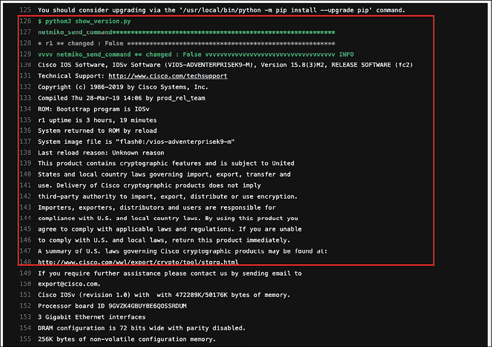

图 15.18：Nornir CI/CD 步骤执行

我们应该能够看到管道成功执行。


图 15.19：CI/CD 结果

使用 GitLab CI/CD 是自动化我们的网络操作步骤的绝佳方式。设置管道可能需要更长的时间，但一旦完成，它将为我们节省大量时间，并允许我们保留精力专注于更有趣的工作。更多信息，请参阅[`docs.gitlab.com/ee/ci/`](https://docs.gitlab.com/ee/ci/)。

# 摘要

在本章中，我们探讨了传统的变革管理流程以及为什么它不适合当今快速变化的环境。网络需要与业务同步发展，以变得更加灵活，并能快速且可靠地适应变化。

我们探讨了持续集成的概念，特别是开源的 GitLab 系统。GitLab 是一个功能全面、可扩展的持续集成系统，在软件开发中被广泛使用。我们可以将相同的系统应用于我们的网络操作。我们看到了两个使用 GitLab Git 仓库和运行器自动执行我们操作的例子。

在第十六章“网络的测试驱动开发”中，我们将探讨使用 Python 进行测试驱动开发。

# 加入我们的书籍社区

要加入本书的社区——在这里您可以分享反馈、向作者提问，并了解新书发布——请扫描下面的二维码：

[`packt.link/networkautomationcommunity`](https://packt.link/networkautomationcommunity)


