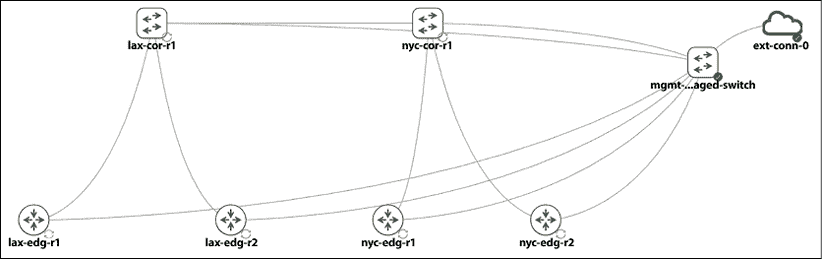

# 第十六章：网络的测试驱动开发

在前面的章节中，我们使用 Python 与网络设备通信，监控和保障网络，自动化流程，并将本地网络扩展到公有云提供商。我们已经从必须仅使用终端窗口并使用 CLI 管理网络的情况中走了很长的路。当我们共同工作时，我们所构建的服务就像一台运转良好的机器，为我们提供了一个美丽、自动化、可编程的网络。然而，网络永远不会静止，它不断变化以满足业务需求。当我们构建的服务没有最佳运行时会发生什么？正如我们在监控和源代码控制系统中所做的那样，我们正在积极尝试检测故障。

在本章中，我们通过**测试驱动开发**（TDD）扩展了主动检测的概念。我们将涵盖以下主题：

+   TDD 概述

+   拓扑作为代码

+   编写网络测试

+   pyATS 和 Genie

我们将从这个章节开始，先概述 TDD，然后再深入探讨其在网络中的应用。我们将查看使用 Python 进行 TDD 的示例，并逐步从特定的测试过渡到基于网络的更大测试。

# 测试驱动开发概述

TDD（测试驱动开发）的概念已经存在了一段时间。美国软件工程师肯特·贝克（Kent Beck）等人被公认为领导了 TDD 运动，并与敏捷软件开发一起发展。敏捷软件开发需要非常短的构建-测试-部署开发周期；所有软件需求都被转化为测试用例。这些测试用例通常在编写代码之前就写好了，只有当测试通过时，软件代码才被接受。

同样的想法可以与网络工程平行。例如，当我们面临设计现代网络的挑战时，我们可以将这个过程分解为以下步骤，从高级设计要求到我们可以部署的网络测试：

1.  我们从新网络的整体需求开始。为什么我们需要设计一个新的网络或新网络的一部分？可能是因为新的服务器硬件、新的存储网络或新的微服务软件架构。

1.  新的要求被分解为更小、更具体的要求。这可能包括评估新的交换平台，测试可能更有效的路由协议，或新的网络拓扑（例如，胖树拓扑）。每个更小的要求都可以分为**必需**或**可选**的类别。

1.  我们制定测试计划，并对其与潜在解决方案候选者的潜在性进行评估。

1.  测试计划将按相反的顺序进行；我们将从测试功能开始，然后将新功能集成到一个更大的拓扑中。最后，我们将尝试在接近生产环境的情况下运行我们的测试。

我试图说明的是，即使我们没有意识到，我们可能已经在正常的网络工程过程中采用了某些 TDD 方法。这是我研究 TDD 心态时的一个启示。我们已经在隐式地遵循这一最佳实践，而没有正式化该方法。

通过逐渐将网络的部分移动到代码中，我们可以将 TDD 应用于网络。如果我们的网络拓扑以 XML 或 JSON 的分层格式描述，每个组件都可以正确映射并表达在期望的状态，这有些人可能称之为“真相之源”。这是我们针对生产偏离此状态的测试用例所期望的状态。例如，如果我们的期望状态要求 iBGP 邻居的全网状，我们可以始终编写一个测试用例来检查我们的生产设备上的 iBGP 邻居数量。

TDD 的顺序大致基于以下六个步骤：

1.  编写一个考虑结果的测试

1.  运行所有测试并查看新测试是否失败

1.  编写代码

1.  再次运行测试

1.  如果测试失败，进行必要的更改

1.  重复

与任何流程一样，我们遵循指南的紧密程度是一个判断。我更喜欢将这些指南视为目标，并相对宽松地遵循它们。例如，TDD 流程要求在编写任何代码之前编写测试用例，或者在我们的例子中，在构建任何网络组件之前。作为一个个人偏好，我总是喜欢在编写测试用例之前看到网络或代码的工作版本。这给了我更高的信心，所以如果有人评判我的 TDD 过程，我可能会得到一个巨大的“F”。我还喜欢在不同的测试级别之间跳转；有时，我测试网络的一小部分，其他时候，我进行系统级的端到端测试，如 ping 或 traceroute 测试。

重点是我不相信存在一种适合所有情况的测试方法。这取决于个人偏好和项目的范围。这对于我合作过的多数工程师来说都是正确的。记住框架是一个好主意，这样我们就有了一个可以遵循的工作蓝图，但你是你解决问题的最佳评判者。

在我们进一步探讨 TDD 之前，让我们在下一节中介绍一些最常见的术语，以便我们在深入了解细节之前有一个良好的概念基础。

## 测试定义

让我们看看 TDD 中常用的一些术语：

+   **单元测试**：检查一小段代码。这是一个针对单个函数或类的测试。

+   **集成测试**：检查代码库的多个组件；多个单元组合并作为一个组进行测试。这可能是一个针对 Python 模块或多个模块的测试。

+   **系统测试**：从端到端进行检查。这是一个尽可能接近最终用户所看到内容的测试。

+   **功能测试**：针对单个函数进行检查。

+   **测试覆盖率**：一个术语，指的是确定我们的测试用例是否覆盖了应用程序代码。这通常是通过检查运行测试用例时执行了多少代码来完成的。

+   **测试固定装置**：形成一个基准状态，用于运行我们的测试。测试固定装置的目的是确保有一个已知且固定的环境，以便测试可以重复进行。

+   **设置和拆除**：所有先决步骤都添加到设置中，并在拆除时清理。

这些术语可能看起来非常侧重于软件开发，有些人可能对网络工程不相关。记住，这些术语是我们用来传达一个概念或步骤的方式。我们将在本章的其余部分使用这些术语。随着我们在网络工程环境中更多地使用这些术语，它们可能会变得更加清晰。在这一点上，让我们深入探讨将网络拓扑视为代码。 

# 将拓扑表示为代码

当我们讨论将拓扑表示为代码时，一个工程师可能会跳起来宣称：“网络太复杂了，不可能将其总结成代码！”从个人经验来看，这在我参加的一些会议中发生过。在会议中，我们会有一群希望将基础设施视为代码的软件工程师，但房间里的传统网络工程师会宣称这是不可能的。在你效仿并在这本书的页面上对我大喊大叫之前，让我们保持开放的心态。如果我告诉你，我们已经在本书中使用代码来描述我们的拓扑，这会有帮助吗？

如果你查看本书中我们一直在使用的任何实验室拓扑文件，它们只是包含节点之间关系描述的 YAML 文件。例如，在本章中，我们将使用我们在上一章中使用的相同拓扑：



图 16.1：实验室拓扑

如果我们用文本编辑器打开拓扑文件，`chapter16_topology.yaml`，我们会看到该文件是一个描述节点及其之间链接的 YAML 文件：

```py
lab:
  description: Imported from 2_DC_Topology.virl
  notes: |-
    ## Import Progress
    - processing node /lax-edg-r1 (iosv)
    - processing node /lax-edg-r2 (iosv)
    - processing node /nyc-edg-r1 (iosv)
    - processing node /nyc-edg-r2 (iosv)
    - processing node /lax-cor-r1 (nxosv)
    - processing node /nyc-cor-r1 (nxosv)
    - link GigabitEthernet0/1.lax-edg-r1 -> Ethernet2/1.lax-cor-r1
    - link GigabitEthernet0/1.lax-edg-r2 -> Ethernet2/2.lax-cor-r1
    - link GigabitEthernet0/1.nyc-edg-r1 -> Ethernet2/1.nyc-cor-r1
    - link GigabitEthernet0/1.nyc-edg-r2 -> Ethernet2/2.nyc-cor-r1
    - link Ethernet2/3.lax-cor-r1 -> Ethernet2/3.nyc-cor-r1
  timestamp: 1615749425.6802542
  title: 2_DC_Topology.yaml
  version: 0.0.4 
```

节点部分包括每个节点的 id、标签、定义和配置：

```py
nodes:
  - id: n0
    label: lax-edg-r1
    node_definition: iosv
    x: -100
    y: 200
    configuration: |-
      !
      ! Last configuration change at 02:26:08 UTC Fri Apr 17 2020 by cisco
      !
      version 15.6
      service timestamps debug datetime msec
      service timestamps log datetime msec
      no service password-encryption
      !
      hostname lax-edg-r1
      !
      boot-start-marker
      boot-end-marker
      !
      !
      vrf definition Mgmt-intf
       !
       address-family ipv4
       exit-address-family
       !
<skip> 
```

如果我们打开上一章的实验室拓扑文件，其中包含 Linux 节点，我们可以看到 Linux 主机节点可以用与网络节点相同的方式描述：

```py
 - id: n5
    label: Client
    node_definition: server
    x: 0
    y: 0
    configuration: |-
      # converted cloud-config
      hostname Client
      ifconfig eth1 up 10.0.0.9 netmask 255.255.255.252
      route add -net 10.0.0.0/8 gw 10.0.0.10 dev eth1
      route add -net 192.168.0.0/28 gw 10.0.0.10 dev eth1
      # original cloud-config
      # #cloud-config
      # bootcmd:
      # - ln -s -t /etc/rc.d /etc/rc.local
      # hostname: Client
      # manage_etc_hosts: true
      # runcmd:
      # - start ttyS0
      # - systemctl start getty@ttyS0.service
      # - systemctl start rc-local
      # - sed -i '/^\s*PasswordAuthentication\s\+no/d' /etc/ssh/sshd_config
      # - echo "UseDNS no" >> /etc/ssh/sshd_config
      # - service ssh restart
      # - service sshd restart 
```

通过将网络表示为代码，我们可以为我们的网络声明一个真相来源。我们可以编写测试代码来比较实际的生产值与这个蓝图。我们将使用这个拓扑文件作为基础，并将生产网络值与之比较。

## XML 解析示例

除了 YAML 之外，另一种流行的将拓扑表示为代码的方式是 XML。事实上，这是 CML 2 的前身 Cisco VIRL 使用的格式。在本书的前几版中，我已经提供了一个名为`chapter15_topology.virl`的两个主机、两个网络节点示例文件，用于我们的解析示例。

要与 XML 文件一起工作，我们可以使用 Python 从该拓扑文件中提取元素，并将其存储为 Python 数据类型，这样我们就可以处理它了。在`chapter16_1_xml.py`中，我们将使用`ElementTree`解析`virl`拓扑文件，并构建一个包含我们设备信息的字典：

```py
#!/usr/env/bin python3
import xml.etree.ElementTree as ET
import pprint
with open('chapter15_topology.virl', 'rt') as f: 
    tree = ET.parse(f)
devices = {}
for node in tree.findall('./{http://www.cisco.com/VIRL}node'):
    name = node.attrib.get('name')
    devices[name] = {}
    for attr_name, attr_value in sorted(node.attrib.items()):
        devices[name][attr_name] = attr_value
# Custom attributes
devices['iosv-1']['os'] = '15.6(3)M2'
devices['nx-osv-1']['os'] = '7.3(0)D1(1)'
devices['host1']['os'] = '16.04'
devices['host2']['os'] = '16.04'
pprint.pprint(devices) 
```

结果是一个 Python 字典，它根据我们的拓扑文件包含设备信息。

我们还可以将习惯性项目添加到字典中：

```py
(venv) $ python chapter16_1_xml.py
{'host1': {'location': '117,58',
           'name': 'host1',
           'os': '16.04',
           'subtype': 'server',
           'type': 'SIMPLE'},
 'host2': {'location': '347,66',
           'name': 'host2',
           'os': '16.04',
           'subtype': 'server',
           'type': 'SIMPLE'},
 'iosv-1': {'ipv4': '192.168.0.3',
            'location': '182,162',
            'name': 'iosv-1',
            'os': '15.6(3)M2',
            'subtype': 'IOSv',
            'type': 'SIMPLE'},
 'nx-osv-1': {'ipv4': '192.168.0.1',
              'location': '281,161',
              'name': 'nx-osv-1',
              'os': '7.3(0)D1(1)',
              'subtype': 'NX-OSv',
             'type': 'SIMPLE'}} 
```

如果我们想将这个“真相之源”与生产设备版本进行比较，我们可以使用*第三章*，*APIs 和 Intent-Driven Networking*中的脚本`cisco_nxapi_2.py`来检索生产 NX-OSv 设备的软件版本。然后我们可以将我们从拓扑文件中收到的值与生产设备的信息进行比较。稍后，我们可以使用 Python 的内置`unittest`模块来编写测试用例。

我们将在稍后讨论`unittest`模块。如果您愿意，可以跳过前面的内容，稍后再回到这个例子。

这里是`chapter16_2_validation.py`中的相关`unittest`代码：

```py
import unittest
<skip>
# Unittest Test case
class TestNXOSVersion(unittest.TestCase):
    def test_version(self):
        self.assertEqual(nxos_version, devices['nx-osv-1']['os'])
if __name__ == '__main__':
    unittest.main() 
```

当我们运行验证测试时，我们可以看到测试通过，因为生产环境中的软件版本与我们预期的相匹配：

```py
$ python chapter16_2_validation.py
.
----------------------------------------------------------------------
Ran 1 test in 0.000s
OK 
```

如果我们手动更改预期的 NX-OSv 版本值以引入一个失败案例，我们将看到以下失败输出：

```py
$ python chapter16_3_test_fail.py
F
======================================================================
FAIL: test_version (__main__.TestNXOSVersion)
----------------------------------------------------------------------
Traceback (most recent call last):
  File "chapter15_3_test_fail.py", line 50, in test_version
    self.assertEqual(nxos_version, devices['nx-osv-1']['os'])
AssertionError: '7.3(0)D1(1)' != '7.4(0)D1(1)'
- 7.3(0)D1(1)
?   ^
+ 7.4(0)D1(1)
?   ^
----------------------------------------------------------------------
Ran 1 test in 0.001s
FAILED (failures=1) 
```

我们可以看到测试用例结果返回为失败；失败的原因是两个值之间的版本不匹配。正如我们在上一个例子中看到的，Python 的`unittest`模块是一种根据我们的预期结果测试现有代码的绝佳方式。让我们更深入地了解一下这个模块。

## Python 的`unittest`模块

Python 标准库中包含一个名为`unittest`的模块，它处理我们可以比较两个值以确定测试是否通过的情况。在先前的例子中，我们看到了如何使用`assertEqual()`方法比较两个值以返回`True`或`False`。以下是一个使用内置`unittest`模块比较两个值的例子，`chapter16_4_unittest.py`：

```py
#!/usr/bin/env python3
import unittest
class SimpleTest(unittest.TestCase):
    def test(self):
        one = 'a'
        two = 'a'
        self.assertEqual(one, two) 
```

使用`python3`命令行界面，`unittest`模块可以自动在脚本中查找测试用例：

```py
$ python -m unittest chapter16_4_unittest.py
.
----------------------------------------------------------------------
Ran 1 test in 0.000s
OK 
```

除了比较两个值之外，这里还有一些测试预期值是`True`或`False`的例子。当发生失败时，我们还可以生成自定义的错误消息：

```py
#!/usr/bin/env python3
# Examples from https://pymotw.com/3/unittest/index.html#module-unittest
import unittest
class Output(unittest.TestCase):
    def testPass(self):
        return
    def testFail(self):
        self.assertFalse(True, 'this is a failed message')
    def testError(self):
        raise RuntimeError('Test error!')
    def testAssesrtTrue(self):
        self.assertTrue(True)
    def testAssertFalse(self):
        self.assertFalse(False) 
```

我们可以使用`-v`选项来显示更详细的信息输出：

```py
$ python -m unittest -v chapter16_5_more_unittest
testAssertFalse (chapter16_5_more_unittest.Output) ... ok
testAssesrtTrue (chapter16_5_more_unittest.Output) ... ok
testError (chapter16_5_more_unittest.Output) ... ERROR
testFail (chapter16_5_more_unittest.Output) ... FAIL
testPass (chapter16_5_more_unittest.Output) ... ok
======================================================================
ERROR: testError (chapter16_5_more_unittest.Output)
----------------------------------------------------------------------
Traceback (most recent call last):
  File "/home/echou/Mastering_Python_Networking_Fourth_Edition/Chapter16/chapter16_5_more_unittest.py", line 14, in testError
    raise RuntimeError('Test error!')
RuntimeError: Test error!
======================================================================
FAIL: testFail (chapter16_5_more_unittest.Output)
----------------------------------------------------------------------
Traceback (most recent call last):
  File "/home/echou/Mastering_Python_Networking_Fourth_Edition/Chapter16/chapter16_5_more_unittest.py", line 11, in testFail
    self.assertFalse(True, 'this is a failed message')
AssertionError: True is not false : this is a failed message
----------------------------------------------------------------------
Ran 5 tests in 0.001s
FAILED (failures=1, errors=1) 
```

从 Python 3.3 开始，`unittest`模块默认包含`mock`对象库（[`docs.python.org/3/library/unittest.mock.html`](https://docs.python.org/3/library/unittest.mock.html)）。这是一个非常有用的模块，您可以使用它来模拟对远程资源的 HTTP API 调用，而不实际进行调用。例如，我们看到了使用 NX-API 检索 NX-OS 版本号。如果我们想运行测试，但没有 NX-OS 设备可用怎么办？我们可以使用`unittest`模拟对象。

在 `chapter16_5_more_unittest_mocks.py` 中，我们创建了一个具有执行 HTTP API 调用并期望 JSON 响应的方法的类：

```py
# Our class making API Call using requests
class MyClass:
    def fetch_json(self, url):
        response = requests.get(url)
        return response.json() 
```

我们还创建了一个模拟两个 URL 调用的函数：

```py
# This method will be used by the mock to replace requests.get
def mocked_requests_get(*args, **kwargs):
    class MockResponse:
        def __init__(self, json_data, status_code):
            self.json_data = json_data
            self.status_code = status_code
        def json(self):
            return self.json_data
    if args[0] == 'http://url-1.com/test.json':
        return MockResponse({"key1": "value1"}, 200)
    elif args[0] == 'http://url-2.com/test.json':
        return MockResponse({"key2": "value2"}, 200)
    return MockResponse(None, 404) 
```

最后，我们在测试用例中对两个 URL 进行 API 调用。然而，我们正在使用 `mock.patch` 装饰器来拦截 API 调用：

```py
# Our test case class
class MyClassTestCase(unittest.TestCase):
    # We patch 'requests.get' with our own method. The mock object is passed in to our test case method.
    @mock.patch('requests.get', side_effect=mocked_requests_get)
    def test_fetch(self, mock_get):
        # Assert requests.get calls
        my_class = MyClass()
        # call to url-1
        json_data = my_class.fetch_json('http://url-1.com/test.json')
        self.assertEqual(json_data, {"key1": "value1"})
        # call to url-2
        json_data = my_class.fetch_json('http://url-2.com/test.json')
        self.assertEqual(json_data, {"key2": "value2"})
        # call to url-3 that we did not mock
        json_data = my_class.fetch_json('http://url-3.com/test.json')
        self.assertIsNone(json_data)
if __name__ == '__main__':
    unittest.main() 
```

当我们运行测试时，我们将看到测试通过，而无需对远程端点进行实际的 API 调用。不错，对吧？

```py
$ python chapter16_5_more_unittest_mocks.py
.
----------------------------------------------------------------------
Ran 1 test in 0.000s
OK 
```

关于 `unittest` 模块的更多信息，Doug Hellmann 的 Python 模块每周一讲（[`pymotw.com/3/unittest/index.html#module-unittest`](https://pymotw.com/3/unittest/index.html#module-unittest)）是关于 `unittest` 模块的短小精悍的示例的极好来源。像往常一样，Python 文档也是一个很好的信息来源：[`docs.python.org/3/library/unittest.html`](https://docs.python.org/3/library/unittest.html)。

## 更多关于 Python 测试的内容

除了内置的 `unittest` 库之外，还有来自 Python 社区的许多其他测试框架。`pytest` 是最稳健、最直观的 Python 测试框架之一，值得一看。`pytest` 可以用于所有类型和级别的软件测试。它可以由开发者、QA 工程师、实践 TDD 的个人和开源项目使用。

许多大型开源项目已经从`unittest`或`nose`（另一个 Python 测试框架）切换到`pytest`，包括 Mozilla 和 Dropbox。`pytest`的吸引人之处包括第三方插件模型、简单的 fixture 模型和断言重写。

如果你想了解更多关于 `pytest` 框架的信息，我强烈推荐 Brian Okken 的《Python Testing with pytest》（ISBN 978-1-68050-240-4）。另一个很好的来源是 `pytest` 文档：[`docs.pytest.org/en/latest/`](https://docs.pytest.org/en/latest/)。

`pytest` 是命令行驱动的；它可以自动找到我们编写的测试并运行它们，只需在我们的函数中添加 `test` 前缀即可。在我们能够使用它之前，我们需要安装 `pytest`：

```py
$ pip install pytest
$ python
Python 3.10.6 (main, Aug 10 2022, 11:40:04) [GCC 11.3.0] on linux
Type "help", "copyright", "credits" or "license" for more information.
>>> import pytest
>>> pytest.__version__
'7.1.3'
>>> 
```

让我们看看一些使用 `pytest` 的示例。

## `pytest` 示例

第一个 `pytest` 示例，`chapter16_6_pytest_1.py`，将是对两个值的简单断言：

```py
#!/usr/bin/env python3
def test_passing():
    assert(1, 2, 3) == (1, 2, 3)
def test_failing():
    assert(1, 2, 3) == (3, 2, 1) 
```

当我们使用 `-v` 选项运行 `pytest` 时，`pytest` 将为我们提供一个关于失败原因的相当健壮的答案。详细的输出是人们喜欢 `pytest` 的原因之一：

```py
$ pytest -v chapter16_6_pytest_1.py 
================================ test session starts =================================
platform linux -- Python 3.10.6, pytest-7.1.3, pluggy-1.0.0 -- /home/echou/Mastering_Python_Networking_Fourth_Edition/venv/bin/python3
cachedir: .pytest_cache
rootdir: /home/echou/Mastering_Python_Networking_Fourth_Edition/Chapter16
collected 2 items                                                                    
chapter16_6_pytest_1.py::test_passing PASSED                                   [ 50%]
chapter16_6_pytest_1.py::test_failing FAILED                                   [100%]
====================================== FAILURES ======================================
____________________________________ test_failing ____________________________________
    def test_failing():
>       assert(1, 2, 3) == (3, 2, 1)
E       assert (1, 2, 3) == (3, 2, 1)
E         At index 0 diff: 1 != 3
E         Full diff:
E         - (3, 2, 1)
E         ?  ^     ^
E         + (1, 2, 3)
E         ?  ^     ^
chapter16_6_pytest_1.py:7: AssertionError
============================== short test summary info ===============================
FAILED chapter16_6_pytest_1.py::test_failing - assert (1, 2, 3) == (3, 2, 1)
============================ 1 failed, 1 passed in 0.03s ============================= 
```

在第二个 `pytest` 示例中，`chapter16_7_pytest_2.py`，我们将创建一个 `router` 对象。`router` 对象将使用一些 `None` 值和一些默认值进行初始化。我们将使用 `pytest` 测试一个使用默认值和一个未使用默认值的实例：

```py
#!/usr/bin/env python3
class router(object):
    def __init__(self, hostname=None, os=None, device_type='cisco_ios'):
        self.hostname = hostname
        self.os = os
        self.device_type = device_type
        self.interfaces = 24
def test_defaults():
    r1 = router()
    assert r1.hostname == None
    assert r1.os == None
    assert r1.device_type == 'cisco_ios'
    assert r1.interfaces == 24
def test_non_defaults():
    r2 = router(hostname='lax-r2', os='nxos', device_type='cisco_nxos')
    assert r2.hostname == 'lax-r2'
    assert r2.os == 'nxos'
    assert r2.device_type == 'cisco_nxos'
    assert r2.interfaces == 24 
```

当我们运行测试时，我们将看到实例是否准确应用了默认值：

```py
$ pytest chapter16_7_pytest_2.py 
================================ test session starts =================================
platform linux -- Python 3.10.6, pytest-7.1.3, pluggy-1.0.0
rootdir: /home/echou/Mastering_Python_Networking_Fourth_Edition/Chapter16
collected 2 items                                                                    
chapter16_7_pytest_2.py ..                                                     [100%]
================================= 2 passed in 0.01s ================================== 
```

如果我们要用 `pytest` 替换之前的 `unittest` 示例，在 `chapter16_8_pytest_3.py` 中，我们可以看到 `pytest` 的语法更简单：

```py
# pytest test case
def test_version():
    assert devices['nx-osv-1']['os'] ==  nxos_version 
```

然后我们使用 `pytest` 命令行运行测试：

```py
$ pytest chapter16_8_pytest_3.py 
================================ test session starts =================================
platform linux -- Python 3.10.6, pytest-7.1.3, pluggy-1.0.0
rootdir: /home/echou/Mastering_Python_Networking_Fourth_Edition/Chapter16
collected 1 item                                                                     
chapter16_8_pytest_3.py .                                                      [100%]
================================= 1 passed in 3.80s ================================== 
```

在 `unittest` 和 `pytest` 之间，我发现 `pytest` 更直观易用。然而，由于 `unittest` 包含在标准库中，许多团队可能更倾向于使用 `unittest` 模块进行测试。

除了对代码进行测试外，我们还可以编写测试来测试整个网络。毕竟，用户更关心他们的服务和应用程序能否正常工作，而不是单个组件。我们将在下一节中探讨如何编写针对网络的测试。

# 编写网络测试

到目前为止，我们主要编写的是针对我们 Python 代码的测试。我们使用了 `unittest` 和 `pytest` 库来断言 `True`/`False` 和 `equal/non-equal` 值。我们还能编写模拟来拦截我们的 API 调用，当我们没有实际的 API 兼容设备但仍想运行测试时。

在本节中，让我们看看如何编写与网络世界相关的测试。关于网络监控和测试的商业产品并不缺乏。多年来，我遇到了许多这样的产品。然而，在本节中，我更倾向于使用简单、开源的工具来进行测试。

## 测试可达性

故障排除的第一步通常是进行一个小范围的可达性测试。对于网络工程师来说，`ping` 是我们在进行网络可达性测试时的最佳伙伴。通过在网络中发送一个小数据包到目标，这是一种测试 IP 网络上主机可达性的方法。

我们可以通过 `OS` 模块或 `subprocess` 模块自动化 `ping` 测试：

```py
>>> import os
>>> host_list = ['www.cisco.com', 'www.google.com']
>>> for host in host_list:
...     os.system('ping -c 1 ' + host)
...
PING www.cisco.com(2001:559:19:289b::b33 (2001:559:19:289b::b33)) 56 data bytes
64 bytes from 2001:559:19:289b::b33 (2001:559:19:289b::b33): icmp_seq=1 ttl=60 time=11.3 ms
--- www.cisco.com ping statistics ---
1 packets transmitted, 1 received, 0% packet loss, time 0ms
rtt min/avg/max/mdev = 11.399/11.399/11.399/0.000 ms
0
PING www.google.com(sea15s11-in-x04.1e100.net (2607:f8b0:400a:808::2004)) 56 data bytes
64 bytes from sea15s11-in-x04.1e100.net (2607:f8b0:400a:808::2004): icmp_seq=1 ttl=54 time=10.8 ms
--- www.google.com ping statistics ---
1 packets transmitted, 1 received, 0% packet loss, time 0ms
rtt min/avg/max/mdev = 10.858/10.858/10.858/0.000 ms
0 
```

`subprocess` 模块提供了额外的优势，可以捕获输出：

```py
>>> import subprocess
>>> for host in host_list:
...     print('host: ' + host)
...     p = subprocess.Popen(['ping', '-c', '1', host], stdout=subprocess.PIPE)
...
host: www.cisco.com
host: www.google.com
>>> print(p.communicate())
(b'PING www.google.com(sea15s11-in-x04.1e100.net (2607:f8b0:400a:808::2004)) 56 data bytes\n64 bytes from sea15s11-in-x04.1e100.net (2607:f8b0:400a:808::2004): icmp_seq=1 ttl=54 time=16.9 ms\n\n--- www.google.com ping statistics ---\n1 packets transmitted, 1 received, 0% packet loss, time 0ms\nrtt min/avg/max/mdev = 16.913/16.913/16.913/0.000 ms\n', None)
>>> 
```

这两个模块在许多情况下都证明是非常有用的。我们可以在 Linux 和 Unix 环境中执行的任何命令都可以通过 `OS` 或 `subprocess` 模块来执行。

## 测试网络延迟

网络延迟的话题有时可能是主观的。作为网络工程师，我们经常面临用户说网络慢的情况。然而，“慢”是一个非常主观的术语。

如果我们能构建将主观术语转化为客观值的测试，这将非常有帮助。我们应该持续这样做，以便在数据的时间序列中比较值。

这有时可能很困难，因为网络设计上是无状态的。仅仅因为一个数据包成功，并不能保证下一个数据包也会成功。多年来，我看到的最有效的方法是频繁地对多个主机使用 `ping` 并记录数据，进行 ping-mesh 图。我们可以利用之前示例中使用的相同工具，捕获返回结果的时间，并保存记录。我们在 `chapter16_10_ping.py` 中这样做：

```py
#!/usr/bin/env python3
import subprocess
host_list = ['www.cisco.com', 'www.google.com']
ping_time = []
for host in host_list:
    p = subprocess.Popen(['ping', '-c', '1', host], stdout=subprocess.PIPE)
    result = p.communicate()[0]
    host = result.split()[1]
    time = result.split()[13]
    ping_time.append((host, time))
print(ping_time) 
```

在这种情况下，结果被保存在一个 `tuple` 中，并放入一个 `list` 中：

```py
$ python chapter16_10_ping.py 
[(b'e2867.dsca.akamaiedge.net', b'ttl=54'), (b'www.google.com', b'ttl=58')] 
```

这并不完美，这只是监控和故障排除的起点。然而，在没有其他工具的情况下，这提供了一些基准的客观值。

## 测试安全性

我们在*第六章*，*Python 网络安全*中看到了最好的安全测试工具之一，那就是 Scapy。有很多开源的安全工具，但没有一个提供我们构建数据包时的灵活性。

另一个用于网络安全测试的出色工具是`hping3`([`docs.python-cerberus.org/en/stable/`](https://docs.python-cerberus.org/en/stable/))。它提供了一种简单的方法一次性生成大量数据包。例如，你可以使用以下单行命令生成 TCP SYN 洪水：

```py
# DON'T DO THIS IN PRODUCTION #
echou@ubuntu:/var/log$ sudo hping3 -S -p 80 --flood 192.168.1.202
HPING 192.168.1.202 (eth0 192.168.1.202): S set, 40 headers + 0 data bytes hping in flood mode, no replies will be shown
^C
--- 192.168.1.202 hping statistic ---
2281304 packets transmitted, 0 packets received, 100% packet loss round-trip min/avg/max = 0.0/0.0/0.0 ms
echou@ubuntu:/var/log$ 
```

再次强调，由于这是一个命令行工具，我们可以使用`subprocess`模块来自动化我们想要的任何`hping3`测试。

## 交易测试

网络是基础设施的重要组成部分，但它只是其中的一部分。用户关心的是运行在网络上方的服务。如果用户试图观看 YouTube 视频或收听播客，但按他们的观点无法做到，那么他们认为服务是出了问题。我们可能知道网络传输没有问题，但这并不能安慰用户。

因此，我们应该实现尽可能接近用户体验的测试。在 YouTube 视频的例子中，我们可能无法 100%地复制 YouTube 体验（除非你在 Google 工作）。

尽管如此，我们可以在尽可能接近网络边缘的地方实现第 7 层服务。然后我们可以定期模拟客户端的交易作为交易测试。

当我们需要快速测试网络服务的第 7 层可达性时，Python 的`HTTP`标准库模块是我经常使用的一个模块。我们在*第四章*，*Python 自动化框架 – Ansible*中已经看到了如何使用它来进行网络监控，但再次看看也是值得的：

```py
$ python3 -m http.server 8080
Serving HTTP on 0.0.0.0 port 8080 ...
127.0.0.1 - - [25/Jul/2018 10:15:23] "GET / HTTP/1.1" 200 - 
```

如果我们可以模拟预期服务的完整交易，那就更好了。但 Python 标准库中的简单`HTTP`服务器模块始终是运行一些临时网络服务测试的一个很好的选择。

## 网络配置测试

在我看来，网络配置的最佳测试方法是使用标准化模板生成配置，并经常备份生产配置。我们已经看到了如何使用 Jinja2 模板来根据设备类型或角色标准化我们的配置。这将消除许多由人为错误引起的错误，例如复制粘贴。

一旦生成了配置，我们就可以针对配置编写测试，以验证在将配置推送到生产设备之前我们期望的已知特性。例如，当涉及到回环 IP 时，所有网络中的 IP 地址都不应该有重叠，因此我们可以编写一个测试来查看新配置是否包含一个在我们设备中独一无二的回环 IP。

## Ansible 测试

在我使用 Ansible 的时间里，我不记得使用过类似`unittest`的工具来测试 playbook。大部分情况下，playbooks 使用的是模块开发者已经测试过的模块。

如果您需要一个轻量级的数据验证工具，请查看 Cerberus ([`docs.python-cerberus.org/en/stable/`](https://docs.python-cerberus.org/en/stable/))。

Ansible 为其模块库提供单元测试。Ansible 中的单元测试目前是唯一一种在 Ansible 的持续集成过程中从 Python 驱动测试的方式。今天运行的单元测试可以在`/test/units`下找到 ([`github.com/ansible/ansible/tree/devel/test/units`](https://github.com/ansible/ansible/tree/devel/test/units))。

Ansible 测试策略可以在以下文档中找到：

+   **测试 Ansible**: [`docs.ansible.com/ansible/latest/dev_guide/testing.html`](https://docs.ansible.com/ansible/latest/dev_guide/testing.html)

+   **单元测试**: [`docs.ansible.com/ansible/latest/dev_guide/testing_units.html`](https://docs.ansible.com/ansible/latest/dev_guide/testing_units.html)

+   **单元测试 Ansible 模块**: [`docs.ansible.com/ansible/latest/dev_guide/testing_units_modules.html`](https://docs.ansible.com/ansible/latest/dev_guide/testing_units_modules.html)

有趣的 Ansible 测试框架之一是 Molecule ([`pypi.org/project/molecule/`](https://pypi.org/project/molecule/))。它旨在帮助开发 Ansible 角色并进行测试。Molecule 支持使用多个实例、操作系统和发行版进行测试。我尚未使用此工具，但如果我想对我的 Ansible 角色进行更多测试，我会从这里开始。

我们现在应该知道如何为我们的网络编写测试，无论是测试可达性、延迟、安全性、事务还是网络配置。

在下一节中，我们将探讨由 Cisco（最近作为开源发布）开发的一个广泛的测试框架，称为`pyATS`。Cisco 将这样一个广泛的框架作为开源提供给社区，这是一个值得称赞的举动。

# pyATS 和 Genie

pyATS ([`developer.cisco.com/pyats/`](https://developer.cisco.com/pyats/)) 是由 Cisco 最初开发的一个端到端测试生态系统，并于 2017 年底向公众开放。pyATS 库以前被称为 Genie；它们通常在相同的情况下被提及。由于其根源，该框架非常专注于网络测试。

pyATS，以及 pyATS 库（也称为 Genie），是 2018 年 Cisco 先锋奖的获得者。我们应该为 Cisco 将框架开源并公开提供而鼓掌。干得好，Cisco DevNet！

该框架可在 PyPI 上找到：

```py
$ pip install pyats 
```

要开始，我们可以查看 GitHub 仓库中的一些示例脚本，[`github.com/CiscoDevNet/pyats-sample-scripts`](https://github.com/CiscoDevNet/pyats-sample-scripts)。测试从创建 YAML 格式的测试平台文件开始。我们将为我们的`lax-edge-r1-edg-r1`设备创建一个简单的`chapter16_pyats_testbed_1.yml`测试平台文件。文件应类似于我们之前见过的 Ansible 清单文件：

```py
testbed: 
    name: Chapter_16_pyATS
    tacacs: 
      username: cisco
    passwords:
      tacacs: cisco 
      enable: cisco
devices:
   lax-edg-r1: 
       alias: lax-edg-r1
       type: ios
       connections:
         defaults:
           class: unicon.Unicon  
         management:
           ip: 192.168.2.51
           protocol: ssh
topology: 
    lax-edg-r1:
        interfaces:
            GigabitEthernet0/1:
                ipv4: 10.0.0.1/30
                link: link-1
                type: ethernet
            Loopback0:
                ipv4: 192.168.0.10/32
                link: iosv-1_Loopback0
                type: loopback 
```

在我们的第一个脚本`chapter16_11_pyats_1.py`中，我们将加载测试平台文件，连接到设备，发出`show version`命令，然后从设备断开连接：

```py
#!/usr/bin/env python3
#
# derived from https://devnet-pubhub-site.s3.amazonaws.com/media/pyats/docs/getting_started/index.html
#
from pyats.topology import loader
# load testbed
testbed = loader.load('chapter16_pyats_testbed_1.yml')
# access the device
testbed.devices
lax_edg_r1 = testbed.devices['lax-edg-r1']
# establish connectivity
lax_edg_r1.connect()
# issue command
print(lax_edg_r1.execute('show version'))
# disconnect
lax_edg_r1.disconnect() 
```

当我们执行命令时，我们可以看到输出是`pyATS`设置以及设备实际输出的混合。这与我们之前看到的 Paramiko 脚本类似，但请注意`pyATS`已经为我们处理了底层连接：

```py
$ python chapter16_11_pyats_1.py 
/home/echou/Mastering_Python_Networking_Fourth_Edition/Chapter16/pyATS/chapter16_11_pyats_1.py:8: DeprecationWarning: 'tacacs.username' is deprecated in the testbed YAML.  This key has been moved to 'credentials'.
  testbed = loader.load('chapter16_pyats_testbed_1.yml')
/home/echou/Mastering_Python_Networking_Fourth_Edition/Chapter16/pyATS/chapter16_11_pyats_1.py:8: DeprecationWarning: 'passwords.tacacs' is  deprecated in the testbed YAML.  Use 'credentials' instead.
  testbed = loader.load('chapter16_pyats_testbed_1.yml')
device's os is not provided, unicon may not use correct plugins
2022-09-25 17:03:08,615: %UNICON-INFO: +++ lax-edg-r1 logfile /tmp/lax-edg-r1-cli-20220925T170308615.log +++
<skip>
2022-09-25 17:03:09,275: %UNICON-INFO: +++ connection to spawn: ssh -l cisco 192.168.2.51, id: 140685765498848 +++
2022-09-25 17:03:09,276: %UNICON-INFO: connection to lax-edg-r1
cisco@192.168.2.51's password: 
**************************************************************************
* IOSv is strictly limited to use for evaluation, demonstration and IOS  *
* education. IOSv is provided as-is and is not supported by Cisco's      *
* Technical Advisory Center. Any use or disclosure, in whole or in part, *
* of the IOSv Software or Documentation to any third party for any       *
* purposes is expressly prohibited except as otherwise authorized by     *
* Cisco in writing.                                                      *
**************************************************************************
lax-edg-r1#
2022-09-25 17:03:09,364: %UNICON-INFO: +++ initializing handle +++
2022-09-25 17:03:09,427: %UNICON-INFO: +++ lax-edg-r1 with via 'management': executing command 'term length 0' +++
term length 0
lax-edg-r1#
2022-09-25 17:03:09,617: %UNICON-INFO: +++ lax-edg-r1 with via 'management': executing command 'term width 0' +++
term width 0
lax-edg-r1#
2022-09-25 17:03:09,821: %UNICON-INFO: +++ lax-edg-r1 with via 'management': executing command 'show version' +++
show version
Cisco IOS Software, IOSv Software (VIOS-ADVENTERPRISEK9-M), Version 15.8(3)M2, RELEASE SOFTWARE (fc2)
Technical Support: http://www.cisco.com/techsupport
Copyright (c) 1986-2019 by Cisco Systems, Inc.
Compiled Thu 28-Mar-19 14:06 by prod_rel_team 
```

在第二个示例中，我们将看到一个完整的连接设置、测试用例然后连接拆除的示例。首先，我们将`lax-cor-r1`设备添加到我们的测试平台`chapter16_pyats_testbed_2.yml`中。由于需要作为 ping 测试的连接设备，所以需要额外的设备：

```py
testbed: 
    name: Chapter_16_pyATS
    tacacs: 
      username: cisco
    passwords:
      tacacs: cisco 
      enable: cisco
devices:
    lax-edg-r1: 
       alias: iosv-1
       type: ios
       connections:
         defaults:
           class: unicon.Unicon  
         vty:
           ip: 192.168.2.50
           protocol: ssh
    lax-cor-r1:
        alias: nxosv-1
        type: ios 
        connections:
          defaults:
            class: unicon.Unicon
          vty:
            ip: 192.168.2.51
            protocol: ssh
topology: 
    lax-edg-r1:
        interfaces:
            GigabitEthernet0/1:
                ipv4: 10.0.0.1/30
                link: link-1
                type: ethernet
            Loopback0:
                ipv4: 192.168.0.10/32
                link: lax-edg-r1_Loopback0
                type: loopback
    lax-cor-r1:
        interfaces:
            Eth2/1:
                ipv4: 10.0.0.2/30
                link: link-1
                type: ethernet
            Loopback0:
                ipv4: 192.168.0.100/32
                link: lax-cor-r1_Loopback0
                type: loopback 
```

在`chapter16_12_pyats_2.py`中，我们将使用来自`pyATS`的`aest`模块和各种装饰器。除了设置和清理，`ping`测试位于`PingTestCase`类中：

```py
@aetest.loop(device = ('ios1',))
class PingTestcase(aetest.Testcase):
    @aetest.test.loop(destination = ('10.0.0.1', '10.0.0.2'))
    def ping(self, device, destination):
        try:
            result = self.parameters[device].ping(destination)
        except Exception as e:
            self.failed('Ping {} from device {} failed with error: {}'.format(
                                destination,
                                device,
                                str(e),
                            ),
                        goto = ['exit'])
        else:
            match = re.search(r'Success rate is (?P<rate>\d+) percent', result)
            success_rate = match.group('rate') 
```

在运行时，最好在命令行中引用测试平台文件：

```py
$ python chapter16_12_pyats_2.py --testbed chapter16_pyats_testbed_2.yml 
```

输出与我们的第一个示例类似，增加了每个测试用例的`STEPS Report`和`Detailed Results`。

```py
2022-09-25T17:14:13: %AETEST-INFO: +------------------------------------------------------------------------------+
2022-09-25T17:14:13: %AETEST-INFO: |                            Starting common setup                             |
2022-09-25T17:14:13: %AETEST-INFO: +------------------------------------------------------------------------------+
2022-09-25T17:14:13: %AETEST-INFO: +------------------------------------------------------------------------------+
2022-09-25T17:14:13: %AETEST-INFO: |                      Starting subsection check_topology                      |
2022-09-25T17:14:13: %AETEST-INFO: +------------------------------------------------------------------------------+
2022-09-25T17:14:13: %AETEST-INFO: The result of subsection check_topology is => PASSED
2022-09-25T17:14:13: %AETEST-INFO: +------------------------------------------------------------------------------+
2022-09-25T17:14:13: %AETEST-INFO: |                  Starting subsection establish_connections                   |
2022-09-25T17:14:13: %AETEST-INFO: +------------------------------------------------------------------------------+
2022-09-25T17:14:13: %AETEST-INFO: +..............................................................................+
2022-09-25T17:14:13: %AETEST-INFO: :                  Starting STEP 1: Connecting to lax-edg-r1                   :
2022-09-25T17:14:13: %AETEST-INFO: +..............................................................................+
2022-09-25T17:14:13: %UNICON-WARNING: device's os is not provided, unicon may not use correct plugins 
```

输出还指示了写入`/tmp`目录的日志文件名：

```py
$ ls /tmp/lax*
/tmp/lax-edg-r1-cli-20220925T170012042.log
/tmp/lax-edg-r1-cli-20220925T170030754.log
/tmp/lax-edg-r1-cli-20220925T170308615.log
/tmp/lax-edg-r1-cli-20220925T171145090.log
/tmp/lax-edg-r1-cli-20220925T171413444.log
$ head -20 /tmp/lax-edg-r1-cli-20220925T170012042.log
2022-09-25 17:00:12,043: %UNICON-INFO: +++ lax-edg-r1 logfile /tmp/lax-edg-r1-cli-20220925T170012042.log +++
2022-09-25 17:00:12,043: %UNICON-INFO: +++ Unicon plugin generic (unicon.plugins.generic) +++
**************************************************************************
* IOSv is strictly limited to use for evaluation, demonstration and IOS  *
* education. IOSv is provided as-is and is not supported by Cisco's      *
* Technical Advisory Center. Any use or disclosure, in whole or in part, *
* of the IOSv Software or Documentation to any third party for any       *
* purposes is expressly prohibited except as otherwise authorized by     *
* Cisco in writing.                                                      *
**************************************************************************
2022-09-25 17:00:12,705: %UNICON-INFO: +++ connection to spawn: ssh -l cisco 192.168.2.51, id: 140482828326976 +++
2022-09-25 17:00:12,706: %UNICON-INFO: connection to lax-edg-r1
cisco@192.168.2.51's password: 
************************************************************************** 
```

pyATS 框架是一个优秀的自动化测试框架。然而，由于其起源，对思科以外的供应商的支持略显不足。

一个值得注意的开源网络验证工具是来自 Intentionet 团队的 Batfish，[`github.com/batfish/batfish`](https://github.com/batfish/batfish)，其主要用途是在部署前验证配置更改。另一个开源项目是 Suzieq ([`suzieq.readthedocs.io/en/latest/`](https://suzieq.readthedocs.io/en/latest/))。Suzieq 是第一个开源的多供应商网络可观察性平台应用程序。

`pyATS`的学习曲线有点陡峭；它基本上有自己的测试执行方式，需要一些时间来适应。可以理解的是，它在其当前版本中也高度关注思科平台。`pyATS`的核心是闭源的，并以二进制形式发布。为与`pyATS`一起使用而开发的包，如解析库、YANG 连接器和各种插件是开源的。对于开源部分，我们都被鼓励做出贡献，如果我们想添加额外的供应商支持或进行语法或流程更改的话。

我们接近本章的结尾，让我们回顾一下本章我们做了什么。

# 摘要

在本章中，我们探讨了测试驱动开发（TDD）及其在网络工程中的应用。我们首先对 TDD 进行了概述；然后，我们通过使用`unittest`和`pytest`Python 模块的示例进行了说明。Python 和简单的 Linux 命令行工具可以用来构建网络可达性、配置和安全性的测试。

pyATS 是思科发布的一个工具。它是一个以网络为中心的自动化测试框架，我们可以利用它。

简而言之，如果没有经过测试，我们就无法信任它。我们网络中的每一件事都应尽可能地进行程序化测试。与许多软件概念一样，TDD 是一个永无止境的服务轮。我们努力实现尽可能多的测试覆盖率，但即使在 100%的测试覆盖率下，我们总能找到新的方法和测试案例来实施。这在网络领域尤其如此，因为网络通常是互联网，而互联网的 100%测试覆盖率是不可能的。

我们已经接近本书的结尾。我希望您发现这本书的阅读乐趣与我写作时的乐趣一样。我想真诚地说一声“谢谢”，感谢您抽出时间阅读这本书。祝您在 Python 网络之旅中取得成功和幸福！

# 加入我们的书籍社区

要加入这本书的社区——在那里您可以分享反馈、向作者提问，并了解新版本——请扫描下面的二维码：

[`packt.link/networkautomationcommunity`](https://packt.link/networkautomationcommunity)


