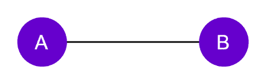
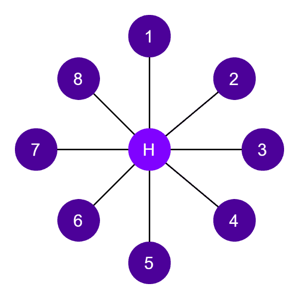
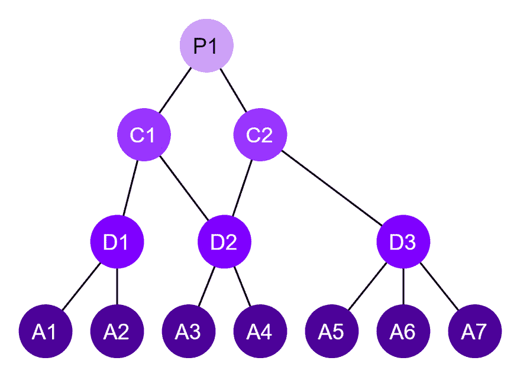
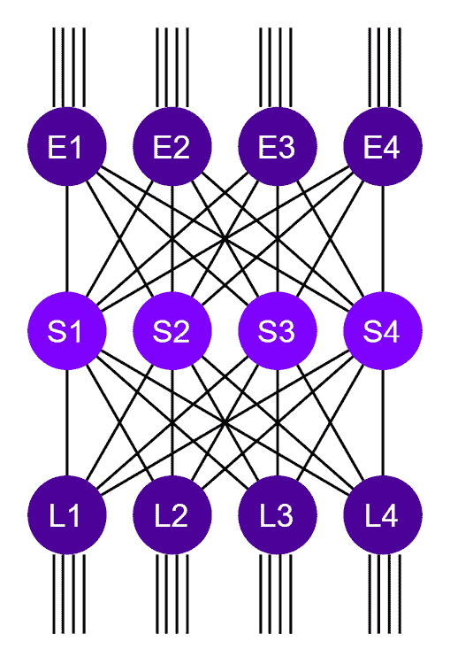
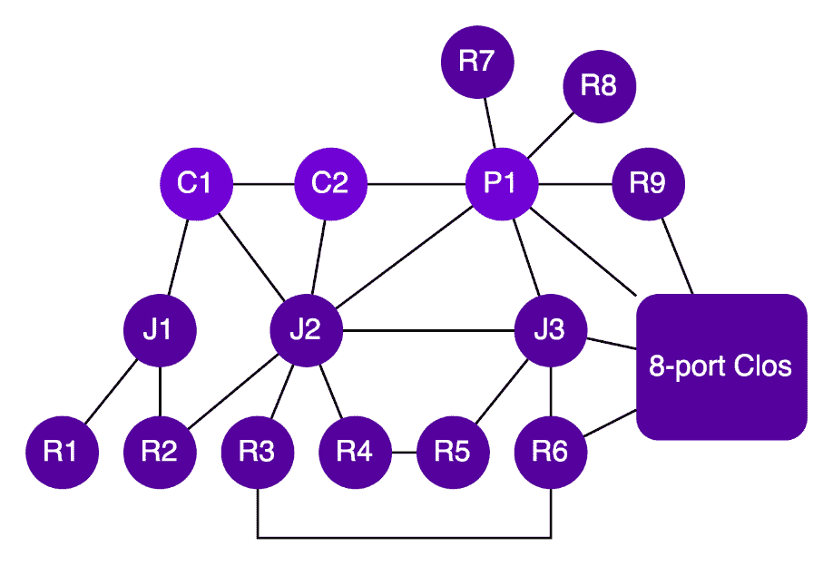
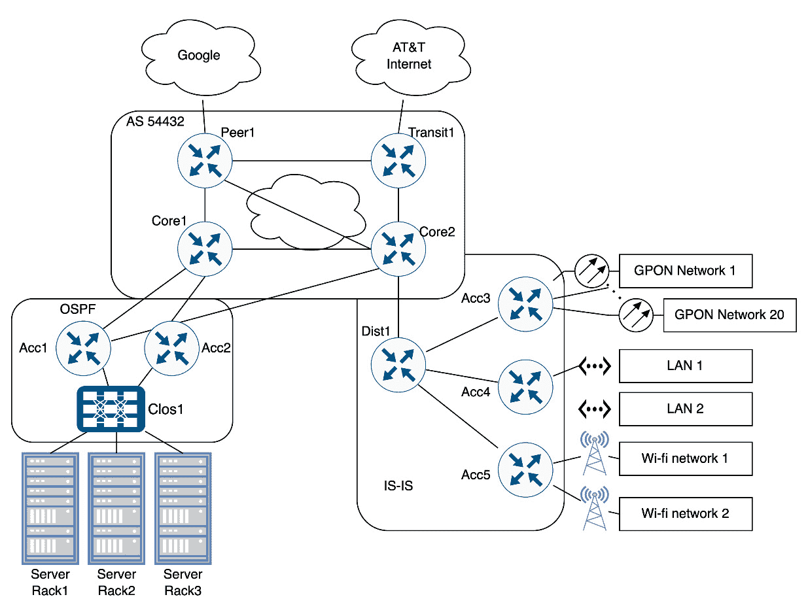
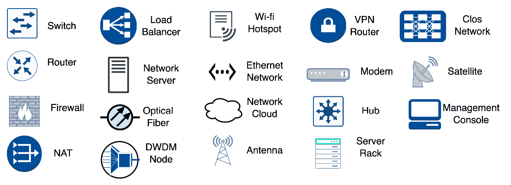
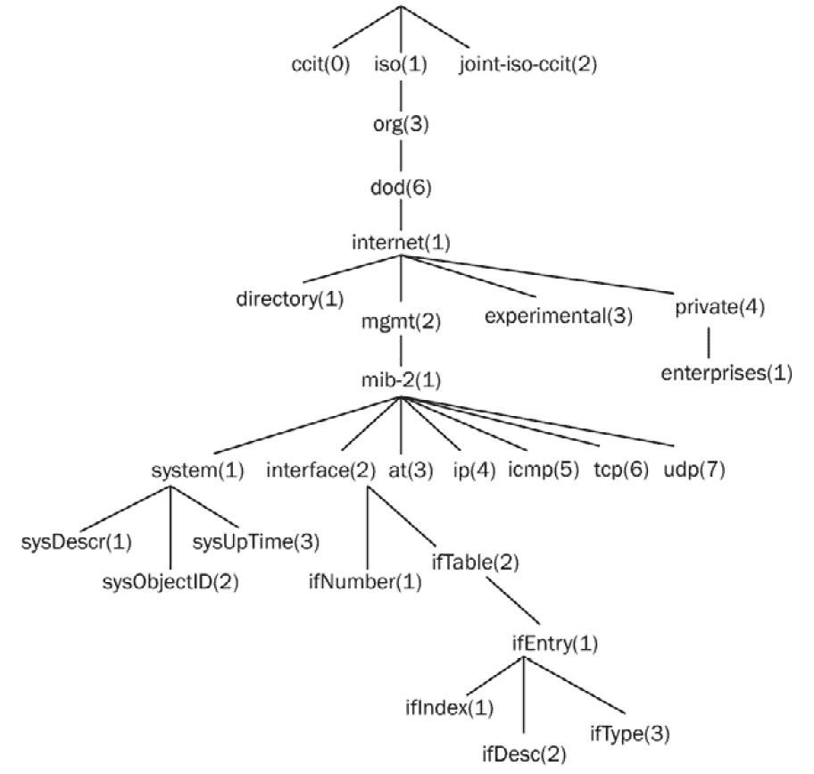
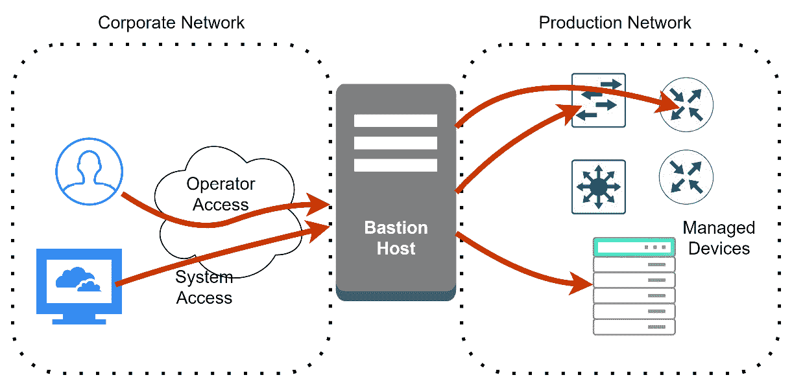

# 第一章：开发网络基础知识

本章的重点是解释**计算机网络**中使用的基礎术语。目的是建立一个良好的基础，贯穿整本书。

如果你是一个**网络工程师**或在这一领域有经验，你可能想跳过它，或者也许只是浏览一下。

如果你是一个对网络经验较少的**软件开发者**，这一章就是为你准备的。它将帮助你建立一个坚实的网络术语基础，这对于编写**网络自动化**代码时非常有用。

本章我们将涵盖以下主题：

+   复习协议层、网络设备类型和网络拓扑

+   描述网络架构及其组件

+   阐述网络管理组件、网络堡垒等

# 复习协议层、网络设备类型和网络拓扑

我们在这里有很多话要说。但由于这本书的篇幅限制，我已经整理了一个摘要，其中包括了今天网络术语最重要的方面，并对其进行了简要解释。希望你能找到一些新的信息，帮助你自动化工作。

## 协议层

需要注意的是，存在多种不同的协议层标准，其中最学术性的一个是被称为**OSI 模型**的 ISO 组织，它定义了七层。但我们将只考虑在互联网上使用的 TCP/IP 协议栈中定义的五层，以下是对每一层的简要总结：

+   **物理层**：在这一层中，涉及的是物理连接本身的技术，其中比特和字节被转换成物理媒介，例如光纤中的光、电缆中的电和天线中的无线电波。在这一层，可以在节点输入上实施物理检查，例如功率水平、冲突、噪声和信号失真等。

+   **数据链路层**：在这里，信息被称为**帧**，它包含一个分隔的大小，称为**最大传输单元**（**MTU**）。原因是帧是字节表示的数据，它必须从一个节点移动到另一个节点，并且以可靠的方式无中断地移动。在这一层，存在帧队列；队列用于将帧按顺序或优先级顺序放置在物理层。某些数据链路设备可以优先处理某些类型的帧，将其跳到队列的前面。在数据链路层，会进行一些检查，但这些检查是在帧本身内进行的，例如 CRC 或校验和。此外，还可以将源地址和目的地址添加到帧中，以区分共享媒体上的目的地。帧上的信息通常在同一个组织内部本地使用。这一层也被称为**以太网层**。

+   **网络层**：这也被称为**IP 层**，或**路由器层**。在这里，信息被称为**数据包**，它包含在层 2 域（或之前的以太网层）之间的节点之间传输的信息。在这一层，使用路由协议，**网络地址转换**（NAT）执行其任务，存在一些**访问控制列表**（ACLs），控制数据包在其它功能中。在这一层的包包含了足够的信息来知道它从哪里来以及它要去哪里。这一层还负责如果帧 MTU 小于 IP 包时将包分片成多个包。包中携带的主要信息是**IP 地址**，并包含源地址和目标地址。

+   `80`用于 HTTP 通信，并将其与主机中的通信**套接字**关联。端口号对于源地址和目标地址都是必需的，它将用来指定与主机通信的正确套接字。

+   **应用层**：这是层的顶端，通常被我的教授称为“蛋糕上的樱桃”。应用层用于将主机上的**套接字**与将要发送和接收的数据关联起来。应用通常处理数据的正文，例如 HTTP 中的页面请求。我们在这本书中生产的软件使用这一层来自动化网络。

## 局域网（LAN）、广域网（WAN）、互联网和内部网

**局域网**（LAN），或**本地网络**，用来指代本地网络。如今，它意味着使用数据链路层作为主要通信的网络，例如以太网。之所以这个名字更多地与通信层相关而不是地理相关，是因为技术已经发展，使得以太网交换机能够在数千公里内通信。因此，一个局域网通常指同一组织内部使用以太网的拓扑结构，但不一定是地理位置相同。

**广域网**（WAN），或**宽域网络**，用来指代远程连接的网络，或允许节点相隔甚远的 技术，例如已经灭绝的技术如 X.25、帧中继和**异步传输模式**（ATM）。现在，WAN 这个术语通常用来指代连接到不同网络或换句话说，不在同一组织、数据链路层或以太网域中的接口或网络。

信息

如需了解更多关于 ATM 的信息，请参阅 SSRN 电子期刊 1998 年 6 月的文章《技术和应用》，作者：Jeffrey Scott Ray。

互联网就是你所知道的，这个连接全球每个人的巨大网络。

当公司使用互联网协议在其网络上进行内部通信时，使用了“内部网络”这个术语。原因是当时有其他技术与互联网 TCP/IP 协议竞争，例如 SNA 和 IPX。因此，当使用“内部网络”这个术语时，它只是简单地表明公司网络使用 TCP/IP。如今，“内部网络”指的是同一组织内的网络，且不连接到外部节点。因此，该网络是*安全的*，不受外部干扰。

### 点对点连接

**点对点**（**P2P**）连接用于连接两个节点。两个节点之间的连接通常是 P2P 连接（如图 *1.1* 所示），除非使用卫星或广播天线等媒体。这种连接可以是*背靠背*的，也可以不是。术语*背靠背*通常用来表示节点之间直接连接，没有任何其他物理层（如中继器）介于它们之间。因此，背靠背连接由于连接中引入的噪声和失真而受到限制，随着线缆变长，距离有限，通常限制在同一房间或建筑物内。



图 1.1 – P2P 连接

### 星形或中心辐射拓扑

星形或中心辐射拓扑用于小型和中型公司，其中一家办公室是主要分销商，其他地点是消费者。该拓扑看起来像一颗星，远程位置的网元较小且简单，而在主要分销商处较大且复杂（见图 *1.2* 的示例）。

通常，这些类型的拓扑可以扩展到数百个节点，但根据流量，需求可以扩展到数千。让我们看看两个示例，以说明这些拓扑的规模。

例如，在银行中，自动柜员机分布在偏远地点，而主计算机位于总行。由于在柜员机上的字节传输量很小，因此这种拓扑可以扩展到数千台远程机器。

另一方面，如果你有一个使用星形拓扑的超市连锁店，它无法扩展到数千台远程机器，因为每个超市都需要大量数据传输来处理所有交易和员工。

因此，星形拓扑的使用受到其中央节点可以处理的流量的限制。在星形拓扑中，我们有两种设备功能，一种设备将位于远程位置或主办公室。

当处理星形拓扑时，网络容量规划很简单，因为随着其增长，主办公室节点会更新。



图 1.2 – 星形拓扑

### 分层或树形拓扑

分层拓扑用于优化流量，其中较大的节点用于按分层方式将流量聚合到较小的节点（参见*图 1.3*中的示例）。这些拓扑可以扩展到数千个节点；然而，由于路径中的节点数量，这些拓扑可能导致不希望的延迟和额外的节点成本。

互联网服务提供商通常使用分层拓扑在特定远程位置集中客户流量，然后再在其他位置进行进一步的聚合。

这种类型拓扑的节点数量没有限制，它是互联网全球基础设施的基础之一。

在分层拓扑中，我们有多个设备功能，包括**客户场所设备**（**CPE**）、聚合器、分发器、核心和对等，等等。

根据这种拓扑的大小，它可能会引入更长的路径，这将增加显著的延迟。例如，在*图 1.3*中，**A1**必须穿越五个主机才能到达**A7**。

网络容量规划集中在聚合点，增强网络并不困难。



图 1.3 – 分层或树形拓扑

### Clos 拓扑

这种类型的拓扑也被称为**Clos 网络**或**布线**。这种拓扑用于在不影响延迟和吞吐量的情况下增加端口数量，通常用于数据中心。这种拓扑至少由三个阶段组成。请注意，与分层拓扑不同，这里没有过度预订或聚合。Clos 拓扑在输入和输出上提供相同数量的可用带宽。阶段名称通常是**脊**和**叶**。脊始终位于中心，并且仅与 Clos 节点连接。叶用于连接外部设备或网络。

*图 1.4*展示了 16 端口 Clos 网络的示例。请注意，通常，脊节点到叶节点的所有连接都是*背靠背*：



图 1.4 – Clos 拓扑

为什么使用这些拓扑？为了在不影响吞吐量的情况下增加可用的端口数量。这种拓扑也用于路由器内部，以提供接口卡之间的连接。一些公司使用小型设备来增加提供的端口数量，而不增加成本，因为小型设备通常更便宜。

重要提示

Clos 网络的另一个特点是它具有任何两个外部端口之间的相同距离（就路径中的节点而言），因此正常条件下的延迟是相同的。例如，在*图 1.4*中，节点 L1 上的外部端口与 L4 或 E1 上的外部端口之间的延迟是相同的。

重要提示

关于 Clos 网络的更多信息可以在一篇有趣的谷歌论文中找到，名为《Jupiter Rising：谷歌数据中心网络中 Clos 拓扑和集中式控制十年》—— ACM SIGCOMM 计算机通信评论，第 45 卷，第 4 期，2015 年 10 月。

### 混合拓扑

混合拓扑在大公司中使用，其中延迟和流量都很重要。通常，星型拓扑和对等网络用于缩短路径和降低延迟，而分层拓扑用于优化和聚合流量，最后，Clos 网络用于增加端口数量。

现代云服务提供商正在迁移到一个更复杂的拓扑，其中元素之间存在延迟相关的连接，以及流量相关的聚合设备功能。

网络容量规划通常更困难，因为连接不是完全分层的，聚合点也不一定是所有流量路径的一部分。这种混合拓扑的一个例子在 *图 1.5* 中显示：



图 1.5 – 混合拓扑

### 接口速度

一些工程师可能会混淆的一个非常重要的点是接口速度的表示。在内存表示中，1 KB 是 2¹⁰ 或 1,024 字节，而 1 GB 是 2³⁰，即 1,073,741,824 字节。对于接口速度，情况并不相同，1 Kbps 实际上是 1,000 比特/秒，而 1 Gbps 是 1,000,000,000 比特/秒（更多详细信息请参阅 [`en.wikipedia.org/wiki/Data-rate_units`](https://en.wikipedia.org/wiki/Data-rate_units)）。

### 设备类型和功能

网络设备过去具有特定的功能，因为 CPU 和内存稀缺且昂贵。如今，网络设备在需要时可以具有多种功能。在大网络中，设备的功能较少，因为当流量需求增加时，它们更容易过载。以下是一些设备可能具有的功能：

+   **集线器**：这是一个非常古老的术语，用来指代只重复物理信号的设备。

+   **交换机**：仅在数据链路层工作的设备。它通常用于局域网，通过交换帧来工作。在这些设备上用于控制路径的最常见协议是 **生成树协议**（**STP**）。

+   **路由器**：仅在网络层或 IP 层工作的设备。它用于连接多个局域网或创建长途远程连接。内部，路由器使用路由协议路由数据包，与其他路由器交换路由信息。一些路由器还可以交换帧或作为交换机工作。

+   **NAT**：NAT 是替换源和目的 IP 地址的设备，允许使用私有 IP 地址或将内部流量与外部流量隔离。

+   **防火墙**：通常，通过检查帧或数据包的内容来控制通过它的流量。有几种不同类型的防火墙，其中一些可能非常复杂，包括加密和解密流量。

+   **负载均衡器**：当服务器由于硬件限制无法处理过多的客户端时，可以使用负载均衡器通过在多个服务器之间共享客户端请求来处理客户端需求。这些设备还会检查数据包内容以确定哪个服务器将获得流量。

+   **网络服务器**：用于向网络提供某种**服务**的计算机，例如认证服务器、NTP 服务器或 Syslog 收集器。

### 过度订阅

在网络术语中，这个术语用来描述网络中聚合来自网络其他部分流量的节点或链接，并统计上利用它来获得优势。例如，它们有一个 1 Gbps 的接口连接到互联网，以及 1000 个拥有 10 Mbps 接口的客户使用服务，这是一个 1 到 10 的过度订阅。这种做法相当普遍，并且之所以能够这样做，是因为客户端流量的特性允许在不降低性能的情况下进行这种聚合。互联网上有许多数学模型和论文描述了这种行为以及如何利用它。

但有些流量不能在不降低性能的情况下进行聚合。在数据中心，无法过度订阅的流量是服务器之间的流量，例如远程磁盘、数据传输和数据库副本。在这种情况下，最佳解决方案是使用非阻塞 Clos 拓扑等解决方案在不进行过度订阅的情况下将它们互连。

浏览网页、观看视频和接收来自互联网上大部分流量的消息，这很容易允许在不降低性能的情况下进行聚合技术。

重要提示

关于过度订阅的更多信息可以在 A. Raju、V. Gonçalves 和 P. Ballon 发表的论文《评估过度订阅对未来互联网商业模式的影响》中找到——发表于 2012 年 5 月 25 日的网络研讨会——计算机科学。

在本节中，我们介绍了计算机网络的基本组件，包括协议、拓扑类型、接口速度和设备类型。到现在为止，你应该能够更容易地识别这些术语，并且熟悉它们的含义，因为我们将在这本书中反复使用这些术语。接下来，我们将回顾更多与网络架构相关的术语。

# 描述网络架构及其组件

网络架构这个术语是在 2000 年代初提出的，模仿了建筑行业中的角色，在那里建筑师设计，土木工程师建造。不同的公司使用这个术语的方式不同，但在这本书中，网络架构将用来指代网络的设计及其功能。

对于一个好的网络架构，最好有一个详细描述网络前三个层次的文档，从物理层到路由层。有了这份文档，工程师们可以很容易地理解物理连接、以太网域和使用的路由协议。

## 图表

网络图表大多像一张地图，其中城市是节点，道路是连接它们的链接。对于网络工程师来说，图表对于描述节点如何连接至关重要，它们还可以分组和划分重要区域。一个好的图表易于解释，并可以追踪数据流。

有多达三种类型的图表；它们可以集成在同一页面上和图表中，或者可以分离到不同的页面上。主要图表中有一个用于显示物理连接，这可能包括数据链路层中涉及的技术，以及交换和路由图表。

在 *图 1.6* 中，我们可以看到一个网络图表的示例：



图 1.6 – 网络图表示例

*图 1.7* 展示了网络图表符号的示例：



图 1.7 – 网络图表符号

## 网络节点名称

网络节点是一种主要用于互连和作为网络中数据传输的设备。它可以是集线器、交换机或路由器。为了帮助网络工程师识别节点功能，使用名称来描述它们的主要功能。以下是一些例子：

+   **中继路由器**：这些路由器与其他服务提供商有接口。这些链接通常用作访问其他网络的服务，因此它们有成本，因为它们通常连接到其他大型运营商。

+   **对等路由器**：这些路由器以对等配置与其他网络有接口，这意味着没有任何部分需要付费使用。在这些链接中，只有对等公司之间的流量被交换，不允许流量流向外部网络。使用中继路由器访问外部网络的情况。

+   **核心路由器**：这些节点位于网络中心。它们通常处理大量流量并具有高速接口。它们的吞吐量能力是网络中最高的，但它们的接口较少，因为它们集中了网络的流量。

+   **分发路由器**：这些节点通常连接到核心路由器和聚合路由器。它们通常连接网络的不同位置。它们没有很多接口，吞吐量能力很高，但不如核心路由器高。

+   **聚合路由器**：这些路由器通常聚合接入路由器的流量。它们通常位于接入路由器相同区域或位置，并且与接入路由器相比接口更少。

+   **接入路由器**: 一些架构师添加一个节点，连接所有最后一英里网络或 CPE 节点。这些路由器位于更靠近客户的位置，并且比其他路由器有更多的接口。

+   **机架顶部** (**TOR**): **TOR**指的是可以是交换机或路由器的节点，这取决于架构。它们负责将机架中的服务器连接到整个网络。

+   **Clos 机架**: 如前所述，Clos 网络是一种使用小型设备向多个服务器添加连接性的技术。Clos 机架在网络中被视为一个唯一的单一块，在架构方面，它作为一个单一节点，通常用作具有大量接口的单个路由器。

+   **CPE**: CPE 是在客户位置安装的节点。它通常有一个接口连接到最后一英里网络，还有一个本地接口，可以是以太网或无线以太网。这些设备还可以实现 NAT、防火墙，在某些情况下，它们有多个本地接口，可以作为交换机和路由器使用。这些节点价格低廉、体积小，与其他节点相比，吞吐量能力非常低。

## 最后一英里网络

这个术语用来描述连接客户到网络的架构。通常，这个术语仅用于 ISP，但一些公司也用它来互联他们的分支机构。

**最后一英里网络**的覆盖范围有限，通常不会超过 1 公里，这取决于所使用的技术类型。以下是一些最常见的最后一英里网络：

+   **有线电视**: 在这里使用了多种技术，通过客户安装的有线电视提供数据通信。最常用的是 DOCSIS，它在 2017 年升级到了版本 4。该解决方案使用一根共享给多个住宅的单电缆。

+   **数字用户线路** (**DSL**): DSL 使用旧的电话线路进行数据通信。为此，有许多标准，其中最常见的是 VDSL 和 ADSL。DSL 解决方案不与有线电视共享相同的媒体，每个客户都有一个单独的电缆。

+   **光纤到户** (**FTTP**): FTTP 是指光纤到达客户的住宅。就像有线电视一样，最常见的实现方式是单根光纤以可共享的方式跨越多个客户。最常见的技术是**无源光网络** (**PON**)，或者更具体地说，是**吉比特以太网 PON** (**GPON**)（或 G.984）。

重要注意事项

关于 GPON 网络的更多详细信息可以在 2010 年 11 月的论文《电信网络中的 GPON》中找到——2010 年国际超现代电信与控制系统大会（ICUMT）会议论文，2010 年。

+   **Wi-Fi**：通常，这项技术用于公司或家庭内部的私人用途，但一些互联网服务提供商（ISP）使用无线以太网标准（IEEE 802.11 系列）通过全向天线向客户提供最后一英里的服务。这种特定用途因国家而异，取决于政府的立法。它们通常被宣传为**以太网热点**（[`en.wikipedia.org/wiki/Hotspot_(Wi-Fi)`](https://en.wikipedia.org/wiki/Hotspot_(Wi-Fi))）。

+   **卫星**：对于使用卫星进行数据通信，有两种方法：一种使用地球静止卫星，另一种使用星座卫星。它们之间的区别在于延迟，因为地球静止轨道离地球非常远。星座方法具有低延迟，但由于卫星不断移动，存在切换挑战，通常数据吞吐量非常低。最著名的使用地球静止轨道的技术是 VSAT。使用 VSAT 的互联网每次从地球到卫星的旅行都会增加大约 250 毫秒，因此往返时间为 500 毫秒。但随着 SpaceX 宣布他们最终解决了使用星座方法的切换问题，高延迟的黑暗时代可能已经结束。这项新服务被称为**Starlink**，并承诺使用低轨道卫星提供高容量、低延迟和高可用性。

重要提示

在卡林西亚应用科学大学 Research group ROADMAP-5G 的研究论文《Starlink 分析》中可以找到关于 Starlink 网络的良好讨论，日期为 2021 年 7 月 15 日。

+   **电力线通信**（**PLC**）或**HomePlug**：PLC，或**电力线宽带**（**BoPL**），使用电力线进行数据通信。这是通过在电线上调制高频来实现的。大多数变压器无法通过信息，因为它们充当低频截止滤波器，所以它必须包含在房屋内或变压器之间。这里最常见的技术是 HomePlug AV2 和 IEEE 1901-2010（[`ieeexplore.ieee.org/document/5678772`](https://ieeexplore.ieee.org/document/5678772)）。

+   **移动网络**：无疑是最后一英里中最受欢迎的网络。如今，它们使用 5G 技术，但其他旧网络仍在使用中，例如 4G（LTE）、3G 和 GPRS。

重要提示

更多关于移动技术的信息可以在 A. Agarwal、K. Agarwal、S. Agarwal 和 G. Misra 撰写的《面向 5G 网络的移动通信技术演变及其挑战》一文中找到，该文发表于 2019 年，美国电气和电子工程杂志，第 7 卷，第 2 期，第 34-37 页。

## 物理架构

物理架构有时并不一定是描述连接设备的电缆或光纤，而是网络作为 TCP/IP 堆栈中定义的**物理**层所使用的**基础设施**。这意味着我们可以将其他外国网络作为**物理层**来重用，即使它们有自己的协议栈。以下是架构中可能使用的某些物理技术：

+   **暗光纤**：当连接节点时，**暗光纤**这个术语意味着连接的节点将使用不含中继器或底层基础设施的光纤。在两个节点之间使用暗光纤连接的情况下，如果一个节点断电，另一个节点将不会从光纤中接收到任何光。在这种情况下，光纤切断会在两端立即感知到，接口会立即因光纤切断而关闭。当发生故障时，只有输出接口队列中的数据包会被丢弃。

+   **同步传输模块**（**STM**）：STM 最初是为了复用数字电话线路而创建的，但后来开始用于数据通信。最常见的是 STM-1，其速率为 155 Mbps。路由器曾经有一个接口可以封装 STM 帧到 STM 网络。STM 网络只是将帧从一端切换到另一端。使用这种技术切断光纤可能不会迅速感知到，这可能导致大量数据包丢失。正如我们稍后将要描述的，**双向转发检测**（**BFD**）需要在这里使用以避免严重问题。

+   **密集波分复用**（**DWDM**）：DWDM 是 STM 的一种演变。DWDM 网络是一个交换网络，它也为每个承载的数据包的帧、时间和波分提供了分路，类似于 STM 但有所增强。同样，BFD 是必要的，因为在这里光纤的切断可能不会迅速感知到，这可能导致大量数据包丢失。

+   **端到端**：如前所述，**端到端**这个术语通常用来指定直接连接而没有其他物理层（如中继器）在之间的节点。

+   **网络隧道**：网络隧道是网络中用于封装流量并在不同网络中传输的点。隧道可以是第 2 层或第 3 层，并实现以抽象所承载的网络。在某些网络架构中，它们旨在使用外国基础设施到达网络的遥远部分。

+   **VPN 隧道**：这些就像网络隧道。VPN 隧道通常会增加加密。

## 路由架构

定义网络中流量如何流动是很重要的。为此，我们需要在路由分配方面有一个适当的设计。这是必要的，以便实现故障恢复、冗余路径、负载均衡、路由策略和流量协议。如果连接到外部，架构必须包括内部路由协议和外部路由协议。以下是一个总结：

+   **内部网关协议**（**IGP**）：IGP 是一种在限定区域或位置运行的路由协议，通常如名称所示，在同一个组织内部运行。在 IGP 域中，路由器通过宣布和接收拓扑更新来交换路径信息。最常用的 IGP 使用链路状态信息来构建路由路径拓扑。如果一个接口故障，更新必须传播到整个 IGP 域。孤立区域被用来避免更新过大的拓扑并引起不稳定。历史上，流行的 IGP 有 RIP 和 EIGRP，但今天，只有**开放最短路径优先**（**OSPF**）和**中间系统到中间系统**（**IS-IS**）被使用。

+   **外部网关协议**（**EGP**）：EGP 是一种用于在组织之间交换路由信息的路由协议。它通常不包含链路状态信息，只有路径距离。最常用的 EGP 协议是**边界网关协议**（**BGP**）。

+   **IS-IS**: IS-IS 是由 ISO 设计的 IGP 协议，注册为 ISO 10589。它是一种基于称为迪杰斯特拉算法的最短路径算法的链路状态协议。它是第二常用的 IGP。

+   **OSPF**: OSPF 是由 IETF 设计的 IGP 协议，最初于 1989 年由 RFC1131 注册，后来更新了几次。版本 3 是最后在 RFC5340 中描述的版本。OSPF 也使用迪杰斯特拉算法来计算路径，是最流行和广泛使用的 IGP。OSPF 使用区域来扩展并提高路由数据库更新期间的稳定性。

+   **BGP**: BGP 是一种独特的协议，用于在组织之间交换路由信息。它首次在 1989 年的 RFC1105 中被引入。它也是 IETF 上更新和扩展最多的协议之一，可用于不同的目的，例如**内部 BGP**（**iBGP**）、在 RFC4760 中定义的**多协议 BGP**（**MP-BGP**）、MPLS（MP-BGP）以及最近在 2017 年定义的 BGPsec，定义在 RFC8205 中。BGP 是一种基于路径向量的协议，也称为距离向量协议，它不使用像 OSPF 那样的链路信息。

+   **自治系统编号**（**ASN**）：与 IP 范围一样，ASN 是一个与组织在开始使用 BGP 交换路由表时关联的唯一数字。它由五个区域互联网注册机构控制：北美地区的**ARIN**，拉丁美洲的**LACNIC**，亚太地区的**APNIC**，欧洲的**RIPE**，以及非洲的**AFRINIC**。当使用 BGP 交换路由表时，ASN 会随路径传输。例如，Amazon.com 使用 ASN 16509 ([`whois.arin.net/rest/asn/AS16509`](https://whois.arin.net/rest/asn/AS16509))。

让我们探讨从网络状态的角度来看网络是如何工作的。

## 失败类型

在计算机网络中，路由表、链路或节点故障引起的不稳定性是一个主要问题。例如，如果一个节点变得无响应，比如 CPU 冻结，其他节点必须快速检测到它，以便它们可以通过不同的路径重新分配流量。但如何检测到故障以便快速重新路由呢？让我们首先探讨故障类型：

+   **链路故障**：链路故障是指两个节点之间的连接停止接收或发送数据，因为路径上存在中断。故障可能由物理问题引起，例如光纤切割，环境条件，如大雨，或者由于中间件设备故障。节点通常通过输入信号缺失来检测链路是否断开，但在某些情况下，例如使用中继器或底层网络（如 DWDM），输入信号存在，但数据无法传输。因此，需要更高层次的协议来监控和检测通信中断，而不仅仅是接口输入信号；否则，数据将持续丢弃，直到节点决定重新路由流量，在某些情况下这可能需要几秒钟。

+   **节点故障**：节点可以通过多种方式发生故障；最常见的是电源丢失和操作系统冻结。软件故障可能导致路由器冻结数分钟甚至数小时，导致数据包丢失或不丢失，具体取决于冻结发生在转发平面还是控制平面。快速检测这种故障有点困难，因为所有接口信号仍然存在，转发平面可能仍在工作。

+   **波动**：接口波动是指接口在没有被检测到的情况下频繁地短暂断开。波动会导致数据丢失而未被检测到，通常没有特定设备来测量两端正常连接的介质是难以发现的。术语**波动**也用于描述路由表上路由频繁出现和消失的情况，称为**路由波动**。

## 故障检测技术

这里有一些检测故障的技术：

+   **信号关闭**：接口通过主信号或灯光的缺失来检测故障，这是一种非常简单的方式。在光纤的情况下，如果接收到的光强度太低，就会认为接口已关闭。请注意，这种检测是在输入接口上进行的。

+   **协议保持活动状态和 hello 包**：一些路由协议有保持活动状态（或*hello*）消息来检查它们的邻居是否仍然存活。在 OSPF 中，hello 包的默认周期对于 LAN 接口是 10 秒，对于 P2P 连接是 30 秒。BGP 的默认值是 30 秒。对于今天的网络速度，30 秒会导致大量数据丢失。一个 10 Gbps 的接口如果完全负载，就会丢弃总共 37 GB 的数据。在今天的协议实现中，发送这些消息的周期不能短于几秒，这仍然是一个很长的时间段，会导致大量数据丢失。

+   **链路 BFD**：2010 年，IETF 发布了 RFC5880，该文件描述了 BFD 协议，旨在允许路由器以微秒级顺序检测其接口上的故障。BFD 消息支持至少 1 毫秒的间隔。BFD 通常在接口硬件上实现，这使得它可以在不中断主 CPU 的情况下做出响应。

+   **BFD 路由协议**：链路 BFD 通常在网络的所有接口上启用，以快速检测故障，但在 OS 路由器冻结或控制平面故障的情况下，它不会有所帮助。为了避免在这些情况下丢失数据包，所有主要协议都具备 BFD 功能，包括 OSPF、IS-IS 和 BGP。尽管 BFD 协议消息支持微秒级间隔，但使用路由协议的实现通常以毫秒级顺序进行，并且受限于点的数量。原因是这些消息需要由主 CPU 处理，过多的消息可能会导致性能下降。

+   **路由抖动检测**：路由协议可以检测持续的路由抖动并在一段时间内抑制它。这有助于避免在路由实际上不稳定时重新计算路径。当抑制生效时，通常情况下，会采用默认路由。

## 控制平面和转发平面

理解转发平面和控制平面之间的区别非常重要，尤其是如果你正在从事网络自动化工作。让我们在本节中探讨它们。

转发平面，或数据平面，是一个抽象概念，其中一些进程、设备和硬件被用来通过网络转发流量。换句话说，转发平面定义了网络中所有负责接收数据、传输数据和交付数据的实体。

控制平面是一个抽象概念，指定了网络中所有负责构建数据路径、移除数据路径或更新数据路径的实体。

转发平面在数据从一个输入点，*A*，传输到另一个输出点，*B*时工作，但不需要控制平面工作。只有当从*A*到*B*不存在路径时，控制平面才会工作。在出现故障的情况下，控制平面也会工作，因为原始路径可能被中断，需要重新构建。

那么，为什么这在网络自动化中很重要呢？因为如果转发平面出现问题，控制平面必须更新转发路径，这可能导致数据包丢失、抖动和延迟。稳定的网络不需要任何路径更新，因此控制平面的工作量最小。网络自动化需要避免任何可能导致控制平面更新网络的特定自动化。

## 优雅重启

通常，当路由器重启时，所有路由对等体会检测到会话已断开，然后又重新建立。这种*下/上*转换导致控制平面重新计算所有路由路径，在整个网络中生成数千个更新，从而对转发平面造成波动。这种重新计算也可能导致路由震荡，可能创建瞬时的转发黑洞和瞬时的转发环路。这些瞬时问题也会消耗受影响路由器的控制平面的大量资源。

因此，为了在需要重启的情况下避免这种剧烈的变化，创建了一种**优雅重启**。

理念是我们可以在一个路由器上重启所有控制平面进程，而不影响转发平面和其他邻居路由器的控制平面。在实践中，优雅重启是一种重启路由进程而不影响转发平面的方法。

2003 年，IETF 发布了 RFC3623，以定义 OSPF 的优雅重启实现。今天，主要的控制平面协议都有某种形式的优雅重启，包括 BGP、IS-IS、MPLS、RSVP 和 LDP。

在构建网络自动化时，这种方法更倾向于更新软件。

在本节中，我们回顾了网络架构及其组件。我们获得了更多关于路由和物理架构组件的详细信息。我们还了解到控制平面和数据平面分离的重要性，以及故障类型。了解这些网络术语对于帮助网络自动化很重要。接下来，我们将回顾网络管理和其组件。

# 展示网络管理组件、网络堡垒等

在我们完成本章之前，让我们简要讨论一下网络管理和规划中使用的术语。

## ACL

**访问控制列表（ACL**）几乎在网络的所有地方都用于通过基于 IP 或端口号过滤 IP 数据包来控制访问。

访问控制列表（ACL）可以在转发平面或控制平面实现。当在转发平面实现时，它们用于限制 IP 可达性到网络的一部分，并避免 IP 欺骗。当在控制平面实现时，它们用于保护路由协议和管理端口免受恶意连接。

在带内管理中，也使用 ACL 在管理接口中避免不希望的交通。

## 管理系统和被管理元素

**管理系统**是包括负责管理网络的软件和硬件的平台。它可以集中式或分布式。被管理元素是管理系统的目标，包括路由器、交换机、调制解调器、中继器和智能机架等。

注意，**被管理元素**不必是网络的一部分。它可以是一个支持系统，例如带有风扇的机架或空调单元。在编写网络管理代码时，适当地分类元素非常重要，以便可以相应地管理它们。

## 带内和带外管理

带内和**带外**（**OOB**）管理指的是管理系统流量如何到达管理元素。

对于带外管理，存在一个隔离的网络基础设施，它仅承载管理流量，以任何方式都不连接到主网络，仅连接到每个被管理元素的管理端口。换句话说，转发平面不承载任何管理流量。此外，带外网络应能够在主网络路由状态独立存在并传输管理流量，因为在灾难性场景中，即使其网络接口关闭，带外网络也应该足以到达被管理元素。重要的是要注意，这个网络通常不承载太多流量，并且其上的节点和接口吞吐量较低。一些带外网络使用移动网络实现。

在带内管理中，转发平面和管理流量之间没有物理网络隔离，因此承载客户数据的接口也承载管理流量。在这种情况下，广泛使用 ACL 来避免向被管理元素端口的不必要流量。此外，一些网络架构在接口上添加优先级队列，以便首先传输管理流量，避免在重载链路上丢弃。

一些管理系统同时使用带内和带外（OOB）网络与设备通信。通常，如操作系统升级和事件记录等重交通量通过带内网络，而元素控制台访问则通过带外网络。

## 网络遥测

遥测不是一个新术语，它指的是任何可以远程监控现场变量的设备，例如温度或湿度。这个术语后来被引入到计算机网络中，用来指代用于远程收集网络信息的一系列程序。

**网络遥测**指的是计算机网络中的一个区域，该区域负责涵盖各种程序和系统来定义、收集和分析网络数据。在某些情况下，它可能意味着通过使用网络设备中的流式传输方法来获取网络数据的新方法。

## 管理信息库

**管理信息库**（**MIB**）是使用**简单网络管理协议**（**SNMP**）可以管理的对象集合的正式描述。

MIB 可以是公共的或私有的。当它是公共的，其定义由 RFC 发布，例如在 RFC2863 上定义的接口组 MIB。当它是私有的，它必须由拥有 MIB 的供应商提供。

MIB 通常按数字组织成树状结构（*图 1.8*）。当描述 MIB 树中的对象时，它通常被称为**对象标识符**（**OID**）。例如，接口输出中看到的包数由一个名为**IfOutUcastPkts**的 OID 表示，其序列为 *.1.3.6.1.2.1.2.17* ([`www.net-snmp.org/docs/mibs/interfaces.html`](http://www.net-snmp.org/docs/mibs/interfaces.html))。

OID 通常包含一个值，该值是一个可以具有不同类型的变量，例如 `COUNTER`、`GAUGE`、`INTEGER` 和 `OCTETSTR` 等。



图 1.8 – SNMP MIB 树

## 网络堡垒

术语**堡垒**来自中世纪战争中用来保护加农炮的防御工事。当时，堡垒是外墙的角形部分，通常放置在堡垒的角落，以便在多个方向上进行防御射击。

就像中世纪时期的加农炮一样，网络元素需要层次结构来保护。**网络堡垒**或**堡垒主机**是具有内置防御机制并连接到两个或更多网络的物理设备，通常是计算机。

堡垒主机通常设计为在具有多个以太网端口的计算机上安装 Linux。每个以太网端口连接到网络的不同部分，在这些部分需要隔离或保护。

为了保护网络，堡垒主机不转发流量，通常情况下，IP 转发功能被禁用，如下例所示，这是在 Linux 中应用的：

```py
# sysctl net.ipv4.ip_forward
net.ipv4.ip_forward = 0
```

一个没有 IP 转发的 Linux 盒子意味着流量不能在接口之间路由，因此流量必须从堡垒主机发起才能到达外部接口，并且没有其他流量会从不在盒子本地发起的以太网端口流出。因此，堡垒主机需要具有身份验证，例如用户名和密码，以允许*用户*或*系统*登录并本地运行 shell。从主机出发，用户可能能够生成指向其他以太网端口的 IP 数据包。

网络自动化将需要一个额外的机制来允许访问网络节点以进行配置。我们将在编写一些访问节点的代码时介绍这些机制。

*图 1.9*展示了堡垒主机的示例：



图 1.9 – 连接生产网络和公司网络的堡垒主机

## FCAPS

**FCAPS**是由 ISO 定义的网络管理模型和框架。其首字母缩写代表**故障、配置、计费、性能和安全**。这些每一个都是 ISO 模型定义的网络管理任务的管理类别。让我们来看一下每个任务的非常简化的描述：

+   **故障**：故障管理的目标是识别、隔离、纠正和记录网络中发生的故障。

+   **配置**：这指的是从设备中存储配置、跟踪更改以及提供新的配置。

+   **计费**：这涉及跟踪网络使用情况，按业务、客户或用户进行。目标是能够适当地进行计费或收费。

+   **性能**：这侧重于通过监控网络延迟、数据包丢失、链路利用率、数据包丢弃、重传和错误率来确保网络在可接受的水平上运行。

+   **安全**：这指的是控制对网络中资产和协议的访问，这可能包括 AAA 系统、ACL 和防火墙。

为什么 FCAPS 对网络自动化很重要？因为用 FCAPS 将任务分离来编写网络自动化代码会更好，这样我们就可以根据管理系统的不同部分相应地放置自动化。

## 网络规划

扩展网络是困难的，因为如果你购买过多的资源，可能会损失金钱。然而，如果你购买得太少，可能会失去客户。网络规划用于确保性能和成本朝着正确的方向发展。换句话说，它包括几个活动，其最终目标是定义一个未来最优的成本效益网络设计。网络规划工程师使用预测和统计模型来绘制最可能未来的网络增长。

由于预测的性质，网络规划团队需要从网络中获取大量数据，其中大部分可能不容易收集。你可能需要收集瞬时数据，而这些数据在当前的管理系统中是不可用的，因此你可以使用你的网络自动化技能来完成这项工作。

## 网络安全

需要提到的一个重要观点是公司正在做的工作，以创建一个安全的环境让流量流动。如今，大多数公司都投资了独立的和专业的团队来处理安全问题，这些团队拥有只理解网络细微差别的工程师，他们负责在设计和运营计算机网络时制定安全规则。

你的自动化工作可能涉及处理在网络中应用的安全规则，并且可能因公司而异，这取决于技术和所需的安全级别。有关网络安全的良好概述可以在[`en.wikipedia.org/wiki/Network_security`](https://en.wikipedia.org/wiki/Network_security)找到。

# 摘要

在本章中，我们回顾了网络的关键点。目的是突出主要概念并定义一些网络术语。到目前为止，你已经拥有了足够的网络背景知识，可以与任何网络工程师讨论自动化工作。我希望从现在开始进行的网络自动化编码工作将更有意义，并且你对网络术语更加熟悉。

在下一章中，我们将了解网络是如何演变成为可编程的。
