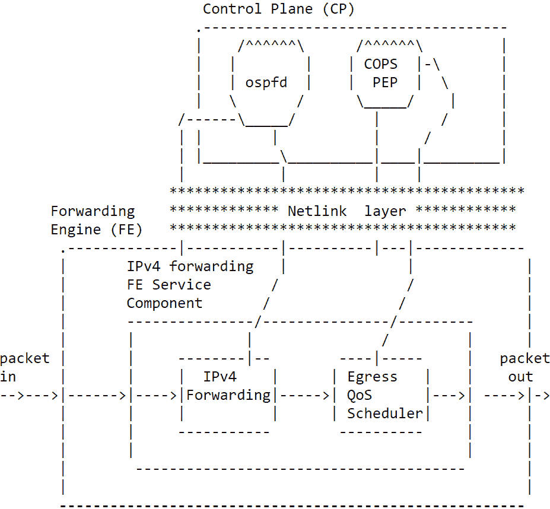
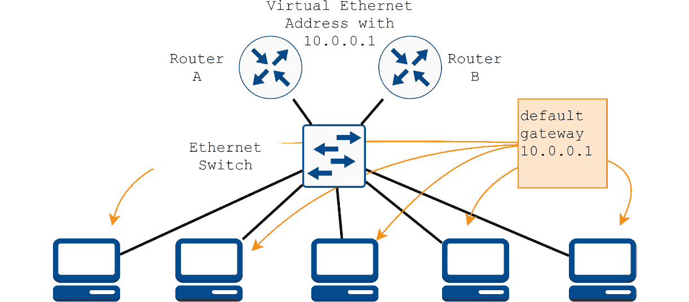
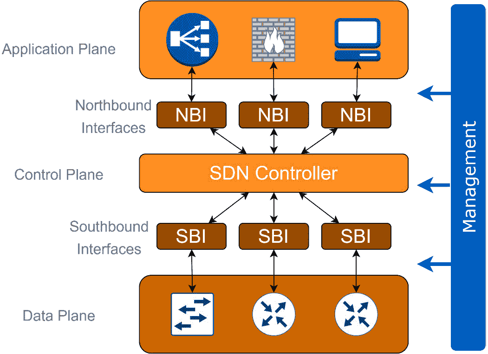

# 第二章：可编程网络

最初，计算机网络是物理和静态的，由线和硬件组成，但随着高级计算、虚拟化和连接性的发展，网络变得更加灵活，可以通过软件进行配置。在本章中，我们将讨论软件是如何改变计算机网络图景的。我们将首先检查今天用于通过软件创建网络的几种不同技术，然后我们将检查当前的标准技术，称为**软件定义网络**（**SDNs**）。

正如我们在第一章中看到的，计算机网络可以非常复杂且难以维护。从路由器、交换机和 NAT 到负载均衡器等，有多种不同的设备。此外，在每一件设备中，还有多种不同的操作类型，例如*核心*或*接入*路由器。网络设备通常由各个供应商配置，接口之间差异很大。尽管有可以帮助集中配置的管理系统，但网络设备通常在单个级别上进行配置。这种操作意味着操作复杂性和新功能创新的缓慢。

在本章中，我们将涵盖以下主题：

+   探索可编程网络的历史并查看当前使用的那些

+   虚拟网络技术

+   SDNs 和 OpenFlow

+   理解云计算

+   使用 OpenStack 进行网络配置

# 探索可编程网络的历史并查看当前使用的那些

自从工程师最初构思**可编程网络**以来已经过去了几年，因此在我们深入了解当前技术之前，让我们简要回顾一些历史里程碑。

## 主动网络

**国防高级研究计划局**（**DARPA**）从 20 世纪 90 年代中期开始资助研究，旨在创建一个可以通过编程轻松更改和定制的网络，称为**主动网络**项目。该项目的主要目标是创建网络技术，与当时现有的网络相比，这些技术易于创新和演进，允许快速的应用程序和协议开发。

但在 20 世纪 90 年代创建这样一个灵活的网络并不容易，因为编程语言、信令和网络协议以及操作系统还不够成熟，无法容纳这样的创新想法。例如，操作系统是单块的，添加功能需要重新编译和重启。此外，服务 API 不存在，分布式编程语言仍处于早期开发阶段。

活跃的网络研究项目探索了通过 IP 提供的传统互联网堆栈服务的激进替代方案。这方面的例子可以在**全球网络创新环境**（**GENI**）项目中找到，该项目可以在[`www.geni.net/`](https://www.geni.net/)查看，**国家科学基金会**（**NSF**），**未来互联网设计**（**FIND**）可以在[`www.nets-find.net/`](http://www.nets-find.net/)查看，以及**未来互联网研究和实验倡议**（**EU FIRE**）。

当时，活跃的网络研究社区追求两种编程模型：

+   **胶囊模型**，其中节点上要执行的代码在数据包中带内传输

+   **可编程路由器/交换机模型**，其中节点上要执行的代码由带外机制建立

重要提示

在*《主动网络——过去、现在和未来的一个视角》*中可以找到更多阅读材料。作者：Jonathan M. Smith 和 Scott M. Nettles – *《IEEE 系统——应用和评论部分》第 34 卷第 1 期，2004 年 2 月*。

让我们深入了解第一个尝试创建可编程节点的尝试，这个节点被称为**NodeOS**。

## NodeOS

活跃网络项目的第一个目标之一是创建**NodeOS**。这是一个主要目的是支持主动网络中数据包转发的操作系统。NodeOS 在主动节点中运行在最低级别，并在穿越节点的数据包流之间复用节点资源，如内存和 CPU。NodeOS 为主动网络执行环境提供了几个重要的服务，包括资源调度和会计以及快速数据包输入/输出。NodeOS 的两个重要设计里程碑是创建**应用程序编程接口**（**API**）和资源管理。

重要提示

在*《2001 年 4 月主动路由器操作系统接口》* – *《IEEE 选择通信领域杂志》第 19 卷第 3 期，第 473-487 页*中可以找到关于 NodeOS 的更多阅读材料。

在此之后，我们现在将探索一些社区早期尝试 SDN 的项目。

## 数据平面和控制平面分离

可编程网络和**SDN**的一个重要步骤是将**控制**和**数据**平面分离。在*第一章*中，我们讨论了控制平面和数据平面的区别，在这里我们将讨论它们背后的历史。值得记住的是，数据平面也被称为**转发平面**。

到了 20 世纪 90 年代，这种分离已经在公共电话网络上存在，但尚未在计算机网络或互联网上实施。随着网络复杂性的增加和互联网服务开始成为几个骨干提供商的主要收入来源，可靠性、可预测性和性能成为网络运营商寻求管理网络更好方法的关键点。

在 2000 年代初，一群研究人员开始探索使用标准协议或其他即将部署的技术来采取实用方法的社区，他们要么为网络运营商工作，要么定期与他们互动。当时，路由器和交换机在控制和转发平面之间有紧密的集成。这种耦合使得各种网络管理任务变得困难，例如调试配置问题和控制路由行为。为了应对这些挑战，开始出现各种将转发和控制平面分离的努力。以下几节将探讨一些早期的努力。

### IETF ForCES

**转发与控制元素分离**（**IETF ForCES**）工作组旨在创建一个框架，一个需求列表，一个解决方案协议，一个逻辑功能块库以及其他支持数据和控制元素分离的相关文档（[`datatracker.ietf.org/wg/forces/about/`](https://datatracker.ietf.org/wg/forces/about/))）。

### NetLink 接口

**NetLink**可能是 Linux 内核中控制平面和数据平面最清晰的分离。2003 年，IETF 发布了*RFC3549*，描述了**控制平面组件**（**CPCs**）和**转发引擎组件**（**FECs**）的分离。*图 2.1*（来自原始 RFC）说明了 Linux 如何使用 Netlink 作为控制和数据平面之间的主要分隔符（[`datatracker.ietf.org/doc/html/rfc3549`](https://datatracker.ietf.org/doc/html/rfc3549)）。



图 2.1 – 如 RFC3549 所示的控制平面和数据平面分离

Netlink 首次出现在 Linux 内核的 2.0 系列中。

### 路由控制平台

**路由控制平台**（**RCP**）是一种实用的设计，用于分离控制和数据平面。想法是在创建一个集中式控制，其中收集所有路由信息，然后运行算法为网络中的每个路由器选择最佳路由路径。

RCP 通过从当前网络中的路由器收集外部和内部的**边界网关协议**（**BGP**）路由表来实现，以集中方式使用这些信息为每个路由器选择最佳路径。这种方法使得可以利用现有的网络设备并实现控制平面和数据平面的分离。

重要提示

在关于使用 BGP 的 RCP 的更多信息可以在论文《设计和实现一个路由控制平台》中找到——作者：马修·凯撒，唐纳德·卡尔多，尼克·费姆斯特，詹妮弗·雷克斯福德，阿曼·沙伊赫，雅各布斯·范德梅尔韦——*NSDI’05：第二届网络化系统设计与实现研讨会论文集——第二卷，2005 年 5 月，第 15-28 页。*

### SoftRouter

**SoftRouter**的想法在 2004 年的一次会议上提出，并在 2005 年获得专利。同样，该架构在控制平面功能与数据平面功能之间有分离。

所有控制平面功能都实现在通用服务器上，称为**控制元素**（**CEs**），这些服务器可能距离**转发元素**（**FEs**）有多跳之远。SoftRouter 架构中有两种主要的网络实体，即 FEs 和 CEs。它们共同构成了一个**网络元素**（**NE**）路由器。与传统路由器的主要区别是本地没有运行任何控制逻辑（如 OSPF 或 BGP）。相反，控制逻辑是在远程托管。

重要提示

更多关于 SoftRouter 的细节可以在原始的 2004 年论文《The SoftRouter Architecture》中找到 – T. V. Lakshman, T. Nandagopal, R. Ramjee, K. Sabnani, T. Woo – *Bell Laboratories, Lucent Technologies, ACM HOTNETS - January 2004.*

### 路径计算元素架构

2006 年，IETF 网络工作组发布了一个 RFC，描述了一个集中控制的实体架构，用于做出路由路径决策，他们将此称为**路径计算元素**（**PCE**）架构。

最初，PCE 架构的发明是为了解决**多协议标签交换**（**MPLS**）中存在的问题，即每个路由器计算**标签交换路径**（**LSP**）变得越来越慢和繁重。它被设计为在内部或外部的服务器上执行计算。

重要提示

更多关于 PCE 的细节可以在 RFC4655 中找到：[`datatracker.ietf.org/doc/html/rfc4655`](https://datatracker.ietf.org/doc/html/rfc4655)

让我们现在看看最重要的项目，即 OpenFlow 和 SDN 的工作。

### 乙烷

**乙烷**是最重要的项目之一，最终导致了 OpenFlow 和 SDN 的创建。最初，它只是一个博士生的项目，定义了一个网络为一组数据流和网络策略来控制流量，这也是另一种看待数据平面和控制平面分离的方式。

Ethane 项目有集中所有网络策略在一个地方的想法。加入 Ethane 网络的新设备默认应该关闭所有通信。新设备在连接之前应该从集中服务器获得明确的权限，并且其数据流只能在允许的路径上传输。

重要提示

更多关于 Ethane 项目的细节可以在 2007 年的原始论文《Ethane: taking control of the enterprise》中找到 – 作者：M. Casado, M. J. Freedman, J. Pettit, J. Luo, N. McKeown, Scott Shenker – *SIGCOMM ‘07: Proceedings of the 2007 conference, pages 1–12.*

在本节中，我们探讨了可编程网络背后的部分历史。我们还探讨了几个导致控制平面和数据平面分离的主要项目，这是 SDN 的重要里程碑。你现在应该能够识别分离的重要性以及为什么会发生这种情况。

# 虚拟网络技术

**网络虚拟化**是指软件像网络硬件一样工作，这是通过使用逻辑上模拟的硬件平台来实现的。

网络虚拟化不是一个新概念，我们可以在 1970 年代中期在 X.25 网络上的虚拟电路中找到第一个实现。后来，其他技术也开始使用虚拟概念，如帧中继和 ATM，但它们现在已经过时。

回环接口基于电子学，其中回环用于创建电回路，以便信号返回其源进行测试。1981 年，IETF 将保留地址范围`127.rrr.rrr.rrr`（其中`127.rrr.rrr.rrr`正式称为`127.0.0.1`）。

网络虚拟化的另一个早期实现是**虚拟****局域网**（VLAN）。到 1981 年，David Sincoskie 正在测试分割语音以太网网络以实现容错，这与 VLAN 的作用类似。然而，直到 17 年后的 1998 年，IEEE 才将 VLAN 正式作为标准发布，命名为*802.1Q*。到 2000 年代，交换网络由交换机、中继器和桥接器主导，使得 VLAN 变得普遍。今天没有 VLAN 的局域网几乎是不可能的。

今天还有几种其他网络虚拟化技术被使用。接下来几节将探讨其中重要的技术。

## 虚拟专用网络

这是创建一个在网络上、服务提供商和互联网上实现的隔离安全网络覆盖的概念。

换句话说，**虚拟专用网络**（VPN）是一个通用术语，描述了使用公共或私人网络来创建与其他网络用户隔离的用户组，使他们能够像在私有网络中一样相互通信。

VPN 使用端到端流量加密来增强数据分离，尤其是在使用公共网络时，但这并不一定适用于所有实现。例如，在使用 MPLS 网络中的 VPN 时，由于流量在私有域中运行，因此不会进行加密，数据分离仅通过数据包封装存在。

VPN 是一个通用名称，但还可以找到更具体的名称，例如 L3VPN、L2VPN、VPLS、伪线（Pseudo Wires）和 VLLS 等。

重要提示

更多关于 VPN 及其相关家族的信息可以在[`datatracker.ietf.org/doc/html/rfc2764`](https://datatracker.ietf.org/doc/html/rfc2764)和[`datatracker.ietf.org/doc/html/rfc4026`](https://datatracker.ietf.org/doc/html/rfc4026)找到。

VLAN 可能是 L2 网络中创建的最重要的一种虚拟化。现在让我们看看为路由器网关创建的一个有趣的虚拟化。

## 虚拟路由器冗余协议

该协议最初由思科在 1998 年创建，命名为**热备用路由器协议**（**HSRP**），在*RFC2281*中定义。由于当时 HSRP 的使用非常流行，IETF 网络工作组创建了**虚拟路由器冗余协议**（**VRRP**）（*RFC3768*）。

概念很简单，通过自动使用 DHCP 或手动配置，在计算机的路由表中只给它们一个默认网关。为了冗余地使用两个路由器，你可能需要更新所有计算机或使用 VRRP。

VRRP 使用一个虚拟以太网地址来关联一个 IP 地址；这个 IP 地址是网络中所有计算机的默认网关。*图 2.2*展示了使用与两个路由器都关联的虚拟 MAC 地址的`10.0.0.1`。



图 2.2 – 使用虚拟以太网地址作为默认网关的 VRRP

重要提示

关于 VRRP 和 HSRP 的更多详细信息可以在[`datatracker.ietf.org/doc/html/rfc2281`](https://datatracker.ietf.org/doc/html/rfc2281)和[`datatracker.ietf.org/doc/html/rfc3768`](https://datatracker.ietf.org/doc/html/rfc3768)找到。

VLANs 很久以前就被创建了，但其概念被用来扩展到更灵活的使用，正如我们将在下一节中看到的。

## 虚拟可扩展局域网

在今天的虚拟化中，也许最重要的是**虚拟可扩展局域网**（**VXLAN**）。这个标准于 2014 年发布，在网络虚拟化中得到了广泛的应用，以提供连接性。使用 VXLAN，可以创建一个网络，其接口与路由器直接相连，就像它们是物理实体一样，但实际上它们是虚拟的。

VXLAN 封装了数据链路层以太网帧（第 2 层），在传输层使用 UDP 数据报（第 4 层）。终止 VXLAN 隧道且可能是虚拟或物理交换机端口的 VXLAN 端点被称为**虚拟隧道端点**（**VTEPs**）。

重要提示

关于 VXLAN 的更多信息可以在[`datatracker.ietf.org/doc/html/rfc7348`](https://datatracker.ietf.org/doc/html/rfc7348)找到。

现在我们来探索一个开源项目，该项目实现了包括 VLANs、VRRP 和 VXLANs 在内的多种虚拟网络技术。

## Open vSwitch

这个开源项目可能是当今网络虚拟化中最重要的项目。**Open vSwitch**（**OVS**）运行在任何基于 Linux 的虚拟化平台（内核 3.10 及更高版本）上，并用于在虚拟和物理环境中创建连接。大部分代码是用 C 编写的，它支持包括 VXLAN、IPSEC 和 GRE 在内的多个协议。OVS 是 SDN 的 OpenStack 组件，也许是 OpenFlow 最受欢迎的实现。OVS 的工作基本架构可以在 *图 2.3* 中找到。


图 2.3 – 简化的 OVS 架构

更多关于 OVS 的详细信息可以在 [`github.com/openvswitch/ovs.git`](https://github.com/openvswitch/ovs.git) 找到。

## Linux 容器

**Linux 容器**（**LXC**）通过使用 CPU、网络、内存和 I/O 空间隔离提供操作系统级别的虚拟化。它的首次实现是在 2008 年 1 月的 Linux 内核 2.6.24 上，但这个概念很古老，可以在 1999 年实现的名为 **jails** 的 FreeBSD 实现中找到，该实现于 2000 年 3 月在 FreeBSD 4.0 中发布（详情请见：docs.freebsd.org/en/books/handbook/jails/）。

今天，LXC 的实现越来越多，但 CPU、网络、内存和 I/O 空间隔离的概念是相同的。今天最受欢迎的 LXC 实现是 **Docker**。

使用 LXC 和 Open vSwitch，可以创建包含数百个路由器的整个虚拟网络拓扑。一个强大的例子是 **Mininet**（[`mininet.org/`](http://mininet.org/) 和 [`github.com/mininet/mininet`](https://github.com/mininet/mininet)）。

重要提示

更多关于 LXC 和 FreeBSD jail 的信息可以在 [`en.wikipedia.org/wiki/LXC`](https://en.wikipedia.org/wiki/LXC) 和 [`en.wikipedia.org/wiki/FreeBSD_jail`](https://en.wikipedia.org/wiki/FreeBSD_jail) 找到。

Linux 容器可以创建大多数虚拟化，然而由于它们使用相同的操作系统，因此受到限制，因为容器共享相同的内核。正如我们接下来将要看到的，虚拟机可以用来虚拟化广泛的其它操作系统。

## 虚拟机

LXC 在隔离操作系统部分方面非常强大；然而，它们无法运行需要不同 CPU 或硬件的应用程序。因此，**虚拟机**（**VMs**）存在是为了通过模拟物理硬件和 CPU 来添加额外的虚拟化。

虚拟机可以通过创建全新的 CPU、I/O、内存和网络层来进一步隔离操作系统。例如，在网络虚拟化中，可以运行使用不同 CPU 的不同操作系统，例如 Juniper JunOS 使用 Intel CPU，而 Cisco IOS 使用 MIPS CPU。

最受欢迎的开源虚拟机实现是 **Xen**（[`xenproject.org/`](https://xenproject.org/)）。

关于网络虚拟化，我们还有很多要讨论的，但这将是另一本书的主题。至少就目前而言，在本节中我们所探讨的已经足够用来识别可编程网络所使用的主要技术。此时，如果你遇到这些技术，你应该能够轻松地识别它们。

# SDNs 和 OpenFlow

我们已经调查了一些可编程网络和网络虚拟化的历史里程碑，这些里程碑构成了我们今天所知道的 SDN 的基础。接下来，让我们谈谈 SDN 背后的细节。

为了使 SDN 成功，它们需要具有灵活性和可编程性，使得部署和控制流量以及管理其组件变得简单。如果没有控制平面和转发平面（数据平面）之间的分离，这一切都无法实现。

SDN 的实现是通过一个应用程序来完成的，该应用程序使用这两个平面的解耦来构建网络的数据流。该应用程序可以在网络服务器或虚拟机中运行，当可能时，使用 OpenFlow 协议向网络设备发送控制数据包。

## OpenFlow 的历史

OpenFlow 是 SDN 中使用的标准协议。其起源可以追溯到 2006 年，本章前面提到的 Ethane 项目。最终，Ethane 项目在斯坦福大学和伯克利大学的研究团队共同努力下，导致了后来被称为 OpenFlow 的东西。最初的构想是使用基于流的网络和控制器集中管理策略，重点是网络安全；这就是为什么*Flow*在*OpenFlow*这个名字中的原因。

在伯克利和斯坦福的初步工作之后，尼克拉（Nicira）和 Big Switch Networks 等公司开始筹集大量的风险投资资金，以帮助推动基于流控制网络的产品理念，但当时还没有发布任何标准。需要一个协议将网络控制从专有网络交换机中移出，进入开源且本地管理的控制软件。这就是为什么*OpenFlow*这个名字中包含*Open*这个词的原因。

到 2011 年，**开放网络基金会**（**ONF**）已经成立，旨在标准化网络和数据中心管理的新兴技术。创始成员包括谷歌、Facebook 和微软，而思杰、思科、戴尔、惠普、F5 网络、IBM、NEC、华为、瞻博网络、甲骨文和 VMware 后来加入了。

ONF 工作组于 2009 年 12 月发布了 OpenFlow 协议的第一个版本，并在 2011 年 2 月发布了 1.1 版本。最新版本是 2015 年 3 月的 1.5.1 版本（[`opennetworking.org/wp-content/uploads/2014/10/openflow-switch-v1.5.1.pdf`](https://opennetworking.org/wp-content/uploads/2014/10/openflow-switch-v1.5.1.pdf)）。

## SDN 架构

SDN 的简单架构在*图 2.4*中展示。SDN 控制器面向业务级应用有**北向接口**（**NBIs**），面向网络设备有**南向接口**（**SBIs**）。

为了与网络设备通信，SBI 需要控制协议。理想情况下，控制协议应该是 OpenFlow；然而，如果设备不支持它，可以使用其他协议，例如 Cisco OpFlex、SNMP，甚至通过 SSH 的 CLI（这将在下一章中介绍）。

NBI 用于从业务或为业务从网络收集信息（在*图 2.4*中，这表示为应用平面），例如，允许管理员访问 SDN 控制器以检索有关网络的信息。通常，通过 API 协议访问控制器。

通常，NBI 用于以下方面：

+   从设备获取信息

+   获取物理接口的状态

+   配置设备

+   在设备之间构建数据流

但是，NBI API 上可用的方法将取决于 SDN 应用以及厂商提供的功能。

重要提示

需要强调的是，SDN 的 NBI API 不负责管理网络设备，例如分配配置或进行软件更新。SDN NBI API 的主要责任是允许管理员和业务向 SDN 控制器下达指令，以便根据预定义的标准对网络设备中的流量流向做出决策。

现在，让我们看看 SDN 的简单架构：



图 2.4 – 基本 SDN 架构

尽管 OpenFlow 在 SDN 中被广泛应用，并在互联网社区中是一个广为人知的术语，但其未来可能并不那么光明。让我们来看看原因。

## OpenFlow 及其未来

观察 OpenFlow 标准的更新情况以及厂商的实施情况，其未来看起来并不乐观。

OpenFlow 的第一个可用版本于 2011 年发布，称为版本 1.1。从那时起，更新一直持续到 2015 年的 1.5.1 版本。但是，已经过去了六年多，还没有发布任何更新。

OpenFlow 的 1.6 版本自 2016 年以来就已可用，但仅限于 ONF 的成员，这并不利于用户对 OpenFlow 未来的信心。

除了缺乏更新之外，思科（主要网络供应商之一）自 2014 年以来一直在开发自己的 OpenFlow 版本，称为 OpFlex，因为它看到了 OpenFlow 方法的局限性。思科还将 OpFlex 开源，允许他人无限制地使用，并开始着手制定 RFC 以发布 OpFlex（[`datatracker.ietf.org/doc/draft-smith-opflex/`](https://datatracker.ietf.org/doc/draft-smith-opflex/))。

因此，*图 2.4*中描述的 SBIs（服务化接口）不一定使用 OpenFlow。今天，SDN 的实施方式多种多样，可能使用与设备通信方法相关联的不同类型的 SBIs，以创建流量策略。

除了 OpenFlow 之外，还有其他方法和协议被用于 SDN 通信中，例如 OpenStack、OpFlex、通过 SSH 的 CLI、SNMP 和 NETCONF 等。

正如我们在本节中看到的，SDN（软件定义网络）是一个关于如何与可编程网络协同工作的非常明确的概念；然而，由于 OpenFlow 的采用不足，SDN 更多地成为一个概念，而不是一个标准。从现在起，你应该有足够的知识来决定你的网络自动化是否应该遵循 OpenFlow。

# 理解云计算

云计算的目标是让用户无需深入了解虚拟技术就能从中受益。云计算的目的是降低成本，并帮助用户专注于核心业务，而不是物理基础设施。

云计算倡导**一切即服务**（**EaaS**），包括**基础设施即服务**（**IaaS**），通过提供高级 API 来实现，这些 API 用于抽象底层网络基础设施的各种低级细节，例如物理计算资源、位置、数据分区、扩展、安全性和备份。

我们在这里的关注点将是云计算提供的网络服务，我们通常称之为云网络服务。

## 商业云计算

可能目前最受欢迎的云计算服务是 2002 年由亚马逊创建的子公司**Amazon Web Services**（**AWS**）。AWS 使用其专有 API 提供云服务；其中之一是通过使用**AWS CloudFormation**提供基础设施即代码的方式创建的。

2008 年，谷歌开始提供云服务；2010 年，微软开始提供微软 Azure；2011 年，IBM 宣布推出 IBM SmartCloud；2012 年，Oracle 开始提供 Oracle Cloud。

有数百个其他提供商，所有提供商的列表可以在以下链接中找到：[`www.intricately.com/industry/cloud-hosting`](https://www.intricately.com/industry/cloud-hosting)。

## OpenStack 基金会

**OpenStack 基金会**是 NASA 和 Rackspace 共同发起的第一个项目，旨在启动开源云服务软件。该基金会最终将其名称更改为**OpenInfra 基金会**，如今他们拥有超过 500 名成员。他们的工作非常出色，为云计算创建了一套优秀的开源代码。更多详情可以在[`openinfra.dev/about/`](https://openinfra.dev/about/)找到。

## Cloud Native Computing Foundation

这听起来有点令人困惑，但**CloudStack 基金会**和**云原生计算基金会（CNCF**）关注云计算的不同方面。CNCF 基本上是由 Kubernetes 作为一个基于 Linux 容器的理念创建的，而 CloudStack 则稍微早一些，基于虚拟机。

CNCF（云原生计算基金会）是一个成立于 2015 年的 Linux 基金会项目，旨在帮助推进 Linux 容器技术，并帮助技术行业围绕其发展进行协调。它与 Kubernetes 1.0 一同宣布，Kubernetes 是由谷歌赠予 Linux 基金会的种子技术。

我们已经涵盖了相当多的云计算内容，但关键要点是，尽管它最初是为了增加计算机的可编程性而设计的，但云计算在网络空间中也正在增长。这个空间中最可编程的网络之一是 OpenStack，我们将在下一部分对其进行探讨。

# 使用 OpenStack 进行网络

与 OpenFlow 相比，OpenStack 一直活跃且有前景。它始于 2010 年，是 NASA 和 Rackspace 之间的一个联合项目。Rackspace 希望重写其云服务器运行的基础设施代码，同时，Anso Labs（为 NASA 承包）发布了基于 Python 的云计算织物控制器 Nova 的 beta 代码。

到 2012 年，OpenStack 基金会成立，旨在推广 OpenStack 软件到云计算社区。到 2018 年，已有超过 500 家公司加入了 OpenStack 基金会。到 2020 年底，基金会宣布从 2021 年开始将其名称更改为**开放基础设施基金会**。原因是基金会开始将其他项目添加到 OpenStack 中，因此名称将不再反映他们的目标。

OpenStack 使用不同的名称跟踪其版本；2010 年的第一个版本被称为 Austin，包括两个组件（Nova 和 Swift）。到 2015 年，新的 OpenStack 版本到来，被称为 Kilo，有 12 个组件。到 2021 年 10 月，OpenStack Xena 已经发布，有 38 个服务组件([`docs.openstack.org/xena/`](https://docs.openstack.org/xena/))。

对于我们来说，OpenStack 中重要的是那些将使我们能够自动化网络基础设施的组件。尽管不是为物理设备设计的，但网络 API 方法可能被扩展到物理设备，而不仅仅是用于云虚拟环境。

## OpenStack Neutron

OpenStack 的目标是创建标准服务，使软件工程师能够将他们的应用程序与云计算服务集成。2021 年 10 月发布的 Xena 版本提供了 38 个服务。

网络服务中最重要的服务之一被称为**Neutron**（或**OpenStack Networking**），这是一个旨在在接口设备之间提供*网络连接作为服务*的 OpenStack 项目。它实现了 OpenStack 网络 API。

重要提示

Neutron API 定义可以在以下链接中找到：[`docs.openstack.org/api-ref/network/`](https://docs.openstack.org/api-ref/network/)。

神经元管理所有虚拟网络基础设施（**VNI**）和物理网络基础设施（**PNI**）的访问层配置。它还使项目能够创建高级虚拟网络拓扑，这可能包括防火墙和 VPN 等服务。它提供网络、子网和路由器作为对象抽象。每个抽象都具有模拟其物理对应物的功能：网络包含子网，路由器在不同的子网和网络之间路由流量。

更多关于 Neutron 的详细信息，请访问以下链接：[`docs.openstack.org/neutron`](https://docs.openstack.org/neutron)。

## 神经元 API

**Neutron API** 是一个使用 HTTP 协议所有方面的 RESTful HTTP 服务，包括方法、URI、媒体类型、响应代码等。API 客户端可以使用协议的现有功能，包括缓存、持久连接和内容压缩。

例如，让我们看看 `HTTP GET` BGP 对等体的方法。

要获取 BGP 对等体的列表，请使用 `HTTP` `GET` 请求到 `/v2.0/bgp-peers`。可能的响应如下：

+   正常响应代码：`200`

+   错误响应代码：`400, 401, 403`

可添加到 API 请求的字段：

| **名称** | **输入** | **类型** | **描述** |
| --- | --- | --- | --- |
| `fields` (可选) | 查询 | 字符串 | 您希望服务器返回的字段。如果没有指定 `fields` 查询参数，网络 API 将返回策略设置允许的所有属性。通过使用 `fields` 参数，API 仅返回请求的属性集。`fields` 参数可以指定多次。例如，如果您在请求 URL 中指定 `fields=id&fields=name`，则仅返回 `id` 和 `name` 属性。 |

表 2.1 – API 请求字段

API 响应中返回的参数如下：

| **名称** | **输入** | **类型** | **描述** |
| --- | --- | --- | --- |
| `bgp_peers` | 主体 | 数组 | `bgp_peer` 对象的列表。每个 `bgp_peer` 对象代表实际的 BGP 基础设施，例如路由器、路由反射器和路由服务器。 |
| `remote_as` | 主体 | 字符串 | BGP 对等体的远程自治系统编号。 |
| `name` | 主体 | 字符串 | BGP 对等体的更详细名称。 |
| `peer_ip` | 主体 | 字符串 | 对等体的 IP 地址。 |
| `id` | 主体 | 字符串 | BGP 对等体的 ID。 |
| `tenant_id` | 主体 | 字符串 | 租户的 ID。 |
| `project_id` | 主体 | 字符串 | 项目的 ID。 |

表 2.2 – API 响应字段

以下是一个 API 响应的示例：

```py
{ 
    "bgp_peers":[ 
    { 
        "auth_type":"none", 
        "remote_as":1001, 
        "name":"bgp-peer",
        "tenant_id":"34a6e17a48cf414ebc890367bf42266b", 
        "peer_ip":"10.0.0.3", 
        "id":"a7193581-a31c-4ea5-8218-b3052758461f" 
    }
    ]
}
```

API 在以下链接中有良好的文档：[`docs.openstack.org/api-ref/network/`](https://docs.openstack.org/api-ref/network/)。

正如我们在本节中看到的，OpenStack 可能是与网络编程最接近的云计算平台，这由 CloudStack Neutron API 所证明。随着更多网络元素迁移到云端，可能还会添加更多功能。你现在应该熟悉 OpenStack 术语，并在必要时能够深入探索它们。

# 摘要

在本章中，我们讨论了可编程网络是如何发展到今天的。我们讨论了数据平面和控制平面分离的历史。我们看到了网络虚拟化是如何随着时间的推移而改进的。我们还审视了一些 SDN 和云网络的技术和标准，例如 OpenFlow 和 OpenStack。

你现在拥有了理解为什么今天使用某些技术来自动化和编写网络代码所需的知识。

在下一章中，我们将更深入地探讨用于配置和与网络设备通信的方法、协议和标准。
