# 3

# 访问网络

在上一章中，我们探讨了可编程网络及其历史。我们探讨的一个想法是**软件定义网络**（**SDN**），我们看到了为什么数据平面和控制平面的分离很重要。SDN 的一个重要点是它的架构以及它是如何分离**北向接口**（**NBI**）和**南向接口**（**SBI**）的。在本章中，我们将探讨如何在 OpenFlow 不可用的情况下，访问可以解释为 SDN 的 SBI 的网络设备。

正如我们之前所看到的，OpenFlow 并不是一个广泛采用的协议，其可用性仅限于少数制造商和设备。因此，如果您计划使用 SDN，您可能需要使用可用的本地方法来配置设备。

网络访问不仅用于 SDN，还用于各种软件，例如网络配置、配置审计、升级工具和自动化等。此外，设备通常有多种方法或协议，其中一些可能比其他的好。

在本章中，我们将探讨访问网络设备的最常见方法和协议，以实现我们的网络自动化。由于设备有多种方法，我们的目标是提供足够的信息，以便您可以选择最适合您网络自动化代码的方法。

我们将要探讨以下主题：

+   使用 CLI

+   使用 SNMP

+   采用 NETCONF

+   采用 gRPC

+   使用 gNMI 操作

# 使用 CLI

**命令行界面**（**CLI**）可能是访问网络设备最广泛可用的方法。这是一个从计算机中引入的术语，它是**电传打字机**（**TTY**）机的替代品。CLI 通常通过在设备内部运行的程序来实现，该程序解释正在键入的键。CLI 程序的早期实现监控设备的串行端口，其中连接了带有键盘的终端以进行通信。

在 UNIX 系统中，CLI 程序被称为 shell，第一个 shell，称为**V6 shell**，是在 1971 年由贝尔实验室的 Ken Thompson 创建的。**Bourne shell**于 1977 年推出，作为 V6 shell 的替代品。尽管 UNIX shell 用作交互式命令解释器，但它也被设计为一种脚本语言，并包含大多数被认为是用于生成结构化程序的功能。

网络设备使用 shell 的简化版本作为它们的 CLI。让我们更深入地探讨 CLI 访问可以提供的内容。

## 命令提示符

在我们的网络自动化工作中使用 CLI 时，命令提示符是我们代码中最重要的部分，需要被解释。我们将看到设备使用命令提示符来指示它何时准备好接收新命令。

一个`$`、`%`、`#`、`:`、`>`或`-`。它还可以包括其他信息，例如当前时间、工作目录、用户名或主机名。在许多网络设备上，提示符通常以`$`或`%`结束，而对于特权 CLI 访问模式，它通常以`#`结束，这与 UNIX 超级用户`root`类似。

大多数提示符都可以由用户修改 – 然而，网络设备提示符中最常见的信息是主机名，有时还包括用于登录的用户名。

*图 3.1*中的示例显示了一个`core-router`和末尾的`>`字符，这意味着它正在等待将命令放置在光标所在的位置：

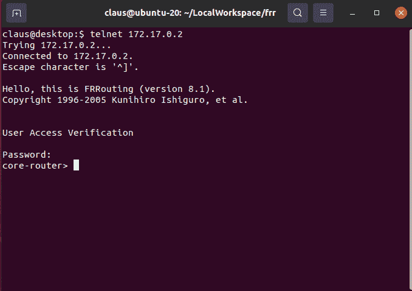

图 3.1 – 一个 FRR 路由器命令提示符示例

## 串行访问

网络设备通常有一个称为*控制台*或*串行控制台*的特殊端口。此端口通常配置为以较慢的速度运行，常见的配置将波特率设置为 9,600，有些设备能够接受高达每秒 115,200 位的速率。串行端口通常是一个**DB9**连接器或**RJ45**，具有**RS232**技术规范。*图 3.2*显示了用于 DB9 和 RJ45 串行控制台连接器的引脚示例。

处理串行端口的程序通常独立于设备的操作系统，允许在这种灾难性场景中使用此类端口：

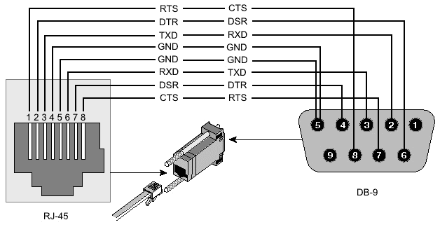

图 3.2 – 设备串行端口引脚配置示例

重要的是要注意，串行端口在以下情况下使用：

+   网络设备不可靠的极端情况

+   在技术人员在场的情况下进行本地维护

+   带有崩溃或操作系统删除风险的临界升级

+   操作系统或硬件故障

网络自动化应避免使用串行端口来配置设备，因为没有并行性（只有一个端口）且其速度有限。

## 远程不安全访问

由于之前解释的原因，串行端口速度较慢，不能并行使用。因此，访问网络设备的最佳方式是通过远程访问，这可以通过**Out-Of-Band**（**OOB**）或带内管理（在*第一章**中描述）来实现。

如何确定访问是否安全将取决于所使用的协议以及用于传输此远程访问的网络类型。如果通过 OOB 网络访问，通常它是安全的，并且具有分离和隔离的基础设施，但如果它是带内的，则需要特别注意以避免一些常见的安全漏洞。

### 不安全的应用和协议

以下应用程序通常未加密，容易被窃听、代理或劫持。

#### Telnet

Telnet 是一个使用 TCP 端口`23`来访问远程设备的应用程序。数据未加密，且连接上没有身份验证。在使用 Telnet 时，TCP 劫持和窃听是最常见的安全问题。为了确保这些威胁不存在，承载访问的网络路径必须得到保护或隔离。

Telnet 通常需要密码，有时还需要用户名。

#### RSH

`514`且不提供加密或密码。由于使用 IP 地址进行身份验证，此协议极其不安全，容易受到 IP 欺骗攻击。

如果不是因为其缺乏安全性，RSH 将是一个运行命令和创建网络自动化的快速且简单选项。

## 远程安全访问

为了确保远程访问安全，数据必须加密，主机需要某种基于身份的认证，以确保连接的人被允许连接。

用于远程 CLI 访问的最常用的应用程序是默认的`22`。

### 基于身份的认证

SSH 上的基于身份的认证基于 SHA-256（一种加密算法）的密钥指纹。当 SSH 首次使用时，SSH 会要求你确认指纹密钥，以确保你连接到的主机是正确的。此指纹的一个示例如图 3.3 所示：

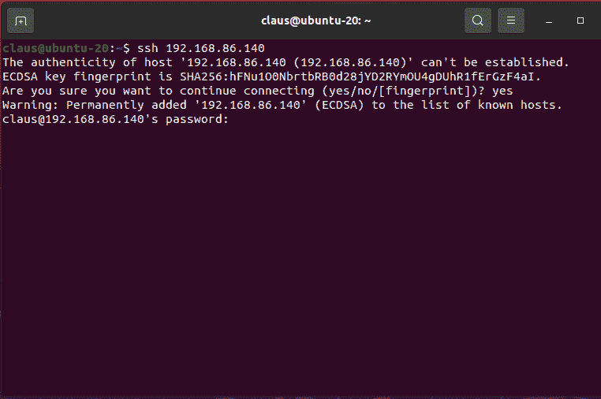

图 3.3 – SSH 指纹接受请求的示例

虽然 SSH 被认为是访问设备的加密应用程序协议，但基于身份的密钥指纹需要得到妥善管理，以避免最常见的攻击，即所谓的*中间人攻击*。这种攻击将流量重定向到另一个设备，假装它是终端设备，并使用此程序捕获最终目标网络设备的密码，如图 3.4 所示：

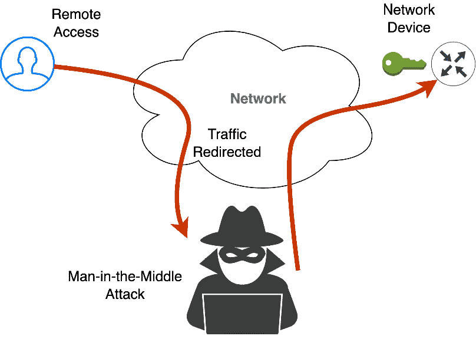

图 3.4 – 网络设备中间人攻击的示例

有几种方法可以避免中间人攻击：一种是确保网络设备有一个 ACL（在第一章中讨论，*第一章*），它可以过滤掉不属于管理的传入 IP。另一种是确保与请求远程访问的代理共享身份密钥管理。

为什么这很重要？因为网络自动化需要确保它使用一个安全的通道来修改网络，而密钥管理是网络操作员和网络自动化团队之间的共同责任。

这里是使用 CLI 进行网络自动化的优缺点：

**优点**:

+   几乎所有网络设备都支持

+   能够访问整个网络设备的操作系统

+   临界和特权访问

+   通过串行访问进行远程或本地访问，没有网络

**缺点**:

+   慢速

+   并行访问有限

+   如果使用不当，可能会允许黑客进行干扰

+   交互式，需要即时响应

+   数据信息没有结构化（如 JSON 或 XML），这使得它容易产生解释错误

总结本节，我们介绍了 CLI 的使用，CLI 是用于从网络设备收集信息的最老接口。我们还了解到，对于某些网络设备，CLI 是收集或配置设备的唯一方式。其中一个重要点是 CLI 始终存在于网络设备上。在下一节中，我们将看到如何改进网络设备的接口以收集网络信息，这被称为 SNMP。

# 使用 SNMP

**简单网络管理协议**（**SNMP**）可能是最古老和最常用的协议，用于从设备收集管理信息。SNMP 规范首次于 1998 年在 RFC 2261 中发布，旨在简单快捷。

## SNMP 代理和管理器

SNMP 定义了两个身份：

+   管理器（或服务器）

+   代理

代理通常是一个网络设备，而管理器是一个网络管理系统。

SNMP 使用 UDP 和 TCP 作为传输协议，端口为`161`和`162`。UDP 端口`161`用于按需收集或设置信息，其中管理器向代理发送请求。UDP 端口`162`用于无需管理器请求的异步操作。代理在必要时向服务器发送 UDP 数据包。这种方法称为 SNMP 陷阱，用于发送未经请求的消息，如警报或阈值违规。

## SNMP MIB

如*第一章*所述，**管理信息库**（**MIB**）用作访问网络信息变量的标识符。该标识符被称为**对象标识符**（**OID**），如*图 1.8*所示。

## SNMP 版本

SNMP 包含版本 1、版本 2c 和版本 3。它们在不同的时间发布，差异在于可用方法、传输协议、MIB 变量和加密。SNMP 代理向后兼容——因此，支持版本 3 的代理可以与所有版本一起工作。以下各节将总结每个版本。

### SNMPv1

这是第一个版本，包含了大多数 MIB 变量和方法。它基于 UDP，使用社区字符串作为身份验证。它只支持 32 位 MIB 计数器，这对于快速接口来说是一个问题，因为计数器会很快过期。

### SNMPv2c

引入了 64 位 MIB 变量计数器和`InformRequest`以及`GetBulkRequest`方法。由于安全复杂性，版本 2 没有被采用。随后发布了简化后的版本 2c，并得到了广泛接受。

### SNMPv3

引入了用于身份验证和隐私的加密。增加了`Report`方法。

## SNMP 原始方法

SNMP 本质上使用以下原始方法。

+   `GET`：从代理获取信息的方法：

    +   `GetRequest`：给定一个 OID，返回与之关联的变量

    +   `GetNextRequest`：给定 OID，返回与变量相关联的下一个 OID（用于 SNMP MIB 遍历功能）

    +   `GetBulkRequest`：给定 OID 基，返回此 OID 分支下的所有 OID 和变量（有时会导致无法中断的长响应）

+   `SET`：在代理程序上设置值的方 法：

    +   `SetRequest`：给定 OID 和值，在 MIB 上设置它

+   `Response`：`SET` 和 `GET` 的所有响应

+   `TRAP`：从代理程序发送到管理器的异步信息，包含 OID 和变量

+   `InformRequest`：用于发送带有确认的异步信息

## SNMP 安全问题

由于缺乏加密和认证，SNMPv1 和 v2 易受 IP 欺骗攻击，这允许黑客向代理发送 `SET` 请求，从而危害网络。历史上，由于这个安全问题，SNMP 不用于写入配置，而只使用 `GET` 方法或 `TRAP` 汇总配置。

这里列举了使用 SNMP 进行网络自动化的优缺点：

**优点**：

+   易于实现

+   快速

+   并行性容易

+   无特权访问

**缺点**：

+   需要汇总以频繁收集信息

+   通常不用于写入信息

+   与 CLI 相比，数据覆盖范围非常有限

+   写入时的安全问题

正如本节所述，SNMP 是网络管理中最古老且最健壮的协议。尽管它在写入配置方面存在安全和范围问题，但其协议轻量级、快速且易于阅读。下一节将介绍由 IETF 工作组开发的协议，以填补网络管理中配置方面的空白。它被称为 NETCONF。

# 使用 NETCONF

**网络配置协议**（**NETCONF**）是由 IETF 于 2006 年开发和标准化的网络管理协议。它提供了安装、操作和删除网络设备配置的机制。

NETCONF 操作是在 **远程过程调用**（**RPC**）层上实现的。NETCONF 协议使用基于 **可扩展标记语言**（**XML**）的数据编码来配置数据以及协议消息。协议消息也可以在安全的传输协议（如 SSH [RFC 6242]）或使用 TLS [RFC 7589] 上进行交换。

## 动机

直到 21 世纪初的早期，IETF 可用的唯一管理协议是 SNMP，该协议于 20 世纪 80 年代末期开发。很明显，尽管最初的目的如此，但 SNMP 并未用于配置网络设备，而主要用于收集网络设备信息（如我们之前所见）。原因多种多样，但主要是由于与 CLI 相比，SNMP 不安全且范围有限。

2002 年 6 月，网络管理社区和互联网架构委员会与网络关键运营商一起讨论了网络管理协议和使用的实际情况。这次会议的结果记录在 RFC 3535 中 ([`datatracker.ietf.org/doc/html/rfc3535`](https://datatracker.ietf.org/doc/html/rfc3535))。

结果表明，网络运营商并没有使用 SNMP，而是主要使用不同的专有 CLI 来配置他们的网络设备。原因多种多样，包括安全问题以及由于 SNMP 过于僵化而无法配置或编写配置的缺乏。

另一方面，在这个时候，Juniper Networks 已经开始使用基于 XML 的网络管理方法，这在 IETF 和网络运营商社区看来是一个结合力量的机会。这导致了 2003 年 5 月 NETCONF 工作组的成立。

2006 年 12 月，在 Juniper Networks 的大力帮助下，发布了第一个版本的基 NETCONF 协议，RFC 4741 ([`datatracker.ietf.org/doc/html/rfc4741`](https://datatracker.ietf.org/doc/html/rfc4741))。此后，在随后的几年中发布了几个扩展（RFC 5277、RFC 5717、RFC 6243、RFC 6470 和 RFC 6536 等）。NETCONF 的最后修订版记录在 RFC 6241 中，于 2011 年 6 月发布（由 RFC 7803 和 RFC 8526 更新）。

## OpenConfig

**OpenConfig**是一个由网络运营商组成的非正式工作组，他们共同的目标是通过采用 SDN 原则，如声明性配置和模型驱动的管理和操作，将我们的网络推向更动态、可编程的基础设施。

在 OpenConfig 中，我们的初步重点是编译一套一致的无厂商数据模型——用**Yet Another Next Generation** (**YANG**)编写——基于来自多个网络运营商的实际操作需求和需求。

## YANG

YANG 是一种数据建模语言，它被 NETCONF 协议所使用。YANG 可以用来建模网络设备中的配置数据和状态数据。它是一种模块化语言，以 XML 格式表示数据结构，但也可以用其他格式表示。

对于每个网络设备功能，至少有一个 RFC 使用 YANG 描述数据模型——例如，VRRP（在*第二章*）中描述了 RFC 8347 中的 YANG 数据模型 ([`datatracker.ietf.org/doc/html/rfc8347`](https://datatracker.ietf.org/doc/html/rfc8347))。另一个覆盖网络 ACLs 的努力（见*第一章*）描述了 RFC 8519 中的 YANG 模型 ([`datatracker.ietf.org/doc/html/rfc8519`](https://datatracker.ietf.org/doc/html/rfc8519))）。

让我们更仔细地考察 YANG 的特点和模型细节。

### 数据建模过程是困难的

需要理解的是，为路由器功能创建 YANG 数据模型不是一项容易的任务，因为它必须适应所有可能设备现有方法的可能场景。因此，这并不是从头开始，而是对已在多个供应商和设备中使用的功能进行建模的任务。让我们以一个例子为例 – 路由策略的 YANG 数据模型。如图 3.5 所示的时序图所示，这项工作始于 2015 年，经过 30 多个草案后，该标准终于在 2021 年 10 月发布，这意味着它几乎花了 7 年时间：

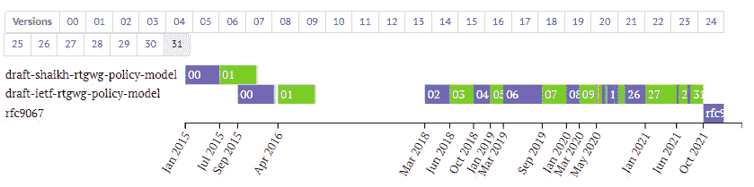

图 3.5 – 创建路由策略 YANG 数据模型的时序图

如果每个供应商都有自己的 YANG 数据模型会更容易，但那样就会消除通用依赖。

## NETCONF

NETCONF 使用基于 RPC 的客户端-服务器通信。使用 NETCONF，服务器配置存储在遵循 YANG 数据格式规范的 NETCONF 配置数据存储中。要更改或更新数据，客户端通过一种安全传输方法发送基于 XML 的远程过程调用，服务器以 XML 编码的数据回复。

NETCONF 有四个层次，如图 3.6 所示，摘自原始 RFC 6241：

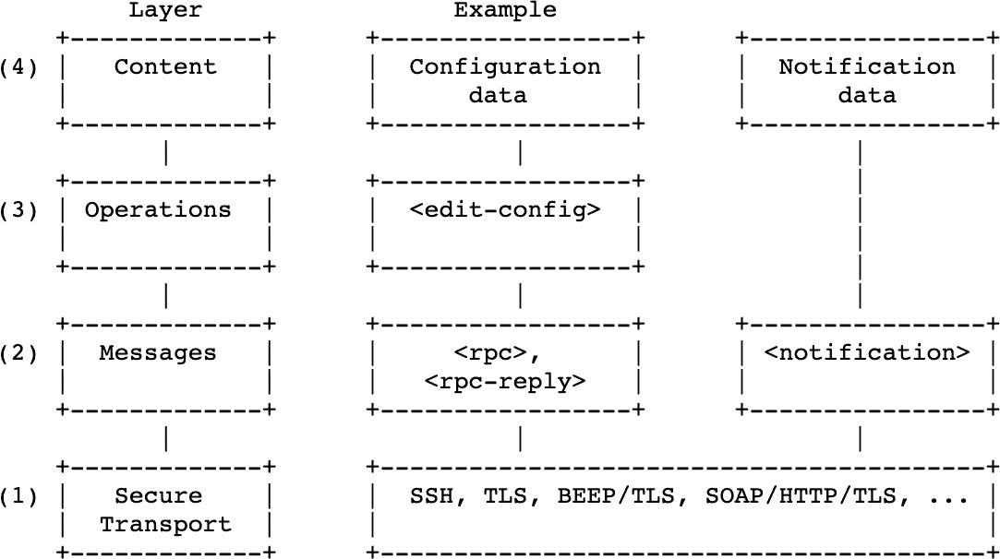

图 3.6 – RFC 6241 中描述的四个层次

让我们总结每一层：

+   **内容**层：由配置数据和通知数据组成。有效内容在 YANG 规范中定义。

+   `get`、`get-config`、`edit-config`、`copy-config`、`delete-config`、`lock`、`unlock`、`close-session` 和 `kill-session`。

+   来自客户端的 `<rpc>` 请求或来自服务器的 `<rpc-reply>`。RFC6241 还向此层添加了通知。

+   **安全传输**层：此层处理用于传输 NETCONF 消息的协议。SSH、TLS 和 HTTP 是与此层关联的几个协议。

## RESTCONF

RESTCONF 协议是在 RFC 8040 中定义的提议标准（[`www.rfc-editor.org/rfc/rfc8040.html`](https://www.rfc-editor.org/rfc/rfc8040.html)）。NETCONF 和 RESTCONF 在功能方面相似，但 RESTCONF 在 2017 年晚些时候出现，使用基于 HTTP 的 **表示状态转移**（**REST**）**API** 模型。它们都允许管理员使用客户端-服务器模型查询信息或修改设置。RESTCONF 在几个关键方面有所不同：

+   RESTCONF 使用 HTTP

+   RESTCONF 支持 JSON 和 XML

+   RESTCONF 没有事务的概念，因此没有像 NETCONF 那样的 `lock` 概念。

RESTCONF 并不打算取代 NETCONF。相反，它被创建出来，以便可以使用 RESTful API，该 API 可以用于使用 NETCONF 或 YANG 配置数据存储查询和配置设备。

*图 3.7* 展示了一个从 RFC 8040 中提取的表格，展示了 RESTCONF 和 NETCONF 调用的重叠：

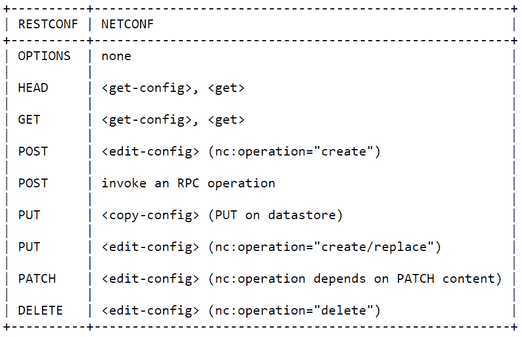

图 3.7 – 从 RFC 8040 中提取的 RESTCONF 和 NETCONF 方法的重叠

下面是使用 NETCONF 或 RESTCONF 的一些优缺点：

**优点**：

+   集成网络规范

+   IETF 标准

+   无特权访问

+   允许流事件通知

+   程序化设备配置

**缺点**：

+   YANG 没有涵盖所有设备功能

+   NETCONF 的采用速度非常慢

+   NETCONF 传输有限且实现过时

+   效率不高

本节总结了如何使用 NETCONF、RESTCONF 和 YANG 与网络设备进行交互。NETCONF 的事务状态使其成为网络配置的强大工具。尽管它基于良好的 IETF 标准，但 NETCONF 在处理一些我们想要的网络自动化任务（如以高频率收集数据）方面效率并不足够。在下一节中，我们将探讨一个名为 gRPC 的新协议。

# 采用 gRPC

**gRPC**于 2015 年作为一个开源 RPC 框架发布。由于它易于创建程序并添加方法以在网络上获取或设置配置，因此它是自动化中最有前途的协议之一。

gRPC 并不直接使用 TCP 进行传输，而是使用 HTTP/2，该协议于 2015 年发布，旨在克服 HTTP/1.1 的限制。虽然它与 HTTP/1.1 向后兼容，但 HTTP/2 带来了许多额外的先进功能，如下所示：

+   **二进制帧层**：请求和响应被划分为小消息并以二进制格式进行封装，使消息传输更高效

+   **双向全双工流**：在这里，客户端可以请求，服务器可以同时响应

+   **流控制（用于 HTTP/2）**：允许对网络缓冲区使用的内存进行详细控制

+   **头部压缩**：在发送之前，HTTP/2 中的所有内容（包括头部）都会进行编码，这显著提高了性能

+   **异步和同步处理**：可用于执行不同类型的交互和流式 RPC

所有这些 HTTP/2 的特性使得 gRPC 能够使用更少的资源，从而减少了客户端和服务器之间的响应时间。

为了确保 gRPC 的安全性，可以使用端到端加密的 TLS，并且可以使用 SSL 或 TLS 进行身份验证，无论是否基于令牌的身份验证或需要通过扩展提供的代码来定义自己的身份验证系统（更多关于身份验证的信息可以在[`grpc.io/docs/guides/auth/`](https://grpc.io/docs/guides/auth/)找到）。

## 字母 g

在协议的 1.0 版本中，字母*g*是对 gRPC 名称的递归引用，但随着后续版本的发布，又添加了另一个单词，使得名称成为了一点代码娱乐。例如，在 1.1 版本中，这个单词是*good*，在 1.2 版本中，它是*green*，而在 1.42 版本中，它是*granola*。用于字母*g*的完整名称列表可以在 gRPC 源代码中找到：[`grpc.github.io/grpc/core/md_doc_g_stands_for.html`](https://grpc.github.io/grpc/core/md_doc_g_stands_for.html).

## 动机

谷歌已经使用了一个名为**Stubby**的单个通用 RPC 基础设施，连接了在谷歌数据中心内部和跨数据中心运行的大量微服务超过十年。这促使谷歌发布并赞助了 gRPC 的创建。

2015 年 10 月 26 日星期一 gRPC 团队的信件

*gRPC 团队很高兴地宣布 gRPC Beta 的立即可用性。这次发布代表了 API 稳定性的重大进步，未来的大多数 API 更改都是添加性的。它为 gRPC 在生产环境中的应用打开了大门。*

*我们更新了 grpc.io 文档以反映最新的变化，并发布了特定语言的参考文档。在 GitHub 上 Java、Go 和其他所有语言的发布说明中，您可以找到有关更改的信息。*

*我们感谢所有贡献代码、进行演示、采用这项技术并参与社区的人。我们期待在您的支持下推出 1.0 版本！*

## 概述

gRPC 使用客户端和服务器应用程序的概念。客户端应用程序可以直接调用远程机器上的服务器应用程序，就像它们是本地对象一样。gRPC 基于定义一个服务和指定可以通过它们的参数和返回类型远程调用的方法的想法。服务器实现这个接口并运行 gRPC 服务器来处理客户端调用。客户端有一个存根（在某些语言中仅称为客户端），它提供了与服务器相同的方法。

在网络自动化的世界中，gRCP 客户端实际上是我们的自动化软件，而 gRPC 服务器是网络设备，如图*图 3.8*所示：

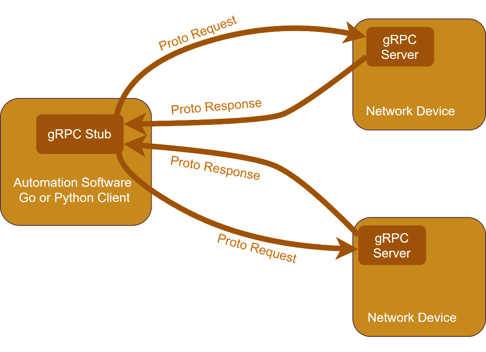

图 3.8 – gRPC 的基本请求和响应

gRPC 服务器和客户端不需要使用相同的编程语言。如今，有几种不同语言的实现，无论是 Go、Python、Java 还是 Ruby。支持的语言完整列表可以在这里找到：[`grpc.io/docs/languages/`](https://grpc.io/docs/languages/).

## Protobuf

默认情况下，gRPC 使用**协议缓冲区**（**Protobuf**），这是由谷歌创建的另一种用于序列化数据的开源机制。尽管 Protobuf 是默认的，但 gRPC 也可以使用 JSON，但那效率较低，我们将在后面看到。

Protobuf 是一种语言和平台无关的数据序列化机制，类似于 JSON 或 XML，但更小、更快、更简单。数据结构一旦定义，就使用特别生成的源代码来轻松地从各种数据流中用任何编程语言写入和读取这种结构化数据。

更多关于 Protobuf 的信息可以在这里找到：[`developers.google.com/protocol-buffers`](https://developers.google.com/protocol-buffers)。

## gRPC 和网络遥测

在我们的网络自动化工作中，我们将遇到一系列限制，尤其是在有效收集网络信息方面。因此，让我们探讨以下示例。

想象一个有 500 台设备的网络，每台设备平均有 50 个接口。每个接口需要收集多个变量，例如当前状态、错误率、丢弃计数、入包计数或出包计数。如果我们考虑一种保守的方法，例如每个接口只收集 10 个变量，对于这个网络示例，我们将从 10 个变量 x 50 个接口 x 500 台设备的信息中收集数据，总计 250,000 个变量。

另一点需要考虑的是数据的频率。在 90 年代，网络管理需要每 5 分钟从网络获取信息，这对于处理故障和故障排除来说是足够的，但如今，间隔要小得多。我们希望以每分钟不到 1 秒的间隔收集信息，理想情况下是每 30 秒或 10 秒。原因是当快速检测到故障时，故障排除和故障解决可以更快地进行。

因此，在我们的示例中，每 10 秒收集 250,000 个变量，使用传统的轮询机制（如 SNMP）会产生大量数据。然而，这里的一个重要观点是，变量的大部分内容可能根本不会改变，例如在没有流量时接口的计数器、接口状态没有变化时的接口状态、没有流量时的接口丢弃计数器，或者接口完全正常时的错误率。因此，网络变量的内容不会经常改变，这意味着轮询机制效率低下，并且随着时间的推移积累冗余信息。什么比轮询更好？流式遥测。流式遥测允许设备在变化发生时立即连续发送增量更新。这样，网络信息的收集可以比轮询更有效地进行。

gRPC 支持双向流，这使得该协议在数据收集方面比我们之前看到的其他协议具有巨大优势。

## 使用 gRPC 的代码示例

为了使示例更符合网络自动化的实际情况，让我们在路由器上设置一个可以返回以下信息的服务：

+   返回内存利用率（百分比）

+   返回 CPU 利用率（百分比）

+   返回路由器运行时间（秒）

我们的示例将创建一个客户端 gRPC 存根以与路由器通信，该路由器将作为 gRPC 服务器，如图 3.8 所示。我们只将演示客户端，并假设路由器上的 gRPC 服务器已经实现。

### Protobuf 文件

Protobuf 文件定义是代码的一个部分，它与任何语言无关。相同的文件定义在客户端和服务器上使用。它编译一次，为客户端和服务器程序提供解释用于生成 RPC 的数据。对于我们的示例，Protobuf 文件将如下所示：

```py
service RouterStatus {
  rpc GetStatus (StatusRequest) returns (StatusReply);
}
message StatusRequest {}
message StatusReply {
  double memory = 1;
  double cpu = 2;
  int32 uptime = 3;
} 
```

### 使用 Python 的示例

这里是一个使用 Python 的示例。导入名称`r_grpc`从 Protobuf 文件编译 Python 代码：

```py
import grpc
import routerstatus_pb2
import routerstatus_pb2_grpc as r_grpc
def run():
    address = "router:50051"
    with grpc.insecure_channel(address) as channel:
        stub = r_grpc.StatusStub(channel)
        r = stub.GetStatus(r_grpc.StatusRequest())
        print("Memory:{.2f}% CPU:{.2f}%, Uptime:{d}s\n".format(r.memory, r.cpu, r.uptime))
if __name__ == '__main__':
    run()
```

### 使用 Go 的示例

这里是一个使用 Go 程序客户端的示例。请注意，`pb`（在导入中使用）是针对 Protobuf 编译的代码：

```py
import (
    "context"
    "log"
    "time"
    "fmt"
    "google.golang.org/grpc"
    pb "example/routerstatus"
)
func main() {
    address = "router:50051"
    // Set up a connection to the server.
    conn, err := grpc.Dial(address, grpc.WithInsecure(), grpc.WithBlock())
    if err != nil {
        log.Fatalf("did not connect: %v", err)
    }
    c := pb.NewStatusClient(conn)
    ctx, cancel := context.WithTimeout(context.Background(), time.Second)
    defer cancel()
    r, err := c.GetStatus(ctx, &pb.StatusRequest{})
    if err != nil {
        log.Fatalf("could not get router status: %v", err)
    }
    fmt.Printf("CPU:%.2f%%, Memory:%.2f%%, Uptime:%ds", r.GetCpu(), r.GetMemory(), r.GetUptime())
}
```

使用 gRPC 进行网络自动化的优缺点如下：

**优点**：

+   安全

+   快速

+   并行处理很容易

+   无法进行特权访问

+   灵活，可以使用 gRPC 服务器暴露任何本地设备命令

**缺点**：

+   很少有网络设备具备 gRPC 功能

在本节中，我们了解到 gRPC 是一个用于网络自动化的强大协议。然而，它尚未很好地集成到网络设备中。大多数新的网络设备操作系统都自带这种功能。在下一节中，将使用一个名为 gNMI 的高级协议来更好地利用 gRPC 协议进行网络自动化。

# 使用 gNMI 操作

如前文所述，gRPC 可能是性能方面与设备协同工作的最合适的协议。然而，它实际上是一个通用的协议，可用于任何客户端和服务器交互——不仅限于网络设备，还包括计算机服务器。因此，**gRPC 网络管理接口**（**gNMI**）被创建出来。

gNMI 是由 OpenConfig 工作组创建的开源协议规范，用于使用 YANG（在*NETCONF*部分中讨论）与网络设备进行通信。换句话说，gNMI 是为了利用定义网络规范数据的人所做的良好工作而创建的，但使用的是更现代的协议 gRPC 而不是 NETCONF。

## 协议层

gNMI 使用 gRPC。为此，它必须将 YANG 数据描述转换为 Protobuf 以序列化通信，如图 3.9 所示。图的最底部是一个正常的基于 HTTP/2 和 TLS 的 gRPC 连接。gRPC 代码是从 gNMI Protobuf 模型自动生成的，gNMI 携带在 YANG 中建模的数据，可以支持像下面示例中的 JSON 编码。

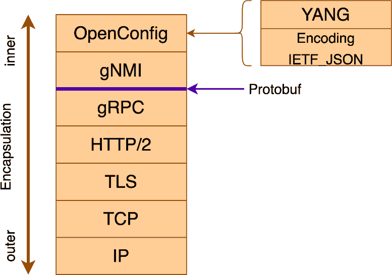

图 3.9 – gNMI 协议层

## 数据模型

gNMI 使用一种名为 `PathElem` 的数据模型消息。每个 `PathElem` 包含一个编码为字符串的名称。一个元素名称必须编码为 `PathElem` 可以选择指定一组键，指定为 `map<string,string>`（字典或映射）。

根路径 `/` 编码为零长度的 `PathElem` 消息数组（切片）。以下是在 Go 和 Python 中的示例声明：

+   `path := []*PathElem{}`

+   `path = []`

可以通过使用 `/` 分隔符连接前缀和路径的元素来形成可读的路径。

因此，让我们看看以下表示：`/interfaces/interface[name=Ethernet1/2/3]/state.`

这如下所示：

```py
<elem: <name: "interfaces”>elem: <name: "interface"key: <key: "name”value: "Ethernet1/2/3">>elem: <name: "state">>
```

## 通信模型

通信模型使用目标客户端如下：

+   **目标**：在 gNMI 中作为正在操作或收集的数据的所有者的设备。通常，这是我们的网络设备。

+   **客户端或收集器：** 使用 gNMI 查询或修改目标上的数据或作为流数据的收集器的系统。通常，这是网络管理系统或我们的自动化代码。

与 gRPC 类似，服务器实际上位于网络设备上，如 *图 3.10* 所示：

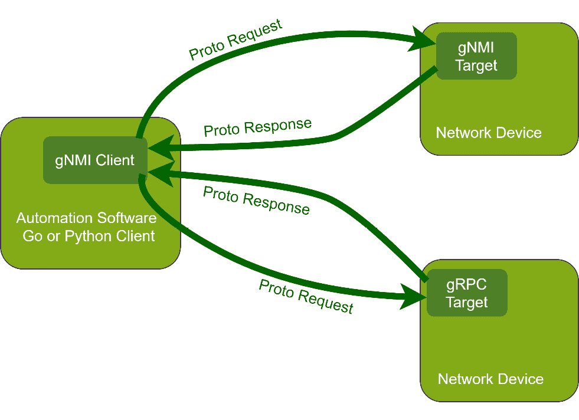

图 3.10 – gNMI 目标和客户端通信

## 服务定义

gNMI 服务基于名为 `Capabilities`、`Get`、`Set` 和 `Subscribe` 的 RPC 调用，这些将在以下章节中详细介绍。

### 功能 RPC

客户端可以使用 `CapabilityRequest` 消息来发现目标的功能。客户端发送此消息以查询目标。然后，目标必须回复一个包含其 gNMI 服务版本、它支持的数据模型版本以及支持的数据编码的 `CapabilityResponse` 消息。这些信息用于客户端后续的 RPC 消息，以指示客户端将用于 `Get` 和 `Subscribe` RPC 调用的模型集以及用于数据的编码。

### 获取 RPC

向目标发送 `GetRequest` 消息，指定要检索的路径。在接收到 `GetRequest` 消息后，目标序列化请求的路径并返回一个 `GetResponse` 消息。此连接是短暂的，目标在传输 `GetResponse` 消息后关闭 `Get` RPC。

### 设置 RPC

通过向目标发送 `SetRequest` 消息来对目标的状态进行修改，以指示它希望进行的修改。

接收 `SetRequest` 消息的目标会处理其中指定的操作，这些操作被视为一个事务。作为对 `SetRequest` 消息的响应，目标必须回复一个 `SetResponse` 消息。对于 `SetRequest` 消息中指定的每个操作，必须在 `SetResponse` 的响应字段中包含一个 `UpdateResult` 消息。

### 订阅 RPC

这可能是 gNMI 上最重要的调用，因为它允许流式遥测，正如之前讨论的那样。

当客户端希望接收有关目标上数据实例状态更新的信息时，它通过 **Subscribe RPC** 创建一个订阅。订阅由一个或多个路径组成，并指定了订阅模式。每个订阅的模式决定了从目标发送到客户端的数据更新的触发器。

所有新的订阅请求都被封装在一个`SubscribeRequest`消息中，该消息本身有一个模式，描述了订阅的持久性。客户端可以创建一个订阅，该订阅有一个专门的流来返回一次性数据（`ONCE`）；一个利用流来定期请求一组数据的订阅（`POLL`）；或者一个长期存在的订阅，根据单个订阅模式中指定的触发器流式传输数据（`STREAM`）。对于流式遥测，模式设置为`STREAM`。

## gNMI-gateway

**gNMI-gateway** 是由 Netflix 最初开发的开源软件，后来作为 OpenConfig 工作组的一部分发布，用于从网络设备收集和分发基于 OpenConfig 模式的 gNMI 数据。

创建 gNMI-gateway 的动机多种多样，如下所述：

+   首先，可用的开源服务不多，无法消费和分发基于 OpenConfig 模式的 gNMI 流式遥测数据。

+   第二，使用 gNMI 数据流进行客户端和目标连接的容错性不足，使得流式遥测容易受到威胁。当客户端崩溃时，流式数据会丢失，直到另一个订阅发生。

+   第三是缺乏支持多个消费者的功能。如果公司内的多个部门需要从网络设备或一组网络设备获取数据，那么所有这些部门都需要向目标发送订阅。在 gNMI-gateway 的集群功能和复制功能下，可以避免不必要地重复连接到目标，并向多个客户提供相同的数据。

+   第四，缺乏将 gNMI 客户端与非 gNMI 客户端统一的功能。gNMI-gateway 允许 gNMI 客户端或非 gNMI 客户端收集信息。

*图 3.11* 展示了 gNMI 客户端和非 gNMI 客户端（也称为导出器）的单个实例。**Apache Kafka** ([`kafka.apache.org/`](https://kafka.apache.org/)) 是可以用来作为导出器的一种软件；另一个已经实现的是 **Prometheus** ([`prometheus.io/`](https://prometheus.io/))：

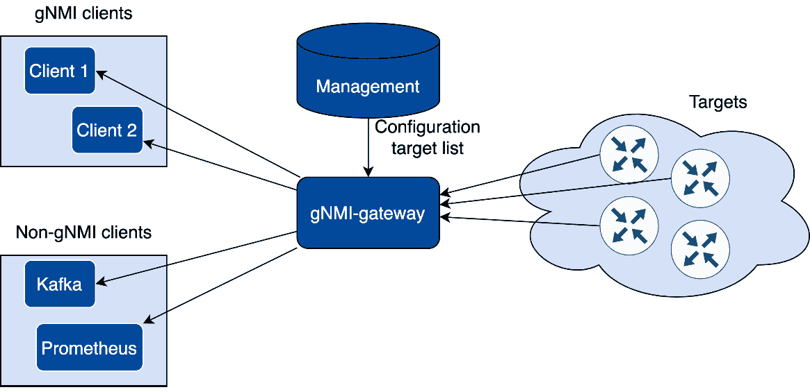

图 3.11 – gNMI-gateway 的单个实例

通过使用多个 gNMI-gateway 实例来获得冗余，这些实例是通过使用**Apache Zookeeper** ([`zookeeper.apache.org/`](https://zookeeper.apache.org/))实现的，如图*图 3.12*所示。如果只有一个实例正在运行，则不需要使用 Apache Zookeeper：

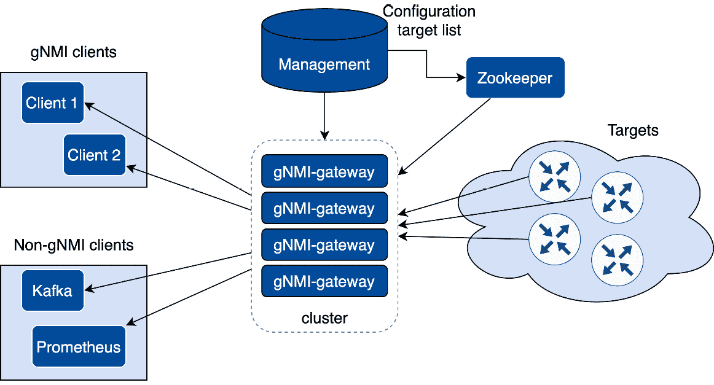

图 3.12 – gNMI-gateway 的多个实例

更多关于 gNMI-gateway 的信息可以在这里找到：[`github.com/openconfig/gnmi`](https://github.com/openconfig/gnmi)。

作为参考，以下是 2020 年 NANOG 网络广播中展示的关于 gNMI-gateway 的完整演示：[`nanog.org/news-stories/nanog-tv/nanog-80-webcast/gnmi-gateway/`](https://nanog.org/news-stories/nanog-tv/nanog-80-webcast/gnmi-gateway/)。

重要提示

gNMI 的完整规范可以在这里找到：[`github.com/openconfig/reference/blob/master/rpc/gnmi/gnmi-specification.md`](https://github.com/openconfig/reference/blob/master/rpc/gnmi/gnmi-specification.md)。

下面是使用 gNMI 进行网络自动化的优缺点：

**优点**:

+   安全

+   快速

+   并行化很容易

+   不可能获得特权访问

+   集成了网络 YANG 规范

+   允许轻松进行流式遥测

+   能够添加具有完全冗余的 gNMI-gateway

**缺点**:

+   并非许多网络设备都具备 gNMI 功能

# 摘要

在本章中，我们介绍了软件工程师用来与网络设备交互的主要方法。可用的方法并不多，所以我假设在写作时我们已经覆盖了大约 99.9%的所有现有方法。

使用本章提供的信息，您可以选择将哪种方法或哪些方法纳入您的网络自动化代码。在大多数情况下，您无法仅使用一种方法覆盖所有场景；您可能需要结合两种或更多方法。

下一章将探讨如何使用文件来定义网络。我们将讨论每种可用文件类型的优缺点。
