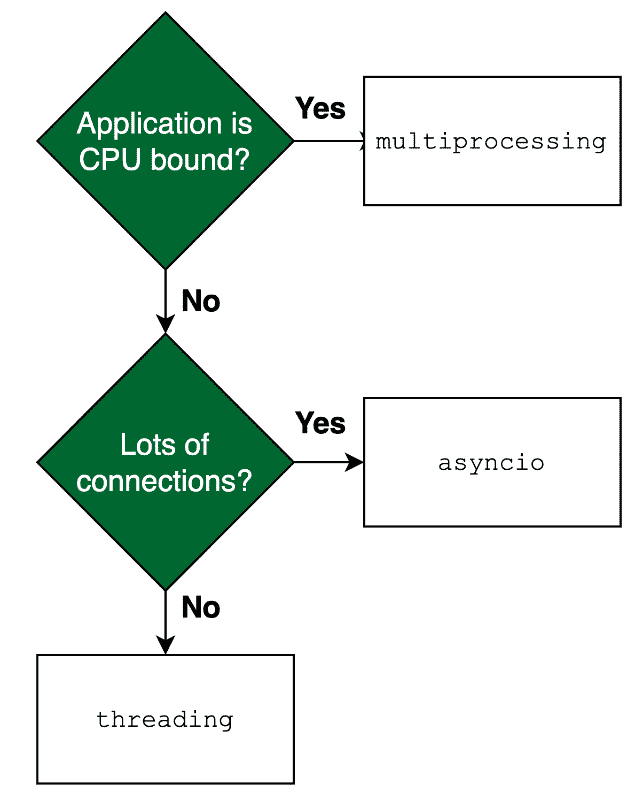

# 第八章：规模化你的代码

现在我们已经知道了如何与网络设备交互，我们应该开始考虑构建一个可扩展的解决方案。但我们为什么需要扩展我们的代码呢？你可能认为答案很明显，那就是因为它将允许你的解决方案随着网络的增长而轻松增长。但扩展不仅仅是关于向上扩展，还包括向下扩展。因此，扩展你的代码意味着你将构建一个能够轻松跟随需求的解决方案，在不需要时节省资源，在需要时使用更多资源。

在编写代码之前，你应该考虑在你的网络自动化解决方案中添加扩展功能。它应该在设计时间规划，并在开发时间执行。扩展功能必须是构建解决方案的要求之一。它还应该在实施和测试期间成为一个明确的里程碑。

在本章中，我们将检查一些今天用来有效扩展和缩小代码的技术。这将使你的解决方案能够轻松适应网络增长，并在必要时轻松缩小规模以节省资源。

我们将在本章中涵盖以下主题：

+   处理多任务、线程和协程

+   添加调度器和作业分配器

+   使用微服务和容器

到本章结束时，你应该有足够的信息来为你的代码选择最佳的扩展解决方案。

# 技术要求

本章中描述的源代码存储在 GitHub 仓库[`github.com/PacktPublishing/Network-Programming-and-Automation-Essentials/tree/main/Chapter08`](https://github.com/PacktPublishing/Network-Programming-and-Automation-Essentials/tree/main/Chapter08)。

# 处理多任务、线程和协程

多任务，正如其名所示，是指同时执行多个任务的能力。在计算机中，任务也被称为作业或进程，并且有不同技术在同时运行任务。

同时运行代码的能力允许你的系统在必要时进行扩展和缩小。如果你需要与更多的网络设备通信，只需并行运行更多的代码；如果你需要较少的设备，只需运行较少的代码。这将使你的系统能够进行扩展和缩小。

但是并行运行代码将对可用的机器资源产生影响，其中一些资源将受到你的代码如何消耗它们的影响而受限。例如，如果你的代码正在使用网络接口下载文件，并且运行一行代码就已经消耗了网络接口的 50 Mbps（即 100 Mbps 接口的 50%），那么不建议并行运行多行代码以增加速度，因为限制在于网络接口，而不是 CPU。

在并行运行代码时，还需要考虑其他因素，即除了网络之外的共享资源，例如 CPU、磁盘和内存。在某些情况下，磁盘的瓶颈可能会对代码并行性造成比 CPU 更多的限制，尤其是在使用通过网络挂载的磁盘时。在其他情况下，一个消耗大量内存的大程序可能会因为缺乏可用内存而阻塞任何其他并行运行的程序。因此，你的进程将接触到的资源以及它们之间的交互将影响并行化的程度。

在这里我们需要明确一点，即术语 **I/O**，它是计算机 **输入/输出** 的缩写。I/O 用于指定机器的 CPU 与外部世界之间的任何通信，例如访问磁盘、写入内存或将数据发送到网络。如果你的代码需要大量的外部访问，并且大多数时间都在等待外部通信的响应，我们通常说代码是 **I/O 密集型**。当访问远程网络和在某些情况下远程磁盘时，可以找到慢速 I/O 的例子。另一方面，如果你的代码需要的 CPU 计算比 I/O 更多，我们通常说代码是 **CPU 密集型**。大多数网络自动化系统将是 I/O 密集型的，因为网络设备访问。

现在我们来探讨一些在 Go 和 Python 中同时运行代码的技术。

## 多进程

在计算机中，当一个程序被加载到内存中运行时，它被称为进程。程序可以是脚本或二进制文件，但通常由一个单独的文件表示。这个文件将被加载到内存中，并且操作系统将其视为一个进程。同时运行多个进程的能力称为多进程，这通常由操作系统管理。

运行进程的硬件的 CPU 数量与多进程能力无关。操作系统负责为所有已加载到内存中并准备运行的进程分配 CPU 时间。然而，由于 CPU 数量、CPU 速度和内存有限，可以同时运行的进程数量也将有限。通常，这取决于进程的大小以及它消耗的 CPU 资源。

在大多数计算机语言中，多进程是通过操作系统实现的 `fork()` 系统调用来创建当前运行进程的完整副本来实现的。

让我们研究一下如何在 Go 和 Python 中使用多进程。

### Python 中的多进程

在 Python 中，多进程是通过标准库 `multiprocessing` 实现的。Python `multiprocessing` 的完整文档可以在 [docs.python.org/3/library/multiprocessing](http://docs.python.org/3/library/multiprocessing) 找到。

在第一个示例中，我们将使用操作系统的程序`ping`来针对一个网络节点。然后，我们将使其对多个目标并行化。

以下是一个针对单个目标网络节点的示例：

```py
import subprocess
TARGET = "yahoo.com"
command = ["ping", "-c", "1", TARGET]
response = subprocess.call(
    command,
    stdout=subprocess.DEVNULL,
)
if response == 0:
    print(TARGET, "OK")
else:
    print(TARGET, "FAILED")
```

需要注意的是，从 Python 调用`ping`效率不高。它将导致更多的开销，因为 Python 将不得不调用一个位于文件系统中的外部程序。为了使示例更高效，我们需要使用 ICMP 的`echo request`并从 Python 网络套接字接收 ICMP 的`echo reply`，而不是调用外部程序，如`ping`。一个解决方案是使用名为`pythonping`的 Python 第三方库([`pypi.org/project/pythonping/`](https://pypi.org/project/pythonping/))。但有一个注意事项：`ping`程序被设置为`setuid`，允许非特权用户发送 ICMP 数据包。因此，为了使用`pythonping`运行，你需要管理员/根权限（在 Linux 中使用`sudo`完成）。

以下是一个使用`pythonping`针对单个目标网络节点的相同示例：

```py
import pythonping
TARGET = "yahoo.com"
response = pythonping.ping(TARGET, count=1)
if response.success:
    print(TARGET, "OK")
else:
    print(TARGET, "FAILED")
```

运行此程序应该会生成以下输出：

```py
% sudo python3 single-pyping-example.py
yahoo.com OK
```

如果你想要向多个目标发送 ICMP 请求，你必须一个接一个地顺序发送。然而，一个更好的解决方案是使用`multiprocessing` Python 库并行运行它们。以下是一个使用`multiprocessing`的四个目标的示例：

```py
from pythonping import ping
from multiprocessing import Process
TARGETS = ["yahoo.com", "google.com", "cisco.com", "cern.ch"]
def myping(host):
    response = ping(host, count=1)
    if response.success:
        print("%s OK, latency is %.2fms" % (host, response.rtt_avg_ms))
    else:
        print(host, "FAILED")
def main():
    for host in TARGETS:
        Process(target=myping, args=(host,)).start()
if __name__ == "__main__":
    main()
```

如果你运行先前的程序，你应该得到类似于以下输出的结果：

```py
% sudo python3 multiple-pyping-example.py
google.com OK, latency is 45.31ms
yahoo.com OK, latency is 192.17ms
cisco.com OK, latency is 195.44ms
cern.ch OK, latency is 272.97ms
```

注意，每个目标的响应不依赖于其他目标的响应。因此，输出应该始终按从低延迟到高延迟的顺序排列。在先前的示例中，`google.com`首先完成，显示延迟仅为 45.31 毫秒。

重要提示

在`main()`函数或从`main()`函数调用的函数中调用`multiprocessing`是很重要的。同时，确保`main()`可以被 Python 解释器安全导入（使用`__name__`）。你可以在[`docs.python.org/3/library/multiprocessing.html#multiprocessing-programming`](https://docs.python.org/3/library/multiprocessing.html#multiprocessing-programming)找到更多关于为什么需要这样做的细节。

除了先前的使用`Process()`的示例之外，Python 还有其他方法可以调用代码并行性，称为`multiprocessing.Pool()`和`multiprocessing.Queue()`。`Pool()`类用于实例化一个工作池，它可以执行工作而无需相互通信。当需要进程间通信时使用`Queue()`类。更多关于这方面的信息可以在[`docs.python.org/3/library/multiprocessing.html`](https://docs.python.org/3/library/multiprocessing.html)找到。

让我们看看如何在 Go 语言中使用多进程。

### Go 语言中的多进程

要从程序中创建进程，你需要将当前运行程序的数据复制到一个新进程中。这就是 Python 的`multiprocessing`所做的事情。然而，Go 实现并行化的方式非常不同。Go 被设计成与协程类似的工作方式，它们被称为 goroutines，它们在运行时管理并行性。由于 goroutines 效率更高，因此不需要在 Go 中原生实现多进程。

注意，使用`exec`库，通过调用`exec.Command()`然后`Cmd.Start()`和`Cmd.Wait()`，可以同时创建多个进程，但这是对操作系统的调用以执行外部程序。因此，它不被视为原生多进程，并且效率不高。

由于这些原因，我们在 Go 中没有多进程的示例。

让我们看看我们是如何进行多线程的。

## 多线程

在计算机语言中，线程是进程的一个较小部分，它可以有一个或多个线程。在同一个进程中的线程之间共享内存，与不与其他进程共享内存的进程相对。因此，线程被称为轻量级进程，因为它需要的内存更少，并且进程内线程之间的通信更快。因此，与创建新进程相比，创建新线程要快得多。

具有多线程能力的 CPU 是能够通过提供指令级并行性或线程级并行性，在单个核心中运行多个线程的 CPU。这种能力也被称为**同时** **多线程** (**SMT**)。

SMT 的一个例子是 Intel CPU i9-10900K，它有 10 个核心，每个核心可以同时运行 2 个线程，这允许最多 20 个同时线程。Intel 为 SMT 创建了一个商标名称，他们称之为**超线程**。通常，AMD 和 Intel x86 CPU 架构每个核心可以运行多达两个线程。

相比之下，Oracle SPARC M8 处理器有 32 个核心，每个核心可以运行 8 个线程，允许惊人的 256 个同时线程。更多关于这个惊人的 CPU 的信息可以在[`www.oracle.com/us/products/servers-storage/sparc-m8-processor-ds-3864282.pdf`](https://www.oracle.com/us/products/servers-storage/sparc-m8-processor-ds-3864282.pdf)找到。

但要使 CPU 通过线程发挥最佳性能，还需要两个其他要求，一个是允许 CPU 级多线程的操作系统，以及一个允许创建同时线程的计算机语言。

让我们看看我们如何在 Python 中使用多线程。

### Python 中的多线程

多线程是 Python 的阿喀琉斯之踵。主要原因在于 Python 解释器 CPython（在第六章中讨论）使用全局解释器锁（GIL）来确保线程安全。这导致的结果是在多线程 CPU 上不允许 Python 代码同时运行多个线程。GIL 还增加了开销，并且当需要更多的 CPU 工作时，使用多线程可能比使用多进程慢。

因此，在 Python 中，对于 CPU 密集型的程序，不建议使用多线程。对于网络和其他 I/O 密集型的程序，多线程可能更快地启动，更容易通信，并且可以节省运行时内存。但需要注意的是，使用 CPython 解释器时，一次只能运行一个线程，所以如果你需要真正的并行性，请使用`multiprocessing`库。

在 Python 中，标准库通过使用名为`threading`的库提供了多线程功能。因此，让我们通过使用与上一节代码示例中相同的 ICMP 测试目标，在 Python 中创建一个使用多线程的示例。以下是一个使用 ICMP 但使用线程的相同示例：

```py
from pythonping import ping
import threading
TARGETS = ["yahoo.com", "google.com", "cisco.com", "cern.ch"]
class myPing(threading.Thread):
    def __init__(self, host):
        threading.Thread.__init__(self)
        self.host = host
    def run(self):
        response = ping(self.host)
        if response.success:
            print("%s OK, latency is %.2fms" % (self.host, response.rtt_avg_ms))
        else:
            print(self.host, "FAILED")
def main():
    for host in TARGETS:
        myPing(host).start()
if __name__ == "__main__":
    main()
```

运行前一个程序的输出将如下所示：

```py
% sudo python3 threads-pyping-example.py
google.com OK, latency is 36.21ms
yahoo.com OK, latency is 136.16ms
cisco.com OK, latency is 144.67ms
cern.ch OK, latency is 215.81ms
```

如你所见，使用`threading`和`multiprocessing`库的输出相当相似，但哪一个运行得更快？

现在我们运行一个测试程序来比较使用`threading`和`multiprocessing`进行 ICMP 测试的速度。这个程序的源代码包含在本章的 GitHub 仓库中。程序的名字是`performance-thread-process-example.py`。

这是这个程序运行 10、20、50 和 100 个 ICMP 探测的结果：

```py
% sudo python3 performance-thread-process-example.py 10
Multi-threading test --- duration 0.015 seconds
Multi-processing test--- duration 0.193 seconds
% sudo python3 performance-thread-process-example.py 20
Multi-threading test --- duration 0.030 seconds
Multi-processing test--- duration 0.315 seconds
% sudo python3 performance-thread-process-example.py 50
Multi-threading test --- duration 2.095 seconds
Multi-processing test--- duration 0.765 seconds
% sudo python3 performance-thread-process-example.py 100
Multi-threading test --- duration 2.273 seconds
Multi-processing test--- duration 1.507 seconds
```

如前所述的输出所示，在 Python 中运行多线程对于一定数量的线程来说可能更快。然而，当我们接近数字 50 时，它变得不那么有效，运行速度也大大减慢。重要的是要注意，这取决于你运行代码的位置。在 Windows 上运行的 Python 解释器与 Linux 或 macOS 上的不同，但总体思路是相同的：更多的线程意味着 GIL（全局解释器锁）有更多的开销。

建议除非你正在启动少量线程并且不是 CPU 密集型的，否则不要使用 Python 多线程。

重要提示

由于 CPython GIL 的存在，Python 中无法运行并行线程。因此，如果你的程序是 CPU 密集型的并且需要 CPU 并行性，那么应该使用`multiprocessing`库而不是`threading`库。更多详情可以在[docs.python.org/3/library/threading](http://docs.python.org/3/library/threading)中找到。

但如果你仍然想使用 Python 进行多线程，还有一些其他 Python 解释器可能提供一些功能。一个例子是`threading`模块。使用 PyPy-STM，可以同时运行线程，但你将不得不使用`transaction`模块，特别是`TransactionQueue`类。有关使用 PyPy-STM 进行多线程的更多信息，请参阅[doc.pypy.org/en/latest/stm.html#user-guide](http://doc.pypy.org/en/latest/stm.html#user-guide)。

现在，让我们看看如何在 Go 中实现多线程。

### Go 中的多线程

在 Go 中编写可扩展的代码不需要创建线程或进程。Go 通过 goroutines 实现了并行性，goroutines 被 Go 运行时作为线程呈现给操作系统。Goroutines 将在下一节中更详细地解释，该节将讨论协程。

我们还将看到如何使用协程同时运行多行代码。

## 协程

术语*协程*最早在 1958 年由 Melvin Conway 和 Joel Erdwinn 提出。然后，这个想法在 1963 年发表在*ACM*杂志上的一篇论文中被正式介绍。

尽管这个术语非常古老，但它的采用是在一些现代计算机语言中后来的事情。协程本质上是可以挂起的代码。这个概念类似于线程（在多线程中），因为它是一小部分代码，有自己的局部变量和栈。但多任务系统中线程和协程的主要区别在于线程可以并行运行，而协程是协作的。有些人喜欢将这种区别描述为任务并发和任务并行之间的区别。

这里是来自*Oracle Multithreaded Programming Guide*的定义：

*在单处理器上的多线程进程中，处理器可以在线程之间切换执行资源，从而实现并发执行。并发表示多个线程正在取得进展，但实际上线程并不是同时运行的。线程之间的切换发生得足够快，以至于线程可能看起来是同时运行的。在共享内存的多处理器环境中的相同多线程进程中，进程中的每个线程都可以在不同的处理器上并发运行，从而实现并行执行，这是真正的*同时执行*。*

源代码可以在[`docs.oracle.com/cd/E36784_01/html/E36868/mtintro-6.html`](https://docs.oracle.com/cd/E36784_01/html/E36868/mtintro-6.html)找到。

那么，现在让我们来看看如何在 Python 和 Go 中使用协程。

### 在 Python 中添加协程

Python 最近将协程添加到标准库中。它们是名为`asyncio`的模块的一部分。因此，你不会在 Python 的旧版本中找到这种功能；你需要至少 Python 版本 3.7。

但我们何时在 Python 中使用协程呢？最适合的情况是需要大量 I/O 绑定的并行任务，例如网络。对于 CPU 密集型应用程序，始终建议使用`multiprocessing`。

与`threading`相比，`asyncio`对我们的网络自动化工作更有用，因为它与 I/O 绑定，并且比使用`threading`扩展得更好。此外，它甚至比线程和进程更轻量。

然后，让我们使用 Python 中的协程创建相同的 ICMP 探测测试。以下是在之前示例中使用的相同网络目标的代码示例（你可以在本书的 GitHub 仓库中的`Chapter08/Python/asyncio-example.py`找到此代码）：

```py
from pythonping import ping
import asyncio
TARGETS = ["yahoo.com", "google.com", "cisco.com", "cern.ch"]
async def myping(host):
    response = ping(host)
    if response.success:
        print("%s OK, latency is %.3fms" % (host, response.rtt_avg_ms))
    else:
        print(host, "FAILED")
async def main():
    coroutines = []
    for target in TARGETS:
        coroutines.append(
            asyncio.ensure_future(myping(target)))
    for coroutine in coroutines:
        await coroutine
if __name__ == "__main__":
    asyncio.run(main())
```

运行前面的程序示例将生成以下输出：

```py
% sudo python3 asyncio-example.py
yahoo.com OK, latency is 192.75ms
google.com OK, latency is 29.93ms
cisco.com OK, latency is 162.89ms
cern.ch OK, latency is 339.76ms
```

注意，现在打印出的第一个 ping 回复实际上并不是延迟最低的那个，这表明程序是顺序运行的，遵循循环中`TARGETS`变量的顺序。这意味着当协程被阻塞时，并没有挂起以允许其他协程运行。因此，如果我们想要扩展，这不是一个很好的使用协程的例子。这是因为示例中使用的库是`pythonping`，它不是`asyncio`兼容的，并且在等待网络 ICMP 响应时不会挂起协程。

我们添加这个例子是为了展示使用与`asyncio`不兼容的代码的协程是多么糟糕。为了解决这个问题，现在让我们使用一个与`asyncio`兼容的第三方库来进行 ICMP 探测，这个库叫做`aioping`。

以下代码仅显示了导入更改，将`pythonping`替换为`aioping`，以及`myping()`函数的更改，我们在`ping()`函数前添加了一个`await`语句。另一个区别是`aioping`使用异常`TimeoutError`来检测 ICMP 请求的非响应：

```py
from aioping import ping
async def myping(host):
    try:
        delay = await ping(host)
        print("%s OK, latency is %.3f ms" % (host, delay * 1000))
    except TimeoutError:
        print(host, "FAILED")
```

之前显示的修复后的完整程序可以在本书的 GitHub 仓库中找到，位于`Chapter08/Python/asyncio-example-fixed.py`。

如果你现在运行这个代码并修复了它，它应该会显示类似以下输出：

```py
% sudo python3 asyncio-example-fixed.py
google.com OK, latency is 40.175 ms
cisco.com OK, latency is 170.222 ms
yahoo.com OK, latency is 181.696 ms
cern.ch OK, latency is 281.662 ms
```

注意，现在，输出是基于目标响应 ICMP 请求的速度，输出不遵循之前示例中的`TARGETS`列表顺序。

之前代码中的重要区别是在`ping`之前使用`await`，这向 Python `asyncio`模块指示协程可能会停止并允许另一个协程运行。

现在，你可能想知道，你是否可以在不使用新库`aioping`的情况下，只需在`pythonping`库中的`ping`语句前添加`await`。但这是不会工作的，并会生成以下异常：

```py
TypeError: object ResponseList can't be used in 'await' expression
```

这是因为`pythonping`库与`asyncio`模块不兼容。

当你需要运行大量任务时，请使用`asyncio`，因为将协程用作任务非常便宜，比进程和线程更快更轻量。然而，要利用协程的并发性，你的应用程序必须是 I/O 密集型的。访问网络设备就是一个慢速 I/O 密集型应用程序的例子，可能非常适合我们的网络自动化案例。

重要提示

为了在 Python 中高效使用协程，你必须确保当 I/O（如网络）等待时，协程会挂起执行，以便其他协程可以运行。这通常通过名为`await`的`asyncio`语句来指示。确实，在你的协程中使用第三方库需要与`asyncio`兼容。由于`asyncio`模块相当新，与`asyncio`兼容的第三方库并不多。如果没有这种兼容性，你的代码将顺序而不是并发地运行协程，使用`asyncio`将不是一个好主意。

让我们看看协程在 Go 语言中的应用。

### Go 中的协程

Go 语言很特别，在需要代码与性能一起扩展时表现得最好，而在 Go 中，这是通过 goroutine 实现的。

Goroutine 与协程不同，因为它们可以像线程一样并行运行。但它们也不像线程，因为它们更小（从 Go 版本 1.4 开始，仅占用 8 KB）并且使用通道进行通信。这可能会让人一开始感到困惑，但我向你保证，goroutine 并不难理解和使用。实际上，与 Python 中的协程相比，它们更容易理解和使用。

自 Go 版本 1.14 以来，goroutine 是通过异步可抢占式调度实现的。这意味着任务不再受开发者的控制，而是完全由 Go 的运行时管理（你可以在[`go.dev/doc/go1.14#runtime`](https://go.dev/doc/go1.14#runtime)找到详细信息)。Go 的运行时负责向操作系统展示将要运行的线程，在某些情况下，这些线程可以同时运行。

Go 的运行时负责创建和销毁与 goroutine 对应的线程。当使用原生多线程语言由操作系统实现时，这些操作会更重，但在 Go 中，它们很轻，因为 Go 的运行时维护了一个线程池供 goroutine 使用。Go 的运行时控制 goroutine 和线程之间的映射，使得操作系统完全不知道 goroutine 的存在。

总结来说，Go 不使用协程，而是使用 goroutine，它们与协程不同，更像是协程和线程的结合，性能优于两者。

现在我们通过一个使用 goroutine 的简单 ICMP 探测示例来了解一下：

```py
import (
    "fmt"
    "time"
    "github.com/go-ping/ping"
)
func myPing(host string) {
    p, err := ping.NewPinger(host)
    if err != nil {
        panic(err)
    }
    p.Count = 1
    p.SetPrivileged(true)
    if err = p.Run(); err != nil {
        panic(err)
    }
    stats := p.Statistics()
    fmt.Println(host, "OK, latency is", stats.AvgRtt)
}
func main() {
    targets := []string{"yahoo.com", "google.com", "cisco.com", "cern.ch"}
    for _, target := range targets {
        go myPing(target)
    }
    time.Sleep(time.Second * 3) //Wait 3 seconds
}
```

如果你运行这个程序，它应该输出类似以下内容：

```py
$ go run goroutine-icmp-probe.go
google.com OK, latency is 15.9587ms
cisco.com OK, latency is 163.6334ms
yahoo.com OK, latency is 136.3522ms
cern.ch OK, latency is 225.0571ms
```

要使用 goroutine，你只需要在你想作为 goroutine 调用的函数前加上`go`。`go`语句表示该函数可以在后台执行，拥有自己的栈和变量。然后程序执行`go`语句之后的行，并正常继续流程，不需要等待 goroutine 返回任何内容。由于 ICMP 探测请求需要几毫秒来接收 ICMP 响应，程序会在 goroutine 打印任何内容之前退出。因此，我们需要在程序结束前添加 3 秒的睡眠时间，以确保所有发送 ICMP 请求的 goroutine 都已经接收并打印了结果。否则，你将看不到任何输出，因为程序会在 goroutine 完成打印结果之前结束。

如果你想要等待 goroutines 结束，Go 有机制来进行通信并等待它们结束。其中一个简单的方法是使用`sync.WaitGroup`。现在让我们重写之前的例子，移除睡眠时间并添加`WaitGroup`来等待 goroutines 完成。以下是一个等待所有 goroutines 结束的相同例子：

```py
import (
    "fmt"
    "sync"
    "github.com/go-ping/ping"
)
func myping(host string, wg *sync.WaitGroup) {
    defer wg.Done()
    p, err := ping.NewPinger(host)
    if err != nil {
        panic(err)
    }
    p.Count = 1
    p.SetPrivileged(true)
    if err = p.Run(); err != nil {
        panic(err)
    }
    stats := p.Statistics()
    fmt.Println(host, "OK, latency is", stats.AvgRtt)
}
func main() {
    var targets = []string{"yahoo.com", "google.com", "cisco.com", "cern.ch"}
    var wg sync.WaitGroup
    wg.Add(len(targets))
    for _, target := range targets {
        go myping(target, &wg)
    }
    wg.Wait()
}
```

如果你运行前面的代码，它应该比之前的代码结束得更快，因为它不需要等待 3 秒；它只等待所有 goroutines 结束，这应该不到半秒。

要允许`sync.WaitGroup`工作，你必须在开始时使用`Add()`给它设置一个值。在前面的例子中，它添加了`4`，这是将要运行的 goroutine 数量。然后，你将变量的指针传递给每个 goroutine 函数（`&wg`），该函数将使用`defer`（在*第七章*中解释）标记为`Done()`。

在前面的例子中，我们没有在 goroutines 之间生成任何通信，因为它们使用终端进行打印。我们只传递了工作组变量的指针，称为`wg`。如果你想 goroutines 之间进行通信，你可以通过使用`channel`来实现，它可以是单向的或双向的。

更多关于 goroutines 的信息可以在以下链接中找到：

+   *Google I/O 2012 - Go 并发* *模式*：[`www.youtube.com/watch?v=f6kdp27TYZs`](https://www.youtube.com/watch?v=f6kdp27TYZs)

+   *Google I/O 2013 – 高级 Go 并发* *模式*：[`www.youtube.com/watch?v=QDDwwePbDtw`](https://www.youtube.com/watch?v=QDDwwePbDtw)

+   更多关于 Goroutines 的文档可以在[go.dev/doc/effective_go#concurrency](http://go.dev/doc/effective_go#concurrency)找到

在进入下一节之前，让我们总结一下如何在 Python 和 Go 中进行扩展。在 Python 中，为了做出正确的选择，使用*图 8**.1*：



图 8.1 – Python 代码扩展的决策

*图 8.1*中的图示显示了在扩展你的代码时应该使用哪个 Python 库。如果你是 CPU 密集型的，使用`multiprocessing`。如果你有太多慢速 I/O 的连接，使用`asyncio`，如果连接数量较少，使用`threading`。

对于 Go 语言来说，只有一个选项，那就是 goroutine。简单明了的答案！

现在我们来检查如何使用调度器和派发器来扩展系统。

# 添加调度器和任务派发器

调度器是一个选择要运行的任务的系统，其中**任务**可以理解为需要运行的一个程序或代码的一部分。另一方面，派发器是接收任务并将其放入机器执行队列的系统。它们是互补的，在某些情况下，它们被视为同一个系统。因此，为了本节的目的，我们将讨论一些可以同时进行调度和派发任务的系统。

使用能够调度和派发任务的系统的主要目标是通过对能够并行运行更多任务的机器进行添加来获得规模。这有点类似于单个程序使用多进程，但不同之处在于新进程是在另一台机器上执行的。

你可以做一些工作来提高你程序的性能，但最终，你将受到机器限制的束缚，如果你的应用程序是 CPU 密集型的，它将受到核心数量、并发线程数量和所用 CPU 速度的限制。你可以努力提高代码的性能，但为了进一步增长，唯一的解决方案是添加更多的 CPU 硬件，这可以通过添加机器来实现。专门用于为调度器和派发器运行任务的机器组通常被称为**集群**。

一组准备并行运行任务的机器可以本地安装，也可以在单独的位置安装。集群中机器之间的距离会增加机器间通信的延迟，并延迟数据同步。快速同步机器可能或可能不相关，这取决于所需结果的快慢以及它们在时间上的依赖性。如果需要更快的结果，可能需要一个本地集群。如果对结果的时间框架较为宽松，集群可以位于更远的位置。

现在我们来讨论如何使用经典的调度器和派发器。

## 使用经典的调度器和派发器

经典的调度器和派发器可以是任何一种系统，它接受一个任务，将其部署到集群中的某台机器上，并执行它。在经典的情况下，任务只是一个准备在机器上运行的程序。程序可以用任何语言编写；然而，Python 和 Go 在安装方式上的差异是存在的。

让我们调查一下使用准备运行 Python 脚本的集群和准备运行 Go 编译代码的集群之间的区别。

### 使用 Go 和 Python 的注意事项

如果程序是用 Python 编写的，集群中的所有机器都必须安装与 Python 代码兼容的 Python 解释器版本。例如，如果代码是为 Python 3.10 编写的，则要安装的 CPython 解释器版本必须至少为 3.10。另一个重要的点是，Python 脚本中使用的所有第三方库也必须安装到所有机器上。每个第三方库的版本必须与 Python 脚本兼容，因为特定第三方库的新版本可能会破坏你代码的执行。你可能需要在某处维护一个包含每个第三方库版本的表格，以避免错误的机器更新。总之，使用 Python 使得你的集群安装、管理和更新变得非常复杂。

另一方面，使用 Go 语言在集群中部署要简单得多。你只需将 Go 程序编译成代码将要运行的相同 CPU 架构。所有使用的第三方库都将添加到编译后的代码中。你程序中使用的每个第三方库的版本将由你的本地开发环境通过 `go.sum` 和 `go.mod` 文件自动控制。总之，你不需要在机器上安装解释器，也不需要担心安装或更新任何第三方库，这要简单得多。

现在我们来看一些机器集群的调度器和派发器的例子。

### 使用 Nomad

Nomad 是一个使用 Go 语言编写的作业调度程序实现，由名为 HashiCorp 的公司支持（[`www.nomadproject.io/`](https://www.nomadproject.io/)）。Nomad 在机器集群中进行调度和启动 Docker 容器方面也非常受欢迎，我们将在下一节中看到这一点。

使用 Nomad，你可以通过编写一个描述作业及其运行方式的配置文件来定义一个作业。作业描述可以编写为任何格式化的文件，例如 YAML 或 TOML，但默认支持的格式是 **HCL**。一旦完成作业描述，它就会被转换为 JSON 格式，这将用于 Nomad API（更多详情请参阅 [`developer.hashicorp.com/nomad/docs/job-specification`](https://developer.hashicorp.com/nomad/docs/job-specification))。

Nomad 支持多种任务驱动程序，这允许你调度不同类型的程序。如果你使用的是 Go 编译程序，你必须使用 `Fork/Exec` 驱动程序（更多详情请参阅 [`developer.hashicorp.com/nomad/docs/drivers/exec`](https://developer.hashicorp.com/nomad/docs/drivers/exec))。使用 `Fork/Exec` 驱动程序，你可以执行任何程序，包括 Python 脚本，但前提是在集群的所有机器上预先安装了所有第三方库和 Python 解释器，这不由 Nomad 管理，必须由你自己单独完成。

以下是一个 ICMP 探测程序的作业规范示例：

```py
job "probe-icmp" {
  region = "us"
  datacenters = ["us-1", "us-12"]
  type = "service"
  update {
    stagger      = "60s"
    max_parallel = 4
  }
  task "probe" {
    driver = "exec"
    config {
      command = "/usr/local/bin/icmp-probe"
    }
    env {
      TARGETS = "cisco.com,yahoo.com,google.com"
    }
    resources {
      cpu    = 700 # approximated in MHz
      memory = 16 # in MBytes
    }
}
```

注意，前面的程序示例名为 `icmp-probe`，必须接受操作系统环境变量作为输入。在我们的示例中，该变量名为 `TARGETS`。

一旦您定义了作业，您可以通过发出 `nomad job dispatch <job-description-file>` 命令来调度它（更多详情请见 [developer.hashicorp.com/nomad/docs/commands/job/dispatch](http://developer.hashicorp.com/nomad/docs/commands/job/dispatch)）。

现在我们来检查我们如何使用另一个流行的调度器。

### 使用 Cronsun

Cronsun 是另一个调度器和分配器，它的工作方式与流行的 Unix cron 类似，但适用于多台机器。Cronsun 的目标是使管理大量机器上的作业变得简单和直观。它是用 Go 语言开发的，但也可以通过在远程机器上调用 shell 来启动任何语言的作业，例如在 Nomad 的 `Fork/Exec` 驱动程序中（更多详情请见 [`github.com/shunfei/cronsun`](https://github.com/shunfei/cronsun)）。它还提供了一个图形界面，可以轻松可视化正在运行的作业。Cronsun 是基于另一个名为 `robfig/cron` 的 Go 第三方包构建和设计的（更多详情请见 [`github.com/robfig/cron`](https://github.com/robfig/cron)）。

使用 Cronsun，您将能够在多台机器上启动多个作业，但没有像 Nomad 那样的机器集群管理。另一个重要点是 Cronsun 不与 Linux 容器一起工作，因此它纯粹专注于通过进程分叉在远程机器上执行 Unix shell 程序。

现在我们来看一个更复杂的调度器。

### 使用 DolphinScheduler

DolphinScheduler 是一个由 Apache 软件基金会支持的完整作业调度和分配系统。与 Nomad 和 Cronsun 相比，它具有更多功能，具有工作流功能，允许作业在执行前等待来自另一个作业的输入。它还提供了一个图形界面，有助于可视化正在运行的作业和依赖关系（更多详情请见 [`dolphinscheduler.apache.org/`](https://dolphinscheduler.apache.org/)）。

虽然 DolphinScheduler 主要用 Java 编写，但它可以在 Python 和 Go 中调度作业。它更加复杂，具有许多可能对您的扩展需求不是必需的功能。

有几种其他作业调度器和分配器可供使用，但其中一些是为特定语言设计的，例如用于 .NET 应用程序的 Quartz.NET ([`www.quartz-scheduler.net/`](https://www.quartz-scheduler.net/)) 和用于 Node.js 应用程序的 Bree ([`github.com/breejs/bree`](https://github.com/breejs/bree)）。

现在我们来看看如何使用大数据调度器和分配器在网络自动化中进行大规模计算。

## 与大数据一起工作

有一些特定的应用需要大量的 CPU 进行数据处理。这些应用需要一个允许运行专注于数据分析的非常专业算法的系统的系统。这些通常被称为**大数据**系统和应用。

大数据是数据集的集合，太大以至于无法仅在一台计算机上进行分析。这是一个由数据科学家、数据工程师和人工智能工程师主导的领域。原因是他们通常分析大量数据以提取信息，并且他们的工作需要一个在 CPU 处理方面大量扩展的系统。这种规模只能通过使用可以在集群中的多台计算机上调度和分配任务的系统来实现。

用于大数据的算法模型称为**MapReduce**。使用在集群中的多台机器上运行的算法对大型数据集进行分析的 MapReduce 编程模型被用来实现分析。最初，MapReduce 术语与谷歌产品相关，但现在它是一个用于处理大数据的程序术语。

由 Jeffrey Dean 和 Sanjay Ghemawat 发表的原始论文《*MapReduce：在大型集群上的简化数据处理*》是深入了解该主题的好参考和好读物。该论文是公开的，可以从谷歌研究页面[`static.googleusercontent.com/media/research.google.com/en//archive/mapreduce-osdi04.pdf`](https://static.googleusercontent.com/media/research.google.com/en//archive/mapreduce-osdi04.pdf)下载。

让我们看看我们如何在网络自动化中使用大数据。

### 大数据和网络自动化

大数据在网络自动化中用于帮助进行流量工程和优化。MapReduce 用于计算基于流量需求和路由路径组合的更好流量路径。流量需求通过 IP 源和 IP 目的地址收集和存储，然后使用 MapReduce 计算流量需求矩阵。对于这项工作，使用 BGP、SNMP 和基于流的收集（如`sflow`、`ipfix`或`netflow`）从所有网络设备收集路由和流量信息。收集的数据通常是大量的，需要实时结果以允许及时进行适当的网络优化和流量工程。

一个例子就是从转接路由器和对等路由器（在第*第一章*中讨论）收集的 IP 数据流。然后，将这些流信息与从路由器获取的路由信息一起分析。然后，可以实时应用更好的路由策略，以选择更少拥堵的外部路径或网络接口。

现在我们来调查一些可以用于大数据的流行系统。

### 使用大数据系统

两个最受欢迎的大数据开源系统是 **Apache Hadoop**（[`hadoop.apache.org/`](https://hadoop.apache.org/)）和 **Apache Spark**（[`spark.apache.org/`](https://spark.apache.org/)）。这两个系统都由 Apache 软件基金会（[`www.apache.org/`](https://www.apache.org/)）支持和维护，用于构建大型集群系统以运行大数据。

Hadoop 和 Spark 之间的区别与它们如何执行大数据分析有关。Hadoop 用于批量作业调度，没有实时需求。它使用更多的磁盘容量，响应时间更宽松，因此集群机器不需要本地化，机器需要有大容量硬盘。另一方面，Spark 使用更多的内存和更少的磁盘空间，机器需要更靠近，响应时间更可预测，因此它用于实时应用。

对于我们的流量分析网络自动化，可以使用任一选项，但为了获得更快和更规律的结果，Spark 会更受欢迎。Hadoop 将用于生成月度和日报，但不用于与实时路由策略交互。

现在我们来看一下拥有自己的集群的一个常见问题。

#### 资源分配和云服务

使用 Hadoop 和 Spark 的问题之一是，你需要创建自己的机器集群。这意味着安装和维护硬件和操作系统软件。但这不是主要问题。主要问题是资源利用率将在一天和一年中变化。

例如，想象一下你正在使用公司的大数据系统来计算白天特定组路由器的最佳路径。问题是待分析收集的数据将发生变化；在繁忙时段，与空闲时段相比，你需要更多的 CPU 处理能力来计算。差异可能达到数百个 CPU，这将导致月底有大量的空闲 CPU 小时。

你如何解决这个问题？通过使用基于云的服务提供商为你的集群分配机器。有了它，你可以在一天之内和整个星期内添加和删除机器，在需要时增长，在不需要时释放计算能力。一个例子是使用 AWS 的产品 **Elastic MapReduce**（**EMR**），它可以用于轻松地为你的集群分配机器，通过软件进行扩展和缩减（更多详情请见 [`aws.amazon.com/emr/`](https://aws.amazon.com/emr/)）。其他云服务提供商，如 Google、Oracle 或 Microsoft，也可以获得类似的服务。

一个需要注意的重要点是，大数据系统不允许运行任何程序或语言，但只有具有 MapReduce 概念能力的代码。因此，它比 Nomad 或 Cronsun 更具体，并且只关注数据分析。

现在我们来检查如何使用微服务和 Linux 容器进行扩展。

# 使用微服务和容器

当软件基于小型、独立服务的组合构建时，我们通常说该软件是使用微服务架构构建的。微服务架构是通过组合可能属于或不属于同一软件开发团队的小型服务来开发应用程序的一种方式。

这种方法的成功归功于每个服务之间的隔离，这是通过使用 Linux 容器（在第*第二章*中描述）实现的。使用 Linux 容器是隔离内存、CPU、网络和磁盘的好方法。除非建立了预定义的通信通道，否则每个 Linux 容器都无法与同一主机上的其他 Linux 容器交互。服务的通信通道必须使用经过良好文档化的 API。

运行微服务的机器通常被称为**容器主机**或简称**主机**。一个主机可以有多个微服务，这些微服务可能相互通信，也可能不通信。主机的组合称为容器主机集群。一些编排软件能够在单个主机或不同主机上生成服务的多个副本。使用微服务架构是扩展您系统的好方法。

构建和发布微服务的一个非常流行的场所是**Docker** ([`www.docker.com/`](https://www.docker.com/))。Docker 容器通常指的是使用 Linux 容器构建的服务。Docker 主机是 Docker 容器可以运行的地方，同样地，Docker 集群是一组可以运行 Docker 容器的主机。

现在我们来看看如何使用 Docker 容器来扩展我们的代码。

## 通过示例构建可扩展的解决方案

让我们通过创建自己的 Docker 容器并多次启动它来构建一个使用微服务架构的解决方案。我们的服务有一些要求，如下：

+   需要有一个 API 来接受请求

+   API 需要接受目标列表

+   将向每个目标发送 ICMP 探测以并发验证延迟

+   API 将以 HTTP 纯文本格式响应

+   每个服务可以接受多达 1,000 个目标

+   每个 ICMP 探测的超时时间必须为 2 秒

根据这些要求，让我们编写一些将在我们的服务中使用的代码。

### 编写服务代码

根据前面的要求，让我们用 Go 编写一些代码来构建我们的服务。我们将使用本章之前使用的 Go 第三方 ICMP 包`go-ping/ping`，以及`sync.WaitGroup`来等待 goroutines 结束。

让我们将代码分成两个部分。以下是第二个代码块，描述`probeTargets()`和`main()`函数：

```py
func probeTargets(w http.ResponseWriter, r *http.Request) {
    httpTargets := r.URL.Query().Get("targets")
    targets := strings.Split(httpTargets, ",")
    if len(httpTargets) == 0 || len(targets) > 1000{
        fmt.Fprintf(w, "error: 0 < targets < 1000\n")
        return
    }
    var wg sync.WaitGroup
    wg.Add(len(targets))
    for _, target := range targets {
        log.Println("requested ICMP probe for", target)
        go probe(target, w, &wg)
    }
    wg.Wait()
}
func main() {
    http.HandleFunc("/latency", probeTargets)
    log.Fatal(http.ListenAndServe(":9900", nil))
}
```

前面的代码块代表我们服务的最后两个函数。在`main()`函数中，我们只需要调用`http.HandleFunc`，传递用于`GET`方法的 API 引用和将被调用的函数名称。然后，使用端口`9900`调用`http.ListenAndServe`以监听 API 请求。注意，`log.Fatal`与`ListenAndServe`一起使用，因为它不应该在没有问题的情况下结束。以下是一个 API `GET`客户端请求示例：

```py
GET /latency?targets=google.com,cisco.com HTTP/1.0
```

前面的 API 请求将调用`probeTargets()`，这将运行循环调用 goroutines（称为`probe()`），两次发送 ICMP 请求到`google.com`和`cisco.com`。

现在我们来看看包含`probe()`函数的最后一段代码：

```py
func probe(host string, w http.ResponseWriter, wg *sync.WaitGroup) {
    defer wg.Done()
    p, err := ping.NewPinger(host)
    if err != nil {
        fmt.Fprintf(w, "error ping creation: %v\n", err)
        return
    }
    p.Count = 1
    p.Timeout = time.Second * 2
    p.SetPrivileged(true)
    if err = p.Run(); err != nil {
        fmt.Fprintf(w, "error ping sent: %v\n", err)
        return
    }
    stats := p.Statistics()
    if stats.PacketLoss == 0 {
        fmt.Fprintf(w, "%s latency is %s\n", host, stats.AvgRtt)
    } else {
        fmt.Fprintf(w, "%s no response timeout\n", host)
    }
}
```

注意，`probe()`函数不返回任何值、日志消息或打印消息。所有消息，包括错误，都返回给请求 ICMP 探测的 HTTP 客户端。为了允许消息返回给客户端，我们必须使用`fmt.Fprintf()`函数，传递引用`w`，它指向一个`http.ResponseWriter`类型。

在我们继续示例之前，让我们修改一下`main()`函数，以便从操作系统环境变量中读取端口号。这样，当服务被调用时，可以使用不同的端口号，只需更改名为`PORT`的操作系统环境变量，如下所示：

```py
func main() {
    listen := ":9900"
    if port, ok := os.LookupEnv("PORT"); ok {
        listen = ":" + port
    http.HandleFunc("/latency", probeTargets)
    log.Fatal(http.ListenAndServe(listen, nil))
}
```

现在我们使用 Dockerfile 构建我们的 Docker 容器。

### 构建我们的 Docker 容器

构建 Docker 容器时，我们将使用 Dockerfile 定义。然后，我们只需运行`docker build`来创建我们的容器。在你将 Docker 引擎安装到你的环境中之前，请检查有关如何安装它的文档，[`docs.docker.com/engine/install/`](https://docs.docker.com/engine/install/)。

以下是我们示例中使用的 ICMP 探测服务的 Dockerfile：

```py
FROM golang:1.19-alpine
WORKDIR /usr/src/app
COPY go.mod go.sum ./
RUN go mod download && go mod verify
COPY icmp-probe-service.go ./
RUN go build -v -o /usr/local/bin/probe-service
CMD ["/usr/local/bin/probe-service"]
```

要构建 Docker 容器，你只需运行`docker build . –t probe-service`。构建完成后，你应该可以使用`docker image`命令看到镜像，如下所示：

```py
% docker images
REPOSITORY      TAG   IMAGE ID CREATED              SIZE
probe-service   latest  e9c2   About a minute ago   438MB
```

Docker 容器的名称是`probe-service`，你可以使用以下命令运行服务：

```py
docker run -p 9900:9900 probe-service
```

要监听不同的端口，你需要设置`PORT`环境变量。端口`7700`的示例如下：

```py
docker run -e PORT=7700 -p 7700:7700 probe-service
```

注意，如果你想在同一主机上运行多个服务而不更改容器监听的端口，你可以将不同的主机端口映射到端口`9900`。你只需在映射时指定不同的主机端口，如下例所示，在同一台机器上运行三个服务：

```py
% docker run -d -p 9001:9900 probe-service
% docker run -d -p 9002:9900 probe-service
% docker run -d -p 9003:9900 probe-service
```

运行前面的三个命令将在主机端口上启动三个服务：`9001`、`9002`和`9003`。容器内的服务仍然使用端口`9900`。要检查主机上运行的服务，请使用`docker ps`命令，如下所示：

```py
% docker ps
CONTAINER ID   IMAGE           COMMAND                  CREATED         STATUS         PORTS                    NAMES
6266c895f11a   probe-service   "/usr/local/bin/prob…"   2 minutes ago   Up 2 minutes   0.0.0.0:9003->9900/tcp   gallant_heisenberg
270d73163d19   probe-service   "/usr/local/bin/prob…"   2 minutes ago   Up 2 minutes   0.0.0.0:9002->9900/tcp   intelligent_clarke
4acc6162e821   probe-service   "/usr/local/bin/prob…"   2 minutes ago   Up 2 minutes   0.0.0.0:9001->9900/tcp   hardcore_bhabha
```

前面的输出显示，在主机上运行了三个服务，监听端口`9001`、`9002`和`9003`。你可以访问每个服务的 API，并对高达 3,000 个目标进行探测，每个服务 1,000 个。

现在让我们看看如何使用 Docker Compose 自动化启动多个服务。

### 使用 Docker Compose 进行扩展

使用 Docker Compose 可以帮助你添加同时运行的服务，而无需调用`docker run`命令。在我们的示例中，我们将使用 Docker Compose 来启动五个 ICMP 探测服务。以下是一个 YAML 格式的 Docker Compose 文件示例（在*第四章*中描述）：

```py
version: "1.0"
services:
  probe1:
    image: "probe-service:latest"
    ports: ["9001:9900"]
  probe2:
    image: "probe-service:latest"
    ports: ["9002:9900"]
  probe3:
    image: "probe-service:latest"
    ports: ["9003:9900"]
  probe4:
    image: "probe-service:latest"
    ports: ["9004:9900"]
  probe5:
    image: "probe-service:latest"
    ports: ["9005:9900"]
```

要运行服务，只需输入`docker compose up –d`，要停止它们，只需运行`docker compose down`。以下是一个命令输出的示例：

```py
% docker compose up –d
[+] Running 6/6
⠿ Network probe-service_default     Created   1.4s
⠿ Container probe-service-probe5-1  Started   1.1s
⠿ Container probe-service-probe4-1  Started   1.3s
⠿ Container probe-service-probe3-1  Started   1.5s
⠿ Container probe-service-probe1-1  Started   1.1s
⠿ Container probe-service-probe2-1  Started
```

现在，让我们看看如何使用多个机器和 Docker 容器进行扩展。

### 使用集群进行扩展

为了进一步扩展规模，你可以设置一个 Docker 主机容器的集群。这将允许你启动成千上万的服务，使得我们的 ICMP 探测服务能够扩展到数百万的目标。你可以通过管理一组机器并运行服务来自己构建集群，或者你可以使用一个系统为你完成所有这些工作。

现在让我们调查一些用于管理和启动运行容器服务的机器集群服务的系统。

#### 使用 Docker Swarm

使用**Docker Swarm**，你能够在多台机器上启动容器。它很容易使用，因为它只需要安装 Docker。一旦安装了它，就很容易创建一个 Docker Swarm 集群。你只需运行以下命令：

```py
Host-1$ docker swarm init
Swarm initialized: current node (9f2777swvj1gmqegbxabahxm3) is now a manager.
To add a worker to this swarm, run the following command:
    docker swarm join --token SWMTKN-1-1gdb6i88ubq5drnigbwq2rh51fmyordkkpljjtwefwo2nk3ddx-6nwz531o6lqtkun4gagvrl7ws 192.168.86.158:2377
To add a manager to this swarm, run 'docker swarm join-token manager' and follow the instructions.
```

一旦你启动了第一个 Docker Swarm 主机，它将接管领导位置，要添加另一个主机，你只需使用`docker swarm join`命令。为了避免任何主机加入 Docker Swarm 集群，需要使用一个令牌。前面的示例以`SWMTKN-1`开始。请注意，Docker Swarm 集群中的主机也称为**节点**。所以，让我们向我们的集群添加更多节点：

```py
host-2$ docker swarm join --token SWMTKN-1-1gdb6i88ubq5drnigbwq2rh51fmyordkkpljjtwefwo2nk3ddx-6nwz531o6lqtkun4gagvrl7ws 192.168.86.158:2377
host-3$ docker swarm join --token SWMTKN-1-1gdb6i88ubq5drnigbwq2rh51fmyordkkpljjtwefwo2nk3ddx-6nwz531o6lqtkun4gagvrl7ws 192.168.86.158:2377
host-4$ docker swarm join --token SWMTKN-1-1gdb6i88ubq5drnigbwq2rh51fmyordkkpljjtwefwo2nk3ddx-6nwz531o6lqtkun4gagvrl7ws 192.168.86.158:2377
```

现在，集群中有四个节点，`host-1`是领导者。你可以通过输入以下命令来检查集群节点的状态：

```py
$ docker node ls
ID          HOSTNAME  STATUS  AVAILABILITY MANAGER
9f2777swvj* host-1    Ready   Active       Leader
a34f25affg* host-2    Ready   Active
7fdd77wvgf* host-4    Ready   Active
8ad531vabj* host-3    Ready   Active
```

一旦你有了集群，你可以通过运行以下命令来启动一个服务：

```py
$ docker service create --replicas 1 --name probe probe-service
7sv66ytzq0te92dkndz5pg5q2
overall progress: 1 out of 1 tasks
1/1: running
[==================================================>]
verify: Service converged
```

在前面的示例中，我们只是使用`probe-service`镜像启动了一个名为`probe`的 Swarm 服务，与之前的示例中使用的相同镜像。请注意，我们只启动了一个副本，以展示扩展起来的简单性。现在让我们通过运行以下命令来检查服务是如何安装的：

```py
$ docker service ls
ID          NAME  MODE       REPLICAS IMAGE
7sv66ytzq0  probe replicated 1/1      probe-service:latest
```

现在让我们通过运行以下命令来扩展到 10 个探测：

```py
$ docker service scale probe=10
probe scaled to 10
overall progress: 10 out of 10 tasks
1/10: running
[==================================================>]
2/10: running
[==================================================>]
3/10: running
[==================================================>]
4/10: running
[==================================================>]
5/10: running
[==================================================>]
6/10: running
[==================================================>]
7/10: running
[==================================================>]
8/10: running
[==================================================>]
9/10: running
[==================================================>]
10/10: running
[==================================================>]
verify: Service converged
```

现在，如果你检查服务，它将显示 10 个副本，如下面的命令所示：

```py
$ docker service ls
ID          NAME  MODE       REPLICAS IMAGE
7sv66ytzq0  probe replicated 10/10    probe-service:latest
```

你也可以通过运行以下命令来检查每个副本的运行位置：

```py
$ docker service ps probe
ID      NAME    IMAGE                NODE  DESIRED STATE
y38830 probe.1 probe-service:latest host-1 Running Running v4493s probe.2 probe-service:latest host-2 Running Running
zhzbnj probe.3 probe-service:latest host-3 Running Running
i84s4g probe.4 probe-service:latest host-3 Running Running 3emx3f probe.5 probe-service:latest host-1 Running Running
rd1vp1 probe.6 probe-service:latest host-2 Running Running
p1oq0w probe.7 probe-service:latest host-3 Running Running ro0foo probe.8 probe-service:latest host-4 Running Running
l6prr4 probe.9 probe-service:latest host-4 Running Running
dwdr43 probe.10 probe-service:latest host-1 Running Running
```

如您在前一个命令的输出中看到的，有 10 个探针作为副本在节点`host-1`、`host-2`、`host-3`和`host-4`上运行。您还可以指定副本运行的位置，以及其他参数。在这个例子中，我们能够通过使用 4 个主机将我们的 ICMP 探针服务扩展到 10,000 个目标。

我们在这些命令中遗漏的一个重要点是分配监听副本的端口。由于副本可以在同一主机上运行，它们不能使用相同的端口。因此，我们需要确保每个副本都被分配了不同的端口号来监听。在连接进行请求之前，访问我们的`probe-service`集群的客户端需要知道主机的 IP 地址和监听的端口号。

使用 YAML 配置文件部署 Docker Swarm 是一个更好、更受控的方法，就像我们使用 Docker Compose 时做的那样。有关 Docker Swarm 配置文件的更多详细信息可以在[`github.com/docker/labs/blob/master/beginner/chapters/votingapp.md`](https://github.com/docker/labs/blob/master/beginner/chapters/votingapp.md)找到。

更多关于 Docker Swarm 的文档可以在[`docs.docker.com/engine/swarm/swarm-mode/`](https://docs.docker.com/engine/swarm/swarm-mode/)找到。

现在我们来探讨如何使用 Kubernetes 来使用多个主机。

#### 使用 Kubernetes

Kubernetes 可能是管理集群中微服务架构最受欢迎的系统之一。它的流行也得益于它由**云原生计算基金会**（[`www.cncf.io/`](https://www.cncf.io/））支持，该基金会是**Linux 基金会**（[https://www.linuxfoundation.org/](https://www.linuxfoundation.org/））的一部分。像亚马逊、谷歌、苹果、思科和华为等大型公司都在使用 Kubernetes。

Kubernetes 提供了比 Docker Swarm 更多的功能，例如服务编排、负载均衡、服务监控、自我修复以及通过流量进行自动扩展等。尽管社区庞大且功能强大，但如果您的需求简单且需要大量扩展，您可能不想使用 Kubernetes。Kubernetes 提供了许多可能对您的开发造成负担的功能。对于我们的`probe-service`，我不建议使用 Kubernetes，因为它对我们进行 ICMP 探针目标的目的来说过于复杂。

您还可以使用 Docker Compose 文件来配置 Kubernetes，这可以通过使用 Kompose（[https://kompose.io/](https://kompose.io/））等服务转换器来完成。更多详细信息可以在[https://kubernetes.io/docs/tasks/configure-pod-container/translate-compose-kubernetes/](https://kubernetes.io/docs/tasks/configure-pod-container/translate-compose-kubernetes/)找到。

如果您想开始使用 Kubernetes，您可以在互联网上找到大量的示例和文档。开始的最佳地方是[`kubernetes.io/docs/home/`](https://kubernetes.io/docs/home/)。

让我们现在看看如何使用基于 Nomad 的另一个集群。

#### 使用 Nomad

Nomad 也被用于实现 Docker 集群([`www.nomadproject.io/`](https://www.nomadproject.io/))。Nomad 还具有与 Kubernetes 相当的一些功能，例如监控、自我修复和自动扩展。然而，其功能列表并不像 Kubernetes 那样长且完整。

那么，为什么我们会选择使用 Nomad 而不是 Kubernetes 呢？这里列出了三个主要的原因，你可能会想使用 Nomad：

+   相比 Kubernetes，部署更简单，配置也更方便。

+   Kubernetes 可以扩展到 5,000 个节点和 300,000 个容器。另一方面，Nomad 能够扩展到 10,000 个节点以及超过 2 百万个容器([`www.javelynn.com/cloud/the-two-million-container-challenge/`](https://www.javelynn.com/cloud/the-two-million-container-challenge/))。

+   除了 Linux 容器外，还可以支持其他服务，例如**QEMU**虚拟机、Java、Unix 进程和 Windows 容器。

在[Nomad](https://developer.hashicorp.com/nomad/docs)的更多文档可以在[`developer.hashicorp.com/nomad/docs`](https://developer.hashicorp.com/nomad/docs)找到。

让我们现在简要地看看如何使用云服务提供商提供的微服务架构。

#### 使用云服务提供商

云服务提供商还提供了一些专有解决方案，例如**Azure 容器实例**、**Google Kubernetes Engine**（**GKE**）和**Amazon 弹性容器服务**（**ECS**）。使用云服务提供商的优势是你不需要在基础设施中拥有物理机器来创建集群。还有一些产品，你甚至不需要关心集群及其中的节点，例如亚马逊的一个产品叫做 AWS Fargate。使用 AWS Fargate，你只需要在 Docker 注册表中发布 Docker 容器和一个服务规范，无需指定节点或集群。

希望这一部分能给你一个很好的想法，了解如何通过使用 Linux 容器和主机集群来扩展你的代码。微服务架构是近年来开发者和服务提供商都非常关注的热门话题。可能会使用几个缩写来描述这项技术，但在这里我们已经涵盖了基础知识。你现在有足够的知识可以更深入地研究这个主题。

# 摘要

本章向您展示了如何改进和使用系统来扩展你的代码的简要总结。我们还演示了如何使用标准和第三方库来为我们的代码添加功能以实现扩展。

现在，你可能对可以用来与大型网络交互的技术更加熟悉了。你现在处于更好的位置来选择一种语言、一个库和一个系统，这将支持你的网络自动化以扩展处理数千甚至数百万的网络设备。

在下一章中，我们将介绍如何测试你的代码和系统，这将使你能够构建更少出现故障的网络自动化解决方案。

# 第三部分：测试、动手实践和前进

书的第三部分将讨论在构建测试代码的框架时需要考虑什么，以及如何进行测试，我们将进行一些实际的动手测试，最后描述在网络自动化领域前进时应该做什么。我们将提供创建测试框架的详细信息，并使用模拟网络进行实际操作，这将有助于将之前部分学到的所有信息付诸实践。

本部分包含以下章节：

+   *第九章*, *网络代码测试框架*

+   *第十章*, *动手实践和前进*
