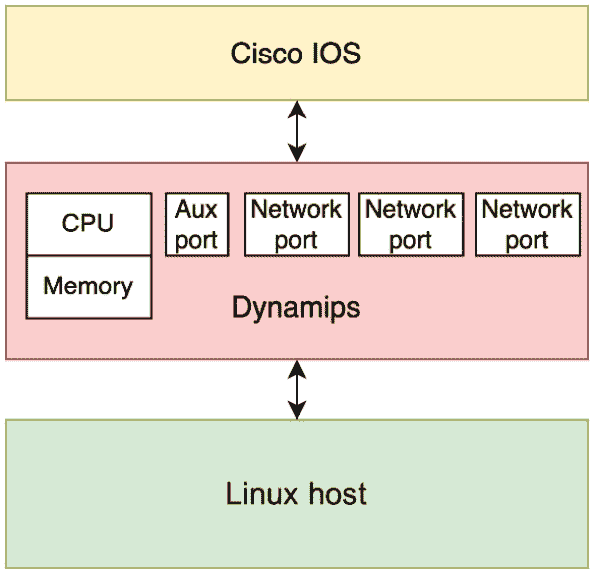
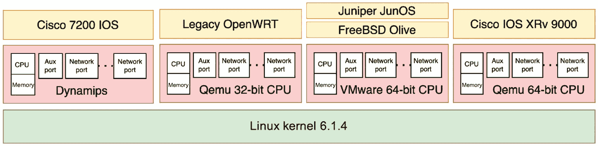
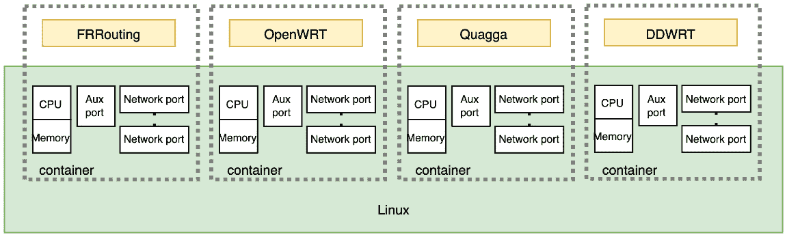
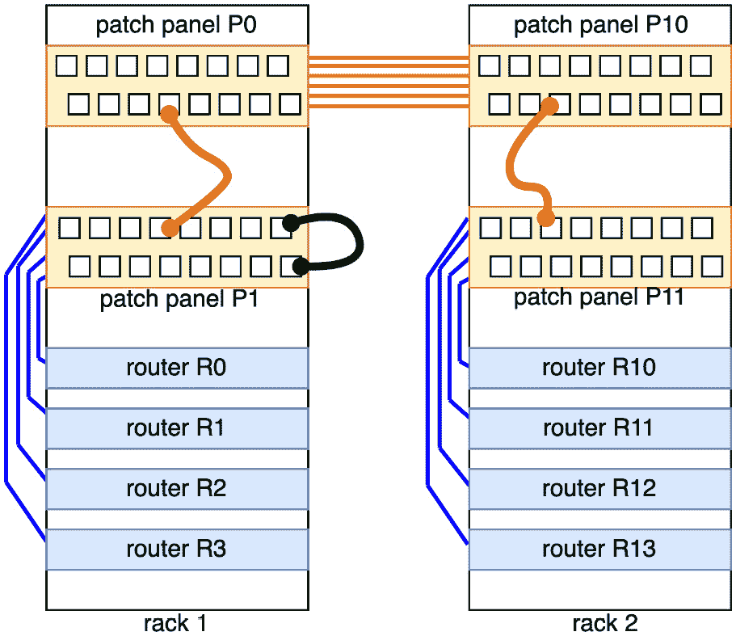
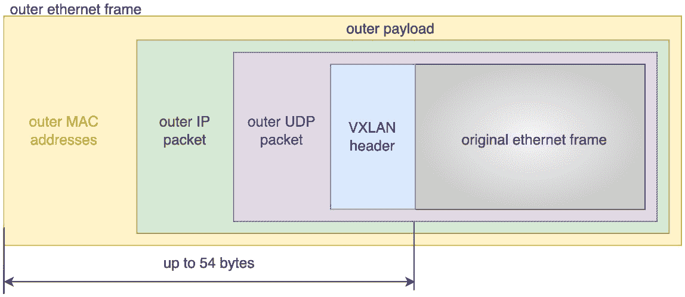
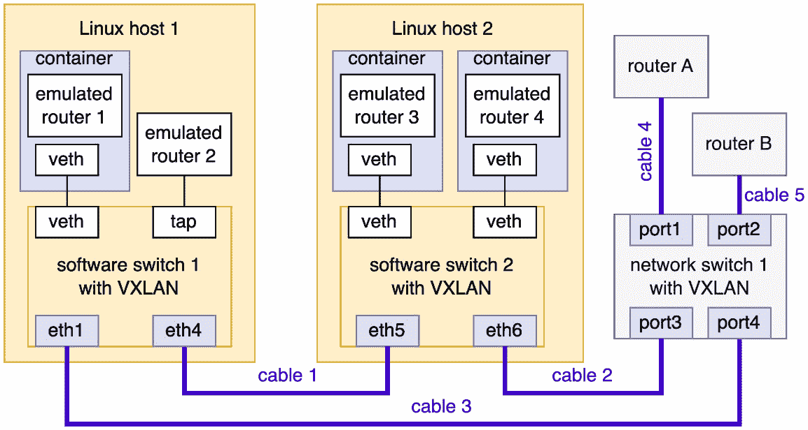
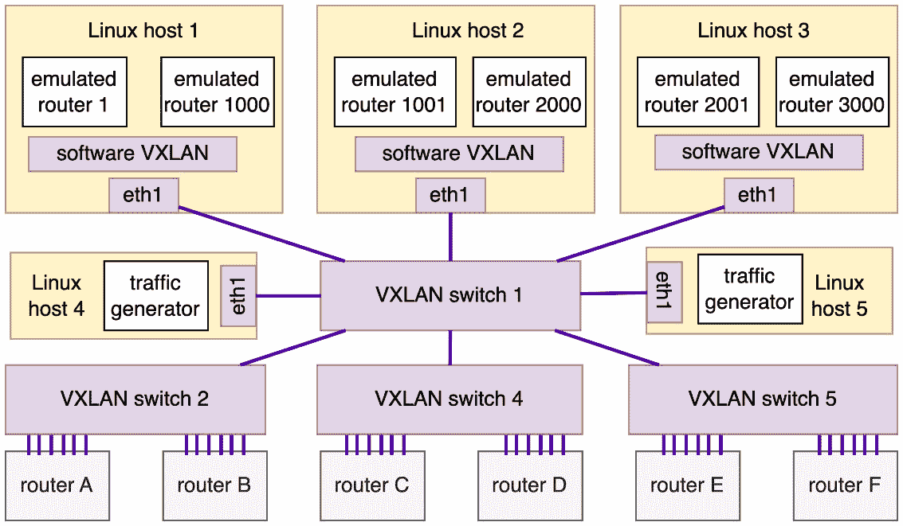
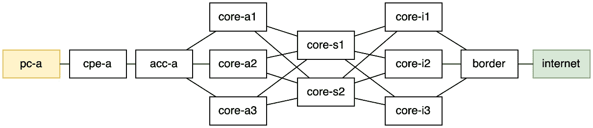
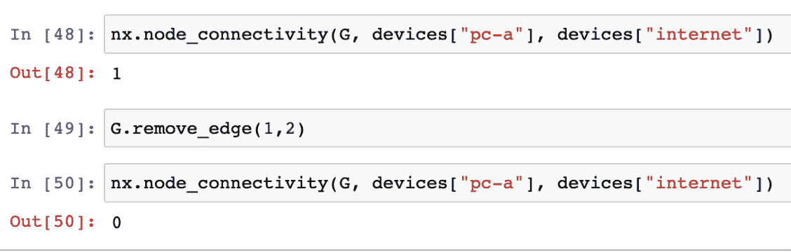

# 9

# 网络代码测试框架

在开发代码时，一个重要的方面是添加测试；我们在*第五章*，“网络编程的优缺点”中讨论和回顾了一些代码测试策略。但我们还没有研究网络自动化特有的技术，例如构建一个网络测试环境，我们可以使用网络自动化代码进行一些实际测试。

本章将重点介绍构建网络测试框架的技术，该框架可用于测试您的网络自动化代码。我们还将探讨可以添加到测试框架中以使其更加有用和可靠的先进技术。

下面是本章将要涉及的主题：

+   使用软件进行测试

+   使用设备仿真

+   连接设备进行测试

+   使用高级测试技术

到本章结束时，您应该有足够的信息来构建和使用一个测试框架，这将为您网络自动化项目带来显著的价值。

# 技术要求

本章中描述的源代码存储在本书的 GitHub 仓库中，网址为[`github.com/PacktPublishing/Network-Programming-and-Automation-Essentials/tree/main/Chapter09`](https://github.com/PacktPublishing/Network-Programming-and-Automation-Essentials/tree/main/Chapter09)。

# 使用软件进行测试

一些公司在购买网络设备时，会额外购买一些设备用于测试目的。这些额外的设备通常安装在独立的环境中，以复制生产网络的一部分进行测试。在进行测试之前，设备会被连接并配置，以复制网络的一部分。一旦测试完成，设置就会被移除，然后进行不同的配置，以对网络的其他部分进行测试。进行这些测试的原因有很多，例如测试新软件、验证新配置、验证更新、检查性能、评估新的网络设计以及测试新功能等。

但主要问题是测试环境成本高昂，设置缓慢，不能由多个测试工程师并行使用。它还要求有专业技术人员在场，最终需要整理新的电缆连接、执行硬件更新、添加或移除网络卡，有时还需要更新设备的操作系统。

物理测试环境最终是不可避免的，但可以通过使用软件而不是物理硬件来执行一些测试。软件可以执行的测试将取决于测试的要求。评估软件配置、验证设计概念、验证路由行为、验证新功能以及可能的路由稳定性测试可能由软件执行。

此外，软件可以用来在网络设备之间建立连接，这也会加快设置过程。但有一个区域无法进行测试，那就是网络压力和性能，例如测量最大吞吐量或容量。

我们可以使用几种技术来使用软件进行网络测试，其中大部分将使用模拟和仿真来完成。但仿真和模拟之间的区别是什么？现在让我们来讨论这个问题。

## 仿真和模拟之间的区别

模拟和仿真的含义常常被混淆。虽然弄混它们并不是那么重要，但了解它们的含义是好的，这样你就可以在使用时理解它们的局限性和能力。

在仿真的情况下，是指你使用软件来模拟你想要测试的实体的物理方面。因此，在我们的网络自动化中，它可能是一个路由器、交换机或网络连接（链路）。

因此，使用路由器仿真意味着所有必要的硬件，如网络端口、控制台端口、CPU 和内存，必须由软件模拟，以便路由器的操作系统可以无缝运行，就像它在真实硬件上运行一样。一个路由器仿真器的例子是**Dynamips**（更多详情请见[`github.com/GNS3/dynamips`](https://github.com/GNS3/dynamips)）。

另一方面，仿真器是为了模拟你想要测试的实体的某些功能而构建的。在路由器的例子中，通常只模拟特定的功能，而不是路由器的所有功能。由于仿真器体积更小，它可以更快地完成结果，并且与仿真器相比，可以扩展到数千个。两个用于模拟网络的流行软件示例是**ns-3** ([`www.nsnam.org/`](https://www.nsnam.org/))和**NetworkX** ([`networkx.org/`](https://networkx.org/))。

既然我们已经了解了仿真和模拟之间的区别，那么让我们更深入地探讨一下仿真。

# 使用设备仿真

在我们的网络自动化中使用仿真的最佳用例可能是路由器。通过路由器仿真，我们可以在不实际拥有它的情况下测试路由器的几个功能。但路由器仿真可能是最难以实现且在资源方面成本最高的。作为一个例子，让我们探讨一个流行的 Cisco 路由器仿真器的工作原理，称为 Dynamips。*图 9.1*展示了使用 Dynamips 在 Linux 主机上仿真的 Cisco 路由器：



图 9.1 – Cisco 路由器仿真

如上图所示，Dynamips 是一个软件层，用于模拟 Cisco 路由器的硬件。Dynamips 可以模拟一些 Cisco 硬件，例如网络端口、CPU、内存、辅助端口和控制台端口。Dynamips 由 Christophe Fillot 在 2005 年创建，用于模拟 Cisco 路由器的 MIPS 处理器架构。如今，Dynamips 由 GNS 网络模拟团队支持和维护，更多详情可以在 [`github.com/GNS3/dynamips`](https://github.com/GNS3/dynamips) 找到。

Dynamips 的工作方式类似于虚拟机，它只会运行 Cisco 操作系统。为了模拟 MIPS 处理器，Dynamips 会消耗大量的 CPU 和内存。例如，要运行传统的 Cisco 路由器 7200，Dynamips 至少需要分配 256 MB 的 RAM，以及 16 MB 的缓存。CPU 也被大量使用来运行路由器，通过逐条指令进行翻译。Dynamips 的早期版本过度使用了 CPU 主机，但随着名为 **idle-PC** 的功能的引入，CPU 消耗量显著减少。

其他路由器也可以进行模拟，但需要提供所需 CPU 平台的必要硬件模拟的模拟器。可以使用 Juniper Olive 来模拟 Juniper 路由器。Juniper Olive 是修改过的 FreeBSD，用于加载 Juniper 路由器操作系统 JunOS。通过模拟，您还可以使用能够提供传统 CPU 架构的硬件模拟器来运行传统路由器。

下图展示了运行四个模拟的系统，包括两个 Cisco 路由器、一个 Juniper 路由器和一个传统 OpenWRT 路由器：



图 9.2 – 单个系统上的四个模拟

前图中这些路由器之间的连接是在操作系统主机上创建的。主机可以提供更复杂的软件链路模拟以提供连接，或者只是从一端复制流量并发送到另一端以实现点对点连接。关于这些连接的更多内容将在本章的 *连接设备进行测试* 部分中解释。

注意，通过模拟，可以完全隔离路由器，从而提供完全不同的架构。在 *图 9.2* 中，Dynamips 提供了 MIPS CPU 架构来模拟 Cisco 7200，Qemu 提供了 32 位 CPU 架构来模拟传统 OpenWRT 路由器，VMware 提供了 64 位 x86 CPU 架构来模拟 Juniper 路由器，而 Qemu 提供了 64 位 x86 CPU 架构来模拟 Cisco XRv 9000。

用于仿真这些路由器的宿主操作系统是 Linux，内核版本为 6.1.4，但也可以是其他内核或其他操作系统，例如能够运行仿真器的 Windows。*图 9.2*的 CPU 和内存消耗相当高——Cisco 9000 至少需要 4 个 vCPU 和 16GB 的 RAM，Juniper 至少需要 2 个 vCPU 和 512MB 的 RAM，Legacy OpenWRT 至少需要 1 个 vCPU，而 Cisco 7200 至少需要 2 个 vCPU 和大约 300MB。

因此，使用路由器仿真创建大型网络是困难的，也许由于资源有限，甚至是不可能的。扩展仿真的一个方法是通过某种操作系统隔离来共享硬件驱动程序、内存和 CPU，例如使用 Linux 容器或 FreeBSD 监狱。但是，在容器设置中，您必须为所有路由器使用相同的内核版本和相同的 CPU 架构。因此，如果您的路由器运行在 ARM 处理器上，而您的宿主机是 x86 处理器，Linux 容器将无法工作。为了工作，容器和宿主机必须使用相同的 CPU 架构。

现在，让我们看看如何使用容器扩展仿真。

## 使用容器扩展仿真

如果您动态地从宿主机共享资源，仿真可以扩展。然而，这要求您的路由器作为程序在 Linux 宿主机上运行，并且可以作为一个容器进行隔离。这或许是一个很大的限制，因为大多数商业路由器不运行在 Linux 上，也不能进行容器化。选择开源路由器可以让你享受到它易于迁移到基于容器架构的优势。一些大型公司已经选择放弃商业操作系统路由器，并迁移到基于 Linux 的路由架构，这有助于创建仿真的网络。

尽管存在商业限制，一些供应商提供了可容器化的版本，例如 Arista、Cisco、Juniper 和 Nokia。这包括 Cisco XRv 和 CSRv 版本、Juniper vMX 和 vQFX、Arista vEOS 和 Nokia VSR。一个探索这些功能的项目是**vrnetlab**（更多详情请见[github.com/vrnetlab/vrnetlab](http://github.com/vrnetlab/vrnetlab))。

即使路由器与生产环境不同，也可以进行一系列网络测试，例如网络设计测试、拓扑迁移测试、基于 IP 过滤器的测试和拓扑故障转移测试等。原因是大多数拓扑运行标准协议，可以转换为开源网络平台。如果您使用 SDN 和 OpenFlow，这也同样适用。

以下图表说明了您如何使用容器运行四个仿真的路由器：



图 9.3 – 使用容器运行仿真

如前图所示，容器与 Linux 主机（绿色矩形）共享 CPU、内存和网络端口，但在容器内部是隔离的。每个容器将共享资源与其他容器隔离，但它们使用相同的 Linux 内核、相同的驱动程序和相同的 CPU 架构。可以使用不同的运行时库，但内核和 CPU 架构必须相同。每个容器将有自己的路由表，运行在相同容器上的程序将共享相同的路由表，但除非使用路由协议，否则不会共享容器之间的路由表。

你也可以在容器内运行虚拟机，但这样你并没有节省资源，之前显示的限制仍然是相同的。所以，如果你想扩展，你必须与所有容器共享硬件资源，而不是像*图 9.2*中那样模拟另一层。 

在*图 9.3*的示例中，有四个路由器——一个 FRRouting，一个 OpenWRT，一个 Quagga 和一个 DD-WRT。所有这些路由器都是开源的，并且可以被容器化。但它们不一定是一个程序在运行，而是一组程序。Quagga 和 FRRouting 运行了几个执行不同任务的程序，例如`bgpd`、`ospfd`和`zebra`。这些开源路由器的参考资料可以从以下来源获得：

+   FRRouting: [`frrouting.org/`](https://frrouting.org/)

+   OpenWRT: [`openwrt.org/docs/guide-user/virtualization/lxc`](https://openwrt.org/docs/guide-user/virtualization/lxc)

+   Quagga: [`www.nongnu.org/quagga/`](https://www.nongnu.org/quagga/)

+   DD-WRT: [`dd-wrt.com/`](https://dd-wrt.com/)

你将需要一些连接能力来连接模拟的路由器。现在，让我们讨论我们可以用来连接网络设备的技术。

# 测试设备连接

确保我们的设备在测试中的连通性对于获得适当的测试网络环境非常重要。有几种不同的方式可以连接测试设备，例如物理电缆和软件。物理电缆总是有两个缺点——它们需要现场的技术人员，并且需要时间来实现。通过软件，只有一个限制——最大数据吞吐量，这通常是一个物理电缆的一部分。因此，如果你的测试需要高数据吞吐量，你可能需要使用物理电缆。我们将在此章的后面部分解释这个限制的解决方案，当我们查看高级技术时。

使用设备进行测试的环境也被称为网络测试实验室，或者简称为网络实验室。为了解释我们如何在实验室中连接设备，让我们描述在实验室中连接设备的三种可能方式。

## 使用物理电缆连接

在测试环境中，物理连接通常由连接网络设备端口的线缆组成。它们通常是光纤电缆、同轴电缆或双绞线电缆。如果您有两个设备，电缆很简单，将从一个设备传递到另一个设备。然而，如果您计划拥有一个包含几个机架和数十个设备的实验室，您可能希望使用配线线缆和配线面板，而不是通过机架传递线缆。使用配线面板的想法是，技术人员只需使用配线线缆来连接设备，这使得连接设置更快，并且以后更容易移除。

理解配线面板和配线线缆在物理实验室中的工作原理非常重要，因为它将帮助我们理解软件版本。以下图表展示了连接两个机架（每个机架有四个路由器）的配线面板：



图 9.4 – 使用配线面板连接路由器

注意，在前面的图中，橙色和蓝色线代表永久线，永远不会被移除。红色和绿色线代表用于连接设备的配线线缆，但可以轻松移除和重新连接以进行不同的拓扑配置。机架 1 中的蓝色线将路由器 R0、R1、R2 和 R3 连接到配线面板 P1，类似于机架 2，它将路由器 R10、R11、R12 和 R13 连接到配线面板 P11。橙色线代表连接配线面板 P0 到配线面板 P10 的永久线。

每当需要拓扑配置时，技术人员只需使用配线线缆来设置路由器之间的连接。每个配线面板上的端口数量将取决于每个路由器上可用的网络端口数量。例如，对于*图 9.4*，假设机架 1 中的每个路由器都有五个网络端口可用。因此，配线面板 P1 至少需要 20 个端口，以便连接机架 1 上的所有路由器。

在*图 9.4*中，有三条配线线缆。机架 1 中的绿色线缆连接机架 1 内的两个设备，例如 R0 和 R1。其他两条红色配线线缆用于连接机架 1 和机架 2 之间的设备，例如 R0 和 R10 之间。

现在，让我们看看如何使用软件连接来连接设备。

## 使用软件连接

在本小节的解释中，我们将假设所有路由器都是软件模拟的路由器。软件和真实设备混合配置将在下一小节中解释。

可以使用几种软件技术来互连模拟路由器，并且它们也将取决于作为主机的操作系统。在我们的例子中，我们将使用 Linux 作为主机。对于 Windows、FreeBSD 或 macOS，您可能需要不同的技术。

连接仿真路由器的方法也将取决于你使用的仿真类型。它们可能因你使用的是 Dynamips、VirtualBox、VMware、Qemu 还是 Linux 容器而有所不同。

让我们探索一些使用 Linux 连接仿真路由器的方法。

### 使用 TUN/TAP 接口

在 Linux 中，TUN/TAP 接口是用于接收和发送网络流量的软件接口，但它们没有连接到任何网络。该接口被称为 TUN/TAP，因为设备可以被配置为仅工作在第三层，这被称为 TUN 模式，或者工作在第二层，这被称为 TAP 接口模式。两种模式都使用相同的 Linux 设备驱动程序（通过`/dev/net/tun`访问），只是使用了不同的标志。使用 TAP 模式的标志是`IFF_TAP`，而使用 TUN 的标志是`IFF_TUN`。有关 TUN/TAP 的内核驱动程序的更多详细信息，请参阅[`www.kernel.org/doc/html/v5.8/networking/tuntap.html`](https://www.kernel.org/doc/html/v5.8/networking/tuntap.html)。

Linux 提供了一个简单的接口来创建和删除 TUN/TAP 接口；你可以使用`ip tuntap`命令来完成此操作。以下是一个创建 tap 接口的示例：

```py
claus@dev:~$ sudo ip tuntap add dev tap0 mode tap
claus@dev:~$ sudo ip link set tap0 up
claus@dev:~$ ip link show tap0
4: tap0: <NO-CARRIER,BROADCAST,MULTICAST,UP> mtu 1500 qdisc fq_codel state DOWN mode DEFAULT group default qlen 1000
    link/ether b2:2e:f2:67:48:ff brd ff:ff:ff:ff:ff:ff
```

与 TUN 接口相比，TAP 接口更可取，因为它们工作在第二层，像真实以太网接口一样接收和发送数据包。

现在，让我们看看我们如何使用`veth`接口。

### 使用 veth 接口

Linux 容器中的网络是隔离的，并且与一个与之关联的命名空间编号。要连接到它们，你需要使用 veth 接口。veth 接口可以与命名空间关联，可以独立创建，也可以在点对点配置中与对等接口一起创建。当创建带有对等接口的 veth 时，你需要将两个命名空间关联起来，每个 veth 对等的一侧一个。一旦设置了对等接口，任何写入 veth 对等一侧的信息都将发送到另一侧，这是在 Linux 容器中使用时快速且简单地将仿真路由器互连的方法。在我们的示例中，我们将大量使用它们。以下是如何创建 veth 对等接口的示例：

```py
claus@dev:~$ sudo ip link add A type veth peer name B
claus@dev:~$ sudo ip link set A netns 41784
claus@dev:~$ sudo ip link set B netns 41634
claus@dev:~$ sudo nsenter -t 41784 -n ip link show A
11: A@if10: <BROADCAST,MULTICAST> mtu 1500 qdisc noop state DOWN mode DEFAULT group default qlen 1000
    link/ether 9a:fa:1e:7f:0c:34 brd ff:ff:ff:ff:ff:ff link-netnsid 1
claus@dev:~$ sudo nsenter -t 41634 -n ip link show B
10: B@if11: <BROADCAST,MULTICAST> mtu 1500 qdisc noop state DOWN mode DEFAULT group default qlen 1000
    link/ether d6:de:78:9c:e9:73 brd ff:ff:ff:ff:ff:ff link-netnsid 1
```

在这个示例中，使用了两个容器，它们分别由`41784`和`41634`网络命名空间标识。创建了一个带有接口名称`A`和`B`的对等接口，但容器之间的通信只有在使用`ip link set <ifname> netns <namespace>`命令将接口名称与网络命名空间关联后才会成为可能，就像这个示例中一样。接口名称可以相同，但需要在与命名空间关联后重命名。这是因为，在关联之前，veth 接口位于主机上，因此处于相同的命名空间，这不会允许创建具有相同名称的多个接口。

现在，让我们学习如何使用软件桥接。

### 使用软件桥接

软件桥接用于连接软件和硬件网络端口，这些端口可以像真实网络交换机一样添加和删除。Linux 内核有一个本地的软件桥接，可以通过使用`bridge`命令或添加`bridge-utils`包并使用`brctl`命令来使用。当创建一个软件桥接时，它需要一个名称，这个名称也分配给一个将或不会分配 IP 地址的网络接口。以下是一个创建桥接并将其与三个接口关联的示例：

```py
claus@dev:~$ sudo brctl addbr Mybridge
claus@dev:~$ sudo brctl addif Mybridge tap0
claus@dev:~$ sudo brctl addif Mybridge tap1
claus@dev:~$ sudo brctl addif Mybridge enp0s3
claus@dev-sdwan:~$ brctl show Mybridge
bridge name   bridge id   STP   enabled   interfaces
Mybridge      8000.f65..  no              enp0s3
                                          tap0
                                          tap1
```

如前所述，`Mybridge`桥接也与 Linux 主机上的一个网络接口相关联。可以通过运行`ip link`命令来查看，如下所示：

```py
claus@dev-sdwan:~$ ip link show Mybridge
12: Mybridge: <NO-CARRIER,BROADCAST,MULTICAST,UP> mtu 1500 qdisc noqueue state DOWN mode DEFAULT group default qlen 1000
    link/ether f6:78:c6:1a:1c:65 brd ff:ff:ff:ff:ff:ff
```

Linux 原生桥接快速简单，但有一些高级配置无法由它们执行。为了能够使用更高级的命令，建议使用**OpenvSwitch**，也称为**OvS**（更多详情请见[`www.openvswitch.org/`](https://www.openvswitch.org/))。

### 使用 VXLAN

Linux 桥接、TAP 和 veth 接口在 Linux 主机内部本地使用，用于在仿真路由器之间建立连接，但将运行在不同主机上的仿真路由器相互连接是不行的。有一些技术可以用来在主机之间连接仿真路由器，例如伪线、L2TP 和第二层 VPN 等，但最好的选择是 VXLAN。

VXLAN 作为一个第二层隧道，将本地桥接扩展到另一个远程设备，这可以是另一个 Linux 主机、网络交换机或路由器。使用 VXLAN，还可以将仿真路由器连接到真实路由器，就像它们通过背对背连接的线缆连接一样。正如我们将在本节后面看到的那样，VXLAN 将被用于混合实验室，其中使用真实路由器和仿真路由器之间的连接。 

VLAN 是一个众所周知的协议，在*第二章*中进行了解释。原始 VLAN 有 12 位标识符，允许最多有 4,096 个 VLAN ID。但 VLAN 标记（IEEE 802.1Q）增加了额外的 12 位，因此在正常以太网第二层帧中使用 VLAN 标记时，VLAN 的标识符可达 24 位。

VXLAN 独立于 VLAN 或 VLAN 标记，使用 24 位的头部标识符，并使用 UDP 作为传输协议，端口号为`4789`。使用 VXLAN 隧道的一个原始以太网帧将需要额外的 54 字节开销。因此，如果您的网络 MTU 为 1,500 字节，隧道内可以携带的最大有效载荷 MTU 将减少 54 字节。建议在使用 VXLAN 时增加 MTU。以下图示显示了 VXLAN 的协议封装示例：



图 9.5 – VXLAN 封装

VXLAN 连接端点，称为**虚拟隧道端点**（**VTEPs**）。当在 VTEP 上接收到以太网帧时，与 VXLAN 一起工作的设备将添加 VXLAN 头部、UDP 和 IP，并将其发送到另一个 VTEP 目标。

现在，让我们看看我们如何使用软件连接和物理线缆设置混合实验室。

## 构建混合实验室

每当你想要将模拟路由器与物理路由器结合使用时，混合实验室是必要的。你需要这种配置的主要原因是当测试真实路由器的性能并添加复杂性，例如在 OSPF 骨干中额外添加 500 个路由器时。测试与不同复杂拓扑结构的连接，例如具有波动路由的外部 BGP，也非常有用。所有额外的异常都可以通过模拟环境自动化和添加，从而帮助测试获得敏捷性和准确性。

使用混合实验室，你可以将少量真实路由器连接到无限数量的模拟路由器，也许可以构建一个可以连接到真实路由器进行更接近生产环境测试的整个网络仿真。再次强调，异常可以自动引入仿真中，包括数据包丢失、延迟和抖动。因此，你的网络自动化技能将成为混合实验室成功的关键。

以下图表显示了混合实验室连接四个模拟路由器到两个真实路由器的示例：



图 9.6 – 混合实验室的连接示例

注意，在前面的图中，紫色线条代表连接 Linux 主机 1、Linux 主机 2、路由器 A 和路由器 B 到网络交换机 1 的物理电缆。VXLAN 用于这些设备之间，以允许在这些设备之间设置任何连接。Linux 主机 2 仅使用容器模拟路由器，因此使用 veth 接口。Linux 主机 1 使用 tap 接口连接模拟路由器 2，例如 Dynamips 与 Cisco 模拟路由器。

以下图表显示了更复杂的混合设置：



图 9.7 – 更复杂的混合实验室设置

如前图所示，有 3,000 个模拟路由器和 6 个物理路由器通过 VXLAN 交换机和软件 VXLAN 桥连接。设置看起来干净利落，但它可以创建非常复杂的连接和拓扑。VXLAN 交换机充当可由软件配置的跳线面板。还需要一个真实路由器，其所有接口都连接到 VXLAN 交换机，以便它可以作为该路由器的跳线面板，例如路由器 A 连接到 VXLAN 交换机 2。

现在，让我们讨论我们如何添加一个 OOB 网络。

### 在你的实验室中添加一个 OOB 网络

我们需要关注的一个重要问题是，我们如何在不需要任何网络连接的情况下访问设备。这个问题的答案是使用 OOB 网络，即带外管理网络，正如我们在*第一章*中讨论的那样。

为那些不需要任何网络连接的设备添加某种形式的访问，有助于进行灾难性测试，例如当路由器必须被移除或关闭时。有几种方法可以访问模拟路由器，这通过访问运行模拟的主机来完成。对于真实路由器，访问它们的方式是通过控制台或辅助端口，这通常是通过串行通信来完成的。因此，为了允许所有设备的自动化，您将需要一个串行端口服务器设备，它将允许通过 IP 和 SSH 进行远程访问。一旦通过 SSH 连接到串行端口服务器，您将能够通过端口服务器通过串行端口访问路由器。这个端口服务器的一个例子是 Avocent ACS8000 产品，它有 32 个串行端口，可以通过以太网端口或 4G 移动网络通过 IP 访问([`www.amazon.com/Avocent-ACS8000-Management-Cellular-ACS8032-NA-DAC-400/dp/B099XFB39R`](https://www.amazon.com/Avocent-ACS8000-Management-Cellular-ACS8032-NA-DAC-400/dp/B099XFB39R))。

现在，让我们使用一些高级技术来增强我们的网络代码测试。

# 使用高级测试技术

我创建了这个部分来探讨一些可以用于测试但不太常见但可能以某种方式有用的方法。这些技术可能现在不太常用，但未来可能会成为主流，所以请密切关注事情的发展。

首先，让我们看看我们如何在网络代码测试中使用时间膨胀。

## 使用时间膨胀

在构建您的测试环境时，您可能会遇到在实验室中使用模拟路由器物理上无法完成的测试要求，例如测量协议收敛时间或在不同设备之间发送大量数据。这些高性能测试在模拟中物理上不可能实现的原因是，模拟路由器上的 CPU 和 I/O 比真实路由器小且有限。克服这种限制的一种方法就是使用**时间膨胀**。

时间膨胀是一种技术，它以这种方式改变模拟环境中的 CPU 时钟，使得模拟路由器相对于没有时间膨胀的模拟运行得更慢。从主机的角度来看，具有时间膨胀的模拟路由器将使用更少的资源，因为它运行的速度不如没有时间膨胀的模拟路由器快。但从使用时间膨胀的模拟路由器的角度来看，一切似乎都以正常速度运行，但实际上要慢得多。

假设你想测试使用网络仿真来复制文件所需的时间。在真实网络中，这些设备将具有 10 GE 接口，可以达到 10 Gbps。但在仿真环境中，它们可能只有 100 Mbps 可用，甚至更少。为了克服这些限制，一种技术是将所有仿真，包括应用程序，放入一个时间膨胀环境，该环境具有 1,000 或更高的**时间膨胀因子**（或**TDF**）。具有 1,000 的 TDF，CPU 和 I/O，包括网络接口，将能够从仿真的网络和应用程序的角度执行更多的工作。

对于网络测试，通常 TDF 大于 1，但也可以使用小于 1 的 TDF，这意味着仿真将比主机运行得更快。使用小于 1 TDF 的应用程序通常用于测试需要更快进行且不存在 CPU 限制的情况。例如，TDF 为 0.1 将运行 10 倍更快，但实现通常不是微不足道的，有时甚至不可能，因为它依赖于缩短等待时间。

圣地亚哥大学基于一篇名为《无限与超越：时间扭曲网络仿真》的论文进行了一些关于时间膨胀的研究，这篇论文确实为 Xen 和 Linux 内核提供了一些实现代码。详细信息可以在[`www.sysnet.ucsd.edu/projects/time-dilation`](https://www.sysnet.ucsd.edu/projects/time-dilation)找到。其他时间膨胀的实现专注于虚拟机，并使用 Qemu 来操作时间；一个实现来自北卡罗来纳大学，他们创建了一个名为 *自适应时间膨胀* 的项目。详细信息可以在[`research.ece.ncsu.edu/wireless/MadeInWALAN/AdaptiveTimeDilation`](https://research.ece.ncsu.edu/wireless/MadeInWALAN/AdaptiveTimeDilation)找到。

使用时间膨胀的一个优点是，每次你在环境中进行测试时，TDF 都可以进行调整。低 TDF 将会施加更多的 CPU 和 I/O 限制，这可能有助于测试应用程序和网络在低性能条件下的表现，从而得到一个下限测试结果。高 TDF 将提供足够的 CPU 和 I/O 资源，以便在没有资源限制的理想世界中测试应用程序和网络，从而得到一个上限测试结果。将 TDF 调整到某个中间值将为你提供与真实网络和真实应用程序兼容的资源，从而得到一个更接近现实的测试结果。

现在，让我们看看我们如何可以在网络代码测试中使用猴子测试。

## 使用猴子测试

在软件开发中，当应用程序需要测试但没有正式的定义要测试什么时，会使用猴子测试。猴子测试生成随机输入并评估输出。

猴子测试的思路是找出软件开发者没有预料到的代码问题。在我们的情况下，我们可以使用猴子测试来评估网络自动化工具和网络本身。在某种程度上，渗透测试会被认为是猴子测试的一部分，但更多地与发现安全漏洞有关，而不是失败。

一个很好的猴子测试例子是 Netflix 的**Chaos Monkey**实现（更多详情请访问[`github.com/Netflix/chaosmonkey`](https://github.com/Netflix/chaosmonkey)）。Chaos Monkey 是用 Go 编写的，用于随机终止容器和虚拟机。经过一些修改，它可以用来关闭接口和网络链接。它基于混沌工程（更多详情请访问[`principlesofchaos.org/`](http://principlesofchaos.org/)）。Chaos Monkey 是猴子测试的一个好例子，可以添加到我们的网络自动化测试基础设施中。

现在，让我们探讨如何使用**人工智能**（**AI**）进行网络代码测试。

## 使用人工智能

使用 AI 进行软件开发的产品还处于早期阶段，但它们很快将成为现实。今天，通过 AI 平台如**ChatGPT**（更多信息请访问[`chat.openai.com/auth/login`](https://chat.openai.com/auth/login)）可以生成代码。通常，AI 生成的代码简单且不一定优化，但它是在 AI 编写代码的必要里程碑。以下是用 ChatGPT 编写单元测试的输出示例：

```py
Question: Write a unit test for the following code:
from paramiko import SSHClient
client = SSHClient()
client.connect('10.1.1.1', username='user', password='pw')
AI: Here is the answer:
import unittest
import mock
from paramiko import SSHClient
class TestSSHClient(unittest.TestCase):
    @mock.patch('paramiko.SSHClient.connect')
    def test_connect(self, mock_connect):
        client = SSHClient()
        client.connect('10.1.1.1', username='user', password='pw')
        mock_connect.assert_called_with('10.1.1.1', username='user', password='pw')
        client.close()
if __name__ == '__main__':
    unittest.main()
```

注意，这个问题非常简单，并没有指定语言或包，例如 Python 或使用`unittest`和`mock`包。AI 自己推断出了语言和要导入的包。然而，它引入了一个小的过时导入。自从 Python 3.3 以来，`mock`必须导入为`from unittest import mock`，而不是`import mock`。

尽管之前编写的单元测试并不完整且包含一个小错误，但它是在开发过程中让计算机自动化测试迈出的巨大一步。它今天就可以用来帮助开发者改进他们的代码。

一些商业产品已经提供 AI 软件开发的解决方案。例如，GitHub 有一个名为**Copilot**的产品，提供与 AI 的配对编程（更多详情请访问[github.com/features/copilot](http://github.com/features/copilot)）。Copilot 声称它可以为你编写单元测试，这是一个惊人的成就。

越来越多的公司将开始提供代码开发的解决方案，并且可以肯定的是，编写单元测试将是 AI 平台要实现的第一里程碑。单元测试消耗了开发者大量的时间，在大多数情况下，编写单元测试的时间甚至比编写代码本身还要多。关注市场上使用 AI 的网络自动化测试工具——这将使开发更加稳健和快速。

现在，让我们看看如何添加网络模拟以增强网络代码测试。

## 使用网络模拟

网络模拟与网络仿真的不同之处在于，它使用软件来模拟网络部分行为。大多数网络模拟器要么用于模拟网络协议行为，要么用于预测和计算流量需求和网络路径。它还可以用于计算资源，例如设备上的内存和网络容量，但除此之外并不多。

在网络模拟中，Python 中非常流行的 Python 包之一是**NetworkX**（更多详情请见[`networkx.org/`](https://networkx.org/)），这是一个图操作库。使用 NetworkX，可以创建一个包含数千个节点和数百万个链接的大型网络，所需资源比使用网络仿真少得多。如果您希望运行多个测试，这些测试将比使用仿真运行得更快，那么使用 NetworkX 模拟大型网络是可能的。然而，这些测试将评估网络由于链路和节点故障的行为，而不是控制平面（路由协议）或路由器的操作系统。

网络模拟的另一个有用应用是测试特定 IP 前缀的网络访问列表路径。一旦网络模拟构建完成，就可以确定某个 IP 数据包在正常和故障条件下的流向。模拟必须使用网络路由器配置表来构建，并且可能需要定期更新以匹配生产环境。请注意，此类测试将需要为每个要测试的 IP 前缀创建一个网络图，并且每个接口的访问列表将决定链路是否包含在 IP 前缀图中。

以下图示展示了我们将使用 NetworkX 构建的拓扑结构，作为示例：



图 9.8 – 使用 NetworkX 的拓扑

此拓扑也在本书 GitHub 仓库中的`Chapter09/NetworkX/topology.yaml`文件中描述，以下代码读取此文件并使用此拓扑创建一个 NetworkX 图：

```py
import networkx as nx
import yaml
G = nx.Graph()
devices = {}
with open("topology.yaml", "r") as file:
    yfile = yaml.safe_load(file)
for i, x in enumerate(yfile["devices"]):
    devices[x] = i
    G.add_node(i, name=x)
for link in yfile["links"]:
    G.add_edge(devices[link[0]], devices[link[1]])
```

在加载拓扑后，可以进行一系列测试以评估网络的行为。例如，我们可以移除`cpe-a`和`acc-a`之间的链路，并查看`pc-a`和`internet`之间是否存在连接性。由于添加和删除边的操作更加交互式，使用 NetworkX 进行测试的最佳平台将是 Jupyter 笔记本（如第六章所述）。以下截图显示了 Jupyter 笔记本的输出，显示了移除链路并测试`pc-a`和`internet`之间连接性的测试结果：



图 9.9 – Jupyter 笔记本输出示例

如您所见，如果您移除 `cpe-a` 和 `acc-a`（边缘 1，2）之间的链接，`pc-a` 将失去与 `internet` 的连接。`node_connectivity()` 方法返回一个 `整数`，如果大于零，表示节点之间存在连接性（有关此方法和其他连接性算法的更多详细信息，请参阅[`networkx.org/documentation/stable/reference/algorithms/connectivity.html`](https://networkx.org/documentation/stable/reference/algorithms/connectivity.html)）。一系列附加测试可以在 `Chapter09/NetworkX/example.ipynb` 文件中找到。

网络模拟和网络仿真的组合可以用来提高代码测试的容量和速度。必须包含一个机制来构建仿真和创建使用相同配置的模拟。此外，一些测试可以先在模拟中进行，如果需要，可以在仿真中重复以进行验证。

## 使用流量控制

通过使用流量整形（或流量控制），我们可以通过添加一些真实链路和多对多点网络中存在的物理特性来增加我们的仿真的复杂性。使用流量整形，我们可以向特定连接添加延迟，引入丢包，添加随机限制，添加网络拥塞，添加抖动等。在 Linux 上，可以通过使用内置的 `tc` 命令轻松实现。

TC 通过在 Linux 中使用调度器或 `tc` 实现，qdiscs 可以在[`tldp.org/HOWTO/Traffic-Control-HOWTO`](https://tldp.org/HOWTO/Traffic-Control-HOWTO)找到。

以下是一个使用名为 `netem` 的 `qdisc` 添加 10 毫秒延迟到环回接口的示例：

```py
$ sudo fping -q -c 100 -p 100 localhost
localhost : xmt/rcv/%loss = 100/100/0%, min/avg/max = 0.030/0.044/0.069
$ sudo tc qdisc add dev lo root netem delay 10ms
$ sudo fping -q -c 100 -p 100 localhost
localhost : xmt/rcv/%loss = 100/100/0%, min/avg/max = 20.4/21.4/24.8
```

此示例在每个方向上添加了 10 毫秒以达到 `lo` 接口，因此往返时间是双倍，这在结果中表现为 21.4 毫秒的平均值。

这里是另一个示例，展示了如何使用 `netem` 添加 5%的丢包率：

```py
$ sudo fping -q -c 100 -p 100 localhost
localhost : xmt/rcv/%loss = 100/100/0%, min/avg/max = 0.031/0.044/0.101
$ sudo tc qdisc add dev lo root netem loss 5%
$ sudo fping -q -c 100 -p 100 localhost
localhost : xmt/rcv/%loss = 100/96/4%, min/avg/max = 0.032/0.056/0.197
```

在这个测试示例中，结果是 4%的丢包率，而不是配置的 5%。这是因为 `netem` 使用随机选择来获取丢包率，需要更大的测试样本才能接近 5% - 例如，1000 个数据包而不是前一个测试中使用的 100 个。

使用 `netem` 可以在接口中添加更复杂的网络行为，例如突发控制、最大容量、网络拥塞和随机延迟变化等。更多详细信息可以在[`wiki.linuxfoundation.org/networking/netem`](https://wiki.linuxfoundation.org/networking/netem)找到。

除了 `netem` 之外，还有很多其他的调度器，如 `choke`、`codel`、`hhf` 和 `ATM`。所有无类和有类 qdiscs 的列表可以在 `tc` 手册页上找到，只需输入 `man tc` 即可查看（HTML 版本可以在[`manpages.debian.org/buster/iproute2/tc.8.en.html`](https://manpages.debian.org/buster/iproute2/tc.8.en.html)找到）。

希望您已经充分利用了这一部分，并开始思考是否可以将这些高级技术添加到您的项目中。添加其中之一可能会使您的项目更加可靠，并更接近真实的生产环境。

# 摘要

本章的目标是向您介绍如何使用软件构建和使用适当的基础设施来测试您的自动化代码。您学习了如何有效地使用软件来测试您的自动化代码，如何使用模拟和仿真，如何连接真实和仿真设备，以及最后，如何融入高级技术。

在您的网络自动化代码项目中添加本章描述的一些技术将赋予您的项目超能力。从现在开始，它将无与伦比。

在下一章中，我们将亲自动手在网络实验室中进行操作，并以一些额外的评论结束这本书。
