# 10

# 实践和前进

恭喜你，你已经到达了这本书的最后一章，没有什么比用一些使用网络自动化的真实例子来巩固所学的所有知识更好的了。我们可能无法为这本书涵盖的所有主题都编写例子，但目的是至少为进一步的实验和学习打下基础。

在本章中，我们将使用我们的网络自动化技能和模拟路由器从头开始构建一个网络。构建完成的模拟网络将包含足够的组件，使我们能够实验本书中描述的几种技术。无论何时你需要，你都可以用它来进行自己的实验。

我们还将添加一些关于未来学习和工作的备注和指导，这应该足以结束本书。

在本章结束时，你将能够构建自己的网络模拟，并在自己的计算机上实验自己的网络自动化项目，这将为你未来的实验和学习提供一个很好的环境基础。

本章我们将涵盖以下主题：

+   使用网络实验室

+   构建我们的网络实验室

+   连接设备

+   添加自动化

+   前进和进一步学习

# 技术要求

本章中描述的源代码存储在 GitHub 仓库[`github.com/PacktPublishing/Network-Programming-and-Automation-Essentials/tree/main/Chapter10`](https://github.com/PacktPublishing/Network-Programming-and-Automation-Essentials/tree/main/Chapter10)。

# 使用网络实验室

是时候在我们虚拟环境中进行一些真正的代码自动化测试了。某些开源和商业产品可以在你的环境中用于测试网络自动化。商业和开源解决方案之间的区别在于支持的设备类型数量以及如何扩展。使用开源解决方案，你可能能够扩展数千台设备，但在模拟的设备类型方面可能会有所限制。商业和开源网络的组合可能更有用。

Cisco 有一个项目允许公众访问虚拟实验室中的模拟路由器；它们被称为沙盒。Cisco 提供免费 24/7 远程访问其沙盒，但设备数量有限。有关 Cisco 沙盒的更多信息，请参阅[`developer.cisco.com/site/sandbox/`](https://developer.cisco.com/site/sandbox/)。

例如，*第六章* [B18165_06.xhtml#_idTextAnchor166] 中描述的 `scrapligo` 项目使用 Cisco 沙盒；有关使用详情，请参阅 [`github.com/scrapli/scrapligo/blob/main/examples/generic_driver/interactive_prompts/main.go#L14`](https://github.com/scrapli/scrapligo/blob/main/examples/generic_driver/interactive_prompts/main.go#L14)。还有其他商业产品，例如 Cisco Packet Tracer，它是 Cisco 网络学院的一部分（https://www.netacad.com/courses/packet-tracer），以及 EVE-NG ([`www.eve-ng.net/`](https://www.eve-ng.net/))。

在开源方面，最受欢迎的是 GNS3 ([`gns3.com/`](https://gns3.com/)) 和 Mininet ([`mininet.org`](http://mininet.org)/)。Mininet 使用 Linux 容器来扩展网络，而 GNS3 则更专注于虚拟机，如 Dynamips。因此，GNS3 可以运行多种不同的路由器类型，但在规模上有限。另一方面，Mininet 可以扩展到数千个，但只有一种路由器类型，这更适合测试网络概念和网络拓扑，而不是功能。

对于我们来说，从零开始构建自己的网络实验室将更有趣，这将让我们更深入地了解如何使用它以及我们如何使用网络自动化工具，实际上，这将在真实网络中有所帮助。我们网络实验室的基础将是 Linux 容器。因此，我们需要使用易于容器化的路由器，并且由于许可问题，我们应该坚持使用如 FRRouting、Quagga、OpenWRT 或 DD-WRT 等开源解决方案，如 *第九章* [B18165_09.xhtml#_idTextAnchor209] 中所述。

我们的网络实验室将使用 FRRouting 作为路由器的基础，它具有接近 Cisco 路由器的接口配置，可以通过 `vtysh` 命令访问。有关 FRRouting 设置和配置的更多详细信息，请参阅 [`docs.frrouting.org/en/latest/basic.html`](https://docs.frrouting.org/en/latest/basic.html)。

现在让我们构建自己的网络实验室。

# 构建我们的网络实验室

在我们的网络实验室中，我们将为所有设备使用 Linux 容器。基本上会有两种类型的设备，一种是运行路由器，另一种运行 Linux。那些不作为路由器运行的 Linux 容器将被用来生成流量或接收流量；它们将模拟用户的 PC 和互联网上的服务器。

目前的拓扑结构在以下图中描述：

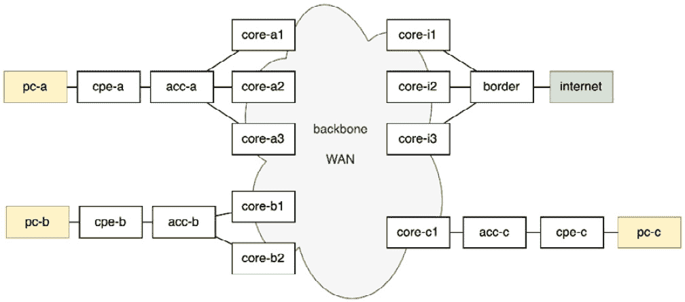

图 10.1 – 网络实验室拓扑

将作为路由器运行的容器是 *图 10.1* 中的白色矩形，黄色矩形将作为用户 PC 运行，绿色矩形将模拟互联网上的服务器。

总的来说，网络实验室将拥有 16 台路由器、3 台 PC 和 1 台服务器。网络实验室中使用的容器镜像使用 Docker 创建并存储在 Docker Hub ([`hub.docker.com/`](https://hub.docker.com/))，这些是公开可用的，可以用于镜像下载。路由器是基于 FRRouting Docker 镜像([`hub.docker.com/r/frrouting/frr`](https://hub.docker.com/r/frrouting/frr))创建的，PC 和服务器是基于 Alpine Linux Docker 镜像([`hub.docker.com/_/alpine`](https://hub.docker.com/_/alpine))创建的。

原始镜像经过了一些工具和配置更改的轻微修改，创建了三个新的镜像。路由器的镜像为[hub.docker.com/r/brnuts/routerlab](https://hub.docker.com/r/brnuts/routerlab)，PC 的镜像为[hub.docker.com/r/brnuts/pclab](https://hub.docker.com/r/brnuts/pclab)，互联网的镜像为[hub.docker.com/r/brnuts/internetlab](https://hub.docker.com/r/brnuts/internetlab)。

现在我们来看看如何启动我们的实验室主机。

## 启动实验室主机

Linux 容器需要一个主机来运行。因此，你首先需要启动路由器将运行在其中的 Linux 主机。我准备了两个预构建镜像以帮助，一个是用于 VirtualBox 的，另一个是用于 Qemu 的。你可以在 GitHub 上找到如何下载和启动它们的说明：`Chapter10/NetworkLab/README.md`。这些虚拟机镜像使用 Debian Linux。

然而，如果你不想使用预构建的虚拟机，我还包括了如何构建你自己的主机的说明，这基本上是任何带有额外包和一些配置更改的 Linux 发行版。如果你构建自己的镜像，你需要自己启动所有容器。我添加了一个 Shell 脚本，应该能够做到这一点，叫做`start-containers.sh`。

一旦启动了主机，让我们看看如何检查它是否正确启动。

## 检查实验室主机

在解压缩并启动预构建镜像后，一旦主机完成引导序列，你应该能够看到所有设备正在运行。原因是我已经更新了容器，以便它们会自动重启，除非明确停止。

要验证代表设备的容器是否正在运行，你只需使用`docker ps`命令，如下面的截图所示：

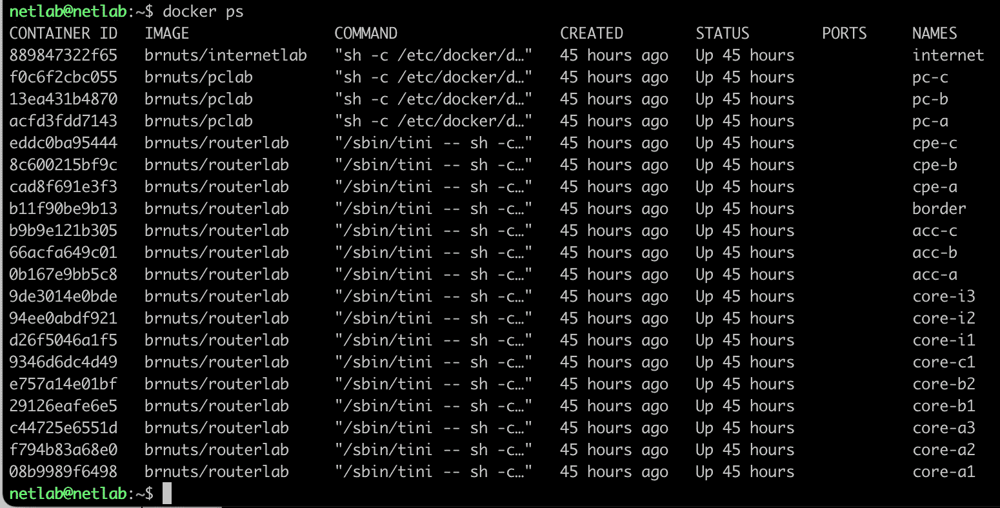

图 10.2 – 显示网络实验室上所有设备运行的输出

`docker ps`命令的输出应该显示所有正在运行的设备，总共应该是 20 个容器，其中 16 个代表路由器（使用`brnuts/routerlab`镜像），3 个代表 PC（使用`brnuts/pclab`镜像），1 个代表互联网（使用`brnuts/internetlab`镜像）。

我还向所有容器添加了卷，并将它们作为持久存储附加，因此即使在重启容器时配置更改也不会被删除。要查看卷，只需输入`docker volume list`即可。

现在，检查`/etc/hosts`文件是否已更新为容器的 IP 地址。你应该能在`# BEGIN DOCKER CONTAINERS`之后看到几行，就像以下截图中的示例一样。此文件由`systemctl`中包含的`update-hosts.sh`脚本更新：

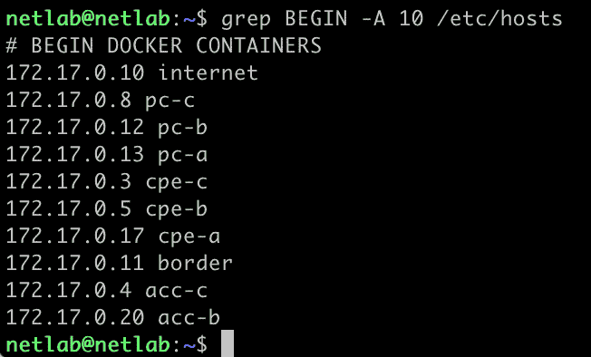

图 10.3 – 检查/etc/hosts 文件

我们将在下一节解释为什么我们需要 LLDP，但现在，让我们使用`systemctl status lldpd.service`命令来检查主机上是否正在运行`lldpd`：

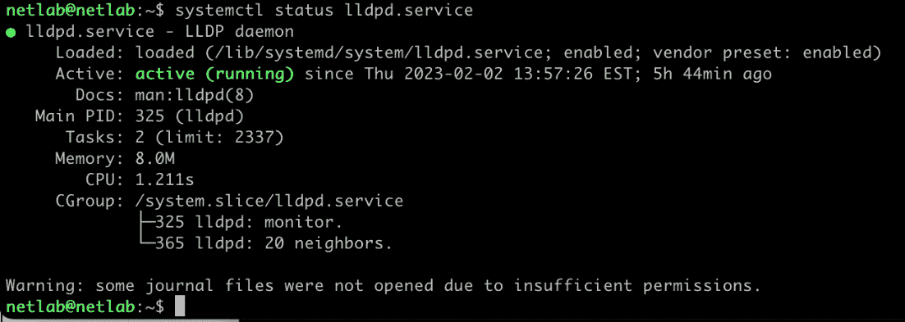

图 10.4 – 检查主机上 lldpd 是否正在运行

如果`lldpd`守护进程运行正确，你应该能在绿色中看到`active (running)`，就像前面的截图所示。

现在，我们应该准备好开始进行一些网络自动化，以完成构建我们的实验室。现在让我们看看我们如何连接设备。

# 连接设备

在我们的网络实验室中连接设备将通过使用`veth`对等接口来完成，正如在*第九章*中所述。如果我们需要从两个不同的主机连接两个不同的实验室，我们可以使用 VXLAN，但在这个部分的练习中，我们只在本主机上建立连接。因此，`veth`对等接口将完成这项工作。

我在预构建的虚拟机镜像中包含了一个协议，这对我们来说非常重要，那就是**链路层发现协议**（**LLDP**）。LLDP 是 IETF 标准之一，它是在成功实施思科的专有协议**Cisco Discovery Protocol**（**CDP**）之后出现的。它通过发送特定的以太网帧来获取关于 2 层连接另一侧的信息。我们将使用它来验证我们网络实验室中设备之间的连接。

在我们进行连接之前，让我们检查 Docker 是如何创建我们的**带外**（**OOB**）管理网络的。

## 带外管理网络

默认情况下，Docker 创建了一个连接所有容器的网络，我们将使用它作为我们的带外管理网络（在第*第一章*中描述）。为此，Docker 在容器和主机之间创建`veth`接口对。在容器一侧，Docker 将`eth0`作为名称，而在另一侧，使用`veth`后跟一些十六进制字符以使其唯一 – 例如，`veth089f94f`。

主机上的所有`veth`接口都连接到一个名为`docker0`的软件桥。要使用`brctl`命令，你可能需要通过执行`sudo apt install bridge-utils`来安装`bridge-utils`包：

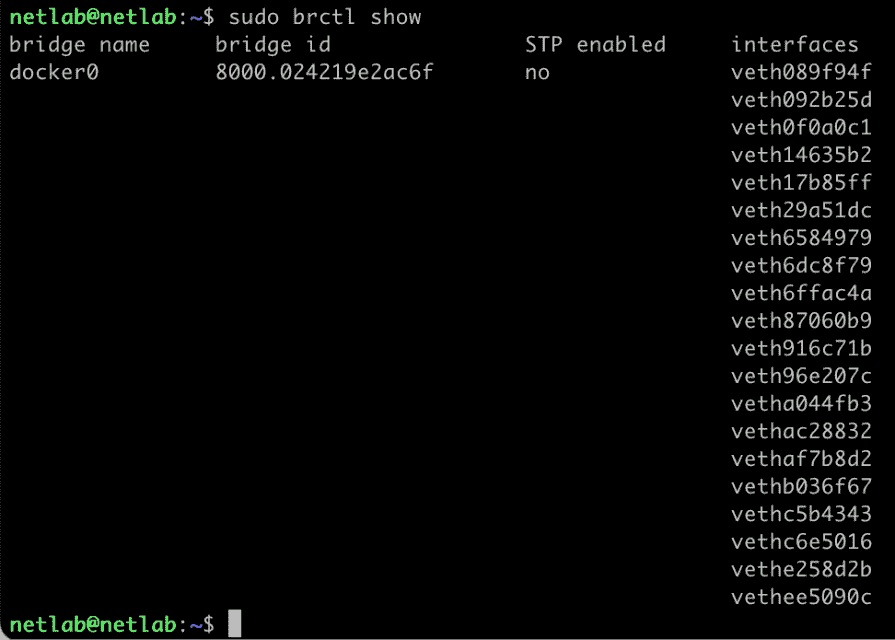

图 10.5 – 检查 docker0 桥接上的接口

为了验证哪个`veth`接口属于哪个容器，你可能需要执行两个命令，如下例所示：

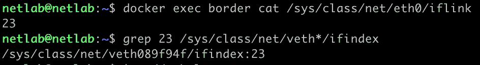

图 10.6 – 检查容器在主机上的 veth 对端名称

如前一个截图的输出所示，为了确定哪个`veth`对等接口属于`border`路由器，你需要在容器内执行一个命令以获取`eth0`接口的索引，在这种情况下，是`23`。一旦你有了索引，你可以通过在所有文件上使用`grep`命令来检查主机上的哪个`veth`接口具有该索引。

我们也可以通过在路由器上直接执行命令来使用 LLDP 找出`veth`接口名称：

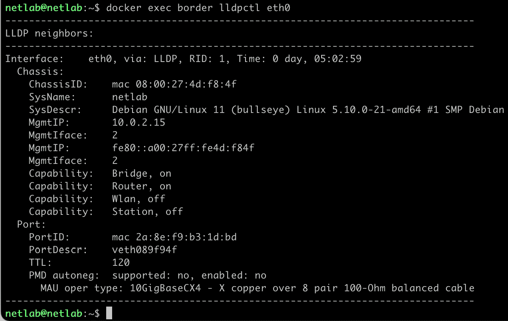

图 10.7 – 显示边界路由器内的 LLDP 邻居

前面的截图显示了`lldpctl`命令的成功输出，显示了`eth0`接口的邻居，在这种情况下，是主机 Debian Linux，`SysName`为`netlab`。与边界路由器上的`eth0`对等的接口在`PortDescr`字段中描述为`veth089f94f`——这正是我们使用*图 10.6*中的命令发现的接口。

然而，为什么不使用*图 10.6*中描述的第一种方法来找出连接而不是使用 LLDP 呢？因为在实际网络中，LLDP 用于识别设备之间的连接。因此，编写一个自动化代码来验证实验室中所有网络连接使用 LLDP 也可以在生产中使用。我们的实验室将作为测试我们自动化代码的第一个地方——在这种情况下，检查 LLDP 拓扑。

到目前为止，你可能已经注意到我们只需使用`docker exec <router 名称>`命令就可以访问路由器，那么为什么我们还需要 OOB 管理网络来访问设备呢？答案是像 LLDP 的情况一样——通过 OOB 网络访问，设备可以通过 SSH 访问，这正是我们将在生产中要做的。因此，为实验室开发的任何代码都可以在生产中使用。

为了测试我们的实验室 OOB 管理网络，我们只需使用`ping`或`ssh`命令通过 IP 访问设备——例如，使用`ping cpe-a`命令：

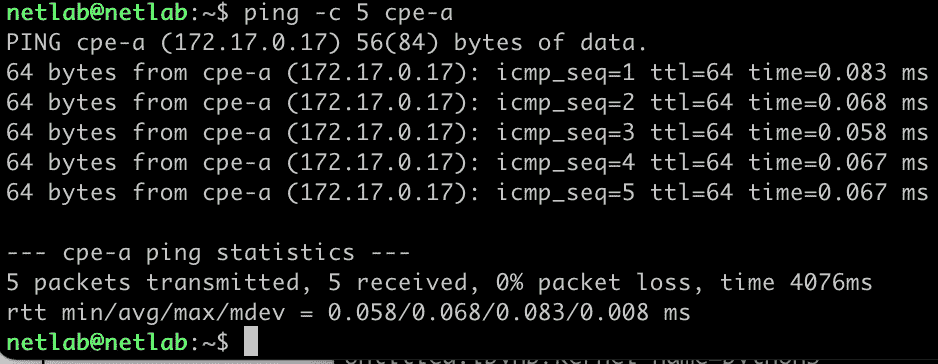

图 10.8 – 使用 OOB 从主机测试连接到路由器

你也应该能够使用`netlab`作为用户名和密码 SSH 到任何容器：

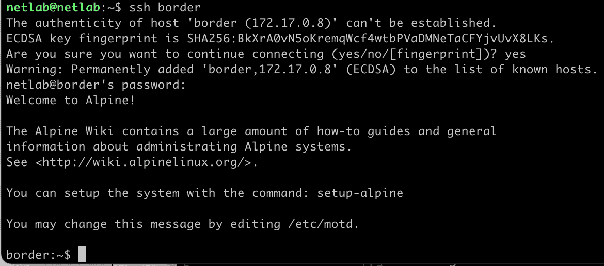

图 10.9 – 测试是否可以通过 OOB 使用 SSH 访问设备

现在我们已经知道了我们的实验室中 OOB 管理网络的工作方式，让我们使用 OOB 网络连接设备。

## 查看拓扑

*图 10.1* 展示了我们旨在创建的拓扑结构。我们实验室中的设备正在运行并连接到一个 OOB 网络，但它们没有像*图 10.1*中描述的拓扑那样的连接。

除了图表之外，GitHub 上的一个文件中也包含了一个正式的拓扑描述，可以通过`Chapter10/NetworkLab/topology.yaml`访问。该文件描述了拓扑中的路由器和它们的连接。这是我们之前在*第四章*中讨论的 YAML 格式的网络定义的简单版本。

拓扑文件基本上有两个主要键，`devices`和`links`。这些键应该描述与*图 10.1*中显示相同的连接。以下是`devices`和`links`键的文件样本：

```py
devices:
  - name: acc-a
    type: router_acc
    image: brnuts/routerlab
  - name: acc-b
    type: router_acc
    image: brnuts/routerlab
links:
  - name: [pc, cpe]
    connection: [pc-a, cpe-a]
  - name: [cpe, acc]
    connection: [cpe-a, acc-a]
```

该文件应包含*图 10.1*中描绘的所有链接。理想情况下，*图 10.1*中的图表应该由一个读取`topology.yaml`的工具自动创建。在我们的例子中，图表和 YAML 文件是相同的，但我自己手动构建了图表，并且对于任何拓扑变化，我需要更新`topology.yaml`文件和图表。这个问题也在*第四章*中讨论过，随着拓扑变得更加复杂，文件和图表之间的更新同步往往会出错。但是，对于使用这个小拓扑的示例，自动图表构建器不是必需的。

## 创建设备之间的连接

要连接设备，就像在拓扑中一样，我们必须使用`veth`对等接口，并且正如我们在*第九章*中讨论的那样，我们需要对等接口每边的命名空间编号以及我们将要使用的接口名称。*图 10.1*中的大多数连接都是设备之间的点对点连接，除了连接到**骨干**或**WAN**。

下面的图表显示了我们必须配置的所有`veth`对等接口；大多数是在两个容器之间以点对点配置连接。然而，核心路由器将使用，比如说，骨干`veth`或 WAN`veth`，因为它们在多对多点的环境中连接，类似于 WAN。为此，我们将在主机上使用一个软件桥来提供骨干`veth`之间的连接性；如果需要进行网络降级测试，可以在桥接口上添加延迟和丢包：


图 10.10 – 实验室拓扑，显示所有`veth`对等接口

当我们开始创建用于连接所有核心路由器的骨干`veth`接口时，我们将在主机上使用一个命名空间，在核心路由器上使用另一个命名空间。这与所有其他`veth`不同，它们将有两个命名空间。以下是如何手动在`pc-a`和`cpe-a`之间创建连接的一个示例：

```py
netlab@netlab:~$ docker inspect -f '{{.State.Pid}}' pc-a
1069
netlab@netlab:~$ docker inspect -f '{{.State.Pid}}' cpe-a
1063
netlab@netlab:~$ sudo ip link add pc-cpe type veth peer name cpe-pc
netlab@netlab:~$ sudo ip link set pc-cpe netns 1069
netlab@netlab:~$ sudo ip link set cpe-pc netns 1063
netlab@netlab:~$ docker exec pc-a ip link set pc-cpe up
netlab@netlab:~$ docker exec cpe-a ip link set cpe-pc up
```

如我们在这组命令中所见，首先，我们需要获取我们想要连接的每个路由器的网络命名空间 ID，然后我们可以创建 `veth` 对等端，并将对等端的每一侧分配给一个命名空间 ID。最后，我们在每个路由器上启动接口。请注意，`pc-a` 上的接口名称是 `pc-cpe`，而 `cpe-a` 上的接口名称是 `cpe-pc`，这有助于识别接口的方向。

为了验证我们之间路由器的连接是否创建正确，我们可以运行以下命令：

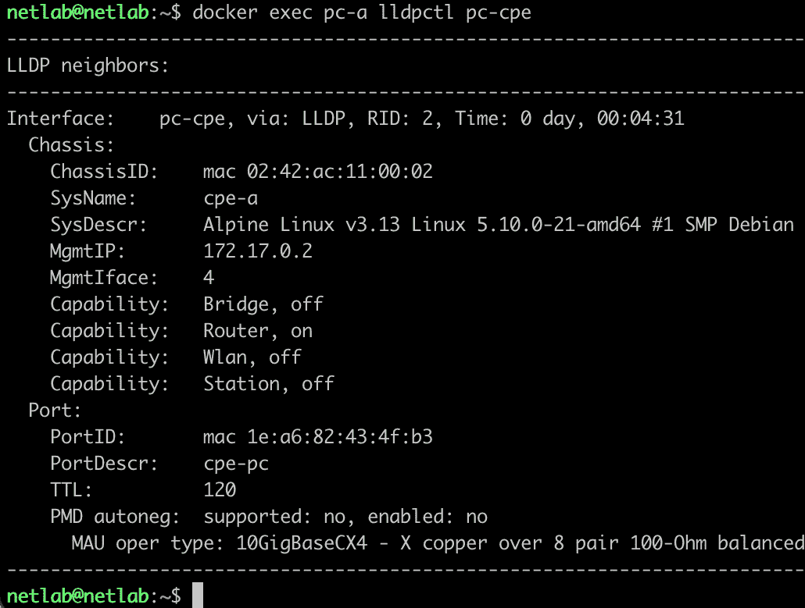

图 10.11 – 检查 pc-a 和 cpe-a 之间的连接

现在，我们可以通过查看 *图 10.11* 中的 `lldpctl` 命令输出，确认 `pc-a` 是否连接到 `cpe-a`。输出显示了 `SysName` 的名称为 `cpe-a`，确认了连接。我们还可以看到另一侧的接口名称，它是 `cpe-pc`。

现在，让我们看看我们如何自动化设备连接。

## 自动化连接

我们的网络实验室现在所有设备都在运行，我们将使用一个程序连接所有设备。您可以在 `Chapter10/NetworkLab/AUTOMATION.md` 获取该程序。

要在您的计算机上安装它，只需使用以下命令克隆它：

```py
claus@dev % git clone https://github.com/brnuts/netlab.git
Cloning into 'netlab'…
remote: Enumerating objects: 103, done.
remote: Counting objects: 100% (103/103), done.
remote: Compressing objects: 100% (79/79), done.
remote: Total 103, reused 44 (delta 12), pack-reused 0
Receiving objects: 100% (103/103), 58 KiB | .9 MiB/s, done.
Resolving deltas: 100% (36/36), done.
```

然后，您需要构建 Go 程序：

```py
claus@dev % go build
claus@dev % ls -lah netlab
-rwxr-xr-x  1 user  staff   5.3M Feb  8 11:54 netlab
```

如果您正在使用预构建的 VirtualBox 映像，您可能正在通过本地主机端口 `22` 使用 SSH 访问网络实验室。然后，您只需像这样运行它：

```py
claus@dev % ./netlab
```

如果您使用 QEMU 或带有网络实验室的自己的 Linux 虚拟机，您可以按照以下方式传递用户名、密码和主机 IP：

```py
claus@dev % ./netlab -host 10.0.4.1 -user oper -pw secret
```

通过添加 `-help`，可以访问一个小型帮助指南，如下所示：

```py
claus@dev % ./netlab -help
Usage of ./netlab:
  -host string
      Host IP for netlab (default "localhost")
  -port uint
      SSH port to access Host IP for netlab (default 22)
  -pw string
      Password to access netlab host (default "netlab")
  -topo string
      Topology yaml file (default "topology.yaml")
  -user string
      Username to access netlab host (default "netlab")
```

程序在输出中显示了一些日志，成功运行应该显示类似于以下类似的行：

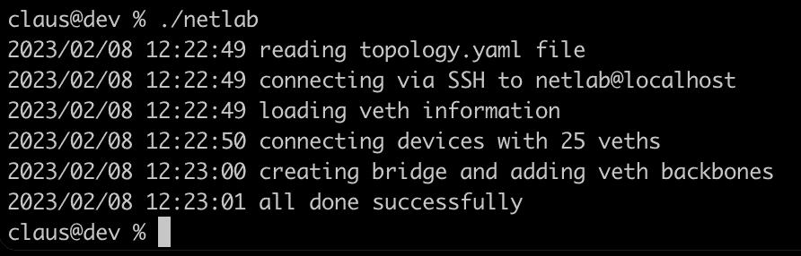

图 10.12 – 运行 Go 自动化程序连接设备

如您在前面的屏幕截图中所见，程序运行大约需要 12 秒，并且在结束时应该显示 `all done successfully`。

让我们看看这个程序以及它在做什么。

## 查看自动化程序

在我们的例子中，程序是用 Go 语言编写的，它所在的目录包含九个文件，其中六个是带有 `.go` 扩展名的 Go 源代码，如下所示：

```py
claus@dev % ls –1
go.mod
go.sum
hostconnect.go
netlab.go
readtopology.go
runcommand.go
topology.yaml
types.go
vethcommands.go
```

让我们讨论每个文件。

### go.mod 和 go.sum

这些文件被 Go 构建器用于包依赖管理；它们包含将第三方库添加到我们程序所需的所有必要信息。每次我们导入一个包时，它都会自动更新这些文件。更多关于这些文件的信息可以在 [`go.dev/ref/mod`](https://go.dev/ref/mod) 获取。

### topology.yaml

这包含了 *图 10.1* 中显示的拓扑描述。

### types.go

这部分包含了程序中使用的所有数据结构定义，包括变量类型和 YAML 拓扑数据结构。与 Python 不同，在 Go 中，最好指定要从 YAML 文件中读取的数据结构。在我们的案例中，使用`TopologyConfType`结构类型来定义 YAML 文件结构，如下所示：

```py
type DeviceTopologyType struct {
        Name  string
        Type  string
        Image string
}
type LinkTopologyType struct {
        Name       []string
        Connection []string
}
type TopologyConfType struct {
        Devices []DeviceTopologyType
        Links   []LinkTopologyType
}
```

### readtopology.go

这部分包含了用于读取`topology.yaml`文件的函数。该文件的 数据结构定义在`TopologyConfType`结构类型中。

### runcommand.go

这部分包含了封装在实验室主机上运行的命令的通用函数。如果运行命令时发生错误，输出将与错误消息结合，以错误消息的形式返回，如下例所示：

```py
fmt.Errorf("failed '%s', out: %s ,err: %v", cmd, out, err)
```

将输出添加到错误信息中的想法是因为当通过 SSH 和 shell 运行远程命令时，没有`stdout`消息，错误可能不容易解释。

### veth.go

这部分包含了形成将在主机上运行的命令字符串的函数，这些命令字符串用于创建或操作`veth`接口。它还包含了所有用于填充`conf.Veths`列表的函数，例如`loadVeth()`和`createPeerVeths()`。

### hostconnect.go

该文件包含了用于连接我们实验室的函数。在我们的案例中，我们使用了一个名为`melbahja/goph`的第三方包，它是一个 SSH 客户端，允许执行命令并立即输出。为了获得更快和更好的性能，我们应该使用 vSSH，如*第六章*中所述。

### netlab.go

这是主程序文件，其中包含了`main()`和`init()`函数。`flags`库用于在 shell 中命令执行时传递参数。默认情况下，它们在`init()`函数中初始化，如果没有传递参数，则使用默认值。

`main()`函数还描述了整个过程的流程，它由五个主要调用组成 – `readTopologyFile`、`connectToHost`、`loadVeths`、`createVeths`和`addVethsToBackbone`。

现在我们已经将所有设备连接起来，并且我们了解了自动化是如何工作的，让我们进行一些手动检查，以验证连接是否已正确创建。

## 手动检查连接

要创建检查连接的自动化，我们首先需要了解检查连接的过程。一旦我们知道了手动检查是如何工作的，我们就可以稍后自动化它。

一旦`netlab`程序运行无误，它应该已经创建了连接和名为`backbone`的软件桥，并将 WAN 接口连接到它。让我们使用以下图作为我们手动验证连接的指导：

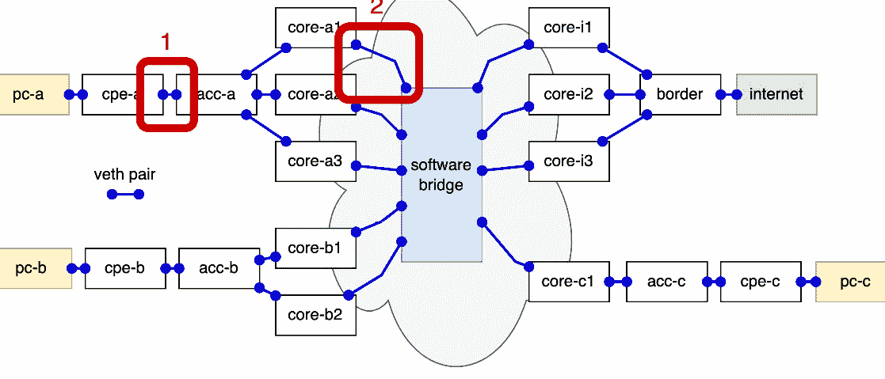

图 10.13 – 显示我们手动检查连接的示意图

该图显示了表示我们将要进行的手动检查的位置的数字。让我们首先开始检查由**1**表示的连接。我们将使用 LLDP 在所有情况下验证连接。

下面的截图显示了 `sudo lldpctl cpe-acc` 命令的输出，该命令通过 SSH 在 `cpe-a` 路由器内部运行。请注意，在示例中，我们从 `netlab` 主机开始：

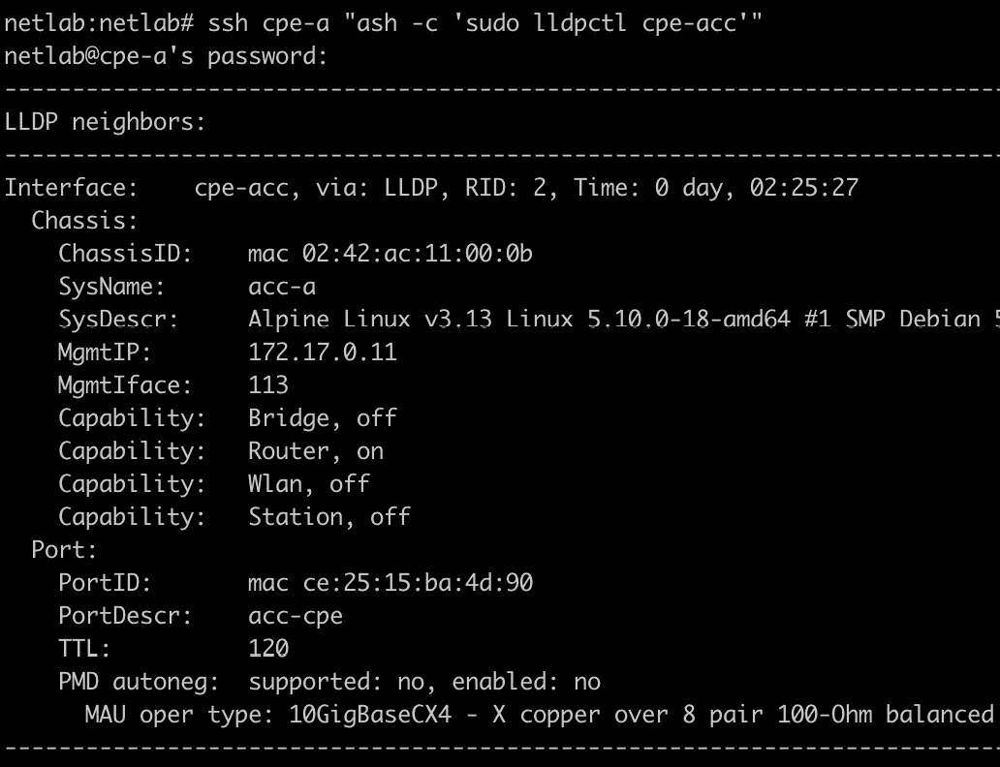

图 10.14 – 验证 cpe-a 连接到 acc-a 的 lldpctl 命令输出

如您所见，`cpe-a` 路由器中的 `cpe-acc` 接口连接到 `acc-a` 路由器中的 `acc-cpe` 接口。

要验证 `core-a1` 的情况：

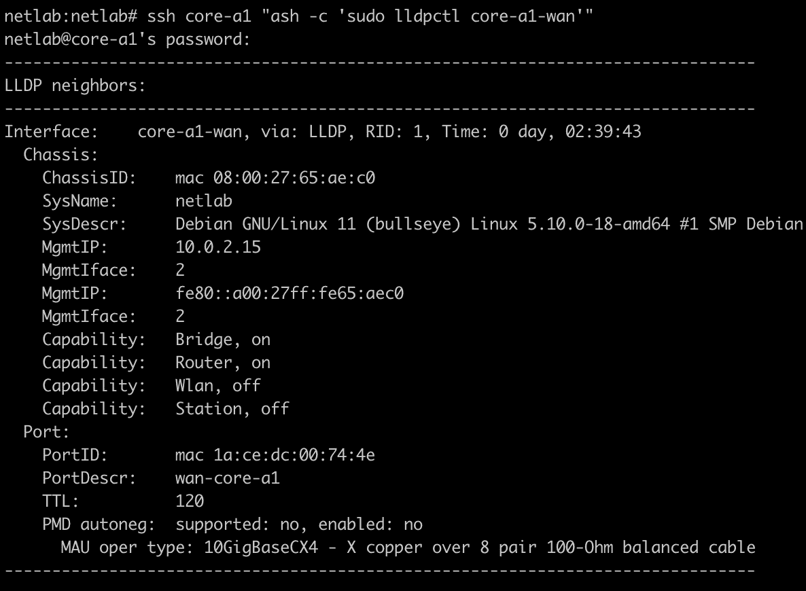

图 10.15 – 验证 core-a1 连接到骨干的 lldpctl 命令输出

如您所见，`core-a1` 路由器的接口 `core-a1-wan` 通过 `wan-core-a1` 连接到 `netlab` 主机。为了验证 `wan-core-a1` 接口是否属于 `backbone` 交换机，我们需要执行以下额外命令之一：

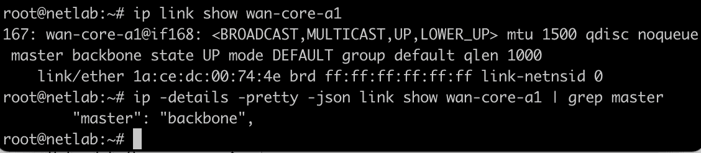

图 10.16 – 检查 wan-core-a1 是否属于 backbone 桥接的命令

*图 10.16* 中显示的任何命令都可以确认 `wan-core-a1` 属于 `backbone`。区别在于第二个命令以 JSON 格式显示输出，这对于软件解析更容易。`lldpctl` 也支持使用 `lldpctl -f json` 的 JSON 输出。

现在，让我们讨论如何添加更多自动化。

# 添加自动化

对于您可能想要创建自动化的过程，有无限的可能性。大多数操作程序都是重复的，如果手动操作，则容易出错。因此，我们需要尽可能自动化我们的网络。

然后让我们描述一些简单的自动化形式，这些形式可以帮助我们的网络操作。

## 链路连接检查自动化

其中一个非常重要且需要大量注意的程序是物理网络的构建和施工，特别是物理机架及其电缆。其复杂性会根据是否使用星型拓扑配置或 Clos 拓扑配置而有所不同，我们已在*第一章*中讨论过。

结合所有可能拓扑的混合拓扑配置更加复杂，其复杂性会增加构建网络错误的机会。例如，如图*图 10.17*所示的 Clos 网络共有 32 个连接，如果再增加三个路由器，其复杂性将增加。

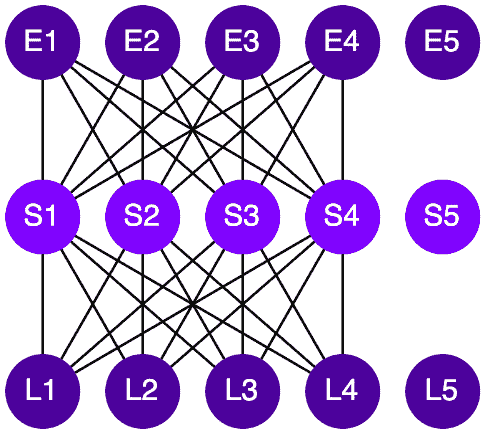

图 10.17 – Clos 网络连接

包含了 **E5**、**S5** 和 **L5** 后，Clos 网络现在将有 50 个连接。因此，对我们来说，连接检查自动化非常重要，可以避免网络设置中的操作失败。

最重要的是，我们的网络实验室可以用来测试链路连接检查的自动化，这可以在生产中后期使用。

在生产环境中，通常需要首先访问堡垒主机，然后才能通过 OOB 网络访问设备。在我们的网络实验室中，堡垒主机与网络实验室主机相同。一旦登录到堡垒主机，自动化代码就可以通过 OOB 网络访问路由器，这与网络实验室中的情况相同。

现在我们编写一些代码来自动化这个过程

### 链路检查示例代码

我添加了一个 Python 脚本，该脚本返回一个包含所有接口及其连接的特定设备的 JSON 列表格式。Python 代码可以在 `Chapter10/NetworkLab/AUTOMATION.md` 中访问。

让我们运行几个示例来查看 Python 脚本的工作方式；以下截图显示了 `internet` 设备的结果：

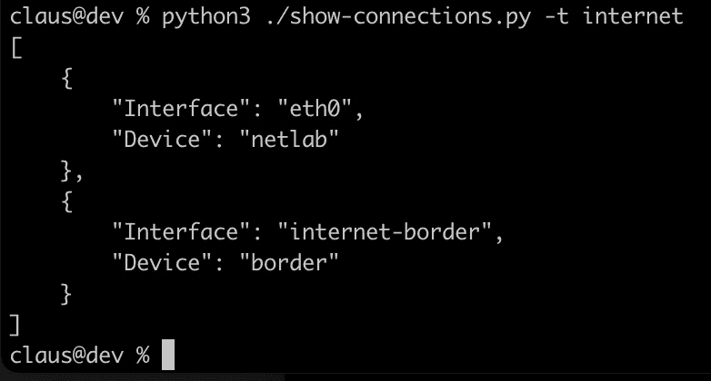

图 10.18 – 检查连接到互联网设备的输出

如您所见，`internet` 设备只有两个接口，一个通过 OOB 网络使用 `eth0` 接口连接到 `netlab` 设备，另一个名为 `internet-border` 的接口连接到 `border` 设备，这证实了 *图 10.1* 中的连接。

现在我们检查 `border` 设备的连接情况。

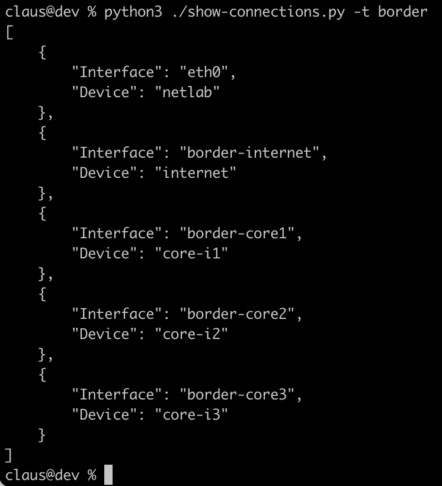

图 10.19 – 检查边界设备连接的输出

如 *图 10.19* 所示，`border` 设备连接到 `internet` 设备和三个核心路由器，`core-i1`、`core-i2` 和 `core-i3`，正如 *图 10.1* 所示。

如果您为所有设备运行此操作，您应该确认所有连接。但我们可以自动化确认所有路由器的连接吗？当然可以，但为此，我们需要读取 `topology.yaml` 文件，然后创建一个循环，该循环将在每个设备上运行以确认连接。我将把这个任务留给你作为练习。

现在我们来解释一下 `show-connections.py` 代码的一些部分。

### 查看代码

`show-connections.py` Python 代码使用 `paramiko` 第三方库作为 SSH 连接的基础，我们已在 *第六章* 中讨论过（可以使用 `pip install paramiko` 安装 `paramiko`）。

Paramiko 是一个低级别的 SSH 连接库，它允许我们在 SSH 会话内创建一个 SSH 会话，因为我们正在使用堡垒机连接到网络实验室中的设备，即实验室主机。通过`NetLab()`类描述的代码，这些堆叠的 SSH 连接的细节被描述，该类有一个名为`connectBastion()`的方法用于连接堡垒机，还有一个名为`connectDevice()`的方法用于连接设备。请注意，这些方法使用一个名为`self.transport`的类属性将堡垒机的`paramiko`处理程序传递给代码中描述的设备通道，如下所示：

```py
device_channel = self.transport.open_channel(
    "direct-tcpip", target_socket, source_socket
)
```

使用堡垒机还有其他方法，例如使用 SSH 代理或 SSH 代理。然而，在我们的例子中，我想展示如何原生地创建一个 SSH 堆叠连接。因为如果您在连接设备之前有两个堡垒机，也有可能使用`paramiko`，但可能不会那么容易使用 SSH 代理和代理。

在 Python 代码中，我们使用`argparser`向我们的命令行添加参数，这样您就可以更改堡垒机的地址或用户名和密码。参数和默认值位于`parse_arguments()`中。如果您输入`--help`，还会自动生成一个帮助指南。

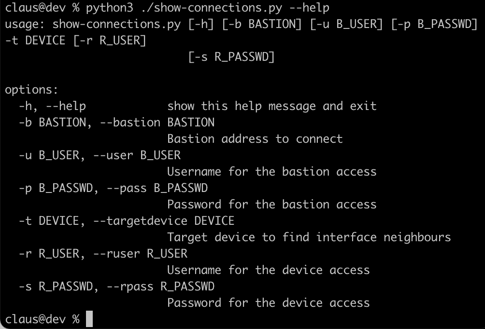

图 10.20 – Python 代码 show-connections.py 的帮助输出

我将让您改进这个 Python 脚本，使其能够读取`topology.yaml`文件，然后验证网络实验室中*图 10.1*所示的所有连接。

现在，让我们看看我们如何自动化接口的 IP 配置。

## IP 配置自动化

在我们能够使用我们的网络进行 IP 流量之前，我们需要将 IP 分配给我们的网络接口，这可以通过手动为每个接口添加 IP 来完成，或者我们可以创建一个自动化的代码来分配 IP 并在网络实验室的设备上配置它们。

对于我们的网络实验室，基本上有两种 IP 分配方式，一种是在设备之间点对点的，另一种是在骨干接口上的多点 WAN。让我们举一个 WAN 接口自动化的例子。名为`configure-ip-wan.py`的 Python 代码位于`Chapter10/NetworkLab/AUTOMATION.md`。

以下截图显示了运行`configure-ip-wan.py`程序后的输出：

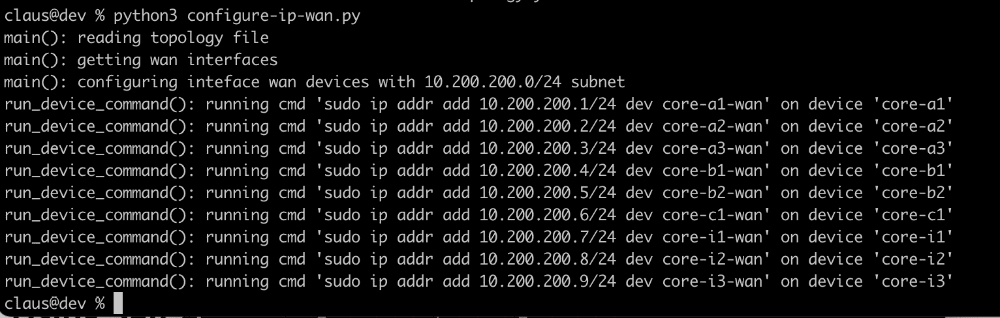

图 10.21 – Python 代码 configure-ip-wan.py 的输出

注意，IP 是在设备上使用 Paramiko 配置的，就像前面的例子一样。代码使用`ipaddress` Python 库，通过创建一个 IP 列表来分配将在 WAN 接口中使用的 IP，如下面的命令所示：

```py
network = ipaddress.ip_network(args.subnet)
valid_ips = list(network.hosts())
```

然后，每个 IP 都是通过在`valid_ips`列表中使用`pop()`方法获得的，如下面的循环所示：

```py
prefix = network.prefixlen
for device, interface in wan_interfaces.items():
    ip = valid_ips.pop(0)
    cmd = "sudo ip addr add {}/{} dev {}".format(ip, prefix, interface)
    run_device_command(args, device, cmd)
```

现在，我们可以使用包含在`Chapter10/NetworkLab/AUTOMATION.md`中的 Python 脚本来测试 WAN 中设备之间的 IP 连通性：

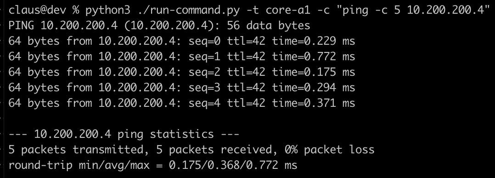

图 10.22 – 通过 WAN 测试 core-a1 和 core-b1 之间的 IP 连通性

从*图 10.21*所示的输出中，我们可以假设`core-b1`接口的 IP 地址是`10.200.200.4`。因此，在`core-a1`上执行的测试是测试`core-a1`和`core-b1`之间通过`骨干网`桥的 IP 连通性。

完成 IP 配置后，您还需要为所有其他接口配置 IP。我将把为其他网络实验室接口添加 IP 作为练习，但就目前而言，这个例子足以指导您继续操作。

## 网络实验室自动化补充

让我们简要讨论一下我们可以添加到实验室中的其他可能的自动化。

### 添加和移除设备

我们可以添加可以读取`topology.yaml`文件的代码，然后根据正在运行的内容确定是否需要某些修改，例如添加或移除设备。我会说，对于我们来说，简单地拆除网络实验室并从头开始构建另一个实验室比移除和添加设备要容易得多，因为在我们的网络仿真中，关闭和启动都很迅速。

因此，添加代码以移除和添加设备在我们的网络实验室中更像是一项练习，而不是真正的实用工具。

### 使用 gRPC 进行自动化

我们也可以使用 gRPC 进行一些自动化，因为 FRRouting 支持此接口。有了这个，我们就消除了通过 SSH 访问设备的必要性。您可以在[`docs.frrouting.org/en/latest/grpc.html`](https://docs.frrouting.org/en/latest/grpc.html)上找到有关 FRRouting 的 gRPC 的更多信息。

### 使用 NETCONF 进行自动化

要使用 NETCONF 进行自动化，您需要在路由器映像中安装`libyang`，在我们的网络实验室中，这是在 Alpine Linux 上运行的 FRRouting。要添加`libyang`，只需在路由器设备上输入`sudo apk add libyang`命令。将 FRRouting 和 NETCONF 结合使用并不是一个很好的文档化选项，所以祝您好运。

### 添加网络退化

您可以向您的网络实验室添加延迟、抖动、丢包、拥塞和其他退化，这些可以是永久的或随时间变化。要移除和添加这些退化，最好的做法是编写可以应用必要的流量整形机制并随后移除它们的自动化代码。我们已在*第九章*中讨论了这些退化方法。

例如，我们可以通过使用 Linux `tc`来在我们的网络实验室的骨干接口上添加一些延迟，如下所示：

```py
sudo tc qdisc add dev wan-core-a1 root netem delay 100ms
```

此命令应在实验室主机上运行，并将向连接`core-a1`到骨干网的`wan-core-a1`接口添加 100 毫秒的延迟。

*图 10.23*显示了与*图 10.22*中相同的测试，但增加了 WAN 延迟。

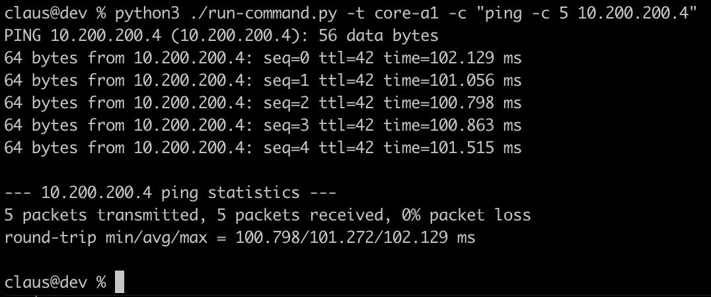

图 10.23 – 在 WAN 中添加 100 毫秒延迟后与图 10.22 中相同的测试

随意将其他网络退化添加到你的网络实验室中，通过自动化 Linux 流量控制在网络实验室接口中的使用。

### 配置路由

在这个阶段，我们的网络实验室不提供 IP 流量功能，因为它不知道如何路由 IP 数据包。可以通过配置接口使用静态路由或为设备添加动态协议来实现两种路由方式，以进行路由表的通信和交换。

在我们的网络实验室中，所有路由器都使用 FRRouting；可用的协议包括 EIGRP、OSPF、ISIS、RIP 或 BGP。完整的列表和更多详细信息可以在[`docs.frrouting.org/`](https://docs.frrouting.org/)找到。

可能还有更多种类的自动化。有些可能只适用于网络实验室，但有些可能在生产网络中使用。希望你能利用网络实验室来提高你的网络自动化代码技能，并在构建生产网络解决方案时更有信心。

让我们现在讨论接下来要做什么以及进一步学习。

# 前进和进一步学习

你可能现在正在思考接下来要做什么，以及你如何可以进步到网络自动化的下一个主题。我在这里提供了一些建议，我建议你遵循这些建议，但请记住，可能还有许多其他路径可以遵循。所以，这只是一个谦逊的建议，希望你能享受这个过程。

## 检查流行的平台和工具

你可以使用许多自动化平台，也许可以调查它们是如何工作的。这个列表将会是动态的，可能每年都会有所变化。所以，请记住如何搜索它们以及如何评估它们。

我对一些平台进行了初步研究，但如果你想要提高你的知识并更深入地了解如何自动化网络，我建议你深入研究。你可能会有一些想法，也许还能改进你今天正在做的事情。

这里是一个你可能想要查看的、最受欢迎的自动化平台和工具的小列表，不分先后顺序：

+   Salt 项目：

    +   简短描述：一个远程执行管理器

    +   来源：[`github.com/saltstack/salt`](https://github.com/saltstack/salt)

    +   贡献者：超过 2K

    +   仓库创建日期：2011 年 2 月

    +   主要语言：Python 98%

    +   许可证：Apache 2.0

    +   赞助商：VMware/public

    +   人气：13K 星标，5.4K 分叉，544 关注

+   Ansible 项目：

    +   简短描述：一个用于配置管理、部署和编排的简单自动化系统

    +   来源：[`github.com/ansible/ansible`](https://github.com/ansible/ansible)

    +   贡献者：超过 5K

    +   仓库创建日期：2012 年 3 月

    +   主要语言：Python 88%，PowerShell 6.9%

    +   许可证：GPL 3.0

    +   赞助商：红帽

    +   人气：56K 星标，23K 分叉，2K 关注

+   Puppet 项目：

    +   简短描述：一个旨在配置、更新和安装系统的通用管理控制系统

    +   来源：[`github.com/puppetlabs/puppet`](https://github.com/puppetlabs/puppet)

    +   贡献者：超过 1K

    +   仓库创建日期：2010 年 9 月

    +   主要语言：Ruby 99%

    +   许可证：Apache 2.0

    +   赞助商/所有者：Puppet by Perforce

    +   人气：6.8K 星标，2.3K 分支，475 关注

+   Chef 项目：

    +   简短描述：一款旨在涵盖所有 IT 基础设施自动化的配置管理工具

    +   来源：[`github.com/chef/chef`](https://github.com/chef/chef)

    +   贡献者：超过 1K

    +   仓库创建日期：2009 年 1 月

    +   主要语言：Ruby 98%

    +   许可证：Apache 2.0

    +   赞助商/所有者：Progress Software Corporation

    +   人气：7.1K 星标，2.6K 分支，374 关注

+   Stackstorm 项目：

    +   简短描述：一个事件驱动的自动化工具

    +   来源：[`github.com/StackStorm/st2`](https://github.com/StackStorm/st2 )

    +   贡献者：超过 300

    +   仓库创建日期：2014 年 4 月

    +   主要语言：Python 94%

    +   许可证：Apache 2.0

    +   赞助商/所有者：Linux 基金会

    +   人气：5.4K 星标，696 分支，168 关注

+   eNMS 自动化项目：

    +   简短描述：一个创建基于工作流程的网络自动化解决方案的高级管理系统

    +   来源：[`github.com/eNMS-automation/eNMS`](https://github.com/eNMS-automation/eNMS )

    +   贡献者：30

    +   仓库创建日期：2017 年 10 月

    +   主要语言：Python 53%，JavaScript 26%，HTML 16%

    +   许可证：GLP 3.0

    +   赞助商：N/A

    +   人气：700 星标，148 分支，73 关注

+   NetBrain 产品：

    +   简短描述：NetBrain 开发了多个网络自动化产品，包括**问题诊断自动化系统**（**PDAS**）

    +   网站：[`www.netbraintech.com/`](https://www.netbraintech.com/)

    +   所有者：NetBrain Automation

+   SolarWinds 网络自动化管理器：

    +   简短描述：SolarWinds 为网络自动化开发的专有产品

    +   网站：[`www.solarwinds.com/network-automation-manager`](https://www.solarwinds.com/network-automation-manager)

    +   所有者：SolarWinds

除了你可以调查的工具和平台，你还可以参与与网络自动化相关的工作组。让我们看看其中的一些。

## 加入网络自动化社区

提高你的知识和跟上新技术的一个策略是参与社区。以下是一些你可能感兴趣关注或参与的团体的小列表：

+   IETF netmgmt 工作组：

    +   简短描述：一个专注于制定自动化网络管理标准（如 RESTCONF、NETCONF 和 YANG）的团体

    +   网站：[`www.ietf.org/topics/netmgmt/`](https://www.ietf.org/topics/netmgmt/)

+   聚会小组：

    +   简短描述：一个很好的建议是加入一个定期举行会议的本地聚会小组。这样，你可以与同一领域的专业人士交谈，并提升你的网络和知识。[`www.meetup.com/`](https://www.meetup.com/) 是一个人们可以组织和聚会的网站。

    +   纽约的例子：[`www.meetup.com/Network-to-Coders/`](https://www.meetup.com/Network-to-Coders/)

    +   悉尼的例子：[`www.meetup.com/it-automation/`](https://www.meetup.com/it-automation/).

    +   旧金山的例子：[`www.meetup.com/sf-network-automation/`](https://www.meetup.com/sf-network-automation/).

+   **北美网络运营商小组**（**NANOG**）：

    +   简短描述：NANOG 拥有大量的文档和演示文稿，还组织会议，在那里你可以找到关于网络自动化的多个主题。

    +   网站：[`www.nanog.org/`](https://www.nanog.org/ )

+   **全球网络进步小组**（**GNA-G**）：

    +   简短描述：GNA-G 是一个来自世界各地的网络专业人士的社区，包括研究、运营和教育。他们组织会议并有一些文档资源。

    +   网站：[`www.gna-g.net/`](https://www.gna-g.net/).

+   网络到代码公司社区：

    +   简短描述：网络到代码是一家维护 GitHub 存储库和讨论网络自动化的[slack.com](https://slack.com)群组的咨询公司，可以免费加入。

    +   GitHub：[`github.com/networktocode/awesome-network-automation`](https://github.com/networktocode/awesome-network-automation )

    +   Slack 群组：[networktocode.slack.com](https://networktocode.slack.com )

+   IP Fabric 公司社区：

    +   简短描述：IP Fabric 公司也维护 GitHub 存储库，并有一个对任何人开放的[slack.com](http://slack.com)群组。

    +   GitHub：[`github.com/community-fabric`](https://github.com/community-fabric)

    +   Slack 群组：[ipfabric-community.slack.com](http://ipfabric-community.slack.com)

其他社区也可以在 IBM、Oracle、VMware、Google 和 Amazon 等一些私营公司中找到。他们甚至可能使用像 Slack、LinkedIn 或 GitHub 这样的公共工具进行沟通，并且可能更专注于这些公司提供的产品，而不是通用的讨论。它们值得一看，因为它们可能有一些可以补充的内容。

提高知识和技能的另一个想法是作为开发者为已经存在的平台做出贡献，或者如果你敢的话，建立自己的平台。

我希望这一部分能给你提供前进的思路。

# 摘要

本章的重点是在网络实验室中亲自动手，检查一些代码自动化在 Go 和 Python 中的工作情况，并最终探索如何继续进行网络自动化的可能性。

到目前为止，你应该对自己如何构建自己的网络实验室、如何改进你的网络自动化代码以及下一步如何继续改进非常有信心。

代表所有为这本书辛勤工作的人们，我们想感谢您抽出时间阅读这本书。收集如此多的信息并以简单愉快的方式传递给他人是一项艰巨的成就。我希望您通过阅读它并发现网络自动化领域的新技术和技巧，已经充分利用了它。

现在，你可以开始接受进一步的挑战，这将使你更深入地了解网络自动化，你将在构建完整解决方案并实践你所学的所有内容时发现这一点。
