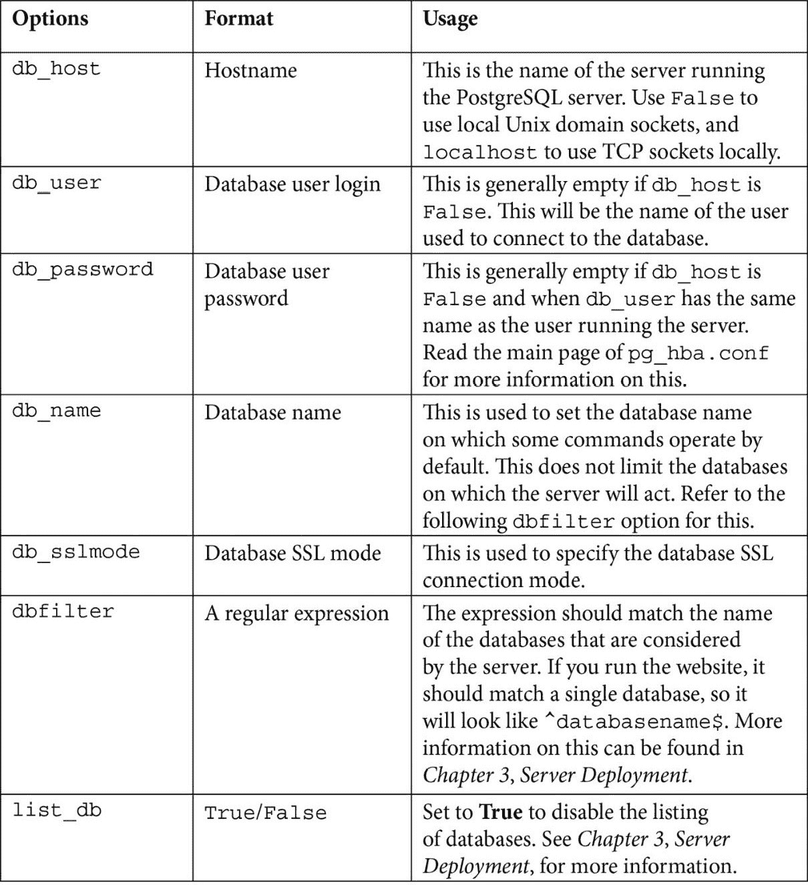

# 1

# 安装 Odoo 开发环境

要开始我们的 Odoo 开发之旅，我们必须通过安装源代码来设置我们的开发环境，这些源代码可以帮助我们增强、调试和改进我们的开发技能。设置 Odoo 开发环境有几种方法，但本章提出了其中最好的方法。你可以在网上找到解释其他方法的几个教程。请记住，本章是关于设置一个与生产环境有不同的要求的开发环境；生产环境需要根据系统中的数据量和用户数量设置不同的参数。我们将在本章中介绍配置文件参数及其用法。

如果你刚开始接触 Odoo 开发，你必须了解 Odoo 生态系统的某些方面。第一个食谱将为你简要介绍 Odoo 生态系统，之后我们将为开发目的安装 Odoo。

在本章中，我们将涵盖以下食谱：

+   理解 Odoo 生态系统

+   从源代码安装 Odoo

+   管理 Odoo 服务器数据库

+   将实例配置存储在文件中

+   激活 Odoo 开发者工具

+   更新附加模块列表

# 技术要求

本章中使用的所有代码都可以从本书的 GitHub 仓库下载，网址为 [`github.com/PacktPublishing/Odoo-17-Development-Cookbook-Fifth-Edition/tree/main/Chapter01`](https://github.com/PacktPublishing/Odoo-17-Development-Cookbook-Fifth-Edition/tree/main/Chapter01)。

# 理解 Odoo 生态系统

Odoo 为开发者提供了开箱即用的模块化和其强大的框架帮助他们快速构建项目。在开始成为成功的 Odoo 开发者的旅程之前，你应该熟悉 Odoo 生态系统中的各种角色。

假设你有一个具有 4 个 CPU 核心、8 GB RAM 和 30 个并发 Odoo 用户的系统。

要确定所需的工作进程数，将用户数除以 6。在这种情况下，30 个用户除以 6 等于 5，这是理论上的所需工作进程数。

要计算理论上的最大工作进程数，将 CPU 核心数乘以 2 并加 1。对于 4 个 CPU 核心，(4 * 2) + 1 等于 9，这是理论上的最大工作进程数。

根据这些计算，你可以为 Odoo 用户使用 5 个工作进程，并为 cron 工作进程额外使用一个工作进程，总共 6 个工作进程。

要估计 RAM 消耗，使用以下公式：

`RAM = 工作进程数 * ((0.8 * 150) + (0.2 * 1024))`

在这种情况下，6 个工作进程乘以 `((0.8 * 150) + (0.2 * 1024))` 大约等于 2 GB 的 RAM。

因此，根据这些计算，Odoo 安装将需要大约 2 GB 的 RAM。

## Odoo 版本

Odoo 有两个不同的版本。第一个是**社区版**，它是开源的，而第二个是**企业版**，它需要付费许可。与其他软件供应商不同，Odoo 企业版只是一个包含额外功能或新应用程序的额外应用程序包，这些应用程序添加到社区版中。企业版运行在社区版之上。社区版受**通用公共许可证 v3.0**（**LGPLv3**）的约束，并包含所有基本的**企业资源规划**（**ERP**）应用程序，如销售、**客户关系管理**（**CRM**）、发票、采购和网站构建器。或者，企业版附带 Odoo 企业版许可证，这是一个专有许可证。Odoo 企业版具有几个高级功能，如全面会计、工作室、**互联网协议语音**（**VoIP**）、移动响应式设计、电子签名、营销自动化、交付和银行集成、**物联网**（**IoT**）等。企业版还为您提供无限的**错误修复支持**。以下图表显示企业版依赖于社区版，这也是为什么您需要后者才能使用前者：


图 1.1 – 社区版和企业版之间的差异

您可以在此处找到两个版本的完整比较：[`www.odoo.com/page/editions`](https://www.odoo.com/page/editions)。

注意

Odoo 在市场上所有开源 ERP 中拥有最多的社区开发者，GitHub 上有 20K+ 的分支，因此您会在应用商店中找到大量的第三方应用程序（模块）。其中一些免费应用程序使用**Affero 通用公共许可证版本 3**（**AGPLv3**）。如果您的应用程序依赖于此类应用程序，则不能在您的应用程序中使用专有许可证。具有 Odoo 专有许可证的应用程序只能在具有 LGPL 或其他专有许可证的模块上开发。

## Git 仓库

Odoo 的整个代码库托管在 GitHub 上。您可以在这里发布稳定版本的错误/问题。您也可以通过提交**拉取请求**（**PR**）来提议一个新功能。Odoo 有多个仓库。以下表格提供了更多信息：

| **仓库** | **用途** |
| --- | --- |
| [`github.com/odoo/odoo`](https://github.com/odoo/odoo) | 这是 Odoo 的社区版。它对公众开放。 |
| [`github.com/odoo/enterprise`](https://github.com/odoo/enterprise) | 这是 Odoo 的企业版。它仅对官方 Odoo 合作伙伴开放。 |
| [`github.com/odoo-dev/odoo`](https://github.com/odoo-dev/odoo) | 这是一个持续开发的仓库。它对公众开放。 |

表 1.1 – Odoo git 仓库

每年，Odoo 发布一个主要版本，这是一个为期 3 年的长期支持版本，以及几个小版本。小版本主要用于 Odoo 的在线 `master` 分支正在开发中且不稳定，因此建议不要用于生产，因为它可能会破坏您的数据库。

## Runbot

Runbot 是 Odoo 的自动化测试环境。每当 Odoo 的 GitHub 分支有新的提交时，Runbot 会拉取这些最新的更改，并为最后四个提交创建构建。在这里，您可以测试所有稳定和开发中的分支。您甚至可以尝试企业版及其开发分支。

每个构建都有一个不同的背景颜色，这表示测试用例的状态。绿色背景颜色表示所有测试用例都成功运行，您可以测试该分支，而红色背景颜色表示该分支上某些测试用例失败，某些功能可能在构建中损坏。您可以查看所有测试用例的日志，这些日志显示了安装过程中确切发生的事情。每个构建都有两个数据库。`all` 数据库安装了所有模块，而 `base` 数据库只安装了基础 Odoo 模块。每个构建都安装了基本的演示数据，因此您可以快速测试它，无需额外配置。

备注

您可以通过访问 [`runbot.odoo.com/runbo`](http://runbot.odoo.com/runbo)t 来访问 Runbot。

以下凭证可用于访问任何 Runbot 构建：

+   **登录 ID**：admin **密码**：admin

+   **登录 ID**：demo **密码**：demo

+   **登录 ID**：portal **密码**：portal

备注

这是一个公共测试环境，因此其他用户可能会使用/测试您正在测试的相同分支。

## Odoo 应用商店

Odoo 几年前推出了应用商店，并立即受到欢迎。在撰写本文时，已有超过 39,000+ 个不同的应用程序托管在那里。您将在这里找到许多免费和付费应用程序，适用于不同版本，包括针对不同商业领域的特定解决方案，如教育、食品工业和医药。还包括扩展或为现有 Odoo 应用程序添加新功能的程序。应用商店还提供了许多美观的主题，适用于 Odoo 网站构建器。在 *第三章*，“创建 Odoo 扩展模块”，您将学习如何为您的自定义模块设置定价和货币。

您可以通过访问 [`www.odoo.com/apps`](https://www.odoo.com/apps) 来访问 Odoo 应用商店。

您可以通过访问 [`www.odoo.com/apps/themes`](https://www.odoo.com/apps/themes) 来访问 Odoo 的主题。

备注

Odoo 在 13 版本之后开源了几个主题，现在使用了一个高级 JavaScript 脚本 *OWL*。我们将在 *第十六章* 中介绍这一点。请注意，这些在之前的版本中是付费主题。这意味着在 Odoo 的 15 和 16 版本中，您可以免费下载和使用这些美观的主题。

## Odoo 社区协会

**Odoo 社区协会**（**OCA**）是一个非营利组织，负责开发和维护基于社区的 Odoo 模块。所有 OCA 模块都是开源的，并由 Odoo 社区成员维护。OCA 的 GitHub 账户包含多个用于不同 Odoo 应用的仓库。除了 Odoo 模块外，它还包含各种工具、迁移库、会计本地化等。

这里是 OCA 官方 GitHub 账户的 URL：[`github.com/OCA`](https://github.com/OCA).

## 官方 Odoo 帮助论坛

Odoo 拥有一个非常强大的框架，只需通过使用/激活选项或遵循特定模式，就能实现许多事情。因此，如果您遇到一些技术问题或者对某些复杂案例不确定，您可以在 Odoo 官方帮助论坛上发布您的疑问。许多开发者活跃在这个论坛上，包括一些官方 Odoo 员工。

您可以通过访问[`www.odoo.com/forum/help-1`](https://www.odoo.com/forum/help-1)来搜索问题或发布您的新问题。

## Odoo 电子学习平台

最近，Odoo 推出了一款新的电子学习平台。该平台提供了许多视频，解释如何使用不同的 Odoo 应用。在撰写本文时，该平台没有技术视频，只有功能视频。

这里是 Odoo 电子学习平台的 URL：[`www.odoo.com/slides`](https://www.odoo.com/slides).

# 从源代码安装 Odoo

强烈建议您使用**Linux Ubuntu**操作系统来安装 Odoo，因为这是 Odoo 用于所有测试、调试和 Odoo 企业安装的操作系统。此外，大多数 Odoo 开发者使用 GNU/Linux 发行版，因此他们更有可能从 Odoo 社区获得对在**GNU/Linux**上发生的操作系统级别问题的支持，而不是*Windows*或*macOS*。

还建议使用与生产环境中将使用的相同环境（相同的发行版和相同的版本）来开发 Odoo 附加模块。这将避免一些令人不快的惊喜，例如在部署当天发现库的版本与预期不同，具有略微不同且不兼容的行为。如果您的工作站使用的是不同的操作系统，一个很好的方法是在工作站上设置一个**虚拟机**（**VM**），并在虚拟机中安装 GNU/Linux 发行版。

注意

Ubuntu 可以作为应用程序在**Microsoft Store**中获取，所以如果您不想切换到 Ubuntu，可以使用它。

对于这本书，我们将使用 Ubuntu Server 22.04 LTS，但您可以使用任何其他 Debian GNU/Linux 操作系统。无论您选择哪个 Linux 发行版，您都应该对如何从命令行使用它有所了解，并且了解系统管理肯定不会有害。

## 准备工作

我们假设您已经安装并运行了 Ubuntu 22.04，并且您有一个具有 root 访问权限的账户或已配置 `sudo`。在以下部分中，我们将安装 Odoo 的依赖项并从 GitHub 下载 Odoo 的源代码。

注意

一些配置需要系统登录用户名，因此当命令行中需要登录用户名时，我们将使用 `$(whoami)`。这是一个 shell 命令，它将在您输入的命令中替换您的登录名。

如果您拥有 GitHub 账户，某些操作将更容易。如果您还没有，请访问 [`github.com`](https://github.com) 并创建一个。

## 如何操作...

要从源安装 Odoo，请执行以下步骤：

1.  运行以下命令以安装主要依赖项：

    ```py
    $ sudo apt-get update
    $ sudo apt install openssh-server fail2ban python3-pip python3-dev libxml2-dev libxslt1-dev zlib1g-dev libsasl2-dev libldap2-dev build-essential libssl-dev libffi-dev libmysqlclient-dev libpq-dev libjpeg8-dev liblcms2-dev libblas-dev libatlas-base-dev git curl python3-venv python3.10-venv fontconfig libxrender1 xfonts-75dpi xfonts-base -y
    ```

1.  下载并安装 **wkhtmltopdf**：

    ```py
    $ wget https://github.com/wkhtmltopdf/packaging/releases/download/0.12.6.1-2/wkhtmltox_0.12.6.1-2.jammy_amd64.deb
    $ sudo dpkg -i wkhtmltox_0.12.6.1-2.jammy_amd64.deb
    ```

    如果在运行上一条命令后遇到任何错误，请使用以下命令强制安装依赖项：

    ```py
    $ sudo apt-get install -f
    ```

1.  现在，安装 PostgreSQL 数据库：

    ```py
    $ sudo apt install postgresql -y
    ```

1.  配置 PostgreSQL：

    ```py
    $ sudo -i -u postgres createuser -s  $(whoami)
    $ sudo su postgres
    $ psql
    alter user $(whoami) with password 'your_password';
    \q
    git:

    ```

    $ git config --global user.name "Your Name"

    $ git config --global user.email youremail@example.com

    ```py

    ```

1.  克隆 Odoo 代码库：

    ```py
    $ mkdir ~/odoo-dev
    $ cd ~/odoo-dev
    odoo-17.0 virtual environment and activate it:

    ```

    $ python3 -m venv ~/venv-odoo-17.0

    venv:

    ```py
    $ cd ~/odoo-dev/odoo/
    $ pip3 install -r requirements.txt
    ```

    ```py

    ```

1.  创建并启动您的第一个 Odoo 实例：

    ```py
    $ createdb odoo-test
    http://localhost:8069 and authenticate it by using the admin account and using admin as the password.
    ```

注意

如果您需要 RTL 支持，请运行以下命令安装 `node` 和 `rtlcss`：`sudo apt-get install nodejs npm -y sudo npm install -``g rtlcss`。

## 它是如何工作的...

在 *步骤 1* 中，我们安装了几个核心依赖项。这些依赖项包括各种工具，如 **git**、**pip3**、**wget**、Python 安装工具等。这些核心工具将帮助我们使用简单命令安装其他 Odoo 依赖项。

在 *步骤 2* 中，我们下载并安装了 `wkhtmltopdf` 包，该包用于 Odoo 打印 PDF 文档，如销售订单、发票和其他报告。Odoo 17.0 需要 `wkhtmltopdf` 的 0.12.6.1 版本，而这个确切版本可能不包括在当前的 Linux 发行版中。幸运的是，`wkhtmltopdf` 的维护者为各种发行版提供了预构建的包，在 [`wkhtmltopdf.org/downloads.html`](http://wkhtmltopdf.org/downloads.html) 上，我们已经从该 URL 下载并安装了它。

此后，我们配置了用于 Odoo 数据库管理的 PostgreSQL。

### PostgreSQL 配置

在 *步骤 3* 中，我们安装了 PostgreSQL 数据库。

在 *步骤 4* 中，我们创建了一个新的数据库用户，登录名为我们的系统用户名。`$(whoami)` 用于获取您的登录名，`-s` 选项用于赋予超级用户权限。让我们看看为什么需要这些配置。

Odoo 使用 `psycopg2` Python 库与 PostgreSQL 数据库连接。要使用 `psycopg2` 库访问 PostgreSQL 数据库，Odoo 默认使用以下值：

+   默认情况下，`psycopg2` 尝试连接到与本地连接上当前用户名相同的数据库，这实现了无密码认证（这对于开发环境来说很好）

+   本地连接使用 Unix 域套接字

+   数据库服务器监听端口`5432`

就这样！你的 PostgreSQL 数据库现在已准备好与 Odoo 连接。

由于这是一个开发服务器，我们已经给用户赋予了`--superuser`权限。在开发实例中，给 PostgreSQL 用户更多权限是可以的，因为这将是你开发实例。对于生产实例，你可以使用`--createdb`命令行代替`--superuser`来限制权限。在生产服务器上，`--superuser`权限将给攻击者利用已部署代码中某些部分的漏洞提供额外的优势。

如果你想要使用不同登录的用户数据库用户，你需要为该用户提供密码。这是通过在创建用户时在命令行上传递`--pwprompt`标志来完成的，在这种情况下，命令将提示你输入密码。

如果用户已经创建，并且你想设置密码（或修改忘记的密码），你可以使用以下命令：

```py
$ psql -c "alter role $(whoami) with password 'newpassword'"
```

如果这个命令失败，并显示错误信息说数据库不存在，那是因为你没有在食谱的*第 4 步*中创建一个以你的登录名命名的数据库。没关系；只需添加`--dbname`选项并指定一个现有数据库的名称，例如`--dbname template1`。

### Git 配置

对于开发环境，我们使用 GitHub 上的 Odoo。使用`git`，你可以轻松地在不同的 Odoo 版本之间切换。请注意，你可以使用`git`的`pull`命令获取最新的更改。

在*第 5 步*中，我们配置了我们的`git`用户。

在*第 6 步*中，我们从 Odoo 的官方 GitHub 仓库下载了源代码。我们使用`git clone`命令下载 Odoo 的源代码。我们使用单个分支，因为我们只想为 17.0 版本创建一个分支。我们还使用了`--depth 1`来避免下载分支的完整提交历史。这些选项将非常快速地下载源代码，但如果你愿意，可以省略这些选项。

Odoo 开发者还提出了夜间构建，这些构建作为 tar 包和分发包提供。使用`git clone`的主要优势是，你将能够在源树中提交新的错误修复时更新你的仓库。你还可以轻松测试任何提议的修复，并跟踪回归，以便你可以使你的错误报告更加精确和有助于开发者。

注意

如果你可以访问企业版源代码，你可以在`~/odoo-dev`目录下的单独文件夹中下载它。

### 虚拟环境

Python **虚拟环境**，或简称为**venvs**，是隔离的 Python 工作空间。这对于 Python 开发者非常有用，因为它们允许安装不同版本的 Python 库的不同工作空间，可能是在不同的 Python 解释器版本上。

你可以使用`python3 -m venv ~/newvenv`命令创建任意数量的环境。这将创建一个`newvenv`目录在指定位置，包含一个`bin/`子目录和一个`lib/python3.10`子目录。

在*第 7 步*中，我们在`~/venv-odoo-17.0`目录中创建了一个新的虚拟环境。这将是我们 Odoo 的独立 Python 环境，Odoo 的所有 Python 依赖都将安装在这个环境中。

要激活虚拟环境，我们需要使用`source`命令。我们使用了`source ~/venv-odoo-17.0/bin/activate`命令来激活虚拟环境。

### 安装 Python 包

Odoo 的源代码在`requirements.txt`中有一个 Python 依赖列表。在*第 8 步*中，我们通过`pip3 install`命令安装了所有这些依赖项。

就这些了。现在，你可以运行 Odoo 实例。

## 启动实例

现在是你一直等待的时刻。为了启动我们的第一个实例，在*第 9 步*中，我们创建了一个新的空数据库，使用了`odoo-bin`脚本，然后使用以下命令启动了 Odoo 实例：

```py
python3 odoo-bin -d odoo-test -i base --addons-path=addons --db-filter=odoo-test$
```

你也可以在`odoo-bin`之前使用`./`来省略`python3`，因为它是可执行的 Python 脚本：

```py
./odoo-bin -d odoo-test -i base --addons-path=addons --db-filter=odoo-test$
```

使用`odoo-bin`，使用以下命令行参数的脚本：

+   `-d database_name`: 默认使用此数据库。

+   `--db-filter=database_name$`: 只尝试连接与提供的正则表达式匹配的数据库。一个 Odoo 安装可以服务于多个实例，这些实例位于不同的数据库中，此参数限制了可用的数据库。尾随的`$`很重要，因为正则表达式用于匹配模式。这使你能够避免选择以指定字符串开头的名称。

+   `--addons-path=directory1,directory2,...`: 这是一个逗号分隔的目录列表，Odoo 将在此目录中查找附加组件。在实例创建时扫描此列表以填充实例中可用的附加模块列表。如果你想使用 Odoo 的企业版，则可以使用此选项添加其目录。

+   `-i base`: 这用于安装基本模块。当你通过命令行创建数据库时，这是必需的。

如果你使用的是与 Linux 登录不同的数据库用户，你需要传递以下附加参数：

+   `--db_host=localhost`: 使用数据库服务器的 TCP 连接

+   `--db_user=database_username`: 使用指定的数据库登录

+   `--db_password=database_password`: 这是用于验证 PostgreSQL 服务器的密码

要获取所有可用选项的概述，请使用`--help`参数。我们将在本章后面看到更多关于`odoo-bin`脚本的内容。

当 Odoo 在一个空数据库上启动时，它将创建支持其操作所需的数据库结构。它还会扫描附加路径以查找可用的附加模块，并将一些模块插入到数据库中的初始记录中。这包括具有默认`admin`密码的`admin`用户，您将使用它进行身份验证。

将您的网络浏览器指向`http://localhost:8069/`将带您到您新创建实例的登录页面，如下截图所示：


图 1.2 – Odoo 实例的登录屏幕

这是因为 Odoo 包含一个 HTTP 服务器。默认情况下，它监听 TCP 端口`8069`上的所有本地网络接口。

# 管理 Odoo 服务器数据库

当使用 Odoo 时，您实例中的所有数据都存储在 PostgreSQL 数据库中。所有您熟悉的标准化数据库管理工具都可用，但 Odoo 还提供了一些常见操作的 Web 界面。

## 准备中

我们假设您的工作环境已经设置好，并且您有一个正在运行的实例。

## 如何操作...

Odoo 数据库管理界面提供了创建、复制、删除、备份和恢复数据库的工具。还有更改主密码的方法，该密码用于保护对数据库管理界面的访问。

### 访问数据库管理界面

要访问数据库，请执行以下步骤：

1.  前往您实例的登录屏幕（如果您已认证，请注销）。

1.  点击**管理数据库**。这将带您导航到[`localhost:8069/web/database/manager`](http://localhost:8069/web/database/manager)（您也可以直接将浏览器指向该 URL）：


图 1.3 – 数据库管理器

### 设置或更改主密码

如果您使用默认值设置了实例并且尚未对其进行修改，正如我们将在下一节中解释的，数据库管理屏幕将显示一个警告，告诉您`master password`实例尚未设置，并建议您通过直接链接设置一个：


图 1.4 – 主密码警告

要设置主密码，请执行以下步骤：

1.  点击**设置主密码**按钮。您将得到一个对话框，要求您填写**新主密码**字段：


图 1.5 – 设置新的主密码

1.  输入一个复杂的新的密码，然后点击**继续**。

如果主密码已经设置，请点击屏幕底部的**设置主密码**按钮来更改它。在打开的对话框中，输入旧的主密码和新密码，然后点击**继续**：


图 1.6 – 修改主密码

注意

主密码是服务器配置文件中的`admin_passwd`键。如果服务器在没有指定配置文件的情况下启动，将在`~/.odoorc`中生成一个新的配置文件。有关配置文件的更多信息，请参考下一道菜谱。

### 创建新数据库

此对话框可用于创建由当前 Odoo 服务器处理的新数据库实例。按照以下步骤操作：

1.  在数据库管理屏幕上，点击屏幕底部的**创建数据库**按钮。这将弹出一个以下对话框：


图 1.7 – 创建数据库对话框

1.  按照以下方式填写表格：

    +   **主密码**：这是此实例的主密码。

    +   **数据库名称**：输入您希望创建的数据库名称。

    +   **电子邮件**：在此处添加您的电子邮件地址；这将是您稍后的用户名。

    +   **密码**：输入您想为新实例管理员用户设置的密码。

    +   **电话号码**：设置您的电话号码（可选）。

    +   **语言**：在下拉列表中选择您希望在新数据库中默认安装的语言。Odoo 将自动加载所选语言的翻译。

    +   **国家**：在下拉列表中选择主要公司的国家。选择此选项将自动配置一些事情，包括公司的货币。

    +   **演示数据**：勾选此框以获取演示数据。这对于运行交互式测试或为客户设置演示很有用，但不应用于设计用于包含生产数据的数据库。

注意

如果您希望使用数据库来运行模块的自动化测试（参考*第七章*，*调试模块*），您需要演示数据，因为 Odoo 中的绝大多数自动化测试都依赖于这些记录才能成功运行。

1.  点击**继续**并等待新数据库初始化。之后，您将被重定向到实例，并以管理员身份连接。

故障排除

如果您被重定向到登录屏幕，这可能是由于`filter`选项。请注意，`odoo-bin start`命令会静默执行，只提供当前数据库。为了解决这个问题，只需像在*从源安装 Odoo*菜谱中所示的那样重新启动 Odoo 而不使用`start`命令。如果您有一个配置文件（请参阅本章后面的*将实例配置存储在文件中*菜谱），请检查`db_filter`选项是否未设置或设置为与新数据库名称匹配的值。

### 复制数据库

通常，您将有一个现有的数据库，并且您可能想对其进行实验以尝试一个程序或运行一个测试，但又不希望修改现有数据。这里的解决方案很简单：复制数据库并在副本上运行测试。根据需要重复此操作：

1.  在数据库管理屏幕上，点击你想要克隆的数据库旁边的**重复数据库**链接：


图 1.8 – 重复数据库对话框

1.  按照以下方式填写表格：

    +   **主密码**：这是 Odoo 服务器的主密码

    +   **新名称**：你想要给副本的名称

1.  点击**继续**。

1.  你可以点击数据库管理屏幕上新创建的数据库的名称，以访问该数据库的登录屏幕。

### 删除数据库

当你完成测试后，你将想要清理重复的数据库。为此，执行以下步骤：

1.  在数据库管理屏幕上，你将在数据库名称旁边找到**删除**按钮。点击它将弹出以下对话框：


图 1.9 – 删除数据库对话框

1.  填写表格，以及**主密码**字段，这是 Odoo 服务器的主密码。

1.  点击**删除**。

警告！可能数据丢失！

如果你选择了错误的数据库并且没有备份，将无法恢复丢失的数据。

### 备份数据库

要创建备份，执行以下步骤：

1.  在数据库管理屏幕上，你将在数据库名称旁边找到**备份**按钮。点击它将弹出以下对话框：


图 1.10 – 备份数据库对话框

1.  按照以下方式填写表格：

    +   `zip`用于生产数据库，因为这是唯一的真实完整备份格式。只有在你不关心文件存储的情况下，才使用`pg_dump`格式进行开发数据库备份。

1.  点击**备份**。备份文件将被下载到你的浏览器。

### 还原数据库备份

如果你需要恢复备份，你需要这样做：

1.  在数据库管理屏幕上，你将在屏幕底部找到**还原数据库**按钮。点击它将弹出以下对话框：


图 1.11 – 还原数据库对话框

1.  按照以下方式填写表格：

    +   **主密码**：这是 Odoo 服务器的主密码。

    +   **文件**：这是一个之前下载的 Odoo 备份。

    +   **数据库名称**：提供要恢复备份的数据库的名称。该数据库必须在服务器上不存在。

    +   **此数据库可能已被移动或复制**：如果原始数据库在另一台服务器上或已被从当前服务器删除，请选择**此数据库已移动**。否则，选择**此数据库是副本**，这是安全的默认选项。

1.  点击**继续**。

注意

无法在数据库之上还原数据库。如果你尝试这样做，你会得到一个错误消息（**数据库还原错误：数据库已存在**）。你需要先删除数据库。

## 它是如何工作的...

除了**更改主密码**屏幕外，这些功能在服务器上运行 PostgreSQL 管理命令并通过 Web 界面返回报告。

主密码是仅存在于 Odoo 服务器配置文件中的一条非常重要的信息，永远不会存储在数据库中。曾经有一个默认值是`admin`，但使用此值是一个安全风险。在 Odoo v9 及以后的版本中，这被标识为*未设置*的主密码，并且当您访问数据库管理界面时，强烈建议您更改它。即使它存储在配置文件下的`admin_passwd`条目中，这也不等同于`admin`用户的密码；这两个密码是独立的。主密码是为 Odoo 服务器进程设置的，它可以处理多个数据库实例，每个实例都有一个独立的`admin`用户及其自己的密码。

安全考虑

记住，在本章中，我们考虑的是开发环境。当您在生产服务器上工作时，Odoo 数据库管理界面是需要被保护的东西，因为它可以访问大量敏感信息，尤其是如果服务器托管了多个不同客户的 Odoo 实例。

要创建一个新的数据库，Odoo 使用 PostgreSQL 的`createdb`工具，并调用内部 Odoo 函数以与您在空数据库上启动 Odoo 时相同的方式初始化新数据库。

要复制数据库，Odoo 使用`createdb`的`--template`选项，将原始数据库作为参数传递。这使用内部和优化的 PostgreSQL 例程在新数据库中复制模板数据库的结构，这比创建备份然后恢复要快得多（尤其是在使用需要您下载备份文件并再次上传的 Web 界面时）。

备份和恢复操作分别使用`pg_dump`和`pg_restore`工具。当使用`zip`格式时，备份还将包括一个文件存储的副本，其中包含当您配置 Odoo 使其不将这些文件保存在数据库中时的文档副本；这是 14.0 版本中的默认选项。除非您更改它，否则这些文件将驻留在`~/.local/share/Odoo/filestore`。

如果备份变得过大，下载它可能会失败。这可能是由于 Odoo 服务器本身无法在内存中处理大文件，或者因为服务器运行在反向代理后面，因为代理中设置了 HTTP 响应大小的限制。相反，由于相同的原因，您可能会在数据库恢复操作中遇到问题。当您开始遇到这些问题时，是时候投资一个更健壮的外部备份解决方案了。

## 还有更多...

经验丰富的 Odoo 开发者通常不使用数据库管理界面，而是从命令行执行操作。例如，要使用演示数据初始化新数据库，可以使用以下单行命令：

```py
$ createdb testdb && odoo-bin -d testdb
```

使用此命令行的优点是，您可以在使用它时请求安装附加组件 – 例如，`-i sale,purchase,stock`。

要复制数据库，停止服务器并运行以下命令：

```py
$ createdb -T dbname newdbname
$ cd ~/.local/share/Odoo/filestore # adapt if you have changed the data_dir
$ cp -r dbname newdbname
$ cd -
```

注意，在开发环境中，通常省略文件存储。

注意

使用`createdb -T`仅在数据库上没有活动会话时才有效，这意味着在从命令行复制数据库之前，您必须关闭您的 Odoo 服务器。

要删除实例，请运行以下命令：

```py
$ dropdb dbname
$ rm -rf ~/.local/share/Odoo/filestore/dbname
```

要创建备份（假设 PostgreSQL 服务器在本地运行），请使用以下命令：

```py
$ pg_dump -Fc -f dbname.dump dbname
$ tar cjf dbname.tgz dbname.dump ~/.local/share/Odoo/filestore/dbname
```

要恢复备份，请运行以下命令：

```py
$ tar xf dbname.tgz
$ pg_restore -C -d dbname dbname.dump
```

警告！

如果您的 Odoo 实例使用不同的用户连接到数据库，您需要传递`-U username`以确保正确的用户是恢复的数据库的所有者。

# 将实例配置存储在文件中

`odoo-bin`脚本有数十个选项，记住它们所有以及如何在启动服务器时正确设置它们是很繁琐的。幸运的是，可以将它们全部存储在配置文件中，并且只需指定您想要在开发中更改的选项。

## 如何完成...

对于此配方，请执行以下步骤：

1.  要为您的 Odoo 实例生成配置文件，请运行以下命令：

    ```py
    $ ./odoo-bin --save --config myodoo.cfg --stop-after-init
    ```

1.  您可以添加额外的选项，它们的值将保存在生成的文件中。所有未设置选项都将使用默认值保存。要获取可能的选项列表，请使用以下命令：

    ```py
    --without-demo will become without_demo. This works for most options, but there are a few exceptions, all of which are listed in the following section.
    ```

1.  编辑`myodoo.cfg`文件（使用以下章节中的表格来更改您可能想要更改的一些参数）。然后，要使用保存的选项启动服务器，请运行以下命令：

    ```py
    $ ./odoo-bin -c myodoo.cfg
    ```

注意

`--config`选项通常缩写为`-c`。

## 它是如何工作的...

启动时，Odoo 通过三次遍历加载其配置。首先，从源代码初始化所有选项的默认值集。然后解析配置，然后任何在文件中定义的值将覆盖默认值。最后，分析命令行选项，它们的值将覆盖之前遍历中获得的配置。

如我们之前提到的，可以通过查看命令行选项的名称来找到配置变量的名称，方法是去除前导破折号并将中间破折号转换为下划线。这里有几个例外，特别是以下这些：


表 1.1 – Odoo 参数在命令行和配置文件中的差异

这里是一个通常通过配置文件设置的选项列表：


表 1.2 – Odoo 参数及其用法

这里是一个与数据库相关的配置选项列表：



表 1.3 – Odoo 参数及其用法

Odoo 使用 Python 的 `ConfigParser` 模块解析配置文件。然而，Odoo 11.0 中的实现已经改变，不再可能使用变量插值。所以，如果你习惯于使用 `%(section.variable)s` 语法从其他变量的值定义变量的值，你需要改变你的习惯，并回到显式值。

一些选项在配置文件中未使用，但在开发过程中广泛使用：


表 1.4 – Odoo 参数及其用法

# 激活 Odoo 开发者工具

当作为开发者使用 Odoo 时，你需要知道如何在网页界面中激活**开发者模式**，以便你可以访问技术设置菜单和开发者信息。启用调试模式将暴露几个高级配置选项和字段。这些选项和字段在 Odoo 中被隐藏，以提供更好的可用性，因为它们不是每天都会使用。

## 如何做到这一点...

在网页界面中激活开发者模式，请执行以下步骤：

1.  连接到你的实例并以 `admin` 身份进行认证。

1.  前往**设置**菜单。

1.  滚动到页面底部并找到**开发者工具**部分：


图 1.12 – 激活不同开发者模式的链接

1.  点击**激活** **开发者模式**。

1.  等待用户界面重新加载。

替代方法

也可以通过编辑 URL 来激活开发者模式。在 `#` 符号之前插入 `?debug=1`。例如，如果你的当前 URL 是 `http://localhost:8069/web#menu_id=102&action=94` 并且你想启用开发者模式，那么你需要将那个 URL 更改为 `http://localhost:8069/web?debug=1#menu_id=102&action=94`。此外，如果你想要使用带有资源的调试模式，那么将 URL 更改为 `http://localhost:8069/web?debug=assets#menu_id=102&action=94`。

要退出开发者模式，你可以执行以下任何一个操作：

+   编辑 URL 并在查询字符串中写入 `?debug=0`。

+   从**设置**菜单中的相同位置使用**停用开发者模式**。

+   在顶部菜单中点击虫子图标，然后点击**离开开发者工具**选项。

许多开发者都在使用浏览器扩展来切换调试模式。通过这样做，你可以快速切换调试模式，而无需访问**设置**菜单。这些扩展适用于 Firefox 和 Chrome。以下截图显示了你可以使用并从 Chrome 商店找到的一个插件：


图 1.13 – 调试模式的浏览器扩展

注意

自 Odoo v13 以来，调试模式的行为已发生变化。从 v13 开始，调试模式的状态存储在会话中，这意味着即使你从 URL 中移除了`?debug`，调试模式仍然会保持激活状态。

## 它是如何工作的...

在开发模式下，会发生两件事：

+   当你在表单视图中的一个字段上或列表视图中的一个列上悬停时，你会得到工具提示。这些提供了有关字段的技术信息（内部名称、类型等）。

+   在右上角用户菜单旁边显示一个带有虫子图标的下拉菜单，让你可以访问显示的模型的技术信息、各种相关视图定义、工作流程、自定义过滤器管理等等。

存在一种名为**开发模式（带资产）**的开发模式变体。这种模式的行为类似于正常的开发模式，但发送到浏览器的 JavaScript 和 CSS 代码没有被压缩，这意味着你可以轻松地使用浏览器中的 Web 开发工具来调试 JavaScript 代码（更多内容请参阅*第十五章*，*Web* *客户端开发*）。

谨慎！

在开发模式下和不带开发模式的情况下测试你的附加组件，因为 JavaScript 库的非压缩版本可能会隐藏只有在你压缩版本中才会出现的错误。

# 更新附加模块列表

当添加新的附加模块时，你需要运行**更新模块列表**向导，以便将你的新应用程序添加到应用程序列表中。在这个配方中，你将学习如何更新应用程序列表。

## 准备工作

使用你的**管理员**账户启动你的实例并连接到它。完成此操作后，激活开发模式（如果你不知道如何激活开发模式，请参阅*激活 Odoo 开发* *工具*配方）。

## 如何操作…

要更新你的实例中可用的附加模块列表，你需要执行以下步骤：

1.  打开**应用程序**菜单。

1.  点击**更新** **应用程序列表**：


图 1.14 – 更新应用程序列表

1.  在出现的对话框中，点击**更新**：


图 1.15 – 更新应用程序列表的对话框

1.  更新完成后，你可以点击**应用程序**条目来查看可用的附加模块的更新列表。你需要在搜索框中移除**应用程序**上的默认过滤器才能看到所有这些。

## 它是如何工作的…

当 Odoo 读取存储在附加模块目录中的`__manifest__.py`时。它期望找到一个 Python 字典。除非清单中包含一个设置为`False`的`installable`键，否则附加模块元数据将被记录在数据库中。如果模块已经存在，信息将被更新。如果没有，将创建一个新的记录。如果之前可用的附加模块未找到，则记录不会被从列表中删除。

注意

只有在你初始化数据库后添加新的附加路径时，才需要更新应用程序列表。如果你在初始化数据库之前将新的附加路径添加到配置文件中，那么就无需手动更新模块列表。

总结到目前为止我们所学的，安装完成后，你可以通过以下命令行启动 Odoo 服务器（如果你使用的是虚拟环境，那么你首先需要激活它）：

```py
python3 odoo-bin -d odoo-test -i base --addons-path=addons --db-filter=odoo-test
```

一旦运行了模块，你就可以通过 http://localhost:8069 访问 Odoo。

你也可以使用配置文件来运行 Odoo，如下所示：

```py
./odoo-bin -c myodoo.cfg
```

一旦启动了 Odoo 服务器，你就可以从 **应用** 菜单中安装/更新模块。
