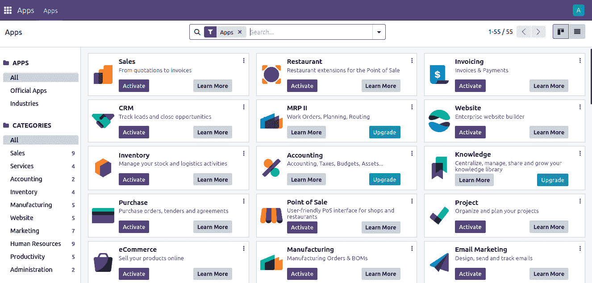
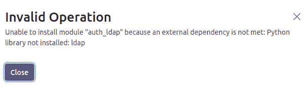
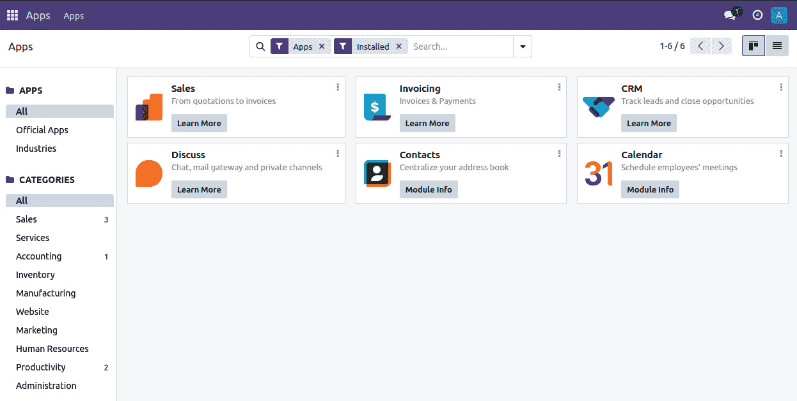
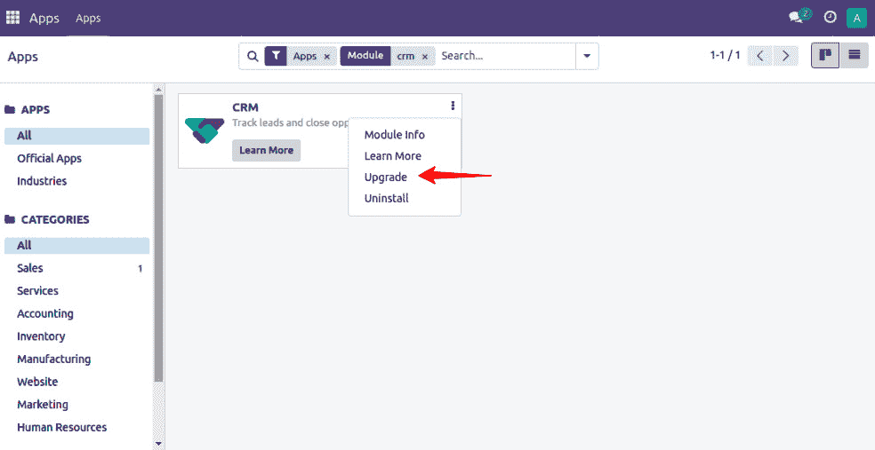
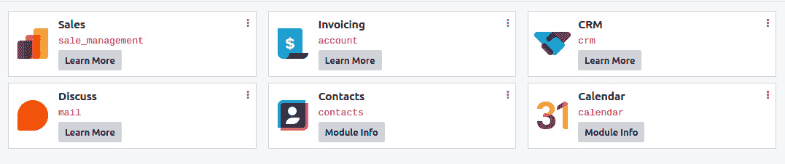

# 2

# 管理 Odoo 服务器实例

在*第一章*中，*安装 Odoo 开发环境*，我们探讨了如何仅使用源代码中提供的标准核心附加模块来设置 Odoo 实例。作为自定义 Odoo 默认功能的常规做法，我们创建一个单独的模块并将其保存在不同的存储库中，以便您可以稍后升级 Odoo 默认功能和您的存储库以保持其整洁。本章重点介绍向 Odoo 实例添加非核心或自定义附加模块。在 Odoo 中，您可以从多个目录加载附加模块。此外，建议您从单独的文件夹中加载第三方附加模块或您自己的自定义附加模块，以避免与 Odoo 核心模块冲突。即使是 Odoo 企业版也是一个附加模块目录，您需要像正常附加模块目录一样加载它。

在本章中，我们将涵盖以下食谱：

+   配置附加模块路径

+   标准化实例目录布局

+   安装和升级本地附加模块

+   从 GitHub 安装附加模块

+   应用附加模块的更改

+   应用和尝试提出的**拉取请求**（**PRs**）

关于术语

在本书中，我们将使用**模块**一词互换。所有这些都指的是可以从用户界面安装到 Odoo 的应用程序或扩展应用程序。

# 配置附加模块路径

通过`addons_path`参数的帮助，您可以将自己的附加模块加载到 Odoo 中。当 Odoo 初始化一个新的数据库时，它将在`addons_path`配置参数中提供的目录内搜索附加模块。Odoo 将在这些目录中搜索潜在的附加模块。

在`addons_path`中列出的目录应包含子目录，每个子目录都是一个附加模块。在数据库初始化之后，您将能够安装这些目录中给出的模块。

## 准备工作

本食谱假设您已经准备好一个实例，并生成了一个配置文件，如*第一章*中“将实例配置存储在文件中”食谱所述，*安装 Odoo 开发环境*。请注意，Odoo 的源代码位于`~/odoo-dev/odoo`，配置文件位于`~/odoo-dev/odoo/myodoo.cfg`。

## 如何操作…

要将`~/odoo-dev/local-addons`目录添加到实例的`addons_path`参数中，请执行以下步骤：

1.  编辑您实例的配置文件；即`~/odoo-dev/myodoo.cfg`。

1.  定位以`addons_path=`开头的行。默认情况下，它应该看起来像以下这样：

    ```py
    addons_path = ~/odoo-dev/odoo/odoo/addons,~/odoo-dev/odoo/addons
    ```

1.  通过在后面添加逗号，然后是您想要添加到`addons_path`中的目录名称，来修改该行，如下面的代码所示：

    ```py
    addons_path = ~odoo-dev/odoo/odoo/addons,~odoo-dev/odoo/addons,~/odoo-dev/local-addons
    ```

1.  从终端重启您的实例：

    ```py
    $ ~/odoo-dev/odoo/odoo-bin -c myodoo.cfg
    ```

## 它是如何工作的…

当 Odoo 重新启动时，会读取配置文件。期望`addons_path`变量的值是一个逗号分隔的目录列表。接受相对路径，但它们相对于当前工作目录，因此在配置文件中应避免使用。

到目前为止，我们只在 Odoo 中列出了附加组件目录，但在`~/odoo-dev/local-addons`中没有任何附加组件模块。即使您将新的附加组件模块添加到此目录，Odoo 也不会在用户界面中显示此模块。为此，您需要执行额外操作，如前一章中“更新附加组件模块列表”食谱中所述。

注意

原因在于，当您初始化新数据库时，Odoo 会自动将您的自定义模块列在可用模块中，但如果您在数据库初始化后添加新模块，那么您就需要手动更新可用模块列表，如*第一章*，“安装 Odoo 开发环境”中“更新附加组件模块列表”食谱所示。

## 还有更多...

当您第一次调用`odoo-bin`脚本以初始化新数据库时，您可以使用逗号分隔的目录列表传递`--addons-path`命令行参数。这将初始化包含在提供的附加组件路径中找到的所有附加组件的可用模块列表。当您这样做时，您必须明确包含基本附加组件目录（`odoo/odoo/addons`）以及核心附加组件目录（`odoo/addons`）。与前面的食谱略有不同的是，本地附加组件不能为空；它们必须包含至少一个子目录，该子目录具有附加模块的最小结构。

在*第三章*，“创建 Odoo 附加组件模块”中，我们将探讨如何编写您自己的模块。在此期间，这里有一个快速技巧来生成 Odoo 会高兴的东西：

```py
$ mkdir -p ~/odoo-dev/local-addons/dummy
$ touch ~/odoo-dev/local-addons/dummy/__init__.py
$ echo '{"name": "dummy", "installable": False}' > \
~/odoo-dev/local-addons/dummy/__manifest__.py
```

您可以使用`--save`选项来保存配置文件的路径：

```py
$ odoo/odoo-bin -d odoo-test \
--addons-path="odoo/odoo/addons,odoo/addons,~/odoo-dev/local-addons" \
--save -c ~/odoo-dev/myodoo.cfg --stop-after-init
```

在这种情况下，使用相对路径是可以的，因为它们将在配置文件中转换为绝对路径。

注意

由于 Odoo 仅在从命令行设置路径时检查附加路径中的目录以查找附加组件，而不是在从配置文件加载路径时检查，因此虚拟模块不再必要。因此，您可以将其删除（或者保留，直到您确信您不需要创建新的配置文件）。

# 标准化实例目录布局

我们建议您的开发和生产环境都使用类似的目录布局。这种标准化将在您必须执行维护操作时非常有用，它还将使您日常工作更加轻松。

此食谱创建了一个目录结构，将具有相似生命周期或类似目的的文件分组到标准子目录中。

注意

此配方仅在你想要管理类似的结构化开发和生产环境时有用。如果你不希望这样做，你可以跳过此配方。

此外，没有必要遵循此配方中相同的文件夹结构。请随意更改此结构以适应你的需求。

我们生成一个干净的目录结构，具有清晰标记的目录和专用角色。我们使用不同的目录来存储以下内容：

+   由其他人维护的代码（在`src/`中）

+   本地特定代码

+   实例的文件存储

## 如何做到这一点…

要创建建议的实例布局，你需要执行以下步骤：

1.  为每个实例创建一个目录：

    ```py
    $ mkdir ~/odoo-dev/projectname
    virtualenv object in a subdirectory called env/:

    ```

    $ python3 -m venv env

    ```py

    ```

1.  创建一些子目录，如下所示：

    ```py
    src/: This contains the clone of Odoo itself, as well as various third-party add-on projects (we have added Odoo source code to the next step in this recipe)
    ```

1.  `local/`：这用于保存你的实例特定附加组件

1.  `bin/`：这包括各种辅助可执行 shell 脚本

1.  `filestore/`：这被用作文件存储

1.  `logs/`（*可选*）：这用于存储服务器日志文件

1.  克隆 Odoo 并安装需求（有关此操作的详细信息，请参阅*第一章*，*安装 Odoo 开发环境*）：

    ```py
    $ git clone -b 17.0 --single-branch --depth 1 https://github.com/odoo/odoo.git src/odoo
    bin/odoo:

    ```

    #!/bin/sh ROOT=$(dirname $0)/..

    PYTHON=$ROOT/env/bin/python3 ODOO=$ROOT/src/odoo/odoo-bin

    $PYTHON $ODOO -c $ROOT/projectname.cfg "$@" exit $?

    ```py

    ```

1.  使脚本可执行：

    ```py
    $ chmod +x bin/odoo
    ```

1.  创建一个空的虚拟本地模块：

    ```py
    $ mkdir -p local/dummy
    $ touch local/dummy/  init  .py
    $ echo '{"name": "dummy", "installable": False}' >\ local/dummy/  manifest  .py
    ```

1.  为你的实例生成一个配置文件：

    ```py
    $ bin/odoo --stop-after-init --save \
    --addons-path src/odoo/odoo/addons,src/odoo/addons,local \
    .gitignore file, which is used to tell GitHub to exclude given directories so that Git will ignore these directories when you commit the code; for example, filestore/, env/, logs/, and src/:

    ```

    # dotfiles，但有例外：

    .*

    !.gitignore

    # python 编译文件

    *.py[co]

    # emacs 备份文件

    *~

    # 未跟踪的子目录

    /env/

    /src/

    /filestore/

    /logs/

    ```py

    ```

1.  为此实例创建一个 Git 仓库，并将你添加到 Git 的文件：

    ```py
    $ git init
    $ git add .
    $ git commit -m "initial version of projectname"
    ```

## 它是如何工作的…

通过为每个项目使用一个 `virtualenv` 环境，我们确保项目的依赖项不会与其他项目的依赖项冲突，这些项目可能运行不同版本的 Odoo 或将使用需要不同 Python 依赖项版本的第三方附加模块。这以牺牲少量磁盘空间为代价。

以类似的方式，通过使用针对我们不同项目的单独克隆的 Odoo 和第三方附加模块，我们能够让每个项目独立发展，并且只在需要它们的实例上安装更新，从而降低引入回归的风险。

`bin/odoo` 脚本允许我们运行服务器而无需记住各种路径或激活 `virtualenv` 环境。这也为我们设置了配置文件。你可以在其中添加额外的脚本以帮助你在日常工作中。例如，你可以添加一个脚本来检出你需要运行实例的不同第三方项目。

关于配置文件，我们在这里只演示了设置的基本选项，但你可以显然设置更多，例如数据库名称、数据库过滤器或项目监听的端口。有关此主题的更多信息，请参阅*第一章*，*安装 Odoo 开发环境*。

最后，通过在 Git 仓库中管理所有这些，使得在不同的计算机上复制设置变得非常容易，并且可以在团队间共享开发。

加速技巧

为了方便项目创建，你可以创建一个包含空结构的模板仓库，并为每个新项目分叉该仓库。这将帮助你避免重复输入`bin/odoo`脚本、`.gitignore`文件以及任何其他需要的模板文件（如`README.md`、变更日志等）。

## 更多...

复杂模块的开发需要各种配置选项，这导致每次想要尝试任何配置选项时都需要更新配置文件。频繁更新配置文件可能会让人头疼，为了避免这种情况，一种替代方法是直接从命令行传递所有配置选项，如下所示：

1.  手动激活`virtualenv`：

    ```py
    $ source env/bin/activate
    ```

1.  进入 Odoo 源目录：

    ```py
    $ cd src/odoo
    ```

1.  运行服务器：

    ```py
    ./odoo-bin --addons-path=addons,../../local -d test-16 -i account,sale,purchase --log-level=debug
    ```

在*步骤 3*中，我们直接从命令行传递了一些配置选项。第一个是`--addons-path`，它加载 Odoo 的核心附加模块目录`addons`和你的附加模块目录`local`，你将在其中放置自己的附加模块。`-d`选项将使用`test-16`数据库或如果没有则创建一个新的数据库。`-i`选项将安装`account`、`sale`和`purchase`模块。接下来，我们传递了`log-level`选项并将日志级别增加到`debug`，以便在日志中显示更多信息。

注意

通过使用命令行，你可以快速更改配置选项。你还可以在终端中查看实时日志。有关所有可用选项，请参阅*第一章*，*安装 Odoo 开发环境*，或使用`--help`命令查看所有选项及其描述。

# 安装和升级本地附加模块

Odoo 的核心功能来自于其附加模块。Odoo 本身提供了丰富的附加模块，同时你也可以从应用商店下载附加模块，或者自己编写附加模块。

在本食谱中，我们将演示如何通过 Web 界面和命令行安装和升级附加模块。

使用命令行进行这些操作的主要好处包括能够同时操作多个附加模块，以及在安装或更新过程中清晰地查看服务器日志，这在开发模式或编写实例安装脚本时非常有用。

## 准备工作

确保您有一个正在运行的 Odoo 实例，其数据库已初始化，并且插件路径已正确设置。在本食谱中，我们将安装/升级几个插件模块。

## 如何操作...

安装或更新插件有两种可能的方法——您可以使用 Web 界面或命令行。

### 从 Web 界面

要使用 Web 界面在您的数据库中安装新的插件模块，请执行以下步骤：

1.  使用**管理员**账户连接到实例并打开**应用**菜单：



图 2.1 – Odoo 应用列表

1.  使用搜索框定位您想要安装的插件。以下是一些帮助您完成此任务的说明：

    1.  激活**未安装**过滤器。

    1.  如果您在寻找特定功能的插件而不是广泛功能的插件，请移除**应用**过滤器。

    1.  在搜索框中输入模块名称的一部分，并将其用作**模块**过滤器。

    1.  您可能会发现使用列表视图更易于阅读。

1.  在卡片下模块名称下点击**安装**按钮。

注意，一些 Odoo 插件模块有外部 Python 依赖项。如果系统上未安装 Python 依赖项，则 Odoo 将中止安装，并显示以下对话框：



图 2.2 – 外部库依赖警告

要解决这个问题，只需在您的系统上安装相关的 Python 依赖项。

要更新数据库中预安装的模块，请执行以下步骤：

1.  使用**管理员**账户连接到实例。

1.  打开**应用**菜单。

1.  点击**应用**：



图 2.3 – Odoo 应用列表

1.  使用搜索框定位您想要安装的插件。以下是一些建议：

    1.  激活`crm`并按*Enter*键搜索 CRM 应用。

    1.  您可能会发现使用列表视图更易于阅读。

1.  在卡片右上角的三点处点击，然后点击**升级**选项：



图 2.4 – 升级模块的下拉链接

激活**开发者**模式以查看模块的技术名称。如果您不知道如何激活开发者模式，请参阅*第一章*，*安装 Odoo 开发环境*：



图 2.5 – 应用程序的技术名称

激活开发者模式后，它将以红色显示模块的技术名称。如果您使用的是 Odoo 社区版，您将看到一些带有**升级**按钮的额外应用。这些应用是 Odoo 企业版应用，为了安装/使用它们，您需要购买许可证。

### 从命令行

在您的数据库中安装新插件，请执行以下步骤：

1.  找到扩展的名称。这是包含`__manifest__.py`文件的目录名称，不包括前导路径。

1.  停止实例。如果您正在处理生产数据库，请进行备份。

1.  运行以下命令：

    ```py
    $ odoo/odoo-bin -c instance.cfg -d dbname -i addon1,addon2 \
    --stop-after-init
    ```

如果在配置文件中已设置，则可以省略`-d dbname`。

1.  重新启动实例。

要更新数据库中已安装的扩展模块，请执行以下步骤：

1.  找到要更新的扩展模块名称；这是包含`__manifest__.py`文件的目录名称，不包括前导路径。

1.  停止实例。如果您正在处理生产数据库，请进行备份。

1.  运行以下命令：

    ```py
    $ odoo/odoo-bin -c instance.cfg -d dbname -u addon1 \
    --stop-after-init
    ```

如果在配置文件中已设置，则可以省略`-d dbname`。

1.  重新启动实例。

## 它是如何工作的…

扩展模块的安装和更新是两个密切相关的过程，但有一些重要区别，如下两个部分所强调的。

### 扩展安装

当您安装扩展时，Odoo 会检查其可用的扩展列表，以查找具有提供名称未安装的扩展。它还会检查该扩展的依赖项，如果有，它会在安装扩展之前递归地安装它们。

单个模块的安装过程包括以下步骤：

1.  如果有任何依赖项，运行`preinit`扩展钩子。

1.  从 Python 源代码加载模型定义，并根据需要更新数据库结构（有关详细信息，请参阅*第四章*，*应用模型*）。

1.  加载扩展的数据文件，并根据需要更新数据库内容（有关详细信息，请参阅*第六章*，*管理模块数据*）。

1.  如果在实例中启用了演示数据，则安装扩展的演示数据。

1.  如果有任何依赖项，运行扩展的`postinit`钩子。

1.  运行扩展视图定义的验证。

1.  如果启用了演示数据和测试，则运行扩展的测试（有关详细信息，请参阅*第十八章*，*自动化测试用例*）。

1.  更新数据库中的模块状态。

1.  从扩展的翻译中更新数据库中的翻译（有关详细信息，请参阅*第十一章*，*国际化*）。

注意

`preinit`和`postinit`钩子分别使用`pre_init_hook`和`post_init_hook`键在`__manifest__.py`文件中定义。这些钩子用于在安装扩展模块之前和之后调用 Python 函数。要了解更多关于`init`钩子的信息，请参阅*第三章*，*创建 Odoo 扩展模块*。

### 扩展更新

当您更新扩展时，Odoo 会检查其可用的扩展模块列表，以查找具有给定名称已安装的扩展。它还会检查该扩展的逆向依赖项（这些是依赖于更新扩展的扩展）。如果有，它也会递归地更新它们。

单个附加组件模块的更新过程包括以下步骤：

1.  如果有，运行附加组件模块的预迁移步骤（有关详细信息，请参阅*第六章*，*管理模块数据*）。

1.  从 Python 源代码加载模型定义，并在必要时更新数据库结构（有关详细信息，请参阅*第四章*，*应用模型*）。

1.  加载附加组件的数据文件，并在必要时更新数据库内容（有关详细信息，请参阅*第六章*，*管理模块数据*）。

1.  如果实例中启用了演示数据，则更新附加组件的演示数据。

1.  如果你的模块有任何迁移方法，运行附加组件的后期迁移步骤（有关详细信息，请参阅*第六章*，*管理模块数据*）。

1.  运行附加组件视图定义的验证。

1.  如果启用了演示数据和测试，则运行附加组件的测试（有关详细信息，请参阅*第十八章*，*自动化测试用例*）。

1.  更新数据库中的模块状态。

1.  从附加组件的翻译中更新数据库中的翻译（有关详细信息，请参阅*第十一章*，*国际化*）。

注意

注意，更新尚未安装的附加组件模块没有任何作用。然而，安装已安装的附加组件模块会重新安装该附加组件，这可能会对某些数据文件产生一些意外影响，这些数据文件包含应由用户更新但在正常模块更新过程中未更新的数据（请参阅*第六章*，*管理模块数据*中的*使用 noupdate 和 forcecreate 标志*配方）。用户界面没有错误风险，但这种情况可能会在命令行中发生。

## 更多内容...

在处理依赖关系时要小心。考虑这样一个例子，你想要安装`sale`、`sale_stock`和`sale_specific`附加组件，其中`sale_specific`依赖于`sale_stock`，而`sale_stock`依赖于`sale`。要安装所有三个，你只需要安装`sale_specific`，因为它会递归地安装`sale_stock`和`sale`依赖项。要更新所有三个，你需要更新`sale`，因为这会递归地更新反向依赖项`sale_stock`和`sale_specific`。

在管理依赖关系时，一个棘手的部分是当你向已经安装了版本的插件添加依赖项时。让我们通过继续之前的例子来理解这一点。想象一下，你在`sale_specific`中添加了对`stock_dropshipping`的依赖。更新`sale_specific`插件不会自动安装新的依赖项，请求安装`sale_specific`也不会。在这种情况下，你可能会收到非常糟糕的错误消息，因为插件的 Python 代码没有成功加载，但插件的数据和数据库中模型的表是存在的。为了解决这个问题，你需要停止实例并手动安装新的依赖项。

# 从 GitHub 安装插件模块

GitHub 是第三方插件的绝佳来源。许多 Odoo 合作伙伴使用 GitHub 来共享他们内部维护的插件，**Odoo 社区协会**（**OCA**）在 GitHub 上共同维护了数百个插件。在你开始编写自己的插件之前，请确保检查是否已经存在你可以直接使用或作为起点的东西。

本食谱将向您展示如何从 GitHub 克隆 OCA 的`partner-contact`项目，并使其包含的插件模块在您的实例中可用。

## 准备工作

假设你想要向客户（合作伙伴）表单添加新字段。默认情况下，Odoo 客户模型没有`gender`字段。如果你想添加一个`gender`字段，你需要创建一个新的模块。幸运的是，邮件列表上的某个人告诉你关于`partner_contact_gender`插件模块的信息，该模块由 OCA 作为`partner-contact`项目的一部分维护。

本食谱中使用的路径反映了在*标准化实例目录*布局食谱中提出的布局。

## 如何操作...

要安装`partner_contact_gender`，请执行以下步骤：

1.  进入你的项目目录：

    ```py
    17.0 branch of the partner-contact project in the src/ directory:

    ```

    $ git clone --branch 17.0 \

    实例.cfg 中的 add-ons_path 行应如下所示：

    ```py
    addons_path = ~/odoo-dev/my-odoo/src/odoo/odoo/addons, \
    ~/odoo-dev/my-odoo/src/odoo/addons, \
    ~/odoo-dev/my-odoo/src/partner-contact, \
    ~/odoo-dev/local-addons
    ```

    ```py

    ```

1.  安装`partner_contact_gender`插件（如果你不知道如何安装模块，请查看之前的食谱，*安装和升级本地*插件模块）。

## 它是如何工作的...

所有 OCA 代码存储库都将它们的插件包含在单独的子目录中，这与 Odoo 对插件路径中目录的期望是一致的。因此，只需在某个位置克隆存储库并将其添加到插件路径中就足够了。

## 更多内容...

一些维护者采用不同的方法，每个存储库有一个插件模块，位于存储库的根目录。在这种情况下，你需要创建一个新的目录，将其添加到插件路径中，并在该目录中克隆你需要的所有插件。记住，每次添加新的存储库克隆时，都要更新插件模块列表。

# 应用更改以添加插件

大多数在 GitHub 上可用的附加模块都可能发生变化，并且不遵循 Odoo 对其稳定版本施加的规则。它们可能收到错误修复或增强，包括您提交的问题或功能请求，这些更改可能引入数据库模式更改或数据文件和视图的更新。本食谱解释了如何安装更新版本。

## 准备工作

假设您报告了`partner_contact_gender`的问题，并收到通知称该问题已在`partner-contact`项目的`17.0`分支的最新修订版中解决。在这种情况下，您可能希望使用这个最新版本更新您的实例。

## 如何操作…

要将 GitHub 上的源代码修改应用到您的附加模块，您需要执行以下步骤：

1.  停止使用该附加模块的实例。

1.  如果是生产实例，请备份（参考*第一章*中的*管理 Odoo 服务器数据库*食谱，*安装 Odoo 开发环境*）。

1.  前往`partner-contact`克隆的目录：

    ```py
    $ cd ~/odoo-dev/my-odoo/src/partner-contact
    ```

1.  为项目创建一个本地标签，以便在出现问题的情况下回滚到该版本：

    ```py
    $ git checkout 17.0
    $ git tag 17.0-before-update-$(date --iso)
    ```

1.  获取源代码的最新版本：

    ```py
    partner_address_street3 add-on in your databases (refer to the *Installing and upgrading local add-on* *modules* recipe).
    ```

1.  重新启动实例。

## 它是如何工作的…

通常，附加模块的开发者偶尔会发布附加模块的最新版本。此更新通常包含错误修复和新功能。在这里，我们将获取附加模块的新版本并在我们的实例中更新它。

如果`git pull --ff-only`失败，您可以使用以下命令回滚到上一个版本：

```py
$ git reset --hard 17.0-before-update-$(date --iso)
```

然后，您可以尝试不带`--ff-only`的`git pull`，这将导致合并，但这意味着您在附加模块上有本地更改。

## 参见

如果更新步骤失败，请参考*第一章*中的*从源更新 Odoo*食谱，*安装 Odoo 开发环境*，以获取恢复说明。请记住，始终在数据库生产副本上测试更新。

# 应用和尝试提议的 PR

在 GitHub 的世界里，PR 是由开发者提出的一个请求，以便项目的维护者可以包含一些新的开发成果。这样的 PR 可能包含错误修复或新功能。这些请求在合并到`main`分支之前会经过审查和测试。

本食谱解释了如何将 PR 应用到您的 Odoo 项目中以测试改进或错误修复。

## 准备工作

如前一个食谱中所述，假设您报告了`partner_address_street3`的问题，并收到通知称该问题已在项目的`17.0`分支的一个未合并的 PR 中解决。开发者要求您在 PR *#123* 中验证修复。您需要使用这个分支更新测试实例。

你不应该直接在生产数据库上尝试这样的分支，所以首先创建一个包含生产数据库副本的测试环境（请参阅*第一章*，*安装 Odoo 开发环境*)。

## 如何做到这一点…

要应用和尝试 GitHub PR 的附加模块，你需要执行以下步骤：

1.  停止实例。

1.  前往`partner-contact`被克隆的目录：

    ```py
    $ cd ~/odoo-dev/my-odoo/src/partner-contact
    ```

1.  为项目创建一个本地标签，以便在事情出错时可以回滚到该版本：

    ```py
    $ git checkout 17.0
    123:

    ```

    在你的数据库中添加`partner_contact_gender1`附加模块并重启实例（如果你不知道如何更新模块，请参阅*安装和升级本地附加模块*配方）。

    ```py

    ```

1.  测试更新—尝试重现你的问题，或者尝试你想要的特性。

如果这不起作用，请在 GitHub 的 PR 页面上评论，解释你做了什么以及什么没有起作用，以便开发者可以更新 PR。

如果它有效，请在 PR 页面上说明；这是 PR 验证过程的重要组成部分，并将加快`main`分支的合并。

## 它是如何工作的…

我们正在使用一个 GitHub 功能，该功能允许使用`pull/nnnn/head`分支名称通过数字拉取 PR，其中`nnnn`是 PR 的编号。`git pull`命令将合并远程分支到我们的分支中，在我们的代码库中应用更改。之后，我们更新附加模块，测试它，并向更改的作者报告任何失败或成功。

## 更多内容…

如果你想要同时测试同一存储库中的不同 PR，你可以重复此配方中的*第 4 步*：

```py
$ git checkout -b 17.0-custom
```

使用不同的分支将帮助你记住你使用的是来自 GitHub 的版本，而是一个自定义版本。

注意

可以使用`git branch`命令列出你仓库中所有的本地分支。

从那时起，如果你需要应用来自 GitHub 的`17.0`分支的最新修订版，你将需要在不使用`--ff-only`的情况下拉取它：

```py
$ git pull origin 17.0
```
