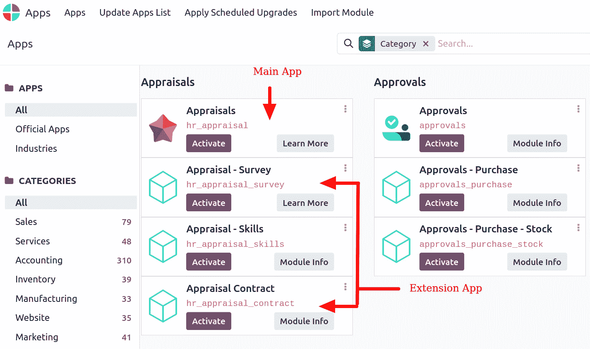
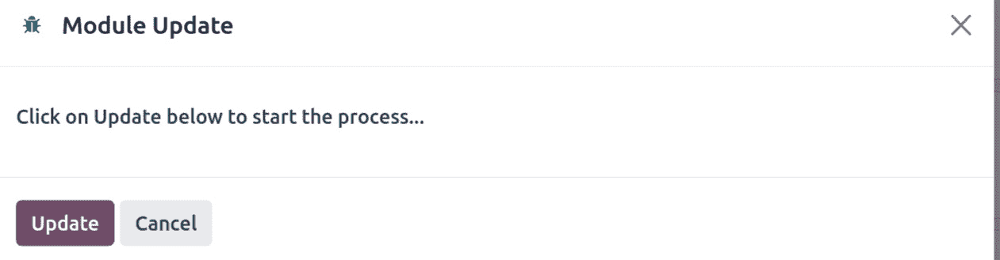
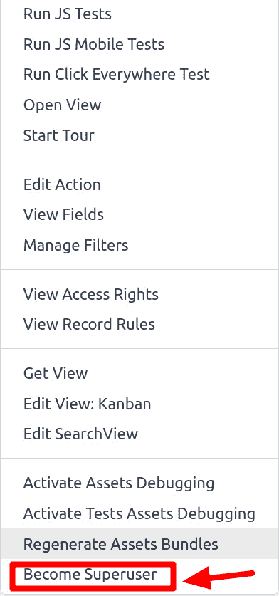
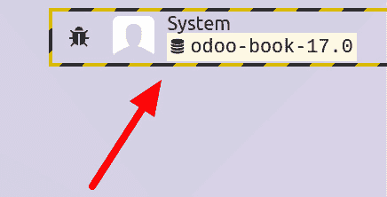
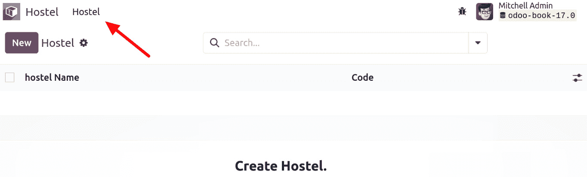

# 第三章：创建 Odoo 附加模块

现在我们已经拥有了开发环境，并且知道如何管理 Odoo 服务器实例和数据库，我们将学习如何创建 Odoo 附加模块。

本章的主要目标是理解附加模块的结构以及向其中添加组件的典型增量工作流程。本章食谱名称中提到的各种组件将在后续章节中详细介绍。

Odoo 模块可以包含多个元素：

+   **业务对象**：

    +   声明为 Python 类，这些资源根据其配置自动由 Odoo 持久化

+   **对象视图**：

    +   业务对象 UI 显示的定义

+   **数据文件（声明模型元数据的 XML 或 CSV 文件）**：

    +   视图或报告

    +   配置数据（模块参数化和安全规则）

    +   示例数据和更多内容

+   **Web 控制器**：

    +   处理来自网络浏览器、静态网络数据图像、或由 Web 界面或网站使用的 CSS 或 JavaScript 文件的请求

本章中，我们将涵盖以下食谱：

+   创建和安装新的附加模块

+   完成附加模块清单

+   组织附加模块的文件结构

+   添加模型

+   添加菜单项和视图

+   添加访问安全

+   使用`scaffold`命令创建模块

# 技术要求

对于本章，你应已安装 Odoo，并且应已遵循*第一章*，*安装 Odoo 开发环境*中的食谱。你还应熟悉发现和安装额外附加模块，如*第二章*，*管理 Odoo 服务器实例*中所述。

本章中使用的所有代码都可以从 GitHub 仓库[`github.com/PacktPublishing/Odoo-17-Development-Cookbook-Fifth-Edition/tree/main/Chapter03`](https://github.com/PacktPublishing/Odoo-17-Development-Cookbook-Fifth-Edition/tree/main/Chapter03)下载。

# 什么是 Odoo 附加模块？

除了框架代码外，Odoo 的所有代码库都以模块的形式打包。这些模块可以从数据库中随时安装或卸载。这些模块有两个主要目的。你可以添加新的应用程序/业务逻辑，或者你可以修改现有的应用程序。简单来说，在 Odoo 中，一切从模块开始，到模块结束。

Odoo 提供各种业务解决方案，如销售、采购、POS、会计、制造、项目和库存。创建新模块涉及向业务添加新功能或升级现有功能。

Odoo 的最新版本在社区和商业版中都引入了众多新模块。这些包括会议室、待办事项以及几个与 WhatsApp 相关的集成模块。

此外，这个版本还包含了许多令人兴奋的新功能，如重新设计的用户界面、改进的搜索功能以及 CRM、制造和电子商务的新功能。新版本还包括其他一些改进，如增强的性能、改进的安全性和更多集成。

Odoo 被各种规模的公司使用；每个公司都有不同的业务流程和需求。为了处理这个问题，Odoo 将应用程序的功能划分为不同的模块。这些模块可以根据需要加载到数据库中。基本上，管理员可以在任何时候启用/禁用这些功能。因此，相同的软件可以根据不同的需求进行调整。查看以下 Odoo 模块的截图；列中的第一个模块是主应用程序，其他模块旨在为该应用程序添加额外功能。要按应用程序的类别分组获取模块列表，请转到**应用**菜单并按类别分组：



图 3.1 – 按类别分组应用程序

如果您计划在 Odoo 中开发新的应用程序，您应该为各种功能创建边界。这将非常有帮助，可以将您的应用程序划分为不同的附加模块。现在您已经知道了 Odoo 中附加模块的目的，我们可以开始构建自己的模块。

# 创建和安装新的附加模块

在这个食谱中，我们将创建一个新的模块，使其在我们的 Odoo 实例中可用，并安装它。

## 准备工作

首先，我们需要一个准备就绪的 Odoo 实例。

如果您遵循了*第一章*中“从源代码轻松安装 Odoo”食谱的*安装 Odoo 开发环境*，Odoo 应该位于`~/odoo-dev/odoo`。为了解释的目的，我们将假设这个位置是 Odoo，尽管您可以使用任何其他您偏好的位置。

我们还需要一个位置来添加我们自己的 Odoo 模块。为了本食谱的目的，我们将在`odoo`目录旁边使用`local-addons`目录，位于`~/odoo-dev/local-addons`。

您可以在 GitHub 上上传自己的 Odoo 模块，并在本地系统上克隆它们以进行开发。

## 如何操作...

作为示例，我们将为这一章创建一个小型附加模块来管理宿舍。

以下步骤将创建并安装一个新的附加模块：

1.  更改我们将工作的工作目录，并创建放置自定义模块的附加目录：

    ```py
    $ cd ~/odoo-dev
    my_hostel:

    ```

    __init__.py 文件：

    ```py
    my_hostel folder, create an __manifest__.py file with this line:

    ```

    {'name': 'Hostel Management'}

    ```py

    ```

    ```py

    ```

1.  在附加路径中启动您的 Odoo 实例，包括模块目录：

    ```py
    --save option is added to the Odoo command, the add-ons path will be saved in the configuration file. The next time you start the server, if no add-on path option is provided, this will be used.
    ```

1.  在您的 Odoo 实例中启用新模块。使用**admin**登录 Odoo，在**关于**框中启用**开发者模式**，然后在**应用**顶部菜单中选择**更新应用列表**。现在，Odoo 应该知道我们的 Odoo 模块：



图 3.2 – 更新应用列表的对话框

1.  选择`my_hostel`。点击**激活**按钮，安装将完成。

## 它是如何工作的...

Odoo 模块是一个包含代码文件和其他资产的目录。所使用的目录名是该模块的技术名称。模块清单中的`name`键是其标题。

`__manifest__.py`文件是模块清单。它包含一个包含模块元数据的 Python 字典，包括类别、版本、它所依赖的模块以及它将加载的数据文件列表。它包含有关附加模块的重要元数据并声明应加载的数据文件。

在这个食谱中，我们使用了最小的清单文件，但在实际模块中，我们需要其他重要的键。这些将在下一个食谱*完成附加模块清单*中讨论。

模块目录必须是 Python 可导入的，因此它还需要有一个`__init__.py`文件，即使它是空的。要加载一个模块，Odoo 服务器将导入它。这将导致`__init__.py`文件中的代码被执行，因此它作为运行模块 Python 代码的入口点。因此，它通常包含导入语句来加载模块 Python 文件和子模块。

已知的模块可以直接从命令行使用`--init`或`my_hostel`应用程序安装，你可以使用`my_hostel`。此列表是在你从当时提供的附加路径上找到的模块创建新数据库时设置的。它可以通过**更新模块** **列表**菜单在现有数据库中更新。

# 完成附加模块清单

清单是 Odoo 模块的一个重要组成部分。

## 准备工作

我们应该有一个模块来工作，它已经包含一个`__manifest__.py`清单文件。你可能想遵循前面的食谱来提供这样一个模块来工作。

## 如何做...

我们将在我们的附加模块中添加一个清单文件和一个图标：

1.  要创建包含最相关键的清单文件，编辑模块的`__manifest__.py`文件，使其看起来像这样：

    ```py
    {
        'name': "Hostel Management",
        'summary': "Manage Hostel easily",
        'description': "Efficiently manage the entire residential facility in the school.", # Supports reStructuredText(RST) format (description is Deprecated),
        'author': "Your name",
        'website': "http://www.example.com",
        'category': 'Uncategorized',
        'version': '17.0.1.0.0',
        'depends': ['base'],
        'data': ['views/hostel.xml'],
        'assets': {
        'web.assets_backend': [
            'web/static/src/xml/**/*',
        ],
               },
         'demo': ['demo.xml'],
    }
    ```

1.  要为模块添加图标，选择一个 PNG 图像并复制到`static/description/icon.png`。

## 它是如何工作的...

清单文件中的内容是一个常规 Python 字典，具有键和值。我们使用的示例清单包含最相关的键：

+   `name`：这是模块的标题。

+   `summary`：这是带有单行描述的副标题。

+   `description`：这是一个以纯文本或**ReStructuredText (RST)**格式编写的长描述。它通常被三重引号包围，并在 Python 中用于界定多行文本。有关 RST 快速入门参考，请访问[`docutils.sourceforge.net/docs/user/rst/quickstart.html`](http://docutils.sourceforge.net/docs/user/rst/quickstart.html)。

+   `author`：这是一个包含作者名称的字符串。当有多个作者时，通常使用逗号分隔他们的名字，但请注意，它仍然是一个字符串，而不是 Python 列表。

+   `website`：这是人们应该访问的 URL，以了解更多关于模块或作者的信息。

+   `category`：这是根据兴趣领域组织模块。可以在 [`github.com/odoo/odoo/blob/17.0/odoo/addons/base/data/ir_module_category_data.xml`](https://github.com/odoo/odoo/blob/17.0/odoo/addons/base/data/ir_module_category_data.xml) 中看到可用的标准类别名称列表。然而，也可以在这里定义其他新的类别名称。

+   `version`：这是模块的版本号。Odoo 应用商店可以使用它来检测已安装模块的新版本。如果版本号不以 Odoo 目标版本开头（例如，`17.0`），它将被自动添加。不过，如果您明确地声明 Odoo 目标版本会更具有信息量——例如，使用 `17.0.1.0.0` 或 `17.0.1.0`，而不是分别使用 `1.0.0` 或 `1.0`。

+   `depends`：这是一个包含它直接依赖的模块的技术名称列表。如果您的模块不依赖于任何其他附加模块，那么您至少应该添加一个 `base` 模块。不要忘记包括任何定义 XML IDs、视图或模型并在此模块中引用的模块。这将确保它们按正确顺序加载，避免难以调试的错误。

+   `data`：这是在模块安装或升级期间要加载的数据文件的相对路径列表。路径相对于模块 `root` 目录。通常，这些是 XML 和 CSV 文件，但也可能有 YAML 数据文件。这些在 *第六章*，*管理模块数据* 中进行了深入讨论。

+   `demo`：这是包含演示数据的文件的相对路径列表，用于加载。只有在数据库创建时启用了 `Demo Data` 标志的情况下，才会加载这些文件。

用作模块图标的图像是位于 `static/description/icon.png` 的 PNG 文件。

Odoo 预计在主要版本之间会有显著的变化，因此为某个主要版本构建的模块很可能在没有转换和迁移工作的情况下与下一个版本不兼容。因此，在安装模块之前，确保了解模块的 Odoo 目标版本非常重要。

为了确保兼容性，我们需要遵循以下步骤：

+   首先，检查安装是否成功。如果成功了，然后继续检查模块的功能是否正常工作。

+   然而，如果安装不成功，您将需要根据您收到的错误调整代码和功能逻辑。

## 还有更多...

在模块清单中，除了有长描述外，还可以有单独的描述文件。自 8.0 版本以来，它可以由一个 `README` 文件替换，该文件具有 `.txt`、`.rst` 或 `.md`（Markdown）扩展名。否则，在模块中包含一个 `description/index.html` 文件。

此 HTML 描述将覆盖在清单文件中定义的描述。

还有几个常用的键：

+   `licence`：默认值是`LGPL-3`。此标识符用于在模块中提供的许可证下。其他许可证可能性包括`AGPL-3`、`Odoo Proprietary License v1.0`（主要用于付费应用）和`Other OSI Approved Licence`。

+   `application`：如果这是`True`，则模块被列为应用程序。通常，这用于功能区域的中心模块。

+   `auto_install`：如果这是`True`，则表示这是一个*粘合*模块，当所有依赖项都安装时，它会自动安装。

+   `installable`：如果这是`True`（默认值），则表示该模块可供安装。

+   `external_dependencies`：一些 Odoo 模块内部使用`Python/bin`库。如果您的模块使用此类库，您需要将它们放在这里。这将阻止用户在主机机器上未安装列出的模块时安装模块。

+   `{pre_init, post_init, uninstall}_hook`：这是一个在安装/卸载期间调用的 Python 函数钩子。有关更详细的示例，请参阅*第八章*，*高级服务器端开发技术*。

+   `Assets`：定义了所有静态文件如何在各种资产包中加载。Odoo 资产按包分组。每个包（特定类型的文件路径列表 - `xml`、`js`、`css`或`scss`）在模块清单中列出。

有许多特殊键用于应用商店列表：

+   `price`：此键用于设置您的附加模块的价格。此键的值应该是一个整数值。如果没有设置价格，这意味着您的应用是免费的。

+   `currency`：这是价格所用的货币。可能的值是`USD`和`EUR`。此键的默认值是`EUR`。

+   `live_test_url`：如果您想为您的应用提供一个实时测试 URL，您可以使用此键在应用商店上显示“实时预览”按钮。

+   `iap`：如果模块用于提供 IAP 服务，请设置您的 IAP 开发者密钥。

+   `images`：这给出了图像的路径。这张图片将被用作 Odoo 应用商店的封面图片。

# 组织附加模块文件结构

附加模块包含代码文件和其他资产，如 XML 文件和图像。对于这些文件中的大多数，我们可以在模块目录内部自由选择放置位置。

然而，Odoo 在模块结构上使用了一些约定，因此建议遵循它们。适当的代码提高了可读性，简化了维护，有助于调试，降低了复杂性，并促进了可靠性。这些适用于每个新模块和所有新开发。

## 准备工作

我们期望有一个附加模块目录，其中只包含`__init__.py`和`__manifest__.py`文件。在这个菜谱中，我们假设这是`local-addons/my_hostel`。

## 如何操作...

要为附加模块创建基本骨架，请执行以下步骤：

1.  为代码文件创建目录：

    ```py
    $ cd local-addons/my_hostel
    $ mkdir models
    $ touch models/__init__.py
    $ mkdir controllers
    $ touch controllers/__init__.py
    $ mkdir views
    $ touch views/views.xml
    $ mkdir security
    $ mkdir wizards
    $ touch wizards/__init__.py
    $ mkdir reports
    $ mkdir data
    $ mkdir demo
    __init__.py file so that the code in the subdirectories is loaded:

    ```

    从`. import models`导入

    从`controllers`模块导入

    从`. import wizards`导入

    ```py

    ```

这应该会让我们开始一个包含最常用目录的结构，类似于这个：

```py
my_hostel
├── __init__.py
├── __manifest__.py
├── controllers
│   └── __init__.py
├── data
├── demo
├── i18n
├── models
│   └── __init__.py
├── security
├── static
│   ├── description
│   └── src
│       ├─ js
│       ├─ scss
│       ├─ css
│       └ xml
├── reports
├── wizards
│   └── __init__.py
└──views
   └── __init__.py
```

## 它是如何工作的...

为了提供一些背景信息，一个 Odoo 扩展模块可以有三类文件：

+   *Python 代码*由`__init__.py`文件加载，其中`.py`文件和代码子目录被导入。包含 Python 代码的子目录，反过来，需要它们自己的`__init__.py`文件。

+   需要在`__manifest__.py`模块清单的`data`和`demo`键中声明的*数据文件*，以便加载，通常是用于用户界面的 XML 和 CSV 文件、固定数据以及演示数据。也可能有 YAML 文件，这些文件可以包含一些在模块加载时运行的程序性指令——例如，用于在 XML 文件中以编程方式生成或更新记录，而不是静态地。

+   *Web 资源*，例如 JavaScript 代码和库、CSS、SASS 以及 QWeb/HTML 模板，是用于构建 UI 部分和管理这些 UI 元素中用户动作的文件。这些文件通过在`assets`键上的清单声明，包括新文件和现有文件，将这些资源添加到 Web 客户端、小部件或网站页面上。

扩展文件组织在以下目录中：

+   `models/`目录包含后端代码文件，从而创建模型及其业务逻辑。建议每个模型一个文件，文件名与模型同名——例如，`hostel.py`用于`hostel.hostel`模型。这些在*第四章*，*应用模型*中有详细说明。

+   `views/`目录包含用户界面的 XML 文件，包括动作、表单、列表等。与模型一样，建议每个模型一个文件。网站模板的文件名预期以`_template`后缀结尾。后端视图在*第九章*，*后端视图*中有所解释，网站视图在*第十四章*，*CMS 网站开发*中有所说明。

+   `data/`目录包含包含模块初始数据的其他数据文件。数据文件在*第六章*，*管理模块数据*中有所解释。

+   `demo/`目录包含带有演示数据的文件，这对于测试、培训或模块评估很有用。

+   `i18n/`是 Odoo 查找翻译`.pot`和`.po`文件的位置。有关更多详细信息，请参阅*第十一章*，*国际化*。这些文件不需要在清单文件中提及。

+   `security/`目录包含定义访问控制列表的数据文件，通常是一个`ir.model.access.csv`文件，以及可能的一个 XML 文件，用于定义行级安全的*访问组*和*记录规则*。更多关于这方面的信息，请参阅*第十章*，*安全访问*。

+   `controllers/` 包含网站控制器和提供此类功能的模块的代码文件。网络控制器在 *第十三章* *网络服务器开发* 中有介绍。

+   `static/` 是所有网络资产预期放置的位置。与其他目录不同，此目录名称不仅仅是一个约定。此目录中的文件是公开的，并且可以在不登录用户的情况下访问。此目录主要包含 JavaScript、样式表和图像等文件。它们不需要在模块清单中提及，但必须在网络模板中引用。这在 *第十四章* *CMS 网站开发* 中有详细讨论。

+   `wizards/` 包含所有与向导相关的文件。在 Odoo 中，向导用于存储中间数据。我们可以在 *第八章* *高级服务器端开发技术* 中了解更多关于向导的信息。

+   `reports/`：Odoo 提供了一个生成 PDF 文档的功能，例如销售订单和发票。此目录包含所有与 PDF 报告相关的文件。我们将在 *第十二章* *自动化、工作流程、电子邮件和打印* 中了解更多关于 PDF 报告的信息。

当向模块添加新文件时，不要忘记在 `__manifest__.py` 文件（对于数据文件）或 `__init__.py` 文件（对于代码文件）中声明它们；否则，这些文件将被忽略且不会被加载。

# 添加模型

模型定义了我们的业务应用程序将使用的数据结构。这个食谱展示了如何向模块添加一个基本模型。模型决定了数据库的逻辑结构和数据如何存储、组织和管理。换句话说，模型是一个可以与其他表链接的信息表。模型通常代表一个业务概念，例如销售订单、联系人或产品。

模块包含各种元素，例如模型、视图、数据文件、网络控制器和静态网络数据。

要创建一个宿舍模块，我们需要开发一个代表宿舍的模型。

## 准备工作

我们应该有一个模块来工作。如果你遵循了本章的第一个食谱，*创建和安装新的附加模块*，你将有一个名为 `my_hostel` 的空模块。我们将用它来解释。

## 如何做到这一点...

要添加一个新的 `模型`，我们需要添加一个描述它的 Python 文件，然后升级附加模块（或者如果尚未完成，则安装它）。所使用的路径相对于我们的附加模块位置（例如，`~/odoo-dev/local-addons/my_hostel/`）：

1.  在 `models/hostel.py` 模块中添加一个 Python 文件，以下代码：

    ```py
    from odoo import fields, models
    class Hostel(models.Model):
        _name = 'hostel.hostel'
        _description = "Information about hostel"
        name = fields.Char(string="Hostel Name", required=True)
        hostel_code = fields.Char(string="Code", required=True)
        street = fields.Char('Street')
        street2 = fields.Char('Street2')
        state_id = fields.Many2one("res.country.state", string="State")
    ```

1.  添加一个 Python 初始化文件，包含要由 `models/__init__.py` 模块加载的代码文件，以下代码：

    ```py
    from . import hostel
    ```

1.  编辑模块的 Python 初始化文件，以便模块加载 `models/` 目录：

    ```py
    from . import models
    ```

1.  通过命令行或用户界面中的**应用**菜单升级 Odoo 模块。在升级模块时，如果你仔细查看服务器日志，你应该会看到以下行：

    ```py
    odoo.modules.registry: module my_hostel: creating or updating database table
    ```

之后，新的`hostel.hostel`模型应该在我们的 Odoo 实例中可用。有两种方法可以检查我们的模型是否已添加到数据库中。

首先，你可以在 Odoo 用户界面中检查它。激活开发者工具并在这里打开`hostel.hostel`模型菜单。

第二种方法是检查你的 PostgreSQL 数据库中的表条目。你可以在数据库中搜索`hostel_hostel`表。在以下代码示例中，我们使用了`test-17.0`作为我们的数据库。然而，你可以用以下命令替换你的数据库名称：

```py
$ psql test-17.0
test-17.0# \d hostel_hostel;
```

## 它是如何工作的...

我们的第一步是创建一个 Python 文件，在其中创建我们的新模块。

Odoo 框架有自己的`ORM`框架，它提供了对 PostgreSQL 数据库的抽象。通过继承 Odoo Python `Model`类，我们可以创建自己的模型（表）。当定义一个新的模型时，它也会被添加到一个中央模型注册表中。这使得其他模块稍后对其进行修改变得更容易。

模型有一些以下划线为前缀的通用属性。其中最重要的是`_name`，它提供了一个在整个 Odoo 实例中使用的唯一内部标识符。ORM 框架将根据此属性生成数据库表。在我们的配方中，我们使用了`_name = 'hostel.hostel'`。基于此属性，ORM 框架将创建一个名为`hostel_hostel`的新表。请注意，ORM 框架将通过替换`_`来创建表名。`_description`提供了模型的非正式名称，我们使用了`_name = 'hostel.hostel'`和`_description='Information about hostel'`，并且`_description='Information about hostel'`只能以字母字符开头，我们不能以数字或特殊符号字符开头。

`model`字段被定义为类属性。我们首先定义了`name`字段，它是`Char`类型。对于模型来说，有这个字段很方便，因为默认情况下，当其他模型引用它时，它被用作记录描述。

我们还使用了一个关系字段的例子——`state_id`。这定义了`Hostel`和`State`之间的多对一关系。

关于模型还有很多要说的，它们将在*第四章*，*应用模型*中深入探讨。

接下来，我们必须让我们的模块知道这个新的 Python 文件。这是通过`__init__.py`文件来完成的。由于我们将代码放在了`models/`子目录中，我们需要上一个`__init__`文件来导入该目录，该目录应该反过来包含另一个`__init__`文件，导入那里的每个代码文件（在我们的情况下只有一个）。

通过升级模块激活 Odoo 模型的变化。Odoo 服务器将处理将`model`类转换为数据库结构变化。

虽然这里没有提供示例，但也可以将这些 Python 文件添加业务逻辑，无论是通过向模型的类中添加新方法，还是通过扩展现有方法，如`create()`或`write()`。这将在*第五章*，*基本* *服务器端开发*中讨论。

# 添加访问安全

当添加新的数据模型时，您需要定义谁可以创建、读取、更新和删除记录。当创建全新的应用程序时，这可能涉及定义新的用户组。因此，如果用户没有这些访问权限，那么 Odoo 将不会显示您的菜单和视图。在前一个配方中，我们通过将`admin`用户转换为超级用户来访问我们的菜单。完成此配方后，您将能够直接作为`admin`用户访问`Hostel`模块的菜单和视图。

此配方基于前一个配方中的`Hostel`模型，并定义了一个新的用户安全组，以控制谁可以访问或修改`Hostel`的记录。

## 准备工作

实现了`hostel.hostel`模型的附加模块，在先前的配方中提供，在本配方中，我们将为它添加安全规则。所使用的路径相对于我们的附加模块位置（例如，`~/odoo-dev/local-addons/my_hostel/`）。

## 如何操作...

我们想要添加到这个配方中的安全规则如下：

+   每个人都将能够阅读宿舍记录。

+   一个名为**宿舍管理员**的新用户组将有权创建、读取、更新和删除宿舍记录。

要实现这一点，您需要执行以下步骤：

1.  创建一个名为`security/hostel_security.xml`的文件，内容如下：

    ```py
    <?xml version="1.0" encoding="utf-8"?>
    <odoo>
    <record id="module_category_hostel" model="ir.module.category">
        <field name="name">Hostel Management</field>
        <field name="sequence">31</field>
    </record>
    <record id="group_hostel_manager" model="res.groups">
        <field name="name">Hostel Manager</field>
        <field name="category_id" ref="module_category_hostel"/>
        <field name="users" eval="[(4, ref('base.user_root')),(4, ref('base.user_admin'))]"/>
    </record>
    <record id="group_hostel_user" model="res.groups">
        <field name="name">Hostel User</field>
        <field name="category_id" ref="module_category_hostel"/>
    </record>
    </odoo>
    ```

1.  添加一个名为`security/ir.model.access.csv`的文件，内容如下：

    ```py
    id,name,model_id:id,group_id:id,perm_read,perm_write,perm_create,perm_unlink
    access_hostel_manager_id,access.hostel.manager,my_hostel.model_hostel_hostel,my_hostel.group_hostel_manager,1,1,1,1
    access_hostel_user_id,access.hostel.user,my_hostel.model_hostel_hostel,my_hostel.group_hostel_user,1,0,0,0
    ```

1.  将这两个文件添加到`__manifest__.py`的`data`条目中：

    ```py
    # ...
    "data": [
        "security/hostel_security.xml",
        "security/ir.model.access.csv",
        "views/hostel.xml",
    ],
    # ...
    ```

一旦您更新实例中的附加组件，新定义的安全规则将生效。

## 它是如何工作的...

我们提供了两个新的数据文件，我们将它们添加到附加模块的清单中，以便安装或更新模块时在数据库中加载它们：

+   `security/hostel_security.xml`文件通过创建一个`res.groups`记录来定义一个新的安全组。我们还通过使用其引用 ID，`base.user_admin`，赋予宿舍管理员对`admin`用户的权限，这样管理员用户将有权访问`hostel.hostel`模型。

+   `ir.model.access.csv`文件将模型上的权限与组关联。第一行有一个空的`group_id:id`列，这意味着该规则适用于所有人。最后一行将所有权限授予我们刚刚创建的组的成员。

清单文件数据部分的文件顺序很重要。创建安全组的文件必须在列出访问权限的文件之前加载，因为访问权限定义依赖于组的存在。由于视图可以是特定于安全组的，我们建议将组的定义文件放在列表中以确保安全。

## 相关内容

这本书有一个章节专门介绍安全。有关安全的信息，请参阅第十章，*安全访问*。

# 添加菜单项和视图

一旦我们有了满足数据结构需求的数据模型，我们希望有一个用户界面，以便我们的用户可以与之交互。菜单和视图在结构化和增强用户体验方面发挥着至关重要的作用。从技术角度来看，菜单是动态的用户界面组件，它呈现一组结构化的选项或链接，通常允许用户访问应用程序中的各种功能、功能或内容区域。这个菜谱基于前一个菜谱中的 `Hostel` 模型，并添加了一个菜单项来显示用户界面，包括列表和表单视图。

## 准备工作

实现之前菜谱中提供的 `hostel.hostel` 模型的附加模块是必需的。我们将使用的路径相对于我们的附加模块位置（例如，`~/odoo-dev/local-addons/my_hostel/`）。

## 如何操作...

要添加一个视图，我们将添加一个包含其定义的 XML 文件到模块中。由于这是一个新模型，我们还必须添加一个菜单选项，以便用户能够访问它。

对于模型，XML 文件添加视图文件夹以创建视图、操作和菜单项。

注意以下步骤的顺序很重要，因为其中一些步骤使用了对前一步骤中定义的 ID 的引用：

1.  创建 XML 文件以添加描述用户界面的数据记录，`views/hostel.xml`：

    ```py
    <?xml version="1.0" encoding="utf-8"?>
    <odoo>
    <!-- Data records go here -->
    </odoo>
    ```

1.  将新的数据文件添加到附加模块的清单文件 `__manifest__.py` 中，通过将其添加到 `views/hostel.xml`：

    ```py
    {
        "name": "Hostel Management",
        "summary": "Manage Hostel easily",
        "depends": ["base"],
        "data": ["views/hostel.xml"],
    }
    ```

1.  在 `hostel.xml` 文件中添加打开视图的操作：

    ```py
    <record id="action_hostel" model="ir.actions.act_window">
            <field name="name">Hostel</field>
            <field name="type">ir.actions.act_window</field>
            <field name="res_model">hostel.hostel</field>
            <field name="view_mode">tree,form</field>
            <field name="help" type="html">
                <p class="oe_view_nocontent_create">
                    Create Hostel.
                </p>
            </field>
        </record>
    ```

1.  将菜单项添加到 `hostel.xml` 文件中，使其对用户可见：

    ```py
    <menuitem id="hostel_main_menu" name="Hostel" sequence="1"/>
    <menuitem id="hostel_type_menu" name="Hostel" parent="hostel_main_menu" action="my_hostel.action_hostel" groups="my_hostel.group_hostel_manager" sequence="1"/>
    ```

1.  将自定义表单视图添加到 `hostel.xml` 文件中：

    ```py
    <record id="view_hostel_form_view" model="ir.ui.view">
            <field name="name">hostel.hostel.form.view</field>
            <field name="model">hostel.hostel</field>
            <field name="arch" type="xml">
                <form string="Hostel">
                    <sheet>
                        <div class="oe_title">
                            <h3>
                                <table>
                                    <tr>
                                        <td style="padding-
                                        right:10px;">
                                        <field name="name" 
                                        required="1" 
                                        placeholder="Name" />
                                      </td>
                                        <td style="padding-
                                        right:10px;">
                                        <field name="hostel_code" 
                                        placeholder="Code" />
                                            </td>
                                    </tr>
                                </table>
                            </h3>
                        </div>
                        <group>
                            <group>
                                <label for="street" 
                                string="Address"/>
                                <div class="o_address_format">
                                    <field name="street" 
                                    placeholder="Street..." 
                                    class="o_address_street"/>
                                    <field name="street2" 
                                    placeholder="Street 2..." 
                                    class="o_address_street"/>
                                </div>
                            </group>
                        </group>
                    </sheet>
                </form>
            </field>
        </record>
    ```

1.  将自定义树（列表）视图添加到 `hostel.xml` 文件中：

    ```py
    <record id="view_hostel_tree_view" model="ir.ui.view">
            <field    name="name">hostel.hostel.tree.view</field>
            <field name="model">hostel.hostel</field>
            <field name="arch" type="xml">
                <tree>
                    <field name="name"/>
                    <field name="hostel_code"/>
                </tree>
            </field>
    </record>
    ```

1.  添加自定义的 `hostel.xml` 文件：

    ```py
    <record id="view_hostel_search_view" model="ir.ui.view">
        <field name="name">Hostel Search</field>
        <field name="model">hostel.hostel</field>
        <field name="arch" type="xml">
            <search>
                <field name="name"/>
                <field name="hostel_code"/>
            </search>
        </field>
    </record>
    ```

当在 Odoo 中添加新模型时，用户默认没有任何访问权限。我们必须为新模型定义访问权限才能获得访问权限。在我们的例子中，我们没有定义任何访问权限，因此用户无法访问我们的新模型。没有访问权限，我们的菜单和视图也不会可见。幸运的是，有一个快捷方式！通过切换到超级用户模式，您可以在没有访问权限的情况下查看我们的应用程序的菜单。

### 以超级用户身份访问 Odoo

通过将`admin`用户转换为`superuser`类型，您可以绕过访问权限，因此可以在不提供默认访问权限的情况下访问菜单和视图。要将`admin`用户转换为超级用户，请激活**开发者模式**。完成此操作后，从开发者工具选项中，点击**成为超级用户**选项。

作为开发者偏好，尝试在不成为超级用户的情况下做所有事情；这将非常有助于深入学习 Odoo。通过成为超级用户，所有安全访问和记录规则检查都将被绕过。

以下截图已提供作为参考：



图 3.3 – 激活超级用户模式的选项

成为超级用户后，您的菜单将具有条纹背景，如下面的截图所示：



图 3.4 – 激活超级用户模式

如果您现在尝试升级模块，您应该能够看到一个新的菜单选项（您可能需要刷新您的网络浏览器）。点击**宿舍**菜单将打开宿舍模型的列表视图，如下面的截图所示：



图 3.5 – 访问宿舍的菜单

## 它是如何工作的...

在较低级别，用户界面由存储在特殊模型中的记录定义。前两个步骤创建了一个空的 XML 文件来定义要加载的记录，然后我们将它们添加到模块的数据文件列表中，以便安装。

数据文件可以放置在模块目录的任何位置，但惯例是在`views/`子目录内定义用户界面。通常，这些文件的名称基于模型的名称。在我们的例子中，我们为`hostel.hostel`模型创建了用户界面，因此我们创建了`views/hostel.xml`文件。

下一步是定义一个窗口操作，以在 Web 客户端的主区域显示用户界面。该操作由`res_model`定义的目标模型，并且`name`属性用于在用户打开操作时向用户显示标题。这些只是基本属性。窗口操作支持其他属性，提供了更多控制视图渲染方式的能力，例如显示哪些视图，对可用的记录添加过滤器，或设置默认值。这些内容在*第九章*，*后端视图*中详细讨论。

通常，数据记录使用`<record>`标签定义，我们在我们的例子中为`ir.actions.act_window`模型创建了一个记录。这将创建窗口操作。

同样，菜单项存储在`ir.ui.menu`模型中，我们可以使用`<record>`标签创建这些。然而，Odoo 中有一个名为`<menuitem>`的快捷标签，因此我们在我们的例子中使用了这个标签。

这些是菜单项的主要属性：

+   `name`：这是要显示的菜单项文本。

+   `action`：这是要执行的操作的标识符。我们使用上一步中创建的窗口操作的 ID。

+   `sequence`：用于设置同一级别菜单项的显示顺序。

+   `parent`：这是父菜单项的标识符。在我们的示例菜单项中没有父项，这意味着它将显示在菜单的顶部。

+   `web_icon`：此属性用于显示菜单的图标。此图标仅在 Odoo 企业版中显示。

在这个阶段，我们还没有在我们的模块中定义任何视图。然而，如果你在这个阶段升级你的模块，Odoo 将会自动动态创建它们。尽管如此，我们肯定希望控制我们的视图外观，所以接下来两个步骤将创建一个表单视图和一个树形视图。

这两个视图都是通过 `ir.ui.view` 模型上的记录定义的。我们使用的属性如下：

+   `name`：这是一个标识视图的标题。在 Odoo 的源代码中，你将在这里找到重复的 XML ID，但如果你愿意，你可以添加一个更易读的标题作为名称。

+   如果省略了 `name` 字段，Odoo 将使用模型名称和视图类型生成一个。这对于新模型的常规视图来说完全没问题。当你扩展视图时，建议有一个更明确的名称，因为这将在你在 Odoo 用户界面中查找特定视图时使你的生活更容易。

+   `model`：这是目标模型的内部标识符，如在其 `_name` 属性中定义的那样。

+   `arch`：这是视图架构，其中其结构实际上被定义。这是不同类型的视图彼此区分的地方。

表单视图通过顶部的 `<form>` 元素定义，其画布是一个两列网格。在表单内部，使用 `<group>` 元素垂直组合字段。两个组产生两个带有字段的列，这些字段是通过 `<field>` 元素添加的。字段使用默认的小部件根据其数据类型，但可以使用 `widget` 属性使用特定的小部件。

树形视图更简单；它们通过包含要显示的列的 `<field>` 元素的顶部 `<tree>` 元素定义。

最后，我们添加了一个 `<search>` 最高级标签，我们可以有 `<field>` 和 `<filter>` 元素。字段元素是可以从搜索视图中输入的额外字段，而过滤器元素是预定义的过滤器条件，可以通过点击激活。这些主题在*第九章*，“后端视图”中详细讨论。

# 使用 `scaffold` 命令创建模块

当创建一个新的 Odoo 模块时，有一些样板代码需要设置。为了帮助快速启动新模块，Odoo 提供了 `scaffold` 命令。

这个示例展示了如何使用 `scaffold` 命令创建一个新的模块，这将为目录放置文件框架。

## 准备工作

我们将在自定义模块目录中创建新的附加模块，因此我们需要安装 Odoo 并创建一个自定义模块的目录。我们将假设 Odoo 安装于`~/odoo-dev/odoo`，并且我们的自定义模块将被放置在`~/odoo-dev/local-addons`目录中。

## 如何操作...

我们将使用`scaffold`命令来创建样板代码。按照以下步骤使用`scaffold`命令创建新模块：

1.  将工作目录更改为我们希望模块所在的位置。这可以是您选择的任何目录，但它需要位于附加路径内才有用。根据我们在上一个菜谱中使用的目录选择，这应该是以下内容：

    ```py
    scaffold command to create it. For our example, we will choose my_module:

    ```

    `__manifest__.py`默认模块清单提供并更改相关值。您肯定至少想要更改名称键中的模块标题。

    ```py

    ```

这就是生成的附加模块应该看起来像什么：

```py
$ tree my_module
my_module/
├── __init__.py
├── __manifest__.py
├── controllers
│   ├── __init__.py
│   └── controllers.py
├── demo
│   └── demo.xml
├── models
│   ├── __init__.py
│   └── models.py
├── security
│   └── ir.model.access.csv
└── views
    ├── templates.xml
    └── views.xml
5 directories, 10 files
```

您现在应该编辑各种生成的文件，并将它们适应您新模块的目的。

## 它是如何工作的...

`scaffold`命令根据模板创建新模块的骨架。

默认情况下，新模块将在当前工作目录中创建，但我们可以提供一个特定的目录来创建模块，通过传递一个额外的参数来实现。

考虑以下示例：

```py
$ ~/odoo-dev/odoo/odoo-bin scaffold my_module ~/odoo-dev/local-addons
```

使用了一个`default`模板，但还有一个用于网站主题编写的`theme`模板可用。要选择特定的模板，可以使用`-t`选项。我们还可以使用一个包含模板的目录的路径。

这意味着我们可以使用自己的模板与`scaffold`命令一起使用。内置模板可以在`/odoo/cli/templates` Odoo 子目录中找到。要使用自己的模板，我们可以使用以下类似命令：

```py
$ ~/odoo-dev/odoo/odoo-bin scaffold -t path/to/template my_module
```

默认情况下，Odoo 在`/odoo/cli/templates`目录中有两个模板。一个是`default`模板，另一个是`theme`模板。然而，您可以创建自己的模板或使用`-t`选项，如前述命令所示。
