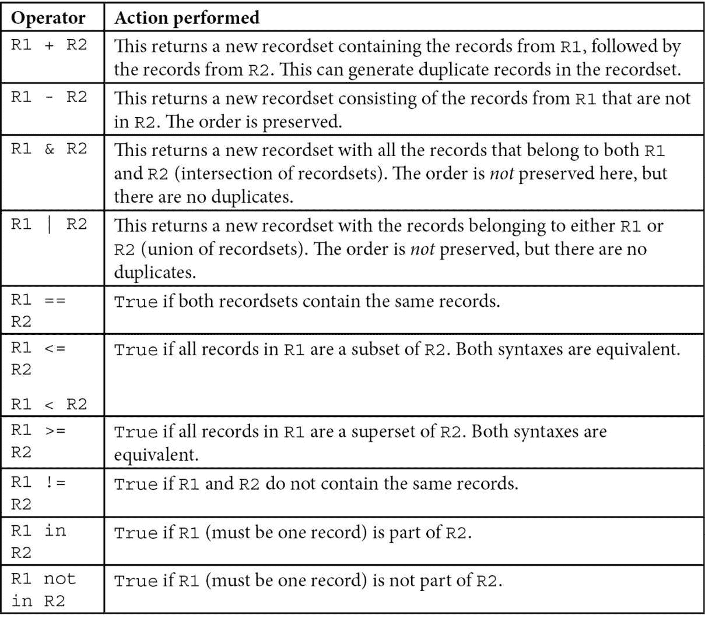

# 5

# 基本服务器端开发

我们在*第四章* *应用模型*中学习了如何在自定义模块中声明或扩展业务模型。该章节的教程中介绍了为计算字段编写方法和限制字段值的方法。本章重点介绍 Odoo 方法声明、记录集操作和扩展继承方法的服务器端编程基础。您可以使用这些知识在 Odoo 模块中创建或修改业务登录。

本章将涵盖以下教程：

+   指定模型方法和实现 API 装饰器

+   通知用户错误

+   为不同的模型获取一个空白记录集

+   创建新记录

+   更新记录集记录的值

+   搜索记录

+   合并记录集

+   过滤记录集

+   遍历记录集关系

+   排序记录集

+   扩展模型已建立的业务逻辑

+   扩展`write()`和`create()`

+   定制记录搜索方式

+   使用`read_group()`按组获取数据

# 技术要求

Odoo 的在线平台是本章的一个先决条件。

您可以从以下 GitHub 仓库获取本章中使用的所有代码：[`github.com/PacktPublishing/Odoo-17-Development-Cookbook-Fifth-Edition/tree/main/Chapter05`](https://github.com/PacktPublishing/Odoo-17-Development-Cookbook-Fifth-Edition/tree/main/Chapter05)

# 指定模型方法和使用 API 装饰器

Odoo 模型中的类既包含业务逻辑方法，也包含字段声明。我们在*第四章* *应用模型*中学习了如何向模型添加字段。现在我们将看到如何在模型中包含业务逻辑和方法。

在本教程中，我们将学习如何创建一个函数，该函数可能被我们的应用程序的用户界面按钮或其他代码片段使用。此方法将在`HostelRoom`上操作，并采取必要的步骤来修改多个房间的状态。

## 准备工作

本教程假设您已准备好一个实例，其中包含`my_hostel`附加模块，如*第三章* *创建 Odoo 附加模块*中所述。您需要向`HostelRoom`模型添加一个`state`字段，该字段定义如下：

```py
from odoo import api, fields, models
class HostelRoom(models.Model):
    # [...]
    state = fields.Selection([
        ('draft', 'Unavailable'),
        ('available', 'Available'),
        ('closed', 'Closed')],
        'State', default="draft")
```

有关更多信息，请参阅*第三章* *创建 Odoo 附加模块*中的*添加模型*教程。

## 如何做到这一点...

要为宿舍房间定义一个方法，以更改所选房间的状态，您需要将以下代码添加到模型定义中：

1.  添加一个辅助方法来检查状态转换是否允许：

    ```py
        @api.model
        def is_allowed_transition(self, old_state, new_state):
            allowed = [('draft', 'available'),
                       ('available', 'closed'),
                       ('closed', 'draft')]
            return (old_state, new_state) in allowed
    ```

1.  添加一个方法，将房间状态更改为通过参数传递的新状态：

    ```py
        def change_state(self, new_state):
            for room in self:
                if room.is_allowed_transition(room.state,\ 
                new_state):
                    room.state = new_state
                else:
                    continue
    ```

1.  添加一个方法，通过调用`change_state`方法来更改房间状态：

    ```py
        def make_available(self):
            self.change_state('available')
        def make_closed(self):
            self.change_state('closed')
    ```

1.  在`<form>`视图中添加一个按钮和状态栏。这将帮助我们通过用户界面触发这些方法：

    ```py
    <form>
    ...
        <button name="make_available" string="Make Available" type="object"/>
        <button name="make_closed" string="Make Borrowed" type="object"/>
        <field name="state" widget="statusbar"/>
    ...
    </form>
    ```

要访问这些更新，您必须更新模块或安装它。

## 它是如何工作的...

教程代码中定义了几个方法。它们是典型的 Python 方法，以 `self` 作为它们的第一个参数，并可以选择接收额外的参数。`odoo.api` 模块中的 **装饰器** 用于装饰一些方法。

小贴士

在 Odoo 9.0 中，API 装饰器首先被添加以支持旧框架和新框架。从 Odoo 10.0 开始，之前的 API 已不再支持，然而，一些装饰器，如 `@api.model`，仍然在使用中。

在编写新方法时，如果您不使用装饰器，则该方法将在记录集上执行。在这样的方法中，`self` 是一个可以引用任意数量数据库记录的记录集（这包括空记录集），代码通常会遍历 `self` 中的记录以对每个单独的记录执行某些操作。

`@api.model` 装饰器类似，但它用于只关注模型本身的方法，而不是记录集的内容，该方法不会对记录集的内容进行操作。这个概念类似于 Python 的 `@classmethod` 装饰器。

在 *步骤 1* 中，我们创建了 `is_allowed_transition()` 方法。这个方法的目的在于验证从一个状态到另一个状态的转换是否有效。`allowed` 列表中的元组是可用的转换。例如，我们不希望允许从 `closed` 到 `available` 的转换，这就是为什么我们没有将 `('closed', 'available')` 放入其中。

在 *步骤 2* 中，我们创建了 `change_state()` 方法。这个方法的目的在于改变房间的状态。当这个方法被调用时，它将根据 `new_state` 参数改变房间的状态。只有当转换被允许时，它才会改变房间状态。我们在这里使用了一个 `for` 循环，因为 `self` 可以包含多个记录集。

在 *步骤 3* 中，我们创建了通过调用 `change_state()` 方法来改变房间状态的方法。在我们的案例中，这个方法将由添加到用户界面的按钮触发。

在 *步骤 4* 中，我们在 `<form>` 视图中添加了 `<button>`。点击此按钮后，Odoo 网页客户端将调用 `name` 属性中提到的 Python 函数。请参考 *第九章* 的 *添加按钮到表单* 教程，了解如何从用户界面调用此类方法。我们还添加了 `state` 字段和 `statusbar` 小部件，以在 `<form>` 视图中显示房间的状态。

当用户从用户界面点击按钮时，将调用 *步骤 3* 中的某个方法。在这里，`self` 将是包含 `hostel.room` 模型记录的记录集。之后，我们调用 `change_state()` 方法，并根据点击的按钮传递适当的参数。

当 `change_state()` 被调用时，`self` 是 `hostel.room` 模型的相同记录集。`change_state()` 方法的主体遍历 `self` 以处理记录集中的每个房间。一开始在 `self` 上循环看起来很奇怪，但你会很快习惯这种模式。

在循环内部，`change_state()` 方法调用 `is_allowed_transition()`。调用是通过 `room` 本地变量进行的，但也可以对 `hostel.room` 模型的任何记录集进行调用，包括例如 `self`，因为 `is_allowed_transition()` 被装饰为 `@api.model`。如果转换被允许，`change_state()` 通过给记录集的属性赋值来将新状态分配给房间。这仅在长度为 `1` 的记录集上有效，这在遍历 `self` 时是保证的。

# 向用户报告错误

有时，在方法执行过程中停止处理是必要的，因为用户的活动无效或满足了一个错误条件。通过显示一个信息性错误消息，本教程演示了如何处理这些情况。

`UserError` 异常通常用于通知用户有关错误或异常情况。它通常在用户的输入未能满足预期标准或由于特定条件无法执行特定操作时使用。

## 准备工作

本教程要求您根据之前的说明设置一个实例，并安装了 `my_hostel` 扩展模块。

## 如何做到这一点...

我们将对前一个教程中的 `change_state` 方法进行修改，并在用户尝试更改 `is_allowed_transition` 方法不允许的状态时显示一条有用的消息。要开始，请执行以下步骤：

1.  在 Python 文件的开头添加以下导入：

    ```py
    from odoo.exceptions import UserError
    from odoo.tools.translate import _
    ```

1.  修改 `change_state` 方法并在 `else` 部分抛出 `UserError` 异常：

    ```py
    def change_state(self, new_state):
        for room in self:
            if room.is_allowed_transition(room.state, new_state):
                room.state = new_state
            else:
                msg = _('Moving from %s to %s is not
    allowed') % (room.state, new_state)
                raise UserError(msg)
    ```

## 它是如何工作的…

当 Python 中抛出异常时，它会在调用栈中向上传播，直到被处理。在 Odoo 中，响应网络客户端调用的 **远程过程调用** （**RPC**） 层会捕获所有异常，并根据异常类触发对网络客户端的不同可能行为。

在 `odoo.exceptions` 中未定义的任何异常都将被处理为内部服务器错误（`UserError` 将在用户界面中显示错误消息。教程的代码通过抛出 `UserError` 来确保消息以用户友好的方式显示。在所有情况下，当前数据库事务都会回滚）。

我们正在使用一个名字奇怪的函数 `_()`，该函数在 `odoo.tools.translate` 中定义。此函数用于标记字符串为可翻译的，并在运行时检索翻译字符串，给定执行上下文中找到的最终用户的语言。更多关于此的信息可以在 *第十一章*，*国际化* 中找到。

重要提示

当使用 `_()` 函数时，确保你只传递带有插值占位符的字符串，而不是整个插值字符串。例如，`_('Warning: could not find %s') % value` 是正确的，但 `_('Warning: could not find %s' % value)` 是错误的，因为前者不会在翻译数据库中找到替换值后的字符串。

## 更多内容…

有时，你正在处理容易出错的代码，这意味着你正在执行的操作可能会生成错误。Odoo 会捕获此错误并向用户显示跟踪回溯。如果你不想向用户显示完整的错误日志，你可以捕获错误并引发一个带有有意义信息的自定义异常。在提供的示例中，我们从 `try...catch` 块生成 `UserError`，这样 Odoo 现在将显示一个带有有意义信息的警告，而不是显示完整的错误日志：

```py
def post_to_webservice(self, data):
    try:
        req = requests.post('http://my-test-service.com', data=data, timeout=10)
        content = req.json()
    except IOError:
        error_msg = _("Something went wrong during data submission")
        raise UserError(error_msg)
    return content
```

`odoo.exceptions` 中定义了几个异常类，所有这些类都派生自基类 `except_orm` 异常。其中大多数仅用于内部，除了以下内容：

+   `ValidationError`: 当一个字段的 Python 约束不被遵守时，会引发此异常。在*第四章*，“应用模型”，参考“向模型添加约束验证”教程以获取更多信息。

+   `AccessError`: 此错误通常在用户尝试访问不允许的内容时自动生成。如果你想从你的代码中显示访问错误，你可以手动引发此错误。

+   `RedirectWarning`: 使用此错误，你可以显示带有错误信息的重定向按钮。你需要向此异常传递两个参数：第一个参数是操作 ID，第二个参数是错误信息。

+   `Warning`: 在 Odoo 8.0 中，`odoo.exceptions.Warning` 在 9.0 及以后的版本中扮演了与 `UserError` 相同的角色。现在它已被弃用，因为其名称具有误导性（它是一个错误，而不是警告）并且与 Python 内置的 `Warning` 类冲突。它仅为了向后兼容而保留，你应该在你的代码中使用 `UserError`。

# 获取不同模型的空记录集

在创建 Odoo 代码时，当前模型的方法可以通过 `self` 访问。通过简单地实例化其类来开始对不同的模型进行工作是不可行的；你必须首先获取该模型的记录集。

本教程向您展示如何在模型方法中为任何在 Odoo 中注册的模型获取空记录集。

## 准备工作

本教程将重用 `my_hostel` 扩展模块中库示例的设置。

我们将在 `hostel.room` 模型中编写一个小的方法，并搜索所有 `hostel.room.members`。为此，我们需要为 `hostel.room.members` 获取一个空记录集。确保你已经添加了 `hostel.room.members` 模型和该模型的访问权限。

## 如何操作…

要在 `hostel.room` 的一个方法中获取 `hostel.room.members` 的记录集，你需要执行以下步骤：


图 5.1 – log_all_room_members

1.  在 `HostelRoom` 类中，编写一个名为 `log_all_room_members` 的方法：

    ```py
    class HostelRoom(models.Model):
        # ...
        def log_all_room_members(self):
            # This is an empty recordset of model hostel.room.member
            hostel_room_obj = self.env['hostel.room.member']
            all_members = hostel_room_obj.search([])
            print("ALL MEMBERS:", all_members)
            return True
    ```

1.  在 `<form>` 视图中添加一个按钮以调用我们的方法：

    ```py
    <button name="log_all_room_members"  string="Log Members" type="object"/>
    ```

更新模块以应用更改。之后，你将看到 `<form>` 视图。你可以通过点击该按钮在服务器日志中查看成员的记录集。

## 它是如何工作的…

在启动时，Odoo 加载所有模块，并将从 `Model` 派生的各种类组合在一起，并定义或扩展给定的模型。这些类存储在任何记录集的 `env` 属性中，作为 `self.env` 可用，是 `odoo.api` 模块中定义的 `Environment` 类的实例。

`Environment` 类在 Odoo 开发中扮演着核心角色：

+   它通过模拟 Python 字典提供对注册表的快捷访问。如果你知道你要查找的模型名称，`self.env[model_name]` 将为你提供该模型的空记录集。此外，记录集将共享 `self` 的环境。

+   它有一个 `cr` 属性，这是一个你可以用来传递原始 SQL 查询的数据库游标。有关更多信息，请参阅 *第八章*，*高级服务器端开发技术* 中的 *执行原始 SQL 查询* 教程。

+   它有一个 `user` 属性，它是当前执行调用的用户的引用。有关更多信息，请参阅 *第八章*，*高级服务器端开发技术* 和 *更改执行动作的用户* 教程。

+   它有一个 `context` 属性，它是一个包含调用上下文的字典。这包括有关用户语言、时区和当前记录选择的信息。有关更多信息，请参阅 *第八章*，*高级服务器端开发技术* 中的 *使用修改后的上下文调用方法* 教程。

`search()` 调用将在后面的 *搜索记录* 教程中解释。

## 参见

有时，你可能想使用修改后的环境版本。一个例子是你可能需要一个具有不同用户和语言的环境。在 *第八章*，*高级服务器端开发技术* 中，你将学习如何在运行时修改环境。

# 创建新记录

在将业务逻辑流程付诸实践时，创建新记录是一个常规需求。如何为 `hostel.room.category` 模型构建记录包括在本教程中。我们将向 `hostel.room.category` 模型添加一个函数，用于生成示例目的的虚拟类别。我们将添加 `<form>` 视图以激活此方法。

## 准备工作

你需要理解你想要创建记录的模型的结构，特别是它们的名称和类型，以及这些字段上存在的任何约束（例如，是否其中一些是必填的）。

对于本教程，我们将重用*第四章*，*应用模型*中的`my_hostel`模块。请查看以下示例，快速回忆`hostel.room.category`模型：

```py
class RoomCategory(models.Model):
    _name = 'hostel.room.category'
    _description = 'Hostel Room Category'
    name = fields.Char('Category')
    description = fields.Text('Description')
    parent_id = fields.Many2one(
        'hostel.room.category',
        string='Parent Category',
        ondelete='restrict',
        index=True
    )
    child_ids = fields.One2many(
        'hostel.room.category', 'parent_id',
        string='Child Categories')
```

确保你已经为`hostel.room.category`模型添加了菜单、视图和访问权限。

## 如何做到这一点…

要创建一个包含一些子类别的类别，你需要执行以下步骤：


图 5.2 – 创建类别

1.  在`hostel.room.category`模型中创建一个名为`create_categories`的方法：

    ```py
    def create_categories(self):
        ......
    ```

1.  在此方法的主体内部，为第一个子类别的字段准备一个值字典：

    ```py
    categ1 = {
        'name': 'Child category 1',
        'description': 'Description for child 1'
    }
    ```

1.  准备第二个类别字段的值字典：

    ```py
    categ2 = {
        'name': 'Child category 2',
        'description': 'Description for child 2'
    }
    ```

1.  为父类别的字段准备一个值字典：

    ```py
    parent_category_val = {
        'name': 'Parent category',
        'description': 'Description for parent category',
        'child_ids': [
            (0, 0, categ1),
            (0, 0, categ2),
        ]
    }
    ```

1.  调用`create()`方法来创建新的记录：

    ```py
    record = self.env['hostel.room.category'].create(parent_category_val)
    ```

1.  在`<form>`视图中添加一个按钮，从用户界面触发`create_categories`方法：

    ```py
    <button name="create_categories" string="Create Categories" type="object"/>
    ```

## 它是如何工作的…

要为模型添加新记录，我们可以在与模型相关的任何记录集上调用`create(values)`方法。此方法返回一个长度为`1`的新记录集，其中包含具有在`values`字典中指定的字段值的记录。

字典中的键通过名称标识字段，而伴随的值反映了字段的值。根据字段类型，你需要为值传递不同的 Python 类型：

+   `Text`字段的值是用 Python 字符串给出的。

+   `Float`和`Integer`字段的值使用 Python 浮点数或整数给出。

+   `boolean`字段的值最好使用 Python 布尔值或整数给出。

+   `Date`字段的值是用 Python 的`datetime.date`对象给出的。

+   `Datetime`字段的值是用 Python 的`datetime.datetime`对象给出的。

+   `Binary`字段的值作为 Base64 编码的字符串传递。Python 标准库中的`base64`模块提供了如`encodebytes(bytestring)`等方法来对字符串进行 Base64 编码。

+   `Many2one`字段的值是用整数给出的，这个整数必须是相关记录的数据库 ID。

+   `One2many`和`Many2many`字段使用特殊的语法。值是一个包含三个元素元组的列表，如下所示：


表 5.1 – 关联字段写入

在本教程中，我们为想要创建的宿舍房间中的两个类别创建字典，然后我们使用这些字典在创建宿舍房间类别时，通过之前解释过的`(0, 0, dict_val)`语法，在`child_ids`条目中使用这些字典。

当在*步骤 5*中调用`create()`时，将创建三个记录：

+   一个用于父房间类别，由`create`返回

+   在 `record.child_ids` 中有两个属于儿童房间类别的记录。

## 还有更多…

如果模型为某些字段定义了一些默认值，则不需要进行特殊操作。`create()` 方法将负责计算在提供的字典中不存在的字段的默认值。

`create()` 方法还支持批量创建记录。要批量创建多个记录，您需要将多个值的列表传递给 `create()` 方法，如下例所示：

```py
categ1 = {
    'name': 'Category 1',
    'description': 'Description for Category 1'
}
categ2 = {
    'name': 'Category 2',
    'description': 'Description for Category 2'
}
multiple_records = self.env['hostel.room.category'].create([categ1, categ2])
```

此代码将返回已创建的宿舍房间类别的记录集。

# 更新记录集记录的值

业务逻辑通常要求我们通过更改某些字段的值来更新记录。本教程展示了如何在我们进行过程中修改合作伙伴的 `room_no` 字段。

## 准备工作

本教程将使用与*创建新记录*教程相同的简化版 `hostel.room` 定义。您可以参考这个简化定义来了解字段信息。

我们在 `hostel.room` 模型中有一个 `room_no` 字段。为了说明目的，我们将通过点击按钮来写入此字段。

## 如何操作…

1.  要更新房间的 `room_no` 字段，您可以编写一个名为 `update_room_no()` 的新方法，其定义如下：

    ```py
    def update_room_no(self):
        self.ensure_one()
        self.room_no = "RM002"
    ```

1.  然后，您可以在 `xml` 中为房间的 `<form>` 视图添加一个按钮，如下所示：

    ```py
    <button name="update_room_no" string="Update Room No" type="object"/>
    ```

1.  重新启动服务器并更新 `my_hostel` 模块以查看更改。点击 `room_no` 后，将更改房间号。

## 它是如何工作的…

方法首先通过调用 `ensure_one()` 检查作为 `self` 传递的房间记录集是否恰好包含一个记录。如果不是这种情况，此过程将生成异常，并停止处理。这是必要的，因为我们不希望更改多个记录的房间号。如果您想更新多个值，可以移除 `ensure_one()` 并使用记录集上的循环来更新属性。

最后，该方法修改房间记录的属性值。它使用定义的房间号更新 `room_no` 字段。只需修改记录集的字段属性，就可以执行写操作。

## 还有更多…

如果您想向记录的字段添加新值，有三种选择：

+   第一种选择是本教程中解释过的。它通过直接分配值给表示记录字段的属性来工作，在所有上下文中都有效。一次无法分配值给所有记录集元素，因此，除非您确定您只处理单个记录，否则您需要遍历记录集。

+   第二种选择是使用 `update()` 方法，通过传递字典映射字段名到您想要设置的值。这也仅适用于长度为 `1` 的记录集。当您需要一次性在同一记录上更新多个字段的值时，这可以节省一些打字。以下是教程的 *步骤 2*，重写为使用此选项：

    ```py
    def change_room_no(self):
        self.ensure_one()
        self.update({
            'room_no': "RM002",
            'another_field': 'value'
            ...
        })
    ```

+   第三个选项是调用 `write()` 方法，传递一个将字段名映射到要设置的值的字典。此方法适用于任意大小的记录集，并且当前两个选项在每个记录和每个字段上执行一个数据库调用时，它将在单个数据库操作中更新所有具有指定值的记录。然而，它有一些限制：如果记录尚未存在于数据库中，则不起作用（有关更多信息，请参阅 *第八章* 中的 *在更改时写入方法* 教程，*高级服务器端开发技术*）。此外，在写入关系字段时需要特殊的格式，类似于 `create()` 方法使用的格式。请查看以下表格，了解用于生成关系字段不同值的格式：


表 5.2 – 关系字段更新

重要提示

`1`、`2`、`3` 和 `5` 操作类型不能与 `create()` 方法一起使用。

# 搜索记录

在业务逻辑方法中搜索记录也是一个常见的操作。有许多情况下，我们需要根据不同的标准搜索数据。本教程演示了通过名称和类别查找房间。

## 准备工作

本教程将使用与 *创建新记录* 教程相同的 `hostel.room` 定义。我们将在名为 `find_room(self)` 的方法中编写代码。

## 如何操作…

要查找房间，你需要执行以下步骤：

1.  将 `find_room` 方法添加到 `hostel.room` 模型中：

    ```py
    def find_room(self):
        ...
    ```

1.  为你的标准编写搜索域：

    ```py
    domain = [
        '|',
            '&', ('name', 'ilike', 'Room Name'),
                 ('category_id.name', 'ilike', 'Category Name'),
            '&', ('name', 'ilike', 'Second Room Name 2'),
                 ('category_id.name', 'ilike', 'SecondCategory Name 2')
    ]
    ```

1.  使用域调用 `search()` 方法，这将返回记录集：

    ```py
    rooms = self.search(domain)
    ```

`rooms` 变量将包含搜索到的房间记录集。你可以打印或记录该变量，以在服务器日志中查看结果。

## 它是如何工作的…

*第一步* 定义了以 `def` 关键字为前缀的方法名。

*第二步* 在局部变量中创建一个搜索域。通常，你会在调用搜索时看到这个创建过程，但对于复杂的域，将其单独定义是一种良好的实践。

要全面了解搜索域语法，请参阅 *第九章* 中的 *在记录列表上定义过滤器 – 域* 教程，*后端视图*。

*第三步* 使用域调用 `search()` 方法。该方法返回一个包含所有匹配域的记录集，然后可以进一步处理。在本教程中，我们仅使用域调用该方法，但以下关键字参数也受支持：

+   `offset=N`：这用于跳过与查询匹配的前 `N` 条记录。这可以与 `limit` 一起使用来实现分页，或者在处理大量记录时减少内存消耗。默认值为 `0`。

+   `limit=N`：这表示最多应返回 `N` 条记录。默认情况下，没有限制。

+   `order=sort_specification`：此参数用于强制返回记录集中的顺序。默认情况下，顺序由模型类的`_order`属性决定。

+   `count=boolean`：如果为`True`，则返回记录数而不是记录集。默认为`False`。

重要提示

我们建议使用`search_count(domain)`方法而不是`search(domain, count=True)`，因为方法名称以更清晰的方式传达了行为。两者将给出相同的结果。

有时，您需要从另一个模型进行搜索，以便搜索`self`返回当前模型的记录集。要从另一个模型进行搜索，我们需要获取该模型的空记录集。例如，假设我们想要搜索一些联系人。为此，我们需要在`res.partner`模型上使用`search()`方法。请参考以下代码。在这里，我们获取`res.partner`的空记录集以搜索联系人：

```py
def find_partner(self):
    PartnerObj = self.env['res.partner']
    domain = [
        '&', ('name', 'ilike', 'SerpentCS'),
             ('company_id.name', '=', 'SCS')
    ]
    partner = PartnerObj.search(domain)
```

在前面的代码中，我们在域中有两个条件。当您有两个条件进行比较时，可以省略域中的`'&'`，因为当您没有指定域时，Odoo 将`'&'`作为默认值。

## 还有更多...

我们之前提到，`search()`方法返回所有匹配域的记录。这实际上并不完全正确。安全规则确保用户只能获取他们具有`read`访问权限的记录。此外，如果模型有一个名为`active`的布尔字段，并且搜索域的任何术语都没有指定该字段的条件，那么搜索将自动添加一个隐式条件，只返回`active=True`的记录。因此，如果您期望搜索返回某些内容，但只得到空记录集，请确保检查`active`字段的值（如果存在），以检查记录规则。

请参考*第八章*中的*调用具有不同上下文的方法*教程，*高级服务器端开发技术*，了解如何不添加隐式的`active=True`条件。请查看*第十章*中的*使用记录规则限制记录访问*教程，*安全访问*，以获取有关记录级访问规则的信息。

如果出于某种原因，您发现自己正在编写原始 SQL 查询以查找记录 ID，确保在检索 ID 后使用`self.env['record.model'].search([('id', 'in', tuple(ids))]).ids`来确保应用安全规则。这在**多公司**Odoo 实例中尤为重要，因为记录规则用于确保公司之间的适当区分。

# 合并记录集

有时，您会发现您获得的记录集并不是您需要的。本教程展示了合并它们的多种方法。

## 准备工作

使用本教程，您需要为同一模型拥有两个或更多记录集。

## 如何操作...

按照以下步骤执行记录集上的常见操作：

1.  要合并两个记录集到一个中，同时保留它们的顺序，请使用以下操作：

    ```py
    result = recordset1 + recordset2
    ```

1.  要合并两个记录集到一个中，同时确保结果中没有重复，请使用以下操作：

    ```py
    result = recordset1 | recordset2
    ```

1.  要找到两个记录集中共有的记录，请使用以下操作：

    ```py
    result = recordset1 & recordset2
    ```

## 它是如何工作的…

记录集类的实现为各种 Python 操作符重定义，这些操作符在此处被使用。以下是记录集上可用的最有用的 Python 操作符的总结表：



表 5.3 – 与域一起使用的操作符

此外，还有就地操作符 `+=`、`-=`、`&=` 和 `|=`，它们修改左侧操作数而不是创建一个新的记录集。这些操作符在更新记录的 `One2many` 或 `Many2many` 字段时非常有用。有关此示例，请参阅 *更新记录集记录的值* 教程。

# 过滤记录集

有时，你已经有了一个记录集，但只需要处理这些记录的子集。当然，你可以遍历记录集，每次检查条件并根据检查结果采取行动。构建仅包含感兴趣记录的新记录集以及在该记录集上使用单一操作可能更简单，在某些情况下，更有效。

本教程展示了如何使用 `filter()` 方法根据条件提取记录集的子集。

## 准备工作

我们将重用 *创建新记录* 教程中展示的简化 `hostel.room` 模型。本教程定义了一个方法，用于从提供的记录集中提取具有多个成员的房间。

## 如何做到这一点…

要从记录集中提取具有多个成员的记录，你需要执行以下步骤：

1.  定义过滤记录集的方法：

    ```py
           def filter_members(room):
            all_rooms = self.search([])
            filtered_rooms = self.rooms_with_multiple_members(all_rooms)
    ```

1.  定义接受原始记录集的方法：

    ```py
        @api.model
        def room_with_multiple_members(self, all_rooms):
    ```

1.  定义一个内部 `predicate` 函数：

    ```py
        def predicate(room):
            if len(room.member_ids) > 1:
                return True
            return False
    ```

1.  按如下方式调用 `filter()`：

    ```py
    return all_room.filter (predicate)
    ```

此过程的输出可以打印或记录，以便服务器日志可以包含它。有关更多信息，请参阅教程的示例代码。

## 它是如何工作的…

由 `filter()` 方法实现创建的记录集是空的。这个空记录集接收所有谓词函数评估为 `True` 的记录。最后，返回一个新的记录集。原始记录集中的记录仍然保持相同的顺序。

在上一个教程中使用了命名内部函数。你将经常看到匿名 Lambda 函数被用于这样的简单谓词：

```py
@api.model
def room_with_multiple_rooms(self, all_rooms):
    return all_rooms.filter(lambda b: len(b.member_ids) > 1)
```

实际上，你需要根据字段值在 Python 中的 *truthy*（非空字符串、非零数字、非空容器等）来过滤记录集。因此，如果你想过滤具有类别设置的记录，你可以像这样传递字段名进行过滤：`all_rooms.filter('category_id')`。

## 更多内容…

记住`filter()`使用内存来工作。使用搜索域或甚至切换到 SQL 以提高关键路径上方法的速度，但会牺牲可读性。

# 遍历记录集关系

当与长度为`1`的记录集一起工作时，各种字段都可作为记录属性。关系属性（`One2many`、`Many2one`和`Many2many`）也有值，这些值也是记录集。例如，假设我们想从`hostel.room`模型的记录集中访问类别名称。你可以通过以下方式通过`Many2one`字段的`category_id`遍历来访问类别名称：`room.category_id.name`。然而，当与包含多个记录的记录集一起工作时，不能使用属性。

本教程演示了如何使用`mapped()`函数导航记录集关系。我们将创建一个函数，从提供的房间列表中提取成员的名称。

## 准备工作

我们将重用本章中*创建新记录*教程中展示的`hostel.room`模型。

## 如何操作…

为了从房间记录集中检索成员名称，你必须执行以下操作：

1.  定义一个名为`get_members_names()`的方法：

    ```py
        @api.model
        def get_members_names(self, rooms):
    ```

1.  调用`mapped()`以获取成员的联系人名称：

    ```py
        return rooms.mapped('member_ids.name')
    ```

## 它是如何工作的…

简单定义方法是*第一步*。通过调用`mapped(path)`函数遍历记录集字段是*第二步*；`path`是一个由点分隔的字段名字符串。路由中的下一个元素应用于`mapped()`为路径中的每个字段创建的新记录集。这个新记录集包含通过该字段与当前记录集中的每个元素连接的所有记录。如果路由中的最后一个字段是关系字段，则`mapped()`返回一个记录集；否则，返回一个 Python 列表。

`mapped()`方法有两个有用的属性：

+   当路由是一个单个标量字段名时，返回的列表与处理过的记录集的时序相同

+   如果路由中存在关系字段，则结果顺序不保留，但会消除重复项

重要提示

当你想对`self`中所有记录的`Many2many`字段指向的所有记录执行操作时，这个第二个属性非常有用，但你需要确保操作只执行一次（即使`self`的两个记录共享同一个目标记录）。

## 更多内容…

当使用`mapped()`时，请记住它是在 Odoo 服务器内部通过重复遍历关系并在内存中操作的，因此进行 SQL 查询，这可能不是高效的。然而，代码简洁且表达性强。如果你试图优化实例性能关键路径上的方法，你可能想要重写对`mapped()`的调用，并以适当的域将其表达为`search()`，甚至切换到 SQL（以牺牲可读性为代价）。

`mapped()` 方法也可以用一个函数作为参数进行调用。在这种情况下，它返回一个包含对 `self` 的每个记录应用函数的结果的列表，或者如果函数返回一个记录集，则返回由函数返回的记录集的并集。

## 相关教程

更多信息，请参考以下内容：

+   本章的 *搜索记录* 教程

+   在 *第八章*，*高级服务器端开发技术* 的 *执行原始 SQL 查询* 教程

# 排序记录集

当你使用 `search()` 方法获取记录集时，你可以传递一个可选的排序参数来获取特定顺序的记录集。如果你已经从一个之前的代码段中获取了一个记录集并且想要对其进行排序，这将非常有用。如果你使用集合操作来合并两个记录集，例如，这可能会导致顺序丢失，这也可能很有用。

本教程将向您展示如何使用 `sorted()` 方法对现有记录集进行排序。我们将按评级对房间进行排序。

## 准备工作

我们将重用本章中在 *创建新记录* 教程中展示的 `hostel.room` 模型。

## 如何操作…

为了根据 `rating` 获取排序后的房间记录集，你需要执行以下步骤：

1.  定义一个名为 `sort_rooms_by_rating()` 的方法：

    ```py
        @api.model
        def sort_rooms_by_rating(self, rooms):
    ```

1.  使用 `sorted()` 方法，如给定示例所示，根据 `room_rating` 字段对房间记录进行排序：

    ```py
        return rooms.sorted(key='room_rating')
    ```

## 它是如何工作的…

简单定义方法是 *第一步*。在 *第二步* 中，我们使用房间的 `sorted()` 函数的记录集。作为键参数提供的字段将由 `sorted()` 函数内部获取其数据。然后，它使用 Python 的本地排序方法返回一个排序后的记录集。

它还有一个可选参数，`reverse=True`，它返回一个逆序的记录集。`reverse` 的使用方式如下：

```py
rooms.sorted(key='room_rating', reverse=True)
```

## 更多内容…

`sorted()` 方法将对记录集中的记录进行排序。如果没有参数调用，将使用模型 `_order` 属性。否则，可以传递一个函数来计算比较键，其方式与 Python 内置的 sorted (sequence, key) 函数相同。

重要提示

当使用模型的默认 `_order` 参数时，排序被委托给数据库，并执行一个新的 `SELECT` 函数来获取排序。否则，排序由 Odoo 执行。根据所操作的内容以及记录集的大小，可能会有一些重要的性能差异。

# 扩展模型中定义的业务逻辑

将应用程序功能划分为各种模块是 Odoo 中的一种流行做法。您可以通过安装或卸载应用程序轻松实现这一点，这将启用或禁用功能。此外，当您向原始应用程序添加新功能时，您必须修改一些在原始应用程序中预定义的方法的行为。旧模型偶尔会从添加新字段中受益。这是底层框架最有用的功能之一，在 Odoo 中这个过程相当简单。

在本教程中，我们将了解如何从另一个模块中的方法扩展一个方法的方法的业务逻辑。此外，我们还将使用新模块向现有模块添加新字段。

## 准备工作

对于本教程，我们将继续使用上一教程中的`my_hostel`模块。请确保您在`my_hostel`模块中拥有`hostel.room.category`模型。

对于本教程，我们将创建一个名为`my_hostel_terminate`的新模块，该模块依赖于`my_ hostel`模块。在这个模块中，我们将管理宿舍的终止日期。我们还将根据类别自动计算退宿日期。

在*第四章*的*如何使用继承向模型添加功能*教程中，我们了解了如何向现有模型添加字段。在本模块中，我们将扩展`hostel.room`模型如下：

```py
class HostelRoom(models.Model):
    _inherit = 'hostel.room'
    date_terminate = fields.Date('Date of Termination')
```

然后，按照以下方式扩展`hostel.room.category`模型：

```py
class RoomCategory(models.Model):
    _inherit = 'hostel.room.category'
    max_allow_days = fields.Integer(
        'Maximum allows days',
        help="For how many days room can be borrowed",
        default=365)
```

要在视图中添加此字段，您需要遵循*更改现有视图 - 视图继承*教程，该教程位于*第九章*的*后端视图*部分。您可以在[`github.com/PacktPublishing/Odoo-17-Development-Cookbook-Fifth-Edition`](https://github.com/PacktPublishing/Odoo-17-Development-Cookbook-Fifth-Edition)找到完整的代码示例。

## 如何做到这一点…

要扩展`hostel.room`模型中的业务逻辑，您需要执行以下步骤：

1.  从`my_hostel_terminate`模块中，我们希望在将房间状态更改为`Closed`时，在`rooms`记录中设置`date_terminate`。为此，我们将覆盖`my_` `hostel_terminate`模块中的`make_closed`方法：

    ```py
    def make_closed(self):
        day_to_allocate = self.category_id.max_allow_days or 10
        self.date_return = fields.Date.today() + timedelta(days=day_to_allocate)
        return super(HostelRoom, self).make_closed()
    ```

1.  我们还希望在房间归还并可供借用时重置`date_terminate`，因此我们将覆盖`make_available`方法来重置日期：

    ```py
        def make_available(self):
            self.date_terminate = False
            return super(HostelRoom, self).make_available()
    ```

## 它是如何工作的…

*步骤 1*和*步骤 2*，在前一节中执行业务逻辑的扩展。我们定义了一个扩展`hostel.room`的模型，并重新定义了`make_closed()`和`make_available()`方法。在两个方法的最后一行，返回了父类实现的结果：

```py
return super(HostelRoom, self).make_closed()
```

在 Odoo 模型的情况下，父类不是通过查看 Python 类定义所期望的。框架已经为我们记录集动态生成了一个类层次结构，父类是我们所依赖的模块中模型的定义。因此，调用 `super()` 会从 `my_hostel` 中返回 `hostel.room` 的实现。在这个实现中，`make_closed()` 将房间状态改为 `Closed`。因此，调用 `super()` 将调用父方法，并将房间状态设置为 `Closed`。

## 还有更多...

在本教程中，我们选择扩展方法的默认实现。在 `make_closed()` 和 `make_available()` 方法中，我们在 `super()` 调用之前修改了返回的结果。请注意，当你调用 `super()` 时，它将执行默认实现。当然，你还可以在 `super()` 调用之后执行一些操作。当然，我们也可以同时做这两件事。

然而，在方法执行过程中改变其行为更具挑战性。为了做到这一点，我们必须重构代码以提取一个扩展点到一个不同的函数，然后我们可以在扩展模块中重写这个函数。

你可能会受到重写函数的启发。始终要极端小心。如果你不使用你方法中的 `super()` 实现而重写函数，扩展机制以及可能扩展该方法的附加组件将会损坏，这意味着扩展方法将永远不会被调用。除非你在一个受控环境中工作，你确定安装了哪些附加组件，并且你已经验证你没有破坏它们，否则请避免这样做。另外，如果需要，请确保清楚地记录你做的所有事情。

在调用原始方法实现之前和之后你能做什么？有很多事情，包括但不限于以下内容：

+   改变发送给初始实现的参数（过去）

+   修改之前提供给原始实现的上下文

+   改变初始实现返回的结果（之后）

+   调用另一个方法（在之前和之后）

+   创建记录（在之前和之后）

+   在禁止的情况下抛出 `UserError` 错误以取消执行（在之前和之后）

+   将 `self` 分割成更小的记录集，并以不同的方式对每个子集调用原始实现（之前）

# 扩展 write() 和 create()

从本章的模型教程中扩展定义在模型中的业务逻辑展示了如何扩展定义在模型类上的方法。如果你这么想，定义在模型父类上的方法也是模型的一部分。这意味着所有定义在 `models.Model`（实际上，在 `models.BaseModel` 上，它是 `models.Model` 的父类）上的基方法都是可用的，并且可以被扩展。

本教程展示了如何扩展 `create()` 和 `write()` 以控制对记录某些字段的访问。

## 准备工作

我们将扩展来自 `my_hostel` 扩展模块的库示例，该模块位于 *第三章*，*创建 Odoo 扩展模块*。

将 `remarks` 字段添加到 `hostel.room` 模型中。我们只想让 `Hostel Managers` 组的成员能够写入该字段：

```py
from odoo import models, api, exceptions
class HostelRoom(models.Model):
    _name = 'hostel.room'
    remarks = fields.Text('Remarks')
```

将 `remarks` 字段添加到 `view/hostel_room.xml` 文件的 `<form>` 视图中，以便从用户界面访问此字段：

```py
<field name="remarks"/>
```

修改 `security/ir.model.access.csv` 文件以授予库用户写入权限：

```py
id,name,model_id:id,group_id:id,perm_read,perm_write,perm_create,perm_unlink
access_hostel,hostel.room.user,model_hostel_room,base.group_user,1,1,0,0
```

## 如何操作...

为了防止非经理组成员修改 `remarks` 的值，您需要执行以下步骤：

1.  按如下方式扩展 `create()` 方法：

    ```py
        @api.model
        def create(self, values):
            if not self.user_has_groups('my_hostel.group_hostel_manager'):
                if values.get('remarks'):
                    raise UserError(
                        'You are not allowed to modify '
                        'remarks'
                    )
            return super(HostelRoom, self).create(values)
    ```

1.  按如下方式扩展 `write()` 方法：

    ```py
        def write(self, values):
            if not self.user_has_groups('my_hostel.group_hostel_manager'):
                if values.get('remarks'):
                    raise UserError(
                        'You are not allowed to modify '
                        'manager_remarks'
                    )
            return super(HostelRoom, self).write(values)
    ```

安装模块以查看代码的实际效果。现在，只有经理类型的用户可以修改 `remarks` 字段。为了测试此实现，您可以登录为演示用户或从当前用户撤销经理访问权限。

## 工作原理...

*步骤 1* 在上一节中重新定义了 `create()` 方法。在调用 `create()` 的基类实现之前，我们的方法使用 `user_has_groups()` 方法来检查用户是否属于 `my_hostel.group_hostel_manager` 组（这是该组的 XML ID）。如果不是这种情况，并且为 `remarks` 传递了值，则会引发 `UserError` 异常，从而阻止记录的创建。这个检查是在调用基类实现之前执行的。

*步骤 2* 对 `write()` 方法执行同样的操作。在写入之前，我们检查组和值中字段的 presence，以便在出现问题时进行写入并引发 `UserError` 异常。

重要提示

在网络客户端将字段设置为只读并不能阻止 RPC 调用写入它。这就是为什么我们扩展了 `create()` 和 `write()`。

在本教程中，您已经看到了如何覆盖 `create()` 和 `write()` 方法。然而，请注意，这不仅仅限于 `create()` 和 `write()` 方法。您可以覆盖任何模型方法。例如，假设您想在记录被删除时执行某些操作。为此，您需要覆盖 `unlink()` 方法（当记录被删除时将调用 `unlink()` 方法）。以下是覆盖 `unlink()` 方法的简短代码片段：

```py
def unlink(self):
    # your logic
    return super(HostelRoom, self).unlink()
```

警告

```py
super(…).unlink(), records would not be deleted.
```

## 更多内容...

在扩展 `write()` 时，请注意，在调用 `super()` 实现的 `write()` 之前，`self` 仍然是未修改的。您可以使用这一点来比较字段当前值和 `values` 字典中的值。

在本教程中，我们选择引发异常，但我们也可以选择从 `values` 字典中删除受影响的字段并静默跳过记录中该字段的更新：

```py
def write(self, values):
    if not self.user_has_groups('my_hostel.group_hostel_manager'):
        if values.get('remarks'):
            del values['remarks']
    return super(HostelRoom, self).write(values)
```

在调用`super().write()`之后，如果你想执行额外的操作，你必须小心任何可能导致再次调用`write()`的事情，否则你会创建一个无限递归循环。解决方案是在上下文中放置一个标记，以便检查以中断递归：

```py
class MyModel(models.Model):
    def write(self, values):
        sup = super(MyModel, self).write(values)
        if self.env.context.get('MyModelLoopBreaker'):
            return
        self = self.with_context(MyModelLoopBreaker=True)
        self.compute_things() # can cause calls to writes
        return sup
```

在前面的示例中，我们在调用`compute_things()`方法之前添加了`MyModelLoopBreaker`键。因此，如果再次调用`write()`方法，它不会进入无限循环。

# 自定义如何搜索记录

在*第三章*的*定义模型表示和顺序*教程中，*创建 Odoo 附加模块*介绍了`name_get()`方法，该方法用于计算记录在各种地方的表现，包括在用于在 Web 客户端显示`Many2one`关系的控件中。

本教程将向您展示如何通过重新定义`name_search`来通过房间号和名称在`Many2one`控件中搜索房间。

## 准备工作

对于这个教程，我们将使用以下模型定义：

```py
class HostelRoom(models.Model):
    def name_get(self):
        result = []
        for room in self:
            member = room.member_ids.mapped('name')
            name = '%s (%s)' % (room.name, ', '.join(member))
            result.append((room.id, name))
            return result
```

当使用此模型时，`Many2one`控件中的房间仅通过`name_search`属性显示，该属性引用模型类的`_rec_name`属性，在我们的情况下是`'name'`。我们还想允许通过房间号进行过滤。

## 如何操作…

为了执行此教程，你需要执行以下步骤：

1.  要能够通过房间名称、成员之一或房间号来搜索`hostel.room`，你需要在`HostelRoom`类中定义`_name_search()`方法，如下所示：

    ```py
    @api.model
    def _name_search(self, name='', args=None, operator='ilike',
                      limit=100, name_get_uid=None):
         args = [] if args is None else args.copy()
         if not(name == '' and operator == 'ilike'):
             args += ['|', '|',
                      ('name', operator, name),
                      ('isbn', operator, name),
                      ('author_ids.name', operator, name)
                      ]
         return super(HostelRoom, self)._name_search(
             name=name, args=args, operator=operator,
             limit=limit, name_get_uid=name_get_uid)
    ```

1.  在`hostel.room`模型中添加`previous_room_id` `Many2one`字段以测试`_name_search`实现：

    ```py
    previous_room = fields.Many2one('hostel.room', string='Previous Room')
    ```

1.  将以下字段添加到用户界面：

    ```py
    <field name="previous_room_id" />
    ```

1.  重新启动并更新模块以反映这些更改。

你可以通过在`previous_room_id` `Many2one`字段中搜索来调用`_name_search`方法。

## 它是如何工作的…

`name_search()`方法的默认实现实际上只调用`_name_search()`方法，该方法执行实际工作。此`_name_search()`方法有一个额外的参数，`name_get_uid`，用于一些边缘情况，例如如果你想要使用`sudo()`或不同的用户来计算结果。

我们将接收到的大多数参数不变地传递给方法的`super()`实现：

+   `name`是一个包含用户已输入的值的字符串。

+   `args`可以是`None`或用作可能记录的前过滤器的搜索域。（它可以来自`Many2one`关系的域参数，例如。）

+   `operator`是一个包含匹配操作符的字符串。通常，你会有`'ilike'`或`'='`。

+   `limit`是要检索的最大行数。

+   `name_get_uid`可以在调用`name_get()`时用来指定不同的用户，以计算在控件中显示的字符串。

我们对该方法实现的实现如下：

1.  如果 `args` 是 `None`，则生成一个新的空列表，否则复制 `args`。我们复制列表是为了避免我们的修改对调用者产生副作用。

1.  然后，我们检查 `name` 是否不是空字符串，或者 `operator` 是否不是 `'ilike'`。这是为了避免生成一个愚蠢的域，例如 `[('name', ilike, '')]`，它不会过滤任何内容。在这种情况下，我们直接跳到 `super()` 调用实现。

1.  如果我们有 `name`，或者 `operator` 不是 `'ilike'`，那么我们将一些过滤条件添加到 `args` 中。在我们的例子中，我们添加了将搜索提供的名称在房间标题、房间号或成员姓名中的子句。

1.  最后，我们调用带有修改后的域的 `super()` 实现并在 `args` 中强制 `name` 为 `''` 和 `operator` 为 `ilike`。我们这样做是为了强制默认实现 `_name_search()` 不更改它接收的域，因此我们将使用我们指定的域。

## 更多内容…

我们在介绍中提到，此方法用于 `Many2one` 小部件。为了完整性，它也用于 Odoo 的以下部分：

+   当在域中使用 `One2many` 和 `Many2many` 字段上的 `in` 操作符时

+   要在 `many2many_tags` 小部件中搜索记录

+   要在 CSV 文件中搜索记录，请导入

## 参见

在 *第三章* 的 *创建 Odoo 扩展模块* 中，*定义记录列表的过滤器 - 范围* 教程演示了如何定义 `name_get()` 方法，该方法用于创建记录的文本表示。

在 *第九章* 的 *后端视图* 中的 *定义记录列表的过滤器 - 范围* 教程提供了更多关于搜索域语法的详细信息。

# 使用 `read_group()` 函数按组获取数据

在之前的教程中，我们看到了如何从数据库中搜索和获取数据。然而，有时你希望通过聚合记录来获取结果，例如上个月销售订单的平均成本。通常，我们使用 SQL 查询中的 `group by` 和 `aggregate` 函数来获取此类结果。幸运的是，在 Odoo 中，我们有 `read_group()` 方法。在本教程中，你将学习如何使用 `read_group()` 方法来获取聚合结果。

## 准备工作

在本教程中，我们将使用来自 *第三章* 的 `my_hostel` 扩展模块，*创建 Odoo 扩展模块*。

修改 `hostel.room` 模型，如下所示模型定义：

```py
class HostelRoom(models.Model):
    _name = 'hostel.room'
    name = fields.Char('Name', required=True)
    cost_price = fields.Float('Room Cost')
    category_id = fields.Many2one('hostel.room.category')
```

添加 `hostel.room.category` 模型。为了简单起见，我们将其添加到相同的 `hostel_room.py` 文件中：

```py
class HostelCategory(models.Model):
    _name = 'hostel.room.category'
    name = fields.Char('Category')
    description = fields.Text('Description')
```

我们将使用 `hostel.room` 模型，并获取每个类别的平均成本价格。

## 如何做到这一点…

要提取分组结果，我们将向 `hostel.room` 模型添加 `_get_average_cost` 方法，它将使用 `read_group()` 方法按组获取数据：

```py
    @api.model
    def _get_average_cost(self):
        grouped_result = self.read_group(
            [('cost_price', "!=", False)], # Domain
            ['category_id', 'cost_price:avg'], # Fields to access
            ['category_id'] # group_by
            )
        return grouped_result
```

要测试此实现，你需要在用户界面中添加一个按钮来触发此方法。然后，你可以在服务器日志中打印结果。

## 它是如何工作的…

`read_group()` 方法内部使用 SQL 的 `groupby` 和 `aggregate` 函数来获取数据。传递给 `read_group()` 方法的最常见参数如下：

+   `domain`: 这用于过滤分组记录。有关 `domain` 的更多信息，请参阅 *第九章* 中的 *搜索视图* 教程，*后端视图*。

+   `fields`: 这个参数传递你想要与分组数据一起获取的字段名称。此参数的可能值如下：

    +   `field name`: 你可以将字段名称传递给 `fields` 参数，但如果你使用此选项，则必须将此字段名称传递给 `groupby` 参数，否则将生成错误。

    +   `field_name:agg`: 你可以使用 `aggregate` 函数传递字段名称。例如，在 `cost_price:avg` 中，`avg` 是一个 SQL 聚合函数。PostgreSQL 聚合函数的列表可以在 [`www.postgresql.org/docs/current/static/functions-aggregate.html`](https://www.postgresql.org/docs/current/static/functions-aggregate.html) 找到。

    +   `name:agg(field_name)`: 这与之前的一个相同，但使用这种语法，你可以提供列别名，例如 `average_price:avg(cost_price)`。

+   `groupby`: 此参数接受一个字段描述列表。记录将根据这些字段进行分组。对于 `date` 和 `datetime` 列，你可以传递 `groupby_function` 来根据不同的时间间隔应用日期分组。你可以对日期类型的字段按月份进行分组。

+   `read_group()` 也支持一些可选参数，如下所示：

    +   `offset`: 这表示可选的跳过记录数。

    +   `limit`: 这表示可选的最大返回记录数。

    +   `orderby`: 如果传递此选项，则结果将根据给定的字段排序。

    +   `lazy`: 此参数接受布尔值，默认为 `True`。如果传递 `True`，则结果仅按第一个 `groupby` 分组，其余的 `groupby` 参数放在 `__context` 键中。如果为 `False`，则所有 `groupby` 函数在一个调用中完成。

性能提示

`read_group()` 比从记录集读取和处理值要快得多。因此，对于 KPI 或图表，你应该始终使用 `read_group()`。
