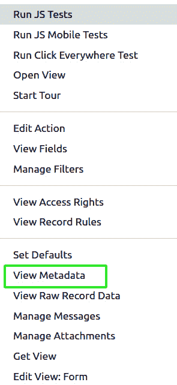

# 6

# 管理模块数据

在 Odoo 中，管理模块数据涉及各种任务，例如在安装、升级或删除模块时在数据库中创建、更新和删除记录。这通常是通过称为数据文件的 XML 文件来完成的。

本章将研究添加组件模块在安装期间可能提供数据的情况。这有助于我们在提供元数据，如视图描述、菜单或操作，或提供默认设置时。另一个重要用途是提供演示数据，当创建数据库时，如果勾选了**加载演示数据**复选框，则会加载这些数据。

在本章中，我们将涵盖以下主题：

+   使用外部 ID 和命名空间

+   使用 XML 文件加载数据

+   使用`noupdate`和`forcecreate`标志

+   使用 CSV 文件加载数据

+   添加组件更新和数据迁移

+   从 XML 文件中删除记录

+   从 XML 文件中调用函数

# 技术要求

本章的技术要求包括在线 Odoo 平台。

本章中使用的所有代码都可以从以下 GitHub 仓库下载：[`github.com/PacktPublishing/Odoo-17-Development-Cookbook-Fifth-Edition/tree/main/Chapter06`](https://github.com/PacktPublishing/Odoo-17-Development-Cookbook-Fifth-Edition/tree/main/Chapter06)。

为了避免重复大量代码，我们将利用在*第四章*、“应用模型”中定义的模型。为了遵循这些示例，请确保从`Chapter05/my_hostel`模块中获取`my_hostel`模块的代码。

# 使用外部 ID 和命名空间

Odoo 中的记录使用外部 ID 或 XML ID 进行标识。到目前为止，我们在本书的视图、菜单和操作等区域使用了 XML ID，但我们仍然不知道 XML ID 是什么。本食谱将为您提供更多关于它的清晰度。

## 如何操作...

我们将向已存在的记录中写入以演示如何使用跨模块引用：

1.  通过注册如下数据文件来更新`my_hostel`模块的清单文件：

    ```py
    'data': [
    'data/data.xml',
    ],
    ```

1.  在`hostel.room`模型中创建一个新的房间：

    ```py
    <record id="hostel_room" model="hostel.room">
    <field name="name"> Hostel Room 01 </field>
    </record>
    ```

1.  更改主公司的名称：

    ```py
    <record id="base.main_company" model="res.company">
    <field name="name">Packt Publishing</field>
    </record>
    ```

安装模块以应用更改。安装后，将创建`Hostel Room 01`房间的新记录，并将公司重命名为`Packt Publishing`。

## 它是如何工作的...

XML ID 是一个字符串，它指向数据库中的一个记录。这些 ID 本身是`ir.model.data`模型的记录。该模型包括诸如声明 XML ID 的模块名称、ID 字符串、引用模型和引用 ID 等信息。

每次我们在 `<record>` 标签上使用 XML ID 时，Odoo 都会检查字符串是否命名空间化（即是否恰好包含一个点），如果没有，它会将当前模块名称作为命名空间添加。然后，它会查找是否在 `ir.model.data` 中存在具有指定名称的记录。如果是，则执行列出的字段的 `UPDATE` 语句；如果不是，则执行 `CREATE` 语句。这就是你可以在记录已存在时提供部分数据的方式，就像我们之前所做的那样。

在本教程的第一个示例中，记录的 ID 是 `hostel_room_1`。由于它没有命名空间，最终的扩展 ID 将具有类似这样的模块名称 – `my_hostel.hostel_room_1`。然后，Odoo 将尝试查找 `my_hostel.hostel_room_1` 的记录。由于 Odoo 还没有为该扩展 ID 创建记录，它将在 `hostel.room` 模型中生成一个新的记录。

在第二个示例中，我们使用了主要公司的扩展 ID，即 `base.main_company`。正如其命名空间所暗示的，它是从基础模块加载的。由于扩展 ID 已经存在，Odoo 将执行写入（`UPDATE`）操作，以便公司名称更改为 `Packt Publishing`。

重要提示

除了更改其他模块定义的记录之外，部分数据的一个广泛应用是使用快捷元素方便地创建记录，并在该记录上写入快捷元素不支持的字段 – `<act_window id="my_action" name="My action" model="res.partner" /><record id="my_action" model="ir.actions.act_window"> <field name="auto_search" eval="False" /></record>`。

在 Odoo 中，`ref` 函数用于在系统内部的不同记录之间建立关系。它允许你从一个记录创建到另一个记录的引用，通常使用 *多对一* 关系。

`ref` 函数，如本章“使用 XML 文件加载数据”教程中所述，如果适当，也会将当前模块作为命名空间添加，但如果结果 XML ID 已经存在，则会引发错误。这也适用于尚未命名空间的 `id` 属性。

如果你想查看所有外部标识符的列表，请启动开发者模式并打开 **设置** | **技术** | **序列与标识符** | **外部标识符** 菜单。

## 还有更多…

你迟早需要从你的 Python 代码中访问具有 XML ID 的记录。在这些情况下，使用 `self.env.ref()` 函数。这返回引用记录的浏览记录（`recordset`）。请注意，在这里，你始终必须传递完整的 XML ID。以下是一个完整 XML ID 的示例 – `<``module_name>.<record_id>`.

总有一天，你可能需要使用 Python 代码来检索具有 XML ID 的记录。在这些情况下，使用 `self.env.ref()` 方法。这让你可以访问链接记录的浏览记录（`recordset`）。请注意，你必须始终在这里传递完整的 XML ID。

你可以从用户界面中看到任何记录的 XML ID。为此，你需要在 Odoo 中激活开发者模式；请参考 *第一章*，*安装 Odoo 开发环境*，以进行操作。激活开发者模式后，打开你想要查找 XML ID 的记录的 **表单** 视图。你将在顶部栏看到一个错误图标。从该菜单中，点击 **查看元数据** 选项。参见以下截图以供参考：



图 6.1 – 打开记录元数据的菜单

## 参见

咨询本章的 *使用 noupdate 和 forcecreate 标志* 教程，以了解为什么公司的名称仅在模块安装期间更改。

# 使用 XML 文件加载数据

在上一个教程中，我们使用 `hostel_room_1` 外部标识符创建了新的房间记录。在本教程中，我们将从 XML 文件添加不同类型的数据。我们将添加一个房间和一个作者作为演示数据。我们还将添加一个知名的出版商作为正常数据到我们的模块中。

## 如何操作...

按照以下步骤创建两个数据 XML 文件，并在 `your__manifest__.py` 文件中链接它们：

1.  将名为 `data/demo.xml` 的文件添加到你的清单中，在 `demo` 部分：

    ```py
    'demo': [
    'data/demo.xml',
    ],
    ```

1.  将以下内容添加到该文件中：

    ```py
    <odoo>
    <record id="member_hda" model="res.partner">
    <field name="name">Husen Daudi</field>
    </record>
    <record id="member_jvo" model="res.partner">
    <field name="name">Jay Vora</field>
    </record>
    <record id="hostel_room_1" model="hostel.room">
    <field name="name">Hostel Room 01</field>
    <field name="room_no">HR001</field>
    <field name="author_ids"
    eval="[(6, 0, [ref('author_hda'), ref('author_jvo')])]"
    />
    </record>
    </odoo>
    ```

1.  将名为 `data/data.xml` 的文件添加到你的清单中，在 `data` 部分：

    ```py
    'data': [
    'data/data.xml',
    ...
    ],
    ```

1.  将以下 XML 内容添加到 `data/data.xml` 文件中：

    ```py
    <odoo>
    <record id="res_partner_packt" model="res.partner">
    <field name="name">Packt Publishing</field>
    <field name="city">Birmingham</field>
    <field name="country_id" ref="base.uk" />
    </record>
    </odoo>
    ```

当你现在更新你的模块时，你会看到我们创建的出版商，如果你的数据库已启用演示数据，如*第三章*中所述，*创建 Odoo 扩展模块*，你也会找到这个房间及其成员。

## 它是如何工作的...

数据 XML 文件使用 `<record>` 标签在数据库表中创建一行。`<record>` 标签有两个强制属性，`id` 和 `model`。对于 `id` 属性，请参考 *使用外部 ID 和命名空间* 教程；`model` 属性指的是模型 `_name` 属性。然后，我们使用 `<field>` 元素填充数据库中的列，正如你命名的模型所定义的那样。模型还决定哪些字段是必须填充的，并定义默认值。在这种情况下，你不需要明确为这些字段赋值。

在模块清单中注册数据 XML 文件有两种方式。第一种是使用 `data` 键，第二种是使用 `demo` 键。`data` 键中的 XML 文件在每次安装或更新模块时都会被加载，而带有 `demo` 键的 XML 文件只有在启用了数据库的演示数据时才会被加载。

在 *步骤 1* 中，我们在清单中注册了一个带有 `demo` 键的 `data XML` 文件。因为我们使用了 `demo` 键，所以只有当你为数据库启用了演示数据时，`XML` 文件才会被加载。

在*步骤 2*中，`<field>`元素可以包含一个简单的文本值，例如标量值的情况。如果你需要传递文件的内容（例如设置图像），请在`<field>`元素上使用`file`属性，并传递相对于附加程序路径的文件名。

要设置引用，有两种可能性。最简单的是使用`ref`属性，它适用于*many2one*字段，并且只包含要引用的记录的 XML ID。对于*one2many*和*many2many*字段，我们需要使用`eval`属性。在 XML 中使用`eval`属性来动态评估表达式。这是一个通用属性，可以用来评估 Python 代码作为字段的值。通常，`<field>`标签内的内容被视为字符串——例如，`<field name="value">4.5</field>`。这将评估为字符串`4.5`而不是浮点数。如果你想将值评估为浮点数、布尔值或其他类型（除了字符串），你需要使用`eval`属性，例如`<field name="value" eval="4.5" /> <field name="value" eval="False" />`。

这里还有一个例子——将`strftime('%Y-01-01')`视为填充`date`字段的一种方式。`X2many`字段期望由一个包含三个元组的列表填充，其中元组的第一个值确定要执行的操作。在`eval`属性中，我们可以访问一个名为`ref`的函数，该函数返回作为字符串给出的 XML ID 的数据库 ID。这允许我们引用一个记录，而无需知道其具体的 ID，这个 ID 在不同的数据库中可能不同，如下所示：

+   `(2, id, False)`: 这从数据库中删除了具有`id`的链接记录。元组的第三个元素被忽略。

+   `(3, id, False)`: 这将`id`记录从`one2many`字段中分离出来。请注意，此操作不会删除记录——它只是保留现有的记录不变。元组的最后一个元素也被忽略。

+   `(4, id, False)`: 这为现有的`id`记录添加了一个链接，元组的最后一个元素被忽略。这应该是你大多数时候使用的方法，通常伴随着`ref`函数来获取已知其 XML ID 的记录的数据库 ID。

+   `(5, False, False)`: 这切断了所有链接，但保留了链接的记录。

+   `(6, False, [id, ...])`: 这清除当前引用的记录，用列表中提到的 ID 替换它们。元组的第二个元素被忽略。

重要提示

注意，在数据文件中顺序很重要，并且数据文件中的记录只能引用列表中先定义的数据文件中的记录。这就是为什么你应该始终检查你的模块是否可以在空数据库中安装的原因，因为在开发过程中，你经常会在各个地方添加记录，而之后定义的记录已经存在于数据库中，这是从较早的更新中来的。

演示数据总是在`data`键的文件之后加载，这就是为什么这个例子中的引用可以工作。

## 还有更多...

虽然您可以使用`record`元素做几乎所有事情，但有一些快捷元素使开发人员创建某些类型的记录更加方便。这些包括菜单项、模板和动作窗口。有关这些内容的更多信息，请参阅*第九章*，*后端视图*，和*第十四章*，*CMS 网站开发*。

`field`元素也可以包含`function`元素，该元素调用在模型上定义的函数以提供字段的值。请参阅*从 XML 文件调用函数*教程，了解我们如何简单地调用函数直接写入数据库，绕过加载机制。

前面的列表遗漏了`0`和`1`的条目，因为它们在加载数据时不是非常有用。为了完整性，它们如下所示输入：

+   `(0, False, {'key': value})`：这会创建一个引用模型的新的记录，其字段从位置三的字典中填充。元组的第二个元素被忽略。由于这些记录没有 XML ID，并且每次模块更新时都会进行评估，导致重复条目，因此最好避免这种做法。相反，应在自己的记录元素中创建记录，并如本教程中*如何工作…*部分所述进行链接。

+   `(1, id, {'key': value})`：这可以用来写入现有的链接记录。出于我们之前提到的原因，您应该避免在 XML 文件中使用此语法。

这些语法与我们在*第五章*，*基本* *服务器端开发*中*创建新记录*和*更新记录值*教程中解释的语法相同。

# 使用 noupdate 和 forcecreate 标志

大多数附加模块有不同的数据类型。有些数据只需存在，模块才能正常工作，其他数据不应由用户更改，而大多数数据可以根据用户的意愿更改，并且仅作为便利提供。本教程将详细介绍如何处理不同类型。首先，我们将在已存在的记录中编写一个字段，然后我们将创建一个在模块更新期间应该被重新创建的记录。

## 如何做到这一点...

我们可以通过在包含的`<odoo>`元素或`<record>`元素上设置某些属性来强制执行在加载数据时从 Odoo 不同的行为：

1.  添加一个在安装时创建但后续更新不会更新的发布者。然而，如果用户删除它，它将被重新创建：

    ```py
    <odoo noupdate="1">
        <record id="res_partner_packt" model="res.partner">
            <field name="name">Packt Publishing</field>
            <field name="city">Birmingham</field>
            <field name="country_id" ref="base.uk"/>
        </record>
    </odoo>
    ```

1.  添加一个`room`类别，在附加组件更新期间不会更改，并且如果用户删除它则不会重新创建：

    ```py
    <odoo noupdate="1">
        <record id="room_category_all" model="hostel.room.category"
                forcecreate="false">
            <field name="name">All rooms</field>
        </record>
    </odoo>
    ```

## 如何工作...

`<odoo>`元素可以有一个`noupdate`属性，该属性在首次读取包含的数据记录时传播到创建的`ir.model.data`记录，从而成为此表中的一列。

当 Odoo 安装附加组件（称为`init`模式）时，无论`noupdate`是`true`还是`false`，都会写入所有记录。当你更新附加组件（称为`update`模式）时，会检查现有的 XML ID，以查看它们是否设置了`noupdate`标志，如果是，则忽略尝试写入此 XML ID 的元素。如果用户删除了相关的记录，则不会发生这种情况，这就是为什么你可以在`update`模式下通过将记录上的`forcecreate`标志设置为`false`来强制`notrecreate` `noupdate`记录。

重要提示

在旧版附加组件（包括版本 8.0 之前）中，你通常会找到一个包含`<record>`和其他元素的`<data>`元素的`<openerp>`元素。这仍然是可能的，但已弃用。现在，`<odoo>`、`<openerp>`和`<data>`具有完全相同的语义；它们被用作括号来包围 XML 数据。

## 更多内容...

如果你想要即使带有`noupdate`标志也能加载数据记录，你可以使用带有`--init=your_addon`或`-i your_addon`参数的 Odoo 服务器运行。这将强制 Odoo 重新加载你的记录。然而，这也会导致已删除的记录被重新创建。请注意，如果模块绕过 XML ID 机制（例如，通过在由`<function>`标签调用的 Python 代码中创建记录）——这可能会导致双重记录和相关安装错误。

使用此代码，你可以绕过任何`noupdate`标志，但首先，请确保这真的是你想要的。解决此处场景的另一种选项是编写迁移脚本，如*附加组件更新和数据迁移*教程中概述的那样。

## 参见

Odoo 还使用 XML ID 来跟踪在附加组件更新后要删除哪些数据。如果在更新之前记录具有来自模块命名空间的 XML ID，但在更新期间未重新设置 XML ID，则该记录及其 XML ID 将从数据库中删除，因为它们被认为是过时的。有关此机制的更深入讨论，请参阅*附加组件更新和数据迁移*教程。

# 使用 CSV 文件加载数据

虽然你可以使用 XML 文件完成所有需要的功能，但当需要提供大量数据时，这种格式并不方便，尤其是考虑到许多人更习惯在 Calc 或其他电子表格软件中预处理数据。CSV 格式的另一个优点是，当你使用标准的`export`功能时，你得到的就是 CSV 格式。在本教程中，我们将探讨如何导入类似表格的数据。

## 如何操作...

传统上，Odoo 中的**访问控制列表**（**ACLs**）用于管理记录和操作访问权限。ACLs 通过预定义的规则指定谁可以在指定的条目上执行特定操作（如读取、写入、创建和删除）。ACLs 通常通过 XML 文件在 Odoo 模块中定义。有关 ACLs 的更多详细信息，请参阅第十章的 ACLs 教程，*安全访问*。

将 `security/ir.model.access.csv` 添加到你的数据文件中：

```py
'data': [
    ...
    'security/ir.model.access.csv',
],
```

1.  在 `ir.model.data` CSV 文件中为模块添加访问安全设置：

    ```py
    id,name,model_id:id,group_id:id,perm_read,perm_write,perm_create,perm_unlink
    access_hostel_manager,hostel.room.manager,model_hostel_room,group_hostel_manager,1,1,1,1
    ```

我们现在有一个 ACL，允许宿舍管理员读取图书记录，并且还允许他们编辑、创建或删除它们。

## 它是如何工作的...

你只需将所有数据文件放入你的清单的 *data* 列表中。Odoo 会根据文件扩展名来决定文件类型。CSV 文件的一个特点是它们的文件名必须与要导入的模型名称匹配——在我们的例子中是 `ir.model.access`。第一行需要是一个包含与模型字段名称完全匹配的列名的标题。

对于标量值，你可以使用带引号（如果必要，因为字符串本身包含引号或逗号）或不带引号字符串。

当使用 CSV 文件编写 *many2one* 字段时，Odoo 首先尝试将列值解释为 XML ID。如果没有点，Odoo 会添加当前模块名称作为命名空间，并在 `ir.model.data` 中查找结果。如果这失败了，就会调用模型的 `name_search` 函数，并将列的值作为参数传递，第一个返回的结果获胜。如果这也失败了，该行将被视为无效，Odoo 会引发错误。

# 添加插件更新和数据迁移

当编写插件模块时，你选择的数据库模型可能存在一些弱点，因此在插件模块的生命周期中你可能需要调整它。为了在不进行大量修改的情况下允许这样做，Odoo 支持在插件模块中进行版本控制和必要时运行迁移。

## 如何做到这一点...

我们假设在我们模块的早期版本中，`allocation_date` 字段是一个字符字段，人们可以写下他们认为合适的日期。我们现在意识到我们需要这个字段来进行比较和聚合，这就是为什么我们想将其类型更改为 `Date`。

Odoo 在类型转换方面做得很好，但在这个案例中，我们得自己动手，这就是为什么我们需要提供如何将安装了模块早期版本的数据库转换为当前版本可以运行的指导。让我们按照以下步骤尝试：

1.  在你的 `__manifest__.py` 文件中增加版本号：

    ```py
        'version': '17.0.2.0.1',
    ```

1.  在 `migrations/17.0.1.0.1/pre-migrate.py` 中提供迁移前的代码：

    ```py
    def migrate(cr, version):
        cr.execute('ALTER TABLE hostel_room RENAME COLUMN allocation_date TO allocation_date_char')
    ```

1.  在 `migrations/17.0.1.0.1/post-migrate.py` 中提供迁移后的代码：

    ```py
    from odoo import fields
    from datetime import date
    def migrate(cr, version):
        cr.execute('SELECT id, allocation_date_char FROM
        hostel_room')
        for record_id, old_date in cr.fetchall():
            # check if the field happens to be set in Odoo's
            internal
            # format
            new_date = None
            try:
                new_date = fields.Date.to_date(old_date)
            except ValueError:
                if len(old_date) == 4 and old_date.isdigit():
                    # probably a year
                    new_date = date(int(old_date), 1, 1)
            if new_date:
                cr.execute('UPDATE hostel_room SET allocation_date=%s WHERE id=2',
                           (new_date,))
    ```

如果没有这段代码，Odoo 会将旧的 `allocation_date` 列重命名为 `allocation_date_moved` 并创建一个新的列，因为没有从字符字段到日期字段的自动转换。从用户的角度来看，`allocation_date` 中的数据就消失了。

## 它是如何工作的...

第一个关键点是增加您附加组件的版本号，因为迁移仅在不同版本之间运行。在每次更新期间，Odoo 都会将更新时清单中的版本号写入`ir_module_module`表。如果版本号有三个或更少的组件，则版本号前面会加上 Odoo 的主版本和次版本。在前面的例子中，我们明确地命名了 Odoo 的主版本和次版本，这是一个好习惯，但`1.0.1`的值也会有相同的效果，因为内部 Odoo 会为附加组件的短版本号添加其自己的主版本和次版本号。通常，使用长表示法是一个好主意，因为您可以一眼看出附加组件是为哪个版本的 Odoo 准备的。

这两个迁移文件仅仅是代码文件，不需要在任何地方注册。当更新附加组件时，Odoo 会将`ir_module_module`中记录的附加组件版本与附加组件清单中的版本进行比较。如果清单的版本更高（在添加 Odoo 的主版本和次版本之后），则将在`migrations`文件夹中搜索，看是否包含包含版本（s）的文件夹，包括当前更新的版本。

然后，在找到的文件夹中，Odoo 会搜索以`pre-`开头的 Python 文件，加载它们，并期望它们定义一个名为`migrate`的函数，该函数有两个参数。这个函数以数据库游标作为第一个参数，当前安装的版本作为第二个参数调用。这发生在 Odoo 甚至查看附加组件定义的其余代码之前，因此您可以假设与上一个版本相比，您的数据库布局没有发生变化。

在所有`pre-migrate`函数成功运行之后，Odoo 会加载附加组件中声明的模型和数据，这可能会导致数据库布局发生变化。鉴于我们在`pre-migrate.py`中重命名了`date_release`，Odoo 将仅创建一个具有该名称的新列，但具有正确的数据类型。

之后，使用相同的搜索算法，将搜索并执行找到的`post-migrate`文件。在我们的例子中，我们需要查看每个值，看看我们是否可以从中提取出有用的东西；否则，我们将数据保留为`NULL`。如果不是绝对必要，不要编写遍历整个表的脚本；在这种情况下，我们会编写一个非常大、难以阅读的 SQL 开关。

重要提示

如果您只想重命名一个列，您不需要迁移脚本。在这种情况下，您可以将字段的`oldname`参数设置为字段的原始列名；然后 Odoo 会自行处理重命名。

## 还有更多...

在迁移前和迁移后的步骤中，你只能访问到一个游标，如果你习惯了 Odoo 环境，这并不太方便。在这个阶段使用模型可能会导致意外结果，因为在迁移前步骤中，附加组件的模型尚未加载，而且在迁移后步骤中，依赖于当前附加组件的附加组件定义的模型也尚未加载。然而，如果你不介意这个问题，要么是因为你想使用你的附加组件没有触及到的模型，要么是因为你知道这个问题不会成为问题，你可以通过编写以下内容来创建你习惯的环境：

```py
from odoo import api, SUPERUSER_ID
def migrate(cr, version):
    env = api.Environment(cr, SUPERUSER_ID, {})
    # env holds all currently loaded models
```

## 参见

在编写迁移脚本时，你经常会遇到重复的任务，例如检查列或表是否存在，重命名事物，或将一些旧值映射到新值。在这里重新发明轮子既令人沮丧又容易出错；如果你能承担额外的依赖，可以考虑使用 [`github.com/OCA/openupgradelib`](https://github.com/OCA/openupgradelib)。

# 从 XML 文件中删除记录

在之前的教程中，我们学习了如何从 XML 文件中生成或更改记录。你可能会偶尔希望删除由依赖模块创建的记录。可以使用 `<delete>` 标签。

## 准备工作

在本教程中，我们将从 XML 文件中添加一些类别，然后删除它们。在实际情况中，你将从这个模块创建此记录。但为了简单起见，我们将在同一个 XML 文件中添加一些类别，如下所示：

```py
<record id="room_category_to_remove" model="hostel.room.category">
    <field name="name">Single sharing</field>
</record>
<record id="room_category_not_remove" model="hostel.room.category">
    <field name="name">Double Sharing</field>
</record>
```

## 如何操作...

从 XML 文件中删除记录有两种方法：

+   使用之前创建的记录的 XML ID：

    ```py
    <delete model="hostel.room.category" id="room_category_to_remove"/>
    ```

+   使用搜索域：

    ```py
    <delete model="hostel.room.category" search="[('name', 'ilike', 'Single Room Category')]"/>
    ```

## 它是如何工作的...

你将需要使用 `<delete>` 标签。要从模型中删除记录，你需要提供模型名称作为 `model` 属性的值。这是一个必填属性。

必须在第一种方法中提供由另一个模块的数据文件生成的记录的 XML ID。Odoo 在安装模块时会查找记录。如果指定的 XML ID 与记录匹配，则该记录将被删除；否则，将引发错误。只有从 XML 文件（或具有 XML ID 的记录）生成的记录才能被删除。

在第二种方法中，你需要通过 `domain` 属性传递域。在模块安装期间，Odoo 将根据此域搜索记录。如果找到记录，则将其删除。如果没有记录匹配给定的域，则此选项不会引发错误。使用此选项时要极其小心，因为它可能会删除用户的数据，因为搜索选项会删除所有匹配域的记录。

警告

`<delete>` 在 Odoo 中很少使用，因为它很危险。如果你不小心，可能会破坏系统。如果可能的话，尽量避免使用它。

# 从 XML 文件中调用函数

你可以从 XML 文件创建所有类型的记录，但有时，生成包含一些业务逻辑的数据可能很困难。你可能想在生产环境中安装依赖模块时修改记录。在这种情况下，你可以通过`<function>`标签调用`model`方法。

## 如何操作...

对于这个教程，我们将使用上一个教程中的代码。作为一个例子，我们将增加现有房间的价格 10 美元。请注意，你可能根据公司配置使用其他货币。

按照以下步骤从 XML 文件中调用 Python 方法：

1.  将`_update_room_price()`方法添加到`hostel.room`模型中：

    ```py
    @api.model
    def _update_room_price(self):
        all_rooms = self.search([])
        for room in all_rooms:
            room.cost_price += 10
    ```

1.  将`<function>`添加到数据 XML 文件中：

    ```py
    <function model="hostel.room" name="_update_room_price"/>
    ```

## 它是如何工作的...

在*步骤 1*中，我们添加了`_update_room_price()`方法，该方法搜索所有书籍并将价格增加 10 美元。我们以`_`开始方法名，因为在 ORM 中这被认为是私有的，不能通过 RPC 调用。

在*步骤 2*中，我们使用了带有两个属性的`<function>`标签：

+   `model`：声明方法的模型名

+   `name`：你想调用的方法名

当你安装这个模块时，`_update_room_price()`将被调用，并且书籍的价格将增加 10 美元。

重要提示

总是使用这个功能时带上`noupdate`选项。否则，每次你更新你的模块时它都会被调用。

## 更多内容...

使用`<function>`，你也可以向函数发送参数。比如说，你只想增加特定类别的房间价格，并且你想将这个金额作为参数发送。

要做到这一点，你需要创建一个接受类别作为参数的方法，如下所示：

```py
    @api.model
    def update_room_price(self, category, amount_to_increase):
        category_rooms = self.search([('category_id', '=', category.id)])
        for room in category_rooms:
            room.cost_price += amount_to_increase
```

要将类别和金额作为参数传递，你需要使用`eval`属性，如下所示：

```py
<function model="hostel.room"
    name="update_room_price"
    eval="(ref('category_xml_id'), 20)"/>
```

当你安装模块时，它将增加指定类别的房间价格 20 美元。
