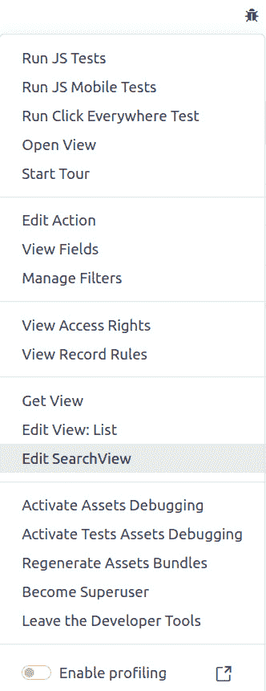
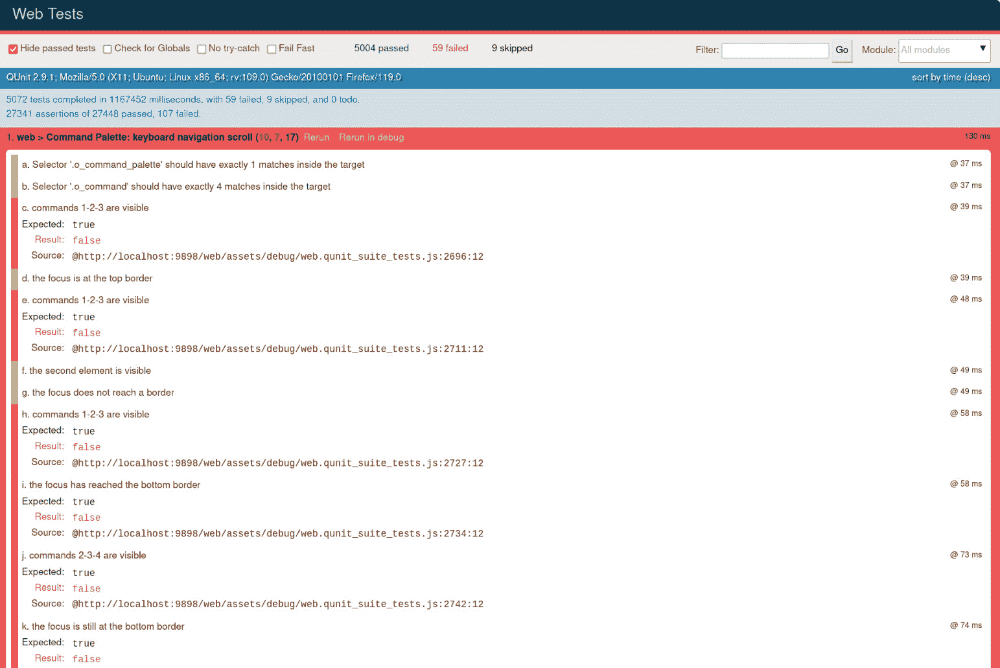
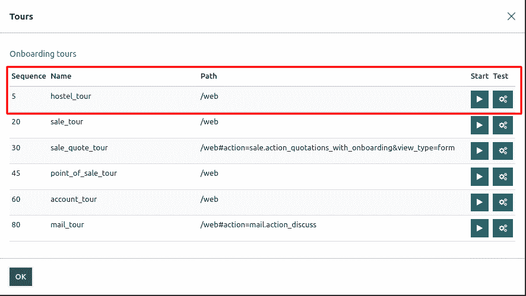
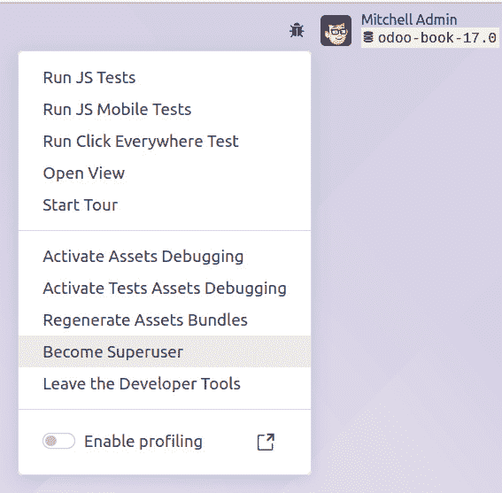

# 7

# 调试模块

在 *第五章*，*基本服务器端开发*，我们看到了如何编写模型方法来实现我们模块的逻辑。然而，当我们遇到错误或逻辑问题时，我们可能会陷入困境。为了解决这些错误，我们需要进行详细的检查，这可能会花费一些时间。幸运的是，Odoo 为你提供了一些调试工具，可以帮助你找到各种问题的根本原因。在本章中，我们将详细探讨各种调试工具和技术。

在本章中，我们将介绍以下食谱：

+   自动重新加载和 `--dev` 选项

+   生成服务器日志以帮助调试方法

+   使用 Odoo 壳交互式调用方法

+   使用 Python 调试器跟踪方法执行

+   理解调试模式选项

# 自动重新加载和 --dev 选项

在前面的章节中，我们看到了如何添加模型、字段和视图。每次我们更改 Python 文件时，我们都需要重新启动服务器以应用这些更改。如果我们更改 XML 文件，我们需要重新启动服务器并更新模块以在用户界面中反映这些更改。如果你正在开发大型应用程序，这可能会很耗时且令人沮丧。Odoo 提供了一个命令行选项 `--dev` 来克服这些问题。`--dev` 选项有几种可能的值，在本食谱中，我们将看到每个值。

## 准备工作

在你的开发环境中使用以下命令安装 `inotify or watchdog`。没有 `inotify 或 watchdog`，自动重新加载功能将不会工作：

```py
$ pip3 install inotify
$ pip3 install watchdog
```

## 如何做...

要启用 `dev` 选项，你需要从命令行使用 `--dev=value`。此选项的可能值是 `all`、`reload`、`pudb|wdb|ipdb|pdb`、`qweb`、`werkzeug` 和 `xml`。查看以下食谱以获取更多信息。

## 它是如何工作的...

检查以下列表以了解所有 `--dev` 选项及其用途：

+   `reload`: 每当你对 Python 进行更改时，你需要重新启动服务器以在 Odoo 中反映这些更改。`--dev=reload` 选项会在你对任何 Python 文件进行更改时自动重新加载 Odoo 服务器。如果你没有安装 Python 的 `inotify` 包，这个功能将不会工作。当你使用此选项运行 Odoo 服务器时，你会看到这样的日志：`AutoReload watcher running` `with inotify`。

+   `qweb`: 你可以使用 QWeb 模板在 Odoo 中创建动态的网站页面。在 *第十四章*，*CMS 网站开发*，我们将看到如何使用 QWeb 模板开发网页。你可以使用 `t-debug` 属性在 QWeb 模板中调试问题。只有当你使用 `--dev=qweb` 启用 `dev` 模式时，`t-debug` 选项才会工作。

+   `werkzeug`: Odoo 使用 `werkzeug` 来处理 HTTP 请求。内部，Odoo 会捕获并抑制由 `werkzeug` 产生的所有异常。如果你使用 `--dev=werkzeug`，当产生异常时，werkzeug 的交互式调试器将在网页上显示。

+   `xml`: 每次你在视图结构中做出更改时，都需要重新加载服务器并更新模块以应用这些更改。使用 `--dev=xml` 选项，你只需从浏览器重新加载 Odoo 即可。无需重新启动服务器或更新模块。

+   `pudb|wdb|ipdb|pdb`: 你可以使用 `--dev=pdb` 选项，它将在 Odoo 中生成异常时激活 PDB。Odoo 支持四个 Python 调试器：`pudb`、`wdb`、`ipdb` 和 `pdb`。

+   `all`: 如果你使用 `--dev=all`，所有前面的选项都将被启用。

```py
$ odoo/odoo-bin -c ~/odoo-dev/my-instance.cfg --dev=all
```

如果你只想启用几个选项，可以使用逗号分隔的值，如下所示：

```py
$ odoo/odoo-bin -c ~/odoo-dev/my-instance.cfg --dev=reload,qweb
```

重要提示

如果你已经更改了数据库结构，例如添加了新字段，`--dev=reload` 选项将不会在数据库模式中反映这些更改。你需要手动更新模块；它仅适用于 Python 业务逻辑。如果你添加了新的视图或菜单，`--dev=xml` 选项将不会在用户界面中反映这一点。你需要手动更新模块。这在设计视图或网站页面结构时非常有用。如果用户从 GUI 中更改了视图，那么 `--dev=xml` 将不会从文件中加载 XML。Odoo 将使用用户更改的视图结构。

# 生成服务器日志以帮助调试方法

**服务器日志**在尝试了解崩溃前运行时发生了什么时非常有用。它们还可以添加以在调试问题时提供更多信息。这个食谱展示了如何将日志记录添加到现有方法中。

## 准备工作

我们将在以下方法中添加一些日志语句，该方法将产品的库存水平保存到文件中（你还需要将 `product` 和 `stock` 模块的依赖项添加到清单中）：

```py
from os.path import join as opj
from odoo import models, api, exceptions
EXPORTS_DIR = '/srv/exports'
class ProductProduct(models.Model):
    _inherit = 'product.product'
    @api.model
    def export_stock_level(self, stock_location):
        products = self.with_context(
            location=stock_location.id
        ).search([])
        products = products.filtered('qty_available')
        fname = opj(EXPORTS_DIR, 'stock_level.txt')
        try:
            with open(fname, 'w') as fobj:
                for prod in products:
                    fobj.write('%s\t%f\n' % (prod.name,
                                             prod.qty_available))
        except IOError:
            raise exceptions.UserError('unable to save file')
```

## 如何操作...

为了在执行此方法时获取一些日志，执行以下步骤：

1.  在代码开头，导入 `logging` 模块：

    ```py
    import logging
    ```

1.  在模型类定义之前，为模块获取一个记录器：

    ```py
    _logger = logging.getLogger(__name__)
    ```

1.  修改 `export_stock_level()` 方法的代码，如下所示：

    ```py
    @api.model
    def export_stock_level(self, stock_location):
            _logger.info('export stock level for %s', stock_location.name)
            products = self.with_context(
                 location=stock_location.id).search([])
            products = products.filtered('qty_available')
            _logger.debug('%d products in the location', len(products))
            fname = join(EXPORTS_DIR, 'stock_level.txt')
            try:
                with open(fname, 'w') as fobj:
                    for prod in products:
                        fobj.write('%s\t%f\n' % (
                            prod.name, prod.qty_available))
            except IOError:
                _logger.exception(
                    'Error while writing to %s in %s',
                    'stock_level.txt', EXPORTS_DIR)
                raise exceptions.UserError('unable to save file')
    ```

## 它是如何工作的...

*步骤 1* 从 Python 标准库中导入 **logging** 模块。Odoo 使用此模块来管理其日志。

*步骤 2* 为 Python 模块设置一个记录器。我们在 Odoo 中使用常见的 `__name__` 习惯用法作为记录器名称的自动变量，并通过 `_logger` 调用记录器。

重要提示

`__name__` 变量由 Python 解释器在模块导入时自动设置，其值为模块的完整名称。由于 Odoo 对导入做了一些小技巧，附加模块在 Python 中被视为属于 `odoo.addons` Python 包。因此，如果食谱的代码位于 `my_hostel/models/hostel.py`，则 `__name__` 将为 `odoo.addons.my_hostel.models.hostel`。

通过这样做，我们得到两个好处：

+   由于 **logging** 模块中日志记录器的层次结构，设置在 **odoo** 日志记录器上的全局日志配置应用于我们的日志记录器

+   日志将带有完整的模块路径前缀，这在尝试找到给定日志行产生的地方时非常有帮助

*步骤 3* 使用日志记录器生成日志消息。可用于此的方法有（按日志级别递增）`%` 替换和要插入到消息中的附加参数。您不需要自己处理 `%` 替换；如果需要生成日志，日志模块足够智能，可以执行此操作。如果您正在以 **INFO** 级别运行，那么 **DEBUG** 日志将避免替换，这将在长期运行中消耗 CPU 资源。

本食谱中展示的另一种有用方法是 `_logger.exception()`，它可以在异常处理程序中使用。消息将以 `ERROR` 级别记录，并且堆栈跟踪也会打印在应用程序日志中。

## 还有更多...

您可以从命令行或配置文件中控制应用程序的 **日志级别**。主要有两种方法来做这件事：

第一种方法是使用 `--log-handler` 选项。其基本语法如下：`--log-handler=prefix:level`。在这种情况下，前缀是日志记录器名称路径的一部分，级别是 `my_hostel` 日志记录器设置为 **DEBUG**，并为其他附加组件保留默认日志级别，你可以按照以下方式启动 Odoo：

```py
$ python odoo.py --log-handler=odoo.addons.my_hostel:DEBUG
```

在命令行上可以多次指定 `--log-handler`。您还可以配置 `odoo.service.server`，我们保留信息级别消息，包括服务器启动通知：

```py
log_handler = :ERROR,werkzeug:CRITICAL,odoo.service.server:INFO
```

第二种方法是使用 `--log-level` 选项。要全局控制日志级别，可以使用 `--log-level` 作为命令行选项。此选项的可能值有 `critical`、`error`、`warn`、`debug`、`debug_rpc`、`debug_rpc_answer`、`debug_sql` 和 `test`。

设置日志级别的快捷方式有一些。以下是一份列表：

+   `--log-request` 是 `--log-handler=odoo.http.rpc.request:DEBUG` 的快捷方式

+   `--log-response` 是 `--log-handler=odoo.http.rpc.response:DEBUG` 的快捷方式

+   `--log-web` 是 `--log-handler=odoo.http:DEBUG` 的快捷方式

+   `--log-sql` 是 `--log-handler=odoo.sql_db:DEBUG` 的快捷方式

# 使用 Odoo 壳来交互式调用方法

Odoo 网络界面是为最终用户设计的，尽管开发者模式解锁了许多强大的功能。然而，通过网络界面进行测试和调试并不是最容易的方法，因为您需要手动准备数据，在菜单中进行导航以执行操作等。Odoo 壳是一个 **命令行界面**，您可以使用它来发出调用。本食谱展示了如何启动 Odoo 壳并执行如调用壳内方法之类的操作。

## 准备工作

我们将重用之前配方中的相同代码来生成服务器日志以帮助调试方法。这允许 `product.product` 模型添加一个新方法。我们假设你有一个已安装并可供使用的附加组件的实例。在这个配方中，我们期望你有一个名为 `project.conf` 的 Odoo 配置文件。

## 如何做到这一点...

为了从 Odoo 壳中调用 `export_stock_level()` 方法，执行以下步骤：

1.  启动 Odoo 壳并指定你的项目配置文件：

    ```py
        $ ./odoo-bin shell -c project.conf --log-level=error
    ```

1.  检查错误消息并阅读在常规 Python 命令行提示符之前显示的信息文本：

    ```py
    env: <odoo.api.Environment object at 0x7f48cc0868c0>
    odoo: <module 'odoo' from '/home/serpentcs/workspace/17.0/odoo/__init__.py'>
    openerp: <module 'odoo' from '/home/serpentcs/workspace/17.0/odoo/__init__.py'>
    self: res.users(1,)
    Python 3.10.13 (main, Aug 25 2023, 13:20:03) [GCC 9.4.0]
    Type 'copyright', 'credits' or 'license' for more information
    product.product:

    ```

    >>> product = env['product.product']

    ```py

    ```

1.  获取主要库存位置记录：

    ```py
        >>> location_stock = env.ref('stock.stock_location_stock')
    ```

1.  调用 `export_stock_level()` 方法：

    ```py
        >>> product.export_stock_level(location_stock)
    ```

1.  在退出前提交事务：

    ```py
        >>> env.cr.commit()
    ```

1.  通过按 *Ctrl +* *D* 退出壳。

## 它是如何工作的...

*步骤 1* 使用 `odoo-bin shell` 启动 Odoo 壳。所有常规命令行参数都是可用的。我们使用 `-c` 指定项目配置文件，并使用 `--log-level` 减少日志的冗余。在调试时，你可能希望为某些特定的插件设置日志级别为 `DEBUG`。

在提供 Python 命令行提示符之前，`odoo-bin shell` 启动一个不监听网络的 Odoo 实例并初始化一些全局变量，这些变量在输出中提到：

+   `env` 是一个连接到数据库的环境，并在命令行或配置文件中指定。

+   `odoo` 是为你导入的 `odoo` 包。你可以访问该包内的所有 Python 模块以执行你想要的操作。

+   `openerp` 是 `odoo` 包的别名，用于向后兼容。

+   `self` 是 `res.users` 的记录集，包含一个 Odoo 超用户（管理员）的单一记录，该记录与 `env` 环境相关联。

*步骤 3* 和 *步骤 4* 使用 `env` 获取一个空记录集并根据 XML ID 查找记录。*步骤 5* 调用 `product.product` 记录集上的方法。这些操作与你在方法内部使用的是相同的，唯一的区别是我们使用 `env` 而不是 `self.env`（尽管我们可以两者都有，因为它们是相同的）。有关可用的更多信息，请参阅 *第五章*，*基本服务器端开发*。

*步骤 6* 提交数据库事务。在这里这并不是严格必要的，因为我们没有修改数据库中的任何记录，但如果我们已经这样做并且希望这些更改持久化，这是必要的；当您通过 Web 界面使用 Odoo 时，每个 RPC 调用都在自己的数据库事务中运行，Odoo 会为您管理这些事务。当在 shell 模式下运行时，这种情况不再发生，您必须自己调用 `env.cr.commit()` 或 `env.cr.rollback()`。否则，当您退出 shell 时，任何正在进行的交易都会自动回滚。在测试时，这是可以的，但如果您使用 shell，例如，来脚本化实例的配置，别忘了提交您的工作！

## 还有更多...

在 shell 模式下，默认情况下，Odoo 会打开 Python 的 REPL 命令行界面。您可以使用 `--shell-interface` 选项使用您选择的 REPL。支持的 REPL 有 `ipython`、`ptpython`、`bpython` 和 `python`：

```py
$ ./odoo-bin shell -c project.conf  --shell-interface=ptpython
```

# 使用 Python 调试器跟踪方法执行

有时候，应用程序日志不足以找出问题所在。幸运的是，我们还有 Python 调试器。这个食谱展示了我们如何在一个方法中插入断点并通过手动跟踪执行过程。

## 准备工作

我们将重用本章 *使用 Odoo 命令行界面交互式调用方法* 食谱中展示的 `export_stock_level()` 方法。请确保您手头有该方法的副本。

## 如何操作...

要使用 `pdb` 跟踪 `export_stock_level()` 的执行，请执行以下步骤：

1.  编辑方法的代码，并插入此处突出显示的行：

    ```py
    def export_stock_level(self, stock_location):
        import pdb; pdb.set_trace()
        products = self.with_context( location=stock_location.id ).search([])
        fname = join(EXPORTS_DIR, 'stock_level.txt')
        try:
            with open(fname, 'w') as fobj:
                for prod in products.filtered('qty_available'):
                    fobj.write('%s\t%f\n' % (prod.name, prod.qty_available))
        except IOError:
             raise exceptions.UserError('unable to save file')
    ```

1.  运行该方法。我们将使用 Odoo 命令行界面，正如在 *使用 Odoo 命令行界面交互式调用 *方法* 的食谱中所述：

    ```py
    $ ./odoo-bin shell -c project.cfg --log-level=error
        [...]
        >>> product = env['product.product']
        >>> location_stock = env.ref('stock.stock_location_stock')
        >>> product.export_stock_level(location_stock)
        > /home/cookbook/stock_level/models.py(18)export_stock_level()
        -> products = self.with_context(
        (Pdb)
    ```

1.  在 `(Pdb)` 提示符下，发出 `args` 命令（其快捷键为 `a`）以获取传递给方法的参数值：

    ```py
    (Pdb) a
    self = product.product()
    stock_location = stock.location(14,)
    ```

1.  输入 `list` 命令以检查您在代码中的位置：

    ```py
    (Pdb) list
    13       @api.model
    14       def export_stock_level(self, stock_location):
    15       _logger.info('export stock level for %s',
    16                    stock_location.name)
    17       import pdb; pdb.set_trace()
    18 ->    products = self.with_context(
    19       location=stock_location.id).search([])
    20       products = products.filtered('qty_available')
    21       _logger.debug('%d products in the location',
    22                     len(products))
    23       fname = join(EXPORTS_DIR, 'stock_level.txt')
    (Pdb)
    ```

1.  输入 `next` 命令三次以遍历方法的第一行。您也可以使用 `n`，这是一个快捷键：

    ```py
    (Pdb) next
    > /home/cookbook/stock_level/models.py(19)export_stock_level()
    -> location=stock_location.id).search([])
    (Pdb) n
    > /home/cookbook/stock_level/models.py(20)export_stock_level()
    -> products = products.filtered('qty_available')
    (Pdb) n
    > /home/cookbook/stock_level/models.py(21)export_stock_level()
    -> _logger.debug('%d products in the location',
    (Pdb) n
    > /home/cookbook/stock_level/models.py(22)export_stock_level()
    -> len(products))
    (Pdb) n
    > /home/cookbook/stock_level/models.py(23)export_stock_level()
    -> fname = join(EXPORTS_DIR, 'stock_level.txt')
    (Pdb) n
    > /home/cookbook/stock_level/models.py(24)export_stock_level()
    -> try:
    ```

1.  使用 `p` 命令显示 `products` 和 `fname` 变量的值：

    ```py
    (Pdb) p products
    product.product(32, 14, 17, 19, 21, 22, 23, 29, 34, 33, 26, 27, 42)
    (Pdb) p fname
    '/srv/exports/stock_level.txt'
    ```

1.  将 `fname` 的值更改为指向 `/tmp` 目录：

    ```py
    (Pdb) !fname = '/tmp/stock_level.txt'
    ```

1.  使用 `return`（快捷键：`r`）命令执行当前函数：

    ```py
    (Pdb) return
    --Return--
    > /home/cookbook/stock_level/models.py(26)export_stock_level()->None
    -> for product in products:
    ```

1.  使用 `cont`（快捷键：`c`）命令恢复程序的执行：

    ```py
    (Pdb) c
    >>>
    ```

## 它是如何工作的...

在 *步骤 1* 中，我们通过从 Python 标准库中的 `pdb` 模块调用 `set_trace()` 方法在方法的源代码中硬编码了一个断点。当此方法执行时，程序的正常流程会停止，您会得到一个 `(Pdb)` 提示符，您可以在其中输入 `pdb` 命令。

*步骤 2* 使用 shell 模式调用 `stock_level_export()` 方法。您也可以正常重启服务器并使用 Web 界面通过点击用户界面的适当元素来生成对您需要跟踪的方法的调用。

当你需要使用 Python 调试器手动逐步执行一些代码时，以下是一些会使你的生活变得更简单的提示：

+   将日志级别降低以避免产生过多的日志行，这会污染调试器的输出。从`ERROR`级别开始通常是合适的。你可能想启用一些具有更高详细度的特定日志记录器，你可以使用`--log-handler`命令行选项来实现（参考*生成服务器日志以帮助调试*方法）。

+   使用`--workers=0`运行服务器以避免任何可能导致两个不同进程两次达到相同断点的多进程问题。

+   使用`--max-cron-threads=0`运行服务器以禁用`ir.cron`周期性任务的处理，否则在逐步执行方法时可能会触发，这会产生不想要的日志和副作用。

*步骤 3*到*8*使用几个`pdb`命令来逐步执行方法的执行。以下是`pdb`的主要命令的摘要。其中大部分也可以使用首字母作为快捷键。我们在以下列表中通过在括号中包含可选字母来表示这一点：

+   `h(elp)`: 这将显示`pdb`命令的帮助信息。

+   `a(rgs)`: 这显示了当前函数/方法的参数值。

+   `l(ist)`: 这将以 11 行为单位分块显示正在执行的源代码，最初集中在当前行。连续调用将移动到源代码文件的更远位置。你可以选择性地在开始和结束处传递两个整数，以指定要显示的区域。

+   `p`: 这将打印一个变量。

+   `pp`: 这将美化打印一个变量（对于列表和字典很有用）。

+   `w(here)`: 这显示了调用堆栈，当前行在底部，Python 解释器在顶部。

+   `u(p)`: 这将在调用堆栈中向上移动一级。

+   `d(own)`: 这将在调用堆栈中向下移动一级。

+   `n(ext)`: 这将执行当前代码行，然后停止。

+   `s(tep)`: 这是为了进入方法调用的执行。

+   `r(eturn)`: 这将恢复当前方法的执行，直到它返回。

+   `c(ont(inue))`: 这将恢复程序的执行，直到遇到下一个断点。

+   `b(reak) <args>`: 这将创建一个新的断点并显示其标识符；`args`可以是以下之一：

    +   `<empty>`: 这将列出所有断点。

    +   `line_number`: 这将在当前文件中指定的行处中断。

    +   `filename:line_number`: 这将在指定的文件中指定的行处中断（该文件将在`sys.path`的目录中搜索）。

    +   `function_name`: 这将在指定函数的第一行处中断。

    +   `tbreak <args>`: 这与`break`类似，但断点在达到后将被取消，因此后续执行该行不会触发它两次。

    +   `disable bp_id`: 这通过 ID 禁用断点。

    +   `enable bl_id`: 这通过 ID 启用已禁用的断点。

+   `j(ump) lineno`: 下一条要执行的行将是指定的行。这可以用来重新运行或跳过某些行。

+   `(!) statement`: 这将执行一个 Python 语句。如果命令看起来不像`pdb`命令，则可以省略`!`字符。例如，如果你想设置名为`a`的变量的值，因为`a`是`args`命令的快捷方式，你需要它。

## 还有更多...

在配方中，我们插入了一个`pdb.set_trace()`语句来中断到`pdb`进行调试。我们也可以直接从 Odoo shell 中启动`pdb`，这在无法使用`pdb.runcall()`轻松修改项目代码时非常有用。这个函数将方法作为第一个参数，将传递给函数的参数作为下一个参数。因此，在 Odoo shell 中，你将执行以下操作：

```py
>>> import pdb
>>> product = env['product.product']
>>> location_stock = env.ref('stock.stock_location_stock')
>>> pdb.runcall(product.export_stock_level, location_stock)
> /home/cookbook/stock_level/models.py(16)export_stock_level()
-> products = self.with_context((Pdb)
```

在这个配方中，我们专注于 Python 标准库中的 Python 调试器`pdb`。了解这个工具非常有用，因为它保证在任何 Python 发行版中都可用。还有其他 Python 调试器可用，如`ipdb`([`pypi.python.org/pypi/ipdb`](https://pypi.python.org/pypi/ipdb))和`pudb`([`pypi.python.org/pypi/pudb`](https://pypi.python.org/pypi/pudb))，它们可以用作`pdb`的替代品。它们共享相同的 API，并且在这个配方中看到的绝大多数命令都没有改变。当然，如果你使用 Python IDE 为 Odoo 开发，你将能够访问与之集成的调试器。

## 相关内容

如果你想了解更多关于`pdb`调试器的信息，请参阅`pdb`的完整文档，网址为[`docs.python.org/3.9/library/pdb.html`](https://docs.python.org/3.9/library/pdb.html)。

# 理解调试模式选项

在*第一章*“*安装 Odoo 开发环境*”中，我们看到了如何在 Odoo 中启用调试/开发者选项。这些选项在调试中非常有用，并揭示了更多技术信息。在本配方中，我们将详细查看这些选项。

## 如何操作...

检查*第一章*中“*激活 Odoo 开发者工具*”配方，*安装 Odoo 开发环境*，并激活开发者模式。激活开发者模式后，你将在顶部栏看到一个带有 bug 图标的下拉菜单，如图所示：



图 7.1 – 激活调试模式后的可用选项

在这个菜单中，你会看到各种选项。尝试它们以查看它们的作用。下一节将更详细地解释这些选项。

## 它是如何工作的...

让我们更深入地了解以下选项：

+   **运行 JS 测试**：此选项将带您转到 JavaScript QUnit 测试用例页面，如图下所示。它将逐个运行所有测试用例。在此，您可以查看测试用例的进度和状态。在*第十八章*，*自动化测试用例*中，我们将了解如何创建我们自己的 QUnit JavaScript 测试用例：



图 7.2 – QUnit 测试用例结果屏幕

+   **运行 JS 移动测试**：与前面的选项类似，但此选项为移动环境运行 QUnit 测试用例。

+   **运行任何地方点击测试**：此选项将逐个点击所有菜单。它将在所有视图和搜索过滤器中进行点击。如果出现问题或出现任何回归，它将显示回溯。要停止此测试，您需要重新加载页面。

+   **打开视图**：此选项将打开所有可用视图的列表。通过选择其中任何一个，您可以在不定义任何菜单或操作的情况下打开该视图。

+   **禁用导游**：Odoo 使用导游来改善新用户的入门体验。如果您想禁用它，您可以使用此选项。

+   **开始导游**：Odoo 还使用导游进行自动化测试。我们将在*第十五章*，*Web 客户端开发*中创建一个自定义入门导游。此选项将打开一个包含所有导游列表的对话框，如图下所示。通过点击导游旁边的播放按钮，Odoo 将自动执行导游的所有步骤：



图 7.3 – 手动启动导游的对话框

+   **编辑操作**：在*第三章*，*创建 Odoo 附加模块*的*添加菜单项和视图*配方中，我们添加了一个菜单项和一个操作来在 Odoo 中打开视图。这些操作的详细信息也存储在数据库中作为记录。此选项将打开我们打开以显示当前视图的操作的记录详情。

+   `hostel.hostel`模型，此选项将显示`hostel.hostel`模型字段的列表。

+   **管理过滤器**：在 Odoo 中，用户可以从搜索视图中创建自定义过滤器。此选项将打开当前模型的自定义过滤器列表。在此，您可以修改自定义过滤器。

+   **技术翻译**：此选项将打开当前模型翻译术语的列表。您可以从这里修改您模型的翻译术语。您可以参考*第十一章*，*国际化*以了解更多关于翻译的信息。

+   **查看访问权限**：此选项将显示当前模型的安全访问权限列表。

+   **查看记录规则**：此选项将显示当前模型的安全记录规则列表。

+   `fields_view_get()`方法。

+   `ir.ui.view` 记录当前视图。此选项是动态的，它将根据当前打开的视图显示选项。这意味着如果您打开**看板视图**，您将获得**编辑视图：看板**选项，如果您打开**表单视图**，您将获得**编辑视图：****表单**选项。

重要提示

您可以从**编辑视图**选项修改视图定义。此更新定义将适用于当前数据库，并且当您更新模块时，这些更改将被删除。因此，最好从模块中修改视图。

+   `ir.ui.view` 记录当前模型的搜索视图。

+   **激活资产调试模式**：Odoo 提供两种开发者模式：*开发者模式*和*带资产的开发者模式*。使用此选项，您可以从*开发者模式*切换到*带资产的开发者模式*。有关更多详细信息，请参阅*第一章*，*安装 Odoo 开发环境*中的*激活 Odoo 开发工具*配方。

+   **激活测试资产调试模式**：正如我们所知，Odoo 使用导游进行测试。启用此模式将在 Odoo 中加载测试资产。此选项将在**开始****导游**对话框中显示更多导游。

+   **重新生成资产包**：Odoo 通过资产包管理所有 CSS 和 JavaScript。此选项删除旧的 JavaScript 和 CSS 资产并生成新的。当您遇到由于资产缓存引起的问题时，此选项非常有用。我们将在*第十四章*，*CMS* *网站开发*中了解更多关于资产包的信息。

+   **成为超级用户**：这是从版本 12 开始添加的新选项。通过激活此选项，您将切换到超级用户。即使您没有访问权限，您也可以访问记录。此选项并非对所有用户都可用；它仅适用于具有**管理：设置**访问权限的用户。激活此模式后，您将看到一条带条纹的顶部菜单，如图所示：



图 7.4 – 激活超级用户后的菜单

+   **离开开发者工具**：此选项允许您离开开发者模式。

我们已经看到了调试菜单下所有可用的选项。这些选项可以用于多种方式，例如调试、测试和修复问题。它们还可以用于探索视图的源代码。
