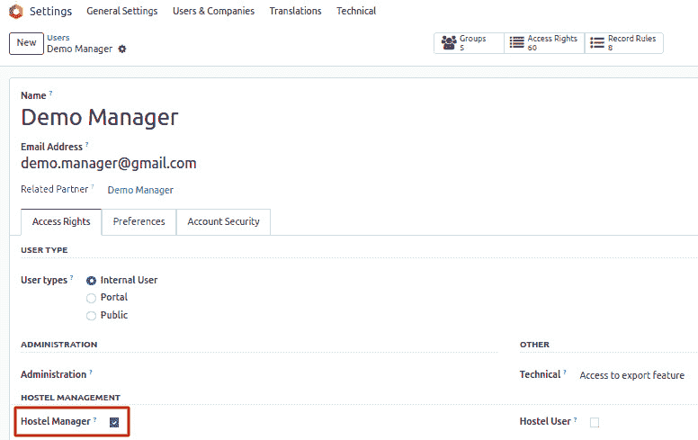
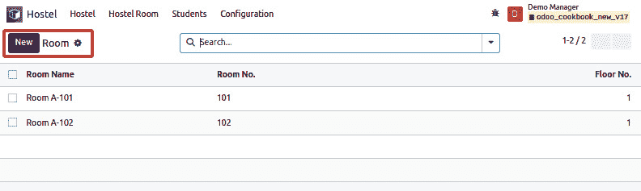
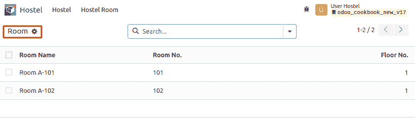
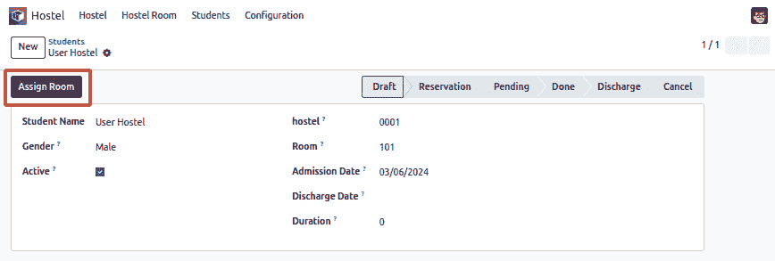
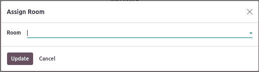
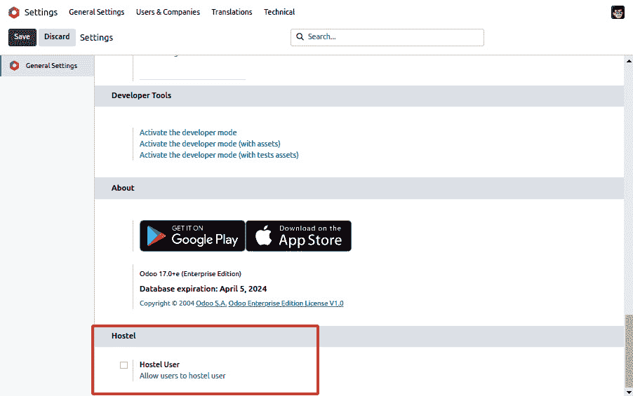

# 8

# 高级服务器端开发技术

在*第五章*，*基本服务器端开发*中，你学习了如何为模型类编写方法，如何扩展继承模型的方法，以及如何处理记录集。本章将涉及更高级的主题，例如处理记录集的环境、在按钮点击时调用方法，以及处理`onchange`方法。本章中的食谱将帮助你管理更复杂的企业问题。你将学习如何通过结合视觉元素和阐明在 Odoo 应用程序开发过程中创建交互式功能的过程来建立理解。

在本章中，我们将探讨以下食谱：

+   更改执行操作的当前用户

+   以修改后的上下文调用方法

+   执行原始 SQL 查询

+   编写向导以引导用户

+   定义`onchange`方法

+   在服务器端调用`onchange`方法

+   使用`compute`方法定义`onchange`

+   基于 SQL 视图定义模型

+   添加自定义设置选项

+   实现`init`钩子

# 技术要求

对于本章，你需要 Odoo 在线平台。

本章中使用的所有代码都可以从本书的 GitHub 仓库中下载，网址为[`github.com/PacktPublishing/Odoo-17-Development-Cookbook-Fifth-Edition/tree/main/Chapter08`](https://github.com/PacktPublishing/Odoo-17-Development-Cookbook-Fifth-Edition/tree/main/Chapter08)。

# 更改执行操作的当前用户

在编写业务逻辑代码时，你可能需要以不同的安全上下文执行一些操作。一个典型的例子是使用`superuser`权限执行操作，绕过安全检查。当业务需求需要操作用户没有安全访问权限的记录时，就会出现这种需求。

这个食谱将向你展示如何通过使用`sudo()`允许普通用户创建`room`记录。简单来说，我们将允许用户自己创建`room`，即使他们没有创建或分配`room`记录的权限。

## 准备工作

为了更容易理解，我们将添加一个新的模型来管理宿舍房间。我们将添加一个名为`hostel.student`的新模型。你可以参考以下定义来添加此模型：

```py
class HostelStudent(models.Model):
   _name = "hostel.student"
   _description = "Hostel Student Information"
   name = fields.Char("Student Name")
   gender = fields.Selection([("male", "Male"),
       ("female", "Female"), ("other", "Other")],
       string="Gender", help="Student gender")
   active = fields.Boolean("Active", default=True,
       help="Activate/Deactivate hostel record")
   hostel_id = fields.Many2one("hostel.hostel", "hostel", help="Name of hostel")
   room_id = fields.Many2one("hostel.room", "Room",
       help="Select hostel room")
   status = fields.Selection([("draft", "Draft"),
       ("reservation", "Reservation"), ("pending", "Pending"),
       ("paid", "Done"),("discharge", "Discharge"), ("cancel", "Cancel")],
       string="Status", copy=False, default="draft",
       help="State of the student hostel")
   admission_date = fields.Date("Admission Date",
       help="Date of admission in hostel",
       default=fields.Datetime.today)
   discharge_date = fields.Date("Discharge Date",
       help="Date on which student discharge")
   duration = fields.Integer("Duration", compute="_compute_check_duration", inverse="_inverse_duration",
                              help="Enter duration of living")
```

你需要添加一个表单视图、一个动作和一个菜单项，以便从用户界面中查看这个新模型。你还需要为宿舍添加安全规则，以便它们可以发布宿舍学生。如果你不知道如何添加这些内容，请参阅*第三章*，*创建 Odoo 附加模块*。

或者，您可以使用我们从 GitHub 代码示例中提供的现成初始模块来节省时间。此模块位于`Chapter08/00_initial_module`文件夹中。GitHub 代码示例可在[`github.com/PacktPublishing/Odoo-17-Development-Cookbook-Fifth-Edition/tree/main/Chapter08/00_initial_module`](https://github.com/PacktPublishing/Odoo-17-Development-Cookbook-Fifth-Edition/tree/main/Chapter08/00_initial_module)找到。

## 如何操作...

如果你已经测试了该模块，你会发现只有具有`hostel.room`访问权限的用户才能将房间标记为管理员。非宿舍用户不能自己创建房间；他们需要请求管理员用户：

1.  此用户具有**宿舍管理员**访问权限，这意味着他们可以创建**宿舍** **房间**记录：



图 8.1 – 此用户具有宿舍管理员访问权限

如以下截图所示，**宿舍管理员**也可以创建房间记录：



图 8.2 – 宿舍管理员可以创建房间记录

1.  此用户具有**宿舍用户**访问权限：


图 8.3 – 此用户具有宿舍用户访问权限

他们只能看到**宿舍** **房间**记录：



图 8.4 – 宿舍用户只能看到宿舍房间记录

假设我们想要添加一个新功能，以便非宿舍用户可以自己创建房间。我们将这样做，而不会给他们`hostel.room`模型的访问权限。

因此，让我们学习如何让普通宿舍用户学生。

1.  将`action_assign_room()`方法添加到`hostel.room`模型中：

    ```py
    class HostelStudent(models.Model):
       _name = "hostel.student"
        ...
        def action_assign_room(self):
    ```

1.  在方法中，确保我们正在对一个单一记录进行操作：

    ```py
    self.ensure_one()
    ```

1.  如果学生未付款，则发出警告（确保您已在顶部导入`UserError`）：

    ```py
    if self.status != "paid":
               raise UserError(_("You can't assign a room if it's not paid."))
    ```

1.  以超级用户身份获取`hostel.room`的空记录集：

    ```py
    room_as_superuser = self.env['hostel.room'].sudo()
    ```

1.  创建一个带有适当值的`room`记录：

    ```py
    room_rec = room_as_superuser.create({
               "name": "Room A-103",
               "room_no": "A-103",
               "floor_no": 1,
               "room_category_id": self.env.ref("my_hostel.single_room_categ").id,
               "hostel_id": self.hostel_id.id,
           })
    ```

1.  要从用户界面触发此方法，请将按钮添加到学生表单视图中：

    ```py
    <button name="action_assign_room"
                               string="Assign Room"
                               type="object"
                               class="btn-primary"
                           />
    ```

1.  重新启动服务器并将`my_hostel`更新以应用给定更改。更新后，你将在学生表单视图中看到**分配房间**按钮，如图所示：



图 8.5 – 学生表单视图中的分配房间按钮

当你点击它时，将创建一个新的房间记录。这对非宿舍用户也适用。你可以通过以演示用户身份访问 Odoo 来测试这一点。

## 工作原理...

在前三个步骤中，我们添加了一个名为`action_assign_room()`的新方法。当用户在学生表单视图中点击**分配房间**按钮时，将调用此方法。

在*步骤 4*中，我们使用了 `sudo()`。此方法返回一个新的记录集，其中包含修改后的 `environment`，用户在该环境中拥有 `superuser` 权限。当使用 `sudo()` 调用 `recordset` 时，环境将修改 `environment` 属性为 `su`，这表示环境的 `superuser` 状态。您可以通过 `recordset.env.su` 访问其状态。所有通过此 `sudo` 记录集进行的调用都带有超级用户权限。为了更好地理解这一点，请从方法中移除 `.sudo()`，然后点击 `Access Error`，用户将不再有权访问该模型。仅使用 `sudo()` 就会绕过所有安全规则。

如果您需要一个特定的用户，您可以传递一个包含该用户或该用户数据库 ID 的记录集，如下所示：

```py
public_user = self.env.ref('base.public_user')
hostel_room = self.env['hostel.room'].with_user(public_user)
hostel_room.search([('name', 'ilike', 'Room 101')])
```

这段代码片段允许您使用 `public` 用户搜索可见的房间。

## 更多内容...

使用 `sudo()`，您可以绕过访问权限和安全记录规则。有时，您可以访问本应隔离的多个记录，例如在多公司环境中来自不同公司的记录。`sudo()` 记录集绕过了 Odoo 的所有安全规则。

如果您不小心，在此环境中搜索的记录可能会与数据库中存在的任何公司相关联，这意味着您可能会向用户泄露信息；更糟糕的是，您可能会通过将属于不同公司的记录链接起来，在不知不觉中破坏数据库。

当使用 `sudo()` 时，请谨慎行事，以避免意外后果，例如无意中将不同公司的记录链接起来。确保适当的数据隔离，并在绕过访问权限之前考虑对数据完整性和安全规则可能产生的影响。

重要提示

当使用 `sudo()` 时，始终要仔细检查您的 `search()` 调用是否依赖于标准记录规则来过滤结果。

不使用 `sudo()`，`search()` 调用将尊重标准记录规则，可能会根据用户权限限制对记录的访问。这可能导致搜索结果不完整或不准确，影响数据可见性和应用程序功能。

## 参考以下内容

查阅以下参考资料以获取更多信息：

+   如果您想了解更多关于环境的信息，请参阅*第五章*，*基本* *服务器端开发*中的*为模型获取空记录集*配方。

+   有关访问控制列表和记录规则的更多信息，请参阅*第十章*，*安全访问*

# 调用一个修改过的上下文的方法

`context` 是记录集环境的一部分。它用于传递额外的信息，例如用户的时区和语言，从用户界面传递。你也可以使用上下文来传递动作中指定的参数。标准 Odoo 扩展中的几个方法使用上下文根据这些上下文值调整其业务逻辑。有时需要修改 `recordset` 中的上下文值，以从方法调用中获得所需的结果或计算字段的所需值。

这个菜谱将向你展示如何根据环境上下文中的值更改方法的行为。

## 准备工作

对于这个菜谱，我们将使用之前菜谱中的 `my_hostel` 模块。在 `hostel.room` 模型的表单视图中，我们将添加一个按钮来移除房间成员。如果宿舍的普通居民未经许可或授权从其分配的房间中移除其他居住者，可能会在住宿中造成混乱和问题。请注意，我们已经在房间表单视图中有了相同的按钮，但在这里，我们将探讨 Odoo 中的上下文使用，深入了解它如何影响系统操作和结果。

## 如何操作...

要添加一个按钮，你需要执行以下步骤：

1.  添加 `hostel.room`：

    ```py
    <button name="action_remove_room_members"
                               string="Remove Room Members"
                               type="object"
                               class="btn-primary"
                           />
    ```

1.  将 `action_remove_room_members()` 方法添加到 `hostel.room` 模型中：

    ```py
    def action_remove_room_members(self):
       ...
    ```

1.  将以下代码添加到方法中，以更改环境上下文并调用移除房间成员的方法：

    ```py
    student.with_context(is_hostel_room=True).action_remove_room()
    ```

1.  更新 `hostel.student` 模型的 `action_remove_room()` 方法，以便展示不同的行为：

    ```py
    def action_remove_room(self):
           if self.env.context.get("is_hostel_room"):
               self.room_id = False
    ```

## 它是如何工作的…

在 Odoo 中，为了修改受上下文影响的操作行为，我们做了以下操作：

1.  确定了目标行为。

1.  定义了上下文参数。

1.  修改了相关的代码部分。

1.  仔细测试了更改。

1.  确保模块间的兼容性。

在 *步骤 1* 中，我们移除了房间成员。

在 *步骤 2* 中，我们添加了一个新的按钮，**移除房间成员**。用户将使用此按钮来 **移除** **成员**。

在 *步骤 3* 和 *步骤 4* 中，我们添加了一个方法，当用户点击 **移除房间成员** 按钮时会被调用。

在 *步骤 5* 中，我们使用一些关键字参数调用了 `student.with_context()`。这返回了一个带有更新上下文的新版本的 `room_id` 记录集。我们在这里添加了一个键到上下文中，`is_hostel_room=True`，但如果你想的话，可以添加多个键。在这里我们使用了 `sudo()`。

在 *步骤 6* 中，我们检查了上下文中 `is_hostel_room` 键的值是否为正。

现在，当宿舍房间在学生表单视图中移除房间成员时，`room` 记录集为 `False`。

这只是一个修改过的上下文示例，但你可以使用任何方法，例如 `create()`、`write()`、`unlink()` 等。你也可以根据需求创建任何自定义方法。

## 更多...

也可以向`with_context()`传递一个字典。在这种情况下，该字典用作新的上下文，它将覆盖当前的上下文。因此，*步骤 5*也可以写成以下形式：

```py
new_context = self.env.context.copy()
new_context.update({'is_hostel_room': True})
student.with_context(new_context)
```

## 参考信息

参考以下配方来了解 Odoo 中上下文的更多信息：

+   在*第五章*的*获取空记录集的模型*配方中，*基本服务器端开发*解释了环境是什么

+   在*第九章*的*传递参数到表单和动作 – 上下文*配方中，*后端视图*解释了如何在动作定义中修改上下文

+   在*第五章*的*搜索记录*配方中，*基本服务器端开发*解释了活动记录

# 执行原始 SQL 查询

大多数情况下，你可以通过使用 Odoo 的 ORM 来执行你想要的操作——例如，你可以使用`search()`方法来获取记录。然而，有时你需要更多；要么你不能使用域语法来表达你想要的（对于某些操作来说可能很棘手，甚至根本不可能），或者你的查询需要多次调用`search()`，这最终变得效率低下。

此配方展示了如何使用原始 SQL 查询来获取用户在特定房间中保存的名称和数量。

## 准备工作

对于这个配方，我们将使用前一个配方中的`my_hostel`模块。为了简单起见，我们将在日志中打印结果，但在实际场景中，你需要在你的业务逻辑中使用查询结果。在*第九章*的*后端视图*中，我们将显示此查询的结果。 

## 如何做到这一点...

要获取用户在特定房间中保存的名称和数量信息，你需要执行以下步骤：

1.  将`action_category_with_amount()`方法添加到`hostel.room`：

    ```py
    def action_category_with_amount(self):
        ...
    ```

1.  在方法中，编写以下 SQL 查询：

    ```py
    """
               SELECT
                   hrc.name,
                   hrc.amount
               FROM
                   hostel_room AS hostel_room
               JOIN
                   hostel_room_category as hrc ON hrc.id = hostel_room.room_category_id
               WHERE hostel_room.room_category_id = %(cate_id)s;""",
               {'cate_id': self.room_category_id.id}
    ```

1.  执行查询：

    ```py
    self.env.cr.execute("""
               SELECT
                   hrc.name,
                   hrc.amount
               FROM
                   hostel_room AS hostel_room
               JOIN
                   hostel_room_category as hrc ON hrc.id = hostel_room.room_category_id
               WHERE hostel_room.room_category_id = %(cate_id)s;""",
               {'cate_id': self.room_category_id.id})
    ```

1.  获取结果并记录它（确保你已经导入了`logger`）：

    ```py
    result = self.env.cr.fetchall()
           _logger.warning("Hostel Room With Amount: %s", result)
    ```

1.  在`hostel.room`模式的表单视图中添加一个按钮来触发我们的方法：

    ```py
    <button name="action_category_with_amount"
                               string="Log Category With Amount"
                               type="object"
                               class="btn-primary"/>
    ```

不要忘记在此文件中导入`logger`。然后，重新启动并更新`my_hostel`模块。

## 它是如何工作的...

在*步骤 1*中，我们添加了`action_category_with_amount()`方法，当用户点击**带有金额的日志类别**按钮时将被调用。

在*步骤 2*中，我们声明了一个 SQL **SELECT**查询。这将返回表示宿舍房间中数量的类别。如果你在 PostgreSQL CLI 中运行此查询，你将根据你的房间数据得到一个结果。以下是基于我的数据库的示例数据：

```py
+---------------------------------------+-------+
| name                                  | amount|
|---------------------------------------+-------|
| Single Room                           | 3000  |
+---------------------------------------+-------+
```

在*步骤 4*中，我们在`self.env.cr`中存储的数据库游标上调用`execute()`方法。这将查询发送到 PostgreSQL 并执行它。

在 *步骤 5* 中，我们使用了游标的 `fetchall()` 方法来检索查询选择的行列表。此方法返回行列表。在我的情况下，这是 `[('Single Room', 3000)]`。从我们执行的查询形式来看，我们知道每一行将恰好有两个值，第一个是 `name`，另一个是用户在特定房间中的金额。然后，我们简单地记录下来。

在 *步骤 6* 中，我们添加了一个 `添加` 按钮来处理用户操作。

重要提示

如果你正在执行 `UPDATE` 查询，你需要手动使缓存无效，因为 Odoo ORM 的缓存不知道你用 `UPDATE` 查询所做的更改。要使缓存无效，你可以使用 `self.invalidate_cache()`。

## 还有更多...

`self.env.cr` 中的对象是围绕 `psycopg2` 游标的一个薄包装。以下是你大部分时间会想使用的方法：

+   `execute(query, params)`: 这将使用在查询中标记为 `%s` 的参数执行 SQL 查询，其中 `params` 是一个元组

警告

永远不要自己进行替换；始终使用格式化选项，如 `%s`。如果你使用字符串连接等技术，可能会使代码容易受到 SQL 注入攻击。

+   `fetchone()`: 这将返回数据库中的一行，封装在元组中（即使查询只选择了一个列）

+   `fetchall()`: 这将返回数据库中的所有行，作为一个元组的列表

+   `dictfetchall()`: 这将返回数据库中的所有行，作为一个字典列表，映射列名到值

在处理原始 SQL 查询时要非常小心：

+   你正在绕过应用程序的所有安全性。确保你使用任何你检索的 ID 列表调用 `search([('id', 'in', tuple(ids)])` 来过滤掉用户无权访问的记录。

+   你所做的任何修改都会绕过附加模块设置的约束，除了 `NOT NULL`、`UNIQUE` 和 `FOREIGN KEY` 约束，这些约束在数据库级别强制执行。这也适用于任何计算字段重新计算触发器，因此你可能会损坏数据库。

+   避免使用 `INSERT/UPDATE` 查询 – 通过查询插入或更新记录不会运行通过重写 `create()` 和 `write()` 方法编写的任何业务逻辑。它不会更新存储的计算字段，并且也会绕过 ORM 约束。

## 参见

对于访问权限管理，请参阅 *第十章*，*安全访问*。

# 编写向导以引导用户

在 *第四章* 的 *使用抽象模型实现可重用模型功能* 菜谱中，介绍了 `models.TransientModel` 基类。这个类与普通模型有很多共同之处，除了瞬态模型的记录在数据库中定期清理，因此得名瞬态。这些用于创建向导或对话框，用户在用户界面中填写，通常用于对数据库的持久记录执行操作。

## 准备工作

对于这个菜谱，我们将使用之前菜谱中的 `my_hostel` 模块。这个菜谱将添加一个新的向导。使用这个向导，用户将被分配房间。

## 如何做到这一点...

按照以下步骤添加一个新的向导以更新分配房间和宿舍记录：

1.  使用以下定义向模块添加一个新的瞬态模型：

    ```py
    class AssignRoomStudentWizard(models.TransientModel):
       _name = 'assign.room.student.wizard'
       room_id = fields.Many2one("hostel.room", "Room", required=True)
    ```

1.  添加执行在瞬态模型上操作的 `callback` 方法。将以下代码添加到 `AssignRoomStudentWizard` 类中：

    ```py
    def add_room_in_student(self):
           hostel_room_student = self.env['hostel.student'].browse(
               self.env.context.get('active_id'))
           if hostel_room_student:
               hostel_room_student.update({
                   'hostel_id': self.room_id.hostel_id.id,
                   'room_id': self.room_id.id,
                   'admission_date': datetime.today(),
               })
    ```

1.  为模型创建一个表单视图。将以下视图定义添加到模块视图：

    ```py
    <record id='assign_room_student_wizard_form' model='ir.ui.view'>
       <field name='name'>assign room student wizard form view</field>
       <field name='model'>assign.room.student.wizard</field>
       <field name='arch' type='xml'>
           <form string="Assign Room">
               <sheet>
                   <group>
                       <field name='room_id'/>
                   </group>
               </sheet>
               <footer>
                   <button string='Update' name='add_room_in_student' class='btn-primary' type='object'/>
                   <button string='Cancel' class='btn-default' special='cancel'/>
               </footer>
           </form>
       </field>
    </record>
    ```

1.  创建一个动作和一个菜单项以显示向导。将以下声明添加到模块菜单文件中：

    ```py
    <record model="ir.actions.act_window" id="action_assign_room_student_wizard">
       <field name="name">Assign Room</field>
       <field name="res_model">assign.room.student.wizard</field>
       <field name="view_mode">form</field>
       <field name="target">new</field>
    </record>
    ```

1.  在 `ir.model.access.csv` 文件中为 `assign.room.student.wizard` 添加访问权限：

    ```py
    access_assign_room_student_wizard_manager,access.assign.room.student.wizard.manager,model_assign_room_student_wizard,my_hostel.group_hostel_manager,1,1,1,1
    ```

1.  将 `my_hostel` 模块更新以应用更改。

## 它是如何工作的...

在 *第一步* 中，我们定义了一个新的模型。它与其他模型没有区别，除了基类是 `TransientModel` 而不是 `Model`。`TransientModel` 和 `Model` 都有一个共同的基类，称为 `BaseModel`，如果您检查 Odoo 的源代码，您会看到 99% 的工作都在 `BaseModel` 中，而 `Model` 和 `TransientModel` 几乎都是空的。

对于 `TransientModel` 记录，唯一发生变化的是以下内容：

+   记录会定期从数据库中删除，以便瞬态模型的表不会随着时间的推移而增长

+   您不允许在指向普通模型的 `TransientModel` 实例上定义 `one2many` 字段，因为这将在持久模型上添加一个指向瞬态数据的列

在此情况下使用 *many2many* 关系。当然，如果 *one2many* 中的相关模型也是 `TransientModel`，您也可以使用 *one2many* 字段。

我们在模型中定义一个字段用于存储房间。我们可以添加其他标量字段，以便我们可以记录一个计划返回日期，例如。

在 *第二步* 中，我们向向导类中添加了代码，当在 *第三步* 中点击定义的按钮时将被调用。此代码读取向导的值并更新 `hostel.student` 记录。

在**步骤 3**中，我们为我们的向导定义了一个视图。有关详细信息，请参阅*第九章*中的*文档式表单*食谱，*后端视图*。这里的重要点是页脚中的按钮；`type`属性设置为`'object'`，这意味着当用户点击按钮时，将调用按钮的`name`属性指定的方法。

在**步骤 4**中，我们确保在我们的应用程序菜单中有一个向导的入口点。我们在动作中使用`target='new'`，这样表单视图就会以对话框的形式显示在当前表单之上。有关详细信息，请参阅*第九章*中的*添加菜单项和窗口动作*食谱，*后端视图*：



图 8.6 – 为学生分配房间的向导

在**步骤 5**中，我们为`assign.room.student.wizard`模型添加了访问权限。有了这个，管理员用户将获得对`assign.room.student.wizard`模型的完全权限。

注意

在 Odoo v14 之前，`TransientModel`不需要任何访问规则。任何人都可以创建记录，并且他们只能访问自己创建的记录。从 Odoo v14 开始，`TransientModel`需要访问权限。

## 还有更多...

这里有一些提高你的向导的技巧。

### 使用上下文来计算默认值

我们展示的向导需要用户在表单中填写成员的名称。我们可以使用 Web 客户端的一个功能来节省一些输入。当执行动作时，`context`会更新一些可以由向导使用的值：

+   `active_model`：这是与动作相关的模型名称。这通常是屏幕上显示的模型。

+   `active_id`：这表示有一个单个记录处于活动状态，并提供该记录的 ID。

+   `active_ids`：如果选择了多个记录，这将是一个包含 ID 的列表。当在树视图中选择多个项目并触发动作时会发生这种情况。在表单视图中，你得到`[active_id]`。

+   `active_domain`：这是向导将操作的一个附加域。

这些值可以用来计算模型的默认值，甚至可以直接用于按钮调用的方法中。为了改进本食谱中的示例，如果我们有一个在`hostel.room`模型表单视图中显示的按钮来启动向导，那么向导创建的上下文将包含`{'active_model': 'hostel.room', 'active_id': <hostel_room_id>}`。在这种情况下，你可以定义`room_id`字段来获取以下方法计算出的默认值：

```py
def _default_member(self):
    if self.context.get('active_model') == 'hostel.room':
        return self.context.get('active_id', False)
```

### 向导和代码复用

在**步骤 2**中，我们可以在方法的开头添加`self.ensure_one()`，如下所示：

```py
def add_room_in_student(self):
       hostel_room_student = self.env['hostel.student'].browse(
           self.env.context.get('active_id'))
       if hostel_room_student:
           hostel_room_student.update({
               'hostel_id': self.room_id.hostel_id.id,
               'room_id': self.room_id.id,
               'admission_date': datetime.today(),
           })
```

我们建议在此食谱中使用 v17。它将允许我们通过为向导创建记录并将它们放入单个记录集中来重用向导的其他部分（有关如何做到这一点，请参阅 *第五章* 中的 *结合记录集* 食谱，*基本服务器端开发*），然后在记录集上调用 `add_room_in_student()`。在这里，代码很简单，你不需要跳过所有那些环来记录不同学生分配了哪些房间。然而，在 Odoo 实例中，某些操作要复杂得多，有一个能够正确执行操作的向导总是很方便。当使用这些向导时，请确保检查源代码中任何可能的 `active_model/active_id/active_ids` 键的上下文使用。如果是这种情况，您需要传递一个自定义上下文（请参阅 *使用修改后的上下文调用方法* 食谱）。

## 重定向用户

*步骤 2* 中的方法不返回任何内容。这将在执行操作后关闭向导对话框。另一种可能性是让该方法返回一个包含 `ir.action` 字段的字典。在这种情况下，Web 客户端将处理操作，就像用户点击了菜单项一样。可以在 `BaseModel` 类中定义的 `get_formview_action()` 方法用来实现这一点。例如，如果我们想显示宿舍房间的表单视图，我们可以编写以下代码：

```py
def add_room_in_student(self):
       hostel_room_student = self.env['hostel.student'].browse(
           self.env.context.get('active_id'))
       if hostel_room_student:
           hostel_room_student.update({
               'hostel_id': self.room_id.hostel_id.id,
               'room_id': self.room_id.id,
               'admission_date': datetime.today(),
           })
       rooms = self.mapped('room_id')
       action = rooms.get_formview_action()
       if len(rooms.ids) > 1:
           action['domain'] = [('id', 'in', tuple(rooms.ids))]
           action['view_mode'] = 'tree,form'
       return action
```

这将构建一个包含来自此向导的房间列表（实际上，当从用户界面调用向导时，将只有一个这样的房间）并创建一个动态操作，显示具有指定 ID 的房间。

*重定向用户* 技术可用于创建必须依次执行多个步骤的向导。向导中的每个步骤都可以通过提供一个 **下一步** 按钮来使用前一个步骤的值。这将调用向导上定义的方法，更新向导上的某些字段，返回一个将重新显示相同更新后的向导的操作，并为下一个步骤做好准备。

## 参考以下内容

请参考以下食谱以获取更多详细信息：

+   有关为向导定义视图的更多详细信息，请参阅 *第九章* 中的 *文档样式表单* 食谱，*后端视图*。

+   要了解有关视图和调用服务器端方法的更多信息，请参阅 *第九章* 中的 *添加菜单项和窗口操作* 食谱，*后端视图*。

+   有关为向导创建记录并将它们放入单个记录集中的更多详细信息，请参阅 *第五章* 中的 *结合记录集* 食谱，*基本服务器端开发*。

# 定义 on_change 方法

在编写业务逻辑时，通常某些字段是相互关联的。我们在*第四章*的*向模型添加约束验证*配方中探讨了如何指定字段之间的约束，*应用模型*。这个配方展示了一个稍微不同的概念。在这里，当用户界面中的字段被修改时，会调用`onchange`方法来更新客户端记录中其他字段的值，通常是在表单视图中。

我们将通过提供一个类似于在*编写一个向导以引导用户*配方中定义的向导来演示这一点，但可以用来记录持续时间返回。当在表单视图中设置日期时，学生的持续时间将被更新。虽然我们在`Model`上演示了`onchange`方法，但这些功能也适用于正常的`Transient`模型。

## 准备工作

对于这个配方，我们将使用本章*编写一个表单以引导用户*配方中的`my_hostel`模块。我们将创建一个宿舍学生并添加一个`onchange`方法，当用户选择出院日期或入院日期字段时，将自动填充持续时间。

您还希望通过定义以下模型来准备您的工作：

```py
class HostelStudent(models.Model):
   _name = "hostel.student"
   _description = "Hostel Student Information"
   admission_date = fields.Date("Admission Date",
       help="Date of admission in hostel",
       default=fields.Datetime.today)
   discharge_date = fields.Date("Discharge Date",
       help="Date on which student discharge")
   duration = fields.Integer("Duration",          inverse="_inverse_duration",help="Enter duration of living")
```

最后，您需要定义一个视图。这些步骤将留作练习，由您来完成。

## 如何操作...

为了在用户更改时自动填充返回的持续时间，您需要在`HostelStudent`步骤中添加一个`onchange`方法，其定义如下：

```py
   @api.onchange('admission_date', 'discharge_date')
   def onchange_duration(self):
       if self.discharge_date and self.admission_date:
           self.duration = (self.discharge_date.year - \
                           self.admission_date.year) * 12 + \
                           (self.discharge_date.month - \
                           self.admission_date.month)
```

## 它是如何工作的...

`onchange`方法使用`@api.onchange`装饰器，它传递了更改的字段名称，因此将触发对该方法的调用。在我们的情况下，我们说每当用户界面中的`admission_date`或`discharge_date`被修改时，必须调用该方法。

在方法体内，我们计算了持续时间，并使用属性赋值来更新表单视图的`duration`属性。

## 更多...

正如我们在本配方中看到的，`onchange`方法的基本用途是在用户界面中更改某些其他字段时为字段计算新值。

在方法体内，您可以访问当前记录视图中的字段，但不一定是模型的所有字段。这是因为`onchange`方法可以在记录在用户界面中创建并在数据库中存储之前被调用！在`onchange`方法内部，`self`处于特殊状态，这由`self.id`不是整数，而是一个`odoo.models.NewId`实例的事实表示。因此，您不得在`onchange`方法中对数据库进行任何更改，因为用户最终可能会取消记录的创建，这将不会回滚在编辑过程中由`onchange`方法所做的任何更改。

# 在服务器端调用`onchange`方法

`onchange`方法有一个限制：当你执行服务器端操作时，它不会被调用。`onchange`仅在通过 Odoo 用户界面执行相关操作时自动调用。然而，在几种情况下，必须调用这些`onchange`方法，因为它们更新了创建或更新记录中的重要字段。当然，你可以自己进行所需的计算，但这并不总是可能的，因为`onchange`方法可以被安装在你不知道的实例上的第三方附加模块添加或修改。

这个配方解释了如何通过手动调用在创建记录之前调用`onchange`方法来对一个记录调用`onchange`方法。

## 准备工作

在*更改执行动作的用户*配方中，我们添加了一个**返回房间**按钮，以便用户可以自行更新房间和宿舍。现在我们想要为返回房间和宿舍做同样的事情；我们只需使用**分配房间**返回向导。

## 如何操作...

在这个配方中，我们将手动更新`hostel.room`模型的记录。为此，你需要执行以下步骤：

1.  从`hostel.student.py`文件中的`tests`实用程序导入`Form`：

    ```py
    from odoo.tests.common import Form
    ```

1.  在`hostel.room`模型中创建`return_room`方法：

    ```py
    def return_room(self):
        self.ensure_one()
    ```

1.  获取`assign.room.student.wizard`的空记录集：

    ```py
    wizard = self.env['assign.room.student.wizard']
    ```

1.  创建一个向导`Form`块，如下所示：

    ```py
    with Form(wizard) as return_form:
    ```

1.  通过分配房间并返回更新后的`room_id`值来触发`onchange`：

    ```py
    return_form.room_id = self.env.ref('my_hostel.101_room')
           record = return_form.save()                            record.with_context(active_id=self.id).add_room_in_student()
    ```

## 它是如何工作的...

关于*步骤 1*到*步骤 3*的解释，请参考*第五章*中的*创建新记录*配方，*基本* *服务器端开发*。

在*步骤 4*中，我们创建了一个虚拟表单来处理 onchange 规范，例如 GUI。

*步骤 5*包含了返回房间和宿舍的完整逻辑。在第一行，我们在向导中分配了`room_id`。然后，我们调用了表单的`save()`方法，它返回了一个向导记录。之后，我们调用了`add_room_in_student()`方法来执行返回更新后的房间和宿舍的逻辑。

`onchange`方法通常从用户界面调用。但在这个配方中，我们学习了如何在服务器端使用/触发`onchange`方法的业务逻辑。这样，我们可以在不绕过任何业务逻辑的情况下创建记录。

## 参见

如果你想要了解更多关于创建和更新记录的信息，请参考*第五章*中的*创建新记录*和*更新记录集记录的值*配方，*基本* *服务器端开发*。

# 使用计算方法定义`onchange`

在最后两个配方中，我们看到了如何定义和调用`onchange`方法。我们还看到了它的局限性，即它只能从用户界面自动调用。为了解决这个问题，Odoo v13 引入了一种新的定义`onchange`行为的方法。在这个配方中，我们将学习如何使用`compute`方法产生类似于`onchange`方法的行为。

## 准备工作

对于这个配方，我们将使用之前配方中的`my_hostel`模块。我们将用`compute`方法替换`hostel.student`的`onchange`方法。

## 如何操作...

按照以下步骤修改`onchange`方法以使用`compute`方法：

1.  在`onchange_duration()`方法中将`api.onchange`替换为`depends`，如下所示：

    ```py
    @api.depends('admission_date', 'discharge_date')
     def onchange_duration(self):
            ...
    ```

1.  在字段的定义中添加`compute`参数，如下所示：

    ```py
    duration = fields.Integer("Duration", compute="onchange_duration", inverse="_inverse_duration",
                                  help="Enter duration of living")
    ```

升级`my_hostel`模块以应用代码，然后测试返回持续时间表以查看更改。

## 它是如何工作的...

功能上，我们的计算`onchange`与正常的`onchange`方法类似。唯一的区别是现在，`onchange`也会在后台更改时触发。

在*步骤 1*中，我们将`@api.onchange`替换为`@api.depends`。这是在字段值发生变化时重新计算方法所必需的。

在*步骤 2*中，我们将`compute`方法与字段注册。如您所注意到的，我们在`compute`字段定义中使用了`readonly=False`。默认情况下，`compute`方法是只读的，但通过设置`readonly=False`，我们确保字段是可编辑的并且可以被存储。

## 参考以下内容

要了解更多关于计算字段的信息，请参阅*第四章*中“向模型添加计算字段”的配方，*应用模型*。

# 基于 SQL 视图定义模型

当在设计一个*附加模块*时，我们使用类来建模数据，然后通过 Odoo 的 ORM 将它们映射到数据库表中。我们应用一些众所周知的设计原则，例如*关注点分离*和*数据规范化*。然而，在模块设计的后期阶段，从多个模型中聚合数据到一个单独的表，并在它们上面执行一些操作可能是有用的，特别是对于报告或生成仪表板。为了使这更容易，并利用 Odoo 底层`PostgreSQL`数据库引擎的全部功能，可以定义一个基于 PostgreSQL 视图的只读模型，而不是表。

在这个配方中，我们将重用本章中“编写向导以引导用户”配方中的房间模型，并创建一个新的模型以更容易地收集关于房间和作者的可访问性信息。

## 准备工作

对于这个配方，我们将使用之前配方中的`my_hostel`模块。我们将创建一个新的模型，名为`hostel.room.availability`，用于存储可用性数据。

## 如何操作...

要创建一个基于 PostgreSQL 视图的新模型，请按照以下步骤操作：

1.  创建一个新的模型，将`_auto`类属性设置为`False`：

    ```py
    class HostelRoomAvailability(models.Model):
       _name = 'hostel.room.availability'
       _auto = False
    ```

1.  声明您希望在模型中看到的字段，并将它们设置为`readonly`：

    ```py
    room_id = fields.Many2one('hostel.room', 'Room', readonly=True)
    student_per_room = fields.Integer(string="Student Per Rooom",                   readonly=True)
    availability = fields.Integer(string="Availability",readonly=True)
    amount = fields.Integer(string="Amount", readonly=True)
    ```

1.  定义`init()`方法以创建视图：

    ```py
    def init(self):
           tools.drop_view_if_exists(self.env.cr, self._table)
           query = """
           CREATE OR REPLACE VIEW hostel_room_availability AS (
           SELECT
                   min(h_room.id) as id,
                   h_room.id as room_id,
                   h_room.student_per_room as student_per_room,
                   h_room.availability as availability,
                   h_room.rent_amount as amount
               FROM
                   hostel_room AS h_room
               GROUP BY h_room.id
           );
           """
           self.env.cr.execute(query)
    ```

1.  您现在可以定义新模型的视图。交叉视图特别有用于探索数据（参考*第九章*，*后端视图*）。

1.  不要忘记为新模型定义一些访问规则（查看*第十章*，*安全访问*）。

## 它是如何工作的...

通常，Odoo 将使用列的字段定义为您定义的模型创建一个新的表。这是因为，在`BaseModel`类中，`_auto`属性默认为`True`。在*步骤 1*中，通过将此类属性设置为`False`，我们告诉 Odoo 我们将自行管理。

在*步骤 2*中，我们定义了一些将被 Odoo 用于生成表的字段。我们注意将它们标记为`readonly=True`，这样视图就不会启用您无法保存的修改，因为 PostgreSQL 视图是只读的。

在*步骤 3*中，我们定义了`init()`方法。此方法通常不执行任何操作；它在`_auto_init()`之后被调用（当`_auto = True`时负责创建表，否则不执行任何操作），我们使用它来创建一个新的 SQL 视图（或在模块升级的情况下更新现有视图）。视图创建查询必须创建一个具有与模型字段名称匹配的列名称的视图。

重要提示

忘记在视图定义查询中重命名列是一个常见的错误。这将导致当 Odoo 找不到列时出现错误消息。

注意，我们还需要提供一个名为`ID`的`整数列`值，它包含唯一的值。

## 还有更多...

在这样的模型上也可以有一些计算和关联字段。唯一的限制是字段不能被存储（因此，您不能使用它们来分组记录或搜索）。

如果您需要按基础用户分组，您需要通过将其添加到视图定义中来存储该字段，而不是使用相关字段。

## 参见

要了解更多信息，请查看以下食谱：

+   要了解更多关于用户操作 UI 视图的信息，请参考*第九章*，*后端视图*。

+   为了更好地理解访问控制和记录规则，请查看*第十章*，*安全访问*。

# 添加自定义设置选项

在 Odoo 中，您可以通过**设置**选项提供可选功能。用户可以在任何时候启用或禁用此选项。我们将在这个食谱中说明如何创建**设置**选项。

## 准备工作

在之前的食谱中，我们添加了按钮，以便宿舍用户可以点击并返回房间。并非每个宿舍都是这种情况；然而，我们将从之前的食谱创建一个`my_hostel`模块。

## 如何操作...

要创建自定义**设置**选项，请按照以下步骤操作：

1.  通过继承`res.config.settings`模型添加新字段：

    ```py
    class ResConfigSettings(models.TransientModel):
       _inherit = 'res.config.settings'
       group_hostel_user = fields.Boolean(string="Hostel User", implied_group='my_hostel.group_hostel_user')
    ```

1.  将此字段添加到现有的`xpath`（更多详情请参阅*第九章*，*后端视图*）：

    ```py
    <record id="res_config_settings_view_form" model="ir.ui.view">
           <field name="name">res.config.settings.view.form.inherit.hostel</field>
           <field name="model">res.config.settings</field>
           <field name="priority" eval="5"/>
           <field name="inherit_id" ref="base.res_config_settings_view_form"/>
           <field name="arch" type="xml">
               <xpath expr="//div[hasclass('settings')]" position="inside">
                   <div class="app_settings_block" data-string="Hostel" string="Hostel" data-key="my_hostel" groups="my_hostel.group_hostel_manager">
                       <h2>Hostel</h2>
                       <div class="row mt16 o_settings_container">
                           <div class="col-12 col-lg-6 o_setting_box" id="hostel">
                               <div class="o_setting_left_pane">
                                   <field name="group_hostel_user"/>
                               </div>
                               <div class="o_setting_right_pane">
                                   <label for="group_hostel_user"/>
                                   <div class="text-muted">
                                       Allow users to hostel user
                                   </div>
                               </div>
                           </div>
                       </div>
                   </div>
               </xpath>
           </field>
       </record>
    ```

1.  添加一些操作和菜单以进行**设置**：

    ```py
    <record id="hostel_config_settings_action" model="ir.actions.act_window">
           <field name="name">Settings</field>
           <field name="type">ir.actions.act_window</field>
           <field name="res_model">res.config.settings</field>
           <field name="view_id" ref="res_config_settings_view_form"/>
           <field name="view_mode">form</field>
           <field name="target">inline</field>
           <field name="context">{'module' : 'my_hostel'}</field>
       </record>
       <menuitem name="Settings" id="hostel_setting_menu" parent="hostel_main_menu" action="hostel_config_settings_action" sequence="50"/>
    ```

1.  重新启动服务器并更新`my_hostel`模块以应用更改，如下所示：



图 8.7 – 宿舍用户访问权限设置选项以启用和禁用此功能

## 它是如何工作的...

在 Odoo 中，所有设置选项都是在`res.config.settings`模型中添加的。`res.config.settings`是一个临时模型。在*步骤 1*中，我们创建了一个新的安全组。我们将使用此组来创建**隐藏**和**显示**按钮。

在*步骤 2*中，我们通过继承`res.config.settings`模型添加了一个新的`布尔`字段。我们添加了一个`implied_group`属性，其值为`my_hostel.group_hostel_user`。当管理员启用或禁用带有`布尔`字段的选项时，此组将被分配给所有`odoo`用户。

`base.res_config_settings_view_form`。

在*步骤 3*中，我们通过继承此设置将其添加到用户界面。我们使用`xpath`添加了我们的`设置`选项。我们将在*第九章*，*后端视图*中更详细地介绍这一点。在表定义中，您会发现此选项的属性数据键值将是您的模块名称。这仅在您在`xpath`中添加整个新标签时才需要。

在*步骤 4*中，我们添加了一个操作和一个菜单，以便从用户界面访问配置选项。您需要从操作传递`{'module': 'my_hostel'}`上下文，以便在点击菜单时默认打开`my_hostel`模块。

在*步骤 5*中，我们将`my_hostel.group_hostel_user`组添加到按钮中。由于这个组，**宿舍用户**和**返回**按钮将根据**设置**选项被隐藏或显示。

之后，您将看到一个单独的`布尔`字段来启用或禁用对所有`odoo`用户的`implied_group`。由于我们添加了组到按钮，如果用户有组，按钮将显示，如果没有组，按钮将隐藏。我们将在*第十章*，*安全访问*中详细探讨安全组。

## 还有更多...

有几种其他方法可以通过各种选项来管理`安装`或`卸载`。为此，您需要添加一个名为`module_`加上模块名称的`布尔`字段。例如，如果我们创建一个名为`my_hostel_extras`的新模块，您需要添加一个`布尔`字段，如下所示：

```py
module_my_hostel_extras = fields.Boolean(
    string='Hostel Extra Features')
```

当您启用或禁用此选项时，`odoo`将`安装`或`卸载``my_hostel_extras`模块。

另一种管理设置的方法是使用系统参数。此类数据存储在`ir.config_parameter`模型中。以下是如何创建系统级全局参数的方法：

```py
digest_emails = fields.Boolean(
        string="Digest Emails",
        config_parameter='digest.default_digest_emails')
```

字段中的`config_parameter`属性将确保用户数据存储在`digest.default_digest_emails`键中。

设置选项用于使你的应用程序通用。这些选项给用户提供了自由度，并允许他们在运行时启用或禁用功能。当你将功能转换为选项时，你可以用一个模块服务更多客户，并且你的客户可以在他们喜欢的时候启用该功能。

# 实现 init 钩子

在*第六章* *管理模块数据*中，你学习了如何从 XML 或 CSV 文件中添加、更新和删除记录。然而，有时业务案例很复杂，无法使用数据文件解决。在这种情况下，你可以使用清单文件中的`init`钩子来执行你想要的操作。

复杂的业务案例可能需要超出标准 XML 或 CSV 文件的数据动态初始化。例如，包括与外部系统集成、执行复杂计算或根据运行时条件配置记录，这些都可以通过清单文件中的`init`钩子来实现。

## 准备工作

我们将使用之前菜谱中的相同`my_hostel`模块。为了简单起见，在这个菜谱中，我们只需通过`post_init_hook`创建一些房间记录。

## 如何操作...

要添加`post_init_hook`，请按照以下步骤操作：

1.  使用`post_init_hook`键在`__manifest__.py`文件中注册钩子：

    ```py
    ...
    'post_init_hook': 'add_room_hook',
    ...
    ```

1.  将`add_room_hook()`方法添加到`__init__.py`文件中：

    ```py
    from odoo import api, SUPERUSER_ID
    def add_room_hook(cr, registry):
       env = api.Environment(cr, SUPERUSER_ID, {})
       room_data1 = {'name': 'Room 1', 'room_no': '01'}
       room_data2 = {'name': 'Room 2', 'room_no': '02'}
       env['hostel.room'].create([room_data1, room_data2])
    ```

## 它是如何工作的...

在*步骤 1*中，我们在清单文件中使用`add_room_hook`值注册了`post_init_hook`。这意味着在模块安装后，Odoo 将在`__init__.py`中查找`add_room_hook`方法。`post_init_hook`值接收环境作为参数，展示了在模块安装后执行的`add_room_hook`函数的实例。

在*步骤 2*中，我们声明了`add_room_hook()`方法，该方法将在模块安装后调用。我们从这个方法创建了两个记录。在实际场景中，你可以在那里编写复杂业务逻辑。

在这个例子中，我们看了`post_init_hook`，但 Odoo 支持另外两个钩子：

+   `pre_init_hook`：当你开始安装模块时，这个钩子将被调用。它与`post_init_hook`相反；它将在安装当前模块后调用：

    1.  使用`pre_init_hook`键在`__manifest__.py`文件中注册钩子：

    ```py
    ...
    'pre_init_hook': 'pre_init_hook_hostel',
    ...
    ```

1.  将`pre_init_hook_hostel()`方法添加到`__init__.py`文件中：

```py
def pre_init_hook_hostel(env):
   env['ir.model.data'].search([
       ('model', 'like', 'hostel.hostel'),
   ]).unlink()
```

+   `uninstall_hook`：当你卸载模块时，这个钩子将被调用。这通常用于你的模块需要垃圾回收机制时：

1.  使用`uninstall_hook`键在`__manifest__.py`文件中注册钩子：

```py
...
'uninstall_hook': 'uninstall_hook_user',
...
```

1.  将`uninstall_hook_user()`方法添加到`__init__.py`文件中：

```py
def uninstall_hook_user(env):
   hostel = env['res.users'].search([])
   hostel.write({'active': False})
```

钩子是运行在现有代码之前、之后或替代现有代码的函数。钩子——以字符串形式显示的函数——包含在 Odoo 模块的`__init__.py`文件中。
