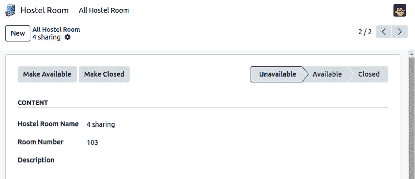
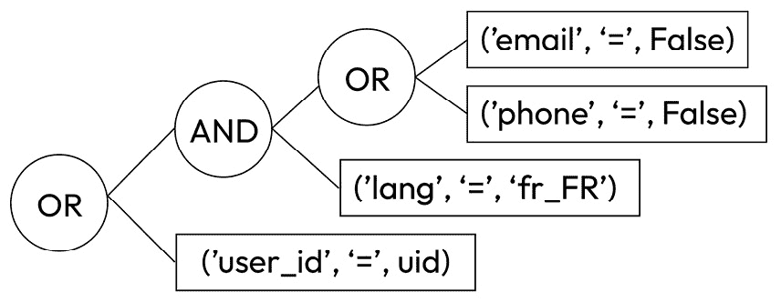
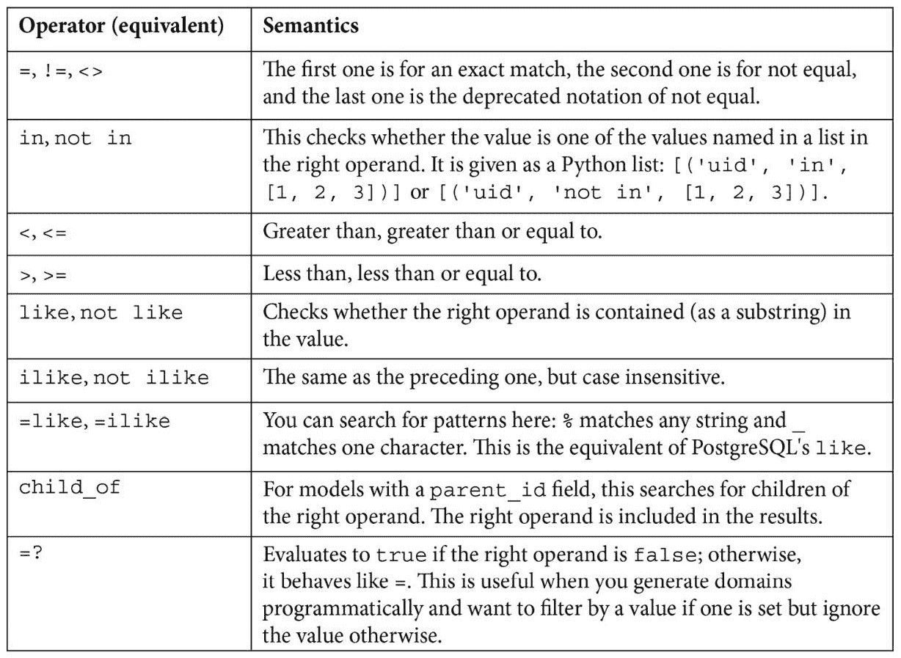
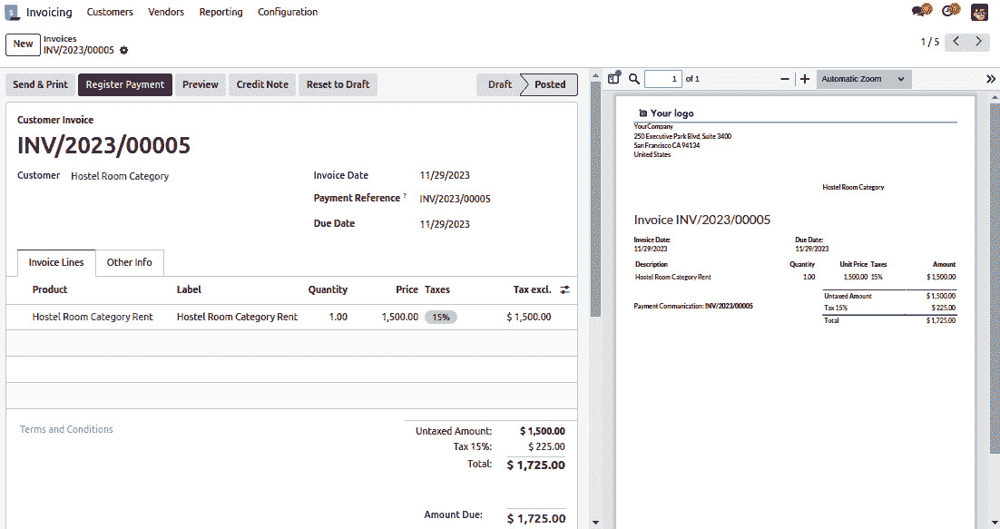

# 9

# 后端视图

在所有前面的章节中，你已经看到了 Odoo 的服务器和数据库方面。在本章中，你将看到 Odoo 的用户界面（UI）方面。你将学习如何创建不同类型的视图。除了视图之外，本章还涵盖了其他组件，如操作按钮、菜单和小部件，这些将帮助你使你的应用程序更加用户友好。完成本章后，你将能够设计 Odoo 后端的 UI。请注意，本章不涵盖 Odoo 的网站部分；我们有一个单独的章节（*14*）来介绍这部分内容。

在本章中，我们将涵盖以下食谱：

+   添加菜单项和窗口操作

+   通过操作打开特定视图

+   将内容和小部件添加到表视图中

+   在表单中添加按钮

+   将参数传递给表单和操作 – 上下文

+   在记录列表上定义过滤器 – 域

+   定义列表视图

+   定义搜索视图

+   添加搜索过滤器侧边栏

+   修改现有视图 – 视图继承

+   定义文档样式表单

+   使用属性动态表单元素

+   定义嵌入式视图

+   在表视图的侧边显示附件

+   定义看板视图

+   根据其状态在列中显示看板卡片

+   定义日历视图

+   定义图形视图和交叉视图

+   定义群体视图

+   定义甘特图视图

+   定义活动视图

+   定义地图视图

# 技术要求

在本章的整个过程中，我们将假设你有一个安装了基本附加组件的数据库和一个空的 Odoo 附加模块，你可以将食谱中的 XML 代码添加到附加模块清单中引用的数据文件中。有关如何在你的附加组件中激活更改的更多信息，请参阅*第三章*，*创建 Odoo 附加模块*。

本章的技术要求包括一个在线 Odoo 平台。

本章中使用的所有代码都可以从 GitHub 存储库中下载，网址为[`github.com/PacktPublishing/Odoo-17-Development-Cookbook-Fifth-Edition/tree/main/Chapter09`](https://github.com/PacktPublishing/Odoo-17-Development-Cookbook-Fifth-Edition/tree/main/Chapter09)。

# 添加菜单项和窗口操作

向用户提供新功能的明显方式是通过添加菜单项。当你点击一个**菜单**项时，会发生某些事情。这个食谱将指导你如何定义这件事。

我们将创建一个顶级菜单及其子菜单，该菜单将打开所有宿舍房间列表。

这也可以通过**Web 用户界面**通过**设置**菜单来完成，但我们更喜欢使用 XML 数据文件，因为这是我们创建我们的附加模块时必须使用的。

## 准备工作

在这个菜谱中，我们需要一个依赖于`base`模块的模块，因为`my_hostel`模块向`hostel.room`添加了新的模型。所以，如果你正在使用现有的模块，请在清单中添加`base`依赖。或者，你可以从[`github.com/PacktPublishing/Odoo-17-Development-Cookbook-Fifth-Edition/tree/main/Chapter09/00_initial_module`](https://github.com/PacktPublishing/Odoo-17-Development-Cookbook-Fifth-Edition/tree/main/Chapter09/00_initial_module)获取初始模块。

## 如何操作...

在我们的附加模块的 XML 数据文件中执行以下步骤：

1.  定义要执行的操作：

    ```py
    <record id="action_hostel_room" model="ir.actions.act_window">
        <field name="name">All Hostel Room</field>
        <field name="res_model">hostel.room</field>
        <field name="view_mode">tree,form</field>
    </record>
    ```

1.  创建顶级菜单，如下所示：

    ```py
        <menuitem id="menu_custom_hostel_room"
        name="Hostel Room" web_icon="my_hostel,static/description/icon.png"/>
    ```

1.  在菜单中引用我们的操作：

    ```py
    <menuitem id="menu_all_hostel_room"
        parent="menu_custom_hostel_room" action="action_hostel_room"       sequence="10" groups="" />
    ```

如果我们现在升级模块，我们将看到一个带有**Hostel Room**标签的顶级菜单，它打开一个名为**All Hostel Room**的子菜单。点击该菜单项将打开所有宿舍房间的列表。

## 它是如何工作的...

第一个 XML 元素`record model="ir.actions.act_window"`声明了一个窗口操作，用于显示包含所有宿舍房间的列表视图。我们使用了最重要的属性：

+   `name`: 用来作为由动作打开的视图的标题。

+   `res_model`：这是要使用的模型。我们使用`hostel.room`，这是 Odoo 存储所有`hostel room`的地方。

+   `view_mode`：这列出了要提供的视图类型。它是一个以逗号分隔的视图类型文件。默认值是`tree, form`，这使得列表视图和表单视图可用。如果你只想显示日历和表单视图，那么`view_mode`的值应该是`calendar, form`。其他可能的视图选择是`kanban`、`graph`、`pivot`、`calendar`和`cohort`。你将在接下来的菜谱中了解更多关于这些视图的信息。

+   `domain`: 这是可选的，允许你设置一个过滤器，以在视图中提供可用的记录。我们将在本章的*在记录列表上定义过滤器 – Domain*菜谱中更详细地了解所有这些视图。

+   `context`: 这可以设置提供给打开的视图的值，影响它们的行为。在我们的例子中，对于新记录，我们希望房间等级的默认值为`1`。这将在本章的*向表单和动作传递参数 – Context*菜谱中更深入地讨论。

+   `limit`：这设置了在列表视图中可以看到的默认记录数量。在我们的例子中，我们给出了`20`的限制，但如果你不提供`limit`值，Odoo 将使用默认值`80`。

接下来，我们从顶级菜单创建到可点击的末级菜单项的菜单项层次结构。`menuitem`元素最重要的属性如下：

+   `name`：这用于显示菜单项的文本。如果你的菜单项链接到操作，你可以省略它，因为在这种情况下将使用操作名称。

+   `parent` (`parent_id`如果使用`record`元素)：这是引用父菜单项的 XML ID。没有父项的项目是顶级菜单。

+   `action`: 这是引用要调用的操作的 XML ID。

+   `sequence`: 这用于对同级菜单项进行排序。

+   `groups` (`groups_id`与`record`标签): 这是一个可选的用户组列表，可以访问菜单项。如果为空，则对所有用户可用。

+   `web_icon`: 此选项仅在顶级菜单上工作。它将在企业版中显示您的应用程序的图标。

窗口操作会自动确定要使用的视图，通过查找目标模型的视图（`form`、`tree`等）并选择序列号最低的一个。`ir.actions.act_window`和`menuitem`是方便的快捷 XML 标签，隐藏了您实际正在做的事情。如果您不想使用快捷 XML 标签，则可以通过`<record>`标签创建`ir.actions.act_window`和`ir.ui.menu`模型的记录。例如，如果您想通过`<record>`加载`act_window`，可以这样做：

```py
<record id="action_hostel_room" model="ir.actions.act_window">
    <field name="name">All Hostel Room</field>
    <field name="res_model">hostel.room</field>
    <field name="view_mode">tree,form</field>
    <field name="context">{'default_room_rating': 1.0}</field>
    <field name="domain">[('state', '=', 'draft')]</field>
</record>
```

以同样的方式，您可以通过`<record>`创建一个`menuitem`实例。

重要提示

注意，使用`menuitem`快捷方式时使用的名称可能不会映射到使用`record`元素时使用的字段名称；`parent`应该是`parent_id`，而`groups`应该是`groups_id`。

为了构建菜单，Web 客户端读取`ir.ui.menu`中的所有记录，并从`parent_id`字段推断它们的层次结构。菜单也会根据用户对模型和分配给菜单和操作的组的权限进行过滤。当用户点击菜单项时，其`action`将被执行。

## 还有更多...

窗口操作还支持一个`target`属性来指定视图的展示方式。可能的选项如下：

+   **current**: 这是默认选项，在 Web 客户端的主要内容区域打开视图。

+   **new**: 这将在弹出窗口中打开视图。

+   `current,`但它以编辑模式打开表单并禁用**操作**菜单。

+   **全屏**: 该操作将覆盖整个浏览器窗口，因此也会覆盖菜单。有时，这被称为**平板模式**。

+   **main**: 这类似于**current**，但它还会清除面包屑。

对于窗口操作，还有一些额外的属性，这些属性不支持`ir.actions.act_window`快捷标签。要使用它们，我们必须使用具有以下字段的`record`元素：

+   `res_id`: 如果打开表单，您可以通过在此处设置其 ID 来打开特定的记录。这在多步骤向导或您需要频繁查看或编辑特定记录的情况下非常有用。

+   `search_view_id`: 这指定了用于树形视图和图形视图的特定搜索视图。

请记住，左上角的菜单（或企业版本中的应用程序图标）和顶部栏中的菜单都是由菜单项组成的。唯一的区别是左上角的菜单项没有父菜单，而顶部栏上的菜单项以顶部栏中的相应菜单项作为父菜单。在左侧栏中，层次结构更为明显。

此外，请记住，出于设计原因，如果您的二级菜单有子菜单，则一级菜单将打开下拉菜单。在任何情况下，Odoo 都将根据子菜单项的顺序打开第一个菜单项的动作。

参考以下内容以了解更多关于菜单和视图的信息：

+   `ir.actions.act_window`动作类型是最常见的动作类型，但菜单可以引用任何类型的动作。技术上，如果你链接到客户端动作、服务器动作或`ir.actions.*`命名空间中定义的任何其他模型，都是相同的。它只是在后端对动作的处理上有所不同。

+   如果你只需要在具体要调用的动作中获得一点更多的灵活性，请查看返回窗口动作的服务器动作。如果你需要完全的灵活性，请查看客户端动作（`ir.actions.client`），它允许你拥有完全定制的用户界面。然而，只有作为最后的手段才这样做，因为当你使用它们时，你会失去 Odoo 的许多方便的助手。

## 参见

+   要详细了解所有视图中的过滤器，请参阅本章中的*在记录列表上定义过滤器 – 域*配方。

# 通过动作打开特定视图

窗口动作会自动确定要使用的视图，如果没有给出，但有时我们希望动作打开一个特定的视图。

我们将为`hostel.room`模型创建一个基本表单视图，然后我们将创建一个新的窗口动作，专门用于打开该表单视图。

## 如何操作...

1.  定义`hostel room`的最小树形和表单视图：

    ```py
    <record id="hostel_room_view_tree" model="ir.ui.view">
        <field name="name">Hostel Room List</field>
        <field name="model">hostel.room</field>
    <field name="arch" type="xml">
            <tree>
            <field name="name"/>
                <field name="room_no"/>
                <field name="state"/>
            </tree>
        </field>
    </record>
    <record id="hostel_room_view_form" model="ir.ui.view">
        <field name="name">Hostel Room Form</field>
        <field name="model">hostel.room</field>
    <field name="arch" type="xml">
            <form>
                <header>
                    <button name="make_available" string="Make Available" type="object"/>
                    <button name="make_closed"  string="Make Closed" type="object"/>
                    <field name="state" widget="statusbar"/>
                </header>
                <group>
                    <group>
    <field name="name"/>
                        <field name="room_no"/>
                    </group>
                    <group>
                        <field name="description"/>
                    </group>
                </group>
            </form>
        </field>
    </record>
    ```

1.  将从*添加菜单项和窗口动作*配方中的动作更新为使用新的表单视图：

    ```py
    <record id="action_hostel_room_tree" model="ir.actions.act_window.view">
        <field name="act_window_id" ref="action_hostel_room" />
        <field name="view_id" ref="hostel_room_view_tree" />
        <field name="view_mode">tree</field>
        <field name="sequence" eval="1"/>
    </record>
    <record id="action_hostel_room_form" model="ir.actions.act_window.view">
        <field name="act_window_id" ref="action_hostel_room" />
        <field name="view_id" ref="hostel_room_view_form" />
        <field name="view_mode">form</field>
        <field name="sequence" eval="2"/>
    </record>
    ```

现在，如果你打开你的菜单并点击列表中的**合作伙伴**，你应该看到我们刚刚定义的非常简单的表单和树形视图。

## 它是如何工作的...

这次，我们使用了适用于任何类型记录的通用 XML 代码，即具有所需`id`和`model`属性的`record`元素。`record`元素上的`id`属性是一个任意字符串，它必须对于你的附加组件是唯一的。`model`属性指的是你想要创建的模型名称。鉴于我们想要创建一个视图，我们需要创建`ir.ui.view`模型的记录。在此元素内，你通过`model`属性设置模型中定义的字段。对于`ir.ui.view`，关键字段是`model`和`arch`。`model`字段包含你想要定义视图的模型，而`arch`字段包含视图本身的定义。我们稍后会介绍其内容。

`name`字段虽然不是必需的，但在调试视图问题时很有帮助。因此，将其设置为字符串，说明这个视图打算做什么。此字段的内容不会显示给用户，因此你可以填写任何你认为合理的技术提示。如果你在这里不设置任何内容，你将获得一个默认名称，其中包含模型名称和视图类型。

### ir.actions.act_window.view

我们定义的第二个记录与我们在*添加菜单项和窗口动作*菜谱中定义的`act_window`协同工作。我们已经知道，通过设置那里的`view_id`字段，我们可以选择用于第一个视图模式哪个视图。然而，鉴于我们设置了`view_mode`字段为`tree, form`视图，`view_id`必须选择树视图，但我们想设置的是第二个的表单视图。

如果你发现自己处于这种情况，请使用`ir.actions.act_window.view`模型，它允许你精细控制为哪种视图类型加载哪些视图。这里定义的前两个字段是引用其他对象的通用方式的示例；你保持元素的主体为空，但添加一个名为`ref`的属性，其中包含你要引用的对象的 XML ID。因此，这里发生的情况是我们从上一个菜谱中的`act_window_id`字段引用我们的动作，并在`view_id`字段中引用我们刚刚创建的视图。然后，尽管不是必需的，我们添加一个序列号来定位这个视图分配相对于同一动作的其他视图分配的位置。这仅在你通过创建多个`ir.actions.act_window.view`记录为不同的视图模式分配视图时才有意义。

重要提示

一旦你定义了`ir.actions.act_window.view`记录，它们将优先于你在动作的`view_mode`字段中填写的内容。因此，使用前面的记录，你将看不到任何列表，而只有表单。你应该添加另一个指向`hostel.room`模型列表视图的`ir.actions.act_window.view`记录。

## 更多内容...

正如我们在*添加菜单项和窗口动作*菜谱中看到的那样，我们可以用`<record>`替换`act_window`。如果你想使用自定义视图，你可以遵循给定的语法：

```py
<record id="action_hostel_room" model="ir.actions.act_window">
    <field name="name">All Hostel Room</field>
    <field name="res_model">hostel.room</field>
    <field name="view_id" ref="hostel_room_view_tree"/>
    <field name="view_mode">tree,form</field>
</record>
```

这个例子只是`act_window`的另一种选择。在 Odoo 的代码库中，你可以找到这两种动作类型。

# 在表单视图中添加内容和小部件

前面的菜谱展示了如何为动作选择特定的视图。现在，我们将演示如何使表单视图更有用。在这个菜谱中，我们将使用我们在*有一个动作打开特定视图*菜谱中定义的**表单视图**。在表单视图中，我们将添加小部件和内容。

## 如何操作...

1.  定义表单视图的基本结构：

    ```py
    <record id="hostel_room_view_form" model="ir.ui.view">
        <field name="name">Hostel Room Form</field>
        <field name="model">hostel.room</field>
        <field name="arch" type="xml">
        <form>
            <!--form content goes here -->
        </form>
    </record>
    ```

1.  要添加标题栏，通常用于动作按钮和阶段流程，请在表单内添加以下内容：

    ```py
    <header>
        <button name="make_available" string="Make Available" type="object"/>
        <button name="make_closed"  string="Make Closed" type="object"/>
        <field name="state" widget="statusbar"/>
    </header>
    ```

1.  使用`group`标签组织表单字段：

    ```py
    <group string="Content" name="my_content">
        <field name="name"/>
        <field name="room_no"/>
    </group>
    <group>
        <field name="description"/>
    </group>
    <notebook>
        <page string="Other Information" name="other_information">
            <field name="other_info" widget="html"/>
        </page>
    </notebook>
    ```

现在，表单应该显示一个带有按钮和两个垂直对齐字段的顶部栏，如下面的截图所示：



图 9.1 – 表单视图的截图

## 它是如何工作的...

我们首先来看 `ir.ui.view` 模型的 `arch` 字段。首先，请注意，视图是在 XML 中定义的，因此你需要为 `arch` 字段传递 `type="xml"` 属性；否则，解析器会感到困惑。此外，你的视图定义必须包含格式良好的 XML；否则，当你升级/安装模块时，你会得到一个错误，例如“元素 odoo 有额外内容”。

现在，我们将遍历我们之前使用的标签，并总结其他可用的标签。

### form

当你定义一个表单视图时，`arch` 字段中的第一个元素必须是 `form` 元素。这在内部用于推导记录的 `type` 字段。

除了以下元素之外，你还可以在表单标签中使用任意 HTML。算法规定，Odoo 未知的所有元素都被视为纯 HTML，并简单地传递给浏览器。请注意，你填入的 HTML 可以与 Odoo 元素生成的 HTML 代码交互，这可能会扭曲渲染。

### header

此元素是用于在表单的标题中显示的元素的容器，标题以白色栏的形式渲染。通常，如本例所示，你在这里放置操作按钮。或者，如果你的模型有一个 `state` 字段，你也可以选择一个 **状态栏**。

### button

`button` 元素用于允许用户触发一个动作。有关详细信息，请参阅 *向表单添加按钮* 烹饪配方。

### <group>

`<group>` 元素是 Odoo 的主要元素，用于组织内容。放置在 `<group>` 元素内的字段将带有它们的标题，并且同一组内的所有字段都将对齐，以便也有一个视觉指示器表明它们属于一起。你还可以嵌套 `<group>` 元素；这将导致 Odoo 在相邻的列中渲染包含的字段。

通常情况下，你应该使用 `<group>` 机制来在表单视图中显示所有字段，只有在必要时才退回到其他元素，例如 `<notebook>`、`<label>`、`<newline>` 以及更多。

如果你将 `string` 属性分配给一个组，其内容将被渲染为该组的标题。

你还应该养成给每个字段的逻辑组命名的好习惯。这个名称对用户是不可见的，但在我们接下来的配方中覆盖视图时非常有帮助。在表单定义中保持名称唯一，以避免混淆你指的是哪个组。不要使用 `string` 属性，因为字符串的值最终会因为翻译而改变。

### field

为了实际显示和操作数据，你的表单视图应该包含一些 `field` 元素。以下是一个示例：

```py
<field name="other_info" widget="html"/>
```

这些有一个必填属性，称为`name`，它指的是模型中字段的名称。早些时候，我们向用户提供了编辑合作伙伴类别的功能。如果我们只想禁用字段的编辑功能，我们可以将`readonly`属性设置为`1`或`True`。此属性实际上可能包含一小部分 Python 代码，因此`readonly="2>1"`也会使字段变为只读。这也适用于`invisible`属性，您曾使用它来获取从数据库读取但不会显示给用户的值。稍后，我们将探讨这种用法可能适用的场景。

您一定注意到了`categories`字段中的`widget`属性。这定义了字段中的数据应该如何呈现给用户。每种类型的字段都有一个标准小部件，因此您不必明确选择小部件。然而，几种类型提供了多种表示方式，因此您可能会选择除默认之外的其他方式。由于完整的可用小部件列表超出了本菜谱的范围，请查阅**Odoo 的源代码**以尝试它们。查看*第十四章*，*CMS 网站开发*，以了解如何制作自己的。

### `<notebook>`和`<page>`

如果您的模型字段太多，则可以使用`<notebook>`和`<page>`标签来创建标签页。`<notebook>`标签中的每个`<page>`将创建一个新的标签页，页面内的内容将是标签页的内容。以下示例将创建两个标签页，每个标签页有三个字段：

```py
<notebook>
    <page string="Tab 1">
        <field name="field1"/>
        <field name="field2"/>
        <field name="field3"/>
    </page>
    <page string="Tab 2">
        <field name="field4"/>
        <field name="field5"/>
        <field name="field6"/>
    </page>
</notebook>
```

`<page>`标签中的`string`属性将是标签页的名称。您只能在`<notebook>`标签中使用`<page>`标签，但在`<page>`标签中，您可以使用任何其他元素。

### 通用属性

在大多数元素上（这包括`group`、`field`和`button`），您可以设置`attributes`和`groups`属性。以下是一个小示例：

```py
<field name="other_info"
    readonly="state == 'available'"
    groups="base.group_no_one"/>
```

虽然`attributes`在*使用属性动态表单元素*的菜谱中进行了讨论，但`groups`属性为您提供了仅向某些组的成员显示某些元素的可能性。简单来说，组的完整 XML ID（多个组之间用逗号分隔）是该属性，并且对于不是至少属于上述提到的组之一的任何成员，该元素都将被隐藏。

### 其他标签

有时候您可能希望偏离规定的严格布局组。例如，如果您想将记录的`name`字段渲染为标题，则字段的标签将干扰外观。在这种情况下，不要将字段放入`group`元素中，而是将其放入普通的 HTML`h1`元素中。然后，在`h1`元素之前，放置一个`label`元素，并将`for`属性设置为您的`字段名称`：

```py
<label for="name" />
<h1><field name="name" /></h1>
```

这将以字段内容作为大标题进行渲染，但字段名称将写在大标题上方的小字体中。这基本上是标准合作伙伴表单所做的事情。

如果您需要在组内添加换行，请使用 `newline` 元素。它始终为空：

```py
<newline />
```

另一个有用的元素是 `footer`。当您将表单作为弹出窗口打开时，这是一个放置操作按钮的好地方。它也将被渲染为一个单独的栏，类似于 `header` 元素。

形式视图也包含特殊的部件，例如 `web_ribbon`。您可以使用 `<widget>` 标签如下使用它：

```py
<widget name="web_ribbon" title="Archived" bg_color="bg-danger"
invisible="active"/>
```

您可以使用 `attributes` 根据条件隐藏和显示功能区。如果您不了解 `attributes`，请不要担心。它将在本章的 *使用属性动态创建表单元素* 食谱中介绍。

重要提示

不要指定 `string` 属性（或任何其他翻译属性），因为您的视图覆盖将因其他语言而中断，因为视图是在应用继承之前进行翻译的。

## 还有更多…

由于表单视图基本上是带有一些扩展的 HTML，Odoo 也广泛使用了 CSS 类。其中两个非常有用的是 `oe_read_only` 和 `oe_edit_only`。具有这些类的元素将仅在 **只读模式** 或 **编辑模式** 中可见。例如，要使标签仅在编辑模式下可见，请使用以下代码：

```py
<label f"r="n"me" cla"s="oe_edit_o"ly" />
```

另一个非常有用的类是 `oe_inline`，您可以在字段上使用它，使它们渲染为内联元素，以避免造成不想要的换行。当您将字段嵌入文本或其他标记标签时，请使用此类。

此外，`form` 元素可以有 `create`、`edit` 和 `delete` 属性。如果您将这些属性之一设置为 `false`，则相应的操作将不会对此表单可用。如果没有明确设置，操作的可用性将根据用户的权限推断。请注意，这纯粹是为了整理用户界面；不要用于安全。

## 参见

现有的部件和视图已经提供了很多功能，但迟早您会有一些无法用现有部件和视图满足的需求。请参考以下食谱来创建您自己的视图和部件：

+   请参考本章中关于使用 `button` 元素触发操作的 *添加按钮到表单* 食谱以获取更多详细信息。

+   要定义您自己的部件，请参考 *第十五章* 的 *创建自定义部件* 食谱，*Web 客户端开发*。

+   请参考 *第十五章* 的 *创建新视图* 食谱，*Web 客户端开发*，以创建您自己的视图。

# 添加按钮到表单

`header` 元素。

## 如何操作...

添加一个指向操作的按钮：

```py
<button type="action" name="%(my_hostel.hostel_room_category_action)d" string="Open Hotel Room Category" />
```

## 它是如何工作的...

按钮的 `type` 属性决定了其他字段的语义，因此我们首先看看可能的值：

+   `action`：这将使按钮调用在 `ir.actions.*` 命名空间中定义的操作。`name` 属性需要包含操作的数据库 ID，您可以使用包含操作的 XML ID 的 Python 格式字符串方便地让 Odoo 查找。

+   `object`：这调用当前模型中的一个方法。`name`属性包含函数的名称。

+   `string`：`string`属性用于分配用户看到的文本。

## 还有更多...

使用`btn-primary` CSS 类来渲染高亮按钮，使用`btn-default`来渲染普通按钮。这通常用于向导中的取消按钮或以视觉上不引人注目的方式提供次要操作。设置`oe_link`类会使按钮看起来像链接。您还可以使用其他 Bootstrap 按钮类来获取不同的按钮颜色。

一个带有**object**类型按钮的调用可以返回一个描述动作的字典，然后将在客户端执行。这样，您可以实现多屏幕向导或只是打开另一个记录。

重要提示

注意，点击按钮总是导致客户端在运行方法之前发出`write`或`create`调用。

您还可以通过替换`string`属性在`button`标签内添加内容。这通常用于按钮框，如*文档风格* *表单*菜谱中所述。

# 向表单和动作传递参数 - 上下文

在 Odoo 内部，每个方法都可以访问一个名为**context**的字典，这个字典从每个动作传播到执行该动作涉及的方法。UI 也可以访问它，并且可以通过在上下文中设置值以各种方式修改它。在这个菜谱中，我们将通过玩弄语言、默认值和隐式过滤器来探索这个机制的一些应用。

## 准备工作

虽然不是严格必要的，但如果您还没有安装法语，安装法语会使这个菜谱更有趣。请参阅*第十一章*，*国际化*，了解如何进行此操作。如果您有法语数据库，将`fr_FR`更改为其他语言，例如，`en_US`适用于英语。此外，点击**激活**按钮（当您悬停时变为**存档**），以便存档一个宿舍房间并验证此合作伙伴不再出现在列表中。

## 如何做...

1.  创建一个新的动作，非常类似于*添加菜单项和窗口*动作菜谱中的动作：

    ```py
    <record id="action_hostel_room" model="ir.actions.act_window">
        <field name="name">All Hostel Room</field>
        <field name="res_model">hostel.room</field>
    <field name="view_id" ref="hostel_room_view_tree"/>
        <field name="view_mode">tree,form</field>
        <field name="context">{'lang': 'fr_FR','default_lang': 'fr_FR', 'active_test': False, 'default_room_rating': 1.0}</field>
    </record>
    ```

1.  添加一个调用此动作的菜单。这留给读者作为练习。

当您打开此菜单时，视图将以法语显示，如果您创建一个新的合作伙伴，它们将法语作为预选语言。一个不那么明显的变化是，您还将看到**已停用（存档）**的**合作伙伴记录**。

## 它是如何工作的...

上下文字典是从几个来源填充的。首先，读取当前用户记录的一些值（用户的语言和用户时区分别为`lang`和`tz`）。然后，我们有一些附加组件，它们为了自己的目的添加了键。此外，UI 添加了关于我们目前正在使用的模型和记录的键（`active_id`、`active_ids`、`active_model`）。此外，如*通过打开特定视图执行操作*配方中所示，我们可以在操作中添加自己的键。这些被合并在一起，并传递给底层服务器函数和客户端 UI。

因此，通过设置`lang`上下文键，我们强制显示语言为**法语**。你会注意到这不会改变整个 UI 语言；这是因为只有我们打开的列表视图位于这个上下文范围内。其余的 UI 已经用包含用户原始语言的另一个上下文加载。然而，如果你在这个列表视图中打开一个记录，它也会以法语呈现，如果你在表单上打开一个链接记录或按下执行操作的按钮，语言也会传播。

通过设置`default_lang`，我们为在这个上下文范围内创建的每个记录设置一个默认值。一般模式是`default_$fieldname: my_default_value`，这允许你为在这种情况下新创建的合作伙伴设置默认值。鉴于我们的菜单是关于旅舍房间，我们默认为`Hostel Average Rating`字段添加了`default_room_rating: 1`作为值。然而，这是一个针对`hostel.room`的全局默认值，所以这并没有改变任何事情。对于标量字段，语法与你在 Python 代码中写的相同：`string`字段用引号括起来，`number`字段保持原样，而`Boolean`字段是`True`或`False`。对于关系字段，语法稍微复杂一些；请参阅*第六章*，*管理模块数据*，了解如何编写它们。

重要提示

注意，上下文中设置的默认值会覆盖模型定义中设置的默认值，因此你可以在不同情况下有不同的默认值。

最后一个键是`active_test`，它具有非常特殊的语义。对于每个具有名为`active`的字段的模型，Odoo 会自动过滤掉该字段为`False`的记录。这就是为什么你没有勾选此字段的合作伙伴从列表中消失的原因。通过设置此键，我们可以抑制这种行为。

重要提示

这对于 UI 本身很有用，但在你需要确保操作应用于所有记录，而不仅仅是活动记录时，在你的 Python 代码中更是非常有用。

## 还有更多...

当定义上下文时，你可以访问一些变量，其中最重要的一个是`uid`，它评估当前用户的 ID。你需要这个来设置默认过滤器（请参考下一配方，*在记录列表上定义过滤器 – 域*）。此外，你可以访问`context_today`函数和`current_date`变量，前者是一个`date`对象，代表从用户时区看当前日期，后者是 UTC 时间中的当前日期，格式为`YYYY-MM-DD`。要将`date`字段的默认值设置为当前日期，使用`current_date`，对于默认过滤器，使用`context_today()`。

此外，你可以使用 Python 的`datetime`、`time`和`relativedelta`类的一个子集进行一些日期计算。

重要提示

大多数域都是在客户端进行评估的。出于安全考虑，服务器端的域评估受到限制。当引入客户端评估时，为了避免整个系统崩溃，最佳选择是将 Python 的一部分实现为 JavaScript。Odoo 内置了一个小的 JavaScript Python 解释器，它对简单的表达式工作得很好，这通常就足够了。

警惕在`<record id="action_name" model="ir.actions.act_window.view">`快捷方式中使用`context`变量。这些是在安装时评估的，这几乎从来不是你想要的。如果你需要在你的上下文中使用变量，请使用`<record />`语法。

我们还可以为按钮添加不同的上下文。这和我们将上下文键添加到我们的操作的方式一样。这会导致按钮调用的函数或操作在给定的上下文中运行。

大多数作为 Python 评估的表单元素属性也都可以访问上下文字典。`invisible`和`readonly`属性就是这些属性的例子。因此，在你希望某个元素在某些时候显示在表单中，而在其他时候不显示的情况下，将`invisible`属性设置为`context.get('my_key')`。对于导致字段应该不可见的字段的情况，将上下文键设置为`my_key: True`。这种策略使你能够适应你的表单，而无需为不同场合重写它。

你还可以为关系字段设置上下文，这会影响字段如何加载。通过将`form_view_ref`或`tree_view_ref`键设置为视图的完整 XML ID，你可以为这个字段选择一个特定的视图。当你对同一对象有多个相同类型的视图时，这是必要的。如果没有这个键，你会得到序列号最低的视图，这可能并不总是理想的。

## 参见

+   上下文还用于设置默认搜索过滤器。你可以通过本章的*定义搜索视图*配方了解更多关于默认搜索过滤器的内容。

+   关于设置默认配方的更多细节，请参考下一配方，*在记录列表上定义过滤器 – 域*。

+   要了解如何安装法语，请参阅*第十一章*，*国际化*。

+   您可以参考*第六章*，*管理模块数据*来学习如何编写关系字段的语法。

# 在记录列表上定义过滤器 – 域

我们在本章的第一个菜谱中已经看到了一个域的例子，它是`[('state', '=', 'draft')]`。通常，您需要从操作中显示所有可用记录的子集，或者只允许可能的记录子集成为`many2one`关系的目标。在 Odoo 中描述这些过滤器的方法是使用域。本菜谱说明了如何使用域来显示合作伙伴的选择。

## 如何做到这一点...

要显示您操作中的合作伙伴子集，您需要执行以下步骤：

1.  当“状态”设置为“草稿”时创建一个操作：

    ```py
    <record id="action_hostel_room" model="ir.actions.act_window">
        <field name="name">All Hostel Room</field>
        <field name="res_model">hostel.room</field>
    <field name="view_id" ref="hostel_room_view_tree"/>
        <field name="view_mode">tree,form</field>
        <field name="context">{'lang': 'fr_FR','default_lang': 'fr_FR', 'active_test': False, 'default_room_rating': 1.0}</field>
        <field name="domain">[('state', '=', 'draft'), ('room_rating', '&gt;', '0.0')]</field>
    </record>
    ```

1.  添加调用这些操作的菜单。这留给读者作为练习。

## 它是如何工作的...

域的最简单形式是由三个元组组成的列表，其中包含一个字段名（问题模型中的）作为第一个元素中的`string`，一个运算符作为第二个元素中的`string`，以及要检查的字段值作为第三个元素。这是我们之前所做的那样，这被解释为，“*所有这些条件都必须适用于我们感兴趣的记录*。”这实际上是一个快捷方式，因为域知道两个前缀运算符——`&`和`|`——其中`&`是默认的。因此，在规范形式中，第一个域将如下所示：

```py
['&',('state', '=', 'draft'), ('room_rating', '&gt;', '0.0')]
```

虽然对于更大的表达式来说这可能有点难以阅读，但前缀运算符的优势在于它们的范围是严格定义的，这可以节省您不必担心运算符优先级和括号。它总是两个表达式：第一个`&`应用于`'&',('state', '=', 'draft')`，其中`('room_rating', '&gt;', '0.0')`作为第一个操作数，`('room_rating', '&gt;', '0.0')`作为第二个操作数。然后，我们有一个第一个操作数和`('room_rating', '&gt;', '0.0')`作为第二个操作数。

在第二步，我们必须写出完整形式，因为我们需要`|`运算符。

例如，假设我们有一个复杂的域，如下所示：`['|',` `('user_id',` `'=', uid), '&', ('lang', '!=', 'fr_FR'), '|', ('phone', '=', False), ('email', '=', False)]`。参见以下图例了解该域的评估方法：



图 9.2 – 域的评估

此外，还有一个`!`运算符用于否定，但考虑到逻辑等价和否定比较运算符（如`!=`和`not in`），它实际上并不是必需的。

重要提示

注意，这是一个一元前缀运算符，因此它只适用于域中的后续表达式，而不是所有后续的内容。

注意，当你为窗口操作或其他客户端域编写域时，右操作数不需要是固定值。你可以使用与*传递参数到表单和操作 – 上下文*配方中使用的相同的 Python 最小化版本，因此你可以编写如**上周更改**或**我的合作伙伴**之类的过滤器。

## 更多内容...

上述域仅适用于模型本身的字段，而我们在很多时候需要根据链接记录的属性进行过滤。为此，你可以使用在`@api.depends`定义或相关字段中使用的相同表示法：从当前模型创建一个点路径到你想过滤的模型。为了搜索那些销售员是字母`G`开头的组成员的合作伙伴，你会使用`[('user_id.groups_id.name', '=like', 'G%')]`域。路径可能很长，所以你只需确保当前模型和你想过滤的模型之间存在关系字段。

### 操作符

以下表格列出了可用的操作符及其语义：



表 9.1 – 操作符及其语义

注意，一些操作符仅与某些字段和值一起工作。例如，域`[('category_id', 'in', 1)]`是无效的，将生成错误，而域`[('category_id', 'in', [1])]`是有效的。

### 使用域进行搜索的陷阱

这一切对于传统字段来说都很好，但一个臭名昭著的问题是搜索非存储函数字段的值。人们经常省略搜索函数。这很简单，可以通过在您的代码中提供搜索函数来修复，如*第四章*，*应用模型*中所述。

另一个问题可能会让开发者感到困惑，那就是 Odoo 在通过带有负操作符的`one2many`或`many2many`字段进行搜索时的行为。想象一下，你有一个带有`A`标签的合作伙伴，你搜索`[('category_id.name', '!=', 'B')]`。你的合作伙伴出现在结果中，这正是你所期望的，但如果你给这个合作伙伴添加`B`标签，它仍然出现在你的结果中，因为对于搜索算法来说，只要有一个链接记录（在这种情况下是`A`）不满足条件就足够了。现在，如果你移除`A`标签，使`B`成为唯一的标签，合作伙伴将被过滤掉。如果你也移除`B`标签，使合作伙伴没有任何标签，它仍然会被过滤掉，因为链接记录的条件假设了该记录的存在。然而，在其他情况下，这正是你想要的行为，因此改变标准行为并不是一个真正的选项。如果你在这里需要不同的行为，请提供一个解释你所需否定方式的搜索函数。

重要提示

人们经常忘记在处理域时他们正在编写 XML 文件。您需要转义小于运算符。搜索在当前日期之前创建的记录将必须以`[('create_date', '&lt;', current_date)]`的形式在 XML 中编写。

域在 Odoo 中被广泛使用。您将在 Odoo 的每个地方找到它们；它们用于搜索、过滤、安全规则、搜索视图、用户动作等。

如果您需要操作您没有以编程方式创建的域，请使用`odoo.osv.expression`中提供的实用函数。`is_leaf`、`normalize_domain`、`AND`和`OR`函数将允许您以 Odoo 的方式精确组合域。不要自己这样做，因为有许多您必须考虑的角落案例，您很可能会忽略其中一个。

## 参见

+   对于域的标准应用，请参阅*定义搜索*视图的食谱。

# 定义列表视图

在花费了大量时间在表单视图之后，我们现在将快速看一下如何定义列表视图。在内部，这些在某些地方被称为树视图，在其他地方被称为列表视图，但鉴于 Odoo 视图框架中还有一个称为**tree**的结构，我们将坚持使用**列表**。

## 如何做...

1.  定义您的列表视图：

    ```py
    <record id="hostel_room_view_tree" model="ir.ui.view">
        <field name="name">Hostel Room List</field>
        <field name="model">hostel.room</field>
        <field name="arch" type="xml">
            <tree>
                <field name="name"/>
    <field name="room_no"/>
                <field name="state"/>
            </tree>
        </field>
    </record>
    ```

1.  在本章*添加菜单项和窗口动作*食谱中创建的动作中注册树视图：

    ```py
    <record id="action_hostel_room" model="ir.actions.act_window">
        <field name="name">All Hostel Room</field>
        <field name="res_model">hostel.room</field>
        <field name="view_id" ref="hostel_room_view_tree"/>
        <field name="view_mode">tree,form</field>
    <field name="context">{'tree_view_ref': 'my_hostel.hostel_room_view_tree', 'lang': 'fr_FR','default_lang': 'fr_FR', 'active_test': False, 'default_room_rating': 1.0}</field>
        <field name="domain">[('state', '=', 'draft')]</field>
    </record>
    ```

1.  添加调用这些动作的菜单。这留给读者作为练习。

**安装**/**升级**模块。之后，您将看到我们为宿舍房间创建的树视图，如果您检查它，它将根据我们的条件显示不同的行样式。

## 它是如何工作的...

您已经了解这里发生的大部分内容。我们定义了一个视图，这次使用的是`tree`类型，并将其与`ir.actions.act_window.view`元素关联起来。所以，唯一需要讨论的就是`tree`元素及其语义。在列表中，您没有太多设计选择，因此此元素的唯一有效子元素是`field`和`button`元素。您还可以在列表视图中使用一些小部件；在我们的例子中，我们使用了`many2one_avatar_user`小部件。树视图支持一个特殊的小部件，称为`handle`。这是针对列表视图的。它用于整数字段，并渲染一个用户可以用来将行拖动到列表中不同位置的拖动把手，从而更新字段的值。这对于序列或优先级字段非常有用。

通过使用`optional`属性，您可以可选地显示字段。将`optional`属性添加到字段将允许用户在任何时候从 UI 中隐藏和显示列。在我们的例子中，我们使用了它来为`country`和`state`字段。

在`tree`元素中，这里的新特性是`decoration`属性。这包含了关于选择哪一种字体和/或颜色的规则，以`decoration-$name="Python code"`的形式给出。我们将其设置为不可见，因为我们只需要数据，不想让用户被额外的两列所打扰。可能的类包括`decoration-bf`（粗体）和`decoration-it`（斜体），以及语义化的 Bootstrap 类`decoration-danger`、`decoration-info`、`decoration-muted`、`decoration-primary`、`decoration-success`和`decoration-warning`。

## 还有更多...

对于数值字段，你可以添加一个`sum`属性，使得这一列会与你在属性中设置的文本一起作为工具提示进行求和。较少使用的是`avg`、`min`和`max`属性，它们分别显示平均值、最小值和最大值。请注意，这四个属性只对当前可见的记录有效，因此你可能需要调整动作的`limit`（在*添加菜单项和窗口动作*配方中已介绍过），以便用户能够立即看到所有记录。

对于`tree`元素，有一个非常有趣的属性是`editable`。如果你将其设置为顶部或底部，列表的行为将完全不同。如果没有设置，点击行会打开行的表单视图。设置了之后，点击行会使其可在线编辑，可见字段被渲染为表单字段。这在嵌入列表视图中尤其有用，这将在本章后面的*定义嵌入视图*配方中讨论。顶部或底部的选择与是否将在列表的顶部或底部添加新行有关。

默认情况下，记录是按照显示模型的`_order`属性进行排序的。用户可以通过点击列标题来改变排序，但你也可以通过在`tree`元素中设置`default_order`属性来设置不同的初始排序。语法与`_order`相同。

重要提示

排序常常是新开发者的一个烦恼来源。由于 Odoo 让 PostgreSQL 在这里完成工作，你只能根据 PostgreSQL 所知的字段进行排序，并且只能是对同一数据库表中的字段进行排序。因此，如果你想根据函数或相关字段进行排序，确保你设置了`store=True`。如果你需要根据从另一个模型继承的字段进行排序，声明一个存储的相关字段。

`tree`元素的`create`、`edit`和`delete`属性与我们在本章*添加内容和小部件到表单视图*配方中描述的`form`元素的工作方式相同。如果设置了`editable`属性，它们也决定了可用的控件。

# 定义搜索视图

当你打开列表视图时，你会在右上角注意到搜索字段。如果你在那里输入一些内容，你会收到关于搜索建议，同时还有一个预定义的过滤器组可供选择。本教程将指导你如何定义这些建议和选项。

## 如何操作...

1.  定义你的搜索视图：

    ```py
    <record id="hostel_room_view_search" model="ir.ui.view">
        <field name="model">hostel.room</field>
        <field name="arch" type="xml">
            <search>
                <field name="name"/>
                <field name="room_no"/>
                <group expand="0" string="Group By">
                    <filter string="State" name="state" context="{'group_by':'state'}"/>
               </group>
            </search>
        </field>
    </record>
    ```

1.  告诉你的动作使用它：

    ```py
    <record id="action_hostel_room" model="ir.actions.act_window">
        <field name="name">All Hostel Room</field>
        <field name="res_model">hostel.room</field>
        <field name="search_view_id" ref="hostel_room_view_search" />
        <field name="view_mode">tree,form</field>
        <field name="context">{'tree_view_ref': 'my_hostel.hostel_room_view_tree', 'lang': 'fr_FR','default_lang': 'fr_FR', 'active_test': False, 'default_room_rating': 1.0}</field>
    <field name="domain">[('state', '=', 'draft')]</field>
    </record>
    ```

现在你可以在搜索栏中输入内容，系统会提供在 `name`、`room no` 和 `state` 字段中搜索此术语的能力。如果你的术语恰好是你系统中银行账户号码的子串，你甚至可以选择精确搜索这个银行账户。

## 它是如何工作的...

在 `name` 的情况下，我们只是将字段列为提供给用户搜索的字段。我们保留了默认的语义，即字符字段的子串搜索。

对于类别，我们做了更有趣的事情。默认情况下，你的搜索术语应用于一个名为 `name_search` 的 `many2many` 字段触发器，在这种情况下将是对类别名称的子串搜索。然而，根据你的类别结构，搜索具有你感兴趣或其子类别的合作伙伴可能非常方便。想象一下主类别 **Newsletter Subscribers**，其子类别有 **Weekly Newsletter**、**Monthly Newsletter** 和几种其他新闻类型。使用前面的搜索视图定义搜索 **Newsletter Subscribers** 将一次性给出所有订阅了这些新闻的人，这比逐个搜索每种类型并合并结果要方便得多。

`filter_domain` 属性可以包含任意域，因此你不仅限于在 `name` 属性中命名的相同字段进行搜索，也不限于只使用一个术语。`self` 变量是用户填入的内容，也是你在这里唯一可以使用的变量。

这里有一个来自默认搜索视图的更详细的示例，针对宿舍房间：

```py
<field name="name"
    filter_domain="[
        '|',
        ('display_name', 'ilike', self),
        ('room_no', '=', self)]"/>
```

这意味着用户不需要考虑要搜索什么。他们只需要输入一些字母，按 *Enter* 键，如果运气好的话，其中一个字段包含我们正在寻找的字符串。

对于 `child_ids` 字段，我们使用了另一个技巧。字段的类型不仅决定了搜索用户输入的默认方式，还定义了 Odoo 展示建议的方式。鉴于 `many2one` 字段是唯一提供自动完成的字段，我们通过设置 `widget` 属性强制 Odoo 进行自动完成，即使 `child_ids` 是一个 `one2many` 字段。如果没有这个设置，我们将不得不在这个字段中进行搜索，而没有完成建议。同样的情况也适用于 `many2many` 字段。

重要提示

注意，每个设置了 `many2one` 小部件的字段都会在用户的每个按键时触发其模型上的搜索；不要使用太多。

你还应该将最常用的字段放在顶部，因为如果用户只是键入一些内容并按下 *Enter* 键，搜索到的将是第一个字段。搜索栏也可以使用键盘操作；通过按下向下箭头选择建议，通过按下右箭头打开 `many2one` 的完成建议。如果你教育用户了解这一点，并注意搜索视图中字段的合理排序，这将比先键入内容、然后抓取鼠标并选择选项要高效得多。

`filter` 元素创建了一个按钮，将过滤器的 `domain` 属性内容添加到搜索域中。你应该添加一个逻辑内部 `name` 和一个 `string` 属性来描述过滤器，以便用户了解。

`<group>` 标签用于在 `country_id` 字段下提供分组选项。

## 还有更多...

你可以使用 `group` 标签来分组过滤器，这使得它们与其他过滤器相比渲染得更靠近一些，但这也有语义上的含义。如果你将多个过滤器放在同一个组中并激活其中多个，它们的域将使用 `|` 运算符合并，而同一组之外的过滤器和字段将使用 `&` 运算符合并。有时，你可能希望你的过滤器具有析取性，即它们为互斥集进行过滤，在这种情况下，选择其中两个都会导致一个空的结果集。在同一个组内，你可以通过使用 `separator` 元素达到相同的效果。

重要提示

注意，如果用户为同一字段填写多个查询，它们也会使用 `|` 运算符合并，所以你不需要担心这一点。

除了 `field` 属性外，`filter` 元素还可以有一个 `context` 属性，其内容将与当前上下文合并，并最终与其他搜索视图中的上下文属性合并。这对于支持分组的视图至关重要（参考 *定义看板视图* 和 *定义图形视图* 菜谱）。因为结果上下文决定了使用 `group_by` 键进行分组的字段。我们将在适当的菜谱中探讨分组的细节，但上下文还有其他用途。例如，你可以编写一个函数字段，它根据上下文返回不同的值，然后你可以通过激活过滤器来更改这些值。

搜索视图本身也响应上下文键。在创建记录时，与默认值非常类似，你可以通过上下文传递搜索视图的默认值。如果我们之前操作中设置了上下文 `{'search_default_room_rating': 1}`，那么 `room_rating` 过滤器就会在搜索视图中预先选中。不过，这仅当过滤器有名称时才有效，这就是为什么你应该始终设置它。要在搜索视图中为字段设置默认值，使用 `search_default_$fieldname`。

此外，`field`和`filter`元素可以有一个与表单视图中相同的语义的`groups`属性，以便使元素只对某些组可见。

## 相关内容

+   有关操作上下文的更多详细信息，请参阅*向表单和操作传递参数 –* *上下文*食谱。

+   使用大量使用重音符号的语言的用户可能希望在填写`e`字符时让 Odoo 搜索`e`、`è`、`é`和`ê`。这是**PostgreSQL 服务器**的一个名为**unaccent**的配置，Odoo 有特殊支持，但这本书的范围之外。有关无重音的更多信息，请参阅[`www.postgresql.org/docs/10/unaccent.html`](https://www.postgresql.org/docs/10/unaccent.html)。

# 添加搜索过滤器侧面板

Odoo 提供了一种显示搜索过滤器的方法，即**搜索过滤器侧面板**。此面板在视图的侧边显示过滤器列表。当最终用户频繁使用搜索过滤器时，搜索面板非常有用。

## 准备工作

搜索面板是搜索视图的一部分。因此，对于这个食谱，我们将继续使用之前食谱中的`my_module`附加组件。我们将把我们的搜索面板添加到之前设计的搜索视图中。

## 如何操作...

如下所示，在搜索视图中添加`<searchpanel>`：

```py
<record id="hostel_room_view_search" model="ir.ui.view">
    <field name="model">hostel.room</field>
    <field name="arch" type="xml">
        <search>
            <field name="name"/>
            <field name="room_no"/>
            <field name="state"/>
            <searchpanel>
                <field name="state" expand="1" select="multi" icon="fa-check-square-o" enable_counters="1"/>
            </searchpanel>
        </search>
    </field>
</record>
```

更新模块以应用修改。更新后，您将在视图的左侧看到搜索面板。

## 它是如何工作的...

要添加搜索面板，您需要在搜索视图中使用`<searchpanel>`标签。要添加您的过滤器，您需要在搜索面板中添加一个字段。

在我们的例子中，首先，我们添加了一个`state`字段。您还需要将该字段的`icon`属性添加到其中。这个图标将在过滤器标题之前显示。一旦您将字段添加到搜索面板中，它将显示带有图标的标题，以及下面的所有用户列表。点击用户后，列表视图中的记录将被筛选，您将只能看到所选用户的联系信息。在这个过滤器中，只能有一个活动项，这意味着一旦您点击另一个用户的过滤器，之前的用户过滤器将被移除。如果您想激活多用户过滤器，可以使用`select="multi"`属性。如果您使用该属性，您将找到每个过滤器选项的复选框，并且您将能够一次激活多个过滤器。我们在`state`过滤器上使用了`select="multi"`属性。这将允许我们一次选择和筛选多个类别。

重要提示

当您在`many2one`或`many2many`上使用侧面板过滤器时，请小心。如果关系模型有太多记录，为了避免性能问题，只会显示**前 200 条记录**。

## 更多内容...

如果你想按组显示搜索面板项，你可以在字段上使用`groupby`属性。例如，如果你想根据其父层次结构对类别进行分组，你可以添加带有`parent_id`字段的`groupby`属性，如下所示：

```py
<field name="state"
    icon="fa-check-square-o"
    select="multi"
    groupby="parent_id"/>
```

这将根据记录的父类别对类别过滤器进行分组。

# 修改现有视图 - 视图继承

到目前为止，我们已忽略现有视图并声明了全新的视图。虽然这在教学上是有意义的，但你很少会处于需要为现有模型定义新视图的情况。相反，你可能会想稍微修改现有视图，无论是为了简单地显示你添加到附加模型中的字段，还是根据你的需求或客户的需求进行定制。

在这个菜谱中，我们将更改默认的合作伙伴表单，通过修改搜索视图来显示记录的最后修改日期，并使`mobile`字段可搜索。然后，我们将更改合作伙伴列表视图中一列的位置。

## 如何操作...

1.  将字段注入到默认表单视图：

    ```py
    <record id="hostel_room_view_form_inherit" model="ir.ui.view">
        <field name="name">Hostel Room Form Inherit</field>
        <field name="model">hostel.room</field>
        <field name="inherit_id" ref="my_hostel.hostel_room_view_form" />
        <field name="arch" type="xml">
            <xpath expr="//group[@name='my_content']/group" position="inside">
                <field name="room_no"/>
            </xpath>
            <xpath expr="//group[@name='my_content']/group" position="after">
                <group>
    <field name="description"/>
                    <field name="room_rating"/>
                </group>
            </xpath>
        </field>
    </record>
    ```

1.  将字段添加到默认搜索视图：

    ```py
    <record id="hostel_room_view_search_inherit" model="ir.ui.view">
        <field name="name">Hostel Room Search inherit</field>
        <field name="model">hostel.room</field>
        <field name="inherit_id" ref="my_hostel.hostel_room_view_search" />
        <field name="arch" type="xml">
    <xpath expr="." position="inside">
                <field name="room_rating"></field>
            </xpath>
        </field>
    </record>
    ```

1.  将字段添加到默认列表视图：

    ```py
    <record id="hostel_room_view_tree_inherit" model="ir.ui.view">
        <field name="name">Hostel Room List Inherit</field>
        <field name="model">hostel.room</field>
        <field name="inherit_id" ref="my_hostel.hostel_room_view_tree" />
        <field name="arch" type="xml">
            <xpath expr="//field[@name='name']" position="after">
    <field name="room_no"/>
            </xpath>
        </field>
    </record>
    ```

更新你的模块后，你应该在合作伙伴表单的网站字段下方看到**最后更新于**字段。当你输入某些内容到搜索框时，它应该建议你在移动字段中搜索合作伙伴，在合作伙伴列表视图中，你会看到电话号码和电子邮件的顺序已经改变。

## 它是如何工作的...

在*步骤 1*中，我们为表单继承添加了一个基本结构。这里的关键字段，正如你可能猜到的，是`inherit_id`。你需要将你要修改的视图（继承自）的 XML ID 传递给它。`arch`字段包含有关如何修改你继承的视图中的现有 XML 节点的说明。实际上，你应该将整个过程视为简单的 XML 处理，因为所有语义部分都将在之后才出现。

在继承视图的`arch`字段中最经典的指令是`field`元素，它具有所需的属性：`name`和`position`。由于你只能让每个字段在表单中只出现一次，因此名称已经唯一地标识了一个字段。通过`position`属性，我们可以将我们放在字段元素中的任何内容放置在命名字段之前、内部或之后。默认情况下是`inside`，但为了可读性，你应该始终命名你需要的位置。记住，我们这里不是在谈论语义；这是关于我们命名的字段在 XML 树中的位置。它之后如何渲染是另一回事。

*步骤 2*演示了不同的方法。`xpath`元素选择与`expr`属性中命名的 XPath 表达式匹配的第一个元素。在这里，`position`属性告诉处理器将`xpath`元素的内容放置在哪里。

重要提示

如果你想要基于 CSS 类创建一个 XPath 表达式，Odoo 提供了一个名为`hasclass`的特殊函数。例如，如果你想选择具有`test_class` CSS 类的`<div>`元素，那么表达式将是`expr="//div[hasclass('test_class')]"`。

*步骤 3* 展示了如何更改元素的位置。此选项是在`phone`字段中引入的，以便使用`position=move`选项在`email`字段之后出现。

XPath 可能看起来有些吓人，但它是一种非常高效的选择所需操作节点的手段。花点时间查看一些简单的表达式；这是值得的。你可能会遇到术语**上下文节点**，某些表达式相对于它。在 Odoo 的视图继承系统中，这始终是你正在继承的视图的根元素。

对于在继承视图的`arch`字段中找到的所有其他元素，处理器会寻找具有相同节点名称和匹配属性（排除属性位置，因为这属于指令的一部分）的第一个元素。仅在非常不可能出现这种组合不唯一的情况下使用此功能，例如将组元素与`name`属性组合。

重要提示

注意，你可以在`arch`字段中包含尽可能多的指令元素。我们只为每个继承视图使用了一个，因为我们目前没有其他想要更改的内容。

## 还有更多...

`position`属性有两个其他可能的值：`replace`和`attributes`。使用`replace`会导致选定的元素被指令元素的 内容替换。因此，如果你没有任何内容，选定的元素可以简单地被移除。前面的列表或表单视图会导致`state`字段被移除：

```py
<field name="state" position="replace" />
```

重要提示

移除字段可能会导致其他继承视图损坏，并产生几个其他不希望出现的副作用，因此如果可能的话，请避免这样做。如果你确实需要移除字段，请在评估顺序较晚的视图中进行（有关更多信息，请参阅下一节，*视图继承中的评估顺序*）。

`attributes`与前面的示例具有非常不同的语义。处理器期望元素包含具有`name`属性的`attribute`元素。然后，这些元素将被用于设置选定元素的属性。如果你想注意之前的警告，你应该将`state`字段的`invisible`属性设置为`1`：

```py
<field name="state" position="attributes">
    <attribute name="invisible">1</attribute>
</field>
```

一个`attribute`节点可以有`add`和`remove`属性，这些属性反过来应该包含要从或添加到空格分隔列表中的值。这对于`class`属性非常有用，你可以通过以下方式添加一个类（而不是覆盖整个属性）：

```py
<field name="description" position="attributes">
    <attribute name="class" add="oe_inline" separator=" "/>
</field>
```

此代码将`oe_inline`类添加到`description`字段。如果该字段已经存在类属性，Odoo 会将该值与`separator`属性的值合并。

### 视图继承中的评估顺序

由于我们目前只有一个父视图和一个继承视图，因此不会遇到任何视图覆盖冲突的问题。当你安装了几个模块后，你会发现有很多针对合作伙伴表单的覆盖。只要它们在视图中更改不同的内容，这就可以了，但在某些情况下，了解覆盖的工作原理以避免冲突是很重要的。

视图的直接后代按其 `priority` 字段的升序评估，因此优先级较低的视图首先应用。继承的每一步都应用于第一步的结果，所以如果一个优先级为 `3` 的视图更改了一个字段，而另一个优先级为 `5` 的视图删除了它，这是可以的。然而，如果优先级相反，则不起作用。

你还可以从视图继承一个继承视图本身。在这种情况下，第二级继承视图应用于它继承的视图的结果。所以，如果你有四个视图，`A`、`B`、`C` 和 `D`，其中 `A` 是一个独立的表单，`B` 和 `C` 从 `A` 继承，而 `D` 从 `B` 继承，评估的顺序是 `A`、`B`、`D` 和 `C`。使用这一点来强制执行顺序，而无需依赖于优先级；这在一般情况下更安全。如果一个继承视图添加了一个字段，你需要对此字段应用更改，那么应该从继承视图继承，而不是从独立视图继承。

重要提示

这种继承始终在原始视图的完整 XML 树上工作，并应用了之前继承视图的修改。

以下要点提供了关于一些用于调整视图继承行为的先进技巧的信息：

+   对于继承视图，有一个非常有用但不太为人所知的字段是 `groups_id`。该字段仅在请求父视图的用户是那里提到的某个组的成员时才会发生继承。这可以在为不同级别的访问调整用户界面时节省你大量的工作，因为，通过继承，你可以执行比仅基于组成员显示或隐藏元素更复杂的操作，就像表单元素的 `groups` 属性所做的那样。

+   例如，如果用户是某个组的成员，你可以删除元素（这是 `groups` 属性的相反操作）。你还可以执行一些复杂的技巧，例如根据组成员添加属性。考虑一些简单的事情，比如使某些组的字段只读，或者更有趣的概念，比如为不同的组使用不同的小部件。

+   本菜谱中描述的内容与原始视图的 `mode` 字段设置为 `primary` 有关，而继承视图有模式扩展，这是默认设置。我们将在稍后研究继承视图的 `mode` 设置为 `primary` 的情况，那里的规则略有不同。

# 定义文档样式表单

在这个菜谱中，我们将回顾一些设计指南，以便提供一致的用户体验。

## 如何做到这一点...

1.  使用`header`元素开始你的表单：

    ```py
    <header>
        <button name="make_available" string="Make Available" type="object"/>
        <button name="make_closed"  string="Make Closed" type="object"/>
        <button type="action" name="%(my_hostel.hostel_room_category_action)d"        string="Open Hotel Room Category" />
        <field name="state" widget="statusbar"/>
    sheet element for content:

    ```

    状态按钮，将用于显示宿舍房间总数，并将重定向到宿舍房间：

    ```py
    <div class="oe_button_box" name="button_box">
        <button type="object" class="oe_stat_button" icon="fa-pencil-square-o" name="action_open_related_hostel_room">
            <div class="o_form_field o_stat_info">
                <span class="o_stat_value">
                     <field name="related_hostel_room"/>
                </span>
                <span class="o_stat_text">Hostel Room</span>
            </div>
        </button>
    </div>
    ```

    ```py

    ```

1.  添加一些突出的字段：

    ```py
    <div class="oe_title">
        <h1>
            <field name="name"/>
        </h1>
    </div>
    ```

1.  添加你的内容；如果有许多字段，可以使用笔记本：

    ```py
    <group>
        <field name="child_ids"/>
        <field name="hoste_room_ids" widget="many2many_tags"/>
    chatter widget (if applicable):

    ```

    </sheet>

    <div class="oe_chatter">

    <field name="message_follower_ids" widget="mail_followers"/>

    <field name="message_ids" widget="mail_thread"/>

    <field name="activity_ids" widget="mail_activity"/>

    </div>

    ```py

    ```

让我们看看这个菜谱是如何工作的。

## 它是如何工作的...

标题应包含执行用户当前看到对象操作的按钮。使用`btn-primary`类使按钮在视觉上突出（在撰写时为紫色），这是一种指导用户关于此刻最合理的操作的好方法。尽量将所有突出显示的按钮放在非突出显示按钮的左侧，并隐藏当前状态下不相关的按钮（如果适用）。如果模型有状态，请使用`statusbar`小部件在标题中显示它。这将在标题中右对齐渲染。

`sheet`元素被渲染为风格化的表格，最重要的字段应该是用户查看时的第一件事。使用`oe_title`类使它们在显眼的位置渲染（在撰写时浮动在左侧，字体大小略有调整）。

如果有其他与用户当前查看的记录相关的记录（例如合作伙伴表单上的合作伙伴发票），请将它们放在具有`oe_right`和`oe_button_box`类的元素中；这将使其中的按钮右对齐。在按钮本身上，使用`oe_stat_button`类强制执行按钮的统一渲染。根据惯例，还从`icon`属性分配一个图标类。你可以在[`fontawesome.com/v4.7.0/icons/`](https://fontawesome.com/v4.7.0/icons/)上了解更多关于 Font Awesome 的信息。

你可以使用`oe_chatter`类和`mail.thread`混入。我们将在*第二十三章*，*Odoo 中的电子邮件管理*中详细说明。

重要提示

即使你不喜欢这个布局，也要坚持使用这里描述的元素和类名，并使用 CSS 和可能的 JavaScript 调整你需要的内容。这将使用户界面与现有插件更加兼容，并允许你更好地与核心插件集成。

## 参见

+   要了解更多关于 Font Awesome 的信息，请访问[`fontawesome.com/v4.7.0/icons/`](https://fontawesome.com/v4.7.0/icons/)。

+   要了解更多关于`mail.thread`混入的详细信息，请参阅*第二十三章*，*Odoo 中的电子邮件管理*。

# 使用属性动态表单元素

到目前为止，我们只研究了根据用户的组（元素的`groups`属性和继承视图的`groups_id`字段）更改表单，没有更多。这个配方将向你展示如何根据表单中字段的值修改表单视图。

## 如何操作...

1.  在表单元素上定义一个名为`attributes`的属性：

    ```py
    <field name="child_ids"
        invisible="not parent_id"
        required="parent_id"/>
    ```

1.  确保你引用的所有字段都在你的表单中可用：

    ```py
    <field name="parent_id"/>
    ```

如果`parent_id`不是“宿舍房间类别”，这将使`child_ids`字段不可见，如果是宿舍房间类别，则将是必填项。

## 它是如何工作的...

`invisible`、`required`和`readonly`键（所有这些都是可选的）。值是可能引用表单上存在的字段（实际上只有那些，所以没有点路径），整个字典根据客户端 Python 的规则进行评估，如本章中*将参数传递给表单和操作 - 上下文*配方中所述。因此，例如，你可以在右手操作数中访问上下文。

## 还有更多...

虽然对于标量字段，这个机制相当直接，但对于`one2many`和`many2many`字段，处理起来就不那么明显了。实际上，在标准的 Odoo 中，你无法在`[[6, False, []]]`（你的右手操作数）中做太多关于那些字段的事情。

# 定义嵌入视图

当你在表单上显示`one2many`或`many2many`字段时，如果你没有使用专门的控件，你将无法控制其渲染方式。此外，在`many2one`字段的情况下，有时可能希望能够影响打开链接记录的方式。在这个配方中，我们将探讨如何为这些字段定义私有视图。

## 如何操作...

1.  按照惯例定义你的领域，但不要关闭标签：

    ```py
    <field name="hostel_room_ids">
    ```

1.  将视图定义写入标签：

    ```py
    <tree>
        <field name="name"/>
        <field name="room_no"/>
    </tree>
    <form>
        <sheet>
            <group>
                <field name="name"/>
                <field name="room_no"/>
    </group>
        </sheet>
    </form>
    ```

1.  关闭标签：

    ```py
    </field>
    ```

## 它是如何工作的...

当 Odoo 加载表单视图时，它首先检查字段中是否有嵌入视图的`relational`类型字段，如前所述。这些嵌入视图可以具有与我们之前定义的视图完全相同的元素。只有当 Odoo 找不到某种类型的嵌入视图时，它才会使用该类型的模型默认视图。

## 还有更多...

虽然嵌入视图可能看起来是一个很好的功能，但它们极大地复杂化了视图继承。例如，一旦涉及到嵌入视图，字段名称就不保证是唯一的，你通常必须使用一些复杂的 XPath 来选择嵌入视图内的元素。

因此，总的来说，你最好定义独立的视图，并使用前面在本章中*让操作打开特定视图*配方中描述的`form_view_ref`和`tree_view_ref`键。

# 在表单视图的侧边显示附件

在某些应用程序中，例如开票，你需要根据文档填写数据。为了简化数据填写过程，Odoo 12 版本中添加了一个新功能，在表单视图的侧边显示文档。

在本教程中，我们将学习如何并排显示表单视图和文档视图：



图 9.3 – 级联附件和表单视图

重要提示

此功能仅适用于大屏幕（`>1534px`），因此如果您有较小的视口，此功能将被隐藏。内部，此功能使用一些响应式工具，因此此功能仅在**企业版**中工作。然而，您仍然可以在您的模块中使用此代码。Odoo 将自动处理此操作，因此如果模块安装在企业版中，它将显示文档，而在社区版中，它将隐藏所有内容而不会产生任何副作用。

## 如何操作...

我们将启用此功能以修改`hostel.room.category`模型的表单视图，如下所示：

```py
<record id="hostel_room_category_view_form" model="ir.ui.view">
    <field name="name">Hostel Room Categories Form</field>
    <field name="model">hostel.room.category</field>
    <field name="arch" type="xml">
        <form>
            <sheet>
                <div class="oe_button_box" name="button_box">
                    <button type="object" class="oe_stat_button" icon="fa-pencil-square-o" name="action_open_related_hostel_room">
                        <div class="o_form_field o_stat_info">
                            <span class="o_stat_value">
                                <field name="related_hostel_room"/>
                            </span>
                            <span class="o_stat_text">Hostel Room</span>
                        </div>
                    </button>
                </div>
                <div class="oe_title">
                   <h1>
                        <field name="name"/>
                    </h1>
                </div>
                <group>
                    <group>
                        <field name="description"/>
                    </group>
                    <group>
                        <field name="parent_id"/>
                    </group>
                </group>
                <group>
                    <field name="child_ids"
                           invisible="not parent_id"
                           required="parent_id"/>
                    <field name="hoste_room_ids">
                        <tree>
                            <field name="name"/>
                            <field name="room_no"/>
                        </tree>
                        <form>
                            <sheet>
                                <group>
                                    <field name="name" />
                                    <field name="room_no"/>
                                </group>
                            </sheet>
                        </form>
                    </field>
                </group>
            </sheet>
            <div class="o_attachment_preview" options="{'types': ['image', 'pdf'], 'order': 'desc'}"/>
            <div class="oe_chatter">
                <field name="message_follower_ids" widget="mail_followers"/>
                <field name="message_ids" widget="mail_thread"/>
                <field name="activity_ids" widget="mail_activity"/>
            </div>
        </form>
    </field>
</record>
```

更新模块以应用更改。您需要通过记录聊天上传 PDF 或图像。当您上传时，Odoo 将在侧边显示附件。

## 工作原理...

此功能仅在您的模型继承了`mail.thread`模型时才有效。要显示任何表单视图侧边的文档，您需要在聊天元素之前添加一个带有`o_attachment_preview`类的空`<div>`。就是这样；聊天中附加的文档将在表单视图的侧边显示。

默认情况下，`pdf`和`image`文档将按日期升序显示。您可以通过提供额外的选项来更改此行为，以下是一些选项：

+   `type`：您需要传递您想要允许的文档类型列表。只有两个可能的值：`pdf`和`image`。例如，如果您只想显示`pdf`类型的图像，您可以传递`{'type': ['pdf']}`。

+   `order`：可能的值是`asc`和`desc`。这些选项允许您按文档创建日期的升序或降序显示文档。

## 还有更多...

在大多数情况下，您希望在记录的初始状态下显示文档。如果您想根据领域隐藏附件预览，您可以使用`<div>`标签上的`attributes`来隐藏预览。

看以下示例：如果`state`字段的值不是`draft`，它将隐藏 PDF 预览：

```py
<div class="o_attachment_preview"
    invisible="state != 'draft'"/>
```

这就是您可以在不需要时隐藏附件的方法。通常，此功能用于从 PDF 中填充数据，并且仅在草稿模式下激活。

# 定义看板视图

到目前为止，我们已经向您展示了一系列可以打开以显示表单的记录。虽然这些列表在展示大量信息时效率很高，但由于缺乏设计可能性，它们往往显得有些单调。在本教程中，我们将探讨**看板视图**，它允许我们以更具吸引力的方式展示记录列表。

## 如何操作...

1.  定义一个`kanban`类型的视图：

    ```py
    <record id="hostel_room_category_view_kanban" model="ir.ui.view">
        <field name="name">Hostel Room Categories kanban</field>
        <field name="model">hostel.room.category</field>
        <field name="arch" type="xml">
            <kanban class="o_kanban_mobile" sample="1">
    ```

1.  列出您在视图中将使用的字段：

    ```py
        <field name="name"/>
        <field name="description"/>
        <field name="parent_id"/>
    ```

1.  实施设计：

    ```py
    <templates>
        <t t-name="kanban-box">
            <div t-attf-class="oe_kanban_global_click">
                 <div class="row mb4">
                     <div class="col-6 o_kanban_record_headings">
                         <strong>
                             <span>
                                 <field name="name"/>
                             </span>
                         </strong>
                      </div>
                      <div class="col-6 text-end">
                          <strong><i role="img" title="description"/>
                              <t t-esc="record.description.value"/></strong>
                         </div>
                    </div>
                    <div class="row">
                         <div class="col-12">
                              <span><field name="parent_id"/></span>
                         </div>
                    </div>
               </div>
         </t>
    </templates>
    ```

1.  关闭所有标签：

    ```py
            </kanban>
        </field>
    </record>
    ```

1.  将此视图添加到您的某个操作中。这留作读者的练习。您可以在 GitHub 示例文件中找到一个完整的示例：[`github.com/PacktPublishing/Odoo-13-Development-Cookbook-Fourth-Edition/tree/master/Chapter09/15_kanban_view/my_module`](https://github.com/PacktPublishing/Odoo-13-Development-Cookbook-Fourth-Edition/tree/master/Chapter09/15_kanban_view/my_module)。

## 它是如何工作的...

为了以后能够访问它们，我们需要在*步骤 2*中提供一个要加载的字段列表。`templates`元素的内容必须是一个具有`t-name`属性设置为`kanban-box`的单个`t`元素。

您在这个元素内部写入的内容将为每个记录重复，对于`t`元素和`t-*`属性有特殊的语义。有关详细信息，请参阅*第十五章*的*使用客户端 QWeb 模板*配方，*Web 客户端开发*，因为从技术上讲，看板视图只是 QWeb 模板的应用。

对于看板视图，有一些特定的修改。在评估期间，您可以访问`read_only_mode`、`record`和`widget`变量。字段可以通过`record.fieldname`访问，这是一个具有`value`和`raw_value`属性的对象，其中`value`是已格式化以供用户展示的字段值，而`raw_value`是来自数据库的字段值。

重要提示

`many2many`字段在这里是个例外。您只能通过`record`变量获取一个 ID 列表。对于用户可读的表示，您必须使用`field`元素。

注意模板顶部的`type`属性。此属性使 Odoo 生成一个以查看模式打开记录的链接（`type`属性也可以是`object`或`action`，这将渲染从模型或操作调用的函数的链接。在两种情况下，您都需要补充表单视图中按钮的属性，如本章中*向表单添加按钮*配方中概述的那样。您也可以使用`button`元素；这里的`type`属性具有相同的语义。

## 还有更多...

还有几个值得注意的辅助函数。如果您需要为元素生成伪随机颜色，请使用`kanban_color(some_variable)`函数，它将返回一个设置`background`和`color`属性的 CSS 类。这通常用于`t-att-class`元素。

如果您想显示存储在二进制字段中的图像，请使用`kanban_image(modelname, fieldname, record.id.raw_value)`，如果您在字段列表中包含了该字段，则它返回一个数据 URI；如果字段已设置，则为占位符；如果没有设置，则为 URL，如果未在字段列表中包含该字段，则 Odoo 会流式传输字段的内容。如果您需要同时显示大量记录或预期非常大的图像，请不要在字段列表中包含该字段。通常，您会在`img`元素的`t-att-src`属性中使用此功能。

重要提示

在看板视图中进行设计可能会有些棘手。通常更好的方法是使用 HTML 类型的函数字段生成 HTML，并从 Qweb 视图中生成这个 HTML。这样，你仍然在使用 QWeb，但是在服务器端进行，当你需要处理大量数据时，这会变得更加方便。

## 相关内容

+   要了解更多关于模板元素的信息，请参阅*第十五章*的*使用客户端 QWeb 模板*配方，*Web 客户端开发*。

# 根据状态在列中显示看板卡片

此配方向您展示了如何设置一个看板视图，用户可以从一列拖放记录到另一列，从而将相关记录推入另一个状态。

## 准备工作

从现在起，我们将在这里使用宿舍模块，因为它定义了比基础模块中定义的更适合基于日期和状态的视图的模型。因此，在继续之前，将`base`添加到您的附加组件的依赖项列表中。

## 如何操作...

1.  定义宿舍房间类别的看板视图：

    ```py
    <record id="hostel_room_category_view_kanban" model="ir.ui.view">
        <field name="name">Hostel Room Categories kanban</field>
        <field name="model">hostel.room.category</field>
        <field name="arch" type="xml">
            <kanban class="o_kanban_mobile" sample="1" default_group_by="parent_id">
                <field name="name"/>
                <field name="description"/>
                <templates>
                    <t t-name="kanban-box">
                        <div t-attf-class="oe_kanban_global_click">
                            <div class="row mb4">
                                <div class="col-6 o_kanban_record_headings">
                                    <strong>
                                        <span>
                                            <field name="name"/>
                                        </span>
                                   </strong>
                               </div>
                               <div class="col-6 text-end">
                                   <strong><i role="img" title="description"/> <t t-esc="record.description.value"/></strong>
                               </div>
                           </div>
                           <div class="row">
                               <div class="col-12">
                                   <span><field name="parent_id"/></span>
                               </div>
                           </div>
                       </div>
                   </t>
               </templates>
           </kanban>
        </field>
    </record>
    ```

1.  使用此视图添加一个菜单和一个动作。这留给读者作为练习。

## 它是如何工作的...

看板视图支持分组，这允许你在同一列中显示具有共同分组字段的记录。这通常用于`父酒店房间类别`或`parent_id`字段，因为它允许用户通过简单地将其拖入另一列来更改记录的此字段值。将`default_group_by`属性设置在`kanban`元素上，以使用你想要分组的字段名称来利用此功能。

要控制看板分组的操作，Odoo 中提供了一些选项：

+   `group_create`：此选项用于隐藏或显示`true`。

+   `group_delete`：此选项启用或禁用`true`。

+   `group_edit`：此选项启用或禁用`true`。

+   `archivable`：此选项启用或禁用从看板分组上下文菜单中存档和恢复记录的选项。这仅在您的模型中存在`active`布尔字段时才有效。

+   `quick_create`：使用此选项，您可以直接从看板视图中创建记录。

+   `quick_create_view`：默认情况下，`quick_create`选项仅在看板中显示名称字段。然而，使用`quick_create_view`选项，你可以提供最小表单视图的引用，以便在看板中显示它。

+   `on_create`：如果你在创建新记录时不希望使用`quick_create`，也不希望将用户重定向到表单视图，你可以提供向导的引用，以便在点击**创建**按钮时打开向导。

## 还有更多...

如果未在专用属性中定义，任何搜索过滤器都可以通过将名为`group_by`的上下文字符串设置为要按其分组的字段名称（名称）来添加分组。

# 定义日历视图

这个菜谱将指导你如何以可视化的方式显示和编辑记录中关于日期和持续时间的详细信息。

## 如何操作...

按以下步骤为`hostel.room.category`模型添加`calendar`视图：

1.  定义`calendar`视图：

    ```py
    <record id="hostel_room_category_view_calendar" model="ir.ui.view">
        <field name="name">Hostel Room Categories Calendar</field>
        <field name="model">hostel.room.category</field>
        <field name="arch" type="xml">
            <calendar date_start="date_assign" date_stop="date_end" color="parent_id">
                <field name="name" />
                <field name="parent_id" />
            </calendar>
        </field>
    </record>
    ```

1.  使用此视图添加菜单和操作。这留给读者作为练习。

## 它是如何工作的...

`calendar`视图需要通过`date_start`和`date_stop`属性传递字段名称，以指示在构建视觉表示时查看哪些字段。仅使用具有`Datetime`或`Date`类型的字段；其他类型的字段将不起作用，并会生成错误。虽然`date_start`是必需的，但你可以选择省略`date_stop`，并设置`date_delay`属性，它预期是一个表示持续时间的`Float`字段。

`calendar`视图允许你为具有相同字段值的记录分配相同的（任意指定的）颜色。要使用此功能，将`color`属性设置为所需的字段名称。在我们的例子中，我们可以一眼看出哪些宿舍房间类别属于同一宿舍房间类别，因为我们把`parent_id`作为字段来决定颜色组。

在`calendar`元素的主体中命名的字段将在表示覆盖时间间隔的块中显示，字段之间用逗号分隔。

## 还有更多...

`calendar`视图还有一些其他有用的属性。如果你想通过弹出窗口而不是标准表单视图打开日历条目，将`event_open_popup`设置为`1`。默认情况下，你只需填写一些文本即可创建新条目，这实际上会调用模型的`name_create`函数来创建记录。如果你想禁用此行为，将`quick_add`设置为`0`。

如果你的模型覆盖了整整一天，将`all_day`设置为字段名称，如果记录覆盖了整整一天则为`true`，否则为`false`。

# 定义图形视图和交叉视图

在这个菜谱中，我们将查看 Odoo 的商业智能视图。这些是只读视图，旨在展示数据。

## 准备工作

我们在这里仍然使用 `hostel` 模块。你可以配置图表和交叉视图以获取不同的统计数据。在我们的例子中，我们将专注于分配的用户。我们将生成一个图表和交叉视图来查看宿舍房间类别的用户。顺便说一句，最终用户可以通过修改视图选项来生成他们选择的统计数据。

## 如何操作...

1.  使用条形图定义一个图表视图：

    ```py
    <record id="hostel_room_category_view_graph" model="ir.ui.view">
        <field name="name">Hostel Room Categories Graph</field>
        <field name="model">hostel.room.category</field>
        <field name="arch" type="xml">
            <graph type="bar">
                <field name="parent_id"/>
                <field name="child_ids"/>
            </graph>
        </field>
    </record>
    ```

1.  定义一个交叉视图：

    ```py
    <record id="hostel_room_category_view_pivot" model="ir.ui.view">
        <field name="name">Hostel Room Categories Pivot</field>
        <field name="model">hostel.room.category</field>
        <field name="arch" type="xml">
            <pivot>
                <field name="parent_id" type="row"/>
                <field name="name" type="col"/>
            </pivot>
        </field>
    </record>
    ```

1.  使用此视图添加菜单和操作。这留给读者作为练习。

如果一切顺利，你应该会看到图表显示分配给哪些宿舍房间类别的父宿舍房间类别以及这些宿舍房间类别的状态。

## 它是如何工作的...

图表视图通过根元素 `graph` 声明。`graph` 元素上的 `type` 属性决定了图表视图的初始模式。可能的值是 `bar`、`line` 和 `chart`，但默认是 `bar`。图表视图高度交互式，因此用户可以在不同的模式之间切换，也可以添加和删除字段。如果你使用 `type="bar"`，你还可以使用 `stacked="1"` 在分组时显示堆叠条形图。

`field` 元素告诉 Odoo 在哪个轴上显示什么。对于所有图表模式，你需要至少一个 `row` 类型的字段和一个 `measure` 类型的字段才能看到有用的内容。`row` 类型的字段确定分组，而 `measure` 类型的字段代表要显示的值。折线图只支持每种类型的一个字段，而图表和条形图可以很好地处理一个度量值和两个分组字段。

交叉视图有其自己的根元素，`pivot`。交叉视图支持任意数量的分组和度量字段。如果你切换到一个不支持你定义的分组和度量数量的模式，不会发生任何问题；一些字段将被忽略，结果可能不如预期那么有趣。

## 还有更多...

对于所有图表类型，`Datetime` 字段在分组时很棘手，因为你很少会遇到相同的字段值。所以，如果你有一个 `row` 类型的 `Datetime` 字段，也请指定以下值之一的 `interval` 属性：`day`、`week`、`month`、`quarter` 或 `year`。这将导致分组在给定的间隔内进行。

重要提示

分组，就像排序一样，高度依赖于 PostgreSQL。因此，这里的规则也适用，即一个字段必须存在于数据库和当前表中才能被使用。

定义数据库视图以收集所需的所有数据，并在该视图之上定义一个模型，以便所有必要的字段都可用，这是一种常见的做法。

根据视图的复杂性和分组，构建图表可能是一项相当昂贵的操作。在这种情况下，考虑将 `auto_search` 属性设置为 `False`，以便用户可以先调整所有参数，然后再触发搜索。

交叉表也支持按列分组。使用`col`类型为要添加的字段。

# 定义队列视图

对于记录的队列分析，新的队列视图是在 Odoo 版本 12 中添加的。队列视图用于找出记录在特定时间跨度内的生命周期。使用队列视图，您可以查看任何对象在特定时间内的流失和留存率。

## 准备工作

`cohort`视图是模块清单文件中的`web_cohort`的一部分。在我们的示例中，我们将创建一个视图来查看宿舍房间类别的队列分析。

## 如何操作...

按照以下步骤为`hostel.room.category`模型添加`cohort`视图：

1.  定义一个`cohort`视图：

    ```py
    <record id="hostel_room_category_view_cohort" model="ir.ui.view">
        <field name="name">Hostel Room Categories Cohort</field>
        <field name="model">hostel.room.category</field>
        <field name="arch" type="xml">
            <cohort date_start="date_assign" date_stop="date_end" interval="month" string="Categories Cohort" />
        </field>
    </record>
    ```

1.  使用此视图添加菜单和操作。这留给读者作为练习。

## 它是如何工作的...

要创建队列视图，您需要提供`date_start`和`date_stop`。这些将在视图中用于确定任何记录的时间跨度。例如，如果您正在管理一项服务的订阅，则订阅的开始日期将是`date_start`，而订阅即将到期的日期将是`date_stop`。

默认情况下，`cohort`视图将以每月的间隔在`retention`模式下显示。您可以使用提供的选项在`cohort`视图中获得不同的行为：

+   `mode`: 您可以使用两种模式使用队列：`retention (默认)`或`churn`。`retention`模式从 100%开始并随时间递减，而`churn`模式从 0%开始并随时间递增。

+   `timeline`: 此选项接受两个值：`forward (默认)`或`backward`。在大多数情况下，您需要使用前向时间线。然而，如果`date_start`在将来，您将需要使用后向时间线。我们使用后向时间线的例子可能是为未来日期的事件注册参会者，而注册日期在过去的场景。

+   `interval`: 默认情况下，队列按月分组，但您可以在间隔选项中更改此设置。除了月份外，队列还支持按日、周和年间隔分组。

+   `measure`: 就像图形和交叉表一样，度量用于显示给定字段的聚合值。如果没有提供选项，队列将显示记录数。

# 定义甘特图视图

Odoo 版本 13 添加了一个新的带有新选项的`gantt`视图。`gantt`视图对于查看整体进度和调度业务流程非常有用。在本菜谱中，我们将创建一个新的`gantt`视图并查看其选项。

## 准备工作

`gantt`视图是 Odoo 企业版的组成部分，因此您不能在社区版中使用它。如果您使用的是企业版，您需要在模块的清单文件中添加`web_gantt`依赖项。

在我们的示例中，我们将继续使用之前菜谱中的`my_hostel`模块。我们将为宿舍房间类别创建一个新的`gantt`视图。

## 如何操作...

1.  按如下方式为宿舍房间类别模型定义一个 `gantt` 视图：

    ```py
    <record id="hostel_room_category_view_gantt" model="ir.ui.view">
        <field name="name">Hostel Room Categories Gantt</field>
        <field name="model">hostel.room.category</field>
        <field name="arch" type="xml">
            <gantt date_start="date_assign" date_stop="date_end" string="Hostel Room Category" default_group_by="parent_id" color="parent_id">
                <field name="name"/>
                <field name="parent_id"/>
                <templates>
                    <div t-name="gantt-popover" >
                        <ul class="pl-1 mb-0 list-unstyled">
                            <li>
                                <strong>Name: </strong>
                                <t t-esc="name"/>
                           </li>
                           <li>
                                <strong>Parent Category: </strong>
                                <t t-esc="parent_id[1]"/>
                           </li>
                       </ul>
                   </div>
               </templates>
           </gantt>
        </field>
    </record>
    ```

1.  使用此视图添加菜单和操作。这留作读者的练习。

安装并更新模块以应用更改；更新后，您将在宿舍房间类别中看到 `gantt` 视图。

## 它是如何工作的...

使用 `gantt` 视图，您可以在一个屏幕上显示整体进度表。在我们的示例中，我们为按父类别分组的宿舍房间类别创建了一个 `gantt` 视图。通常，您需要两个属性来创建 `gantt` 视图，即 `start_date` 和 `stop_date`，但还有一些其他属性可以扩展 `gantt` 视图的功能。让我们看看所有选项：

+   `start_date`: 定义 `gantt` 项的起始时间。它必须是日期或日期时间字段。

+   `default_group_by`: 如果您想根据字段对 `gantt` 项进行分组，请使用此属性。

+   `color`: 此属性用于决定 `gantt` 项的颜色。

+   `progress`: 此属性用于指示 `gantt` 项目的进度。

+   `decoration-*`: 装饰属性用于根据条件决定 `gantt` 项的颜色。它可以这样使用：`decoration-danger="state == 'lost'"`。它的其他值是 `decoration-success`、`decoration-info`、`decoration-warning` 和 `decoration-secondary`。

+   `scales`: 如果您只想为少数几个刻度启用 `gantt` 视图，请使用 `scales` 属性。例如，如果您只想使用日和周刻度，则可以使用 `scales="day,week"`。

+   默认情况下，`gantt` 视图项可调整大小和可拖动，但如果您想禁用此功能，则可以使用 `edit="0"` 属性。

## 更多...

当您悬停在 `gantt` 视图项上时，您将看到该项的名称和日期。如果您想自定义该弹出窗口，您可以定义一个如下所示的 `gantt` 视图定义：

```py
<gantt date_start="date_assign" date_stop="date_end" string="Hostel Room Category" default_group_by="parent_id" color="parent_id">
    <field name="name"/>
    <field name="parent_id"/>
    <templates>
        <div t-name="gantt-popover" >
             <ul class="pl-1 mb-0 list-unstyled">
                  <li>
                      <strong>Name: </strong>
                          <t t-esc="name"/>
                       </li>
                       <li>
                           <strong>Parent Category: </strong>
                           <t t-esc="parent_id[1]"/>
                       </li>
                   </ul>
               </div>
           </templates>
       </gantt>
```

注意，您需要通过 `<field>` 标签添加您想在模板中使用的字段。

# 定义活动视图

活动是 Odoo 应用程序的重要组成部分。它们用于为不同的业务对象安排待办事项。`activity` 视图帮助您查看模型上所有活动的状态和进度。

## 准备工作

在我们的示例中，我们将继续使用前一个菜谱中的 `my_hostel` 模块。我们将为宿舍房间类别创建一个新的 `activity` 视图。

## 如何做...

1.  按如下方式为 `hostel room category` 模型定义一个 `activity` 视图：

    ```py
    <record id="hostel_room_category_view_activity" model="ir.ui.view">
        <field name="name">Hostel Room Categories Activity</field>
        <field name="model">hostel.room.category</field>
        <field name="arch" type="xml">
            <activity string="Hostel Room Category">
                <templates>
                    <div t-name="activity-box">
                        <div>
                            <field name="name" display="full"/>
                            <field name="parent_id" muted="1" display="full"/>
                       </div>
                   </div>
               </templates>
           </activity>
        </field>
    </record>
    ```

1.  使用此视图添加菜单和操作。这留作读者的练习。

## 它是如何工作的...

`activity` 视图很简单；大多数事情都是自动管理的。您只有自定义第一列的选项。要显示第一列中的数据，您需要创建一个名为 `activity-box` 的 QWeb 模板，然后就可以了；Odoo 将管理其余部分。

`activity` 视图将在第一列显示您的模板，其他列将显示按活动类型分组的预定活动。

# 定义地图视图

Odoo 版本 13 增加了一个名为“地图”的新视图。正如其名所示，它用于显示带有标记的地图。它们对于现场服务非常有用。

## 准备工作

在我们的例子中，我们将继续使用之前菜谱中的`my_hostel`模块。我们将为宿舍房间类别创建新的`map`视图。`map`视图是模块清单文件中`web_map`依赖的一部分。

Odoo 使用来自[`www.mapbox.com/`](https://www.mapbox.com/)的 API 在视图中显示地图。为了在 Odoo 中查看地图，您需要从**mapbox**生成访问令牌。请确保您已生成访问令牌并将其设置在 Odoo 配置中。

## 如何操作…

1.  按照以下方式为宿舍房间类别模型定义一个`map`视图：

    ```py
    <record id="hostel_room_category_view_map" model="ir.ui.view">
        <field name="name">Hostel Room Categories Map</field>
        <field name="model">hostel.room.category</field>
        <field name="arch" type="xml">
            <map>
                <field name="name" string="Title "/>
                <field name="parent_id" string="Hostel Room Category "/>
            </map>
        </field>
    ss</record>
    ```

1.  使用此视图添加菜单和操作。这留作读者的练习。

## 它是如何工作的...

创建地图视图相当简单；您只需要一个`many2one`字段，该字段引用`hostel.room.category`模型。`hostel.room.category`模型有`address`字段，这些字段被地图视图用于显示地址的标记。您需要使用`res_partner`属性将地址映射到`map`视图。在我们的例子中，我们使用了`parent_id`字段作为在`parent_id`字段中设置的宿舍房间类别父记录集。
