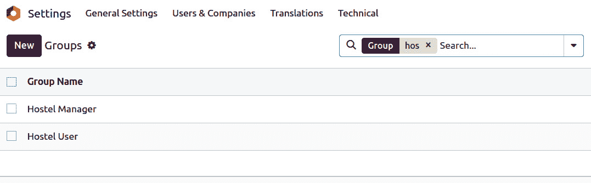
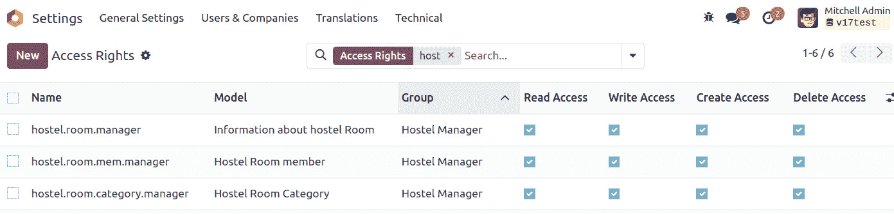
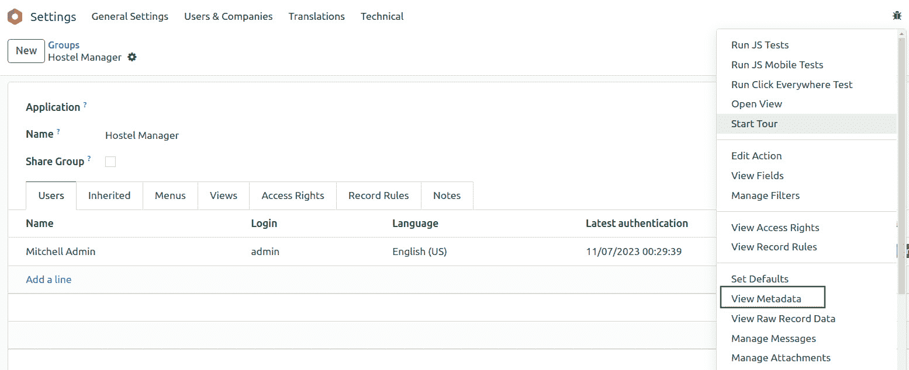
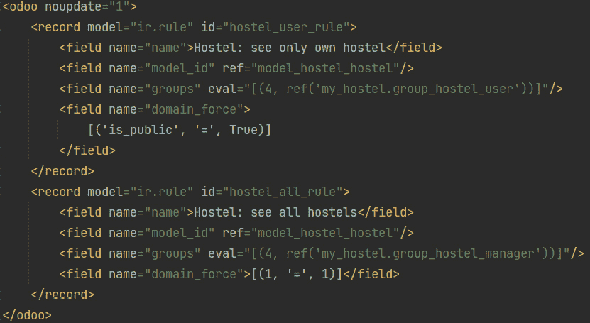
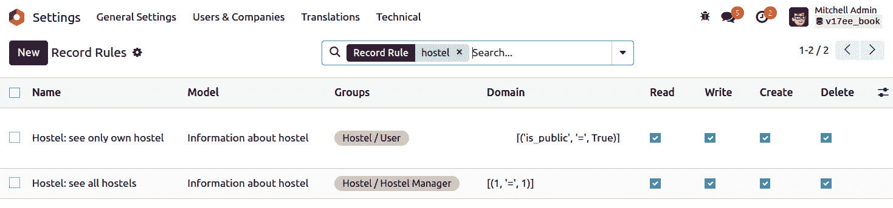
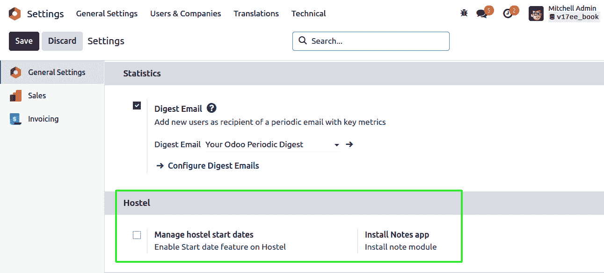

# 10

# 安全访问

Odoo 通常被多用户组织使用。每个用户在每一个组织中都有一个独特的职位，并且根据他们的职能有不同的访问权限。例如，人力资源经理没有访问公司会计信息的权限。您可以使用访问权限和记录规则来确定用户在 Odoo 中可以访问哪些信息。在本章中，我们将学习如何设置访问权限规则和记录规则。

这种访问和安全的细分要求我们根据其权限级别提供对角色的访问。我们将在本章中了解这一点。

在本章中，我们将涵盖以下食谱：

+   创建安全组并将它们分配给用户

+   向模型添加安全访问

+   限制模型中字段的访问

+   使用记录规则来限制记录访问

+   使用安全组激活功能

+   以超级用户身份访问记录集

+   根据组隐藏视图元素和菜单

为了简洁地传达要点，本章中的食谱对现有示例模块进行了小的补充。

# 技术要求

本章的技术要求包括使用我们根据*第三章*，*创建 Odoo 附加模块*中的教程创建的模块。为了遵循这里的示例，您应该已经创建了该模块并准备好使用。

本章中将要使用的所有代码都可以从本书的 GitHub 仓库中下载，网址为[`github.com/PacktPublishing/Odoo-17-Development-Cookbook-Fifth-Edition/tree/main/Chapter10`](https://github.com/PacktPublishing/Odoo-17-Development-Cookbook-Fifth-Edition/tree/main/Chapter10)。

# 创建安全组并将它们分配给用户

Odoo 中的安全访问通过安全组进行配置：权限被授予组，然后组被分配给用户。每个功能区域都有一个由中央应用程序提供的基本安全组。

当附加模块增强现有应用程序时，它们应该向相应的组添加权限，如*向模型添加安全访问*食谱中所述。

当附加模块引入一个尚未被现有核心应用程序覆盖的新功能区域时，应添加相关的安全组。我们通常至少应该有用户和管理角色。

以我们介绍的宿舍示例*第三章*，*创建 Odoo 附加模块*为例——它并不适合任何 Odoo 核心应用程序，因此我们将为它添加安全组。

## 准备工作

本教程假设您已经准备好一个 Odoo 实例，其中包含`my_hostel`，如*第三章*中所述，*创建 Odoo* *附加模块*。

## 如何做...

要向模块添加新的访问安全组，请执行以下步骤：

1.  确保附加模块的`__manifest__.py`声明文件中定义了`category`键：

    ```py
        'category': Hostel,
    ```

1.  将新的`security/groups.xml`文件添加到清单的`data`键：

    ```py
        'data': [
            'security/groups.xml',
        ],
    ```

1.  将数据记录的新 XML 文件添加到`security/groups.xml`文件中，从空结构开始：

    ```py
    <?xml version="1.0" encoding="utf-8"?>
    <odoo>
        <!--  Add step 4 goes here -->
    </odoo>
    ```

1.  在数据 XML 元素内部添加两个新组的`<record>`标签：

    ```py
    <record id="group_hostel_user" model="res.groups">
         <field name="name">User</field>
         <field name="category_id"
                ref="base.module_category_hostel"/>
         <field name="implied_ids"
                eval="[(4, ref('base.group_user'))]"/>
    </record>
    <record id="group_hostel_manager" model="res.groups">
        <field name="name">Manager</field>
        <field name="category_id"
               ref="base.module_category_hostel"/>
        <field name="implied_ids"
               eval="[(4, ref('group_hostel_user'))]"/>
        <field name="users" eval="[(4, ref('base.user_admin'))]"/> </record>
    ```

如果我们升级附加模块，这两个记录将被加载。要在 UI 中看到这些组，您需要激活开发者模式。然后您可以通过**设置** | **用户** | **组**菜单选项看到它们，如下所示：



图 10.1 – 新增的安全组

重要信息

当您添加一个新的模型时，管理员用户没有对该模型的访问权限。这意味着管理员用户无法看到为该模型添加的菜单和视图。要显示它，您必须首先向该模型添加访问规则，我们将在“向模型添加安全访问”配方中完成此操作。请注意，您可以用超级用户身份访问新添加的模型；有关更多信息，请参阅*第三章*，“以超级用户身份访问 Odoo”配方，*创建 Odoo 附加模块*。

## 它是如何工作的...

附加模块被组织成功能区域，或主要的应用程序，例如*会计和财务*、*销售*或*人力资源*。这些由清单文件中的`category`键定义。

如果类别名称尚不存在，它将被自动创建。为了方便，还会为新的类别名称生成一个`base.module_category_<category_name_in_manifest>` XML ID，将空格替换为下划线。这对于将安全组与应用程序类别相关联很有用。

在我们的示例中，我们使用了`base.module_category_hostel` XML 标识符。

按照惯例，包含安全相关元素的数据文件应放置在`security`子目录中。

清单文件还必须用于注册安全文件。在模块清单的`data`键中指定文件的顺序至关重要，因为您不能在其他视图或**ACL**文件中使用对安全组的引用，直到该组被创建。建议将安全数据文件放在第一位，然后是 ACL 文件和其他用户界面数据文件。

在我们的示例中，我们使用`<record>`标签创建了组，这将创建`res.groups`模型的记录。`res.group`模型最重要的列如下：

+   `name`: 这是该组的显示名称。

+   `category_id`: 这是对应用程序类别的引用，并用于在用户表单中组织组。

+   `implied_ids`: 这些是从中继承权限的其他组。

+   `users`: 这是属于此组的用户列表。在新增的附加模块中，我们通常希望管理员用户属于应用程序的管理员组。

第一个安全组使用`implied_ids`作为`base.group_user`组。这是`Employee`用户组，并且是所有后端用户预期共享的基本安全组。

第二个安全组在`users`字段上设置值，将其分配给具有`base.user_admin` XML ID 的管理员用户。

属于安全组的用户将自动属于其暗示的组。例如，如果您将*宿舍管理员*组分配给任何用户，该用户也将包括在*用户*组中。这是因为*宿舍管理员*组在其`implied_ids`列中包含*用户*组。

此外，安全组的访问权限是累积的。如果用户所属的任何组（直接或间接）授予他们权限，则用户具有权限。

一些安全组在用户表单中以选择框的形式显示，而不是单独的复选框。这种情况发生在涉及到的组属于同一应用类别，并且通过`implied_ids`线性互联时。例如，组 A 暗示组 B，而组 B 暗示组 C。如果一个组没有通过`implied_ids`与其他组关联，则会出现复选框而不是选择框。

注意

注意，前面字段中定义的关系也有反向关系，可以在相关模型中编辑，例如安全组和用户。

使用相关记录的 XML ID 和一些特殊语法可以在引用字段上设置值，例如`category_id`和`implied_ids`。这种语法在*第六章*，*管理模块数据*中详细解释。

## 更多...

特殊的`base.group_no_one`安全组标志`Technical Features`被激活。从版本 9.0 开始，这一变化使得只要`开发者模式`处于激活状态，这些功能就会可见。

安全组只提供累积的访问权限。没有方法可以拒绝一个组的访问。这意味着用于自定义权限的手动建立的组应继承自权限更少的最近组（如果有），然后添加所有剩余的所需权限。

组还有以下这些额外的字段可用：

+   `menu_access` **字段**）：这些是组可以访问的菜单项

+   `view_access` **字段**）：这些是组可以访问的 UI 视图

+   `model_access` **字段**）：这是对模型的访问权限，如*向模型添加安全访问权限*配方中详细说明

+   `rule_groups` **字段**）：这些是应用于组的记录级访问规则，如*使用记录规则限制记录访问*配方中详细说明

+   `comment` **字段**）：这是对组的描述或注释文本

有了这些，我们已经学会了如何构建安全组并通过 GUI 分配它们。在接下来的几个配方中，我们将利用这些组来建立访问控制列表和记录规则。

## 参见

要了解如何通过 *超级用户* 访问新添加的模型，请参阅 *第三章* 中的 *作为超级用户访问 Odoo* 菜谱，*创建 Odoo 附加模块*。

# 为模型添加安全访问权限

对于附加模块添加新模型是很常见的。例如，在 *第三章* 的 *创建 Odoo 附加模块* 中，我们添加了一个新的宿舍模型。在开发过程中，很容易忽略为新模型创建安全访问权限，你可能会发现很难看到创建的菜单和视图。这是因为，从 *Odoo 版本 12* 开始，管理员用户默认没有对新模型的访问权限。要查看新模型的视图和菜单，你需要添加安全 **ACLs**。

然而，没有 ACLs 的模型在加载时将触发一个警告日志消息，通知用户缺少 ACL 定义：

```py
WARNING The model hostel.hostel has no access rules, consider adding one example, access_hostel_hostel, access_hostel_hostel, model_hostel_hostel, base.group_user,1,0,0,0
```

你也可以以超级用户身份访问新上传的模型，这绕过了所有安全要求。有关更多信息，请参阅 *第三章* 中的 *作为超级用户访问 Odoo* 菜谱，*创建 Odoo 附加模块*。管理员可以访问超级用户功能。因此，为了使非管理员用户可以使用新模型，我们必须建立它们的访问控制列表，以便 Odoo 了解如何访问它们以及每个用户组被允许执行的活动。

## 准备工作

我们将继续使用之前教程中的 `my_hostel` 模块，并为其添加缺失的访问控制列表（ACLs）。

## 如何操作...

`my_hostel` 应该已经包含创建 `hostel.hostel` 模型的 `models/hostel.py` Python 文件。现在我们将通过以下步骤添加一个描述此模型安全访问控制的数据文件：

1.  编辑 `__manifest__.py` 文件以声明一个新的数据文件：

    ```py
        data: [
            # ...Security Groups
            'security/ir.model.access.csv',
            # ...Other data files
        ]
    ```

1.  在模块中添加一个新的 `security/ir.model.access.csv` 文件，包含以下行：

    ```py
    id,name,model_id:id,group_id:id,perm_read,perm_write,perm_create,perm_unlink
    acl_hostel,hostel_hostel_default,model_hostel_hostel,base_group_user,1,0,0,0
    acl_hostel_manager,hostel_manager,model_hostel_hostel,group_hostel_manager,1,1,1,1
    ```

然后，我们应该升级模块，以便将这些 ACL 记录添加到我们的 Odoo 数据库中。更重要的是，如果我们使用 `demo` 用户登录演示数据库，我们应该能够访问 **我的宿舍** 菜单选项而不会收到任何安全错误。

## 它是如何工作的...

安全 ACLs 存储在核心 `ir.model.access` 模型中。我们只需要添加描述每个用户组预期访问权限的记录。

任何类型的数据文件都可以，尽管最流行的是 CSV 文件。文件可以放置在附加模块目录中的任何位置；然而，通常会将所有与 **安全** 相关的文件保存在一个安全子文件夹下。

这个新的数据文件在教程的第一阶段添加到清单中。下一步是包含解释安全访问控制规则的文件。CSV 文件必须以将要导入条目的模型命名，所以我们选择的名称不仅仅是一种约定；这是必需的。有关更多信息，请参阅*第六章*，*管理模块数据*。

如果模块还创建了新的安全组，其数据文件应在 ACLs 数据文件之前在清单中声明，因为您可能希望将其用于 ACLs。它们必须在处理 ACL 文件之前已经创建。

CSV 文件中的列如下：

+   `id`：这是此规则的内部 XML ID 标识。模块内的任何唯一名称都是可接受的，但最佳实践是使用`access_<model>_<group>`。

+   `name`：这是访问规则的标题。使用`access.<model>.<group>`名称是一种常见的做法。

+   `model_id:id`：这是模型的 XML ID。Odoo 自动为具有`model_<name>`格式的模型分配此类 ID，使用模型的重音符`_name`而不是点。如果模型是在不同的附加模块中创建的，则需要一个包含模块名称的完全限定 XML ID。

+   `group_id:id`：这是用户组的 XML ID。如果为空，则适用于所有用户。基础模块提供了一些基本组，例如`base.group_user`适用于所有员工和`base.group_system`适用于管理员用户。其他应用程序可以添加它们自己的用户组。

+   `perm_read`：前一个组的成员可以读取模型的记录。它接受两个值：`0`或`1`。使用`0`来限制模型上的读访问，使用`1`来提供读访问。

+   `perm_write`：前一个组的成员可以更新模型的记录。它接受两个值：`0`或`1`。使用`0`来限制模型上的写访问，使用`1`来提供写访问。

+   `perm_create`：前一个组的成员可以添加此模型的新记录。它接受两个值：`0`或`1`。使用`0`来限制模型上的创建访问，使用`1`来提供创建访问。

+   `perm_unlink`：前一个组的成员可以删除此模型的记录。它接受两个值：`0`或`1`。使用`0`来限制模型上的解除链接访问，使用`1`来提供解除链接访问。

我们使用的 CSV 文件为**员工** | **Employee**标准安全组添加了只读访问权限，并为**管理** | **设置**组提供了完全写访问权限。

`base.group_user` 特别重要，因为 Odoo 标准应用添加的用户组都继承自它。这意味着，如果我们需要一个新的模型对所有后端用户都可用，无论他们使用的是哪个具体的应用程序，我们应该将这个权限添加到**员工**组。

`base.group_user`尤其重要，因为它继承自 Odoo 标准应用引入的用户组。这意味着，如果我们想让新的模型对所有后端用户可访问，而不管他们使用的是哪个应用，我们需要将其添加到**员工**组。

在调试模式下，您可以通过导航到**设置** | **技术** | **安全** | **访问控制列表**来查看生成的 ACLs，如下面的截图所示：



图 10.2 – ACL 列表视图

有些人发现使用此用户界面定义 ACLs 然后使用**导出**功能生成 CSV 文件更容易。

## 更多...

提供这种访问权限给在*创建安全组和将它们分配给用户*配方中指定的 Hostel 用户和 Hostel Manager 组似乎是合理的。如果您已经完成了那个课程，那么在将组身份更改为 Hostel 身份的同时完成这个练习将是一个很好的练习。

记住，附加模块提供的访问列表不应直接进行自定义，因为它们将在下一个模块更新时重新加载，从而擦除通过 GUI 所做的任何修改。

有两种方法可以自定义 ACLs。一种选项是构建新的继承自模块的安全组并添加额外的权限，但这只能让我们添加权限而不能删除它们。更灵活的方法是取消勾选`<field name="active" />`列。我们还可以创建新的 ACL 行来添加或修改权限。在模块更新后，停用的 ACLs 将不会被恢复，新插入的 ACL 行也不会受到影响。

值得注意的是，访问控制列表（ACLs）仅适用于传统模型，对于抽象或瞬态模型则不是必需的。如果这些模型被定义，它们将被忽略，并在服务器日志中记录一条警告信息。

## 参见

由于绕过了所有安全规则，您也可以通过超级用户访问新添加的模型。有关更多信息，请参阅*第三章*中的*作为超级用户访问 Odoo*配方，*创建 Odoo 附加模块*。

# 限制模型中字段的访问

在其他情况下，我们可能需要额外的细粒度访问控制，以及限制对模型中单个字段访问的能力。

使用`groups`属性，可以限制对字段的访问，使其仅限于特定的安全**组**。本配方将演示如何向 Hostels 模型添加具有受限访问权限的字段。

## 准备工作

我们将继续使用前一个教程中的`my_hostel`模块。

## 如何操作...

要添加一个仅限于特定安全组访问权限的字段，请执行以下步骤：

1.  编辑模型文件以添加字段：

    ```py
    is_public = fields.Boolean(groups='my_hostel.group_hostel_manager')
    notes = fields.Text(groups='my_hostel.group_hostel_manager')
    ```

1.  在 XML 文件中编辑视图以添加字段：

    ```py
    <field name="is_public" />
    <field name="notes" />
    ```

就这样。现在，升级附加模块以使模型中的更改生效。如果你使用没有系统配置访问权限的用户登录，例如在包含演示数据的数据库中使用`demo`，宿舍表单将不会显示该字段。

## 它是如何工作的...

包含`groups`属性的域在确定用户是否属于属性中指定的任何安全组时会被以不同的方式处理。如果一个用户不是某个特定组的成员，Odoo 将会从 UI 中移除该字段，并限制对该字段的 ORM 操作。

注意，这种安全性并非表面化。字段不仅在 UI 中被隐藏，在`read`和`write`等其他 ORM 操作中也不对用户可用。对于*XML-RPC*或*JSON-RPC*调用也是如此。

在使用这些字段在业务逻辑或 UI 事件变更（`@api.onchange`方法）时请小心；它们可能会对没有访问权限的用户引发错误。一个解决方案是使用权限提升，例如`sudo()`模型方法或计算字段的`compute_sudo`字段属性。

`groups`值是一个包含逗号分隔的有效 XML ID 列表的字符串，用于安全组。找到特定组的 XML ID 的最简单方法是激活开发者模式，导航到该组的表单，在**设置** | **用户** | **组**，然后从调试菜单中访问**查看元数据**选项，如图下所示：



图 10.3 – 查看组 XML ID 的菜单

你也可以通过利用形成组的`<record>`标签通过代码查看安全组的 XML ID。然而，查看信息，如图下所示，是找出组 XML ID 的最简单方法。

## 更多...

在某些情况下，我们希望字段根据特定要求（如字段中的值，如`stage_id`或`state`）可用或不可用。通常，这通过利用状态或属性等特性在视图级别处理，根据特定标准动态显示或隐藏字段。对于更完整的解释，请参阅*第九章*，*后端视图*。

注意，这些技术仅在用户界面级别上工作，并不提供实际的安全访问。为了做到这一点，你应该在业务逻辑层添加检查。要么添加带有`@constrains`装饰器的模型方法，实现特定的验证，要么扩展`create`、`write`或`unlink`方法来添加验证逻辑。你可以通过回到*第五章*，*基本服务器端开发*，来获取更多关于如何做到这一点的见解。

## 参见

请参阅*第九章*，*后端视图*，以获取有关如何使用标准隐藏和显示字段的更多信息。

要深入了解业务逻辑层，请参阅*第五章*，*基本* *服务器端开发*。

# 使用记录规则限制记录访问

每个应用程序的基本要求是能够限制在特定模型上向每个用户暴露哪些记录。

这是通过使用**记录规则**来实现的。记录规则是在模型上指定的一个域过滤器表达式，随后应用于受影响的用户执行的所有数据查询。

例如，我们将向`Hostel`模型添加一个记录规则，以便`Employee`组中的用户只能访问公共宿舍。

## 准备工作

我们将继续使用之前配方中的`my_hostel`模块。

## 如何实现...

可以通过使用数据 XML 文件来添加记录规则。为此，请执行以下步骤：

1.  确保由清单`data`键引用`security/security_rules.xml`文件：

    ```py
        'data': [
            'security/security_rules.xml',
            # ...
        ],
    ```

1.  我们应该有一个包含创建安全组的`<odoo>`部分的`security/security_rules.xml`数据文件：



图 10.4 – 宿舍用户的记录规则

升级附加模块将在 Odoo 实例中加载记录规则。如果你正在使用演示数据，你可以通过默认的`demo`用户来测试它，为演示用户赋予宿舍用户权限。如果你没有使用演示数据，你可以创建一个新的用户并赋予其宿舍用户权限。

## 工作原理...

记录规则只是放置在`ir.rule`核心模型中的数据记录。虽然包含它们的文件可以位于模块中的任何位置，但`security`子文件夹是首选位置。通常包含安全组和记录规则的单一 XML 文件。

与组不同，标准模块中的记录规则被导入具有`noupdate="1"`属性的`odoo`部分。因为某些记录在模块更新后不会被重新加载，所以手动自定义它们是安全的，并且可以在进一步的升级中幸存。

为了与标准模块保持一致，我们的记录规则也应该包含在`<odoo>` `noupdate="1">`部分中。

记录规则可以通过**设置**| **技术** | **安全** | **记录规则**菜单选项在 GUI 中查看，如下面的截图所示：



图 10.5 – 宿舍模型的 ACLs

在此示例中使用了以下最重要的记录规则字段：

+   `name`): 规则的描述性标题。

+   `model_id`): 规则应用的模型的引用。

+   `groups`): 受规则影响的权限组。如果没有提及权限组，则规则被认为是全局的，并且执行方式不同（继续阅读以了解更多关于这些组的信息）。

+   `domain`): 用于过滤记录的域表达式。规则仅适用于这些过滤记录。

我们创建的第一个记录规则是为`Hostel User`安全组。它使用`[('is_public', '=', True)]`域表达式来选择仅公开可用的宿舍。因此，具有`Hostel User`安全组的用户将只能看到公共宿舍。

注意

*记录规则中使用的域表达式是在服务器上使用 ORM 对象执行的。因此，可以在左侧的字段（第一个元组成员）上使用点表示法。例如，`[('country_id.code', '=', 'IN')]`域表达式将仅返回包含印度国家的条目。*

由于记录规则主要基于当前用户，您可以在域的右侧（第三个元组元素）使用`user`记录集。因此，如果您想显示当前用户的公司的记录，您可以使用`[('company_id', '=', user.company_id.id)]`域。或者，如果您想显示由当前用户创建的记录，您可以使用`[('user_id', '=', user.id)]`域。

我们希望`Hostel Manager`安全组能够访问所有宿舍，无论它们是公开的还是私人的。因为它是从`Hostel User`组派生的，所以它将只能看到公共宿舍，直到我们干预。

非全局记录规则使用`OR`逻辑运算符连接；每个规则添加访问权限，永远不会移除此访问权限。为了使`Hostel Manager`安全组能够访问所有宿舍，我们必须向其中添加一个记录规则，以便它可以添加对所有宿舍的访问权限，如下所示：

```py
[('is_public', 'in', [True, False])]
```

我们选择在这里以不同的方式操作，并使用`[(1, '=', 1)]`特殊规则来无条件地给予对所有宿舍记录的访问权限。虽然这看起来可能是多余的，但请记住，如果我们不这样做，`Hostel User`规则可以被定制，从而让某些宿舍对设置用户不可达。域是特殊的，因为域元组的第一个元素必须是字段名；这种情况是两种情况之一，其中这不是真的。`[(1, '=', 0)]`的特殊域永远不会为真，但在记录规则的情况下也不是非常有用。这是因为此类规则用于限制对所有记录的访问。同样的事情也可以通过访问列表实现。

重要信息

如果您已激活`SUPERUSER`模式，则记录规则将被忽略。在测试您的记录规则时，请确保您使用另一个用户进行测试。

## 还有更多...

当记录规则未分配给安全组时，它被标记为全局，并且与其他规则的处理方式不同。

`AND`运算符。它们用于标准模块中创建多公司安全访问，以便每个用户只能看到他们自己业务的数据。

总结来说，标准非全局记录规则与 `OR` 运算符结合，如果任何规则授予访问权限，则记录可访问。当使用 `AND` 运算符时，全局记录规则会对传统记录规则提供的访问权限添加限制。常规记录规则不能覆盖全局记录规则施加的限制。

# 使用安全组激活功能

一些功能可以通过安全组进行限制，以便只有属于这些组的人才能访问。安全组可以继承其他组，从而授予它们权限。

这两个功能用于在 Odoo 中提供功能切换功能。安全组也可以用来为某些用户或整个 Odoo 实例激活或禁用功能。

本食谱演示了如何向配置设置中添加选项，并展示了启用额外功能的两种方法：通过安全组使其可见或通过安装附加模块添加它们。

对于第一种情况，我们将使宿舍开始日期成为一个可选的附加功能；对于第二种情况，例如，我们将提供一个安装 *笔记* 模块的选项。

## 准备工作

本教程使用 `my_hostel` 模块，该模块在 *第三章*，*创建 Odoo 附加模块* 中进行了描述。我们将需要安全组来工作，因此您也需要遵循本章中的 *向模型添加安全访问* 食谱。

在本食谱中，一些标识符需要引用附加模块的技术名称。我们将假设这是 `my_hostel`。如果您使用的是不同的名称，请将 `my_hostel` 替换为您的附加模块的实际技术名称。

## 如何操作...

要添加配置选项，请按照以下步骤操作：

1.  要添加必要的依赖项和新 XML 数据文件，请像这样编辑 `__manifest__.py` 文件并确保它依赖于 `base_setup`：

    ```py
    {  'name': 'Cookbook code',
        'category': 'Hostel',
        'depends': ['base_setup'],
        'data': [
            'security/ir.model.access.csv',
            'security/groups.xml',
            'views/hostel_hostel.xml',
            'views/res_config_settings.xml',
        ],
    }
    ```

1.  要添加用于功能激活的新安全组，请编辑 `security/groups.xml` 文件并添加以下记录：

    ```py
        <record id="group_start_date" model="res.groups">
            <field name="name">Hostel: Start date feature</field>
            <field name="category_id" ref="base.module_category_hidden" />
        </record>
    ```

1.  要使宿舍开始日期仅在启用此选项时可见，请编辑 `models/hostel.py` 文件中的字段定义：

    ```py
    class HostelHostel(models.Model):
        # ...
        date_start = fields.Date(
            'Start Date',
            groups='my_hostel.group_start_date',    )
    ```

1.  编辑 `models/__init__.py` 文件以添加一个新的 Python 文件用于配置设置模型：

    ```py
    from . import hostel
    from . import res_config_settings
    ```

1.  要通过添加新选项来扩展核心配置向导，请添加包含以下代码的 `models/res_config_settings.py` 文件：

    ```py
    from odoo import models, fields
    class ConfigSettings(models.TransientModel):
        _inherit = 'res.config.settings'
        group_start_date = fields.Boolean(
                "Manage Hostel Start dates",
                group='base.group_user',
                implied_group='my_hostel.group_start_dates',
        )
        module_note = fields.Boolean("Install Notes app")
    ```

1.  要在用户界面中提供这些选项，请添加 `views/res_config_settings.xml`，它扩展了设置表单视图：

    ```py
    <?xml version="1.0" encoding="utf-8"?>
    <odoo>
        <record id="view_general_config_hostel" model="ir.ui.view">
            <field name="name">Configuration: add Hostel options</field>
            <field name="model">res.config.settings</field>
            <field name="inherit_id" ref="base_setup.res_config_settings_view_form" />
            <field name="arch" type="xml">
                <div id="business_documents" position="before">
                 <h2>Hostel</h2>
                    <div class="row mt16 o_settings_container">
                        <!-- Add Step 7 and 8 goes here -->
                    </div>
                </div>
            </field>
        </record>
    </odoo>
    ```

1.  在设置表单视图中，添加添加开始日期功能的选项：

    ```py
    <!-- Start Dates option -->
    <div class="col-12 col-lg-6 o_setting_box">
        <div class="o_setting_left_pane">
            <field name="group_start_date" class="oe_inline"/>
        </div>
        <div class="o_setting_right_pane">
            <label for="group_start_date"/>
            <div class="text-muted">
                Enable Start date feature on hostels
            </div>
        </div>
    </div>
    ```

1.  在设置表单视图中，添加安装笔记模块的选项：

    ```py
    <!-- Note module option -->
    <div class="col-12 col-lg-6 o_setting_box">
        <div class="o_setting_left_pane">
            <field name="module_note" class="oe_inline"/>
        </div>
        <div class="o_setting_right_pane">
            <label for="module_note"/>
            <div class="text-muted">
                Install note module
            </div>
        </div>
    </div>
    ```

在升级附加模块后，两个新的配置选项应在 **设置** | **常规设置** 下可用。屏幕应如下所示：



图 10.6 – 常规设置中的宿舍配置

如前一个截图所示，您将在**宿舍**部分看到新的设置。第一个选项，**管理宿舍开始日期**，将为宿舍记录启用开始日期功能。第二个选项，**安装笔记应用**，将安装 Odoo 的笔记应用。

## 它是如何工作的...

核心的`base`模块提供了`res.config.settings`模型，该模型提供了激活选项背后的业务逻辑。`base_setup`附加模块使用`res.config.settings`模型提供一些基本配置选项，这些选项可以在新数据库中提供。它还使**设置** | **常规设置**菜单可用。

`base_setup`模块将`res.config.settings`适配到中央管理仪表板，因此我们需要扩展它以添加配置设置。

如果我们决定为宿舍应用创建一个特定的设置表单，我们仍然可以从`res.config.settings`模型继承，使用不同的`_name`，然后为新的模型提供菜单选项和表单视图，仅针对这些设置。我们已经在*第八章*的*添加自己的设置选项*食谱中看到了这种方法，*高级服务器端开发技术*。

我们通过两种方式激活了这些功能：通过激活一个安全组并使功能对用户可见，以及通过安装一个提供此功能的附加模块。基本的`res.config.settings`模型提供了处理这两种情况所需的逻辑。

本教程的第一步是将`base_setup`附加模块添加到依赖项中，因为它为我们想要使用的`res.config.settings`模型提供了扩展。它还添加了一个额外的 XML 数据文件，我们将需要将其添加到**常规** **设置**表单中。

在第二步中，我们创建了一个新的安全组，**宿舍：开始日期功能**。需要激活的功能应该只对该组可见，因此它将在该组启用之前隐藏。

在我们的示例中，我们希望宿舍开始日期仅在相应的配置选项启用时才可用。为了实现这一点，我们可以使用字段的`groups`属性，使其仅对这一安全组可用。我们在模型级别做了这件事，以便它自动应用于所有使用该字段的 UI 视图。

最后，我们扩展了`res.config.settings`模型以添加新的选项。每个选项都是一个布尔字段，其名称必须以`group_`或`module_`开头，根据我们希望它执行的操作。

`group_`选项字段应该有一个`implied_group`属性，并且应该是一个包含逗号分隔的安全组 XML ID 列表的字符串，当它启用时将激活这些安全组。XML ID 必须是完整的，包括模块名称、点以及标识符名称；例如，`module_name.identifier`。

我们还可以提供一个 `group` 属性来指定哪些安全组将启用该功能。如果没有定义任何组，它将为所有基于员工的组启用。因此，相关的组不会应用于门户安全组，因为这些组不像其他常规安全组那样从员工基本安全组继承。

激活背后的机制相当简单：它将 `group` 属性中的安全组添加到 `implied_group` 中，从而使相关的功能对相应的用户可见。

`module_` 选项字段不需要任何额外的属性。字段名剩余部分标识了当此选项被激活时将安装的模块。在我们的示例中，`module_note` 将安装 Note 模块。

重要信息

取消勾选将不会警告即卸载模块，这可能导致数据丢失（模型、字段和模块数据将被删除作为后果）。为了避免意外取消勾选，`secure_uninstall` 社区模块（来自 [`github.com/OCA/server-tools`](https://github.com/OCA/server-tools)）在用户卸载附加模块之前会提示用户输入密码。

## 还有更多...

配置设置也可以有以 `default_` 前缀命名的字段。当其中之一有值时，ORM 将将其设置为全局默认值。`settings` 字段应该有一个 `default_model` 属性来标识受影响的模型，并且 `default_` 前缀后面的字段名标识了将设置默认值的 `model` 字段。

此外，没有提到这三个前缀之一的字段可以用于其他设置，但您需要实现填充它们值的逻辑，使用以 `get_default_` 命名的前缀方法，并使用以 `set_` 命名的前缀方法在它们的值被编辑时执行操作。

对于那些想深入了解配置设置细节的人来说，请查看 Odoo 的源代码在 `./odoo/addons/base/models/res_config.py`，那里有大量的注释。

# 以超级用户身份访问记录集

在之前的菜谱中，我们探讨了包括访问规则、安全组和记录规则在内的安全策略。您可以通过这些方法避免未经授权的访问。然而，在某些复杂的企业场景中，您可能需要查看或编辑记录，即使用户没有访问权限。例如，假设公共用户没有访问线索记录的权限，但用户可能通过提交网站表单在后台生成线索记录。

您可以通过使用 `sudo()` 以超级用户身份访问记录集。我们在 *第八章* 的 *高级服务器端开发技术* 菜谱中介绍了 `sudo()`。在这里，我们将看到即使您已设置 ACL 规则或将安全组分配给字段，您仍然可以使用 `sudo()` 获取访问权限。

## 如何操作...

我们将使用之前教程中的相同`my_hostel`模块。我们已经有了一个只读访问权限的 ALC 规则，适用于普通用户。我们将添加一个新字段，并使用安全组，以便只有管理员用户可以访问它。之后，我们将修改普通用户的字段值。按照以下步骤实现：

1.  将新字段添加到`hostel.hostel`模型：

    ```py
    details_added = fields.Text(
          string="Details",
          groups='my_hostel.group_hostel_manager')
    ```

1.  将字段添加到表单视图：

    ```py
    <field name="details_added"/>
    ```

1.  将`add_details()`方法添加到`hostel.hostel`模型：

    ```py
        def add_details(self):
            self.ensure_one()
            message = "Details are(added by: %s)" % self.env.user.name
            self.sudo().write({
                'details_added': message
            })
    ```

1.  将按钮添加到表单视图，以便我们可以从用户界面触发我们的方法。这应该放在`<header>`标签内部：

    ```py
    <button name="add_details"
        string="Add Details"
        type="object"/>
    ```

重新启动服务器并更新模块以应用这些更改。

## 它是如何工作的...

在*步骤 1*和*步骤 2*中，我们向模型和表单视图添加了一个名为`details_added`的新字段。请注意，我们在 Python 中将`my_hostel.group_hostel_manager`组放在字段上，因此此字段只能由管理员用户访问。

在下一步中，我们添加了`add_details()`方法。我们更新了此方法体内`details_added()`字段的值。请注意，我们在调用写入方法之前使用了`sudo()`。

最后，我们在表单视图中添加了一个按钮，用于从用户界面触发该方法。

为了测试这个实现，您需要使用非管理员用户登录。如果您已经用演示数据加载了数据库，您可以使用演示用户登录，然后点击`add_details()`方法将被调用，这将把消息写入`details_added`字段，即使用户没有适当的权限。您可以通过管理员用户检查字段的值，因为此字段将从演示用户那里隐藏。

当点击`add_details()`方法作为参数时，使用`self`。在我们将值写入宿舍记录集之前，我们使用了`self.sudo()`。这返回相同的记录集，但具有超级用户权限。这个记录集将具有`su=True`环境属性，并且将绕过所有访问规则和记录规则。正因为如此，非管理员用户将能够写入宿舍记录。

## 更多...

当您使用`sudo()`时需要格外小心，因为它绕过了所有访问权限。如果您想以其他用户的身份访问记录集，可以在`sudo`内部传递该用户的 ID – 例如，`self.sudo(uid)`。这将返回包含该用户环境的记录集。这样，它将不会绕过所有访问规则和记录规则，但您可以执行该用户允许的所有操作。

# 根据组隐藏视图元素和菜单

在之前的菜谱中，我们介绍了如何使用 Python 字段声明中的组参数来隐藏某些用户的字段。在用户界面中隐藏字段的另一种方法是向视图规范中的 XML 元素添加安全组。您还可以通过使用菜单来隐藏特定用户的安全组。

## 准备工作

对于这个菜谱，我们将重用前一个菜谱中的 `my_hostel` 扩展模块。在前一个菜谱中，我们向 `<header>` 标签添加了一个按钮。我们将通过向其添加组属性来隐藏几个用户的整个头部。

添加 `hostel.room.category` 模型的模型、视图和菜单。我们将隐藏对用户的类别菜单。请参阅 *第四章* *应用模型*，了解如何添加模型视图和菜单。

## 如何操作...

按照以下步骤根据安全组隐藏元素：

1.  向 `<header>` 标签添加 `groups` 属性以隐藏它对其他用户：

    ```py
    ...
    <header groups="my_hostel.group_hostel_manager">
    ...
    ```

1.  向 `<menuitem>` 宿舍类别添加 `groups` 属性，以便它仅对图书管理员用户显示：

    ```py
        <menuitem name="Hostel Room Categories"
            id="hostel_room_category_menu"
            parent="hostel_base_menu"
            action="hostel_room_category_action"
            groups="my_hostel.group_hostel_manager"/>
    ```

重新启动服务器并更新模块以应用这些更改。

## 它是如何工作的...

在 *步骤 1* 中，我们将 `groups="my_hostel.group_hostel_manager"` 添加到 `<header>` 标签中。这意味着整个头部部分将仅对宿舍用户和宿舍管理员可见。没有 `group_hostel_manager` 的普通后端用户将看不到头部部分。

在 *步骤 2* 中，我们将 `groups="my_hostel.group_hostel_manager"` 属性添加到 `menuitem`。这意味着此菜单仅对宿舍用户可见。

您几乎可以在任何地方使用 `groups` 属性，包括 `<field>`、`<notebook>`、`<group>` 和 `<menuitems>`，或者在任何视图架构的标签上。如果用户没有那个组，Odoo 将隐藏这些元素。您可以在网页和 *QWeb 报告* 中使用相同的组属性，这些将在 *第十二章* *自动化、工作流、电子邮件和打印* 和 *第十四章* *CMS 网站开发* 中介绍。

如我们在本章的 *以超级用户访问记录集* 菜谱中看到的，我们可以通过在 Python 字段定义中使用 `groups` 参数来隐藏某些用户的部分字段。请注意，在字段上使用安全组和在视图中使用 Python 安全组之间存在很大差异。Python 中的安全组提供真正的安全性；未经授权的用户甚至无法通过 ORM 或 RPC 调用来访问字段。然而，视图中的组只是为了提高可用性。通过 XML 文件中的组隐藏的字段仍然可以通过 RPC 或 ORM 访问。

## 参见

请参阅 *第四章* *应用模型*，了解如何添加模型视图和菜单。
