# 11

# 国际化

Odoo 支持多种语言，并允许用户使用他们最舒适的语言。内置的 Odoo i18n 功能有助于实现这一点。通过字符串翻译，Odoo 还支持日期和时间格式。

在本章中，您将了解如何将翻译文件上传到您的模块并启用各种语言。由于国家多样性和本地语言的普遍性，用户通常发现当系统以他们的母语呈现时更容易与之连接。为了适应这一点，Odoo 提供了一种功能，可以将软件文本翻译成用户的偏好语言。这一功能通过确保界面对各种语言背景的个人都是可访问和可理解的，从而提高了软件在不同地区和人口统计学中的采用率和可用性。利用这些新功能将增强 Odoo 用户体验。

本章将涵盖以下食谱：

+   设置语言安装和用户偏好设置

+   设置与语言相关的选项

+   使用网络客户端用户界面进行文本翻译

+   将翻译导出为文件

+   使用`gettext`工具使翻译更容易

+   将翻译文件导入 Odoo

+   修改网站的定制语言 URL 代码

许多这些食谱可以从网络客户端用户界面或从命令行完成。 wherever possible，我们将了解如何使用这两种选项。Odoo 使用 Transifex(Odoo)和 Weblate (OCA)翻译平台。

# 设置语言安装和用户偏好设置

Odoo 可以本地化以适应各种语言和地区设置，包括日期和数字格式。

初始安装的唯一语言是标准英语语言。我们需要安装各种地区和语言，以便人们可以使用它们。本食谱描述了如何实现用户偏好，以及如何设置它们。

## 如何操作...

激活开发者模式并按照以下步骤在 Odoo 实例中安装新语言：

1.  前往**设置** | **通用设置** | **语言**。在这里，您将看到**添加语言**链接，如以下截图所示。点击该链接；将打开一个对话框，您可以在其中加载语言：

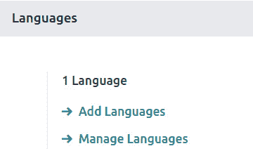

图 11.1 – 通用设置中的语言选项

1.  选择您想要加载的语言：

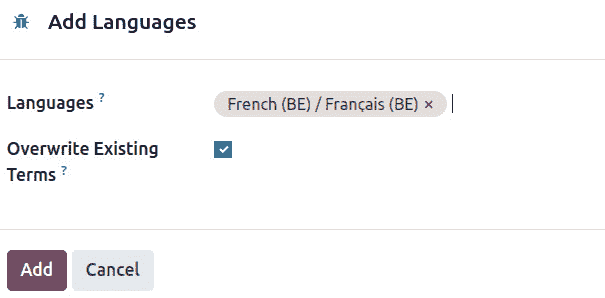

图 11.2 – 加载语言的对话框

1.  点击**添加**将加载所选语言，并将确认对话框打开，如下所示：

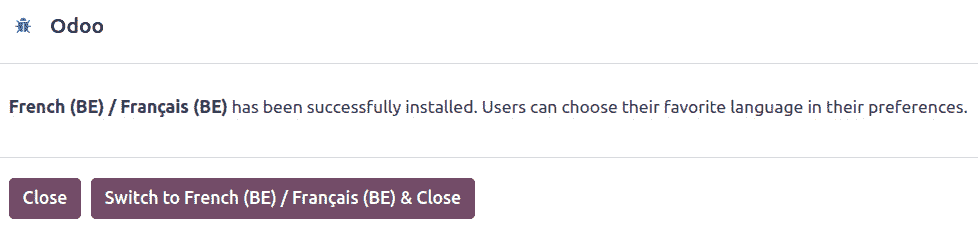

图 11.3 – 显示已加载语言的对话框

1.  新语言也可以从命令行安装。前述步骤的等效命令如下：

    ```py
    $ ./odoo-bin -d mydb --load-language=es_ES
    ```

1.  要设置用户使用的语言，请转到**设置** | **用户与公司** | **用户**，然后在**用户**表单的**偏好**选项卡中设置**语言**字段值：

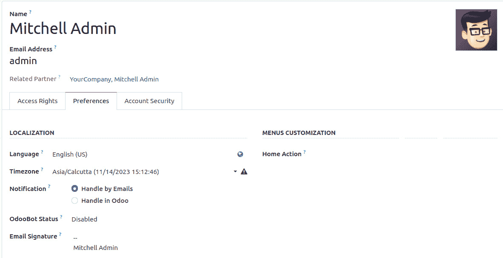

图 11.4 – 设置语言的用户表单

通过**偏好**菜单项，用户可以轻松地自行更改这些变量。他们可以通过点击网页客户端窗口右上角的用户名来访问它：

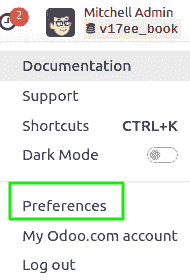

图 11.5 – 设置语言的偏好选项

## 它是如何工作的...

用户可以有自己的语言和时区偏好。语言设置用于将用户界面文本翻译成所选语言，并应用于浮点数和货币字段的地方惯例。

在用户可以选择语言之前，必须使用**添加语言**选项安装该语言。可以通过转到开发者模式下的**设置** | **翻译** | **语言**菜单选项来查看可用的语言列表。带有活动标志设置的语言已安装。

每个 Odoo 附加模块都负责提供翻译资源，这些资源应放置在`i18n`子目录中。每种语言的数据应在一个`.po`文件中。在我们的例子中，西班牙语的翻译数据是从`es_ES.po`数据文件中加载的。

Odoo 还支持`es.po`文件的概念，用于西班牙语，以及`es_MX.po`文件，用于墨西哥西班牙语，然后`es.po`被检测为`es_MX.po`的基础语言。当安装墨西哥西班牙语时，将加载两个数据文件；首先加载基础语言的一个，然后是特定语言的一个。因此，在我们的情况下，墨西哥西班牙语的翻译文件只需包含该语言变体独有的字符串。

`i18n`子目录还应该有一个`<module_name>.pot`文件，提供翻译模板并包含所有可翻译的字符串。本章的*将翻译字符串导出到文件*配方解释了如何导出可翻译字符串以生成此文件。

在 Odoo 的早期版本中，当安装了额外的语言时，相应的资源会从所有已安装的附加模块中加载，并存储在**翻译术语**模型中。其数据可以在**设置** | **翻译** | **应用程序术语** | **翻译术语**菜单选项中查看（并编辑）（注意，此菜单仅在开发者模式下可见）。

从 Odoo 版本 17 开始，您将无法找到此菜单，因为翻译术语现在作为本地术语存储。现在任何可翻译的字段都存储表示所有翻译语言值的 JSON 数据。例如，产品名称的翻译现在直接存储在`name`字段中。翻译过程没有改变——您只是无法看到带有所有已翻译术语列表的**设置** | **翻译** | **应用程序术语** | **已翻译术语**菜单项。

当安装新的附加模块或升级现有附加模块时，也会加载已安装语言的翻译文件。

## 还有更多...

通过再次选择语言旁边的刷新符号，可以在不升级附加模块的情况下刷新翻译文件。如果您更改了翻译文件，但不想处理更新模块（及其所有依赖项），则可以这样做。

如果**覆盖现有术语**复选框留空，则只会加载新翻译的字符串。因此，更改后的翻译字符串不会被加载。如果您想同时加载现有翻译并覆盖当前加载的翻译，请勾选该框。请注意，如果有人通过界面手动更改翻译，这可能会引起潜在问题。

**覆盖现有术语**复选框存在，因为我们可以通过转到**设置** | **翻译** | **应用程序术语** | **已翻译术语**菜单项或使用**调试**菜单中的**技术翻译**快捷选项来编辑特定的翻译。以这种方式添加或修改的翻译不会覆盖，除非通过启用**覆盖现有术语**复选框重新加载语言。

了解附加模块也可以有一个`i18n_extra`子目录，其中包含额外的翻译，这可能很有用。首先，下载`i18n`子目录中的`.po`文件。然后，Odoo ORM 下载基本语言的文件，然后是语言变体的文件。随后，下载`i18n_extra`子目录中的`.po`文件，首先是基本语言，然后是语言变体。最终加载的字符串翻译是最终具有优先级的翻译。

# 设置与语言相关的选项

只要用户使用正确的语言，区域设置就应该正确，因为它们带有合适的默认值。

尽管如此，您可能仍然想要更改语言的设置。例如，您可以选择在更改美国日期和数字格式以更好地满足您的需求的同时，使用用户界面默认的英语语言设置。

此外，日期和数字格式等区域设置由语言及其变体（例如`es_MX`代表墨西哥西班牙语）提供。

## 准备工作

我们需要开启开发者模式。如果之前尚未启用，请按照*第一章*中*安装 Odoo 开发环境*的*激活 Odoo 开发者工具*配方中描述的方式进行操作。

## 如何操作...

按照以下步骤更改语言的区域设置：

1.  选择**设置** | **翻译** | **语言**菜单选项以查看已安装的语言及其选项。当您点击一个已安装的语言时，将打开一个包含必要选项的表单：

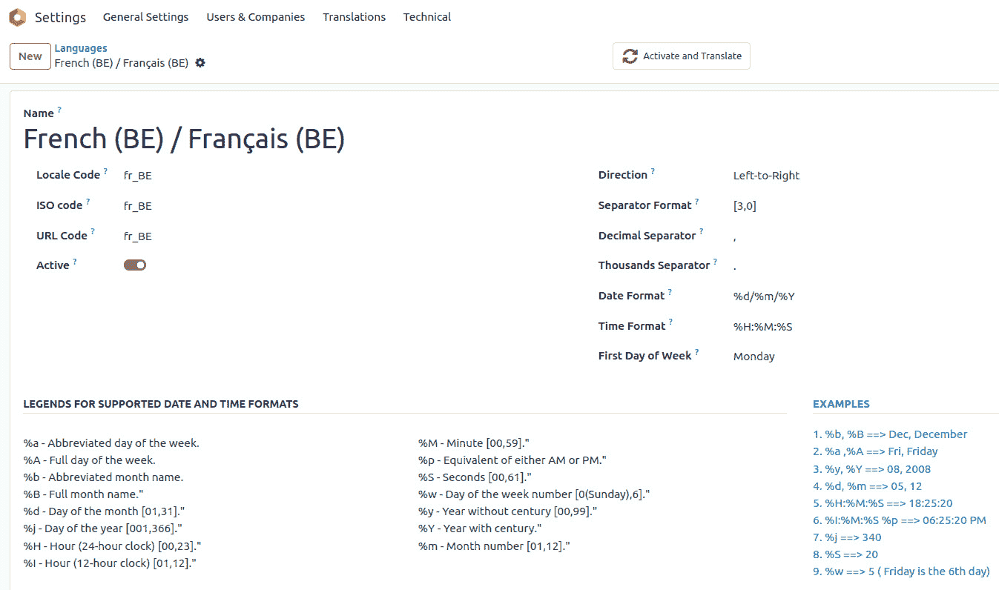

图 11.6 – 配置语言设置的表单

1.  编辑语言设置。要将日期更改为 ISO 格式，将`%Y-%m-%d`更改为。要将数字格式更改为使用逗号作为小数分隔符，相应地修改**小数分隔符**和**千位分隔符**字段。

## 它是如何工作的...

用户语言在用户偏好设置中选中，并在登录和启动新的 Odoo 用户会话时放置在**lang**上下文键中。通过将源文本翻译成用户语言，并根据语言当前的区域设置格式化日期和数字，相应地准备输出。

## 更多...

服务器端进程可以修改运行动作的上下文。例如，为了获取按照美国英语格式格式化的日期的记录，独立于当前用户的语言偏好，您可以执行以下操作：

```py
en_records = self.with_context(lang='en_US').search([])
```

更多详情，请参阅*第八章*中的*调用修改上下文的方法*配方，*高级服务器端开发技术*。

# 使用 Web 客户端用户界面进行文本翻译

翻译的最简单方法是使用 Web 客户端提供的翻译功能。这些翻译字符串存储在数据库中，以后可以导出为`.po`文件，既可以包含在附加模块中，也可以手动导入。

文本字段可以有可翻译的内容，这意味着它们的值将取决于当前用户的语言。我们还将了解如何设置这些字段的语言相关值。

## 准备工作

我们需要启用开发者模式。如果没有启用，请按照*第一章*中*安装 Odoo 开发环境*的*激活 Odoo 开发者工具*配方所示进行操作。

## 如何操作...

我们将通过使用**用户组**功能作为示例来演示如何通过 Web 客户端翻译术语：

1.  导航到您想要翻译的屏幕。例如，我们将通过**设置** | **用户和公司** | **组**菜单项打开**组**视图：

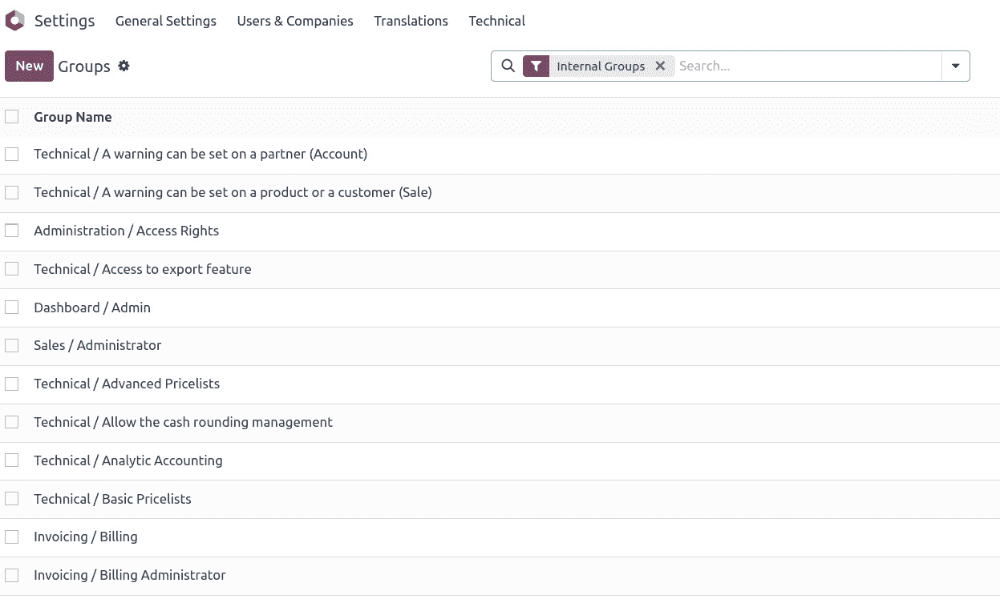

图 11.7 – 组的翻译

1.  在表单视图中打开其中一个组记录，然后点击**编辑**：

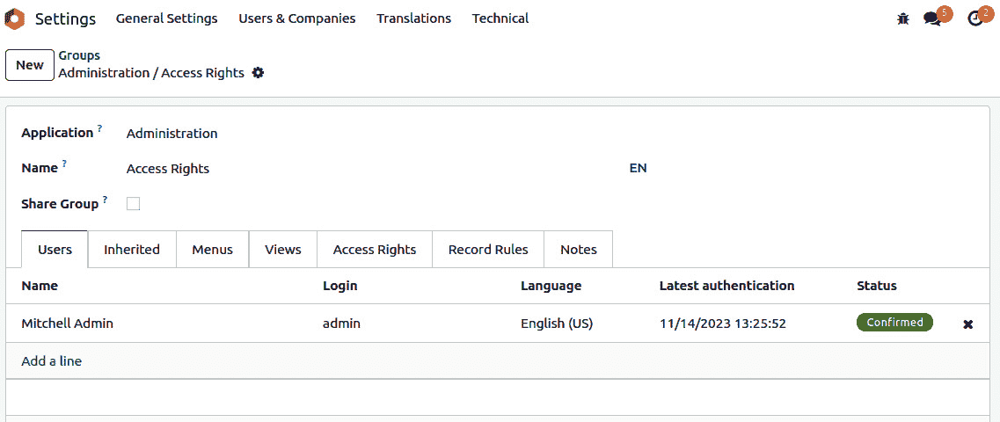

图 11.8 – 字段值的翻译

1.  注意，**名字** 字段在右侧有一个特殊图标。这表示它是一个可翻译字段。点击此图标将打开一个包含不同已安装语言的 **翻译** 列表。这允许我们为这些语言中的每一个设置翻译：

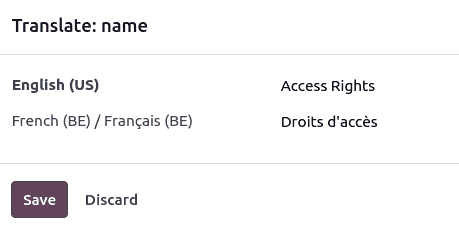

图 11.9 – 字段值的翻译

## 工作原理...

所有翻译术语都保存在任何模式/表的名字字段中。在我们的例子中，`res_groups` 表；当你检查名字字段中存储的信息时，它将被保存为一个字典，其中键是语言代码，值是翻译短语：

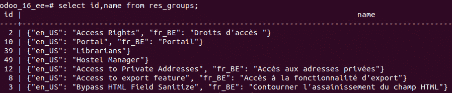

图 11.10 – 字段值的翻译

# 将翻译字符串导出到文件

翻译字符串可以带或不带所选语言的翻译文本进行导出。这可以是将 `i18n` 数据包含在模块中，或者稍后使用文本编辑器或可能使用专用工具进行翻译。

我们将通过我们的自定义 `My Hostel` 模块演示如何进行此操作，因此请随意将 `My Hostel` 替换为您自己的模块。

## 准备工作

我们需要启用开发者模式。如果尚未启用，请按照在 *第一章* 中演示的 *激活 Odoo 开发者工具* 菜谱进行操作，*安装 Odoo 开发环境*。

## 如何操作...

要导出 `my_hostel` 模块的翻译术语，请按照以下步骤操作：

1.  在网络客户端用户界面中，从 **设置** 顶部菜单中选择 **翻译** | **导入/导出** | **导出翻译** 菜单选项。

1.  在 `.po` 格式下，并且一次导出单个扩展模块 – `my_hostel` 是 Discuss 应用程序的技术名称），在我们的例子中：

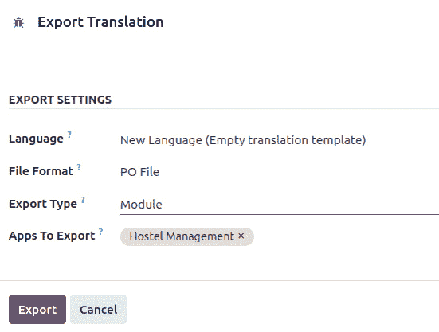

图 11.11 – 导出翻译术语的对话框

1.  在 Odoo 版本 17 中，你将在导出设置中找到一个名为 **导出类型** 的新选项，它包含两个选项：**模块** 和 **模型**。

1.  将模块类型设置为模型将提供新的选项来选择具有筛选选项的特定模型，用户可以使用该选项仅导出基于特定筛选的记录：

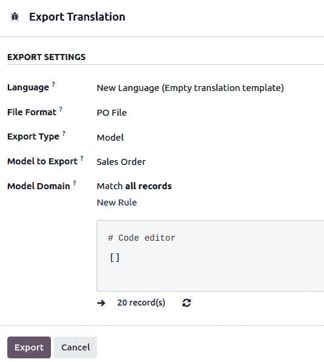

图 11.12 – 导出翻译术语的对话框

1.  一旦导出过程完成，将显示一个新窗口，其中包含下载文件的链接和一些额外的建议。

1.  要从 Odoo 命令行界面导出 `my_hostel` 扩展模块的翻译模板文件，请输入以下命令：

    ```py
    $ ./odoo-bin -d mydb --i18n-export=my_hostel.pot --modules=my_hostel
    es_ES for Spanish, for example – from the Odoo command-line interface, enter the following command:

    ```

    $ ./odoo-bin -d mydb --i18n-export=es_ES.po --modules=my_hostel

    --language=es_ES

    $ mv es_ES.po ./addons/my_hostel/i18n

    ```py

    ```

## 工作原理...

**导出翻译**功能从目标模块中提取可翻译的字符串，然后创建一个包含翻译术语的文件。这可以从 Web 客户端和命令行界面完成。

当从 Web 客户端导出时，我们可以选择导出空翻译模板——即包含要翻译的字符串和空翻译的文件，或者导出一个语言，结果是一个包含要翻译的字符串和所选语言的翻译的文件。

可用的文件格式是 CSV、PO 和 TGZ。TGZ 文件格式导出一个包含`<name>/i18n/`目录结构的压缩文件，其中包含 PO 或 POT 文件。

CSV 格式在通过电子表格进行翻译时很有用，但在附加模块中使用的格式是 PO 文件。这些文件应放置在`i18n`子目录中。一旦安装了相应的语言，它们就会自动加载。在导出这些 PO 文件时，我们应该一次只导出一个模块。PO 文件也是翻译工具（如 Poedit）支持的流行格式之一。

翻译也可以通过使用`--i18n-export`选项直接从命令行导出。这个示例展示了如何提取模板文件和翻译语言文件。

在这个示例的*步骤 4*中，我们导出了一个模板文件。`--i18n-export`选项期望导出路径和文件名。请注意，文件扩展名必须是 CSV、PO 或 TGZ。此选项需要`-d`选项，它指定要使用的数据库。还需要`--modules`选项来指示要导出的附加模块。请注意，`--stop-after-init`选项不是必需的，因为`export`命令在完成后会自动返回到命令行。

这将导出一个模板文件。Odoo 模块期望在`i18n`文件夹中找到具有`.pot`扩展名的导出模板。在处理模块时，导出操作完成后，我们通常希望将导出的 PO 文件移动到模块的`i18n`目录下，并命名为`<模块>.pot`。

在*步骤 5*中，也使用了`–language`选项。使用它，除了空翻译文件外，还会导出所选语言的翻译术语。这个用例之一是通过使用**技术翻译**功能通过 Web 客户端用户界面进行一些翻译，然后导出并包含在模块中。

## 还有更多...

视图和模型定义中的文本字符串会自动提取以进行翻译。对于模型，提取了`_description`属性、字段名称（`string`属性）、帮助文本以及选择字段选项，以及模型约束的用户文本（`_constraints`和`_sql_constraints`）。

在 Python 或 JavaScript 代码中需要翻译的文本字符串无法自动检测，因此代码应识别这些字符串，并将它们包裹在下划线函数中。

在 Python 的模块文件中，我们应该确保文件以以下方式导入：

```py
from odoo import _
```

此文件可以在任何需要可翻译文本的地方使用，如下所示：

```py
_('Hello World')
```

对于使用额外上下文信息的字符串，我们应该使用 Python 字符串插值，如下所示：

```py
_('Hello %s') % 'World'
```

注意，插值应该放在翻译函数外部。例如，`_("Hello %s" % 'World')`是错误的。字符串插值也应优先于字符串连接，以便每个界面文本都只是一个翻译字符串。

请小心处理`选择`字段！如果你向字段定义传递一个显式的值列表，显示的字符串将自动标记为需要翻译。另一方面，如果你传递一个返回值列表的方法，显示字符串必须显式标记为需要翻译。

关于手动翻译工作，任何文本文件编辑器都可以使用，但使用专门支持 PO 文件语法的编辑器可以简化这项工作，减少格式错误的风险。此类编辑器包括以下列表：

+   **POEDIT**: [`poedit.net/`](https://poedit.net/)

)

+   **Emacs (PO 模式)**: [`www.gnu.org/software/gettext/manual/html_node/PO-Mode.html`](https://www.gnu.org/software/gettext/manual/html_node/PO-Mode.html)

+   **Lokalize**: [`l10n.kde.org/tools/`](https://l10n.kde.org/tools/)

+   **Gtranslator**: [`wiki.gnome.org/Apps/Gtranslator`](https://wiki.gnome.org/Apps/Gtranslator)

)

# 使用 gettext 工具使翻译更容易

PO 文件格式是 Unix-like 系统中常用的`gettext` i18n 和本地化系统的一部分。此系统包括用于简化翻译工作的工具。

这个配方演示了如何使用这些工具来帮助我们翻译我们的附加模块。我们希望在自定义模块上使用它，所以我们在*第三章*，*创建 Odoo 附加模块*中创建的`my_hostel`模块是一个很好的候选者。然而，你也可以自由地用你手头的其他自定义模块替换它，并相应地替换教程中的`my_hostel`引用。

## 如何做到这一点...

假设你的 Odoo 安装位于`~/odoo-work/odoo`，要使用命令行管理翻译，请按照以下步骤操作：

1.  为目标语言创建一个翻译术语汇编——例如，西班牙语。如果我们命名我们的汇编文件为`odoo_es.po`，我们应该编写以下代码：

    ```py
    $ cd ~/odoo-work/odoo  # Use the path to your Odoo installation
    $ find ./ -name es_ES.po | xargs msgcat --use-first | msgattrib
    --translated  --no-fuzzy \ -o ./odoo_es.po
    ```

1.  从 Odoo 命令行界面导出附加模块的翻译模板文件，并将其放置在模块预期的位置：

    ```py
    $ ./odoo-bin -d mydb --i18n-export=my_module.po --modules=my_module
    $ mv my_module.po ./addons/my_module/i18n/my_module.pot
    ```

1.  如果目标语言还没有可用的翻译文件，创建 PO 翻译文件，重复使用在汇编中已找到和翻译的术语：

    ```py
    $ msgmerge --compendium ./odoo_es.po -o
    ./addons/my_module/i18n/es_ES.po \
    /dev/null ./addons/my_module/i18n/my_module.pot
    ```

1.  如果存在翻译文件，请添加汇编中可以找到的翻译：

    ```py
    $ mv ./addons/my_module/i18n/es_ES.po /tmp/my_module_es_old.po
    $ msgmerge --compendium ./odoo_es.po -o./addons/my_module/i18n/es_ES.po
    \ /tmp/my_module_es_old.po ./addons/my_module/i18n/my_module.pot
    $ rm /tmp/my_module_es_old.po
    ```

1.  要查看 PO 文件中的未翻译术语，请使用以下命令：

    ```py
    $ msgattrib --untranslated ./addons/my_module/i18n/es_ES.po
    ```

1.  使用你喜欢的编辑器来完成翻译。

## 它是如何工作的...

*步骤 1* 使用`gettext`工具箱中的命令为所选语言创建翻译汇编——在我们的例子中是西班牙语。它通过在 Odoo 代码库中查找所有`es_ES.po`文件，并将它们传递给`msgcat`命令来实现。我们使用`--use-first`标志来避免冲突翻译（Odoo 代码库中有一些）。结果传递给`msgattrib`过滤器。我们使用`--translated`选项来过滤未翻译条目，并使用`--no-fuzzy`选项来删除模糊翻译。然后我们将结果保存在`odoo_es.po`中。

*步骤 2* 使用`--i18n-export`选项调用`odoo.py`。即使配置文件和`--modules`选项中已指定，您仍需要在命令行上指定一个数据库，并使用逗号分隔的模块列表来导出翻译。

在`gettext`世界中，模糊翻译是由`msgmerge`命令（或其他工具）使用源字符串的邻近匹配自动创建的。我们希望在汇编中避免这些。

*步骤 3* 通过使用在汇编中找到的现有翻译值来创建一个新的翻译文件。使用带有`--compendium`选项的`msgmerge`命令来查找汇编文件中的`msgid`行，匹配在*步骤 2*中生成的翻译模板文件中的那些。结果保存在`es_ES.po`文件中。

如果您有一个包含您想要保留的翻译的现有`.po`文件，您应该将其重命名，并将`/dev/null`参数替换为该文件。重命名过程是必要的，以避免使用相同的文件作为输入和输出。

## 更多...

本教程仅简要介绍了 GNU `gettext`工具箱中可用的丰富工具。全面覆盖超出了本书的范围。如果您感兴趣，GNU `gettext`文档包含大量关于 PO 文件操作的有价值信息，可在[`www.gnu.org/software/gettext/manual/gettext.html`](http://www.gnu.org/software/gettext/manual/gettext.html)找到。

# 将翻译文件导入 Odoo

加载翻译的标准方法是存储 PO 文件在模块的`i18n`子文件夹中。每当附加模块安装或更新时，翻译文件就会被加载，并添加额外的翻译字符串。

然而，可能存在我们想要直接导入翻译文件的情况。在本教程中，我们将学习如何从网络客户端或命令行加载翻译文件。

## 准备工作

我们需要激活开发者模式。如果尚未激活，请按照*第一章*中“激活 Odoo 开发者工具”食谱中的说明进行激活，即安装 Odoo 开发环境。我们还需要一个翻译`po`文件，我们将在本教程中导入它——例如，`myfile.po`文件。

## 如何操作...

要导入翻译术语，请按照以下步骤操作：

1.  在网络客户端用户界面中，从**设置**顶部菜单，选择**翻译** | **导入/导出** | **导入翻译**菜单选项。

1.  在**导入翻译**对话框中，填写语言名称和语言代码，并选择要导入的文件。最后，点击**导入**按钮：

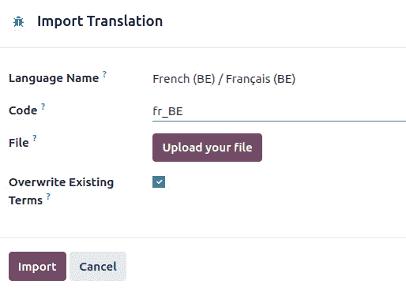

图 11.13 – 导入翻译文件的对话框

1.  要从 Odoo 命令行界面导入翻译文件，我们必须将其放置在服务器附加路径中，然后执行导入：

    ```py
    $ mv myfile.po ./addons/
    $ ./odoo.py -d mydb --i18n-import="myfile.po" --lang=fr_BE
    ```

## 它是如何工作的...

`ir.translation` 表，但在 Odoo 的新版本中，该表不再存在。因此，所有针对 `arch_db` 的视图级别翻译，例如按钮字符串和选择字段值，都将存储在 `ir_ui_view` 表中，而所有字段级别翻译，例如字段标签，都将存储在 `ir_model_fields` 表的 `field_description` 字段下。

例如，我们的宿舍表有一个 `room_number` 模型。其“房间号”字段翻译将作为 `{"en_US": "Room Number", "fr_BE": "Numéro de chambre"}` 存储在数据库级别。

网络客户端功能会要求输入语言名称，但在导入过程中并不使用它。它还有一个覆盖选项。如果选中，它将强制导入所有翻译字符串，即使它们已经存在，也会在过程中覆盖它们。

在命令行中，可以使用 `--i18n-import` 选项进行导入。它必须提供相对于附加路径目录的文件路径；`-d` 和 `--language`（或 `-l`）是必需的。通过添加 `--i18n-overwrite` 选项到命令中，也可以实现覆盖。请注意，我们在这里没有使用 `--stop-after-init` 选项。因为它不是必需的，因为导入操作在完成后会停止服务器。

# 修改网站的定制语言 URL 代码

Odoo 还支持网站的多语言。在网站上，当前语言被识别为语言字符串。在本食谱中，你将学习如何更改 URL 中的语言代码。

## 准备工作

在遵循此食谱之前，请确保你已经安装了 `website` 模块并启用了网站的多语言功能。

## 如何操作...

要修改语言的 URL 代码，请按照以下步骤操作：

1.  从**设置** | **翻译** | **语言**菜单选项打开语言列表。点击其中一个已安装的语言将打开一个看起来像这样的表单：

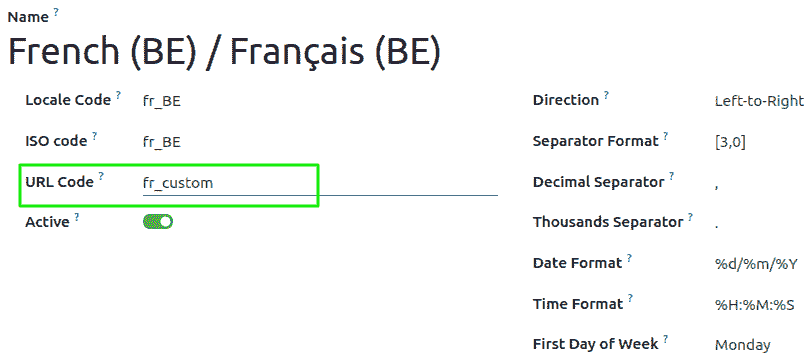

图 11.14 – 网站的语言 URL 代码

1.  这里，你会看到**URL 代码**字段。设置你想要的值。确保你在这里不要添加空格或特殊字符。

配置完成后，你可以在网站上测试结果。打开主页并更改语言；你将看到 URL 中的自定义语言代码。

## 它是如何工作的...

Odoo 通过 URL 路径识别网站的语种。例如，[www.odoo.com/fr_FR](https://www.odoo.com/fr_FR) 用于法语，[www.odoo.com/es_ES](https://www.odoo.com/es_ES) 用于西班牙语。在这里，URL 中的 `fr_FR` 和 `es_ES` 部分是语言 ISO 代码，Odoo 使用这些代码来检测请求的语言。但有时，你可能希望以更用户友好的方式设置语言。在这种情况下，你可以更新法语对应的 `fr`。在这种情况下，[www.odoo.com/fr_FR](http://www.odoo.com/fr_FR) 将会被转换为 [www.odoo.com/fr](http://www.odoo.com/fr)。

注意

在生产环境中更改 URL 代码不是问题；Odoo 会自动将包含语言 ISO 代码的 URL 重定向到你的自定义 URL。
