# 第十二章：自动化、工作流程、电子邮件和打印

预期业务应用不仅存储记录，还要管理业务工作流程。一些对象，如潜在客户或项目任务，有很多并行运行的记录。一个对象有太多的记录会使业务情况难以清晰。Odoo 有几种技术可以处理这个问题。在本章中，我们将探讨如何设置具有动态阶段和看板组的业务工作流程。这将帮助用户了解他们的业务是如何运行的。

我们还将探讨如服务器操作和自动化操作等技术，这些技术可以被高级用户或功能顾问使用，以添加更简单的流程自动化，而无需创建自定义插件。最后，我们将创建**基于 QWeb 的 PDF 报告**并打印出来。

在本章中，我们将涵盖以下菜谱：

+   管理动态记录阶段

+   管理看板阶段

+   向看板卡片添加快速创建表单

+   创建交互式看板卡片

+   向看板视图中添加进度条

+   创建服务器操作

+   使用 Python 代码服务器操作

+   在时间条件下使用自动化操作

+   在事件条件下使用自动化操作

+   创建基于 QWeb 的 PDF 报告

+   从看板卡片管理活动

+   向表单视图添加状态按钮

+   启用记录的存档选项

# 技术要求

本章的技术要求是拥有在线 Odoo 平台。

本章将使用的所有代码都可以从本书的 GitHub 仓库下载：[`github.com/PacktPublishing/Odoo-17-Development-Cookbook-Fifth-Edition/tree/main/Chapter12`](https://github.com/PacktPublishing/Odoo-17-Development-Cookbook-Fifth-Edition/tree/main/Chapter12)。

# 管理动态记录阶段

在`my_hostel`中，我们有一个`state`字段来指示宿舍房间记录的当前状态。此`state`字段限制为`草稿`或`可用`状态，并且无法向业务流程中添加新状态。为了避免这种情况，我们可以使用`many2one`字段在用户选择看板工作流程设计时提供灵活性，并且您可以在任何时候添加/删除新状态。

## 准备工作

对于这个菜谱，我们将使用来自*第八章*，*高级服务器端开发技术*的`my_hostel`模块。此模块管理宿舍和学生。它还记录房间。我们为此书添加了一个初始模块，`Chapter12/00_initial_module/my_hostel`，到 GitHub 仓库以帮助您开始：[`github.com/PacktPublishing/Odoo-17-Development-Cookbook-Fifth-Edition/tree/main/Chapter12`](https://github.com/PacktPublishing/Odoo-17-Development-Cookbook-Fifth-Edition/tree/main/Chapter12)。

## 如何操作...

按照以下简单步骤向`hostel.room`模型添加阶段：

1.  添加一个名为`hostel.room.stage`的新模型，如下所示：

    ```py
    class HostelRoomStage(models.Model):
        _name = 'hostel.room.stage'
        _order = 'sequence,name'
        name = fields.Char("Name")
        sequence = fields.Integer("Sequence")
    security/ir.model.access.csv file, as follows:

    ```

    从`hostel.room`模型中替换状态字段，并替换为新的阶段 _id 字段，这是一个 many2one 字段，以及其方法，如下面的示例所示：

    ```py
    @api.model
    def _default_room_stage(self):
        Stage = self.env['hostel.room.stage']
    state field in the form view with the stage_id field, as shown in the following example:

    ```

    <header>

    <field name="stage_id" widget="statusbar"

    options="{'clickable': '1', 'fold_field': 'fold'}"/>

    在树视图中的状态字段与阶段 _id 字段一起，如下所示：

    ```py
    <tree string="Room">
        <field name="name"/>
        <field name="room_no"/>
        <field name="floor_no"/>
        <field name="stage_id"/>
    data/room_stages.xml file. Don’t forget to add this file to the manifest, as shown in the following example:

    ```

    <?xml version="1.0" encoding="utf-8"?>

    <odoo noupdate="1">

    <record id="stage_draft" model="hostel.room.stage">

    <field name="name">草稿</field>

    <field name="sequence">1</field>

    </record>

    <record id="stage_available" model="hostel.room.stage">

    <field name="name">可用</field>

    <field name="sequence">15</field>

    </record>

    <record id="stage_reserved" model="hostel.room.stage">

    <field name="name">预留</field>

    <field name="sequence">5</field>

    <field name="fold">True</field>

    </record>

    </odoo>

    ```py

    ```

    ```py

    ```

    ```py

    ```

安装模块后，您将在表单视图中看到阶段，如下面的截图所示：

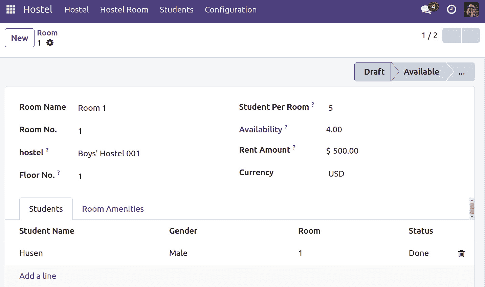

图 12.1 – 表单视图中的阶段选择器

这里，您会注意到在宿舍记录上勾画出的阶段。这些阶段是可点击的，因此您可以通过点击来更改阶段。折叠阶段将在**更多**下拉菜单下显示。

## 工作原理...

由于我们想要动态管理记录阶段，我们需要创建一个新的模型。在**步骤 1**中，我们创建了一个名为`hostel.room.stage`的新模型来存储动态阶段。在这个模型中，我们添加了一些字段。其中之一是`sequence`字段，用于确定阶段的顺序。我们还添加了`fold`布尔字段，用于折叠阶段并将它们放入下拉列表中。当您的业务流程有很多阶段时，这非常有用，因为它意味着您可以通过设置此字段来在下拉菜单中隐藏不重要的阶段。

`fold`字段也用于看板视图中显示折叠的看板列。通常，**预留**项目预计处于**未展开**阶段，标记为**完成**或**取消**的项目应处于**折叠**阶段。

默认情况下，`fold`是用于存储阶段折叠值的字段名称。您可以通过添加`_fold_name = 'is_fold'`类属性来更改此名称。

在**步骤 2**中，我们为新的模型添加了基本访问权限规则。

在**步骤 3**中，我们将`stage_id` `many2one`字段添加到`hostel.room`模型中。在创建新的房间记录时，我们希望将默认阶段值设置为`草稿`。为了完成这个任务，我们添加了`_default_room_stage()`方法。此方法将检索具有最低序列号的`hostel.room.stage`模型记录，因此，在创建新记录时，序列号最低的阶段将在表单视图中显示为活动状态。

在*第 4 步*中，我们将`stage_id`字段添加到表单视图中。通过添加`clickable`选项，我们使状态栏可点击。我们还添加了`fold`字段的选项，这将允许我们在下拉菜单中显示不重要的阶段。

在*第 5 步*中，我们将`stage_id`添加到树视图中。

在*第 6 步*中，我们为各个阶段添加了默认数据。用户安装我们的模块后将会看到这些基本阶段。如果您想了解更多关于 XML 数据语法的知识，请参考*第六章*中的*使用 XML 文件加载数据*配方，*管理模块数据*。

重要提示

在此实现中，用户可以即时定义新的阶段。您需要为`hostel.room.stage`添加视图和菜单，以便可以从用户界面添加新阶段。如果您不知道如何添加视图和菜单，请参考*第九章*，*后端视图*。

如果您不想这样做，Kanban 视图提供了内置功能，可以直接从 Kanban 视图中添加、删除或修改阶段。我们将在下一个配方中查看这一点。

## 参见

+   要了解如何添加视图和菜单，请参考*第九章*，*后端视图*。

# 管理 Kanban 阶段

使用**Kanban 板**是管理工作流程的简单方法。它组织成列，每列对应一个阶段，工作项从左到右移动，直到完成。具有这些阶段的 Kanban 视图提供了灵活性，因为它允许用户选择自己的工作流程。它在一个屏幕上提供了记录的全面概述。

## 开始使用

在此配方中，我们将使用前一个配方中的`my_hostel`模块。我们将向`hostel.room`模型添加 Kanban，并将 Kanban 卡片按阶段分组。

## 如何操作...

执行以下步骤以启用`hostel.room`模型的 Kanban 工作流程：

1.  按如下方式为`hostel.room`添加 Kanban 视图：

    ```py
    <record id="hostel_room_view_kanban" model="ir.ui.view">
        <field name="name">Hostel room Kanban</field>
        <field name="model">hostel.room</field>
        <field name="arch" type="xml">
            <kanban default_group_by="stage_id">
                <field name="stage_id" />
                <templates>
                    <t t-name="kanban-box">
                        <div class="oe_kanban_global_click">
                            <div class="oe_kanban_content">
                                <div class="oe_kanban_card">
                                    <div>
                                        <b>
                                            <field name="name" />
                                        </b>
                                    </div>
                                    <div class="text-muted">
                                        <i class="fa fa-building"/>
                                        <field name="hostel_id" />
                                    </div>
                                </div>
                            </div>
                        </div>
                    </t>
                </templates>
            </kanban>
        </field>
    action_hostel_room action, as follows:

    ```

    ...

    <field name="view_mode">kanban,tree,form</field>

    _group_expand_stages()方法和将 group_expand 属性添加到 stage_id 字段，如下所示：

    ```py
    @api.model
    def _group_expand_stages(self, stages, domain, order):
        return stages.search([], order=order)
    stage_id = fields.Many2one(
            'hostel.room.stage',
            default=_default_room_stage,
            group_expand='_group_expand_stages'
        )
    ```

    ```py

    ```

重新启动服务器并更新模块以应用更改。这将启用 Kanban 板，如下截图所示：

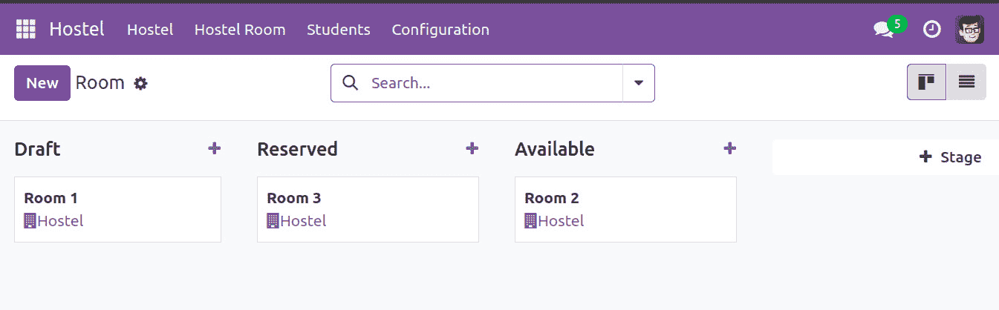

图 12.2 – 按阶段分组的 Kanban 视图

如前一张截图所示，Kanban 视图将按阶段分组显示房间记录。您可以将卡片拖放到另一个阶段列。将卡片移动到另一个列会更改数据库中的阶段值。

## 它是如何工作的...

在*第 1 步*中，我们为`hostel.room.stage`模型添加了 Kanban 视图。请注意，我们使用`stage_id`作为 Kanban 的默认分组，这样当用户打开 Kanban 时，Kanban 卡片将按阶段分组。要了解更多关于 Kanban 的信息，请参考*第九章*，*后端视图*。

在*步骤 2*中，我们将`kanban`关键字添加到现有的操作中。

在*步骤 3*中，我们将`group_expand`属性添加到`stage_id`字段。我们还添加了一个新的`_group_expand_stages()`方法。`group_expand`改变了字段的分组行为。默认情况下，字段分组显示正在使用的阶段。例如，如果没有房间记录有`Reserved`阶段，分组将不会返回该阶段，因此看板将不会显示`Reserved`列。但在这个例子中，我们希望显示所有阶段，无论它们是否正在使用。

`_group_expand_stages()`函数用于返回所有阶段的记录。因此，看板视图将显示所有阶段，您将能够通过拖放使用工作流。

## 更多...

如果您在这个菜谱中创建的看板周围进行尝试，您会发现许多不同的功能。以下是一些：

+   您可以通过点击`group_create`选项来创建一个新的阶段，该选项可以用来从看板中禁用**添加列**选项。

+   您可以通过拖动它们的标题来以不同的顺序排列列。这将更新`hostel.room.stage`模型的序列字段。

+   您可以使用看板列标题上的齿轮图标编辑或删除列。`group_edit`和`group_delete`选项可以用来禁用此功能。

+   在`fold`字段中具有`true`值的阶段将折叠，列将显示为细长的条形。如果您点击这个细长的条形，它将展开并显示看板卡片。

+   如果模型有一个`active`布尔字段，它将在看板列中显示存档和取消存档记录的选项。`archivable`选项可以用来禁用此功能。

+   看板列上的加号图标可以用来直接从看板视图中创建记录。`quick_create`选项可以用来禁用此功能。目前，这个功能在我们的例子中不会工作。这将在下一个菜谱中解决。

## 参见

+   想了解更多关于看板的信息，请参阅*第九章*，*后端视图*。

# 向看板卡片添加快速创建表单

分组看板视图提供了快速创建功能，允许我们直接从看板视图中生成记录。列上的加号图标将显示一个可编辑的看板卡片，使用它可以创建记录。在这个菜谱中，我们将学习如何设计我们选择的快速创建看板表单。

## 入门

对于这个菜谱，我们将使用前一个菜谱中的`my_hostel`模块。我们将为`hostel.room`模型使用看板的快速创建选项。

## 如何做...

按照以下步骤为看板添加自定义快速创建表单：

1.  为`hostel.room`模型创建一个新的最小表单视图，如下所示：

    ```py
    <record id="hostel_room_view_form_minimal" model="ir.ui.view">
        <field name="name">Hostel room Form</field>
        <field name="model">hostel.room</field>
        <field name="arch" type="xml">
            <form>
                <group>
                    <field name="name"/>
                    <field name="room_no"/>
                    <field name="hostel_id" required="1"/>
    <field name="floor_no"/>
                    <field name="student_per_room"/>
                </group>
            </form>
        </field>
    <kanban> tag, as follows:

    ```

    `<kanban default_group_by="stage_id" on_create="quick_create" quick_create_view="my_hostel.hostel_room_view_form_minimal">`

    ```py

    ```

1.  重新启动服务器并更新模块以应用更改。然后，点击列中的加号图标。这将启用看板表单，如图下所示：

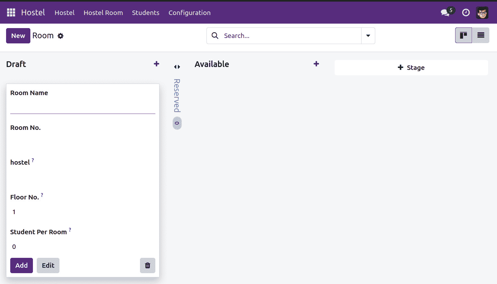

图 12.3 – 从看板视图直接创建记录

当你在看板视图中点击**创建**按钮时，你会看到一个带有输入的小卡片，而不是被重定向到表单视图。你可以填写值并点击**添加**，这将创建一个房间记录。

## 工作原理...

要创建自定义快速创建选项，我们需要创建一个最小化表单视图。我们在*步骤 1*中这样做。我们添加了两个必填字段，因为不填写必填字段你无法创建记录。如果你这样做，Odoo 将生成错误并打开默认表单视图在对话框中，以便你可以输入所有必填值。

在*步骤 2*中，我们将这个新的表单视图添加到看板视图中。使用`quick_create_view`选项，你可以将自定义表单视图映射到看板视图中。我们还添加了一个额外的选项 – `on_create="quick_create"`。此选项将在你点击控制面板中的**创建**按钮时，在第一列显示快速创建表单。如果没有此选项，**创建**按钮将打开表单视图以编辑模式。

你可以通过在看板标签中添加`quick_create="false"`来禁用快速创建功能。

# 创建交互式看板卡片

�看板卡片支持所有 HTML 标签，这意味着你可以按自己的喜好设计它们。Odoo 提供了一些内置方式来使看板卡片更加互动。在本教程中，我们将添加颜色选项、星形小部件和`many2many`标签到看板卡片中。

## 开始使用

对于这个教程，我们将使用上一教程中的`my_hostel`模块。

## 如何操作...

按照以下步骤创建一个吸引人的看板卡片：

1.  添加一个新模型来管理`hostel.room`模型的标签，如下所示：

    ```py
    class HostelAmenities(models.Model):
        _name = "hostel.amenities"
        _description = "Hostel Amenities"
        name = fields.Char("Name", help="Provided Hostel Amenity")
        active = fields.Boolean("Active", default=True,
            help="Activate/Deactivate whether the amenity should be given or not")
    hostel.amenities model, as follows:

    ```

    access_hostel_amenities_manager_id,access.hostel.amenities.manager,my_hostel.model_hostel_amenities,my_hostel.group_hostel_manager,1,1,1,1

    hostel.room 模型，如下所示：

    ```py
    color = fields.Integer()
        popularity = fields.Selection([('no', 'No Demand'), ('low', 'Low Demand'), ('medium', 'Average Demand'), ('high', 'High Demand'),])
    hostel_amenities_ids = fields.Many2many(
        "hostel.amenities",
        "hostel_room_amenities_rel", "room_id", "amenitiy_id",
    string="Amenities", domain="[('active', '=', True)]",
        help="Select hostel room amenities")
    ```

    ```py

    ```

1.  按照以下方式将字段添加到表单视图中：

    ```py
    <field name="popularity" widget="priority"/>
    <field name="hostel_amenities_ids" widget="many2many_tags"
    color field to the Kanban view:

    ```

    <field name="stage_id" />

    <field name="color" />

    ```py

    ```

1.  在看板视图中添加一个下拉菜单来选择颜色：

    ```py
    <t t-name="kanban-box">
        <div t-attf-class="#{kanban_color(record.color)} oe_kanban_global_click">
            <div class="o_dropdown_kanban dropdown">
                <a class="dropdown-toggle o-no-caret btn" role="button" data-toggle="dropdown">
                    <span class="fa fa-ellipsis-v"> </span>
                </a>
                <div class="dropdown-menu" role="menu">
                    <t t-if="widget.editable">
                        <a role="menuitem" type="edit" class="dropdown-item">Edit</a>
                    </t>
                    <t t-if="widget.deletable">
                        <a role="menuitem" type="delete" class="dropdown-item">Delete</a>
                    </t>
                    <ul class="oe_kanban_colorpicker" data-field="color"/>
                </div>
            </div>
            <div class="oe_kanban_content">
                <div class="oe_kanban_card oe_kanban_global_click">
                    <div>
                        <i class="fa fa-bed">  </i>
                        <b>
                            <field name="name" />
                        </b>
                    </div>
                    <div class="text-muted">
                        <i class="fa fa-building">    </i>
                        <field name="hostel_id" />
                    </div>
                    <span class="oe_kanban_list_many2many">
                        <field name="hostel_amenities_ids" widget="many2many_tags" options="{'color_field': 'color'}"/>
                    </span>
                    <div>
                        <field name="popularity" widget="priority"/>
                    </div>
                </div>
            </div>
        </div>
    </t>
    popularity field to the Kanban view:

    ```

    ...

    <div class="text-muted">

    <i class="fa fa-building"/>

    <field name="hostel_id" />

    </div>

    <span class="oe_kanban_list_many2many">

    <field name="hostel_amenities_ids" widget="many2many_tags" options="{'color_field': 'color'}"/>

    </span>

    <div>

    <field name="popularity" widget="priority"/>

    </div>

    ```py

    ```

重要提示

应该添加到现有看板视图中的粗体代码。

重新启动服务器并更新模块以应用更改。然后，点击列上的加号图标。它将显示看板，如图下所示：

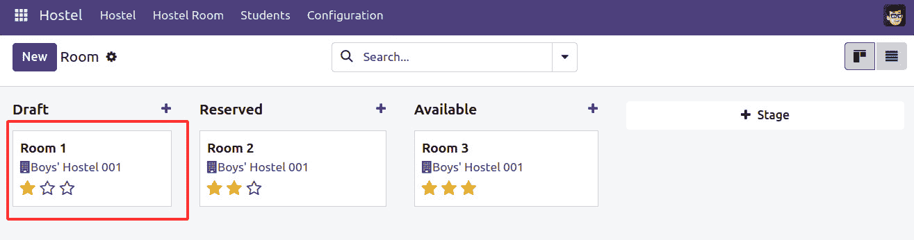

图 12.4 – 带有新选项的看板卡片

我们对看板结构的更改将使看板卡片启用额外选项。现在，您将能够在看板上选择颜色。您还可以使用星标对卡片进行优先级排序。

## 它是如何工作的...

在*步骤 1*和*步骤 2*中，我们为标签添加了新的模型和安全规则。在*步骤 3*中，我们在房间模型中添加了一些字段。

在*步骤 4*中，我们将这些字段添加到表单视图中。请注意，我们在`popularity`字段上使用了`priority`小部件，它显示带有星标图标的选项字段。在`hostel_amenities_ids`字段中，我们使用了`many2many_tags`小部件，它以标签的形式显示`many2many`字段。`color_field`选项用于在标签上启用颜色功能。此选项的值是存储颜色索引的字段名称。`no_create_edit`选项将禁用通过表单视图创建新标签的功能。

在*步骤 5*中，我们改进了很多东西。首先，我们在看板卡片上添加了`t-attf-class="#{kanban_color(record.color.raw_value)}`。这将用于显示看板卡片的颜色。它使用`color`字段的值并基于该值生成一个类。例如，如果看板记录在`color`字段中的值为`2`，它将向类中添加`kanban_color_2`。之后，我们添加了一个下拉菜单来添加例如**编辑**、**删除**和看板颜色选择器的选项。**编辑**和**删除**选项仅在用户具有适当的访问权限时显示。

最后，我们在看板卡片上添加了标签和优先级。添加所有这些后，看板卡片将如下所示：

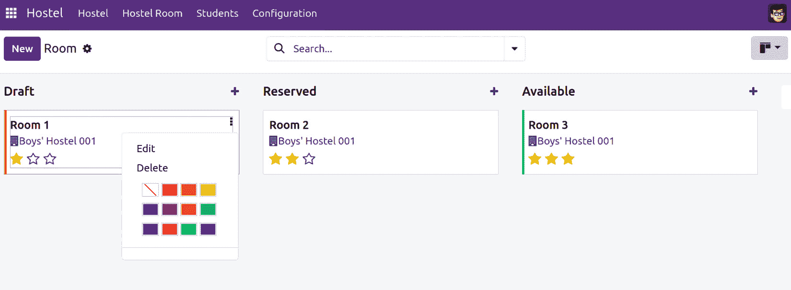

图 12.5 – 看板卡片选项

使用这种卡片设计，您可以直接从看板卡片设置流行度星标和颜色。

# 向看板视图中添加进度条

有时，您在列中有大量记录，很难清楚地了解特定阶段。可以使用进度条来显示任何列的状态。在本菜谱中，我们将根据`popularity`字段在基于看板的视图中显示进度条。

## 开始使用

对于这个菜谱，我们将使用前一个菜谱中的`my_hostel`模块。

## 如何操作...

要向看板列添加进度条，您需要在看板视图定义中添加一个`progressbar`标签，如下所示：

```py
<progressbar
    field="popularity"
    colors='{"low": "success", "medium": "warning", "high": "danger"}'/>
```

注意，看板列进度条是在 Odoo 版本 11 中引入的。在此之前的版本将不会显示列进度条。

重新启动服务器并更新模块以应用更改。然后，点击列上的加号图标。这将显示看板列上的进度条，如下面的截图所示：

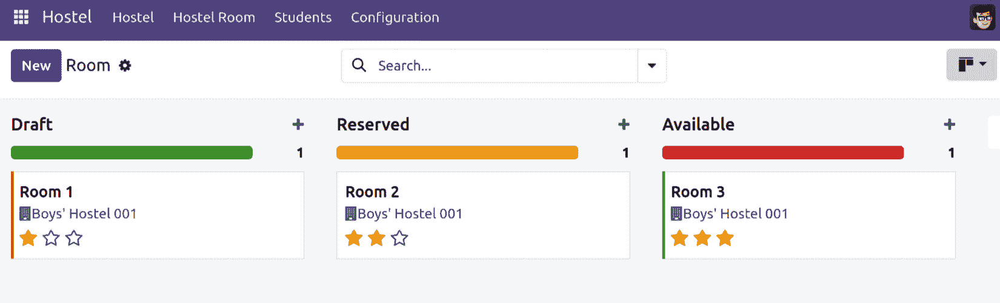

图 12.6 – 带进度条的看板视图

更新模块后，您将在看板列中添加一个进度条。进度条的颜色显示基于记录状态的记录数。您可以通过点击进度条中的一个来根据该状态过滤记录。

## 它是如何工作的...

看板列上的进度条是根据字段值显示的。进度条支持四种颜色，因此您不能显示超过四种状态。可用的颜色是绿色（成功）、蓝色（信息）、红色（危险）和黄色（警告）。然后，您需要将颜色映射到字段状态。在我们的例子中，我们映射了`priority`字段的三个状态，因为我们不希望为需求不高的房间显示进度条。

默认情况下，进度条在旁边显示记录数。您可以通过点击进度条来查看特定状态的总量。点击进度条还会突出显示该状态的业务卡片。除了记录数，您还可以显示整数或浮点字段的和。为此，您需要添加`sum_field`属性以及字段值，例如`sum_field="field_name"`。

# 创建服务器动作

服务器动作是 Odoo 自动化工具的基础。它们允许我们描述要执行的动作。然后，这些动作可以通过**事件触发器**调用，或者在某些时间条件满足时自动触发。

最简单的情况是让最终用户通过从**更多**按钮中选择来对文档执行操作。我们将为项目任务创建此类动作，以便我们可以通过将当前选定的任务加星并为其设置 3 天后的截止日期来**设置优先级**。

## 准备中

我们需要一个安装了项目应用的 Odoo 实例。我们还需要激活**开发者模式**。如果尚未激活，请在 Odoo**设置**仪表板中激活它。

## 如何操作...

要创建服务器动作并从**更多**菜单使用它，请按照以下步骤操作：

1.  从**设置**顶部菜单，选择**技术** | **动作** | **服务器动作**菜单项，然后在记录列表顶部点击**创建上下文动作**按钮，如图下截图所示：

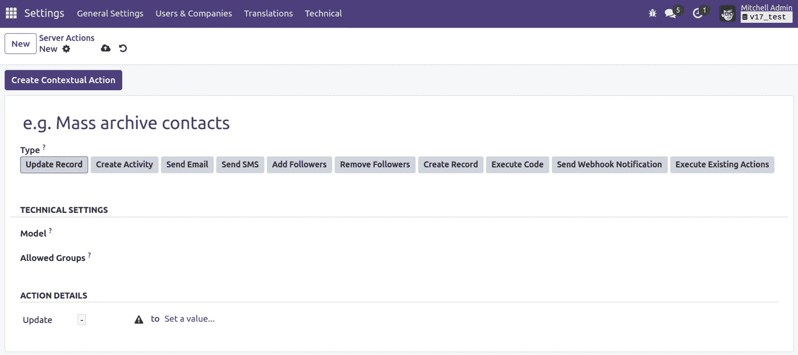

图 12.7 – 服务器动作表视图

1.  使用这些值填写服务器动作表单：

    +   **动作名称**：**设置为** **优先级**

    +   **模型**：**任务**

    +   **类型**：**更新记录**

1.  在服务器动作中，在`优先级`

1.  `值`

1.  `低`

下面的截图显示了输入的值：

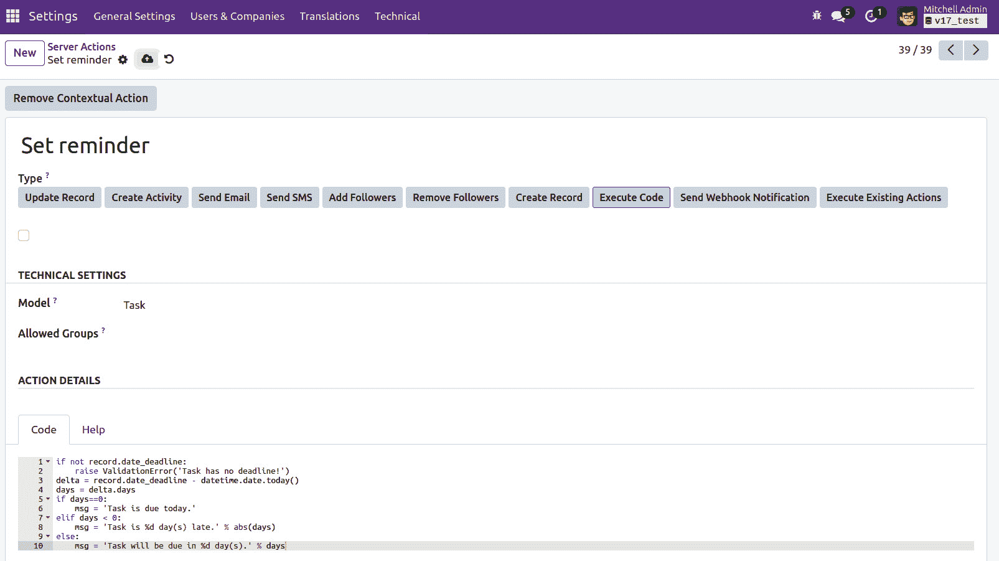

图 12.8 – 设置要写入的行

1.  保存服务器动作，然后点击左上角的**创建上下文动作**按钮，使其在项目任务的**更多**按钮下可用。

1.  要尝试它，请转到**项目**顶层菜单，打开**项目**，然后打开一个随机任务。通过点击操作，我们应该看到**设置优先级**选项，如图下所示。选择此选项将标记任务并将截止日期更改为现在起 3 天：

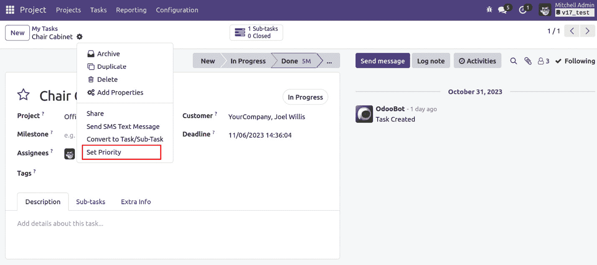

图 12.9 – 设置优先级的服务器操作

一旦您添加了服务器操作，您将在任务上设置优先级选项。点击它后，服务器操作星号将变为黄色，表示任务的优先级已提高。此外，服务器操作将更改截止日期。

## 它是如何工作的...

服务器操作在模型上工作，因此我们首先必须做的第一件事是选择我们想要与之一起工作的模型。在我们的示例中，我们使用了项目任务。

接下来，我们应该选择要执行的操作类型。有几个选项可供选择：

+   **更新记录** 允许您设置当前记录或另一条记录的值。

+   **创建活动** 允许您在所选记录上创建活动

+   **执行代码** 允许您编写任意代码，在没有任何其他选项足够灵活以满足我们的需求时执行。

+   **创建记录** 允许您在当前模型或另一个模型上创建新记录。

+   **发送电子邮件** 允许您选择电子邮件模板。当操作被触发时，将使用此模板发送电子邮件。

+   **执行现有操作** 可以用来触发客户端或窗口操作，就像点击菜单项时一样。

+   **添加关注者** 允许用户或频道订阅记录。

+   **创建下一个活动** 允许您创建一个新的活动。这将显示在聊天中。

+   **发送短信** 允许您发送短信。您需要选择短信模板。

注意

**发送短信文本消息** 是 Odoo 的一项收费服务。如果您想发送短信，则需要购买短信信用。

在我们的示例中，我们使用了`1`来标记任务，并在`datetime` Python 模块（[`docs.python.org/2/library/datetime.html`](https://docs.python.org/2/library/datetime.html)）上设置值以计算从今天起 3 天的日期。

可以使用任意 Python 表达式，以及其他几个可用的操作类型。出于安全原因，代码由`odoo/tools/safe_eval.py`文件中实现的`safe_eval`函数检查。这意味着某些 Python 操作可能不允许，但这很少成为问题。

当您向服务器操作添加下拉选项时，通常，它对所有内部用户都可用。但如果您只想向选定用户显示此选项，您可以将一个组分配给服务器操作。这在服务器操作表单视图的**安全**选项卡下可用。

## 还有更多...

Python 代码在受限环境中评估，以下对象可用于使用：

+   `env`：这是对`Environment`对象的引用，就像类方法中的`self.env`一样。

+   `model`：这是对服务器操作所作用的 `model` 类的引用。在我们的示例中，它等同于 `self.env['project.task']`。

+   `ValidationError`：这是对 `from odoo.exceptions import ValidationError` 的引用，允许阻止不希望的操作的验证。它可以用作 `raise Warning('Message!')`。

+   `Record` 或 `records`：这提供了对当前记录或记录的引用，允许你访问它们的字段值和方法。

+   `log`：这是一个用于在 `ir.logging` 模型中记录消息的函数，允许在数据库端记录操作。

+   `datetime`、`dateutil` 和 `time`：这些提供了对 Python 库的访问。

# 使用 Python 代码服务器操作

服务器操作有几种类型可供选择，但执行任意 Python 代码是最灵活的选项。当明智地使用时，它赋予用户从用户界面实施高级业务规则的能力，而无需创建特定的附加模块来安装该代码。

我们将通过实现一个向项目任务关注者发送提醒通知的服务器操作来演示这种类型的服务器操作。

## 准备工作

我们需要一个安装了项目应用程序的 Odoo 实例。

## 如何操作...

要创建 Python 代码服务器操作，请按照以下步骤操作：

1.  创建一个新的服务器操作。在 **设置** 菜单中，选择 **技术** | **操作** | **服务器操作** 菜单项，然后在记录列表的顶部点击 **创建** 按钮。

1.  使用以下值填写 **服务器操作** 表单：

    +   **操作名称**：**发送提醒**

    +   **基础模型**：**任务**

    +   **要执行的操作**：**执行代码**

1.  在 **Python 代码** 文本区域中，删除默认文本，并替换为以下代码：

    ```py
    if not record.date_deadline:
        raise ValidationError('Task has no deadline!')
    delta = record.date_deadline - datetime.date.today()
    days = delta.days
    if days==0:
        msg = 'Task is due today.'
    elif days < 0:
        msg = 'Task is %d day(s) late.' % abs(days)
    else:
        msg = 'Task will be due in %d day(s).' % days
    record.message_post(body=msg, subject='Reminder', subtype_xmlid='mail.mt_comment')
    ```

    以下截图显示了输入的值：

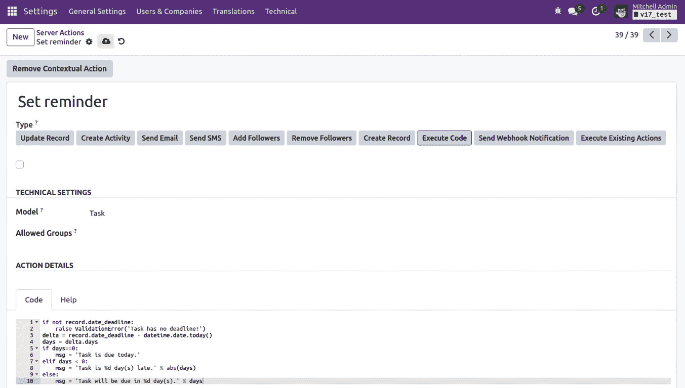

图 12.10 – 输入值的 Python 代码

1.  保存服务器操作，然后点击左上角的 **创建上下文操作** 以使其在项目任务的 **更多** 按钮下可用。

1.  现在，点击顶部的 **项目** 菜单，并选择 **搜索** | **任务** 菜单项。选择一个随机任务，为其设置截止日期，然后尝试在 **更多** 按钮下的 **发送提醒** 选项。

这与之前的菜谱工作方式相同；唯一的区别是，这个服务器操作将运行你的 Python 代码。一旦你在任务上运行了服务器操作，它将在聊天中放置一条消息。

## 它是如何工作的...

本章的 *创建服务器操作* 菜单提供了如何创建一般服务器操作的详细说明。对于这种特定类型的操作，我们需要选择 **执行代码** 选项，然后编写运行文本区域的代码。

代码可以有多个行，就像我们的食谱中那样，并且它在具有对当前记录对象或会话用户等对象的引用的上下文中运行。可用的引用在*创建服务器* *操作*食谱中已描述。

我们使用的代码计算从当前日期到截止日期的天数，并使用这个数字来准备一个合适的通知消息。最后一行在任务的留言墙上实际发布消息。`subtype='mt_comment'`参数对于发送电子邮件通知给关注者来说是必需的，就像我们默认使用`mt_note`时，发布一个内部笔记而不发送通知，就像我们使用了**记录内部笔记**按钮一样。请参考*第二十三章*，*在 Odoo 中管理电子邮件*，了解更多关于 Odoo 中邮件的信息。

## 更多内容...

Python 代码服务器操作是一个强大且灵活的资源，但与自定义附加模块相比，它们确实有一些限制。

由于 Python 代码是在运行时评估的，如果发生错误，堆栈跟踪可能不那么有信息性，并且可能更难调试。使用*第七章*，*调试模块*中展示的技术，在服务器操作的代码中插入断点也是不可能的，因此调试需要使用日志语句来完成。另一个担忧是，在尝试追踪模块代码中的行为原因时，可能找不到任何相关的内容。在这种情况下，这可能是由于服务器操作引起的。

在执行更密集的服务器操作使用时，交互可能相当复杂，因此建议妥善规划并保持其组织。

## 相关内容

+   参考第*第二十三章*，*在 Odoo 中管理电子邮件*，了解更多关于 Odoo 中邮件的信息。

# 使用基于时间条件的自动化操作

**自动化操作**可以用于根据时间条件自动触发操作。我们可以使用它们来自动对满足某些标准和时间条件的记录执行某些操作。

例如，我们可以为具有截止日期的项目任务提前一天触发提醒通知，如果有的话。让我们看看如何做到这一点。

## 准备工作

要遵循这个食谱，我们需要安装好**项目管理**应用（其技术名称为`project`）和`base_automation`，并且激活**开发者模式**。我们还需要本章“使用 Python 代码服务器操作”食谱中创建的服务器操作。

## 如何操作...

要在任务上创建具有定时条件的自动化操作，请按照以下步骤操作：

1.  在**设置**菜单中，选择**技术** | **自动化** | **自动化操作**菜单项，然后点击**创建**按钮。

1.  在`临近截止日期发送通知`中填写基本信息

1.  **模型**：**任务**

1.  在**触发器**字段中选择**基于时间条件**

1.  对于**待执行的操作**，选择**执行** **现有操作**

1.  要设置记录标准，点击`["&",["date_deadline","!=",False],["stage_id.fold","=",False]]`，然后点击**保存**按钮。当更改到另一个字段时，满足条件的记录数量信息将更新并显示**记录（s）**按钮。通过点击**记录**按钮，我们可以检查满足域表达式的记录列表。

1.  设置时间条件为`-``1` **天**。

1.  在**操作**选项卡下，在**要运行的服务器操作**中，点击**添加项目**，从列表中选择**发送提醒**；这应该之前已经创建。请参考以下截图：

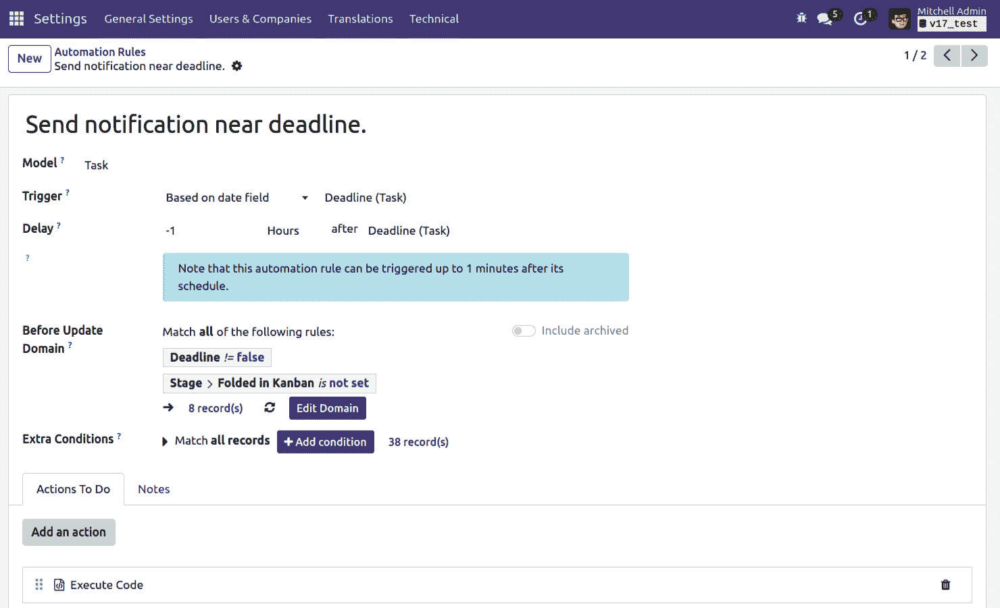

图 12.11 – 自动化操作表单视图

如果没有，我们仍然可以使用**创建**按钮创建要运行的服务器操作。

1.  点击**保存**以保存自动化操作。

1.  执行以下步骤以尝试它：

    1.  前往**项目**菜单，选择**搜索** | **任务**，并在带有过去日期的任务上设置截止日期。

    1.  前往**设置**菜单，点击**技术** | **自动化** | **计划操作**菜单项，在列表中找到**基本操作规则：检查并执行**操作，打开其表单视图，然后在左上角点击**手动运行**按钮。这强制检查定时自动化操作。以下截图显示了这一点。请注意，这应该在新建的演示数据库上工作，但在现有数据库中可能不会这样工作：

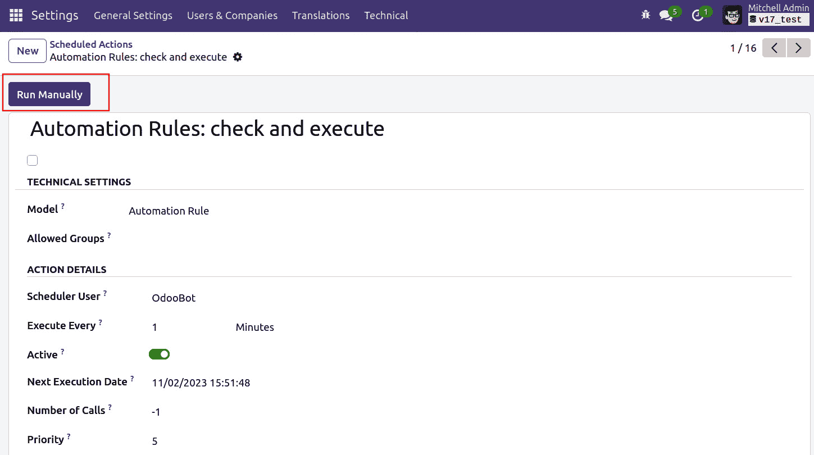

图 12.12 – 运行自动化操作（测试用）

1.  再次，前往**项目**菜单并打开您之前设置的带有截止日期的任务。检查消息板；您应该看到由服务器操作触发的自动化操作生成的通知。

    在添加基于时间的自动化操作以设置截止日期后，将在截止日期前 1 天向任务添加提醒消息。

## 它是如何工作的...

自动化操作作用于模型，可以通过事件或时间条件触发。首先，我们必须设置**模型**和**何时运行**的值。

两种方法都可以使用过滤器来缩小我们可以执行操作的记录。我们可以使用域表达式来实现这一点。您可以在*第九章*，*后端视图*中找到有关编写域表达式的更多信息。或者，您可以通过使用用户界面功能创建并保存项目任务的过滤器，然后复制自动生成的域表达式，从基于搜索过滤器列表的**设置**选择中选中它。

我们使用的领域表达式选择所有具有非空`Fold`标志的记录并未进行检查。没有`Fold`标志的阶段被视为正在进行中。这样，我们避免了在**完成**、**取消**或**关闭**阶段触发通知。

然后，我们应该定义时间条件——要使用日期字段以及何时触发操作。时间段可以是分钟、小时、天或月，为时间段设置的数字可以是正数，表示日期之后的时段，或负数，表示日期之前的时段。当使用以天为单位的时间段时，我们可以提供一个定义工作日并可用于日计数的资源日历。

这些操作由**检查操作规则**计划作业进行检查。请注意，默认情况下，这是每 4 小时运行一次。这对于在日或月尺度上工作的操作是合适的，但如果你需要在小时间尺度上工作的操作，你需要将运行间隔更改为更小的值。

对于符合所有标准且触发日期条件（字段日期加上间隔）在最后一次操作执行之后记录，将触发操作。这是为了避免重复触发相同的操作。这也是为什么在计划操作尚未触发的数据库中手动运行前面的操作将起作用，但在已经由调度器运行的数据库中可能不会立即起作用的原因。

一旦自动化操作被触发，**操作**选项卡会告诉你应该发生什么。这可能是一系列服务器操作，例如更改记录上的值、发布通知或发送电子邮件。

## 更多...

这些类型的自动化操作在达到一定的时间条件时触发。这不同于在条件仍然为真时定期重复执行操作。例如，自动化操作无法在截止日期过后每天发布提醒。

此类操作可以由计划操作执行，这些操作存储在`ir.cron`模型中。然而，计划操作不支持服务器操作；它们只能调用模型对象的现有方法。因此，要实现自定义操作，我们需要编写一个附加模块，添加底层 Python 方法。

作为参考，该模型的名称为`base.action.rule`。

## 参见

+   有关编写领域表达式的更多详细信息，请参阅*第九章*，*后端视图*。

# 在事件条件下使用自动化操作

商业应用为业务操作提供记录系统，但也预期支持特定于组织用例的动态业务规则。

将这些规则雕刻到自定义附加模块中可能不够灵活，并且功能用户难以触及。由事件条件触发的自动操作可以弥合这一差距，并为自动化或强制执行组织的程序提供强大的工具。例如，我们将对项目任务进行验证，以确保只有项目经理可以更改任务到**完成**阶段。

## 准备工作

要遵循此配方，您需要已经安装了项目管理应用程序。您还需要激活**开发者模式**。如果尚未激活，请在 Odoo 的**关于**对话框中激活它。

## 如何操作...

要创建一个在任务上有事件条件的自动操作，请按照以下步骤操作：

1.  在**设置**菜单中，选择**技术** | **自动化** | **自动操作**菜单项，然后点击**创建**按钮。

1.  在`Validate` `Closing Tasks`中填写基本信息

1.  `阶段 ID`

1.  在代码编辑器中的`[('stage_id.name', '!=', 'Done')]` – 保存

1.  对于代码编辑器中的`[('stage_id.name', '=', 'Done')]`域，保存，如下所示截图：

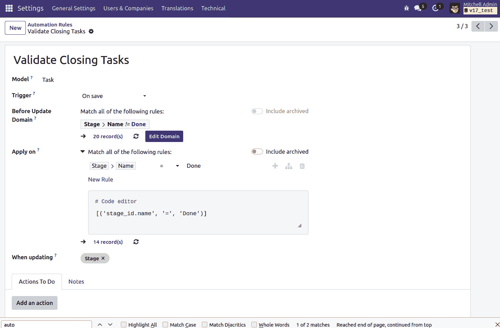

图 12.13 – 自动操作表单视图

1.  在**Actions**标签页中，点击**Add an item**。在列表对话框中，点击**Create**按钮以创建一个新的服务器操作。

1.  使用以下值填写服务器操作表单，然后点击`Validate` `Closing tasks`

1.  **模型**: **任务**

1.  **要执行的操作**: **执行代码**

1.  **Python Code**: 输入以下代码：

    ```py
    if user != record.project_id.user_id:
        raise Warning('Only the Project Manager can close Tasks')
    ```

以下截图显示了输入的值：

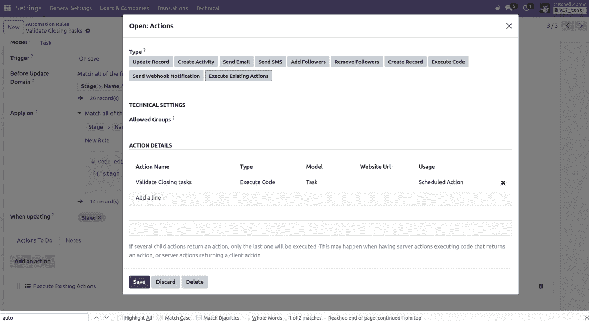

图 12.14 – 添加子操作

1.  点击`Demo`用户，我们正在使用`Administrator`用户，我们的自动操作应该被触发，并且我们的警告消息应该阻止更改。

## 它是如何工作的...

我们首先为我们的自动操作命名，并设置它应该与之一起工作的模型。对于我们需要的行为类型，我们应该选择**On Save**，但**On Creation**、**On Creation & Update**、**On Deletion**和**基于表单修改**选项也是可用的。

接下来，我们定义过滤器以确定我们的操作何时应该被触发。**On Save**操作允许我们定义两个过滤器——一个用于更改记录之前检查，另一个用于更改记录之后检查。这可以用来表达转换——检测记录从*状态 A*变为*状态 B*。在我们的例子中，我们希望在未完成的任务变为*完成*阶段时触发操作。**On Save**操作是唯一允许这两个过滤器的操作；其他操作类型只允许一个过滤器。

重要提示

需要注意的是，我们的示例条件仅适用于英语语言用户。这是因为**阶段名称**是一个可翻译字段，不同语言可能有不同的值。因此，应避免或谨慎使用可翻译字段的过滤器。

最后，我们创建并添加一个（或多个）服务器操作，以便在自动化操作被触发时执行我们想要的任何操作。在这种情况下，我们选择演示如何实现自定义验证，利用 Python 代码服务器操作使用`Warning`异常来阻止用户的更改。

## 更多内容...

在*第五章*中，*基本服务器端开发*，我们看到了如何重新定义模型的`write()`方法以在记录更新时执行操作。记录更新上的自动化操作提供了另一种实现方式，具有一些优点和缺点。

在众多好处中，定义一个由存储计算字段的更新触发的操作很容易，这在纯代码中很难实现。还可能定义记录的过滤器，并为不同的记录或满足不同条件的记录定义不同的规则，这些条件可以用搜索域表示。

然而，与模块内 Python 业务逻辑代码相比，自动化操作可能存在一些缺点。如果规划不当，提供的灵活性可能导致复杂的交互，难以维护和调试。此外，写操作的前后过滤操作带来了一些开销，如果在执行敏感操作时可能会成为问题。

# 创建基于 QWeb 的 PDF 报告

当与外界沟通时，通常需要从数据库中的记录生成 PDF 文档。Odoo 使用与表单视图相同的模板语言：QWeb。

在本食谱中，我们将创建一个 QWeb 报告来打印关于当前被学生借用的房间信息。本食谱将重用本章前面提到的*在 Kanban 视图中添加进度条*食谱中展示的模型。

## 准备工作

如果您还没有这样做，请按照*第一章*中描述的步骤安装`wkhtmltopdf`，*安装 Odoo 开发环境*；否则，您将无法得到您努力工作后的闪亮 PDF。

此外，请确保`web.base.url`配置参数（或`report.url`）是一个可以从您的 Odoo 实例访问的 URL；否则，报告将需要很长时间才能生成，结果看起来也会很奇怪。

## 如何操作...

请按照以下步骤操作：

1.  在本食谱中，我们将向`hostel.student`添加一个报告，打印出学生所借的学生名单。我们需要向学生模型添加一个`one2many`字段，与`hostel.room`模型相关联，如下例所示：

    ```py
    class HostelStudent(models.Model):
        _name = "hostel.student"
        _description = "Hostel Student Information"
        name = fields.Char("Student Name")
        gender = fields.Selection([("male", "Male"),
            ("female", "Female"), ("other", "Other")],
            string="Gender", help="Student gender")
        active = fields.Boolean("Active", default=True,
    reports/hostel_room_detail_report_template.xml, as follows:

    ```

    <?xml version="1.0" encoding="utf-8"?>

    <odoo>

    <template id="hostel_room_detail_reports_template">

    <t t-call="web.html_container">

    <t t-foreach="docs" t-as="doc">

    <t t-call="web.internal_layout">

    <div class="page">

    <h1>房间名称: <t t-esc="doc.name"/></h1>

    <h1>房间号: <t t-esc="doc.name"/></h1>

    <table class="table table-condensed">

    <thead>

    <tr>

    <th>学生姓名</th>

    <th>性别</th>

    </tr>

    <thead>

    <tbody>

    <tr t-foreach="doc.student_ids" t-as="student" >

    <td><t t-esc="student.name" /></td>

    <td><t t-esc="student.gender" /></td>

    </tr>

    </tbody>

    </table>

    </div>

    </t>

    </t>

    </t>

    </template>

    reports/hostel_room_detail_report.xml，如下例所示：

    ```py
    <?xml version="1.0" encoding="utf-8"?>
    <odoo>
        <record id="report_hostel_room_detail" model="ir.actions.report">
            <field name="name">Room detail report</field>
            <field name="model">hostel.room</field>
            <field name="report_type">qweb-pdf</field>
            <field name="binding_model_id" ref="model_hostel_room"/>
            <field name="report_name">my_hostel.hostel_room_detail_reports_template</field>
            <field name="report_file">my_hostel.hostel_room_detail_reports_template</field>
        </record>
    </odoo>
    ```

    ```py

    ```

1.  将这两个文件添加到附加组件的清单中，如下例所示：

    ```py
    ...
    "depends": ["base"],
        "data": [
            "security/hostel_security.xml",
            "security/ir.model.access.csv",
            "data/room_stages.xml",
            "views/hostel.xml",
            "views/hostel_amenities.xml",
            "views/hostel_room.xml",
            "views/hostel_room_stages_views.xml",
            "views/hostel_student.xml",
            "views/hostel_categ.xml",
            "reports/hostel_room_detail_report_template.xml",
            "reports/hostel_room_detail_report.xml",
        ],
    ```

现在，当打开房间表单视图或从列表视图中选择学生时，您应该可以在下拉菜单中找到打印房间详细报告的选项，如下面的截图所示：

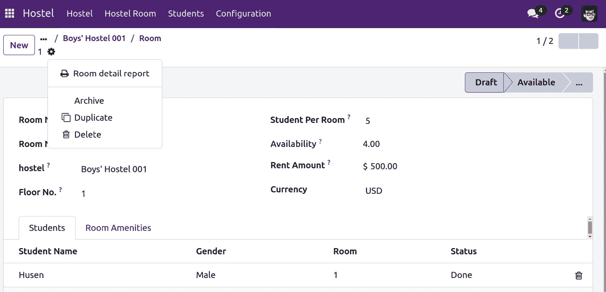

图 12.15 – 报告的打印操作

## 它是如何工作的...

在*步骤 1*中，我们添加了一个`one2many` `hostel_student_ids`字段。该字段将包含学生的房间记录。我们将在 QWeb 报告中使用它来列出学生已预订的房间。

在*步骤 2*中，我们定义了 QWeb 模板。模板的内容将用于生成 PDF。在我们的例子中，我们使用了一些基本的 HTML 结构。我们还使用了`t-esc`和`t-foreach`等属性，这些属性用于在报告中生成动态内容。现在不必担心`template`元素内的这种语法。这个主题将在*第十四章*的*创建或修改模板 – QWeb*菜谱中详细讨论，*CMS 网站开发*。在模板中需要注意的另一件重要事情是布局。在我们的例子中，我们在模板中使用了`web.internal_layout`，这将生成具有最小页眉和页脚的最终 PDF。如果您想要使用公司标志和公司信息的 informative 页眉和页脚，请使用`web.external_layout`布局。我们还向`docs`参数添加了一个`for`循环，当用户从列表视图打印时，它将用于为多个记录生成报告。

在*步骤 3*中，我们通过`<record>`标签在另一个 XML 文件中声明了报告。它将注册报告的`ir.actions.report`模型。这里的关键部分是您将`report_name`字段设置为定义的模板的完整 XML ID（即`modulename.record_id`）；否则，报告生成过程将失败。`model`字段确定报告操作的记录类型，而`name`字段是在打印菜单中显示给用户的名称。

注意

在 Odoo 的先前版本中，使用`<report>`标签来注册报告。但从版本 v14 开始，它已被弃用，您需要使用`<record>`标签创建`ir.actions.report`记录。`<report>`标签在 Odoo v14 中仍然支持以实现向后兼容，但使用它将在日志中显示警告。

通过将 `report_type` 设置为 `qweb-pdf`，我们请求我们的视图生成的 HTML 通过 `wkhtmltopdf` 运行，向用户交付 PDF。在某些情况下，你可能想使用 `qweb-html` 在浏览器中渲染 HTML。

## 更多...

报告的 HTML 中存在一些对布局至关重要的标记类。确保将所有内容包裹在一个设置了 `page` 类的元素中。如果你忘记了这一点，你将什么也看不到。要为你的记录添加标题或页脚，请使用 `header` 或 `footer` 类。

此外，记得这是 HTML，所以请充分利用 *CSS 属性*，如 `page-break-before`、`page-break-after` 和 `page-break-inside`。

你会注意到，我们所有的模板主体都被包裹在两个设置了 `t-call` 属性的元素中。我们将在*第十四章* *CMS 网站开发* 中稍后探讨这个属性的机制，但你必须在你的报告中做同样的事情。这些元素确保 HTML 生成指向所有必要 CSS 文件的链接，并包含一些用于报告生成的其他数据。虽然 `web.html_container` 没有替代品，第二个 `t-call` 可以是 `web.external_layout`。区别在于外部布局已经包含显示公司标志、公司名称和一些你期望从公司外部沟通中获得的其他信息的标题和页脚，而内部布局只提供带有分页、打印日期和公司名称的标题。为了保持一致性，始终使用这两个之一。

重要提示

注意，`web.internal_layout`、`web.external_layout`、`web.external_layout_header` 和 `web.external_layout_footer`（后两个由外部布局调用）本身只是视图，你已经知道如何通过继承来更改它们。要使用模板元素进行继承，请使用 `inherit_id` 属性。

# 从看板卡片管理活动

Odoo 使用活动来对记录上的操作进行调度。这些活动可以在表单视图和看板视图中进行管理。在本菜谱中，我们将学习如何从看板视图卡片中管理活动。我们将向房间看板卡片添加活动小部件。

## 开始

对于这个菜谱，我们将使用之前菜谱中的 `my_hostel` 模块。

## 如何操作...

按照以下步骤从看板视图添加和管理活动：

1.  将邮件依赖项添加到 `manifest` 文件中：

    ```py
    'depends': ['base', 'mail'],
    ```

1.  在 `hostel.room` 模型中继承活动混入：

    ```py
    class HostelRoom(models.Model):
        _name = "hostel.room"
        _description = "Hostel Room Information"
        _rec_name = "room_no"
    activity_state field to the Kanban view under the color field:

    ```

    `<field name="color" />`

    在看板模板中的 `activity_ids` 字段。将此字段添加到流行度字段下，如图所示：

    ```py
    <div>
        <field name="popularity" widget="priority"/>
    </div>
    <div>
        <field name="activity_ids" widget="kanban_activity"/>
    my_hostel module to apply the change. Open the Rooms Kanban view; you will see the activity manager on the Kanban card, as shown in the following screenshot:
    ```

    ```py

    ```

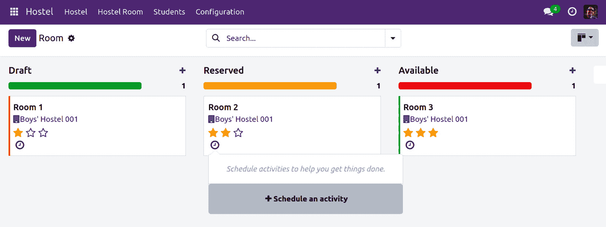

图 12.16 – 卡片中的活动管理器

如你所见，在应用本菜谱中的代码后，你将能够从看板卡片管理活动。你现在也可以从看板卡片处理或创建活动。

## 它是如何工作的...

在 *步骤 1* 中，我们将依赖项添加到我们模块的清单中。我们这样做是因为与活动相关的所有实现都是 `mail` 模块的一部分。如果没有安装 `mail`，我们无法在我们的模型中使用活动。

在 *步骤 2* 中，我们将 `activity mixin` 添加到 `hostel.room` 模型中。这将启用房间记录的活动。添加 `mail.activity.mixin` 将添加活动所需的所有字段和方法。我们还添加了 `mail.thread` 混合，因为活动在用户处理活动时记录消息。如果您想了解更多关于此活动的信息，请参阅 *第二十三章* 的 *在 Odoo 文档上管理活动* 菜谱，*在 Odoo 中管理电子邮件*。

在 *步骤 3* 中，我们将 `activity_state` 字段添加到看板视图中。此字段由活动小部件用于显示颜色小部件。颜色将代表即将到来的活动的当前状态。

在 *步骤 4* 中，我们添加了活动小部件本身。它使用 `activity_ids` 字段。在我们的示例中，我们在一个单独的 `<div>` 标签中添加了活动小部件，但您可以根据您的设计要求将其放在任何位置。有了活动小部件，您可以直接从看板卡片中安排、编辑和处理活动。

## 更多内容...

在本章的 *在 Kanban 视图中添加进度条* 菜谱中，我们根据 `popularity` 字段显示了一个 Kanban 进度条。但我们也可以根据即将到来的活动的状态显示进度条：

```py
<progressbar field="activity_state"
    colors='{"planned": "success",
             "today": "warning",
             "overdue": "danger"}'/>
```

这将根据即将到来的活动的状态显示进度条。基于状态的进度条在 Odoo 的多个视图中使用。

## 相关内容

+   如果您想了解更多关于邮件线程的信息，请参阅 *第二十三章* 的 *在 Odoo 文档上管理聊天* 菜谱，*在 Odoo 中管理电子邮件*。

+   如果您想了解更多关于活动的信息，请参阅 *第二十三章* 的 *在 Odoo 文档上管理活动* 菜谱，*在 Odoo 中管理电子邮件*。

# 向表单视图中添加状态按钮

Odoo 使用状态按钮在表单视图中直观地关联两个不同的对象。它用于显示相关记录的一些基本关键绩效指标（KPIs）。它还用于重定向并打开另一个视图。在本菜谱中，我们将向房间的表单视图中添加一个状态按钮。此状态按钮将显示房间记录的数量，并且点击它时，我们将被重定向到看板视图列表。

## 开始

对于这个菜谱，我们将使用前一个菜谱中的 `my_hostel` 模块。

## 如何做到这一点...

按照以下步骤向宿舍的表单视图中添加状态按钮：

1.  将 `rooms_count` 计算字段添加到 `hostel.hostel` 模型中。此字段将计算宿舍中活跃房间的数量：

    ```py
    rooms_count = fields.Integer(compute="_compute_rooms_count")
    def _compute_rooms_count(self):
            room_obj = self.env['hostel.room']
            for hostel in self:
    hostel.hostel model. Prepend it just inside the <sheet> tag:

    ```

    `<div class="oe_button_box" name="button_box">`

    `<button class="oe_stat_button" name="%(action_hostel_room)d" type="action" icon="fa-building" context="{'search_default_hostel_id': active_id}">`

    `<field string="房间" name="rooms_count" widget="statinfo"/>`

    `</button>`

    在`my_hostel`模块中应用更改。打开任何宿舍的表单视图；您将找到状态按钮，如下面的截图所示：

    ```py

    ```

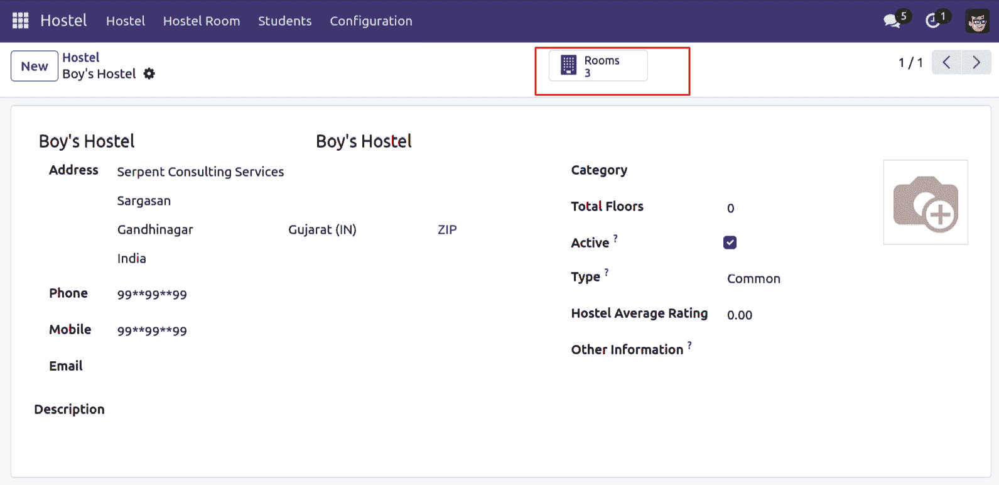

图 12.17 – 宿舍表单视图中的状态按钮

点击状态按钮后，您将被重定向到**房间**看板视图。在这里，您将只看到当前宿舍的订单。

## 它是如何工作的...

在*步骤 1*中，我们添加了一个计算字段，用于计算当前宿舍的房间记录数量。此字段的值将用于状态按钮以显示计数。如果您想了解更多关于计算的信息，请参阅*第四章*中的*向模型添加计算字段*配方，*应用程序模型*。

在*步骤 2*中，我们在`hostel.hostel`模型的表单视图中添加了状态按钮。状态按钮有一个特定的语法和位置。所有状态按钮需要做的就是将其包裹在具有`oe_button_box`类的`<div>`标签下。状态按钮框需要放置在`<sheet>`标签内。请注意，我们在按钮框上使用了`name`属性。当您想添加一个新的状态时，这个`name`属性非常有用，但您将需要添加一个带有`<button>`标签和`oe_stat_button`类的状态按钮。内部，状态按钮只是一个具有不同用户界面的表单视图按钮。这意味着它支持所有由正常按钮支持的属性，例如操作、图标和上下文。

在我们的例子中，我们使用了房间订单的动作，这意味着当用户点击状态按钮时，他们将被重定向到房间记录，但它将显示所有房间的记录。我们只想显示当前房间的房间记录。为此，我们必须传递`search_default_hostel_id`。这将应用当前房间的默认过滤器。请注意，`hostel_id`是`hostel.room`模型上的`many2one`字段。如果您想根据另一个字段进行筛选，请在`context`中使用它，并在其前加上`search_default_`前缀。

状态按钮经常被使用，因为它们非常有用，并显示与记录相关的总体统计信息。您可以使用它们来显示与当前记录相关的所有信息。例如，在联系记录中，Odoo 显示状态按钮，显示与当前联系发票总数、潜在客户数量、订单数量等相关的信息。

## 参见

+   要了解更多关于按钮的信息，请参阅*第九章*中的*在表单中添加按钮*配方，*后端视图*。

+   要了解更多关于操作的信息，请参阅*第九章*中的*添加菜单项和窗口操作*配方，*后端视图*。

# 启用记录的存档选项

Odoo 提供了内置功能，以启用记录的存档和取消存档选项。这将帮助用户隐藏不再重要的记录。在这个配方中，我们将为房间添加一个存档/取消存档选项。一旦房间不可用，我们就可以存档房间。

## 入门指南

对于这个配方，我们将使用前一个配方中的`my_hostel`模块。

## 如何操作...

存档和取消存档主要自动工作。如果模型有一个名为`active`的布尔字段，则记录上的选项可用。我们已经在`hostel.room`模型中有一个`active`字段。但如果你还没有添加它，请按照以下步骤添加`active`字段：

1.  在`hostel.room`模型中添加一个名为`active`的布尔字段，如下所示：

    ```py
    active field to the form view:

    ```

    `<field name="active" invisible="1"/>`

    ```py

    ```

更新`my_hostel`模块以应用更改。现在，你将能够存档房间。**存档**选项在**操作**下拉菜单中可用，如下面的截图所示：

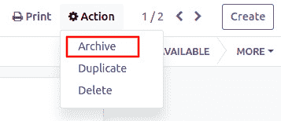

图 12.18 – 表单视图上的存档选项

一旦你存档了一个记录，你希望在 Odoo 的任何地方都能看到该记录。要查看它，你需要从搜索视图中应用一个过滤器。

## 它是如何工作的...

在 Odoo 中，名为`active`的布尔字段具有特殊用途。如果你在你的模型中添加了一个`active`字段，那么在`active`字段中值为`false`的记录将不会在 Odoo 的任何地方显示。

在*步骤 1*中，我们在`hostel.room`模型中添加了一个`active`字段。请注意，我们在这里保留了默认值`True`。如果我们不添加这个默认值，新创建的记录将默认以存档模式创建，即使在最近创建的情况下，也不会在视图中显示。

在*步骤 2*中，我们在表单视图中添加了`active`字段。如果你不在表单视图中添加`active`字段，存档/取消存档选项将不会在`invisible`属性中显示，从而在表单视图中隐藏它。

在我们的例子中，一旦你存档了一个房间，该房间将不会在树形视图或任何其他视图中显示。在宿舍记录的`many2one`下拉菜单中，该房间也不会显示。如果你想取消存档该房间，那么你需要从搜索视图中应用一个过滤器来显示存档记录，然后恢复该房间。

## 还有更多...

如果你的模型有一个名为`active`的布尔字段，`search`方法将不会返回存档记录。如果你想搜索所有记录，无论它们是否存档，那么在上下文中传递`active_test`，如下所示：

```py
self.env['hostel.room'].with_context(active_test=False).search([])
```

注意，如果存档记录与另一个记录相关联，它将在相关表单视图中显示。例如，假设你有“房间 1”。然后，你存档“房间 1”，这意味着从现在起，你无法在房间中选择“房间 1”。但是如果你打开“订单 1”，你会看到存档的“房间 1”。
