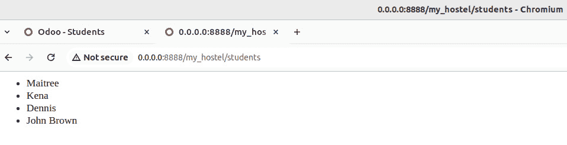
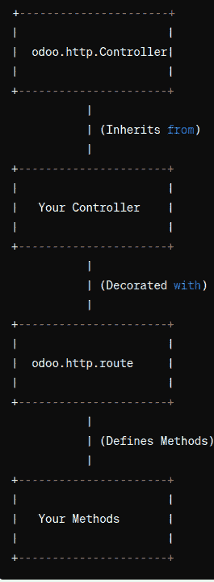
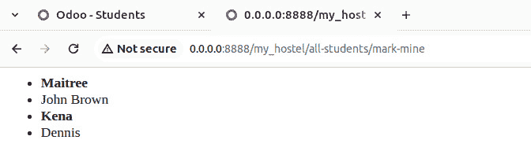
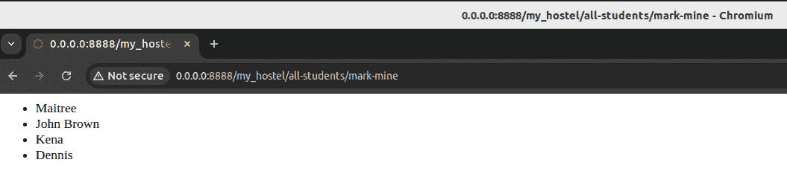
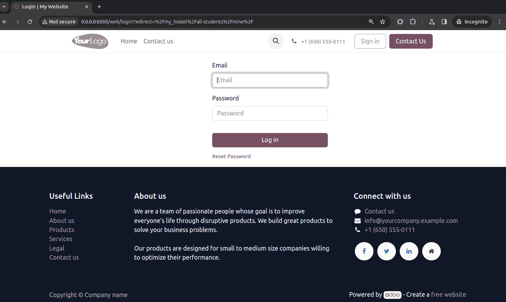
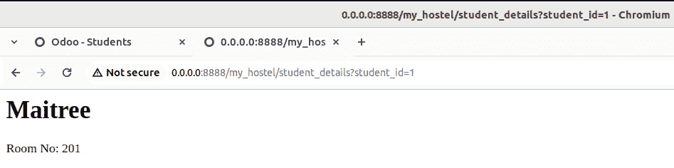
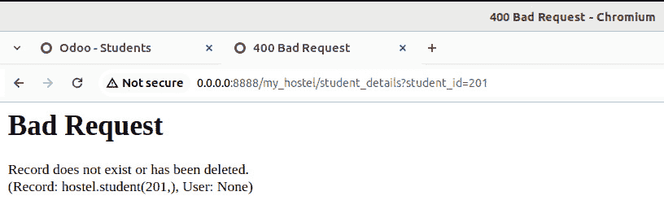
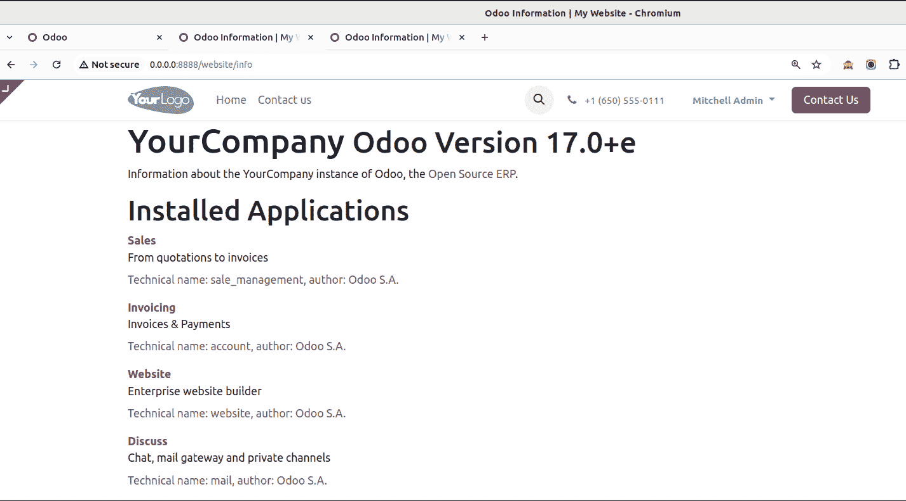
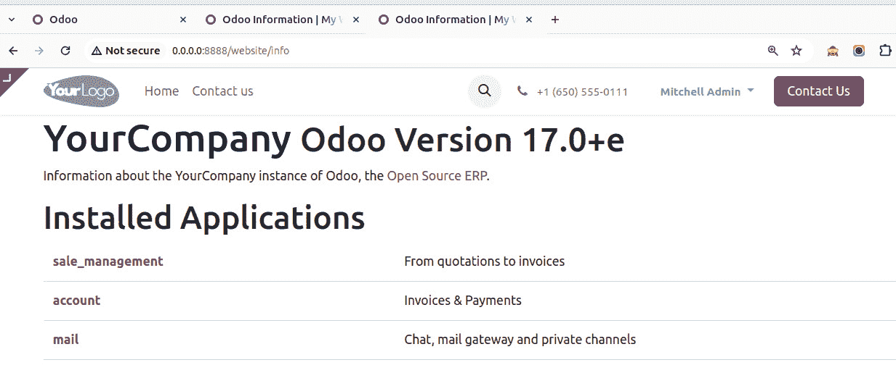
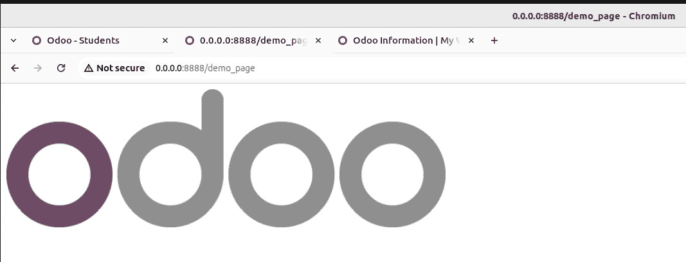

# 13

# 网络服务器开发

在本章中，我们将介绍 Odoo 网络服务器部分的基础知识。请注意，这将涵盖基本方面；对于高级功能，您应参考 *第十四章*，*CMS* *网站开发*。

Odoo 网络服务器是 Odoo 框架的一个关键组件，负责处理网络请求并向用户提供服务网络界面。

以下是 Odoo 网络服务器的关键方面：

+   **网络界面和模块**: 网络服务器提供了一个用户友好的网络界面，用于访问和交互 Odoo 应用程序。用户可以通过此界面浏览不同的模块，访问数据，并执行各种业务操作。

+   **HTTP 服务器**: Odoo 使用 HTTP 服务器来处理网络请求。它可以配置为与流行的网络服务器（如 Nginx 或 Apache）一起工作，或者可以运行其内置的 HTTP 服务器。

+   **Werkzeug**: Werkzeug 是一个 Python 的 **WSGI**（**Web Server Gateway Interface**）库，Odoo 使用它来处理 HTTP 请求和响应。Werkzeug 帮助路由请求、处理会话以及管理其他与网络相关的任务。

+   **控制器和路由**: Odoo 使用控制器来处理不同的网络请求，并将它们路由到适当的控制器和方法。路由机制确保请求被导向正确的模块和功能。

+   **视图和模板**: Odoo 使用视图和模板来定义数据在网页界面中的呈现方式。视图确定页面的结构，模板提供 HTML 和呈现逻辑以渲染数据。

+   **业务逻辑**: 网络服务器与 Odoo 的业务逻辑紧密集成。它与后端通信以获取和更新数据，确保网络界面反映了业务应用程序的最新状态。

+   **安全性**: 安全性是 Odoo 网络服务器的一个关键方面。它包括认证、授权和会话管理等功能，以确保用户具有适当的访问级别，并且他们的系统交互是安全的。

+   **JavaScript 和 CSS**: Odoo 网络界面依赖于 JavaScript 和 CSS 来增强用户体验并提供动态和响应式功能。这包括表单验证、交互式元素和实时更新。

+   **RESTful API**: 网络服务器还提供了一个 RESTful API，允许外部应用程序以编程方式与 Odoo 交互。这可以实现与第三方系统的集成以及自定义应用程序的开发。

+   **定制和扩展**: 开发者可以扩展和定制 Odoo 网络服务器以满足特定的业务需求。这包括创建自定义模块、视图和控制器。

理解 Odoo 网络服务器对于与 Odoo 一起工作的开发者和管理员来说至关重要，他们需要根据业务独特的需求部署、配置和定制系统。

Werkzeug ([`werkzeug.palletsprojects.com/en/2.3.x`](https://werkzeug.palletsprojects.com/en/2.3.x)) 是一个用于 Python 的 WSGI 库，Odoo 使用它来处理 HTTP 请求和响应。WSGI 是一个规范，用于描述 Python 中 Web 服务器和 Web 应用程序之间的通信。Werkzeug 提供了一套实用工具和类，使得与 WSGI 应用程序一起工作变得更加容易。以下是 Werkzeug 在 Odoo 上下文中使用的一些详细信息：

+   代表传入 HTTP 请求的 `Request` 对象。在 Odoo 中，此对象用于从传入的 HTTP 请求中提取信息，例如表单数据、查询参数和头部信息。

+   Werkzeug 中的 `Response` 对象用于创建 HTTP 响应。Odoo 利用此功能构建并发送响应回客户端，包括渲染网页或响应 AJAX 请求提供数据。

+   **路由**：Werkzeug 实现了简单的 URL 路由。在 Odoo 中，路由机制用于将传入的请求映射到适当的控制器方法或视图。这有助于将请求定向到 Odoo 应用程序中的正确功能。

+   **中间件**：可以使用 Werkzeug 将中间件组件添加到 Odoo 应用程序中。中间件位于 Web 服务器和 Odoo 应用程序之间，可以执行诸如身份验证、日志记录或修改请求和响应等任务。

+   **URL 构建**：Werkzeug 提供了一个 URL 构建功能，有助于在 Odoo 应用程序的不同路由中生成 URL。这对于在 Web 界面中动态创建链接和重定向至关重要。

+   **会话管理**：Werkzeug 支持会话管理，Odoo 利用它来处理用户会话。这对于在多个请求之间维护用户状态以及确保用户身份验证等安全功能非常重要。

+   **常用任务的实用工具**：Werkzeug 包含各种实用工具，简化了常见的 Web 开发任务。Odoo 利用这些实用工具执行诸如解析表单数据、处理文件上传和管理 Cookie 等任务。

+   **错误处理**：Werkzeug 提供了处理错误（包括 HTTP 错误响应）的机制。Odoo 使用此机制确保在需要时向客户端返回适当的错误消息。

在 Odoo 的上下文中使用 Werkzeug，开发者通常通过 Odoo 模块中定义的控制器和视图与这些功能交互。了解 Werkzeug 对希望扩展或自定义 Odoo 的开发者有益，因为它提供了处理应用程序内 HTTP 请求和响应的底层机制的见解。然而，在日常的 Odoo 开发中，开发者通常在更高的层次上使用 Odoo 框架本身，而不直接与 Werkzeug 交互。

在本章中，我们将涵盖以下主题：

+   从网络中访问路径

+   限制对可网络访问路径的访问

+   消费传递给您的处理器的参数

+   修改现有的处理器

+   提供静态内容

# 技术要求

本章的技术要求包括在线 Odoo 平台。

本章中使用的所有代码都可以从 GitHub 仓库[`github.com/PacktPublishing/Odoo-17-Development-Cookbook-Fifth-Edition/tree/main/Chapter13`](https://github.com/PacktPublishing/Odoo-17-Development-Cookbook-Fifth-Edition/tree/main/Chapter13)下载。

## 使一个路径可通过网络访问

使一个路径可通过网络访问意味着定义入口点或 URL，用户可以通过这些 URL 访问应用程序。这对于任何 Web 开发项目都是基本的，因为它决定了用户如何与系统交互。在这个菜谱中，我们将探讨如何使类似[`yourserver/path1/path2`](http://yourserver/path1/path2)的 URL 对用户可访问。这可以是网页或返回任意数据以供其他程序消费的路径。在后一种情况下，你通常会使用 JSON 格式来消费参数并提供你的数据。

## 准备工作

我们将使用`hostel.student`模型，这是我们之前在*第四章*“应用模型”中讨论过的；因此，如果你还没有这样做，请从[`github.com/PacktPublishing/Odoo-17-Development-Cookbook-Fifth-Edition/tree/main/Chapter13/00_initial_module`](https://github.com/PacktPublishing/Odoo-17-Development-Cookbook-Fifth-Edition/tree/main/Chapter13/00_initial_module)获取初始模块，这样你才能跟随示例。

我们希望允许任何用户查询宿舍中所有学生的完整列表。此外，我们还想通过 JSON 请求向程序提供相同的信息。让我们看看如何实现它。

## 如何做...

我们需要添加控制器，这些控制器按照惯例放入一个名为`controllers`的文件夹中：

1.  添加一个`controllers/main.py`文件，其中包含我们页面的 HTML 版本，如下所示：

    ```py
    from odoo import http
    from odoo.http import request
        class Main(http.Controller):
            @http.route('/my_hostel/students', type='http', auth='none')
        def students(self):
            students = request.env['hostel.student'].sudo().search([])
            html_result = '<html><body><ul>'
            for student in students:
                html_result += "<li> %s </li>" % student.name
            html_result += '</ul></body></html>'
            return html_result
    ```

1.  添加一个函数以 JSON 格式提供相同的信息，如下例所示：

    ```py
    @http.route('/my_hostel/students/json', type='json', auth='none')
        def students_json(self):
            records = request.env['hostel.student'].sudo().search([])
            return records.read(['name'])
    ```

1.  添加`controllers/__init__.py`文件，如下所示：

    ```py
    from . import main
    ```

1.  将`controllers`导入到你的`my_hostel/__init__.py`文件中，如下所示：

    ```py
    from . import controllers
    ```

重新启动你的服务器后，你可以在浏览器中访问`/my_hostel/students`，你将看到一个学生姓名的平面列表。



图 13.1 – 学生列表

要测试 JSON-RPC 部分，你必须构建一个 JSON 请求。一个简单的方法是使用以下命令在命令行接收输出：

```py
curl -i -X POST -H "Content-Type: application/json" -d "{}"
localhost:8069/my_hostel/students/json
```

如果你此时遇到`404`错误，可能是因为你的实例上有多个数据库可用。如果是这样，Odoo 无法确定哪个数据库是用来处理请求的。

使用`--db-filter='^yourdatabasename$'`参数强制 Odoo 使用你安装模块的确切数据库。路径现在应该是可访问的。

## 它是如何工作的...

这里有两个关键点：我们的控制器是从 `odoo.http.Controller` 派生的，而我们用来服务内容的函数被 `odoo.http.route` 装饰。以与模型注册类似的方式，通过从 `odoo.models.Model` 继承来注册控制器。此外，`Controller` 有一个元类来处理这个问题。



图 13.2 – 控制器图

通常，您附加的路径应该以您的附加组件的名称开头，以避免名称冲突。当然，如果您扩展了附加组件的一些功能，您将使用这个附加组件的名称。

### odoo.http.route

`route` 装饰器允许我们告诉 Odoo，一个方法首先应该是网络可访问的，第一个参数决定了它在哪个路径上是可访问的。如果您使用同一个函数来服务多个路径，您也可以传递一个字符串列表，而不是单个字符串。

`type` 参数默认为 `http`，它决定了将服务哪种类型的请求。虽然严格来说 JSON 是 HTTP，但将第二个函数声明为 `type='json'` 会让事情变得容易得多，因为 Odoo 会为我们处理类型转换。

目前不必担心 `auth` 参数；它将在本章的 *限制对网络可访问路径的访问* 菜单中讨论。

### 返回值

Odoo 对函数返回值的处理由 `route` 装饰器的 `type` 参数决定。对于 `type='http'`，我们通常希望提供一些 HTML，所以第一个函数简单地返回一个包含它的字符串。另一种选择是使用 `request.make_response()`，这让您可以控制发送到响应中的头部。因此，为了指示我们的页面最后一次更新时间，我们可能将 `students()` 中的最后一行代码更改为以下代码：

```py
return request.make_response(
  html_result, headers=[
    ('Last-modified', email.utils.formatdate(
      (
        fields.Datetime.from_string(
        request.env['hostel.student'].sudo()
        .search([], order='write_date desc', limit=1)
        .write_date) -
        datetime.datetime(1970, 1, 1)
      ).total_seconds(),
      usegmt=True)),
])
```

这段代码在生成的 HTML 中发送一个 `Last-modified` 头部，告诉浏览器列表最后一次修改的时间。我们可以从 `hostel.student` 模型的 `write_date` 字段中提取这个信息。

为了使前面的代码片段正常工作，您需要在文件顶部添加一些导入，如下所示：

```py
import email
import datetime
from odoo import fields
```

您也可以手动创建一个 `werkzeug` 的 `Response` 对象并返回它，但这样做所获得的收益很小。

重要信息

生成 HTML 手动对于演示目的来说很棒，但在生产代码中你永远不应该这样做。始终使用模板，如在第十五章中演示的*创建或修改模板 – QWeb*食谱所示，*Web 客户端开发*，并通过调用`request.render()`返回它们。这将免费提供本地化，并通过将业务逻辑与表示层分离来使你的代码更好。此外，模板为你提供了在输出 HTML 之前转义数据的函数。前面的代码容易受到跨站脚本攻击（如果用户设法将`script`标签滑入书名，例如）。

对于 JSON 请求，只需返回你想要传递给客户端的数据结构；Odoo 会负责序列化。为了使其工作，你应该限制自己使用 JSON 可序列化的数据类型，这通常意味着字典、列表、字符串、浮点数和整数。

### odoo.http.request

`request`对象是一个静态对象，它引用当前处理的请求，其中包含你执行操作所需的一切。这里最重要的方面是`request.env`属性，它包含一个`Environment`对象，这与模型的`self.env`完全相同。此环境绑定到当前用户，在先前的示例中不是这样，因为我们使用了`auth='none'`。没有用户也是为什么在示例代码中我们必须使用`sudo()`来调用模型方法的原因。

如果你习惯了 Web 开发，你会期望会话处理，这是完全正确的。使用`request.session`来获取`OpenERPSession`对象（这是对`werkzeug`的`Session`对象的薄包装）和`request.session.sid`来访问会话 ID。要存储会话值，只需将`request.session`当作一个字典来处理，如下面的示例所示：

```py
request.session['hello'] = 'world'
request.session.get('hello')
```

重要注意事项

注意，在会话中存储数据与使用全局变量没有区别。只有在必须的情况下才这样做。这通常适用于多请求操作，例如在`website_sale`模块中的结账操作。

## 还有更多...

`route`装饰器可以有一些额外的参数，以便进一步自定义其行为。默认情况下，所有 HTTP 方法都是允许的，Odoo 会混合传递的参数。使用`methods`参数，你可以传递一个要接受的方法列表，这通常会是`['GET']`或`['POST']`之一。

要允许跨源请求（出于安全和隐私原因，浏览器会阻止来自加载脚本以外的域的 AJAX 和其他类型的请求），将`cors`参数设置为`*`以允许来自所有源的请求，或者设置为 URI 以限制请求只能来自该 URI。如果此参数未设置，默认情况下，`Access-Control-Allow-Origin`头不会设置，这将使你保持浏览器的标准行为。在我们的示例中，我们可能想要在

`/my_module/students/json`以允许从其他网站拉取的脚本访问学生列表。

默认情况下，Odoo 通过在每个请求中传递一个令牌来保护某些类型的请求免受跨站请求伪造攻击。如果你想关闭这个功能，将`csrf`参数设置为`False`，但请注意，这通常不是一个好主意。

## 参见

参考以下要点了解有关 HTTP 路由的更多信息：

+   如果你在一个实例上托管多个 Odoo 数据库，那么不同的数据库可能运行在不同的域上。如果是这样，你可以使用`--db-filter`选项，或者你可以使用来自[`github.com/OCA/server-tools`](https://github.com/OCA/server-tools)的`dbfilter_from_header`模块，该模块可以帮助你根据域过滤数据库。

+   要了解使用模板如何使模块化成为可能，请查看本章后面的*修改现有处理器*食谱。

# 限制对网络访问路径的访问

作为 Odoo 开发者，你主要关心的问题之一是确保应用程序的安全性。限制对可网络访问路径的访问是访问控制的一个关键方面。这涉及到确定谁可以或不能访问 Odoo 应用程序中的特定路由或功能。Odoo 提供了不同的认证机制来控制用户访问。理解和实施这些机制对于确保只有授权用户可以与应用程序的敏感或受保护部分交互至关重要。例如，你可能只想限制某些路由对已认证用户开放。

在本食谱中，我们将探讨 Odoo 提供的三种认证机制。我们将使用不同的认证机制定义路由，以展示它们之间的差异。

## 准备工作

在扩展前一个食谱中的代码时，我们还将依赖于*第四章*，*应用程序模型*中的`hostel.student`模型，因此你应该检索其代码以便继续。

## 如何操作...

在`controllers/main.py`中定义处理器：

1.  添加一个路径，显示所有学生，如下所示：

    ```py
        @http.route('/my_hostel/all-students', type='http', auth='none')
        def all_students(self):
            students = request.env['hostel.student'].sudo().search([])
            html_result = '<html><body><ul>'
            for student in students:
                html_result += "<li> %s </li>" % student.name
            html_result += '</ul></body></html>'
            return html_result
    ```

1.  添加一个路径，显示所有学生，并指明哪些属于当前用户（如果有）。这如下面的示例所示：

    ```py
    @http.route('/my_hostel/all-students/mark-mine', type='http', auth='public')
        def all_students_mark_mine(self):
            students = request.env['hostel.student'].sudo().search([])
            hostels = request.env['hostel.hostel'].sudo().search([('rector', '=', request.env.user.partner_id.id)])
            hostel_rooms = request.env['hostel.room'].sudo().search([('hostel_id', 'in', hostels.ids)])
            html_result = '<html><body><ul>'
            for student in students:
                if student.id in hostel_rooms.student_ids.ids:
                    html_result += "<li> <b>%s</b> </li>" % student.name
                else:
                    html_result += "<li> %s </li>" % student.name
            html_result += '</ul></body></html>'
            return html_result
    ```

1.  添加一个路径，显示当前用户的学生，如下所示：

    ```py
    @http.route('/my_hostel/all-students/mine', type='http', auth='user')
        def all_students_mine(self):
            hostels = request.env['hostel.hostel'].sudo().search([('rector', '=', request.env.user.partner_id.id)])
            students = request.env['hostel.room'].sudo().search([('hostel_id', 'in', hostels.ids)]).student_ids
            html_result = '<html><body><ul>'
            for student in students:
                html_result += "<li> %s </li>" % student.name
            html_result += '</ul></body></html>'
            return html_result
    ```

使用此代码，`/my_hostel/all-students`和`/my_hostel/all-students/mark-mine`路径对于未认证用户看起来相同，而登录用户在后者路径上会看到他们的学生以粗体显示。



图 13.3 – 标记为我的学生 – 已登录

以下截图显示了未登录时的结果：



图 13.4 – 标记为我的学生 – 未登录

`/my_hostel/all-students/mine`路径对未经身份验证的用户完全不可访问。如果您未经身份验证尝试访问它，您将被重定向到登录屏幕。



图 13.5 – 通过未经身份验证的用户访问

## 它是如何工作的...

身份验证方法之间的区别基本上就是您可以从`request.env.user`的内容中期待什么。

对于`auth='none'`，用户记录始终为空，即使经过身份验证的用户访问该路径也是如此。如果您想提供不依赖于用户的资源，或者想在服务器范围内的模块中提供数据库无关的功能，请使用此选项。

`auth='public'`值将用户记录设置为具有 XML ID `base.public_user`的特殊用户，对于未经身份验证的用户，以及对于经过身份验证的用户。如果您想同时向未经身份验证的和经过身份验证的用户提供功能，而经过身份验证的用户还能获得一些额外功能，如前述代码所示，这是一个正确的选择。

使用`auth='user'`确保只有经过身份验证的用户才能访问您提供的内容。使用这种方法，您可以确保`request.env.user`指向一个现有用户。

## 还有更多...

身份验证方法的魔力发生在基础附加组件的`ir.http`模型中。无论您在路由中传递给`auth`参数的值是什么，Odoo 都会在这个模型上搜索一个名为`_auth_method_<yourvalue>`的函数，这样您就可以通过继承它并声明一个处理您选择的身份验证方法的方法来轻松地自定义它。

例如，我们将提供一个名为`base_group_user`的认证方法，它将仅在当前登录用户是`base.group_user`组的一部分时授权用户，如下例所示：

```py
from odoo import exceptions, http, models
from odoo.http import request
class IrHttp(models.Model):
  _inherit = 'ir.http'
  def _auth_method_base_group_user(self):
    self._auth_method_user()
    if not request.env.user.has_group('base.group_user'):
      raise exceptions.AccessDenied()
```

现在，您可以在装饰器中使用`auth='base_group_user'`，并确信运行此路由处理器的用户是该组的成员。通过一点技巧，您可以将其扩展到`auth='groups(xmlid1,...)'`；其实现留作练习，但包含在 GitHub 仓库示例代码的`Chapter13/02_paths_auth/my_hostel/models/sample_auth_http.py`中。

# 消费传递给处理器的参数

能够展示内容是件好事，但将内容作为用户输入的结果展示会更好。本食谱将演示接收这种输入并对其做出反应的不同方式。与先前的食谱一样，我们将利用`hostel.student`模型。

## 如何实现...

首先，我们将添加一个期望传统参数（学生 ID）以显示一些详细信息的路由。然后，我们将再次这样做，但我们将参数纳入路径本身：

1.  添加一个期望学生 ID 作为参数的路径，如下例所示：

    ```py
            @http.route('/my_hostel/student_details', type='http', auth='none')
            def student_details(self, student_id):
                    record = request.env['hostel.student'].sudo().browse(int(student_id))
                    return u'<html><body><h1>%s</h1>Room No: %s' % (
                            record.name, str(record.room_id.room_no) or 'none')
    ```

1.  添加一个可以在路径中传递学生 ID 的路径，如下所示：

    ```py
    @http.route("/my_hostel/student_details/<model('hostel.student'):student>",
                type='http', auth='none')
        def student_details_in_path(self, book):
            return self.student_details(student.id)
    ```

如果您将浏览器指向`/my_hostel/student_details?student_id=1`，您应该看到 ID 为 1 的学生的详细页面。



图 13.6 – 学生详情网页

如果这个文件不存在，您将收到一个错误页面。



图 13.7 – 学生未找到：错误页面

## 它是如何工作的...

默认情况下，Odoo（实际上，`werkzeug`）将`GET`和`POST`参数混合在一起，并将它们作为关键字参数传递给您的处理程序。因此，通过简单地将您的函数声明为期望一个名为`student_id`的参数，您就引入了这个参数，无论是作为`GET`（URL 中的参数）还是`POST`（通常通过具有您的处理程序作为`action`属性的`<form>`元素传递）。鉴于我们没有为这个参数添加默认值，如果在未设置参数的情况下尝试访问这个路径，运行时将引发错误。

第二个示例利用了在`werkzeug`环境中，大多数路径实际上都是虚拟的这一事实。因此，我们可以简单地定义我们的路径为包含一些输入。在这种情况下，我们说我们期望`hostel.student`实例的 ID 作为路径的最后一个组成部分。冒号后面的名称是关键字参数的名称。我们的函数将被调用，并将此参数作为关键字参数传递。在这里，Odoo 负责查找此 ID 并传递一个浏览记录，当然，这只有在访问此路径的用户具有适当的权限时才有效。鉴于`student`是一个浏览记录，我们可以通过传递`student.id`作为`student_id`参数来简单地重用第一个示例中的函数，输出相同的内容。

## 还有更多...

在路径内定义参数是`werkzeug`提供的一项功能，称为`converters`。`model`转换器是由 Odoo 添加的，它还定义了接受以逗号分隔的 ID 列表的转换器模型，并将包含这些 ID 的记录集传递给您的处理程序。

转换器的美妙之处在于，运行时会将参数强制转换为期望的类型，而您在使用常规关键字参数时则要自己处理。这些参数作为字符串提供，您必须自己处理必要的类型转换，如第一个示例所示。

内置的`werkzeug`转换器不仅包括`int`、`float`和`string`，还包括更复杂的类型，如`path`、`any`和`uuid`。您可以在[`werkzeug.palletsprojects.com/en/2.3.x/`](https://werkzeug.palletsprojects.com/en/2.3.x/)中查找它们的语义。

## 参见

如果您想了解更多关于 HTTP 路由的信息，请参考以下要点：

+   Odoo 的自定义转换器在基础模块中的`ir_http.py`中定义，并在`ir.http`的`_get_converters`类方法中注册

+   如果您想了解更多关于路由上表单提交的信息，请参考*第十四章*中的*从用户获取输入*配方，*CMS* *网站开发*

# 修改现有的处理器

当你安装网站模块时，`/website/info` 路径会显示有关你的 Odoo 实例的一些信息。在这个食谱中，我们将覆盖它以更改这个信息页面的布局，以及更改显示的内容。

## 准备工作

安装 `website` 模块并检查 `/website/info` 路径。在这个食谱中，我们将更新 `/website/info` 路由以提供更多信息。

## 如何操作...

我们将不得不调整现有的模板并覆盖现有的处理器。我们可以这样做：

1.  在名为 `views/templates.xml` 的文件中覆盖 `qweb` 模板，如下所示：

    ```py
    <?xml version="1.0"?>
    <odoo>
      <template id="show_website_info"
                inherit_id="website.show_website_info">
       <xpath expr="//dl[@t-foreach='apps']" position="replace">
                <table class="table">
                    <tr t-foreach="apps" t-as="app">
                        <th>
                            <a t-att-href="app.website" groups='base.group_no_one'>
                                <t t-out="app.name" />
                            </a>
                        </th>
                        <td>
                            <span t-out="app.summary" />
                        </td>
                    </tr>
                </table>
            </xpath>
      </template>
    </odoo>
    ```

1.  在名为 `controllers/main.py` 的文件中覆盖处理器，如下例所示：

    ```py
    from odoo import http
    from odoo.addons.website.controllers.main import Website
    class WebsiteInfo(Website):
        @http.route()
        def website_info(self):
            result = super(WebsiteInfo, self).website_info()
            result.qcontext['apps'] = result.qcontext['apps'].filtered(
                lambda x: x.name != 'website'
            )
            return result
    ```

1.  现在，当访问信息页面时，我们只会看到一个表格中过滤后的已安装应用程序列表，而不是原始的定义列表。



图 13.8 – 网站信息页面（原始）

以下截图显示了自定义页面：



图 13.9 – 网站信息页面（自定义）

## 工作原理…

在第一步中，我们覆盖了一个现有的 QWeb 模板。为了找出它是哪一个，你将不得不查阅原始处理器的代码。通常，这会给你类似以下这样的行，告诉你需要覆盖 `template.name`：

```py
return request.render('template.name', values)
```

在我们的案例中，使用的处理器是一个名为 `website_info` 的模板，但这个模板立即被另一个名为 `website.show_website_info` 的模板扩展，所以覆盖这个模板更方便。在这里，我们用表格替换了显示已安装应用程序的定义列表。有关 QWeb 继承如何工作的详细信息，请参阅*第十五章*，*Web 客户端开发*。

为了覆盖处理器方法，我们必须识别定义处理器的类，在这个例子中是 `odoo.addons.website.controllers.main.Website`。我们需要导入这个类以便能够从它继承。现在，我们可以覆盖这个方法并更改传递给响应的数据。请注意，这里覆盖的处理器返回的是一个 `Response` 对象，而不是像之前的食谱那样返回一个 HTML 字符串，为了简洁起见。这个对象包含要使用的模板的引用以及模板可访问的值，但它仅在请求的末尾进行评估。

通常，有三种方法可以更改现有的处理器：

+   如果它使用 QWeb 模板，最简单的方法是覆盖模板。这对于布局更改和小的逻辑更改是正确的选择。

+   QWeb 模板接收一个上下文传递，这个上下文在响应中作为 `qcontext` 成员可用。这通常是一个字典，你可以添加或删除值以满足你的需求。在先前的例子中，我们过滤了应用程序列表，只显示网站上的应用程序。

+   如果处理程序接收参数，你还可以预处理这些参数，以便覆盖的处理程序按你想要的方式行为。

## 更多内容...

如前所述，与控制器一起使用的继承与模型继承略有不同；实际上你需要对基类有一个引用，并对其使用 Python 继承。

不要忘记用`@http.route`装饰器装饰你的新处理程序；Odoo 将其用作标记，用于确定哪些方法暴露给网络层。如果你省略了装饰器，实际上会使处理程序的路径不可访问。

`@http.route`装饰器本身的行为类似于字段声明 – 你没有设置的每个值都将从你正在覆盖的函数的装饰器中继承，所以我们不需要重复我们不想更改的值。

在从你覆盖的函数接收`response`对象后，你可以做很多不仅仅是改变 QWeb 上下文的事情：

+   你可以通过操作`response.headers`来添加或删除 HTTP 头。

+   如果你想要渲染一个完全不同的模板，你可以覆盖`response.template`。

+   要检测响应是否最初基于 QWeb，请查询`response.is_qweb`。

+   通过调用`response.render()`可以获得生成的 HTML 代码。

## 相关内容

+   关于 QWeb 模板的详细信息将在*第十五章*，*Web 客户端开发*中给出。

# 提供静态资源

网页包含多种类型的静态资源，例如图片、视频、CSS 等。在本食谱中，我们将了解如何管理模块中的此类静态资源。

## 准备工作

对于这个食谱，我们将在页面上显示一个图片。从上一个食谱中获取`my_hostel`模块。从你的系统中选择任何图片，并将该图片放入`/my_hostel/static/src/img`目录中。

## 如何操作...

按照以下步骤在网页上显示图片：

1.  将你的图片添加到`/my_hostel/static/src/img`目录中。

1.  在`controller`中定义新的路由。在代码中，将图片 URL 替换为你的图片 URL：

    ```py
            @http.route('/demo_page', type='http', auth='none')
            def students(self):
                    image_url = '/my_hostel/static/src/image/odoo.png'
                    html_result = """<html>
                                <body>
                                
                                </body>
                            </html>""" % image_url
            return html_result
    ```

1.  重新启动服务器并更新模块以应用更改。现在，访问`/demo_page`以查看页面上的图片。

图 13.10 – 网页上的静态图片

## 它是如何工作的…

所有放置在`/static`文件夹下的文件都被视为静态资源，并且是公开可访问的。在我们的例子中，我们将图片放在了`/static/src/img`目录中。你可以在`static`目录下的任何位置放置静态资源，但基于文件类型，有一个推荐的目录结构：

+   `/static/src/img`是用于图片的目录

+   `/static/src/css`是用于 CSS 文件的目录

+   `/static/src/scss`是用于 SCSS 文件的目录

+   `/static/src/fonts`是用于字体文件的目录

+   `/static/src/js`是用于 JavaScript 文件的目录

+   `/static/src/xml`是用于客户端 QWeb 模板的 XML 文件的目录

+   `/static/lib` 是用于外部库文件的目录

在我们的示例中，我们在页面上展示了一张图片。您也可以直接从 `/my_hostel/static/src/image/odoo.png` 访问该图片。

在这个示例中，我们在网页上展示了一个静态资源（一张图片），并看到了不同静态资源推荐使用的目录。接下来章节中，我们将看到更多简单的方式来展示页面内容和静态资源。
