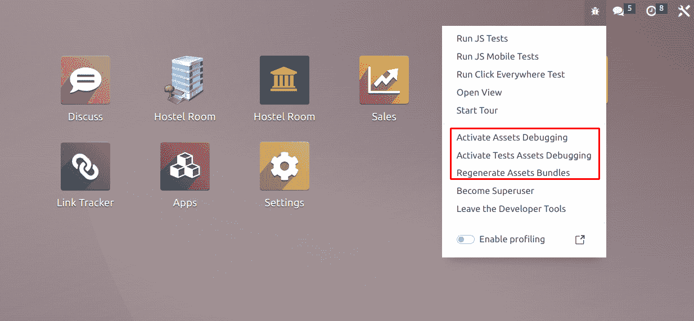
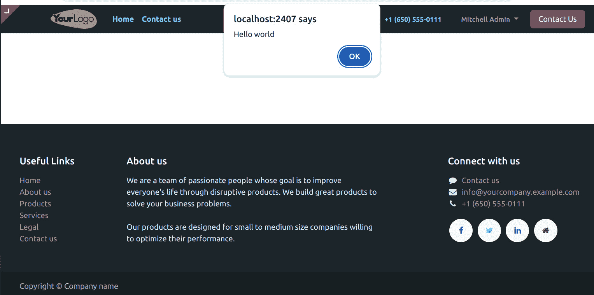
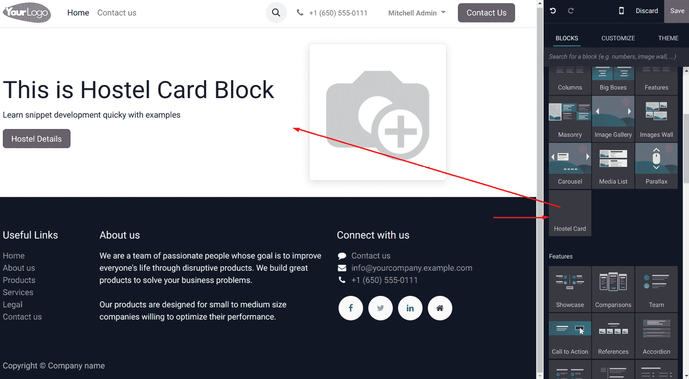
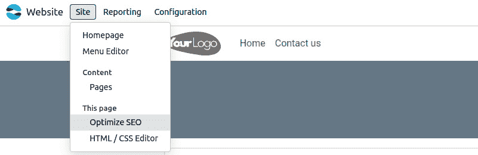
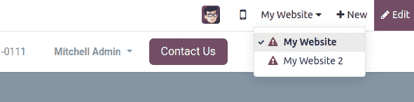
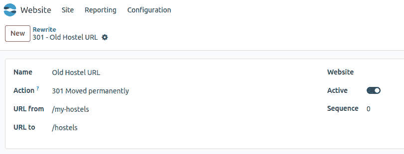
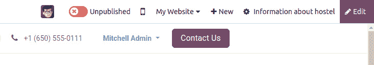

# 14

# CMS 网站开发

Odoo 内置了一个名为网站构建器的功能，这是一个强大的工具，允许您在 Odoo ERP 生态系统中创建和管理网站。它提供了一种用户友好且直观的网页设计方法，使得没有广泛技术知识的使用者也能轻松使用。

以下是 Odoo 网站构建器的关键功能和方面：

+   **拖放界面**：网站构建器提供了一个拖放界面，允许您轻松地在网页上添加和排列各种内容元素。这包括文本、图片、视频、表单、按钮等等。

+   **预设计模板**：Odoo 提供了一系列预设计的网站模板，您可以用作起点。这些模板是可定制的，并且可以根据您的品牌形象进行调整。

+   **响应式设计**：使用 Odoo 创建的网站设计为响应式，这意味着它们会自动适应不同的屏幕尺寸和设备，确保在桌面、平板电脑和智能手机上提供一致的用户体验。

+   **内容管理**：您可以轻松创建和管理网页、博客、产品列表以及其他类型的内容。网站构建器提供了一个**内容管理系统（CMS**）来组织和更新您的内容。

+   **搜索引擎优化（SEO）**：Odoo 包含了 SEO 工具，允许您设置元数据、定义 SEO 友好的 URL 并管理网站地图，以提高您网站在搜索引擎中的可见性。

+   **多语言支持**：Odoo 支持多种语言，使其适合拥有国际受众的企业。您可以翻译内容并适应不同地区。

+   **与其他 Odoo 模块集成**：使用 Odoo 网站构建器的优势之一是它与其他 Odoo 模块（如 CRM、销售、库存等）的无缝集成。这意味着您可以在一个统一的系统中管理您业务的各个方面。

+   **分析和报告**：Odoo 提供了内置的分析和报告工具，以跟踪您网站的绩效，包括访客统计、转化率等等。

+   **定制开发**：对于有独特需求的企业，Odoo 的模块化架构允许进行定制开发以扩展平台的功能。

在本章中，您将探索 Odoo 网站的定制功能发展，并学习如何创建网页。您还将学习如何创建用户可以在页面上拖放的基本构建块。本章还涵盖了高级功能，如**Urchin 跟踪模块（UTMs**）、SEO、多网站、GeoIP 和网站地图。

在本章中，我们将介绍以下菜谱：

+   管理资产

+   为网站添加 CSS 和 JavaScript

+   创建或修改模板

+   管理动态路由

+   向用户提供静态片段

+   向用户提供动态片段

+   从网站用户那里获取输入

+   管理网站 SEO 选项

+   管理网站地图

+   获取访客的国家信息

+   跟踪营销活动

+   管理多个网站

+   重定向旧 URL

+   发布网站相关记录的管理

# 管理资源

在 Odoo 的上下文中，资源指的是各种类型的资源，例如 **Cascading Style Sheets**（**CSS**）、JavaScript 文件、字体和图像，这些资源被用来增强网站的外观和功能。在 Odoo 中管理资源对于维护一个结构良好且高效的网站非常重要。当浏览器中加载一个页面时，这些静态文件会向服务器发出单独的请求。请求的数量越多，网站的速度就越低。为了避免这个问题，大多数网站通过合并多个文件来提供静态资源。市场上有一些工具用于管理这类事情，但 Odoo 有自己的静态资源管理实现。

## Odoo 中的资源包和不同资源是什么？

在 Odoo 中，资源包是不同资源的集合，例如 CSS、JavaScript 文件和其他资源，它们被分组在一起以便在您的网站上高效且有序地加载。资源包通过允许您定义哪些资源应该一起加载来帮助管理这些资源的加载，从而提高性能并确保网站正常工作。资源包的工作是将所有 JavaScript 和 CSS 合并到一个文件中，并通过最小化来减小其大小。

下面是 Odoo 中使用的不同资源包：

+   `web._assets_primary_variables`

+   `web._assets_secondary_variables`

+   `web.assets_backend`

+   `web.assets_frontend`

+   `web.assets_frontend_minimal`

+   `web.assets_frontend_lazy`

+   `web.report_assets_common`

+   `web.report_assets_pdf`

+   `web.assets_web_dark`

+   `web._assets_frontend_helpers`

+   `web_editor.assets_wysiwyg`

+   `website.assets_wysiwyg`

+   `website.assets_editor`

重要信息

对于某些特定应用，还有一些其他资源包被使用；

例如，`point_of_sale.assets`、`survey.survey_assets`、`mass_mailing.layout` 和 `website_slides.slide_embed_assets`。

Odoo 通过位于 `/odoo/addons/base/models/assetsbundle.py` 的 `AssetBundle` 类来管理其静态资源。

现在，`AssetBundle` 不仅合并多个文件，还包含更多功能。以下是它提供的功能列表：

+   在 Odoo 网站的上下文中，资源指的是各种类型的资源，例如**层叠样式表**（**CSS**）、JavaScript 文件、字体和图像，这些资源被用来增强网站的外观和功能。在 Odoo 中管理资源对于维护一个结构良好且高效的网站非常重要。当浏览器中加载一个页面时，这些静态文件会向服务器发出单独的请求。请求的数量越多，网站的速度就越低。为了避免这个问题，大多数网站通过合并多个文件来提供静态资源。市场上有一些工具用于管理这类事情，但 Odoo 有自己的静态资源管理实现。

+   它通过从文件内容中移除注释、额外空格和换行符来最小化 JavaScript 和 CSS 文件。移除这些额外数据将减小静态资源的大小并提高页面加载速度。

+   它内置了对 CSS 预处理器，如 **Sassy CSS**（**SCSS**）和 **Leaner Style Sheets**（**LESS**）的支持。这意味着您可以添加 SCSS 和 LESS 文件，并且它们将自动被编译并添加到包中。

## 自定义资源

正如我们所见，Odoo 为不同的代码库提供了不同的资产。为了得到正确的结果，您需要选择正确的资产包来放置您的自定义 JavaScript 和 CSS 文件。例如，如果您正在设计一个网站，您需要将文件放入 `web.assets_frontend`。尽管这种情况很少见，但有时您需要创建一个全新的资产包。您可以在下一节中了解到如何创建自己的资产包。

## 如何做到这一点...

要加载资产，您可以在模块的 `__manifest__.py` 文件中使用 `web.assets_frontend` 模板；例如：

```py
'assets': {
    'web.assets_backend': [
        'my_hostel/static/src/xml/**/*',
    ],
    'web.assets_frontend: [
        'my_hostel/static/lib/bootstrap/**/*',
        'my_hostel/static/src/js/**',
        'my_hostel/static/src/scss/**',
    ],
},
```

这里是一些最重要的包：

+   `web.assets_common`

+   `web.assets_backend`

+   `web.assets_frontend`

+   `web.qunit_suite_tests`

+   `web.qunit_mobile_suite_tests`

### 操作

这里是针对特定资产文件的所有指令：

+   `before`

+   `after`

+   `replace`

+   `remove`

### append

追加资产操作是指向由其他模块或 Odoo 核心提供的现有包或模板中添加额外的 CSS 或 JavaScript 文件。这允许您扩展功能或外观，而无需直接修改原始代码；例如：

```py
'web.assets_common': [
    'my_hostel/static/src/js/**/*',
],
```

总是考虑您的资产加载顺序。如果您的代码依赖于其他资产中定义的任何特定库或功能，请确保它们以正确的顺序加载，以避免冲突或错误。

### prepend

在 Odoo 中，将资产（如 CSS 或 JavaScript 文件）添加到现有包或模板（由其他模块或 Odoo 核心提供）的开头，涉及到添加您自己的 CSS 或 JavaScript 文件。这有助于确保您的自定义更改优先于现有的样式或脚本；例如：

```py
'web.assets_common': [
    ('prepend','my_hostel/static/src/css/bootstrap_overridden.scss'),
],
```

确定您的资产加载顺序。追加资产意味着它们将在其他样式或脚本之前加载，可能会影响功能或设计。在覆盖核心功能时要谨慎。

### before

在 Odoo 中，将资产（如 CSS 或 JavaScript 文件）组织在其他模块的资产之前，涉及到控制资源加载顺序以确保您的模块文件在其他模块的文件之前加载；例如：

```py
'web.assets_common': [
    ('before', 'web/static/src/css/bootstrap_overridden.scss',   'my_hostel/static/src/css/bootstrap_overridden.scss'),
],
```

确保您在加载资源之前引用的是您想要加载的模块的正确资产或模板。错误的引用可能会导致错误或意外的行为。

### after

在 Odoo 中，将 CSS 或 JavaScript 文件等资产组织在其他模块的资产之后，涉及到控制加载顺序以确保您的模块文件在其他模块的文件之后加载。这在您需要您的资产依赖于或覆盖其他模块的样式或脚本时很有用；例如：

```py
'web.assets_common': [
    ('after', 'web/static/src/css/list_view.scss', 'my_hostel/static/src/css/list_view.scss'),
],
```

使用 `after` 属性或 Python 代码控制加载顺序有助于确保您的模块资产在其他模块之后加载，从而有效地管理依赖项和自定义。

### include

在 Odoo 中，包括 CSS 或 JavaScript 文件等资产涉及将这些资源链接到您的模块或主题以增强其功能或外观；例如：

```py
'web.assets_common': [
    ('include', 'web._primary_variables'),
],
```

在 Odoo 中包括资产允许您通过添加自定义样式或脚本扩展模块的功能，增强用户体验和功能。

### 删除

删除一个或多个文件。

删除资产，例如 CSS 或 JavaScript 文件，在 Odoo 中涉及从您的模块资产中排除它们；例如：

```py
'web.assets_common': [
    ('remove', 'web/static/src/js/boot.js'),
],
```

在 Odoo 中删除资产允许您通过排除不需要或与您的模块功能冲突的特定样式或脚本来自定义您的模块。

### 替换

在 Odoo 中，替换资产涉及在您的模块或主题中用新 CSS 或 JavaScript 文件替换现有文件；例如：

```py
'web.assets_common': [
    ('replace', 'web/static/src/js/boot.js', 'my_addon/static/src/js/
boot.js'),
],
```

在 Odoo 中替换资产允许您通过用新文件替换现有文件来更新和自定义模块的外观或功能。替换资产时要谨慎，以保持应用程序的稳定性和功能。

### 加载顺序

在 Odoo 中，管理资产的加载顺序（CSS、JavaScript 等）对于确保依赖关系正确解决和用户界面正确渲染至关重要。加载顺序可以控制以确定哪些资产首先加载或在其他资产之后加载；例如：

```py
'web.assets_common': [
    'my_addon/static/lib/jquery/jquery.js',
    'my_addon/static/lib/jquery/**/*',
],
```

当调用资产包时（例如，`t-call-assets="web.assets_common"`），会生成一个空的资产列表。

所有与该包匹配的类型为`ir.asset`的记录都会被检索并按序列号排序。然后，所有序列严格小于 16 的记录都会被处理并应用于当前资产列表。

所有在其清单中声明该包资产的模块都会将它们的资产操作应用于此列表。这是按照模块依赖顺序进行的（例如，网站资产在网站之前处理）。如果指令尝试添加列表中已存在的文件，则对该文件不进行任何操作。换句话说，列表中只保留文件的第一种出现。

然后，处理并应用剩余的`ir.asset`记录（序列号大于或等于 16 的记录）。

在清单中声明的资产可能需要按特定顺序加载；例如，在加载`lib`文件夹时，`jquery.js`必须先于所有其他`jquery`脚本加载。一个解决方案是创建一个序列号较低的`ir.asset`记录或`prepend`指令，但还有另一种更简单的方法。

## 更多...

如果您在 Odoo 中处理资产，以下是一些您需要了解的事项。

在 Odoo 中调试 JavaScript 可能非常困难，因为`AssetBundle`将多个 JavaScript 文件合并成一个文件，并且还会对其进行压缩。通过启用带有资产的开发者模式，您可以跳过资产打包，页面将单独加载静态资产，以便您可以轻松调试。

合并资源一次生成并存储在`ir.attachment`模型中。之后，它们从附件中提供。如果您想重新生成资源，可以从调试选项中进行，如下面的截图所示：



图 14.1 – 资源激活选项的截图

小贴士

如您所知，Odoo 只会生成一次资源。在开发过程中，这种行为可能会引起头痛，因为它需要频繁重启服务器。为了克服这个问题，您可以在命令行中使用`dev=xml`，这将直接加载资源，因此不需要重启服务器。

### 懒加载

懒加载是一种技术，它将非关键资源的加载推迟到需要时，通常用于图像、脚本或其他资源以提高性能：

```py
await loadAssets({
    jsLibs: ["/web/static/lib/stacktrace-js/stacktrace.js"],
});
```

然而，在 Odoo 中实现特定资源或组件的懒加载可以通过自定义开发或利用第三方库来实现。以下是一些您可能考虑的方法。

### 懒加载图像

您可以使用如 Intersection Observer 这样的 JavaScript 库来实现图像的懒加载。这个库允许您在图像进入用户的视口时才加载图像。

1.  使用 Intersection Observer，JavaScript 代码可能如下所示：

    ```py
    document.addEventListener("DOMContentLoaded", function () {
        var lazyImages = [].slice.call(document.querySelectorAll("img.lazy"));
        if ("IntersectionObserver" in window) {
            let lazyImageObserver = new \
            IntersectionObserver(function (entries, \
            observer) {
                entries.forEach(function (entry) {
                    if (entry.isIntersecting) {
                        let lazyImage = entry.target;
                        lazyImage.src = \
                        lazyImage.dataset.src;
                        lazyImage.classList.remove("lazy");
                        lazyImageObserver.unobserve(lazyImage);
                    }
                });
            });
            lazyImages.forEach(function (lazyImage) {
                lazyImageObserver.observe(lazyImage);
            });
        }
    });
    ```

    然后，您需要将`lazy`类分配给您的``标签，并使用`data-src`属性作为实际图像源。

1.  将`lazy`类和`data-src`属性添加到图像标签中。

# 为网站添加 CSS 和 JavaScript

通过模块的资产管理系统管理如 CSS、JavaScript 和其他静态文件。您可以通过在清单文件中定义它们并将它们链接到视图或模板来控制这些资源在您的模块中的加载。

这是一份关于如何在 Odoo 中管理 CSS 和 JavaScript 的概述。

### 在模块清单中定义资源（__manifest__.py）

在清单文件中，指定模块所需的资源：

```py
'assets': {
       'web.assets_frontend': [
           'my_hostel/static/src/scss/hostel.scss',
           'my_hostel/static/src/js/hostel.js',
       ],
   },
```

我们将添加 CSS、SCSS 和 JavaScript 文件，这些文件将修改网站。由于我们在修改网站，我们需要将网站作为依赖项添加。修改清单文件如下：

```py
'depends': ['base', 'website'],
```

将一些 SCSS 代码添加到`static/src/scss/hostel.scss`中，如下所示：

```py
$my-bg-color: #1C2529;
$my-text-color: #D3F4FF;
nav.navbar {
   background-color: $my-bg-color !important;
   .navbar-nav .nav-link span{
       color: darken($my-text-color, 15);
       font-weight: 600;
   }
}
footer.o_footer {
   background-color: $my-bg-color !important;
   color: $my-text-color;
}
```

将一些 JavaScript 代码添加到`static/src/js/my_library.js`中，如下所示：

```py
/** @odoo-module **/
import { _t } from "@web/core/l10n/translation";
import publicWidget from "@web/legacy/js/public/public_widget";
publicWidget.registry.MyHostel = publicWidget.Widget.extend({
    selector: '#wrapwrap',
    init() {
        this._super(...arguments);
        this.orm = this.bindService("orm");
        alert(_t('Hello world'));
    },
});
```

更新您的模块后，您应该会看到 Odoo 网站在菜单、主体和页脚中具有自定义颜色，并且在每次页面加载时都会出现一个有点令人烦恼的 Hello World 弹出窗口，如下面的截图所示：



图 14.2 – JavaScript 代码中 Hello World 弹出窗口的截图

小贴士

对于 CSS/SCSS 文件，有时顺序很重要。因此，如果你需要覆盖另一个插件中定义的样式，你必须确保你的文件在加载原始文件之后。这可以通过调整你的视图的优先级字段或直接从注入 CSS 文件引用的插件视图继承来实现。

我们添加了基本的 SCSS。Odoo 内置了对 SCSS 预处理器的支持。Odoo 将自动将 SCSS 文件编译成 CSS。在我们的示例中，我们使用了带有一些变量和 `darken` 函数的基本 SCSS，将 `$my-text-color` 的颜色加深 15%。SCSS 预处理器有众多其他功能；如果你想了解更多关于 SCSS 的信息，请参阅 [`sass-lang.com/`](http://sass-lang.com/)。

# 创建或修改模板

网站模板使用 QWeb 创建，这是一种与 Odoo 框架无缝集成的模板语言。这些模板用于在 Odoo 网站模块中定义网页的结构和外观。

下面是关于如何在 Odoo 中处理网站模板的概述。

## 理解 QWeb 模板

Odoo 中的 QWeb 模板允许你使用类似于 XML 的语法，结合控制结构和占位符，创建动态网页。它们使你能够定义网页的结构、内容和展示。

## 创建基本的网站模板

要创建一个简单的网站模板，请按照以下步骤操作：

`views` 目录：

```py
<!-- Example: custom_template.xml -->
<template id="custom_template" name="Custom Template">
    <t t-call="website.layout">
        <t t-set="page_title">Custom Page</t>
        <!-- Your content here -->
        <div class="custom-content">
            <h1>Welcome to my custom page!</h1>
            <p>This is a custom template created in Odoo.</p>
        </div>
    </t>
</template>
```

下面是对代码的解释：

+   `<template>`: 定义 QWeb 模板

+   `id`: 模板的唯一标识符

+   `name`: 模板的名称

+   `<t t-call="website.layout">`: 表示此模板继承自网站的主要布局

+   `<t t-set="page_title">`: 动态设置页面标题

+   `<div class="custom-content">`: 模板内的内容示例

**包含在清单文件中**：将你的视图文件包含在模块的清单文件中：

```py
{
    # Other manifest information
    'data': [
        'views/custom_template.xml',
        # Other XML or CSV files
    ],
    # Other manifest information
}
```

## 使用 Odoo 网站构建器

你还可以使用 Odoo 网站构建器界面，通过预定义的块和模板创建和定制网页。这允许以更直观和互动的方式设计网页，而无需直接编辑 XML 模板。

## 样式和定制

对于样式和定制，你可以使用 CSS，它可以在你的 QWeb 模板内包含或作为链接到模板的单独文件。

记住——你的网站模板的结构和样式可以根据你的具体需求和创建的网页的复杂性而变化。此外，考虑探索现有的 Odoo 网站模块和官方文档，以获取更多关于 Odoo 框架内 QWeb 模板的详细和高级用法。

## 循环

要处理记录集或可迭代的数据类型，你需要一个结构来遍历列表。在 QWeb 模板中，这可以通过 `t-foreach` 元素来完成。迭代可以在 `t` 元素中发生，在这种情况下，其内容会为 `t-foreach` 属性中传递的每个可迭代成员重复，如下所示：

```py
<t t-foreach="[1, 2, 3, 4, 5]" t-as="num">
    <p><t t-esc="num"/></p>
</t>
```

这将被渲染如下：

```py
<p>1</p>
<p>2</p>
<p>3</p>
<p>4</p>
<p>5</p>
```

你也可以将 `t-foreach` 和 `t-as` 属性放置在某个任意元素中，此时该元素及其内容将重复迭代器中的每个项目。看看下面的代码块。这将生成与上一个示例完全相同的结果：

```py
<p t-foreach="[1, 2, 3, 4, 5]" t-as="num">
    <t t-esc="num"/>
</p>
```

在我们的例子中，看看 `t-call` 元素内部，那里实际的内容生成发生。模板期望在具有名为 `hostel` 的变量的上下文中渲染，该变量在 `t-foreach` 元素中迭代。`t-as` 属性是必需的，并将用作迭代变量名以访问迭代数据。虽然这种构造最常用的用途是迭代记录集，但你可以在任何可迭代的 Python 对象上使用它。

## 动态属性

QWeb 模板可以动态设置属性值。这可以通过以下三种方式实现。

第一种方式是通过 `t-att-$attr_name`。在模板渲染时，创建一个名为 `$attr_name` 的属性；它的值可以是任何有效的 Python 表达式。这是使用当前上下文计算得出的，结果被设置为属性的值，如下所示：

```py
<div t-att-total="10 + 5 + 5"/>
```

它将被渲染如下：

```py
<div total="20"></div>
```

第二种方式是通过 `t-attf-$attr_name`。这与前面的选项类似。唯一的区别是只有 `{{ ..}}` 和 `#{..}` 之间的字符串会被评估。这在值与字符串混合时很有用。它主要用于评估类，例如在这个例子中：

```py
<t t-foreach="['info', 'danger', 'warning']" t-as="color">
    <div t-attf-class="alert alert-#{color}">
        Simple bootstrap alert
    </div>
</t>
```

它将被渲染如下：

```py
<div class="alert alert-info">
    Simple bootstrap alert
</div>
<div class="alert alert-danger">
    Simple bootstrap alert
</div>
<div class="alert alert-warning">
    Simple bootstrap alert
</div>
```

第三种方式是通过 `t-att=mapping` 选项。此选项接受模板渲染后的字典，字典的数据被转换为属性和值。看看以下示例：

```py
<div t-att="{'id': 'my_el_id', 'class': 'alert alert-danger'}"/>
```

在渲染此模板之后，它将被转换为以下形式：

```py
<div id="my_el_id" class="alert alert-danger"/>
```

在我们的例子中，我们使用了 `t-attf-class` 来根据索引值获取动态背景。

## 字段

`h3` 和 `div` 标签使用 `t-field` 属性。`t-field` 属性的值必须与长度为之一的记录集一起使用；这允许用户在以编辑模式打开网站时更改网页内容。当你保存页面时，更新的值将被存储在数据库中。当然，这需要权限检查，并且只有当前用户有显示记录的写入权限时才允许。通过可选的 `t-options` 属性，你可以向字段渲染器传递一个字典选项，包括要使用的部件。目前，后端部件的选择相当有限。例如，如果你想从二进制字段显示一个图片，那么你可以使用 `image` 部件，如下所示：

```py
<span t-field="author.image_small" t-options="{'widget': 'image'}"/>
```

`t-field`有一些限制。它仅在记录集上工作，并且不能在`<t>`元素上工作。为此，您需要使用一些 HTML 元素，如`<span>`或`<div>`。`t-field`属性有一个替代方案，即`t-esc`。`t-esc`属性不仅限于记录集；它也可以用于任何数据类型，但在网站上不可编辑。

`t-esc`和`t-field`之间的另一个区别是`t-field`根据用户的语言显示值，而`t-esc`显示数据库中的原始值。例如，对于在偏好设置中配置了英语语言并将`datetime`字段设置为与`t-field`一起使用的用户，结果将以`12/15/2023 14:17:15`的格式渲染。相比之下，如果使用`t-esc`属性，则结果将以如下渲染格式显示：`2023-12-15 21:12:07`。

## 条件语句

请注意，显示发布日期的分区被一个带有`t-if`属性的`t`元素包裹。此属性被评估为 Python 代码，并且只有当结果为真值时，元素才会被渲染。在以下示例中，我们只显示设置了发布日期的`div`类。然而，在复杂情况下，您可以使用`t-elif`和`t-else`，如下例所示：

```py
<div t-if="state == 'new'">
    Text will be added if the state is new.
</div>
<div t-elif="state == 'progress'">
    Text will be added if the state is progress.
</div>
<div t-else="">
    Text will be added for all other stages.
</div>
```

## 设置变量

QWeb 模板也能够在模板本身中定义变量。定义模板后，您可以在后续模板中使用该变量。您可以这样设置变量：

```py
<t t-set="my_var" t-value="5 + 1"/>
<t t-esc="my_var"/>
```

## 子模板

如果您正在开发大型应用程序，管理大型模板可能会很困难。QWeb 模板支持子模板，因此您可以把大型模板分成更小的子模板，并在多个模板中重复使用它们。对于子模板，您可以使用`t-call`属性，如下例所示：

```py
<template id="first_template">
    <div> Test Template </div>
</template>
<template id="second_template">
    <t t-call="first_template"/>
</template>
```

## 行内编辑

用户将能够在编辑模式下直接从网站上修改记录。使用`t-field`节点加载的数据默认可编辑。如果用户更改了此类节点中的值并保存页面，后端中的值也将更新。请放心；为了更新记录，用户需要对该记录有写权限。请注意，`t-field`仅在记录集上工作。要显示其他类型的数据，您可以使用`t-esc`。这与`t-field`的工作方式完全相同，但唯一的不同是`t-esc`不可编辑，并且可以用于任何类型的数据。

如果您想在页面上启用代码片段拖放支持，可以使用`oe_structure`类。在我们的示例中，我们在模板顶部添加了这一设置。使用`oe_structure`将启用编辑和代码片段拖放支持。

如果您想在某个块上禁用网站编辑功能，可以使用`contenteditable=False`属性。这会使元素变为只读。我们在最后一个`<section>`标签中使用了这个属性。

注意

为了使页面多网站兼容，当你通过网站编辑器编辑页面/视图时，Odoo 将为该网站创建页面的一个单独副本。这意味着后续的代码更新永远不会影响到已编辑的网站页面。为了同时获得内联编辑的便利性和在后续版本中更新你的 HTML 代码的可能性，创建一个包含语义 HTML 元素的一个视图，以及一个包含可编辑元素的第二视图。然后，只有后者视图会被复制，你仍然可以为父视图更新。

对于这里使用的其他 CSS 类，请参考 Bootstrap 的文档。

在 *步骤 1* 中，我们声明了渲染模板的路由。如果你注意到了，我们在 `route()` 中使用了 `website=True` 参数，这将向模板传递一些额外的上下文，例如菜单、用户语言、公司等。这些将在 `website.layout` 中用于渲染菜单和页脚。`website=True` 参数还启用了网站的多语言支持，并以更好的方式显示异常。

# 管理动态路由

在网站开发项目中，我们经常需要创建具有动态 URL 的页面。例如，在电子商务中，每个产品都有一个与不同 URL 链接的详细页面。在这个菜谱中，我们将创建一个网页来显示宿舍详情。

## 准备工作

在 `hostel` 模型中添加基本字段：

```py
from odoo import fields, models
class Hostel(models.Model):
   _name = 'hostel.hostel'
   _description = "Information about hostel"
   _order = "id desc, name"
   _rec_name = 'hostel_code'
   name = fields.Char(string="hostel Name", required=True)
   hostel_code = fields.Char(string="Code", required=True)
   street = fields.Char('Street')
   street2 = fields.Char('Street2')
   zip = fields.Char('Zip', change_default=True)
   city = fields.Char('City')
   state_id = fields.Many2one("res.country.state", string='State')
   country_id = fields.Many2one('res.country', string='Country')
   phone = fields.Char('Phone',required=True)
   mobile = fields.Char('Mobile',required=True)
   email = fields.Char('Email')
   hostel_floors = fields.Integer(string="Total Floors")
   image = fields.Binary('Hostel Image')
   active = fields.Boolean("Active", default=True,
       help="Activate/Deactivate hostel record")
   type = fields.Selection([("male", "Boys"), ("female", "Girls"),
       ("common", "Common")], "Type", help="Type of Hostel",
       required=True, default="common")
   other_info = fields.Text("Other Information",
       help="Enter more information")
   description = fields.Html('Description')
   hostel_rating = fields.Float('Hostel Average Rating', digits=(14, 4))
```

## 如何操作...

按照以下步骤生成宿舍的详情页面：

1.  在 `main.py` 中添加一个新的宿舍详情路由，如下所示：

    ```py
    @http.route('/hostel/<model("hostel.hostel"):hostel>', type='http', auth="user", website=True)
    def hostel_room_detail(self, hostel):
        return request.render(
            'my_hostel.hostel_detail', {
                'hostel': hostel,
            })
    ```

1.  在 `hostel_templates.xml` 中添加一个新的宿舍详情模板，如下所示：

    ```py
    <template id="hostel_detail" name="Hostel Detail">
       <t t-call="website.layout">
           <div class="container">
               <div class="row mt16">
                   <div class="col-5">
                       <span t-field="hostel.image" t-options="{
                           'widget': 'image',
                           'class': 'mx-auto d-block img-thumbnail'}"/>
                   </div>
                   <div class="offset-1 col-6">
                       <h1 t-field="hostel.name"/>
                       <p t-esc="hostel.hostel_rating"></p>
                       <t t-if="hostel.hostel_code">
                           <div t-field=
                           "hostel.hostel_code"
                           class="text-muted"/>
                       </t>
                       <b class="mt8"> State: </b>
                       <ul>
                           <li t-foreach="hostel.state_id" t-as="state">
                               <span t-esc="state.name" />
                           </li>
                       </ul>
                   </div>
               </div>
           </div>
           <div t-field="hostel.description"/>
       </t>
    </template>
    ```

1.  在宿舍列表模板中添加一个按钮，如下所示。此按钮将重定向到宿舍详情网页：

    ```py
    ...
    <div t-attf-class="card mt24 #{'bg-light' if hostel_rating else ''}">
        <div class="card-body">
            <h3 t-field="hostel.name"/>
            <t t-if="hostel.hostel_rating">
                <div t-field="hostel.hostel_rating"
                class="text-muted"/>
            </t>
            <b class="mt8"> Authors </b>
            <ul>
                <li t-foreach="hostel.state_id"
                t-as="state">
                    <span t-esc="state.name" />
                </li>
            </ul>
            <a t-attf-href="/hostel/#{hostel.id}"
            class="btn btn-primary btn-sm">
                <i class="fa fa-building"/> Hostel Detail
            </a>
        </div>
    </div>
    ...
    ```

更新 `my_hostel` 模块以应用更改。更新后，你将在宿舍卡片上看到宿舍详情页面的链接。点击这些链接后，将打开宿舍详情页面。

## 它是如何工作的...

在 *步骤 1* 中，我们为宿舍详情页面创建了一个动态路由。在这个路由中，我们添加了 `<model("hostel.hostel"):hostel>`。它接受整数 URL，例如 `/hostel/1`。Odoo 将这个整数视为 `hostel.hostel` 模型的 ID，当访问这个 URL 时，Odoo 会获取一个记录集并将其作为参数传递给函数。因此，当从浏览器访问 `/hostel/1` 时，`hostel_detail()` 函数中的 `hostel` 参数将包含 ID 为 `1` 的 `hostel.hostel` 模型的记录集。我们传递了这个 `hostel` 记录集并渲染了一个名为 `my_hostel.hostel2_detail` 的新模板。

在 *步骤 2* 中，我们创建了一个名为 `hostel_detail` 的新 QWeb 模板，用于渲染宿舍详情页面。这是简单的，并且使用 Bootstrap 结构创建的。如果您检查，我们在详情页面中添加了 `html_description`。`html_description` 字段具有 HTML 字段类型，因此您可以在字段中存储 HTML 数据。Odoo 自动为 HTML 类型的字段添加了片段拖放支持。因此，我们现在能够在宿舍详情页面中使用片段。在 HTML 字段中放置的片段存储在宿舍的记录中，因此您可以针对不同的记录设计不同的内容。

在 *步骤 3* 中，我们添加了一个带有锚点的链接，以便访客可以重定向到宿舍详情页面。

注意

模型路由也支持域过滤。例如，如果您想根据条件限制一些记录，可以通过将域传递给路由来实现，如下所示：

`/hostel/<model("hostel.hostel", "[(name','!=', '``Hostel 1')]"):hostel>`

这将限制对名为 `Hostel 1` 的宿舍的访问。

## 还有更多...

Odoo 使用 `werkzeug` 来处理 HTTP 请求。Odoo 在 `werkzeug` 上添加了一个薄薄的包装，以便轻松处理路由。您在上一个示例中看到了 `<model("hostel.hostel"):hostel>` 路由。这是 Odoo 自己的实现，但它也支持 `werkzeug` 路由的所有功能。因此，您可以使用类似以下的路由：

+   `/page/<int:page>` 接受整数值

+   `/page/<any(about, help):page_name>` 接受选定值

+   `/pages/<page>` 接受字符串

+   `/pages/<category>/<int:page>` 接受多个值

路由有很多变体可供选择，您可以在 [`werkzeug.pocoo.org/docs/0.14/routing/`](http://werkzeug.pocoo.org/docs/0.14/routing/) 中了解相关信息。

# 向用户提供静态片段

静态片段是可以重复使用的组件或 HTML、CSS 和 JavaScript 的代码块，可以通过网站构建器插入到网页中。这些片段允许轻松地自定义和构建网页，无需从头编写代码。

Odoo 的网站编辑器提供了几个编辑构建块，可以根据您的需求拖放到页面上进行编辑。本教程将介绍如何提供您自己的构建块。这些块被称为片段。片段有几种类型，但通常我们可以将它们分为两种：静态和动态。静态片段是固定的，直到用户更改它才会改变。动态片段依赖于数据库记录，并根据记录值进行更改。在本教程中，我们将了解如何创建一个静态片段。

## 如何操作...

片段实际上只是一个注入到 **插入块** 栏中的 QWeb 视图。我们将创建一个小片段，用于显示宿舍的图片和标题。您将能够在页面上拖放片段，并且可以编辑图片和文本。按照以下步骤添加一个新的静态片段：

1.  添加一个名为 `views/snippets.xml` 的文件，如下所示（不要忘记在清单中注册文件）：

1.  在 `views/snippets.xml` 中为片段添加一个 QWeb 模板，如下所示：

    ```py
    <template id="snippet_hostel_card" name="Hostel Card">
           <section class="pt-3 pb-3">
               <div class="container">
                   <div class="row align-items-center">
                       <div class="col-lg-6 pt16 pb16">
                           <h1>This is Hostel Card Block</h1>
                           <p>
                               Learn snippet development
                               quickly with examples
                            </p>
                           <a class="btn btn-primary"
                           href="#" >Hostel Details</a>
                       </div>
                       <div class="col-lg-6 pt16 pb16">
                           
                       </div>
                   </div>
              </div>
        </section>
    </template>
    ```

1.  按如下方式在片段列表中列出模板：

    ```py
    <template id="hostel_snippets_options" inherit_id="website.snippets">
        <xpath    expr="//div[@id='snippet_structure']/div[hasclass('o_panel_body')]" position="inside">
            <t t-snippet="my_hostel.snippet_hostel_card"
             t-thumbnail="/my_hostel/static/src/img/s_hostel_thumb.png"/>
        </xpath>
    </template>
    ```

1.  在 `/my_hostel/static/src/img` 目录中添加封面图像和片段缩略图。

重新启动服务器并更新 `my_hostel` 模块以应用更改。当您以编辑模式打开网站页面时，您将能够在片段块面板中看到我们的片段：



图 14.3 – 静态片段截图

## 它是如何工作的...

静态片段不过是一块 HTML 代码。在 *步骤 1* 中，我们为宿舍块创建了一个包含我们 HTML 的 QWeb 模板。在这个 HTML 中，我们只使用了 Bootstrap 列结构，但您可以使用任何 HTML 代码。请注意，您在片段的 QWeb 模板中添加的 HTML 代码将在您拖放时添加到页面上。通常，使用 `section` 元素和 Bootstrap 类为片段是一个好主意，因为对于它们，Odoo 的编辑器提供了编辑、背景和调整大小控件。

在 *步骤 2* 中，我们在片段列表中注册了我们的片段。您需要继承 `website.snippets` 以注册片段。在网站编辑器 GUI 中，片段根据其用途分为不同的部分。在我们的例子中，我们通过 `xpath` 在 `Structure` 部分注册了我们的片段。要列出您的片段，您需要使用具有 `t-snippet` 属性的 `<t>` 标签。`t-snippet` 属性将具有 QWeb 模板的 XML ID，在我们的例子中是 `my_hostel.snippet_hostel_card`。您还需要使用 `t-thumbnail` 属性，该属性用于在网站编辑器中显示一个小片段图像。

注意

`website.snippets` 模板包含所有默认片段，您可以通过探索 `/addons/website/views/snippets/snippets.xml` 文件了解更多信息。

```py
/addons/website/views/snippets/snippets.xml file to see all the snippet options. In the next recipe, we will see how to add our own options.
```

在 *步骤 3* 中，我们将我们的片段列在 `structure` 块下。一旦更新模块，您将能够拖放该片段。在 *步骤 4* 中，我们只为片段缩略图添加了一张图片。

## 更多内容...

在这种情况下，不需要额外的 JavaScript。Odoo 的编辑器提供了大量的选项和控件，对于静态片段来说已经足够了。您可以在 `website/views/snippets.xml` 中找到所有现有的片段和选项。

片段选项也支持 `data-exclude`、`data-drop-near` 和 `data-drop-in` 属性，这些属性决定了在将片段从片段栏拖出时可以放置的位置。这些也是 jQuery 选择器，但在本食谱的 *步骤 3* 中我们没有使用它们，因为我们允许将片段放置在基本上任何内容可以放置的地方。

# 向用户提供动态片段

动态片段是指能够从数据库、模型或外部服务等各种来源显示动态内容的可重用组件或块。这些片段能够创建灵活且适应性强的网页，显示实时或上下文特定的信息。

识别数据源：

+   确定您想在动态片段中使用的源数据。这可以包括 Odoo 模型、数据库、API 等。

+   使用 QWeb 模板标签 (``) 或 Odoo 特定指令 (`<t t-foreach="..." t-as="...">`) 实现动态占位符。

我们将了解如何为 Odoo 创建动态片段。我们将根据数据库值生成内容。

## 如何操作…

执行以下步骤以添加显示宿舍数据列表的动态片段：

1.  在 `views/snippets.xml` 中添加给定的 QWeb 模板片段：

    ```py
    <template id="snippet_hostel_dynamic" name="Hostel Dynamic">
        <section class="hostel_list">
            <div class="container">
                <h2>Hostel</h2>
                <table class="table hostel_snippet table-striped"
                       data-number-of-hostel="5">
                    <tr>
                        <th>Name</th>
                        <th>Available date</th>
                    </tr>
                </table>
            </div>
        </section>
    </template>
    ```

1.  注册片段并添加一个选项以更改片段行为：

    ```py
    <template id="hostel_snippets_options"
               inherit_id="website.snippets">
        <!-- register snippet -->
        <xpath expr="//div[@id='snippet_structure']/
                     div[hasclass('o_panel_body')]"
               position="inside">
            <t t-snippet="my_hostel.snippet_hostel_dynamic"
               t-thumbnail="/my_hostel/static/src/img/s_list.png"/>
        </xpath>
        <xpath expr="//div[@id='snippet_options']" position="inside">
      <!--Add step 3 here -->
        </xpath>
    </template>
    ```

1.  然后，为宿舍片段添加片段选项：

    ```py
    <div data-selector=".hostel_snippet">
        <we-select string="Table Style">
            <we-button data-select-class="table-striped">
                    Striped
            </we-button>
            <we-button data-select-class="table-dark">
                    Dark
            </we-button>
            <we-button data-select-class="table-bordered">
                    Bordered
            </we-button>
        </we-select>
        <we-button-group string="No of Rooms"
            data-attribute-name="numberOfRooms">
            <we-button data-select-data-attribute="5">
                    5
            </we-button>
            <we-button data-select-data-attribute="10">
                    10
            </we-button>
            <we-button data-select-data-attribute="15">
                    15
            </we-button>
        </we-button-group>
    </div>
    ```

1.  在 `/static/src/snippets.js` 文件中添加代码以渲染动态片段。

1.  添加一个 `public` 小部件以动态渲染宿舍片段：

    ```py
    /** @odoo-module **/
    import { _t } from "@web/core/l10n/translation";
    import publicWidget from "@web/legacy/js/public/public_widget";
    publicWidget.registry.HostelSnippet = publicWidget.Widget.extend({
       selector: '.hostel_snippet',
       disabledInEditableMode: false,
       start: function () {
           var self = this;
           var rows = this.$el[0].dataset.numberOfRooms || '5';
           this.$el.find('td').parents('tr').remove();
           this._rpc({
               model: 'hostel.hostel',
               method: 'search_read',
               domain: [],
               fields: ['name', 'hostel_code'],
               orderBy: [{ name: 'hostel_code', asc: false }],
               limit: parseInt(rows)
           }).then(function (data) {
               _.each(data, function (hostel) {
                   self.$el.append(
                       $('<tr />').append(
                           $('<td />').text(hostel.name),
                           $('<td />').text(hostel.hostel_code)
                       ));
               });
           });
       },
    });
    ```

1.  将 JavaScript 文件加载到 `__manifest__.py` 模块中：

    ```py
    'assets': {
           'web.assets_frontend': [
               'my_hostel/static/src/js/snippets.js',
           ],
    },
    ```

更新模块后，您将获得一个名为 `Hostels` 的新片段，该片段有一个选项可以更改最近添加的房间数量。我们还添加了更改表格设计的选项，当您点击表格时可以显示。

## 它是如何工作的…

在 *步骤 1* 中，我们为新的片段添加了一个 QWeb 模板（它就像之前的食谱一样）。请注意，我们为表格添加了一个基本结构。我们将在表格中动态添加宿舍的行。

在 *步骤 2* 中，我们注册了我们的动态片段并添加了自定义选项以更改动态片段的行为。我们添加的第一个选项是 `表格样式`。它将用于更改表格的样式。我们添加的第二个选项是 `房间数量`。我们使用了 `<we-select>` 和 `<we-button-group>` 标签来表示我们的选项。这些标签将为片段选项提供不同的 GUI。`<we-select>` 标签将以下拉菜单的形式显示选项，而 `<we-button-group>` 标签将以按钮组的形式显示选项。还有其他几个 GUI 选项，例如 `<we-checkbox>` 和 `<we-colorpicker>`。您可以在 `/addons/website/views/snippets/snippets.xml` 文件中探索更多 GUI 选项。

如果您仔细查看选项，您会看到我们为选项按钮添加了 `data-select-class` 和 `data-select-data-attribute` 属性。这将让 Odoo 知道当用户选择选项时要更改哪个属性。`data-select-class` 将在用户选择此选项时设置元素的类属性，而 `data-select-data-attribute` 将在元素上设置自定义属性和值。请注意，它将使用 `data-attribute-name` 的值来设置属性。

现在，我们已经添加了代码片段选项。如果您此时拖放代码片段，您将只会看到表头和代码片段选项。更改代码片段选项将更改表格样式，但还没有宿舍数据。为此，我们需要编写一些 JavaScript 代码来获取数据并在表格中显示。在*步骤 3*中，我们添加了将宿舍数据渲染到表格中的 JavaScript 代码。为了将 JavaScript 对象映射到 HTML 元素，Odoo 使用`PublicWidget`。现在，`PublicWidget`可以通过`import publicWidget from "@web/legacy/js/public/public_widget";`导入。使用`PublicWidget`的关键属性是`selector`属性。在`selector`属性中，您需要使用元素的 CSS 选择器，Odoo 将自动将元素与`PublicWidget`绑定。您可以通过`$el`属性访问相关元素。除了`_rpc`之外，其余的代码是基本的 JavaScript 和 jQuery。

## 更多内容…

如果您想创建自己的代码片段选项，您可以在代码片段选项中使用`t-js`选项。之后，您需要在 JavaScript 代码中定义自己的选项。通过探索`addons/website/static/src/js/editor/snippets.options.js`文件来了解更多关于代码片段选项的信息。

# 从网站用户获取输入

在 Odoo 中，您可以通过表单、调查或集成到您网站中的交互式元素从网站用户收集输入。Odoo 提供易于创建表单和管理从这些表单收集的数据的功能。以下是您如何设置输入收集的步骤。

+   提交的表单数据通常以与表单关联的特定模型记录的形式存储在数据库中

+   可以通过网站后端或配置视图来显示表单提交来访问收集到的数据

+   可选地，您可以将表单提交链接到 Odoo 中的特定模型，这样您就可以在 Odoo 后台管理和处理数据。

+   定义模型和字段以安全地存储表单数据

## 准备工作

对于这个菜谱，我们将使用`my_hostel`模块。我们需要一个新的模型来存储用户提交的宿舍预订查询。

因此，在开始这个菜谱之前，修改之前的代码并创建一个新的用于预订查询的模型，`my_hostel/models/inquiries.py`：

```py
from odoo import fields, models
class Inquiries(models.Model):
    _name = 'hostel.inquiries'
    _description = "Inquiries about hostel"
    _order = "id desc,"
    name = fields.Char(string="Student Name", required=True)
    phone = fields.Char(string="Phone", required=True)
    email = fields.Char(string="Email")
    book_fy = fields.Char(string="Book for Year")
    queries = fields.Html(string="Your Question", required=True)
```

现在，在后台创建菜单、操作和视图来存储来自网站查询表单的提交数据。

为此，在`my_hostel/views/inquiries_view.xml`中创建一个 XML 文件，然后添加菜单、操作以及其基本的树形和表单视图：

```py
<?xml version="1.0" encoding="utf-8"?>
<odoo>
    <data>
        <record id="view_hostel_inquiry_tree" model="ir.ui.view">
            <field name="name">hostel.inquiry.tree</field>
            <field name="model">hostel.inquiries</field>
            <field name="arch" type="xml">
                <tree string="Inquiries">
                    <field name="name"/>
                    <field name="phone"/>
                    <field name="email"/>
                    <field name="book_fy"/>
                </tree>
            </field>
        </record>
        <record id="view_hostel_inquiry_form" model="ir.ui.view">
            <field name="name">hostel.inquiry.form</field>
            <field name="model">hostel.inquiries</field>
            <field name="arch" type="xml">
                <form string="Inquiries">
                    <sheet>
                        <div class="oe_title">
                            <h3>
                                <table>
                                    <tr>
                                        <td style="padding-right:10px;"><field name="name" required="1"
                                        placeholder="Name" /></td>
                                    </tr>
                                </table>
                            </h3>
                        </div>
                        <group>
                            <group>
                                <field name="phone"/>
                                <field name="email"/>
                                <field name="book_fy"/>
                            </group>
                        </group>
                        <group>
                            <field name="queries"/>
                        </group>
                    </sheet>
                </form>
            </field>
        </record>
        <record model="ir.actions.act_window"
        id="action_inquiry">
            <field name="name">Inquiries</field>
            <field name="type">
            ir.actions.act_window</field>
            <field name="res_model">
            hostel.inquiries</field>
            <field name="view_mode">tree,form</field>
            <field name="help" type="html">
                <p class="oe_view_nocontent_create">
                    Create Inquiries.
                </p>
            </field>
        </record>
        <menuitem id="hostel_inquiry_main_menu" name="Inquiries"
        parent="hostel_main_menu" sequence="2" />
        <menuitem id="hostel_inquiry_menu" name="Inquiries"
        parent="hostel_inquiry_main_menu"
            action="my_hostel.action_inquiry"
            groups="my_hostel.group_hostel_manager"
            sequence="1"/>
    </data>
</odoo>
```

现在，创建一个基本的表单来获取客户的详细信息，该表单发布在网站页面上。一旦用户提交该表单，所有填写的数据都将存储在`Inquiries`表中。

为此，在模块中创建一个新文件夹，`my_hostel/controllers/main.py`：

```py
# -*- coding: utf-8 -*-
from odoo import http, tools, _
from odoo.http import request
class InquiryForm(http.Controller):
    @http.route('/inquiry/form', type='http', auth="public", website=True)
    def inquiry_form_template(self, **kw):
        return request.render("my_hostel.hostel_inquiry_form")
    @http.route('/inquiry/submit', type='http', auth="public", website=True)
    def inquiry_form(self, **kwargs):
        inquiry_obj = request.env['hostel.inquiries']
        form_vals = {
            'name': kwargs.get('name') or '',
            'email': kwargs.get('email') or '',
            'phone': kwargs.get('phone') or '',
            'book_fy': kwargs.get('book_fy') or '',
            'queries': kwargs.get('queries') or '',
            }
        submit_success = inquiry_obj.sudo().create(form_vals)
        return request.redirect('/contactus-thank-you')
```

现在，为网站设计一个名为`my_hostel/views/form_template.xml`的表单：

```py
<odoo>
  <template id="hostel_inquiry_form"
    name="Hostel Inquiry Form">
    <t t-call="website.layout">
      <section class="s_website_form" data-snippet="s_website_form">
        <div class="container">
          <div class="row">
            <div class="col-md-12 mb64">
              <div class="aboutus-section pl-5 pr-5 p-t-100 p-b-50">
                <div class="wrapper wrapper--w900">
                  <div class="card">
                    <div class="card-body mt8">
                      <form action="/inquiry/submit" method="POST" class="o_mark_required" id="inquiry_form" enctype="multipart/form-data">
                        <input type="hidden" name="csrf_token" t-att-value="request.csrf_token()"/>
                          <div class="row">
                            <div class="form-group col-md-12">
                              <label for="name"> Your Name </label>
                                <input type="text"
                                class="form-control" name="name"
                                id="name" required="True" />
                            </div>
                          </div>
                          <div class="row">
                            <div class="form-group col-md-12">
                              <label for="phone"> Phone </label>
                                <input type="text" class="form-control"
                                name="phone" id="phone" required="True" />
                            </div>
                          </div>
                          <div class="row">
                            <div class="form-group col-md-12">
                              <label for="email"> Email ID </label>
                                  <input type="text" class="form-control"
                                  name="email" id="email"/>
                              </div>
                            </div>
                            <div class="row">
                              <div class="form-group col-md-12">
                                <label for="book_fy"> Booking for the Year </label>
                                  <input type="text" class="form-control"
                                  name="book_fy" id="book_fy"/>
                              </div>
                            </div>
                            <div class="row">
                              <div class="form-group col-md-12">
                                <label for="queries"> Your Question </label>
                                  <input type="text" class="form-control"
                                  name="queries" id="queries"/>
                              </div>
                            </div>
                            <div class="form-group row">
                              <div class="col-sm-12">
                                <button type="submit"
                                class="btn btn-primary btn-lg a-submit">
                                  <span>Submit</span>
                                </button>
                              </div>
                            </div>
                          </form>
                        </div>
                      </div>
                    </div>
                  </div>
                </div>
              </div>
            </div>
          </section>
      </t>
  </template>
</odoo>
```

## 如何操作…

更新模块并打开`/inquiry/form` URL。从该页面，您将能够提交宿舍的查询。提交后，您可以在后端的相关查询表单视图中检查它们。

# 管理 SEO 选项

Odoo 为模板（页面）内置了 SEO 功能。然而，一些模板被用于多个 URL。例如，在在线商店中，每个产品页面使用相同的模板但不同的产品数据。对于这些情况，我们需要为每个 URL 提供不同的 SEO 选项。

## 准备工作

对于这个菜谱，我们将使用`my_hostel`模块。我们将为每个宿舍详情页面存储单独的 SEO 数据。在遵循此菜谱之前，您应该在不同的宿舍页面上测试 SEO 选项。您可以从顶部的**推广**下拉菜单中获取 SEO 对话框，如图下所示：



图 14.4 – 打开页面的 SEO 配置

如果您在不同的宿舍详情页面上测试 SEO 选项，您将注意到更改一个书籍页面的 SEO 数据将在所有宿舍页面上反映出来。我们将在此菜谱中解决这个问题。

## 如何操作...

要为模型中的每个记录管理单独的 SEO 选项，您需要在您的模型中继承`website.seo.metadata`混合。这将向`hostel.hostel`模型添加一些字段和方法。这些字段和方法将被网站用于为每个书籍存储单独的数据。

1.  在`hostel.hostel`模型中继承`website.seo.metadata`混合，如下所示：

    ```py
         class Hostel(models.Model):
         _name = 'hostel.hostel'
         _description = "Information about hostel"
         _inherit = ['website.seo.metadata']
         _order = "id desc, name"
         _rec_name = 'hostel_code'
    ```

1.  在宿舍详情路由中将`hostel`对象作为`main_object`传递，如下所示：

    ```py
    @http.route('/hostels/<model("hostel.hostel"):hostel>', type='http', auth='public', website = True)
    def hostel_detail(self, hostel):
             return request.render(
             'my_hostel.hostel_detail', {
                 'hostel': hostel,
                 'main_object': hostel
             }
    ...
    ```

更新模块并更改不同宿舍页面的 SEO。这可以通过**优化 SEO**选项进行更改。现在，您将能够为每个宿舍管理单独的 SEO 详情。

## 工作原理...

要在每个模型记录上启用 SEO，您需要继承您的模型中的`website.seo.metadata`混合。这将向`hostel.hostel`模型添加一些字段和方法。这些字段和方法将被网站用于为每个书籍存储单独的数据。

小贴士

如果您想查看 SEO 混合的字段和方法，请在`/addons/website/models/website.py`文件中搜索`website.seo.metadata`模型。

所有与 SEO 相关的代码都写在`website.layout`中，并且它从作为`main_object`传递的记录集中获取所有 SEO 元信息。因此，在*步骤 2*中，我们传递了一个带有`main_object`键的`hostel`对象，以便网站布局能够从宿舍获取所有 SEO 信息。如果您从控制器中没有传递`main_object`，那么模板记录集将被传递为`main_object`，这就是为什么您在所有宿舍中都得到了相同的 SEO 数据。

## 更多...

在 Odoo 中，您可以添加自定义元标签以用于 Open Graph 和 Twitter 分享。如果您想将自定义元标签添加到页面中，您可以在添加 SEO 混合后覆盖`_default_website_meta()`方法。例如，如果我们想将宿舍封面用作社交分享图片，那么我们可以在我们的`hostel`模型中使用以下代码：

```py
     def _default_website_meta(self):
         res = super(Hostel, self)._default_website_meta()
         res['default_opengraph']['og:image'] = self.env['website'].image_url(self, 'image')
         res['default_twitter']['twitter:image'] = self.env['website'].image_url(self, 'image')
         return res
```

之后，当您分享宿舍的 URL 时，宿舍封面将在社交媒体上显示。此外，您还可以使用相同的方法设置页面标题和描述。

# 管理网站的网站地图

一个网站的网站地图对任何网站都至关重要。搜索引擎将使用网站地图来索引网站的页面。在这个菜谱中，我们将向网站地图添加宿舍详情页面。

## 准备工作

对于这个菜谱，我们将使用之前菜谱中的 `my_hostel` 模块。如果您想检查 Odoo 中的当前网站地图，请在浏览器中打开 `<your_odoo_server_url>/sitemap.xml`。

## 如何操作...

按照以下步骤修改宿舍页面以添加到 `sitemap.xml`：

1.  按如下方式在 `main.py` 中导入方法：

    ```py
    from odoo.addons.http_routing.models.ir_http import slug
    from odoo.addons.website.models.ir_http import sitemap_qs2dom
    ```

1.  将 `sitemap_hostels` 方法添加到 `main.py` 中，如下所示：

    ```py
         def sitemap_hostels(env, rule, qs):
             Hostels = env['hostel.hostel']
             dom = sitemap_qs2dom(qs, '/hostels', Hostels._rec_name)
         #Ex. to filter urls
             #dom += [('name', 'ilike', 'abc')]
             for f in Hostels.search(dom):
                 loc = '/hostels/%s' % slug(f)
                 if not qs or qs.lower() in loc:
                     yield {'loc': loc}
    ```

1.  按如下方式在宿舍详情路由中添加 `sitemap_hostels` 函数引用：

    ```py
    @http.route('/hostels/<model("hostel.hostel"):hostel>', type='http', auth='public', website = True, 
    sitemap=sitemap_hostels)
         def hostel_detail(self, hostel):
    ```

更新模块以应用更改。一个 `sitemap.xml` 文件生成并存储在 `附件` 中。然后，每隔几小时会重新生成。要查看我们的更改，您需要从附件中删除网站地图文件。为此，请访问浏览器中的 `/sitemap.xml` URL，您将看到网站地图中的宿舍页面。

## 工作原理...

在 *步骤 1* 中，我们导入了一些必需的函数。`slug` 用于根据记录名称生成一个干净、用户友好的 URL。`sitemap_qs2dom` 用于根据路由和查询字符串生成一个域名。

在 *步骤 2* 中，我们创建了一个 Python 生成器函数 `sitemap_hostels()`。此函数将在生成网站地图时被调用。在调用期间，它将接收三个参数——`env` Odoo 环境、`rule` 路由规则和 `qs` 查询字符串。在函数中，我们使用 `sitemap_qs2dom` 生成一个域名。然后，我们使用生成的域名搜索宿舍记录，这些记录通过 `slug()` 方法生成位置。通过 `slug`，您将获得一个用户友好的 URL，例如 `/hostels/cambridge-1`。如果您不想在网站地图中列出所有宿舍，您只需在搜索中使用一个有效的域名来过滤宿舍即可。

在 *步骤 3* 中，我们将 `sitemap_hostels()` 函数引用传递给带有 `sitemap` 关键字的路由。

## 更多内容...

在这个菜谱中，我们看到了如何使用自定义方法为网站地图生成 URL。但是，如果您不想过滤宿舍并且想在网站地图中列出所有宿舍，那么在函数引用而不是传递 `True` 如下所示：

```py
...
@http.route('/hostels/<model("hostel.hostel"):hostel>', type='http', auth='public', website = True, sitemap=True)
...
```

同样，如果您不希望任何 URL 显示在网站地图中，只需按如下方式传递 `False`：

```py
...
@http.route('/hostels/<model("hostel.hostel"):hostel>', type='http', auth='public', website = True, sitemap=False)
...
```

# 获取访客的国家信息

Odoo CMS 内置了对 **GeoIP** 的支持。在实时环境中，您可以根据 IP 地址跟踪访客的国家。在这个菜谱中，我们将根据访客的 IP 地址获取访客的国家。

## 准备工作

对于这个配方，我们将使用上一个配方中的`my_hostel`模块。在这个配方中，我们将根据访客的国家在网页上隐藏一些旅舍。你需要下载 GeoIP 数据库来完成这个配方。之后，你需要从`cli`选项传递数据库位置，如下所示：

```py
./odoo-bin -c config_file --geoip-db=location_of_geoip_DB
```

或者，按照此文档中的步骤进行：

[`www.odoo.com/documentation/17.0/applications/websites/website/configuration/on-premise_geo-ip-installation.html`](https://www.odoo.com/documentation/17.0/applications/websites/website/configuration/on-premise_geo-ip-installation.html)。

如果你不想将 GeoIP 数据库定位在`/usr/share/GeoIP/`，请使用 Odoo 命令行界面的`--geoip-city-db`和`--geoip-country-db`选项。这些选项接受 GeoIP 数据库文件的绝对路径，并将其用作 GeoIP 数据库。

## 如何做到这一点...

按照以下步骤根据国家限制书籍：

1.  在`hostel.hostel`模型中添加`restrict_country_ids` `Many2many`字段，如下所示：

    ```py
    class Hostel(models.Model):
        _name = 'library.book'
        _inherit = ['website.seo.metadata']
    
    ...
        restrict_country_ids = fields.Many2many('res.country')
        ...
    ```

1.  在`hostel.hostel`模型的表单视图中添加`restrict_country_ids`字段，如下所示：

    ```py
    …
        <field name="restrict_country_ids" widget="many2many_tags"/>
    …
    ```

1.  更新`/hostel`控制器以根据国家限制书籍，如下所示：

    ```py
    @http.route('/hostels', type='http', auth='public', website = True)
         def hostel(self):
             country_id = False
             country_code = request.geoip and request.geoip.get('country_code') or False
             if country_code:
                 country_ids = request.env['res.country'].sudo().search([('code', '=', country_code)])
                 if country_ids:
                     country_id = country_ids[0].id
             domain = ['|', ('restrict_country_ids', '=', False), ('restrict_country_ids', 'not in', [country_id])]
             hostels = request.env['hostel.hostel'].sudo().search(domain)
             return request.render(
             'my_hostel.hostels', {
                 'hostels': hostels,})
    ```

警告

这个配方在本地服务器上不起作用。它需要一个托管服务器，因为在使用本地机器时，你会得到本地 IP，这与任何国家无关。你还需要正确配置 NGINX。

## 它是如何工作的...

在*步骤 1*中，我们在`hostel.hostel`模型中添加了一个新的`restricted_country_ids` `many2many`类型字段。如果网站访客来自受限制的国家，我们将隐藏书籍。

在*步骤 2*中，我们在书籍的表单视图中添加了一个`restricted_country_ids`字段。如果 GeoIP 和 NGINX 配置正确，Odoo 将把 GeoIP 信息添加到`request.geoip`，然后你可以从那里获取国家代码。

在*步骤 3*中，我们根据`country_code`从 GeoIP 获取国家代码，然后获取基于国家代码的记录集。在获取访客的国家信息后，我们根据受限制的国家过滤了带有域名的旅舍。

重要信息

如果你没有真实的服务器，但仍然想测试这个配方，你可以在控制器中添加一个默认的国家代码，如下所示：`country_code = request.geoip and request.geoip.get('country_code')` `or 'IN'`。

GeoIP 数据库会定期更新，因此你需要更新你的副本以获取最新的国家信息。

# 跟踪营销活动

在任何商业或服务中，熟悉**投资回报率**（**ROI**）非常重要。ROI 用于评估投资的效率。广告投资可以通过 UTM 代码进行跟踪。UTM 代码是一个可以添加到 URL 的小字符串。这个 UTM 代码将帮助你跟踪活动、来源和媒体。

## 准备工作

对于这个配方，我们将使用`my_library`模块。Odoo 内置了对 UTMs 的支持。在我们的宿舍应用程序中，我们没有任何实际案例可以应用 UTMs。然而，在这个配方中，我们将在`my_library`中的`/books/submit_issues`生成的问题中添加一个 UTM。

## 如何操作...

按照以下步骤将来自我们网页生成的书籍问题中的 UTMs 链接到`/books/submit_issues` URL：

1.  在`manifest.py`的`depends`部分添加一个`utm`模块，如下所示：

    ```py
    'depends': ['base', 'website', utm.mixin in the book.issue model, as follows:

    ```

    class LibraryBookIssues(models.Model):

    _name = 'book.issue'

    _inherit = ['utm.mixin']

    book_id = fields.Many2one('library.book', required=True)

    submitted_by = fields.Many2one('res.users')

    issue_description = fields.Text()

    ```py

    ```

1.  在`book_issue_ids`字段的树视图中添加一个`campaign_id`字段，如下所示：

    ```py
    ...
    <group string="Book Issues">
        <field name="book_issue_ids" nolabel="1">
            <tree name="Book issues">
                <field name="create_date"/>
                <field name="submitted_by"/>
                <field name="issue_description"/>
                <field name="campaign_id"/>
            </tree>
        </field>
    </group>
    ...
    ```

更新模块以应用更改。要测试 UTM，您需要执行以下步骤：

1.  在 Odoo 中，UTM 基于 cookie 进行处理，某些浏览器不支持 localhost 中的 cookie，因此如果您使用 localhost 进行测试，请通过`http://127.0.0.1:8069`访问实例。

    默认情况下，UTM 跟踪对销售人员是禁用的。因此，要测试 UTM 功能，您需要以门户用户身份登录。

1.  现在，打开`http://127.0.0.1:8069/books/submit_issues?utm_campaign=sale` URL。

1.  提交书籍问题并在后端检查书籍问题。这将显示书籍表单视图中的活动。

## 它是如何工作的...

在第一步中，我们在`book.issue`模型中继承了`utm.mixin`。这将向`book.issue`模型添加以下字段：

+   `campaign_id`: 与`utm.campaign`模型关联的`Many2one`字段。这用于跟踪不同的活动，例如*夏季*和*圣诞节*特别活动。

+   `source_id`: 与`utm.source`模型关联的`Many2one`字段。这用于跟踪不同的来源，例如搜索引擎和其他域名。

+   `medium_id`: 与`utm.medium`模型关联的`Many2one`字段。这用于跟踪不同的媒体，例如明信片、电子邮件和横幅广告。

要跟踪活动、媒体和来源，您需要在营销媒体中共享一个像这样的 URL：`your_url?utm_campaign=campaign_name&utm_medium=medium_name&utm_source=source_name`。

如果访客通过任何营销媒体访问您的网站，则在网站页面上创建记录时，`campaign_id`、`source_id`和`medium_id`字段将自动填写。

在我们的示例中，我们仅跟踪了`campaign_id`，但您也可以添加`source_id`和`medium_id`。

重要提示

在我们的测试示例中，我们使用了`campaign_id=sale`。现在，`sale`是`utm.campaign`模型中的记录名称。默认情况下，`utm`模块添加了一些活动、媒体和来源的记录。`sale`记录是其中之一。如果您想创建新的活动、媒体和来源，您可以通过在开发者模式下访问`链接跟踪 > UTMs`菜单来完成此操作。

# 管理多个网站

Odoo 内置了对多个网站的支持。这意味着相同的 Odoo 实例可以在多个域名上运行，也可以在显示不同记录时使用。

## 准备工作

对于这个菜谱，我们将使用之前菜谱中的 `my_hostel` 模块。在这个菜谱中，我们将根据网站隐藏旅舍。

## 如何操作...

按照以下步骤使在线网站多网站兼容：

1.  按照以下方式在 `hostel.hostel` 模型中添加 `website.multi.mixin`：

    ```py
    class Hostel(models.Model):
         _name = 'hostel.hostel'
         _description = "Information about hostel"
         _inherit = ['website.seo.metadata', 'website.multi.mixin']
    ...
    ```

1.  按照以下方式在旅舍表单视图中添加 `website_id`：

    ```py
    ...
    <group>
        <field name="website_id"/>
    </group>
    ...
    ```

1.  按照以下方式修改 `/hostels` 控制器中的域名：

    ```py
    @http.route('/hostels', type='http', auth='public', website = True)
         def hostel(self, **post):
    ...
       domain = ['|', ('restrict_country_ids', '=', False), ('restrict_country_ids', 'not in', [country_id])]
             domain += request.website.website_domain()
        hostels = request.env['hostel.hostel'].sudo().search(domain)
             return request.render(
             'my_hostel.hostels', {
                 'hostels': hostels,
             })
    ...
    ```

1.  导入 `werkzeug` 并修改旅舍详情控制器以限制来自其他网站的访问，如下所示：

    ```py
    import werkzeug
    ...
    @http.route('/hostels/<model("hostel.hostel"):hostel>', type='http', auth='public', website = True, sitemap=sitemap_hostels)
    def hostel_detail(self, hostel, **post):
        if not hostel.can_access_from_current_website():
            raise werkzeug.exceptions.NotFound()
        return request.render(
             'my_hostel.hostel_detail', {
                 'hostel': hostel,
                 'main_object': hostel
             })
    ...
    ```

更新模块以应用更改。为了测试此模块，在旅舍中设置不同的网站。现在，打开 `/hostels` URL 并检查书籍列表。之后，更改网站并检查书籍列表。为了测试，你可以从网站切换器下拉菜单更改网站。请参考以下截图进行操作：



图 14.5 – 网站切换器

你也可以尝试直接从 URL 访问书籍详情，例如 `/hostels/1`。如果旅舍不属于该网站，它将显示为 `404`。

## 它是如何工作的...

在 *步骤 1* 中，我们添加了 `website.multi.mixin`。这个混入（mixin）为模型中处理多个网站添加了基本工具。这个混入（mixin）在模型中添加了 `website_id` 字段。该字段用于确定记录是为哪个网站准备的。

在 *步骤 2* 中，我们在旅舍表单视图中添加了 `website_id` 字段，以便根据网站过滤旅舍。

在 *步骤 3* 中，我们修改了用于查找旅舍列表的域名。`request.website.website_domain()` 将返回过滤掉不属于该网站的旅舍的域名。

重要提示

注意，有一些记录没有设置任何 `website_id` 字段。这些记录将在所有网站上显示。这意味着，如果你在某个特定旅舍没有 `website_id` 字段，那么该旅舍将在所有网站上显示。

然后，我们在网络搜索中添加了域名，如下所示：

+   在 *步骤 4* 中，我们限制了书籍的访问权限。如果书籍不是为当前网站准备的，那么我们将引发一个 `Not found` 错误。如果旅舍记录是为当前活动网站准备的，则 `can_access_from_current_website()` 方法将返回 `True` 值，如果是为其他网站准备的，则返回 `False`。

+   如果你注意到了，我们在两个控制器中都添加了 `**post`。这是因为，如果没有它，`**post` `/hostels` 和 `/hostels/<model("hostel.hostel"):hostel>` 将不接受查询参数。在从网站切换器切换网站时，它们也会生成错误，所以我们添加了它。通常，在每一个控制器中添加 `**post` 是一个好习惯，这样它们就可以处理查询参数。

# 重定向旧 URL

当你从一个现有的系统或网站移动到 Odoo 网站时，你必须将你的旧 URL 重定向到新 URL。通过适当的重定向，所有你的 SEO 排名都将移动到新页面。在本菜谱中，我们将了解如何在 Odoo 中将旧 URL 重定向到新 URL。

## 准备工作

对于本菜谱，我们将使用前一个菜谱中的 `my_hostels` 模块。对于本菜谱，我们假设你曾经有一个网站，并且刚刚迁移到 Odoo。

## 如何操作...

想象一下，在你的旧网站上，书籍在 `/my-hostels` URL 下列出；正如你所知，`my_hostel` 模块也在 `/hostels` URL 下列出旅舍。因此，我们现在将向新的 `/hostels` URL 添加一个 `/my-hostels` URL。执行以下步骤以添加重定向规则：

1.  激活开发者模式。

1.  打开 **网站** | **配置** | **重定向**。

1.  点击 **新建** 添加新规则。

1.  在表格中输入值，如图下所示。在 `/my-hostels` 和 `/hostels` 中。

1.  选择 **动作** 值为 **301 永久移动**。

1.  保存记录。一旦你填写了数据，你的表格将看起来像这样：



图 14.6 – 重定向规则

一旦你添加了此规则，打开 `/my-hostels` 页面。你会注意到页面会自动重定向到 `/hostels` 页面。

## 它是如何工作的...

页面重定向很简单；它只是 HTTP 协议的一部分。在我们的例子中，我们将 `/my-hostels` 移动到 `/hostels`。我们使用了**301 永久移动**重定向。以下是 Odoo 中所有可用的重定向选项：

+   页面的 `404 未找到` 响应。请注意，Odoo 将为此类请求显示默认的 `404` 页面。

+   **301 永久移动**：此选项永久将旧 URL 重定向到新 URL。此类重定向会将 SEO 排名移动到新页面。

+   **302 临时移动**：此选项临时将旧 URL 重定向到新 URL。当你需要临时重定向 URL 时使用此选项。此类重定向不会将 SEO 排名移动到新页面。

+   **308 重定向/重写**：一个有趣的选项——使用此选项，你将能够更改/重写现有的 Odoo URL 到新的 URL。

在此菜谱中，这将允许我们将旧的 `/my-hostels` URL 重写为新的 `/hostels` URL。因此，我们不需要使用 `/my-hostels` 来重定向旧 URL。

重定向规则表单上还有一些其他字段。其中之一是**激活**字段，如果你想要不时启用/禁用规则，则可以使用该字段。第二个重要字段是**网站**。当你在使用多网站功能并且只想将重定向规则限制在一个网站时，会使用**网站**字段。然而，默认情况下，规则将应用于所有网站。

# 发布与网站相关记录的管理

在业务流程中，有些情况下你需要允许或撤销公共用户对页面的访问权限。其中一种情况是电子商务产品，你需要根据可用性发布或取消发布产品。在这个菜谱中，我们将看到如何为公共用户发布和取消发布宿舍记录。

## 准备工作

对于这个菜谱，我们将使用前一个菜谱中的 `my_hostel` 模块。

重要提示

如果你注意到了，我们在 `/hostels` 和 `/hostels/<model``
("hostel.hostel"):hostel>` 路由上放置了 `auth='user'`。请将其更改为 `auth='public'` 以使这些 URL 可供公共用户访问。

## 如何操作...

执行以下步骤以启用宿舍详情页面的发布/取消发布选项：

1.  将 `website.published.mixin` 添加到 `hostel.hostel` 模型中，如下所示：

    ```py
    class Hostel(models.Model):
         _name = 'hostel.hostel'
         _description = "Information about hostel"
         _inherit = ['website.seo.metadata', 'website.multi.mixin', ' website.published.mixin']
         _order = "id desc, name"
        ...
    ```

1.  将新文件添加到 `my_hostel/security/rules.xml` 中，并为类似以下内容的宿舍添加一条记录规则（确保你在清单中注册该文件）：

    ```py
    <?xml version="1.0" encoding="utf-8"?>
    <odoo noupdate="1">
         <record id="hostels_rule_portal_public" model="ir.rule">
             <field name="name">Portal/Public user: View published Hostels</field>
             <field name="model_id" ref="my_hostel.model_hostel_hostel"/>
             <field name="groups" eval="[(4, ref('base.group_portal')), (
             4, ref('base.group_public'))]"/>
             <field name="domain_force">
             [('website_published','=', True)]</field>
             <field name="perm_read" eval="True"/>
         </record>
    </odoo>
    ```

    +   更新 `my_hostel` 模块以应用更改。现在，你可以发布和取消发布宿舍页面：



图 14.7 – 发布/取消发布切换

要发布/取消发布宿舍，你可以使用前一个宿舍详情页面截图所示的切换按钮。

## 它是如何工作的...

Odoo 提供了一个现成的 mixin 来处理记录的发布管理。它为你做了大部分工作。你所需要做的只是将 `website.published.mixin` 添加到你的模型中。在 *步骤 1* 中，我们将 `website.published.mixin` 添加到我们的 `hostel` 模型中。这将添加发布和取消发布宿舍所需的所有字段和方法。一旦你将这个 mixin 添加到书籍模型中，你将能够在书籍详情页面上看到切换状态的按钮，如前一个截图所示。

注意

我们从宿舍详情路由发送宿舍记录作为 `main_object`。如果没有这个，你将无法在宿舍详情页面上看到发布/取消发布的按钮。

添加 mixin 将在宿舍的详情页面上显示发布/取消发布按钮，但它不会限制公共用户访问它。为了做到这一点，我们需要添加一条记录规则。在 *步骤 2* 中，我们添加了一条记录规则以限制对未发布宿舍的访问。如果你想了解更多关于记录规则的信息，请参阅 *第十章*，*安全访问*。

## 还有更多...

`publish` mixin 将在网站上启用发布/取消发布按钮。但如果你想在后端表单视图中显示一个重定向按钮，publish mixin 也可以提供这样的方法。以下步骤显示了如何将重定向按钮添加到宿舍的表单视图中：

1.  在 `hostel.hostel` 模型中添加一个方法来计算宿舍的 URL：

    ```py
    @api.depends('name')
    def _compute_website_url(self):
        for hostel in self:
            hostel.website_url = '/hostels/%s' % (slug(hostel))
    ```

1.  在表单视图中添加一个按钮以跳转到网站：

    ```py
    ...
    <sheet>
        <div class="oe_button_box" name="button_box">
            <field name="is_published"
                   widget="website_redirect_button"/>
        </div>
    ...
    ```

一旦添加了按钮，你将能够在宿舍的表单视图中看到它，点击它将重定向到宿舍的详情页面。
