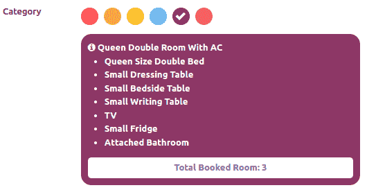

# 15

# Web 客户端开发

Odoo 的 Web 客户端，或后端，是员工大部分时间所在的地方。

在*第九章**，后端视图*中，您看到了如何使用后端提供的现有功能。在这里，我们将探讨如何扩展和定制这些功能。

`web`模块包含与 Odoo 用户界面相关的所有内容。

本章中的所有代码都将依赖于`web`模块。如您所知，Odoo 有两个不同的版本（企业版和社区版）。

社区版本使用`web`模块进行用户界面，而企业版本使用社区`web`模块的扩展版本，即`web_enterprise`模块。

企业版本提供的功能比社区版本更多，包括移动兼容性、可搜索菜单和材料设计。在这里，我们将使用社区版本。不用担心——在社区版中开发的模块在企业版中也能完美运行，因为内部`web_enterprise`依赖于社区`web`模块，并为其添加了一些功能。

重要信息

与其他 Odoo 版本相比，Odoo 17 的后端 Web 客户端略有不同。它包含两个不同的框架来维护 Odoo 后端的 GUI。第一个是基于小部件的遗留框架，第二个是称为**Odoo Web Library**（**OWL**）的现代基于组件的框架。OWL 是 Odoo v16 中引入的新 UI 框架。两者都使用 QWeb 模板进行结构，但在语法和这些框架的工作方式上都有显著的变化。

尽管 Odoo 17 有一个新的框架 OWL，但 Odoo 并没有在所有地方使用这个新框架。大部分 Web 客户端仍然使用旧的基于小部件的框架。在本章中，我们将看到如何使用基于小部件的框架来定制 Web 客户端。在下一章中，我们将探讨 OWL 框架。

在本章中，您将学习如何创建新的字段小部件以获取用户的输入。我们还将从头创建一个新的视图。阅读本章后，您将能够在 Odoo 后端创建自己的 UI 元素。

注意

Odoo 的用户界面高度依赖于 JavaScript。在本章中，我们将假设您具备 JavaScript、jQuery 和 SCSS 的基本知识。

在本章中，我们将介绍以下菜谱：

+   创建自定义小部件

+   使用客户端 QWeb 模板

+   向服务器发起 RPC 调用

+   创建新视图

+   调试客户端代码

+   通过导游改进入职体验

+   移动应用 JavaScript

# 技术要求

本章的技术要求是在线 Odoo 平台。

本章中使用的所有代码都可以从 GitHub 仓库[`github.com/PacktPublishing/Odoo-17-Development-Cookbook-Fifth-Edition/tree/main/Chapter15`](https://github.com/PacktPublishing/Odoo-17-Development-Cookbook-Fifth-Edition/tree/main/Chapter15)下载。

# 创建自定义小部件

正如你在*第九章**，后端视图*中看到的，我们可以使用小部件以不同的格式显示某些数据。例如，我们使用了`widget='image'`将二进制字段显示为图像。为了演示如何创建自己的小部件，我们将编写一个小部件，允许用户选择一个整数字段，但我们将以不同的方式显示它。而不是输入框，我们将显示一个颜色选择器，以便我们可以选择一个颜色数字。在这里，每个数字都将映射到其相关的颜色。

## 准备工作

对于这个配方，我们将使用具有基本字段和视图的`my_hostel`模块。你将在 GitHub 仓库的`Chapter15/00_initial_module`目录中找到基本的`my_hostel`模块。

## 如何操作…

我们将添加一个包含我们小部件逻辑的 JavaScript 文件，一个包含设计逻辑的 XML 文件，以及一个用于一些样式的 SCSS 文件。然后，我们将向图书表单添加一个整数字段以使用我们新的小部件。

按照以下步骤添加新的字段小部件：

1.  这个小部件可以用很少的 JavaScript 编写。让我们创建一个名为`static/src/js/field_widget.js`的文件，如下所示：

    ```py
    /** @odoo-module */
    import { Component} from "@odoo/owl";
    import { registry } from "@web/core/registry";
    ```

1.  通过扩展`Component`创建你的小部件：

    ```py
    export class CategColorField extends Component {
    ```

1.  捕获 JavaScript 颜色小部件代码：

    ```py
    export class CategColorField extends Component {
       setup() {
         this.totalColors = [1,2,3,4,5,6];
         super.setup();
      }
      clickPill(value) {
        this.props.record.update({ [this.props.name]: value });
      }
    }
    ```

1.  设置小部件的`template`和支持的字段类型：

    ```py
    CategColorField.template = "CategColorField";
    CategColorField.supportedTypes = ["integer"];
    ```

1.  在同一文件中，将组件注册到`fields`注册表：

    ```py
    registry.category("fields").add("category_color", {
      component: CategColorField,
    });
    ```

1.  在`static/src/xml/field_widget.xml`中添加 QWeb 模板设计代码：

    ```py
    <templates xml:space="preserve">
      <t t-name="CategColorField" owl="1">
        <div>
          <t t-foreach="totalColors" t-as="color" t-key="color">
             <span t-attf-class="o_color_pill o_color_#{color}
                {{props.record.data[props.name] == color ? 'active': ''}}"
                t-att-data-value="color"
                t-on-click="() => this.clickPill(color)"/>
           </t>
           <div class="categInformationPanel
    "/>
        </div>
      </t>
    </templates>
    ```

1.  在`static/src/scss/field_widget.scss`中添加 SCSS：

    ```py
    .o_field_category_color {
      .o_color_pill {
        display: inline-block;
        height: 25px;
        width: 25px;
        margin: 4px;
        border-radius: 15px;
        position: relative;
        @for $size from 1 through length($o-colors) {
          &.o_color_#{$size - 1} {
            background-color: nth($o-colors, $size);
            &:not(.readonly):hover {
              transform: scale(1.2);
              transition: 0.3s;
              cursor: pointer;
            }
            &.active:after{
              content: "\f00c";
              display: inline-block;
              font: normal 14px/1 FontAwesome;
              font-size: inherit;
              color: #fff;
              position: absolute;
              padding: 4px;
              font-size: 16px;
            }
          }
        }
      }
    }
    ```

1.  在清单文件中注册文件：

    ```py
    'assets': {
      'web.assets_backend': [
        'my_hostel/static/src/scss/field_widget.scss',
        'my_hostel/static/src/js/field_widget.js',
        'my_hostel/static/src/xml/field_widget.xml',
      ],
    }
    ```

1.  然后，将`Category`整数字段添加到`hostel.room`模型：

    ```py
    category = fields.Integer('Category')
    ```

1.  将类别字段添加到宿舍表单视图，然后添加`widget="category_color"`：

    ```py
    <field name="category" widget="category_color"/>
    ```

更新模块以应用更改。更新后，打开宿舍表单视图，你将看到类别颜色选择器，如下面的截图所示：


图 15.1 – 自定义小部件的显示方式

## 它是如何工作的…

在*步骤 1*中，我们导入了`Component`和注册表。

在*步骤 2*中，我们通过扩展`Component`创建了一个`CategColorField`。通过这种方式，`CategColorField`将获得`Component`的所有属性和方法。

在*步骤 3*中，我们继承了`setup`方法并设置了`this.totalColors`属性的值。我们将使用这个变量来决定颜色药丸的数量。我们希望显示六个颜色药丸，因此我们分配了`[1,2,3,4,5,6]`。

在*步骤 4*中，我们添加了`clickPill`处理方法来管理药丸点击。为了设置字段值，我们使用了`this.props.update`方法。此方法是从`Component`类添加的。

在*步骤 5*中，我们添加了一个模板名称，其中我们渲染了`CategColorField`设计并设置了支持类型。

`supportedTypes`已被用于决定哪些字段类型由这个小部件支持。在我们的例子中，我们想要为整数字段创建一个小部件。

在*步骤 6*中，在将组件注册到字段注册表之后。

最后，我们导出了我们的`widget`类，以便其他插件可以扩展它或从它继承。然后，我们在`hostel.room`模型中添加了一个名为 category 的新整数字段。我们还添加了具有`widget="category_color"`属性的相同字段到表单视图中。这将显示我们的小部件而不是默认的整数字段。

# 使用客户端 QWeb 模板

就像在 JavaScript 中程序性地创建 HTML 代码是一个坏习惯一样，你应在客户端 JavaScript 代码中仅创建最小 DOM 元素。幸运的是，客户端有一个模板引擎可用。

Odoo 中也有一个客户端模板引擎。这个模板引擎被称为**Qweb 模板**，完全在 JavaScript 代码中执行并在浏览器中渲染。

## 准备工作

对于这个配方，我们将使用之前配方中的`my_hostel`模块，并在类别颜色图标下方添加`informationPanel`。

使用`renderToElement`，我们渲染类别信息元素并将其设置在`informationPanel`上。

## 如何操作...

我们需要将 QWeb 定义添加到清单中并更改 JavaScript 代码，以便我们可以使用它。按照以下步骤开始操作：

1.  导入`@web/core/utils/render`并将`renderToElement`引用提取到变量中，如下面的代码所示：

    ```py
    import { renderToElement } from "@web/core/utils/render";
    ```

1.  将模板文件添加到`static/src/xml/field_widget.xml`：

    ```py
    <t t-name="CategColorField">
      <div>
        <t t-foreach="totalColors" t-as="color" t-key="color">
           <span t-attf-class="o_color_pill o_color_#{color}
                {{props.record.data[props.name] == color ? 'active': ''}}"
                t-att-data-value="color"
                t-on-click="() => this.clickPill(color)"
                t-on-mouseover.prevent="categInfo"/>
        </t>
        <div class="categInformationPanel"/>
      </div>
    </t>
    <t t-name="CategInformation">
      <div t-attf-class="categ_info o_color_pill o_color_#{value}">
        <t t-if="value == 1">
          Single Room With AC<br/>
          <ul>
            <li>
              Small Dressing Table
            </li>
            <li>
              Small Bedside Table
            </li>
            <li>
              Small Writing Table
            </li>
            <li>
              Attached Bathroom
            </li>
          </ul>
        </t>
        <t t-if="value == 2">
          Single Room With None AC<br/>
          <ul>
            <li>
              Small Dressing Table
            </li>
            <li>
              Small Bedside Table
            </li>
            <li>
              Small Writing Table
            </li>
            <li>
              Attached Bathroom
            </li>
          </ul>
        </t>
        <t t-if="value == 3">
          King Double Room With AC<br/>
          <ul>
            <li>
              King Size Double Bed
            </li>
            <li>
              Small Dressing Table
            </li>
            <li>
              Small Bedside Table
            </li>
            <li>
              Small Writing Table
            </li>
            <li>
              TV
            </li>
            <li>
              Small Fridge
            </li>
            <li>
              Attached Bathroom
            </li>
          </ul>
        </t>
        <t t-if="value == 4">
          King Double Room With None AC<br/>
          <ul>
            <li>
              King Size Double Bed
            </li>
            <li>
              Small Dressing Table
            </li>
            <li>
              Small Bedside Table
            </li>
            <li>
              Small Writing Table
            </li>
            <li>
              TV
            </li>
            <li>
              Small Fridge
            </li>
            <li>
              Attached Bathroom
            </li>
          </ul>
        </t>
        <t t-if="value == 5">
          Queen Double Room With AC<br/>
          <ul>
            <li>
              Queen Size Double Bed
            </li>
            <li>
              Small Dressing Table
            </li>
            <li>
              Small Bedside Table
            </li>
            <li>
              Small Writing Table
            </li>
            <li>
              TV
            </li>
            <li>
              Small Fridge
            </li>
            <li>
              Attached Bathroom
            </li>
          </ul>
        </t>
        <t t-if="value == 6">
          Queen Double Room With None AC<br/>
          <ul>
            <li>
              Queen Size Double Bed
            </li>
            <li>
              Small Dressing Table
            </li>
            <li>
              Small Bedside Table
            </li>
            <li>
              Small Writing Table
            </li>
            <li>
              TV
            </li>
            <li>
              Small Fridge
            </li>
            <li>
              Attached Bathroom
            </li>
          </ul>
        </t>
      </div>
    </t>
    ```

1.  添加鼠标悬停函数，在这个函数中，简单地使用`renderToElement.render`渲染类别信息元素，并将`categ`信息元素附加到`categInformationPanel`：

    ```py
    categInfo(ev){
      var $target = $(ev.target);
      var data = $target.data();
      $target.parent().find(".categInformationPanel").html(
        $(renderToElement('CategInformation',{
          'value': data.value,
          'widget': this
        }))
      )
    }
    ```

1.  在`static/src/scss/field_widget.scss`中添加 SCSS 以设置类别信息样式：

    ```py
    .categInformationPanel .categ_info{
      padding: 10px;
      height: 100%;
      width: 100%;
      color: white;
      font-weight: bold;
    }
    ```

1.  在你的清单中注册 QWeb 文件：

    ```py
    'assets': {
      'web.assets_backend': [
        'my_hostel/static/src/scss/field_widget.scss',
        'my_hostel/static/src/js/field_widget.js',
        'my_hostel/static/src/xml/field_widget.xml',
      ],
    }
    ```

重新启动服务器以应用更改。重启后，打开酒店表单视图，你将看到类别信息面板，如下面的截图所示：


图 15.2 – 类别信息面板

当我们悬停在类别颜色图标上时：


图 15.3 – 悬停在类别图标上显示类别信息

## 它是如何工作的...

由于在*第十四章*的“创建或修改模板 – QWeb”配方中已经对 QWeb 的基础进行了全面讨论，*CMS 网站开发*，我们将关注这里的不同之处。首先，你需要意识到我们正在处理的是客户端的 JavaScript QWeb 实现，而不是服务器端的 Python 实现。这意味着你无法访问浏览记录或环境；你只能访问从`renderToElement`函数传递的参数。

在我们的案例中，我们通过 `widget` 键传递了当前对象。这意味着你应该在组件的 JavaScript 代码中拥有所有智能，并且你的模板只能访问属性，或者可能是函数。鉴于我们可以访问组件上的所有可用属性，我们可以在模板中通过检查悬停类别颜色属性来简单地检查值。

由于客户端 QWeb 与 QWeb 视图无关，因此有一个不同的机制使这些模板为网络客户端所知——通过将它们添加到你的附加组件的清单中，作为相对于附加组件根目录的文件名列表。

## 还有更多…

在这里使用 QWeb 的原因是为了扩展性。例如，如果我们想从另一个模块向我们的组件添加信息图标，我们将使用以下代码在每个药丸中添加一个图标：

```py
<t t-name="CategInformationCustom" t-inherit="my_hostel.CategInformation"
    t-inherit-mode="extension">
    <xpath expr='//t[@t-if="value == 1"]' position="before">
      <i class="fa fa-info-circle" aria-hidden="true"></i>
    </xpath>
  </t>
```


图 15.4 – 类别信息面板上的信息图标

注意

如果你想了解更多关于 QWeb 模板的信息，请参考以下要点：

- 客户端 QWeb 引擎的错误消息和处理方式比 Odoo 的其他部分不太方便。一个小错误通常意味着什么都不会发生，对于初学者来说很难继续下去。

- 幸运的是，对于客户端 QWeb 模板有一些调试语句，将在本章后面的 *调试客户端代码* 菜谱中描述。

# 向服务器发起 RPC 调用

迟早你的组件将需要从服务器查找一些数据。在这个菜谱中，我们将向类别信息面板添加一个已预订面板。当用户将光标悬停在类别颜色药丸元素上时，预订面板将显示与该类别颜色相关的已预订房间数量。我们将向服务器发起 RPC 调用来获取与该特定类别关联的数据的预订计数。

## 准备工作

对于这个菜谱，我们将使用之前菜谱中的 `my_hostel` 模块。

## 如何操作…

按照以下步骤向服务器发起 RPC 调用并在 `colorPreviewPanel` 中显示结果：

1.  导入 `@odoo/owl` 并将 `onWillStart,onWillUpdateProps` 引用提取到一个变量中，如下面的代码所示：

    ```py
    import { Component, onWillStart , onWillUpdateProps} from "@odoo/owl";
    ```

1.  将 `onWillStart` 方法添加到 `setup` 方法中并调用我们的自定义 `loadColorData` 方法：

    ```py
    onWillStart(() => {
      this.loadCategInformation();
    });
    onWillUpdateProps(() => {
      this.loadCategInformation();
    });
    ```

1.  添加 `loadCategInformation` 方法并在 RPC 调用中设置 `categInfoData`：

    ```py
    async loadCategInformation() {
      var self = this;
      self.categoryInfo = {};
      var resModel = self.env.model.root.resModel;
      var domain = [];
      var fields = ['category'];
      var groupby = ['category'];
      const categInfoPromise = await self.env.services.orm.readGroup(
      resModel,
      domain,
      fields,
      groupby
    );
      categInfoPromise.map((info) => {
        self.categoryInfo[info.category] = info.category_count;
      });
    }
    ```

1.  更新 `CategoryInformation` 模板并添加计数数据：

    ```py
    <t t-name="CategInformationCustom" t-inherit="my_hostel.CategInformation"
        t-inherit-mode="extension">
        <xpath expr='//t[@t-if="value == 1"]' position="before">
          <i class="fa fa-info-circle" aria-hidden="true"></i>
        </xpath>
        <xpath expr="//div" position="inside">
          <div class="text-center"
             style="color:gray;background: white;padding:3px;padding: 5px;border-radius: 5px;">
            Total Booked Rooms: <t t-esc="widget.categoryInfo[value] or 0"/>
          </div>
        </xpath>
      </t>
    ```

更新模块以应用更改。更新后，你将看到类别信息的计数，如下面的截图所示：



图 15.5 – 使用 RPC 获取数据

## 它是如何工作的…

`onWillStart` 钩子将在组件第一次渲染之前被调用。如果我们需要在组件渲染到视图之前执行一些操作，例如加载一些初始数据，这将非常有用。

`onWillUpdateProps` 也是一个异步钩子，每当对相关组件进行更新时都会被调用。使用这个惊人的钩子可以保持 OWL 框架的响应式特性。

在处理数据访问时，我们依赖于由 `ORM` 提供的 `_rpc` 函数，用于 `search`、`read`、`write` 或在这种情况下，`read_group`。

在 *步骤 1* 中，我们进行了 RPC 调用，并在当前模型上调用了 `read_group` 方法，在我们的例子中是 `hostel.room`。我们根据 `category` 字段对数据进行分组，以便 RPC 调用将返回按 `category` 分组的书籍数据，并在 `category_count` 键中添加一个聚合。我们还映射了 `category_count` 和 `category` 索引在 `categoryInfo` 中，以便我们可以在 QWeb 模板中使用它。

*步骤 2* 没有什么特别之处。我们只是初始化了 bootstrap 工具提示。

在 *步骤 3* 中，我们使用了 `categoryInfo` 来设置显示分类信息所需的属性。在 `loadCategInformation` 方法中，我们通过 `this.categoryInfo` 分配了一个颜色映射，这样您就可以通过 `widget.categoryInfo` 在 QWeb 模板中访问它们。这是因为我们传递了小部件引用；这是 `renderToElement` 方法。

## 参见

Odoo 的 RPC 返回 JavaScript 的原生 `Promise` 对象。一旦 `Promise` 解决，您将获得请求的数据。您可以在以下位置了解更多关于 `Promise` 的信息：[`developer.mozilla.org/en-US/docs/Web/JavaScript/Reference/Global_Objects/Promise`](https://developer.mozilla.org/en-US/docs/Web/JavaScript/Reference/Global_Objects/Promise)

# 创建新视图

正如您在 *第九章* 中所看到的，*后端视图*，有不同类型的视图，例如表单、列表和看板。在本菜谱中，我们将创建一个新视图。此视图将显示房间列表，以及他们的学生。

## 准备工作

对于这个菜谱，我们将使用前一个菜谱中的 `my_hostel` 模块。请注意，视图是非常复杂的结构，每个视图都有不同的目的和实现。本菜谱的目的是让您了解 `MVC` 模式视图以及如何创建简单的视图。在本菜谱中，我们将创建一个名为 `m2m_group` 的视图，其目的是显示分组记录。为了将记录分成不同的组，视图将使用 `many2x` 字段数据。在 `my_hostel` 模块中，我们有 `room_id` 字段。在这里，我们将根据房间分组学生，并在卡片中显示他们。

此外，我们将在控制面板中添加一个新按钮。借助此按钮，您将能够添加新的学生记录。我们还将向房间的卡片中添加一个按钮，以便我们可以将用户重定向到另一个视图。

## 如何做到这一点…

按照以下步骤添加一个名为 `m2m_group` 的新视图：

1.  在 `ir.ui.view` 中添加一个新的视图类型：

    ```py
    class View(models.Model):
      _inherit = 'ir.ui.view'
      type = fields.Selection(selection_add=[('m2m_group', 'M2m Group')])
    ```

1.  在 `ir.actions.act_window.view` 中添加一个新的视图模式：

    ```py
    class ActWindowView(models.Model):
      _inherit = 'ir.actions.act_window.view'
      view_mode = fields.Selection(selection_add=[
    ('m2m_group', 'M2m group')], ondelete={'m2m_group': 'cascade'})
    ```

1.  通过从基模型继承来添加一个新方法。此方法将从 JavaScript 模型中调用（有关更多详细信息，请参阅 *步骤 4*）：

    ```py
    class Base(models.AbstractModel):
      _inherit = 'base'
      @api.model
      def get_m2m_group_data(self, domain, m2m_field):
        records = self.search(domain)
        result_dict = {}
        for record in records:
          for m2m_record in record[m2m_field]:
            if m2m_record.id not in result_dict:
              result_dict[m2m_record.id] = {
                'name': m2m_record.name,
                'children': [],
                'model': m2m_record._name
              }
            result_dict[m2m_record.id]['children'].append({
              'name': record.display_name,
              'id': record.id,
            })
        return result_dict
    ```

1.  添加一个名为`/static/src/js/m2m_group_model.js`的新文件，并将以下内容添加到其中：

    ```py
    /** @odoo-module **/
    import { Model } from "@web/model/model";
    export class M2mGroupModel extends Model {
      setup(params) {
        const metaData = Object.assign({}, params.metaData, {});
        this.data = params.data || {};
        this.metaData = this._buildMetaData(metaData);
        this.m2m_field = this.metaData.m2m_field;
      }
      _buildMetaData(params) {
        const metaData = Object.assign({}, this.metaData, params);
        return metaData;
      }
      async load(searchParams) {
        var self = this;
        const model = self.metaData.resModel;
        const method = 'get_m2m_group_data'
        const m2m_field = self.m2m_field
        const result = await this.orm.call(
          model,
          method,
          [searchParams.domain, m2m_field]
        )
        self.data = result;
        return result;
      }
    }
    ```

1.  添加一个名为`/static/src/js/m2m_group_controller.js`的新文件，并将以下内容添加到其中：

    ```py
    /** @odoo-module **/
    import { useService } from "@web/core/utils/hooks";
    import { Layout } from "@web/search/layout";
    import { useModelWithSampleData } from "@web/model/model";
    import { standardViewProps } from "@web/views/standard_view_props";
    import { Component } from "@odoo/owl";
    export class M2mGroupController extends Component {
      setup() {
        this.actionService = useService("action");
        this.model = useModelWithSampleData(this.props.Model, this.props.modelParams);
      }
      _onBtnClicked(domain) {
        this.actionService.doAction({
          type: 'ir.actions.act_window',
          name: this.model.metaData.title,
          res_model: this.props.resModel,
          views: [[false, 'list'], [false, 'form']],
          domain: domain,
        });
      }
      _onAddButtonClick(ev) {
        this.actionService.doAction({
          type: 'ir.actions.act_window',
          name: this.model.metaData.title,
          res_model: this.props.resModel,
          views: [[false, 'form']],
          target: 'new'
        });
      }
    }
    M2mGroupController.template = "M2mGroupView";
    M2mGroupController.components = { Layout };
    M2mGroupController.props = {
      ...standardViewProps,
      Model: Function,
      modelParams: Object,
      Renderer: Function,
      buttonTemplate: String,
    };
    ```

1.  添加一个名为`/static/src/js/m2m_group_renderer.js`的新文件，并将以下内容添加到其中：

    ```py
    /** @odoo-module **/
    import { Component } from "@odoo/owl";
    export class M2mGroupRenderer extends Component {
      onClickViewButton(group) {
         var children_ids = group.children.map((group_id) => {
          return group_id.id;
        });
        const domain = [['id', 'in', children_ids]]
        this.props.onClickViewButton(domain);
      }
      get groups() {
        return this.props.model.data
      }
    }
    M2mGroupRenderer.template = "M2mGroupRenderer";
    M2mGroupRenderer.props = ["model", "onClickViewButton"];
    ```

1.  添加一个名为`/static/src/js/m2m_group_arch_parser.js`的新文件，并将以下内容添加到其中：

    ```py
    /** @odoo-module **/
    import { visitXML } from "@web/core/utils/xml";
    export class M2mGroupArchParser {
      parse(arch, fields = {}) {
        const archInfo = { fields, fieldAttrs: {} };
        visitXML(arch, (node) => {
          switch (node.tagName) {
            case "m2m_group": {
              const m2m_field = node.getAttribute("m2m_field");
              if (m2m_field) {
                archInfo.m2m_field = m2m_field;
              }
              const title = node.getAttribute("string");
              if (title) {
                archInfo.title = title;
              }
              break;
            }
            case "field": {
              const fieldName = node.getAttribute("name"); // exists (rng validation)
              if (fieldName === "id") {
                break;
              }
              const string = node.getAttribute("string");
              if (string) {
                if (!archInfo.fieldAttrs[fieldName]) {
                  archInfo.fieldAttrs[fieldName] = {};
                }
                archInfo.fieldAttrs[fieldName].string = string;
              }
              const modifiers = JSON.parse(node.getAttribute("modifiers") || "{}");
              if (modifiers.invisible === true) {
                if (!archInfo.fieldAttrs[fieldName]) {
                  archInfo.fieldAttrs[fieldName] = {};
                }
                archInfo.fieldAttrs[fieldName].isInvisible = true;
                break;
              }
              break;
            }
          }
        });
        return archInfo;
      }
    }
    ```

1.  添加一个名为`/static/src/js/m2m_group_view.js`的新文件，并将以下内容添加到其中：

    ```py
    /** @odoo-module **/
    import { _lt } from "@web/core/l10n/translation";
    import { registry } from "@web/core/registry";
    import { M2mGroupArchParser } from "./m2m_group_arch_parser";
    import { M2mGroupController } from "./m2m_group_controller";
    import {  M2mGroupModel } from "./m2m_group_model";
    import { M2mGroupRenderer } from "./m2m_group_renderer";
    const viewRegistry = registry.category("views");
    export const M2mGroupView = {
      type: "m2m_group",
      display_name: _lt("Author"),
      icon: "fa fa-id-card-o",
      multiRecord: true,
      Controller: M2mGroupController,
      Renderer: M2mGroupRenderer,
      Model: M2mGroupModel,
      ArchParser: M2mGroupArchParser,
      searchMenuTypes: ["filter", "favorite"],
      buttonTemplate: "ViewM2mGroup.buttons",
      props: (genericProps, view) => {
        const modelParams = {};
        const { arch, fields, resModel } = genericProps;
        // parse arch
        const archInfo = new view.ArchParser().parse(arch);
        modelParams.metaData = {
          m2m_field: archInfo.m2m_field,
          fields: fields,
          fieldAttrs: archInfo.fieldAttrs,
          resModel: resModel,
          title: archInfo.title || _lt("Untitled"),
          widgets: archInfo.widgets,
        };
        return {
          ...genericProps,
          Model: view.Model,
          modelParams,
          Renderer: view.Renderer,
          buttonTemplate: view.buttonTemplate,
        };
      },
    };
    viewRegistry.add("m2m_group", M2mGroupView);
    ```

1.  将视图的 QWeb 模板添加到`/static/src/xml/m2m_group_controller.xml`文件中：

    ```py
    <?xml version="1.0" encoding="UTF-8"?>
    <templates xml:space="preserve">
      <t t-name="M2mGroupView" owl="1">
        <div t-att-class="props.className" t-ref="root">
          <Layout display="props.display">
            <t t-set-slot="layout-buttons">
               <t t-call="{{ props.buttonTemplate }}"/>
            </t>
             <div>
               <t t-component="props.Renderer"
                model="model"
                onClickViewButton="group => this._onBtnClicked(group)"/>
             </div>
          </Layout>
        </div>
      </t>
    </templates>
    ```

1.  将视图的 QWeb 模板添加到`/static/src/xml/m2m_group_renderer.xml`文件中：

    ```py
    <?xml version="1.0" encoding="UTF-8"?>
    <templates xml:space="preserve">
      <t t-name="M2mGroupRenderer" owl="1">
        <div class="row ml16 mr16">
          <div t-foreach="groups" t-as="group" class="col-3" t-key="group">
            <t t-set="group_data" t-value="groups[group]" />
            <div class="card mt16">
              
              <div class="card-body">
                <h5 class="card-title mt8">
                  <t t-esc="group_data['name']"/>
                </h5>
              </div>
              <ul class="list-group list-group-flush">
                <t t-foreach="group_data['children']" t-as="child" t-key="child.id">
                  <li class="list-group-item">
                    <i class="fa fa-user"/><t t-esc="child.name"/>
                  </li>
                </t>
              </ul>
              <div class="card-body">
                <a href="#" class="btn btn-sm btn-primary o_primay_button"
                 t-att-data-group="group"
                 t-on-click="() => this.onClickViewButton(group_data)">View</a>
              </div>
            </div>
          </div>
        </div>
      </t>
    </templates>
    ```

1.  将视图的 QWeb 模板添加到`/static/src/xml/m2m_group_view.xml`文件中：

    ```py
    <?xml version="1.0" encoding="UTF-8"?>
    <templates xml:space="preserve">
      <t t-name="ViewM2mGroup.buttons" owl="1">
        <button type="button" class="btn btn-primary"
            t-on-click="() => this._onAddButtonClick()">
          Add Record
        </button>
      </t>
    </templates>
    ```

1.  将所有 JavaScript 和 XML 文件添加到后端资产中：

    ```py
    'assets': {
      'web.assets_backend': [
        'my_hostel/static/src/js/m2m_group_arch_parser.js',
        'my_hostel/static/src/js/my_hostel_tour.js',
        'my_hostel/static/src/js/m2m_group_view.js',
        'my_hostel/static/src/js/m2m_group_renderer.js',
        'my_hostel/static/src/js/m2m_group_model.js',
        'my_hostel/static/src/js/m2m_group_controller.js',
        'my_hostel/static/src/xml/m2m_group_controller.xml',
        'my_hostel/static/src/xml/m2m_group_renderer.xml',
        'my_hostel/static/src/xml/m2m_group_view.xml',
        'my_hostel/static/src/xml/field_widget.xml',
      ],
    },
    ```

1.  最后，添加我们为`hostel.student`模型的新视图：

    ```py
    <record id="view_hostel_student_m2m_group" model="ir.ui.view">
      <field name="name">Students</field>
      <field name="model">hostel.student</field>
      <field name="arch" type="xml">
        <m2m_group m2m_field="room_id">
        </m2m_group>
      </field>
    </record>
    ```

1.  将`m2m_group`添加到操作中：

    ```py
    <field name="view_mode">tree,m2m_group,form</field>
    ```

更新`my_hostel`模块以打开**学生**视图，然后从视图切换器打开我们刚刚添加的新视图。这看起来如下所示：


图 15.6 – 多对多分组视图


图 15.7 – 多对多分组视图

重要信息

Odoo 视图非常易于使用，并且非常灵活。然而，通常情况下，简单且灵活的事情在底层有复杂的实现。

这适用于 Odoo JavaScript 视图：它们易于使用，但实现起来复杂。它们由许多组件组成，包括模型、渲染器、控制器、视图和 QWeb 模板。在下一节中，我们已添加所有必需的组件，并为`my_hostel`模型添加了一个新视图。如果您不想手动添加所有内容，可以从本书 GitHub 仓库中的示例文件中获取模块。

## 它是如何工作的…

在*步骤 1*和*步骤 2*中，我们在`ir.ui.view`和`ir.actions.act_window.view`中注册了一个新的视图类型，称为`m2m_group`。

在*步骤 3*中，我们将`get_m2m_group_data`方法添加到基础中。将此方法添加到基础中将在每个模型中使该方法可用。此方法将通过 JavaScript 视图的 RPC 调用进行调用。视图将传递两个参数——`domain`和`m2m_field`。在`domain`参数中，域的值将是通过搜索视图域和操作域的组合生成的域。`m2m_field`是我们想要按其分组记录的字段名称。此字段将在视图定义中设置。

在接下来的几个步骤中，我们添加了创建视图所需的 JavaScript 文件。Odoo JavaScript 视图由视图、模型、渲染器和控制器组成。在 Odoo 代码库中，视图一词具有历史意义，因此**模型、视图、控制器**（**MVC**）在 Odoo 中变为**模型、渲染器、控制器**（**MRC**）。一般来说，视图设置模型、渲染器和控制器，并设置 MVC 层次结构，使其看起来类似于以下内容：


图 15.8 – 视图组件

其任务是获取一组字段、架构、上下文和一些其他参数，然后构建一个控制器/渲染器/模型三元组：

+   视图的角色是正确设置 MVC 模式中的每一部分，并使用正确的信息。通常，它必须处理架构字符串并提取视图其他部分所需的数据。

    注意，视图是一个类，而不是小部件。一旦完成其任务，它就可以被丢弃。

+   渲染器只有一个任务：在 DOM 元素中表示正在查看的数据。每个视图都可以以不同的方式渲染数据。此外，它应该监听适当的用户操作，并在必要时通知其父级（控制器）。渲染器是 MVC 模式中的 V。

+   模型：其任务是获取并保持视图的状态。通常，它以某种方式表示数据库中的一组记录。模型是业务数据的所有者。它是 MVC 模式中的 M。

+   控制器：其任务是协调渲染器和模型。它也是整个 Web 客户端的主要入口点。例如，当用户在搜索视图中更改某些内容时，控制器的`update`方法将被调用，并带有适当的信息。它是 MVC 模式中的 C。

注意

视图的 JavaScript 代码被设计成可以在视图管理器/操作管理器之外使用。它可以用于客户端操作，或者可以在公共网站上显示（对资产进行一些工作）。

在*步骤 8*中，我们将 JavaScript 和 XML 文件添加到资产中。

最后，在最后两个步骤中，我们为`hostel.student`模型添加了一个视图定义。

在*步骤 9*中，我们为视图使用了`<m2m_group>`标签，并且还传递了`m2m_field`属性作为选项。这将传递给模型以从服务器获取数据。

# 客户端代码调试

本书包含一个专门用于调试服务器端代码的章节，*第七章*，*调试模块*。对于客户端部分，你将在这个菜谱中获得快速入门。

## 准备工作

这个菜谱不依赖于特定的代码，但如果你想能够精确地重现正在发生的事情，请获取上一个菜谱的代码。

## 如何操作...

客户端脚本调试困难的原因在于，Web 客户端严重依赖于 jQuery 的异步事件。鉴于断点会停止执行，因此由于时间问题导致的错误在调试时可能不会发生。我们稍后会讨论一些策略：

1.  对于客户端调试，您需要通过资产激活调试模式。如果您不知道如何通过资产激活调试模式，请阅读*第一章*中的*激活 Odoo 开发者工具*配方，*安装 Odoo 开发环境*。

1.  在您感兴趣的 JavaScript 函数中调用`debugger`：

    ```py
    debugger;
    ```

1.  如果您遇到时间同步问题，请通过 JavaScript 函数登录控制台：

    ```py
        console.log("Debugging call…….");
    ```

1.  如果您想在模板渲染期间进行调试，请从 QWeb 调用调试器：

    ```py
    <t t-debug="" />
    ```

1.  您还可以让 QWeb 登录控制台，如下所示：

    ```py
    <t t-log="myvalue" />
    ```

所有这些都依赖于您的浏览器提供适当的调试功能。虽然所有主流浏览器都这样做，但在这里我们只关注 Chromium，用于演示目的。要使用调试工具，请通过点击右上角的菜单按钮并选择**更多工具** | **开发者工具**来打开它们：


图 15.9 – 在 Chrome 中打开开发者工具

## 它是如何工作的…

当调试器打开时，您应该看到以下截图类似的内容：


图 15.10 – 在 Chrome 中打开开发者工具

在这里，您可以通过单独的标签页访问许多不同的工具。前一个截图中的当前活动标签是 JavaScript 调试器，我们通过点击行号在第 31 行设置了断点。每次我们的小部件获取用户列表时，执行应该停止在此行，调试器将允许您检查变量或更改它们的值。在右侧的监视列表中，您还可以调用函数来尝试它们的效果，而无需不断保存您的脚本文件并重新加载页面。

我们之前描述的调试语句在您打开开发者工具后表现相同。然后执行将停止，浏览器将切换到**源**标签页，打开有问题的文件，并突出显示带有调试语句的行。

之前提到的两种日志记录方法最终会出现在**控制台**标签页上。在任何情况下，如果出现问题，您都应该首先检查这个标签页，因为如果由于语法错误或类似的基本问题而导致某些 JavaScript 代码根本无法加载，您将在这里看到一个错误消息，解释正在发生的事情。

## 还有更多…

使用**元素**选项卡检查浏览器当前显示的页面的 DOM 表示。这有助于您熟悉现有小部件生成的 HTML 代码，并允许您在一般上玩转类和 CSS 属性。这是一个测试布局更改的绝佳资源。

**网络**选项卡提供了当前页面发出的请求的概述以及它们花费的时间。当调试缓慢的页面加载时，这很有帮助，因为在**网络**选项卡中，您通常会找到请求的详细信息。如果您选择一个请求，您可以检查传递给服务器的有效载荷和返回的结果，这有助于您找出客户端意外行为的原因。您还会看到发出的请求的状态代码，例如，如果因为拼写错误找不到资源（例如文件名），则会显示 404。

# 使用游览改进入门

在开发大型应用程序后，向最终用户解释软件流程至关重要。Odoo 框架包括一个内置的游览管理器。使用这个游览管理器，您可以引导最终用户学习特定的流程。在这个菜谱中，我们将创建一个游览，以便我们可以在图书馆中创建一本书。

## 准备工作

我们将使用之前菜谱中的`my_hostel`模块。在没有演示数据的数据库中，游览仅在数据库中显示，所以如果您使用的是带有演示数据的数据库，请为此菜谱创建一个新的没有演示数据的数据库。

## 如何操作...

要向旅舍添加游览，请遵循以下步骤：

1.  添加一个新的`/static/src/js/my_hostel_tour.js`文件，包含以下代码：

    ```py
    /** @odoo-module **/
    import { _t } from "@web/core/l10n/translation";
    import { registry } from "@web/core/registry";
    import { markup } from "@odoo/owl"
    import { stepUtils } from "@web_tour/tour_service/tour_utils";
    registry.category("web_tour.tours").add('hostel_tour',  {
      url: "/web",
      rainbowManMessage: _t("Congrats, best of luck catching such big fish! :)"),
      sequence: 5,
      steps: () => [stepUtils.showAppsMenuItem(), {
        trigger: '.o_app[data-menu-xmlid="my_hostel.hostel_main_menu"]',
        content: markup(_t("Ready to launch your <b>hostel</b>?")),
        position: 'bottom',
      }, {
        trigger: '.o_list_button_add',
        content: markup(_t("Let's create new room.")),
        position: "bottom",
      },{
        trigger: '.o_form_button_save',
        content: markup(_t('Save this room record')),
        position: "bottom",
      }]
    });
    ```

1.  在后端资源中添加游览 JavaScript 文件：

    ```py
    'assets': {
      'web.assets_backend': [
        'my_hostel/static/src/scss/field_widget.scss',
        'my_hostel/static/src/js/field_widget.js',
        'my_hostel/static/src/js/my_hostel_tour.js',
        'my_hostel/static/src/xml/field_widget.xml',
      ],
    },
    ```

更新模块并打开 Odoo 后端。此时，您将看到游览，如下面的截图所示：

或者，您可以点击调试图标并点击**开始游览**。


图 15.11 – 用户入门游览步骤

它显示在**游览**弹出窗口下方。


图 15.12 – 用户入门游览步骤

点击开始图标按钮以查看**准备好启动您的旅舍了吗？**游览内容：


图 15.13 – 用户入门游览步骤

## 它是如何工作的...

游览管理器在**web_tour.tours**类别中可用。

在第一步中，我们导入了`registry`。然后我们可以使用`registry.category("web_tour.tours")`添加一个新的游览。我们使用`hostel_tour`名称注册了我们的游览，并传递了该游览应运行的 URL。

下一个参数是这些游览步骤的列表。游览步骤需要三个值。触发器用于选择游览应显示的元素。这是一个 JavaScript 选择器。我们使用了菜单的 XML ID，因为它在 DOM 中可用。

第一步，`stepUtils.showAppsMenuItem()`，是主菜单的预定义步骤。下一个键是内容，当用户悬停在导游下拉菜单上时显示。我们使用了 `markup(_t())` 函数，因为我们想翻译字符串，而位置键用于决定导游下拉菜单的位置。可能的值是 top（顶部）、right（右侧）、left（左侧）或 bottom（底部）。

重要信息

导游改善了用户的入职体验并管理集成测试。当您以测试模式内部运行 Odoo 时，它也会运行导游，如果导游未完成，则会导致测试用例失败。

# 移动应用程序 JavaScript

Odoo v10 引入了 Odoo 移动应用程序。它提供了一些小工具以执行移动操作，例如振动手机、显示提示消息和扫描二维码。

## 准备工作

我们将使用之前菜谱中的 `my_hostel` 模块。当我们从移动应用程序更改颜色字段的值时，我们将显示提示。

警告

Odoo 移动应用程序仅支持企业版，因此如果您没有企业版，则无法对其进行测试。

## 如何操作...

按照以下步骤在 Odoo 移动应用程序中显示提示消息：

```py
import mobile from "@web_mobile/js/services/core";
clickPill(value) {
    if (mobile.methods.showToast) {
      mobile.methods.showToast({ 'message': 'Color changed' });
    }
    this.props.record.update({ [this.props.name]: value });
  }
```

更新模块并在移动应用程序中打开 `hostel.room` 模型的表单视图。当您更改颜色时，您将看到提示，如下面的截图所示：


图 15.14 – 颜色更改时的提示

## 它是如何工作的...

`@web_mobile/js/services/core` 提供了移动设备和 Odoo JavaScript 之间的桥梁。它公开了一些基本移动工具。在我们的示例中，我们使用了 `showToast` 方法在移动应用程序中显示提示。我们还需要检查函数的可用性。这样做的原因是某些手机可能不支持一些功能。例如，如果设备没有摄像头，则无法使用 `scanBarcode()` 方法。在这种情况下，为了避免回溯，我们需要用 `if` 条件将这些方法包裹起来。

## 更多...

Odoo 中可以找到的移动工具如下：

+   `showToast()`: 显示提示消息

+   `vibrate()`: 使手机振动

+   `showSnackBar()`: 显示带有按钮的 snack bar

+   `showNotification()`: 显示移动通知

+   `addContact()`: 向电话簿添加新联系人

+   `scanBarcode()`: 扫描二维码

+   `switchAccount()`: 在 Android 中打开账户切换器

要了解更多关于移动 JavaScript 的信息，请参阅 [`www.odoo.com/documentation/16.0/developer/reference/frontend/mobile.html`](https://www.odoo.com/documentation/16.0/developer/reference/frontend/mobile.html)。
