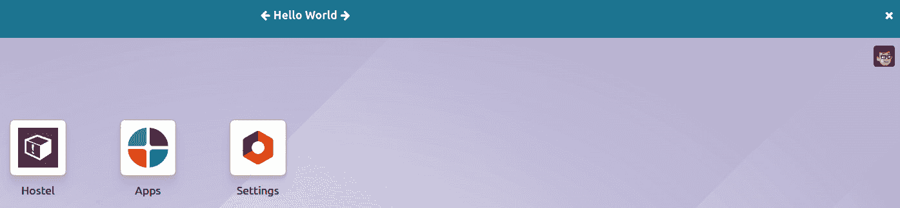

# 16

# Odoo Web Library (OWL)

Odoo V17 JavaScript 框架使用一个名为 **OWL**（代表 **Odoo Web Library**）的自定义组件框架。它是一个受 **Vue** 和 **React** 灵感启发的声明式组件系统。**OWL** 是一个基于组件的 UI 框架，并使用 QWeb 模板进行结构。与 Odoo 的传统小部件系统相比，OWL 非常快，并引入了大量的新功能，包括 **hooks**、**reactivity**、**子组件**的 **自动实例化**以及更多。

在本章中，我们将学习如何使用 OWL 组件生成交互式 UI 元素。我们将从一个最小的 OWL 组件开始，然后我们将了解组件的生命周期。最后，我们将为表单视图创建一个新的字段小部件。在本章中，我们将涵盖以下菜谱：

+   创建 OWL 组件

+   在 OWL 组件中管理用户操作

+   使用钩子制作 OWL 组件

+   理解 OWL 组件的生命周期

+   在表单视图中添加 OWL 字段

注意

你可能会问这样一个问题：为什么 Odoo 不使用一些知名的 JavaScript 框架，比如 React.js 或 Vue.js？请查看以下链接获取更多信息：[`github.com/odoo/owl/blob/master/doc/miscellaneous/comparison.md`](https://github.com/odoo/owl/blob/master/doc/miscellaneous/comparison.md)。

您可以参考[`github.com/odoo/owl`](https://github.com/odoo/owl)了解 OWL 框架的更多信息。

# 技术要求

OWL 组件使用 ES6 类定义。在本章中，我们将使用一些 ES6 语法。此外，一些 ES6 语法在旧浏览器中不受支持，所以请确保您正在使用最新版本的 Chrome 或 Firefox。您可以在[`github.com/PacktPublishing/Odoo-17-Development-Cookbook-Fifth-Edition/tree/main/Chapter16`](https://github.com/PacktPublishing/Odoo-17-Development-Cookbook-Fifth-Edition/tree/main/Chapter16)找到本章的代码。

# 创建 OWL 组件

OWL 的主要构建块是组件和模板。

在 OWL 中，UI 的每个部分都由一个组件管理：它们持有逻辑并定义用于渲染用户界面的模板

本菜谱的目标是学习 OWL 组件的基础知识。我们将创建一个最小的 OWL 组件并将其附加到 Odoo 网络客户端。在这个菜谱中，我们将创建一个用于小型水平栏的组件，其中包含一些文本。

## 准备工作

对于这个菜谱，我们将使用具有基本字段和视图的 `my_hostel` 模块。您可以在 GitHub 仓库的[`github.com/PacktPublishing/Odoo-17-Development-Cookbook-Fifth-Edition/tree/main/Chapter16/00_initial_module/my_hostel`](https://github.com/PacktPublishing/Odoo-17-Development-Cookbook-Fifth-Edition/tree/main/Chapter16/00_initial_module/my_hostel)目录中找到基本的 `my_hostel` 模块。

## 如何操作...

我们将向 Odoo 网页客户端添加一个小型水平栏组件。按照以下步骤将您的第一个组件添加到 Odoo 网页客户端：

1.  在 `my_hostel/static/src/js/component.js` JavaScript 文件中添加一个新的模块命名空间：

    ```py
        odoo.define('my_hostel.component', [], function (require) {
        "use strict";
        console.log("Load component......");
    });
    ```

1.  将组件 JavaScript 添加到 `assets`：

    ```py
    'assets': {
        'web.assets_backend': [
            'my_hostel/static/src/js/component.js',
        ],
    },
    ```

1.  在 *步骤 1* 中创建的 `component.js` 文件中定义 OWL 工具：

    ```py
    const { Component, mount, xml , whenReady } = owl;
    ```

1.  将 OWL 组件及其基本模板添加到 *步骤 1* 中创建的 `component.js` 文件：

    ```py
    class MyComponent extends Component {
        static template = xml`
            <div class="bg-info text-white text-center p-3">
                <b> Welcome To Odoo </b>
            </div>`
    }
    ```

1.  初始化并将组件添加到网页客户端。将以下内容添加到 *步骤 1* 中添加的 `component.js` 文件：

    ```py
    whenReady().then(() => {
        mount(MyComponent, document.body);
    });
    ```

安装/升级 `my_hostel` 模块以应用我们的更改。一旦我们的模块在 Odoo 中加载，您将看到水平栏，如下面的截图所示：


图 16.1 – OWL 组件

这只是一个简单的组件。目前，它不会处理任何用户事件，并且无法将其删除。

## 它是如何工作的...

在 *步骤 1* 和 *步骤 2* 中，我们添加了一个 JavaScript 文件并将其列入后端资产。如果您想了解更多关于资产的信息，请参阅 *第十四章* 中的 *静态资产管理* 菜谱，CMS *网站开发*。

在 *步骤 3* 中，我们从 OWL 初始化了一个变量。所有 OWL 工具都在一个全局变量 `owl` 下可用。在我们的例子中，我们拉取了一个 OWL 工具。我们声明了 `Component`、`mount`、`xml`、`whenReady`。`Component` 是 OWL 组件的主要类，通过扩展它，我们将创建自己的组件。

在 *步骤 4* 中，我们通过扩展 OWL 的 `Component` 类创建了我们的组件 `MyComponent`。为了简化，我们只是将 QWeb 模板添加到 `MyComponent` 类的定义中。这里，如您所注意到的，我们使用了 `` xml`…` `` 来声明我们的模板。这种语法被称为内联模板。

然而，您可以通过单独的文件加载 QWeb 模板，这通常是情况。我们将在接下来的菜谱中看到外部 QWeb 模板的示例。

注意

内联 QWeb 模板不支持通过继承进行翻译或修改。因此，始终努力从单独的文件中加载 QWeb 模板。

在 *步骤 5* 中，我们实例化了 `MyComponent` 组件并将其附加到主体上。OWL 组件是一个 ES6 类，因此您可以通过 `new` 关键字创建一个对象。然后您可以使用 `mount()` 方法将组件添加到页面。如果您注意到，我们将代码放在了 `whenReady()` 回调中。这将确保在开始使用 OWL 组件之前，所有 OWL 功能都已正确加载。

## 还有更多...

OWL 是一个独立的库，作为外部 JavaScript 库加载到 Odoo 中。您也可以在其他项目中使用 OWL 库。OWL 库的链接为[`github.com/odoo/owl`](https://github.com/odoo/owl)。如果您只想在本地机器上测试 OWL 而不设置它，还有一个在线游乐场可供使用。您可以在[`odoo.github.io/owl/playground/`](https://odoo.github.io/owl/playground/)上与 OWL 互动。

# 在 OWL 组件中管理用户动作

要使 UI 交互式，组件需要处理`用户动作`，如`点击`、`悬停`和`表单提交`。在这个菜谱中，我们将向我们的组件添加一个按钮，并将处理点击事件。

## 准备工作

对于这个菜谱，我们将继续使用前一个菜谱中的`my_hostel`模块。

## 如何操作...

在这个菜谱中，我们将向组件添加一个删除按钮。点击删除按钮后，组件将被移除。按照以下步骤添加删除按钮及其事件到组件中：

1.  更新 QWeb 模板并添加一个图标以删除栏：

    ```py
    class MyComponent extends Component {
        static template = xml`
            <div class="bg-info text-white text-center p-3">
                <b> Welcome To Odoo </b>
                <i class="fa fa-close p-1 float-end"
                   style="cursor: pointer;"
                   t-on-click="onRemove"> </i>
            </div>`
    }
    ```

1.  要删除组件，请将`onRemove`方法添加到`MyComponent`类中，如下所示：

    ```py
    class MyComponent extends Component {
        static template = xml`
            <div class="bg-info text-white text-center p-3">
                <b> Welcome To Odoo </b>
                <i class="fa fa-close p-1 float-end"
                   style="cursor: pointer;"
                   t-on-click="onRemove"> </i>
            </div>`
        onRemove(ev) {
            $(ev.target).parent().remove();
        }
    }
    ```

更新模块以应用更改。更新后，您将在栏的右侧看到一个小十字图标，如下面的截图所示：


图 16.2 – 顶部栏组件上的删除按钮

点击删除图标后，我们的 OWL 组件将被移除。当您重新加载页面时，栏将重新出现。

## 工作原理...

在*步骤 1*中，我们向组件添加了一个删除图标。我们添加了`t-on-click`属性。这将用于绑定点击事件。属性的值将是组件中的方法。在我们的例子中，我们使用了`t-on-click="onRemove"`。这意味着当用户点击删除图标时，组件中的`onRemove`方法将被调用。定义事件的语法很简单：

```py
t-on-<name of event>="<method name in component>"
```

例如，如果您想在用户将鼠标移至组件上时调用方法，您可以通过添加以下代码来实现：

```py
t-on-mouseover="onMouseover"
```

添加前面的代码后，每当用户将鼠标光标移至组件上时，OWL 将调用组件中指定的`onMouseover`方法。

在*步骤 2*中，我们添加了`onRemove`方法。当用户点击删除图标时，此方法将被调用。在方法中，我们调用了`remove()`方法，这将从 DOM 中删除组件。在接下来的菜谱中，我们将看到几个默认方法。

## 更多...

事件处理不仅限于 DOM 事件。您还可以使用您自定义的事件。例如，如果您手动触发名为`my-custom-event`的事件，您可以使用`t-on-my-custom-event`来捕获自定义触发的事件。

# 使用钩子制作 OWL 组件

OWL 是一个强大的框架，支持基于 **钩子** 的 UI 自动更新。使用更新钩子，当组件的内部状态发生变化时，组件的 UI 将自动更新。在这个菜谱中，我们将根据用户操作更新组件中的消息。

## 准备工作

对于这个菜谱，我们将继续使用上一个菜谱中的 `my_hostel` 模块。

## 如何做到这一点…

在这个菜谱中，我们将在组件中的文本周围添加箭头。当我们点击箭头时，我们将更改消息。按照以下步骤使 OWL 组件具有响应性：

1.  更新组件的 XML 模板。在文本周围添加两个带有事件指令的按钮。同时，从列表中动态检索消息：

    ```py
    static template = xml`
        <div class="bg-info text-white text-center p-3">
            <i class="fa fa-arrow-left p-1"
               style="cursor: pointer;"
               t-on-click="onPrevious"> </i>
            <b t-esc="messageList[Math.abs(state.currentIndex%4)]"/>
            <i class="fa fa-arrow-right p-1"
               style="cursor: pointer;"
               t-on-click="onNext"> </i>
            <i class="fa fa-close p-1 float-end"
               style="cursor: pointer;"
               t-on-click="onRemove"> </i>
        </div>`
    ```

1.  在组件的 JavaScript 文件中，按照以下方式导入 `useState` 钩子：

    ```py
    const { Component, mount, xml , whenReady, useState } = owl;
    ```

1.  将 `setup` 方法添加到组件中，并初始化一些变量如下：

    ```py
    setup() {
        this.messageList = [
            'Hello World',
            'Welcome to Odoo',
            'Odoo is awesome',
            'You are awesome too'
        ];
        this.state = useState({ currentIndex: 0 });
    }
    ```

1.  在 `Component` 类中，添加处理用户点击事件的函数：

    ```py
    onNext(ev) {
        this.state.currentIndex++;
    }
    onPrevious(ev) {
        this.state.currentIndex--;
    }
    ```

重新启动并更新模块以将更改应用到模块。更新后，你将看到文本周围的两个箭头图标，如下所示：



图 16.3 – 文本周围的箭头

如果你点击箭头，消息文本将根据构造函数中的消息列表进行更改。

## 它是如何工作的...

在 *步骤 1* 中，我们更新了组件的 XML 模板。基本上，我们对模板进行了两项更改。我们渲染了消息列表中的文本消息，并根据状态变量中的 `currentIndex` 值选择消息。我们在文本块周围添加了两个箭头图标。在箭头图标中，我们添加了 `the t-on-click` 属性来绑定点击事件到箭头。

在 *步骤 2* 中，我们从 OWL 导入了 `useState` 钩子。此钩子用于处理组件的状态。

在 *步骤 3* 中，我们添加了一个 `setup`。这将在你创建对象实例时被调用。在 `setup` 中，我们添加了我们想要显示的消息列表，然后使用 `useState` 钩子添加了 `state` 变量。这将使组件具有响应性。当 `state` 发生变化时，`UI` 将根据新的状态进行更新。在我们的例子中，我们使用了 `useState` 钩子中的 `currentIndex`。这意味着每当 `currentIndex` 的值发生变化时，UI 也会更新。

重要信息

定义钩子只有一个规则，即钩子只有在你在 `setup` 中声明它们时才会工作。还有其他几种类型的钩子可供使用，你可以在以下位置找到它们：[`github.com/odoo/owl/blob/master/doc/reference/hooks.md`](https://github.com/odoo/owl/blob/master/doc/reference/hooks.md)。

在 *步骤 4* 中，我们添加了处理箭头点击事件的函数。点击箭头时，我们正在更改组件的状态。由于我们正在使用状态上的钩子，组件的 UI 将自动更新。

# 理解 OWL 组件的生命周期

OWL 组件有几个方法可以帮助开发者创建强大且交互式的组件。OWL 组件的一些重要方法如下：

+   `setup()`

+   `onWillStart()`

+   `onWillRender()`

+   `onRendered()`

+   `onMounted()`

+   `onWillUpdateProps()`

+   `onWillPatch()`

+   `onPatched()`

+   `onMounted()`

+   `onWillUnmount()`

+   `onWillDestroy()`

+   `onError()`

在这个菜谱中，我们将记录控制台中的消息，以帮助我们理解 OWL 组件的生命周期。

## 准备工作

对于这个菜谱，我们将继续使用前一个菜谱中的`my_hostel`模块。

## 如何做到这一点…

要将组件的方法添加以显示 OWL 组件的生命周期，您需要执行以下步骤：

1.  首先，您需要导入`all`钩子，如下所示：

    ```py
    const {
            Component,
            mount,
            whenReady,
            onWillStart,
            onMounted,
            onWillUnmount,
            onWillUpdateProps,
            onPatched,
            onWillPatch,
            onWillRender,
            onRendered,
            onError,
            onWillDestroy,
        } = owl;
    ```

1.  由于我们已经在组件中有了`setup`，让我们向控制台添加如下消息：

    ```py
    setup() {
         console.log('CALLED:> setup');
    }
    ```

1.  将`willStart`方法添加到组件中：

    ```py
    setup() {
        onWillStart(async () => {
            console.log('CALLED:> willStart');
        });
    }
    ```

1.  将`willrender`方法添加到组件中：

    ```py
    setup() {
        onWillRender(() => {
            console.log('CALLED:> willRender');
        });
    }
    ```

1.  将`render`方法添加到组件中：

    ```py
    setup() {
        onRendered(() => {
            console.log('CALLED:> Rendered');
        });
    }
    ```

1.  将`mounted`方法添加到组件中：

    ```py
    setup() {
        onMounted(() => {
            console.log('CALLED:> Mounted');
        });
    }
    ```

1.  将`willUpdateProps`方法添加到组件中：

    ```py
    setup() {
        onWillUpdateProps(() => {
            console.log('CALLED:> WillUpdateProps');
        });
    }
    ```

1.  将`willPatch`方法添加到组件中：

    ```py
    setup() {
        onWillPatch(() => {
            console.log('CALLED:> WillPatch');
        });
    }
    ```

1.  将`patched`方法添加到组件中：

    ```py
    setup() {
        onPatched(() => {
            console.log('CALLED:> Patch');
        });
    }
    ```

1.  将`willUnmount`方法添加到组件中：

    ```py
    setup() {
        onWillUnmount(() => {
            console.log('CALLED:> WillUnmount');
        });
    }
    ```

1.  将`willDestroy`方法添加到组件中：

    ```py
    setup() {
        onWillDestroy(() => {
            console.log('CALLED:> WillDestroy');
        });
    }
    ```

1.  将`Error`方法添加到组件中：

    ```py
    setup() {
        onError(() => {
            console.log('CALLED:> Error');
        });
    }
    ```

重新启动并更新模块以应用模块更改。更新后，执行一些操作，例如通过箭头更改消息和删除组件。在浏览器控制台中，您将看到如下日志：


图 16.4 – 浏览器控制台中的日志

您可能会根据对组件执行的操作看到不同的日志。

## 它是如何工作的…

在这个菜谱中，我们添加了几个方法，并将日志消息添加到方法中。您可以根据需求使用这些方法。让我们看看组件的生命周期以及这些方法何时被调用。

### setup

`setup`在组件构建后立即运行。它是一个与`constructor`非常相似的生命周期方法，不同之处在于它不接收任何参数。

这是调用钩子函数的正确位置。请注意，在组件生命周期中设置 setup 钩子的主要原因是使其能够**猴子补丁**。这是 Odoo 生态系统中的一种常见需求。

### willStart

`willStart`是一个异步钩子，可以用来在组件的初始渲染之前执行一些（大多数情况下是异步的）操作。

它将在初始渲染之前恰好被调用一次。在某些情况下很有用，例如，在组件渲染之前加载外部资源（如 JavaScript 库）。另一个用例是从服务器加载数据。

`onWillStart`钩子用于注册一个将被执行的函数：

```py
setup() {
    onWillStart(async () => {
        this.data = await this.loadData()
    });
}
```

### willRender

虽然不常见，但您可能需要在组件渲染之前执行代码（更精确地说，当其编译的模板函数执行时）。为此，我们可以使用 `onWillRender` 钩子。

`willRender` 钩子在渲染模板之前被调用，首先是父组件，然后是子组件。

### rendered

同样，虽然不常见，但您可能需要在组件渲染后立即执行代码（更精确地说，当其编译的模板函数执行时）。为此，我们可以使用 `onRendered` 钩子。

`rendered` 钩子在模板渲染后立即被调用，首先是父组件，然后是子组件。请注意，在这个时候，实际的 DOM 可能还不存在（如果是第一次渲染），或者尚未更新。这将在下一个动画帧中完成，一旦所有组件都准备就绪。

### mounted

`mounted` 钩子每次组件被附加到 DOM 上，在初始渲染之后被调用。此时，组件被认为是活动的。这是一个添加监听器或与 DOM 交互的好地方，如果组件需要执行某些测量操作的话。

它是 `willUnmount` 的对立面。如果一个组件已经被挂载，它将在未来的某个时刻被卸载。

`mounted` 方法将在其每个子组件上递归调用。首先是子组件，然后是父组件。

在挂载钩子中修改状态是被允许的（但不鼓励）。这样做将导致重新渲染，用户可能不会察觉，但会稍微减慢组件的运行速度。

`onMounted` 钩子用于注册一个将在此时执行的功能。

### willUpdateProps

`willUpdateProps` 是一个在设置新属性之前被调用的异步钩子。如果组件需要根据属性执行异步任务（例如，假设属性是一些记录 ID，获取记录数据），这很有用。

`onWillUpdateProps` 钩子用于注册一个将在此时执行的功能。

注意，它接收组件的下一个属性。

此钩子在第一次渲染期间不会被调用（但会调用 `willStart` 并执行类似的工作）。同样，像大多数钩子一样，它按照常规顺序调用：首先是父组件，然后是子组件。

### willPatch

`willPatch` 钩子在 DOM 补丁过程开始之前被调用。在初始渲染时不会调用。这有助于从 DOM 中读取信息，例如滚动条当前的位置。

注意，在这里不允许修改状态。此方法在真正的 DOM 补丁之前被调用，并且仅用于保存一些本地 DOM 状态。此外，如果组件不在 DOM 中，则不会调用。

`onWillPatch` 钩子用于注册一个将在此时执行的功能。`willPatch` 按照常规的父/子顺序调用。

### patched

当一个组件实际上更新其 DOM 时（最可能通过其状态/属性或环境的变化），会调用此钩子。

此方法在初始渲染时不会被调用。当组件被修补时，它用于与 DOM（例如，通过外部库）进行交互。请注意，如果组件不在 DOM 中，则此钩子不会被调用。

`onPatched` 钩子用于注册一个将在此时执行的功能。

在此钩子中更新组件状态是可能的，但并不推荐。我们需要小心，因为这里的更新将创建额外的渲染，这反过来又会引起对 `patched` 方法的其他调用。因此，我们需要特别小心，以防止无限循环。

与 `mounted` 一样，`patched` 钩子的调用顺序是：先子组件，然后是父组件。

### willUnmount

`willUnmount` 是在组件从 DOM 中卸载之前被调用的钩子。这是一个移除监听器的好地方，例如。

`onWillUnmount` 钩子用于注册一个将在此时执行的功能。

这是 `mounted` 方法的相反方法。请注意，如果一个组件在挂载之前被销毁，则 `willUnmount` 方法可能不会被调用。

父 `willUnmount` 钩子将在子组件之前被调用。

### willDestroy

有时，组件需要在设置时执行某些操作，并在它们不活跃时清理它们。然而，`willUnmount` 钩子不适合清理操作，因为组件可能在挂载之前就被销毁了。在这种情况下，`willDestroy` 钩子非常有用，因为它总是会被调用。

`onWillUnmount` 钩子用于注册一个将在此时执行的功能。

`willDestroy` 钩子首先在子组件上被调用，然后是在父组件上。

### onError

可惜，组件可能在运行时崩溃。这是一个不幸的现实，这也是为什么 OWL 需要提供一种处理这些错误的方法。

当我们需要拦截并适当地对某些子组件中发生的错误做出反应时，`onError` 钩子非常有用。

## 还有更多…

组件生命周期中还有一个方法，但它在使用子组件时使用。OWL 通过 `props` 参数传递父组件状态，当 `props` 发生变化时，会调用 `willUpdateProps` 方法。这是一个异步方法，这意味着你可以在其中执行异步操作，例如 RPC。

# 将 OWL 字段添加到表单视图中

到目前为止，我们已经学习了 OWL 的所有基础知识。现在我们将继续学习更高级的方面，并创建一个可以在表单视图中使用的字段小部件，就像前一章中的字段小部件配方一样。

Odoo 在 UI 中为不同的功能提供了许多小部件，例如状态栏、复选框和单选按钮，这使得 Odoo 中的操作更加简单，运行更加顺畅。例如，我们使用`widget='image'`来显示二进制字段作为图像。为了演示如何创建自己的小部件，我们将编写一个小部件，允许用户选择一个整数字段，但我们将以不同的方式显示它。而不是输入框，我们将显示一个颜色选择器，以便我们可以选择一个颜色编号。在这里，每个数字都将映射到一个颜色。

在这个菜谱中，我们将创建一个颜色选择器小部件，它将根据所选颜色保存整数值。

为了使示例更具信息性，我们将使用一些 OWL 的高级概念。

## 准备工作

对于这个菜谱，我们将使用`my_hostel`模块。

## 如何做到这一点...

我们将添加一个包含我们小部件逻辑的 JavaScript 文件，一个包含设计逻辑的 XML 文件，以及一个用于一些样式的 SCSS 文件。然后，我们将向图书表单添加一个整数字段以使用我们新的小部件。

执行以下步骤以添加新的字段小部件：

1.  按照以下方式将整数字段类别添加到`hostel.room`模型中：

    ```py
    category = fields.Integer('Category')
    ```

1.  将相同的字段添加到表单视图，并添加一个`widget`属性：

    ```py
           <field name="category" widget="category_color"/>
    ```

1.  在`static/src/xml/field_widget.xml`中添加字段的 QWeb 模板：

    ```py
    <t t-name="OWLColorPill">
        <span t-attf-class="o_color_pill o_color_#{props.color} #{props.value == props.color ? 'active': ''}"
              t-att-data-val="props.color"
              t-on-click="() => this.pillClicked()"
              t-attf-title="#{props.category_count or 0 } Room booked in this category" />
    </t>
    <span t-name="OWLFieldColorPills">
        <t t-foreach="totalColors" t-as='color' t-key="color">
            <ColorPill onClickColorUpdated="data => this.colorUpdated(data)"
                       color='color'
                       value="props.value"
                       category_count="categoryInfo[color]"/>
        </t>
    </span>
    ```

1.  在模块的`manifest`文件中列出 QWeb 文件：

    ```py
    'assets': {
        'web.assets_backend': [
            'my_hostel/static/src/js/field_widget.js',
        ],
    },
    ```

1.  现在我们想在`static/src/scss/field_widget.scss`中添加一些 SCSS。由于 SCSS 的内容太长，请在此书的 GitHub 仓库中找到 SCSS 文件的内容：[`github.com/PacktPublishing/Odoo-17-Development-Cookbook-Fifth-Edition/tree/main/Chapter16/05_owl_field/my_hostel/static/src/scss`](https://github.com/PacktPublishing/Odoo-17-Development-Cookbook-Fifth-Edition/tree/main/Chapter16/05_owl_field/my_hostel/static/src/scss)。

1.  添加以下基本内容的静态`/src/js/field_widget.js` JavaScript 文件：

    ```py
    /** @odoo-module */
    import { Component, onWillStart , onWillUpdateProps} from "@odoo/owl";
    import { registry } from "@web/core/registry";
    class ColorPill extends Component {
        static template = 'OWLColorPill';
        pillClicked() {
            this.props.onClickColorUpdated(this.props.color);
        }
    }
    export class OWLCategColorField extends Component {
        static supportedFieldTypes = ['integer'];
        static template = 'OWLFieldColorPills';
        static components = { ColorPill };
        setup() {
            this.totalColors = [1,2,3,4,5,6];
            onWillStart(async() => {
                await this.loadCategInformation();
            });
            onWillUpdateProps(async() => {
                await this.loadCategInformation();
            });
            super.setup();
        }
        colorUpdated(value) {
            this.props.record.update({ [this.props.name]: value });
        }
        async loadCategInformation() {
            var self = this;
            self.categoryInfo = {};
            var resModel = self.env.model.root.resModel;
            var domain = [];
            var fields = ['category'];
            var groupby = ['category'];
            const categInfoPromise = await self.env.services.orm.readGroup(
                resModel,
                domain,
                fields,
                groupby
            );
            categInfoPromise.map((info) => {
                self.categoryInfo[info.category] = info.category_count;
            });
        }
    }
    registry.category("fields").add("category_color",{
        component: OWLCategColorField
    });
    ```

1.  按照以下方式将 JavaScript 和 SCSS 文件添加到后端资源中：

    ```py
    'assets': {
        'web.assets_backend': [
            'my_hostel/static/src/scss/field_widget.scss',
            'my_hostel/static/src/js/field_widget.js',
            'my_hostel/static/src/xml/field_widget.xml',
        ],
    },
    ```

1.  重新启动并更新模块以应用模块更改。打开房间表单视图。您将能够看到颜色选择器小部件，如下面的截图所示：


图 16.5 – 颜色选择器 OWL 小部件

1.  这个字段看起来就像上一章中的颜色小部件，但实际上差异在于底层。这个新字段是用 OWL 组件和子组件构建的，而之前的那个是用小部件构建的。

1.  这个子组件的好处是提供了一个全面的框架，用于在 OWL 中构建现代、响应式和交互式 UI。通过将功能模块化成小的、可重用的单元，开发者可以创建更易于维护和扩展的应用程序，同时减少代码重复并提高开发效率。

## 它是如何工作的...

在*步骤 1*中，我们将一个整数字段添加到`hostel.room`模型中。

在*步骤 2*中，我们将字段添加到房间的表单视图中。

在 *第 3 步* 中，我们添加了 QWeb 模板文件。如果你注意到，我们在文件中添加了两个模板，一个用于颜色药丸，另一个用于字段本身。我们使用两个模板是因为我们想看到 `subcomponent` 的概念。如果你仔细观察模板，你会发现我们使用了 `<ColorPill>` 标签。这将用于实例化子组件。在 `<ColorPill>` 标签上，我们传递了 active 和 color 属性。这些属性将在子组件的模板中作为 `props` 接收。还要注意，`onClickColorUpdated` 属性用于监听从子组件触发的自定义事件。

重要信息

Odoo v17 使用了小部件系统和 OWL 框架。

在 *第 4 步* 中，我们在清单中列出了我们的 QWeb 模板。这将自动在浏览器中加载我们的模板。

在 *第 5 步* 中，我们为颜色添加了 SCSS。这将帮助我们拥有一个漂亮的颜色选择器 UI。

在 *第 6 步* 中，我们为字段组件添加了 JavaScript。

我们导入了 OWL 工具，同时也导入了组件和 `fieldRegistry`。

`fieldRegistry` 用于将 OWL 组件列为字段组件。

在 *第 7 步* 中，我们创建了 `ColorPill` 组件。组件上的 `template` 变量是加载自外部 XML 文件的模板名称。`ColorPill` 组件具有 `pillClicked` 方法，当用户点击颜色药丸时会被调用。在方法体内，我们触发了 `onClickColorUpdated` 事件，该事件将被我们使用 `colorUpdated` 在 `OWLCategColorField` 组件上设置的父 `OWLCategColorField` 组件捕获。

在 *第 8 步* 和 *第 9 步* 中，我们通过扩展 `Component` 创建了 `OWLCategColorField` 组件。我们使用 `Component` 是因为它将包含创建字段小部件所需的所有实用工具。

如果你注意到，我们在开始时使用了 `components` 静态变量。当你使用模板中的子组件时，你需要通过 `components` 静态变量列出组件。我们还在我们的示例中添加了 `onWillStart` 方法。`willStart` 方法是一个异步方法，所以我们调用了 RPC（网络调用）来获取有关特定颜色预订房间数量的数据。在最后，我们添加了 `colorUpdated` 方法，当用户点击药丸时会被调用。因此，我们正在更改字段值。`this.props.record.update` 方法用于设置字段值（这些值将保存在数据库中）。注意，从子组件触发的数据在 `event` 参数的 `detail` 属性下可用。最后，我们在 `fieldRegistry` 中注册了我们的小部件，这意味着从此以后，我们将通过表单视图中的 `widget` 属性使用我们的字段。

在 *第 10 步* 中，我们将 JavaScript 和 SCSS 文件加载到后端资源中。

## 还有更多...

### 理解 QWeb

例如，`t-`，比如 `t-if` 用于条件，元素和其他属性将被直接渲染。以下 QWeb 模板的不同操作：

+   `out` 将自动对输入进行 HTML 转义，限制显示用户提供的内时 XSS 风险。`out` 接受一个表达式，评估它，并将结果注入到文档中：

    ```py
    <p><t t-out="value"/></p>
    <p>42</p>
    ```

+   `set` 指令，它接受要创建的变量的名称。`set` 的值可以以两种方式提供：

    +   包含表达式的 `t-value` 属性，其评估结果将被设置：

        ```py
        <t t-set="foo" t-value="2 + 1"/>
        <t t-out="foo"/>
        ```

+   `if`，它评估作为属性值给出的表达式：

    ```py
    <div>
        <t t-if="condition">
            <p>ok</p>
        </t>
    </div>
    ```

    如果条件为 `true`，则渲染该元素：

    ```py
    <div>
        <p>ok</p>
    </div>
    ```

    但如果条件为 `false`，它将从结果中移除：

    ```py
    <div>
    </div>
    ```

    额外的条件分支指令，`t-elif` 和 `t-else`，也都可以使用：

    ```py
    <div>
        <p t-if="user.birthday == today()">Happy birthday!</p>
        <p t-elif="user.login == 'root'">Welcome master!</p>
        <p t-else="">Welcome!</p>
    </div>
    ```

    +   `foreach`，它接受一个返回要迭代的集合的表达式，以及第二个参数 `t-as`，提供迭代当前项的名称：

    ```py
    <t t-foreach="[1, 2, 3]" t-as="i">
        <p><t t-out="i"/></p>
    </t>
    ```

    这将呈现如下：

    ```py
    <p>1</p>
    <p>2</p>
    <p>3</p>
    ```

    +   `t-att`（属性）指令，它存在三种不同的形式：

    ```py
    t-att-$name
    < div t-att-a="42"/>
    ```

    这将呈现如下：

    ```py
    <div a="42"></div>
        t-attf-$name
    This will be rendered as follows:

    ```

    `<li class="row even">1</li>`

    `<li class="row odd">2</li>`

    `<li class="row even">3</li>`

    t-att=mapping

    `<div t-att="{'a': 1, 'b': 2}"/>`

    ```py

    This will be rendered as follows:

    ```

    `<div a="1" b="2"></div>`

    t-att=pair

    `<div t-att="['a', 'b']"/>`

    ```py

    This will be rendered as follows:

    ```

    `<div a="b">`

    </div>

    ```py

    ```

    +   `t-call` 指令：

    ```py
    <t t-call="other-template"/>
    <p><t t-value="var"/></p>
    ```

    前面的调用将呈现为 `<p/> (无内容)`。

    ```py
    <t t-set="var" t-value="1"/>
    <t t-call="other-template"/>
    The body of the `call` directive can be arbitrarily complex (not just set directives), and its rendered form will be available within the called template as a magical `0` variable:

    ```

    `<div>`

    这个模板被调用时包含以下内容：

    `<t t-out="0"/>`

    </div>

    这将导致以下结果：

    ```py
    <div>
        This template was called with content:
        <em>content</em>
    </div>
    ```

    ```py

    ```

### 理解子组件

在 OWL 的上下文中，子组件指的是可以集成到更大组件中以增强其功能或提供额外功能的小型、模块化功能单元。

OWL 中的子组件可以包括各种元素，如小部件、实用工具、服务和视图，这些元素被设计成在 OWL 框架内协同工作，以创建丰富、交互式的 UI 并有效地管理客户端逻辑。

这些子组件协同工作，为在 OWL 中构建现代、响应式和交互式 UI 提供了一个全面的框架。通过将功能模块化成小型、可重用的单元，开发者可以创建更易于维护和扩展的应用程序，同时减少代码重复并提高开发效率。

使用其他（子）组件定义组件非常方便。这被称为组合，在实践中非常强大。在 OWL 中，我们只需在其模板中使用以大写字母开头的标签，并在其静态 `component` 对象中注册子组件类：

```py
class Child extends Component {
  static template = xml`<div>child component <t t-esc="props.value"/></div>`;
}
class Parent extends Component {
  static template = xml`
    <div>
      <Child value="1"/>
      <Child value="2"/>
    </div>`;
  static components = { Child };
}
```

在这里，`<Child>` 有 `subcomponent`。这个例子也展示了我们如何将信息从父组件传递给子组件作为 props。在 OWL 中，`props`（简称属性）是一个包含所有由父组件提供给组件的数据的对象。请注意，`props` 是一个只有从子组件的角度才有意义的对象。

`props` 对象由模板上定义的每个属性组成，但有以下例外：以 `t-` 开头的每个属性都不是属性（它们是 QWeb 指令）。

在以下示例中：

```py
<div>
    <Child value="string"/>
    <Child t-if="condition" model="model"/>
</div>
```

`props` 对象包含以下键：

```py
for Child: value,
for Child: model,
```
