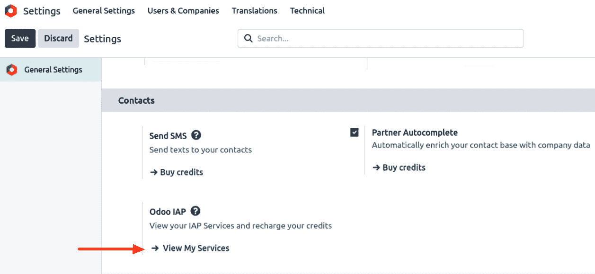
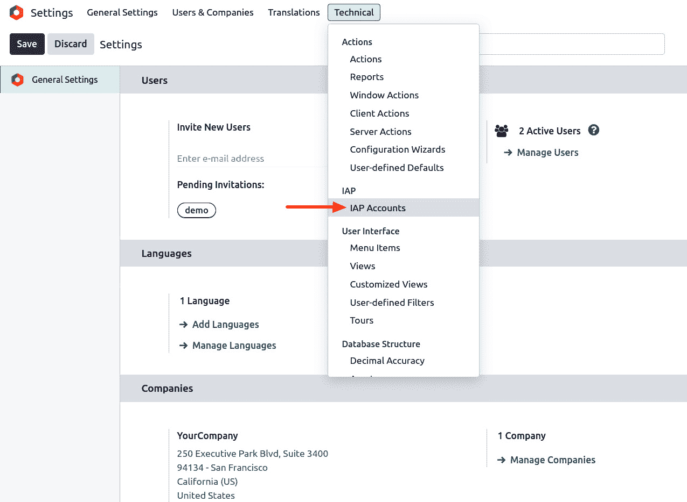
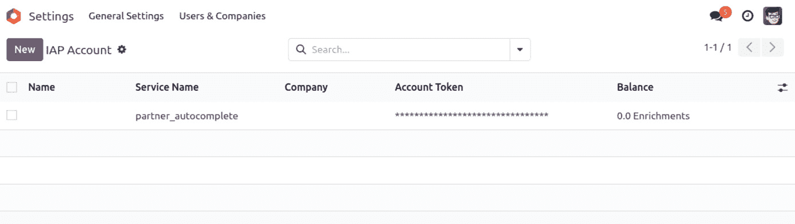
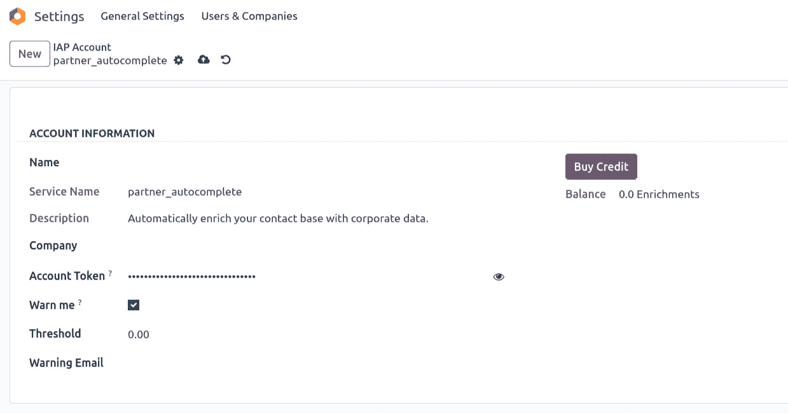
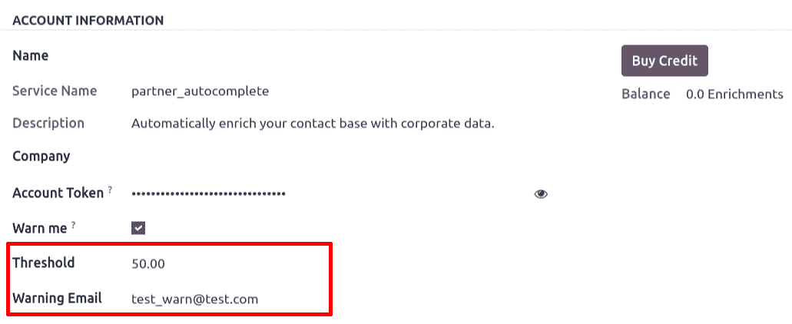

# 17

# Odoo 应用内购买

Odoo 自 11 版本起就内置了对**应用内购买**（**IAP**）的支持。IAP 用于提供无需复杂配置的持续服务。通常，从应用商店购买的应用只需客户支付一次费用，因为它们是普通模块，一旦用户购买并开始使用该模块，就不会再向开发者收费。相比之下，IAP 应用用于向用户提供服务，因此提供持续服务会有运营成本。在这种情况下，仅通过单次购买提供服务是不可能的。服务提供商需要一种按使用情况定期向用户收费的方式。Odoo 的 IAP 解决了这些问题，并提供了一种基于使用情况收费的方式。

**应用内购买**通常指的是在应用程序内购买附加功能、内容或服务的能力。然而，Odoo 具有高度的可定制性，尽管它可能没有专门的 IAP 模块，但您可以通过自定义开发或利用现有模块来创建类似的功能。

此功能允许用户通过获取额外的应用、功能或服务来扩展他们的 Odoo 实例的功能，而无需离开 Odoo 环境。以下是 Odoo IAP 的概述：

+   **应用市场集成**：Odoo 的 IAP 与 Odoo 应用商店或市场紧密集成。用户可以从广泛的选项中浏览、选择和购买额外的应用或模块。

+   **轻松访问扩展**：用户可以直接从他们的 Odoo 仪表板访问和评估可用的应用和扩展。这使得企业能够方便地扩展他们的 Odoo 实例的功能，而无需进行广泛的手动安装。

+   **试用版本**：市场中的某些应用可能提供试用版本或限时试用，允许用户在购买前测试应用的功能。这有助于用户做出明智的决定。

+   **简化许可**：Odoo IAP 简化了购买应用的许可和订阅管理。用户可以轻松订阅、续订或管理他们的许可，无需外部流程。

+   **一键安装**：购买应用后，用户通常只需在他们的 Odoo 实例中点击一次即可安装。这一简化流程减少了应用安装的复杂性。

+   **集中计费**：购买应用的计费和支付通常通过 Odoo 的中央计费系统管理，简化了应用获取的财务方面。

+   **应用更新**：Odoo IAP 通常包括购买应用的自动更新，确保用户能够访问最新的功能和安全更新。

+   **支持和文档**：许多通过 Odoo IAP 提供的应用都包含文档和支持选项，使得用户在需要时更容易获得帮助。

+   **与核心 Odoo 集成**：购买的应用程序与核心 Odoo 系统无缝集成，确保兼容性和统一的用户体验。

有几种使用 IAP 的用例，例如发送文件的传真服务或短信服务。在本章中，我们将解释 Odoo 将提供的合作伙伴自动完成服务。

在本章中，我们将涵盖以下主题：

+   IAP 概念

+   购买信用额

+   IAP 账户

+   IAP 门户

+   获取低信用额通知

# IAP 概念

IAP 包含了在使用 Odoo ERP 系统中此功能时必须理解的一些关键概念和元素。我们将探讨 IAP 流程中的一部分实体，并查看每个实体的作用以及它们如何结合完成 IAP 流程。

Odoo IAP 是使用 Odoo ERP 系统的企业的一项宝贵工具，因为它简化了扩展和定制其软件环境的过程。它提供了一个集中平台来管理额外的应用程序和模块，帮助组织优化其业务流程和运营。这一功能为 Odoo 生态系统增加了灵活性和可扩展性，使其成为更强大、适应性更强的解决方案，适用于各种企业和行业。

Odoo IAP 简化了从 Odoo 环境中直接发现、获取和安装额外应用程序和模块的过程。用户可以轻松扩展他们的 Odoo 系统功能，而无需离开平台。

应用程序开发者可以提供具有各种定价模式的产品，包括一次性购买、订阅计划和试用版。这种灵活性满足了不同客户的需求。

Odoo 的 IAP 功能显著增强了 Odoo ERP 系统的适应性和定制能力。它简化了应用获取的过程，鼓励开发者创新，并提供以用户为中心的体验，最终有助于平台的通用性和对各行各业企业价值的提升。

# Odoo IAP

IAP 简化了获取和管理 Odoo ERP 系统额外应用、模块和功能的过程。

## 它是如何工作的…

IAP 流程中有三个主要实体：客户、服务提供商和 Odoo 本身。以下是它们的描述：

+   **客户**是希望使用该服务的最终用户。为了使用该服务，客户需要安装服务提供商提供的应用程序。然后，客户需要根据他们的使用需求购买服务计划。有了这个，客户就可以立即开始使用该服务。这避免了客户的困难，因为不需要进行复杂的配置。相反，他们只需支付服务费用并开始使用即可。

+   **服务提供商**是想要销售服务的开发者（可能就是你，因为你是开发者）。客户会向提供商请求服务，此时服务提供商将检查客户是否购买了有效的计划以及客户的账户中是否有足够的信用额度。如果客户有足够的信用额度，服务提供商将扣除信用额度并向客户提供服务。

+   **Odoo**本身在这一过程中是一种经纪人。它提供了一个处理支付、信用额度、计划等的媒介。客户从 Odoo 购买服务信用额度，服务提供商在提供服务时提取这些信用额度。然后 Odoo 在客户和服务提供商之间架起桥梁，因此客户无需进行复杂的配置，服务提供商也无需设置支付网关、客户账户管理等。

在此过程中还有一个可选实体，即**外部服务**。在某些情况下，服务提供商会使用一些外部服务。然而，在这里我们将忽略外部服务，因为它们是次要的服务提供商。一个例子可能是短信服务。如果您向 Odoo 用户提供短信 IAP 服务，那么您（服务提供商）将内部使用短信服务。

### 购买信用额度

每个 IAP 服务都有自己的定价。客户必须从 IAP 服务提供商那里购买该服务。要检查您的服务，请转到**设置** | **Odoo IAP** | **查看我的服务**。

图 17.1 – 购买信用额度

前面的截图显示了您想要购买信用额度时看到的界面。

### IAP 账户

一旦您从提供商那里购买了信用额度，它就会存储在 IAP 账户中，这些账户将用于每个服务。默认情况下，IAP 账户对所有公司都是通用的，但可以配置为特定于公司。

要创建新的**IAP 账户**，激活开发者模式并转到**技术设置** | **IAP 账户**。

图 17.2 – IAP 账户

以下为**IAP** **账户**界面的截图：

图 17.3 – IAP 账户

### IAP 门户

IAP 门户是一个平台，您可以在其中查看您的 IAP 服务和它们的信用额度，并且可以通过点击**购买信用额度**按钮来充值，这将带您转到 IAP 门户。可以设置阈值，一旦达到阈值，将通过提到的电子邮件 ID 通知您。

图 17.4 – IAP 账户

### 获取低信用额度通知

在这里，我们可以设置**阈值**中的信用额度，这意味着我们必须设置一个最低信用额度限制和电子邮件地址。一旦达到限制，将自动向提到的电子邮件 ID 发送提醒，转到**设置** | **Odoo IAP** | **查看我的服务**。接下来，展开服务，检查信用额度，并相应地进行配置。

图 17.5 – 信用额度低通知

这就是 Odoo 中应用内购买的工作方式。在下一章中，我们将看到自动测试用例。
