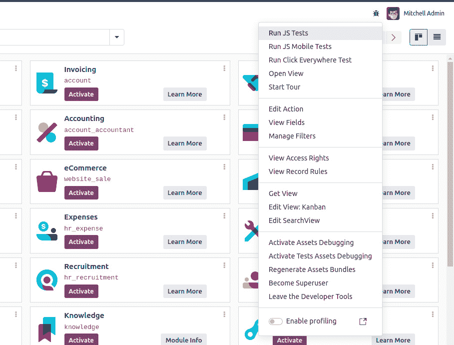
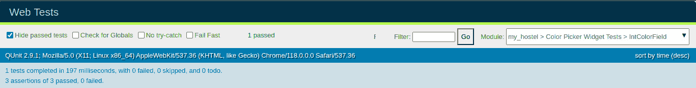
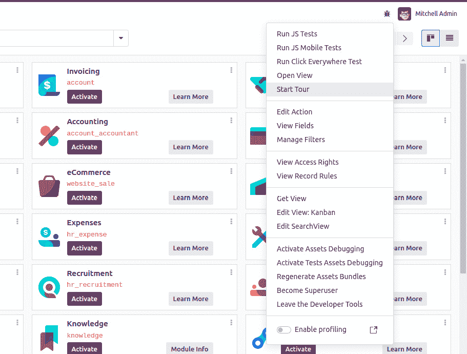
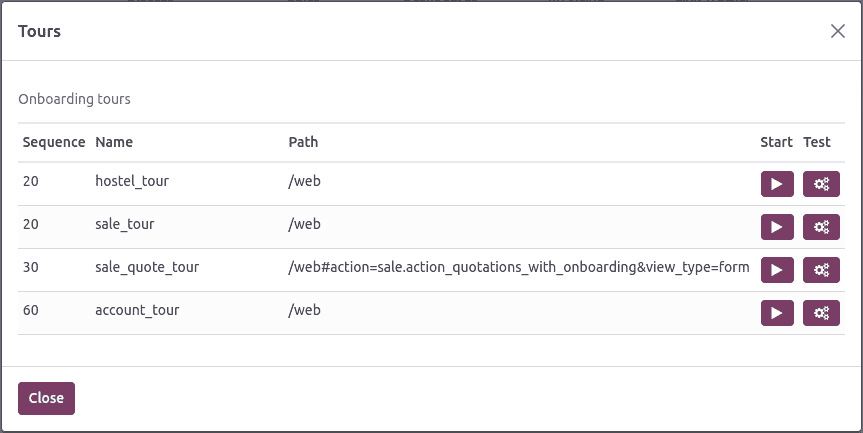
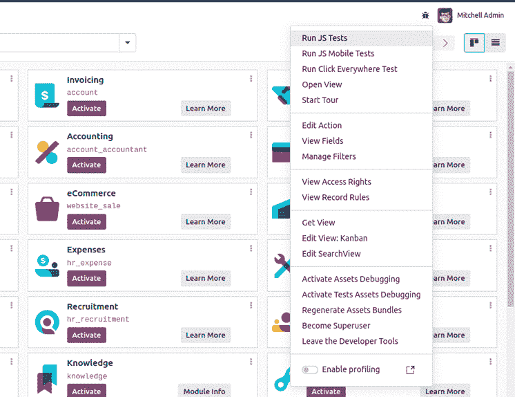
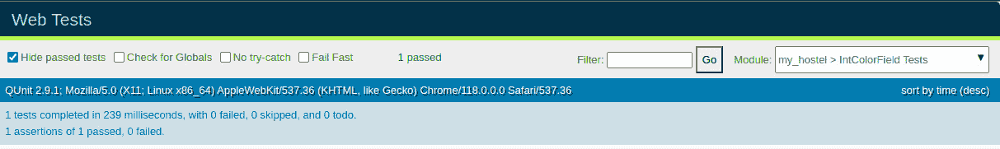

# 第十八章：自动化测试用例

当涉及到开发大型应用程序时，使用自动化测试用例是提高您模块可靠性的良好实践。这使得您的模块更加健壮。每年，Odoo 都会发布其软件的新版本，自动化测试用例在检测应用程序中的回归（可能由版本升级引起）方面非常有帮助。幸运的是，任何 Odoo 框架都附带不同的自动化测试工具。Odoo 包括以下三种主要的测试类型：

+   **一个 Python 测试用例**：用于测试 Python 业务逻辑

+   **一个 JavaScript QUnit 测试**：用于测试 Odoo 中的 JavaScript 实现

+   **旅游**：一个集成测试，用于检查 Python 和 JavaScript 是否能够正确地协同工作

在本章中，我们将涵盖以下配方：

+   添加 Python 测试用例

+   运行标记的 Python 测试用例

+   为客户端测试用例设置无头 Chrome

+   添加客户端 QUnit 测试用例

+   添加旅游测试用例

+   从 UI 运行客户端测试用例

+   调试客户端测试用例

+   为失败的测试用例生成视频/屏幕截图

+   为测试填充随机数据

# 技术要求

在本章中，我们将详细查看所有测试用例。为了在一个模块中涵盖所有测试用例，我们创建了一个小型模块。其 Python 定义如下：

```py
import logging
from odoo import api, fields, models
from odoo.exceptions import UserError
from odoo.tools.translate import _
_logger = logging.getLogger(__name__)
class HostelRoom(models.Model):
    _name = 'hostel.room'
    _description = "Information about hostel Room"
    name = fields.Char(string="Hostel Name", required=True)
    room_no = fields.Char(string="Room Number", required=True)
    other_info = fields.Text("Other Information",
                             help="Enter more information")
    description = fields.Html('Description')
    room_rating = fields.Float('Hostel Average Rating', digits=(14, 4))
    member_ids = fields.Many2many('hostel.room.member', string='Members')
    state = fields.Selection([
        ('draft', 'Unavailable'),
        ('available', 'Available'),
        ('closed', 'Closed')],
        'State', default="draft")
    @api.model
    def is_allowed_transition(self, old_state, new_state):
        allowed = [('draft', 'available'),
                   ('available', 'closed'),
                   ('closed', 'draft')]
        return (old_state, new_state) in allowed
    def change_state(self, new_state):
        for room in self:
            if room.is_allowed_transition(room.state, new_state):
                room.state = new_state
            else:
                message = _('Moving from %s to %s is not allowed') % (room.state, new_state)
                raise UserError(message)
    def make_available(self):
        self.change_state('available')
        return True
    def make_closed(self):
        self.change_state('closed')
class HostelRoomMember(models.Model):
    _name = 'hostel.room.member'
    _inherits = {'res.partner': 'partner_id'}
    _description = "Hostel Room member"
    partner_id = fields.Many2one('res.partner', ondelete='cascade')
    date_start = fields.Date('Member Since')
    date_end = fields.Date('Termination Date')
    member_number = fields.Char()
    date_of_birth = fields.Date('Date of birth')
```

这里给出的 Python 代码将帮助我们编写 Python 业务案例的测试用例。

对于 JavaScript 测试用例，我们从*第十五章*中“创建自定义小部件”的配方中添加了`int_color`小部件，*Web* *客户端开发*。

您可以从以下链接获取此初始模块：[`github.com/PacktPublishing/Odoo-17-Development-Cookbook-Fifth-Edition/tree/main/Chapter18/00_initial_module`](https://github.com/PacktPublishing/Odoo-17-Development-Cookbook-Fifth-Edition/tree/main/Chapter18/00_initial_module)。

# 添加 Python 测试用例

Python 测试用例用于检查业务逻辑的正确性。在*第五章*“基本服务器端开发”中，您看到了如何修改现有应用程序的业务逻辑。由于定制可能会破坏应用程序的功能，这使得这一点尤为重要。在本章中，我们将编写一个测试用例来验证更改宿舍房间状态的业务逻辑。

## 准备工作

我们将使用 GitHub 仓库中`Chapter18/00_initial_module`目录下的`my_hostel`模块。

## 如何操作...

按照以下步骤将 Python 测试用例添加到`my_hostel`模块中：

1.  添加一个新文件，`tests/__init__.py`，如下所示：

    ```py
    from . import test_hostel_room_state
    ```

1.  添加一个`tests/test_hostel_room_state.py`文件，然后添加测试用例，如下所示：

    ```py
    from odoo.tests.common import TransactionCase
    class TestHostelRoomState(TransactionCase):
        def setUp(self, *args, **kwargs):
            super(TestHostelRoomState, self).setUp(*args, **kwargs)
            self.partner_nikul = self.env['res.partner'].create({'name': 'Nikul Chaudhary'})
            self.partner_deepak = self.env['res.partner'].create({'name': 'Deepak Ahir'})
            self.member_ids = self.env['hostel.room.member'].create([
                {'partner_id': self.partner_nikul.id, 'member_number': '007'},
                {'partner_id': self.partner_deepak.id, 'member_number': '357'}])
            self.test_hostel_room = self.env['hostel.room'].create({
                'name': 'Hostel Room 01',
                'room_no': '1',
                'member_ids': [(6, 0, self.member_ids.ids)]
            })
        def test_button_available(self):
            """Make available button"""
            self.test_hostel_room.make_available()
            self.assertIn(self.partner_nikul, self.test_hostel_room.mapped('member_ids.partner_id'))
            self.assertEqual(
                self.test_hostel_room.state, 'available', 'Hostel Room state should changed to available')
        def test_button_closed(self):
            """Make closed button"""
            self.test_hostel_room.make_available()
            self.test_hostel_room.make_closed()
            self.assertEqual(
                self.test_hostel_room.state, 'closed', 'Hostel Room state should changed to closed')
    ```

1.  要运行测试用例，请使用以下选项启动 Odoo 服务器：

    ```py
    ./odoo-bin -c server.conf -d db_name -i my_hostel --test-enable
    ```

1.  现在，检查服务器日志。如果我们的测试用例运行成功，您将找到以下日志：

    ```py
    INFO test odoo.addons.my_hostel.tests.test_hostel_room_state: Starting TestHostelRoomState.test_button_available ...
    INFO test odoo.addons.my_hostel.tests.test_hostel_room_state: Starting TestHostelRoomState.test_button_closed ...
    INFO test odoo.modules.loading: Module my_hostel loaded in 0.31s (incl. 0.05s test), 240 queries (+33 test, +240 other)
    ```

如果测试用例失败或出现错误，你将看到 `ERROR` 日志而不是 `INFO`。

## 它是如何工作的...

在 Odoo 中，Python 测试用例被添加到模块的 `tests/` 目录中。Odoo 将自动识别此目录并在该文件夹下运行测试。

注意

你还需要在 `tests/__init__.py` 中列出你的测试用例文件。如果你不这样做，该测试用例将不会执行。

Odoo 使用 Python 的 `unittest` 进行 Python 测试用例。要了解更多关于 `unittest` 的信息，请参阅 [`docs.python.org/3.5/library/unittest.html`](https://docs.python.org/3.5/library/unittest.html)。Odoo 提供以下辅助类：

+   `Common` 类：这个类提供了测试用例的公共方法和设置。它包括在测试期间创建和管理数据库事务等功能。

+   `SavepointCase` 类：这个类扩展了 Common 类。

+   `SavepointCase` 在测试期间提供了处理保存点的额外功能。当你想在测试期间回滚对数据库所做的更改，确保每个测试从一个干净的状态开始时，这非常有用，

+   `TransactionCase` 类：这个类扩展了 `SavepointCase` 并提供了事务相关的功能。它有助于在测试期间管理数据库事务。

+   `HttpCase` 类：这个类用于测试 HTTP 请求和响应。它允许你模拟 HTTP 请求并测试响应。

+   `BaseCase` 类：这是 Odoo 中各种测试用例的基类。它提供了在不同测试场景中可重用的公共功能，

+   `SingleTransactionCase` 类：这个类扩展了 `TransactionCase` 并确保每个测试用例都在单个数据库事务中执行。这在需要完全隔离测试的场景中非常有用。

+   `FormCase` 类：这个类用于测试表单视图及其交互。它提供了模拟用户与表单视图交互的方法。

+   `FunctionCase` 类：这个类旨在测试服务器端 Python 函数。它有助于在 Odoo 框架中测试各种函数和方法，并包装在 `unittest` 中。

这些类简化了开发测试用例的过程。在我们的案例中，我们使用了 `TransactionCase`。现在，`TransactionCase` 在不同的事务中运行每个测试用例方法。一旦一个测试用例方法成功运行，事务将自动回滚。这意味着下一个测试用例将不会受到前一个测试用例所做的任何修改。

类方法从`test_`开始，被视为测试用例。在我们的例子中，我们添加了两个测试用例。这检查了改变宿舍房间状态的函数。`self.assertEqual`方法（Python 中的`assertEqual()`）是`unittest`库中的一个函数，用于单元测试中检查两个值的相等性。这个函数将接受三个参数作为输入，并返回一个布尔值，取决于`assert`条件。如果两个输入值相等，`assertEqual()`将返回`true`，否则返回`false`）用于检查测试用例是否成功运行。我们在对宿舍房间记录执行操作后检查了宿舍房间的状态。因此，如果开发者犯了一个错误，并且方法没有按预期改变状态，测试用例将失败。

重要信息

*请注意，* `setUp()` *方法将自动为每个运行的测试用例调用，因此，在这个菜谱中，我们添加了两个测试用例，以便* `setUp()` *将调用两次。根据这个菜谱中的代码，测试期间只会有一条宿舍房间记录，因为，在* `TransactionCase`* 中，每个测试用例都会回滚事务。

在 Python 中，文档字符串（docstring）是一种字符串字面量，它出现在模块、函数、类或方法定义的第一行。文档字符串用于提供关于代码片段功能的文档。它们作为内联文档的一种形式，可以使用各种工具访问，例如`help()`函数。这可以帮助检查特定测试用例的状态。

## 更多...

测试套件提供了以下额外的测试实用类：

+   `SingleTransactionCase`：通过这个类生成的测试用例将在单个事务中运行所有用例，因此一个测试用例所做的更改将在第二个测试用例中可用。这样，事务从第一个测试方法开始，只在最后一个测试用例结束时回滚。

+   `SavepointCase`：这与`SingleTransactionCase`相同，但在这个情况下，测试方法是在回滚的保存点内运行的，而不是在单个事务中运行所有测试方法。这是通过只生成一次测试数据来创建大型测试用例并使其更快的方法。在这里，我们使用`setUpClass()`方法生成初始测试数据。

# 运行标记的 Python 测试用例

当您使用`--test-enabled`模块名称运行 Odoo 服务器时，测试用例将在模块安装后立即运行。如果您想在所有模块安装后运行测试用例，或者如果您只想为单个模块运行测试用例，`tagged()`装饰器就是答案。

在这个菜谱中，我们将向您展示如何具体使用这个装饰器来塑造测试用例。需要注意的是，这个装饰器仅适用于类；它不会影响函数或方法。可以通过添加一个前缀减号（-）来修改标签，这将移除它们而不是添加或选择它们。例如，如果您想防止默认执行您的测试，您可以移除标准标签。

## 准备工作

对于这个菜谱，我们将使用上一道菜谱中的`my_hostel`模块。我们将修改测试用例的顺序。

## 如何操作...

按照以下步骤为 Python 测试用例添加标签：

1.  将`tagged()`装饰器（如下所示）添加到测试类中，以便在所有模块安装后运行它：

    ```py
    from odoo.tests.common import TransactionCase, tagged
    @tagged('-at_install', 'post_install')
    class TestHostelRoomState(TransactionCase):
        def setUp(self, *args, **kwargs):
            super(TestHostelRoomState, self).setUp(*args, **kwargs)
            self.partner_nikul = self.env['res.partner'].create({'name': 'Nikul Chaudhary'})
            self.partner_deepak = self.env['res.partner'].create({'name': 'Deepak Ahir'})
            self.member_ids = self.env['hostel.room.member'].create([
                {'partner_id': self.partner_nikul.id, 'member_number': '007'},
                {'partner_id': self.partner_deepak.id, 'member_number': '357'}])
            self.test_hostel_room = self.env['hostel.room'].create({
                'name': 'Hostel Room 01',
                'room_no': '1',
                'member_ids': [(6, 0, self.member_ids.ids)]
            })
        def test_button_available(self):
            """Make available button"""
            self.test_hostel_room.make_available()
            self.assertIn(self.partner_nikul, self.test_hostel_room.mapped('member_ids.partner_id'))
            self.assertEqual(
                self.test_hostel_room.state, 'available', 'Hostel Room state should changed to available')
        def test_button_closed(self):
            """Make closed button"""
            self.test_hostel_room.make_available()
            self.test_hostel_room.make_closed()
            self.assertEqual(
                self.test_hostel_room.state, 'closed', 'Hostel Room state should changed to closed')
    ```

1.  之后，按照以下方式运行测试用例，就像之前一样：

    ```py
    ./odoo-bin -c server.conf -d db_name -i my_hostel --test-enable
    ```

1.  现在，检查服务器日志。这次，您将在以下日志之后看到我们的测试用例日志，这意味着我们的测试用例是在所有模块安装之后运行的，如下所示：

    ```py
    INFO test odoo.modules.loading: Module my_hostel loaded in 0.21s, 240 queries (+240 other)
    INFO test odoo.modules.loading: Modules loaded
    INFO test odoo.service.server: Starting post tests
    INFO test odoo.addons.my_hostel.tests.test_hostel_room_state: Starting TestHostelRoomState.test_button_available ...
    INFO test odoo.addons.my_hostel.tests.test_hostel_room_state: Starting TestHostelRoomState.test_button_closed ...
    INFO test odoo.service.server: 2 post-tests in 0.04s, 36 queries
    INFO test odoo.tests.stats: my_hostel: 4 tests 0.04s 36 queries
    ```

在这些日志中，第一行显示加载了九个模块。第二行显示所有请求的模块及其依赖项都安装成功，第三行显示将开始运行标记为`post_install`的测试用例。

## 它是如何工作的...

默认情况下，所有测试用例都带有`standard`、`at_install`和当前模块的技术名称（在我们的案例中，技术名称是`my_hostel`）。因此，如果您不使用`tagged()`装饰器，您的测试用例将具有这三个标签。

在我们的案例中，我们希望在安装所有模块后运行测试用例。为此，我们在`TestHostelRoomState`类中添加了一个`tagged()`装饰器。默认情况下，测试用例具有`at_install`标签。因为这个标签，您的测试用例将在模块安装后立即运行；它不会等待其他模块安装。我们不希望这样，所以为了移除`at_install`标签，我们在标记函数中添加了`-at_install`。以`-`为前缀的标签将移除该标签。

通过在`tagged()`函数中添加`-at_install`，我们停止了模块安装后的测试用例执行。由于我们没有在此指定任何其他标签，因此测试用例不会运行。

因此，我们添加了一个`post_install`标签。这个标签指定了在所有模块安装完成后需要运行测试用例。

正如您所看到的，所有测试用例默认都带有`standard`标签。Odoo 将在您不希望始终运行特定测试用例而只想在请求时运行它的情况下，运行所有带有`standard`标签的测试用例。为此，您需要通过在`tagged()`装饰器中添加`-standard`来移除`standard`标签，并需要添加一个自定义标签，如下所示：

```py
@tagged('-standard', 'my_custom_tag')
class TestClass(TransactionCase):
...
```

所有非标准测试用例都不会在`--test-enable`选项下运行。要运行前面的测试用例，您需要使用`--test-tags`选项，如下所示（注意，在这里，我们不需要显式传递`--test-enable`选项）：

```py
./odoo-bin -c server.conf -d db_name -i my_hostel --test-tags=my_custom_tag
```

## 更多...

在测试用例的开发过程中，运行单个模块的测试用例非常重要。默认情况下，模块的技术名称会被添加为标签，因此您可以使用模块的技术名称与`--test-tags`选项一起使用。例如，如果您想为`my_hostel`模块运行测试用例，那么您可以像这样运行服务器：

```py
./odoo-bin -c server.conf -d db_name -i my_hostel --test-tags=my_hostel
```

这里给出的命令将在`my_hostel`模块中运行测试用例，但它仍然会根据`at_install`和`post_install`选项来决定顺序。

# 设置客户端测试用例的无头 Chrome

Odoo 使用无头 Chrome 来执行 JavaScript 和巡检测试用例，便于模拟最终用户环境。无头 Chrome 没有完整的 UI，使得 JavaScript 测试用例的执行无缝，确保了测试环境的连贯性。

## 如何操作...

您需要安装 Chrome 以启用 JavaScript 测试用例。在模块的开发中，我们将主要使用桌面操作系统。因此，如果您在系统上安装了 Chrome 浏览器，那么就没有必要单独安装它。您可以使用桌面 Chrome 运行客户端测试用例。请确保您的 Chrome 版本高于 Chrome 59。Odoo 还支持 Chromium 浏览器。

注意

无头 Chrome 客户端测试用例在 macOS 和 Linux 上运行良好，但 Odoo 不支持 Windows 上的无头 Chrome 测试用例。

当您想在生产服务器或服务器操作系统上运行测试用例时，情况会有所变化。服务器操作系统没有 GUI，因此您需要以不同的方式安装 Chrome。如果您使用的是基于 Debian 的操作系统，可以使用以下命令安装 Chromium：

```py
apt-get install chromium-browser
```

重要信息

*Ubuntu 22.04 服务器版默认未启用* `universe` *仓库。因此，安装* `chromium-browser` *可能会显示安装候选错误。要修复此错误，请使用以下命令启用`universe`仓库 –* `sudo` `add-apt-repository universe`*.*

Odoo 还使用`websocket-client` Python 库。要安装它，请使用以下命令：

```py
pip3 install websocket-client
```

现在，您的系统已准备好运行客户端测试用例。

## 它是如何工作的...

Odoo 使用无头 Chrome 进行 JavaScript 测试用例。这样做的原因是它在后台运行测试用例，因此也可以在服务器操作系统上运行。无头 Chrome 更喜欢在后台运行 Chrome 浏览器，而不打开 GUI 浏览器。Odoo 在后台打开一个 Chrome 标签页并开始在其中运行测试用例。它还使用**jQuery**的**QUnit**进行 JavaScript 测试用例。在接下来的几个菜谱中，我们将为我们的自定义 JavaScript 小部件创建一个 QUnit 测试用例。

对于测试用例，Odoo 在一个单独的进程中打开 Headless Chrome，因此要找出在该进程中运行的测试用例的状态，Odoo 服务器使用 WebSockets。`websocket-client` Python 库用于管理 WebSockets，以便从 Odoo 服务器与 Chrome 进行通信。

# 添加客户端 QUnit 测试用例

在 Odoo 中构建新的字段或视图非常简单。只需几行 XML，您就可以定义一个新的视图。然而，在底层，它使用了大量的 JavaScript。在客户端修改/添加新功能是复杂的，可能会破坏一些东西。大多数客户端问题都未被注意到，因为大多数错误只会在控制台中显示。因此，Odoo 使用 QUnit 测试用例来检查不同 JavaScript 组件的正确性。

QUnit 是一个主要用于客户端测试的 JavaScript 测试框架。它通常与测试 Web 应用程序中的 JavaScript 代码相关联，尤其是用于前端开发。QUnit 通常用于测试在浏览器环境中 JavaScript 函数、模块和组件的逻辑和行为。

## 准备工作

对于这个菜谱，我们将继续使用前一个菜谱中的 `my_hostel` 模块。我们将为 `int_color` 小部件添加一个 QUnit 测试用例。

## 如何操作...

按照以下步骤将 JavaScript 测试用例添加到 `int_color` 小部件：

1.  我们已经在我们的模块中使用了 JavaScript 实现了 `int_color` 小部件。

1.  将以下代码添加到 `/static/tests/colorpicker_tests.js` 中：

1.  创建一个 `beforeEach` 函数，在应用测试用例之前按字段加载数据：

    ```py
    /** @odoo-module */
    import { registry } from "@web/core/registry";
    import { session } from "@web/session";
    import { uiService } from "@web/core/ui/ui_service";
    import { makeView, setupViewRegistries} from "@web/../tests/views/helpers";
    import { click, getFixture, patchWithCleanup } from "@web/../tests/helpers/utils";
    const serviceRegistry = registry.category("services");
    QUnit.module("Color Picker Widget Tests", (hooks) => {
        let serverData;
        let target;
        hooks.beforeEach(async function (assert) {
            target = getFixture();
            serverData = {
                models: {
                    'hostel.room': {
                        fields: {
                            name: { string: "Hostel Name", type: "char" },
                            room_no: { string: "Room Number", type: "char" },
                            color: { string: "color", type: "integer"},
                        },
                        records: [{
                            id: 1,
                            name: "Hostel Room 01",
                            room_no: 1,
                            color: 1,
                        }, {
                            id: 2,
                            name: "Hostel Room 02",
                            room_no: 2,
                            color: 3
                        }],
                    },
                },
                views: {
                    "hostel.room,false,form": `<form>
                        <field name="name"/>
                        <field name="room_no"/>
                        <field name="color" widget="int_color"/>
                    </form>`,
                },
            };
            serviceRegistry.add("ui", uiService);
            setupViewRegistries();
        });
    ```

1.  为颜色选择器字段添加一个 `QUnit` 测试用例，如下所示：

    ```py
        QUnit.module("IntColorField");
        QUnit.test("factor is applied in IntColorField", async function (assert) {
            const form = await makeView({
                serverData,
                type: "form",
                resModel: "hostel.room",
            });
            assert.containsOnce(target, '.o_field_int_color');
            assert.strictEqual(target.querySelectorAll(".o_int_color .o_color_pill").length, 10, "Color picker should have 10 pills");
            await click(target.querySelectorAll(".o_int_color .o_color_pill")[3]);
            assert.strictEqual(target.querySelector('.o_int_color .o_color_4').classList.contains("active"), true, "Click on pill should make pill active");
        });
    });
    ```

1.  将以下代码添加到 `__manifest__.py` 中以将其注册到测试套件中：

    ```py
    'assets': {
    'web.qunit_suite_tests': [
        'my_hostel/static/tests/**/*',
    ],
     },
    ```

要运行此测试用例，请在终端中使用以下命令启动您的服务器：

```py
./odoo-bin -c server.conf -i my_hostel,web --test-enable
```

要检查测试是否成功运行，搜索以下日志：

```py
... INFO test odoo.addons.web.tests.test_js.WebSuite: console log: "Color Picker Widget Tests" passed 2 tests.
```

## 它是如何工作的...

在 Odoo 中，JavaScript 测试用例被添加到 `/static/tests/` 目录。在 *步骤 1* 中，我们添加了一个 `colorpicker_test.js` 文件用于测试用例。在该文件中，我们导入了用于 `serviceRegistry` 和 `setupViewRegistries` 以及 `makeView` 的注册表，因为我们在表单视图中创建了 `int_color` 小部件，所以为了测试小部件，我们需要表单视图。

`@web/../tests/helpers/utils` 将为我们提供构建 JavaScript 测试用例所需的测试工具。如果您不了解 JavaScript 的导入方式，请参考 *第十四章* 中的 *扩展 CSS 和 JavaScript 以用于网站* 菜谱，*CMS* *网站开发*。

Odoo 客户端测试用例是用 QUnit 框架构建的，这是 JavaScript 单元测试用例的 jQuery 框架。有关更多信息，请参阅[`qunitjs.com/`](https://qunitjs.com/)。`beforeEach`函数在运行测试用例之前被调用，这有助于初始化测试数据。`beforeEach`函数的引用由 QUnit 框架本身提供。

我们在`beforeEach`函数中初始化了一些数据。让我们看看这些数据如何在测试用例中使用。客户端测试用例在隔离（模拟）环境中运行，并且它不会连接到数据库，因此对于这些测试用例，我们需要创建测试数据。内部，Odoo 创建模拟服务器来模拟`serverData`属性作为数据库。因此，在`beforeEach`中，我们在`serverData`属性中初始化了我们的测试数据。`serverData`属性中的键被视为一个表，值包含有关字段和表行的信息。`fields`键用于定义表字段，`records`键用于表行。在我们的例子中，我们添加了一个包含三个字段（`name(char)`、`room_no(char)`和`color(integer)`）的`room`表。请注意，在这里，您可以使用任何 Odoo 字段，甚至是关系字段——例如，`{string: "M2o Field", type: "many2one", relation: 'partner'}`。我们还使用`records`键添加了两个房间记录。

然后，我们使用`QUnit.test`函数添加了测试用例。函数中的第一个参数是`string`，用于描述测试用例。第二个参数是需要添加测试用例代码的函数。此函数由 QUnit 框架调用，并传递断言实用工具作为参数。在我们的例子中，我们在`assert.expect`函数中传递了期望的测试用例数量。我们添加了两个测试用例，因此我们传递了`2`。

我们想在可编辑表单视图中添加`int_color`小部件到测试用例中，因此我们使用`makeView`创建了可编辑表单视图。`makeView`函数接受不同的参数，如下所示：

+   `resModel`是给定视图创建的模型的名称。所有模型都在`resModel`中以属性的形式列出。我们想为房间模型创建一个视图，所以在我们的例子中，我们使用了房间作为模型。

+   `serverData`是我们将在视图中使用的记录。`serverData`中的视图键是您想要创建的视图的定义。因为我们想测试`int_color`小部件，所以我们通过小部件传递了视图定义。请注意，您只能使用在模型中定义的字段。

+   `Type`：视图的类型。

在使用`int_color`小部件创建表单视图后，我们添加了两个测试用例。第一个用例用于检查 UI 上的颜色药丸数量，第二个测试用例用于检查点击后药丸是否正确激活。我们有来自 QUnit 框架断言实用工具的`strictEqual`函数。如果前两个参数匹配，`strictEqual`函数将通过测试用例。如果不匹配，它将使测试用例失败。

## 更多内容...

对于 QUnit 测试用例，还有一些其他的断言函数可用，例如`assert.deepEqual`、`assert.ok`和`assert.notOk`。要了解更多关于 QUnit 的信息，请参考其文档[`qunitjs.com/`](https://qunitjs.com/)。

# 添加游览测试用例

你现在已经看到了 Python 和 JavaScript 测试用例。这两个都在隔离环境中工作，并且它们之间不交互。为了测试 JavaScript 和 Python 代码之间的集成，使用游览测试用例。

## 准备工作

对于这个配方，我们将继续使用之前配方中的`my_hostel`模块。我们将添加一个游览测试用例来检查房间模型的流程。同时，请确保你已经安装了`web_tour`模块，或者已经将`web_tour`模块依赖项添加到清单中。

## 如何操作...

按照以下步骤为`rooms`添加游览测试用例：

1.  添加一个`/static/src/js/my_hostel_tour.js`文件，然后添加如下所示的游览：

    ```py
    /** @odoo-module **/
    import { _t } from "@web/core/l10n/translation";
    import { registry } from "@web/core/registry";
    import { stepUtils } from "@web_tour/tour_service/tour_utils";
    import { markup } from "@odoo/owl";
    registry.category("web_tour.tours").add("hostel_tour", {
        url: "/web",
        rainbowMan: false,
        sequence: 20,
        steps: () => [stepUtils.showAppsMenuItem(), {
        trigger: '.o_app[data-menu-xmlid="my_hostel.hostel_base_menu"]',
        content: markup(_t("Ready to launch your <b>Hostel</b>?")),
        position: 'bottom',
        edition: 'community',
    }
    ```

1.  为测试游览添加步骤：

    ```py
        trigger: '.o_app[data-menu-xmlid="my_hostel.hostel_base_menu"]',
        content: markup(_t("Ready to launch your <b>Hostel</b>?")),
        position: 'bottom',
        edition: 'enterprise',
    }, {
        trigger: '.o_list_button_add',
        content: markup(_t("Let's create new room.")),
        position: 'bottom',
    }, {
        trigger: ".o_form_view .o_field_char[name='name']",
        content: markup(_t('Add a new <b> Hostel Room </b>.')),
        position: "top",
        run: function (actions) {
        actions.text("Hostel Room 01", this.$anchor.find("input"));
    },
    }, {
        trigger: ".ui-menu-item > a",
        auto: true,
        in_modal: false,
    }, {
        trigger: ".breadcrumb-item:not(.active):first",
        content: _t("Click on the breadcrumb to go back to your Pipeline. Odoo will save all modifications as you navigate."),
        position: "bottom",
        run: function (actions) {
        actions.auto(".breadcrumb-item:not(.active):last");
    },
    },]});
    ```

1.  将`my_hostel_tour.js`文件添加到测试资源中：

    ```py
    'web.assets_backend': [
    'my_hostel/static/src/js/tours/my_hostel_tour.js',
    ],
    ```

1.  添加一个`/tests/test_tour.py`文件，并通过`HttpCase`运行游览，如下所示：

    ```py
    from odoo.tests.common import TransactionCase, tagged
    from odoo.tests import HttpCase
    @tagged('post_install', '-at_install')
    class TestUi(HttpCase):
        def test_01_hostel_tour(self):
            self.start_tour("/web", 'hostel_tour', login="admin")
    ```

为了运行测试用例，使用以下选项启动 Odoo 服务器：

```py
./odoo-bin -c server.conf -i my_hostel --test-enable
```

现在，检查服务器日志。如果我们的测试用例运行成功，你将在这里找到以下日志：

```py
...INFO test odoo.addons.my_hostel.tests.test_tour.TestroomUI: console log: Tour hostel_tour succeeded
```

## 它是如何工作的...

为了创建游览测试用例，你需要首先创建 UI 游览。如果你想了解更多关于 UI 游览的信息，请参考*第十五章*中的*使用游览改进欢迎流程*配方，*Web 客户端开发*。

在*步骤 1*中，我们注册了一个名为`hostel_tour`的新游览。这个游览与我们在*第十五章*中的*使用游览改进欢迎流程*配方中创建的游览完全一样。在*步骤 2*中，我们添加了游览的步骤。

在这里，与欢迎游览相比，我们有两个主要的变化。首先，我们在游览定义中添加了一个`test=true`参数；其次，我们添加了一个额外的属性，`run`。在`run`函数中，你必须编写执行通常由用户完成的操作的逻辑。例如，在游览的第四步中，我们要求用户输入房间标题。

为了自动化这一步骤，我们添加了一个`run`函数来设置`title`字段的值。`run`函数将动作实用工具作为参数传递。这提供了一些执行基本操作的快捷方式。其中最重要的如下：

+   `actions.click(element)`用于点击指定的元素。

+   `actions.dblclick(element)`用于在给定元素上执行双击操作。

+   `actions.tripleclick(element)`用于在给定元素上执行三击操作。

+   `actions.text(string)`用于设置输入值。

+   `actions.drag_and_drop(to, element)`用于拖放元素。

+   `actions.keydown(keyCodes, element)`用于在元素上触发特定的键盘事件。

+   `actions.auto()`是默认操作。当您在巡游步骤中不传递`run`函数时，将执行`actions.auto()`。这通常点击巡游步骤的触发元素。唯一的例外是输入元素。如果触发元素是`input`，巡游将在输入中设置默认值`Test`。这就是为什么我们不需要在所有步骤中添加`run`函数。

如果默认操作不够用，您可以手动执行整个操作。在下一个巡游步骤中，我们想要为颜色选择器设置一个值。请注意，我们使用了手动操作，因为默认值在这里没有帮助。因此，我们添加了带有基本 jQuery 代码的`run`方法来点击颜色选择器的第三个药丸。在这里，您将找到具有`this.$anchor`属性的触发元素。

默认情况下，注册的巡游会显示给最终用户，以改善入职体验。为了将它们作为测试用例运行，您需要在无头 Chrome 中运行它们。为此，您需要使用`HttpCase` Python 测试用例。这提供了`browser_js`方法，它打开 URL 并执行作为第二个参数传递的命令。您可以手动运行巡游，如下所示：

```py
odoo.__DEBUG__.services['web_tour.tour'].run('hostel_tour')
```

在我们的示例中，我们将巡游的名称作为`browser_js`方法中的参数传递。下一个参数用于在执行第一个命令之前等待给定对象就绪。`browser_js()`方法中的最后一个参数是用户名。此用户名将用于创建新的测试环境，并且所有测试操作都将代表此用户执行。

# 从 UI 运行客户端测试用例

Odoo 提供了一种从 UI 运行客户端测试用例的方法。通过从 UI 运行测试用例，您将能够看到测试用例的每个步骤的实际操作。这样，您可以验证 UI 测试用例是否完全按照您期望的方式工作。

## 如何操作...

您可以从 UI 运行`QUnit`测试用例和巡游测试用例。由于 Python 测试用例在服务器端运行，因此无法从 UI 运行。为了看到从 UI 运行测试用例的选项，您需要启用开发者模式。

### 从 UI 运行 QUnit 测试用例

点击 bug 图标以打开下拉菜单，如图所示。点击**运行 JS 测试**选项：



图 18.1 – 运行测试用例的选项

这将打开 QUnit 套件，并开始逐个运行测试用例，如下面的屏幕截图所示。默认情况下，它只会显示失败的测试用例。要显示所有通过测试用例，取消选中**隐藏通过测试**复选框，如下面的屏幕截图所示：



图 18.2 – QUnit 测试用例的结果

### 从 UI 运行导游

点击 bug 图标以打开下拉菜单，如以下屏幕截图所示，然后点击**开始导游**：



图 18.3 – 运行导游测试用例的选项

这将打开一个包含已注册导游列表的对话框，如以下屏幕截图所示。点击旁边的播放按钮以运行导游：



图 18.4 – 导游测试用例列表

如果您已启用测试资产模式，测试导游才会以列表形式显示。如果您在列表中找不到`hostel_tour`导游，请确保您已激活测试资产模式。

## 它是如何工作的...

QUnit 的 UI 由 QUnit 框架本身提供。在这里，您可以筛选模块的测试用例。您甚至可以为单个模块运行测试用例。通过 UI，您可以查看每个测试用例的进度，并且可以深入到测试用例的每个步骤。内部，Odoo 只是打开相同的 URL 在 Headless Chrome 中。

点击**运行导游**选项将显示可用导游的列表。通过点击列表上的播放按钮，您可以运行导游。请注意，当导游通过命令行选项运行时，它将在回滚事务中运行，因此导游期间所做的更改将在导游成功后回滚。然而，当导游从 UI 运行时，它就像用户操作一样工作，这意味着导游所做的更改不会回滚并保留在那里，因此请谨慎使用此选项。

# 调试客户端测试用例

开发复杂的客户端测试用例可能会很头疼。在这个菜谱中，您将学习如何在 Odoo 中调试客户端测试用例。我们不会运行所有测试用例，而只会运行一个。此外，我们还将显示测试用例的 UI。

## 准备工作

对于这个菜谱，我们将继续使用前一个菜谱中的`my_hostel`模块。

## 如何做...

按照以下步骤以调试模式运行测试用例：

1.  打开`/static/tests/colorpicker_test.js`文件，并更新和添加`makeView`函数，如下所示：

    ```py
    await makeView({
        type: "form",
        resModel: "hostel.room",
        serverData: {
            models: {
                'hostel.room': {
                    fields: {
                        name: { string: "Hostel Name", type: "char" },
                        room_no: { string: "Room Number", type: "char" },
                        color: { string: "color", type: "integer"},
                    },
                    records: [
                        {
                            id: 1,
                            name: "Hostel Room 01",
                            room_no: 1,
                            color: 1,
                        },
                        {
                            id: 2,
                            name: "Hostel Room 02",
                            room_no: 2,
                            color: 3
                        }
                    ],
                },
            },
            views: { },
        },
        arch: `
        <form>
            <field name="name"/>
            <field name="room_no"/>
            <field name="color" widget="int_color"/>
        </form>`,
    });
    ```

1.  检查`containtsN`函数中的`target`参数，如下所示：

    ```py
    assert.containsN(
                target,
                ".o_field_int_color",
                1,
                "Both records are rendered"
            );
        });
    });
    ```

打开开发者模式，点击顶部菜单中的 bug 图标以打开下拉菜单，然后点击**运行 JS 测试**。这将打开 QUnit 套件：



图 18.5 – 运行测试用例的选项

这将只运行一个测试用例，即我们的颜色选择器测试用例。



图 18.6 – 颜色选择器测试用例

## 它是如何工作的...

在*步骤 1*中，我们将`QUnit.test`替换为`QUnit.only`。这将只运行此测试用例。在测试用例的开发过程中，这可以节省时间。请注意，使用`QUnit.only`将阻止通过命令行选项运行测试用例。这只能在调试或测试时使用，并且只能在您从 UI 打开测试用例时使用，所以开发完成后别忘了将其替换回`QUnit.test`。

在我们的 QUnit 测试用例示例中，我们创建了表单视图来测试`int_color`小部件。如果您从 UI 运行 QUnit 测试用例，您会发现您无法在 UI 中看到创建的表单视图。从 QUnit 套件的 UI 中，您只能看到日志。这使得开发 QUnit 测试用例变得非常困难。为了解决这个问题，我们在`makeView`函数中使用了`debug`参数。在*步骤 2*中，我们在`makeView`函数中添加了`debug: true`。这将显示测试表单视图在浏览器中。在这里，您可以通过浏览器调试器定位**文档对象模型**（**DOM**）元素。 

警告

*在测试用例结束时，我们通过`destroy()`方法销毁视图。如果您已经销毁了视图，那么您将无法在 UI 中看到表单视图，因此为了在浏览器中看到它，在开发期间请删除该行。这将帮助您调试测试用例。*

在调试模式下运行 QUnit 测试用例可以帮助您非常容易和快速地开发测试用例。

# 为失败的测试用例生成视频/截图

Odoo 使用无头 Chrome，这开辟了新的可能性。从 Odoo 12 开始，您可以录制失败的测试用例的视频，也可以为它们截图。

## 如何操作...

为测试用例录制视频需要`ffmpeg`包：

1.  要安装此功能，您需要在终端中执行以下命令（请注意，此命令仅在基于 Debian 的操作系统上有效）：

    ```py
    apt-get install ffmpeg
    ```

1.  要生成视频或截图，您需要提供一个目录位置来存储视频或截图。

1.  如果您想生成测试用例的屏幕录像（视频），请使用`--screencasts`命令，如下所示：

    ```py
    --screenshosts command, like this:

    ```

    ./odoo-bin -c server.conf -i my_hostel --test-enable --screenshots=/home/pga/odoo_test/

    ```py

    ```

## 它是如何工作的...

为了为失败的测试用例生成截图/屏幕录像，您需要运行服务器，指定保存视频或图像文件的路径。当您运行测试用例时，如果测试用例失败，Odoo 将在指定的目录中保存失败的测试用例的截图/视频。

要生成测试用例的视频，Odoo 使用`ffmpeg`包。如果您尚未在服务器上安装此包，那么它将只保存失败的测试用例的截图。安装包后，您将能够看到任何失败的测试用例的`mp4`文件。

注意

为测试用例生成视频可能会消耗更多的磁盘空间，因此请谨慎使用此选项，并且仅在真正需要时使用。

请记住，截图和视频仅用于失败的测试用例，因此如果你想测试它们，你需要编写一个失败的测试用例。

# 为测试填充随机数据

到目前为止，我们已经看到了用于检测业务逻辑中错误或错误的测试用例。然而，有时我们需要用大量数据来测试我们的开发。生成大量数据可能是一项繁琐的工作。Odoo 提供了一套工具，可以帮助你为你的模型生成大量的随机数据。在这个菜谱中，我们将使用 `populate` 命令为 `hostel.room` 和 `hostel.room.member` 模型生成测试数据。

## 准备工作

对于这个菜谱，我们将继续使用前一个菜谱中的 `my_hostel` 模块。我们将添加 `_populate_factories` 方法，该方法将用于生成测试数据。

## 如何操作...

按照以下步骤为 `hostel.room` 模型生成数据：

1.  将 `populate` 文件夹添加到 `my_hostel` 模块中。同时，添加一个 `__init__.py` 文件，内容如下：

    ```py
    from . import hostel_data
    ```

1.  添加一个 `my_hostel/populate/hostel_data.py` 文件，然后添加以下代码以生成宿舍房间的数据：

    ```py
    import logging
    import random
    from odoo import models
    from odoo.tools import populate
    _logger = logging.getLogger(__name__)
    class RoomData(models.Model):
        _inherit = 'hostel.room.member'
        _populate_sizes = {'small': 10, 'medium': 100, 'large': 500}
        _populate_dependencies = ["res.partner"]
        def _populate_factories(self):
            partner_ids = self.env.registry.populated_models['res.partner']
            return [
                ('partner_id', populate.randomize(partner_ids)),
            ]
    class HostelData(models.Model):
        _inherit = 'hostel.room'
        _populate_sizes = {'small': 10, 'medium': 100, 'large': 500}
        _populate_dependencies = ["hostel.room.member"]
        def _populate_factories(self):
            member_ids = self.env.registry.populated_models['hostel.room.member']
            def get_member_ids(values, counter, random):
                return [
                    (6, 0, [
                        random.choice(member_ids) for i in range(random.randint(1, 2))
                    ])
                ]
            return [
                ('name', populate.constant('Hostel Room {counter}')),
                ('room_no', populate.constant('{counter}')),
                ('member_ids', populate.compute(get_member_ids)),
            ]
    ```

1.  运行此命令以生成宿舍的数据：

    ```py
    ./odoo-bin -c server.conf -d db_name -i my_hostel
    ./odoo-bin populate --models=hostel.room --size=medium -c server.conf -d db_name
    ```

这将为宿舍房间生成 100 个数据单位。生成数据后，进程将终止。要查看宿舍房间的数据，请运行不带 `populate` 参数的命令。

## 它是如何工作的...

在 *步骤 1* 中，我们将 `populate` 文件夹添加到 `my_hostel` 模块中。此文件夹包含填充测试数据的代码。

在 *步骤 2* 中，我们添加了填充房间数据的代码。为了生成随机数据，使用了 `_populate_factories` 方法。`_populate_factories` 方法返回用于模型字段的生成器，这些生成器将被用于生成随机数据。`hostel.room` 模型有必需的 `name` 和 `room_no` 字段，因此在我们的示例中，我们返回了这些字段的生成器。这个生成器将被用于生成 `hostel room` 记录的随机数据。我们使用了 `populate.constant` 生成器来生成名称字段；这将在我们迭代数据生成时生成不同的名称。

就像 `populate.constant` 一样，Odoo 提供了几个其他生成器来填充数据；以下是这些生成器的列表：

+   `populate.randomize(list)` 将从给定的列表中返回一个随机元素。

+   `populate.cartesian(list)` 与 `randomize()` 类似，但它将尝试包含列表中的所有值。

+   `populate.iterate(list)` 将遍历给定的列表，一旦所有元素都被遍历，它将根据 `randomize` 或随机元素返回。

+   `populate.constant(str)` 用于生成格式化的字符串。你也可以传递 `formatter` 参数来格式化值。默认情况下，格式化器是一个字符串格式化函数。

+   当你想根据你的函数计算一个值时，使用 `populate.compute(function)`。

+   `populate.randint(a,` `b)` 用于生成介于 `a` 和 `b` 参数之间的随机数。

这些生成器可以用来生成你所需的选择的测试数据。

另一个重要的属性是 `_populate_sizes`。它用于根据 `--size` 参数定义你想要生成的记录数量。它的值始终取决于业务对象。

在 *步骤 3* 中，我们生成了一个数据宿舍房间模型。为了填充测试数据，你需要使用 `--size` 和 `--model` 参数。内部，Odoo 使用 `_populate` 方法来生成随机记录。`_populate` 方法本身使用 `_populate_factories` 方法来获取记录的随机数据。`_populate` 方法将为 `--model` 参数中给出的模型生成数据，测试数据的数量将基于模型中 `_populate_sizes` 属性的值。根据我们的示例，如果我们使用 `–-size=medium`，将生成 100 个宿舍房间的数据。

注意

如果你多次运行 `populate` 命令，数据也将多次生成。小心使用这一点很重要；如果你在生产数据库中运行该命令，它将在生产数据库本身中生成测试数据。这是你想要避免的事情。

## 还有更多…

有时，你可能还想生成关系型数据。例如，对于房间，你可能还想要创建成员记录。为了管理这些记录，你可以使用 `_populate_dependencies` 属性：

```py
class RoomData(models.Model):
    _inherit = 'hostel.room.member'
    _populate_sizes = {'small': 10, 'medium': 100, 'large': 500}
    _populate_dependencies = ["res.partner"]
    . . .
```

这将在填充当前模型的数据之前填充依赖数据。一旦完成，你可以通过 `populated_models` 注册表访问已填充的数据：

```py
partner_ids = self.env.registry.populated_models['res.partner']
```

上一行将给出在为当前模型生成测试数据之前已填充的公司列表。
