# 第十九章：使用 Odoo.sh 进行管理、部署和测试

在 2017 年，Odoo 发布了 Odoo.sh，这是一种新的云服务。Odoo.sh 是一个平台，它使测试、部署和监控 Odoo 实例的过程尽可能简单。在本章中，我们将探讨 Odoo.sh 的工作原理，何时应该使用它而不是其他部署选项，以及其功能。

在本章中，我们将介绍以下菜谱：

+   探索 Odoo.sh 的一些基本概念

+   创建 Odoo.sh 账户

+   添加和安装自定义模块

+   管理分支

+   访问调试选项

+   获取您实例的备份

+   检查构建状态

+   所有 Odoo.sh 选项

重要注意事项

本章的编写假设您有 Odoo.sh 访问权限。这是一个付费服务，您需要订阅代码才能访问该平台。如果您是 Odoo 合作伙伴，您将获得免费的 Odoo.sh 订阅代码。否则，您需要从 [`www.odoo.sh/pricing`](https://www.odoo.sh/pricing) 购买。即使您没有订阅代码，您也可以阅读本章。它包含足够的截图，可以帮助您了解该平台。

印刷读者注意事项

为了方便印刷读者，本章中包含了一些显示窗口布局的图片，可能需要放大才能清晰查看。您可以通过以下链接访问包含高质量图片的图形包：[`packt.link/gbp/9781805124276`](https://packt.link/gbp/9781805124276)

# 探索 Odoo.sh 的一些基本概念

在这个菜谱中，我们将探讨 Odoo.sh 平台的一些功能。我们将回答一些基本问题，例如何时使用它以及为什么应该使用它。

## 什么是 Odoo.sh？

Odoo.sh 是一种云服务，它为平台提供了托管带有自定义模块的 Odoo 实例的能力。简单来说，它是 Odoo 的 **平台即服务**（**PaaS**）云解决方案。它与 GitHub 完全集成。任何包含有效 Odoo 模块的 GitHub 仓库都可以在几分钟内在 Odoo.sh 上启动。您可以通过并行测试多个分支来检查正在进行中的开发。一旦您将实例迁移到生产环境，您可以使用生产数据库的副本测试一些新功能；这有助于避免回归。它还会进行每日备份。使用 Odoo.sh，您可以高效地部署 Odoo 实例，即使您没有深厚的 DevOps 知识。它自动设置具有顶级配置的 Odoo 实例。请注意，Odoo.sh 是 Odoo 的企业版。您不能使用 Odoo 社区版，因为 Odoo.sh 只会加载企业版。

## 为什么会引入 Odoo.sh？

在 Odoo.sh 推出之前，有两种托管 Odoo 实例的方式。第一种是使用 Odoo Online，这是一个**软件即服务**（**SaaS**）云服务。第二种方法是本地部署选项，其中你需要自己托管一个 Odoo 实例并在服务器上配置它。现在，这两种选项都有优缺点。在 Odoo 在线选项中，你不需要配置或部署它，因为它是一个 SaaS 服务。然而，你无法在这个平台上使用自定义模块。另一方面，使用本地部署选项，你可以使用自定义模块，但你需要自己完成所有工作。你需要购买服务器，你需要配置数据库和 NGINX，你还需要设置邮件服务器、每日备份和安全。

因此，需要一个新选项，它提供了 Odoo 在线的简单性和本地部署选项的灵活性。Odoo.sh 让你可以在不进行复杂配置的情况下使用自定义模块。它还提供了额外的功能，例如测试分支、预发布分支和自动测试。

重要提示

在 Odoo 在线上无法进行定制并不完全正确。使用 Odoo Studio 和其他技术，你可以进行定制。然而，这种定制的范围非常有限。

## 你应该在什么时候使用 Odoo.sh？

如果你不需要定制化，或者只需要在 Odoo 在线中可能实现的小量定制，你应该选择 Odoo 在线。这将节省时间和金钱。如果你想进行大量的定制，并且已经与专家 DevOps 工程师团队合作，你可以选择本地部署选项。Odoo.sh 适合当你对 Odoo 定制化有良好了解但没有任何 DevOps 专业知识时。使用 Odoo.sh，你无需执行复杂的配置；你可以立即开始使用它，包括你的定制。它甚至还会配置邮件服务器。

当你使用敏捷方法开发大型项目时，Odoo.sh 非常有用。这是因为 On Odoo.sh，你可以并行测试多个开发分支，并在几分钟内将稳定开发部署到生产环境中。你甚至可以将测试开发与最终客户共享。

## Odoo.sh 有哪些功能？

Odoo 在 Odoo.sh 平台的发展上投入了大量时间，因此它功能丰富。让我们看看 Odoo.sh 的功能。请注意，Odoo 会不时添加新功能。在本节中，我提到了在撰写本书时可用的一些功能，但你可能还会发现一些其他功能：

+   **GitHub 集成**：这个平台完全集成了 GitHub。你可以在这里测试每个分支、拉取或提交。对于每个新的提交，都会自动拉取一个新的分支。它还会为新提交运行自动测试。你甚至可以直接从 Odoo.sh UI 创建/合并分支。

+   **Web 壳**：Odoo.sh 为当前构建（或生产服务器）提供浏览器中的 Web 壳。在这里，您可以查看所有模块和日志。

+   **Web 代码编辑器**：就像 Web 壳一样，Odoo.sh 在浏览器中提供了代码编辑器。在这里，您可以访问所有源代码，还可以获取当前构建的 Odoo 交互式 shell。

+   **SSH 访问**：通过注册您的公钥，您可以通过 SSH 连接到任何容器。

+   将`requirement.txt`文件放置在 GitHub 仓库的根目录下。目前，您只能安装 Python 包。无法安装系统包（apt 包）。

+   **服务器日志**：您可以从浏览器访问每个构建的服务器日志。这些日志是实时的，您也可以从这里过滤它们。

+   **自动化测试**：Odoo.sh 提供您自己的 runbot，您可以使用它来执行一系列自动化测试。每次您添加新的提交或新的开发分支时，Odoo.sh 都会自动运行所有测试用例并显示测试状态。您可以访问完整的测试日志，这有助于您在测试用例失败时找到问题。

+   **预发布和开发分支**：Odoo.sh 提供两种类型的分支：开发分支和预发布分支。在开发分支中，您可以使用演示数据测试正在进行中的开发。当开发完成，您想在将功能合并到生产之前测试功能时，使用预发布分支。预发布分支不加载演示数据；相反，它使用生产服务器的副本。

+   **邮件服务器**：Odoo.sh 自动为生产服务器设置邮件服务器。就像 Odoo 在线一样，Odoo.sh 不需要任何额外的邮件配置，尽管您可以使用自己的邮件服务器。

+   **邮件捕获器**：预发布分支使用您生产数据库的副本，因此包含有关您真实客户的信息。在这样一个数据库上进行测试可以使向真实客户发送邮件成为可能。为了避免这个问题，邮件功能仅在生产分支上激活。预发布和开发分支不会发送真实邮件；相反，它们使用邮件捕获器，这样您就可以在预发布和开发分支中测试和查看邮件。

+   **共享构建**：使用 Odoo.sh，您可以与客户共享开发分支，以便他们在将功能合并到生产之前进行测试。

+   **更快部署**：由于 Odoo.sh 完全集成 GitHub，您可以直接从浏览器通过简单的拖放操作合并和部署开发分支。

+   **备份和恢复**：Odoo.sh 为生产实例保留完整备份。您只需点击几下即可下载或恢复这些备份。请参阅“获取实例备份”菜谱以了解更多关于备份的信息。Odoo.sh 保留最多 3 个月的 14 个完整备份：每天 1 个，持续 7 天；每周 1 个，持续 4 周；每月 1 个，持续 3 个月。

+   **社区模块**：您可以通过几个简单的点击测试和安装任何社区模块。您还可以直接从应用商店测试免费模块。

# 创建 Odoo.sh 账户

在这个配方中，我们将创建一个 Odoo.sh 账户和一个用于自定义附加组件的空仓库。

## 准备工作

对于这个配方，您需要一个可以添加自定义模块的 GitHub 账户。您还需要一个 Odoo.sh 订阅代码。如果您是 Odoo 合作伙伴，您将获得免费的 Odoo.sh 订阅代码。否则，您需要从 [`www.odoo.sh/pricing`](https://www.odoo.sh/pricing) 购买。

## 如何操作...

按照以下步骤创建 Odoo.sh 账户：

1.  打开 [`www.odoo.sh`](https://www.odoo.sh) 并点击顶部菜单中的 **登录**。这将您重定向到 GitHub 页面：

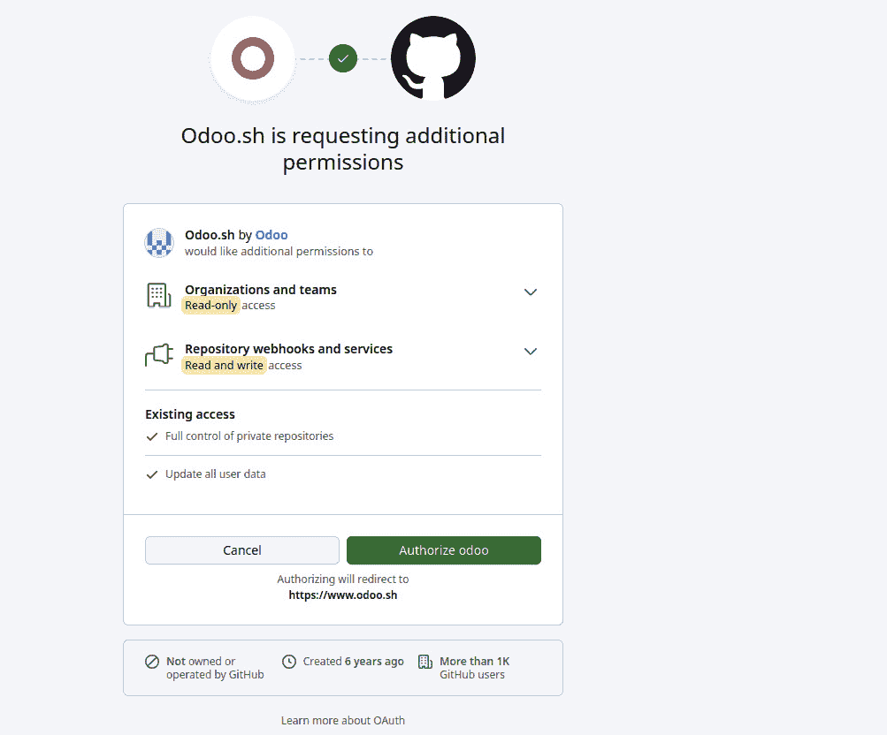

图 19.1 – GitHub 认证

1.  授权您的仓库，这将您重定向回 Odoo.sh。填写表单以部署实例：

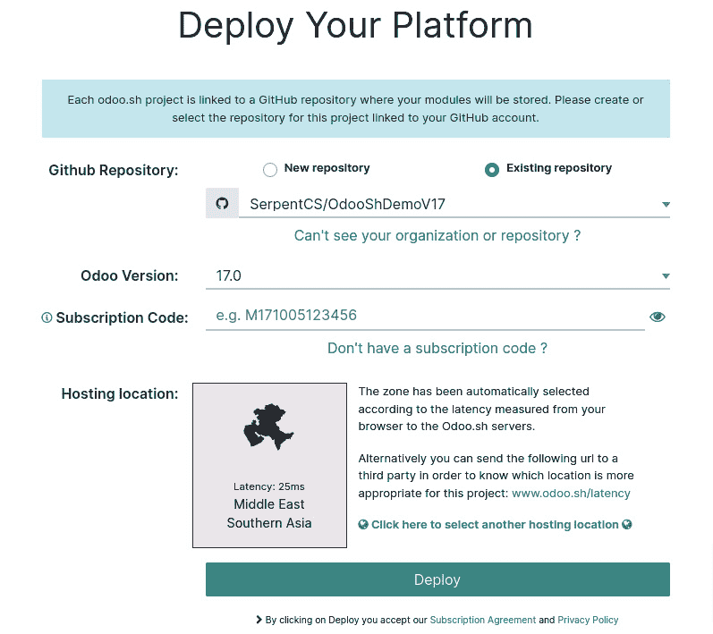

图 19.2 – 创建 Odoo.sh 实例

1.  这将部署实例，您将被重定向到 Odoo.sh 控制面板。等待构建状态成功；然后，您可以使用以下截图显示的 **连接** 按钮连接到您的实例：

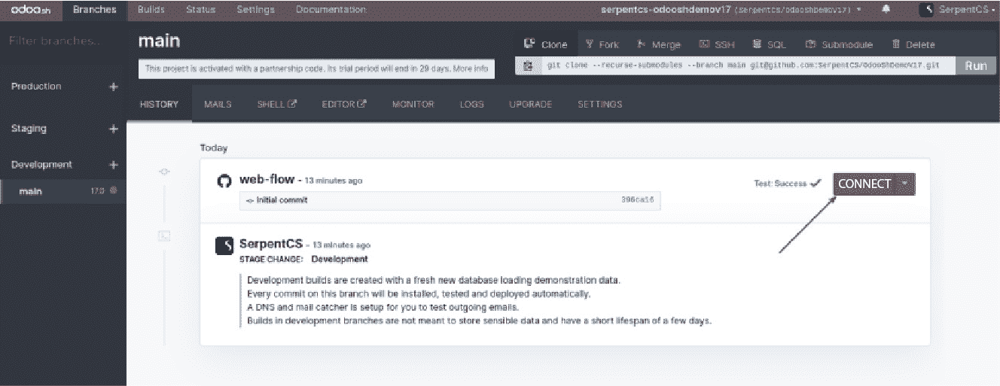

图 19.3 – 连接到开发实例

点击 **连接** 后，您将自动登录到您的实例。如果您是管理员，通过点击侧边的箭头按钮，您也可以以其他用户的身份连接。

## 它是如何工作的...

Odoo.sh 平台与 GitHub 集成。您需要完全授权 Odoo.sh 以便它可以访问您的仓库。Odoo.sh 还将创建 webhooks。GitHub webhooks 会在您的仓库中添加新的提交或分支时通知 Odoo.sh 平台。当您首次登录时，Odoo.sh 将您重定向到 GitHub。GitHub 将显示一个类似于 *步骤 1* 中的截图的页面，您需要提供对所有私有和公共仓库的访问权限。如果您不是仓库的所有者，您将看到向所有者请求访问权限的按钮。

在您授予 Odoo.sh 仓库访问权限后，您将被重定向回 Odoo.sh，在那里您将看到部署 Odoo 实例的表单。要创建新实例，您需要添加以下信息：

+   **GitHub 仓库**：在这里，您需要设置带有自定义模块的 GitHub 仓库。此仓库中的模块将可供 Odoo 实例使用。您将看到所有现有仓库的列表。您可以选择其中一个或创建一个新的。

+   **Odoo 版本**：选择您想要部署的 Odoo 版本。您可以从当前支持的 Odoo LTS 版本中选择。请确保您选择的版本与 GitHub 仓库中的模块兼容。在我们的示例中，我们将选择版本 14.0。

+   **订阅代码**：这是激活实例的代码。购买 Odoo.sh 计划后，您将通过电子邮件收到此代码；如果您是官方 Odoo 合作伙伴，您可以向 Odoo 申请此代码。

+   **托管位置**：在这里，您需要根据您的地理位置选择服务器位置。最近的服务器将提供最佳性能。托管位置下显示的延迟基于您的位置。因此，如果您为您的客户创建实例，而客户位于另一个国家，您需要选择一个接近客户位置且延迟较低的服务器位置。

+   一旦提交此表单，您的 Odoo 实例将被部署，您将被重定向到 Odoo.sh 控制面板。在这里，您将看到您的第一个构建。这需要几分钟时间，然后您将能够连接到您的 Odoo 实例。如果您检查左侧面板，您将看到生产和预发布部分没有分支，而开发部分只有一个分支。在接下来的几个食谱中，我们将看到您如何创建预发布和生产的分支。

## 还有更多...

目前，Odoo.sh 只支持 GitHub。其他版本控制系统，如 GitLab 和 Bitbucket，目前不支持。如果您想使用除 GitHub 之外的系统，您可以使用通过子模块链接到您实际仓库的中间 GitHub 仓库。根据 Odoo 官方的说法，未来 Odoo 将会增加对 GitLab 和 Bitbucket 的支持，但这目前不是优先事项。如果您想使用 GitLab 或 Bitbucket，这里提供的方法只是一个权宜之计。

# 添加和安装自定义模块

如我们之前在 *探索 Odoo.sh 的一些基本概念* 食谱中所述，在 Odoo.sh 平台上，您可以添加自定义 Odoo 模块。该平台与 GitHub 集成，因此向已注册的仓库添加新提交将在相应的分支中创建新的构建。在本食谱中，我们将在我们的仓库中添加一个自定义模块，并在 Odoo.sh 中访问该模块。

## 准备工作

在我们的示例中，我们将从 *第十八章* 的 *自动化测试用例* 中选择 `my_hostel` 模块。您可以在本食谱中添加任何有效的 Odoo 模块，但我们将在这里使用带有测试用例的模块，因为 Odoo.sh 平台将自动执行所有测试用例。为了简化，我们已将此模块添加到本书的 GitHub 仓库中，位于 `Chapter20/r0_initial_module/my_hostel`。

## 如何操作...

按照以下步骤将自定义模块添加到 Odoo.sh：

1.  在你的本地机器上获取 Git 仓库，将其中的 `my_hostel` 模块添加进去，然后执行以下命令将模块推送到 GitHub 仓库：

    ```py
    git add .
    git commit -am"Added my_hostel module"
    git push origin main
    ```

1.  在 Odoo.sh 中打开你的项目。在这里，你可以找到针对此提交的新构建。它将开始运行测试用例，你将看到以下屏幕：

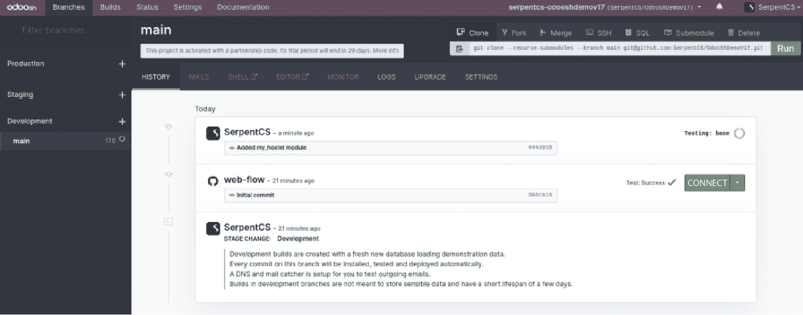

图 19.4 – 宿舍模块的新构建

1.  当你在 Odoo.sh 项目中拉取新的提交后，你将在右侧看到安装进度。等待安装完成，然后通过点击绿色的 `my_hostel` 模块来访问你的实例：

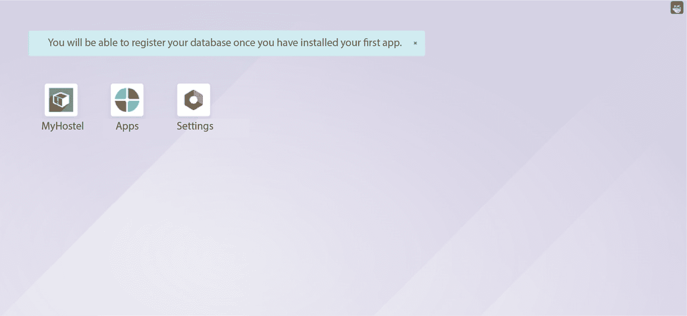

图 19.5 – 安装的宿舍模块

探索并测试 `my_hostel` 模块。请注意，这不是一个生产构建，所以你可以随意测试它。

## 工作原理...

在 *步骤 1* 中，我们将 `my_hostel` 模块上传到 GitHub 仓库。Odoo.sh 将通过 webhook 立即通知这些更改。然后，Odoo.sh 将开始构建一个新的实例。它将安装所有你的自定义模块及其依赖项。新的构建将自动为安装的模块执行测试用例。

重要提示

默认情况下，Odoo.sh 只会安装你的自定义模块及其依赖项。如果你想改变这种行为，你可以在全局设置的模块安装部分进行操作。我们将在接下来的几个菜谱中详细查看这些设置。

在 **历史** 选项卡中，你将能够看到分支的完整历史。在这里，你可以找到有关构建的一些基本信息。它将显示提交信息、作者信息和提交的 GitHub 链接。在右侧，你将获得构建的实时进度。请注意，开发部分中的构建将安装带有演示数据的模块。在接下来的几个菜谱中，你将详细了解生产、开发和预发布分支之间的差异。

构建成功后，你将看到一个按钮来连接实例。默认情况下，你将以管理员用户身份连接。通过 **连接** 作为下拉菜单，你可以登录为演示和门户用户。

## 更多内容...

Odoo.sh 将为每个新的提交创建一个新的构建。你可以从分支的 **设置** 选项卡更改此行为：

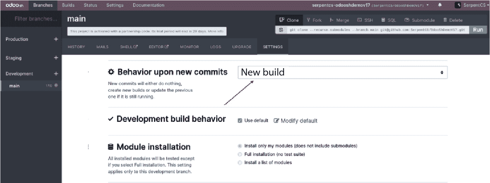

图 19.6 – 开发分支选项

在这里，你可以找到几个选项。其中之一是 **对新提交的行为**。它有三个可能的值：

+   **新构建**：此选项将为每个提交创建一个新的构建

+   **不执行任何操作**：此选项将忽略新的提交并执行任何操作

+   **更新上一个构建**：这将使用现有构建为新提交

**模块安装** 和 **测试套件** 选项可以帮助你控制测试套件。你可以使用这些选项禁用测试，也可以运行特定的测试用例。

# 管理分支

在 Odoo.sh 中，您可以创建多个开发分支和预发布分支，以及生产分支。在这个配方中，我们将创建不同类型的分支，并查看它们之间的区别。您将看到如何开发、测试和部署新功能的完整工作流程。

## 准备工作

访问[`www.odoo.sh/project`](https://www.odoo.sh/project)并打开我们在*创建 Odoo.sh 账户*配方中创建的项目。我们将为新的功能创建一个开发分支，然后在预发布分支中对其进行测试。最后，我们将该功能合并到生产分支中。

## 如何操作...

在这个配方中，我们将创建 Odoo.sh 中的所有类型的分支。目前，我们在生产环境中没有任何分支，所以我们将从创建一个生产分支开始。

### 创建生产分支

目前，我们在**开发**部分只有一个**主**分支。**主**分支的最后构建显示一个绿色的标签，上面写着**测试：成功**，这意味着所有自动测试用例都已成功运行。我们可以将这个分支移动到**生产**分支，因为测试用例的状态显示一切正常。为了将您的**主**分支移动到**生产**分支，您只需将**主**分支从**开发**部分拖动到**生产**部分，如下面的截图所示：

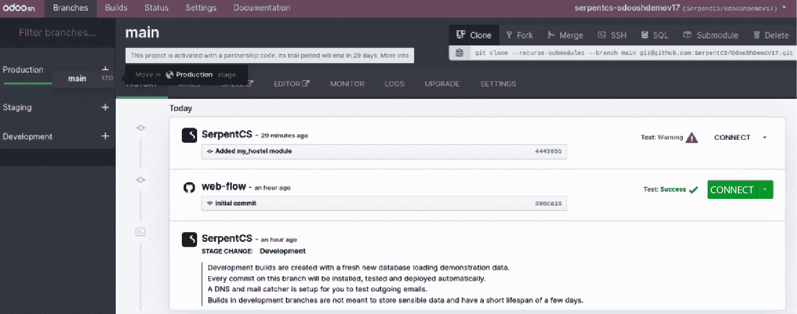

图 19.7 – 将主分支移动到生产环境

这将创建您的**生产**分支。您可以通过右侧的**连接**按钮访问**生产**分支。一旦您打开生产实例，您会注意到生产数据库中还没有安装任何应用程序。这是因为生产实例需要您或您的最终客户根据要求安装和配置操作。请注意，这是一个生产实例，因此为了保持实例运行，您需要输入您的企业订阅代码。

### 创建开发分支

您可以直接从浏览器创建开发分支。点击**开发**部分旁边的加号（**+**）按钮。这将显示两种类型的输入。一种是分叉的分支，另一种是开发分支的名称。填写完输入后，按*Enter*键。

这将通过分叉指定的分支来创建一个新的分支，如下面的截图所示：

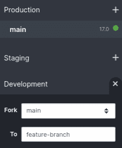

图 19.8 – 创建一个新的开发分支

重要提示

如果您不想从 UI 创建开发分支，您可以直接从 GitHub 创建。如果您在 GitHub 仓库中添加一个新的分支，Odoo.sh 将自动创建一个新的开发分支。

开发中的分支通常是新功能分支。例如，我们将在 `hostel.room` 模型中添加一个新字段。按照以下步骤在 `hostel` 模型中添加一个新 HTML 字段：

1.  在 `manifest` 文件中增加模块版本：

    ```py
    ...
    'version': '17.0.1.0.1',
    ...
    ```

1.  在模型中添加新字段：

    ```py
       other_info = fields.Text("Other Information",
                                help="Enter more information")
       description = fields.Html('Description')
       policy = fields.Html('Description')
    ```

1.  在宿舍的表单视图中添加一个 **策略** 字段：

    ```py
    <notebook>
    <page string="Policy">
               <field name="policy"/>
    </page>
    </notebook>
    ```

1.  在终端中执行以下命令以推送功能分支的更改：

    ```py
    git commit -am"Added room policy"
    git push origin feature-branch
    ```

这将在 Odoo.sh 上创建一个新的构建。构建成功后，您可以通过访问实例来测试这个新功能。您将在书籍的表单视图中看到一个新 HTML 字段。请注意，这个分支是开发分支，所以新功能仅适用于这个分支。您的生产分支没有改变。

### 创建预发布分支

一旦您完成开发分支并且测试用例成功，您可以将分支移动到 **预发布** 部分。这是预生产部分。在这里，新功能将使用生产数据库的副本进行测试。这将帮助我们找到可能在生产数据库中产生的问题。要从开发分支移动到 **预发布** 分支，只需将分支拖放到 **预发布** 部分即可：

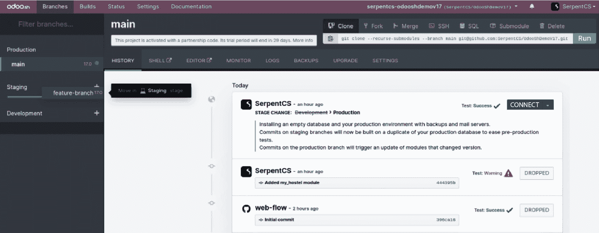

图 19.9 – 将开发分支移动到预发布

一旦您将 **开发** 分支移动到 **预发布** 部分，您就可以使用生产数据测试您的新开发。就像任何其他构建一样，您可以通过右侧的 **连接** 按钮访问 **预发布** 分支。唯一的区别是，在这种情况下，您将能够看到生产数据库的数据。在这里，只有当您从 **manifest** 中增加了模块版本时，您的开发模块才会自动升级。

重要提示

预发布分支将使用生产数据库的副本，因此预发布实例将包含真实客户及其电子邮件。因此，在预发布分支中，真实电子邮件被禁用，这样您在测试预发布分支中的新功能时就不会意外发送任何邮件。

如果您没有更改模块版本，您需要手动升级模块才能看到新功能的效果。

### 在生产分支中合并新功能

在您使用生产数据库（在预发布分支中）测试新开发之后，您可以将新开发部署到 **生产** 分支。就像以前一样，您只需要将 **预发布** 分支拖放到 **生产** 分支。这将合并新功能分支到主分支。就像 **预发布** 分支一样，只有当您从 **manifest** 中增加了模块版本时，您的开发模块才会自动升级。在此之后，新模块对最终客户可用：

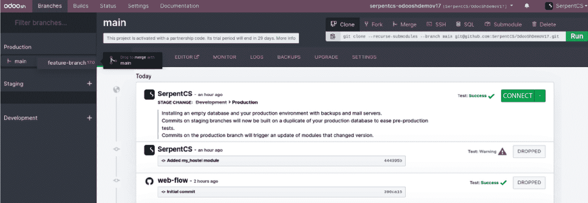

图 19.10 – 合并更改到生产

一旦你将暂存分支移至**生产**，将显示一个弹出窗口，包含两个选项：

+   **变基和合并**：这将创建一个拉取请求，并将其与变基合并，这样你将拥有线性历史。

+   **合并**：这将创建一个不带快速前进的合并提交：

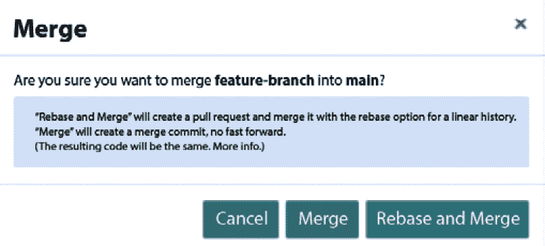

图 19.11 – 合并和变基以及合并按钮的显示弹出窗口

## 工作原理...

在前面的例子中，我们执行了完整的工作流程，将新功能部署到生产中。以下列表解释了 Odoo.sh 中不同类型分支的目的：

+   **生产分支**：这是最终客户使用的实际实例。只有一个生产分支，新功能旨在与这个分支合并。在这个分支中，邮件服务是活跃的，因此你的最终客户可以发送和接收电子邮件。此分支的每日备份也是活跃的。

+   **开发分支**：这种类型的分支显示了所有活跃的开发。你可以创建无限量的开发分支，并且分支中的每个新提交都会触发一个新的构建。这个分支中的数据库加载了演示数据。开发完成后，这个分支将被移动到暂存分支。在这些分支中，邮件服务是不活跃的。

+   **暂存分支**：这是工作流程的中间阶段。一个稳定的开发版本将被移动到暂存分支，与生产分支的副本进行测试。这是开发生命周期中的一个非常重要的步骤；可能会发生这样的情况，即开发分支中运行良好的功能在生产数据库中无法按预期工作。暂存分支给你提供了一个在部署到生产之前用生产数据库测试功能的机会。如果你在这个分支中发现任何开发问题，你可以将分支移回开发。暂存分支的数量基于你的 Odoo.sh 计划。默认情况下，你只有一个暂存分支，但如果你想的话，可以购买更多。

这是将新功能合并到生产中的完整工作流程。在下一个菜谱中，你将看到我们可以与这些分支一起使用的其他一些选项。

# 访问调试选项

Odoo.sh 提供不同的功能用于分析和调试目的。在这个菜谱中，我们将探索所有这些功能和选项。

## 如何操作...

我们将使用相同的 Odoo.sh 项目来完成这个菜谱。每个选项将在不同的部分中展示，并附有截图。

### 分支历史

你已经在之前的菜谱中看到了这个功能。**历史**标签页显示了分支的完整历史。你可以从这里连接到构建：

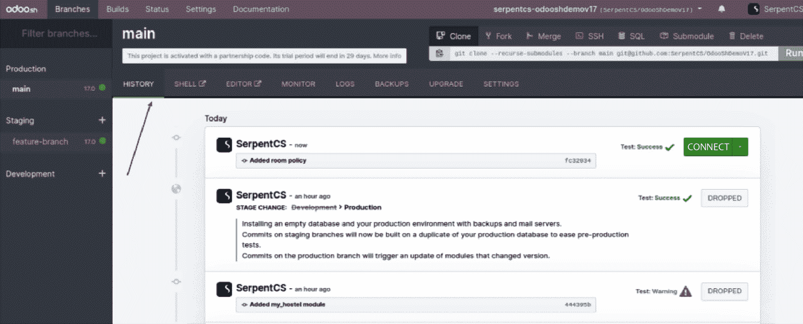

图 19.12 – 历史标签页

在**历史**标签页中，你可以看到对所选分支执行的所有过去操作。它将显示日志、合并、新提交和数据库恢复。

### 邮件捕捉器

预发布分支使用您生产数据库的副本，因此它包含有关您的客户信息。测试预发布分支可以向真实客户发送电子邮件。这就是为什么电子邮件仅在生产分支上激活。预发布和开发分支不会发送真实电子邮件。如果您想在将任何功能部署到生产之前测试电子邮件系统，您可以使用邮件捕捉器，您可以看到所有已发送电子邮件的列表。邮件捕捉器将在预发布和开发分支中可用。

邮件捕捉器将显示带有源和任何附件的电子邮件，如下一个截图所示：

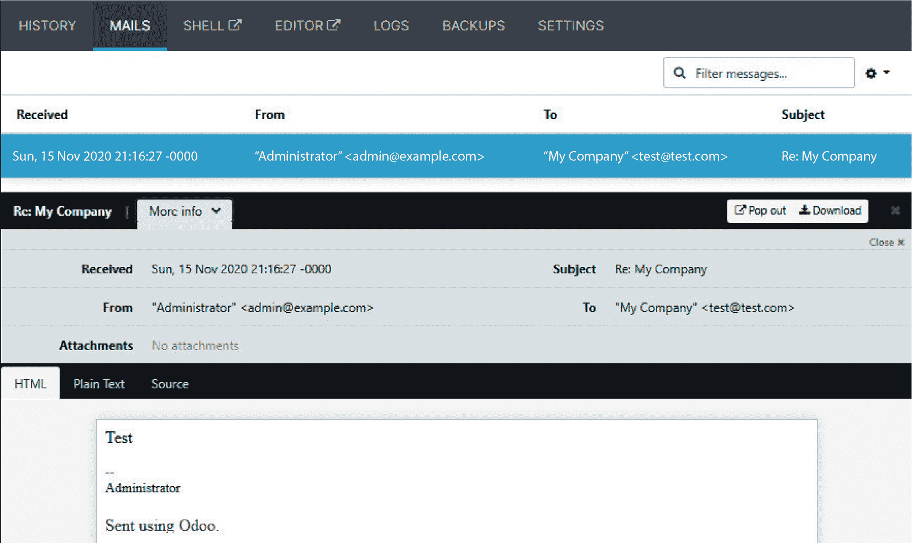

图 19.13 – 邮件捕捉器

在**MAILS**标签页中，您可以看到所有捕获的邮件及其所有附件的列表。请注意，**MAILS**标签页仅在预发布和开发分支中显示。

### 网页壳

从`pip`维护多个标签。

查看以下截图：您可以通过点击**SHELL**来访问网页壳：

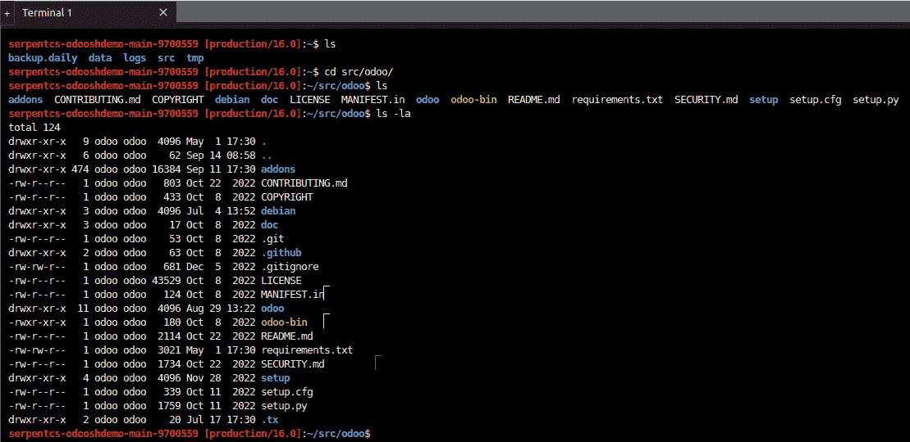

图 19.14 – 网页壳

使用 shell 访问，您可以在不同的目录之间导航并执行操作。您还可以使用`pip`命令安装 Python 包。

这是根目录的目录结构：

```py
.
├── data
│ ├── addons
│ ├── filestore
│ └── sessions
├── logs
├── Maildir
│ ├── cur
│ ├── new
│ └── tmp
├── repositories
│ └── git_github.com_pga-odoo_odooshdemov17.git
├── src
│ ├── enterprise
│ ├── odoo
│ ├── themes
│ └── user
└── tmp
```

这些目录可以根据分支类型而不同。例如，**Maildir**仅在预发布和开发分支中可用，因为它使用邮件捕捉器。

有时，您需要从 shell 重新启动服务器或更新模块。您可以在 shell 中使用以下命令来重新启动服务器：

```py
odoosh-restart
```

要更新模块，请在 shell 中执行给定的命令：

```py
odoo-bin -u my_hostel --stop-after-init
odoo-update my_hostel
```

之前的命令将更新**my_hostel**模块。如果您想更新多个模块，您可以通过逗号分隔模块名称。

### 代码编辑器

如果您不习惯使用 shell 访问，Odoo.sh 提供了一个功能齐全的编辑器。在这里，您可以访问 Python shell、Odoo shell 和终端。您还可以从这里编辑源代码，如所提供的截图所示。修改源代码后，您可以从顶部的**Odoo**菜单重新启动服务器：

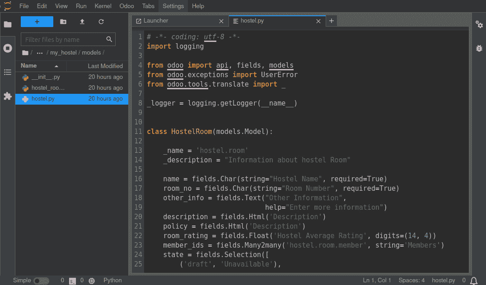

图 19.15 – 网页代码编辑器

如前一个截图所示，您将能够从编辑器更新文件。Odoo 将自动检测更改并重新启动服务器。请注意，如果您在数据文件中进行了更改，您将需要更新模块。

### 日志

在**LOGS**标签页中，您可以访问您实例的所有日志。您可以在不重新加载页面的情况下查看实时日志。您可以从这里过滤日志。这允许您从生产服务器中查找问题。以下是您可以在**LOGS**标签页中找到的不同日志文件列表：

+   `install.log`：这是在安装模块时生成的日志。所有自动化测试用例的日志都将位于此处。

+   `pip.log`：您可以使用`requirement.txt`文件添加 Python 包。在这个日志文件中，您将找到这些 Python 包的安装日志。

+   `odoo.log`：这是 Odoo 的正常访问日志。您将在这里找到完整的访问日志。您应该查看此日志以检查生产错误。

+   `update.log`：当您上传具有不同清单版本的模块时，您的模块会自动更新。此文件包含这些自动更新的日志。

看看下面的截图。这显示了生产分支的实时日志：

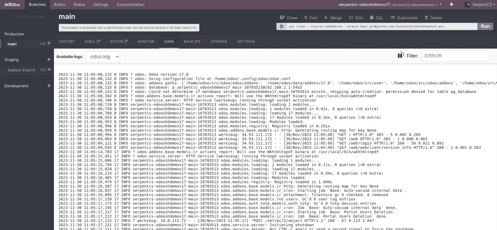

图 19.16 – 服务器日志

前面的截图显示日志是实时更新的，因此您将能够看到新日志而无需重新加载。此外，您还可以通过 UI 右上角的文本框搜索特定的日志。

## 更多...

模块顶部提供了一些常用的`git`命令，如下面的截图所示。您可以通过左侧的**运行**按钮来执行这些命令。这些命令不能编辑，但如果您想运行一个修改后的命令，您可以将其从这里复制，然后从 shell 中运行：

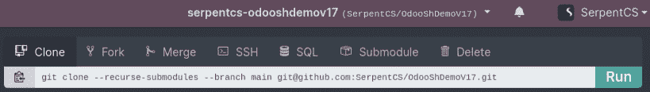

图 19.17 – Git 命令

您可以在 shell 中执行这些`git`命令以执行各种操作，如前一个截图所示。

# 获取实例的备份

备份对于生产服务器至关重要。Odoo.sh 提供了一个内置的备份功能。在这个菜谱中，我们将说明您如何从 Odoo.sh 下载和恢复备份。

## 如何操作...

在生产分支中，您可以从顶部的**备份**选项卡访问有关备份的完整信息。这将显示备份列表：


图 19.18 – 备份管理器

您可以通过顶部的按钮执行备份操作，例如下载转储、执行手动备份或从备份中恢复。数据库备份可能需要很长时间，因此它将在后台完成。当完成时，您将在顶部的铃铛图标上收到通知。

## 工作原理...

Odoo 会自动每天备份您的生产实例。每当您合并新的开发分支并更新模块时，Odoo 也会自动备份。您还可以使用顶部的按钮执行手动备份。

Odoo.sh 为 Odoo 生产实例保留总共 14 个完整的备份，最多 3 个月——每天 1 个，持续 7 天，每周 1 个，持续 4 周，每月 1 个，持续 3 个月。您可以从**备份**选项卡访问 1 个月的备份（一周中的所有 7 天和 4 个周备份）。

如果您从本地或在线选项迁移到 Odoo.sh，您可以使用**导入数据库**按钮导入您的数据库。如果您直接将数据库导入生产，可能会引起问题。为了避免这种情况，您应该首先将数据库导入预发布分支。

# 检查构建状态

每次您进行新的提交时，Odoo.sh 都会创建新的提交。它还会执行自动测试用例。为了管理所有这些，Odoo.sh 有自己的 runbot 版本。在这个菜谱中，我们将检查所有构建的状态。

## 如何操作...

点击顶部的**构建**菜单以打开构建列表。在这里，您可以查看所有分支及其提交的完整概述：

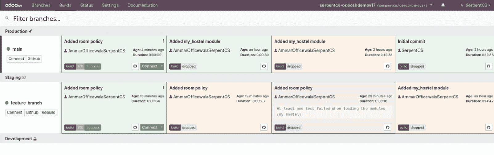

图 19.19 – 构建状态

通过点击**连接**按钮，您可以连接到实例。您可以通过分支的背景颜色查看构建的状态。

## 它是如何工作的...

在 runbot 屏幕上，您将获得对构建的额外控制。您可以从这里连接到之前的构建。不同的颜色显示了构建的状态。绿色表示一切正常；黄色表示警告，可以忽略，但建议您修复它；红色表示存在必须修复的严重问题，在将开发分支合并到生产之前。红色和黄色的分支在**连接**按钮附近显示感叹号图标**(!)**。当您点击它时，您将获得一个包含错误和警告日志的弹出窗口。通常，您需要搜索安装日志文件以找到错误或警告日志，但此弹出窗口将过滤其他日志，仅显示错误和警告日志。这意味着每次构建变为红色或黄色时，您都应该来这里修复错误和警告，然后再将它们合并到生产中。

不活跃的开发分支在几分钟后会销毁。通常，当您添加新的**提交**按钮时，将创建一个新的构建。如果您想在没有新提交的情况下重新激活构建；然而，您可以使用左侧的**重建**按钮。除了最后一个将保持活跃之外，预发布分支的构建也会在几分钟后被销毁。

## 更多内容...

您可以从顶部栏中的**状态**菜单看到您实例的整体统计信息。平台服务器持续监控。在**状态**屏幕上，您将看到服务器可用性的统计信息，它将自动从平台的监控系统中计算得出。它将显示包括服务器运行时间在内的数据。**状态**页面将显示服务器输入和输出数据。**状态**页面将显示以下信息：

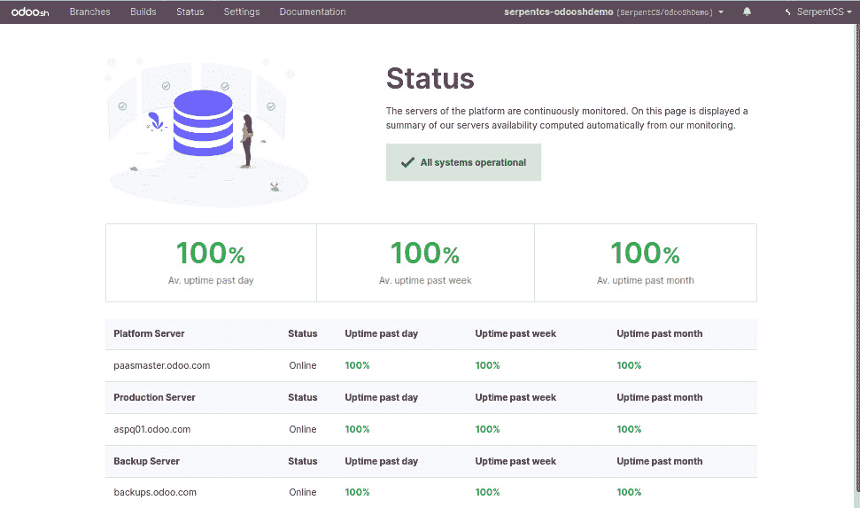

图 19.20 – Odoo.sh 状态

**状态**选项卡中显示的数据是从 Odoo.sh 使用的各种监控工具收集的。

# 所有 Odoo.sh 选项

Odoo.sh 在**设置**菜单下提供了一些额外的选项。在这个菜谱中，你将看到所有用于修改平台某些默认行为的重要选项。

## 准备工作

我们将使用之前菜谱中使用的相同的 Odoo.sh 项目。你可以从顶部栏中的**设置**菜单访问所有 Odoo.sh 设置。如果你看不到这个菜单，这意味着你正在访问一个共享项目，并且你没有管理员权限。

## 如何操作...

从顶部栏中的**设置**菜单打开**设置**页面。我们将在以下部分查看不同的选项。

### 项目名称

你可以通过此选项更改 Odoo.sh 项目的名称。输入框中的项目名称将用于生成你的生产 URL。开发构建也使用此项目名称作为前缀。在这种情况下，我们的功能分支的 URL 可能如下所示：[`serpentcs-odooshdemov17-feature-branch-260887.dev.odoo.com`](https://serpentcs-odooshdemov17-feature-branch-260887.dev.odoo.com)


图 19.21 – 更改项目名称

重要提示

此选项将更改生产 URL，但你无法去掉`*.odoo.com`。如果你想在一个自定义域上运行生产分支，你可以在生产分支的**设置**选项卡中添加你的自定义域。你还需要在你的 DNS 管理器中添加一个 CNAME 条目。

### 协作者

你可以通过添加协作者来共享项目。在这里，你可以通过 GitHub ID 搜索并添加一个新的协作者。协作者可以有**管理员**或**用户**访问权限。具有管理员访问权限的协作者将拥有完全访问权限（包括设置）。另一方面，具有用户访问权限的协作者将拥有受限的访问权限。他们将能够看到所有构建，但无法访问生产或预发布分支的备份、日志、shell 或电子邮件，尽管他们可以完全访问开发分支：

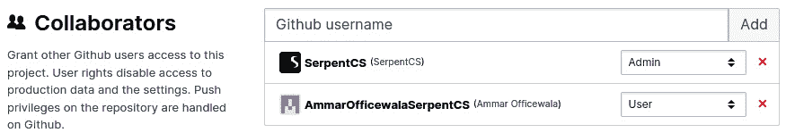

图 19.22 – 添加协作者

重要提示

你还需要将这些用户权限给予 GitHub 仓库，否则他们无法从浏览器中创建新的仓库。

### 公开访问

使用此选项，你可以与最终客户共享构建。这可以用于演示或测试目的。为此，你需要启用**允许公开****访问**复选框：

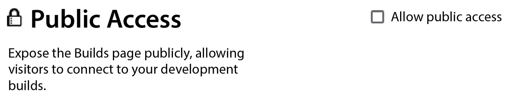

图 19.23 – 向构建提供公开访问

注意，预发布分支将使用与生产分支相同的密码。然而，在开发分支中，你将看到表中显示的用户名和密码：

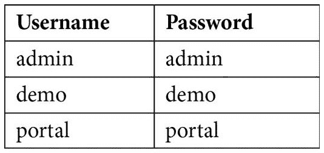

表 19.1

### 模块安装

在开发分支的**设置**标签页中，您将看到开发分支的**模块安装**选项。它提供了三个选项，如下面的截图所示：

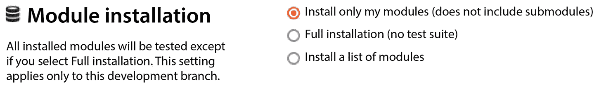

图 19.24 – 模块安装选项

默认情况下，它设置为**仅安装我的模块**。此选项将安装所有自定义模块及其依赖模块到新的开发分支中。对这些模块仅执行自动化测试用例。第二个选项是**完整安装**。此选项将安装所有模块并对所有这些模块执行自动化测试用例。最后一个选项是**安装模块列表**。在此选项中，您需要传递一个以逗号分隔的模块列表，例如**sales**、**purchases**和**my_hostel**。此选项将安装指定的模块及其依赖项。

此设置仅适用于开发构建。预发布构建会复制生产构建，因此它们将在生产分支中安装相同的模块，并对已更新版本清单的模块执行测试用例。

### 子模块

当您使用私有模块作为子模块时，会使用**子模块**选项。此设置仅适用于私有子模块；公共子模块无需任何问题即可正常工作。无法公开下载私有仓库，因此您需要向 Odoo.sh 提供仓库访问权限。按照以下步骤添加对私有子模块的访问权限：

1.  在输入框中复制您的私有子模块仓库的 SSH URL，然后点击**添加**。

1.  复制显示的**公钥**。

1.  将此**公钥**添加到 GitHub（Bitbucket 和 GitLab 上也有类似设置）的私有仓库设置中的部署密钥：

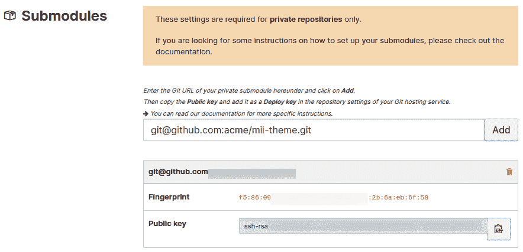

图 19.25 – 设置私有子模块

您也可以添加多个子模块，并且您也可以从这里删除子模块。

### 数据库工作者

您可以增加生产构建的工作者数量。当您有更多用户时，这很有用；通常，单个工作者可以处理 25 个后端用户或 5,000 名每日网站访客。这个公式并不完美；它可以根据使用情况而变化。此选项不是免费的，增加工作者数量会增加您的 Odoo.sh 订阅费用：

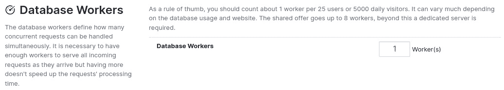

图 19.26 – 设置数据库工作者

这些**数据库工作者**是多线程的，每个工作者都能够处理 15 个并发请求。需要足够的工作者来处理所有到达的请求，但增加工作者数量并不会增加请求处理速度。它仅用于处理大量并发用户。

### 预发布分支

预发布分支用于在生产数据库上测试新的开发。默认情况下，Odoo.sh 为您提供一个预发布分支。如果您正在处理涉及大量开发者的大型项目，这可能在开发过程中成为瓶颈，因此您可以额外付费增加**预发布分支**的数量：


图 19.27 – 设置预发布分支

## 还有更多...

除了配置选项外，**设置**菜单还将显示一些与平台相关的统计信息。

### 数据库大小

本节将显示您生产数据库的大小。Odoo.sh 平台按每月每 GB USD 1 的费用计费数据库。此选项可以帮助您跟踪您的数据库。显示的数据库大小仅针对生产数据库；它不包括预发布和开发分支的数据库：


图 19.28 – 数据库大小

### Odoo 源代码修订

本节将显示 Odoo 项目的 GitHub 修订号。它将显示当前在平台上使用的社区、企业版和主题项目的修订哈希。此源代码将每周自动更新。此选项可以帮助您在本地机器上获得完全相同的版本。您也可以通过仓库中的 `git` 命令从网络外壳中检查此信息。
